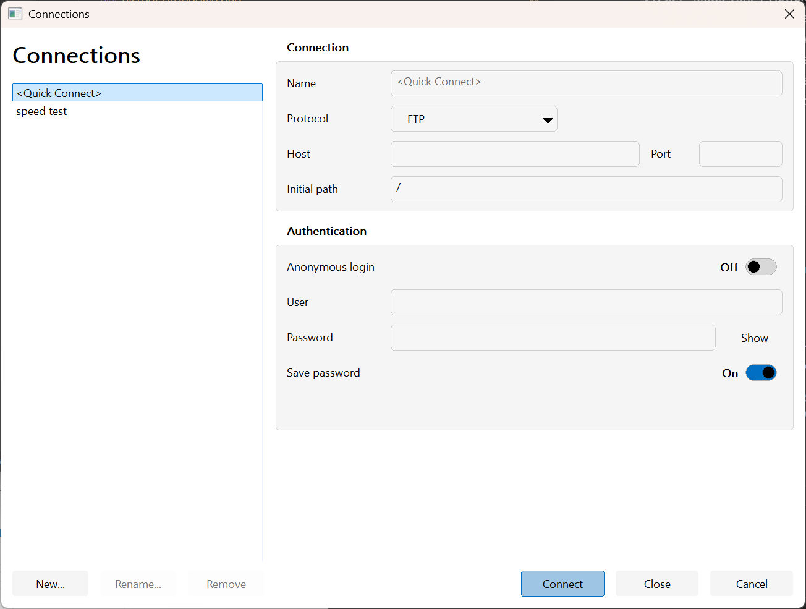

# Connections (Connection Manager)

Connection Manager is the recommended way to store and use remote connection profiles for:

- FTP / SFTP / SCP / IMAP
- S3 / S3 Table

It keeps non-secret fields in settings and stores secrets using Windows facilities (Credential Manager, with optional Windows Hello gating).

## Open Connection Manager

- **Commands → Connections Manager…**
- Type `nav:` or `@conn:` in the address bar (empty name opens the dialog)
- Type a protocol with no host (example: `sftp:`) to open the dialog filtered to that protocol

## Create and use a profile

1. Open Connection Manager.
2. Create a new connection (or edit an existing one).
3. Set the target (host/port/initial path) and authentication.
4. Choose whether to **Save password**.
5. Press **Connect**.

Then you can navigate to it later by name:

- `nav:MyServer`
- `@conn:MyServer`

### Quick Connect

Connection Manager exposes a `<Quick Connect>` entry that is **not persisted**. It is useful for one-off connections during the current app run.

## Security notes

- Saving a secret stores it via Windows Credential Manager.
- When **Require Windows Hello** is enabled, Windows Hello verification is performed before secrets are released.
- Some file-system plugins still have “defaults” in Preferences; those values may be stored as plain text. Prefer Connection Manager when possible.

## Not implemented yet

- Import/export connections
- Full SSH host-key management UI

