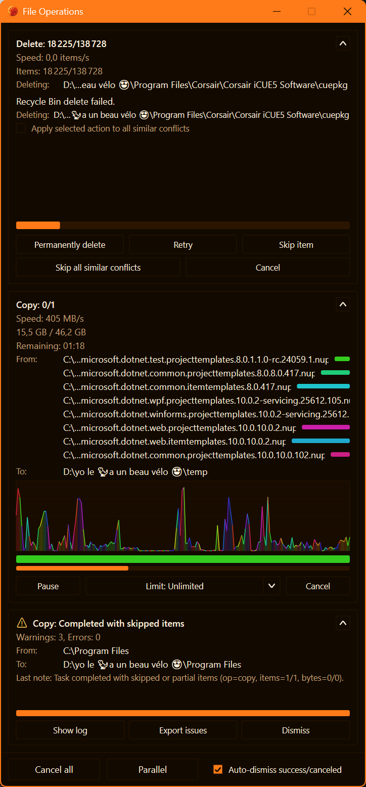
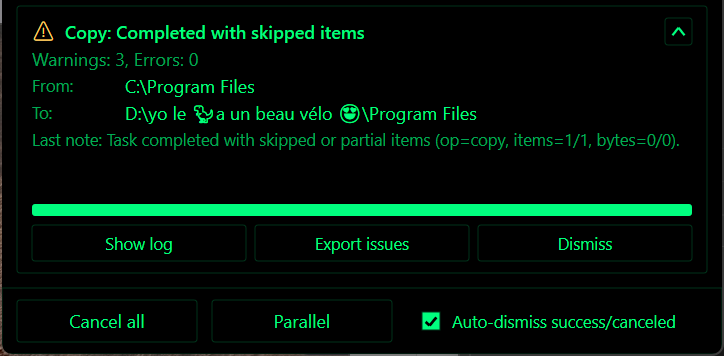

# File Operations (Copy/Move/Delete)

RedSalamander runs long operations in the background and shows progress in a dedicated UI.

## File Operations popup (UI tour)

The **File Operations** popup opens automatically when an operation starts. It is safe to keep using the main window while it runs. Closing the popup does **not** stop the operation.

### Footer controls (global)

- **Cancel all**: cancels every active/queued task (with confirmation).
- **Wait / Parallel**:
  - **Wait** runs tasks sequentially (a queue).
  - **Parallel** allows multiple tasks to run at the same time.
  - Switching to **Wait** while several tasks are active pauses all but one at the next safe checkpoint.
- **Auto-dismiss success/canceled**: when enabled, completed tasks that **succeeded** or were **canceled** are cleared automatically (and the popup closes when nothing remains).
- **Clear completed**: removes completed task summaries from the popup.

### Each task card

Each task shows:

- Operation type (**Copy**, **Move**, **Delete**) and status
- **From** / **To** (or **Deleting**) paths
- Item/byte progress and “Remaining” time (when totals are known)
- Current file activity (including multiple in-flight files when copying/moving)

Task controls (what you can click):

- **Collapse/expand**: hide/show details for that task.
- **Pause / Resume**: pauses the task at the next safe checkpoint.
- **Cancel**: cancels only that task.
- **Skip preflight**: skips the pre-calculation phase (see below).
- **Destination** *(Copy/Move, before the task starts)*: choose a different destination folder:
  - **Other panel** (the other pane’s current folder), or
  - a compatible folder from the destination pane’s **history**.
- **Speed Limit** *(Copy/Move)*: sets a per-task bandwidth cap:
  - **Unlimited**
  - presets: `1 MiB/s`, `5 MiB/s`, `10 MiB/s`, `50 MiB/s`, `100 MiB/s`, `1 GiB/s`
  - **Custom…** accepts inputs like `3KB`, `4MB`, `1GB` (optional `/s`).
- **Show log**: opens the diagnostics log for file operations (see Diagnostics below).
- **Export issues**: writes a per-task issues report file and opens it.
- **Dismiss**: removes a completed task summary from the popup.

### Preflight / “Calculating…”

Some tasks start with a pre-calculation (“preflight”) scan that computes totals (bytes/items). This improves:

- total progress accuracy
- ETA / remaining time accuracy

For very large trees, preflight can take time; **Skip preflight** starts the operation without those totals.

### Conflicts (overwrite, retry, skip…)

If a task hits a conflict (destination exists, read-only, access denied, sharing violation, disk full, path too long, etc.), the task shows an inline prompt with action buttons such as:

- **Overwrite**
- **Replace read-only**
- **Retry**
- **Skip item**
- **Skip all similar conflicts**
- **Cancel**

Use **Apply selected action to all similar conflicts** to avoid repeating the same decision for many items.

## Copy and move between panes

These commands use the **focused pane** as the source and the **other pane’s current folder** as the destination:

- **Copy to other pane**: `F5`
- **Move to other pane**: `F6`

Notes:

- If both panes point to the same effective destination folder, RedSalamander blocks the operation to prevent accidental self-copy/self-move.
- If source/destination are different file-system contexts, RedSalamander uses a cross-filesystem bridge (read → write). Read-only destinations will reject writes.

## Delete vs permanent delete

- **Delete** (`Del` / `F8`): deletes to the Recycle Bin when supported by the active file system.
- **Permanent Delete**: bypasses the Recycle Bin.
  - `Shift+F8`: permanent delete
  - `Shift+Del`: permanent delete **with confirmation**

## Progress UI: tasks, pause, cancel, mode, speed limit

When an operation starts, RedSalamander creates a **task** and shows it in the File Operations popup:

- Pre-calculation (“pre-calc”) may run first to compute totals (bytes/items). You can **Skip** pre-calc.
- Tasks can be **Paused** and **Canceled**.
- Execution mode can be:
  - **Wait** (sequential queue)
  - **Parallel** (multiple tasks run concurrently)
- Copy/Move tasks support a per-task **Speed Limit**.

## Diagnostics (logs and issue reports)

The popup can open/create files under your user profile:

- File-operations daily logs: `%LocalAppData%\\RedSalamander\\Logs\\FileOperations-YYYYMMDD.log`
- Per-task exported issue reports: `%LocalAppData%\\RedSalamander\\Logs\\FileOperations-Issues-Task...txt`

Advanced logging options (retention and verbosity) are in Preferences → **Advanced** → **File Operations**.

## Failed items / issues pane

When operations encounter errors, they can be reviewed in the issues UI:

- Toggle: **View → File Operations Failed Items** (default `Ctrl+J`)

## Clipboard copy/paste (Windows Explorer format)

Folder view supports a basic Explorer-style clipboard for **Windows paths**:

- `Ctrl+C`: copy selection to the clipboard as `CF_HDROP`
- `Ctrl+V`: paste into the current folder (copy)

Limitations:

- The clipboard format is Windows-path based, so it is primarily useful in the `file` file system.

## Drag & drop

- Dragging items **between panes** queues a task and uses the same progress UI as `F5`/`F6`.
- Dragging to external apps (Explorer, editors, …) uses standard Windows drop formats when possible.

## Not implemented yet

- Pack / Unpack
- Compare directories
- Find files
- “Copy path as text” helpers
- Selection dialog features (select/unselect/invert/restore, select same extension/name, …)

See: [Planned / TODO features](Todo.md)
