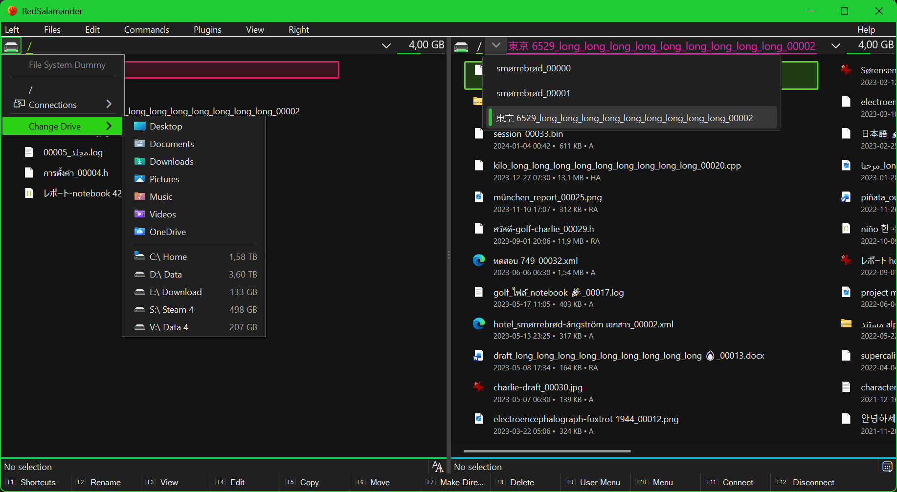
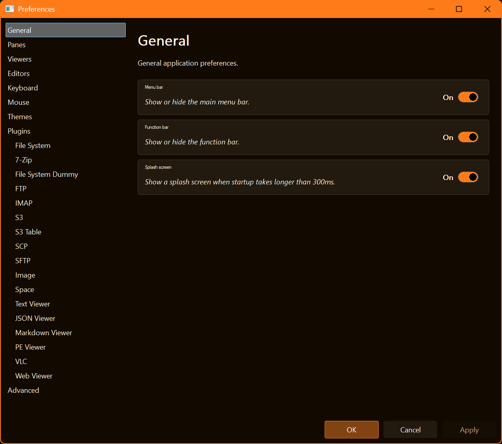

# Getting Started

## Installation

RedSalamander is shipped as `RedSalamander.exe` plus a `Plugins\` folder next to it.

Optional plugins may require extra runtimes:

- **ViewerWeb** (`ViewerWeb.dll`): requires the Microsoft Edge **WebView2 Runtime**.
- **VLC Viewer** (`ViewerVLC.dll`): requires **VLC media player** (or a configured VLC folder in Preferences).

## First run: the basics

RedSalamander opens as a **dual-pane** window:

- Each pane has a **Navigation bar** (path/breadcrumb) and a **Folder view** (items).
- Most commands apply to the **focused pane**.

### Essential shortcuts (defaults)

- `Tab`: switch pane focus
- `Ctrl+L` or `Alt+D`: focus the address bar (type a path/URI and press Enter)
- `Alt+F1` / `Alt+F2`: open Left/Right drive menu
- `F2`: rename
- `F3`: View (opens the configured viewer plugin)
- `Shift+F3`: open current folder in File Explorer
- `F5`: Copy to other pane
- `F6`: Move to other pane
- `F7`: Create folder
- `F8` or `Del`: Delete (to Recycle Bin when supported)
- `Shift+Del`: Permanent Delete (with confirmation)
- `F11`: Connect network drive
- `F12`: Disconnect network drive

Tip: use **Help → Display Shortcuts…** (or `F1`) to see the complete current bindings.

## Preferences

Open **View → Preferences…** to configure:

- Themes
- Viewer associations (extension → viewer)
- Plugins (enable/disable, configure, test)
- Keyboard shortcuts

## Not implemented yet

Some menu items and shortcuts are present but intentionally show a “Not implemented” message.

- See: [Planned / TODO features](Todo.md)
