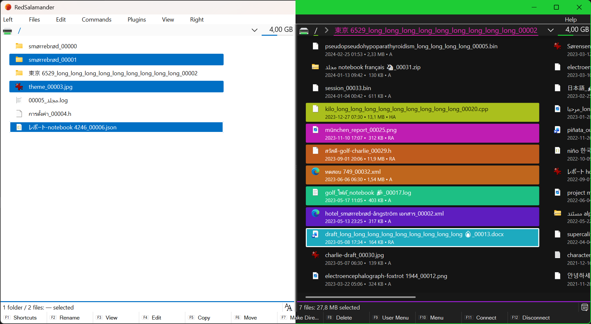

# Main Window & Panes

RedSalamander is a **dual-pane** file manager:

- **Left pane** and **Right pane** each have a Navigation bar + Folder view + optional Status bar.
- A splitter between panes controls the width ratio.
- Most commands apply to the **focused pane** (the one that currently has keyboard focus).

## Panes, focus, and “other pane”

Some actions explicitly use both panes:

- **Copy to other pane** (`F5`): copies the focused pane selection into the other pane’s current folder.
- **Move to other pane** (`F6`): moves the focused pane selection into the other pane’s current folder.

Pane management:

- **Swap panes** (`Ctrl+U`): swaps the left/right locations.
- **Maximize/Restore pane** (`Ctrl+F11`): temporarily zooms the focused pane.

## Navigation bar (per pane)

The Navigation bar is the strip above the Folder view:

- **Drive/Menu**: click to open the plugin-provided menu (drives, known folders, WSL, …).
- **Path/Breadcrumb**: shows the current location.
- **History**: opens the folder history dropdown.
- **Disk info** (when available): shows total/used/free and a usage bar; may provide disk actions.

## Folder view (per pane)

Folder view shows items in a grid with icons.

Common interactions:

- `Enter`: open a folder / execute a file (see [Navigation & Path Syntax](NavigationAndPaths.md))
- `F3`: open the focused file in a viewer (see [Viewers](Viewers.md))
- `F2`: rename
- `Alt+Enter`: properties
- `Shift+F10` or the **Apps/Menu** key: open the item context menu
- Mouse: multi-select, drag & drop

Display and sort (defaults):

- `Alt+2`: Brief mode
- `Alt+3`: Detailed mode
- `Ctrl+F2`: Sort = None
- `Ctrl+F3..F6`: Sort by Name/Ext/Time/Size

## Status bar (per pane)

The optional status bar shows:

- Selection summary (files/folders/bytes)
- A sort indicator you can click to open the Sort menu

Toggle:

- **View → Pane → Status Bar (Left/Right)**

## Function bar

The Function bar shows the current `F1..F12` bindings (including modifiers).

Toggle:

- **View → Function Bar**

## Menu bar

Toggle:

- **View → Menu Bar**

## Useful commands

- **Commands → Connect Network Drive…** (`F11`) / **Disconnect…** (`F12`) *(Win32 `file:` pane only)*
- **Commands → Command Shell**: opens a shell in the current location when possible
- **Commands → Open File Explorer → Current Folder** (`Shift+F3`)
