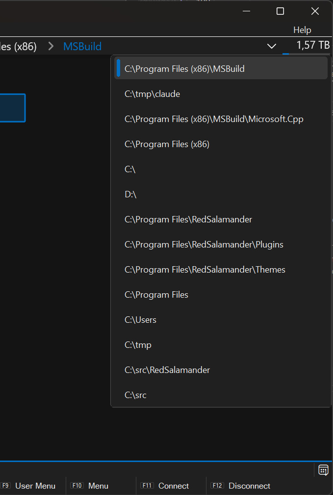

# Navigation & Path Syntax

## Quick navigation

- Focus the address bar: `Ctrl+L` or `Alt+D`
- Change directory (command): `Shift+F7`
- Open the drive/menu dropdown:
  - click the left section of the Navigation bar, or
  - `Alt+F1` (Left) / `Alt+F2` (Right)
- Open folder history: `Alt+Down` (or **Commands → Show Folders History**)
- Go up one directory: `Backspace` (also `Alt+Up`)
- Jump to a drive root: `Shift` + a drive letter (example: `Shift+C` → `C:\`)

## Paths you can type

The address bar accepts multiple forms. RedSalamander chooses the correct file system plugin based on prefixes.

### 1) Windows paths (local/UNC)

Examples:

- `C:\Windows\`
- `\\server\share\folder\`

### 2) `file:` URIs

Examples:

- `file:///C:/Windows/`
- `file://server/share/`

### 3) Plugin-prefixed paths

General form:

- `<shortId>:<pluginPath>`

Examples:

- `ftp:/`
- `s3:/`

Mounted file systems (archives, etc) use a mount context:

- `<shortId>:<instanceContext>|<pluginPath>`

Example:

- `7z:C:\Downloads\archive.zip|/`

### 4) Connection Manager routing (`nav:` / `@conn:`)

To navigate using a saved Connection Manager profile:

- `nav:<connectionName>`
- `@conn:<connectionName>`

Examples:

- `nav:MySftpServer`
- `@conn:WorkImap/INBOX/`

If the name is empty (`nav:` or `@conn:`), RedSalamander opens the Connection Manager dialog.

## Special shorthand

### 7z mount shorthand

When the `7z` file system is available, typing:

- `7z:<archivePath>`

is treated as “mount this archive and open its root”.

## History

RedSalamander maintains a shared “most recently used” folder history list and uses it for the History dropdown.

## Disk info actions (Win32 file system)

When browsing a local drive (the `file` file system), the disk info section can expose:

- **Disk Properties**
- **Disk Cleanup**

## Not implemented yet

- History **Back** / **Forward**
- Hot Paths
- Filter bar
- View options toggles (hidden/system/files/extensions/thumbnails/preview pane)

See: [Planned / TODO features](Todo.md)
