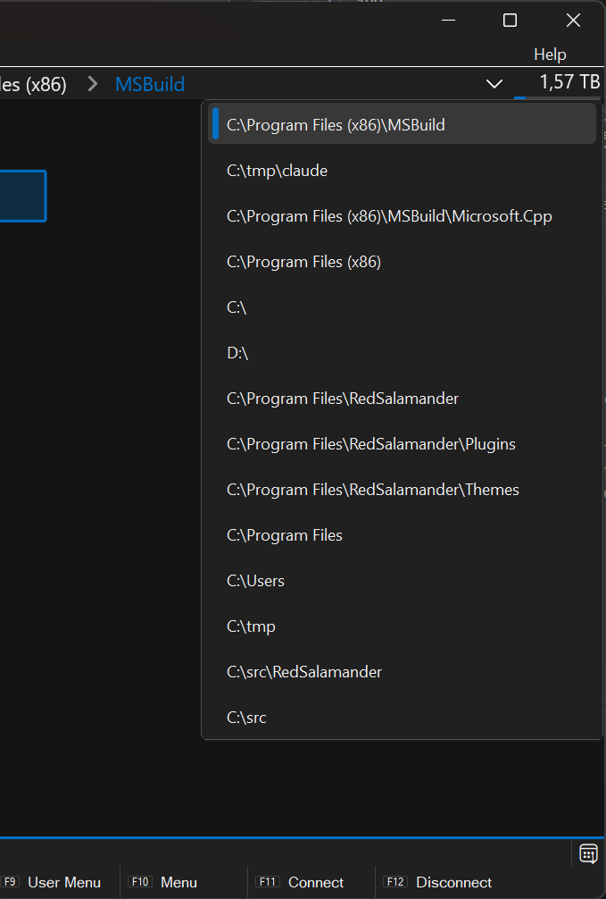

# Navigation & Path Syntax

## Quick navigation

- Focus the address bar: `Ctrl+L` or `Alt+D`
- Change directory (command): `Shift+F7`
- Open the drive/menu dropdown:
  - click the left section of the Navigation bar, or
  - `Alt+F1` (Left) / `Alt+F2` (Right)
- Open folder history: `Alt+F12` (or **Commands → Show Folders History**)
- History back / forward: `Alt+Left` / `Alt+Right`
- Hot Paths (bookmarked folders):
  - Go to Hot Path: `Ctrl+1` .. `Ctrl+0`
  - Set Hot Path to current folder: `Ctrl+Shift+1` .. `Ctrl+Shift+0`
  - Manage Hot Paths: `Shift+F9` (opens Preferences → Hot Paths)
- Go up one directory: `Backspace`
- Go to previous/next selected name: `Alt+Up` / `Alt+Down`
- Go to root directory: `Shift+Backspace`
- Jump to a drive root: `Shift` + a drive letter (example: `Shift+C` → `C:\`)
- Set path from other pane: `Ctrl+.`
- Filter current folder: `Ctrl+F12`

### Hot Paths details

Hot Paths are 10 bookmark slots for quick folder navigation:

- Slots map to digits: `Ctrl+1` = slot 1, …, `Ctrl+9` = slot 9, `Ctrl+0` = slot 10.
- Each slot can optionally have a **Label** (display name). If the label is empty, the path is shown.
- You can choose whether a slot appears in the **drive/menu dropdown** via **Preferences → Hot Paths → Show in Change Drive menu**.

## Paths you can type

The address bar accepts multiple forms. RedSalamander chooses the correct file system plugin based on prefixes.

### 1) Windows paths (local/UNC)

Examples:

- `C:\Windows\`
- `\\server\share\folder\`

### 2) `file:` URIs

Examples:

- `file:///C:/Windows/`
- `file://server/share/`

### 3) Plugin-prefixed paths

General form:

- `<shortId>:<pluginPath>`

Examples:

- `ftp:/`
- `s3:/`
- `s3table:/`

Mounted file systems (archives, etc) use a mount context:

- `<shortId>:<instanceContext>|<pluginPath>`

Example:

- `7z:C:\Downloads\archive.zip|/`

### 4) Connection Manager routing (`nav:` / `nav://` / `@conn:`)

To navigate using a saved Connection Manager profile:

- `nav:<connectionName>`
- `nav://<connectionName>`
- `@conn:<connectionName>`

Examples:

- `nav:MySftpServer`
- `nav://MySftpServer`
- `nav:MyAwsS3`
- `@conn:WorkImap/INBOX/`

If the name is empty (`nav:`, `nav://`, or `@conn:`), RedSalamander opens the Connection Manager dialog.

Advanced protocol-local forms also work:

- `<shortId>:/@conn:<connectionName>/...`
- `<scheme>://@conn/<connectionName>/...`

See: [Connections](Connections.md)

## Special shorthand

### 7z mount shorthand

When the `7z` file system is available, typing:

- `7z:<archivePath>`

is treated as “mount this archive and open its root”.

## History

RedSalamander maintains a shared “most recently used” folder history list and uses it for the History dropdown.

### Filter state in history

- When a pane filter is active, the filter state is persisted in folder history.
- Navigating to a history entry restores the saved filter state for that path.
- Entries that would restore an active filter display a small filter icon in the history list.

## Disk info actions (Win32 file system)

When browsing a local drive (the `file` file system), the disk info section can expose:

- **Disk Properties**
- **Disk Cleanup**

The disk info text and usage bar are also visible in the navigation bar:

## Not implemented yet

- Filter bar (always-visible)
- Additional view options toggles (file extensions, thumbnails, preview pane, navigation bar)

See: [Planned / TODO features](Todo.md)
