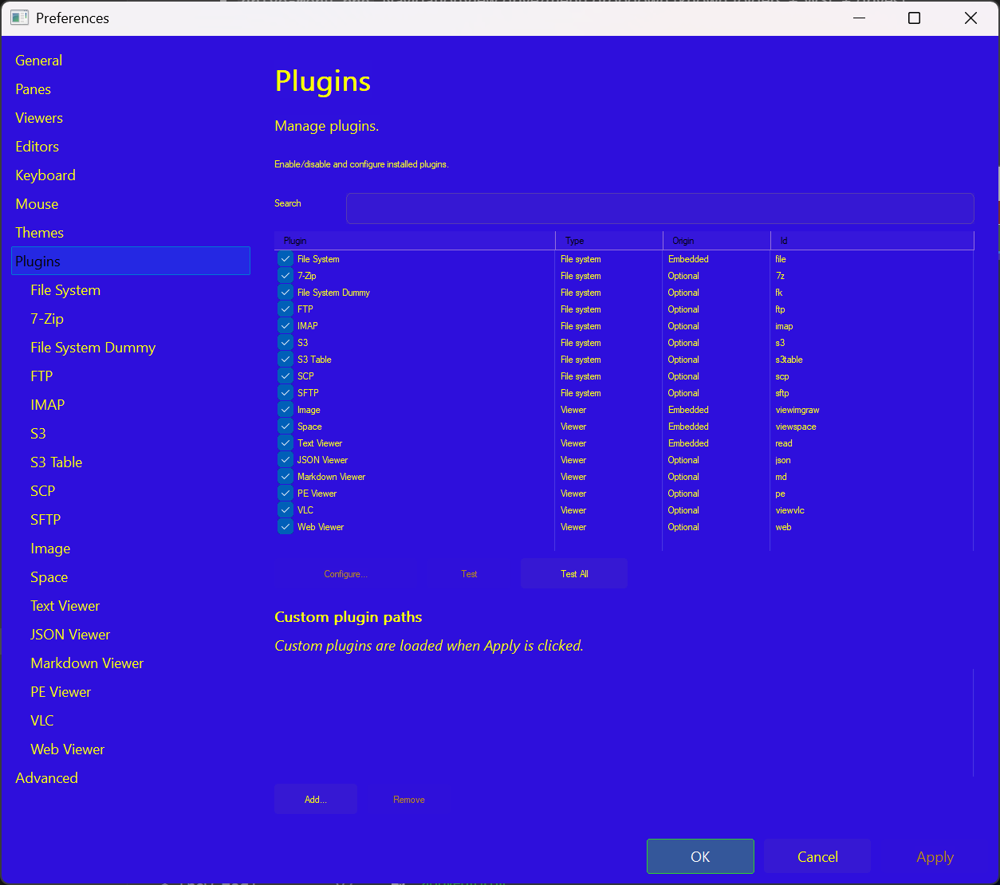

# Plugins (File Systems & Viewers)

RedSalamander uses plugins for:

- **File systems**: browsing + operations (local, archives, remote protocols, cloud)
- **Viewers**: opening files in dedicated viewer windows

Plugins are loaded from:

- the `Plugins\` folder next to `RedSalamander.exe`, and
- any additional custom plugin paths you add in Preferences.

## Open the plugin manager UI

- **Plugins → Plugin Manager…** (opens the Plugins page in Preferences)
- **View → Preferences… → Plugins**

From there you can:

- Enable/disable plugins
- Configure a plugin (when it exposes a configuration schema)
- Run **Test** / **Test All** to validate plugin availability

## Built-in file system plugins

File systems are selected by a **short prefix** in the address bar:

- `file:` — Windows file system (`builtin/file-system`)
  - Drives, known folders, OneDrive, and WSL distro shortcuts appear in the drive/menu dropdown.
- `7z:` — archive browser (`builtin/file-system-7z`)
  - Typically opened automatically when you press Enter on an archive in `file:`.
- `ftp:` / `sftp:` / `scp:` / `imap:` — remote file systems (`Plugins/FileSystemCurl`)
- `s3:` / `s3table:` — S3 and S3 Table (`Plugins/FileSystemS3`)
  - Read-only in the current implementation.
- `fk:` — dummy/test file system (`builtin/file-system-dummy`)

See also:

- [Navigation & Path Syntax](NavigationAndPaths.md)
- [Remote File Systems](RemoteFileSystems.md)
- [Connections](Connections.md)

### Archive auto-mount (advanced)

When browsing `file:`, RedSalamander can automatically open certain extensions as virtual file systems instead of executing them.

This is controlled by the settings map:

- `extensions.openWithFileSystemByExtension` *(currently not exposed in Preferences UI)*

Defaults include many archive/container formats such as `.zip`, `.7z`, `.rar`, `.iso`, `.vhd`, `.vhdx`, `.qcow2`, …

To disable auto-mount behavior, set `extensions.openWithFileSystemByExtension` to `{}` in the settings file. See: [Troubleshooting / Reset](Troubleshooting.md)

## Viewer plugins

Viewers are chosen by **file extension** mapping:

- Preferences → **Viewers** controls `extension → viewer plugin`
- `F3` opens the mapped viewer (fallback is the Text viewer when missing/disabled)

Built-in/available viewers include:

- `builtin/viewer-text` — Text/Hex viewer
- `builtin/viewer-imgraw` — Images + camera RAW
- `builtin/viewer-space` — “occupied space” treemap for folders
- `builtin/viewer-pe` — Portable Executable (EXE/DLL/SYS) viewer
- `builtin/viewer-vlc` — media playback using VLC (requires VLC installation)
- `builtin/viewer-web` / `builtin/viewer-json` / `builtin/viewer-markdown` — WebView2-based viewers (requires WebView2 runtime)

See: [Viewers](Viewers.md)
