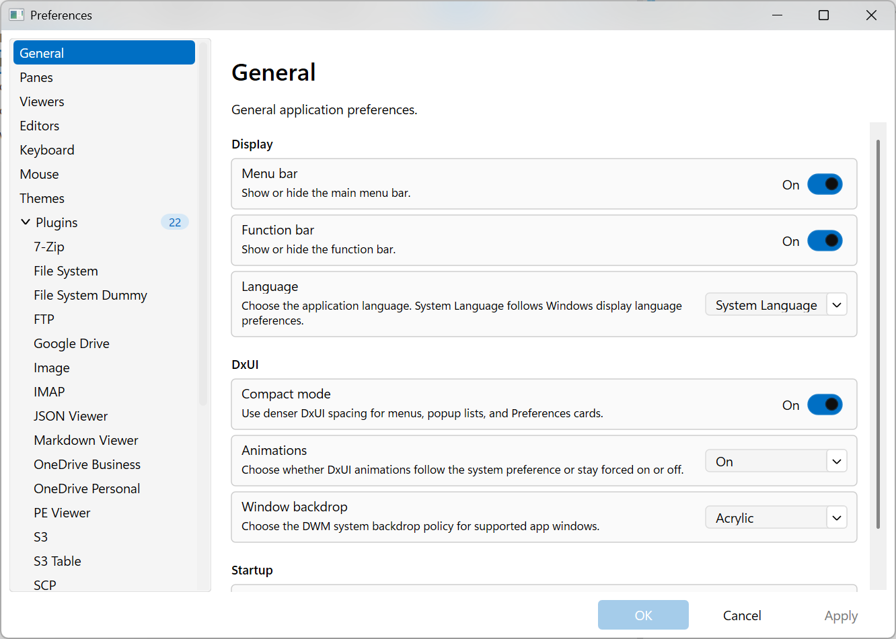
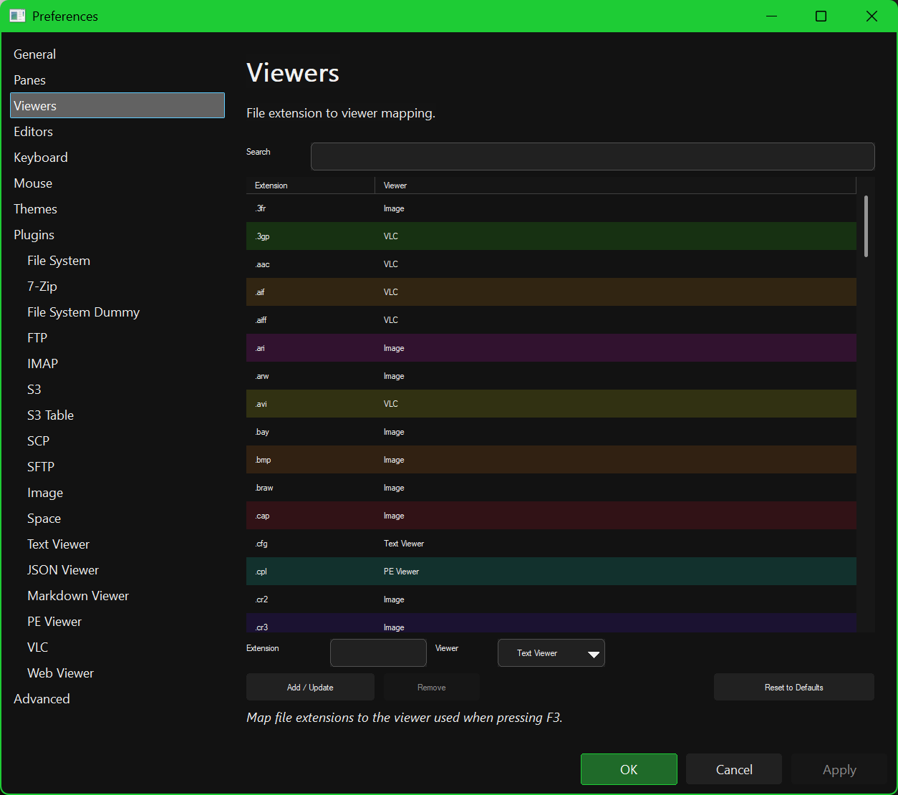
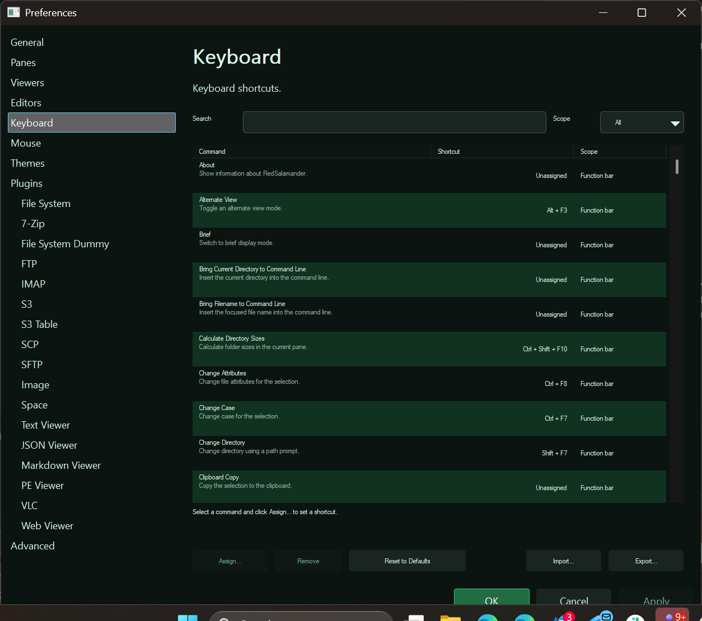
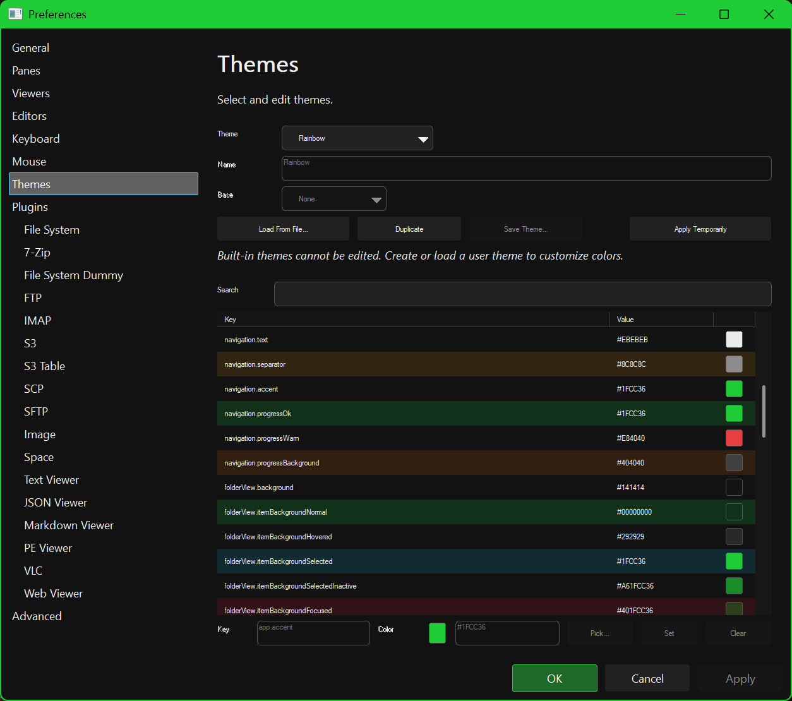
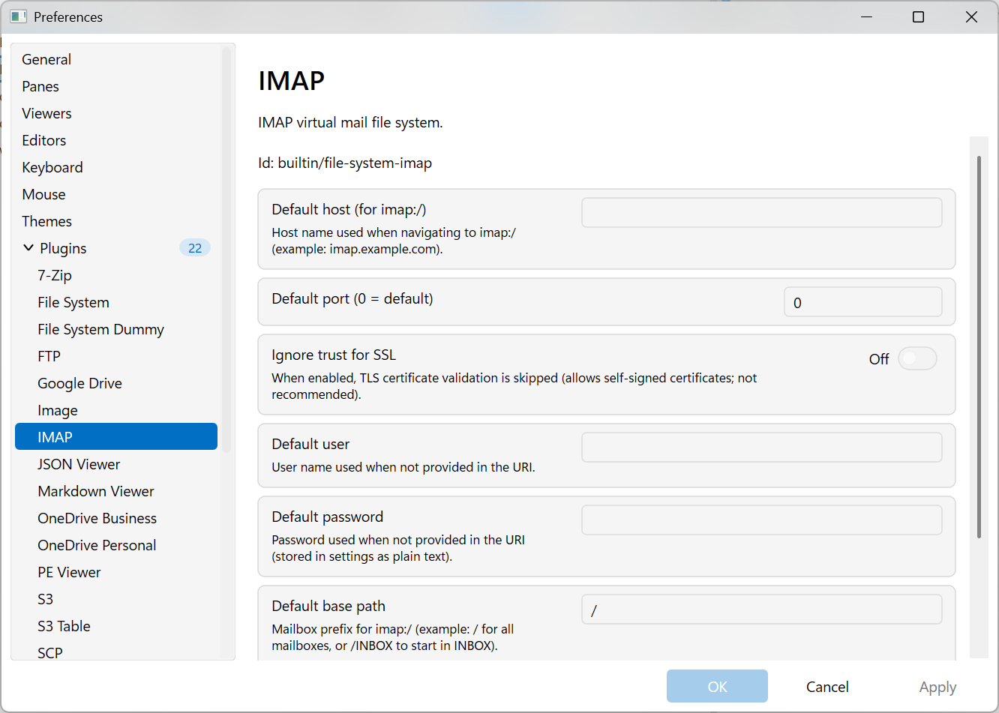

# Preferences

Open Preferences from:

- **View → Preferences…**
- Tip: **Hot Paths** can also be opened directly with `Shift+F9`.

## How Preferences works

- The dialog is modeless (you can keep using the main window behind it).
- **OK**: apply changes and close.
- **Apply**: apply changes without closing.
- **Cancel**: discard pending changes and close.

## External settings changes

- If the main settings file changes on disk and Preferences has no unsaved edits, the dialog reloads from the live app settings automatically.
- If Preferences has unsaved edits, it warns you and lets you choose **Reload from disk** or **Keep editing**.
- If you keep editing, the dialog becomes stale; the next **OK** or **Apply** asks whether to **Overwrite disk**, **Reload from disk**, or **Cancel**.
- Theme previews are cancelled when an external reload is applied, and the dialog itself switches to the newly applied theme.
- The modal plugin configuration editor follows the same reload/conflict rules.

## Pages

The left tree contains:

- **General**: common app behavior.
- **Panes**: default pane display/sort behavior, visibility options, and history size.
- **Viewers**: file extension → viewer mapping used by `F3`.
- **Editors**: placeholder (not implemented yet).
- **Keyboard**: shortcut bindings for Function Bar and FolderView commands.
- **Mouse**: placeholder (not implemented yet).
- **Themes**: theme selection, user-theme editing, and theme file management.
- **Plugins**: enable/disable plugins, configure plugins, and run plugin tests.
- **Compare Directories**: default options used by the Compare Directories window.
- **Hot Paths**: bookmark folder paths for quick access (`Ctrl+1`..`Ctrl+0`).
- **Advanced**: expert settings such as diagnostics, monitor filters, and cache limits.

Tip: Plugins also appear as child nodes under **Plugins** when a plugin exposes configurable fields.

## Common workflows

### Viewers

- Search the current extension mappings.
- Add or update a mapping to a different viewer plugin.
- Remove a custom mapping.
- Reset all mappings back to the built-in defaults.

### Keyboard

- Search bindings by command name or shortcut text.
- Assign or remove shortcuts.
- Import/export shortcut bindings as JSON.
- Reset shortcuts to defaults.
- Resolve conflicts directly in the page by replacing or swapping bindings when prompted.

### Themes

- Switch between built-in, file-based, and user themes.
- Create or duplicate a user theme from an existing theme.
- Edit color overrides while still seeing inherited values.
- Preview a theme immediately with **Apply Temporarily**.
- Load/save `*.theme.json5` theme files.

### Plugins

- Search installed plugins by name, id, or type.
- Enable/disable plugins.
- Add/remove custom plugin DLL paths.
- Run **Test** for the selected plugin or **Test All** for the whole set.
- Use the **Plugins** root page for the plugin list, then open child nodes for per-plugin settings.

### Hot Paths and Advanced

- **Hot Paths** lets you edit the label, target path, and **Show in Change Drive menu** flag for each of the 10 slots.
- **Advanced** exposes file-operations diagnostics, monitor defaults, and cache-related settings.
- Some rarely used settings still remain JSON-only; see [Settings File & Advanced Configuration](SettingsFile.md).

## Screenshots (key pages)

### Viewers

### Keyboard

### Themes

### Plugins

