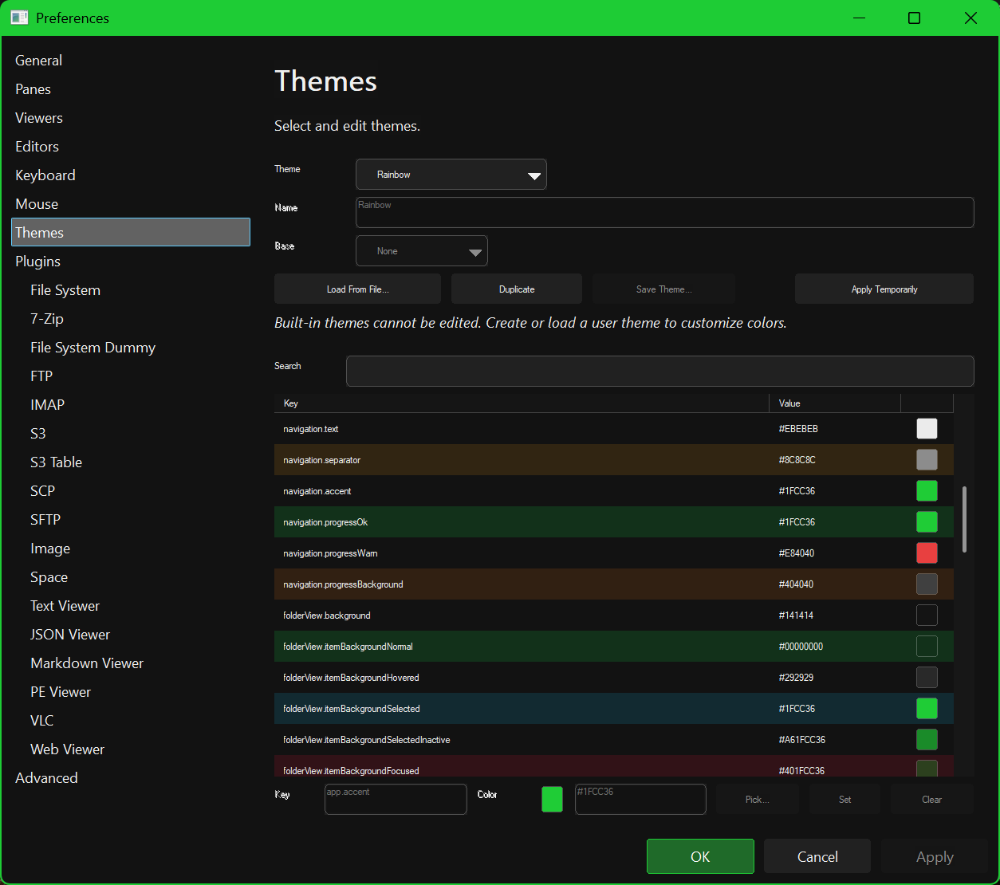

# Themes

RedSalamander is fully theme-aware (menus, panes, file operations UI, and viewers).

## Quick theme switching

Use **View → Theme**:

- **System**
- **Light**
- **Dark**
- **Rainbow**
- **High Contrast (App)**

Note:

- **High Contrast (System)** is shown as an indicator when Windows high-contrast is enabled.

## Custom themes

RedSalamander supports theme files:

- `Themes\*.theme.json5` next to `RedSalamander.exe`

And user themes stored in your settings file.

In Preferences → **Themes** you can typically:

- Select a theme
- Create/edit a user theme
- Load/save `*.theme.json5`

## Not implemented yet

Theme-related future work is tracked in the specs; if something is missing in the Themes page, treat it as planned work rather than a broken config.

