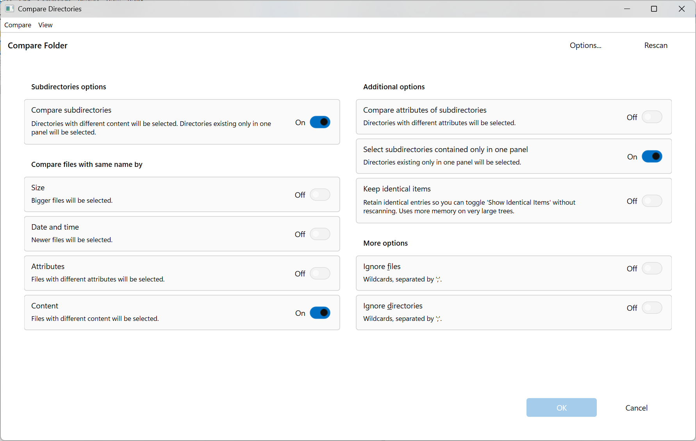
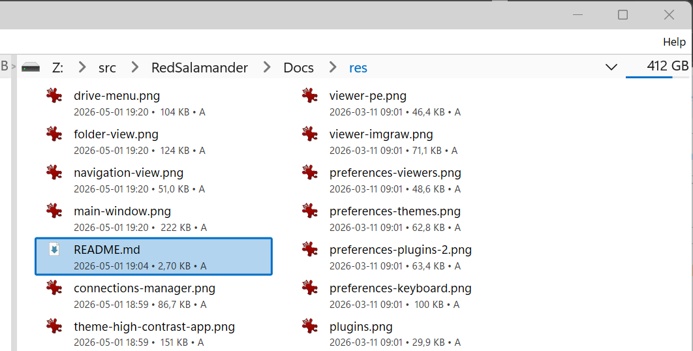
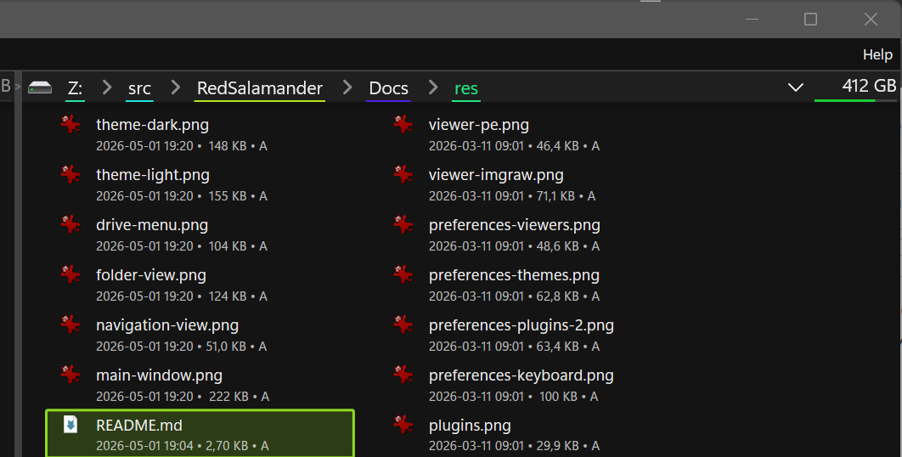
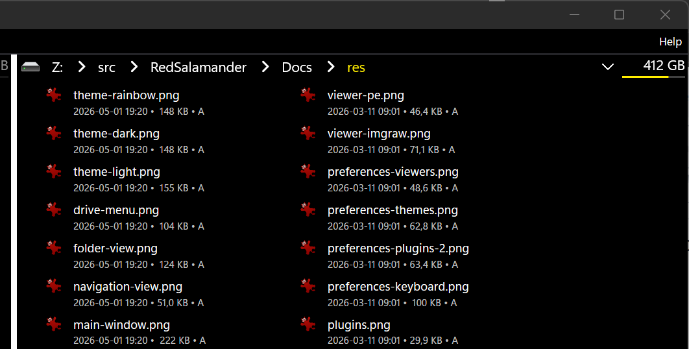
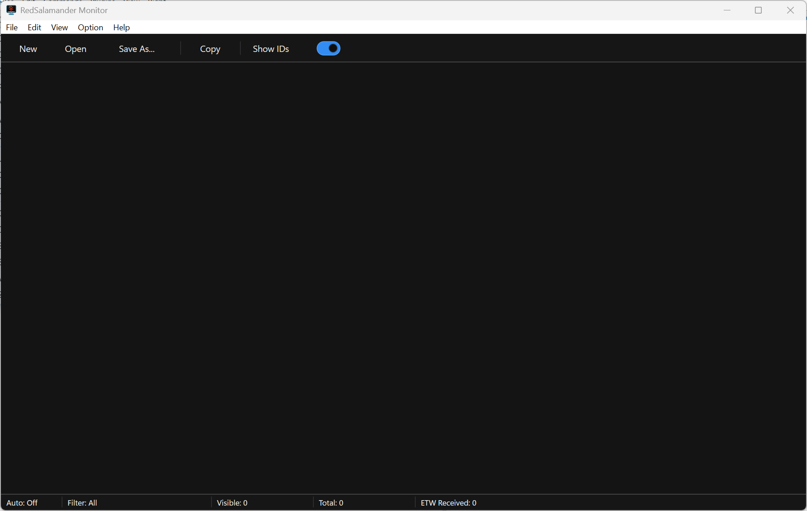

# RedSalamander User Guide

This guide is the complete user-facing tour of RedSalamander: the dual-pane file manager, file operations, search, compare, connections, themes, monitor, and all built-in plugin families.

Screenshots in this guide were captured from the running application and cropped to the UI area being explained. Theme examples intentionally use Light, Dark, Rainbow, and High Contrast App.

## Product Overview

RedSalamander is a Windows dual-pane file manager built for fast keyboard-driven work, remote file-system access, rich file viewers, and themeable DirectX-rendered UI.


The application is organized around two independent folder panes. Most commands use the focused pane as the source and the other pane as the destination.

Core capabilities:

- Browse local folders, drives, known folders, UNC paths, archives, remote systems, cloud drives, and object stores.
- Copy, move, rename, delete, and inspect files across compatible file systems.
- Search files and directories with native, indexed, and fallback search backends.
- Compare two directory trees and synchronize differences.
- Open files with viewer plugins for text, hex, images, RAW files, SQLite databases, PE files, web content, media, and folder space usage.
- Store reusable remote/cloud profiles in Connection Manager.
- Customize themes, keyboard shortcuts, viewers, plugins, file operations, hot paths, and advanced settings.
- Watch application diagnostics with RedSalamanderMonitor.

## Quick Start

1. Launch `RedSalamander.exe`.
2. Use the left and right panes to navigate to source and destination folders.
3. Press `Tab` or use **View -> Switch Pane Focus** to change the active pane.
4. Press `F5` to copy selected items to the other pane.
5. Press `F6` to move selected items to the other pane.
6. Press `F3` to view the selected file.
7. Press `Alt+F7` or use **Commands -> Find Files and Directories...** to search from the focused pane.
8. Press `Ctrl+F10` or use **Commands -> Compare Directories...** to compare the two sides.

The function bar at the bottom shows the main keyboard actions:

- `F2` Rename
- `F3` View
- `F4` Edit
- `F5` Copy
- `F6` Move
- `F7` MakeDir
- `F8` Delete
- `F9` User Menu
- `F10` Menu
- `F11` Connect
- `F12` Disconnect

Some menu entries are reserved for planned features and currently show a "Not implemented" message. See [Known Planned Features](#known-planned-features).

## Main Window

The main window contains:

- **Menu bar**: pane, file, edit, command, plugin, view, and help commands.
- **Navigation bars**: one per pane, with drive/menu access, breadcrumbs, path entry, history, and disk information.
- **Folder views**: the two file panels where you select, sort, and operate on files.
- **Status bars**: selected item, directory, and operation context for each pane.
- **Function bar**: keyboard command strip.

### Pane Focus

Only one pane is focused at a time. Commands such as View, Copy, Move, Delete, Search, and Properties operate on the focused pane or its selection.

Useful pane commands:

- **View -> Switch Pane Focus** switches focus.
- **Left/Right -> Maximize/Restore Pane** gives one side more room.
- **Left/Right -> Swap Panes** exchanges the two pane locations.
- **Left/Right -> Refresh** reloads the focused pane.
- **Left/Right -> Brief / Detailed / Extra Detailed** changes the folder view layout.
- **Left/Right -> Sort by Name / Extension / Time / Size / Attributes / None** changes ordering.

### Folder View

Folder views support common file-manager interactions:

- Single and multi-selection.
- Keyboard navigation.
- Enter to open or execute.
- `Backspace` to go to the parent folder.
- Context menu for file-system-specific actions.
- Folder refresh.
- Display modes for compact or detailed work.
- Optional hidden/system item visibility.

### Disk Space and Drive Actions

The right side of each navigation bar can show disk information for local `file:` locations: capacity text and a usage bar.


Use the drive/menu dropdown to reach:

- Known folders such as Desktop, Documents, Downloads, Pictures, Music, Videos, and OneDrive.
- WSL distributions when available.
- Saved Connection Manager profiles.
- Local drive roots with current capacity information.
- Disk actions such as **Disk Properties** and **Disk Cleanup** when the active item is a local drive and Windows exposes those actions.

### Display, Sort, and Pane Layout

Folder views can be switched between **Brief**, **Detailed**, and **Extra Detailed** layouts. Sorting is available by name, extension, time, size, attributes, or no sort.

Default shortcuts:

- `Alt+2`: Brief
- `Alt+3`: Detailed
- `Alt+4`: Extra Detailed
- `Ctrl+F2`: Sort None
- `Ctrl+F3`: Sort Name
- `Ctrl+F4`: Sort Extension
- `Ctrl+F5`: Sort Time
- `Ctrl+F6`: Sort Size
- `Ctrl+U`: Swap panes
- `Ctrl+F11`: Maximize/restore the focused pane

### Status and Function Bars

The status bars summarize the current folder and selection. They show details such as selected files, folders, bytes, timestamps, attributes, and sort state where available.

The function bar shows the current `F1` through `F12` bindings. It updates when modifier keys are active and can be hidden from **View -> Function Bar**.

## Navigation

The navigation bar accepts local paths, UNC paths, file URIs, plugin-prefixed paths, mounted archive paths, and saved connection aliases.


### Common Navigation Commands

- `Ctrl+L` or `Alt+D`: focus the address bar.
- `Alt+F1`: open the left pane drive/menu dropdown.
- `Alt+F2`: open the right pane drive/menu dropdown.
- `Alt+Left` / `Alt+Right`: history back / forward.
- `Alt+F12`: show folder history.
- `Backspace`: parent folder.
- `Shift+Backspace`: root folder.
- `Ctrl+.`: set current pane path from the other pane.
- `Ctrl+F12`: filter the current folder.
- `Ctrl+1` through `Ctrl+0`: go to Hot Path slots 1 through 10.
- `Ctrl+Shift+1` through `Ctrl+Shift+0`: assign the current folder to a Hot Path slot.

### Path Forms

Local Windows paths:

```text
C:\Windows\
\\server\share\folder\
```

`file:` URIs:

```text
file:///C:/Windows/
file://server/share/
```

Plugin-prefixed paths:

```text
ftp:/
s3:/
s3table:/
7z:C:\Downloads\archive.zip|/
```

Connection Manager aliases:

```text
nav:MySftpServer
nav://MySftpServer
@conn:MySftpServer
s3://@conn/MyAwsS3/logs/
sharepoint:/@conn:TeamSite/Shared Documents/
```

If you type `nav:`, `nav://`, or `@conn:` without a name, RedSalamander opens Connection Manager.

## File Management

Use **Files** and **Edit** menu commands, the context menu, or the function keys to work with the current selection.

### Opening, Viewing, and Inspecting

- **Open/Execute**: runs the focused file or opens a folder.
- **View** (`F3`): opens the mapped viewer plugin.
- **View Width**: opens the viewer using width-oriented behavior where supported.
- **Properties**: shows item properties exposed by the active file system.
- **Context Menu**: opens the file-system shell/context menu when available.


Properties can be opened with **Files -> Properties** or `Alt+Enter`. The dialog is theme-aware and can show plugin-provided metadata, including general item identity, path, type, size, timestamps, attributes, and named streams when the provider exposes them. `Esc` closes the dialog and `Ctrl+C` copies all property text.

### Creating and Renaming

- **Rename** (`F2`): rename the focused item.
- **New Folder / MakeDir** (`F7`): create a directory in the focused pane.
- **Change Case**: change name casing for selected items.

### Copy, Move, and Delete


- **Copy** (`F5`): copy selected items to the other pane.
- **Move/Rename** (`F6`): move selected items to the other pane or rename depending on context.
- **Delete** (`Del` or `F8`): delete selected items, using the Recycle Bin when supported.
- **Permanent Delete** (`Shift+Del` or `Shift+F8`): bypass the Recycle Bin.

Long operations run in the background. The File Operations popup shows:

- Current operation, source, destination, progress, and remaining time.
- Pause, resume, cancel, and dismiss controls.
- Wait vs Parallel execution mode.
- Per-task speed limit for copy/move tasks.
- Conflict prompts for overwrite, retry, skip, and cancel decisions.
- Issue export and diagnostic log access.

### Clipboard and Drag-and-Drop

- `Ctrl+C`: copy selected Windows-path items to the clipboard.
- `Ctrl+V`: paste into the current folder.
- Drag items between panes to queue file operations.
- Drag items to external applications where standard Windows drop formats are available.

### Selection Tools

The **Edit** menu provides selection commands for batch work:

- Select / unselect by mask.
- Select all and unselect all.
- Invert selection.
- Restore previous selection.
- Select next matching item.
- Select same extension.
- Calculate directory size and continue to next item.
- Save and load advanced selections.
- Hide selected or unselected names.

### Path, Shell, and Clipboard Helpers

The file and command menus include several everyday workflow helpers:

- **Copy Path and File Name**, **Copy Path**, **Copy Name**, and **Copy UNC Path and Name** copy text forms of the current selection.
- **Open File Explorer -> Current Folder** opens the active folder in Windows File Explorer when it has a local backing path.
- **Command Shell** opens a shell in the current location when possible.
- **Connect Network Drive** (`F11`) and **Disconnect** (`F12`) use Windows network-drive integration from local `file:` panes.
- **File Operations Failed Items** (`Ctrl+J`) opens the issues pane for failed copy/move/delete work.

### Folder Size and Space Usage

RedSalamander has two related size workflows:

- **Calculate Directory Sizes** (`Ctrl+Shift+F10`) updates folder-size values in the current pane.
- **Calculate Occupied Space** (`Alt+F10`) opens ViewerSpace, a treemap-style folder usage viewer.

Pressing `Space` on a folder selects it, calculates its size, and moves to the next item.

## Find Files and Directories

Use **Commands -> Find Files and Directories...** or `Alt+F7` to open the modeless search window for the focused pane.

Search features include:

- Search by name and path.
- Search by file content where supported by the backend.
- Scope from the current pane.
- Native, indexed, and fallback search backend handling.
- Backend status and degraded-mode diagnostics.
- Reusable recent values stored in settings.

Because the search window is modeless, you can keep browsing while a search is open.

More detail: [Find Files and Directories](FindFiles.md)

## Compare Directories

Compare Directories opens a dedicated two-pane comparison window for the current left and right roots.



Open it with:

- **Commands -> Compare Directories...**
- `Ctrl+F10`

Key features:

- Match items by relative folder and name.
- Compare by size, timestamp, attributes, and content.
- Include or exclude subdirectories.
- Apply file and directory ignore patterns.
- Show or hide identical items.
- Rescan after path or option changes.
- Restore, invert, and manage difference selection.
- Use copy/move operations as synchronization actions when compare mode is active.

If a compare scan runs long enough, it can also appear as an informational task in the File Operations popup.

More detail: [Compare Directories](CompareDirectories.md)

## Connections

Connection Manager stores reusable profiles for remote, cloud, and object-storage file systems.


Open it from:

- **Commands -> Connections Manager...**
- `nav:`, `nav://`, or `@conn:` in the address bar.
- A protocol prefix with no target, such as `sftp:`, `gdrive:`, `s3:`, or `s3table:`.

Connection Manager supports:

- FTP, SFTP, SCP, and IMAP profiles.
- Google Drive, OneDrive Personal, OneDrive Business, and SharePoint profiles.
- S3 and S3 Table profiles.
- Quick Connect for one-time profiles.
- Secure secret storage through Windows Credential Manager.
- Optional Windows Hello gating before saved secrets are released.
- Per-connection operation overrides where supported.

More detail: [Connections](Connections.md)

## Preferences

Open Preferences with **View -> Preferences...**.


Preferences pages cover:

- **General**: startup and common application behavior.
- **Panes**: folder pane display and interaction settings.
- **Viewers**: extension-to-viewer associations.
- **Keyboard**: shortcut bindings.
- **Themes**: built-in, file-based, and user themes.
- **Plugins**: plugin enablement, diagnostics, and plugin configuration.
- **File Operations**: pre-calculation, speed, bridge buffer, and task defaults.
- **Compare Directories**: default comparison options.
- **Hot Paths**: ten bookmark slots.
- **Advanced**: lower-level diagnostics and storage settings.

Some placeholder preference pages are intentionally present for future features; see [Known Planned Features](#known-planned-features).

## Themes

Themes can be switched quickly from **View -> Theme** or managed in **Preferences -> Themes**.

Built-in choices:

- System
- Light
- Dark
- Rainbow
- High Contrast App








Theme features:

- Panes, navigation bars, status bars, file operations UI, dialogs, and viewers follow the active theme.
- Themes can be loaded from `Themes\*.theme.json5`.
- User themes can be created, duplicated, edited, previewed, and saved.
- Temporary theme previews are restored if Preferences is canceled.

More detail: [Themes](Themes.md)

## Plugin System

Plugins provide virtual file systems and file viewers. Open **Plugins -> Plugin Manager...** or **View -> Preferences... -> Plugins** to inspect, enable, disable, test, and configure plugins.


### Built-In File-System Plugins

| Prefix | Plugin | Main use | User-visible capabilities |
|--------|--------|----------|---------------------------|
| `file:` | Windows File System | Local drives, known folders, UNC paths, WSL shortcuts | Browse, open, copy, move, rename, delete, recycle-bin delete, properties, clipboard paths, drag-and-drop where Windows supports it. |
| `7z:` | 7-Zip Archive File System | Archive browsing | Open supported archives as virtual folders, browse archive contents, and read/copy out items where the archive backend supports it. |
| `ftp:` | FTP | Remote FTP servers | Browse, read, upload, overwrite, delete, and use Connection Manager profiles; server capability may limit operations. |
| `sftp:` | SFTP | SSH file transfer | Browse, read, write, delete, and use SSH credentials or keys through settings or Connection Manager. |
| `scp:` | SCP | SSH copy access | Browse and transfer through the shared curl-based plugin; directory operations depend on server SFTP support. |
| `imap:` | IMAP | Mailbox browsing | Browse mailboxes and messages exposed as `.eml` files; deleting an `.eml` deletes the message when allowed. |
| `gdrive:` | Google Drive | Google Drive metadata browsing | Browse folders and inspect drive metadata; the current user-facing milestone is read-only metadata and requires an existing OAuth refresh token. |
| `onedrivep:` | OneDrive Personal | Microsoft Graph personal drive | Browser sign-in, browse, read, write, rename, move, delete, and calculate directory size. |
| `onedriveb:` | OneDrive Business | Microsoft Graph work drive | Browser sign-in, browse, read, write, rename, move, delete, and calculate directory size. |
| `sharepoint:` | SharePoint | Microsoft Graph SharePoint sites/libraries | Browser sign-in, browse document libraries, read, write, rename, move, delete, and calculate directory size. |
| `s3:` | S3 object storage | Buckets, prefixes, and objects | Browse buckets/prefixes, open/download objects, upload, overwrite, delete objects, and bridge-copy with other file systems. |
| `s3table:` | S3 Table | Table buckets, namespaces, and tables | Browse table buckets/namespaces and open generated `*.table.json` table documents; read-only. |
| `fk:` | Dummy/Test File System | Development and test scenarios | Exposes a deterministic fake file system for testing. |

### File-System Plugin Notes

- Connection Manager is preferred for credentials because it stores secrets through Windows facilities.
- Plugin defaults in Preferences can be useful for local testing but may store non-secret and some plugin-specific values in the settings file.
- Cross-file-system copy/move uses the host bridge: the source plugin reads, the destination plugin writes.
- Read-only plugins reject writes and destructive operations.
- Some remote operations depend on server permissions and protocol support.
- File-system plugins use the common pane shortcuts: `Enter` to open, `F3` to view, `F5` to copy, `F6` to move, `F7` to create a directory, `F8`/`Del` to delete, `Alt+Enter` for Properties, and `Backspace` to go up.

For full per-plugin behavior, limitations, configuration, and shortcut notes, see [Plugins](Plugins.md).

### Built-In Viewer Plugins

Viewer mappings are configured in **Preferences -> Viewers**. Press `F3` to open the selected file with the mapped viewer. If a mapping is missing or disabled, RedSalamander falls back to the Text viewer.

| Viewer | Plugin id | Typical files | User-visible capabilities |
|--------|-----------|---------------|---------------------------|
| Text / Hex Viewer | `builtin/viewer-text` | Text, logs, config, CSV, XML, unknown files | Text and hex modes, find, next/previous match, encoding selection, line numbers, wrap, byte color options, diff viewing modes, and other-files navigation. |
| Image / RAW Viewer | `builtin/viewer-imgraw` | Common image formats and camera RAW files | Fit/actual size, zoom, pan, rotate, flip, reset orientation, export, brightness/contrast/gamma/grayscale/negative adjustments, thumbnail vs RAW source, Exif overlay, and other-files navigation. |
| Space Viewer | `builtin/viewer-space` | Folders | Treemap-style occupied-space visualization, scan current or selected folder, navigate up, refresh, and exit. |
| PE Viewer | `builtin/viewer-pe` | `.exe`, `.dll`, `.sys`, and other PE files | Parsed Portable Executable metadata, top/bottom navigation, refresh, other-files navigation, and export to text or Markdown. |
| SQLite Viewer | `builtin/viewer-sqlite` | SQLite databases | Table selector, paged table preview, read-only custom SQL queries, row caps, sortable preview grids, and status strip. |
| VLC Viewer | `builtin/viewer-vlc` | Audio and video files | Media playback through VLC/libVLC, configurable VLC path, plugin path, caching, hardware acceleration, output, visualizer, and extra arguments. |
| Web Viewer | `builtin/viewer-web` | HTML, PDF, and browser-rendered content | WebView2-based rendering for web/PDF content when the WebView2 Runtime is installed. |
| JSON Viewer | `builtin/viewer-json` | `.json`, `.json5` | WebView2-based structured rendering with Text viewer fallback if unavailable. |
| Markdown Viewer | `builtin/viewer-markdown` | `.md` | WebView2-based Markdown rendering with Text viewer fallback if unavailable. |

More detail: [Plugins](Plugins.md) and [Viewers](Viewers.md)

## Viewer Workflows

The viewer screenshots in this section are real plugin windows opened on generated sample files. They are intended to show the plugin in action, not the settings page.

### Text and Diff Work

The Text viewer is the fallback for unmapped file types and is also useful for direct text, hex, and diff-style inspection.


Common actions:

- Find text with `Ctrl+F`.
- Move to next/previous match with `F3` / `Shift+F3`.
- Switch Text and Hex modes.
- Toggle wrapping and line numbers.
- Choose text encoding.
- Navigate to peer files in the same folder.

### Images and RAW Files


Use the Image/RAW viewer for inspection, zooming, orientation corrections, and lightweight visual adjustments.

### Folder Space Usage


Use **Commands -> Calculate Occupied Space** or the folder context menu to open a treemap of folder size distribution.

### PE, Web, Media, and SQLite Files


The PE viewer parses Windows executables and libraries, then lets you export the report as text or Markdown.


The SQLite viewer opens databases read-only, previews tables by page, and can run read-only custom SQL queries.


The Web viewer renders HTML and PDF-style content through Microsoft Edge WebView2.


The JSON viewer formats structured JSON, supports tree-style inspection, and can hand oversized files to the Text viewer.


The Markdown viewer renders headings, lists, emphasis, and code blocks, with a source toggle for inspection.


VLC playback requires VLC to be installed or configured in plugin settings. Web, JSON, Markdown, and PDF rendering require Microsoft Edge WebView2 Runtime.

## RedSalamanderMonitor

RedSalamanderMonitor is a companion ETW/log viewer for RedSalamander diagnostics.



It supports:

- Live ETW streaming.
- Opening captured logs.
- Append-only high-throughput display.
- Auto-scroll tail mode.
- Filtering by message type.
- Find with next/previous navigation.
- Copying selected log lines.
- Always-on-top behavior.
- The same theme system as the main app.

More detail: [RedSalamanderMonitor](Monitor.md)

## Settings and Advanced Configuration

RedSalamander stores durable user choices in its settings file, including:

- Viewer extension mappings.
- Theme choices and user theme data.
- Hot Paths.
- File operation defaults.
- Compare Directory defaults.
- Search recent values.
- Connection Manager non-secret profile fields.
- Plugin configuration.

Secrets are not meant to be stored in the settings JSON by Connection Manager. Saved connection secrets are stored with Windows Credential Manager, optionally protected by Windows Hello.

More detail: [Settings File & Advanced Configuration](SettingsFile.md)

## Troubleshooting

Use these first checks:

- If a remote connection fails, open Connection Manager and verify host, protocol, authentication, and saved secret state.
- If a cloud sign-in fails, verify the plugin client ID and whether first-time OAuth is supported for that plugin.
- If media playback fails, configure the VLC installation path in the VLC viewer plugin settings.
- If copy/move behaves unexpectedly, open the File Operations popup and check conflicts, issues, and exported diagnostics.
- If a theme preview looks wrong, cancel Preferences to restore the prior theme or switch through **View -> Theme**.

More detail: [Troubleshooting / Reset](Troubleshooting.md)

## Known Planned Features

The menus intentionally expose some future commands. Current planned or placeholder items include:

- Alternate View.
- View With and Edit With menus.
- Edit and Edit New file workflow.
- Edit Width.
- Editors and Mouse preference pages.
- Always-visible filter bar.
- Some pane view options such as file extensions, thumbnails, preview pane, and per-pane navigation bar toggles.
- Select/unselect same name.
- Make file list.
- Go to shortcut/link target.
- List opened files.
- Shared directories.
- Quick search / command-line input.
- Bring current directory or filename to the command line.
- Reread associations.
- User Menu.
- Pack/Unpack commands beyond archive browsing as virtual file systems.

More detail: [Planned / TODO features](Todo.md)
