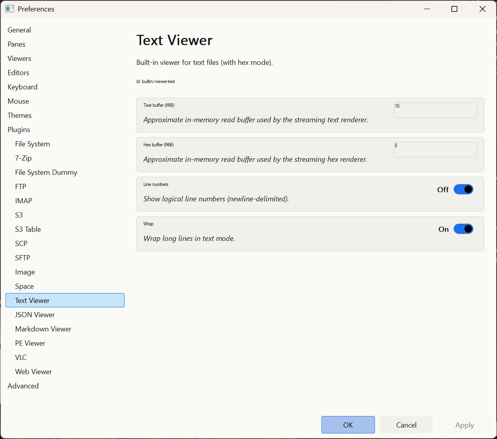
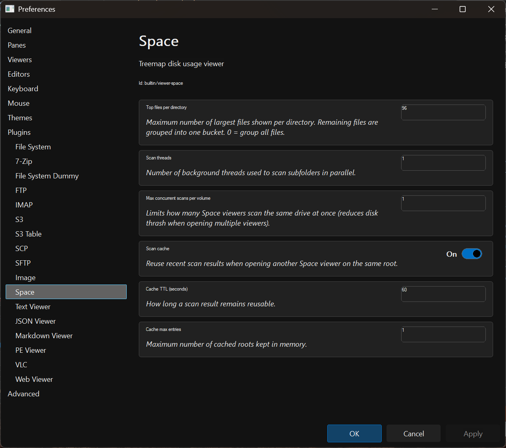
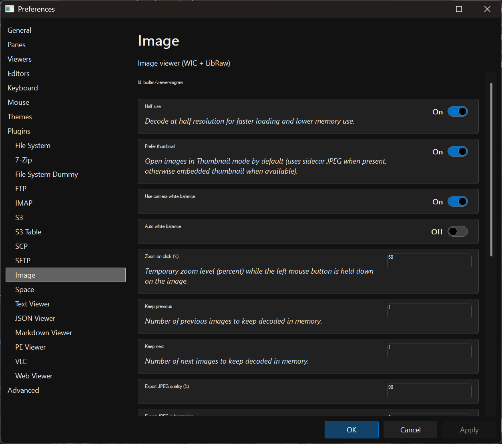
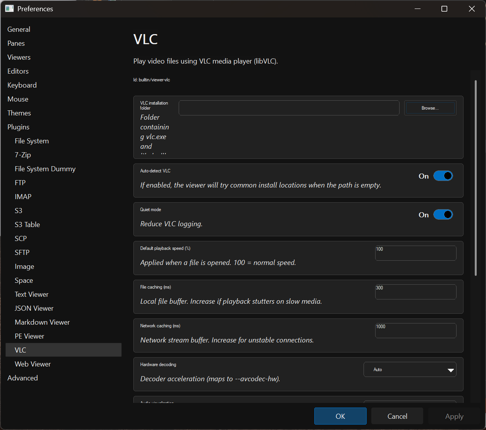
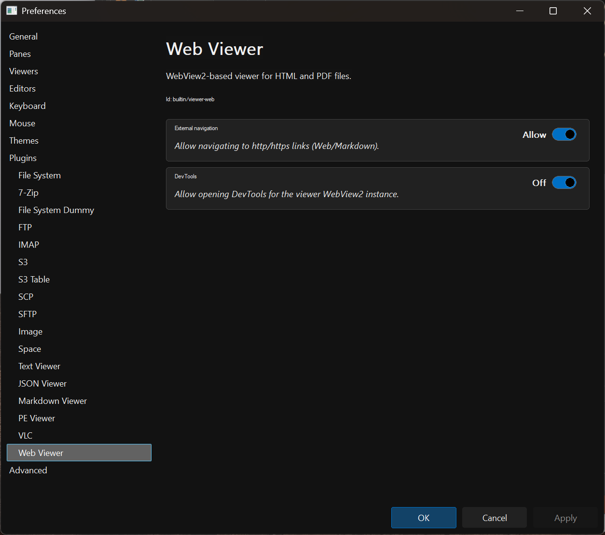

# Viewers (F3)

Press `F3` to open the focused file in a dedicated **viewer window**.

Viewer selection is controlled by Preferences → **Viewers** (extension → viewer plugin).

If there is no mapping (or the mapped plugin is missing/disabled), RedSalamander falls back to the **Text viewer**.

## Default viewer associations

The default mapping includes (non-exhaustive):

- Text: `.txt`, `.log`, `.xml`, `.ini`, `.cfg`, `.csv` → **Text viewer**
- Markdown: `.md` → **Markdown viewer** (falls back to Text if ViewerWeb is unavailable)
- JSON: `.json`, `.json5` → **JSON viewer** (falls back to Text if ViewerWeb is unavailable)
- Web/PDF: `.html`, `.htm`, `.pdf` → **Web viewer** (falls back to Text if ViewerWeb is unavailable)
- Images: common WIC formats + many RAW camera formats → **ImgRaw viewer**
- Media: common audio/video formats → **VLC viewer**
- PE files: `.exe`, `.dll`, `.sys`, … → **PE viewer**

You can change these in Preferences at any time.

## Text viewer (`builtin/viewer-text`)

Key features:

- Toggle **Text / Hex** view
- Find (`Ctrl+F`, then `F3` / `Shift+F3`)
- Encoding menu with quick next/previous (`F8` / `Shift+F8`)
- Wrap and line numbers
- “Other Files” navigation within the same folder

## Space viewer (`builtin/viewer-space`)

Shows a treemap of folder disk usage (“occupied space”).

Open it via:

- **Commands → Calculate Occupied Space** (default `Alt+F10`), or
- Folder view context menu: **View Space**

Behavior:

- If exactly one folder is selected, it scans that folder.
- Otherwise it scans the current folder.

## Image/RAW viewer (`builtin/viewer-imgraw`)

Displays common images and many camera RAW formats with smooth zoom/pan.

## PE viewer (`builtin/viewer-pe`)

Shows parsed Portable Executable metadata and supports export.

## VLC viewer (`builtin/viewer-vlc`)

Plays audio/video formats via libVLC.

Requirements:

- VLC media player installed, or a VLC installation folder configured in Preferences → Plugins → VLC Viewer.

## Web / JSON / Markdown viewers (`ViewerWeb.dll`)

These viewers use Microsoft Edge WebView2.

Requirements:

- WebView2 Runtime installed on the machine.

