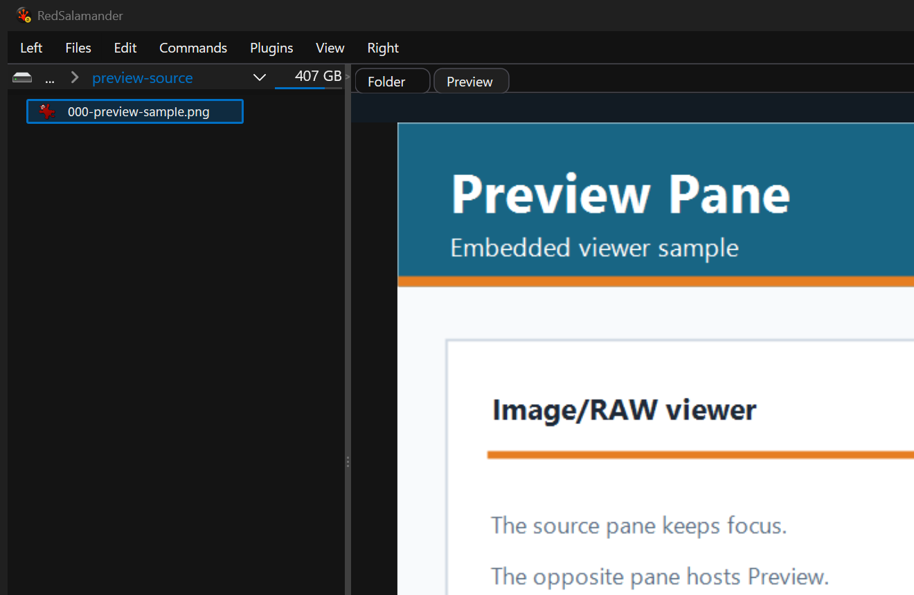
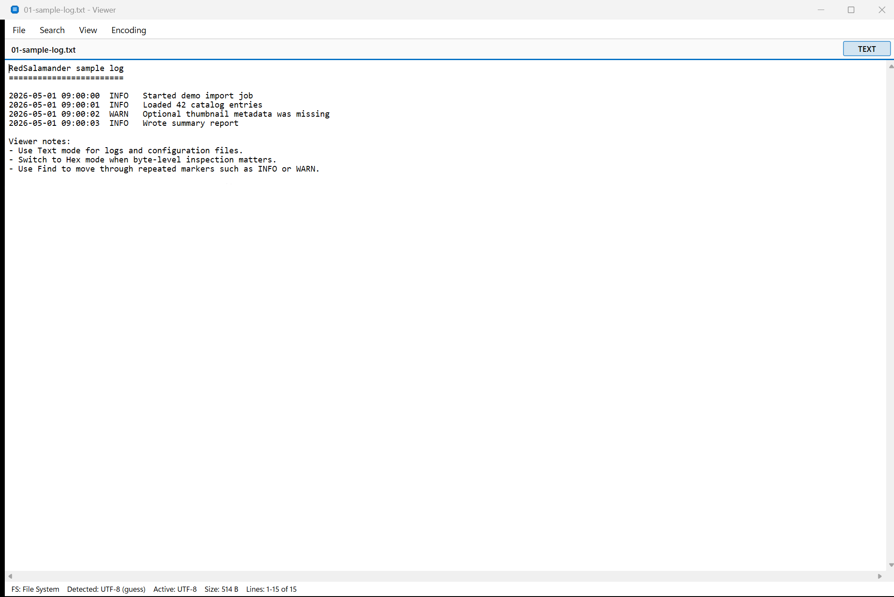
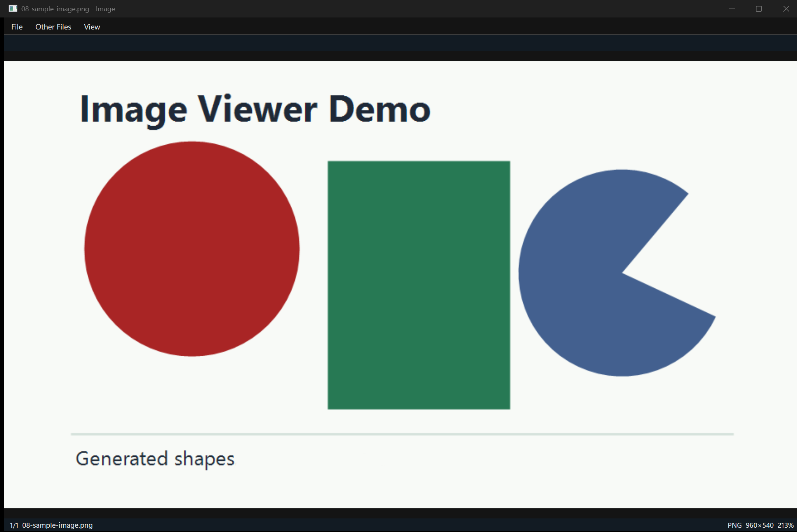
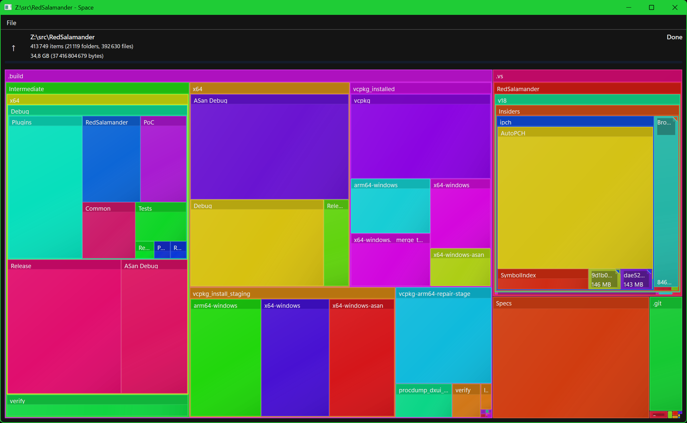
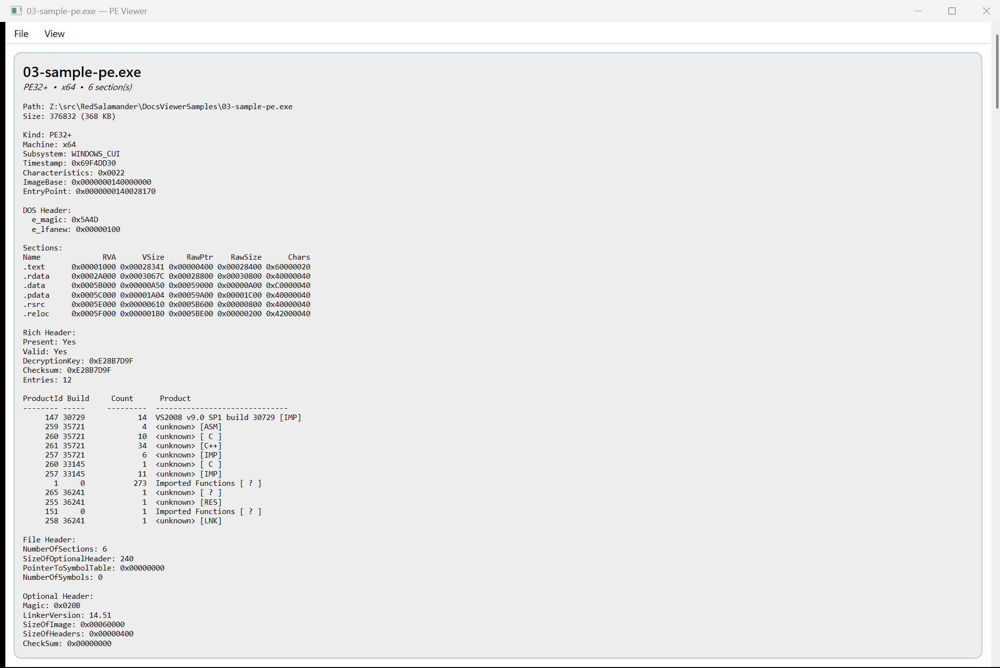
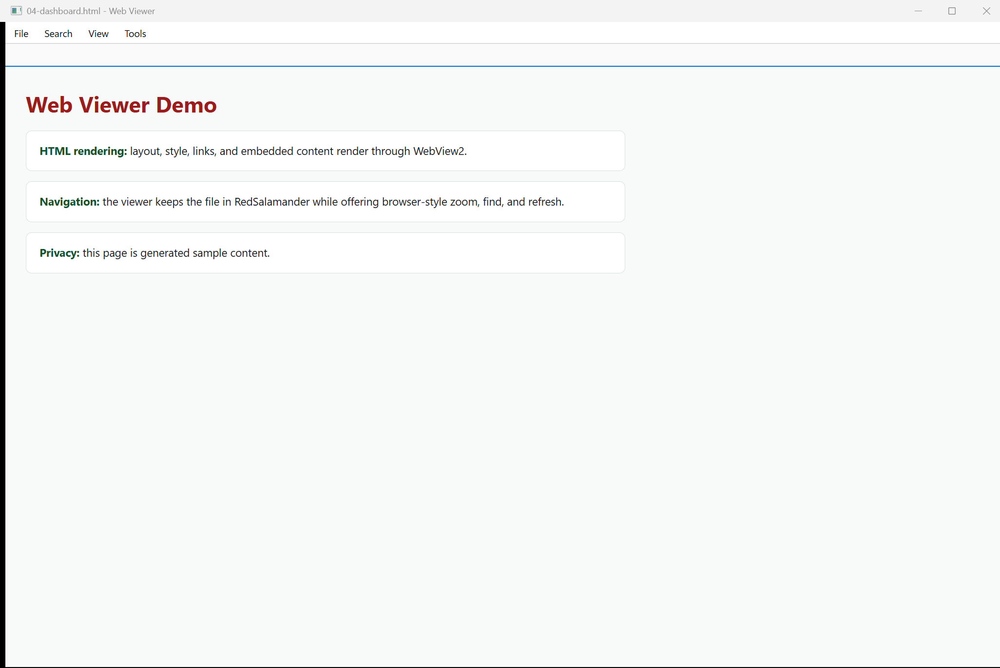
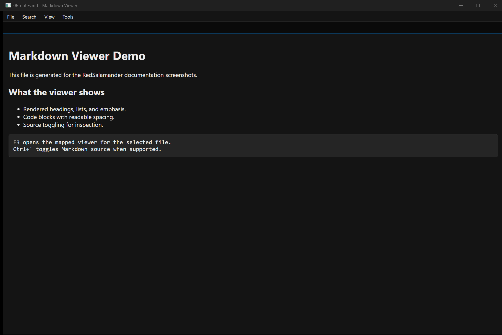

# Viewers (F3)

Viewers open the focused file in a dedicated window. Select a file in a pane and press `F3`; RedSalamander resolves the `F3 View` association in **Preferences -> Viewers** for the file extension or pattern and the current computer.

`Alt+F3` uses the configured alternate viewer action. **View With** lists the configured viewer actions that apply to the focused file. Disabled, missing, or broken actions show an in-pane alert instead of silently doing nothing.

If no specific association matches, the default `*` association normally opens the Text viewer. Folder disk usage is the exception: the Space viewer opens from **Commands -> Calculate Occupied Space** (`Alt+F10`) or the folder context menu.

The examples below use generated documentation samples, not personal files.

## Preview Pane

The Preview Pane hosts the viewer for the focused file in the opposite pane, using the same viewer associations where an embedded viewer is available. The source Folder view keeps keyboard focus, and compatible preview viewers are reused by closing the previous preview content before opening the next file.

## Default Viewer Associations

The default mapping includes:

| File type | Default viewer |
|-----------|----------------|
| `.txt`, `.log`, `.xml`, `.ini`, `.cfg`, `.csv` | Text viewer |
| `.md` | Markdown viewer, with Text fallback if ViewerWeb is unavailable |
| `.json`, `.json5` | JSON viewer, with Text fallback if ViewerWeb is unavailable |
| `.html`, `.htm`, `.pdf` | Web viewer, with Text fallback if ViewerWeb is unavailable |
| Common WIC image formats and many camera RAW formats | Image/RAW viewer |
| Common audio/video formats | VLC viewer |
| SQLite database files | SQLite viewer |
| `.exe`, `.dll`, `.sys`, and other PE files | PE viewer |

Configure this in **Preferences -> Viewers**:

- **Associations** choose the `F3 View` and `Alt+F3 Alternate View` actions for an extension, pattern, default `*` row, or computer-specific override.
- **Actions** define internal viewer-plugin actions and external viewer programs.
- The page can test a sample file path and show the resolved action plus the rule that chose it.

## Text / Hex / Diff Viewer (`builtin/viewer-text`)

Use the Text viewer for logs, source-like files, configuration files, CSV/XML content, unknown files, and any file you want to inspect as text or bytes.

Behavior:

- Text mode with encoding detection and selectable code pages.
- Hex mode with offset, byte, and decoded-text columns.
- Diff modes for `.diff`, `.patch`, and `.rej` files, including side-by-side, inline, unchanged-lines toggle, and hunk navigation.
- Optional line numbers, wrapping, and hex byte coloring.
- Save As with optional encoding conversion.
- Peer-file navigation within the same folder.

Shortcuts:

| Shortcut | Action |
|----------|--------|
| `Ctrl+O` | Open a file from the viewer. |
| `Ctrl+S` | Save As. |
| `F5` | Refresh/reload. |
| `Ctrl+F` | Find. |
| `F3` / `Shift+F3` | Next/previous match. |
| `Home` / `End` | Top/bottom. |
| `Ctrl+G` | Go to offset. |
| `F7` / `Shift+F7` | Next/previous diff hunk. |
| `F8` / `Shift+F8` | Next/previous encoding. |
| `Space` / `Ctrl+Down` | Next peer file. |
| `Backspace` / `Ctrl+Up` | Previous peer file. |
| `Ctrl+Home` / `Ctrl+End` | First/last peer file. |
| `Esc` | Close. |

## Image / RAW Viewer (`builtin/viewer-imgraw`)

Use the Image/RAW viewer for common images and camera RAW files.

Behavior:

- Fit-to-window and actual-size viewing.
- Smooth zoom and pan.
- Rotate, flip, and reset orientation.
- Export the displayed image.
- Brightness, contrast, gamma, grayscale, and negative adjustments.
- RAW/thumbnail source switching where the file provides both.
- Exif overlay and neighbor prefetch for fast next/previous browsing.

Shortcuts:

| Shortcut | Action |
|----------|--------|
| `F5` | Refresh/reload. |
| `Ctrl+S` | Export. |
| `Right` / `PgDn` / `Space` | Next image. |
| `Left` / `PgUp` / `Backspace` | Previous image. |
| `Home` / `End` | First/last image. |
| `Ctrl+F` or double click | Fit to window. |
| `F` | Toggle fit/100%. |
| `1` | Actual size. |
| `+` / `-` / `0` | Zoom in/out/reset. |
| `R` | Rotate clockwise. |
| `Ctrl+R` / `Shift+R` | Rotate counterclockwise. |
| `H` / `V` | Flip horizontal/vertical. |
| `O` | Reset orientation. |
| `G` / `N` | Grayscale/negative. |
| `I` | Exif overlay. |
| `Ctrl+Alt+Arrow`, `Ctrl+Alt+PgUp/PgDn` | Adjustment shortcuts. |

Mouse wheel zooms, and dragging pans when the image is zoomed.

## Space Viewer (`builtin/viewer-space`)

Use the Space viewer to understand which folders or files consume the most disk space.

Open it with:

- **Commands -> Calculate Occupied Space** (`Alt+F10`), or
- Folder context menu -> **View Space**.

Behavior:

- If exactly one folder is selected, the viewer scans that folder.
- Otherwise it scans the current pane folder.
- The treemap area is proportional to item size.
- You can navigate upward and rescan after files change.

Shortcuts:

| Shortcut | Action |
|----------|--------|
| `F5` | Refresh/rescan. |
| `Backspace` | Go up. |
| `Esc` | Close. |

## PE Viewer (`builtin/viewer-pe`)

Use the PE viewer for Windows Portable Executable files such as `.exe`, `.dll`, `.sys`, and related binary formats.

Behavior:

- Parses the selected PE file and shows structured metadata.
- Shows headers, sections, import/export-related information, and other parseable PE details.
- Supports export to text or Markdown.
- Supports peer-file navigation across other PE files in the same folder.

Shortcuts:

| Shortcut | Action |
|----------|--------|
| `Ctrl+S` | Export as text. |
| `Ctrl+Shift+S` | Export as Markdown. |
| `F5` | Refresh. |
| `Home` / `End` | Top/bottom. |
| `Space` / `Ctrl+Down` | Next peer file. |
| `Backspace` / `Ctrl+Up` | Previous peer file. |
| `Ctrl+Home` / `Ctrl+End` | First/last peer file. |
| `Esc` | Close. |

## SQLite Viewer (`builtin/viewer-sqlite`)

Use the SQLite viewer to inspect database files without editing them.

Behavior:

- Opens SQLite databases read-only.
- Provides a table selector and paged preview grid.
- Provides previous/next page navigation.
- Provides a read-only custom SQL query field.
- Supports **Run Query** and **Table Preview** commands.
- Settings control preview page size, custom-query row cap, and direct-open behavior for local files.
- Status text reports loading, empty tables, row ranges, query counts, and truncated-result states.

Shortcuts:

| Shortcut | Action |
|----------|--------|
| `F3` | Open the selected database from the pane. |
| `Tab` / `Shift+Tab` | Move through viewer controls. |
| `Arrow keys` | Move inside focused controls and grids. |
| `Enter` / `Space` | Activate the focused button, selector, or command. |

## VLC Viewer (`builtin/viewer-vlc`)

Use the VLC viewer for audio and video playback through VLC/libVLC.

Requirements:

- VLC media player must be installed, or
- a VLC installation folder must be configured in **Preferences -> Plugins -> VLC Viewer**.

Behavior:

- Opens media files mapped to the VLC viewer.
- Provides play, pause, stop, timeline/seek, time display, volume, and snapshot controls.
- Uses plugin settings for VLC path, plugin path, caching, hardware acceleration, output, visualizer, and extra VLC arguments.
- If VLC is unavailable, the viewer shows the missing-VLC state with configuration guidance.

Shortcuts:

| Shortcut | Action |
|----------|--------|
| `F3` | Open the selected media file from the pane. |
| `Tab` / `Shift+Tab` | Move through visible playback controls. |
| `Enter` / `Space` | Activate the focused control. |

No separate viewer menu accelerator table is currently defined for VLC; use the visible playback controls.

## Web Viewer (`builtin/viewer-web`)

Use the Web viewer for HTML, PDF, and browser-rendered content.

Requirements:

- Microsoft Edge WebView2 Runtime.

Behavior:

- Renders local HTML/PDF-style content through WebView2.
- Supports find, zoom, refresh, save, URL copy, and opening in the system browser.
- Falls back to Text viewer when ViewerWeb is unavailable and the host can safely do so.

Shortcuts:

| Shortcut | Action |
|----------|--------|
| `Ctrl+S` | Save As. |
| `F5` | Refresh. |
| `Ctrl+F` | Find. |
| `F3` / `Shift+F3` | Find next/previous. |
| `Ctrl++` / `Ctrl+-` / `Ctrl+0` | Zoom in/out/reset. |
| `F12` | Toggle DevTools when enabled. |
| `Ctrl+L` | Copy URL. |
| `Ctrl+Enter` | Open in browser. |
| `Space` / `Ctrl+Down` | Next peer file. |
| `Backspace` / `Ctrl+Up` | Previous peer file. |
| `Esc` | Close. |

## JSON Viewer (`builtin/viewer-json`)

Use the JSON viewer for `.json`, `.json5`, and JSONL-style inspection.

Requirements:

- Microsoft Edge WebView2 Runtime.

Behavior:

- Formats JSON into a structured, syntax-highlighted view.
- Supports pretty, tree, and JSONL/card-style modes where available.
- Provides expand/collapse commands for structured JSON views.
- Oversized documents can be handed off to Text viewer.

Shortcuts:

| Shortcut | Action |
|----------|--------|
| `Ctrl+S` | Save As. |
| `F5` | Refresh. |
| `Ctrl+F` | Find. |
| `F3` / `Shift+F3` | Find next/previous. |
| `Ctrl++` / `Ctrl+-` / `Ctrl+0` | Zoom in/out/reset. |
| `F12` | Toggle DevTools when enabled. |
| `Ctrl+L` | Copy URL. |
| `Ctrl+Enter` | Open in browser. |
| `Space` / `Ctrl+Down` | Next peer file. |
| `Backspace` / `Ctrl+Up` | Previous peer file. |
| `Esc` | Close. |

## Markdown Viewer (`builtin/viewer-markdown`)

Use the Markdown viewer for `.md` documentation and notes.

Requirements:

- Microsoft Edge WebView2 Runtime.

Behavior:

- Renders headings, lists, emphasis, and code blocks.
- Supports source toggling for inspection.
- Uses WebView2 for display and Text viewer fallback when ViewerWeb is unavailable.
- Oversized documents can be handed off to Text viewer.

Shortcuts:

| Shortcut | Action |
|----------|--------|
| `Ctrl+S` | Save As. |
| `F5` | Refresh. |
| `Ctrl+F` | Find. |
| `F3` / `Shift+F3` | Find next/previous. |
| `Ctrl++` / `Ctrl+-` / `Ctrl+0` | Zoom in/out/reset. |
| `F12` | Toggle DevTools when enabled. |
| `Ctrl+L` | Copy URL. |
| `Ctrl+Enter` | Open in browser. |
| `Ctrl+Backtick` | Toggle Markdown source. |
| `Space` / `Ctrl+Down` | Next peer file. |
| `Backspace` / `Ctrl+Up` | Previous peer file. |
| `Esc` | Close. |

See also: [Plugins](Plugins.md), [Preferences](Preferences.md), and [Settings File & Advanced Configuration](SettingsFile.md).
