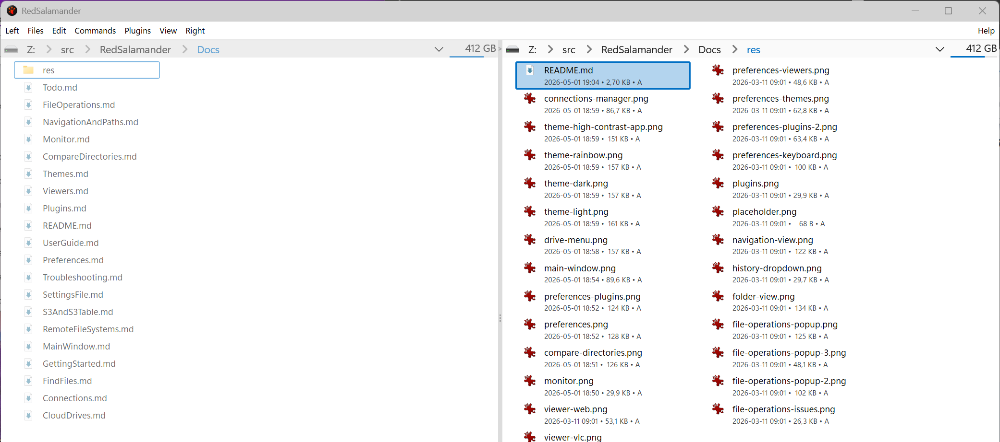

# RedSalamander

RedSalamander is a Windows dual-pane file manager with:

- A fast DirectX-based folder view
- A modeless Find Files and Directories workflow with native, indexed, and fallback search backends
- Virtual file systems (archives, FTP/SFTP/SCP/IMAP, S3, …)
- Viewer plugins (Text/Hex, SQLite, Images/RAW, WebView2-based viewers, …)
- A themed Preferences experience (themes, plugins, shortcuts, associations)



[Complete User Documentation](Docs/UserGuide.md)

## Why another file manager?

This project is a tribute to Servant Salamander and especially [Open Salamander](https://github.com/OpenSalamander/salamander).
Thanks to the Open Salamander contributors:

- David Andrš
- Lukáš Cerman
- Jakub Červený
- Tomáš Jelínek
- Milan Kaše
- Tomáš Kopal
- Jan Patera
- Martin Přikryl
- Juraj Rojko
- Jan Ryšavý
- Petr Šolín

You've done an amazing job.

Open Salamander appears to be quiet these days, so I wanted to start fresh with a modern, themeable, plugin-based successor.

RedSalamander is not yet at the level of other file managers. This is a work in progress.

Enjoy!

## For Developers

RedSalamander is a Windows-native C++23 application featuring advanced text visualization, real-time debugging (ETW), and high-performance graphics rendering (DirectX / Direct2D / DirectWrite).

Key engineering specs for the current search stack and self-test contract:

- `Specs/Core/Core_Search.md`
- `Specs/Plugins/Plugins_VirtualFileSystem.md`
- `Specs/UI/UI_CommandMenuKeyboard.md`
- `Specs/Testing/Testing_SelfTests.md`

## Building the Project

### Prerequisites

- **Visual Studio 2026** with C++ toolset **v145** (Desktop development with C++)
- **vcpkg** (manifest mode) for dependencies
- **Windows 11 build 22000.2600 or later**

### Quick Start

#### Command Line Build

Use the `build.ps1` PowerShell script for easy building:

```powershell
# One-time: install dependencies (writes to .build\vcpkg_installed)
.\vcpkg-install.ps1

# Build entire solution in Debug configuration (default)
.\build.ps1

# Build in Release configuration
.\build.ps1 -Configuration Release

# Build for ARM64
.\build.ps1 -Platform ARM64

# Build specific project only
.\build.ps1 -ProjectName RedSalamanderMonitor
.\build.ps1 -ProjectName RedSalamander
.\build.ps1 -ProjectName Common

# Clean build
.\build.ps1 -Clean

# Rebuild all
.\build.ps1 -Rebuild

# Combined options
.\build.ps1 -Configuration Release -ProjectName RedSalamanderMonitor -Rebuild
```

**Build Script Parameters:**

- `-Configuration` : `Debug` (default), `Release`, or `ASan Debug`
- `-Platform` : `x64` (default) or `ARM64`
- `-ProjectName` : Specific project name (builds entire solution if not specified)
- `-Clean` : Perform clean build
- `-Rebuild` : Rebuild all projects
- `-Msix` : Build an MSIX package after a successful Release build
- `-Msi` : Build an MSI package after a successful Release build

### AddressSanitizer (`ASan Debug`)

Build an ASan-instrumented binary from the console with:

```powershell
.\build.ps1 -Configuration 'ASan Debug' -ProjectName RedSalamander
.\build.ps1 -Configuration 'ASan Debug' -ProjectName RedSalamanderSearchService
```

Outputs land in:

```text
.build\x64\ASan Debug\
.build\ARM64\ASan Debug\
```

Run them directly from the output folder:

```powershell
.\.build\x64\ASan Debug\RedSalamander.exe
.\.build\x64\ASan Debug\RedSalamanderSearchService.exe --run-foreground
```

The build now copies the required `clang_rt.asan_dynamic-*.dll` next to each ASan executable automatically. If you still see a missing ASan runtime DLL, rebuild after updating Visual Studio C++ tools and verify the ASan runtime exists under `$(VCToolsInstallDir)\bin\Host*\`.

#### Visual Studio Build

1. Open `RedSalamander.sln` in Visual Studio 2026
2. Select configuration (Debug/Release) and platform (x64/ARM64)
3. Build → Build Solution (Ctrl+Shift+B)

### Solution Structure

The solution contains the following projects:

- **Applications**: `RedSalamander`, `RedSalamanderMonitor`, `RedSalamanderSearchService`
- **Installer**: `RedSalamanderInstaller` (MSIX packaging)
- **Shared library**: `Common`
- **File-system plugins**: `FileSystem`, `FileSystem7z`, `FileSystemCurl`, `FileSystemS3`, `FileSystemGoogleDrive`, `FileSystemMicrosoftDrive`, `FileSystemDummy`
- **Viewer plugins**: `ViewerText`, `ViewerSqlite`, `ViewerSpace`, `ViewerImgRaw`, `ViewerVLC`, `ViewerPE`, `ViewerWeb`
- **PoC projects**: `ls1`, `ls2`, `ls3`, `ls4`, `FlipSequentialDiscard`, `MonitorTest`

### Output

Built executables and libraries are located in:

```text
.build\x64\Debug\     (Debug builds)
.build\x64\Release\   (Release builds)
.build\ARM64\Debug\   (Debug builds)
.build\ARM64\Release\ (Release builds)
```

All build outputs and intermediate files are written under `.build\` to keep the source tree clean.

## Self-tests (Debug only)

RedSalamander includes three debug-only self-test suites:

- CompareDirectories self-test (`--compare-selftest`)
- Commands self-test (`--commands-selftest`)
- FileOperations self-test (`--fileops-selftest`)

### Run self-tests

Build a Debug binary and run the suites (recommended: run all suites in one process so the aggregated `results.json` includes everything):

```powershell
# Build Debug (x64)
.\build.ps1 -Configuration Debug -ProjectName RedSalamander

# Run all suites in one process (recommended)
.\.build\x64\Debug\RedSalamander.exe --selftest --selftest-timeout-multiplier=2.0

# Run suites individually
.\.build\x64\Debug\RedSalamander.exe --compare-selftest
.\.build\x64\Debug\RedSalamander.exe --commands-selftest
.\.build\x64\Debug\RedSalamander.exe --fileops-selftest

# Optional: fail-fast for CompareDirectories
.\.build\x64\Debug\RedSalamander.exe --compare-selftest --selftest-fail-fast
```

The process exit code is `0` on success and non-zero on failure.

Every declared self-test case must report `passed`, `failed`, or `skipped`. Conditional coverage stays part of the suite and uses `skipped` with a reason when prerequisites are absent. See `Specs/Testing/Testing_SelfTests.md`.

Note: the Commands self-test is UI-driven and may take longer to run.

Note: `RedSalamander.exe` is a GUI app, so PowerShell may return to the prompt immediately after launching it. Use `Start-Process -Wait` if you need to wait for completion and capture the exit code.

### Self-test artifacts and results

All self-test output is written under:

```text
%LOCALAPPDATA%\RedSalamander\SelfTest\
```

At the start of any self-test run, the current `last_run` is rotated to `previous_run` and a fresh `last_run` is created:

- `%LOCALAPPDATA%\RedSalamander\SelfTest\last_run\`
- `%LOCALAPPDATA%\RedSalamander\SelfTest\previous_run\`

Key files:

- `%LOCALAPPDATA%\RedSalamander\SelfTest\last_run\trace.txt` (host trace)
- `%LOCALAPPDATA%\RedSalamander\SelfTest\last_run\compare\trace.txt`
- `%LOCALAPPDATA%\RedSalamander\SelfTest\last_run\compare\results.json`
- `%LOCALAPPDATA%\RedSalamander\SelfTest\last_run\commands\trace.txt`
- `%LOCALAPPDATA%\RedSalamander\SelfTest\last_run\commands\results.json`
- `%LOCALAPPDATA%\RedSalamander\SelfTest\last_run\fileops\trace.txt`
- `%LOCALAPPDATA%\RedSalamander\SelfTest\last_run\fileops\results.json`
- `%LOCALAPPDATA%\RedSalamander\SelfTest\last_run\results.json` (aggregated run summary)

## Search Service (Developer)

`RedSalamanderSearchService.exe` supports terminal-friendly management commands.

Default identities:

- Debug: `RedSalamanderSearchService.Debug` on `\\.\pipe\RedSalamander.SearchService.Debug.v3`
- Release: `RedSalamanderSearchService` on `\\.\pipe\RedSalamander.SearchService.v3`

Useful commands:

```powershell
# Show all supported options
.\.build\x64\Debug\RedSalamanderSearchService.exe --help

# Run in the current terminal
.\.build\x64\Debug\RedSalamanderSearchService.exe --run-foreground

# Run offline SQLite maintenance
.\.build\x64\Debug\RedSalamanderSearchService.exe --compact

# Ask a running SQLite-backed service to compact in place
.\.build\x64\Debug\RedSalamanderSearchService.exe --request-compact

# Register / unregister the Windows service for the current build
.\.build\x64\Debug\RedSalamanderSearchService.exe --register
.\.build\x64\Debug\RedSalamanderSearchService.exe --unregister
```

Notes:

- `--register` and `--unregister` typically require an elevated terminal.
- `--compact` targets the SQLite store, acquires the single-instance guard, truncates WAL, runs `VACUUM`, and exits with a before/after space summary. Stop any running service instance first.
- `--request-compact` asks the running service to run live SQLite maintenance in-process and prints the refreshed DB/WAL/free-page state after the request completes.
- `--run-foreground` now auto-attaches to the parent terminal when needed, prints a startup banner with PID/build/mode details, shows a live status dashboard in a console, and falls back to readable lifecycle log lines when output is redirected.
- Press `Ctrl+C` to stop foreground mode cleanly.
- `--pipe-name=...` can target a non-default running service for `--request-compact`, and `--protocol-version=...`, `--max-requests=...`, and `--disconnect-after-batches=...` are intended for foreground-mode development and self-tests.
- `--storage-root=...`, `--store-backend=...`, and `--sqlite-path=...` can be used with `--run-foreground` or `--compact`.
- `--storage-root=...` overrides the snapshot/storage root, which is useful for isolated self-tests and local service debugging.

### MSIX Installer

Build Release + MSIX in one command:

```powershell
.\build.ps1 -Msix
```

Or build/package separately:

```powershell
.\build.ps1 -Configuration Release
msbuild Installer\msix\RedSalamanderInstaller.wapproj /p:Configuration=Release /p:Platform=x64
```

MSIX output is written to:

```text
.build\AppPackages\
```

See `Specs/Installer/Installer_Msix.md` for signing and deployment details.

### MSI Installer

Build Release + MSI in one command (requires WiX Toolset v6+):

```powershell
.\build.ps1 -Msi
```

MSI output is written to:

```text
.build\AppPackages\
```

See `Specs/Installer/Installer_Msi.md` for details.

## vcpkg

### Installing dependencies

Install all libraries from `vcpkg.json` into `.build\vcpkg_installed`:

```powershell
.\vcpkg-install.ps1

# ARM64:
.\vcpkg-install.ps1 -Platform ARM64
```

### (Optional) Enable user-wide MSBuild integration

If your Visual Studio/MSBuild setup does not pick up vcpkg manifest dependencies automatically, enable vcpkg's MSBuild integration:

```powershell
vcpkg.exe integrate install
```

### Adding New Libraries

To add a new library:

```powershell
vcpkg.exe add port <library-name>
```

Then re-run `.\vcpkg-install.ps1`.

### Using vcpkg in Visual Studio

1. Open Visual Studio
2. Open the project you want to use vcpkg with
3. Ensure vcpkg integration is enabled:
   - Right-click on the project in Solution Explorer
   - Select "Properties"
   - Under "Configuration Properties", check if "Vcpkg" is listed
   - If listed, vcpkg integration is enabled

## Technology Stack

- **Language**: C++23
- **Build System**: MSBuild / Visual Studio 2026 (v145)
- **Package Manager**: vcpkg
- **Graphics**: Direct2D, DirectWrite, Direct3D 11, DXGI
- **Platform**: Windows 11 build 22000.2600 or later (Unicode UTF-16)

## ETW Tracing (RedSalamanderMonitor)

[RedSalamanderMonitor](RedSalamanderMonitor/) is a real-time ETW (Event Tracing for Windows) viewer for RedSalamander events.
On some machines it may need extra privileges to start its ETW listener.

### One-time permission setup (avoid UAC prompts)

Run the helper script once to add your account to the local **Performance Log Users** group (the script will self-elevate):

```powershell
.\init-etw-trace.ps1
```

Then **sign out/in (or reboot)** so your access token picks up the new group membership, and launch:

- `.build\x64\Debug\RedSalamanderMonitor.exe` (Debug), or
- `.build\x64\Release\RedSalamanderMonitor.exe` (Release)

To undo the change later:

```powershell
.\init-etw-trace.ps1 -Remove
```

### Optional: capture an `.etl` trace file

If you need an external ETW session (e.g. Windows Performance Analyzer), use:

- `.\start-etw-trace.ps1`
- `.\stop-etw-trace.ps1`
- `.\clean-etw-trace.ps1`

Note: `RedSalamanderMonitor.exe` has its own built-in ETW listener and does not require an external session for normal use.

Normal Release builds keep Info/Perf/debug-style ETW diagnostics quiet, and RedSalamanderMonitor filters out its own ETW messages. To build a dedicated Release set that emits and displays those diagnostics in RedSalamanderMonitor, use:

```powershell
.\build.ps1 -Configuration Release -MonitorDiagnostics
```

## Additional Documentation

- **Docs/**: User documentation (start at `Docs/UserGuide.md`)
- `Docs/RemoteFileSystems.md`: Remote file systems (FTP/SFTP/SCP/IMAP)
- **AGENTS.md**: Comprehensive development guidelines for AI assistants and developers
- **.github/copilot-instructions.md**: GitHub Copilot specific guidelines
- **Specs/**: Detailed specifications for various components

## License

See `LICENSE.txt` for license information.
