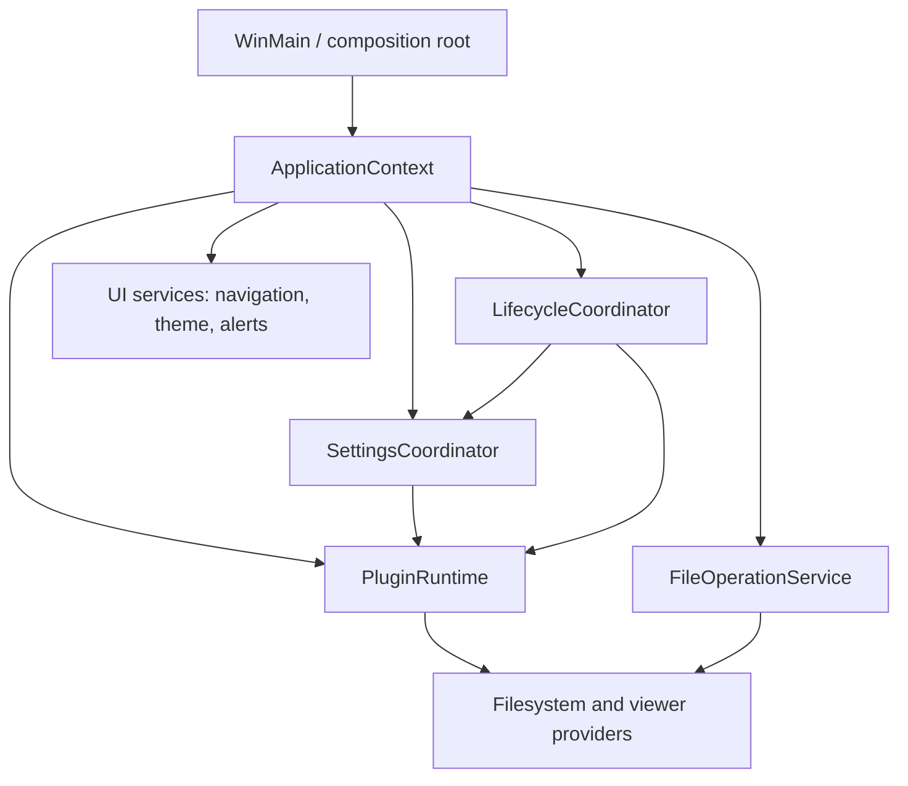

# Operation Observatory — Whole-Repository Code Audit and Remediation Plan

| Field | Value |
|---|---|
| Status | DONE — Tracks 0–16 and 18–19 complete under the documented bounded-convergence decision; independent test-architecture work routed to Astrolabe |
| Reviewed | 2026-07-17 final ledger/definition-of-done reconciliation completed after Track 19 focused Debug, resource-contract, and archived performance proof |
| Whole-repository audit baseline | `4ffcf59e7` |
| Seven-day supplement verification | Reconciled on 2026-07-15 at `6f61c38b3` for changes dated 2026-07-07 through 2026-07-14 |
| Branch/worktree | `master`; Lighthouse is complete and archived |
| Scope | Production C++/headers, plugins, tests, build/release, packaging, scripts, dependencies, specifications, and active/historical audit ledgers |
| Source changes made by the original audit | None; Tracks 0–14 implementation, focused proof, and authoritative-spec updates are complete |
| Primary rule | Fix correctness and data safety before structural refactoring; use existing owners where one already exists |

## Executive verdict

Operation Observatory is complete at this revision under the explicit bounded-convergence decision recorded in
Track 0. Its P0/P1 findings are closed or uniquely routed, the post-remediation CI run is green, the one final Full
run has a clean sandbox and no unclassified Observatory failure, and its eight unrelated failures were narrowed by
one exact-case batch: six passed and two were routed to, then closed by, Tracks 9 and 6. Per the user's instruction
to converge instead of repeatedly repairing unrelated broad-suite failures, no redundant final Full rerun was made.

This closeout does **not** claim that the repository is bug-free or that static review proves every backend and
lifetime behavior. It establishes that the audited defects have current dispositions, focused behavioral proof,
authoritative contracts, and exactly one active owner for the independently deferred test-architecture work.

## Priority and evidence conventions

- **P0** — stop release; reachable security exposure or destructive data-loss behavior.
- **P1** — high-impact correctness, crash, hang, durability, or architectural risk.
- **P2** — important robustness, accessibility, responsiveness, maintainability, or test-system weakness.
- **P3** — confirmed lower-frequency edge case or cleanup debt.
- **Effort** — `S`, `M`, or `L` implementation size.
- **Fix risk** — regression risk of the proposed change, not severity of the existing defect.
- **Confidence** — confidence that the current source contains the described behavior.

Line numbers are evidence anchors for the `4ffcf59e7` whole-repository baseline plus the seven-day supplement
verified at `6f61c38b3`. Re-resolve them after intervening edits; current Lighthouse Track C changes were not
folded into unrelated findings.

## Audit scope and method

This was a risk-first repository audit, not a claim that static review can mathematically prove the absence
of defects.

- Inventoried **967 scoped source/build/test/tooling files**, approximately **742,710 logical lines**.
- Recorded **82 actionable findings: 12 stop-line/P0, 48 P1, 17 P2, and 5 P3**.
- Checked **113 `.vcxproj` files**; 112 are in the solution. `PoC/Win32HelloCred` is intentionally outside it.
- Core application/Common/DxUi deep pass: **237 production `.cpp/.h` files, 249,528 lines**.
- Plugin deep pass: all **15 production plugin directories**, **78 `.cpp` + 46 `.h`** files, plus factories,
  DLL lifecycle, resources, projects, and shared props.
- Reviewed the canonical CI/Full plans, release/build workflows, vcpkg bootstrap, runtime dependency staging,
  ZIP packaging, test inventory, active WIP queues, authoritative specs, and the June review campaign.
- Used risk-first line review for destructive operations, credentials, network transports, pagination,
  callbacks/lifetimes, configuration, parsers, UI-thread I/O, and process shutdown; used pattern and contract
  review for the remaining surfaces.
- Excluded generated `.build` output, binaries/dumps, vendored/minified assets, and historical TestRuns source
  snapshots from source-quality findings. Localization was checked structurally, not for linguistic quality.
- PoCs were inventoried but kept below production priority unless they affect the build/release graph.

Targeted evidence available during the audit:

- `Tools/Tests/TestInventory.Tests.ps1`: **2 passed / 3 failed**.
- Resource localization contract Pester: **5 passed / 0 failed**.
- Latest archived Full run, `2026-07-15_lighthouse_track_a_full`: **1,138 passed, 10 failed,
  53 skipped**, exit 1. Failures were eight Commands cases, Monitor ETW latency, and Tools Pester; the sandbox
  audit also reported 179 leftovers.
- The preceding archived Full green on 2026-07-12 had **1,132 passed, 0 failed, 53 skipped**. Therefore the
  current failures require reconciliation; they must not all be casually labeled product regressions.

Subsequent Lighthouse Track B work superseded the inventory-count portion of that baseline: its closeout
snapshot was reconciled at **704 static / 805 runner-listed Commands cases**, and its inventory Pester contract
passed 5/5. Active Track C coverage has already advanced those ephemeral counts, which is exactly why Track 0 must
remove literal duplication. Track B's first Full run completed with **1,146 passed, 6 failed, and 53 skipped**; no
SettingsStore/HotReload case failed, but the six unrelated failures keep the canonical Full gate red. Track 0
therefore owns failure classification and eliminating duplicated inventory truth, not another literal-only count
refresh.

Operation Observatory itself started no build or Full run because this audit is source-read-only. The later
Track B evidence above was imported from its owner; current Lighthouse session-end source work remains untouched.

### Track 0 live refresh — 2026-07-16

- The completed Commands input-isolation closeout consolidated the duplicated Search/ViewCommands desktop-input
  warning into the Commands translation unit, guarded all current real-cursor families, and passed its source
  contract 129/129, test-enabled build with 0 warnings/errors, and five affected GUI cases 5/5.
- Its broad Commands classification run completed with **798 passed / 6 failed / 6 skipped**, run id
  `20260716T155228Z-41252-4f4ecd8fb7ab4123af0ee60f6a607100`. None of the failures executes a modified
  warning/cursor path. Track 0 now owns focused classification of:
  `cmd_preferences_dialog_viewers_theme_cycle_keeps_surface_legible`,
  `cmd_preferences_dialog_hot_paths_live_dx_interaction`,
  `cmd_preferences_dialog_compare_directories_theme_cycle_keeps_surface_legible`,
  `cmd_compare_directories_options_live_dx_body_interaction`,
  `cmd_pane_selection_select_all_keeps_navigation_shell_stable`, and
  `cmd_pane_navigationView_full_path_popup_edit_route`.
- The same run reported **563 TestSandbox disk-audit issues**, all `unexpected-test-run-dir` leftovers in the
  sampled report. Track 0 must classify their producers/ownership and route the cleanup mechanism through the
  existing Lighthouse test-sandbox contract rather than deleting the evidence ad hoc.

## Stop-the-line findings

| ID | Finding | Current evidence | Effort / fix risk / confidence | Primary implementation owner |
|---|---|---|---|---|
| OBS-GATE-01 | **Closed 2026-07-16:** inventory and gate ownership are canonical | The run plan now owns native surfaces and execution kinds; inventory/docs derive from it without frozen registration totals. CI passed 1,172/0 with a clean sandbox. The one Full closeout run's unrelated failures were exactly classified under the explicit bounded-convergence decision, with no unclassified Track 0 failure. | M / low / high | Track 0 complete |
| OBS-REL-01 | **Closed 2026-07-16:** release previously could publish an incomplete requested platform set | `.github/workflows/release.yml` now uses normal dependency success semantics and exact deterministic uploads; `Tools/ReleaseArtifactPolicy.ps1` rejects missing/extra/empty/wrong-architecture or wrong-metadata packages and revalidates exact SHA256 entries. Focused workflow policy passed 13/13; complete Tools Pester passed 309/309. | S / low / high | Track 1 complete |
| OBS-MAIL-01 | **Closed 2026-07-16:** IMAP fallback could delete unrelated mail and leave a failed target marked `\\Deleted` | Delete now requires advertised UIDPLUS before marking, uses only UID EXPUNGE, and compensates rejection with `-FLAGS.SILENT (\\Deleted)` while returning the original failure and retaining rollback status. Fake-mailbox tests prove unrelated pre-deleted mail survives every path. | M / medium / high | Track 2 complete |
| OBS-MAIL-02 | **Closed 2026-07-16:** stale IMAP UID could target a different message after UIDVALIDITY changes | Listed leaf identity now carries UIDVALIDITY+UID; listing requires a valid epoch and fetch/delete re-read STATUS, returning `ERROR_REVISION_MISMATCH` on rollover. Legacy UID-only paths are rejected for version-sensitive actions. | L / high / high | Track 2 complete |
| OBS-MSD-SEC-01 | **Closed 2026-07-16:** Microsoft Drive diagnostics could expose bearer tokens and sensitive upload-session URLs | Request failures now emit only method, redacted target class, HRESULT/status/request ID, byte count, header count, and bearer presence. Authorization is added separately, its UTF-16 storage is securely cleared, and injected bearer/Graph-query/upload-query sentinels remain absent from captured diagnostics. | S–M / low / high | Track 3 complete |
| OBS-MSD-SEC-02 | **Closed 2026-07-16:** an unvalidated Graph continuation could receive the bearer token | Distinct validated Graph/preauthenticated-upload URL types enforce HTTPS/default port, exact Graph origin/API root or approved upload origins, no userinfo/fragments, no credential-bound automatic redirects, and no Graph bearer on upload URLs. Foreign/plaintext links fail before request two; repeats fail before request three. | S–M / low / high | Track 3 complete |
| OBS-DND-01 | **Closed 2026-07-16:** drag/drop payload parsing could terminate or read beyond HGLOBAL | Private/CF_HDROP/clipboard readers now validate HGLOBAL structure and enforce count/path/aggregate caps before allocation; hostile runtime payloads and source contracts are green. | M / medium / high | Track 4 complete |
| OBS-DND-02 | **Closed 2026-07-16:** drag/drop lost provider/target identity and reported queued MOVE as performed | Drop points, actual destinations, source/destination providers, settled-folder state, and external async MOVE reporting are now explicit and regression-covered. | L / high / high | Track 4 complete |
| OBS-OUT-01 | **Closed 2026-07-16:** Archive unpack silently overwrote existing files | Unpack now defaults to skip-existing and exposes explicit skip-all/replace-all policy plus Cancel. Both engines preflight conflicts, preserve a late-conflict fail-if-exists boundary, and stage each file through `LocalFileTransaction`. Focused roundtrip/conflict and prompt cases exit 0. | M–L / medium / high | Track 5 slice complete |
| OBS-OUT-02 | **Closed 2026-07-16:** Pack-and-delete could delete the archive it just created | Pack now rejects an output equal to a selected source or lexically inside a selected source directory without following reparse targets. Only a verified successful pack may queue source deletion, and deletion runs through cancellable File Operations rather than direct recursive removal. | M / medium / high | Track 5 slice complete |
| OBS-OUT-03 | **Closed 2026-07-16:** Make File List blocked the UI and lacked explicit destination/overwrite workflow | Interactive file output now uses a Save picker with overwrite consent. Collection/render/file output run on an owned pane `std::jthread`, publish progress through an informational File Operations task, poll cancellation through collection/render and before promote, and marshal clipboard completion to the UI thread. The 1,029-entry focused case returns from the command in 15,444 us, completes JSON in 89,104 us, and proves cancellation publishes no target. | M / medium / high | Track 5 complete |
| OBS-MON-01 | **Closed 2026-07-16:** Monitor export truncated the existing target and silently replaced malformed UTF-16 | The stale undersized-vector allegation was rejected. `Document::SaveTextToFile` now performs strict conversion and commits through the Common local-file transaction. The focused selftest proves malformed-input preservation, successful UTF-8+BOM output, and temporary cleanup. | S–M / low–medium / high | Track 5 slice complete |

Release must remain blocked until every remaining stop-line finding above is closed with focused regression
coverage. OBS-REL-01, OBS-MAIL-01/02, OBS-MSD-SEC-01/02, OBS-DND-01/02, OBS-OUT-01/02/03, and OBS-MON-01 are closed.
Track 0 bounded the unrelated Full failures and routed the two reproducible cases to their later owners.

## P1 findings — correctness, lifetime, durability, and architecture

### Monitor

| ID | Finding | Current evidence | Effort / fix risk / confidence | Primary implementation owner |
|---|---|---|---|---|
| OBS-MON-02 | **Closed 2026-07-17:** ETW queue, retained document, and search matches were unbounded | Settings-backed event/line/UTF-16-byte/match caps now drop oldest queue/history entries, shift view/search state coherently, expose drops, and emit queue/retained/search metrics. | L / medium / high | Track 6 complete |
| OBS-MON-03 | **Closed 2026-07-17:** ETW shutdown had a handle race and fake timeout | Callback routing is per-session; the worker uses a handle captured by value and a local `ProcessTrace` copy. Stop has a real bounded wait and shared-state fallback, covered by deterministic join/timeout tests. | M / medium / high | Track 6 complete |
| OBS-MON-04 | **Closed 2026-07-17:** DWrite workers used live `self`/COM state | Layout/width work captures HWND, factory, and text format by value; posted results use registered payload teardown draining. | M / medium / high | Track 6 complete |
| OBS-MON-05 | **Closed 2026-07-17:** clipboard publication could lose ownership or destroy prior content early | The canonical helper prepares a WIL-owned Unicode block before `OpenClipboard`/`EmptyClipboard` and releases only after successful `SetClipboardData`; the forwarding-only fake API was removed for clarity. | S / low / high | Track 6 complete |
| OBS-MON-06 | **Closed 2026-07-17:** Open performed arbitrary whole-file UI-thread reads with narrowing | An owned cancellable worker streams 64 KiB chunks, rejects the byte budget before allocation, validates UTF-8/UTF-16LE strictly, caps lines, reports progress, and generation-gates UI publication. | M / low–medium / high | Track 6 complete |
| OBS-MON-07 | **Closed 2026-07-17:** Document accessors returned references after releasing locks | Line, visibility, display-text, and batch accessors return locked snapshots by value. | M / medium / high | Track 6 complete |

### Settings, preferences, and credentials

| ID | Finding | Current evidence | Effort / fix risk / confidence | Primary implementation owner |
|---|---|---|---|---|
| OBS-SET-01 | **Closed 2026-07-17:** settings saves were stale-snapshot, last-writer-wins across processes | Loaded snapshots retain the exact source identity; unique-sibling publication uses a bounded cross-process lock and CAS, successful saves advance the identity, and a real child-process race proves the stale writer loses. | L / high / high | Track 7 complete |
| OBS-SET-02 | **Closed by explicit product policy 2026-07-17:** Preferences commits two independent settings files | True cross-file atomicity would require a durable recovery journal. Main and Monitor instead retain independent CAS; partial success applies/advances main, leaves Monitor dirty, and tells the user exactly what failed. Monitor conflicts may rebase its owned section once. | M–L / high / high | Track 7 complete |
| OBS-SET-03 | **Closed 2026-07-17:** failed bad-file backup could later destroy the only recovery artifact | Defaults are now save-blocked whenever the invalid source remains after backup failure; explicit replacement must preserve it first. Focused denial testing proves automatic save leaves the bytes unchanged. | S–M / medium / high | Track 7 complete |
| OBS-SET-04 | **Closed as stale 2026-07-17:** zero-progress `WriteFile` could spin forever | Settings writes now use canonical `Common::HandleIo::WriteAll(...)`; its shared transfer loop rejects zero or impossible progress with `ERROR_WRITE_FAULT`. | S / low / high | Existing shared helper |
| OBS-SET-05 | **Closed 2026-07-17:** internal uint32 JSON parsing truncated values above `UINT32_MAX` | The production accessor rejects overflow before conversion; a `4294967296` fixture proves the destination is not truncated. | S / low / high | Track 7 complete |
| OBS-SET-06 | **Closed 2026-07-17:** invalid UTF-16 was serialized as an empty string | Settings serialization uses strict error-bearing UTF-16 conversion and returns `ERROR_NO_UNICODE_TRANSLATION` without publishing. | S–M / low / high | Track 7 complete |
| OBS-SET-07 | **Closed 2026-07-17:** a throwing filesystem query sat inside `noexcept` recovery | Backup collision probing uses the `std::error_code` overload and reports query failure without throwing. | S / low / high | Track 7 complete |
| OBS-LIFE-02 | **Closed 2026-07-17:** shutdown fencing and final persistence were conflicting transitions | The coordinator now serializes explicit `Running`/`FinalSavePending`/`FinalSaveQueued`/`ShuttingDown` states under the submission lock. Exactly one final snapshot is admitted after the fence, duplicate finalization reuses its completion, and concurrent normal submissions are rejected. | S–M / medium / high | Track 14 complete |
| OBS-CONN-01 | **Closed 2026-07-17:** duplicate connection IDs could alias WinCred secrets and authorization state | IDs now use one lowercase canonical GUID contract. Strict load/save/UI commit reject invalid, reserved, non-canonical, or duplicate IDs; startup recovery gives every ambiguous profile a distinct fresh ID, clears `savePassword`, never copies an old credential target, and persists through source CAS. | S–M / medium / high | Track 8 complete |
| OBS-CONN-02 | **Closed 2026-07-17:** interactive Windows Hello timeout was effectively process-long | Authorization is keyed by canonical profile ID, secret kind, and interactive/background purpose. Interactive reveal honors only the configured timer; explicit background continuation is app-run scoped and is revoked on replacement/deletion, session lock/disconnect/logoff, session end, and shutdown. | S / low / high | Track 8 complete |

### DxUi, navigation, text input, and accessibility

| ID | Finding | Current evidence | Effort / fix risk / confidence | Primary implementation owner |
|---|---|---|---|---|
| OBS-DX-01 | Menu callback can destroy its control and execution resumes through `this` | **Closed 2026-07-17:** `MenuBar` copies the callback and completes invalidation before terminal dispatch; root-replacement regression added. | S–M / medium / high | Track 9 |
| OBS-DX-02 | Native menu host dereferences `_menuBar` after a nested loop that can destroy it | **Closed 2026-07-17:** refresh/focus/host/popup boundaries use the MenuBar lifetime token and revalidate host/HWND/command target; nested-loop destruction regression added. | S–M / medium / high | Track 9 |
| OBS-DX-03 | Tree pointer paths reuse positional indices after a reentrant delegate | **Closed 2026-07-17:** delegate paths stop on expired control lifetime and pointer/context paths capture item IDs then re-resolve current indices; reorder/root-replacement regressions added. | M / medium / high | Track 9 |
| OBS-DX-04 | Tree UIA provider identity is visible-index based | **Closed 2026-07-17:** providers and runtime IDs retain the 64-bit item ID, snapshot/live actions re-resolve its current visible index, and vanished items return `UIA_E_ELEMENTNOTAVAILABLE`; reorder/removal regression passes. | M / medium / high | Track 9 |
| OBS-DX-05 | Full-path popup can destroy its owned menu during normal activation | **Closed 2026-07-17:** activation into a directly owned top-level menu remains inside the popup hierarchy; isolated Commands selftest passed. | S–M / medium / high | Track 9 |

### Cloud/provider transfer correctness

| ID | Finding | Current evidence | Effort / fix risk / confidence | Primary implementation owner |
|---|---|---|---|---|
| OBS-MSD-IO-01 | **Closed 2026-07-17:** merge-move could recursively delete a concurrently added child | Existing-folder merges no longer issue recursive source-folder DELETE; the drained folder remains as explicit partial cleanup because Graph offers no atomic only-if-empty delete. The injected post-child-move race selftest proves the late child survives. | M / medium–high / high | Track 10 complete |
| OBS-MSD-IO-02 | **Closed 2026-07-17:** upload chunks ignored Graph `nextExpectedRanges` | Streaming and staged writers parse every `202`, resume only from a valid server-acknowledged offset, bound partial acknowledgements, and reject non-progress/contradictory/out-of-range ranges. | M / medium / high | Track 10 complete |
| OBS-MSD-IO-03 | **Closed 2026-07-17:** successful move could be reported failed because only backup cleanup failed | `MoveCommitResult` separates committed mutation, cleanup debt, and rollback status; failed backup cleanup logs a warning and preserves `S_OK` after commit. | M / medium / high | Track 10 complete |
| OBS-S3-01 | **Closed 2026-07-17:** AWS initialization is now a fallible, synchronized state transition | The runtime publishes its first reference only after `Aws::InitAPI` succeeds; named exceptions produce a stable failed state, factory/ranged-reader creation fails, and deterministic injected-failure coverage passes. | M / medium / high | Track 11 complete; S3 crash owner closed |
| OBS-S3-02 | **Closed 2026-07-17:** declared upload length is proven against consumed bytes | The handle-backed stream is capped to the declared length and exposes consumed bytes; SDK success is accepted only when consumed equals `ContentLength`, with short reads returning `ERROR_PARTIAL_COPY`. | S / low / high | Track 11 complete |
| OBS-S3-03 | **Closed 2026-07-17:** final directory-size callback failure remains authoritative | Both file-root and enumerated-directory completion paths share the same completion policy; deterministic `E_ABORT` coverage proves the status is not overwritten by `S_OK`. | S / low / high | Track 11 complete |
| OBS-S3-04 | **Closed 2026-07-17:** runtime-refresh unload has an explicit quiet point and sanitizer proof | Shutdown closes new AWS acquisition and schedules cleanup; `CanUnloadNow` stays false until cleanup, owners, and `Aws::ShutdownAPI` finish. Eight actual load/init/shutdown/unload cycles pass under ASan with no sanitizer report. | M–L / high / medium | Track 11 complete; S3 crash owner archived |
| OBS-CLOUD-01 | **Closed 2026-07-17:** cloud pagination lacked non-progress/page/item guards | `Common::Paging::ContinuationGuard` now bounds pages/items/retained bytes/token length/deadline/cancellation and rejects empty/repeated continuations. Microsoft, Google, S3 object/directory/transfer, and S3 Table pagers use it. | M / low / high | Track 10 complete |
| OBS-GDRIVE-01 | **Closed 2026-07-17:** Google transport lacked a hard deadline/response cap and refresh could stampede | Requests now have total plus low-speed deadlines, JSON bodies cap at 16 MiB, logical GETs are deadline-bounded, and same-key token refresh is single-flight while failed refresh preserves the prior cache entry. | M–L / medium / high | Track 10 complete; Google owner plan updated |

### Plugin lifecycle, configuration, and local provider semantics

| ID | Finding | Current evidence | Effort / fix risk / confidence | Primary implementation owner |
|---|---|---|---|---|
| OBS-PLUG-01 | **Closed 2026-07-17:** Curl and Google Drive now share one process-global libcurl ownership protocol | `Common::CurlRuntime::ProcessLease` counts independently unloadable DLL participants; each plugin drains instances/handles at its explicit quiet point and only the final participant calls global cleanup outside loader lock. Eight alternating physical-unload cycles prove the survivor still creates an easy handle in Debug and ASan. | L / high / high | Track 12 complete; plugin owner archived |
| OBS-PLUG-02 | **Closed 2026-07-17:** shipped plugin configuration updates are transactional | Local, 7z, Curl, Google, Microsoft, and S3 parse an object candidate before mutation, return `ERROR_INVALID_DATA` for malformed/wrong-root input, preserve unknown members, and leave live state/caches unchanged on rejection. | M / medium / high | Track 12 complete; Lighthouse contract consolidated |
| OBS-PLUG-03 | **Closed 2026-07-17:** ordinary plugin JSON no longer persists default passwords/passphrases and token copies are bounded/scrubbed | Legacy Curl/7z secrets import for the current session but are removed from returned configuration; schemas no longer advertise them. Google uses the host refresh-token service and securely clears refresh/access-token temporaries, superseded values, and cache owners. | L / high / high | Track 12 complete |
| OBS-PLUG-04 | **Closed 2026-07-17:** 7z index work is cancellable, progress-aware, generation-gated, bounded, and retryable | FolderView's existing enumeration worker propagates its stop token through an optional synchronous interface. 7z polls while waiting/opening/scanning/building/sorting, publishes no partial result on cancel, retries afterward, and caps index items/text. | L / high / high | Track 12 complete; plugin owner archived |
| OBS-LOCAL-01 | **Closed 2026-07-17:** contradictory writer flags fail before destination access | Local `CreateFileWriter` returns `E_INVALIDARG` when replace-read-only is set without overwrite and no longer clears/retries a failed `CREATE_NEW`. Public contract proof preserves the existing read-only attribute. | S / low / high | Track 13 complete |
| OBS-DUMMY-01 | **Closed 2026-07-17:** Dummy directory copy/move preflight late collisions | Recursive merge validates every policy-visible collision before cloning/moving the first child. Public contract tests prove a late collision leaves destination and source unchanged. | M / medium / high | Track 13 complete |
| OBS-GDRIVE-02 | **Closed 2026-07-17 (Track 10, retained by Track 13):** Google exposed identity is reversible | Opaque IDs compare ordinal case-sensitively; literal suffix-shaped names receive unambiguous decoration; resolution regenerates the exact exposed sibling map and deterministic selftests preserve round-trip identity. | M / medium / high | Track 10 complete; Google owner updated |

### RedConfigure and theme authoring

| ID | Finding | Current evidence | Effort / fix risk / confidence | Primary implementation owner |
|---|---|---|---|---|
| OBS-REDCONF-01 | **Closed 2026-07-17:** theme previews are complete, stale-safe transactions | Preview identity includes the complete typed request and model revision; candidates validate before approval, record exact before values, reject stale application atomically, and commit through the session as one Undo step. All ten recipes and invalid boundaries have focused coverage. | M / medium / high | Track 19 complete |
| OBS-REDCONF-05 | **Closed 2026-07-17:** localization approval uses stable row identity and exact before values | Owner/resource/culture identity and reviewed text are preflighted for every row before mutation; reload, filtering, sorting, row rebuild, editing, or apply invalidates pending approval. A mismatch rejects the whole batch and a valid batch commits as one Undo step. | M / medium / high | Track 19 complete |

### Build, CI, and top-level architecture

| ID | Finding | Current evidence | Effort / fix risk / confidence | Primary implementation owner |
|---|---|---|---|---|
| OBS-BUILD-01 | **Closed 2026-07-17:** runtime dependency staging and packaging are fail closed | One manifest now drives MSBuild copy/error/removal, package validation, and clean-extraction smoke; all six duplicated plugin batches are gone. | M / medium / high | Track 15 complete |
| OBS-CI-01 | **Closed 2026-07-17:** vcpkg tool and ports identities are separately pinned | Local install and CI validate the exact tool checkout; both pins key the cache and no global integration mutation remains. | S–M / low–medium / high | Track 15 complete |
| OBS-CI-02 | **Closed 2026-07-16:** external GitHub Actions are immutable and update-governed | Every active external action is pinned to a reviewed 40-character commit with a readable version comment; GitHub Actions Dependabot and CODEOWNERS protection cover future updates. | S–M / low / high | Track 1 complete |
| OBS-CI-03 | **Closed 2026-07-17:** critical contracts and ARM64 compile are PR gates | PluginContract, SettingsSchema, and CrashHandling run in CI; Debug ARM64 compiles on PRs. Monitor ETW latency remains intentionally Full-only. | M / medium / high | Track 1/LH-9 reconciled in Track 15 |
| OBS-CI-04 | **Closed 2026-07-17:** scheduled/high-risk ASan lane proves detector health then contracts | x64 ASan runs for schedule/manual/high-risk paths, first catches a seeded heap overflow, then requires green PluginContractTests. STL annotation loss remains explicitly documented. | M / low–medium / high | Track 15 complete |
| OBS-ARCH-01 | **Closed 2026-07-17:** process-global application state created hidden lifetime/thread dependencies | The composition root owns instance/window/handle/theme/settings in `ApplicationContext`; consumers receive explicit dependencies; selftests use debug-only accessors; no application-global `extern` imports remain. RedConfigure page policy now lives in a separately compiled presenter unit. | L / high / high | Track 16 complete |
| OBS-ARCH-02 | Production and self-test mega-units include implementation `.cpp` files | **Production half closed 2026-07-17:** FileSystem command/navigation and FileOperations diagnostics/queue/runtime are independent compiled units with private headers, and a production source-contract guard rejects `.cpp` inclusion. Intentional selftest aggregation is independently routed with its required equivalence gates. | L / high / high | Astrolabe |
| OBS-TEST-01 | Source-contract Pester is a high-churn shadow compiler | The live AST inventory exposes every case, but regex shape alone cannot decide whether a check is policy, graph ownership, companion wiring, replacement, or retirement. Reviewed disposition and residual suite splitting are independently routed instead of expanding product remediation. | L / medium / high | Astrolabe |
| OBS-TEST-02 | **Closed 2026-07-16:** source-derived inventory covers the canonical test surface | `Tools/TestInventory.ps1` derives native projects and execution kinds from the CI/Full run plan, including PluginContract, SettingsSchema, CrashHandling, Monitor latency, and PerformanceTests2; set-equality contracts fail on drift. | S–M / low / high | Track 0 complete |

## P2 findings — robustness, accessibility, responsiveness, and maintainability

| ID | Finding | Current evidence | Effort / fix risk / confidence | Primary implementation owner |
|---|---|---|---|---|
| OBS-DX-06 | IME preview text survives deactivation without commit | **Closed 2026-07-17:** session deactivation restores the retained IME base text/selection before TSF teardown; window/app deactivation preview regressions pass. | S–M / medium / high | Track 9 |
| OBS-DX-07 | `ReplaceSelectionAndNotify` leaves focused TSF/UIA state stale | **Closed 2026-07-17:** replacement synchronizes native/TSF and accessibility state before terminal notification; notification owns a copied callback/snapshot and every caller stops on control destruction. | S / low / high | Track 9 |
| OBS-DX-08 | UIA `ExpandToEnclosingUnit` is a no-op except for Document | **Closed 2026-07-17:** Character/Word/Line/Document normalization uses shared text-element, word, logical-line, and visual-line boundaries; wrapped Line expansion dispatches to the host thread and Unicode/cross-thread regressions pass. | M / medium / high | Track 9 |
| OBS-DX-09 | Masked field geometry mixes source UTF-16 indices with a shorter display mask | **Closed 2026-07-17:** a cached text-element boundary map translates source indices to display dots and back across paint, caret, selection, hit-test, TSF, and UIA geometry; surrogate/ZWJ regression and archived perf capture pass. | M–L / medium / high | Track 9 |
| OBS-PERF-01 | **Closed 2026-07-17:** dynamic menu painting was O(n²) and sibling lists were unbounded | Menu popups cache prefix offsets, use direct geometry/binary hit testing, and paint only visible rows. Navigation retains at most 99 sibling commands, keeps the current item, and adds a search/editor route when truncated. A 4,096-item deterministic perf scenario records bounded initial/end-scrolled paint. | M / low–medium / high | Track 14 complete |
| OBS-LIFE-01 | **Closed 2026-07-17:** Windows session-end persistence was absent | `WM_QUERYENDSESSION` returns promptly; confirmed `WM_ENDSESSION` captures and saves runtime state once without normal teardown. `cmd_app_session_end_persists_runtime_state_without_teardown` covers cancel, idempotence, captured state, and the bounded path. | M / medium / high | Lighthouse LH-7 complete |
| OBS-NAV-01 | **Closed 2026-07-17:** dismissed suggestions could reappear from an in-flight request | Results carry request generation, edit-session generation, and exact query text; acceptance checks all three against the active editor. Escape, application, programmatic replacement, and edit exit invalidate pending work. Deterministic stale posts prove the popup stays closed. | S–M / low / high | Track 14 complete |
| OBS-MON-08 | **Closed 2026-07-17:** Clear left caret/selection and pending view state behind | Clear now resets caret, selection, mouse/pending-scroll state, search/layout data, and invalidates pending layout/width generations. | S / low / high | Track 6 complete |
| OBS-GDRIVE-03 | **Closed 2026-07-17:** Google authorized-request policy lacked bounded `429`/`5xx` retry and single-flight refresh | Authorized GET permits one token-specific `401` refresh and at most three capped `Retry-After`/exponential retries for `429`/`5xx`; deterministic concurrency/retry tests pass. | M / medium / high | Track 10 complete; Google owner plan updated |
| OBS-S3-05 | **Closed 2026-07-17:** committed mutation and cleanup debt are separate results | `S3TransferCommitResult` records primary commit, cleanup, and rollback independently; a failed `.rs-bak` delete after commit logs cleanup debt while preserving primary success. | M / medium / high | Track 11 complete |
| OBS-CI-05 | **Closed 2026-07-16:** mismatched Squad workflows were removed | Five no-op templates and the write-capable promotion workflow that assumed nonexistent branches and Node packaging are no longer active. Workflow-policy contracts guard the removal. | S / low / high | Track 1 complete |
| OBS-GOV-01 | Historical audit corpus still looks like a live defect queue | `Specs/Reviews/_AuditProgress.md` and `Specs/Reviews/_CampaignSummary.md` advertise 306 confirmed + 133 plausible findings without audited commit/status/routing; they still claim SearchService lacks impersonation, contradicted by `Common/SearchServiceBroker.cpp:2443-2448,2649-2671`. Root `plans/README.md:3-5,34-36` separately instructs execution from an old commit even though its three TODOs now route through Lighthouse, Observatory, and WhimFiles. | S–M / low / high | Track 18 |
| OBS-GOV-02 | **Closed 2026-07-17:** dependency documentation and automation match the manifest | Stale `fmt` claims were removed from `AGENTS.md` and `CLAUDE.md`; the vcpkg Dependabot group contains only reviewed direct dependencies and no stale `fmt`/`spdlog` patterns. | S / low / high | Track 18 complete |
| OBS-REDCONF-02 | **Closed 2026-07-17:** validation is typed and user-visible text is localized | Validation carries typed category/code/severity/arguments across the workflow boundary; no English search determines severity. Origin, dirty, validation, token, contrast, batch, and duplicate text is resource-backed in every shipped resource set. | M / low–medium / high | Track 19 complete |
| OBS-REDCONF-03 | **Closed 2026-07-17:** `RedConfigureRoot` mixed page policy with composition/layout | `RedConfigurePagePresenters.cpp` now owns Start projection, localization/theme approval state, typed theme-origin routing, and validation resource routing. Pure presenter tests cover request-change/apply behavior without the root; the root retains composition, controls, layout, shared commands, and lifetime. | L / medium / high | Track 16 complete |
| OBS-REDCONF-04 | **Closed 2026-07-17:** duplicate results are typed and boundary-safe | Duplicate creation distinguishes Created, Collision, InvalidId, and InvalidName; suffix space is reserved within the 64-character limits, only collisions retry, and terminal failures are surfaced through localized resources. | S–M / low–medium / high | Track 19 complete |
| OBS-THEME-01 | **Closed 2026-07-17:** theme numeric grammar is locale-invariant | A bounded ASCII `from_chars` parser requires full finite consumption and `.` decimal syntax; focused coverage passes under both C and installed comma-decimal thread-local locales. | S–M / low–medium / high | Track 19 complete |

## P3 confirmed backlog

| ID | Finding | Evidence | Effort / fix risk / confidence | Primary implementation owner |
|---|---|---|---|---|
| OBS-S3-P3-01 | **Closed 2026-07-17:** recursive delete converges or reports incomplete | Recursive delete re-lists for up to 64 passes under cancellation and a 60–600 second request-derived deadline; an injected late child is removed on the second pass, and non-convergence returns retry/timeout. | S–M / low–medium / high | Track 11 complete |
| OBS-S3-P3-02 | **Closed 2026-07-17:** failed multipart abort is retryable, observable, and unload-gated | A failed abort transfers its session and owner to a module-pinned background queue. Each paced pass attempts at most 16 sessions once; pending work keeps unload false, and injected network failure followed by successful reconciliation passes. | M / medium / high | Track 11 complete |
| OBS-LOCAL-P3-01 | **Closed 2026-07-17:** full-path expansion retries changing required sizes under bounds | `MakeAbsolutePath` accepts a larger second requirement, retries up to eight times, and rejects requests above 32K characters instead of resizing once and trusting stale capacity. | S / low / medium | Track 13 complete |
| OBS-DUMMY-P3-01 | **Closed 2026-07-17:** recursive delete validates descendant READONLY policy before mutation | Materialized descendants are checked recursively; lazy synthetic subtrees fail closed without explicit replace-read-only authorization. The root remains present on policy failure. | S–M / low–medium / high | Track 13 complete |
| OBS-REPO-P3-01 | **Closed 2026-07-17:** generated Theme Gallery output is not versioned | Tracked `dist/` output was removed and both `dist/` and `.vite/` are ignored. Documentation contracts verify that generated Vite state stays outside version control. | S / low / high | Track 18 complete |

## Prioritized execution tracks

The tracks below are ordered execution and routing units. A track directly owns only rows whose primary owner
is that track. When a row names Lighthouse, IronLedger, or another existing plan, the matching Observatory
section is a coordination summary and the named plan remains the sole implementation owner. A root-cause fix
may close several findings, but each finding must retain its own regression assertion. Do not run two owners
against the same source area.

### Track 0 — Restore a trustworthy gate

**Findings:** OBS-GATE-01, OBS-TEST-02, plus the current Full failures.

**Status (2026-07-16):** complete by bounded convergence. Current Commands baseline and sandbox evidence are
captured above; focused classification of the original and final Full failures, inventory single-source consolidation,
sandbox ownership repair, and the CI/Full closeout passes are complete. Full remained red only in unrelated paths;
the single authorized focused batch cleared six failures and routed the two reproducible cases to Tracks 9 and 6.

**Superseded classification checkpoint (2026-07-16):** the six-case focused cluster passed 5/6, run id
`20260716T161239Z-29024-595e2254924e42cda228be64de98ecee`. The three Preferences failures, FolderView Select
All focus failure, and NavigationView popup-focus failure did not reproduce and are broad-order/isolation
suspects. `cmd_compare_directories_options_live_dx_body_interaction` reproduced and remains an unclassified
Track 0 blocker. The sandbox audit remained at 563 issues.

The Compare failure evidence is preserved under
`Specs/TestRuns/SINON/Continuation/2026-07-16_1815_observatory_track0_compare_options_failure/`. The trace confirms
that the `Ignore files` edit first accepted the requested value and then disappeared from both visible and raw
provider reads while the options snapshot retained a visible, previously rendered but now `0x0` body host. Source
inspection found a harness control-flow defect in the same path: every successful edit assertion eagerly evaluated
the expensive UIA failure diagnostics, pumping additional messages between mutation and stability validation, and
the restore mutation still ran after a failed stability assertion. Track 0 removed those success-path diagnostics
and made each failed phase return before the next mutation; the completed predecessor-sequence proof is recorded
below.

Sandbox ownership was classified rather than discarded: 561 of the 563 findings used the documented direct-
harness `<prefix>-<pid>-<tick>` fallback form (530 scratch roots and 31 artifact roots), but the existing preflight
sweeper parsed only canonical runner IDs. `Tools/TestRunPlan.ps1` now parses both forms while still protecting
current, explicitly allowed, live-owner, and unparseable manual directories. The remaining two findings were empty,
manually named Lighthouse CrashHandling baseline directories; after confirming that they contained no evidence,
they were removed once the parser regression gate passed.

**Superseded build checkpoint:** an interrupted targeted Debug build set
`.build/artifact-operation-contaminated.json`. Repository build policy now blocks targeted validation until a
full-solution Debug x64 `-Rebuild` clears the possible mixed-artifact state. The completed rebuild and focused proof
are recorded in the next checkpoint.

The recovery rebuild completed in 2m52s with **0 warnings / 0 errors**; log
`.build/logs/msbuild-20260716_182648_376.log`. The exact six-case predecessor sequence then passed **6/6** in
37.8s, run id `20260716T163040Z-91452-17d908dae2fe4974884bfd978a35c3ee`. This resolves the Compare failure as
a harness diagnostic-control-flow defect; no product dialog change was required. The first fallback-aware cleanup
removed 549 stale runs. Thirteen old ViewerPE roots remained only because Windows had reused their numeric PIDs for
unrelated newer processes. The final cleanup refinement compares run-directory creation time with the current
process start time so PID reuse cannot falsely preserve stale evidence. The completed focused Pester and clean-audit
rerun are recorded in the final focused update below.

Final focused update: `Tools/Tests/RunAllTestsPlan.Tests.ps1` passes **33/33** with canonical/fallback/PID-reuse
coverage. The second six-case predecessor sequence passed **6/6** in 36.4s, run id
`20260716T163242Z-89548-4a173169921a4f35a24b9062170e803e`. A subsequent 1-case runner proof removed the
last three stale roots and reported **0 disk-audit issues**, run id
`20260716T163343Z-77020-1fe08d35e289469d91621c5882574410`. The original five non-reproducing failures are
closed as historical broad-order/isolation suspects: all passed in both focused predecessor sequences and none
touches the Commands input-isolation or Track 0 implementation paths. No quarantine was added.

**Inventory implementation update (2026-07-16):** complete and focused-green. `Tools/TestInventory.ps1` now
derives native `Tests/*.vcxproj` surfaces and execution kinds from the canonical CI/Full run plan, exports both
plans in JSON, and fails on missing/inconsistent project coverage. PluginContractTests, SettingsSchemaTests,
CrashHandlingTests, RedSalamanderMonitorEtwLatency, PerformanceTests2, Tools Pester, and the vcpkg script surface
are explicit with their correct kinds. Frozen registration totals were removed from Pester expectations and
current documentation; `Tests/README.md` and `Specs/Testing/Testing_TestCoverage.md` now direct readers to the
live manifest/listing commands. `Tools/Tests/TestInventory.Tests.ps1` passes **6/6**. Remaining Track 0 work is
the repository Full gate only.

**CI closeout update (2026-07-16):** the single post-remediation CI pass completed green with **1,172 passed / 0
failed / 53 skipped** in 40m54s, run id
`20260716T163442Z-19660-22f2a8bc760f490bb8e9eebe06dd5f6a`. The Commands suite returned all **810** cases
without failure, including the former six-case cluster and the exact Compare Options blocker. File Operations and
Monitor latency also passed. The aggregate reported **0** quarantine entries, **0** unclassified failures, and a
clean TestSandbox disk audit with **0** issues. No retry or quarantine was used.

**Full closeout checkpoint (2026-07-16):** the single Full pass completed with **1,148 passed / 8 failed / 53
skipped** in 43m56s, run id `20260716T171614Z-28220-90eab1cd7c35407b8cae735f1be05aeb`. Its disk audit
was clean with **0** issues; File Operations, the exact Compare Options blocker, inventory/Pester contracts, and all
other Track 0 paths passed. The failures are outside the Track 0 implementation diff: one private-pipe SearchService
timeout, six Find/Shortcuts/Navigation UI-state cases, and the pre-existing Full-only Monitor latency lane reporting
that its chrome selftest requires `ENABLE_TESTS`. The SearchService and six Commands cases passed the immediately
preceding CI run. Evidence is preserved under
`Specs/TestRuns/4cb089111a23/Continuation/2026-07-16_2005_observatory_track0_full_classification/` plus the linked
suite auto-archives. Run one exact focused classification batch only; do not rerun CI/Full or expand Track 0 into
unrelated UI/SearchService/Monitor repair.

**Final convergence decision (2026-07-16):** the single exact-case batch passed SearchService multi-client/rebuild,
Find restored-layout copy, all three Shortcuts cases, and Navigation menu keyboard activation. Navigation full-path
popup edit reproduced as an Escape focus-return timeout and is routed to Track 9 / OBS-DX-05; Monitor latency entered
the test-enabled path but reproduced missing toolbar visibility/frame/ETW metrics and is routed to Track 6. Neither
case touches the Track 0 diff. Under the user's explicit instruction to converge rather than repair unrelated test
failures, Track 0 is closed without another CI/Full run. Focused evidence is appended to the continuation archive
above.

**Why first after the active Lighthouse lifecycle branch:** every later Observatory closeout depends on knowing whether a
failure is a product regression, a test regression, or stale inventory. The current gate cannot make that
distinction cleanly.

**Implementation plan:**

1. Make the canonical run plan/solution metadata the source of truth for test surfaces and kinds. Eliminate
   repeated standalone-suite lists and repeated registration-count literals where generation is practical.
2. After Track C lands, derive the then-current Commands registration/listed sets from source and the run plan;
   do not freeze Track B's 704/805 closeout snapshot. Remove duplicated count ownership across inventory
   generation, Pester, `Tests/README.md`, and `Specs/Testing/Testing_TestCoverage.md`. A future registration change
   should update one source of truth.
3. Add set-equality tests between `Tests/*.vcxproj`, the run plan, and inventory JSON. Inventory must include
   PluginContract, SettingsSchema, CrashHandling, Monitor latency, and PerformanceTests2 with the correct kind.
4. Run the targeted inventory Pester suite. Then run CI and Full and classify all remaining failures. Fix or
   explicitly quarantine only with reproducible evidence; do not update counts merely to make the gate green.
5. Route the 179 sandbox leftovers through Lighthouse LH-D18/test-sandbox ownership instead of deleting the
   audit signal.

**Required proof:** targeted inventory Pester remains 6/6; `-Suite CI` is green; the single `-Suite Full` pass is
classified under the explicit convergence decision above; inventory/docs/runtime sets agree; no unclassified
sandbox ownership leaks remain in Track 0 scope.

### Track 1 — Make releases fail closed

**Findings:** OBS-REL-01, OBS-CI-02, OBS-CI-05. Coordinate the separate formatter race owner in
`plans/012-format-autocommit-race.md`.

**Status (2026-07-16): complete.** `.github/workflows/release.yml` now uses ordinary successful-dependency semantics,
exact deterministic ZIP/MSIX upload paths, and no ignored package/download failure. Optional MSIX is represented by
an explicit successful no-op only when `build_msix=false`; enabled legs remain mandatory. The new
`Tools/ReleaseArtifactPolicy.ps1` derives the expected x64/ARM64/MSIX matrix, validates exact file count/names/nonzero
size, portable PE architecture, MSIX name/publisher/version/architecture, and creates then revalidates the exact
SHA256 manifest before GitHub Release creation. All external actions are pinned to reviewed 40-character commits
with exact version comments; GitHub Actions Dependabot and CODEOWNERS protection are active. The five no-op Squad
templates and broken write-capable promotion workflow were removed.

**Proof (2026-07-16):** `Tools/Tests/ReleaseWorkflowPolicy.Tests.ps1` passed **13/13**, including missing requested
x64 and ARM64 legs, optional-MSIX policy, complete portable/MSIX matrix, wrong architecture/metadata, checksum
tampering, fail-closed workflow source contracts, immutable pins, removed workflow inventory, Dependabot, and
CODEOWNERS. The complete `Tools/Tests` Pester surface passed **309/309** in 3m00s. This workflow-only change did not
require a native rebuild or another CI/Full cycle; Track 0 already owns the single bounded repository-gate evidence.

**Implementation plan:**

1. Calculate the exact expected artifact matrix from workflow inputs. A requested x64 or ARM64 portable leg
   is mandatory; MSIX is optional only when an explicit policy input says so.
2. Remove `always()`/`continue-on-error` behavior that converts a required upstream failure into a publishable
   partial release. Validate exact filenames, architectures, nonzero size, hashes, and package metadata before
   release creation.
3. Add a workflow test/dry-run matrix proving that any failed requested build/package leg prevents tag/release
   publication and that intentionally disabled optional artifacts do not.
4. Pin every third-party action to a reviewed full commit SHA with a human-readable version comment. Add a
   `github-actions` Dependabot entry and CODEOWNERS protection for release workflows.
5. Remove the five no-op Squad workflows and the broken write-capable promotion workflow from the active
   workflow directory, or replace them with repository-specific wrappers around canonical Windows workflows.

**Required proof:** complete. Simulated missing x64 and ARM64 legs each block artifact validation; complete matrices
validate all expected files; no active no-op/write-mismatched workflow remains; every external action is immutable.

### Track 2 — Make IMAP message identity and deletion safe

**Findings:** OBS-MAIL-01 and OBS-MAIL-02.

**Status (2026-07-16): complete.** Current API review confirmed that message actions receive the
mailbox path plus the enumerated leaf name, so the durable identity became
`<subject> [<uidValidity>-<uid>].eml`; the full path supplies mailbox identity without adding process-local cache
state. Listing requires a valid STATUS UIDVALIDITY, and fetch/delete re-read it and return
`ERROR_REVISION_MISMATCH` when the epoch changed. Delete discovers CAPABILITY, refuses before setting
`\Deleted` when UIDPLUS is absent, and execute the mark / `UID EXPUNGE` / compensating unmark sequence through one
pure state-machine helper shared with the fake-mailbox tests. No mailbox-wide `EXPUNGE` command is permitted.

Implementation and proof now match that design. FileSystemCurlTests pass in Debug and test-enabled Release; Debug
test/plugin builds and the Release test build have 0 warnings/errors; `TestHarnessSourceContracts` passes **131/131**.
The fake mailbox proves absent-UIDPLUS refusal before marking, unrelated pre-deleted message survival, UID EXPUNGE
success/rejection, compensating unmark, rollback-failure status, and UIDVALIDITY rollover. Constant command overhead,
Release CPU measurements, metric ownership (`filesystem.imap.status_mailbox_us` and
`filesystem.imap.capability_us`), and the no-live-server caveat are archived under
`Specs/TestRuns/4cb089111a23/FileSystemCurl/2026-07-16_2028_observatory_track2_imap_safety/`.

**Implementation plan:**

1. Carry mailbox identity plus UIDVALIDITY and UID in the enumerated item identity. Re-check UIDVALIDITY before
   fetch, move, rename, or delete; return a stale-object error when it changes.
2. Discover server capabilities. Use UID EXPUNGE only when UIDPLUS is available and the server accepts it.
   Never issue mailbox-wide `EXPUNGE` as a fallback for deleting one item.
3. If the target was marked `\\Deleted` but safe expunge fails, remove that flag best-effort and return the
   original failure plus cleanup status. Never leave a surprise pending deletion silently.
4. Keep delete semantics explicit for servers without safe single-message expunge: refuse, move to Trash via a
   proven safe flow, or require a separately documented mailbox-wide action.

**Required proof:** complete. Fake mailbox with an unrelated deleted message, injected UID EXPUNGE rejection,
target-flag rollback and rollback-failure status, UIDVALIDITY rollover, and no unrelated message disappearance are
all deterministic focused checks.

### Track 3 — Establish a Microsoft Drive credential boundary

**Findings:** OBS-MSD-SEC-01 and OBS-MSD-SEC-02.

**Status (2026-07-16): complete.** `ValidatedGraphApiUrl` and `ValidatedPreauthenticatedUploadUrl` now establish
separate dispatch boundaries. Graph authorization is accepted only for HTTPS/default-port
`graph.microsoft.com/v1.0`; upload sessions accept only the documented global-cloud `*.up.1drv.com` and
`*.sharepoint.com` HTTPS origins and never receive the Graph bearer. Both credential-bearing request types disable
automatic redirects. Userinfo, fragments, plaintext/foreign origins, non-default or malformed ports, paths outside
the configured Graph API root, and repeated continuations fail closed before the next request.

Transport diagnostics no longer serialize headers or raw URLs. They retain only the method, redacted target class,
HRESULT/status/request ID, byte count, header count, and bearer-presence flag. The bearer header is added separately
with `WinHttpAddRequestHeaders`; transient authorization, parsed opaque URL, upload-session response, and retained
continuation storage is securely cleared. The obsolete duplicate bearer-capable download helper was removed.

**Proof (2026-07-16):** Debug and Release x64 plugin builds completed with 0 warnings/errors. PluginContractTests
passed, including **103/103** Microsoft Drive debug assertions. The debug HTTP seam proves approved same-origin
pagination uses two requests; foreign and plaintext links stop after one; a repeated page-two link stops after two;
and injected Graph/upload transport failures leave bearer and opaque-query sentinels absent from captured
diagnostics. `TestHarnessSourceContracts` passed **133/133**. Correctness and request-count evidence is archived under
`Specs/TestRuns/4cb089111a23/FileSystemMicrosoftDrive/2026-07-16_2046_observatory_track3_credential_boundary/`.

**Implementation plan:**

1. Stop logging serialized headers and raw sensitive URLs. Emit method, redacted origin/path class, status,
   request ID, byte counts, and HRESULT only. Query values from upload-session URLs must never enter diagnostics.
2. Introduce distinct validated types for Graph API URLs and preauthenticated upload-session URLs. A Graph
   continuation must be HTTPS and match the configured initial Graph origin/approved sovereign-cloud policy.
   Upload URLs may use their approved preauthenticated origin but must never receive the Graph bearer token.
3. Validate every redirect/continuation at the trust boundary before opening a connection. Reject userinfo,
   fragments, plaintext schemes, foreign origins, malformed ports, and repeated continuations.
4. Secure-clear transient bearer/refresh token buffers where the current representation permits; do not build a
   second full header string containing the token merely for request dispatch.

**Required proof:** complete. Injected send failure with sentinel bearer and upload URL leaves no sentinel in captured
diagnostics; HTTP/foreign-host `nextLink` causes no second request; approved same-origin pagination still works; a
repeated continuation causes no third request.

### Track 4 — Repair drag/drop as an asynchronous data-movement protocol

**Findings:** OBS-DND-01 and OBS-DND-02. **Owner:** extend
`Operation_IronLedger_FolderViewDataIntegrityDropClipboard_2026-06-28.md`; do not create a competing code owner.

**Status (2026-07-16): complete.** IronLedger closed all eleven FolderView integrity tasks: bounded hostile
payload parsing, actual hovered/background target resolution, provider-qualified routing, settled destination
gates, honest asynchronous MOVE reporting, stable gesture/menu targets, bounded allocation hints, and verified
move-clipboard invalidation. The authoritative contracts now live in `Specs/UI/UI_FolderView.md` and
`Specs/FileSystem/FileSystem_FileOperations.md`; IronLedger is archived in `Specs/Plans/Done/`.

**Implementation plan:**

1. Add one bounded parser for private drop format and CF_HDROP. Validate HGLOBAL size, structure offset,
   encoding, terminators, count-derived minimum bytes, per-path length, total path bytes, and allocation caps
   before any `reserve` or string construction.
2. Capture an immutable gesture snapshot: source plugin/instance/folder, stable source items, screen/client drop
   point, stable hovered target, destination plugin/instance/folder, requested effect, and generation.
3. Resolve the actual subfolder target and run same-folder, self, descendant, provider-compatibility, and stale
   generation checks in the central operation service—not only in menu enablement or the view.
4. Do not tell OLE that MOVE completed merely because a task was queued. Use a protocol that reports COPY until
   move commit, or delay source-deletion authorization until the asynchronous operation reports verified commit.

**Required proof:** complete. The focused Debug target built with 0 warnings / 0 errors; five Commands regressions
exited 0; repository source contracts passed 134/134. Evidence:
`Specs/TestRuns/4cb089111a23/FolderView/2026-07-16_2127_observatory_track4_ironledger/`.

### Track 5 — Introduce explicit output transactions

**Findings:** OBS-OUT-01, OBS-OUT-02, OBS-OUT-03, OBS-MON-01.

**Status (2026-07-16): complete.** Current-code reconciliation rejected stale allegations and preserved the useful
temp/promote boundaries already present in both archive engines. Pack-and-delete overlap protection and cancellable
deletion, the canonical Common local-file transaction, strict Monitor export, explicit Unpack conflict policy, and the
responsive Make File List workflow are implemented with authoritative contracts and focused regression coverage.
The final Debug target build has zero warnings/errors; source contracts pass 138/138. The Monitor document/fault
selftest, archive roundtrip/conflict case, Unpack prompt case, and 1,029-entry Make File List case all exit 0.

**Current implementation progress:**

- [x] Reconcile the four findings and existing temp/promote/unique-sibling helpers against current HEAD.
- [x] Add a lexical, no-reparse-follow output-vs-selected-root guard for Pack and route verified post-pack source deletion through File Operations. Debug build: 0 warnings / 0 errors (`msbuild-20260716_214017_769.log`); archive runtime case exited 0; source contracts 135/135.
- [x] Add/reuse the canonical Common local-file transaction primitive and fault coverage. The Monitor document-model lane proves injected write/flush faults, size mismatch, strict-conversion failure, previous-target preservation, and abandon-before-promote cleanup.
- [x] Add interactive archive conflict policy and apply-to-all behavior without discarding existing per-entry staging. Skip-by-default/replace-all UI, preflight classification, shared transactional staging, and focused roundtrip/prompt regressions are complete.
- [x] Move Make File List to save-picker/explicit-overwrite/background/cancel/progress execution with archived perf proof. Collection/render/file output use an owned pane `std::jthread`; progress is an informational File Operations task; command reinvocation and teardown request stop; clipboard publication remains on the UI thread.
- [x] Move Monitor export to strict conversion and atomic target preservation. `MonitorTest --document-model-selftest` exits 0; Debug builds are warning-free; repository source contracts pass 136/136.

**Implementation plan:**

1. Add a small Common local-file transaction primitive: unique sibling temp, complete conversion/write, zero-
   progress detection, flush, optional content verification, atomic promote, and previous-target preservation on
   every failure. Do not turn it into a generic filesystem-provider abstraction.
2. Archive unpack defaults to no replacement. Preflight conflicts and expose Replace/Skip/Cancel plus apply-to-
   all policy. Every entry commits independently through verified temp promotion.
3. Before Pack-and-delete, canonicalize selected roots and output without following unintended reparse targets.
   Reject output equal to or below any source root. Route source deletion through the cancellable file-operation
   engine only after archive verification.
4. Make File List use a save picker, explicit overwrite policy, background enumeration/rendering, cancellation,
   progress, and the transaction primitive.
5. Fix Monitor conversion by sizing the buffer before writing, use strict invalid-input detection, fail the
   whole export on conversion/write/flush failure, and atomically preserve an existing target.

**Required proof:** complete for the local output scope. Conflict policy, injected disk-full/write/flush/conversion
faults, deterministic abandon-before-promote cleanup, output-inside-source rejection, and the large Make File List
responsiveness/cancellation path are covered. Evidence:

- final Debug target build: `.build/logs/msbuild-20260716_223747_717.log` (0 warnings / 0 errors), following the
  clean recovery rebuild `.build/logs/msbuild-20260716_222813_266.log`;
- Make File List: `Specs/TestRuns/4cb089111a23/Commands/2026-07-16_224010/`;
- archive roundtrip/conflicts: `Specs/TestRuns/4cb089111a23/Commands/2026-07-16_220811/`;
- Unpack prompt policy: `Specs/TestRuns/4cb089111a23/Commands/2026-07-16_220818/`;
- `MonitorTest.exe --document-model-selftest` exits 0 and includes the transaction fault matrix;
- repository source contracts: 138 passed / 0 failed.

### Track 6 — Bound and own the Monitor pipeline

**Findings:** OBS-MON-02 through OBS-MON-08. OBS-MON-01 is closed in Track 5.

**Status (2026-07-17): complete.** Settings now bound
the producer queue, retained lines, retained UTF-16 bytes, and search matches. Oldest-first queue/history eviction
keeps live diagnostics moving, shifts document/view/search state coherently, exposes the cumulative dropped count,
and emits queue high-water/drop/retained and search-update metrics. `Document` line/display accessors now return
locked snapshots instead of references. Layout and width workers capture the HWND, `IDWriteFactory`, and text format
by value instead of retaining `ColorTextView*`. Clipboard publication uses direct `wil::unique_hglobal` ownership,
prepares the allocation before opening/emptying the clipboard, and releases only after successful publication. The
forwarding-only fake Win32 API was removed after readability review. Clear invalidates pending generations and resets selection, caret,
mouse, and layout state.

File open now runs in an owned `std::jthread`, rejects the file-size budget before allocation (including the >2 GiB
case), streams 64 KiB reads with cancellation/progress, validates UTF-8/UTF-16LE strictly, enforces the line budget,
and publishes only the current generation on the UI thread. The ETW listener implementation now routes callbacks
through per-session `EVENT_TRACE_LOGFILE::Context`, passes a stable worker-local handle to `ProcessTrace`, disables
acceptance before `CloseTrace`, and detaches only shared lifetime-owned callback state after a real five-second wait.
MonitorTest deterministically proves both prompt join and short-timeout shared-state fallback. Do not reopen the
closed Track 5 export transaction.

**Live checklist:**

- [x] Settings-backed queue and retained-history line/byte caps, oldest-first eviction, visible dropped count, and
  queue/drop/high-water/retained-byte metrics.
- [x] Coherent document ceiling/eviction and bounded incremental search.
- [x] Stable ETW handle ownership with deterministic active-consumer join and bounded-fallback proof.
- [x] Owned layout/width callback lifetime with COM snapshots and posted-payload teardown drain.
- [x] Snapshot/read-view-only `Document` access API.
- [x] Failure-safe clipboard publication.
- [x] Cancellable budgeted worker file open plus complete Clear state reset.
- [x] Focused correctness/performance proof and authoritative Monitor contract update.

**Closeout evidence (2026-07-17):**

- MonitorTest Debug build `msbuild-20260717_080754_542.log`: 0 warnings / 0 errors;
  `MonitorTest.exe --document-model-selftest` exits 0 with retention, WIL clipboard storage, strict/budgeted file
  read, >2 GiB pre-read rejection, cancellation, and ETW join/bounded-fallback coverage;
- test-enabled Monitor Debug build `msbuild-20260717_080805_119.log`: 0 warnings / 0 errors;
- archived same-machine latency run `Specs/TestRuns/4cb089111a23/Monitor/2026-07-17_080827`: passed. Bounded overload
  completed with `queued=0`, `retained=24`, `dropped=56`; batch-drain p95/p99 were 2,109/6,353 us and
  append-to-visible p95 was 28,086 us, all within the established gates;
- repository source contracts: 139 passed / 0 failed, including the new Track 6 ownership/bounds guard;
- durable behavior now lives in `Specs/Core/Core_RedSalamanderMonitor.md` and the canonical clipboard helper entry
  in `Specs/Core/Core_SharedHelpers.md`. Track 7 is the next Observatory slice. Repeated clean/Full suites are not
  required unless its focused evidence reveals a cross-domain regression.

**Implementation plan:**

1. Define a product contract for maximum queued events and retained scrollback by both line count and bytes.
   Prefer dropping the oldest retained events so live diagnostics continue, expose a visible dropped-event count,
   and emit queue-depth/drop/retained-byte metrics. Make the limits settings-backed and validated.
2. Change `Document` offsets/aggregate lengths to 64-bit or explicitly enforce a smaller document ceiling before
   overflow. Eviction must update selection, filters, offsets, layout generations, and search state coherently.
3. Make search incremental: index only appended/evicted lines when the query is stable; rebuild only on query,
   case, or filter change. Cap stored matches or page them for pathological one-character searches.
4. Give ETW trace-handle ownership one synchronization model. The worker should process a stable local handle;
   Stop should signal/close through a documented safe path and have a genuinely bounded fallback that does not
   immediately perform an unbounded `jthread` join.
5. Track layout/width callbacks with a cleanup group or equivalent lifetime owner. Capture `IDWriteFactory` and
   `IDWriteTextFormat` COM references by value in each work item; never read a UI-mutated `com_ptr` from a worker.
   On teardown: stop submission, invalidate generations, wait/drain callbacks, then release graphics state.
6. Replace reference-returning `Document` APIs with locked snapshots/batches or a caller-held read view. Make it
   impossible to retain a vector/line reference past the lock by API construction.
7. Fix clipboard ownership: allocate/copy successfully before `EmptyClipboard`; release HGLOBAL only after
   successful `SetClipboardData`; do not register delayed rendering without an implementation.
8. Stream file open on a worker with strict encoding validation, a size/line budget, cancellation, and progress.
   Reset caret, selection, pending generations, and accessibility state on Clear.

**Performance contract:** add deterministic burst/steady-state/scrollback/search scenarios from the start. Record
queue high-water mark, dropped count, append latency, layout latency, match-update cost, retained bytes, and UI
frame latency; archive before/after runs under `Specs/TestRuns/`.

**Required proof:** complete through the deterministic bounded-overload/eviction drill, worker-owned ETW
join/fallback drill, immutable COM worker snapshots plus teardown drain, direct WIL clipboard ownership review and
storage test, >2 GiB/open-budget rejection, and the archived Monitor ETW latency scenario above.

### Track 7 — Make settings commits conflict-aware and recoverable

**Findings:** OBS-SET-01 through OBS-SET-07 and OBS-LIFE-01's bounded save dependency.

**Status (2026-07-17): complete.** OBS-SET-01 through OBS-SET-07 and OBS-LIFE-01's bounded-save dependency are
closed. The durable persistence and partial-success contracts now live in `Specs/Core/Core_SettingsStore.md`,
`Specs/UI/UI_PreferencesDialog.md`, and `Specs/Core/Core_SharedHelpers.md`; Track 8 is next.

**Implementation progress (2026-07-17):**

- [x] Loaded settings now retain the exact canonical-target identity captured from the same handle as the parsed
  bytes; missing targets are represented explicitly.
- [x] Settings publication stages through the canonical unique-sibling `LocalFileTransaction`, takes a bounded
  cross-process per-target lock, compares the expected stamp, and returns `ERROR_REVISION_MISMATCH` without
  publishing when another writer won.
- [x] Successful mutable and serialized saves advance the caller/request stamp. The asynchronous coordinator keeps
  a local stamp lineage so repeated queued snapshots from one UI state can follow its own commits while an external
  replacement still fails CAS.
- [x] Recovery defaults become save-blocked whenever the unreadable/invalid source could not be moved to a backup;
  explicit replacement clears the block only after backup and resets the expected target to missing.
- [x] Internal uint32 parsing rejects values above `UINT32_MAX`; settings UTF-16 conversion is error-bearing and a
  malformed value aborts before publication; backup collision probing uses the `error_code` filesystem overload.
- [x] Product decision for the two-file Preferences boundary: true cross-file atomicity is rejected because NTFS
  provides no atomic rename across two independent documents and a durable journal would add recovery machinery
  disproportionate to these settings. Both documents still use independent CAS. If main commits and Monitor fails,
  main is immediately applied and becomes the main baseline, Monitor remains dirty, and a localized alert states
  exactly which document saved. A Monitor-only stale revision is safely rebased once because Preferences owns that
  entire section.
- [x] Focused proof and authoritative-spec closeout are complete. The clean full-solution Debug rebuild passed with
  0 warnings / 0 errors (`msbuild-20260717_084354_140.log`) and cleared the interrupted-build marker. The complete
  `SettingsSchemaTests` executable passed, including the real two-process CAS race, backup denial, malformed UTF-16,
  and uint32 overflow. Six focused in-product cases passed: no-recovery/file-stamp, future-schema preservation,
  hot-reload self-save suppression, serialized/coalesced save queue, bounded session-end persistence, and Monitor
  Preferences ownership. Source contracts passed 140/140 and localization contracts passed 5/5.

**Sequencing rule:** Lighthouse Track B is complete. Build on its verified unknown-member/future-schema behavior;
do not reopen or weaken that recovery contract while implementing commit coordination.

**Implementation plan:**

1. Add an immutable source stamp/revision to loaded settings and every queued snapshot. At commit, take a per-app
   cross-process lock, re-read the destination identity, and compare-and-swap. A mismatch must trigger a defined
   section merge or an explicit conflict—not overwrite a newer file.
2. Use unique per-process/per-attempt temp names. The lock coordinates publication; the source-stamp CAS prevents
   a stale writer from winning after waiting. Retain the previous-good file until the replacement is proven.
3. Introduce a settings commit coordinator for Preferences. Stage and validate main and Monitor documents before
   either is visible, then publish with a recovery journal/rollback; if true two-file atomicity is intentionally
   rejected, update live state and each baseline to reflect partial success and tell the user exactly what saved.
4. Carry “recovery backup failed” as a save-blocking persistence state. Automatic shutdown/hot-reload saves must
   not replace the source until a recovery artifact exists or the user explicitly authorizes replacement.
5. Harden primitives: reject zero-byte write progress; use `std::filesystem` `error_code` overloads in `noexcept`;
   reject raw yyjson unsigned values above `UINT32_MAX`; make UTF conversion error-bearing and abort the commit.
6. Keep section validators shared between load, UI edit, merge, and save. No writer may persist a value the loader
   will reject or truncate.

**Required proof:** complete through a real two-process race on one app ID; queued stale save versus external
replacement; bounded shutdown/save coordination; write/flush/size/replace failure preservation through the shared
transaction tests; failed-backup source preservation; future-schema blocking and existing opaque-member coverage;
and uint overflow/invalid UTF/zero-progress non-publication. Cross-file rollback proof is not applicable because the
documented product decision uses explicit partial success rather than a recovery journal.

### Track 8 — Separate interactive and background credential authorization

**Findings:** OBS-CONN-01 and OBS-CONN-02.

**Status (2026-07-17): complete.** The shared canonical-ID API, collision-safe load migration, strict
reload/save/UI validation, purpose-scoped authorization, and lock/session clearing are implemented and focused proof
is green. Track 7 remains closed; its persistence CAS is the foundation used by connection-profile migration.

**Reconciled migration decision (2026-07-17):** an existing duplicate/case-colliding ID has already destroyed the
ability to prove which profile owns an old WinCred target. Migration therefore does not copy or guess credentials.
Every member of a collision group, plus any invalid/non-canonical/reserved-ID profile, receives a fresh canonical ID;
`savePassword` is cleared; old WinCred entries remain untouched; the repaired settings are saved through source CAS;
and the user is told to re-enter the affected secret. This is intentionally safer than preserving a potentially wrong
secret association. The required "two different secrets" proof is interpreted as two legacy profiles with distinct
secret ownership intent remaining distinct after migration with neither old secret reference copied or aliased.

**Implementation plan:**

1. Validate profile IDs as stable case-consistent GUIDs and reject duplicates on load, UI commit, and save. Define
   an explicit migration for existing collisions; never silently point two profiles at one WinCred target.
2. Split authorization APIs by purpose. Interactive reveal/edit uses only the configured timed grant. Long-running
   background operations may use an explicit app-run grant established by a recent interactive action.
3. Bind authorization-cache keys to canonical profile ID plus secret kind and operation class. Clear them on
   profile deletion, ID migration, secret replacement, lock/session change, and process shutdown.

**Implemented:**

- Added shared connection-ID creation/normalization/validation and removed the Connection Manager's local GUID formatter.
- Startup recovery migrates the complete collision group, clears ambiguous persisted-secret references, records the
  affected profiles, persists through CAS, and displays a localized security notice; strict hot reload and save reject
  the same invalid data instead of silently accepting it.
- WinCred target construction accepts canonical IDs only.
- Authorization keys now include canonical ID, secret kind, and interactive/background purpose. Interactive reveal
  uses only its configured timer; plugin retrieval uses the explicit app-run background grant established by a real
  Windows Hello/manual-entry action.
- Replacement/deletion revokes the affected grants; workstation lock/disconnect/logoff, session end, and process
  shutdown clear all session secrets and authorizations.

**Required proof:** complete. `SettingsSchemaTests` built with 0 warnings / 0 errors and passed canonical generation,
strict case-collision rejection, all-member non-aliasing migration, CAS publication, strict post-migration reload, and
duplicate-save rejection. The focused `connection_secret_authorization_scopes`, saved-secret reveal, and existing
`windows_hello_cache` executable cases each exited 0, covering timeout 0/nonzero, expiry and unsigned tick wrap,
secret-kind/purpose separation, background continuation, targeted revocation, and the public session-clear path.
Source contracts passed 141/141, localization 5/5, and documentation drift 9/9. The production Debug target first
built through `build.ps1` with 0 warnings / 0 errors; after the final self-test assertion, a serialized direct project
build also linked cleanly. One intervening parallel solution-graph retry hit a Windows console-pipe/vcpkg app-local
infrastructure failure in unrelated plugin/language projects; it produced no compiler diagnostic in the changed code
and is not counted as product proof.

### Track 9 — Standardize stable identity and reentrancy in DxUi

**Findings:** OBS-DX-01 through OBS-DX-09 and OBS-NAV-01's shared generation discipline.

**Status (2026-07-17): complete.** OBS-DX-01/02/03/05 are closed:
MenuBar open dispatch is terminal, native-menu refresh/focus/nested-loop boundaries use lifetime tokens, Tree
delegates stop on destruction and re-resolve stable item IDs, and full-path popup activation recognizes a directly
owned top-level menu. OBS-DX-06/07/09 are also closed: IME deactivation rolls preview state back, focused replacement
is a complete state transition before terminal notification, and masked geometry uses a cached source/display
text-element map. The coordination-sensitive `DxUi_Uia_ContinuationBaton_2026-06-29.md` has now been reconciled:
its named branch no longer exists locally or remotely, its committed S3 fix is represented by ancestor commit
`275c04034`, the wider UIA resilience work is present on `master`, and no live branch retains unmerged work.
OBS-DX-04/08 were therefore released and are now closed by stable Tree item identity and conforming text-range
normalization.

**First-slice implementation and proof (2026-07-17):**

- `DxUiTests` Debug build: 0 warnings / 0 errors (`.build/logs/msbuild-20260717_093100_235.log`).
- Focused `Control`, `Tree`, and `Menu` suites: exit code 0. The Menu suite includes destruction of the entire
  `NativeMenuBarHost` from inside the real nested popup loop.
- Serialized Debug `RedSalamander.vcxproj` build: exit code 0.
- `cmd_pane_navigationView_full_path_popup_owned_window_activation`: exit code 0.
- `TestHarnessSourceContracts.Tests.ps1`: 142 passed / 0 failed.
- The older `cmd_pane_navigationView_full_path_popup_edit_route` independently reproduces an Escape focus-return
  timeout even when the new owned-window block is skipped. Its original run, two choreography probes, unperturbed
  rerun, and isolated green proof are archived at
  `Specs/TestRuns/SINON/Continuation/2026-07-17_0938_observatory_track9_full_path_focus_failure/`. It remains a
  separate convergence item and is not counted as Track 9 proof.

**Text-input implementation and proof (2026-07-17):**

- Direct Debug `DxUiTests.vcxproj` build: exit code 0. The repository wrapper was intentionally deferred because
  the earlier timed-out broad build left the artifact-contamination marker; one final solution rebuild will clear it.
- Focused `TextField`, `NativeTextInput`, and `Accessibility` suites: exit code 0.
- `TestHarnessSourceContracts.Tests.ps1`: 142 passed / 0 failed.
- Archived performance evidence:
  `Specs/TestRuns/SINON/Continuation/2026-07-17_observatory_track9_text_input/` (six map rebuilds; 231 us median,
  1,140 us maximum in Debug; the seven-unit/three-element ZWJ case rebuilt in 155 us).
- Additional same-scope finding closed during implementation: `NotifyChanged()` previously completed edit metrics
  after invoking an in-place app callback, and keyboard/paste callers continued through the control. It now invokes
  copied local state terminally, securely clears masked snapshots, reports whether the control survived, and all
  continuing callers return immediately on destruction.

**UIA provider/text-range implementation and proof (2026-07-17):**

- Tree-item providers store and encode the full 64-bit `TreeItemData::id`; immutable snapshot reads, sibling
  navigation, bounding rectangles, focus, selection, and expansion re-resolve that ID instead of retaining a row
  index. Removed items return `UIA_E_ELEMENTNOTAVAILABLE` and cannot mutate a replacement row.
- `ExpandToEnclosingUnit` normalizes Character, Word, Line, and Document units at the start endpoint. Character
  uses user-visible text elements, including a complete ZWJ emoji; wrapped visual-line expansion is marshalled to
  the window thread and falls back to logical lines only when native geometry is unavailable.
- Serialized Debug `DxUiTests.vcxproj` build: 0 warnings / 0 errors. Focused `Accessibility` suite: exit code 0,
  including retained-provider reorder/removal, stable runtime ID, stale action rejection, Character/Word/logical-
  line expansion, wrapped visual-line expansion, and cross-thread line-dispatch coverage.
- `TestHarnessSourceContracts.Tests.ps1`: 142 passed / 0 failed / 0 skipped.
- The durable provider identity and text-range rules are merged into `Specs/UI/UI_DxUiWinUIDesign.md`.

**Implementation plan:**

1. Document one callback rule: any delegate, nested menu loop, accessibility action, or host dispatch may destroy
   the control, host, model, or HWND. Capture a lifetime token and stable identity before the call; revalidate all
   participants afterward; return immediately when invalid.
2. Make Tree APIs stable-ID based across pointer handling and UIA. Providers store/encode `itemId`, re-resolve the
   current visible index, and return element-not-available when the item vanished. Do not expose a row's current
   index as its identity.
3. Harden native/full-path popup sessions: recognize owned menu activation or anchor to a stable root; after
   `ContextMenu::Show`, revalidate owner, menu bar, HWND, and command target before use.
4. Make text mutation helpers self-contained: every mutation synchronizes TSF when focused, refreshes the UIA
   snapshot, updates selection/caret caches, and invalidates exactly once.
5. Restore IME base state when an active composition is cancelled by deactivation. Add Character/Word/Line
   `ExpandToEnclosingUnit` using existing boundary helpers.
6. Build a source-index ↔ concealed-display-index map for masked fields and use it consistently for drawing,
   hit testing, TSF, and UIA geometry.

**Required proof:** callbacks that destroy/rebuild the tree/menu host; retained UIA provider across insert/remove/
expand; full-path sibling menu activation and owner close; IME preview + Alt-Tab; helper insertion while TSF is
active; surrogate-pair/ZWJ secrets; TextPattern boundary conformance.

### Track 10 — Make cloud transfers bounded and commit-aware

**Findings:** OBS-MSD-IO-01 through OBS-MSD-IO-03, OBS-CLOUD-01, OBS-GDRIVE-01, and
OBS-GDRIVE-03.

**Status (2026-07-17): COMPLETE.** Reconciliation found no competing implementation branch. Fault-Injection
Ratchet FIR-3 and Floodgate FG-P2-1/2/6 are adjacent seams/proof work, but do not own these findings. Lighthouse
LH-D11 is complete and owns shared URI encoding and handle I/O, not pagination; OBS-CLOUD-01 was therefore
misrouted in the finding table and is implemented here. The Google owner plan remains WIP at its read-only
milestone, so this track is limited to hardening its already-shipped enumeration/auth transport and reversible
path identity; it does not pull Phase 2 download or Phase 3 mutation work forward.

The Microsoft merge decision is now closed: Graph exposes recursive item deletion but no atomic
"delete this folder only if it is still empty" primitive in this implementation. A re-list only narrows the race
and cannot prove safety at deletion time. A successful merge into an existing folder will therefore retain the
now-empty source folder and report partial cleanup instead of recursively deleting it. This is intentionally less
convenient than risking deletion of a concurrently-added child's only copy.

**Implementation record (2026-07-17):**

- Added the catalogued `Common::Paging::ContinuationGuard` and focused Theme goldens for repeated/empty tokens,
  page/item/byte ceilings, deadline, and cancellation. Microsoft, Google, S3 object/recursive/directory-size, and
  S3 Table namespace/table pagination now use it.
- Microsoft upload-session writers consume every `nextExpectedRanges` response and fail closed on invalid or
  non-progress acknowledgements. Directory merge never recursively deletes the retained source folder. Structured
  move commit state makes backup cleanup failure a warning after the requested mutation commits.
- Google uses a hard libcurl deadline, 16 MiB response cap, bounded authorized retry, token-specific `401`
  invalidation, and single-flight refresh. Exposed names are regenerated with case-sensitive opaque IDs and an
  extra decoration for literal suffix-like names, eliminating syntax/data ambiguity.
- Focused proof is green: Microsoft Drive plugin build 0 warnings/0 errors and 112 debug assertions; Google Drive
  plugin build 0 warnings/0 errors and 9 debug assertions; S3 direct serialized build and 135 debug assertions;
  `PluginContractTests` pass; `DxUiTests --suite=Theme` passes; source contracts pass 143/143. Focused request/resource
  evidence is archived at
  `Specs/TestRuns/4cb089111a23/Cloud/2026-07-17_105837_observatory_track10_bounded_cloud/`. A cancelled S3 wrapper
  build set the repository's contamination marker; the required Debug x64 recovery rebuild then passed with zero
  warnings/errors and cleared the marker (`.build/logs/msbuild-20260717_110630_385.log`).

**Implementation plan:**

1. Introduce a small provider-neutral pager guard: cancellation/deadline, maximum pages/items/bytes, and a seen-
   token set. Empty or repeated continuation while the server says more data is protocol failure. Keep provider
   parsing and item semantics provider-specific.
2. Parse Graph `nextExpectedRanges` for every 202 upload response. Advance/resume from the server-acknowledged
   offset; reject contradictory/out-of-range ranges and never Commit when server and local offsets disagree.
3. Stop recursively deleting a merged Microsoft source folder without an atomic if-empty primitive. Prefer
   leaving an empty folder and reporting partial cleanup over risking a concurrently added child's only copy.
4. Return a structured commit result: primary mutation committed, cleanup warning/debt, rollback status. A failed
   backup cleanup after successful move is not an ordinary operation failure and must not invite destructive retry.
5. For Google, set a real total request deadline, response-body cap, bounded Retry-After/5xx policy, cancellation,
   and single-flight access-token refresh. Preserve the last good token on failed refresh where policy allows.
6. Make Google item identity reversible: opaque IDs are case-sensitive; literal names that resemble display
   decorations must round-trip enumerate→resolve without ambiguity.

**Required proof:** repeated/empty tokens for Microsoft/Google/S3; oversized/trickle response; cancel/deadline;
concurrent token refresh; mismatched `nextExpectedRanges`; child injected between re-list and delete; backup cleanup
failure produces success-with-warning; literal suffix-like Google names and case-distinct IDs round-trip.

### Track 11 — Make S3 initialization, transfer proof, and unload explicit

**Findings:** OBS-S3-01 through OBS-S3-05, OBS-S3-P3-01, and OBS-S3-P3-02. Coordinate
`Fix-to AWS-S3-crash.md`.

**Status (2026-07-17): COMPLETE.** The shared implementation closed OBS-S3-01..05 and OBS-S3-P3-01/02 once,
updated the authoritative S3 and plugin-lifetime specifications, and closed the coordinated
`Fix-to AWS-S3-crash.md` owner. No parallel unload mechanism remains.

**Implemented:**

- `AwsSdkLifetime` is a synchronized state machine: acquisition is published only after successful initialization,
  failure is factory-visible, shutdown rejects new owners, and unload opens only after the final owner and SDK
  shutdown finish.
- Handle uploads prove exact byte consumption; final directory-size callback failure propagates; committed S3
  mutation is separated from cleanup/rollback debt.
- Recursive delete re-lists under cancellation/pass/deadline bounds. Failed multipart aborts enter a paced,
  module-pinned reconciliation queue whose owner keeps both the plugin and AWS runtime alive until cleanup drains.
- Deterministic debug coverage includes injected init exception, truncated source with fake SDK success, final
  callback `E_ABORT`, committed cleanup failure, concurrent delete addition, and abort fault then reconciliation.
- `PluginContractTests` performs eight actual runtime-refresh load/init/shutdown/unload cycles; the same cycles pass
  in `ASan Debug` with no sanitizer report. Source contracts pass 144/144.

**Focused evidence:**

- Debug S3 build: zero warnings/errors (`.build/logs/msbuild-20260717_114705_512.log`).
- ASan S3 and harness builds: zero warnings/errors (`.build/logs/msbuild-20260717_114247_956.log`,
  `.build/logs/msbuild-20260717_114406_403.log`).
- Archive: `Specs/TestRuns/f4e0c8c3bed8/FileSystemS3/2026-07-17_114500_observatory_track11_s3_contracts/`.

**Implementation plan:**

1. Make AWS initialization return a status. Increment/publish the runtime reference only after successful
   `InitAPI`; roll back completely on named exceptions; factory creation must fail instead of exposing an
   uninitialized SDK.
2. Count bytes read by the upload stream and require exact equality with declared ContentLength before accepting
   SDK success. Treat early EOF as `ERROR_PARTIAL_COPY`.
3. Preserve cancellation/failure from the final directory-size callback; add the same callback-result contract to
   every S3 multi/single-item operation.
4. Define the plugin quiet point: stop producers, cancel/wait requests, drain callbacks, release clients, then
   shutdown AWS. `Shutdown`/`CanUnloadNow` must report whether unload is safe; a no-op is not evidence.
5. Separate committed primary result from backup cleanup debt. Retry orphan cleanup through a bounded durable or
   startup reconciliation path, not by returning a misleading primary failure.
6. For recursive delete, re-list until stable/empty under bounded cancellation or report incomplete; make multipart
   abort cleanup retryable and observable.

**Required proof:** injected `InitAPI` exception; truncated handle with fake SDK success; final callback `E_ABORT`;
heavy request + runtime refresh under ASan; cleanup failure after committed move; concurrent object addition during
delete; abort network fault followed by reconciliation.

### Track 12 — Normalize plugin configuration, secrets, and shared runtimes

**Findings:** OBS-PLUG-01 through OBS-PLUG-04.

**Status (2026-07-17): COMPLETE.** All four plugin findings are closed, the coordinated
`Code_PluginImprovementPlan.md` owner is archived, and the lasting contracts now live in the shared-helper,
virtual-file-system, Google Drive, and testing specifications.

**Implemented:**

- `Common::Json::ParseObjectDocument` and `WriteObjectWithoutMembers` support transactional object-root parsing,
  unknown-member preservation, and legacy-secret scrubbing. All six affected provider families reject malformed
  and wrong-root input without changing live state or caches.
- Curl/7z no longer expose persisted default-secret schema fields; legacy inline values are session-only and
  stripped from returned configuration. Provider session/cache owners securely clear password, passphrase,
  refresh-token, access-token, and converted-secret buffers.
- `Common::CurlRuntime::ProcessLease` coordinates Curl and Google Drive across independently unloadable DLLs.
  Both have explicit shutdown/CanUnload gates; eight alternating unload cycles keep the survivor operational.
- FolderView passes its worker stop token through optional `IFileSystemCancellableDirectoryEnumeration`.
  FileSystem7z applies it throughout index construction, prevents stale-generation publication, caps index
  resources, publishes no partial result on cancellation, and permits immediate retry. No redundant plugin worker
  was introduced because enumeration already runs off the UI thread.

**Focused evidence:**

- Debug affected builds and recovery application build: zero warnings/errors; Debug `PluginContractTests` passed.
- ASan Debug builds for every changed provider plus the harness: zero warnings/errors; final harness passed with no
  sanitizer report and eight Curl/Google survivor-after-unload cycles.
- Source contracts: 145 passed / 0 failed / 0 skipped.
- Archive: `Specs/TestRuns/f4e0c8c3bed8/Plugins/2026-07-17_124000_observatory_track12_plugin_contracts/`.

**Implementation plan:**

1. Define one transactional configuration contract: parse/validate into a candidate, preserve unknown members,
   apply only on success, return `ERROR_INVALID_DATA` for malformed/wrong-root JSON, and leave live state/caches
   unchanged on failure. MTP is the local behavioral reference.
2. Move default passwords, passphrases, refresh tokens, and access-token persistence behind host secret services.
   JSON stores only stable secret references/intent. Provide migration, secure clearing, and explicit cache expiry.
3. Give libcurl a process-level ownership policy. Because Curl and Google are separate DLLs, neither may run
   `curl_global_cleanup` while the other can issue work. Prefer a host-owned runtime service or a proven shared
   module plus plugin quiet-point protocol; do not add isolated cleanup calls.
4. Keep 7z index construction on the host's background enumeration worker while propagating synchronous
   cancellation/progress through archive open and indexing, with generation checks, cache budgets, and bounded
   close/unload. Keep password lifetime tied to the index/session owner and securely clear it.

**Required proof:** invalid config preserves prior state for every plugin; unknown fields round-trip; sentinel
secret absent from JSON and cleared on eviction; load Curl+Google concurrently, unload/refresh each repeatedly,
then request from survivor; large/blocked archive navigation remains cancellable and UI-responsive.

### Track 13 — Make provider mutation semantics transactional or explicitly partial

**Findings:** OBS-LOCAL-01, OBS-DUMMY-01, OBS-GDRIVE-02, OBS-LOCAL-P3-01, and
OBS-DUMMY-P3-01.

**Status (2026-07-17): COMPLETE.** The local and Dummy mutations now fail before changing durable/provider state,
the Google identity result from Track 10 remains regression-covered, and durable behavior is recorded in the
virtual-file-system, File Operations, and testing specifications.

**Implemented and proved:**

- Local `CreateFileWriter` rejects replace-read-only without overwrite before opening the path; an existing
  read-only destination retains its attributes. `MakeAbsolutePath` retries Win32 size growth for up to eight
  attempts and caps the buffer at 32K characters.
- Dummy copy/move merge performs a complete collision/overwrite/read-only preflight before the first child
  mutation. Late-collision public tests prove no partial source or destination state.
- Dummy recursive delete checks materialized descendants and fails closed for unmaterialized synthetic subtrees
  unless replace-read-only is explicit.
- Debug and ASan Debug affected builds have zero warnings/errors; `PluginContractTests` passes both modes; source
  contracts pass 146/146. Evidence is archived at
  `Specs/TestRuns/f4e0c8c3bed8/Plugins/2026-07-17_125100_observatory_track13_provider_mutations/`.

**Implementation plan:**

1. Reject incoherent local writer flags up front. `ALLOW_REPLACE_READONLY` has no meaning without overwrite;
   a failed `CREATE_NEW` must not alter an existing path's attributes. Any temporary attribute change gets an
   unconditional RAII restoration guard until commit.
2. Define Dummy's purpose: if it is a behavioral conformance provider, directory copy/move must use a preflight
   and rollback journal; if partial completion is intentional, return per-item partial state and never present the
   operation as atomic. Match the host-visible contract used by real providers.
3. For recursive Dummy delete, apply READONLY policy to every descendant or fail before mutation.
4. Make local absolute-path resolution retry until the returned size fits a bounded buffer, using a stable captured
   base directory when relative-path resolution must be deterministic.
5. Close Google identity ambiguity under Track 10, but retain provider-level enumerate→resolve contract tests here.

**Required proof:** contradictory flags preserve attributes; late child collision has deterministic rollback or
documented per-item results; READONLY descendant policy; CWD/size-race path resolution; Google literal/display-ID
round-trip.

### Track 14 — Separate bounded lifecycle work from UI work

**Findings:** OBS-LIFE-01, OBS-LIFE-02, OBS-PERF-01, and OBS-NAV-01. Lighthouse LH-7 remains the sole
owner of the active OBS-LIFE-01 session-end branch; execute OBS-LIFE-02 here afterward rather than expanding that
branch. Existing Lighthouse LH-8 owns the post-MOVE full-reread redesign;
`Operation_PerfMeasurementContract_2026-07-06.md` owns measurement quality.

**Status (2026-07-17): COMPLETE.** OBS-LIFE-01 was consumed from the completed Lighthouse LH-7 owner without
reimplementation. OBS-LIFE-02, OBS-PERF-01, and OBS-NAV-01 are implemented, regression-covered, documented in
their authoritative subsystem specs, and backed by a focused same-machine perf archive.

**Implemented and proved:**

- The settings coordinator uses one submission-locked state transition to reject normal work while admitting
  exactly one final snapshot; duplicate finalization shares the original completion. The existing bounded
  session-end path remains unchanged. The exact settings Commands case covers fence ordering, idempotence, and
  first-snapshot persistence.
- Edit-suggest payloads carry request/session/query identity, and every dismissal/application/exit transition
  invalidates old work. The exact NavigationView Commands case queues stale results before Escape, apply, and exit.
- Menu geometry uses a retained prefix-offset table, binary hit testing, and visible-row-only painting. Sibling
  enumeration retains 99 actions and exposes the existing path editor as the truncation/search route.
- Debug x64 `RedSalamander` and `DxUiTests` builds completed with zero warnings/errors; the focused Menu suite and
  both exact Commands cases pass; source contracts pass 147/147. The 4,096-row scenario painted eight viewport
  rows, opened to first paint in 58,390 us, and moved End-to-visible in 29,603 us. Evidence is archived at
  `Specs/TestRuns/4cb089111a23/UI/2026-07-17_132300_observatory_track14_lifecycle_navigation_menu/`.

**Implementation plan:**

1. Make shutdown fencing and final persistence one coordinator transition serialized by `_submissionMutex`.
   Replace the Boolean protocol with explicit states such as `Running`, `FinalSaveQueued`, and `ShuttingDown`;
   admit exactly one final snapshot, reject every later normal submission, and make duplicate finalization
   idempotent. Keep any no-save abandon operation private and name it explicitly.
2. Consume the validated Lighthouse Track C session-end implementation as a prerequisite; do not reimplement its
   `WM_QUERYENDSESSION`/`WM_ENDSESSION` path here. Preserve its bounded values-only save, no-modal/no-teardown
   behavior, and duplicate-normal-save suppression while changing coordinator finalization. If Track C is not
   closed, stop this slice rather than editing the active branch.
3. Make navigation suggestion results carry request generation, edit-session generation, and query text. Every
   dismissal, programmatic text change, suggestion application, and exit invalidates the old generation.
4. Cache menu row prefix offsets/layout per immutable menu model/theme/DPI instead of scanning from row zero for
   each painted row. For huge sibling sets, cap and add search/virtualization rather than materializing all items.
5. Any responsiveness-affecting change must define the scenario, metrics, deterministic selftest, and archived
   before/after evidence at implementation start.

**Required proof:** `BeginProcessShutdown` followed by final save succeeds exactly once; final save followed by
duplicate finalization is idempotent; a concurrent normal submitter cannot cross the fence; logoff/restart
message-order tests cover timeout/fault with no modal teardown; stale suggestion after Escape/apply/exit cannot
reopen; menu open-to-first-paint and frame latency remain bounded at large item counts with archived perf records.

### Track 15 — Make the build and package graph declarative and reproducible

**Findings:** OBS-BUILD-01, OBS-CI-01, OBS-CI-03, and OBS-CI-04. OBS-CI-02 is also closed by
Track 1.

**Status (2026-07-17): complete.** The six plugin-local `xcopy`/`PostBuildEvent` batches have been replaced by
one root `RuntimeDependencies.props` manifest consumed by MSBuild `<Copy>`/`<Error>` tasks and portable packaging.
Required inputs now fail individually and obsolete Brotli/AWS outputs are removed declaratively. Debug x64 builds
for FileSystem7z, FileSystemCurl, FileSystemGoogleDrive, FileSystemS3, ViewerImgRaw, and ViewerWeb are clean. The
vcpkg executable is now separately pinned by `vcpkg-tool.json`; local installs validate the checkout identity, CI
checks out the exact commit, the cache key includes both pins, and global integration was removed. Existing Track 1
work already supplies the ARM64 PR compile gate and the critical PluginContract/SettingsSchema/CrashHandling PR
suites; Monitor ETW latency remains intentionally Full-only. A scheduled and high-risk-path x64 ASan plugin-contract
workflow is present. Packaging expands every ZIP into a fresh directory, starts the packaged app, and loads,
enumerates, and validates every built-in plugin through the matching Release/Debug harness. Track 15 also closed a
Release-graph gap where MonitorTest declared but did not receive `ENABLE_TESTS`, and added optional bounded MSBuild
parallelism for resource-constrained recovery builds.

**Focused proof (2026-07-17):** `BuildReproducibility.Tests.ps1` passes **9/9**. Removing staged `libssh2.dll`
caused an immediate package failure naming that exact path and restoration returned the output to green. Debug and
Release x64 portable ZIPs both passed clean-extraction app startup and all-14-plugin package smoke. The seeded ASan
probe exited 1 with `AddressSanitizer: heap-buffer-overflow`; the ordinary ASan plugin contracts then passed. The
final bounded Release x64 rebuild completed with 0 errors (`.build/logs/msbuild-20260717_135717_614.log`) and the
Release harness rebuilt with 0 warnings/errors (`.build/logs/msbuild-20260717_140152_514.log`). Track 0's bounded
repository CI/Full evidence remains the broad gate; it was not repeated for this focused build/package change.

**Implementation plan:**

1. Replace shell `xcopy` batches with centralized MSBuild item lists and `<Copy>` tasks that fail per missing file.
   Express conditions once by platform/configuration and consume the same runtime-dependency manifest in build,
   ZIP, MSIX, and deployment tests.
2. Extract the portable package into a clean directory and smoke-launch the app plus load/enumerate every built-in
   plugin. Validate dependency closure, not only top-level DLL names.
3. Pin a vcpkg tool commit separately from the ports baseline; check it out in CI, include it in cache keys, and
   validate local tool identity. Avoid global `integrate install` if manifest/toolchain integration already suffices.
4. Execute Lighthouse LH-9: add the critical Full-only contract/crash/settings suites to the appropriate PR gate
   and add ARM64 compilation. Keep very expensive runtime lanes scheduled if their cost is measured and documented.
5. Add scheduled and high-risk-change x64 ASan lanes. Document current `_DISABLE_STL_ANNOTATION` loss and test an
   ASan-compatible dependency setup before enabling annotations.

**Required proof:** delete one staged dependency and observe build/package failure; clean-package plugin smoke;
identical vcpkg tool identity locally/CI; ARM64 compile gate; targeted ASan catches a seeded heap issue; CI and Full
remain green.

### Track 16 — Establish a composition root and real compilation boundaries

**Findings:** OBS-ARCH-01, OBS-ARCH-02, OBS-MON-07, OBS-REDCONF-03, plus Lighthouse LH-S1 through LH-S4 and
duplication tracks LH-D1 through LH-D22.

The intended direction is narrow ownership, not a service locator:



**Implementation plan:**

1. Add characterization tests around the current globals and mega-units before extraction. Use the correctness
   fixes above to define narrow interfaces; do not invent an all-purpose `IServiceProvider`.
2. Create a composition-root-owned `ApplicationContext` with explicit UI-thread/lifetime ownership. Inject narrow
   navigation, operation, settings, theme, alert, and plugin-runtime interfaces into one consumer group at a time.
3. Extract command/output transactions and archive operations from `FolderWindow.FileSystem`; extract scheduler,
   queue, diagnostics, and runtime state from FileOperations State; extract app startup/shutdown from
   `RedSalamander.cpp`. Compile each as normal `.cpp` files with private headers.
4. Split test coordinators into compiled test libraries/translation units with explicit registration. Stop using
   `.cpp` inclusion as a namespace-sharing mechanism.
5. Replace Monitor's reference-returning concurrent model with snapshot/read-view ownership as part of its domain
   boundary.
6. After Track 19 characterizes RedConfigure workflow behavior, split `RedConfigureRoot` into page-scoped
   presenters/controllers for Start, Localization, Themes, and Review/Export. Extract origin/naming policy and
   validation presentation as pure models; carry a typed catalog origin instead of inferring “user” from a
   `RedConfigureOutput` path substring in the root. Keep the root responsible for composition, shared command
   routing, top-level layout, and control lifetime; reuse Session, Workflow, and ThemePreviewModel instead of
   adding a service locator.
7. Execute Lighthouse duplication tracks by shared behavior contract, not mass helper creation. Consolidate only
   after call sites agree on error, cancellation, lifetime, and telemetry semantics.

**Required proof:** no production `.cpp` includes another production `.cpp`; compile-time dependency graph has
acyclic domain ownership; consumers under migration no longer import process globals; characterization/runtime
tests remain green; RedConfigure page selection, validation, recipe dispatch, duplicate naming, and control
lifetime are covered without constructing the entire root where a pure presenter suffices; compile-time and
binary-size changes are measured rather than assumed.

**Status (2026-07-17): COMPLETE.** OBS-MON-07 is closed by Track 6's
locked value snapshots. The composition root now owns instance, FolderWindow, HWND publication, theme, and settings
in one non-copyable `ApplicationContext`. Existing root code uses only file-local migration aliases; Find Files,
Compare Directories, Connection Manager, and Host Services receive explicit `FolderWindow`/settings dependencies,
and the three compiled selftest coordinators use debug-only accessors. A repository sweep finds no remaining
application-global `extern` imports. The initial bounded Debug recovery rebuild passed with zero errors
(`.build/logs/msbuild-20260717_141732_890.log`), and the final direct Debug application build completed with zero
warnings/errors.

OBS-ARCH-02's production half is also closed. `FolderWindow.FileSystem.Commands.cpp`,
`FolderWindow.FileSystem.Navigation.cpp`, `FolderWindow.FileOperations.State.Diagnostics.cpp`,
`FolderWindow.FileOperations.State.Queue.cpp`, and `FolderWindow.FileOperations.State.Runtime.cpp` are ordinary
project translation units. `FolderWindow.FileSystem.Private.h` and `FolderWindow.FileOperations.State.Private.h`
expose only their cross-unit implementation contracts; neither former parent includes implementation source.
The units were renamed away from `.Part.cpp`, and `TestHarnessSourceContracts.Tests.ps1` now rejects production
`.cpp` inclusion across every product/plugin root while leaving intentional `SelfTest` aggregation to Track 17.
The full source-contract file passes **148/148**. The final Debug executable measures **70,591,488 bytes
(67.32 MiB)** versus the rounded **67.23–67.24 MiB** observation before the split: a measured increase of roughly
0.08–0.09 MiB, recorded as link/layout cost rather than claimed as a performance result. Direct incremental
application proof builds completed in 74–83 seconds on this machine; the solution-level parallel attempt hit host
process pressure (`D8040`) without a compiler diagnostic, so it is not counted as code evidence.

The same slice removed the duplicate FileSystem clipboard writer/retry wrapper: its three publication paths now
call canonical `Common::Clipboard::TrySetUnicodeText`, whose implementation uses `wil::unique_hglobal` directly.
The source-contract assertion now guards shared-helper reuse instead of the retired local helper name.

After Track 19 characterization, `RedConfigurePagePresenters.cpp` became an ordinary compiled unit for both the
application and its test executable. Start projection, Localization/Themes two-step approval state, validation
resource routing, and theme-origin presentation no longer live as duplicated policy in the root. Theme catalog
entries carry typed `BuiltIn`/`File`/`User` origin; the root no longer infers user origin from a
`RedConfigureOutput` path substring. Presenter tests prove complete-request changes replace approval rather than
apply, unchanged requests apply once, typed validation/origin IDs route without constructing the root, and the UI
smoke retains page selection/control lifetime coverage. Direct Debug `RedConfigure` builds with 0 warnings/errors
(`.build/logs/msbuild-20260717_155519_293.log`) at **7.39 MiB**. The durable ownership contract is in
`Specs/Core/Core_RedConfigure.md`; Lighthouse's Done ledger already records every LH-D1..LH-D22 family as complete
or explicitly rejected, so no duplication owner remains stranded here. Intentional selftest aggregation and the
source-contract architecture decision are routed to the independent Astrolabe owner.

### Track 17 — Replace brittle source-shape tests with behavioral contracts

**Findings:** OBS-TEST-01, OBS-TEST-02, and the self-test half of OBS-ARCH-02. Coordinate
Lighthouse LH-D18 and `Operation_CommandsSelfTestInputIsolation_2026-06-24.md`.

**Implementation plan:**

1. Inventory all 118 source-contract cases and classify each as: true static safety ban, build-graph invariant,
   behavioral contract, or obsolete duplication.
2. Keep a small static policy suite for genuinely lexical bans such as forbidden APIs. Parse XML/MSBuild/JSON
   structurally for graph rules. Move behavior and teardown guarantees into compiled/runtime tests with injected
   fault seams.
3. Split the 2,755-line Pester file by stable subsystem only after shared parsers/helpers exist. Track churn and
   false-positive failures as a quality metric.
4. Make test registration metadata declarative so inventory, docs, filters, and run plans consume one source.
5. Build an out-of-process hostile-plugin conformance laboratory on PluginContractTests: pathological counts,
   malformed payloads, short/zero-progress reads, cancellation, callback-after-unload, stale identity, and invalid
   metadata. Use ASan and deterministic fault injection; never load an intentionally hostile third-party binary
   into the production process during the test.

**Required proof:** representative valid refactors no longer fail regex tests; every removed source-shape check has
equivalent behavioral/structural coverage or a documented rejection; inventory is generated consistently; hostile
provider corpus reproduces and guards the boundary classes found in this audit.

**Status (2026-07-17): ROUTED; Observatory ownership complete.** Existing work already
provides runner-native case listing, repeat/shuffle controls, source-derived Commands/Compare/FileOperations
registration inventory, native-project/run-plan set equality, execution-kind metadata, CI/Full plan export, and a
deterministic hostile-provider corpus covering malformed metadata, impossible/short reads, zero-progress/cancel
paths, stale identity, teardown, and unload boundaries. `Tools/TestInventory.ps1` now also parses every live
`TestHarnessSourceContracts` case and classifies it as `LexicalSafetyBan`, `StructuralGraphInvariant`,
`BehavioralShadow`, or `MixedSourceShape`, with line/assertion metadata and a generated runtime-replacement queue.
The current live checkpoint is 148 classified cases: 15 structural graph invariants and 133 behavioral/mixed
regex-shape review candidates; these counts are generated evidence, not normative totals or approved rewrites. `TestInventory.Tests.ps1`
passes **7/7** and guards coverage, unique names, category accounting, JSON parity, project/run-plan parity, and
FileOperations phase-order integrity. Fresh reconciliation found that the heuristic cannot distinguish a real
behavioral substitute from a valid lexical, graph/ownership, or companion-wiring contract. Expanding this completed
product-remediation operation into 133 unrelated test rewrites would violate the maintainer's convergence rule.
`Operation_Astrolabe_TestContractArchitectureMigration_2026-07-17.md` is therefore the single executable owner for
reviewed dispositions, runtime companions, residual suite splitting, and any selftest compilation-boundary migration.
A line-count-only split or heuristic-only mass deletion remains explicitly rejected.

### Track 18 — Make one status-aware audit ledger

**Findings:** OBS-GOV-01, OBS-GOV-02, and OBS-REPO-P3-01.

**Implementation plan:**

1. Add archival banners with audited commit/date and non-live status to every `Specs/Reviews` campaign document
   and the legacy root `plans/README.md`. Do not rewrite historical evidence as if it had been gathered today.
2. Maintain one current status/routing map from historical finding IDs to Lighthouse, Parallax, Done, a new
   Observatory track, or rejected-with-reason. This report is the 2026-07-15 refresh; Lighthouse remains the
   implementation owner for its existing rows.
3. Reconcile the remaining root `plans/` TODOs to their authoritative Specs owners: plan 011 is superseded by
   Lighthouse Track D, plan 012 remains coordinated by Observatory Track 1 until moved, and plan 013 is product
   design input to WhimFiles G2 rather than an independently ranked remediation branch.
4. Unless a real deployment consumer is identified, untrack `Specs/Mockups/ThemeGalleryWorkbench/dist/` and
   ignore generated output. If it is intentionally reviewed source, document the consumer, Vite base/hosting
   contract, deterministic regeneration command, and a reproducibility check instead of silently committing it.
5. Remove stale dependency claims and obsolete Dependabot groups after verifying the manifest and build graph.
6. When a plan closes, move it to `Specs/Plans/Done/` and merge durable behavior into the authoritative domain spec.
   Do not leave a normative rule only in this audit report.

**Required proof:** historical campaign pages cannot be mistaken for a current queue; every open high-priority row
has exactly one owner; no completed/routed row can be independently selected from two WIP documents; generated
mockup output is either untracked or has a tested, documented artifact contract.

**Status (2026-07-17): COMPLETE.** Every `Specs/Reviews/*.md` campaign document now starts with a uniform
historical/non-live banner that names the 2026-07-17 routing audit and commit `f4e0c8c3bed8`, and points to this
plan as the current disposition ledger. The legacy `plans/README.md` carries the same archival boundary; plan 011
is closed by Lighthouse, plan 012 remains its separate live workflow owner and is indexed from the WIP routing
README, and plan 013 is routed as product-design input to WhimFiles G2. Theme Gallery Vite `dist/` is removed from
version control and both `dist/` and `.vite/` are
ignored locally. Dependabot's vcpkg `core-stack` group now lists only direct manifest dependencies (`wil`,
`yyjson`), removing stale `fmt`, `spdlog`, and `ms-gsl*` patterns; stale `fmt` dependency claims are also removed
from `AGENTS.md` and `CLAUDE.md`. `DocumentationDriftContracts.Tests.ps1` passes **14/14** and guards every
banner/routing marker, the completed ledger's disposition/definition-of-done consistency, generated-artifact policy
through the Git index, and Dependabot group-to-manifest membership. This plan's historical-review and existing-owner tables remain the single
current routing map; Lighthouse is referenced as a Done owner, while Parallax remains the explicit deferred-decision
owner rather than a competing implementation queue.

### Track 19 — Make RedConfigure authoring typed, localizable, and truthful

**Findings:** OBS-REDCONF-01, OBS-REDCONF-02, OBS-REDCONF-04, OBS-REDCONF-05, and OBS-THEME-01.
Coordinate OBS-REDCONF-03 with Track 16 only after the workflow behavior below is characterized.

**Implementation plan:**

1. Add table-driven characterization for all ten `ThemeRecipe` values before changing representation. Cover exact
   reference replacement, partial-name non-matches, conversion of direct sources only, missing palette targets,
   malformed arguments, changed argument/alpha after preview, intervening source edits, atomic rollback, and an
   apply failure visible to the user.
2. Give theme and localization previews one small approval protocol with typed `NoChanges`, `Ready`, `Stale`,
   `Invalid`, and `Applied` results. Bind a preview to the complete request, domain revision, stable identity, and
   recorded `before` values. Preflight every change before the first mutation; clear pending approval on any
   mutation/failure; commit a successful batch through `RedConfigureSession` as exactly one Undo snapshot.
3. Reuse Common's existing `ThemeColorSource`; do not invent a second expression AST. Carry typed before/after
   sources in mass previews, rewrite only exact reference nodes, require `Direct` for solid conversion, validate
   the complete candidate theme before presenting a preview, and return a typed failure diagnostic.
4. Characterize all seven `LocalizationBatchKind` values, then apply changes by stable
   `(ownerName, resourceId, cultureName)`, never by retained row index. Verify every target still exists and equals
   `before`; a single mismatch rejects the whole batch without recording Undo or changing any row. Reload, filter,
   sort, row rebuild, and intervening edits invalidate pending approval.
5. Replace `ValidationIssue` category/message strings with typed category/code plus structured arguments. Decide
   severity from structured parse results, never by searching English text. Format only at the RedConfigure
   presentation boundary through `RedConfigure.rc`.
6. Move theme-origin labels, dirty-scope text, duplicate-theme naming, validation categories/messages, token source
   descriptions, and every other user-visible RedConfigure literal into resources. Resource formats use positional
   placeholders and all satellites preserve placeholder parity.
7. Give duplicate-theme creation a typed result that distinguishes collision from invalid ID/name and other
   failure. Generate a bounded candidate that reserves space for the suffix, retry only collisions, and surface
   every non-collision failure. Test 64-character IDs/names and collision exhaustion.
8. Replace `std::wcstod` with locale-invariant, full-consumption finite parsing of the bounded ASCII numeric grammar.
   Preserve `.` as the only decimal separator and reject `,` regardless of process `LC_NUMERIC`. Exercise a
   comma-decimal locale in an isolated process or otherwise guarantee the test cannot race the suite's global locale.
9. Preserve the existing RedConfigure repo-sized performance contract. Any change to the shared parser/resolver or
   preview hot path starts with instrumentation and deterministic coverage and archives same-machine before/after
   evidence under `Specs/TestRuns/`.

**Required proof:** all ten recipes and invalid boundaries pass; a preview cannot advertise an uncommittable
candidate or apply after its arguments/source revision changed; reference replacement cannot alter a partial name;
non-direct sources survive solid conversion; each successful theme/localization batch is one Undo step; localization
reload/reorder/edit between preview and apply returns `Stale` with zero mutation; duplicate creation succeeds at
boundary lengths and reports typed failure instead of silently retrying validation errors; resource-localization
contracts and RedConfigure UI smoke pass in every shipped culture; theme numeric parsing is identical under C and
comma-decimal locales; the 128-palette/512-semantic and repo-sized RedConfigure scenarios stay within their
authoritative limits; the focused build and owning test/resource contracts are green.

For this isolated RedConfigure slice, “green” means the focused zero-warning Debug target, executable tests,
resource-localization contracts, and archived deterministic performance scenarios. Track 0 already owns the broad
repository gate; repeating multiple clean CI/Full suites here would add cost without increasing defect isolation.

**Status (2026-07-17): COMPLETE.** All ten theme recipes and seven localization batch kinds now use characterized,
typed preview results. Theme previews bind the complete request and complete before-theme, carry Common's parsed
`ThemeColorSource` values, validate the full candidate before display, rewrite exact reference nodes only, preserve
non-direct sources during solid conversion, and commit through `RedConfigureSession` as one Undo step. Localization
previews apply by stable owner/resource/culture identity, preflight every before-value/reviewed flag, and reject one
mismatch atomically; the root invalidates pending approval on reload, filter/sort row rebuild, edits, and any apply
result. Request equality includes every source/target/find/replace/row/argument/alpha field.

Validation now carries typed category/code/severity/arguments and is formatted at the resource-backed presentation
boundary; no English text search decides severity. Theme origin, dirty status, duplicate naming/results, validation,
token help/source/contrast, and batch failure text are present in every shipped resource set. Duplicate creation
reserves suffix space at 64-character ID/name boundaries and retries only typed collisions. The durable numeric
grammar uses bounded ASCII `from_chars`, accepts only `.` decimal syntax with full finite consumption, and passes
under both C and installed comma-decimal thread-local locales.

Focused proof: Debug `RedConfigureTests` built with **0 warnings / 0 errors**
(`.build/logs/msbuild-20260717_155717_097.log`), the executable passes its table-driven/stale/Undo/boundary/locale/UI
coverage, and resource-localization contracts pass **5/5**. Same-machine evidence at
`Specs/TestRuns/4cb089111a23/RedConfigure/2026-07-17_1548_observatory_track19/` records candidate medians of
301 ms scan, 3 ms validation, 301 us single edit, and 57,111 us for a validated 512-token mass preview, all below
their authoritative 500 ms / 250 ms / 16 ms / 100 ms budgets. The lasting contract is merged into
`Specs/UI/UI_RedConfigure.md` and `Specs/Testing/Testing_TestCoverage.md`.

## Seven-day review reconciliation — 2026-07-07 through 2026-07-14

The supplied recent-change review was useful, but its findings were re-opened against current code, project rules,
tests, and existing owners before inclusion. The disposition below is authoritative for this supplement.

| Proposed item | Disposition | Blunt reconciliation |
|---|---|---|
| Detached settings-save coordinator | **Rejected as a defect** | This is an explicit executable-only process-lifetime abandon contract, not an accidental plugin detach. `RedSalamander/SettingsHotReload.cpp:424-433,616-733`, `Specs/Core/Core_SettingsStore.md:79-86`, and the five-minute stalled-storage child-process test at `RedSalamander/SelfTest/Commands/Commands.SelfTest.Settings.cpp:3455-3482,3614-3628,3742-3743` require bounded exit without joining an uncooperative write. Replacing it with an ordinary owned `jthread` would reintroduce the shutdown hang. |
| Shutdown-save ordering trap | **Added as OBS-LIFE-02** | The API does reject `BeginProcessShutdown()` followed by the named final-save call, and the standalone atomic fence is not serialized with submission. Current normal shutdown and the in-progress Track C path avoid the bad ordering, so “silently skips today” was overstated; the public contract remains unsafe for future callers and belongs in later Track 14 work. |
| `DestroyWindow(_hWnd.get())` | **Merged into `Win32_Inventory.md` CHK-1** | The two current About/Fatal dialog sites violate the ownership rule. Synchronous `WM_NCDESTROY` currently resets the wrapper, so a present double-destroy was not proven. Keep the cleanup and focused reentrancy test under its existing owner. |
| Hardcoded RedConfigure strings | **Added as OBS-REDCONF-02; exposed OBS-REDCONF-04** | This is broader than untranslated labels: validation correctness searches English diagnostics, and duplicate theme names persist English “Copy” text. The same duplicate path also conflates validation failure with collision and can silently fail at length limits. Use typed issues/results and resource formatting. |
| `RedConfigureRoot` god-object | **Added as OBS-REDCONF-03** | The 2,976-line root owns page construction, product policy, workflow dispatch, presentation, and layout. Characterize first, then split through Track 16; do not create another generic service layer. |
| String-generated theme recipes | **Original wording rejected; concrete defect added as OBS-REDCONF-01** | Common already has typed `ThemeColorSource`. The real bugs are unrestricted substring reference replacement, conversion that ignores source kind, stale preview approval, late/invisible failure, direct mutation that bypasses session Undo, and coverage of only one of ten recipes. |
| Localization batch sibling | **Added during verification as OBS-REDCONF-05** | The same approval pattern is worse here: it ignores source/find/replace/row request fields, then applies by mutable row index without identity or `before` validation and reports success after skips. Reload/reorder/intervening-edit cases need atomic stale rejection. |
| Locale-sensitive theme numbers | **Added as OBS-THEME-01** | `wcstod` is globally locale-sensitive. A non-English Windows installation alone is not enough because the process currently retains the C locale; mutable `LC_NUMERIC` coupling is still an invalid durable-file grammar dependency. |
| Tracked Vite `dist/` | **Added as OBS-REPO-P3-01** | Six generated files (665,922 bytes) are committed without a deploy consumer or regeneration contract. Default decision: untrack and ignore them. |
| “Backlog before features” | **Merged into OBS-GOV-01 / Track 18 after rewrite** | The real defect is a stale parallel routing ledger. Plans 021–030 are already closed, and plan age is not a sound priority rule. Route by data loss, security, release risk, and dependency leverage—not an arbitrary quota of three to five old plans. |

The recent review's two unranked detach notes also remain closed: ViewerSpace deliberately retains its instance/module
when a provider will not stop, and the UIA self-test timeout detach has no demonstrated product impact. Reopen either
only with new teardown, unload, or flakiness evidence; never “fix” either by adding an unbounded join.

## Historical-review reconciliation

The June campaign's headline “306 confirmed + 133 plausible defects” is **historical evidence, not a current bug
count**. Its original files lacked a uniform audited-status boundary and per-item live status; Track 18 added that
boundary and retained the routing below. Reopening all rows would duplicate substantial work.

| Area | Current disposition |
|---|---|
| File-system bridge | Causeway records 38/38 confirmed bridge findings resolved; two historical refutations remain valid. Fresh spot checks found the size/EOF, revision pin, and range guards present. Do not reopen. |
| Plugin-scoped FS findings | Of 55 historical plugin line-items, 36 are closed/superseded/refuted and 19 remain live. The live roots are represented in Tracks 2, 10–13 and the P3 table. |
| Viewer findings | All 37 compact viewer findings are dispositioned by Farsight/current code; no historical viewer defect reopened. |
| Launcher/file-action search security | Current launcher/main use hardened DLL search, and current HEAD validates external action resolution. Lighthouse Track A is complete. |
| Search service impersonation | Present at `SearchServiceBroker.cpp:2443-2448,2649-2671`; the old “missing impersonation” claim is stale. |
| Settings whole-store/future-schema recovery | Lighthouse Track B is complete with focused proof and no owned failure in its first Full run. Preserve its section-scoped/opaque-member/future-schema contract; do not duplicate it as a fresh Observatory finding. |
| MTP/plugin unload and bridge scheduler issues | Firebreak/Causeway completed owners remain authoritative. Do not reopen without new runtime evidence. |
| ViewerSpace detached worker | Current code retains a ViewerSpace reference and unload gate for the quarantined uncooperative provider. It is not a naked unsafe detach. |
| ViewerWeb sandbox/navigation | Current private-origin raw-HTML path, script disablement, frame/new-window mediation, and deny-by-default external navigation close the historical claims. |
| DxUi callback/device/text claims | Several historical UAF/device-loss/O(n²) claims are fixed; only the exact current rows in OBS-DX/PERF remain live. |

Other explicitly rejected or superseded claims:

- Preferred-drop-effect HGLOBAL size validation is present at `FolderView.FileOps.cpp:262-274`.
- ScrollPanel and RadioButton callback destruction now use lifetime guards/revalidation.
- WindowHost pointer dispatch revalidates targets; device-loss paths discard and invalidate resources.
- Mask grapheme counting is linear; TextStoreACP uses range rectangles on its common path.
- Connection Manager rename/empty-selection state is fixed; only the interactive Hello timeout remains defective.
- 7z rejects `..` archive components; S3 ranged reads and Graph reader ETag pinning are present.
- Curl sizeless-LIST/EOF-tail bridge findings are fixed; MTP `clientInfo.detach()` is a correct COM transfer.
- Plugin yyjson non-copy calls inspected in this pass use literals or lifetime-valid storage.
- PluginContract's debug export policy, manual-only vcpkg lock validation, and the nightly shuffle lane are
  intentional and were not converted into findings.

## Existing WIP ownership — do not duplicate

| Existing owner | Observatory routing |
|---|---|
| `Specs/Plans/Done/Operation_Lighthouse_WholeRepositoryAuditFindingsAndRemediationRouting_2026-07-10.md` | Lighthouse is complete and archived. Its durable helper/simplification contracts remain authoritative; any still-deferred product/security decision is routed through Parallax, and new implementation evidence is recorded in the active Observatory track rather than reopening Lighthouse as WIP. |
| `Operation_IronLedger_FolderViewDataIntegrityDropClipboard_2026-06-28.md` | Owns OBS-DND-01/02 and the remaining drop/clipboard integrity tasks. |
| `Fix-to AWS-S3-crash.md` | Owns S3 heavy-runtime-refresh/ASan unload proof and any required quiet-point code. |
| `Code_PluginImprovementPlan.md` | Owns coordinated Curl pool/global cleanup (4.1) and cancellable 7z indexing (4.3). |
| `FileSystem_GoogleDrivePluginPlan.md` | Owns Google provider product work; add identity/transport safety as prerequisites to further read/write expansion. |
| `FileSystem_CrossFsBridgeImplementationAndPerformanceRedesign_2026-07-07.md` | Owns depth-N pump/design work after immediate correctness gates; do not reopen resolved Causeway bridge defects. |
| `Operation_FileOperations_FaultInjectionRatchet_2026-07-05.md` and `Operation_Floodgate_CloudParityPerfProofFollowups_2026-06-18.md` | Own shared provider fault seams. Build one seam, not two. Use it for Observatory transfer/cleanup tests. |
| `Operation_PerfMeasurementContract_2026-07-06.md` | Owns perf-record quality; all Observatory responsiveness tracks consume it. |
| `Win32_Inventory.md` | Owns `wil::unique_hwnd` close/reset cleanup and narrow Win32 RAII inventory. Current production matches are the About and Fatal Error dialogs at `RedSalamander/RedSalamander.cpp:811-823,1203-1215`; refresh stale ViewerText anchors when CHK-1 executes. |
| `Operation_CommandsSelfTestInputIsolation_2026-06-24.md` | Complete and archived 2026-07-16. Its six unrelated broad Commands failures and 563 sandbox leftovers are now current Track 0 evidence. |
| `plans/012-format-autocommit-race.md` | Separate live owner for the CI format auto-push/fork/race problem, indexed from `Specs/Plans/WIP/README.md`; Observatory coordinates but does not absorb it. |

## Recommended execution order

### Wave 0 — Re-establish evidence

1. Execute OBS-GATE-01 / Track 0 on current `master`.
2. Classify the six current Commands failures and 563 sandbox leftovers.
3. Consolidate inventory truth, then rerun CI and Full.

### Wave 1 — Stop release, credential exposure, and ordinary data loss

1. Track 1 release fail-closed behavior.
2. Track 2 IMAP safe identity/delete.
3. Track 3 Microsoft credential boundary.
4. Track 4 drag/drop safety through IronLedger.
5. Track 5 output transactions.

These items are independent enough for separate branches/owners after Track 0, except Track 4 must remain under
IronLedger and Track 5 must coordinate the hot Commands files.

### Wave 2 — Durability and lifetime

1. Track 6 Monitor bounds/lifecycle.
2. Track 7 settings CAS/transaction after Lighthouse Track B.
3. Track 8 credential identity/authorization.
4. Track 9 stable-ID/reentrancy architecture.
5. Track 14 session-end and bounded UI work.
6. Track 19 RedConfigure recipe correctness, localization, and invariant theme parsing.

### Wave 3 — Provider and supply-chain correctness

1. Tracks 10 and 11 cloud/S3 transfer semantics using shared fault seams.
2. Tracks 12 and 13 plugin configuration, secret, runtime, and mutation contracts.
3. Track 15 dependency staging, vcpkg, ARM64, and ASan.

### Wave 4 — Structural simplification

1. Track 17 behavioral test architecture.
2. Track 16 composition root and compiled domain boundaries, including the characterized RedConfigure root split.
3. Execute Lighthouse duplication tracks only after the affected behavior is characterized and green.
4. Track 18 governance, archive, and generated-artifact reconciliation.

### Wave 5 — Confirmed P3 backlog

Close the P3 rows opportunistically in their owning tracks after P0/P1 evidence is green. Do not let
them displace destructive-operation, credential, or release integrity work.

## Small high-confidence fixes suitable for early isolated branches

These do not replace the ordered tracks; they are low-coupling slices that can close quickly once the gate is
trustworthy.

| Slice | Change | Focused guard |
|---|---|---|
| Settings write progress | Reject `chunkWritten == 0` with `ERROR_WRITE_FAULT` | Inject zero-progress successful WriteFile seam; save returns and old file survives |
| Settings uint32 | Reject raw yyjson values above `UINT32_MAX` before cast | Boundary values `UINT32_MAX`, `+1`, `UINT64_MAX` for every affected section family |
| Settings backup path | Use `exists(candidate, ec)` and propagate/log error without throwing through `noexcept` | Inject filesystem query error; recovery does not terminate |
| Windows Hello | Remove never-expiring predicate from interactive reveal path | Timed grant expires; background grant remains explicit |
| S3 final callback | Do not overwrite callback failure with `S_OK` | Final callback returns `E_ABORT`; result propagates it |
| Local writer flags | Reject replace-readonly without overwrite and restore any changed attributes | Existing READONLY file remains unchanged on failed create |
| TextField mutation | Sync focused TSF and refresh UIA inside `ReplaceSelectionAndNotify` | Batch Rename helper insertion immediately reports new text/caret |
| Navigation generation | Invalidate on Escape/apply/programmatic edit | Late result cannot reopen dismissed popup |
| Theme numeric parsing | Replace global-locale `wcstod` with bounded invariant parsing | Dot decimal passes and comma decimal fails under both C and comma-decimal `LC_NUMERIC` |
| Squad workflows | Remove six mismatched active templates | Workflow inventory contains only repository-valid jobs |

## Architecture quality bar

The following rules should become enforced design constraints, not advice:

1. **Irreversible actions have an explicit commit point.** Preflight and staging happen before it; cleanup after
   it cannot change a committed success into a retryable ordinary failure.
2. **Remote and plugin data is bounded before allocation or traversal.** Counts, offsets, pages, bytes, strings,
   and callback cadence all have caps and cancellation.
3. **Stable identity crosses callbacks.** Positional indices and raw pointers do not survive delegate calls,
   nested message loops, async work, or UIA provider retention.
4. **Workers own snapshots, not live UI members.** COM/interface references and payload data are captured by
   value; producers stop and callbacks drain before teardown.
5. **Configuration apply is transactional.** Parse and validate a candidate; publish only on success; preserve
   unknown data and the last good state.
6. **Secrets have typed storage and redaction boundaries.** They do not live in ordinary JSON, diagnostic header
   strings, or raw URLs.
7. **One source of truth feeds build/test metadata.** Run plans, inventory, docs, package manifests, and runtime
   dependency closure are generated or structurally reconciled.
8. **Performance work carries evidence.** Scenario, instrumentation, deterministic selftest, and archived run are
   part of the feature/fix from the start.
9. **No new `.cpp` inclusion.** Existing mega-units shrink behind characterized interfaces.
10. **No new process-global service access.** New consumers receive narrow owned dependencies from the composition
    root.
11. **Authored domain state is typed internally.** Parse and serialize strings at file/UI boundaries; previews and
    transformations operate on validated structured values and can never advertise an uncommittable candidate.
12. **UI roots compose; they do not own product policy.** Page presentation, naming, validation formatting, and
    workflow transforms remain independently testable behind narrow existing domain boundaries.

## Verification matrix

Every implementation branch must run the smallest focused proof first, then the repository gates appropriate to
its risk.

| Track | Minimum focused proof before CI/Full |
|---|---|
| 0 | `Invoke-Pester` on `Tools/Tests/TestInventory.Tests.ps1`; inventory/run-plan set equality |
| 1 | Workflow matrix/dry-run with one failed requested leg; exact artifact validation; workflow permission/action-pin audit |
| 2 | Fake IMAP server: UIDPLUS absent/rejected, unrelated deleted message, UIDVALIDITY rollover |
| 3 | Debug HTTP seam: sentinel token/URL redaction and foreign/plaintext continuation rejection |
| 4 | Hostile HGLOBAL corpus plus local/virtual/subfolder/queued-MOVE scenarios |
| 5 | Conflict/fault/kill matrix for each output producer; large Make File List perf run |
| 6 | ETW overload/eviction, search growth, callback teardown, clipboard/open fault tests, archived perf run |
| 7 | Two-process settings race and every stage/publish/rollback/recovery fault |
| 8 | Duplicate-ID migration and timed/background authorization matrix |
| 9 | Destroy/rebuild-in-callback, retained UIA provider, IME/TSF/masked Unicode tests |
| 10 | Repeated pager, range-resume, concurrent child, cleanup debt, deadline/response-cap tests |
| 11 | AWS init exception, short body, callback cancel, refresh/unload ASan, cleanup/orphan tests |
| 12 | Cross-plugin invalid-config/unknown-field/secret migration; Curl+Google survivor unload stress; 7z cancellation |
| 13 | Attribute preservation, partial-merge rollback/result, recursive READONLY, identity round-trip |
| 14 | Shutdown-fence/final-save ordering and race matrix; session message order/save faults; stale suggestion; large-menu archived perf run |
| 15 | Missing dependency must fail; clean package smoke; pinned vcpkg; ARM64 compile; ASan lane |
| 16 | Characterization tests, no new global imports/`.cpp` includes, RedConfigure page-presenter tests, compile/dependency metrics |
| 17 | Source-check migration parity and hostile-plugin conformance corpus |
| 18 | One-owner routing/status audit, archival banner checks, and generated-artifact policy proof |
| 19 | Ten-recipe and seven-localization-kind valid/invalid/stale matrices; identity/reload/Undo proof; duplicate-theme boundary/result tests; resource contracts/UI smoke; invariant-locale parser tests; existing perf scenarios |

Repository-level gates after focused proof:

```powershell
.\Tools\Run-AllTests.ps1 -Suite CI
.\Tools\Run-AllTests.ps1 -Suite Full
```

Use `-SkipBuild` only when the existing binaries demonstrably contain the changes under test. Perf-sensitive work
must archive the scenario's before/after evidence under `Specs/TestRuns/`. Memory/lifetime tracks also require the
appropriate ASan configuration once the automated lane exists.

## Definition of done

Operation Observatory is not complete when this report exists. It is complete only when:

- every P0 and P1 row is closed, routed to exactly one still-active owner with current evidence, or explicitly
  rejected in an authoritative decision record;
- the canonical CI suite is green; the Full closeout run is green or every failure is exactly classified outside
  the operation's modified scope and closed/routed under an explicit convergence decision, with no unclassified
  failure and clean test-sandbox ownership;
- release validates the exact requested artifact set and clean-package plugin load;
- destructive operations preserve previous data on every pre-commit failure and report post-commit cleanup debt
  without inviting unsafe retry;
- credential/token sentinels are absent from JSON and diagnostics, and continuation origins are validated;
- Monitor and cloud/plugin loops have explicit memory/page/time/cancellation bounds with archived perf evidence;
- stable IDs/lifetime tokens guard every retained UI/provider object across callbacks and nested loops touched by
  these tracks;
- RedConfigure theme and localization previews reject stale identity/value revisions atomically and commit as one
  Undo step; recipe values are typed and guaranteed committable; validation never depends on English wording; all
  user-visible RedConfigure text is resource-backed;
- no production implementation `.cpp` includes another, and migrated consumers no longer import process-global
  application services;
- durable behavior is merged into the authoritative `Specs/<Domain>/` documents;
- completed plans move to `Specs/Plans/Done/`, and historical review documents are visibly archival.

## Residual audit limitations

- Static review cannot prove absence of defects, race conditions, or cloud/backend-specific behavior.
- No live IMAP, Graph, Google, S3-compatible, WPD/MTP, or hostile third-party plugin service was exercised in this
  pass; the report requires deterministic fakes/fault seams and later integration proof.
- No new crafted-file fuzz campaign was executed. Track 15 now supplies scheduled/high-risk ASan plugin contracts
  with a seeded detector-health proof; parser fuzz confidence remains bounded by existing tests until Track 17.
- Dependency CVE/advisory status was not fetched from the internet; this report assesses pinning, reproducibility,
  and deployment closure, not a current vulnerability feed.
- Translation correctness was not linguistically audited.

Those limits are reasons to install better gates, not reasons to downgrade the verified source defects above.

## Strengths to preserve

- WIL RAII and owning `wil::com_ptr` usage are widespread; production scans found no live `catch (...)` cluster
  and no non-PoC `sprintf_s`/`swprintf_s` regression.
- Posted payload ownership helpers and teardown drains are established in many UI hosts.
- Common already owns a typed `ThemeColorSource` plus the shared parser/resolver; RedConfigure remediation should
  reuse that boundary instead of creating another expression model.
- The cross-filesystem bridge, viewer remediation, launcher hardening, and several DxUi lifetime/device-loss fixes
  show that the repository can close difficult cross-cutting defects with specs, fault seams, and archived proof.
- The self-test surface is unusually broad. The problem is trustworthiness and maintainability of the gate, not a
  lack of testing ambition.

Preserve those strengths while removing the remaining unsafe exceptions and duplicated architectures.
