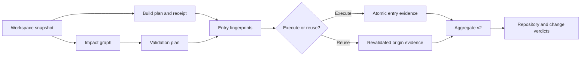

# Operation Startrail — Trusted Incremental Validation and Resumable Full Evidence

> **NON-NORMATIVE COMPLETED PLAN.** This historical record preserves Operation
> Startrail's implementation sequence and closeout evidence. Current behavior is
> owned by the authoritative Build and Testing specifications linked below.
> Post-completion findings `L4-BUILD-01..08` and `L4-STAR-01..16` were repaired
> by the completed
> [`CodeReview_CrossDomain_Remediation_2026-08-10.md`](CodeReview_CrossDomain_Remediation_2026-08-10.md),
> which supersedes this record's former closeout assertions. Both files remain
> implementation history; current authority stays in the Build and Testing
> specifications.

## Status

- **State:** DONE
- **Priority:** P0 validation integrity and developer feedback time
- **Created:** 2026-08-13
- **Planned at:** `b11d54a6c`
- **Last plan hardening:** 2026-08-13; incorporated the independent trust,
  portability, promotion, mutation, CLI, schema, consumer, and performance
  review before implementation began
- **Completed:** 2026-08-14; canonical Fresh Full and its exact Resume passed,
  compact evidence was archived, normative references were redirected to this
  Done record, and every post-move governance gate passed.
- **Primary owner:** Build and test infrastructure
- **Scope:** `build.ps1`, build receipts and final summaries,
  `Tools/Run-AllTests.ps1`, Testing/Build modules, test inventory, impact
  selection, fingerprints, checkpoint/resume, Commands granularity, aggregate
  reporting, workflows, focused native/Pester contracts, and durable build/test
  guidance
- **Size:** XL; execute in the ordered phases below, with reviewable commits at
  every schema/behavior boundary
- **Risk:** high if reuse can create false-green evidence; medium operational
  risk when deployed in shadow/fresh-first stages
- **Drift check:**

  `git diff b11d54a6c -- .gitattributes build.ps1 Directory.Build.props Directory.Build.targets RuntimeDependencies.props RedSalamander/RedSalamander.vcxproj RedSalamander/SelfTest Tools/Run-AllTests.ps1 Tools/Run-MtpLiveCloseout.ps1 Tools/Modules/Build Tools/Modules/Testing Tools/Modules/Reporting Tools/Tests Tools/tool-inventory.json Tools/README.md .github/workflows .github/skills Specs/Build Specs/Testing Specs/TestRuns/README.md Specs/Plans/WIP/README.md README.md Tests/README.md docs/DeveloperGuide.md AGENTS.md`

- **Out of scope:** suppressing or quarantining unrelated failures, weakening
  canonical fresh CI/release gates, accepting remote/shared result caches,
  optimizing individual test bodies, broadening build locks, terminating
  independently launched processes, or changing sealed Terminal history

## Implementation progress and phase gates

This checklist is the resumable source of implementation progress. A phase is
complete only when its implementation, focused tests, inventory/help/consumer
updates, and the currently true portion of the normative specs are complete.
Checking a design task does not activate behavior by itself.

- [x] Independent plan review incorporated; trust blockers have explicit gates.
- [x] Transitional Build/Testing specs and build/tooling/performance skills
      record the process impact while Fresh remains authoritative.
- [x] Phase 0A — freeze trust domains, CLI/gate semantics, migration, and schema
      ownership.
- [x] Phase 0B — land schemas, canonicalization primitives, and hermetic
      fixtures without changing runner behavior.
- [x] Phase 1 — land build receipts, portable CI attestation, runtime-closure
      validation, receipt bootstrap, and final build summary.
- [x] Phase 2 — land stable plan-entry IDs and complete execution/resource/
      coverage metadata.
- [x] Phase 3 — land stable workspace snapshots and entry fingerprints.
- [x] Phase 4 — land the governed impact graph and shadow-only explain planner.
- [x] Phase 5A — land provisional checkpoints and immutable entry evidence;
      keep reuse inaccessible to operators.
- [x] Phase 5B — isolate or model artifact-mutating entries and receipt epochs.
- [x] Phase 6 — land aggregate v2, promotion certificates, consumer migration,
      and opt-in exact-artifact resume.
- [x] Phase 7 — land Commands families and evaluate the independent artifact
      proof gate; the monolithic-binary blocker is recorded and logical reuse
      remains disabled for Full.
- [x] Phase 8 — land scheduling/cost diagnostics and deterministic performance
      measurement.
- [x] Phase 9 — complete shadow, mutation, local opt-in, CI, and release rollout
      gates.
- [x] Phase 10 — reconcile all normative specs/skills/docs, archive closeout
      evidence, run Full/governance gates, and move this plan to Done.

Mandatory dependency/activation rules:

| Consumer-visible capability | Required completed phases |
|---|---|
| Build summary from validated artifact records | 0A, 0B, 1 |
| Shadow `-ExplainPlan` with no reuse | 0A–4 |
| Internal crash-resumable checkpoints | 0A–5A |
| Public exact `Resume` | 0A–6, including aggregate-v2 consumer migration |
| Public `Affected` mode | 0A–6 plus Phase 9 affected rollout gate |
| Logical reuse contributing to repository Full green | 0A–7 plus independent-artifact proof |
| Default-local behavior change | all Phase 9 measurement/mutation gates |
| Move to `Specs/Plans/Done/` | every checklist item and Phase 10 evidence |

If implementation pauses, record the exact completed checkbox, focused command
results, changed files, and next RED test in this section before handing off.

## Executive outcome

Operation Startrail replaces the current “a new invocation forgets everything”
validation loop with a fail-closed evidence model:

1. every build has an atomic receipt tied to the exact workspace/toolchain
   snapshot and its validated outputs;
2. every test-plan entry has a stable identity, declared dependency closure,
   cache policy, resource policy, and coverage contract;
3. changed files are mapped to affected entries through a reviewed impact graph,
   with unknown or shared changes widening safely;
4. every completed entry is checkpointed immediately and can satisfy a later
   composite Full run only when its current fingerprint matches;
5. Commands supports focused family iteration but retains one broad same-process
   final seal for order/state-leak coverage;
6. repository health and change relevance are reported separately without
   turning unrelated failures into implicit suppression; and
7. the final `build.ps1` summary reports only validated artifacts, only after
   all requested packaging succeeds, using commands that can be copied and run
   directly in PowerShell.

The motivating acceptance scenario is conditional on the Phase 7 independent-
artifact proof gate:

1. a Full run executes Commands broadly and records a green Commands seal;
2. FileOperations fails;
3. the only subsequent edit is inside the reviewed FileOperations-exclusive
   test closure;
4. a resumed Full plan explains that Commands is unchanged and either reuses
   its independently fingerprinted green seal or reports repository
   `NOT_EVALUATED` when only monolithic logical equivalence is available;
5. FileOperations reruns;
6. the composite aggregate still accounts for every normal Full entry,
   identifies which evidence was executed versus reused, and calls the result
   Full green only when every reused entry satisfies the approved proof class.

## Why the current loop becomes broad

The current behavior is safe but coarse:

- `New-RSTestRunPlanEntry` records name, kind, path, arguments, working
  directory, result name, and interactive-desktop need, but no stable entry ID,
  logical input closure, artifact identity, impact tags, or cache policy.
- `Run-AllTests.ps1` creates a new run context on every invocation, removes
  stale dead-owner sandbox directories, and unconditionally launches every
  entry in the selected static plan.
- completed entries live in the current process until the aggregate is written
  after all entries finish; interruption or a late failure leaves no resumable
  authoritative Full checkpoint.
- Commands is one large logical entry. CompareDirectories, Commands, and
  FileOperations all run from the same `RedSalamander.exe`, and the Commands and
  FileOperations selftest coordinators are compiled into that executable.
- therefore, a whole-executable hash is safe but too coarse: a
  FileOperations-test-only rebuild changes the shared executable and appears to
  invalidate Commands even when the Commands logical closure did not change.
- retry classification establishes reproducibility (`FLAKY`, `REGRESSION`,
  `ISOLATION_SUSPECT`, and related states), not whether a failure is inside the
  current change's proven dependency closure.
- `build.ps1` currently constructs some display paths with literal doubled
  backslashes. It prints unquoted paths containing spaces, prints a success
  banner before optional packaging, formats elapsed time with a minute field
  that rolls over after one hour, and uses culture-sensitive variable-decimal
  size text.

These facts explain the cost, but they do not justify unsafe skipping. This plan
adds the missing proof model rather than replacing broad reruns with path
heuristics.

## Authority, ownership, and active-plan coordination

This plan owns:

- validation snapshots, build receipts, entry fingerprints, impact selection,
  durable checkpoints, resumable Full composition, Commands final-seal policy,
  reuse provenance, and build completion rendering;
- the new schemas and data contract needed for those mechanisms; and
- migration of build/test runner consumers to those contracts.

It coordinates with, but does not absorb:

- **I5 / Operation Astrolabe:** owns repository-wide migration away from brittle
  behavioral source-shape tests. Startrail may add structural safety guards for
  fingerprints, schemas, plan membership, and impact closure, but must not
  recreate the Astrolabe replacement queue.
- **I6 / Performance measurement contract:** owns archived performance evidence,
  percentile quality, and perf closeout semantics. Startrail classifies perf
  entries as non-cacheable unless I6 defines a stronger reviewed boundary.
- **I11 / Tools inventory and governance:** owns general Tools placement,
  inventory schema, help, compatibility, and lifecycle policy. Every Startrail
  file under `Tools/` must comply with that contract.

Concurrent work must serialize when it touches `build.ps1`,
`Run-AllTests.ps1`, `TestRunPlan*`, `TestSuitePlan.psm1`,
`TestRunSummary.psm1`, `TestInventory.psm1`, or their focused tests.

## Authoritative specifications to update during implementation

The plan is not normative. Durable behavior must land in:

- a new `Specs/Testing/Testing_ValidationEvidence.md` contract;
- `Specs/Testing/Testing_SelfTests.md`;
- `Specs/Testing/Testing_TestCoverage.md`;
- `Specs/Testing/Testing_ToolingGovernance.md`;
- `Specs/Testing/Testing_PerformanceValidation.md` for cacheability boundaries;
- `Specs/Build/Build_Toolchain.md`;
- `Specs/TestRuns/README.md` when composite evidence is archived;
- `Tools/README.md`;
- `.github/skills/tooling-governance/SKILL.md`;
- `.github/skills/cpp-build/SKILL.md`; and
- `AGENTS.md` when the recommended validation loop changes.

## Terminology

- **Workspace snapshot:** immutable identity of the actual source/build inputs
  present in the worktree, including dirty and nonignored untracked content.
- **Build receipt:** atomic attestation describing the successful build request,
  toolchain/input identities, and validated artifacts for one profile.
- **Impact graph:** governed mapping from changed paths and shared contracts to
  affected validation entries.
- **Plan entry:** one stable validation unit with identity, execution, coverage,
  dependency, resource, and cache contracts.
- **Entry fingerprint:** canonical digest of every input that can change the
  entry's result or coverage.
- **Evidence record:** immutable atomic result for one actually executed entry.
- **Provisional evidence:** immutable executed-entry evidence that has not yet
  passed its required post-execution source/artifact stability barrier and
  therefore cannot be reused.
- **Promotion certificate:** immutable record that binds an entry evidence
  digest to the verified post-execution snapshot, artifact epoch, and terminal
  run state that make it eligible for reuse.
- **Artifact epoch:** one interval during which every artifact in an entry's
  declared read set retains the attested digest. An artifact-writing entry ends
  the current epoch before it mutates the profile.
- **Portable CI build attestation:** same-workflow build evidence whose
  authoritative paths are repository-relative and whose producer/workflow,
  source, toolchain, runtime closure, and output digests are revalidated after
  download into the consumer checkout.
- **Composite run:** a complete requested plan satisfied by a mixture of newly
  executed and compatible reused green evidence.
- **Validation campaign:** one explicit lineage rooted at the first feature
  snapshot. Later runs may reference that lineage only through reviewed changes
  whose impact is recomputed; `ResumeFrom` carries the campaign identity
  forward rather than silently selecting a repository-global “latest” result.
- **Broad Commands seal:** one complete Commands run in the existing
  same-process order, tied to the final relevant Commands fingerprint.
- **Repository verdict:** health of every entry required by the requested
  repository gate.
- **Change verdict:** health of entries proven direct/shared/unknown for the
  selected change.
- **Fresh evidence:** produced by execution in the current run.
- **Reused evidence:** produced by an earlier execution, revalidated against the
  current fingerprint and explicitly attributed to its origin.

## Non-negotiable safety and trust invariants

1. Default local behavior remains fresh until shadow-mode evidence and mutation
   tests justify changing it. CI and release explicitly request fresh behavior.
2. A run must never say “Full green” when any required Full entry has neither
   current green execution nor compatible reused green evidence.
3. Reuse is permitted only for complete `PASSED` evidence with the exact
   expected coverage contract. Failed, flaky, isolation-suspect, quarantined,
   timed-out, crashed, partial, interrupted, malformed, or unknown results are
   never reusable.
4. Missing, corrupt, schema-incompatible, ambiguous, or stale records cause
   execution. Cache trouble may cost time; it must not create success.
5. Unknown changed files select the reviewed broad fallback. Mappings accumulate;
   first-match behavior is forbidden.
6. Renames and deletions evaluate both old and new paths. The snapshot includes
   staged, unstaged, and nonignored untracked inputs.
7. Trust uses content digests. File size and timestamps may accelerate discovery
   but cannot establish a cache hit.
8. A source snapshot change between consumption start and completion marks the
   affected evidence `INVALIDATED_DURING_RUN` and prevents promotion.
9. Existing artifact locks, shared-dependency locks, packaging locks,
   interactive-desktop mutex boundaries, process containment, contamination
   markers, and no-kill rules remain unchanged.
10. Performance, live-device, credential, external-network, unseeded-random, and
    unproven desktop-global entries begin as `Never` or `SessionBound`, never as
    portable cache hits.
11. Local evidence is not release attestation. It is never trusted when
    downloaded from an untrusted workflow, PR artifact, or another checkout.
12. A composite run is labeled composite. A reused entry is never rendered as
    freshly executed.
13. Commands family iteration supplements but never deletes the broad
    same-process state/order seal.
14. Relevance is orthogonal to health. “Unrelated” cannot silently convert a
    required failing Full entry to green.
15. Evidence/cache paths resolve beneath verified repository-owned roots and
    reject reparse/path traversal escapes before reading, writing, or pruning.
16. Every digest has a documented identity projection. The digest field itself,
    timestamps, durations, presentation-only absolute paths, and other volatile
    diagnostics are excluded unless a contract explicitly makes them semantic.
17. Local receipts and portable CI attestations are distinct trust classes.
    Physical-checkout identity is mandatory for local reuse; cross-job CI
    consumption requires same-workflow provenance plus source/toolchain/runtime/
    artifact digest verification and path rebinding. A PR-supplied receipt is
    never trusted merely because it was downloaded.
18. A missing or incompatible receipt cannot bootstrap trust from an ordinary
    incremental no-op. First attestation requires a selected-target rebuild or
    an equally strong prior attestation whose artifact hashes still match.
19. Executed entry results are provisional until their post-execution snapshot
    and artifact epoch are verified. Reuse requires a valid promotion
    certificate; a raw `PASSED` record is insufficient.
20. Plan entries declare artifact read and write sets. An entry that can delete,
    replace, stage, package, or rebuild profile outputs is an artifact mutator,
    ends the prior epoch, and cannot be scheduled as `artifact-read-only`.
21. Coverage-reducing filters/families never produce a Full repository verdict.
    They are rejected for a Full gate or yield repository `NOT_EVALUATED`.
22. Skipped cases have an explicit outcome policy. Dynamic capability-dependent
    skips bind the capability identity and are `Never`/`SessionBound` until a
    reviewed reusable boundary exists; an exit-zero suite is not reusable just
    because all declared cases were observed.
23. A changed monolithic `RedSalamander.exe` cannot contribute logically reused
    Commands evidence to Full green based only on source/include closure. Full
    logical reuse requires an independently fingerprintable test artifact or a
    separately approved equivalence proof that covers link, initialization,
    runtime-load, environment, and order effects. Without it, the result is
    iterative evidence and repository `NOT_EVALUATED`.
24. `known_baseline` attribution requires an explicit operator-selected origin
    (`ResumeFrom` or a future reviewed `BaselineFrom`) and a versioned structured
    signature. Automatic repository-global baseline discovery is forbidden.
25. Build/test artifact identities cover the complete runtime closure consumed
    by the entry, including staged themes, plugins, language resources, schemas,
    runtime DLLs, and other non-executable payloads. Post-receipt staging without
    a new attestation invalidates compatibility.
26. Public Resume remains unavailable until aggregate v2 and every in-repository
    summary/archive/report consumer can distinguish executed, reused,
    provisional, promoted, composite, and incomplete evidence.

## Target operator experience

### Fresh closeout

    .\Tools\Run-AllTests.ps1 -Suite Full -ValidationMode Fresh

The command executes every Full entry, writes atomic entry checkpoints as it
progresses, and produces a fresh aggregate.

### Explain before executing

    .\Tools\Run-AllTests.ps1 -Suite Full `
        -ValidationMode Resume `
        -ResumeFrom <run-id> `
        -ExplainPlan

The command performs no build or test mutation. Human and JSON output must show:

- changed paths and the snapshot comparison;
- matched impact rules and shared fallbacks;
- every normal Full entry;
- `EXECUTE`, `REUSE`, or `BLOCKED` for each entry;
- origin run/evidence for reuse;
- exact invalidation/reuse reason codes;
- expected build action;
- estimated fresh duration, expected executed duration, and avoided duration.

### FileOperations-only repair

    .\Tools\Run-AllTests.ps1 -Suite Full `
        -ValidationMode Resume `
        -ResumeFrom <run-id>

Expected behavior after a proven FileOperations-test-only edit:

- FileOperations executes;
- the compatible broad Commands seal is reused;
- unaffected compatible entries reuse;
- the aggregate contains every Full entry;
- the process exit code follows the Full repository verdict; and
- output clearly states that the run is a resumed composite, not a fresh Full.

### Affected iteration

    .\Tools\Run-AllTests.ps1 -Suite Full `
        -ValidationMode Affected `
        -ImpactBase origin/master `
        -ExplainPlan

`Affected` is an iterative workflow, not a synonym for Full. Its aggregate must
set repository status to `NOT_EVALUATED` unless compatible evidence happens to
cover the complete Full plan.

### Final build summary

For a successful ASan Debug x64 full build, after every requested packaging step
has completed, the final block must be equivalent to:

    ========================================
    Build completed successfully!
    Configuration: ASan Debug | Platform: x64
    Build time: 02:49
    ========================================
    Outputs (copy/paste any PowerShell command to run):
    & "C:\src\RedSalamander\.build\x64\ASan Debug\RedLauncher.exe" # 2.96 MiB
    & "C:\src\RedSalamander\.build\x64\ASan Debug\RedSalamander.exe" # 128.43 MiB
    & "C:\src\RedSalamander\.build\x64\ASan Debug\RedSalamanderMonitor.exe" # 11.63 MiB

Required details:

- the path is absolute so it remains runnable from another current directory;
- a normal drive path contains one separator between components;
- a leading doubled separator is preserved only for a real UNC root;
- the complete line is a valid PowerShell invocation: `&` is required because a
  quoted path alone evaluates to a string;
- paths are double-quoted and escaped against PowerShell interpolation/injection
  (backtick first, then `$` and `"`);
- the size is a PowerShell comment, so copying the whole line still works;
- `MiB` is used because PowerShell `1MB` equals 1,048,576 bytes;
- sizes use invariant culture and exactly two decimal places;
- `ASan Debug`, `x64`, and `ARM64` use canonical casing;
- elapsed time is `mm:ss` below one hour and `h:mm:ss` at/above one hour, without
  minute rollover;
- only executable artifacts receive runnable lines; DLL/MSIX/MSI/ZIP/symbol
  outputs receive quoted `Output:` paths without pretending they are commands;
- output order is deterministic; and
- no stale file is reported merely because `Test-Path` found it from an older
  build.

## Architecture

The runner must keep these boundaries separate:

- the impact graph proposes which entries are relevant;
- fingerprint equality is the authority for reuse;
- execution produces immutable evidence;
- the aggregate proves complete plan accounting; and
- verdict policy interprets health without rewriting evidence.

## Machine contracts

### 0. Canonical identity, schemas, and parser boundary

Every persisted machine record is UTF-8 without BOM, uses LF, is bounded before
deserialization, rejects duplicate object keys, and is validated against one
checked-in schema before its data influences execution or reuse. Schema files
declare one reviewed JSON Schema draft and use `additionalProperties: false`
except at an explicitly versioned extension point.

Add explicit schemas for these distinct records rather than overloading one
ambiguous evidence schema:

- `ValidationPlan.schema.json` — stable requested plan and entry contracts;
- `ValidationPlanDecision.schema.json` — deterministic explain-plan output;
- `ValidationRunState.schema.json` — atomically replaced mutable checkpoint;
- `ValidationEntryEvidence.schema.json` — immutable executed-entry evidence;
- `ValidationPromotion.schema.json` — immutable reuse-eligibility certificate;
- the workspace, impact, build-receipt, and aggregate schemas listed below.

`ValidationEvidence.schema.json` may remain as a small shared `$defs` owner only
when every concrete record still has an independently testable root schema.

Canonical JSON requirements:

- the reviewed schema dialect is JSON Schema draft-07;
- canonical bytes are UTF-8 without BOM, whitespace, or a trailing newline;
  persisted records append exactly one LF after those bytes, while identity
  digests hash the semantic projection's canonical bytes without that LF;
- object keys and string values are Unicode NFC; object keys sort by ordinal
  UTF-16 code-unit order after normalization; duplicate normalized keys fail;
- arrays retain contract-defined order; arrays declared as sets are normalized
  by their owning contract before serialization and schemas use `uniqueItems`;
- scalar output is `null`, lowercase Boolean, NFC JSON string with the minimal
  required escapes and lowercase `\\u` hex, or invariant signed 64-bit decimal
  integer with no leading zero; floating-point, decimal, date, and implicit
  string coercion are forbidden;
- absence and explicit `null` are distinct, and `null` is legal only where the
  concrete schema permits it;
- define the exact scalar encoding, property order, array order, string escaping,
  integer domain, Unicode normalization, and null policy;
- IDs use a constrained lowercase ASCII grammar and uniqueness is checked with
  ordinal comparison; Windows paths additionally reject case-insensitive aliases;
- define an identity projection for every digest and hash the canonical bytes of
  that projection; never hash the digest field itself;
- timestamps, durations, original path spelling, absolute diagnostic paths, and
  presentation labels do not affect semantic compatibility unless named by the
  projection;
- Startrail record creation, validation, and reuse require PowerShell 7.4 or
  newer. Windows PowerShell 5.1 must fail before reading or writing Startrail
  evidence with the invalid-CLI/plan exit category; transitional legacy Fresh
  behavior remains unchanged until rollout explicitly raises the runner minimum;
- bound each record to 16 MiB, nesting depth to 64, total nodes to 100,000,
  individual strings to 1 MiB characters, repository-relative paths to 1,024
  characters, copied per-entry result/log evidence to 64 MiB, and a run's
  materialized evidence payload to 1 GiB before allocation or recursion; and
- parser/schema/canonicalization versions are independent inputs to fingerprints.

Atomic publication uses the repository's reviewed same-directory temporary-file
and replace/move semantics. Tests cover destination-present and destination-absent
paths, interruption, access denied, reparse components, and preservation of the
prior complete bytes.

### 1. Workspace snapshot

Add `Tools/Modules/Testing/ValidationFingerprint.psm1` and a versioned snapshot
schema in `Specs/Testing/WorkspaceSnapshot.schema.json`.

Canonicalization rules:

- SHA-256;
- repository-relative paths use forward slashes in hashed JSON;
- Windows path comparison is ordinal case-insensitive, while original spelling
  remains diagnostic;
- object property order and array order are explicit and deterministic;
- the canonicalization version is embedded in every digest-bearing record;
- actual working-tree bytes are hashed, not only `HEAD`;
- exclusions are explicit: `.git`, `.build`, TestSandbox, validation evidence,
  logs, and declared generated outputs;
- tracked deletions, rename pairs, relevant file modes, symlink/reparse evidence,
  staged content, unstaged content, and nonignored untracked files are recorded;
- no implicit network fetch occurs while resolving `ImpactBase`.
- snapshot acquisition records a before/after Git/index/worktree token and
  retries or fails closed when files mutate while the snapshot itself is being
  constructed;
- branch comparison resolves a local merge base deliberately; a commit-ish is
  passed to Git after `--end-of-options` or an equivalent injection-safe
  boundary; and
- partially staged paths retain distinct base/index/worktree content identities.

Minimum shape:

    {
      "schema": "red-salamander.workspace-snapshot.v1",
      "canonicalization": "rs-canonical-json-v1",
      "snapshot_id": "<sha256>",
      "repo_identity": "<physical-checkout-identity>",
      "git_head": "<commit>",
      "base": "<resolved-impact-base-or-null>",
      "files": [
        {
          "path": "RedSalamander/SelfTest/FileOperations/example.cpp",
          "status": "modified",
          "base_sha256": "<head-or-impact-base-content-or-null>",
          "index_sha256": "<staged-content-or-null>",
          "worktree_sha256": "<actual-content-or-null>",
          "worktree_size_bytes": 123,
          "old_path": null
        }
      ],
      "created_utc": "<iso-8601>"
    }

`snapshot_id` hashes the semantic projection through `files`; it excludes
`snapshot_id`, `created_utc`, original spelling, and other diagnostics. Repeated
stable acquisition of the same repository state must yield the same ID.

### 2. Build receipt

Add `Tools/Modules/Build/BuildEvidence.psm1`. Publish:

    .build\<platform>\<configuration>\build-receipt.json

Minimum shape:

    {
      "schema": "red-salamander.build-receipt.v1",
      "receipt_id": "<sha256>",
      "trust_scope": "local-checkout",
      "repo_identity": "<physical-checkout-identity>",
      "source_snapshot_id": "<sha256>",
      "git_head": "<commit>",
      "platform": "x64",
      "configuration": "ASan Debug",
      "target": "solution",
      "project_selection": ["RedSalamander.sln"],
      "build_arguments": [],
      "tests_enabled": true,
      "official_release": false,
      "toolchain_identity_digest": "<sha256>",
      "vcpkg_identity_digest": "<sha256>",
      "ghostty_runtime_identity": "<sha256-or-null>",
      "project_graph_digest": "<sha256>",
      "runtime_dependency_digest": "<sha256>",
      "started_utc": "<iso-8601>",
      "ended_utc": "<iso-8601>",
      "duration_ms": 169000,
      "exit_code": 0,
      "outputs": [
        {
          "id": "app.redsalamander",
          "role": "launchable",
          "relative_path": ".build/x64/ASan Debug/RedSalamander.exe",
          "absolute_path_diagnostic": "C:\\src\\RedSalamander\\.build\\x64\\ASan Debug\\RedSalamander.exe",
          "size_bytes": 134668288,
          "sha256": "<sha256>"
        }
      ]
    }

Receipt rules:

- write a unique same-directory temporary file and atomically replace/move the
  final path only after successful build and output validation;
- remove/invalidate the old success receipt before a new incompatible build
  begins, without deleting artifacts;
- failure/interruption never publishes a success receipt;
- when no compatible prior receipt exists, establish the first receipt with a
  selected-target rebuild; an incremental no-op may carry an existing
  attestation forward only when the prior source/graph/toolchain/runtime closure
  is compatible and every pre-build artifact digest still matches;
- incremental builds may attest an unchanged output only from that trusted
  baseline; “produced” means covered by this successful build request, not
  necessarily relinked;
- `-SkipBuild` requires a compatible receipt; an executable that merely exists
  is insufficient;
- outputs come from the selected project/build graph and reviewed launchable
  role mapping, not a hard-coded global list plus `Test-Path`;
- a targeted build reports only selected/covered outputs;
- build and output summary consume the same artifact records;
- receipt paths are normalized data, separate from console quoting.
- repository-relative paths are authoritative; absolute paths are diagnostics
  rebound by the local consumer and are excluded from receipt compatibility;
- targeted and full receipts are content-addressed records with an atomic
  profile pointer, so a later targeted build does not destroy still-valid
  attestations for disjoint artifacts; and
- the receipt contains a runtime-closure manifest for every selected output,
  including staged themes/plugins/language resources and other payloads consumed
  by tests or launchable applications.

Portable CI attestation is a second schema/trust scope. The build job emits
repository-relative artifact records plus source commit/snapshot, toolchain,
runtime closure, producer workflow/run/job identity, and artifact digests. The
consumer job accepts it only from its declared `needs` build job in the same
workflow run, verifies the checked-out source identity and every downloaded
artifact/runtime payload, then writes a local rebound receipt. Repository or PR
content cannot self-assert trusted workflow provenance. If that provenance is
not available to the verifier, CI rebuilds in the consumer job instead of
weakening the receipt check. Any post-download staging step must be part of the
portable manifest or followed by a new local attestation.

The receipt is validated by `Specs/Build/BuildReceipt.schema.json`. Logical
input closures should be derived from trustworthy build evidence where
available: MSBuild project/reference evaluation, compiler dependency/tlog or
`/sourceDependencies` output, imported props/targets, runtime-dependency
manifests, and PowerShell AST import discovery. A regex-only include scan is not
accepted as the sole proof for C++ header or textual-include closure. Dependency
evidence from a failed or mismatched build is not reusable.

### 3. Stable plan-entry contract

Extend `New-RSTestRunPlanEntry` with:

- `Id`: stable machine identifier, such as `selftest.commands.broad`;
- `DisplayName`: human label that may change without changing identity;
- `ImpactTags`;
- `InputSets`;
- `ArtifactIds`;
- `ArtifactReadIds` and `ArtifactWriteIds`;
- `ProducesArtifactIds` and `InvalidatesReceiptScopes` for mutators;
- `CachePolicy`: `Never`, `ExactArtifact`, `LogicalSameCampaign`, or
  `SessionBound`;
- `EnvironmentInputs`;
- `CoverageContract`: suite/family/exact cases/repeat/order;
- `OutcomeContract`: pass-required cases, reviewed static skips, capability-bound
  skips, and forbidden skip classes;
- `OrderContract`: isolated, family-process, or broad-same-process;
- `ResourceClass`: interactive desktop, performance-exclusive, CPU-heavy,
  network, device, artifact-read-only, artifact-mutating, or stateful;
- `EstimatedDurationKey`; and
- existing `RequiresInteractiveDesktop`.

Requirements:

- IDs are unique and stable across display-name changes;
- serialization is deterministic;
- the plan digest covers entry order, IDs, normalized executable/artifact IDs,
  arguments, coverage, resource, and cache policies;
- quarantine repair projection preserves all metadata;
- `Get-TestInventory.ps1` reports IDs, tags, policies, and suite membership;
- every runnable current entry must pass metadata governance.
- artifact readers cannot overlap a writer for any intersecting artifact ID;
  a writer closes the current receipt epoch and its produced outputs require a
  new compatible receipt before later readers execute;
- entries default to `Never` until their input/environment/outcome closure and
  hermeticity have focused proof; and
- dynamic/capability skips bind their non-secret capability identity and cannot
  be reused after that identity changes.

### 4. Impact graph

Add the internal machine contract `Tools/validation-impact.json` and
`Specs/Testing/ValidationImpact.schema.json`. It is an explicit Tools-root data
record because `Tools/Modules/` is reserved for `.psm1` implementation.

Each rule contains:

- stable rule ID;
- exact path or boundary-aware glob;
- classification: product, suite-test-only, shared-test, runner, build,
  workflow, spec/documentation, evidence, generated, or reviewed-no-validation;
- accumulated impact tags;
- build requirement;
- broad-fallback behavior;
- reason;
- owning specification; and
- optional derived-closure source.

Initial required mappings include:

- `RedSalamander/SelfTest/FileOperations/**` → FileOperations test-only;
- `RedSalamander/SelfTest/Commands/**` → Commands test-only and explicit family;
- `RedSalamander/SelfTest/Common/**` → all in-product selftests;
- File Operations production/UI sources → FileOperations plus the relevant
  Commands integration family;
- shared `Common/**`, settings/resources, runtime dependency declarations, and
  shared UI infrastructure → every declared consumer;
- `Tools/Run-AllTests.ps1`, Testing modules, schemas, and the impact manifest →
  invalidate all prior runner evidence;
- `Directory.Build.*`, solution/project graph, vcpkg/toolchain inputs → rebuild
  plus all artifact consumers;
- current Tools Pester files → current tooling profile, with source-contract
  scanners declaring the files they read or remaining broad/non-cacheable;
- `Specs/TestRuns/**` → archive validation only; and
- unknown relevant paths → broad Full fallback.

Graph governance:

- impacts accumulate across all matching rules;
- additions to Compile/Include/Resource/import/project-reference surfaces are
  derived or require a manifest update;
- every relevant tracked path has at least one mapping or a reviewed explicit
  nonvalidation classification;
- rename/delete pairs cannot evade the graph;
- untracked files beneath consumed directories participate;
- the planner prints every matched rule and fallback;
- mutation tests add representative files and prove selection.

### 5. Entry fingerprint

An entry fingerprint includes:

- schema/canonicalization version;
- stable entry ID and complete normalized entry contract;
- current plan digest;
- logical input-set digests;
- required build receipt fields and artifact digests according to policy;
- runner script and every imported module/schema/manifest that affects behavior;
- normalized arguments, filters, repeats, shuffle seed, timeout multiplier,
  perf budget, classification mode, and quarantine content;
- expected case/family coverage identity;
- platform/configuration/toolchain/runtime identity;
- explicitly whitelisted environment/capability inputs; and
- cache policy version.

No secret value or complete environment dump is stored. Credential/device
presence may be represented only by reviewed non-secret capability identity,
and those entries remain non-cacheable until explicitly approved.

### 6. Shared-executable exception

The same `RedSalamander.exe` contains several logical selftest suites. Source or
include closure alone cannot prove behavioral equivalence after that executable
is relinked: linker/LTCG decisions, static initialization, runtime loading,
binary layout, timing, and shared process state remain possible coupling. Reuse
therefore has three proof classes:

- **ExactArtifact:** required artifact SHA-256 is identical.
- **IndependentLogicalArtifact:** the reused entry has an independently
  fingerprintable DLL/executable/object payload and every artifact in that
  entry's runtime closure is identical.
- **MonolithicLogicalCandidate:** the monolithic artifact SHA may differ only
  because every changed
  path belongs to one reviewed suite-exclusive test-only input set, while the
  entry's production, test, shared-harness, build-graph, runtime, runner,
  environment, and coverage closures are identical. This is useful iterative
  evidence but cannot satisfy repository Full by itself.

`IndependentLogicalArtifact` is permitted only when all of these are true:

1. same physical repository and profile;
2. same validation campaign, Windows logon/desktop session, and toolchain;
3. changed paths are exclusively in a reviewed test-only input set;
4. an automated graph contract proves that input set is not textually included,
   compiled, linked, imported, initialized, or loaded by the reused entry and
   its independent runtime closure;
5. reused evidence is visibly labeled logical reuse; and
6. no repeat/shuffle/perf/classifier override changed the order contract; and
7. focused mutation tests change each excluded suite payload and demonstrate
   that the reused artifact and complete runtime closure remain byte-identical.

The first intended optimization remains FileOperations-exclusive selftest code
after a green Commands broad seal, but splitting selftest payloads into
independently fingerprintable DLLs/executables is now an activation prerequisite
for calling that composite Full green. Until the split/proof lands, the planner
may display `MonolithicLogicalCandidate`, avoid no required Full execution, and
set repository verdict `NOT_EVALUATED` for any experimental run that elects not
to rerun Commands. Emitting a per-suite object receipt is acceptable only if it
also proves the link/initialization/runtime boundary above; a compiler include
list alone is insufficient.

### 7. Durable validation ledger

Keep reusable evidence separate from disposable TestSandbox runs:

    .build\ValidationEvidence\v1\<platform>\<configuration>\<run-id>\

Each invocation creates a unique run directory. `run-state.json` is the only
atomically replaced mutable checkpoint while that invocation is active;
`plan.json`, `decisions.json`, `entries/<stable-id>/<digest>.json`, copied
artifacts, and `promotions/<stable-id>/<digest>.json` are immutable once
published. Resume creates a new run that references prior immutable evidence;
it never mutates the old run.

Minimum run state:

    {
      "schema": "red-salamander.validation-run-state.v1",
      "run_id": "<id>",
      "campaign_id": "<root-run-id>",
      "campaign_sequence": 2,
      "parent_run_id": "<id-or-null>",
      "requested_suite": "Full",
      "validation_mode": "Resume",
      "snapshot_id": "<sha256>",
      "build_receipt_id": "<sha256>",
      "plan_digest": "<sha256>",
      "status": "running",
      "entries": [
        {
          "id": "selftest.commands.broad",
          "ordinal": 2,
          "decision": "reuse",
          "status": "reused",
          "reason_codes": ["REUSED_LOGICAL_TEST_ONLY"],
          "expected_fingerprint": "<sha256>",
          "origin_run_id": "<id>",
          "origin_evidence_digest": "<sha256>"
        }
      ]
    }

State machine:

    PENDING -> RUNNING -> PROVISIONAL_PASSED | FAILED | INTERRUPTED | INVALIDATED
    PROVISIONAL_PASSED -> PROMOTED | INVALIDATED
    PENDING -> REUSED

Checkpoint rules:

- atomically persist the complete initial plan before launching the first child;
- atomically persist `RUNNING` immediately before an entry launch;
- parse output, verify coverage, classify health, preserve required artifacts,
  hash immutable provisional evidence, acquire a post-entry workspace/artifact
  snapshot, and then atomically publish the terminal checkpoint;
- a prior `RUNNING` state becomes `INTERRUPTED` on resume and executes again;
- only evidence with a valid immutable promotion certificate can be reused;
- promotion binds the provisional evidence digest, pre/post semantic snapshot
  equality, artifact epoch and digests, plan/entry fingerprint, outcome/skip
  contract, and origin run terminalization policy;
- an interrupted run may contribute an already promoted entry only when that
  entry completed its own post-entry barrier before interruption; a raw pass
  from a run that never reached the barrier is diagnostic only;
- provenance is flattened to the original execution to prevent trust chains,
  cycles, or dangling origins;
- origin digest and current fingerprint are revalidated before reuse;
- logical comparison is cumulative from the original executed evidence snapshot
  to the current snapshot, never only parent-to-child; provenance flattening
  cannot hide an earlier relevant edit;
- required logs/results are copied into evidence storage before disposable
  sandbox cleanup;
- cache read failure executes; cache write failure disables later reuse and is
  reported without turning failure into success;
- pruning is age/size bounded, refuses active/referenced evidence, and remains
  beneath a verified non-reparse repository cache root.
- publication uses unique run directories and no mutable global success index;
  any future “latest compatible” index is advisory only and can never replace
  explicit fingerprint/provenance validation.

Candidate discovery must require the origin promotion certificate and validate
the origin record directly. A terminal aggregate is not required for exact
resume after interruption when each reused entry has its own promotion, but a
public composite Full verdict still requires aggregate v2 complete accounting.
Pruning must either retain every referenced origin or materialize a new
self-contained promoted copy before removing it; reference chains cannot make
retention unbounded silently.

Required reason codes:

    NO_PRIOR_EVIDENCE
    PREVIOUS_NOT_GREEN
    CORRUPT_EVIDENCE
    SCHEMA_MISMATCH
    SOURCE_INPUT_CHANGED
    BUILD_ARTIFACT_CHANGED
    LOGICAL_INPUT_CHANGED
    SHARED_CONTRACT_CHANGED
    RUNNER_CHANGED
    ENVIRONMENT_CHANGED
    ARGUMENTS_CHANGED
    COVERAGE_CHANGED
    OUTCOME_POLICY_CHANGED
    CAPABILITY_CHANGED
    DYNAMIC_SKIP_NOT_REUSABLE
    ARTIFACT_EPOCH_CHANGED
    ARTIFACT_MUTATOR_REQUIRES_REATTESTATION
    ORIGIN_NOT_PROMOTED
    POST_SNAPSHOT_MISSING
    PORTABLE_ATTESTATION_REJECTED
    NON_CACHEABLE
    SOURCE_CHANGED_DURING_RUN
    FORCED
    REUSED_EXACT
    REUSED_INDEPENDENT_LOGICAL_ARTIFACT
    MONOLITHIC_LOGICAL_CANDIDATE_NOT_FULL

### 8. Aggregate v2 and verdicts

Upgrade to `red-salamander.run-all-tests.v2` while readers continue accepting
archived v1 summaries.

Add:

- validation mode;
- snapshot, build receipt, plan, entry, and evidence digests;
- changed paths, impact rules, and selection decisions;
- stable entry ID;
- `execution: executed|reused`;
- origin run/evidence;
- provisional/promotion state and promotion-certificate digest;
- artifact epoch plus declared read/write/produced sets;
- cache policy and reason codes;
- expected versus observed coverage, pass/skip outcome policy, and capability
  identity used for any dynamic skip;
- repository verdict and change verdict;
- executed/reused counts and duration;
- estimated avoided duration;
- invalidated/incomplete evidence; and
- Commands broad-seal state: fresh, exact-reused, logical-reused, absent, or
  invalid.

Verdict rules:

- Fresh/Resume Full exit code follows the repository verdict.
- Affected mode exit code follows direct/shared/unknown change health;
  repository verdict is `NOT_EVALUATED` unless complete compatible evidence is
  present.
- an observed or baseline-known unaffected failure is reported separately only
  with exact compatible baseline/fingerprint/signature evidence;
- unknown/shared failures are change-blocking;
- no result with a required red entry is called Full green.
- no filtered/family-reduced plan is called Full; its repository verdict is
  `NOT_EVALUATED` even when every selected entry passes; and
- a monolithic logical candidate never satisfies complete Full accounting.

### 9. Failure attribution without suppression

Health classification and change attribution are independent axes. Add
`candidate_new`, `affected`, `shared_contract`, `known_baseline`,
`unaffected`, and `unresolved` attribution values, each with evidence:

- exact entry ID and fingerprint;
- stable case ID;
- structured failure signature (case ID, normalized failure code/category, and
  normalized reason fields; never an arbitrary console substring alone);
- matched impact edges;
- exact compatible baseline origin when claiming `known_baseline`; and
- issue/owner reference when the failure is deferred outside the current change.

An unrelated failure must not automatically expand the current repair into an
unbounded product investigation. It is emitted as a separate diagnostic when
its compatible baseline and unchanged closure prove that disposition. It still
keeps a fresh/complete Full repository verdict red until fixed, explicitly
accepted through existing policy, or covered by a separately reviewed
quarantine contract. New, changed-signature, shared, or unresolved failures
remain in the current blocking set.

Baseline selection is explicit. Initially only `-ResumeFrom` supplies an origin.
If Affected mode later needs an independent comparison baseline, add a distinct
`-BaselineFrom <run-id>` parameter with the same path/provenance validation;
never search a global latest record. Failure signatures have their own schema
and normalization version, and a version mismatch yields `unresolved` rather
than `known_baseline`.

## Commands execution model

Add stable family metadata to Commands case inventory:

- runtime `--selftest-list-cases` emits `family` and stable case identity;
- static inventory and runtime inventory have exact set equality;
- family membership is explicit, never inferred from an incidental prefix;
- family selection uses an explicit native option or a checked exact-case list;
- each iterative family run starts a fresh process;
- the existing complete Commands entry stays one broad same-process run.

Planner policy:

1. run cheap affected contract/family tests during implementation;
2. after the last Commands-affecting product/shared change, execute broad
   Commands once and record the seal;
3. subsequent suite-exclusive FileOperations test repairs may reuse that seal;
4. Commands product/test/shared harness, runner, build graph, runtime,
   environment, coverage, repeat/shuffle/perf/classifier changes invalidate it;
5. classification retries rerun the failed entry/case only and never restart
   already-green unrelated entries;
6. final fresh CI/release continues to execute broad Commands.

## Scheduling and cost model

Use existing case/suite history as planning input, never as trust:

- construct the snapshot, impact selection, and test plan before deciding what
  to build; derive the minimal required project targets from selected entries,
  and verify them through the build receipt;
- skip the build only when every selected artifact consumer has a compatible
  receipt; never infer build freshness from path existence;
- cheap source/schema/governance entries run before expensive interactive work;
- affected/focused entries run before broad seals;
- broad Commands runs after the feature snapshot stabilizes;
- independent noninteractive entries may run concurrently only after artifact
  paths and global resources are proven disjoint;
- artifact-mutating entries declare exact write/produced sets, cannot overlap
  intersecting readers/writers, close the current receipt epoch, and must be
  followed by re-attestation before any later artifact consumer;
- interactive desktop and performance entries remain serialized/exclusive;
- `-ExplainPlan` reports estimated costs and highlights a compatible expensive
  green entry that would be rerun under `Fresh`;
- cost never overrides dependency/fingerprint policy.

The current Tools Pester profile is also a coarse entry. During shadow mode,
derive stable per-file or reviewed-group identities from
`CurrentToolingProfile.Tests.ps1` discovery while retaining its historical
exclusions. Enable per-file reuse only after hermeticity is proven; changes to
`TestSupport.psm1`, the profile wrapper, Pester version, runner modules, or
shared scanned inputs invalidate all dependent groups. If broad same-session
ordering protects a real contract, retain a final tooling-profile seal rather
than silently losing it.

`ToolsPesterTests` in Full currently includes `RequiresBuildToolchain` coverage,
including targeted deployment tests that delete and rebuild selected profile
outputs. Before reuse is enabled, split that cohort into an explicit
artifact-mutating entry and either:

1. run it in an isolated disposable output profile/worktree;
2. schedule it before the attested main build; or
3. close the epoch, rebuild/re-attest the affected outputs, and rerun every
   invalidated final seal afterward.

It must never remain hidden inside an `artifact-read-only` Pester entry.

Target planning overhead, measured before enforcing:

- warm explain/plan: under 2 seconds;
- cold snapshot/impact plan: under 10 seconds on the reference workspace;
- fingerprint time reported separately;
- the controlled FileOperations repair scenario avoids one complete Commands
  process launch.

Deterministic performance evidence is part of implementation, not a Phase 10
afterthought. Add a hermetic planning benchmark fixture with a fixed synthetic
repository manifest and three named scenarios:

- `validation.plan.warm_explain_ms` — unchanged manifest and warm process/cache;
- `validation.plan.cold_snapshot_ms` — cold canonical snapshot plus impact plan;
- `validation.plan.fileops_resume_avoided_ms` — controlled FileOperations-only
  repair, including measured fresh Commands duration and avoided duration.

Record snapshot enumeration, content hashing, Git discovery, impact matching,
schema validation, evidence lookup, and total planning durations separately.
Run enough samples for the percentile claim required by
`Testing_PerformanceValidation.md`, archive same-machine baseline and candidate
under `Specs/TestRuns/<MachineHash>/Validation/<RunId>/`, retain the compact
metrics/plan/result inputs, and validate the archive. If the comparison is not
same-machine/same-fixture, label it directional. Estimated history never enters
any trust digest or execution decision.

## Public CLI contract

Add parameter sets so invalid combinations fail before build or lock acquisition:

    -ValidationMode Fresh|Resume|Affected
    -ResumeFrom <run-id>
    -ImpactBase <commit-ish>
    -ExplainPlan
    -PlanOutputPath <json-path>
    -ForceValidationEntry <stable-id[]>
    -BaselineFrom <run-id>   # deferred until an Affected baseline is required

Rules:

- rollout default is `Fresh`;
- `Resume` requires `-ResumeFrom`; automatic “latest” selection is deferred;
- `Affected` requires an explicit locally resolvable `-ImpactBase`;
- `-ExplainPlan` launches no build or test and performs no evidence pruning;
- `-PlanOutputPath` writes deterministic JSON atomically;
- `-ForceValidationEntry` always executes the entry and prerequisites;
- changed-file discovery includes base delta plus staged, unstaged, and
  nonignored untracked paths;
- CI workflows explicitly pass `-ValidationMode Fresh`;
- help documents prerequisites, side effects, evidence roots, exit semantics,
  and safe examples.

Mode/gate matrix:

- `Fresh` accepts any existing Suite, always executes every selected entry, and
  never reads prior evidence to create success;
- `Resume` initially accepts only `CI` or `Full`, requires `-ResumeFrom`, and
  rejects a parent whose requested gate/profile is incompatible;
- `Affected` requires `-ImpactBase`; it may intersect an explicit suite but the
  repository verdict is `NOT_EVALUATED` unless compatible promoted evidence
  accounts for that suite's complete canonical plan;
- `CaseFilter`, family selection, repeat/shuffle classifier probes, and other
  coverage-changing flags are valid focused workflows but reject a repository
  Full verdict; the aggregate records `requested_gate=Full` separately from
  `coverage_scope=filtered` and reports `NOT_EVALUATED`;
- `-SkipBuild` with a required build decision fails before test launch and names
  the missing/incompatible receipt; `-ExplainPlan` reports that block without
  mutating artifacts;
- forcing an ID outside the requested suite is rejected rather than silently
  broadening the gate; forcing an in-suite ID also executes its prerequisites;
- run IDs and commit-ish values have strict lexical validation and are passed to
  Git/path APIs through non-option, non-traversal boundaries; and
- stable process exit categories distinguish success, selected-test failure,
  repository-not-evaluated, invalid CLI/plan, blocked/missing attestation, and
  corrupt evidence. Values are fixed as `0`, `1`, `2`, `3`, `4`, and `5`
  respectively; native parameter-binding/host failures that occur before the
  runner owns control remain host failures and are not remapped.

## Build-summary and receipt contract

`BuildEvidence.psm1` owns pure artifact records, receipt serialization, duration
formatting, invariant size formatting, and PowerShell command formatting.
`build.ps1` retains colored console presentation and orchestration.

Implementation rules:

1. construct paths with `Join-Path` and `GetFullPath`, never embedded
   `.build\\...` display strings;
2. format a double-quoted PowerShell literal by escaping backtick first, then
   dollar and double quote; prepend `& ` for executable commands;
3. test the complete emitted line with the PowerShell parser and a harmless
   executable fixture from a different current directory;
4. preserve UNC root semantics while rejecting accidental repeated separators
   after the root;
5. format bytes as invariant, fixed-two-decimal MiB;
6. format input durations 59:59, 60:00, and 125:09 as `59:59`, `1:00:00`,
   and `2:05:09` respectively, without minute rollover;
7. canonicalize display values to `Debug`, `Release`, `ASan Debug`, `x64`, and
   `ARM64`;
8. collect launchable artifacts from the successful build receipt;
9. render non-executable package outputs separately;
10. print exactly one final success banner after optional MSIX/MSI/ZIP/Winget
    work completes;
11. a later packaging failure must not leave an earlier final-looking green
    banner;
12. preserve failure summaries and original nonzero exit codes.

## Planned file map

### Add

- `Specs/Testing/Testing_ValidationEvidence.md`
- `Specs/Testing/WorkspaceSnapshot.schema.json`
- `Specs/Testing/ValidationEvidence.schema.json` (shared `$defs`, if retained)
- `Specs/Testing/ValidationPlan.schema.json`
- `Specs/Testing/ValidationPlanDecision.schema.json`
- `Specs/Testing/ValidationRunState.schema.json`
- `Specs/Testing/ValidationEntryEvidence.schema.json`
- `Specs/Testing/ValidationPromotion.schema.json`
- `Specs/Testing/ValidationImpact.schema.json`
- `Specs/Testing/RunAllTestsSummary.schema.json`
- `Specs/Build/BuildReceipt.schema.json`
- `Specs/Build/PortableBuildAttestation.schema.json`
- `Tools/validation-impact.json`
- `Tools/Modules/Build/BuildEvidence.psm1`
- `Tools/Modules/Testing/ValidationFingerprint.psm1`
- `Tools/Modules/Testing/ValidationImpact.psm1`
- `Tools/Modules/Testing/ValidationEvidence.psm1`
- `Tools/Tests/BuildEvidence.Tests.ps1`
- `Tools/Tests/ValidationFingerprint.Tests.ps1`
- `Tools/Tests/ValidationImpact.Tests.ps1`
- `Tools/Tests/ValidationEvidence.Tests.ps1`

### Modify

- `build.ps1`
- `Tools/Run-AllTests.ps1`
- `Tools/Modules/Testing/TestRunPlan.Common.psm1`
- `Tools/Modules/Testing/TestRunPlan.psm1`
- `Tools/Modules/Testing/TestSuitePlan.psm1`
- `Tools/Modules/Testing/TestInvocation.psm1`
- `Tools/Modules/Testing/TestRunSummary.psm1`
- `Tools/Modules/Testing/TestSandbox.psm1`
- `Tools/Modules/Testing/TestQuarantine.psm1`
- `Tools/Modules/Testing/TestInventory.psm1`
- `Tools/Modules/Testing/TestRunArchive.psm1`
- `Tools/Modules/Reporting/TestRunReporting.psm1` where aggregate fields are
  rendered or summarized
- `Tools/Run-MtpLiveCloseout.ps1`
- Commands listing/dispatch files under `RedSalamander/SelfTest/Commands/` and
  `RedSalamander/RedSalamander.cpp` only as required for explicit families
- `Tools/Tests/RunAllTestsPlan.Tests.ps1`
- `Tools/Tests/TestInventory.Tests.ps1`
- `Tools/Tests/TestRunArchive.Tests.ps1`
- `Tools/Tests/MtpLiveCloseout.Tests.ps1`
- `Tools/Tests/BuildOutputProcess.Tests.ps1` where orchestration contracts remain
- `Tools/Tests/ToolingGovernance.Tests.ps1`
- `Tools/Tests/TestHarnessSourceContracts.Tests.ps1` only for legitimate
  structural/schema boundaries
- `Tools/tool-inventory.json`
- `Tools/README.md`
- `README.md`
- `Tests/README.md`
- `docs/DeveloperGuide.md`
- applicable `.github/workflows/*.yml` and workflow policy tests
- all authoritative specs/skills listed above

Do not place JSON beneath `Tools/Modules/` and do not add another public root
command when `Run-AllTests.ps1` can own the UX.

## Execution phases

### Phase 0A — Freeze trust domains, activation, and migration contracts

**Goal:** resolve every design ambiguity that could otherwise create a false
green, break current CI, or let two executors implement incompatible schemas.

**Checklist:**

- [x] Freeze local receipt versus portable same-workflow CI attestation and the
      post-download rebinding/verifier contract.
- [x] Freeze first-attestation rebuild behavior, content-addressed receipt
      storage, atomic profile pointers, and full runtime-closure membership.
- [x] Freeze canonical JSON/schema draft, identity projections, parser/resource
      bounds, host compatibility, ID/path grammar, and atomic-write semantics.
- [x] Freeze provisional evidence, promotion certificates, artifact epochs,
      cumulative origin comparison, retention/materialization, and crash states.
- [x] Freeze Suite × ValidationMode × coverage-option × SkipBuild combinations,
      stable exit categories, explicit baseline source, and operator labels.
- [x] Classify every current CI/Full entry initially as `Never`,
      `ExactArtifact`, or `SessionBound`; no logical Full policy is enabled.
- [x] Inventory artifact-mutating entries and choose isolation, pre-build
      scheduling, or re-attestation/final-seal repair for each.
- [x] Audit every v1 aggregate/build/test consumer and lock the migration list.
- [x] Record the Phase 7 independent-artifact decision: split payloads or keep
      monolithic logical candidates non-Full permanently.

**Verification:** focused contract tests or schema fixtures must exist for each
frozen decision before implementation consumes it. `Run-AllTests.ps1` behavior
remains unchanged and Fresh.

**Exit:** there are no TBD trust decisions in Phases 0B–7, current CI's
downloaded-artifact topology has an explicit safe migration, and all public
behavior remains inactive.

#### Frozen Phase 0A audit ledger

Initial cache classifications are deliberately conservative:

| Current canonical entry group | Initial policy | Rationale |
|---|---|---|
| `CompareDirectories`, `Commands`, `FileOperations` | `SessionBound` | Interactive application selftests share desktop/process/runtime state; logical reuse is inactive. |
| CI `DxUiTests.*` and Full `DxUiTests` | `SessionBound` | Interactive desktop and shared UI process state are part of the unproven environment closure. |
| `ViewerPETests` and its two explicit prompt entries | `SessionBound` | Viewer prompt/focus behavior is desktop/session dependent. |
| `FileSystemCurlTests`, `ViewerSqliteTests`, `MonitorTest`, `LocalizationTests`, `RedConfigureTests`, `PluginContractTests`, `SettingsSchemaTests`, and `CrashHandlingTests` | `Never` | Exact artifact/environment/outcome hermeticity has not yet been proved. |
| `PerformanceTests2` and `RedSalamanderMonitorEtwLatency` | `Never` | Performance evidence is observation, never a reusable pass. |
| `ToolsPesterTests` | `Never` | The read-only broad source-scanner cohort has no reviewed reusable closure. |
| `ToolsPesterBuildToolchain` | `ExactArtifact` | The isolated first writer may be reused only with its exact promoted post-entry receipt/epoch evidence; executing it opens a new verified epoch. |
| `VcpkgMergeSynthetic` | `Never` | The synthetic filesystem/toolchain fixture has no reviewed reusable closure. |

No entry starts as `LogicalSameCampaign`. Phase 2 may upgrade a `Never` entry to
`ExactArtifact` only with focused hermeticity, outcome, capability, and input-closure
proof. Phase 7 alone may introduce an independently proved logical policy.

The artifact-mutator audit found one current hidden profile: Full
`ToolsPesterTests` includes the `RequiresBuildToolchain`-tagged
`RedSalamanderPluginDeployment.Tests.ps1`, which deletes selected x64/Debug
plugin outputs and invokes a targeted build. The frozen repair is to split that tag
into an explicit artifact-mutating plan entry, run it immediately after the
prerequisite initial build and before all ordinary artifact consumers, then perform a
full selected-profile rebuild/re-attestation before any consumer or final seal runs.
CI continues excluding the tag. Any newly discovered writer fails plan governance.

Aggregate-v1/test consumer migration is locked to:

- `Tools/Run-AllTests.ps1` publication and console handling;
- `Tools/Modules/Testing/TestRunSummary.psm1` and the
  `TestRunPlan.psm1` facade exports;
- `Tools/Run-MtpLiveCloseout.ps1` archive parsing;
- `Tools/Modules/Testing/TestRunArchive.psm1` and
  `Tools/Test-TestRunArchive.ps1` archive validation;
- `Tools/Modules/Reporting/TestRunReporting.psm1`,
  `Tools/AnalyzeTestRuns.ps1`, and `Tools/CompareTestRuns.ps1` reporting;
- `Tools/Tests/RunAllTestsPlan.Tests.ps1`,
  `Tools/Tests/MtpLiveCloseout.Tests.ps1`, and
  `Tools/Tests/TestRunArchive.Tests.ps1` contracts;
- `README.md`, `Tests/README.md`, `docs/DeveloperGuide.md`,
  `Specs/Testing/Testing_SelfTests.md`,
  `Specs/Testing/Testing_PerformanceValidation.md`, and
  `Specs/TestRuns/README.md`; and
- GitHub step-summary publication in `Run-AllTests.ps1` plus CI, nightly-flake,
  and Terminal Round-4 workflow callers.

Build-evidence migration additionally covers `build.ps1`,
`build-reusable.yml`, `ci.yml`, `nightly-flake.yml`, `release.yml`, their workflow
policy tests, and every `-SkipBuild` example. Archived v1 records remain readable;
immutable historical plans and evidence are not rewritten.

### Phase 0B — Freeze schemas and fixtures

**Goal:** establish schemas, terminology, and hermetic fixtures before behavior.

**RED tests:**

- schema rejects missing digest versions, unknown entry states, invalid relative
  paths, duplicate IDs, provenance cycles, and unrecognized cache policies;
- plan test rejects duplicate/missing stable entry IDs;
- fixture models dirty, staged, untracked, delete, rename, path-with-spaces,
  corrupt checkpoint, interrupted entry, and shared-executable cases.

**Implementation:**

- [x] Author `Testing_ValidationEvidence.md` and all Build/Testing schemas listed in
      the planned file map;
- [x] Define canonical JSON helper semantics and reason-code enum;
- [x] Define fixture builder in shared Pester test support if semantics are reused;
- [x] Add explicit inventory records for schemas/data/tests/modules;
- [x] Prove byte-identical canonical fixtures on a clean supported PowerShell host
      and fail before evidence I/O on unsupported Windows PowerShell 5.1;
- [x] Keep runner execution and public parameters behaviorally unchanged.

**Exit:** schema and fixture tests pass without changing runner execution.

### Phase 1 — Build evidence and executable final summary

**Goal:** fix the user-visible build result and establish the artifact authority
needed by validation.

**RED tests:**

- ASan Debug path has no accidental doubled separator;
- emitted executable line parses and runs a harmless fixture from a foreign cwd;
- paths containing space, ampersand, dollar, backtick, double quote where
  representable, and apostrophe round-trip safely;
- UNC root remains valid;
- 59:59, 60:00, and 125:09 format correctly;
- sizes are invariant and fixed at two decimals in MiB under non-English culture;
- targeted and full build receipts select the correct artifacts in stable order;
- missing outputs are not fabricated;
- DLL/package records do not get `Run:` semantics;
- simulated packaging failure produces no final success banner;
- a receipt write failure preserves the previous complete bytes or no file.
- missing/incompatible receipt plus pre-existing outputs requires a selected
  rebuild before first attestation;
- a manually modified artifact cannot be blessed by an incremental no-op;
- targeted receipt publication does not discard still-valid disjoint artifact
  attestations;
- portable CI attestation rejects another workflow/job/source/toolchain,
  tampered downloads, absolute-path authority, and unmanifested Theme/plugin/
  language-resource staging;
- accepted portable evidence rebinds repository-relative paths in the consumer
  checkout and produces a local receipt only after every digest verifies.

**Implementation:**

- [x] Add `BuildEvidence.psm1`;
- [x] Create artifact/runtime-closure records from the resolved build/project
      graph;
- [x] Add content-addressed receipts plus an atomic profile pointer;
- [x] Implement first-attestation rebuild and compatible incremental carry-forward;
- [x] Add portable CI attestation/verifier/rebinding and migrate CI/nightly
      download consumers without trusting PR-provided evidence;
- [x] Require compatible receipt for `-SkipBuild` consumers;
- [x] Move the final banner to the end of all selected operations;
- [x] Render commands from receipt launchable records;
- [x] Update help, inventory, workflow policy tests, owning specs, and build skill
      for the behavior that is now implemented.

**Focused verification:**

    Invoke-Pester .\Tools\Tests\BuildEvidence.Tests.ps1 -PassThru
    Invoke-Pester .\Tools\Tests\BuildOutputProcess.Tests.ps1 -PassThru

**Exit:** the exact copy/paste acceptance block works from another directory and
no successful-looking final banner precedes a possible packaging failure.

### Phase 2 — Stable plan-entry identities

**Goal:** make every validation unit deterministic and governable.

**RED tests:**

- duplicate/missing IDs fail;
- display rename does not alter ID;
- entry behavior/coverage/policy change alters plan digest;
- quarantine repair retains every new metadata field;
- inventory reports complete metadata.

**Implementation:**

- [x] Extend plan entry model and facade exports;
- [x] Classify every current CI/Full entry, including artifact read/write/
      produced sets and outcome/skip policy;
- [x] Split hidden artifact-mutating Pester coverage into an explicit entry;
- [x] Add deterministic plan serialization/digest;
- [x] Preserve compatibility for callers constructing existing entries only inside
      focused tests, then remove that compatibility before closeout if no production
      consumer remains;
- [x] Update quarantine projection, inventory, help, source contracts, and
      normative plan-entry/resource rules.

**Exit:** current Fresh plan is behaviorally unchanged but fully described.

### Phase 3 — Workspace snapshot and fingerprints

**Goal:** identify actual dirty worktree inputs reproducibly.

**RED tests:**

- committed, staged, unstaged, untracked, deleted, and renamed changes alter the
  expected snapshot;
- mtime-only changes do not alter identity;
- same content across checkout line-ending policy follows each file's reviewed
  byte/text identity rule;
- excluded `.build`/evidence files do not self-invalidate;
- case normalization is stable;
- reparse/path escape fails closed;
- pre/post mutation invalidates the evidence.

**Implementation:**

- [x] Add canonical serializer and fingerprint module;
- [x] Model separate base/index/worktree identities and stable snapshot
      acquisition/retry;
- [x] Calculate initial, per-entry post, and final snapshots;
- [x] Record computation timing;
- [x] Integrate build receipt source snapshot and artifact epoch;
- [x] Prove Git argument boundaries, merge-base semantics, exclusions, and
      PowerShell-host identity parity.

**Exit:** snapshot/fingerprint is deterministic across repeated reads and dirty
changes cannot hide behind `HEAD`.

### Phase 4 — Governed impact graph and explain-only planner

**Goal:** make affected selection reviewable before it can skip anything.

**RED tests:**

- every representative production/test/shared/build/runner/docs path maps to the
  expected entries;
- mappings accumulate;
- unknown relevant file widens to Full;
- rename/delete uses both sides;
- new project/import/runtime input creates a governance failure until mapped;
- FileOperations test-only path selects FileOperations but not Commands;
- File Operations production/shared UI path selects both relevant contracts;
- `-ExplainPlan` launches no process and writes deterministic JSON.

**Implementation:**

- [x] Add impact manifest/module/schema;
- [x] Derive reliable project/import/runtime edges;
- [x] Add explicit overrides for dynamic scanners/shared contracts;
- [x] Integrate deterministic explanation with `Run-AllTests.ps1`;
- [x] Freeze stable exit categories and the complete mode/gate matrix;
- [x] Run in shadow mode while still executing Fresh;
- [x] Audit false-narrow and false-broad shadow decisions with mutation fixtures.

**Exit:** shadow decisions are visible, complete, and fail closed; no result is
reused yet.

### Phase 5A — Provisional evidence and crash-resumable checkpoints

**Goal:** survive interruption with trustworthy per-entry checkpoints while
keeping every reuse path inaccessible to operators.

**RED tests:**

- initial plan and every transition are atomically persisted;
- `RUNNING` from a dead run becomes interrupted and reruns;
- raw pass remains provisional until its post-entry barrier and promotion;
- fail/flaky/quarantine/crash/timeout/partial never promote;
- corrupt/truncated/unknown schema reruns;
- changed args/environment/toolchain/coverage/artifact reruns;
- missing result/log required by policy reruns;
- provenance cycle, missing origin, digest mismatch, and path traversal fail
  closed;
- cache write failure cannot manufacture success;
- prune refuses active/referenced/out-of-root/reparse targets;
- source mutation during an entry prevents promotion;
- a run crash after provisional publication but before promotion cannot create a
  reusable candidate;
- cumulative origin-to-current comparison detects a relevant edit hidden by an
  intermediate resume; and
- pruning either preserves referenced origins or materializes a self-contained
  promoted copy without trust chains.

**Implementation:**

- [x] Add `ValidationEvidence.psm1`;
- [x] Publish immutable plan/decision/entry records and atomically replace only
      `run-state.json`;
- [x] Checkpoint before launch, after result preservation, and after the
      per-entry post-snapshot/artifact barrier;
- [x] Publish immutable promotion certificates;
- [x] Preserve required terminal artifacts before sandbox cleanup;
- [x] Normalize explicitly empty terminal-artifact collections at the evidence
      publication boundary so strict-mode Full runs cannot fail on scalar/null
      PowerShell binding;
- [x] Implement bounded safe pruning/materialization;
- [x] Keep all reuse decisions shadow-only and public CLI behavior Fresh.

**Exit:** interruption leaves inspectable promoted/provisional evidence with no
public mechanism that can yet turn it into a composite verdict.

### Phase 5B — Artifact mutation isolation and receipt epochs

**Goal:** ensure a later validation entry cannot silently replace artifacts
already covered by earlier evidence.

**RED tests:**

- Full plan identifies every `RequiresBuildToolchain`/artifact writer;
- the targeted plugin-deployment Pester test cannot execute inside an
  artifact-read-only entry;
- intersecting readers/writers never overlap;
- a writer closes the prior epoch and invalidates affected earlier seals;
- later readers are blocked until a compatible receipt re-attests outputs;
- a selected-profile writer establishes a verified post-entry receipt, opens a new
  epoch, and re-fingerprints every downstream reader before launch;
- exact Resume may reuse the writer only from promoted post-entry receipt/epoch
  evidence, while executing it resets earlier reuse decisions conservatively; and
- receipt changes caused only by a disjoint targeted build preserve unrelated
  content-addressed attestations.

**Implementation:**

- [x] Split the current Tools Pester profile into explicit read-only and
      artifact-mutating entries or isolate the mutating cohort;
- [x] Add artifact read/write/produced sets and planner dependency edges;
- [x] Add receipt epoch transitions and re-attestation barriers;
- [x] Restore the Startrail module command surface after nested build/Pester
      scope boundaries and prevent dependency modules from force-unloading
      caller-owned imports;
- [x] Schedule final seals after the last intersecting writer;
- [x] Update inventory/help/specs and focused profile-lock/no-kill tests.

**Exit:** the canonical Full plan contains no hidden artifact mutation and every
entry's evidence names the stable epoch it consumed.

### Phase 6 — Aggregate v2, consumer migration, and exact resume

**Goal:** make composite evidence honest and machine-consumable before exposing
exact-artifact reuse.

**RED tests:**

- v2 round-trip and v1 reader compatibility;
- every required Full entry is accounted for;
- provisional/promoted/executed/reused provenance is explicit;
- repository red cannot become green through relevance;
- filtered/family coverage reports repository `NOT_EVALUATED`;
- Affected mode reports repository `NOT_EVALUATED` when incomplete;
- known-baseline attribution requires an explicit compatible origin and
  versioned signature/fingerprint;
- capability-dependent skips invalidate or remain non-cacheable as declared;
- `Run-MtpLiveCloseout`, archive/report/dashboard/step-summary consumers render
  v1 and v2 correctly; and
- corrupt/missing promotion or origin evidence forces execution.

**Implementation:**

- [x] Update summary module and every audited consumer;
- [x] Introduce repository/change verdict axes and coverage scope;
- [x] Render executed/reused/provisional/promoted/avoided-duration totals;
- [x] Update archive rules for composite evidence;
- [x] Add public `Fresh` and explicit `ResumeFrom` parameter sets only after all
      consumers pass;
- [x] Enable exact-artifact reuse only;
- [x] Seed Resume fingerprinting from the schema-validated origin terminal
      artifact epoch so post-writer promotions remain exactly addressable;
- [x] Preserve current Fresh defaults and explicit CI/release Fresh behavior.

**Exit:** an interrupted exact-snapshot Full can resume after compatible promoted
green entries with complete provenance, and no consumer confuses the result
with a fresh Full.

### Phase 7 — Commands families and independent logical artifact proof

**Goal:** provide focused Commands iteration and avoid a broad Commands rerun
after an exclusive FileOperations repair only when the reused Commands payload
has an independently trustworthy artifact identity.

**RED tests:**

- runtime/static Commands family membership has exact set equality;
- complete family union equals broad membership with no duplicate/orphan case;
- family execution starts a new process;
- broad execution remains same-process and complete;
- Commands family payloads have an independent artifact/runtime identity or the
  logical optimization remains non-Full;
- FileOperations-exclusive input is proven absent from Commands compiled,
  linked, initialized, imported, and runtime-loaded closure;
- exclusive FileOperations test repair reuses Commands and does not launch a
  Commands process;
- File Operations production/shared change launches affected Commands coverage;
- Commands/shared runner/build/runtime change invalidates the broad seal;
- repeat/shuffle/perf/classifier changes invalidate incompatible seals.
- monolithic candidate reuse reports repository `NOT_EVALUATED`; and
- mutation of every excluded FileOperations payload leaves the independent
  Commands artifact/runtime closure byte-identical before reuse is enabled.

**Implementation:**

- [x] Emit explicit family metadata;
- [x] Add family selection;
- [x] Evaluate the independent payload/runtime-closure proof gate. **Blocked:**
      Commands and FileOperations remain compiled into the same monolithic
      `RedSalamander.exe`, so no independently fingerprintable Commands payload
      exists without a separate binary/component split;
- [x] Leave `IndependentLogicalArtifact` unassigned because the proof gate did
      not pass;
- [x] Keep unproven monolithic candidates diagnostic/non-Full;
- [x] Keep the narrowly reviewed FileOperations test-only logical-reuse rule
      disabled because the proof gate did not pass;
- [x] Keep exact reuse preferred and visible reason codes.

**Exit:** either the controlled scenario avoids Commands with independent
artifact proof and a shared-change negative control invalidates it, or the plan
records the split as blocked and permanently retains monolithic logical reuse as
non-Full iteration only.

### Phase 8 — Scheduling, cost, and operator diagnostics

**Goal:** make broad work deliberate and late in the feature loop.

**RED tests:**

- cheap affected contracts precede broad interactive work;
- disjoint noninteractive entries alone may overlap;
- interactive/perf/stateful resources serialize;
- estimated duration never affects trust;
- explanation identifies why broad Commands is required or reusable.

**Implementation:**

- [x] Add resource/cost metadata;
- [x] Use history for estimates only;
- [x] Run affected family work first and final seals after the last writer;
- [x] Provide concise console table plus deterministic JSON details;
- [x] Add the three named validation-planning benchmark scenarios and metrics;
- [x] Capture same-machine baseline/candidate evidence with sufficient samples
      for median/maximum claims; make no percentile claim;
- [x] Archive compact evidence under `Specs/TestRuns/.../Validation` (archive
      validation remains in the Phase 10 closeout gate).

**Exit:** users can predict scope/cost before launch and no scheduling change
weakens resource isolation.

### Phase 9 — Rollout and workflow integration

- [x] **Foundation:** schemas/modules/tests; all execution remains Fresh.
- [x] **Shadow planning:** calculate impact/reuse decisions while executing every
   entry; compare projected skip decisions with actual outcomes.
- [x] **Exact local resume:** opt-in `ResumeFrom` with exact artifacts and
      promoted evidence.
- [x] **Independent logical resume:** proof gate did not pass; retain
      `NOT_EVALUATED` monolithic behavior and do not enable it for Full.
- [x] **Affected/family mode:** opt-in iterative workflow.
- [x] **Default-local review:** retain Fresh as the default after measured review;
      no implicit default change is approved.
- [x] **CI:** remain explicit Fresh; portable build attestation is allowed only
      for the same-workflow build→test handoff and is not result-cache reuse.
      Any future test-result cache needs a separate approved plan.
- [x] **Release:** remain Fresh.
- [x] **Migration audit:** every workflow, public example, report/archive
      consumer, and help surface passes current/future-mode policy tests.

Default-local behavior remains Fresh unless a separately recorded review checks
this item after all measured gates. The existence of Resume/Affected does not
implicitly approve a default change.

Workflow tests must ensure Fresh is explicit, portable build provenance is
same-workflow and digest verified, and no PR-provided validation evidence is
downloaded/trusted as a gate.

### Continuation checkpoint — 2026-08-13

This checkpoint is intentionally not closeout evidence. It records the exact safe
continuation state after the operator requested that the active Full proof stop.

**Implemented and retained in the working tree:**

- Phases 0A through 9 are implemented; Phase 10 Full/Resume proof and Done movement
  remain open.
- The artifact-mutating Tools Pester lane is split, scheduled first, re-attested to a
  byte-verified full receipt, opens a new artifact epoch, and re-fingerprints downstream
  readers before launch.
- Nested build/Pester module-scope restoration and empty/null/blank terminal-artifact
  publication normalization have focused regressions.
- Resume now schema-validates and loads its origin before current fingerprinting and
  seeds the current artifact epoch from the origin terminal epoch. This fixes the
  discovered epoch-zero mismatch that made promoted post-writer evidence unreachable.
- Normative specs and the build, performance-validation, and tooling-governance skills
  contain the corresponding process contracts.

**Preserved diagnostic evidence below `.build`:**

- Fresh run `20260813T194916Z-54264-0a903da0be9f4ecabbeb2ca59a86acf8`
  reached epoch 1 and terminalized with 16 promoted entries and two failures:
  `selftest.commands` failed only
  `cmd_preferences_dialog_category_tree_keyboard_expand_collapse_and_child_entry`, and
  `perf.monitor-etw-latency` exited 1. Both exact commands passed immediately when run
  alone, so no deterministic product defect was established.
- Resume diagnostic `20260813T205013Z-29992-9595a73253ee4cf583fa57bdd96fdbed`
  was deliberately interrupted after exposing the origin-epoch ordering bug; its run
  state is persisted as `interrupted` and is never reusable.
- Earlier integration checkpoints
  `20260813T185318Z-53424-2a78e8170d6a4550969f45de032b4c2b`,
  `20260813T191511Z-97548-c2502d62d911468a874ad2ee7a28428a`, and
  `20260813T193307Z-77348-fb9b2f36b48d49ab89d25e31e9b6df5d`
  are also terminalized as `interrupted`.
- A guarded full Debug/x64 recovery rebuild completed after the Resume diagnostic with
  receipt `86f3bb694430b21faf155f41b0f97d8901cc20d89f77722b50bb2303e1b4faa3`,
  zero warnings, and zero errors. A subsequent Fresh attempt was stopped at the user's
  request before its validation checkpoint was created.

**Artifact recovery required before continuing:**

- The stopped attempt left stale profile-lock owner metadata at
  `.build/artifact-operations/x64-debug-aea633ba0ab3.owner.json`; recorded owner PID
  `83808` no longer exists, and no residual MSBuild/compiler/linker process was observed.
- Do not delete the lock/owner metadata manually. The next guarded acquisition must
  recognize the abandoned owner and create the contamination record. Then run the
  required full-profile repair (the sandbox may require elevated CIM process inspection):

      .\build.ps1 -Configuration Debug -Platform x64 -Rebuild -BuildNumber 1

**Next verification sequence (do not edit source between Fresh and Resume):**

1. Re-run the complete focused Startrail Pester set, tool inventory, spec inventory,
   changed archive validation, and whole TestRuns inventory. The latest focused results
   are 48/48 `RunAllTestsPlan.Tests.ps1` and 10/10
   `ValidationEvidence.Tests.ps1`; the combined 113-test set predates the final
   origin-epoch ordering change and must be repeated.
2. Run a successful classified Fresh Full:

       .\Tools\Run-AllTests.ps1 -Suite Full -ValidationMode Fresh -ClassifyFailures -Configuration Debug -Platform x64 -BuildNumber 1

3. Without changing the worktree or artifacts, run exact Resume from that green Fresh
   run using the same classification mode:

       .\Tools\Run-AllTests.ps1 -Suite Full -ValidationMode Resume -ResumeFrom <green-run-id> -SkipBuild -ClassifyFailures -Configuration Debug -Platform x64

4. Inspect aggregate v2 and run-state evidence, archive a compact closeout summary under
   `Specs/TestRuns/4cb089111a23/Validation/`, complete every Phase 10/Done checkbox, move
   this file to `Specs/Plans/Done/`, update all WIP references, and rerun spec/archive
   governance after the move.

### Continuation checkpoint — 2026-08-14 classified Full repair

This checkpoint supersedes the operational instructions in the 2026-08-13
checkpoint; the earlier run IDs and interrupted-state history remain diagnostic
evidence.

**Completed preflight and classified diagnostic:**

- The guarded artifact recovery completed and the complete Startrail Pester set
  passed 143/143. Tool inventory passed 172/172, spec inventory reported zero
  findings, changed TestRuns validation passed, and the then-current 511-file
  TestRuns inventory passed.
- Classified Fresh run
  `20260814T064000Z-44008-8545cec32374430ea6cf98bef70a2963`
  terminalized `failed` with 1,179 passed, 14 failed, and 63 skipped across 18
  executed entries. Fifteen entries promoted; the blockers were
  `selftest.commands`, `selftest.file-operations`, and
  `perf.monitor-etw-latency`.
- The first Commands shuffle seed `104110944` crashed during process-exit native
  text-input teardown. The sidecar, dump digest, aggregate digests, exact failed
  cases, and contained runner-descendant intervention are preserved under
  `Specs/TestRuns/4cb089111a23/Continuation/20260814_102900_operation_startrail_full_crash_diagnostic/`.

**Repair and focused verification:**

- `ShutdownAllWindowHostsForProcessExit()` now uses a process-exit-specific
  quiet-point detach path. It abandons retained focus/hover/capture/button and
  callback observers, expires the native text-control lifetime, and clears IME
  composition before capture release, TSF teardown, or retained-tree traversal.
  Ordinary `WindowHost::Detach()` retains interactive notifications.
- `TestWindowHostProcessExitDetachAbandonsRetainedControlObserversBeforeNativeTeardown`
  covers the production ordering contract with active masked text input, hover,
  capture, callbacks, registry ownership, and secret-cache teardown. The owning
  normative contract is in `Specs/UI/UI_DxUiWinUIDesign.md`.
- Full Debug/x64 Rebuild passed with zero warnings and zero errors; build
  attestation:
  `ee8544383766f04bcb0f6177b594921036b24b5907a5ddeab95e43cfaeaa15f1`.
- The focused WindowHost suite and complete `DxUiTests.exe` passed. Exact
  Commands, File Operations, and Monitor ETW latency primary commands exited 0.
  The crash-producing Commands shuffle `104110944` also exited 0, and no new
  crash sidecar was created.

**Remaining closeout sequence (do not edit source between Fresh and Resume):**

1. Re-run the complete Startrail focused/governance set now that the crash archive,
   UI spec, implementation, and regression are final.
2. Run a successful classified Fresh Full using the command below Phase 9.
3. Immediately run exact classified Resume with `-SkipBuild` from that green run.
4. Archive Fresh/Resume aggregate and run-state evidence, complete Phase 10,
   move this plan to `Specs/Plans/Done/`, update references, and rerun governance
   against the final moved state.

### Continuation checkpoint — 2026-08-14 Commands convergence

This checkpoint supersedes the remaining-closeout sequence immediately above.
The classified Full and crash-repair evidence remain valid diagnostic history;
the final Fresh/Resume seal is still open.

**Completed after the process-exit repair:**

- Fresh attempt `20260814T092130Z-78832-aaf093db37b642dd8683e4df713a9fca`
  exposed a writer re-attestation environment omission, Commands broad-order
  fixture leaks, and Monitor ETW latency fallout. Re-attestation now preserves
  `RSBuildEnableTests=true`; the focused runner-plan contract passed 48/48 and
  the exact Monitor command passed with archive
  `Specs/TestRuns/4cb089111a23/Monitor/2026-08-14_123455/results.json`.
- Commands cases now use exact-case dispatch behind a shared isolated-UI
  precondition. The precondition closes native menu mode and inherited windows,
  clears menu hover/theme overlay state, restores pane presentation/navigation
  state, and waits for paths plus enumeration to settle. Runtime plugin refresh
  tests rehydrate required built-ins, and theme-overlay evidence uses a
  process-owned debug hook.
- Broad command-dispatch smoke now excludes whole-runtime reload/provider
  lifecycle commands and snapshots/restores the live per-pane display, sort,
  status, extension, thumbnail, navigation, filter, and global visibility state
  changed by the remaining dispatches. The reduced smoke-to-select-next proof
  passed 2/2.
- Preferences Compare wrap traversal now re-establishes its boundary control;
  category churn uses settled render/invalidation attribution with a bounded
  invalidation source. A shared-process repeat/shuffle proof produced nine
  passes and one legitimate foreground-contention skip.
- Full Debug/x64 recovery Rebuild passed with zero warnings/errors and receipt
  `fa1e8fbe2fa91eb4e0fc2229298043ca7fd08bd4f1930e825e6b7bd2d089489d`.

**Latest canonical Commands evidence:**

- Classified run `20260814T131209Z-84740-19e226fa85bb46f689eae44d959b1047`
  completed normally after 85 minutes: 841 passed, 2 failed, and 2 expected
  opt-in skips. Initial evidence is archived at
  `Specs/TestRuns/4cb089111a23/Commands/2026-08-14_153032`; exact retries at
  `2026-08-14_153034` and `2026-08-14_153038` passed. Shuffle seeds
  `315440931`, `486095015`, and `993318076` reproduced the broad-order state,
  so the result is classified `REGRESSION` rather than flaky suppression.
- The remaining cases were `file_action_selected_paths_file_lifecycle` and
  `cmd_pane_navigation_change_case_prompt_keeps_navigation_shell_stable`.
  Preferences is green in this run and no third failure family surfaced.

**Repaired build, focused proof, and permanent guards:**

- Change-case modal teardown now queues the existing foreground-safe
  `kPaneRestoreFolderFocus` message after synchronous owner/focus restoration,
  preventing nested modal unwind from leaving the active app without a folder
  keyboard target.
- Selected-path lease cleanup proof now retries transient filesystem status
  errors to its bounded quiet point and reports injected fault, exact path,
  final existence/error state, and observation count.
- The owning FolderWindow/DxUi specifications, self-test specification, and
  performance-validation skill record both contracts. The obsolete
  Preferences three-render wording was reconciled with attributable bounded
  invalidations.
- `TestHarnessSourceContracts.Tests.ps1` passes 173/173 after adding both
  permanent guards.
- Full Debug/x64 Rebuild passed with zero warnings/errors and receipt
  `6c0241c7c487750764654548405a61ae51065411361436bf3c98adf70e71bfe1`.
  The first rebuild attempt found one stale boolean use of the new structured
  cleanup observation; after that compile-only correction, guarded recovery
  and the full rebuild completed normally.
- The repaired cases passed 20/20 in one shared process (`repeat=10`, shuffle
  seed `20260814`): ten passes per case, zero failures, zero skips.
- Canonical Commands run
  `20260814T145035Z-87088-b52bc1f10cf941fd8db8aadb7063ca8f`
  passed 843/843 executed cases with zero failures and two documented opt-in
  skips in 18m16s. The runner verified the new build receipt, reported no disk
  audit issue, and this run is the final broad same-process Commands seal for
  the current source snapshot.
- The complete focused Startrail/governance Pester set passed 316/316. Tool
  inventory classified 172/172 files with zero findings; spec inventory had
  zero blocking findings; changed TestRuns validation passed for the current
  changed archive file; whole-inventory validation passed all 511 files.
- Final worktree scope review found 58 tracked modifications plus the expected
  new Startrail schemas/modules/tests/impact graph and Validation evidence.
  Every path belongs to Startrail implementation, its Commands/process-exit
  stabilization, normative/process guidance, or preserved validation evidence;
  no unrelated modification is present.

**Exact continuation sequence:**

1. [x] Run `git diff --check`, then a full Debug/x64 Rebuild because the current
   receipt predates the two source repairs.
2. [x] Run a repeated shuffled exact process containing only
   `file_action_selected_paths_file_lifecycle` and
   `cmd_pane_navigation_change_case_prompt_keeps_navigation_shell_stable`.
3. [x] Run canonical Commands without failure classification first; a green run is
   the final broad same-process seal. Enable classification only if it is red,
   to avoid another unnecessary multi-seed 85-minute diagnostic cycle.
4. [x] Re-run the complete Startrail focused/governance set.
5. Execute classified
   Fresh Full followed immediately by exact classified Resume with `-SkipBuild`
   and no source/artifact edits between them.
6. Archive Fresh/Resume aggregates and run state, check Phase 10 and Done
   criteria from evidence, move this plan to `Specs/Plans/Done/`, update WIP
   references, and rerun final spec/archive governance.

### Continuation checkpoint — 2026-08-14 retained UIA provider convergence

This checkpoint supersedes the “final broad same-process Commands seal” claim
above because later Fresh Full execution exposed a distinct provider-lifetime
failure cluster. Earlier green evidence remains useful diagnostic history but is
not the final seal for the current source snapshot.

**Failure evidence and root cause:**

- Fresh Full run `20260814T151155Z-81124-be2a22126a4f41bdba26e4e2c0a59733`
  promoted 17/18 entries and failed only Commands: the initial broad pass had
  833 passes, 10 failures, and 2 expected skips. Exact retries passed, but later
  shuffled same-process evidence reproduced the state, so classification was
  correctly blocking `REGRESSION` rather than flaky suppression.
- The ten cases failed after category/focus settle or close/reopen UIA churn.
  Internal prompt snapshots contained the complete value while retained UIA
  elements returned truncated or stale values; Value/Toggle operations could
  target a provider created for a retired host.
- DxUi created a new root provider for repeated `WM_GETOBJECT` requests and did
  not explicitly disconnect retained provider identity during unregister. The
  repair retains one root provider per registered host, returns it from child
  fragments, publishes the empty snapshot and clears the live host under the
  target mutex, then calls `UiaDisconnectProvider(...)` outside the mutex before
  clearing the HWND provider map. `WM_DESTROY` retains the required
  `UiaReturnRawElementProvider(..., nullptr)` retirement.

**Focused convergence evidence:**

- The original ten-case cluster passed 100/100 in one process with
  `repeat=10` (`startrail-provider-retirement-20260814-1846`).
- Canonical diagnostic run
  `20260814T164747Z-78344-0f2dc0a3e2c04617b7c6f08eb635217a`
  then exposed six later-order fixture gaps (837 passes, 6 failures, 2 expected
  skips). A 24-case predecessor cluster passed 71/72; only Themes live search
  after shell Cancel/reopen reproduced.
- Close/reopen cases now release thread-held UIA objects after confirmed close,
  reacquire current HWND/page/host identities on every bounded state-setting
  attempt, and require the requested value to be observed. Preferences category
  selection uses stable multi-sample reassertion; Viewers render baselines are
  captured after the focus transition settles; Find persistence refuses to
  continue when the prior singleton window did not close.
- Source contracts pass 175/175. The repaired 24-case predecessor cluster passed
  72/72 across three ordered repetitions in
  `startrail-shared-process-hardening-20260814-1929`.

**Current broad seal and build evidence:**

- Two compile-clean rebuilds correctly withheld receipts because another active
  task changed
  `Specs/Plans/WIP/CodeReview_CrossDomain_Remediation_2026-08-10.md` during
  source attestation. No evidence rule was weakened; after that file remained
  quiet, the full Debug/x64 rebuild completed with zero warnings/errors and
  receipt `5022dd7bc0edfdb3edb4a94e12d2e4b61fdcceaae9fc24ee8fa1ef0e0640c491`.
- Canonical Commands run
  `20260814T173625Z-92340-326bd867e6724dc1b39595fcaf3d4d6e`
  verified that receipt and passed 843 executed cases with zero failures plus
  two documented opt-in skips in 20m13.6s. It reported zero flaky, regression,
  isolation-suspect, quarantine, or disk-audit findings. This is the current
  broad same-process seal; the later documentation reconciliation in this
  checkpoint intentionally requires one final receipt before Fresh Full.
- After normative reconciliation, the focused Startrail Pester set passed
  143/143 and source contracts passed 175/175 (318/318 combined). Skill
  frontmatter/structure passed the `quick_validate.py`-equivalent checks; the
  bundled validator itself could not import its undeclared PyYAML dependency.
  Tool inventory classified 172/172 files with zero findings, spec inventory
  reported zero blocking findings, changed and explicit Validation archive
  checks passed, and whole TestRuns inventory passed all 511 files.

**Remaining closeout sequence (no edits between steps 3 and 4):**

1. [x] Run the complete focused Startrail/governance set after this normative
   reconciliation and validate skill structure.
2. [x] Publish a final Debug/x64 receipt for the reconciled source snapshot.
3. [x] Run successful classified Fresh Full.
4. [x] Without changing source or artifacts, run exact classified Resume with
   `-SkipBuild` from that Fresh run.
5. [x] Archive and validate Fresh/Resume evidence, complete Phase 10, move this
   plan to `Specs/Plans/Done/`, update references, and rerun final governance.

**Final Fresh/Resume campaign evidence:**

- The reconciled Fresh Full run
  `20260814T180639Z-35264-794aa0a44be34b5e987a64c945fb4f72`
  passed repository and change verdicts with complete coverage: 18/18 entries
  executed and promoted, 1,203 passed cases, zero failures, and 53 documented
  skips out of 1,256 cases. Duration was 3,169,501 ms. The accepted Debug/x64
  receipt was
  `35845714ba25096fb3050de8b5d9f2a98768e662f7b2dcf2181d35ba000b4163`.
- With no source or artifact edit, exact Resume run
  `20260814T190349Z-42220-48839b4b33244dc3b936af7e8c176ac8`
  passed both verdicts with complete coverage, reused 13/18 entries, executed
  only the five non-cacheable entries, and promoted all 18. Commands was
  `exact-reused`; no broad Commands process launched. Duration was 142,312 ms
  with 2,994,474 ms (49m54.474s) estimated avoided.
- Both runs share plan
  `6c9fad653c31a1eda8a1826c6f3f678a77b306fcb115aaf62cbe07c3340e4fc5`
  and snapshot
  `f87a3d1e613ab1a23b09db0254d29e4157ac611b58e814f568e4dd1c281b8499`.
- Compact immutable run-state, plan/decision, Fresh aggregate, exact Resume
  aggregate, provenance, and cleanup disclosure are archived under
  `Specs/TestRuns/4cb089111a23/Validation/2026-08-14_211224/`. Explicit
  pre-stage archive validation passed all eight files.
- Post-move governance passed: spec inventory reported zero blocking findings;
  tool inventory classified 172/172 files; source contracts passed 175/175;
  specification information-architecture tests passed 21/21; tooling-governance
  tests passed 12/12; changed, explicit eight-file, and whole-inventory archive
  validation passed, with 511 governed files checked by the full inventory.

### Phase 10 — Documentation, skills, inventory, and closeout

- [x] Reconcile every implemented durable rule into the authoritative specs;
- [x] Update build/tooling skills with exact Fresh/Resume/Affected examples and the
  executable build summary;
- [x] Update `Tools/tool-inventory.json` for every new module/test/data/schema
  consumer and cache/input closure;
- [x] Update `Tools/README.md`, root `README.md`, `Tests/README.md`, and
      `docs/DeveloperGuide.md`;
- [x] Update `AGENTS.md` validation guidance only after rollout policy is final;
- [x] Record same-machine before/after planning duration and one controlled
      Commands-avoidance proof or explicit non-Full split blocker;
- [x] Validate every new/changed TestRuns archive and full archive inventory;
- [x] Run inventory/spec validation and every focused test;
- [x] Run one successful fresh Full;
- [x] Run one successful controlled exact resumed Full. A FileOperations-only
      logical-resume proof is replaced by the explicit Phase 7 monolithic split
      blocker; it must not be presented as avoided Full work;
- [x] Prove CI/nightly portable build handoff and explicit Fresh policy through
      workflow source contracts and focused build-evidence tests;
- [x] Confirm `git status` contains only reviewed implementation/evidence changes;
- [x] Move this plan to `Specs/Plans/Done/` only after all prior checks and
      normative reconciliation.

## Complete verification matrix

### Build summary

- Debug, Release, ASan Debug × x64/ARM64 formatting;
- repository path with spaces and PowerShell metacharacters;
- local drive and UNC semantics;
- targeted app, plugin, language resource, and full solution;
- missing output and stale pre-existing output;
- packaging success/failure;
- duration across one hour;
- invariant size under at least two cultures;
- parser plus actual harmless copy/paste execution from a foreign cwd.
- first-attestation rebuild, compatible incremental carry-forward, and tampered
  pre-existing output;
- targeted/full content-addressed receipt coexistence;
- same-workflow portable CI accept/reject/rebind matrix; and
- staged Theme/plugin/language/runtime-closure mutation after receipt.

### Snapshot/impact

- clean/dirty/index/untracked/delete/rename;
- project/import/runtime dependency additions;
- source-contract dynamic scan closure;
- unknown path broad fallback;
- docs-only selection;
- FileOperations-exclusive versus production/shared negative control;
- source changes during run.
- partially staged base/index/worktree divergence;
- mutation while snapshot acquisition is hashing;
- merge-base resolution with no fetch and option-like invalid commit-ish input;
- canonical bytes/digests on Windows PowerShell 5.1 and PowerShell 7; and
- bounded oversized/deep/duplicate-key JSON rejection.

### Evidence/reuse

- pass/fail/flaky/quarantine/crash/timeout/partial/interrupted;
- corrupt/truncated/unsupported schema;
- exact and logical reuse;
- argument/environment/toolchain/artifact/coverage invalidation;
- origin digest/cycle/traversal;
- cleanup confinement;
- complete Full accounting.
- provisional pass without promotion, missing post-snapshot, and run crash at
  every publication boundary;
- artifact epoch mutation and re-attestation;
- cumulative origin-to-current delta across multiple resumes;
- dynamic skip capability change and outcome-policy change;
- filtered/family Full yielding `NOT_EVALUATED`;
- retention/materialization of referenced origins; and
- v1/v2 behavior in every audited aggregate consumer.

### Commands

- family inventory parity;
- broad union/completeness;
- fresh-process families;
- same-process broad seal;
- no launch on compatible FileOperations-only resume;
- mandatory launch after relevant shared change.
- monolithic logical candidate cannot make Full green;
- independent Commands artifact/runtime-closure identity;
- link/initialization/runtime negative controls; and
- mutation of each FileOperations-exclusive payload leaves the independent
  Commands identity unchanged.

### Required commands at closeout

Focused commands may evolve with implementation, but closeout includes:

    Invoke-Pester .\Tools\Tests\BuildEvidence.Tests.ps1 -PassThru
    Invoke-Pester .\Tools\Tests\ValidationFingerprint.Tests.ps1 -PassThru
    Invoke-Pester .\Tools\Tests\ValidationImpact.Tests.ps1 -PassThru
    Invoke-Pester .\Tools\Tests\ValidationEvidence.Tests.ps1 -PassThru
    Invoke-Pester .\Tools\Tests\RunAllTestsPlan.Tests.ps1 -PassThru
    Invoke-Pester .\Tools\Tests\TestInventory.Tests.ps1 -PassThru
    Invoke-Pester .\Tools\Tests\TestRunArchive.Tests.ps1 -PassThru
    Invoke-Pester .\Tools\Tests\MtpLiveCloseout.Tests.ps1 -PassThru
    Invoke-Pester .\Tools\Tests\ToolInventory.Tests.ps1 -PassThru
    Invoke-Pester .\Tools\Tests\ToolingGovernance.Tests.ps1 -PassThru
    .\Tools\Get-ToolInventory.ps1 -Validate
    .\Tools\Get-SpecInventory.ps1 -FailOnFindings
    .\Tools\Test-TestRunArchive.ps1 -Inventory
    .\Tools\Run-AllTests.ps1 -Suite Full -ValidationMode Fresh

Then execute the controlled resume scenario and archive its explanation,
aggregate, origin provenance, process-launch proof, and avoided duration.

## Recovery and fallback

- `-ValidationMode Fresh` bypasses reusable evidence.
- deleting `.build\ValidationEvidence` is safe and affects only speed.
- unsupported schemas invalidate records.
- invalid impact schema blocks Affected/Resume; ordinary unknown paths widen.
- cache read failures execute; write failures disable reuse and report.
- build receipt mismatch blocks `-SkipBuild`.
- no recovery path deletes source, artifacts, locks, foreign processes, or
  external state automatically.
- interrupted evidence remains diagnostic until bounded pruning.

## Security and privacy review

- deserialize only strict JSON primitives validated against reviewed schemas;
- never execute text from evidence/cache;
- validate every cache-selected path beneath reviewed roots;
- record capability identity, not secrets/tokens/credential values;
- keep credential/device/network entries non-cacheable initially;
- compare pre/post snapshots to close source-edit races;
- reject evidence imported from untrusted PR/workflow artifacts;
- preserve artifact-operation/process-ownership contracts;
- injection-test every generated PowerShell `Run:` line.

## Done criteria

- [x] Every current Full entry has a stable ID, dependency/cache/resource and
      coverage contract.
- [x] Workspace snapshots include dirty/untracked/delete/rename state and detect
      mid-run mutation.
- [x] Successful builds publish atomic compatible receipts; `-SkipBuild` no
      longer trusts path existence alone.
- [x] First receipt bootstrap cannot bless stale/tampered outputs, and CI/nightly
      portable handoff verifies same-workflow provenance plus complete runtime
      closure before rebinding.
- [x] Final build summary appears once, after packaging, and every executable
      line is copy/paste runnable with normalized quoted paths.
- [x] Impact graph is complete, governed, explainable, and unknown-safe.
- [x] Entry checkpoints survive interruption.
- [x] Only promoted evidence with a verified per-entry post-snapshot/artifact
      epoch can be reused.
- [x] Artifact-mutating Full entries are isolated or followed by re-attestation
      and invalidated final seals.
- [x] Exact resume reuses only compatible green evidence.
- [x] FileOperations-test-only repair avoids an unchanged Commands broad launch.
- [x] That avoidance contributes to Full green only with an independently
      fingerprinted Commands artifact/runtime closure; otherwise repository
      status is `NOT_EVALUATED`.
- [x] Shared/product/runner/build changes invalidate Commands.
- [x] Commands family iteration and broad same-process seal both exist.
- [x] Aggregate v2 distinguishes fresh, executed, reused, composite, affected,
      repository health, and change health.
- [x] Fresh CI/release semantics remain intact.
- [x] All focused, governance, spec, fresh Full, and controlled resume evidence
      is green.
- [x] Durable contracts and skills are reconciled.
- [x] Same-machine archived validation-planning baseline/candidate evidence meets
      the reviewed sample-quality and overhead gates.
- [x] This plan is moved to `Specs/Plans/Done/`.

## STOP conditions

Stop the affected implementation phase and retain Fresh behavior if:

- a suite-exclusive closure cannot be proven mechanically;
- the workspace changes during consumption;
- a dynamic scanner/import/project/runtime closure is unknown;
- a mapping would let production/shared changes reuse green evidence;
- aggregate v2 consumers are incomplete;
- cache identity would expose a secret;
- Commands broad-order coverage would be removed;
- a composite/affected run could be mislabeled fresh Full;
- exact output commands cannot be quoted without injection;
- existing lock/no-kill/process-containment policy would be weakened;
- active-plan ownership for shared files cannot be resolved;
- a portable CI verifier cannot authenticate same-workflow producer provenance;
- first-attestation trust would rely on an incremental no-op over unattested
  outputs;
- provisional evidence could be selected without a promotion certificate;
- an artifact-mutating entry remains hidden inside a read-only plan entry;
- filtered/family or capability-reduced evidence could be labeled Full;
- canonical identities differ across supported PowerShell hosts; or
- Commands remains monolithic and the implementation attempts to call its
  logical candidate Full green.
