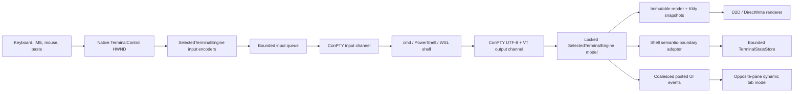

# Embedded Terminal Engine Decision, ConPTY, And Pane Tabs Implementation Plan

> **Status — Completed 2026-08-03.** The first embedded Terminal implementation is complete. Ghostty is the qualified
> private-runtime winner; the lean size-evolvable `ITerminal` ABI, plugin-owned ConPTY/D2D/DWrite control, interactions,
> settings, and dependency lifecycle are implemented. Durable authority is `../../Terminal/Terminal_EmbeddedPlugin.md`
> and `../../Terminal/TerminalEngineDecision.md`; later WIP/checkpoint language below is historical.

## Current implementation checkpoint (2026-08-03)

Ghostty is no longer merely a candidate for the first implementation. The
bounded native qualification selected exact commit
`b2d44625908eb56aee299d8511d803bc11ab79fc`, and the first x64 product slice is
working behind the new unsuffixed `ITerminal` ABI. `Terminal.dll` privately
loads the staged Ghostty runtime, owns ConPTY/session/render/input state, and
is hosted as an opposite-pane Terminal tab. The implementation and explicit
release-open gates are authoritative in
`Specs/Terminal/Terminal_EmbeddedPlugin.md`; execution status is tracked in
`Specs/Plans/WIP/Terminal_FirstImplementationExecutionIndex_2026-08-01.md`.

The current interaction slice reuses a live opposite-pane terminal, migrates
all three stable path-insertion commands, removes the FolderWindow pseudo
prompt, authenticates root PowerShell cwd/idle reports by exact client PID, and
follows pane navigation out of band without ConPTY injection or PSReadLine
history. Cmd and WSL remain conservatively untrusted.

The plan remains WIP because the broader renderer, accessibility, exact
accepted-command history and semantic-close integration, security, native
ARM64 product, packaging, and performance gates are not complete. The historical decision evidence below remains evidence of
the state at the time it was written; it must not be read as overriding this
checkpoint.

The first implementation has passed its closeout gate: Debug x64 build
`msbuild-20260802_205528_655.log` is 0 warnings/0 errors; full-suite run
`20260802T190401Z-4616-084da5bd053c43418460a8bf7a4ee84a` is 1,180 passed,
0 failed, 53 justified skips with all classifications/quarantine/disk audit
clean; focused real terminal lifecycle run
`20260802T204347Z-2000-ced799a18ae64b8ea52d28e82e290865` is 10/10; focused
build reproducibility is 10/10; and full x64 Release build
`msbuild-20260802_220332_128.log` completed with 0 errors. The Release build's
13 warnings are existing Release-disabled non-Terminal selftest helpers. These
results close the first-working slice only; they do not close the release-open
gates above.

The final 2026-08-03 trusted-prompt checkpoint built Terminal, the host, and
PluginContractTests with zero warnings/errors
(`msbuild-20260803_132018_753.log`, `msbuild-20260803_132057_106.log`, and
`msbuild-20260803_132451_393.log`). All 16 Terminal source contracts and all 23
Terminal runtime selftests passed. Real lifecycle run
`20260803T112544Z-25140-2aea4b0d55f04337a513ce6cb00c265c` passed 10/10 with
no Application Popup event, no PSReadLine history addition, and no sandbox
finding. Focused Commands runs
`20260803T124415Z-6636-58afd6f794e644668f4b2f6fa3e619e9` and
`20260803T124425Z-48120-80e7d3e3e60d4bdababfc135e53bb59e` passed the trusted
prompt/reuse/follow/path-insertion and embedded-plugin lifecycle cases. The
direct `HPCON` attribute fix prevents the observed child loader `0xc0000142`
failure.

The working slice deliberately binds insertion to the selected terminal's
original source key, latest accepted source generation, namespace, and source
path. The later Plan-4 contract that permits a compatible selected terminal
originating from a different logical source is not implemented yet; its
independent initiating-source revalidation and multi-tab/SwapPanes matrix remain
release-open. This temporary stricter rejection is fail-closed and must not be
misread as completion of the broader contract below.

## Current status

- **State:** WIP — first working x64 interaction implementation verified; release hardening open.
- **Engine:** Ghostty `lib-vt` at exact commit
  `b2d44625908eb56aee299d8511d803bc11ab79fc`, privately loaded by
  `Plugins\Terminal.dll` from `Plugins\TerminalRuntime\ghostty-vt.dll`.
- **Boundary:** unsuffixed `ITerminal`; `IViewer` remains unchanged; no Ghostty
  type, header, symbol, callback, or handle crosses the plugin ABI.
- **Platform:** x64 Debug/full-suite and x64 Release build proven. Ghostty ARM64
  runtime proven; native ARM64 product build currently stops in vcpkg before
  product compilation because the v145 `arm64-windows` probe selects an x64
  compiler/link target and cannot resolve the debug/static CRT libraries. It
  remains a release toolchain gate, not a Terminal source failure.
- **Post-preflight restoration:** the pinned x64 vcpkg closure was restored,
  Terminal rebuilt in `msbuild-20260802_224323_251.log` with 0 warnings/
  0 errors, and the final lifecycle run above passed after restoration.
- **Execution plan:**
  `Specs/Plans/WIP/Terminal_FirstImplementationExecutionIndex_2026-08-01.md`.
- **Authoritative behavior:** `Specs/Terminal/Terminal_EmbeddedPlugin.md`.

> **Executor instructions:** This is the normative master plan. Follow the phases and linked execution plans in order, keep every WIP file and evidence link current, and run every gate before continuing. The first-implementation engine gate selected the exact Ghostty pin recorded above; do not substitute another pin or engine without rerunning the qualification and updating the decision record. If a remaining mandatory release gate fails, stop and report it instead of silently weakening the feature, writing a new parser, or expanding scope.
>
> **Drift check (run first):**
>
> ```powershell
> git diff --stat 1a5d838d0c18298d9e560e243e67b821a40fcf6a..HEAD -- `
>   RedSalamander.sln Directory.Build.props Directory.Build.targets RuntimeDependencies.props LICENSE.txt `
>   Common/PlugInterfaces/Terminal.h Common/PlugInterfaces/PluginConfiguration.h Common/PlugInterfaces/Host.h Common/PlugInterfaces/Factory.h Common/PlugInterfaces/Informations.h `
>   Common/PluginConfiguration.h Common/Common/PluginConfiguration.cpp Common/Common/Common.vcxproj Common/Common/Common.vcxproj.filters `
>   Common/EmbeddedViewerBase.h RedSalamander/ViewerPluginManager.h RedSalamander/ViewerPluginManager.cpp `
>   Plugins/Terminal Common/DxUi/DxUi.h Common/DxUi/DxUi.Controls.cpp Common/WindowMessages.h `
>   Common/SettingsStore.h Common/Common/SettingsStore.cpp `
>   RedSalamander/RedSalamander.vcxproj RedSalamander/RedSalamander.vcxproj.filters `
>   RedSalamander/FolderWindow.h RedSalamander/FolderWindow.cpp RedSalamander/FolderWindow.Layout.cpp `
>   RedSalamander/FolderWindow.FileSystem.Navigation.cpp RedSalamander/FolderWindow.FileSystem.Commands.cpp `
>   RedSalamander/CommandRegistry.cpp RedSalamander/FluentIcons.h `
>   RedSalamander/ShortcutDefaults.cpp RedSalamander/WSLDistro.h RedSalamander/WSLDistro.cpp `
>   RedSalamander/AppTheme.h RedSalamander/AppTheme.cpp RedSalamander/RedSalamander.rc `
>   RedSalamander/resource.h RedSalamander/Preferences.h RedSalamander/Preferences.cpp `
>   RedSalamander/Preferences.Internal.h RedSalamander/Preferences.Internal.cpp RedSalamander/Preferences.Dialog.cpp RedSalamander/Preferences.Plugins.cpp `
>   RedSalamander/Preferences.Plugin.Configuration.h RedSalamander/Preferences.Plugin.Configuration.cpp `
>   RedSalamander/PluginConfigurationCoordinator.h RedSalamander/PluginConfigurationCoordinator.cpp RedSalamander/SettingsHotReload.h RedSalamander/SettingsHotReload.cpp `
>   RedSalamander/ManagePluginsDialog.h RedSalamander/ManagePluginsDialog.cpp RedSalamander/TerminalHost `
>   RedSalamander/SelfTest/Commands RedSalamander/SelfTest/Common/SelfTestCommon.h RedSalamander/SelfTest/Common/SelfTestCommon.cpp `
>   Tests/TerminalTests Tests/PluginContractTests Tests/TestSupport Tools/Run-AllTests.ps1 Tools/TestRunPlan.ps1 Tools/Test-TestRunArchive.ps1 `
>   Tools/TerminalCommandsEvidence.psm1 Tools/Run-TerminalCommandsEvidence.ps1 Tools/Test-TerminalPowerShellControl.ps1 Tools/Tests/TerminalCommandsEvidence.Tests.ps1 Tools/Tests/TerminalPluginBoundarySourceContracts.Tests.ps1 `
>   Specs/Terminal/TerminalPluginAbiGolden.v1.json Tools/Generate-TerminalPluginAbiGolden.ps1 `
>   Common/LocalFileTransaction.h Specs/Core/Core_SharedHelpers.md `
>   Tools/Restore-TerminalEngineInputs.ps1 Tools/Build-TerminalEngine.ps1 Tools/Verify-TerminalEngine.ps1 Tools/Get-TerminalDependencyStatus.ps1 Tools/Prepare-TerminalEngineUpgrade.ps1 `
>   Tools/Tests/TerminalDependencyLifecycle.Tests.ps1 Tools/RuntimeDependencies.psm1 External/terminal-engine.lock.json `
>   Installer Specs/SettingsStore.schema.json Specs/Core/Core_SettingsStore.md `
>   Specs/UI/UI_CommandMenuKeyboard.md Specs/UI/UI_DxUiWinUIDesign.md Specs/Themes `
>   Specs/Terminal Specs/Testing Specs/TestRuns
> ```
>
> If live code no longer matches the “Current repository state” section, reconcile the difference before editing. A material mismatch in pane-tab ownership, Settings Store persistence behavior, centralized runtime staging, ConPTY minimum-OS behavior, or the selected engine ABI/snapshot contract is a STOP condition. Update this baseline SHA after an intentional rebase; never implement from stale paths.

## Historical Gate-0 status (superseded; preserved as evidence)

Everything in this section records the earlier no-winner governance state. It
is intentionally retained for auditability and does not override the current
status above or authorize reverting the implementation to the historical
WezTerm experiment.

- **State:** WIP — behavior decisions are closed; terminal engine selection remains Gate 0; no implementation is claimed by this document.
- **Priority:** P1
- **Effort:** XL, expected as reviewable vertical slices
- **Risk:** HIGH — process hosting, untrusted VT data, rendering, persistence, threading, and pane-layout changes
- **Depends on:** the Gate-0 engine decision; the canonical bounded WSL catalog from `Operation_Emberglass_48Hour_RepositoryDeepReview_2026-07-22.md` R4-ARCH-01 must exist before terminal profile discovery lands, or this plan must coordinate that same shared-helper extraction rather than add a third reader.
- **Category:** feature / architecture / rendering / performance / security / tests / docs
- **Rebased at:** RedSalamander commit `1a5d838d0c18298d9e560e243e67b821a40fcf6a`, 2026-07-30
- **Engine status:** no current candidate qualifies. The Gate-0 v4 universe
  transition is chronology-only: it carries forward the unchanged v3
  nomination IDs, pins, caps, source facts, and candidate-local result bytes
  only after their exact digests are reverified. The v3
  downstream candidate-review, assessment, and candidate-set records are
  superseded because their approvals predated completion of the v3 universe
  approval; v4 requires fresh source and adaptation approvals strictly after
  v4 approval plus a freshly rebound and re-frozen empty assessment. Assessment
  approvals exist only when at least one candidate is admitted.
  This governance repair admits no executable cohort, changes no candidate
  result, selects no winner, and does not unblock product work. Contour-RS v3
  fails changed-lines, logical-concerns, and owner-days; Ghostty-RS v4 fails
  owner-days; WezTerm-RS v3 fails logical-concerns and owner-days; and libtsm,
  libvterm, and Microsoft TerminalCore remain source-rejected for the absent
  required Kitty APC subsystem. Any candidate-changing experiment must begin
  with a separately frozen v5-or-later universe.
- **Next Gate-0 decision:** use the requirement-change matrix in
  `Specs/Terminal/TerminalEngineDecision.md`. The recommended first move is the
  capped 15-owner-day synchronous caller-owned WezTerm proof experiment with
  unchanged requirements; the explicit fallback is a new candidate-neutral
  90-owner-day/six-concern universe. Route A is selected and authorized solely
  as the evidence-only Round-5 experiment by the user's direction. Route B
  remains unselected and requires a separate explicit product/maintenance
  approval. Product Phases 1–9 remain blocked until a complete mandatory-pass
  candidate scores at least 80.00 and produces the winner artifacts.
- **Legacy filename:** `LibGhosttyVt` remains in this plan's basename only to preserve existing links/history. It grants Ghostty no incumbent, migration-cost, or tie-break credit and must never be interpreted as an architecture decision.
- **successfulGate0Handoff:** `none` — exactly one winner-bearing Done Gate-0
  round must replace this value with its exact Done basename, closeout commit,
  Done blob, immutable decision/finalization identities, winner, engine-lock
  digest, and verification-set identity before product plan 2 may start. A
  no-winner round never sets it.
- **Completion record:** `TERMINAL-HANDOFF-UNRESOLVED`

- **Gate-0 handoff record (machine-readable):**
  - `gate0Round[0].ordinal=4`
  - `gate0Round[0].plan=Terminal_EngineSelectionAndDependencyProof_2026-07-22.md`
  - `gate0Round[0].predecessorPlan=none`
  - `gate0Round[0].predecessorCloseoutCommit=none`
  - `gate0Round[0].predecessorDoneBlob=none`
  - `gate0Round[0].predecessorHandoffPublishCommit=none`
  - `gate0Round[0].predecessorCloseoutSealCommit=none`
  - `gate0Round[0].predecessorCloseoutSealSha256=none`
  - `gate0Round[0].closeoutCommit=6674119fd24284877b1b25a3a71dbe2f6e6ee9a2`
  - `gate0Round[0].doneBlob=b20d498dcc16d229f1e8a68e26fcc8aae3b6ffca`
  - `gate0Round[0].decisionPath=Specs/Terminal/TerminalEngineDecision.md`
  - `gate0Round[0].decisionSha256=e10e6c5b885fc40496fb3eb1a7db9feb82084a74a368567305374bc0787e8260`
  - `gate0Round[0].recoveryArchiveCommit=N/A-legacy-round-no-recovery-archive`
  - `gate0Round[0].recoveryArchivePath=N/A-legacy-round-no-recovery-archive`
  - `gate0Round[0].recoveryArchiveSha256=N/A-legacy-round-no-recovery-archive`
  - `gate0Round[0].outcome=no-winner`
  - `gate0Round[1].ordinal=5`
  - `gate0Round[1].plan=Terminal_EngineSelectionAndDependencyProof_Round5_WezTermSynchronousCallerOwned_2026-07-31.md`
  - `gate0Round[1].predecessorPlan=Terminal_EngineSelectionAndDependencyProof_2026-07-22.md`
  - `gate0Round[1].predecessorCloseoutCommit=6674119fd24284877b1b25a3a71dbe2f6e6ee9a2`
  - `gate0Round[1].predecessorDoneBlob=b20d498dcc16d229f1e8a68e26fcc8aae3b6ffca`
  - `gate0Round[1].predecessorHandoffPublishCommit=N/A-legacy-round-no-split-closeout`
  - `gate0Round[1].predecessorCloseoutSealCommit=N/A-legacy-round-no-split-closeout`
  - `gate0Round[1].predecessorCloseoutSealSha256=N/A-legacy-round-no-split-closeout`
  - `gate0Round[1].closeoutCommit=pending`
  - `gate0Round[1].doneBlob=pending`
  - `gate0Round[1].decisionPath=Specs/Terminal/TerminalEngineDecision.Round5.md`
  - `gate0Round[1].decisionSha256=pending`
  - `gate0Round[1].recoveryArchiveCommit=pending`
  - `gate0Round[1].recoveryArchivePath=pending`
  - `gate0Round[1].recoveryArchiveSha256=pending`
  - `gate0Round[1].outcome=pending`
  - `successfulGate0HandoffPlan=none`
  - `successfulGate0HandoffCloseoutCommit=none`
  - `successfulGate0HandoffDoneBlob=none`
  - `successfulGate0FinalizationManifest=none`
  - `successfulGate0FinalizationSha256=none`
  - `successfulGate0WinnerCandidateId=none`
  - `successfulGate0EngineLockSha256=none`
  - `successfulGate0VerificationSetManifest=none`
  - `successfulGate0VerificationSetSha256=none`

This is the sole machine-readable Gate-0 routing authority. A reviewed
handoff-publication change replaces `pending`/angle-bracketed values only after
the named round's immutable Done commit exists. A later round appends the next
zero-based index with the next consecutive ordinal before work and never
renumbers or rewrites an earlier entry. Every label occurs exactly once. Plan 2
and Phase 9 parse the bounded region from `successfulGate0Handoff` through
`## Goal`, require the explicit array order and predecessor links, and reject a
prose-only or manually supplied mismatch. The nine successful-handoff values
remain `none` until one winner-bearing Done round exists, then all change
together and the bold pointer above names that same basename.
Each `decisionSha256` authenticates the named decision blob read from that
round's recorded closeout commit. It is not recomputed from a later mutable
current operator summary that has accumulated post-closeout runbook addenda.
Round 4 alone uses the exact legacy RecoveryArchive N/A triplet. Every Round 5+
Gate-0 round must create an archive at
`Specs/TestRuns/TerminalEngineRecovery/round<ordinal>-<yyyyMMddTHHmmssZ>-<16-lowercase-hex>/TerminalEngineRound<ordinal>RecoveryArchive.v1.json`,
with an ASCII invariant-UTC round-trip timestamp, its ordinal schema/corpus, the
generic mutation-free `Tools/Test-TerminalEngineRecoveryArchive.ps1`, explicit
64-hex raw digest, and 40-hex archive-only FA `recoveryArchiveCommit`; omission
is never legal. The sealed closeout chain is E -> FA -> FD -> FP -> FS:
FArchive (parent E) adds only the archive; FDone (parent FA) alone fills/moves
the round WIP plan to Done and introduces its marker without changing master
routing; FPublish (parent FD) atomically records the known FD closeout commit/
Done blob plus FA/path/digest in these master tokens and updates only routing;
FSeal (parent FP) adds only the canonical tracked seal embedding the
E/FA/FD/FP quiet set.
E, FA, FD, and FP are non-publishable intermediate refs; only valid FS is a
durable handoff. Plan 2 and Phase 9 read the exact archive blob from FA, require
the semantic single-parent E -> FA -> FD -> FP -> FS chain through the ordinal
published-closeout verifier, and reject enumeration, ignored-only evidence,
missing blobs, or digest mismatches.
After winner FS, later viability evidence never rewrites the Gate-0 Done plan or
creates a second marker. The separately approved emergency dependency
revocation blocks unfinished product-plan admission or disables the shipped
feature, then uses the exact locked upgrade/replacement/rollback workflow below;
a replacement outside that workflow is a new top-level migration. After a
no-winner FS, the exact successor WIP/master row still carries three pending
predecessor FP/FS/seal-digest sentinels. Its mandatory branch-neutral
`RoundStart`, as FS's direct child, replaces only those sentinels before any
  carry audit, observation, P, or legal initial D; its later RecoveryArchive
  embeds RoundStart for retrospective clone authentication. Verified
  RoundStart, not that later closeout archive, admits queued evidence into the
  next ordinal universe.
Each Round 5+ no-winner FP/FS pair is therefore recorded acyclically in the
following round's three `predecessorHandoffPublishCommit|
predecessorCloseoutSealCommit|predecessorCloseoutSealSha256` master/plan
values. Product Plan 2 supplies and persists the final winner FP/FS/seal tuple
after FS exists. Neither FP nor FS is ever required to contain its own OID.

Phase 9 Stage A leaves the status marker unchanged and stops after printing its
exact new evidence-set path and two file digests. The reviewed edit before Stage B
replaces it with `TERMINAL-HANDOFF-RESOLVED` and adds, in this bounded region
before `## Goal`, one backtick-formatted `label=value` bullet for every remaining
token constructed by the Stage-B `$completionTokens` map while retaining the
already-published successful Gate-0 token bullets exactly once. Values are
copied exactly; paths are not normalized for presentation and a label occurs
once. Stage B parses this region, so prose, a link, or a digest without its label
is not the completion record.

## Goal

Add a first-party, native embedded terminal implemented by the built-in `builtin/terminal` plugin DLL. The existing `cmd/pane/openCommandShell` command (`Ctrl+Alt+T`) and its new `Alt+7` alias snapshot the focused logical folder source and open a new terminal tab in the opposite pane's content area. Repeating either shortcut creates additional independent terminal tabs. Folder `Edit` opens the focused directory the same way. `Ctrl+Enter` inserts the focused item's profile-native leaf name when the target prompt's authenticated cwd is the item's parent, otherwise its full profile-native path; `Ctrl+Shift+Enter` always inserts the full path. Neither sends Enter. `followPathWhenIdle=false` is the safe persisted default; when enabled, a session dispatches follow only while its adapter proves every required capability and the shared activity snapshot says the shell is trusted and idle. Explicit close uses that same snapshot but intentionally confirms every Starting or Running session. Terminal-only sessions remain usable and inject nothing. Proven Windows-shell selections are remembered by logical folder, and authenticated accepted commands are kept in a bounded, age-limited, privacy-aware per-folder history. WSL profiles remain launchable at the exact distro/path but are terminal-only for semantic integration in v1: they do not remember, follow, or capture app history, while explicit insertion is limited to the quoted full native Linux path in the exact launch distribution.

The terminal stack, after Gate 0, is:

1. Windows ConPTY for native child-process transport.
2. The pinned winner of the terminal-engine decision gate behind a narrow RedSalamander adapter for VT parsing, terminal state, input encoding, selection, scrollback, and required static-image state. Ghostty is not assumed to win.
3. A Direct2D/DirectWrite renderer and native child HWND implemented in `Plugins/Terminal/Terminal.dll`.
4. Terminal session, shell-profile, history, settings, accessibility, security, and lifecycle logic implemented in that same plugin DLL.
5. A deliberately narrow host bridge for generic pane tabs, focus/command dispatch, theme/configuration delivery, and plugin lifetime. The EXE/Common layers contain no ConPTY, VT/model, renderer, shell-profile, shell/path quoting, history, follow, or terminal-state implementation. A candidate-neutral Windows process-argv builder may be generalized in `Common` and reused by Terminal only for the mechanical `CommandLineToArgvW`-inverse operation; it owns no terminal profile, path translation, shell syntax, inserted text, or launch policy.

This plan intentionally does **not** embed a web terminal, reparent a console window, use an external Windows Terminal window as the pane, adopt a second UI/rendering stack, or write a new VT parser. Microsoft TerminalCore/text-buffer/parser source components are nevertheless a legitimate Gate 0 candidate when they can expose the same consumer-owned immutable snapshot boundary; they must be evaluated rather than dismissed merely because no packaged SDK exists.

## Execution-plan index and authority

This master owns all product behavior, safety limits, cross-slice interfaces, and
done criteria. Gate 0 is an ordered chain of immutable versioned evidence plans;
product implementation remains five fixed children numbered 2–6:

- Gate-0 Round 4 (legacy Plan-1 basename):
  `Terminal_EngineSelectionAndDependencyProof_2026-07-22.md` — immutable
  no-winner comparison/governance closeout after it moves to Done.
- Gate-0 Round 5:
  `Terminal_EngineSelectionAndDependencyProof_Round5_WezTermSynchronousCallerOwned_2026-07-31.md`
  — the authorized, 15-owner-day synchronous caller-owned WezTerm experiment.
  A later no-winner round appends one newly named ordinal Gate-0 plan; it never
  reopens or edits either predecessor Done plan.
- Product plan 2: `Terminal_CoreConPtyRuntimeAndModel_2026-07-22.md` —
  plugin-owned service, selected-engine adapter, ConPTY, queues, model,
  lifecycle, terminal ABI implementation, and native tests.
- Product plan 3: `Terminal_RendererControlAndAccessibility_2026-07-22.md` —
  plugin-owned immutable snapshots, D2D/DWrite control, static images, input,
  UIA, and rendering perf.
- Product plan 4: `Terminal_PaneTabsProfilesAndLifecycle_2026-07-22.md` —
  generic host pane tabs/commands plus the plugin's focus, source identity,
  chooser/diagnostic states, profiles, path insertion, and close UX.
- Product plan 5: `Terminal_ShellIntegrationHistoryAndPaneFollow_2026-07-22.md`
  — plugin-owned authenticated shell protocol, safe follow, explicit path
  insertion, insertion-only history UI, persistence, and privacy barriers.
- Product plan 6: `Terminal_SettingsSecurityPerfPackagingCloseout_2026-07-22.md`
  — plugin configuration/Preferences, hard limits, localization, security,
  performance budgets, DLL packaging, authoritative specs, and WIP closeout.

Rules:

- Master contract wins if a child plan conflicts. Fix both documents before implementation continues.
- Gate 0 must replace generic `SelectedTerminalEngine` names and any conditional Ghostty-named templates in this master and children with the exact chosen adapter, artifact names, version/pin, ABI fingerprint, and capability ledger before Phase 1.
- Every Gate-0 round starts from the exact prior Done round commit/blob, uses new
  versioned evidence subjects, and moves to Done without later modification. A
  no-winner handoff appends one successor WIP round and leaves
  `successfulGate0Handoff=none`; only a winner-bearing round may publish the one
  successful pointer. No implicit highest-version or latest-plan discovery is
  allowed.
- Each product child starts with the same drift check, lists predecessor
  evidence, and ends with reviewable commands and archived evidence.
  Implementation slices may land separately. Move this master last, only after
  exactly one successful Gate-0 handoff exists, product plans 2–6 are Done, and
  every master checkbox passes.

### Ordered Gate-0 round chain

The explicit chain is append-only in this WIP master. Each entry records the
round's basename, predecessor Done commit/blob (none only for the historical
root), closeout commit/blob after its move, immutable decision path/digest, and
`no-winner|winner`. Round ordinals are unique, consecutive, and begin here at 4.
The current authorized sequence is Round 4 followed by Round 5 above. If Round 5
also closes without a winner, add Round 6 as a new WIP file and append its exact
basename here before work; never move a Done round back to WIP or change its
bytes.

For historical rounds whose frozen protocol assigned the current decision
pointer to handoff publication, that reviewed publication performs the recorded
legacy update. For Round 5 and later, E atomically publishes the immutable
decision and updates only the current authoritative decision pointer/runbook;
the plan remains byte-identical in WIP and no marker exists. The continuously
sealed composite F is acyclic: FArchive adds only the round's exact tracked
recovery archive; FDone, as FA's direct child, alone fills and moves the plan to
Done and adds its branch/success marker without changing this master or README;
FPublish, as FD's direct child, updates only this master,
`Specs/Plans/WIP/README.md`, and—only after a no-winner whose successor does not
already exist—the newly named next ordinal Gate-0 WIP plan. FPublish records the
known FD closeout commit/Done blob plus FA/path/digest and routes either to that
exact successor or, for a winner, to product plan 2. FSeal is FP's direct child,
is created only after FP quiet, and adds only the tracked canonical seal that
embeds that quiet and binds E/FA/FD/FP. E, FA, FD, and FP are single-parent
non-publishable intermediates; FS alone is the durable handoff, and the accepted
chain requires `FA^=E`, `FD^=FA`, `FP^=FD`, and `FS^=FP`. A no-winner successor
is rendered from the pre-E frozen template with pending predecessor FP/FS/seal-
digest sentinels; its mandatory branch-neutral RoundStart is FS's direct child
and replaces only those six master/plan values before any next-round action.
The successor RecoveryArchive embeds and verifies RoundStart. Exactly one round
may contain the literal marker shown below:

```text
- **successfulGate0Handoff:** `TERMINAL-GATE0-SUCCESS`
```

The master pointer must
name that same round and exact evidence. Earlier no-winner rounds remain required
lineage but are not Plan 2's product predecessor. A second marker, a gap/fork, a
WIP predecessor, or a successor that edits a Done round is a STOP.

### Immutable child handoff and closeout ledger

Every child records the exact predecessor Done-plan Git blob object ID at the accepted predecessor closeout commit, that 40-lowercase-hex closeout commit, every evidence record's `repositoryCommit`, evidence manifest/run path, and lowercase SHA-256 digests named below in its own `## Child completion and move` section before moving. Each child begins with a literal `TERMINAL-HANDOFF-UNRESOLVED` marker; replace that one line with the exact labeled values required by its numbered steps, in the plan itself, before setting State to Done. An external review note alone is insufficient. These predecessor identities are recorded by the successor after the predecessor move commit exists, avoiding an impossible self-referential commit hash. The successor recomputes the Git object/digests and runs the predecessor verifier; a path, branch name, “latest” run, green-summary claim, or mutable workspace file alone is not evidence. `results.json`, runner aggregate, and `perf/perf_metrics.jsonl` are content-free archives produced by the canonical runner; when a listed file is not applicable, the predecessor records the exact reviewed `not-applicable` reason instead of omitting it.

| Plan | Required predecessor handoff | Evidence and archive owned before move | Durable specification ownership before move | Exact Done basename and next WIP `README.md` N3 route |
|---|---|---|---|---|
| Gate-0 rounds | Round 4 has no predecessor; each later round consumes the immediately prior Gate-0 Done path/closeout commit/blob/decision digest | Every round: exact versioned universe/review/assessment/candidate-set/decision identities, rejection or candidate proof, approvals, lifecycle tests, and zero-effect no-cohort proof. When Finalize names a winner: three collection manifests/finalization plus immutable pre-effect receipt history copied into a closeout attempt ledger and either the complete first-selection materialization/lock, five lock-bound verification identities, mutation-free status/cache proof, immutable pre-closeout handoff proposal, two ordered approving review records, and sole success marker, or an authenticated qualification-failure record binding the attempt ledger (or its one legal validation-failure substitute), every invalidated partial proposal/review/artifact, pre-adoption clean tree or adoption/revert pair, zero tracked engine state, and no success marker. | Immutable per-round decision plus the current `Specs/Terminal/TerminalEngineDecision.md` pointer/runbook, evidence schema/corpus, lock/status/exact-pin-upgrade/rollback and testing contracts | Round 4 uses its legacy basename; Round 5 uses `Terminal_EngineSelectionAndDependencyProof_Round5_WezTermSynchronousCallerOwned_2026-07-31.md`; append a new ordinal basename after any later no-winner. Route to product plan 2 only from the sole successful handoff. |
| 2 — core/runtime/model | Exact `successfulGate0Handoff`: winner-bearing Gate-0 Done path, FD closeout commit/blob, ordered prior-round lineage including each RecoveryArchive FA commit/path/digest (or exact legacy N/A), semantic FP plus tracked FS/seal validation for every Round 5+ round, predecessor RoundStart carry, decision/finalization/lock digests, verification-set identity, and exact winner artifacts | Exact `TerminalNative` Core JSON/companion manifests for x64 Debug/Release/`ASan Debug` and native ARM64 Debug/Release, plus exact `Commands/<RunId>` core-model baseline and canonical-file digests; create/document the `TerminalNative` archive area/schema/runner/verifier | New-IID/not-Viewer plugin ABI, plugin-only core/runtime/resource/lifecycle/module-quiet/selected-adapter portions of terminal/plugin specs, centralized runtime-dependency and terminal testing contracts | `Terminal_CoreConPtyRuntimeAndModel_2026-07-22.md`; route N3 to plan 3 |
| 3 — renderer/control/UIA | Plan-2 Done blob SHA, engine-lock digest, and verified Core TerminalNative/Commands identities | Exact x64 Debug `TerminalNative` Renderer JSON/companion plus renderer/control WARP/UIA Commands run and canonical-file digests | Plugin-owned renderer/input/base-document-UIA/child-HWND/module-lifetime portions of `Specs/Terminal/Terminal_EmbeddedPane.md` and applicable `Specs/UI/UI_DxUiWinUIDesign.md` contracts | `Terminal_RendererControlAndAccessibility_2026-07-22.md`; route N3 to plan 4 |
| 4 — panes/profiles/lifecycle UI | Plan-3 Done blob SHA plus verified core/renderer evidence digests | Exact x64 Debug `TerminalNative` PaneProfiles JSON/companion plus terminal/Preview Commands archive paths and canonical-file digests | Generic host/plugin pane boundary, reused command/external migration, directory Edit, pseudo-input retirement, contextual/full path insertion, profile/location/exit/restart, WSL shared catalog, and UI specs | `Terminal_PaneTabsProfilesAndLifecycle_2026-07-22.md`; route N3 to plan 5 |
| 5 — integration/history/follow | Plan-4 Done blob SHA plus verified PaneProfiles/Commands identities | Exact x64 Debug `TerminalNative` ShellState JSON/companion plus integration/path-insertion/history/follow/state Commands archive paths and canonical-file digests | Plugin-owned integration/shared-activity/path-insertion/history/follow/privacy/persistence portions of `Specs/Terminal/Terminal_EmbeddedPane.md`, `Specs/Terminal/TerminalState.schema.json` and corpus, plus affected settings/privacy/testing specs | `Terminal_ShellIntegrationHistoryAndPaneFollow_2026-07-22.md`; route N3 to plan 6 |
| 6 — settings/security/perf/package | Plan-5 Done blob SHA plus verified ShellState/Commands identities | Rerun/verify every frozen TerminalNative slice in required native closeout lanes, exact Commands perf runs/budgets, and one verified TerminalPackage evidence-set manifest/digest binding five unsigned plus two signed native records to one repository/source/build/frozen/tool identity set; create/document the `TerminalPackage` archive area | Opaque plugin configuration/all-fields Preferences, plugin/private-runtime packaging/mutations, remaining schema/theme/localization/security/perf/installer/release contracts and final cross-domain reconciliation | `Terminal_SettingsSecurityPerfPackagingCloseout_2026-07-22.md`; route N3 to master Phase 9 |

The master moves last. Its Phase-9 check consumes the explicit ordered Gate-0
Done chain, requires exactly one successful handoff matching product plan 2's
recorded predecessor, then consumes the five exact product-plan Done basenames
and handoff digests. It updates any cross-domain contract discovered during
integration, changes this file's state, and moves its unchanged basename to Done.

## User-facing contract

### Commands, path insertion, folder Edit, and pane behavior

- Reuse the stable existing command ID `cmd/pane/openCommandShell` for the embedded terminal. Its existing `Ctrl+Alt+T` binding and the new `Alt+7` binding invoke exactly the same `ResolveDefault` action: open a new `builtin/terminal` tab in the physical pane opposite the focused logical Folder source, rooted at that source's committed location. Do not add a competing `cmd/pane/openEmbeddedTerminal` command. Add the distinct stable `ApplicationGlobal` command ID `cmd/pane/openCommandShellWithProfile`, label it `Open terminal with...`, give it no default shortcut, and route it through the same host path with `ForceChooser`; the command menu and terminal context menu invoke that ID rather than inferring chooser intent from a null profile.
- Preserve the old external-launch behavior under a new explicit `cmd/pane/openExternalCommandShell` command with no default shortcut. Rename the existing `CommandOpenCommandShell` external-launch implementation accordingly, keep it available in the command/shortcut editor, and give the reused `CommandOpenCommandShell` name to the embedded path. There is no automatic fallback to an external terminal when the plugin is missing, disabled, incompatible, or the source location is unsupported.
- Preserve the stable legacy ID `cmd/pane/bringFilenameToCommandLine` for `Ctrl+Enter`, but change its documented behavior to `Insert focused item in terminal`. Add the distinct ID `cmd/pane/bringFullPathToTerminal` for `Ctrl+Shift+Enter`; the current duplicate binding to `bringFilenameToCommandLine` cannot distinguish the required semantics and must be removed. Command IDs remain case-insensitive stable identifiers even when a legacy basename no longer describes the UI label.
- `Ctrl+Enter` and `Ctrl+Shift+Enter` act on exactly the focused item; selection membership and other selected items do not change the payload. They resolve the selected content tab in the physical pane opposite the source and never search or retarget a hidden Terminal tab. If the selected tab is a Terminal, it must be a source-family-compatible Running Terminal at an authenticated insertion-capable prompt, except that exact-distribution WSL permits full-native-path insertion without claiming prompt trust. Busy, incompatible-family/distro, provisional, diagnostic, Starting, Exited, Failed, closing, or otherwise unsafe states show the exact localized reason and emit zero bytes—do not bypass that visible Terminal by opening another one. Only when the selected opposite content is Folder or Preview may the command start one bounded `PendingPathInsertion` open transaction. The plugin owns profile/default/memory resolution, process startup, integration proof, the copied insertion, and the hidden child/session; the host keeps its record uncommitted and preserves the source focus/UIA tree until the plugin reports `ReadyToCommit`. The host then revalidates the exact source/item generations, prepares every fallible tab/UIA resource while still hidden, and calls the nonblocking commit-or-abort method. Only successful atomic insertion admission followed by the allocation-free/no-fail host finalize reveals/selects the tab; profile choice required, insertion policy disabled, WSL distribution mismatch, launch or handshake failure, timeout, stale source/item, host preparation failure, plugin Commit failure, close, or shutdown emits zero insertion bytes and leaves no visible tab.
- Every insertion snapshots and immediately-before-delivery revalidates the
  initiating focused Folder source's stable key, committed generation, and
  copied current logical location independently of the selected target
  terminal's immutable followed source. A compatible selected Terminal remains
  eligible after `SwapPanes` or when it originated from another logical source;
  the plugin never rejects that request merely because the two source keys
  differ. Ctrl+Space translates the copied initiating current location, never
  the target terminal's followed folder or shell cwd.
- When the selected opposite content is Folder or Preview and no existing
  Terminal is targeted, the hidden `PendingPathInsertion` Open derives its
  complete logical identity from the initiating focused Folder: that Folder's
  `OriginalSourceKey`, source generation/location, launch location, resolved or
  remembered profile identity, follow baseline/default, and immutable original-
  launch Restart fallback. The opposite selected Folder/Preview contributes
  only its `PhysicalHostKey`, hidden-parent eligibility, and still-selected host
  generation; its folder/path/profile/follow state never replaces any member of
  the initiating tuple. Revalidate both roles independently before Open and
  again before host Commit. Different pane paths, Preview selection, navigation,
  and `SwapPanes` may change physical placement but cannot silently retarget the
  source, launch, profile-memory key, follow association, or Restart fallback.
- For `Ctrl+Enter`, compare the focused item's parent `TerminalLocationIdentity` with the target terminal's latest authenticated filesystem cwd after translating both into that profile's native namespace. Equality uses the location rules below, not display strings or physical alias resolution. On equality insert the shell-quoted profile-native leaf name; otherwise insert the shell-quoted full profile-native path. `Ctrl+Shift+Enter` always inserts the shell-quoted full profile-native path and performs no cwd-equality shortcut.
- An explicit path insertion is accepted only at an authenticated primary prompt for which the adapter advertises `InsertCapable`, with no password request, alternate screen/TUI owner, foreground command, or pending follow operation. Existing partial user input may remain only when the adapter proves non-executing insertion at the current editing cursor; otherwise show localized `Terminal is busy or cannot insert safely` and emit zero bytes. A busy or incompatible existing terminal never queues a surprise insertion and never causes implicit creation of a second terminal. Every accepted insertion is one atomic ordered-input descriptor, uses the profile adapter's literal-argument encoder, rejects NUL/CR/LF/unrepresentable paths, and never sends Enter.
- `cmd/pane/bringCurrentDirToCommandLine` (`Ctrl+Space` and its existing `Ctrl+Shift+Space` alias) is retained as the stable legacy ID but now inserts the source's full profile-native current-directory path through the same opposite-terminal/safety rules. With all three legacy insertion commands migrated, remove the bottom pseudo command-line host, its `cmd.exe /C` execution path, layout/state/debug seams, obsolete resource text, and tests. Update the authoritative UI spec and release notes as an intentional behavior migration; do not leave an undiscoverable pseudo prompt behind.
- `Edit`/F4 on a focused directory is intercepted before editor association
  resolution and opens/selects a new terminal tab in the opposite physical pane
  rooted at that directory. Its Open context keeps the owning pane's real
  committed `{sourceGeneration,sourceLocation}` as the follow baseline and puts
  the independently revalidated focused child only in `launchLocation`;
  it never invents a child navigation generation. `Alternate Edit` and explicit
  `Edit with...` retain their file-action semantics and do not silently become
  terminal commands. `Edit` on a file remains unchanged. The directory decision
  uses provider item metadata, not a failing external-editor launch or
  `GetFileAttributesW` guess.
- Source classification selects a profile family before remembered/default precedence: a validated Windows local/UNC/plugin-backed path uses `windowsDefaultProfileId`; `\\wsl.localhost\<distro>\...`, `\\wsl$\<distro>\...`, or canonical `wsl:<distro>:/...` selects the exact `wsl:<normalized-distro>` profile and native Linux path; an unavailable matching distro is a diagnostic with `Open Terminal settings`, never a Windows-shell or default-distro fallback. Unsupported archive/cloud/MTP/remote/provider locations remain diagnostic. The diagnostic link opens `Preferences > Plugins > Terminal` focused on the relevant Shells setting.
- Resolve `OriginalSourceKey{FolderWindowInstanceId, PaneSourceId}` and `PhysicalHostKey{FolderWindowInstanceId, PhysicalPaneId}` independently. When focus is in Folder or Preview content, the source is that owning pane's logical Folder source key and the host is the opposite physical pane key. Snapshot the source's current committed folder when the command is invoked.
- When focus is in any Terminal-kind tab—including chooser, starting, diagnostic, running, exited, or failed—either open-terminal action uses that tab's complete stored `OriginalSourceKey` and immutable `PhysicalHostKey`. At dispatch, the host resolves the current committed location and generation for that exact live source key; it never uses the terminal's trusted cwd or stale original launch location as a substitute. The new terminal is a sibling in that physical host; never recompute a terminal-originated host from the source key's current side after `SwapPanes`. A tombstoned/detached source, destroyed source window, stale generation, unsupported current provider, or temporarily unresolved source produces a closable diagnostic and starts no process; it never falls back to the terminal cwd, home, root, or the host pane's currently selected Folder.
- Resolve a known focused pane descendant first. If invocation focus is temporarily outside pane content (for example command menu/function bar/global command line), use the stable current active pane and its selected tab captured at dispatch. Never default silently to Left or to an unselected hidden terminal.
- If single-pane/zoom mode hides the selected host, resolve its still-live
  content parent but do not alter zoom, selection, MRU, or tab chrome before
  plugin admission succeeds. The host first creates only an uncommitted hidden
  provisional record containing the complete `OriginalSourceKey`, immutable
  `PhysicalHostKey`, exact source baseline, independently named launch location,
  and admitted `TerminalProfileSelectionMode`; it is not yet a tab and does
  not count. Register the callback and call `Open` against that hidden parent.
  On `HRESULT_FROM_WIN32(ERROR_QUOTA_EXCEEDED)`, synchronously null/drain the
  callback, `Close`, release the object/record, retain the prior visible
  selection/zoom, and show one generic localized `Terminal tab limit reached
  for this pane` status with `Open Terminal settings`; no child/process/tab is
  inserted. Any other synchronous failure uses its typed existing failure path
  and likewise cannot leave a half-committed tab. For
  `openPurpose=InteractiveTab`, only `Open` success commits the reservation and
  child: reveal/unzoom as needed, insert/select the provisional Terminal tab,
  attach the child, then start presenting its chooser/starting/diagnostic state.
  For `openPurpose=PendingPathInsertion`, `Open` success deliberately retains
  one bounded hidden transaction; it is not a tab, is never selected/focused/
  exposed through UIA, and cannot show a chooser or diagnostic surface. The
  existing accessible host status announces `Opening terminal for insertion`
  without terminal content. Exactly one later `TerminalPendingOpenResolved`
  callback reports ready or a closed failure. Ready is not host admission: only
  exact source/item revalidation followed by successful
  `ResolvePendingOpen(...,Commit)` may reveal the child. Any other outcome calls
  Abort or null-drain/Close/release and preserves the prior zoom, selection,
  focus, and UIA tree.
- The committed provisional tab owns the copied fields above. Ordinary
  opens pass value-identical source/launch locations and set internal
  `launchTracksSourceUntilStart=true`: a newer accepted source update before
  process creation replaces both the pending source and launch location after
  full revalidation. Directory Edit passes different locations and sets that
  internal flag false: its explicit focused-child launch location stays fixed
  across source navigation and Retry, while the followed-source record still
  advances. After any process creation, the admitted launch location is
  immutable. The provisional tab owns chooser/starting/diagnostic UI only; it
  does not own the process/session lifetime. Canceling the chooser admits
  `TerminalViewRemovalRequested(ChooserCancelled)`; the generic deferred host
  path removes the provisional tab and no process starts. A launch or location
  failure keeps a
  closable diagnostic tab with localized `Retry`, `Choose profile`, and `Close`
  actions and counts against `maxTabsPerPane` until closed. `Retry` repeats the
  same admitted mode against a freshly refreshed catalog and the applicable
  launch location above (`ExactProfile` retries only that exact ID); `Choose
  profile` changes the still-unlaunched object to `ForceChooser`. Neither action
  calls `Open` a second time, and neither may silently change to
  `ResolveDefault`.
- Successful launch focuses the terminal control. While the chooser or diagnostic is shown, focus stays in that surface. Preview's existing no-focus-steal behavior remains unchanged.
- Repeating `Ctrl+Alt+T` or `Alt+7` creates a new independent terminal session. It never reuses a running session merely because path/profile match; only the explicit path-insertion commands may target the already selected opposite terminal.
- Shortcut routing resolves the focused content kind before the existing F1-F12
  and modified-key application dispatch. Add immutable generic command-registry
  `CommandScope=ApplicationGlobal|PaneSource` metadata attached to the command
  ID, not its current chord. Separately resolve the per-key-event
  `FocusOwnerKind=PaneSource|TerminalEncoder|PluginTextInput|ApplicationChrome`
  from the validated focused/active HWND; it is not command metadata and is
  never persisted. `cmd/pane/openCommandShell` and
  `cmd/pane/openCommandShellWithProfile` are `ApplicationGlobal`, so the former's
  default `Ctrl+Alt+T` and `Alt+7` work from a focused Terminal and any custom
  rebinding of either command automatically keeps the immutable registry scope.
  Shortcut persistence stores only command ID plus chords; it cannot serialize
  or override `CommandScope`.
  `cmd/pane/bringFilenameToCommandLine`,
  `cmd/pane/bringFullPathToTerminal`,
  `cmd/pane/bringCurrentDirToCommandLine`, primary Edit/F4, Alternate Edit, and
  Edit With are `PaneSource`: they are eligible only when focus/active routing
  resolves a selected Folder or Preview source with the required item metadata.
  They are never synthesized from a focused Terminal's stored source.
- The resolver first maps the chord to at most one enabled command; shortcut
  editing must resolve a duplicate before save, and malformed persisted
  duplicate enabled bindings are rejected rather than ordered arbitrarily. An
  applicable `ApplicationGlobal` command dispatches first. An applicable
  `PaneSource` command dispatches only for `FocusOwnerKind=PaneSource`; otherwise
  it falls through. A focused Terminal child owns every remaining key/chord.
  Within it, `PluginTextInput` receives its local navigation/editing keys before
  `TerminalEncoder`; neither is a command scope. In particular F4, Ctrl+Enter,
  Ctrl+Shift+Enter, Ctrl+Space, Ctrl+Shift+Space, and all other F1-F12 reach the
  terminal plugin exactly once when Terminal has focus. The host never
  intercepts the default/unbound Ctrl+C: the plugin copies when its local
  selection is nonempty and otherwise sends the terminal encoder's
  interrupt/control input to the shell.
  Ctrl+Shift+C, the context menu, and the explicit command always request Copy,
  and `copyOnSelect` remains independent. A user who deliberately binds an
  `ApplicationGlobal` command to one of those chords sees the shortcut editor's
  normal conflict resolution and that command wins; rebinding a `PaneSource`
  command never makes it global. Disabled/inapplicable app commands fall
  through to the terminal rather than swallowing the key. Chooser, diagnostic,
  history, paste-confirmation, and other plugin-owned child surfaces resolve as
  `PluginTextInput` and receive their own navigation/activation keys before the
  terminal encoder.
- Each terminal retains its original source-pane association. The plugin setting `followPathWhenIdle` defaults to `false`, and each tab may expose a session override. When enabled, later successful navigation in that original pane is coalesced and applied only while the plugin's authenticated root-shell state is `IdleAtPrimaryPrompt` with `HasRunningCommandOrChild=false`. Explicit close does not use the complement as its decision: every Starting or Running session confirms when configured, including a trusted idle prompt. When disabled, the terminal keeps its current shell directory.
- Pane following is one-way: source-pane navigation may change the shell directory, but a shell `cd` never navigates the file-manager pane.
- Following never injects a directory change while `HasRunningCommandOrChild=true`, user input is pending, password input is active, or an alternate-screen/TUI application owns the terminal. The newest source location remains coalesced and is applied only after the adapter publishes `IdleAtPrimaryPrompt`; if trust is absent, the request stays paused rather than relying on process-tree heuristics. Close confirmation, follow admission, Restart enablement, and busy path-insertion rejection consume one atomic state snapshot and apply the explicit policy table below; sharing facts does not mean those actions share one Boolean predicate.
- Folder, Preview, and multiple Terminal tabs can coexist. Visual order is Folder first, Preview second when present, then Terminal tabs in user order. Only Terminal tabs may be reordered in v1. `Alt+6` remains a Preview toggle and must not close, move, or overwrite terminal tabs.
- Tab headers identify auxiliary content visually as well as by text: Preview uses existing `FluentIcons::kPreview` (`U+E8FF`) before its label, and every Terminal uses existing `FluentIcons::kCommandPrompt` (`U+E756`) before its current title. The Folder tab remains text-only in the first release.
- Tab icons are decorative companions, never replacements for localized titles. They scale with DPI, follow LTR/RTL leading-edge layout, use the active theme/high-contrast foreground, and remain stable when a terminal title changes.
- The Folder tab is permanent and non-closable. Preview remains a singleton
  closable tab. Terminal tabs are independently closable. `Terminal.dll` is the
  sole owner of `maxTabsPerPane`: `ITerminal::Open` atomically reserves one view
  slot in a module-service counter keyed by the complete `PhysicalHostKey`
  after all synchronous context/configuration/admission validation and before
  child HWND or async work. The current effective limit is 1..32. A count at the
  limit returns exactly `HRESULT_FROM_WIN32(ERROR_QUOTA_EXCEEDED)` and rolls
  back before child/process/callback publication. Successful Open retains the
  slot through chooser, diagnostic, Starting, Running, Failed, Exited, natural-
  exit teardown timeout, and host removal admission. It releases exactly once
  only after callback null/drain, a valid `Close` has destroyed/detached the
  child view, and the host releases the public object; internal retiring/
  quarantined session work transfers no view slot. Thus Folder, Preview,
  uncommitted host records, and content-free service diagnostics after an
  already-removed view do not count. A failed Open or failed host commit follows
  the same null-drain/Close/release rollback and cannot leak a reservation.
  Lowering the effective setting atomically publishes the new limit, never
  evicts existing views, and rejects later reservations until the per-key count
  is below it; raising it resurrects no removed view. The counter erases a key
  at zero and uses the same lock/serialized publication boundary for
  simultaneous or reentrant opens.
- View count and process-session admission are separate. `TerminalService` has 32 hard process-lifetime session slots; a launch atomically reserves one before ConPTY/engine creation and retains it through Starting/Running/Failed/Draining/Closing/retiring/quarantine until complete quiet. A provisional/diagnostic tab and a quiet retained `Exited` view use no slot. If all slots are held, launch/restart stays diagnostic with Retry/Close and creates no process. While any session is quarantined, service-wide launch/restart admission is closed even if slots remain; existing sessions stay usable and admission reopens only after every quarantine reaches late quiet. The file manager remains usable.
- `SwapPanes` swaps logical folder content and therefore moves each complete `OriginalSourceKey`; it does not move auxiliary HWNDs or terminal tabs between `PhysicalHostKey`s. Existing followers retain the same complete source key after the swap. Layout/zoom changes likewise never retarget a follower by screen side.
- When the selected auxiliary tab closes, select the most recently used remaining tab; if none remains, select Folder and restore normal pane chrome.
- `confirmCloseRunningProcess` is consulted only for an explicit `UserTab` close
  of a `Starting` or `Running` session. Cancel leaves the tab, view generation,
  and session untouched. `WindowClosing` is a noninteractive forced close of
  every terminal view owned by that already-closing FolderWindow and does not
  close service admission for other windows; `ApplicationShutdown` is the
  process-wide noninteractive barrier below. Exited/failed/diagnostic tabs close
  without confirmation; automatic exit removal never prompts. Interactive,
  forced, plugin-action, and natural-exit removal all compete through the one
  per-view retirement-intent arbiter below, so a pending confirmation can never
  authorize a second late host-removal path.

The one copied `TerminalActivitySnapshot` freezes
`lifecycleState`, `activityTrust=Trusted|Untrusted`,
`hasRunningCommandOrChild`, `idleAtPrimaryPrompt`, input/password/alternate
screen ownership, and its generation. Impossible combinations such as trusted
`idleAtPrimaryPrompt=true` with `hasRunningCommandOrChild=true` are rejected.
Every action revalidates the generation immediately before its side effect:

| Snapshot | Explicit close when configured | Follow | Path insertion | Restart |
|---|---:|---:|---:|---:|
| Created/provisional/diagnostic/Failed | no process prompt | no | no | Retry/Choose flow only |
| Starting | confirm | no | no | no |
| Running, Trusted, idle primary prompt, no running child, no input/password/TUI owner | confirm | yes when FollowCapable | yes when InsertCapable | no |
| Running, Trusted, busy/running child or input/password/TUI owner | confirm | pause | reject with zero bytes | no |
| Running, Untrusted or internally ambiguous | confirm | pause | reject with zero bytes | no |
| DrainingAfterRootExit/Closing | no new prompt; honor the committed close/root-exit path | no | no | no |
| Exited and complete quiet | no | no | no | yes only when the separate location/capability checks pass |

`confirmCloseRunningProcess=false` suppresses only the two Running/Starting
confirm cells; it never makes follow/insertion/restart more permissive.
- Root exit first reaches `Exited` after final output and either a complete final
  snapshot or the bounded `finalSnapshotComplete=false` resource outcome.
  Automatic `closeOnExit` removal is deferred until that natural-exit session
  reaches complete quiet: with a complete snapshot, `never` emits no removal
  request, `clean` emits `AutomaticCleanExit` only for exit code `0`, and
  `always` emits `AutomaticAnyExit` for every normally observed root exit. The
  generic host removes only from that generation-bound callback; it never reads
  `closeOnExit` or infers policy from Exited. An incomplete final snapshot
  retains its last-safe/empty exit surface and permanently suppresses automatic
  removal for every mode. A natural-exit quiet failure keeps or converts a
  still-present tab into a visible teardown-timeout/quarantine diagnostic and
  permanently suppresses automatic `closeOnExit` for that session. If the user
  explicitly closes that exited tab while teardown is pending, the plugin's
  admitted `PluginCloseAction` request removes the view without a process
  prompt, suppresses later `closeOnExit`, and reports any later quiet failure
  only through the content-free application diagnostic. Failed launch states
  likewise remain visible until the host tab close or plugin Close action. All
  removal reasons use the same MRU/Folder restoration path.
- A retained exited terminal shows a localized exit-status strip and `Restart`/`Close` actions. `Restart` is disabled with an explanation until the old session reaches quiet. It then uses the same profile and this location precedence: when following is requested, an attached safely launchable current source; otherwise the most recent explicit cwd only if that latest report is trusted, valid, and filesystem-backed; otherwise the original validated launch location only if no explicit cwd was ever reported; otherwise a diagnostic. A later invalid/disappeared/non-filesystem explicit cwd invalidates every earlier cwd and launch fallback. Restart never silently chooses root/home/temp and does not create another history record.
- If the current pane location has no safe local/WSL launch mapping, do not silently fall back to a filesystem root. Open a localized diagnostic tab or nonblocking notice explaining that the provider has no terminal location.

### Shell choice

- Discoverable/launchable v1 profile families:
  - Command Prompt (`cmd.exe`).
  - Windows PowerShell 5.1 (`powershell.exe`).
  - Every safely discovered PowerShell 7+ installation (`pwsh.exe`), shown with its file/product version and canonical path.
  - Every installed WSL distribution returned by the canonical bounded shared WSL catalog owned by R4-ARCH-01. The distribution remains launchable even when its default shell has no trusted integration; Terminal must not call either legacy duplicated enumerator directly.
- Profile IDs are stable and case-insensitive where Windows identity is case-insensitive:
  - `cmd`
  - `windows-powershell`
  - `pwsh:<canonical-normalized-DOS-path>`; file identity is a discovery deduplication aid only, so an in-place upgrade retains the preference.
  - `wsl:<normalized-distribution-name>`
- Variable profile IDs deliberately retain their canonical material instead of
  truncating or digesting it. Their exact maximum is 32,772 UTF-16 units:
  five-unit `pwsh:` plus the 32,767-unit Windows-path maximum; the WSL form is at
  most 260. Catalog lookup, chooser rows, `ExactProfile`, callbacks, remembered
  choice, history partition, state validation/merge, and restart all use this
  same cap and the same complete ID. No layer shortens, aliases, or hashes it.
- WSL discovery runs on a cancelable worker with a three-second operation deadline. A nonpositive injected/test deadline returns `E_INVALIDARG` before work; a positive value above ten seconds is clamped to the ten-second hard maximum. One serialized monotonic arbitrator transitions a generation once from `Pending` to `Completed|TimedOut|Cancelled`: a result is eligible only with a captured completion timestamp strictly before the deadline; timeout wins at or after the deadline, cancellation wins an equal-timestamp tie with either, and the state CAS decides exactly once. A timeout leaves already discovered non-WSL profiles usable, shows a localized `WSL unavailable — Retry` row, and never blocks the chooser, launch of another profile, or UI teardown. Retry starts a new generation and stale completions are ignored; timeout is never converted to an empty-success catalog.
- Resolve the launch executable only as `<GetSystemDirectoryW()>\wsl.exe`,
  open/revalidate that non-reparse System32 file, and pass the exact path as
  `CreateProcessW.lpApplicationName`; never use `PATH`, an app-local
  same-basename file, `ShellExecute`, or a command processor. The exact logical
  argv is
  `[wsl.exe, --distribution, <catalog exact distro name>, --cd,
  <absolute profile-native Linux directory>]` in that order. Do not add
  `--exec`, `--user`, `-e`, a shell command, or a home-directory fallback:
  WSL launches the distribution's configured default user/default shell.
  V1 performs no pre- or post-launch WSL shell-integration injection: no
  bootstrap is concatenated into argv/environment, written into the PTY,
  installed in a Linux profile, or staged through a guessed `/mnt/<drive>`
  path. Every WSL shell, including bash, is truthfully terminal-only in v1.
- `--cd` support is a supported-platform invariant, not a localized-help or
  version-string probe: RedSalamander already requires Windows build
  22000.2600 or later, while the option entered Windows before that baseline.
  Before process creation, a cancelable off-UI `WslLaunchPathPreflight` freezes
  the exact catalog generation, distro name, Linux path, and launch generation;
  opens the corresponding canonical
  `\\wsl.localhost\<catalog exact distro name>\<path>` directory for attributes
  with WIL ownership and no delete sharing; verifies that it is a directory and
  still belongs to the same catalog generation; and retains that handle through
  `CreateProcessW` plus startup-channel admission. Its fixed three-second
  monotonic deadline uses `CancelSynchronousIo` on its owned worker when needed;
  timeout/cancel/stale generation/path failure/missing distro creates the
  closable diagnostic with Retry/settings link and starts no terminal process.
  At the deadline the generation is irrevocably failed before cancellation is
  requested, so a late open completion can only release its handle; the
  `std::jthread` remains service-owned until it returns and is covered by the
  same nonblocking close/quiet/fatal policy—never detached or joined by the UI.
  The preflight never runs on the UI thread, never changes process current
  directory, never invokes a second `wsl.exe`, and never treats a cached prior
  success as proof for a new path.
- There is deliberately no shell-independent success acknowledgement for the
  asynchronous work performed inside `wsl.exe` after `CreateProcessW` returns.
  Therefore `Running` for a WSL terminal means that the supported System32
  launcher, exact catalog/path preflight, ConPTY channels, and process creation
  were admitted; it does **not** by itself claim an authenticated Linux cwd.
  The session starts and remains
  `launchCwdTrust=RequestedUnverified` for its entire v1 incarnation, with app
  history, authenticated activity/cwd, pane follow, every path-insertion mode,
  and WSL folder-profile writes disabled. V1 never transitions that WSL value
  to `Verified|Diverged`. A terminal-only WSL session therefore writes no
  folder-profile memory (the matching distro remains deterministically
  selectable from the source). A launcher error or root exit can consequently
  follow a briefly visible `Running` state after an external distro/path race;
  it transitions through the normal failed/exit diagnostic, never writes WSL
  profile memory, and never retries at distro home or the
  default distro. Tests must not assert the stronger, unimplementable promise
  that every asynchronous `--cd` failure is observable before `Running`.
- Build the mutable Windows command line from that argv with the canonical
  `CommandLineToArgvW`-inverse
  `Common::Process::QuoteWindowsCommandLineArgument` helper. Both the legacy
  external-shell selftest seam and `Terminal.dll` reuse it; no plugin-local
  quoting duplicate exists. Reject NUL/CR/LF, an empty/leading-dash
  distro identity, a non-absolute Linux path, and command-line overflow before
  process creation. Tests launch a fake argv recorder with distro/path values
  containing spaces, quotes, backslashes, `$`, semicolons, ampersands,
  parentheses, leading option-like text, and non-BMP Unicode and require exact
  token round-trip and zero extra token/process.
- Location identity representability and WSL launch representability are
  deliberately separate. The ABI/state may carry the full 32,768-unit Linux
  path and 33,037-unit location key, but `TerminalLaunchPlanBuilder` must quote
  all five actual tokens and require the resulting mutable command line,
  including NUL, to be at most 32,767 UTF-16 units before path preflight,
  ConPTY, or process creation. There is no shortening, environment indirection,
  response file, second process, or fallback. For quote-free one-unit distro
  `D`, constants consume 31 units including NUL, so a 32,736-unit absolute
  Linux path is the exact command-line boundary and +1 is rejected. Other
  distro/path contents use the exact helper's measured quoted length; no raw-
  path-only formula may claim launchability. An over-limit but otherwise valid
  source gets the localized terminal-location-unrepresentable diagnostic and
  settings link, with zero preflight/process and zero pending-insertion bytes;
  an already requested Open may retain its ordinary closable diagnostic tab.
- First classify the source location and build its compatible profile set. WSL locations permit only the exact matching `wsl:<distro>` profile. Windows-compatible locations permit cmd, Windows PowerShell, and discovered pwsh profiles. `TerminalOpenContext.selectionMode` closes the selection intent before asynchronous work: `ForceChooser` always presents the compatible chooser and does not consult remembered/default choice for auto-launch; `ExactProfile` accepts only the supplied compatible stable profile ID and never substitutes; `ResolveDefault` uses, in order, a valid compatible remembered profile when `rememberShellByFolder=true`, the compatible `windowsDefaultProfileId` policy for Windows locations, or the chooser. Under `ResolveDefault`, a retained missing/incompatible remembered profile is shown in the chooser; when memory is false, ignore every retained disk choice—including missing-choice UI—and do not mutate it. A missing explicit Windows default, missing `ExactProfile`, or missing WSL distro is shown as unavailable with a Terminal-settings link and never silently substituted.
- Profile-memory eligibility is profile- and purpose-specific, never the broad
  condition “process created and reached Running.” For an ordinary interactive
  cmd tab, the exact correlated local/UNC launch result must be valid, the
  same incarnation must win the lifecycle-locked `Running` CAS, and startup
  cancellation/retirement must not have won. Cmd has no ongoing semantic
  handshake. For an ordinary Windows PowerShell/pwsh tab, process/rooting alone
  and even public `Running` are insufficient: the same incarnation must first
  win that Running CAS and then the server must accept its complete matching
  post-Running `CommitAck`; only that acceptance opens profile-memory admission,
  including terminal-only final dispositions. For a hidden
  `PendingPathInsertion` PowerShell/pwsh open, retain the eligible write as
  deferred through `ReadyToCommit` and plugin Commit; publish it only after the
  contiguous allocation-free/no-fail `FinalizeHiddenTerminalCommit` makes the
  tab user-owned. Abort, timeout, hidden cleanup, source/item staleness, host
  preparation failure, plugin Commit failure, or teardown writes nothing. WSL
  never reads or writes profile memory in v1 because its profile is source-
  derived and `Running` is not cwd proof. Every preference write is one-shot and
  generation-bound; creation failure, pre-CAS exit/cancel, post-CAS PowerShell
  failure before accepted Ack, or any ineligible hidden outcome writes nothing.
  A later open-terminal invocation uses a valid preference without prompting.
- If a remembered profile disappears, show the chooser with the missing profile noted; never execute an unrelated fallback silently.
- Provide `Open terminal with...` through
  `cmd/pane/openCommandShellWithProfile` in the command menu and terminal context
  menu. Selecting it creates a sibling with `ForceChooser`, always shows the
  chooser even when remembered/default resolution is available, and updates the
  folder preference only after the selected profile reaches its exact eligible
  cmd or PowerShell commit point above (plus hidden host finalize when applicable). The
  plugin-owned terminal context item emits the frozen
  `TerminalOpenSiblingRequested(..., ForceChooser, ...)` callback; the generic
  host revalidates the originating tab's stored source/physical-host keys and
  routes the same command rather than implementing profile UI.
- Folder preference is folder-scoped, not left/right-pane-scoped: the same canonical folder selects the same shell regardless of which pane currently shows it.
- Persist only the launch location's explicit/resolved choice after that session
  reaches its exact profile/purpose-specific eligibility point above; `Running`
  alone is sufficient only for a valid ordinary cmd launch. Trusted cwd reports
  and accepted commands affect history/restart context only; they never create
  or change a preferred profile for another folder. When shell memory is
  disabled, ignore and do not mutate remembered choices.

Integration capability is truthful and independent of launchability:

| Profile/session state | Launch | App history | Pane follow | History insertion |
|---|---:|---:|---:|---:|
| Clean system cmd | yes | no — terminal-only in v1; every local/plugin-backed/UNC launch-root proof is one-use and grants no semantic capability | no | no |
| Clean Windows PowerShell 5.1 or validated local pwsh | yes | after the allowlisted root-read interposer proves authenticated acceptance/completion | after trusted cwd and native-history suppression | only when the adapter proves non-executing buffer insertion |
| WSL bash/zsh/fish/elvish/nushell/unknown | yes, exact distro plus `--cd` | no — terminal-only in v1 | no | no |
| Git Bash, MSYS2, Cygwin, custom Windows executable, or first-class SSH profile | not discovered in v1 | out of scope | out of scope | out of scope |
| User-started nested shell, SSH, tmux, or screen | terminal remains usable | top-level PowerShell capabilities pause while the nested program owns the prompt and may resume only at the next valid in-sequence root marker; nested integration is unavailable in v1 | pending follow pauses | disabled while the nested program owns input |

Represent runtime integration as independent capability flags—trusted prompt, trusted cwd, exact accepted input, non-executing insertion, integration-owned cwd change, and native-history suppression—not one optimistic Boolean. Each feature checks its complete required subset.

### Command history

- Store completed accepted commands by canonical working folder and shell profile, not just by terminal tab.
- Before any explicit cwd report, a validated launch folder may provisionally identify an accepted command. After the adapter emits any explicit cwd report, only a trusted validated filesystem cwd may identify history. An invalid, disappeared, or non-filesystem cwd records nothing and never falls back to launch folder; history resumes only after a later trusted filesystem cwd.
- Default bounds:
  - `100` commands per canonical folder across its profile histories.
  - `10,000` commands across the complete state file.
  - `256` folder identities total, evicted least-recently-used.
  - `90` days command retention; a configured `0` means no age expiry.
  - `64 KiB` maximum UTF-8 bytes per command; larger entries are not persisted.
  - `16 MiB` maximum serialized terminal-state file.
- With `historyDeduplicateConsecutive=true`, consecutive completed commands with exact UTF-8 text in the same canonical folder/profile are collapsed after deterministic merge; retain the newer completion by UTC timestamp, then ordinal `entryId` tie-break. With it false, separately authenticated accept/complete cycles receive distinct `entryId`s and are retained even when adjacent and text-identical. In both modes, retransmission of the same `entryId` is idempotent and byte-identical duplicates coalesce; a divergent duplicate ID is corruption. Changing the setting affects the next prune/merge: enabling collapses existing adjacent runs deterministically, while disabling never expands records already collapsed.
- Ignore blank commands, integration bootstrap commands, control-only input, commands beginning with a space when `historyIgnoreLeadingSpace=true`, and input while alternate-screen/full-screen applications own the terminal.
- Never infer command text from raw keypresses. At authenticated
  `AcceptedInput`, copy an immutable candidate containing the exact bounded text
  plus acceptance cwd, profile ID, integration epoch, and sequence; persist
  nothing yet. Persist only when a later authenticated `RootReadReady` matches
  that candidate's epoch/ordering. Discard the candidate on overlapping
  acceptance, epoch loss, ambiguity, or process/shell exit before completion.
  Attribute it to the trusted filesystem cwd captured at acceptance, so a `cd`
  command is filed where it was entered rather than where it lands. Unsupported
  or ambiguous shells display `App history unavailable` and rely on native
  history.
- The app does not import `.bash_history`, PSReadLine history, or DOSKEY history.
- History UI filters the terminal's currently validated logical cwd/profile, not launch folder/original pane. While open, it must remain the active owned surface for the same tab/session. Insert closes the chooser, restores focus to that terminal, then atomically rechecks tab, session, model, cwd, prompt, input, password, screen, and follow generations. Failure emits zero bytes. `InsertTextWithoutAccept` never appends Enter/sends raw CR/LF; multiline requires a proven non-executing buffer API, else Copy. Do not hijack native `Up`, `Down`, or `Ctrl+R`.
- Selecting/inserting an entry creates no history record. It becomes eligible only if the user later accepts it and the trusted completion protocol observes that acceptance.
- The terminal document UIA provider never exposes hidden/closed history. While the history chooser is open, its own accessible surface exposes exactly the command labels visibly rendered for selection/Copy, no offscreen records/nonce/hidden metadata, and nothing after dismissal.
- Turning `rememberCommandHistory` off durably purges stored commands from the
  complete owned state family before reporting purge success and prevents stale
  processes/older retained Release writers from adding them again; turning it
  back on starts empty. `Clear history for this folder` and `Clear all terminal
  history` are the same cross-process/cross-retained-version deletion barriers,
  not best-effort UI filters. Active valid files preserve shell preferences,
  but every opaque recovery sibling is deleted because it cannot be safely
  scrubbed by domain.
- Provide separate `Forget shell choice for this folder` and `Forget all
  remembered shell choices` actions. Turning `rememberShellByFolder` off
  performs the equivalent family-wide durable all-choice purge. Active valid
  files preserve command history; opaque recovery siblings are again deleted
  in full. If any current/older state is incompatible or any owned copy cannot
  be scrubbed/deleted, the operation gates capture and reports deletion
  incomplete—never purge success—and offers the confirmed
  `Reset incompatible terminal state` action defined below.
- Never write command text to debug logs, performance JSONL, selftest traces, crash annotations, tab titles, or analytics.

## Architecture decision

### Plugin boundary and `IViewer` verdict

`IViewer` is **not sufficient and must not be stretched to host terminals**:

- `ViewerOpenContext` is a file-view request (`IFileSystem`, focused/selected/other files and `VIEWER_OPEN_FLAG_EMBEDDED`), not a versioned logical-source/physical-host/session contract.
- `IViewer` exposes only `Open`, `Close`, `SetTheme`, and `SetCallback`; `IViewerCallback` exposes only `ViewerClosed`. It cannot express Starting/Running/Exited state, running-close disposition, profile selection, authenticated cwd, path insertion, source-navigation follow, Restart, title/status generations, or quiet-point ownership.
- Viewer discovery/association and `SupportsEmbeddedPreviewViewer` are extension/Preview policies. Registering Terminal as a viewer would incorrectly make it eligible for file associations, same-viewer Preview refresh, singleton Preview ownership, and Preview's no-focus-steal semantics.
- Adding incompatible methods or fields under `IID_IViewer` would violate the repository's fixed-IID ABI rule. A new IID is required.

Reuse only the proven plugin infrastructure: `RedSalamanderCreate`, enumeration/metadata, `IInformations` configuration, theme delivery, module pin/quiet-point exports, callback-drain pattern, and embedded child-HWND ownership checks. Add `Common/PlugInterfaces/Terminal.h` with new, immutable IIDs for `ITerminal` and non-COM `ITerminalCallback`; do not change `IViewer` layout. The built-in factory creates `IID_ITerminal` for exact plugin ID `builtin/terminal`, and the returned object also exposes `IInformations`.

`IInformations` keeps its existing IID and vtable byte-for-byte. For Terminal,
`GetMetaData`/`GetConfigurationSchema` are synchronous metadata calls and
`GetConfiguration` returns only the already reconciled in-memory canonical JSON;
none may perform terminal-state file I/O, cross-process fence acquisition,
resource eviction, or another potentially blocking transaction on the UI
thread. `builtin/terminal::SetConfiguration` returns `E_NOTIMPL` and performs no
mutation: the generic host must detect the required asynchronous IID and route
startup load, external hot reload, Preferences Apply, and administration
through it. Add the optional generic
`Common/PlugInterfaces/PluginConfiguration.h` boundary described below for
plugins whose configuration or administration needs asynchronous work.
`builtin/terminal` is invalid/incompatible if that new IID is absent; ordinary
existing plugins that do not expose it keep the current synchronous generic
configuration path.

Public C++ structs, enums, interfaces, callbacks, and methods are unsuffixed.
Use names such as `TerminalOpenContext`, `TerminalViewState`, and `ITerminal`;
do not publish `*V1`, `*V2`, `k*Version1`, or layout-size identifiers.
Extensible in-process records start with `uint32_t sizeBytes` only. Callers
report the bytes actually supplied; consumers reject a record shorter than the
current required prefix, accept larger records, and ignore unknown tail bytes.
Compatible additions are optional tails. A future incompatible COM interface
uses the repository convention `ITerminal2` plus a new IID. Wire protocol names,
persisted schemas, evidence formats, and concrete migration helpers retain
version tokens because they name serialized formats. Historical Done plans and
evidence remain unchanged.

The top-level terminal request/result and nested location/activity/theme records
listed below use that size-only header; closed span/ID/key leaf values remain
headerless. Callers zero-initialize input records, all reserved fields must be
zero, enum values are range-checked, and pointer-backed UTF-16 spans are
`{pointer,length}` with no implicit NUL scan. Inputs are ephemeral and copied
before return. The ABI contains:

| Contract | Required v1 surface |
|---|---|
| Open | `ITerminal::Open(const TerminalOpenContext*,const TerminalPathInsertion*)` validates and copies immutable `TerminalInstanceId`, `OriginalSourceKey`, `PhysicalHostKey`, source generation/location, the independently named launch location, open purpose, profile-selection mode/requested profile, and the conditionally required path-insertion value; atomically reserves one plugin-owned `maxTabsPerPane` view slot for that complete physical-host key; synchronously creates exactly one plugin-owned direct child HWND under `parentWindow`; then starts profile/process work asynchronously. `sourceLocation` is the owning pane's exact committed follow baseline at `sourceGeneration`; `launchLocation` alone selects the initial working directory, profile-memory key, and original-launch Restart fallback. `InteractiveTab` requires a null insertion and follows the ordinary reveal-on-Open-success path. `PendingPathInsertion` requires a nonnull valid copied insertion, Windows-compatible locations, and `ResolveDefault`; it additionally reserves the one hidden-pending-open slot for that physical host and follows the commit-or-abort protocol below. Open delivers no callback synchronously. Validation or quota failure rolls back before child/process; later host failure uses null-drain/Close/release and releases every slot. |
| Child window | `GetChildWindow(HWND*)` returns the one validated child after successful `Open`. The host marks and validates parent/instance ownership exactly as embedded Preview does, but focus is allowed only after the tab becomes selected. The plugin destroys its child in `Close`; the host never adopts it in `wil::unique_hwnd`. |
| Configuration/theme | The module-scoped asynchronous configuration object owns the complete terminal configuration under `plugins.configurationByPluginId["builtin/terminal"]`; direct Terminal `IInformations::SetConfiguration` is never an apply/load path. `ITerminal::SetTheme(const TerminalTheme*)` accepts a copied size-based value before or after `Open`: DPI; dark/high-contrast flags; ARGB background, foreground, cursor, selection background/foreground, hyperlink, inactive status; and `ansiArgb[16]` in standard black/red/green/yellow/blue/magenta/cyan/white then bright order. Reserved fields are zero. Configuration reconciliation and theme application are independently transactional and return an error without partially mutating live policy. This type lives in `Terminal.h`; do not depend on or extend `ViewerTheme`. |
| Source follow | `UpdateSourceLocation(const TerminalSourceUpdate*)` carries the complete source key, monotonic source generation, and copied classified logical location. The plugin owns debounce, translation, authenticated-idle checks, operation serialization, coalescing, status, and follow dispatch. |
| Path insertion | `InsertPath(const TerminalPathInsertion*)` carries the independently named initiating Folder source key/generation plus its copied current logical location, item generation/location/parent where applicable, an untrusted presentation-only display leaf, and `ContextualLeafOrFull|AlwaysFull|CurrentDirectoryFull` mode. The initiating source is the command's source and is not required to equal the target terminal object's immutable followed `originalSource`. The plugin derives every inserted leaf/full/current-directory path solely from the request's translated logical locations and owns profile-native translation, authenticated cwd comparison, quoting, atomic ordered admission, busy/safety rejection, and the no-Enter guarantee. `ResolvePendingOpen(generation,Commit|Abort)` is the only second phase for an insertion-purpose Open: Commit consumes the exact ready generation, atomically revalidates the copied request/session/capability/input-policy generations and admits its one no-Enter descriptor before success; Abort consumes it without insertion. Neither method blocks or performs discovery/process work. |
| Close/restart | `RequestClose(TerminalCloseReason)` asks the plugin to apply the exact reason-specific policy through one per-view retirement-intent generation/CAS. `UserTab` is the only interactive reason: one token may await confirmation; approval owns exactly one CloseApproved path, while cancel relinquishes only that user intent. `WindowClosing`, `ApplicationShutdown`, plugin Close, chooser cancel, and natural-exit removal can take ownership, invalidate/dismiss the prompt, and suppress every late reply/callback. `WindowClosing` is noninteractive for that FolderWindow only and never closes other-window service admission. `ApplicationShutdown` starts/joins the module service epoch, closes service admission, captures the one service `t0`, and emits no CloseApproved. `RequestRestart` is accepted only in the plugin-reported restartable state. `Close()` is idempotent forced host/app teardown after callbacks are detached; it begins or joins nonblocking retirement and never joins on the UI thread. |
| Snapshot | `GetViewState(TerminalViewState*)` returns copied bounded title/status, exact state/capability bits, exit status, `HasRunningCommandOrChild`, `IdleAtPrimaryPrompt`, follow state, and monotonic state generation. It returns no terminal cells, command/path/history content, borrowed engine pointer, or worker handle. |
| Callback | `ITerminalCallback` has generation-bearing `TerminalStateChanged`, `TerminalPendingOpenResolved`, `TerminalOpenSiblingRequested`, `TerminalCloseApproved`, `TerminalViewRemovalRequested`, and `TerminalQuiet` notifications in that exact vtable order. Delivery is serialized onto the creating UI thread and may be reentrant. State notifications contain only IDs/generations and make the host call `GetViewState`; pending-open resolution carries one closed result, the open-sibling request additionally carries the validated selection mode, and a closed removal reason authorizes only generic committed-view retirement. `SetCallback(nullptr,nullptr)` synchronously closes admission and drains in-flight callbacks and therefore is never called from inside a callback. |

#### `ITerminal` size-based binary contract

`TerminalActivitySnapshot` is a fixed nested value field inside
`TerminalViewState`; it is not a second getter or an independently allocated
public result. The action table above consumes that nested snapshot and its
generation. All public enums have underlying type `uint32_t`; Boolean fields
are `uint32_t` restricted to `0|1`; flags/capabilities are `uint64_t`; HRESULT
storage is `int32_t`; IDs use the fixed fields below, never HWND/pointer/vector
indices. Every top-level request/result plus `TerminalLogicalLocation`,
`TerminalTheme`, and `TerminalActivitySnapshot` starts with `uint32_t
sizeBytes`; the explicitly declared span/owned-span/instance/source/host leaf
values are headerless. Each present top-level and nested input must contain the
current required prefix and may contain an unknown optional tail. All reserved
fields are zero. Runtime loaded-DLL tests exercise undersized, current, and
oversized records; no compiler size/offset assertions freeze incidental layout.
For output, the caller initializes the ViewState size and the callee writes the
nested Activity size before success without modifying unknown caller-tail bytes.

`Terminal.h`, `PluginConfiguration.h`, and the new `Host.h` additions each
scope every new ABI type with `#pragma pack(push, 8)` /
`#pragma pack(pop)` and never change packing for existing declarations.
Concrete compiler sizes and offsets are intentionally not an ABI oracle. The
contract is the declared field order plus `sizeBytes` prefix negotiation. A
behavioral corpus records the minimum accepted prefix and verifies that
undersized inputs fail, current inputs work, larger inputs are accepted, and
unknown output tails remain byte-identical on x64 and Windows ARM64.

The exact enum numbers are:

| Enum | Exact v1 values |
|---|---|
| `TerminalLifecycleState` | `Created=1`, `Diagnostic=2`, `Starting=3`, `Running=4`, `DrainingAfterRootExit=5`, `Closing=6`, `Exited=7`, `Failed=8`, `Retiring=9`, `Quarantined=10` |
| `TerminalActivityTrust` | `Untrusted=1`, `Trusted=2` |
| `TerminalFollowState` | `Disabled=1`, `Pending=2`, `Paused=3`, `Applying=4`, `Applied=5`, `Failed=6`, `Detached=7` |
| `TerminalCloseReason` | `UserTab=1`, `WindowClosing=2`, `ApplicationShutdown=3` |
| `TerminalViewRemovalReason` | `ChooserCancelled=1`, `AutomaticCleanExit=2`, `AutomaticAnyExit=3`, `PluginCloseAction=4` |
| `TerminalPhysicalPane` | `Left=1`, `Right=2` |
| `TerminalSourceDisposition` | `Active=1`, `Detached=2` |
| `TerminalLocationKind` | `WindowsLocal=1`, `WindowsUnc=2`, `Wsl=3`, `PluginBacked=4`, `Unsupported=5` |
| `TerminalPathInsertionMode` | `ContextualLeafOrFull=1`, `AlwaysFull=2`, `CurrentDirectoryFull=3` |
| `TerminalProfileSelectionMode` | `ResolveDefault=1`, `ForceChooser=2`, `ExactProfile=3` |
| `TerminalOpenPurpose` | `InteractiveTab=1`, `PendingPathInsertion=2` |
| `TerminalPendingOpenDecision` | `Commit=1`, `Abort=2` |
| `TerminalPendingOpenResult` | `ReadyToCommit=1`, `ProfileChoiceRequired=2`, `ProfileNotInsertionCapable=3`, `IntegrationDisabled=4`, `LaunchFailed=5`, `PromptUnavailable=6`, `TimedOut=7` |

`TerminalCapabilityFlags` has exact bits `FollowCapable=0x1`,
`InsertCapable=0x2`, `RestartCapable=0x4`, `HistoryCapable=0x8`,
`ShellChoiceMemoryCapable=0x10`, and no other v1 bit. Unknown bits are rejected
on input and masked/rejected in test output rather than silently acquired.
The exact common leaves are
`TerminalUtf16Span{const wchar_t* data,uint32_t length,uint32_t reserved}`,
`TerminalOwnedUtf16{wchar_t* data,uint32_t length,uint32_t reserved}`,
`TerminalInstanceId{uint8_t bytes[16]}`,
`TerminalOriginalSourceKey{uint64_t folderWindowInstanceId,uint64_t
paneSourceId}`, and
`TerminalPhysicalHostKey{uint64_t folderWindowInstanceId,
TerminalPhysicalPane physicalPane,uint32_t reserved}`. IDs/components are
nonzero. Input spans are ephemeral and copied before return; null iff length
zero. Owned UTF-16 results use `CoTaskMemAlloc`/`CoTaskMemFree`.

After their common headers, structs contain these fields in this exact order:

| Struct | Fields after header, in ABI order |
|---|---|
| `TerminalLogicalLocation` | `TerminalLocationKind kind`; `uint32_t reserved0`; `TerminalUtf16Span windowsPath`; `TerminalUtf16Span wslDistribution`; `TerminalUtf16Span wslAbsolutePath`; `TerminalUtf16Span pluginShortId`; `TerminalUtf16Span pluginBackingWindowsPath`; `uint32_t reserved[4]` |
| `TerminalOpenContext` | `HWND parentWindow`; `TerminalInstanceId instanceId`; `TerminalOriginalSourceKey originalSource`; `TerminalPhysicalHostKey physicalHost`; `uint64_t sourceGeneration`; `TerminalLogicalLocation sourceLocation`; `TerminalLogicalLocation launchLocation`; `TerminalProfileSelectionMode selectionMode`; `TerminalOpenPurpose openPurpose`; `TerminalUtf16Span requestedProfileId`; `uint32_t reserved[4]` |
| `TerminalTheme` | `uint32_t dpi`; `uint32_t dark`; `uint32_t highContrast`; `uint32_t backgroundArgb`; `uint32_t foregroundArgb`; `uint32_t cursorArgb`; `uint32_t selectionBackgroundArgb`; `uint32_t selectionForegroundArgb`; `uint32_t hyperlinkArgb`; `uint32_t inactiveStatusArgb`; `uint32_t ansiArgb[16]`; `uint32_t reserved[4]` |
| `TerminalSourceUpdate` | `TerminalOriginalSourceKey originalSource`; `uint64_t sourceGeneration`; `TerminalSourceDisposition disposition`; `uint32_t reserved0`; `TerminalLogicalLocation sourceLocation`; `uint32_t reserved[4]` |
| `TerminalPathInsertion` | `TerminalOriginalSourceKey initiatingSource`; `uint64_t initiatingSourceGeneration`; `TerminalLogicalLocation initiatingSourceLocation`; `uint64_t itemGeneration`; `TerminalPathInsertionMode mode`; `uint32_t reserved0`; `TerminalLogicalLocation itemLocation`; `TerminalLogicalLocation parentLocation`; `TerminalUtf16Span displayLeaf`; `uint32_t reserved[4]` |
| `TerminalActivitySnapshot` | `TerminalLifecycleState lifecycleState`; `TerminalActivityTrust activityTrust`; `uint64_t generation`; `uint32_t hasRunningCommandOrChild`; `uint32_t idleAtPrimaryPrompt`; `uint32_t hasPendingUserInput`; `uint32_t passwordInputActive`; `uint32_t alternateScreenActive`; `uint32_t tuiInputOwner`; `uint32_t reserved[4]` |
| `TerminalViewState` | `TerminalInstanceId instanceId`; `uint64_t stateGeneration`; `uint64_t sessionGeneration`; `uint64_t capabilityFlags`; `TerminalFollowState followState`; `uint32_t exitCodePresent`; `uint32_t exitCode`; `uint32_t finalSnapshotComplete`; `TerminalActivitySnapshot activity`; `TerminalOwnedUtf16 title`; `TerminalOwnedUtf16 status`; `uint32_t reserved[4]` |

Location cross-field rules are closed: local/UNC uses only nonempty absolute
`windowsPath`; WSL uses only nonempty bounded distribution plus absolute Linux
path; plugin-backed uses only nonempty stable short ID plus absolute validated
Windows backing path; Unsupported has all spans empty. Windows paths are at
most 32,767 UTF-16 units, Linux paths 32,768, distribution IDs 256, plugin IDs
128, profile IDs 32,772, display leaf 32,768, title 1,024, and status
2,048. The larger profile bound is intentional: it represents the complete
`pwsh:` plus maximum accepted canonical Windows path without truncation.
NUL in any span is invalid. `Detached` requires matching source key/newer
generation and an Unsupported/empty location. Open requires nonzero
`sourceGeneration`, a supported `sourceLocation`, and a supported
`launchLocation`. The two Open locations each satisfy the complete closed
location rules and must resolve to the same compatible profile family (and the
same WSL distribution when WSL); otherwise Open returns `E_INVALIDARG` before
child/process creation. Ordinary opens make them value-identical. Directory
Edit is the sole v1 host route allowed to differ: `sourceLocation` remains the
owning pane's currently committed folder at the real navigation generation,
while `launchLocation` is the revalidated focused child directory. The host
never invents a navigation generation for that child. Equality at Open freezes
internal `launchTracksSourceUntilStart=true`; inequality freezes it false. While
true and no process exists, an accepted newer source update transactionally
replaces the pending launch location after the same complete location/profile
validation; while false, updates advance only the follow record. The flag is
never inferred again after Open, and process creation freezes the final launch
location. Profile compatibility,
canonical folder preference identity, initial process cwd, WSL preflight, and
the immutable original-launch Restart fallback use only `launchLocation`;
source follow identity/latest state use only `sourceLocation` plus
`sourceGeneration`. `ResolveDefault` and `ForceChooser` require
`requestedProfileId` null/zero; `ExactProfile` requires a nonempty bounded stable
ID. Any other selection-mode/profile combination is `E_INVALIDARG` before child
or process creation. `ForceChooser` never collapses to `ResolveDefault` merely
because the compatible set has one member; the explicit chooser may present that
single member plus Cancel/settings state. SourceUpdate requires the exact
original key and a generation strictly greater than the last accepted one.
`InteractiveTab` requires the second Open argument to be null and allows all
three selection modes. `PendingPathInsertion` requires a nonnull insertion,
`ResolveDefault`, source/launch locations compatible with one profile family,
and a valid insertion in that family. Windows cmd without ongoing trust and
exact-distribution WSL may admit only the quoted full native path; they never
claim contextual-leaf capability. `ForceChooser`, `ExactProfile`, null/non-null
mismatch, different-distro WSL, or unsupported-family combinations return
`E_INVALIDARG` before child, quota, status, or callback effects.

Immediately before `InsertPath`, the host revalidates one atomic
`{initiatingSource,initiatingSourceGeneration,initiatingSourceLocation}` against
the command-originating live Folder source. For item modes it also revalidates
the copied focused item and `itemGeneration` against that source. A
generation-bound pending insertion repeats both revalidations immediately
before eventual delivery. The plugin has no pane/item catalog: it requires the
initiating key/generation to be nonzero, copies the complete request before
return, treats the generations as host-owned correlation, and never compares
`initiatingSource` or its generation/location with the target terminal object's
immutable `originalSource`/follow record. It independently translates the
request locations into the target terminal's active profile namespace; an
unsupported/cross-family/different-distro initiating or item location returns
`HRESULT_FROM_WIN32(ERROR_NOT_SUPPORTED)` with zero bytes.

Every mode requires a supported `initiatingSourceLocation`.
`ContextualLeafOrFull` additionally requires nonzero item generation, supported
item and parent locations, and nonempty display leaf. The display leaf exists
only for immediate localized/accessibility presentation while translation is
pending; it is never an identity, equality, translation, quoting, or PTY-byte
input. The plugin derives the profile-native leaf from `itemLocation` after
successful namespace translation and validates its parent against translated
`parentLocation`. A spoofed/mismatched display label can alter only that
ephemeral presentation. `AlwaysFull` requires nonzero item generation plus a
supported item location, with parent Unsupported/empty and display leaf
null/zero. `CurrentDirectoryFull` requires item generation zero, both
item/parent locations Unsupported/empty, and display leaf null/zero; it
translates and inserts the copied `initiatingSourceLocation`, never the target
terminal's followed source or authenticated cwd. Any other combination is
`E_INVALIDARG` and emits zero bytes.

ViewState has nonzero strictly increasing `stateGeneration`. Its
`sessionGeneration` is zero before the first process-slot reservation and then
nonzero/strictly increasing once per launch/restart; Activity generation is
nonzero only for a session and never exceeds state generation. `exitCode=0`
when absent, `exitCodePresent=1` only after an observed process exit, and
`finalSnapshotComplete` is meaningful/0|1 only in Exited (zero elsewhere).
Unknown capability bits or an impossible activity combination fail the getter
rather than leaking ambiguous state. Owned title/status enter and return
null/zero when absent and are length-delimited, not required NUL-terminated.
A caller initializes output
`TerminalViewState` with only header/reserved; on failure the callee preserves
the header and zeros every result field. On success each owned span is
independent and nullable, and partial allocation fails with `E_OUTOFMEMORY`,
frees any first allocation, and returns no partial result.

The raw non-COM callback and COM interface are exactly:

```cpp
class ITerminalCallback
{
public:
    virtual void STDMETHODCALLTYPE TerminalStateChanged(
        const TerminalInstanceId* instanceId,
        uint64_t stateGeneration,
        void* cookie) noexcept = 0;
    virtual void STDMETHODCALLTYPE TerminalPendingOpenResolved(
        const TerminalInstanceId* instanceId,
        uint64_t pendingOpenGeneration,
        TerminalPendingOpenResult result,
        void* cookie) noexcept = 0;
    virtual void STDMETHODCALLTYPE TerminalOpenSiblingRequested(
        const TerminalInstanceId* instanceId,
        uint64_t requestGeneration,
        TerminalProfileSelectionMode selectionMode,
        void* cookie) noexcept = 0;
    virtual void STDMETHODCALLTYPE TerminalCloseApproved(
        const TerminalInstanceId* instanceId,
        uint64_t closeGeneration,
        void* cookie) noexcept = 0;
    virtual void STDMETHODCALLTYPE TerminalViewRemovalRequested(
        const TerminalInstanceId* instanceId,
        uint64_t viewRemovalGeneration,
        TerminalViewRemovalReason reason,
        void* cookie) noexcept = 0;
    virtual void STDMETHODCALLTYPE TerminalQuiet(
        const TerminalInstanceId* instanceId,
        uint64_t quietGeneration,
        void* cookie) noexcept = 0;
};

struct __declspec(uuid("2F6C9F1C-3CD5-42DC-9E16-B55C9006BBA5"))
    ITerminal : IUnknown
{
    virtual HRESULT STDMETHODCALLTYPE Open(
        const TerminalOpenContext* context,
        const TerminalPathInsertion* pendingInsertion) noexcept = 0;
    virtual HRESULT STDMETHODCALLTYPE ResolvePendingOpen(
        uint64_t pendingOpenGeneration,
        TerminalPendingOpenDecision decision) noexcept = 0;
    virtual HRESULT STDMETHODCALLTYPE GetChildWindow(
        HWND* childWindow) noexcept = 0;
    virtual HRESULT STDMETHODCALLTYPE SetTheme(
        const TerminalTheme* theme) noexcept = 0;
    virtual HRESULT STDMETHODCALLTYPE UpdateSourceLocation(
        const TerminalSourceUpdate* update) noexcept = 0;
    virtual HRESULT STDMETHODCALLTYPE InsertPath(
        const TerminalPathInsertion* insertion) noexcept = 0;
    virtual HRESULT STDMETHODCALLTYPE RequestClose(
        TerminalCloseReason reason) noexcept = 0;
    virtual HRESULT STDMETHODCALLTYPE RequestRestart() noexcept = 0;
    virtual HRESULT STDMETHODCALLTYPE GetViewState(
        TerminalViewState* state) noexcept = 0;
    virtual HRESULT STDMETHODCALLTYPE SetCallback(
        ITerminalCallback* callback,
        void* cookie) noexcept = 0;
    virtual HRESULT STDMETHODCALLTYPE Close() noexcept = 0;
};
```

`PendingPathInsertion` is a closed two-phase transaction, not an ordinary
asynchronous Open whose tab happens to be hidden:

- After synchronous validation and child creation, the plugin atomically
  reserves both the normal view slot and the sole pending-insertion-open slot
  for that `PhysicalHostKey`, captures monotonic `pendingOpenT0`, creates one
  nonzero generation, and starts work. A second pending-insertion Open for the
  same physical host returns `HRESULT_FROM_WIN32(ERROR_BUSY)` before child or
  process creation. The hidden reservation counts toward `maxTabsPerPane`; a
  process/service slot is charged only if compatible launch admission occurs.
- It applies normal `ResolveDefault` remembered/default precedence without
  host help. If that precedence would fall through to a chooser or expose a
  retained missing/incompatible choice, it resolves
  `ProfileChoiceRequired`; no hidden chooser is created. A resolved cmd profile
  and exact-distribution WSL profile may commit a full-native-path insertion
  without ongoing prompt trust; contextual mode degrades to that full path.
  Other-family or different-distro input is a synchronous Open error. Effective
  policy that disables all insertion resolves `IntegrationDisabled`. Those
  outcomes start no process and never write profile memory.
- A resolved Windows PowerShell/pwsh profile may start hidden. Until commit,
  the child is not visible, selectable, focusable, or in the host UIA tree; the
  original source retains keyboard/UIA focus. The hidden session admits no user,
  paste, follow, OSC-52, or application shortcut input and cannot expose a
  chooser, diagnostic, context menu, title, or clipboard surface. Required
  startup/integration responses alone may use their reserved protocol lane.
  `Running` does not yet remember the profile.
- The plugin resolves exactly once. Compatible launch plus the first
  authenticated `InsertCapable`, empty, idle primary prompt publishes
  `ReadyToCommit`. Profile/process/ConPTY failure publishes `LaunchFailed`;
  permanent semantic-epoch failure or root exit before that prompt publishes
  `PromptUnavailable`; an enabled-to-disabled policy transition publishes
  `IntegrationDisabled`. If no result has entered the callback lane strictly
  before `pendingOpenT0 + 15 seconds`, equality and later publish `TimedOut`.
  Failure resolution begins nonblocking hidden-session retirement. No result
  callback is emitted synchronously inside Open.
- `TerminalPendingOpenResolved` is noncoalescing and carries the one exact
  generation. A failure result makes Commit forever illegal; the host posts a
  deferred stable-ID/host-view-generation cleanup, then null-drains, calls
  idempotent Close, releases the object/hidden record, and reports the closed
  localized reason/settings link. It does not wait for quiet and receives no
  `TerminalViewRemovalRequested`, because no host view was committed.
- `ReadyToCommit` freezes the copied insertion and holds ordinary input behind
  the ready gate. After the callback returns, the host's one UI-lane task
  atomically revalidates the still-selected opposite Folder/Preview record,
  initiating source/location/item generations, hidden instance/host generation,
  window/application state, and unchanged prior focus. It then calls the generic
  `PrepareHiddenTerminalCommit` helper, which preallocates the tab record, tab-
  order/MRU node, stable UIA provider metadata, child-host link, title/icon
  storage, and every other fallible host resource into one rollbackable token
  without publishing a tab, changing zoom/selection/focus/UIA, or showing the
  child. Preparation failure calls Abort and releases the token before any
  insertion admission. The task does not pump messages or dispatch callbacks
  between final revalidation, successful preparation, plugin Commit, and host
  finalize.
- `ResolvePendingOpen` accepts exactly the current ready generation once.
  `Abort` admits zero insertion bytes and begins hidden retirement. `Commit`
  atomically revalidates the session, semantic/integration-policy/activity/cwd/
  input-mode generations, copied insertion, no-Enter encoding, queue caps, and
  service admission, then admits exactly one complete ordered-input descriptor
  before returning `S_OK`. Any failed revalidation consumes the transaction,
  admits zero bytes, begins retirement, and returns its typed HRESULT; it is not
  retryable. Stale/duplicate/wrong-state generations have no effect and return
  `HRESULT_FROM_WIN32(ERROR_INVALID_STATE)`. It performs no callback, discovery,
  allocation visible to the host, or message pumping before return.
- Commit `S_OK` is legal only while the prepared host token is live. It
  authorizes `FinalizeHiddenTerminalCommit`, whose implementation is `noexcept`
  and allocation-free: fixed pointer/link flips publish the already prepared
  tab/UIA/MRU record, transfer the already parented child-host link, reveal/
  select/focus the child, and permit the deferred profile write whose matching
  PowerShell/pwsh post-Running CommitAck eligibility was already proved. No
  hidden-session preference becomes durable before this no-fail host finalize.
  It has no recoverable failure result; an impossible invariant breach invokes
  the existing injected fail-fast policy rather than returning after bytes were
  admitted. Thus every ordinary host preparation/commit failure occurs before
  plugin Commit and admits zero bytes, while every Commit `S_OK` has exactly one
  visible owning tab.
- Window close, application shutdown, selected-content replacement, source/item
  change before ready, callback detach, or plugin disable closes/aborts the
  hidden transaction through the same one host-removal claim. A prepared token
  is rolled back before any such Abort; same-UI-lane no-message-pump sequencing
  makes forced teardown unable to interleave between Commit `S_OK` and the
  no-fail finalize. Every path eventually releases its hidden slot, view slot,
  session/process slot, callback, child, and module pin exactly once.

The plugin-side pending-open state machine is exact:

| State | Legal transition and externally visible result |
|---|---|
| `AwaitingResolution` | Open has returned `S_OK`; no decision call is legal. Exactly one internal winner moves to `Ready` and enqueues `ReadyToCommit`, or to `TerminalFailure` and enqueues one failure result. Deadline equality belongs to `TimedOut`. Close/forced teardown moves directly to `Aborted` and callback null-drain may suppress an undelivered result. |
| `Ready` | The one Ready callback may be queued/delivered; no second result is emitted. Exact-generation Abort moves to `Aborted`. Exact-generation Commit either atomically admits the full descriptor and moves to `Committed`, or admits zero and moves to `Aborted` with its typed failure HRESULT. Root exit, policy revocation, or session loss before Commit moves to `Aborted`, so Commit fails with zero bytes. |
| `TerminalFailure` | One closed failure callback owns deferred host cleanup. Commit/Abort decisions are invalid-state no-ops; forced Close joins retirement. |
| `Committed` | Hidden-slot ownership converts exactly once to a normal committed view, no pending result/decision remains, and later behavior uses the ordinary terminal lifecycle. |
| `Aborted` | No insertion descriptor was admitted; no later result/decision can revive it. Hidden retirement and host cleanup join idempotently. |

The hidden-pending slot is released on the transition to `Committed`,
`TerminalFailure`, or `Aborted`; the normal view reservation remains until
committed view removal or hidden-object null-drain/Close/release, and an acquired
session/process slot remains until its ordinary quiet fence. Duplicate/stale
callbacks and decisions, callback-versus-Close, and hidden-record reuse are also
absorbed by the host removal claim keyed by exact instance/host-view generation.

`TerminalQuiet` means the current ConPTY/session generation—not the COM object
or plugin module—has reached complete session quiet after natural exit or before
a Restart. Its `quietGeneration` equals the nonzero
`TerminalViewState.sessionGeneration` that just became quiet; the retained
view remains `Exited` and may then advertise `RestartCapable`. Restart increments
`sessionGeneration` before a new process reservation. Final object/module
unload quiet has no callback after detach and is observed only through the
standard plugin quiet-point export/poll.

The factory records one creating UI apartment/thread. Every named `ITerminal`
method is UI-thread-affine; an off-thread call returns `RPC_E_WRONG_THREAD` with
no effect. `IUnknown` reference counting remains thread-safe. Legal states are
closed:

| Object state | Legal named calls |
|---|---|
| Created, callback never registered | `SetCallback(nonnull)`, `SetTheme`, `GetViewState`, null-clear, and `Close`; Open/ResolvePendingOpen return invalid state |
| Created, callback registered | `SetTheme`, the one Open, `GetViewState`, `GetChildWindow` (not-ready), or the one null-clear |
| Hidden pending-insertion Open | getters, `SetTheme`, the exact one `ResolvePendingOpen` after Ready, forced `RequestClose(WindowClosing|ApplicationShutdown)`, null-clear, and `Close`; ordinary mutators, `UserTab`, Restart, and a second Open are invalid |
| Opened/active with callback | getters, SetTheme, UpdateSourceLocation, InsertPath, RequestClose, and state-valid RequestRestart; callback replacement is forbidden |
| Callback detached | getters and Close only; every mutator returns shutdown-in-progress |
| Closed | idempotent null-clear, idempotent Close, and `IUnknown` only; getters/mutators return shutdown-in-progress |

Only `GetViewState`, `GetChildWindow`, and `IUnknown` may be called reentrantly
inside a callback; every mutator/null-clear returns
`HRESULT_FROM_WIN32(ERROR_BUSY)` there. One FIFO callback lane targets the
creating UI thread. Callback ID pointers are valid only for the call. Adjacent
pending `TerminalStateChanged` events for the same instance may coalesce to the
newest generation; generations never regress, and fetched ViewState has
`stateGeneration >=` the notification. PendingOpenResolved,
OpenSiblingRequested, CloseApproved, ViewRemovalRequested, and Quiet never
coalesce or reorder across a retained state event.
`requestGeneration` is an independent nonzero strictly increasing sequence for
plugin-owned sibling requests. v1 emits OpenSiblingRequested only for the
visible `New Terminal With...` action and therefore only with `ForceChooser`;
the host ignores an unknown/non-`ForceChooser` mode, stale or duplicate
generation, wrong instance, detached source, retired tab, or closed callback
admission. On acceptance it revalidates the originating tab's stored
`OriginalSourceKey` and `PhysicalHostKey`, then routes
`cmd/pane/openCommandShellWithProfile`; it never calls a mutator on the
originating object and never substitutes a current pane or terminal cwd. A
reentrant callback may create the separate sibling object, but the originating
object remains untouched.

Every view owns one serialized retirement-intent arbiter and one nonzero
monotonic `retirementIntentGeneration`. Its internal states are exactly
`Open`, `PendingUserConfirm`, `UserApproved`, `ForcedWindow`,
`ForcedApplication`, `ChooserCancelled`, `AutomaticCleanExit`,
`AutomaticAnyExit`, and `PluginCloseAction`. All confirmation replies, forced
requests, natural-exit/quiet results, plugin actions, and callback publication
transition that one state under one CAS/lock; no separate “interactive close”
and “automatic removal” booleans exist.
An interactive pending/approved path retains the generation allocated by its
UserTab request. Every forced or plugin/automatic takeover from `Open` or
`PendingUserConfirm` first allocates a newer generation, which is what
invalidates the old prompt token and what any removal callback carries.

- An interactive `RequestClose(UserTab)` from `Open` allocates a fresh intent
  generation. If Starting/Running confirmation is required it transitions to
  `PendingUserConfirm` and the plugin-owned prompt receives the exact
  `{instanceId,viewGeneration,retirementIntentGeneration}` one-shot token. A
  duplicate while pending returns `HRESULT_FROM_WIN32(ERROR_BUSY)`. The host
  may issue `UserTab` only after the stable-ID select/reveal/revalidate handoff
  below; if confirmation is required but the plugin child is not currently
  interactive-visible, the plugin returns `HRESULT_FROM_WIN32(ERROR_RETRY)`
  without allocating/changing an intent or broker token. When no confirmation
  is required, it transitions directly to `UserApproved`.
- Allow may transition only the exact pending token to `UserApproved`; it
  commits and emits exactly one `TerminalCloseApproved` with
  `closeGeneration=retirementIntentGeneration` on the creating UI lane before
  teardown admission. Cancel may transition only that token back to `Open`,
  emits no callback, and changes no session/view state. A stale, duplicate, or
  wrong-view/generation reply is a no-op.
- `WindowClosing` or `ApplicationShutdown` claims `Open` or
  `PendingUserConfirm` as `ForcedWindow` or `ForcedApplication`, respectively,
  first invalidating/dismissing the prompt. It emits no CloseApproved and
  authorizes only the already-running generic forced host-removal path.
  Same/stronger repeats are idempotent. Application shutdown still starts/joins
  its service-wide epoch even when another terminal intent already owns this
  view; a weaker later request returns shutdown-in-progress.
- A legal chooser/plugin/automatic reason claims `Open` or
  `PendingUserConfirm` as its corresponding terminal state, invalidates/
  dismisses any prompt, and commits at most one
  `TerminalViewRemovalRequested` with
  `viewRemovalGeneration=retirementIntentGeneration`. If `UserApproved` won
  first, every forced/automatic path joins the already-admitted retirement and
  emits no other removal callback. If a forced/automatic claim won first, every
  later allow/cancel reply and CloseApproved path is suppressed. First
  successful transition wins an allow/cancel/forced/automatic same-instant tie;
  when cancel wins, it cancels only the user intent, so an immediately waiting
  forced or independently qualifying automatic transition may subsequently
  claim `Open`.

The close prompt is admitted and presented only through the per-view
`TerminalInteractionBroker` below. Losing selection, visibility, foreground
activation, the exact view generation, or the broker slot while
`PendingUserConfirm` is equivalent to Cancel: it invalidates the token,
transitions that still-matching intent back to `Open`, emits no callback, and
never restores a superseded paste/OSC request.

The generic host also has one atomic removal claim keyed by
`{instanceId,hostViewGeneration}`. Interactive/removal callbacks and forced
window/application teardown all enter that helper; exactly one path can hide/
remove the record and perform callback-null-drain, `Close`, release, MRU/Folder
fallback, and pending-insertion cancellation. Losing paths join/no-op. Thus a
queued callback racing forced teardown cannot mutate a reused or already
removed view even if its plugin-side intent was the earlier winner.

The closed plugin-owned removal reasons remain:

- `ChooserCancelled` is legal only for a provisional chooser after its already-
  required view-slot reservation but before any process-lifetime session slot,
  session, or process exists; its deferred removal releases that view slot.
- `AutomaticCleanExit` is legal only after an exit-code-zero, complete-final-
  snapshot natural exit reaches session quiet and plugin-owned
  `closeOnExit=clean` selects removal.
- `AutomaticAnyExit` is legal only after any complete-final-snapshot natural
  exit reaches session quiet and plugin-owned `closeOnExit=always` selects
  removal.
- `PluginCloseAction` is legal only for the plugin surface's explicit Close in
  provisional diagnostic/Failed/Exited state; it is never a substitute for
  `RequestClose(UserTab)` in Starting/Running. The plugin first admits the
  applicable no-session or explicit-retirement path, so the host never decides
  process policy.

Incomplete final snapshots, teardown quarantine, `closeOnExit=never`, and
interactive close cancellation by themselves emit no removal request. Natural
exit while a user confirmation is pending is closed as follows:

- Before complete quiet, retain `PendingUserConfirm`; root exit alone neither
  approves nor cancels it because attached/draining work may remain.
- At complete quiet, `closeOnExit=always`, or `clean` with exit code zero and a
  complete final snapshot, attempts the applicable automatic transition. It
  dismisses a still-pending prompt and emits only ViewRemovalRequested.
- At complete quiet under `never`, `clean` with nonzero exit, or any incomplete-
  final-snapshot automatic-suppression outcome, an unchanged pending user token
  transitions to `UserApproved` without a now-meaningless process confirmation
  and emits its one CloseApproved. If user cancellation won first, the exited
  view remains. A quiet failure/quarantine does not auto-resolve the prompt
  because teardown risk remains.
- Approval before quiet owns explicit retirement and suppresses later automatic
  removal. Cancellation before a qualifying automatic outcome cancels only the
  user request; `clean`/`always` may still remove by policy. A forced window/app
  request always ultimately owns or joins teardown regardless of a prior
  cancellation.

The host callback
validates exact instance/reason/new generation and posts one stable-ID plus
host-view-generation deferred task; it never clears callbacks, closes COM, or
mutates the tab model inside the callback. After the callback returns, that
task revalidates the still-attached view, removes/hides it through the generic
MRU-remaining-tab/else-Folder path, cancels its pending insertion, performs
`SetCallback(nullptr,nullptr)`, calls idempotent `Close`, and releases the
object. It never calls `RequestClose`, parses Terminal settings, or infers
removal from `LifecycleState`. Duplicate/stale/unknown/wrong-instance requests
are ignored. The shared host-removal claim absorbs every losing interactive/
automatic/forced path; application shutdown uses the manager sequence and no
second main continuation. A callback queued
before the null-clear barrier either completes before that barrier returns or
is drained and can never target an HWND/view reuse.

FIFO order is exact: chooser/plugin-Close removal follows the last retained
state event produced by that action; automatic removal follows
`TerminalStateChanged(Exited)`, then `TerminalQuiet` for that session
generation, then `TerminalViewRemovalRequested`. The host may visually retire
only from the deferred task after the request callback returns.

Quiet emits exactly once after the
Exited state event for each naturally exited retained session generation that
reaches quiet while callback admission remains open, including the old
generation before Restart. Explicit-close/window/app-shutdown quiet occurs
after detach and is observed only by the export/poll, not this callback. No
callback starts after the null-clear barrier returns.

Its controlling `IUnknown` also exposes the same object's `IInformations`;
`IID_IPluginConfigurationOperations` returns `E_NOINTERFACE`. `SetCallback`
uses the raw weak pointer/cookie contract on the creating UI thread. Both
nonnull register exactly once **before** Open; replacement or re-registration
after clear returns `HRESULT_FROM_WIN32(ERROR_ALREADY_EXISTS)`, and Open without
a registered callback returns `HRESULT_FROM_WIN32(ERROR_INVALID_STATE)` in
every real-DLL product/ABI test.
Isolated internal units may bypass below `ITerminal`, never through an ABI flag.
Both null perform the sole synchronous clear;
mismatched nullness is `E_INVALIDARG`, wrong thread is `RPC_E_WRONG_THREAD`,
and an attempted clear from inside a callback returns
`HRESULT_FROM_WIN32(ERROR_BUSY)`. Null-clear is otherwise idempotent. Clear
returns `S_OK` only after its drain barrier, after which the host may destroy the
callback. `Close` requires no currently registered callback, returns
`HRESULT_FROM_WIN32(ERROR_INVALID_STATE)` without teardown if the host violated
that ordering, and is repeatable `S_OK` after a valid first Close.

For every method, null/malformed size/version/reserved/span/enum is
`E_INVALIDARG`; a wrong instance or `UpdateSourceLocation` key/non-increasing
generation is `HRESULT_FROM_WIN32(ERROR_REVISION_MISMATCH)`. An insertion's
independent initiating source is never compared with the terminal's follow
source; zero/malformed initiating identity is `E_INVALIDARG`, while namespace
incompatibility is `HRESULT_FROM_WIN32(ERROR_NOT_SUPPORTED)`. Retired/shutdown admission is
`HRESULT_FROM_WIN32(ERROR_SHUTDOWN_IN_PROGRESS)`. `Open` additionally returns
`HRESULT_FROM_WIN32(ERROR_ALREADY_INITIALIZED)` on a second call,
`HRESULT_FROM_WIN32(ERROR_NOT_SUPPORTED)` for a classified unsupported
location/profile, and `HRESULT_FROM_WIN32(ERROR_SERVICE_DISABLED)` while
configuration/plugin admission is closed. After those validations it returns
exactly `HRESULT_FROM_WIN32(ERROR_QUOTA_EXCEEDED)` when the current plugin-owned
view count for `PhysicalHostKey` is at `maxTabsPerPane`; this result alone is the
host's tab-limit signal. No synchronous Open failure creates a child/process,
publishes a callback, or retains a view reservation.
`GetChildWindow` before successful Open returns
`HRESULT_FROM_WIN32(ERROR_NOT_READY)` and null. `InsertPath` returns
`HRESULT_FROM_WIN32(ERROR_NOT_SUPPORTED)` without bytes when capability is
absent, `HRESULT_FROM_WIN32(ERROR_BUSY)` for a valid but unsafe/busy snapshot,
and never claims authority to diagnose stale initiating source/item state;
their freshness is host-owned and their generations are correlation-only.
`RequestRestart` returns
`HRESULT_FROM_WIN32(ERROR_INVALID_STATE)`
until the exact Exited/quiet/capable state. `RequestClose`, `Close`, SetTheme,
and Update are transactional; `Close` is repeatable `S_OK`. Accepted asynchronous
requests return `S_OK` only after copying/admission; their eventual state is
observed by callback plus `GetViewState`. Tests prove every HRESULT/no-effect
case, the exact 336-byte Open and 416-byte PathInsertion layouts,
source/launch-location cross-product, initiating-source/target-follow-source
independence, and selection-mode/profile cross-product,
open-sibling stale/duplicate/mode/order/reentrancy/drain behavior, COM identity,
output allocation cleanup, and both architecture layouts through a real loaded
DLL.

#### Generic asynchronous plugin-configuration administration ABI

`Common/PlugInterfaces/PluginConfiguration.h` defines a new COM
`IPluginConfigurationOperations` IID and a non-COM
`IPluginConfigurationCallback`; it does not add a slot to `IInformations`.
`RedSalamanderCreate(IID_IPluginConfigurationOperations, ...,
L"builtin/terminal", ...)` is the sole creation path and returns one
manager-owned module-scoped administration object independent of every terminal
tab. That object's controlling `IUnknown` also exposes `IInformations`.
`ITerminal::QueryInterface(IID_IPluginConfigurationOperations)` always returns
`E_NOINTERFACE`; a terminal instance delegates configuration internally but
never exposes a singleton or per-instance administration tear-off that would
violate COM identity or create another callback slot/object generation. The
generic host manager retains the administration object while a schema/status
page, accepted operation, prepared configuration, callback, or completion
result exists. The plugin module quiet point remains false for the same
interval.

Every extensible operations struct begins with `sizeBytes` only, uses zero reserved fields, and carries pointer/length spans rather than implicit NUL scanning. `PluginConfigurationOperationId{objectGeneration, sequence}` and `PluginConfigurationPreparationId{objectGeneration, sequence}` are nonzero, never reused by one object, and reject an ID from another object generation. The methods are:

The ABI is closed rather than inferred from the prose. All enums have
underlying type `uint32_t`; all HRESULT storage is `int32_t`; SHA values are
exactly `uint8_t[32]`; Boolean fields are `uint32_t` restricted to `0|1`; and
consumers require the current prefix named by `sizeBytes` while accepting
unknown optional tails. The common leaf layouts
are `PluginConfigurationOperationId{uint64_t objectGeneration,uint64_t
sequence}`, the identically laid-out `PluginConfigurationPreparationId`,
`PluginConfigurationUtf8Span{const char* data,uint32_t length,uint32_t
reserved}`, `PluginConfigurationUtf16Span{const wchar_t* data,uint32_t
length,uint32_t reserved}`, and
`PluginConfigurationOwnedUtf8{char* data,uint32_t length,uint32_t reserved}`.
Input span reserved fields are zero; null requires zero length and nonnull
requires nonzero length. Owned output uses `CoTaskMemAlloc`, and the caller
frees it with `CoTaskMemFree`. Loaded-DLL tests exercise undersized, current,
and oversized records at both sides of the DLL boundary without frozen
size/offset assertions.

The numeric discriminants are:

| Enum | Exact v1 values |
|---|---|
| `PluginConfigurationOperationKind` | `Prepare=1`, `Arm=2`, `Finalize=3`, `ReconcilePersisted=4`, `QueryStatus=5`, `InvokeAction=6` |
| `PluginConfigurationSource` | `StartupLoad=1`, `ExternalHotReload=2`, `HostCommittedSave=3`, `HostCompensationSave=4` |
| `PluginConfigurationValuePresence` | `Missing=1`, `Present=2` |
| `PluginAvailabilityTarget` | `Disabled=1`, `Enabled=2` |
| `PluginConfigurationHostPersistence` | `Failed=1`, `Committed=2` |
| `PluginConfigurationPrepareDisposition` | `NotApplicable=0`, `Reversible=1`, `DisableFenceCommitted=2` |
| `PluginConfigurationReconcileDisposition` | `NotApplicable=0`, `Accepted=1`, `CompensationRequired=2`, `RejectedKeepingPrior=3`, `ReloadRequired=4`, `FutureVersionQuarantined=5` |
| `PluginConfigurationAvailabilityDisposition` | `NotApplicable=0`, `KeepPrior=1`, `Enable=2`, `DisableCompensationRequired=3` |
| `PluginConfigurationAdmission` | `NotApplicable=0`, `Open=1`, `OpenDegraded=2`, `ClosedUntilReload=3`, `ClosedForShutdown=4` |

After the leading `uint32_t sizeBytes`, semantic field order is:

| Struct | Fields after the header, in ABI order |
|---|---|
| `PluginConfigurationPrepare` | `PluginAvailabilityTarget targetAvailability`; `PluginConfigurationValuePresence candidatePresence`; `uint64_t baselineHostLoadSequence`; `PluginConfigurationUtf8Span candidateJsonUtf8`; `uint8_t candidateConfigurationSha256[32]`; `uint8_t baselineSettingsSnapshotSha256[32]`; `uint32_t reserved[4]` |
| `PluginConfigurationArm` | `PluginConfigurationPreparationId preparationId`; `uint8_t targetSettingsSnapshotSha256[32]`; `uint32_t reserved[4]` |
| `PluginConfigurationFinalize` | `PluginConfigurationPreparationId preparationId`; `PluginConfigurationHostPersistence hostPersistence`; `uint32_t reserved0`; `uint64_t persistedHostLoadSequence`; `uint8_t persistedSettingsSnapshotSha256[32]`; `uint32_t reserved[4]` |
| `PluginConfigurationPersisted` | `PluginConfigurationSource source`; `PluginAvailabilityTarget targetAvailability`; `uint64_t hostLoadSequence`; `PluginConfigurationValuePresence settingsValuePresence`; `uint32_t reserved0`; `PluginConfigurationUtf8Span configurationJsonUtf8`; `uint8_t configurationSha256[32]`; `uint8_t settingsSnapshotSha256[32]`; `uint32_t reserved[4]` |
| `PluginConfigurationStatusQuery` | `uint64_t expectedMinimumResultGeneration`; `uint32_t reserved[4]` |
| `PluginConfigurationActionRequest` | `PluginConfigurationUtf16Span actionId`; `uint64_t expectedStatusResultGeneration`; `uint32_t contextVersion`; `uint32_t reserved0`; `PluginConfigurationUtf8Span contextJsonUtf8`; `uint8_t contextSha256[32]`; `uint32_t reserved[2]` |
| `PluginConfigurationOperationResult` | `PluginConfigurationOperationId operationId`; `uint64_t resultGeneration`; `PluginConfigurationOperationKind operationKind`; `int32_t operationHr`; `PluginConfigurationPreparationId preparationId`; the four disposition/admission enums above in table order; `uint32_t settingsCompensationRequired`; `uint32_t reserved0`; `uint64_t observedHostLoadSequence`; `uint8_t observedConfigurationSha256[32]`; `uint8_t observedSettingsSnapshotSha256[32]`; `PluginConfigurationOwnedUtf8 canonicalConfigurationJsonUtf8`; `PluginConfigurationOwnedUtf8 resultDocumentJsonUtf8`; `uint32_t reserved[4]` |

Configuration input/output is at most 1 MiB. Action IDs are nonempty and at
most 128 UTF-16 code units. Every action requires nonzero
`expectedStatusResultGeneration` equal to the administration object's latest
successfully published QueryStatus generation; the manager passes only the
latest result it took and rendered for that same object/page. V1 Preferences
actions have no context:
`contextVersion=0`, the context span is null/zero, and `contextSha256` is all
zero; every other combination is `E_INVALIDARG`. A later context shape requires
a new closed ABI/schema version rather than an ad hoc JCS object. Status result
documents are canonical JCS objects of at most 256 KiB; action result documents
are absent as defined below. `Finalize(Failed)` requires
`persistedHostLoadSequence=0` and an all-zero persisted digest;
`Finalize(Committed)` requires the sequence to be nonzero and newer than the
Prepare baseline and the digest to equal both the Arm-bound target and the
coordinator's actual CAS result. Fields not applicable to the operation kind are exactly
zero/null/`NotApplicable`. `CompensationRequired` and
`RejectedKeepingPrior` both require
`settingsCompensationRequired=1`; the latter is not encoded as two simultaneous
outcomes. All other dispositions require the exact compensation bit dictated
by the outcome table. Any unknown discriminant, nonzero reserved field,
ill-formed span, inconsistent digest/presence, or over-bound input fails
synchronously without assigning an operation ID.

`resultGeneration` is a nonzero, strictly increasing, per-administration-object
publication sequence. It starts at 1, is assigned exactly once when an accepted
operation's immutable terminal result is closed, and is never reused. Results
and callbacks are published on the one UI callback lane in ascending generation
order; the callback argument and the subsequently taken result field must be
identical. Failure and cancellation still consume one generation. Exhaustion
closes admission and returns
`HRESULT_FROM_WIN32(ERROR_ARITHMETIC_OVERFLOW)` for later Begin calls; wrapping
to zero is forbidden. `BeginQueryStatus.expectedMinimumResultGeneration=0`
means no lower bound. The scalar is deliberately provenance-free: the manager
routes a query to its retained administration object and never copies a
watermark between objects. A nonzero value must be no greater than the greatest
generation already published by that object at Begin time, otherwise Begin
returns `HRESULT_FROM_WIN32(ERROR_REVISION_MISMATCH)` with no ID. An accepted
query is ordered after all mutation publications through that bound and its
result generation is strictly greater than the bound. The host discards a
status completion below its page's latest requested bound. Tests cover zero,
equal/current, stale-page, future, manager rejection of cross-object watermark
routing before the ABI call, concurrent query/mutation, cancel/failure,
callback/result mismatch, monotonic publication, and near-exhaustion without
wrap.

Every Begin method uses this validation order and exact synchronous result:

| Validation step | Exact result and output rule |
|---|---|
| Wrong apartment or forbidden callback reentrancy | `RPC_E_WRONG_THREAD` or `HRESULT_FROM_WIN32(ERROR_BUSY)` respectively; no request field is read and output is untouched. |
| Output pointer/initial value | Null is `E_POINTER`. Caller must pass `{0,0}`; a dirty ID is `E_INVALIDARG`. Every later synchronous failure leaves it `{0,0}`. |
| Request pointer and closed v1 shape | Null is `E_POINTER`; wrong size/version, reserved/discriminant/span/bound/digest/presence/cross-field shape is `E_INVALIDARG`. |
| Callback/admission state | Never-installed callback is `HRESULT_FROM_WIN32(ERROR_INVALID_STATE)`; cleared, closing, closed, retired, quarantined, or counter-exhausted admission is `HRESULT_FROM_WIN32(ERROR_SHUTDOWN_IN_PROGRESS)`, except exhaustion uses the overflow result above. |
| Method-local identity | Foreign/unissued/stale preparation ID is `HRESULT_FROM_WIN32(ERROR_NOT_FOUND)`. BeginArm on an already armed or finalized preparation is `HRESULT_FROM_WIN32(ERROR_ALREADY_EXISTS)`. BeginFinalize on an already finalized preparation is `HRESULT_FROM_WIN32(ERROR_ALREADY_EXISTS)`; `Finalize(Committed)` requires a successfully armed preparation and otherwise returns `HRESULT_FROM_WIN32(ERROR_INVALID_STATE)`, while `Finalize(Failed)` is valid for any successful, unconsumed responsive preparation, armed or unarmed. A well-shaped Committed sequence not newer than the Prepare baseline or digest unequal to the Arm-bound target is synchronous `HRESULT_FROM_WIN32(ERROR_REVISION_MISMATCH)`. The malformed `hostPersistence`/sequence/digest combinations and zero action-status generation are already `E_INVALIDARG` at the preceding shape step. An undeclared action ID is `HRESULT_FROM_WIN32(ERROR_NOT_FOUND)`; a foreign/not-latest action status generation or future status bound is the revision-mismatch result above. |
| Admission allocation | `E_OUTOFMEMORY` on copy/record/queue allocation failure; no ID or work survives. Sequence exhaustion uses the overflow rule. |
| Accepted | `S_OK` and exactly one newly assigned nonzero operation ID. Configuration parsing, migrations, resource/state preflight, Prepare-baseline conflicts discovered on the FIFO state lane, and action execution are asynchronous and appear only in `operationHr`; no other Begin call reports those semantic results synchronously. |

`PluginConfigurationOperationResult` has this closed field matrix. “Absent”
means zero/null/`NotApplicable`; observed identities are exact copied
sequence/digests, never newly serialized approximations:

| Closed result | Preparation/dispositions/admission | Compensation and identities | Owned buffers |
|---|---|---|---|
| Prepare success | nonzero returned preparation ID; `prepareDisposition=Reversible|DisableFenceCommitted`; other dispositions/admission absent | bit 0; observed host/configuration/Settings identities equal the accepted baseline | canonical configuration is required for a configuration candidate; disable-only returns the exact accepted baseline JCS when present or absent when presence was Missing; result document absent |
| Arm success | echoes the preparation ID; all dispositions/admission absent | bit 0; observed host/configuration identities equal the preparation and Settings digest equals the armed target | both absent |
| Finalize classified result | echoes the consumed preparation ID; prepare/reconcile absent; availability is exactly `KeepPrior|Enable|DisableCompensationRequired`; admission is exactly the resulting non-`NotApplicable` state | bit 1 whenever the host must write a compensation snapshot. With `KeepPrior`, bit 1 means configuration-only compensation and preserves availability membership; with `DisableCompensationRequired`, bit 1 also re-adds the plugin ID. `Enable` requires bit 0, including an exact cross-process already-completed pending-enable replay. When Settings already durably equals the returned false fail-safe and only privacy-state cleanup failed, use bit 0 and `KeepPrior|OpenDegraded`: this covers a Committed privacy-disable journal continuation and a Failed privacy-enable pending-record cleanup, and never rewrites identical Settings merely to retry cleanup. Committed observed identities name the exact newer CAS sequence/Arm-bound target; Failed observed identities name the retained prior effective configuration plus the Prepare-captured baseline sequence/Settings digest | canonical effective/fail-safe configuration is always required; result document absent |
| HostCommittedSave success | `operationHr=S_OK`; preparation/prepare absent; `reconcileDisposition=Accepted`; `availabilityDisposition=KeepPrior`; admission equals the retained non-`NotApplicable` admission | bit 0; observed host/configuration/Settings identities equal the input | canonical configuration is the retained current effective configuration; result document absent |
| HostCompensationSave settled result | preparation/prepare absent; `reconcileDisposition=Accepted`; `availabilityDisposition=KeepPrior`; admission equals the retained fail-safe admission for the now-persisted target availability. `operationHr=S_OK` iff expectation acknowledgement and any pending compensated privacy action both complete; a post-ack lock/revalidation/deletion/finalization failure instead uses its typed failing HRESULT and `OpenDegraded` | bit 0; observed host/configuration/Settings identities equal the input, and the expectation is consumed because those Settings bytes are durable | canonical configuration byte-equals the outstanding compensation expectation and input; result document absent. A failed pending privacy action retains its journal or pending false fence and content-free diagnostic |
| Reconcile classified result | preparation/prepare absent; exactly one reconcile disposition and one availability disposition plus the exact resulting non-`NotApplicable` admission | bit 1 iff reconcile is `CompensationRequired|RejectedKeepingPrior` or availability is `DisableCompensationRequired`; observed identities equal the persisted input | canonical effective/prior/fail-safe configuration required for `Accepted|CompensationRequired|RejectedKeepingPrior`; absent for `ReloadRequired|FutureVersionQuarantined`; result document absent |
| QueryStatus success | preparation and every disposition/admission absent | bit 0; observed identities are the immutable configuration/Settings snapshot used by the query | canonical configuration absent; exactly one status document in the grammar below |
| InvokeAction success | preparation and every disposition/admission absent | bit 1 iff the settled action changed canonical effective configuration away from the still-persisted plugin value; otherwise bit 0. Observed host sequence/Settings digest remain the action-bound persisted snapshot, while observed configuration digest names the post-action effective configuration | canonical configuration is required iff bit 1 and becomes an exact outstanding configuration-only compensation expectation; result document is absent. Action presentation waits for the compensation flow below, then any schema-requested refresh is a new QueryStatus |
| Ordinary async failure or cancellation before a classified fail-safe result exists | preparation and every disposition/admission absent | bit 0; observed sequence/digests all zero | both absent |

A Finalize or Reconcile operation may carry a failing `operationHr` and still
use its classified row when it has durably selected a fail-safe/compensation
outcome; that is the only exception to the ordinary-failure row. No result may
combine two reconcile dispositions, invent an availability/admission outcome,
or set the compensation bit independently of this table.

For Finalize, `operationHr=S_OK` means the requested Committed/Failed finalization
and every required fail-safe transition settled; it may still set the
compensation bit when the settled canonical value differs from the Settings
baseline (for example, an earlier `DisableFenceCommitted`). A failing
`operationHr` is allowed only after the result has selected and returned a
complete canonical fail-safe configuration plus the exact availability/
admission disposition. Its compensation bit must be 1 unless Settings already
durably equals the returned false fail-safe and only independently reacquired
privacy-state cleanup failed: a Committed privacy-disable journal continuation
or a Failed privacy-enable pending-record cleanup uses bit 0,
`KeepPrior|OpenDegraded`, and Retry/startup reconciliation. A failure with no safe
classified result uses the ordinary-failure row and forces watchdog quarantine,
not host guesswork. Thus the host decides whether to save from the bit, decides
whether to edit `disabledPluginIds` from availability disposition, and never
infers either action from HRESULT or buffer presence.

Every Finalize bit-1 result that asks the host to persist a false privacy value
is valid only after Terminal has durably established either the matching
family privacy journal or an exact pending-enable record whose listed captures
remain false. `HostCompensationSave` must recognize that same fence, or an exact
already-completed false state derived from it, before returning success. It may
never consume a false expectation while an affected capture is true and no
durable family false fence exists.

For InvokeAction, `operationHr=S_OK` means the current plugin-owned action stage
settled. Bit 0 means the complete action settled; bit 1 means the UI remains busy
until its Settings compensation/acknowledgement stage settles. Clear/forget
leave canonical configuration unchanged and use bit 0. Reset with an already
persisted false/false plugin value may perform deletion directly and close with
bit 0. Otherwise it publishes only an `awaiting-settings-false` journal, deletes
no state, returns bit 1 plus the complete canonical false/false configuration,
releases every per-file lock in reverse order and then the family mutex, and
retains that exact outstanding expectation. The generic action coordinator
merges only that plugin value into the latest complete Settings snapshot,
preserves `disabledPluginIds` and unrelated edits, and performs one bounded
revision CAS. Exact `HostCompensationSave` acknowledgement atomically advances
the durable Settings observation, then the plugin must reacquire the family
mutex followed by the ordinal unique union of journal target locks and
recovery-leaf-derived target locks under the
shared deadline and revalidate the unchanged journal and complete family
identity before it may advance to `deleting`, complete, and verify Reset. Only
that success may report the complete action successful and run status refresh.
A CAS
conflict permits one reload/reconcile cycle. Access/write failure, a second
conflict, or compensation-acknowledgement/reset failure reports `Reset pending;
settings/data remain safely disabled`, keeps the journal false fence/effective
false policy, exposes Retry, and never claims deletion that did not finish.
Startup and ordinary reconciliation make the same canonical-false compensation,
so stale persisted true can never re-enable or bypass pending Reset.

The v1 QueryStatus result document is exact RFC-8785 JCS:
`{"schemaVersion":1,"values":[...]}` with only those two root members.
`values` has exactly one record for every status element declared by the active
schema, sorted by unsigned ASCII byte order of `elementId` (equivalently
`StringComparer::Ordinal` for the closed ASCII ID grammar below), with no
duplicate, missing, or extra ID. A record has only `elementId`, `severity`, and
`value`.
`severity` is `normal|warning|error|unavailable`; `value` is JSON null iff
severity is `unavailable`, otherwise its type must equal the schema element's
`valueKind=text|boolean|integer|real`. Text is valid UTF-8, contains no NUL or
C0/C1 control other than tab, and is at most 4,096 Unicode scalar values/16 KiB;
integer is within the exactly representable JSON range
`[-9007199254740991,9007199254740991]`; real is finite; Boolean is literal
true/false. Labels, fallback text, units, links, and actions come only from the
validated schema—not this result. Unknown members/types/severity, noncanonical
bytes, a generation mismatch, missing/extra status, or any bound violation
closes QueryStatus with `HRESULT_FROM_WIN32(ERROR_INVALID_DATA)` and no
document. InvokeAction always has an absent result document in v1.

`PluginConfigurationPrepare.candidatePresence=Missing` means reset/default
canonicalization. It uses the same plugin-ID-bound missing sentinel and digest
as `PluginConfigurationPersisted`, requires a null/zero candidate span, and
must not be represented by JSON `null`, `{}`, or an all-zero digest.

For every Prepare, `baselineHostLoadSequence` and
`baselineSettingsSnapshotSha256` are nonzero and identify the administration
object's latest accepted **global** Settings observation. They must exactly
equal the sequence/digest retained by that object: a lower or higher sequence,
or an equal sequence with a different Settings digest, closes asynchronously
with the revision-mismatch ordinary-failure row. A higher sequence is not
implicitly accepted merely because this plugin's JSON appears unchanged.
After every successful global main-Settings CAS/load, the coordinator updates
each participating async object through Finalize and queues
ReconcilePersisted for every other retained async object, even when that
plugin's value/availability did not change; no later Prepare is admitted by the
coordinator until that object has accepted the newest observation. If the
plugin value or availability changed, ordinary reconciliation must settle
before Prepare as well.
For `candidatePresence=Present`, the span is nonnull/nonempty, at most 1 MiB,
and contains the exact RFC-8785 JCS UTF-8 bytes of one configuration object;
`candidateConfigurationSha256` is nonzero and equals SHA-256 of those exact
bytes. Missing uses the sentinel rule above. A byte/digest/JCS/root/zero
cross-field violation is synchronous `E_INVALIDARG`. A well-shaped request
whose baseline sequence/digest is found stale or conflicting only after FIFO
lane admission closes asynchronously with
`operationHr=HRESULT_FROM_WIN32(ERROR_REVISION_MISMATCH)`, no preparation ID,
and the ordinary-failure result row.

BeginArm requires a nonzero `targetSettingsSnapshotSha256`; on success it binds
those exact 32 bytes once to the successful preparation. There is no independent
plugin-computed complete-Settings digest to “match” during Arm. A second Arm is
the already-armed error above. `Finalize(Committed)` requires a
`persistedHostLoadSequence` strictly greater than the preparation baseline and
`persistedSettingsSnapshotSha256` byte-equal to the Arm-bound target. These
identities are retained in the preparation record, so a well-shaped mismatch is
a method-local synchronous BeginFinalize
`HRESULT_FROM_WIN32(ERROR_REVISION_MISMATCH)` with output ID still `{0,0}` and
no mutation or queued operation.
`Finalize(Failed)` has the required zero sequence/digest input and its result
reports the retained prior effective configuration digest plus the Prepare-
captured baseline host sequence/Settings digest. It never claims a later
reloaded/revalidated host baseline; the coordinator owns any subsequent reload.

`IPluginConfigurationOperations` has one newly generated immutable IID, derives
from `IUnknown`, and freezes its vtable in the method order listed below.
`IPluginConfigurationCallback` is a raw non-COM vtable with exactly
`PluginConfigurationOperationCompleted(const
PluginConfigurationOperationId*, uint64_t resultGeneration,
PluginConfigurationOperationKind, void* cookie) noexcept`; the callback
receives the registration cookie verbatim and is never stored in a
`wil::com_ptr`. ABI/corpus tests freeze enum numbers, field offsets/sizes,
null/boundary/+1 spans, every cross-field rule, controlling-`IUnknown` identity,
and the negative `ITerminal` QI rule.

The header freezes the complete declarations (with no default arguments,
overloads, or hidden convenience slots):

```cpp
class IPluginConfigurationCallback
{
public:
    virtual void STDMETHODCALLTYPE PluginConfigurationOperationCompleted(
        const PluginConfigurationOperationId* operationId,
        uint64_t resultGeneration,
        PluginConfigurationOperationKind operationKind,
        void* cookie) noexcept = 0;
};

struct __declspec(uuid("060109C2-438D-4BF7-8118-E98701D685B0"))
    IPluginConfigurationOperations : IUnknown
{
    virtual HRESULT STDMETHODCALLTYPE SetCallback(
        IPluginConfigurationCallback* callback,
        void* cookie) noexcept = 0;
    virtual HRESULT STDMETHODCALLTYPE BeginPrepareConfiguration(
        const PluginConfigurationPrepare* request,
        PluginConfigurationOperationId* operationId) noexcept = 0;
    virtual HRESULT STDMETHODCALLTYPE BeginArmConfigurationPersistence(
        const PluginConfigurationArm* request,
        PluginConfigurationOperationId* operationId) noexcept = 0;
    virtual HRESULT STDMETHODCALLTYPE BeginFinalizeConfiguration(
        const PluginConfigurationFinalize* request,
        PluginConfigurationOperationId* operationId) noexcept = 0;
    virtual HRESULT STDMETHODCALLTYPE BeginReconcilePersistedConfiguration(
        const PluginConfigurationPersisted* request,
        PluginConfigurationOperationId* operationId) noexcept = 0;
    virtual HRESULT STDMETHODCALLTYPE BeginQueryStatus(
        const PluginConfigurationStatusQuery* request,
        PluginConfigurationOperationId* operationId) noexcept = 0;
    virtual HRESULT STDMETHODCALLTYPE BeginInvokeAction(
        const PluginConfigurationActionRequest* request,
        PluginConfigurationOperationId* operationId) noexcept = 0;
    virtual HRESULT STDMETHODCALLTYPE CancelOperation(
        const PluginConfigurationOperationId* operationId) noexcept = 0;
    virtual HRESULT STDMETHODCALLTYPE TakeOperationResult(
        const PluginConfigurationOperationId* operationId,
        PluginConfigurationOperationResult* result) noexcept = 0;
    virtual HRESULT STDMETHODCALLTYPE Close() noexcept = 0;
};
```

The callback has no public deletion contract and is owned by the host; the host
destroys it only after the synchronous null-callback barrier. `SetCallback`
requires both pointers null to clear and both nonnull to register, permits only
the one creating-UI-thread registration described below, returns `S_OK` only
after install or drain completes, and otherwise leaves the prior registration
unchanged. All other synchronous HRESULTs describe only admission/argument
validation; accepted async work reports its outcome through the result.

The administration object is created in and affine to the manager UI apartment.
Every named public method is called on that thread; off-thread calls return
`RPC_E_WRONG_THREAD` with no effect, while only plugin-internal queued work runs
on workers. Watchers/state workers post immutable observations to the
application-lifetime manager dispatcher before Begin calls. Inside a completion
callback only `TakeOperationResult` for that exact completed ID and `IUnknown`
are reentrant; SetCallback/Begin/Cancel/Close return
`HRESULT_FROM_WIN32(ERROR_BUSY)`. Callback registration is one nonnull install
before the first Begin, cannot be replaced or reinstalled, and null-clear is an
idempotent synchronous drain barrier. After clear, no new Begin/callback is
possible. `Close` with a registered callback returns
`HRESULT_FROM_WIN32(ERROR_INVALID_STATE)` without mutation; after the barrier,
Close is nonblocking/idempotent `S_OK`, and no callback can occur afterward.
Tests cover wrong-thread/no-effect, reentrant Take, forbidden reentrant
mutation, replacement, clear/Close ordering, and late worker completion.

`PluginConfigurationPersisted` is closed and contains
`source=StartupLoad|ExternalHotReload|HostCommittedSave|HostCompensationSave`,
nonzero manager-local
`hostLoadSequence`, `targetAvailability=Disabled|Enabled`,
`settingsValuePresence=Missing|Present`, a bounded
`configurationJsonUtf8{pointer,length}` of at most 1 MiB, exact
`configurationSha256[32]`, and `settingsSnapshotSha256[32]`. Present
configuration is the RFC-8785 JCS UTF-8 encoding of the stored opaque plugin
JSON value and its digest covers those exact bytes. Missing configuration has a
zero-length/null span and its nonzero digest is exactly
`SHA-256(UTF8("red-salamander-plugin-configuration-missing-v1") || 0x00 ||
UTF8(canonicalRegisteredPluginId))`, with no BOM or terminating NUL and with
the registered ID's exact case-sensitive canonical spelling. Golden vector
`builtin/terminal` is
`fccd8e7cca17b671458a37955bc2df5912c22439fb963c669fbe8a4b944758bb`;
an all-zero digest is invalid. `settingsSnapshotSha256` is nonzero and covers the exact
UTF-8 main-settings JSON bytes produced by the one pure serializer that
`SaveSettingsAndSchema` will atomically persist, including unrelated settings
and before any file mutation; it never covers a path, schema sidecar, mtime, or
file identity. The coordinator increments `hostLoadSequence` for every accepted
load/save observation even when both digests repeat. The object rejects zero,
decreasing, or same-sequence/different-digest input; same bytes at a newer
sequence are idempotently reconciled and advance the observed sequence. This
process-local sequence closes same-process ABA, while the two digests provide
the transferable content identity. Tests cover missing, zero, malformed span/
digest, stale, same-byte/new-sequence, different-byte/same-sequence, and A/B/A
reloads.

| Method | Contract |
|---|---|
| `SetCallback(IPluginConfigurationCallback*, void*)` | Registration/drain semantics match `ITerminal::SetCallback`. Exactly one manager-owned dispatcher registers on the creating UI thread for the administration object's entire lifetime; page/startup/reload/action coordinators never replace it. Completion delivery is serialized to that same thread, may be reentrant, and carries only operation ID, result generation, and operation kind. The dispatcher routes by object generation plus operation ID to retained per-operation continuations. Page teardown suppresses presentation only. Only manager retirement clears the callback, synchronously closes callback admission, and drains in-flight delivery; clearing inside a callback is forbidden. |
| `BeginPrepareConfiguration(const PluginConfigurationPrepare*, PluginConfigurationOperationId*)` | Validates version/reserved fields, copies the bounded candidate JSON and expected baseline Settings sequence/digests before return, assigns an ID only after admission, and queues validation/canonicalization plus every prerequisite transition. The generic request contains no Terminal-specific state generation: on its FIFO mutation lane the plugin snapshots the closed current-state identity from `ITerminalConfigurationMutationBackend` as either `Present` plus both privacy-domain generation UUIDs or the explicit `Absent` sentinel with no UUID, revalidates that identity immediately before any false fence or pending-enable Arm, and retains it inside the preparation through Finalize. An absent identity can be replaced exactly once at Arm by the generated baseline/next identities below. It never waits for disk, another process, eviction, or a worker. A malformed request returns synchronously with no ID or mutation. |
| `BeginArmConfigurationPersistence(const PluginConfigurationArm*, PluginConfigurationOperationId*)` | Arms/transitions one successful preparation and binds the coordinator-computed nonzero target `settingsSnapshotSha256` exactly once; only Finalize consumes the preparation. For a privacy re-enable it acquires the family mutex and then the validated current-target mutex under the shared deadline, freezes/revalidates the family identity and journal absence plus the exact Present generations or Absent sentinel, durably writes the self-describing pending-enable transaction below with capture still false, binds any absent-target baseline/next UUIDs into the armed preparation, releases target then family, and only then reports readiness. No live lock or owner spans host persistence; only the coordinator knows whether every participating plugin is ready for the one Settings save. A stale preparation or second arm fails before host persistence; the plugin does not invent an independent complete-Settings digest comparison. |
| `BeginFinalizeConfiguration(const PluginConfigurationFinalize*, PluginConfigurationOperationId*)` | Consumes one successful preparation exactly once with `hostPersistence=Committed|Failed`. `Committed` publishes the canonical plugin policy and completes its ordered post-persistence work. `Failed` aborts a reversible preparation or retains the fail-safe disposition defined below. Duplicate, stale, foreign, or not-yet-complete preparation IDs fail before mutation. |
| `BeginReconcilePersistedConfiguration(const PluginConfigurationPersisted*, PluginConfigurationOperationId*)` | Is the only persisted-observation entry point. It copies bounded already-persisted JSON, exact Settings sequence/digest, and `source=StartupLoad|ExternalHotReload|HostCommittedSave|HostCompensationSave`. Startup/hot reload validates/canonicalizes and reconciles durable privacy fences/resource transitions on the FIFO mutation lane. `HostCommittedSave` is used only for an untouched retained async object after another participant caused a successful in-process global CAS: plugin configuration bytes/digest and target availability must equal that object's latest accepted values, while host sequence is newer and Settings digest names the new complete snapshot; it advances only the global observation identity and cannot enable, disable, migrate, compensate, or run resource/state transitions. A changed plugin value/availability under that source closes with `operationHr=HRESULT_FROM_WIN32(ERROR_REVISION_MISMATCH)`. `HostCompensationSave` is used only after this object returned an exact outstanding canonical configuration/target-availability compensation expectation and the coordinator successfully persisted it. Input bytes/digest/availability must exactly match that retained expectation and the sequence must be newer. A match consumes the expectation and advances the global observation before any pending privacy continuation; that continuation independently reacquires/revalidates either its journaled family or its family-then-current pending-enable record and may still close with the classified typed `OpenDegraded` result without undoing the durable Settings value. Missing/mismatched/no-outstanding expectation is asynchronous revision mismatch with no second compensation. It never writes Settings itself. Duplicate sequence/digest input is idempotent and replays the same closed result without re-consuming state or rerunning the continuation; an older, conflicting, or foreign observation fails before mutation. |
| `BeginQueryStatus(const PluginConfigurationStatusQuery*, PluginConfigurationOperationId*)` | Produces one bounded, content-free status document keyed only by schema-declared status element IDs. Discovery may run on plugin workers; no UI-thread registry/process/network wait is allowed. |
| `BeginInvokeAction(const PluginConfigurationActionRequest*, PluginConfigurationOperationId*)` | Accepts only a schema-declared stable action ID, the exact latest QueryStatus result generation for this administration object, and its exact versioned context. That status publication retains a compact internal configuration/Settings/state-family observation token until superseded; Begin copies it into the admitted action. Terminal v1 Preferences accepts exactly `history.clear-all`, `shell-choice.forget-all`, and `state.reset-incompatible`; all have context version 0/null span/zero digest. The first two use the family-wide privacy transaction. Reset requires the schema-declared destructive confirmation and is enabled exactly when family reason is `incompatible|deletion-incomplete|recovery-cap|family-cap`, the scope fits repair ceilings, and the persisted Terminal configuration is current/representable so false/false can be compensated; it is disabled for `normal|manual-cleanup-required|FutureVersionQuarantined`. Folder-scoped actions remain inside plugin-owned terminal/history UI. Unknown IDs or unexpected context use the synchronous validation results above. On the FIFO mutation lane, any configuration/Settings/family identity or semantic-availability change from the bound status token closes with `operationHr=HRESULT_FROM_WIN32(ERROR_REVISION_MISMATCH)`, no mutation, and a status refresh. |
| `CancelOperation(const PluginConfigurationOperationId*)` | Is idempotent and has an observable fence result: `S_OK` means cancellation won before `CommitStarted` and the eventual `operationHr` is `HRESULT_FROM_WIN32(ERROR_CANCELLED)` with no later mutation; repeated calls before that result remain `S_OK`. `S_FALSE` means CommitStarted/completion won and the true result is/will be published. The single atomic race assigns equality to whichever CAS wins. Malformed ID is `E_INVALIDARG`; stale/foreign/taken ID is `HRESULT_FROM_WIN32(ERROR_NOT_FOUND)`. |
| `TakeOperationResult(const PluginConfigurationOperationId*, PluginConfigurationOperationResult*)` | Is a one-shot, generation-checked take after the completion callback. The caller supplies a result with a valid `sizeBytes` prefix and every other known field zero/null; a dirty/reused output is `E_INVALIDARG` and is not consumed. The method HRESULT describes only argument/retrieval success: `S_OK` means one completed result was taken; a second/stale/foreign take returns `HRESULT_FROM_WIN32(ERROR_NOT_FOUND)` (or `E_INVALIDARG` for malformed input), preserves `sizeBytes` and every unknown tail byte, and leaves every known result field zero/null. On `S_OK`, the closed result's `operationHr` carries the asynchronous operation outcome. Successful Prepare returns its preparation ID and canonical UTF-8 JSON; Query/Action return only their schema-declared bounded result; Finalize and persisted reconciliation return canonical effective/fail-safe JSON whenever compensation is required even when `operationHr` reports the operation failure. Optional buffers use caller-freed `CoTaskMemAlloc` ownership and absent fields are null/zero. Allocation/publication of multiple owned buffers is transactional: if any allocation fails, the implementation frees every buffer allocated for that take, returns `E_OUTOFMEMORY`, preserves the size/tail, leaves all known result fields zero/null, and does not consume the retained operation result, so a clean later take may retry without a leak or partial output. |
| `Close()` | Requires the null-callback drain barrier above, then is idempotent and nonblocking. A successful preparation, host Settings CAS/Finalize, or compensation expectation/save/acknowledgement still outstanding is `HRESULT_FROM_WIN32(ERROR_BUSY)` with no retirement mutation; manager shutdown must settle those while callbacks/private settlement admission still exist. After that invariant, Close closes remaining admission, requests cancellation, discards untaken presentation-only results after ownership-safe completion, and starts retirement. Accepted post-fence work may finish, holds the module/service/state store strongly, and contributes to the ordinary five-second application-shutdown quiet policy. Calling Close after the callback was irreversibly cleared but with transaction-bearing state is a host invariant breach and application shutdown takes the fatal path; callback registration is never restored to repair it. |

The `HostCompensationSave` pending-privacy exception is closed by the result
matrix. Once the exact targeted-false expectation is durably observed, the
object advances the global observation and consumes that expectation even if
the subsequent family-first lock reacquisition, journal/identity revalidation,
Reset deletion, completed-disable journal removal, or current-target
pending-enable cleanup after family-then-current reacquisition fails. It then returns
the classified typed `OpenDegraded` failure, retains the journal or pending
false fence, and accepts
Retry through a new latest Settings/status observation; it never asks the host
to undo already-correct false Settings bytes. No operation carries a family or
file lock from before the host Settings CAS through that CAS or into its
acknowledgement; the acknowledgement continuation may independently acquire and
release its required locks entirely within that later operation.

Accepted operations are FIFO on one plugin-module mutation lane. Query work may prepare concurrently but its published result is tagged with the configuration/state revisions it observed; mutation completion order never changes. Each accepted operation has exactly one terminal result, unless callback admission was already detached, in which case the result is retained only until `Close`/quiet and no callback is attempted. `std::bad_alloc` remains fatal; other ABI-boundary failures catch only named exception types, log once without configuration/history/path content, and return a typed failure.

The coordinator owns monotonic normal-operation watchdogs measured from
successful ID admission: Prepare/Arm/Finalize/Reconcile each 10 seconds,
QueryStatus 12 seconds (covering the ten-second discovery hard maximum), and
InvokeAction 15 seconds. Tests inject shorter deadlines; production settings
cannot change them. At a deadline it calls `CancelOperation` exactly once,
records `S_OK|S_FALSE` for diagnostics, and uses one conservative five-second
completion grace in either case. If the grace expires or the callback/result is
lost, the manager closes admission, increments its generation, and permanently
quarantines/pins that module/admin generation for the rest of the process. When
the latest complete Settings target enables the plugin, it enters
`EnabledConfigurationBlocked` with
`blockedReason=OperationTimeoutQuarantined`; when the target disables it, it
remains `DisabledRetained` with an orthogonal Restart-required/quarantined
diagnostic. Neither state exposes Retry against that generation, and disable/
refresh cannot unload it. A late result is
taken for ownership cleanup but can never reopen/reuse the generation. Startup
therefore cannot remain `LoadingConfiguration` forever and Preferences cannot
remain busy forever. Application shutdown still requests Close/drain; if the
quarantined work prevents the ordinary five-second process quiet deadline, the
existing injected fatal-shutdown policy applies. Fake-never-callback,
pre-fence-cancel, post-fence-overrun, late-result, page teardown, and shutdown
tests prove those bounds.

Every completed successful preparation on a responsive administration
generation reaches exactly one matching Finalize call, including one whose
result is `DisableFenceCommitted` and one admitted before a later plugin's
Prepare/Arm failure. An operation that crosses the timeout-quarantine fence
before producing a takeable successful Prepare result has no callable
preparation and receives no Finalize. If a successful Prepare or Arm result was
already taken before a later operation on that generation times out, the
coordinator records the preparation as `AbandonedByGenerationQuarantine`,
retains every plugin-owned transaction/module resource until process quiet, and
must not call Finalize or any other method into the nonresponsive generation;
the enabled/disabled availability disposition is the watchdog fail-safe above.
Tests prove both exceptional paths and that neither a pending-enable fence nor
an in-memory owner is mistaken for a completed rollback. Once an Arm durably
creates pending enable and releases its target mutex, that preparation enters
`ArmedAwaitingFinalize` and retains only immutable transition/generation/digest
identities. On the same administration object's FIFO lane, watcher
notifications, persisted reconciliation, administration actions, a second
Apply, and ordinary state mutations are deferred/coalesced until its matching
Finalize while the generation remains responsive; status queries may read the
immutable armed status only. This is lane serialization, not cross-process lock
ownership: another process may observe/resolve the durable false fence, and a
quarantined generation leaves it for startup/Retry. Finalize independently
reacquires/revalidates the state, then drains the newest deferred Settings
observation first and generation-checks every other deferred action; stale
Clear/Forget/action work fails without mutation.

The persisted-reconciliation result returns
`Accepted|CompensationRequired|RejectedKeepingPrior|ReloadRequired|
FutureVersionQuarantined`, the observed Settings sequence/digests, canonical
effective JSON when representable,
`availabilityDisposition=KeepPrior|Enable|DisableCompensationRequired`, and
`admission=Open|OpenDegraded|ClosedUntilReload|ClosedForShutdown`.
The `HostCommittedSave` and `HostCompensationSave` sources are restricted to
their exact success matrix rows above; neither selects any other disposition/
admission/buffer combination.
`ReloadRequired` is reserved for a stale/foreign sequence or revision conflict:
it performs no compensation save and forces a new host load.
`RejectedKeepingPrior` is valid only for ExternalHotReload when a prior fully
reconciled policy exists; it returns that canonical prior policy with
`settingsCompensationRequired=1`, not a second simultaneous outcome. Startup
never claims to keep a nonexistent prior.

`StartupLoad` closes terminal session admission until one bounded outcome
completes; an open/Edit/insertion request meanwhile returns localized
`Terminal settings are still loading` and starts no process. The named
`SafeStartupConfiguration` is the compiled current-version defaults with both
command-history and shell-choice capture forced false, no remembered choice,
`osc52Policy=deny`, and only hard-bounded session-local behavior. Startup first
classifies configuration, then independently classifies Terminal state; the two
tables compose, so no missing/present versus absent/existing cross-product is
implicit. Availability may further close admission:

| Configuration condition | Effective/admission result | Settings action |
|---|---|---|
| Missing plugin key | current defaults, provisionally `Open` | canonical current-version compensation |
| Present valid current-version config | reconciled config, provisionally `Open` | no write when already canonical |
| Supported migration or recognized field repair | repaired bounded config, `OpenDegraded` | canonical current-version compensation |
| Whole-value structural/current-version-invalid config or resource preflight failure | `SafeStartupConfiguration`, `OpenDegraded` with Retry/settings link | canonical safe compensation |
| Unknown future Terminal configuration version | status-only `SafeStartupConfiguration`, `ClosedUntilReload`/`EnabledConfigurationBlocked` with upgrade/reinstall link; no new session may consume it | preserve the opaque future value's exact RFC-8785 JCS bytes/digest and all semantic unknown members; never run the current-version writer or compensate |

| Terminal-state condition, independent of Missing/Present config | State action and resulting constraint |
|---|---|
| Absent/new v1 state | initialize both capture domains from the classified effective privacy Booleans in one state transaction (future/blocked safe policy initializes false); then retain the configuration admission above |
| Existing valid current state | apply false-wins and pending recovery below against the classified effective config; then retain or further restrict its admission |
| Future/corrupt/read-only state, recovery/family/reset cap, state/family-lock ACL/access/timeout failure, privacy journal, or false-purge publication failure | hide all stored choices/history across the complete current-flavor family, force both captures false/session-local, and use `OpenDegraded` with persistence Retry/confirmed Reset unless configuration already requires closed admission; unsafe identity or reset-ceiling overflow instead gives manual-cleanup guidance. Never claim purge/persistence success, and never allow a retained older Release target to repopulate the current target. |
| Startup cancellation/app shutdown | publish no effective state, use `ClosedForShutdown`, and cancel before commit or finish named post-fence work under the ordinary quiet deadline |

If required configuration compensation fails or conflicts, keep the classified
fail-safe/reconciled policy, use `OpenDegraded` only when admission was otherwise
open, expose Retry, and reload on conflict; generic plugin enable state remains
unchanged unless the typed availability result requires disable compensation.

A persisted `false` gates new capture before any other work and cannot publish
success until its durable purge/false fence settles or the degraded
capture-disabled outcome is chosen. A persisted `true` never overrides a
durable false fence. ExternalHotReload may apply current-version non-privacy
changes and may disable/purge either capture domain, but it may **not re-enable**
history or shell-choice capture because the opaque Settings value carries no
trusted current state generation. Such a true transition returns the prior
policy with canonical false compensation. Re-enable is accepted only through
Preferences Prepare/Arm/Finalize with exact state generations. A current-
revision validation/preflight failure keeps the prior policy and compensates;
a future-version reload preserves the opaque JCS identity, gates capture false, and
closes new admission until a compatible config is restored. Failure never
reports the uncommitted candidate as effective.

The generic coordinator treats `disabledPluginIds` and each plugin JSON value
from one Settings snapshot as one ordered observation. For
`ExternalHotReload`, its availability ordering is closed:

| Previous/target availability | Admission ordering and allowed result |
|---|---|
| enabled -> disabled | close admission and increment its generation before persisted reconciliation; reconcile the target JSON while the retained administration object remains alive; finish `DisabledRetained` regardless of whether the JSON is accepted, while surfacing any configuration repair status |
| disabled -> enabled | keep admission closed through reconciliation; open it only after `Accepted` or a current-version bounded `OpenDegraded` result explicitly returns `availabilityDisposition=Enable`; otherwise remain `EnabledConfigurationBlocked`, and `DisableCompensationRequired` starts the CAS repair below |
| enabled -> enabled | a valid accepted policy remains/becomes `EnabledReady`; a bounded safe current-version policy may become `EnabledDegraded`; `RejectedKeepingPrior` may preserve only the previously published admission/policy; `ReloadRequired`, future-version quarantine, or a result requiring disable compensation closes admission first and becomes `EnabledConfigurationBlocked` |
| disabled -> disabled | remain `DisabledRetained`; reconciliation may update next-enable configuration/status but cannot open admission |

Every queued open/reconcile completion revalidates the Settings observation,
plugin generation, and admission generation, so a late completion from an
earlier availability target cannot reopen the plugin.

The generic startup/hot-reload coordinator, not the plugin, performs any
required `SettingsHotReload::SaveSettingsAndSchema` repair against the exact
observed complete snapshot/revision. It merges canonical plugin compensation
without dropping unrelated settings. A configuration-only repair
(`availabilityDisposition=KeepPrior|Enable`) preserves the exact
`disabledPluginIds` membership and array sequence from the accepted working
snapshot; it makes no availability edit. Success returns the already allowed
`EnabledReady|EnabledDegraded|DisabledRetained` state, and write failure retains
that prior runtime policy/admission with visible Retry. Only
`availabilityDisposition=DisableCompensationRequired` re-adds the stable plugin
ID to `disabledPluginIds` in the same CAS: success becomes `DisabledRetained`,
while write failure remains visibly `EnabledConfigurationBlocked` with Retry
and startup recovery. Any revision conflict reloads and reconciles the newer
bytes instead of overwriting them. The coordinator's own successful
compensation notification uses exact `HostCompensationSave=4`, is matched to
the retained expectation, is idempotently recognized by revision/digest, and
still passes through
`BeginReconcilePersistedConfiguration`; no watcher, plugin manager, new
`ITerminal` instance, or Preferences code may call Terminal
`IInformations::SetConfiguration` as a shortcut.

Plugin availability uses a manager-owned monotonic admission generation and the
closed states `LoadingConfiguration | EnabledReady | EnabledDegraded |
EnabledConfigurationBlocked | DisabledRetained`. Module retirement is the
separate closed state machine `Idle | RefreshWaitingForTerminalObjects |
RefreshSettlingConfiguration | RefreshWaitingForQuiet | RefreshBlocked |
Unloaded`; application shutdown has the distinct terminal path below.
`EnabledDegraded` is only a bounded safe-startup/persistence diagnostic state:
it may admit terminal-only sessions under the exact safe effective policy above
but never captures history or shell choices. `EnabledConfigurationBlocked`
means Settings currently requests the plugin enabled but reconciliation,
future-version compatibility, or availability compensation is unresolved; it
retains configuration/status/Retry UI but admits no terminal. Neither state
silently changes the separate plugin-enable setting. Disable alone never starts
module retirement: it closes admission first and increments the generation; new
Open/Edit/insertion/Restart requests fail with the settings link, while already
created terminals, the module-scoped administration object, accepted
operations/callbacks, `TerminalService`, and state store remain alive and usable
through their ordinary quiet rules.
Preferences metadata/configuration/status/actions remain reachable for a
disabled built-in plugin so it can be inspected and re-enabled. With retirement
`Idle`, re-enable reuses the retained module/service generation, reconciles the
current persisted configuration, increments admission again, and reaches
`EnabledReady` only after success. During an accepted refresh, enable/disable
changes update only the manager's latest desired availability; they neither
cancel retirement nor reopen the old generation. If the old generation reached
`Unloaded`, normal verified loading creates exactly one new generation. The
exact refresh and application-shutdown contracts below prohibit a second
module/service generation. Every queued callback/open/reload revalidates both
module and admission generations.

`EnabledConfigurationBlocked` always exposes one content-free stable
`blockedReason`:
`FutureConfiguration|ReloadRequired|AvailabilityCompensationPending|
PluginIncompatible|OperationTimeoutQuarantined`. `FutureConfiguration`
preserves opaque bytes and adds an upgrade/reinstall link;
`PluginIncompatible` adds the same link and cannot run plugin operations.
`OperationTimeoutQuarantined` exposes only Restart-required status and never
invokes that generation again. For the other reasons the stable Retry action ID is
`plugin.configuration.retry`; the generic coordinator owns it, not the page or
Terminal plugin. It captures the blocked/admission/plugin generations, loads
the latest **complete** Settings snapshot off-UI. For `PluginIncompatible` it
first revalidates the currently retained module/factory/IID; if that generation
is still incompatible it remains blocked without calling the absent ABI. A
changed module may be loaded only after the old retained generation reaches
full unload, never beside it. Only a verified compatible administration object
then routes the exact Settings sequence/digest through the normal availability
table and `BeginReconcilePersistedConfiguration`; all other blocked reasons use
the retained compatible object directly. If latest Settings disables the plugin,
it closes/keeps admission and reaches `DisabledRetained`. If Settings still
enables it and reconciliation now returns `Accepted|OpenDegraded` with
`availabilityDisposition=Enable`, it increments admission and reaches
`EnabledReady|EnabledDegraded`. A still-future/incompatible result remains
blocked without rewriting opaque JSON. An availability-compensation result
attempts exactly one complete-snapshot CAS that re-adds the plugin ID; success
reaches `DisabledRetained`. One CAS conflict permits one fresh load/reconcile
cycle; a second conflict or access/write failure stops visibly blocked with
Retry. Stale completions cannot transition state because all three captured
generations are revalidated. Retry never calls `IInformations::SetConfiguration`
and never loops or mutates on the UI thread.

Preferences Apply/OK is one generic host-coordinated transaction over the
**complete main-application Settings document**—including unrelated main-app
fields, plugin configuration, and `disabledPluginIds`—never a Terminal-only
save. It does not claim distributed atomicity with the separate Monitor
AppId/file:

1. Snapshot every edited page, `disabledPluginIds`, each changed plugin value,
   the exact baseline Settings sequence/digests, and page/plugin generations.
   For each changed legacy synchronous plugin, create a disposable factory
   instance, call its existing Set/Get configuration path only on that isolated
   instance, and retain the returned canonical value plus the prior persisted
   value; it must not touch the retained live instance or shared singleton
   state. Audit and source-contract-test every built-in manager for that
   property. If a plugin cannot supply a proven side-effect-free validation
   clone, fail Apply before any mutation and keep the page dirty. Then call
   `BeginPrepareConfiguration` in ordinal plugin-ID order for the union of
   async plugins whose configuration value changed and plugins whose membership
   in `disabledPluginIds` changed. An availability-only disable passes the exact
   baseline presence/opaque bytes/digest back with
   `targetAvailability=Disabled`; the plugin must preserve those bytes and may
   not reject disable solely because the retained configuration is malformed or
   from a future version. It performs no config migration/canonicalization in
   that case. A simultaneous configuration edit still must validate; failure
   saves neither edit nor disable, leaving the user able to retry disable-only.
   Cancel before admission mutates nothing; page teardown suppresses
   presentation only.
2. Each async plugin validates and returns canonical JSON plus
   `Reversible|DisableFenceCommitted`, except the availability-only disable
   path returns the exact unparsed baseline value/presence/digest. A Terminal
   true-to-false change in one privacy field selects its single-domain disable
   kind; changing both true-to-false selects the one combined-domain kind and
   scrubs both atomically. A candidate that simultaneously changes one privacy
   field false-to-true and the other true-to-false is rejected before any
   journal/state mutation with `HRESULT_FROM_WIN32(ERROR_INVALID_STATE)` and
   localized field guidance to Apply the disable first, then enable the other
   field; v1 never attempts two journals or a circular pending-enable. An
   admitted Terminal true-to-false privacy change completes the family-first/ordinal-file
   transaction through the scrub and verification stage, deletes every exact
   owned recovery sibling, atomically changes the journal from `deleting` to
   `awaiting-settings-false`, releases the file locks in reverse order and then
   the family mutex, and only then returns a successful
   `DisableFenceCommitted` Prepare. It never carries either lock class across a
   Settings save. An incompatible/cap member or partial deletion returns a
   failing Prepare with no main Settings save, keeps the affected family
   capture-off/read-only behind the retained journal, and exposes confirmed
   Reset; it never reports Apply success. Resource reductions
   preflight every fallible reservation before irreversible eviction. Any
   Prepare failure prevents the main Settings save and aborts all reversible
   preparations. The coordinator still sends Finalize-Failed exactly once, in
   reverse preparation order, to every taken successful preparation whose
   administration generation remains responsive. A timed-out generation uses
   only `AbandonedByGenerationQuarantine` and receives no further ABI call; an
   already committed false fence remains false and is the only allowed
   fail-safe compensation.
3. Merge all canonical plugin values into the complete working snapshot,
   preserving unrelated edits, compute the exact target serialized Settings
   bytes/digest, and Arm every prepared async plugin in the same order. Terminal
   privacy re-enable durably writes the pending transaction below and releases
   its target mutex and then family mutex before Arm succeeds. Any Arm failure
   means no main save and Finalize-Failed for every taken successful
   armed/prepared operation on a still-responsive generation; quarantined
   generations use the exceptional disposition above and receive no call.
   For a plugin being disabled, close its admission only after all arms succeed;
   for re-enable, keep admission closed.
4. On a worker, compare the complete baseline revision again and perform
   exactly one `SettingsHotReload::SaveSettingsAndSchema` CAS for the full
   snapshot. A conflict saves nothing, sends Finalize-Failed to every taken
   successful preparation on a still-responsive generation, reloads the page,
   and never overwrites concurrent unrelated settings. A failed disable
   save reopens prior plugin availability after rollback, but a committed
   privacy-disable journal remains a false cross-version fence until the
   canonical targeted-false compensation is durably acknowledged; a requested
   enable remains disabled.
5. On save success call Finalize-Committed for every taken successful
   preparation on a still-responsive generation. A privacy-disable Finalize
   first verifies the exact persisted target digest, then reacquires the family
   mutex and the ordinal unique union of journal target mutexes and
   recovery-leaf-derived target mutexes under the
   shared deadline, re-enumerates the complete family, and revalidates the
   unchanged transaction ID/kind/phase/target/recovery identities plus the
   already-scrubbed generations before removing the journal. A privacy
   re-enable independently reacquires the family mutex and then current-target
   mutex under the shared deadline, freezes the complete family, reloads the
   exact durable pending-enable record, rechecks family-journal absence and its
   expected generations/transition ID, verifies the exact persisted target
   digest and post-replacement cap equation, then atomically enables/clears
   pending. It releases target then family. Terminal then publishes
   the complete policy and only then allows a requested plugin re-enable to
   open admission. Every
   Finalize result includes the availability disposition
   above. If a just-persisted disabled-to-enabled request cannot safely
   finalize, Terminal returns `DisableCompensationRequired`; admission stays
   closed and the manager enters `EnabledConfigurationBlocked`. On save failure
   call Finalize-Failed for every such responsive preparation; reversible state
   rolls back, pending enable becomes durable false, a failed privacy disable
   remains capture-off behind its `awaiting-settings-false` journal and returns
   its canonical targeted-false compensation, a failed availability disable
   reopens only the validated prior generation, and a requested enable remains
   closed. If any Finalize itself crosses the watchdog quarantine fence, make
   no further calls into that generation and use its exact target-availability
   fail-safe state. After all callable async Finalize
   results settle, apply the saved canonical values to retained synchronous
   instances through the existing hot-reload path in ordinal plugin-ID order.
   A synchronous live-apply failure keeps/returns that instance to its prior
   canonical value, marks overall Apply failed, and adds its prior persisted
   value to the compensation snapshot; it never leaves a live pre-save mutation.
6. If any Finalize sets the compensation bit (including one with
   `DisableCompensationRequired`), choose the exact latest known-committed
   complete Settings snapshot: the just-saved target when the main CAS
   committed, otherwise the revalidated baseline when a later Prepare/Arm
   failed before any main save. Merge every fail-safe plugin value into that
   snapshot. Preserve `disabledPluginIds` for every configuration-only
   compensation; only a result whose exact availability disposition is
   `DisableCompensationRequired` re-adds its stable plugin ID (including exact
   `builtin/terminal`). Thus a Terminal
   `DisableFenceCommitted` result compensates stale persisted `true` even when a
   later plugin failed before the candidate save. Attempt one bounded
   revision-CAS compensation without discarding unrelated edits. After that CAS
   succeeds, exact `HostCompensationSave` acknowledgement consumes the
   expectation and performs the same family-first/ordinal-file reacquisition
   and journal/identity verification as Finalize-Committed before it may remove
   a completed-disable journal. A lock/revalidation/removal failure is the typed
   `OpenDegraded` classified result and retains the false fence. A config-only
   success returns the validated prior `EnabledReady|EnabledDegraded|
   DisabledRetained` availability; config-only failure retains that runtime
   policy/admission and exposes Retry. Availability-disable compensation
   success reaches `DisabledRetained`; its write/access failure leaves runtime
   admission closed in `EnabledConfigurationBlocked`, exposes Retry, and is
   retried/reconciled at the next startup. Conflict reloads the newer snapshot
   through the ordered table above and queues the same typed fail-safe
   reconciliation. No path reports overall Apply success while Settings,
   plugin availability, effective policy, or a durable fence disagree.
7. Only after the main-app async/plugin transaction reaches its final committed
   state does the existing independent Monitor-settings save run. If it fails,
   the main-app Settings/plugin commit stays committed, Terminal is not rolled
   back or compensated solely for that failure, and Preferences reports a
   partial failure with only Monitor fields dirty/retryable. A Monitor retry
   never replays a settled Terminal preparation or main Settings CAS.

Mixed legacy-synchronous plus Terminal tests cover disposable-validation
failure, later async Prepare/Arm failure, Settings CAS conflict, synchronous
live-apply failure after CAS, compensation success/conflict/access failure, and
restart, plus main-app-success/Monitor-save-failure and Monitor-only retry. They
prove no retained legacy instance changes before the one main Settings save,
all taken successful async preparations on responsive generations finalize
exactly once, quarantined generations receive no post-fence calls and retain
their resources/fail-safe disposition to quiet, Monitor failure never
rolls back a settled Terminal change, and any persisted/runtime mismatch
remains visible rather than being reported as success.

The Preferences UI never waits for those stages. Apply/OK shows a localized
busy state, keeps the transaction model alive, and permits navigation/close.
The one manager-owned callback dispatcher and per-operation continuations—not
per-page callback registrations—outlive HWNDs. No terminal worker calls a
Preferences HWND. Every completion revalidates operation/page/plugin/admission
generations, and tests hold dialog, coordinator, module, Settings snapshot, and
pending state owner across overlap, reentrancy, cancel, disable, HWND
destruction, a Clear/Forget action racing Apply, save conflict/failure,
failed-enable disable compensation, compensation conflict/access failure,
restart recovery, and app shutdown.

#### Generic plugin Preferences schema and deep link

`IInformations::GetConfigurationSchema` accepts the existing schema shape unchanged and a closed `schemaVersion=2` shape parsed by `Common::PluginConfiguration`. V2 adds:

- `real` configuration fields backed by finite IEEE-754 `double` JSON numbers, locale-independent edit text, inclusive finite `minimum`/`maximum`, and deterministic shortest round-trip serialization. NaN, infinities, overflow, trailing junk, comma decimal separators, and a non-number stored value are validation errors; they never become JSON strings.
- a root `ui.sections[]` array of stable case-sensitive
  `{id,label,order,collapsedByDefault}` records; every visible
  field/status/action references one declared section ID and has a stable
  element ID plus order. Every v2 section, element, status-key, and action ID
  matches closed ASCII grammar `[A-Za-z][A-Za-z0-9._-]{0,127}`. Equality is
  byte-for-byte case-sensitive and deterministic ordering is unsigned ASCII
  byte order/`StringComparer::Ordinal`. Duplicate IDs, missing references,
  non-ASCII/grammar violations, or an unknown element kind reject the schema.
- UI-only `status` and `action` elements. They are never read from or written
  to the configuration object. A status names one key returned by
  `BeginQueryStatus` and one required
  `valueKind=text|boolean|integer|real`; its optional units/link/fallback are
  immutable schema presentation. An action names one stable ID accepted by
  `BeginInvokeAction`, confirmation policy, busy/success/failure presentation,
  required `contextVersion=0`, `refreshStatus=true|false`, and optional
  `visibleWhenStatusKey`. The optional key must reference a declared Boolean
  status element; after the first successful status query the action is visible
  iff that record has non-`unavailable` severity and literal `true`, and it is
  hidden while status is loading/failed/false. The plugin still revalidates the
  condition when invoking, so stale visibility cannot authorize work. A true
  refresh flag queues one new QueryStatus after the
  action settles. Labels, descriptions, choices, confirmation text, and status
  fallback text come from plugin resources/schema; the host contains no
  terminal key/default/clamp/action or result-shape table. The operation ABI's
  closed v1 status-document grammar is the sole runtime wire format, and action
  documents are absent in v1.

Terminal's exact v1 action IDs are `history.clear-all`,
`shell-choice.forget-all`, and `state.reset-incompatible`, in their owning
History & privacy section. Its exact state-health status IDs are
`state.recovery-file-count` (integer), `state.recovery-byte-count` (integer),
`state.family-reason` (text), and `state.reset-available` (Boolean). The reason
is exactly `normal|incompatible|deletion-incomplete|recovery-cap|family-cap|
manual-cleanup-required`; the count and bytes include only exact owned recovery
files and are bounded by the repair ceilings. When more than one condition is
observed, the single reason uses this strict highest-first precedence:
`manual-cleanup-required`, `deletion-incomplete`, `family-cap`,
`recovery-cap`, `incompatible`, `normal`. Thus an unsafe/+1 repair-ceiling
condition never appears repairable, while a valid resumable journal dominates
ordinary compatible cap/incompatibility diagnoses. Reset's
`visibleWhenStatusKey="state.reset-available"` is true only for one of the four
repairable nonnormal reasons **and** a current/representable persisted Terminal
configuration; it is false for `normal`, `manual-cleanup-required`, or future-
configuration quarantine, whose upgrade/reinstall diagnostic remains visible.
Its schema sets destructive confirmation required,
`contextVersion=0`, and `refreshStatus=true`; the localized confirmation states
that it permanently deletes all Terminal command history, remembered shell
choices, incompatible active state, and recovery copies for the current build
flavor (the complete retained Release family for Release, Debug only for
Debug), cannot be undone, and leaves both memory domains disabled. Buttons are
`Reset` and `Cancel`, with Cancel default. No path, command, profile, or
recovery filename is rendered. The host only renders/validates this generic
metadata; all selection, locking, deletion, fencing, and recovery remain inside
`Terminal.dll`.

An absent-target Arm that fails only because its exact projected first
publication would exceed the active-count or family-byte cap retains one
content-free module-administration
`ProspectiveFamilyCapObservation`. It contains only the immutable state-family
identity/generation used by the failed preflight, build flavor, projected active
delta, exact projected replacement-byte delta, and one/two-domain bitmask; it
contains no path, command, profile, configuration bytes, or Settings digest.
The failed preparation is still Finalized-Failed normally. On the next
QueryStatus for that same administration generation, the plugin reacquires and
revalidates the current family identity and recomputes the stored checked cap
equation. While it still fails, `state.family-reason="family-cap"` and
`state.reset-available=true` (subject to the same current/representable
configuration and repair-ceiling rules above) are bound into that QueryStatus token even though
the current on-disk family alone remains at its legal boundary. Reset then
revalidates both the token and prospective equation before mutation. Any family,
configuration, Settings, availability, or administration-generation change,
successful Arm/Reset, different failed Arm shape, or `Close` clears/supersedes
the observation; it is never persisted and never survives restart. After a
restart status truthfully returns the disk-only reason, and retrying the same
enable deterministically recreates the prospective observation if it still
cannot fit.

The generic renderer orders sections/elements deterministically, expands the requested section, and keeps Advanced collapsed by default on first entry while preserving the user's in-dialog expansion state. Existing v1 schemas and all current FileSystem/Viewer plugin layouts remain byte-for-byte/behaviorally compatible. Configuration serialization includes only configuration fields, retains unknown configuration members under the existing opaque round-trip contract, and sends the complete candidate to the plugin for canonical validation.

Add `IHostPreferences2` as a new `IHost::QueryInterface` service in
`Common/PlugInterfaces/Host.h`; do not append to an existing host IID. It is
binary-exact:

```cpp
struct HostPluginPreferencesRequest
{
    uint32_t sizeBytes;
    HWND ownerWindow;
    HostUtf16Span pluginId;
    HostUtf16Span sectionId;
    HostUtf16Span elementId;
    uint32_t reserved[4];
};

struct __declspec(uuid("96CCE492-879D-4892-B98E-83C47DED3893"))
    IHostPreferences2 : IUnknown
{
    virtual HRESULT STDMETHODCALLTYPE RequestOpenPluginConfiguration(
        const HostPluginPreferencesRequest* request) noexcept = 0;
};
```

`HostUtf16Span` is exactly
`{const wchar_t* data,uint32_t length,uint32_t reserved}`. The request requires
the current `sizeBytes` prefix, accepts unknown tails, and requires zero reserved
fields. Plugin ID is nonempty, at most 128
UTF-16 code units, and resolved ordinal-ignore-case to its canonical registered
ID as required for all plugin IDs. Section ID and optional element ID are
case-sensitive schema IDs: section is nonempty; element is null/zero or
nonempty; each must match the v2 ASCII grammar above and is at most 128 UTF-16
code units. All reject embedded NUL.
`ownerWindow` may be null or a currently valid same-process RedSalamander
top-level/descendant HWND; it is copied only as an activation hint and is never
dereferenced after enqueue without revalidation. The service shares the factory
`IHost` controlling `IUnknown`, also exposes `IAgileObject`, and may be called
from plugin UI or worker threads. It validates/copies all spans before return
and posts one `PostMessagePayload`-owned request to the application-lifetime UI
dispatcher; it never opens/navigates Preferences reentrantly inside a plugin
callback and retains no plugin pointer.

`S_OK` means the complete request was queued or atomically replaced the one
older pending request for the same canonical plugin ID without changing that
plugin's FIFO position. Distinct canonical plugin IDs retain first-enqueue FIFO
order; there is no global newest-wins replacement. Validation order is:
request shape/spans/owner, canonical case-insensitive plugin lookup, then
case-sensitive section/element lookup in a copied schema. Thus malformed shape
is `E_INVALIDARG`; a syntactically valid unregistered plugin is
`HRESULT_FROM_WIN32(ERROR_NOT_FOUND)` even if its section is unknown; and
unknown section/element for a registered plugin is `E_INVALIDARG`, all without
a post. `HRESULT_FROM_WIN32(ERROR_SHUTDOWN_IN_PROGRESS)` means UI admission is
closed, and
`E_OUTOFMEMORY` means no payload was posted. No other success code is used. If
Preferences is open, the UI selects that plugin, expands/scrolls the exact
section, and focuses the exact enabled element; otherwise it opens directly
there. A schema revision after enqueue that removed the requested element
selects the still-existing exact section, shows a localized stale-link status,
and does not focus a different field. An element that still exists but is
disabled is scrolled into view, shows its disabled reason, and is not focused;
no other control is substituted. If the section also disappeared it
selects only the plugin page. Repeated queued links coalesce to the newest
complete per-plugin request under an application-lifetime monotonic generation.
A destroyed owner hint falls back to the current main application window after
same-process revalidation and never cancels or targets another process.
Dispatcher handling revalidates request/plugin/schema/window generations. Interface,
request, QI/controlling-IUnknown/agility, x64/ARM64 layout, bounds, HRESULT,
coalescing, shutdown, stale-schema, destroyed-owner, and posted-payload drain
tests are mandatory.

`Terminal.dll` queries and retains `IHostPreferences2` from its factory `IHost` only as a generic service. Its WSL/profile/plugin-load diagnostics request stable schema IDs such as `shells` plus the applicable element ID. The host route is implemented by a generic `ShowPreferencesDialogPluginElement(...)` entrypoint in `Preferences.h/.cpp`; Terminal code never links to or calls an EXE function directly.

The host adds `TerminalPluginManager`, or extracts one reviewed generic
module-loader/configuration helper shared with `ViewerPluginManager`; it must
not copy that loader under a new name. The manager creates the module-scoped
configuration object first, completes `StartupLoad` reconciliation without
blocking the UI, and only then admits creation/Open of one `ITerminal` object
per terminal tab. It applies the already reconciled configuration snapshot and
theme through plugin-internal delegation before `Open`; it never calls Terminal
`IInformations::SetConfiguration`. It enforces plugin
ID/IID/child-HWND ownership, holds the module while any
object/callback/worker can execute, calls idempotent
`RedSalamanderPluginShutdown`, and unloads only after
`RedSalamanderPluginCanUnloadNow` reports the quiet point. The existing
`RedSalamanderPluginRetainModuleUntilProcessExit` policy remains available only
during process shutdown. Terminal may vote for it only for the passive,
disconnected external-UIA tail defined below, never for a worker, callback,
engine handle, in-flight provider call, administration transaction, post, or
other host-touching work. `ManagePluginsDialog` gains `PluginType::Terminal`,
and generic Preferences routing can focus/configure `builtin/terminal`. The
manager and pane host contain no terminal
process/model/render/profile/history implementation.

This is the enforceable meaning of “all implementation in a plugin DLL”: all feature-specific runtime code is compiled into `Plugins/Terminal/Terminal.dll`. Necessary host changes are limited to the new public ABI, generic DLL discovery/lifetime/configuration, dynamic content-tab hosting, command/shortcut routing, source/item metadata marshaling, and Preferences navigation. If review instead requires literally zero EXE/Common integration changes, STOP: the existing public interfaces cannot create a terminal tab, route Folder commands, or expose plugin configuration safely, and pretending `IViewer` is enough would create an ABI and ownership defect.

#### Normal plugin refresh and disable/re-enable lifecycle

Disabling `builtin/terminal` is an availability change, not an unload request.
It never kills a running terminal, retires the administration object, calls a
shutdown export, or starts a second module generation. Explicit Manage Plugins
Refresh is the only normal-runtime route that retires the loaded generation.
The generic host bridge exposes
`TerminalPluginManager::BeginRefresh(uint64_t refreshGeneration)`; this method
contains no terminal implementation and delegates the export/poll mechanics to
`PluginModuleLifecycle`.

`refreshGeneration` is a nonzero manager-issued application-lifetime value.
`S_OK` means that exact generation atomically changed retirement from `Idle` to
`RefreshSettlingConfiguration`; repeating the same value returns `S_FALSE` and
joins the existing operation. Zero, stale values, and values not issued by the
manager are `E_INVALIDARG`; a different request while one is active is
`HRESULT_FROM_WIN32(ERROR_BUSY)`. Canceling the Manage Plugins confirmation
before `BeginRefresh` has no effect. Once `BeginRefresh` returns `S_OK`, refresh
is irreversible for that old module generation: there is no cancel-after-
admission operation, and another refresh cannot be queued behind it.

The accepted call captures the old module generation, increments and closes the
terminal/configuration/deep-link/status/action/page admission generation, and
retains only host-copied schema/metadata plus content-free refresh status for
presentation. New Open/Edit/path-insertion/Restart, configuration/reload/action,
and plugin deep-link requests reject with
`HRESULT_FROM_WIN32(ERROR_SHUTDOWN_IN_PROGRESS)` and the localized refresh
status. Existing terminal objects are **not** sent `RequestClose`, hidden,
disconnected, or released. Their already-open sessions and ordinary terminal
keyboard/rendering/close behavior remain usable under their frozen effective
configuration until the user closes them or their normal lifecycle removes
them; host-mediated creation and insertion remain closed. This is the
`RefreshWaitingForTerminalObjects` barrier, and waiting for it has no elapsed-
time failure because refresh must not terminate a user's running shell.

In parallel with that terminal-object barrier, the one retained generic
configuration coordinator enters `Retiring` and performs exactly steps 1–5 of
the configuration-public-object barrier in the application-shutdown contract
below: suppress page presentation; cancel operations that have not crossed
`CommitStarted`; take every accepted result; give every successful preparation
exactly one Failed or CAS-outcome-matched Committed Finalize; complete required
compensation and `HostCompensationSave`; then clear/drain the one callback,
`Close`, and release the administration object. It may use only the private
settlement calls already required by accepted work; it admits no new public
operation. Missing/uninitialized/idle administration completes this barrier
without manufactured calls. The state is
`RefreshSettlingConfiguration` until this barrier completes, then
`RefreshWaitingForTerminalObjects` while any old-generation `ITerminal` public
object remains. Both barriers are generation checked, and either may complete
first.

A five-second **configuration-settlement** deadline starts at the accepted
`BeginRefresh`, independently of terminal-object lifetime. Expiry never invokes
the application-fatal policy and never clears a callback, abandons a
preparation, guesses a CAS result, or unloads reachable code. It changes the
manager to `RefreshBlocked(ConfigurationSettlementTimeout)`, retains the old
module/coordinator, closes all new admission, and shows the host-owned localized
`Restart RedSalamander to finish plugin refresh` status. Already-required
settlement continuations still take results, finalize, compensate, drain, and
release safely when they complete, but no ordinary plugin call is admitted.
Their eventual completion only makes the generation eligible for an explicit
retry; it does not silently load new code.

Only after both the configuration and terminal-public-object barriers are
complete does the manager call the standard idempotent
`RedSalamanderPluginShutdown` export exactly once and enter
`RefreshWaitingForQuiet`. The export may start or join service retirement for
object-free internal work. `PluginModuleLifecycle` samples
`RedSalamanderPluginCanUnloadNow` on generation-checked dispatcher turns no more
often than every 50 ms. A true result unregisters the resource owner and resets
the old module's owning `wil::unique_hmodule`; the new DLL is not opened or
mapped before that reset completes. A false result remains mapped. Normal
refresh never queries or honors
`RedSalamanderPluginRetainModuleUntilProcessExit`.

The refresh quiet clock starts when the shutdown export is first invoked, not
while terminal tabs remain open. If `CanUnloadNow` is still false after five
seconds, the manager enters `RefreshBlocked(ModuleQuietTimeout)`, stops
automatic polling, retains the old mapped generation, and reports the same
Restart-required status; it neither fail-fasts nor manufactures quiet. The
host-owned stable action `plugin.refresh.retry` is available only in
`RefreshBlocked`. For `ConfigurationSettlementTimeout`, it returns
`HRESULT_FROM_WIN32(ERROR_BUSY)` without a plugin call until all mandatory
settlement and both public-object barriers have actually completed. Otherwise
that Retry revalidates the barriers and captured generations, invokes or joins
the standard idempotent shutdown export exactly once, transitions to
`RefreshWaitingForQuiet`, starts the **first** five-second refresh quiet clock,
and begins sampling. For `ModuleQuietTimeout`, the export has already run, so
Retry only joins it and starts one new bounded five-second sampling window. A
still-false vote returns to the same blocked reason; a true vote continues the
already-admitted refresh. There is no unbounded background retry, unload before
shutdown, or same-path `FreeLibrary`/`LoadLibrary` race.

Enable/disable changes accepted by the generic Settings host during any refresh
state update a single `desiredAvailabilityAfterRefresh` value and persist
normally, but never call the retiring administration object, reopen old
admission, cancel refresh, or create a queued generation. Other plugin
configuration edits remain unavailable until refresh completes. Thus
enable→disable→enable is latest-value-wins only for the eventual new
generation. On successful old-generation unload, the manager re-resolves and
verifies the current plugin path and maps **at most one** new module generation.
It creates its one administration object and reconciles the latest complete
Settings snapshot before exposing plugin configuration or terminal admission.
Desired disabled reaches `DisabledRetained` with metadata/configuration
reachable but terminal admission closed; desired enabled reaches
`EnabledReady|EnabledDegraded` only after successful reconciliation. Missing,
wrong-architecture, corrupt, ABI-incompatible, or failed-startup replacement
bytes leave no old executable generation and reach the applicable visible
`EnabledConfigurationBlocked` outcome with reinstall/Retry guidance.

Application shutdown supersedes every normal-refresh state. It joins the same
retiring generation, treats already-complete barriers/export calls as complete
without repeating them, force-closes any still-live terminal public objects
through the application-shutdown sequence below, and starts its own outer two-/
five-second deadline at `BeginProcessShutdown`. The replacement-load/install
commit fence is the registration of the new owning module handle: shutdown
winning before it prevents the map, while a new handle already registered
becomes the sole current generation and is immediately retired by the same
shutdown sequence. A loader completion revalidates the application-shutdown,
refresh, admission, Settings-sequence, and desired-availability generations
before publishing either configuration or terminal admission; if the complete
Settings snapshot advanced, it reconciles the newest snapshot before
publication. From shutdown admission onward only the exact process-shutdown
passive-UIA retention outcome is eligible; otherwise active work that does not
become quiet reaches the application-fatal policy. A normal-runtime blocked
refresh therefore cannot weaken process shutdown.

Required deterministic tests cover disabled-with-running-tabs without
retirement; re-enable reuse while refresh is `Idle`; accepted refresh with
terminal objects that outlive the configuration deadline and arbitrary
additional time without being closed or starting the later quiet clock;
configuration operations paused before/after CommitStarted and CAS; both
settlement outcomes and late safe completion; last-object release before/after
configuration settlement; immediate/deferred quiet; externally held
disconnected UIA ranges; quiet timeout and explicit retry; enable/disable churn
during every refresh state; duplicate/stale/concurrent refresh generations;
replacement load/configuration failure; absence of overlapping mapped module or
service generations; and application shutdown superseding each state. Tests
prove that normal refresh never calls the retention export or fatal seam, no
callback/private transaction is abandoned, no post-retirement plugin request is
admitted, and no replacement DLL is mapped before the old owning module handle
is reset.

`TerminalPluginManager::BeginProcessShutdown(HWND,uint64_t)` is the exact
generic application-shutdown route; it is not a `TerminalService` accessor and
contains no terminal implementation. The main window supplies its validated
posted-message target and a nonzero application-lifetime shutdown generation.
The first call captures a generic manager `shutdownT0`, closes new terminal,
configuration, Preferences-deep-link, status/Retry, and page-presentation
admission, increments the admission generation, and snapshots both the one
module-scoped `IPluginConfigurationOperations`/coordinator generation (when it
exists) and every live `ITerminal` object by stable instance ID. Existing
Preferences pages are marked retiring and suppress all later visual/result
presentation, but their manager dispatcher and stable shutdown continuations
remain alive until the configuration callback drain completes.

In deterministic terminal-instance-ID order the manager first calls
`RequestClose(ApplicationShutdown)` on each terminal while callbacks still
exist; the first accepted object call starts the plugin's one service-wide
shutdown epoch and all others join it. It then hides each view, calls
`SetCallback(nullptr,nullptr)`, calls `Close`, releases the object, and
invalidates the generic host record. No per-object approval callback is
awaited. This terminal-public-object barrier runs concurrently with the
configuration-public-object barrier below; neither blocks the UI thread.

The generic `PluginConfigurationCoordinator` changes the retained
administration generation to `Retiring` without clearing its callback or
calling `Close` yet. New page/user/reload operations are rejected, but private
settlement calls remain admitted. It freezes the exact state of every accepted
operation, successful preparation, Arm, global Settings CAS, Finalize,
compensation expectation/save/acknowledgement, retained result, and page
continuation:

1. It suppresses and releases page-only continuations, calls
   `CancelOperation` for every accepted operation that has not reached its
   commit fence, and awaits/takes the one terminal result whether cancellation
   returns `S_OK` or commit/completion already won with `S_FALSE`. Results are
   always taken by the shutdown dispatcher and their owned buffers released;
   they are never routed back to a retired page.
2. If no global Settings CAS has started, the coordinator aborts the complete
   participant group. Every Prepare/Arm that later completes successfully is
   taken and consumed by exactly one `BeginFinalizeConfiguration(Failed)`;
   cancellation that wins before a preparation exists needs no Finalize.
3. Once a global Settings CAS has started it is noncancelable. The coordinator
   awaits the exact CAS outcome, then gives every successful participant
   exactly `Finalize(Committed)` or `Finalize(Failed)` for that outcome. A
   successful CAS plus any canonical compensation expectation must complete
   the one compensation Settings save and matching
   `HostCompensationSave` acknowledgement before retirement; an already-started
   compensation path is completed by the same rule. A failed CAS never uses a
   committed Finalize. No preparation is abandoned, finalized twice, or guessed
   from current Settings.
4. Reconcile/action/finalize work whose commit fence already won is allowed to
   finish and its typed result/required fail-safe compensation is processed.
   Query/status results are taken and discarded after validation. Any
   completion allocation failure is retried only within the shutdown deadline;
   inability to retrieve a transaction-bearing result or durably settle its
   required compensation reaches the fatal policy rather than unloading an
   ambiguous module.
5. Only when no accepted operation, unconsumed preparation, host CAS,
   compensation, retained result, or coordinator continuation remains does the
   manager call
   `IPluginConfigurationOperations::SetCallback(nullptr,nullptr)`, wait only for
   that synchronous callback drain on the UI-dispatcher turn, call its
   nonblocking idempotent `Close`, release the administration object, and mark
   the configuration-public-object barrier complete. A late worker after
   `Close` can retain the module internally but can post no host callback and is
   observed only by module quiet polling.

Only after both public-object barriers complete does the manager invoke the
standard idempotent `RedSalamanderPluginShutdown` export. That export starts
the service epoch when no live terminal object existed or only object-free
retiring work remained. Thus the export's existing
no-post-return-host-callback contract is preserved for terminal and
configuration callbacks. Missing/uninitialized administration, no operations,
immediate cancellation, and an already-settled coordinator complete the
configuration barrier without manufacturing calls; duplicate/stale shutdown
generations join or are ignored and never repeat Finalize, compensation,
callback clear, Close, or export.

The shared `PluginModuleLifecycle` helper gains nonblocking begin/sample
operations for the existing shutdown, `CanUnloadNow`, and process-shutdown-only
retention exports so the Terminal manager does not duplicate `GetProcAddress`
or unload policy. Its terminal path returns the closed disposition
`Busy|Unloaded|RetainedUntilProcessExit`: unlike the helper's legacy
process-shutdown unload path, a false `CanUnloadNow` is `Busy` unless the
plugin's explicit retention export votes true. After begin, the manager retains
the module/resource owner and samples
`RedSalamanderPluginCanUnloadNow` on generation-checked UI-dispatcher turns at
no more than 50 ms intervals; the export itself must not wait. `TRUE` unregisters
the owner/unloads under the existing policy and posts exactly one
generation-bound main-window continuation. `FALSE` keeps the module mapped and
queries the process-shutdown retention vote; `FALSE`/`FALSE` reschedules without
blocking or destroying any FolderWindow/message target. Because shutdown
admission is closed and the qualifying passive-object count can only decrease,
the helper rechecks `CanUnloadNow` once after a false retention vote so a final
external `Release` racing the sample cannot manufacture a fatal `Busy`.

`Terminal.dll` returns true from
`RedSalamanderPluginRetainModuleUntilProcessExit` only after the shutdown export
has run, both public-object barriers are complete, all providers are
disconnected, every provider call captured before disconnection has returned,
and every terminal/configuration callback, worker, engine/render handle,
process/pipe/HPCON handle, queued post, continuation, and host/service-touching
owner is gone. At that point the only remaining module gates may be external
COM references to disconnected terminal UIA providers/ranges and their
self-contained immutable snapshots/passive reference-counted ledger state.
Their methods other than `IUnknown` consult no host, service, HWND, dispatcher,
or mutable module service and return `UIA_E_ELEMENTNOTAVAILABLE` with null/zero
out values. A true vote makes the helper retain the module/resource owner until
OS process teardown and post the same one main-destruction continuation; it is
not a claim that `CanUnloadNow` is true. A simultaneous last external
`Release` may therefore produce either ordinary unload or process-exit
retention, both safe. Normal refresh/disable never queries or honors this vote.

The
manager's outer application-shutdown deadline is measured from the one
`shutdownT0` captured before either public-object barrier. At two seconds it
reissues no operation but ensures every still-cancelable coordinator/terminal
owner has its one cancellation requested. At five seconds an incomplete
public-object barrier, uncalled export, or `Busy` sample that is not eligible
for the exact passive-UIA retention outcome invokes the same injectable
`FatalShutdownPolicy` (production `RaiseFailFastException`). When a
terminal object exists, the plugin's first RequestClose in that initial
dispatcher turn owns the service/session `t0` and its concurrent two-/five-
second watchdog; the earlier manager deadline is a no-later outer bound and
neither clock can reset the other. With zero terminal objects, the outer
deadline still bounds administration retirement before the later export starts
the otherwise-empty service epoch. Polling cannot reset any deadline. The
Terminal manager never maps active work to manufacture quiet; only the exact
passive disconnected-UIA terminal condition above may retain the module for OS
teardown. All operational work must reach quiet or the fatal policy fires. If
the manager/module was never initialized,
the module is already quiet, or there are no objects and the export immediately
reports quiet, Begin posts the same continuation at most once without a timer.
Stale target/generation, duplicate `WM_CLOSE`, and a late poll are ignored.
Normal disable never unloads; explicit refresh follows the separate
`BeginRefresh` contract above and never uses the process-wide main-window
continuation.

### Gate 0 — choose the terminal engine; do not assume Ghostty

The architectural decision is intentionally open until the engine spike is reviewed. Evaluate at least these candidates at exact commits:

| Candidate | Why it is credible | Known concern to prove, not assume |
|---|---|---|
| Ghostty `libghostty` / VT C API | Purpose-built embeddable native library, rich modern VT behavior, consumer-owned UI | Windows library maturity, changing C ABI, exact snapshot/Kitty/quota exposure, Zig supply chain |
| Microsoft TerminalCore/text buffer/parser source subset | Native Windows C++, ConPTY lineage, mature Unicode/VT behavior | No stable packaged SDK, source-subset/build/WinRT coupling, consumer-owned snapshot extraction, update burden |
| Contour `vtbackend` + `vtrasterizer` | Modern C++ terminal state/rendering libraries, Windows support, graphemes/reflow/images | Qt/build dependency closure, ConPTY assumptions, embeddable ABI, Kitty-vs-Sixel coverage, package size |
| WezTerm `wezterm-term` | Feature-rich parser/model with modern terminal and Kitty behavior | Rust/C ABI bridge, transitive dependency/package size, Windows ARM64/reproducible packaging, ownership surface |
| Current maintained `libvterm` source | Small C API, mature screen/state model, low integration surface | Modern protocol gaps, Windows/ARM64 proof, static Kitty images, shaping/semantic hooks, maintenance provenance |
| Current maintained `libtsm` source | Small terminal state machine, straightforward consumer rendering | Exact mixed MIT-like/bundled-header license closure, older feature set, Windows build, reflow/graphemes/Kitty/input completeness |
| WebView2 + xterm.js | Unscored native-constraint control | Fails the native/no-browser-process product constraint unless that constraint is explicitly reopened |
| New RedSalamander VT/Kitty parser | Unscored ownership-cost control | Prohibited: security/conformance/maintenance surface is outside this feature's authority |

The spike must refresh the canonical upstream repository, active maintenance state, license, and exact build instructions. Marketing claims or full-application behavior do not count as embeddable-library evidence.

#### Candidate-neutral adaptation admission

The immutable v1-v4 universe records remain historical evidence and are never
edited, reapproved, or repurposed for another candidate experiment. Before
accepting any later patched candidate or running scored performance, create,
freeze, and independently approve a new
`Specs/Terminal/TerminalEngineCandidateUniverse.v5.json` (or later version)
through the closed universe-transition contract, binding its exact predecessor
and every changed/retained requirement. Every seed with a required subsystem
already present gets exactly one concrete repair/exposure nomination; a seed
missing an entire required parser, protocol family, terminal model, or render-
data model gets no from-scratch nomination. The common RedSalamander-owned
Terminal plugin, HWND, D2D/DWrite renderer, ConPTY, pane/tab, accessibility,
settings, and shell integration are product work outside this engine-patch
allowance and their absence upstream is not a rejection.

Every nomination uses the same conjunctive caps: at most 60 frozen three-year owner-days, 2,500 additions-plus-deletions, 24 touched files, five predeclared closed-taxonomy logical concerns, one compiler/language tool family new to the product/CI, zero clean-package non-system runtime leaves, and no binary patch. The line/file ledger includes source, build, tests, documentation, adapter, and generated glue with rename detection and generated-file exclusions disabled. The exact raw patch must apply to the exact upstream tree and reproduce the frozen result-tree identity. Every touched path maps to at least one of the closed concern families and two reviewers who did not author that candidate approve the mapping and owner-day inputs.

Owner-days are mechanically recomputed as `ceil((initialAdapterDays + initialPatchDays + 9 * perUpgradeDays + 3 * annualSecurityResponseDays + releaseNoticeDays) * 1.20)`. Adapter floors are three days for a same-language/existing-C-ABI boundary and five for a new cross-language FFI; patch floor is `max(declaredInitialPatchDays, 2 * logicalConcerns, ceil(changedMaintainedLines / 256))`; per-upgrade floor is `1 + ceil(changedMaintainedFiles / 8) + newToolchainFamilies + newNonSystemRuntimeLeaves`; parser/decoder/accounting security response is at least two days and release notices at least one. An incomplete lower-bound patch may exclude only when it already fails a cap under every applicable policy floor and omitted work can only increase the measure; it can never admit or score a nomination. Admission and scoring still require the complete exact measured patch/result/build/closure.

The v3 nomination evidence gives all three allowed seeds their identical
concrete nomination opportunity and closes the candidate set without a winner.
Contour-RS v3 at upstream
`0397f9cfbfcc94d46103d3cff70ebf59326dd695` has a verified
3,041-line/15-path/six-concern patch and 76 owner-days, exceeding the
changed-line, logical-concern, and owner-day caps. A separate independent
non-schema observation found semantically misclassified Kitty image snapshot
memory; it is non-dispositive and is not an additional approved failure code.
Ghostty-RS v4 at upstream
`70c498ac3273661aebf6cce9904c0d42b2e5d299` has a verified
21-file/2,213-line/five-concern lower-bound patch but no frozen Gate-0 adapter
export. Its approved upper ledger is 84 owner-days and the applicable policy
floors still derive 81 before adding that missing adapter, so its successful x64
ReleaseFast proof build cannot overcome the owner-day cap. WezTerm-RS v3 at
`46a166d6dc8188ede1a32a96375e308081ebafc5` has a verified
seven-file/2,459-line/six-concern patch and 87 owner-days, exceeding the
logical-concern and owner-day caps. None is scored or selected.

The immutable v3 universe remains the historical source of those nominations,
but its downstream candidate-review, assessment, and candidate-set records are
superseded because they were approved before the v3 universe approval window
closed. The v4 transition is therefore a chronology-only carry-forward of the
same nominations and results: it changes no pin, cap, candidate evidence,
disposition, or control, and requires fresh source, adaptation, and assessment
records after the v4 universe approval: source and adaptation rejections receive
fresh approvals, while the zero-cohort assessment is freshly rebound and
re-frozen but contains no candidate approvals. Assessment approvals would be
required only if a candidate were admitted. It cannot admit an executable
candidate or select a winner. Any next candidate-changing
experiment—including a synchronous caller-owned WezTerm redesign
hypothesis—must use a separately frozen v5-or-later universe and rerun the
complete admission process.

Ghostty had only a **conditional opportunity to participate in Gate 0**, never an
implementation pass. Round 3 challenged it and rejected the incomplete
nomination before collection. Any future Ghostty nomination must repeat the
complete matrix against a newly frozen pin and specifically close:

- the upstream statement that the C API/signatures are still evolving and the pinned terminal header's ABI-padding TODO;
- clean Windows x64 and ARM64 library builds, PE/import/CRT closure, and MSVC host compatibility rather than assuming full-app cross-platform support implies embeddable Windows support;
- exact begin/end and borrowed render/Kitty lifetime, synchronous callback/reentrancy behavior, and whether every required by-value type can be fingerprinted before handle creation;
- the embedding application's PNG decoder responsibility and whether compressed input, decoded pixels, transient copies, execution time, and engine-owned storage can all be reserved before costly work;
- the actual linked dependency/SBOM/license notice set from the pinned build manifest rather than assuming Ghostty's top-level MIT notice is the complete closure;
- API exposure for static Kitty images/placements/z-order/generations and truthful gaps for animations, glyph protocol, notifications, Sixel/iTerm media, and OSC clipboard behavior;
- Windows fuzz/teardown robustness and Release startup/parse/snapshot/scrollback/image/multisession numbers against the same harness as every competitor.

Any one mandatory failure rejects Ghostty. None of the other candidates is an automatic fallback: rerun the complete matrix and, if all fail, stop.

#### Mandatory pass/fail gates

Every scored candidate must prove all of the following on the pinned source before it can survive Gate 0; “can probably be added” is a failure:

1. Windows 11 build 22000 compatibility, x64 and ARM64 artifacts, ASan-Debug-compatible consumer boundary, and no unsupported OS/runtime prerequisite.
2. A legally distributable license/notice set and a reviewable source/dependency lock with verified digests.
3. Offline normal MSBuild after explicit bootstrap; two independent clean roots must produce byte-identical raw artifacts for both architectures without a developer-global toolchain. Normalized/structural PE identity is diagnostic only.
4. An isolatable C/C++ ABI or fully source-vendored boundary with exact compiler/runtime rules. Dynamic ABIs require a fail-closed fingerprint covering build ID, public-header digest, sizes/alignments/enums/calling convention, capabilities, and architecture—not export presence alone.
5. One authoritative parser/state machine for all PTY VT bytes. The integration may use a separate authenticated shell side channel, but RedSalamander may not add a second VT/OSC/APC/Kitty parser.
6. Correct resize/reflow, primary/alternate screen, bounded scrollback, selection, hyperlinks, title, palette, keyboard, mouse, focus, bracketed paste, synchronized output, Unicode grapheme/wide-cell data, and renderer-owned immutable cell extraction suitable for D2D/DWrite.
7. Static Kitty direct/chunked RGB/RGBA/PNG state, zlib, placements/cropping/deletion/generations and the three required z layers, or an equally complete engine-owned representation. Grayscale content is supported through a Kitty-defined RGB, RGBA, or PNG wire representation; gray and gray-alpha are not separate Kitty wire formats. Required quotas must be enforceable before unbounded allocation/decompression. Animation, file/temp/shared-memory media, and glyph protocol may remain gated as listed later.
8. A documented, serialized snapshot/update sequence that never leaks borrowed pointers across mutation; exactly one snapshot producer per session; deterministic teardown with no callback after runtime release.
9. Pre-allocation caps for escape/APC payloads, decoded images, dimensions/pixels, scrollback, and pending effects, including the exact non-Kitty byte/count ceilings in the Security and resource limits section. A post-allocation LRU alone does not pass.
10. Deterministic fixtures and fuzzability for malformed/split UTF-8/VT/image input, plus demonstrated absence of app termination on untrusted PTY data.
11. The renderer and terminal child HWND remain `builtin/terminal` plugin-owned D2D/DWrite code. Every scored winner—including a Microsoft source subset—must expose the consumer-owned immutable cell/image/effect snapshot boundary required by Phases 2/4. A candidate-owned reusable control or second UI/rendering stack is a constraint-control failure, not an alternate winner that silently invalidates the renderer plan.
12. The exact session/profile/pane-follow/history contracts in this master remain implementable without modifying user shell policy or trusting unauthenticated terminal output.

If the chosen library cannot expose enforceable pre-allocation Kitty limits or safe immutable static-image state, it fails Gate 0 for this scope. Do not select it and quietly disable the required feature. Reopening the product requirement requires an explicit plan decision.

#### Weighted decision matrix

Freeze criterion-specific rating anchors before testing. Ratings are integers only from 0 (demonstrated absence) to 5 (strong, directly demonstrated); no fractions or post-result interpolation. Unknown evidence disqualifies the candidate rather than becoming a discretionary score. Attach commands, artifact hashes, fixture output, measured numbers, source links, a frozen three-year owner-day estimate, crossed ABI element count, non-system dependency count, and added Release package bytes for every candidate. A mandatory-gate failure is not rescued by points.

| ID | Criterion | Weight |
|---|---|---:|
| C1 | Embeddable API, ABI isolation, immutable snapshot fit | 18 |
| C2 | VT/Unicode/input/selection/reflow correctness and conformance evidence | 14 |
| C3 | Thread safety, borrowed-data clarity, pre-allocation resource controls | 12 |
| C4 | Reproducible x64/ARM64 Windows build and supply-chain simplicity | 10 |
| C5 | Static Kitty feature completeness and safe accounting | 10 |
| C6 | Windows/D2D/DWrite/HWND/accessibility integration fit | 8 |
| C7 | Shell semantic effects or compatibility with the authenticated side channel | 8 |
| C8 | Three-year update, patch, security-response, and maintainer burden | 7 |
| C9 | Startup, throughput, memory, binary/package size | 6 |
| C10 | License, notices, provenance, and dependency surface | 4 |
| C11 | Testability, fuzzing, diagnostics, and upstream conformance corpus | 3 |
|  | **Total** | **100** |

Selection rule:

- Reject every mandatory-gate failure and every candidate with an unproved score.
- Each criterion contributes `weight × rating / 5`. Retain full precision and publish totals to two decimal places.
- Only mandatory-pass candidates with totals at or above 80.00 are eligible for the cohort rule below. No discretionary risk override is permitted after scores are known.
- Let `rawLeaderScore` be the highest total. The inclusive tie cohort is every mandatory-pass candidate at or above 80.00 whose total is at least `rawLeaderScore - 5.00`; if it has one member, that candidate wins. If it has multiple members, lexicographically choose lower frozen three-year owner-days, fewer crossed ABI functions/by-value types, fewer non-system runtime dependencies, then fewer added Release package bytes. These tie-breaks may displace the raw score leader. If two or more cohort members remain tied for first after all frozen lexicographic keys, Gate 0 has no winner and stops for an explicitly reopened/frozen product criterion; candidate-name order or reviewer preference may not decide. Sensitivity analysis is descriptive only and cannot change selection.
- Ghostty is selected only if it passes every gate and wins this comparison. The original filename is historical and confers no preference.
- If no candidate passes, write the findings/decision record, leave the product phases blocked, and STOP. Do not choose the least-bad failure or begin a home-grown parser.

Run the numbered mandatory gates first. After the first hard failure, preserve its minimal reproducer and mark every later gate `not run — failed G<n>`; do not require an artifact or invent scores. Microsoft/full control, WebView2/xterm.js, and a new parser are declared constraint controls only and are not scored. When at least one executable scored candidate is admitted, each source rejection/control becomes a companion static record in every collection. `Specs/Terminal/TerminalEngineEvidence.schema.json` and its corpus implement the child plan's exact v1/JCS/SHA-256 collection/finalization shapes, array ordering, clean-repository attestation, and control/selection record shapes before collection. Canonical Collect and Finalize require exactly `-Candidate All`; narrowed lists fail before repository inspection or mutation, and candidate-only diagnostics stay non-archiving below `.build`. `Evaluate-TerminalEngines.ps1 -Mode Collect` requires explicit `-Bootstrap -Clean -Offline`: materialize only frozen digest-verified inputs, clean exact build/output roots, then run every candidate subprocess under runner-enforced outbound-network denial with no global/ambient fallback. The neutral Harness and Probe disable ambient vcpkg and compile WIL only from one explicitly passed, digest-verified `host-wil-headers.zip` input assigned to the complete executable cohort. Every consuming phase removes only its exact contained prior expansion and freshly safe-expands the archive; the resolver rejects a reparse point anywhere from the filesystem root through exact `include/wil/resource.h`, the provider brackets the candidate driver with complete-tree verification, and the neutral wrappers reverify immediately before and after MSBuild. Runtime neutrality exempts only that exact valid full-cohort host tuple; exact toolchain IDs, every source archive, and every non-host dependency remain candidate-bearing, while a toolchain filename does not create a bare extension-stripped false positive. It emits one digested collection manifest for the complete candidate set/platform/configuration, never scores/selects, and with `-PassThruManifest` writes exactly that resolved manifest path to the success stream. If the set has an executable cohort, collect all admitted candidates and companion static records on native x64 Release, native x64 `ASan Debug`, and native ARM64 Release before selection; `-Mode Finalize -EvidenceManifest <path[]> -EvidenceRoot <path> -RequireAllEvidence -PassThruManifest` then consumes only those explicitly named three manifests, archives/returns its exact finalization record, and performs no implicit “latest” discovery. It rejects dirty/mismatched repositories, duplicate candidate/platform/configuration tuples, missing scored-candidate evidence/early-failure or control-failure records, non-native/wrong-architecture attestations, false clean/bootstrap/offline policy, digest/reference/order mismatches, and mixed repository/schema/frozen requirements/anchors/harness/fixture/measurement identities. Finalize alone emits scores/selection and succeeds only with that complete evidence set. When zero executable scored candidates are admitted, `Collect` rejects before attestation, subprocess, or mutation; the reviewed universe/review/assessment/candidate-set/rejection/decision records close the round, and no collection or finalization manifest is valid. Use distinct nonzero exits for incomplete/invalid evidence and for a complete comparison with no winner.

Gate 0 always outputs `Specs/Terminal/TerminalEngineDecision.md` plus the exact frozen universe/review/assessment/candidate-set and rejection records. If an executable cohort exists, it also outputs one immutable content-free `Specs/TestRuns/<MachineHash>/TerminalEngine/<RunId>/` directory for each native collection/finalization run with explicit cross-manifest digests and, after a winner, `External/terminal-engine.lock.json`, reproducible build/verify scripts, an exact adapter/snapshot contract, and a rewritten capability ledger. TerminalEngine archives contain only schemas/manifests, non-sensitive identities, digests/sizes, aggregate measurements, gate/result categories, and call ordering; source/artifact/package/extraction/reproducer bytes, local paths, certificates/keys/secrets, commands, screen/clipboard/image/terminal content, and user/machine names remain outside the archive. The decision record includes all applicable rejected candidates, scores/unknowns, uncertainty, licensing, update cadence, dependency graph/size, benchmark protocol/results, evidence digests, and reviewed approvers/date. A pre-admission closeout explicitly records that collection/finalization and lock/artifact identities are not applicable because no executable lane existed; it must not substitute static-only manifests.

For Round 4, the governance schemas bind approvals only to the universe
proposal, source blockers, and adaptation-rejection evidence subjects; they do
not claim approval of later Review/Assessment/Set or Markdown file hashes. Two
named non-author reviewers separately cold-audit the final decision-prefix
digest. A future executable cohort must freeze its exact decision/evidence
digest approval subjects before collection and satisfy that then-current
contract.



### Why the post-Gate-0 architecture

- ConPTY is the supported Windows mechanism for hosting console applications and already produces UTF-8/VT streams suitable for a terminal emulator.
- The selected engine owns the difficult parser/state machine and must expose a bounded consumer-renderable model. Engine-specific assumptions are prohibited outside its narrow adapter.
- Direct2D/DirectWrite matches the existing RedSalamander rendering stack and supports native DPI, device-loss handling, font fallback, color glyphs, and accessibility integration.
- A narrow adapter isolates the selected engine's ABI/source boundary from the rest of the application and lets RedSalamander start with a localized terminal-unavailable state if its verified runtime is absent or incompatible.

### Architectural exclusions independent of engine selection

| Alternative | Decision | Reason |
|---|---|---|
| External Windows Terminal HWND or full app | Out of scope | Gate 0 may evaluate reusable source components/control, but may not embed/reparent the full app or treat a private HWND as a stable child contract. |
| WebView2 + xterm.js | Rejected | Not a native C++ renderer and adds a browser process/runtime to a core pane. |
| Reparent `conhost.exe`/Windows Terminal HWND | Rejected | Unsupported ownership, input, DPI, focus, teardown, and accessibility behavior. |
| Write a new VT parser | Rejected | Duplicates a large, security-sensitive, conformance-heavy subsystem. |
| Reuse `RedSalamanderMonitor/ColorTextView` as the terminal | Rejected | It is a line-document monitor/editor surface, not a mutable fixed-cell terminal grid. Its D2D/DWrite/device-loss patterns are exemplars only. |

## Upstream evidence and pinned-source rules

Primary references to preserve and refresh in the Gate 0 decision record:

- [Ghostty repository and libghostty status](https://github.com/ghostty-org/ghostty): a credible candidate with an embeddable C/Zig library; exact Windows API stability and capabilities still require proof.
- [Ghostling example](https://github.com/ghostty-org/ghostling): demonstrates consumer-owned rendering and documents resize/reflow, colors, Unicode graphemes, Kitty keyboard/graphics, mouse modes, scrollback, and focus reporting.
- [Ghostty C API documentation](https://libghostty.tip.ghostty.org/): source of the exact pinned header contract.
- [Microsoft Terminal repository and TerminalCore](https://github.com/microsoft/terminal/tree/main/src/cascadia/TerminalCore): official source for Windows terminal components; Gate 0 must measure the actual source/build/WinRT dependency and consumer-owned snapshot boundary rather than assume a supported SDK or accept its full control.
- [Contour vtbackend source](https://github.com/contour-terminal/contour/tree/master/src/vtbackend): modern C++ comparison candidate; its Windows/ARM64, Qt/internal-library closure and Kitty contract require proof.
- [WezTerm terminal core](https://github.com/wezterm/wezterm/tree/main/term): parser/model comparison candidate with consumer-owned PTY/UI; its Rust ABI/dependency/packaging cost requires proof.
- [libvterm upstream](https://www.leonerd.org.uk/code/libvterm/) and [kmscon libtsm](https://github.com/kmscon/libtsm): small C comparison candidates whose maintenance provenance, modern-protocol coverage, license closure, Windows builds, and required static-Kitty state must be verified.
- [Microsoft ConPTY session guidance](https://learn.microsoft.com/en-us/windows/console/creating-a-pseudoconsole-session): input and output channels need independent service threads to avoid deadlocks.
- [Microsoft `ClosePseudoConsole`](https://learn.microsoft.com/en-us/windows/console/closepseudoconsole): before Windows 11 build 26100, close can wait indefinitely unless output is closed or continuously drained. RedSalamander supports Windows 11 build 22000, so older behavior is part of the required design.
- [Kitty graphics protocol](https://sw.kovidgoyal.net/kitty/graphics-protocol/): source for image formats, placement, layering, transmission media, animations, and quota/security requirements.
- [PowerShell side-by-side behavior](https://learn.microsoft.com/en-us/powershell/scripting/whats-new/differences-from-windows-powershell): `powershell.exe` and `pwsh.exe` are distinct profiles/installations.
- [WSL basic commands](https://learn.microsoft.com/en-us/windows/wsl/basic-commands): distribution selection and WSL launch behavior.

Dependency rules:

- Pin the winner by full commit SHA/release identity and source-archive SHA-256 in `External/terminal-engine.lock.json`; include every transitive source/tool artifact digest.
- The frozen Ghostty-RS v4 nomination and every cited patch/ledger result are
  bound to upstream pin `70c498ac3273661aebf6cce9904c0d42b2e5d299`.
  The earlier `55a3e33ab26a23d75b274b23c7f76d837db00578` research
  point and its reported version/toolchain are obsolete context, not Gate-0
  evidence, and must not be used to build, score, or select the candidate.
- At the 2026-07-30 refresh, Ghostty live head
  `4d605bf0d819df901a0332bbb320dc849fdd82e4` was two first-parent
  commits beyond the frozen pin, including preparation for a future binary
  snapshot API. That observation is drift context only: it did not provide the
  missing Gate-0 adapter, reduce the cap-breaking ownership surface, reopen the
  frozen nomination, or change the rejection.
- Do not build against floating `main`, a Git submodule branch, an unverified release download, or a developer-global Zig installation.
- Normal incremental MSBuild must not access the network. `Specs/Terminal/TerminalEngineLock.schema.json` is the closed lock contract: every input is either a durable `repository-file` or a canonical credential-free HTTPS URI, and HTTPS bytes are addressed only as `.build\TerminalEngineInputCache\v1\sha256\<sha256>`. `Tools/Restore-TerminalEngineInputs.ps1` is the one explicit no-redirect/no-credential, locked-size/SHA-256, atomic cache bootstrap; `-Offline` only verifies. Build/verify consume the complete verified cache or report an actionable missing-prerequisite error. The lock separately binds patched-source upstream/patch/result-tree identities and counts, derived extracted file-set identities, and installed toolchain identities.
- Gate 0 chooses dynamic versus source/static integration from evidence. A selected DLL loads only from the app-local verified path through `wil::unique_hmodule`; a selected source/static library must pin compiler/runtime/feature flags and prove its complete Windows dependency closure.
- Validate the exact ABI fingerprint/capabilities before constructing any session and retain the runtime until the plugin-owned retirement manager proves all handles, callbacks, snapshots, and workers are quiet.
- Copy the winner's complete license/notice set into `LICENSE.txt` and every distribution format.

### Dependency lifecycle, status check, upgrade, and rollback

Gate 0 currently has no selected engine and intentionally has no
`External/terminal-engine.lock.json`. The selected-engine restore, build,
status, upgrade, apply, and rollback commands below are future-winner
operational contracts; they are not runnable current-candidate evidence and
must not be enabled by fabricating a lock. At the current no-winner closeout,
only `Tools/Tests/TerminalDependencyLifecycle.Tests.ps1` is runnable for this
lifecycle, using synthetic locks and local fake remotes/feeds. Its success
proves the lifecycle contract, not the status, buildability, or selection of an
engine.

The selected engine and its terminal-owned build/runtime closure follow one explicit lifecycle: `Locked and shipped` → `Update observed` → `Candidate prepared` → `Reviewed` → `Applied as one repository change` → `Full matrix verified` → `Released`. A failed candidate returns to `Locked and shipped` without changing tracked files. A regression after apply/release follows `Rolled back` by reverting the complete upgrade change and rebuilding from the previous lock; never mix an old adapter/notice/runtime manifest with a new engine lock or vice versa. Merely observing a newer tag/commit is not approval and never changes normal builds.

The authoritative terminal dependency inventory is the union of:

- `External/terminal-engine.lock.json`: selected source, source archive/tree digest, submodules, generator/compiler inputs, non-system static/dynamic transitive dependencies, headers/exports/by-value layouts, capabilities, license/notice identities, architecture/configuration artifacts, and update-discovery metadata;
- the Terminal-applicable rows in `RuntimeDependencies.props`: exact packaged paths and flavors;
- after plan 6, `Specs/Terminal/TerminalPackageToolchain.lock.json`: compiler/MSBuild, PowerShell/compression, Windows SDK/makeappx, WiX, signing, AppX deployment, and activation-helper identities;
- `LICENSE.txt`, the generated notice manifest, the decision record, and capability ledger. These are consistency-checked outputs, not independent version authorities.

Add `Tools/Get-TerminalDependencyStatus.ps1` as the easy read-only operator command. The checked-in Round-4 implementation is a pre-winner scaffold exercised only with synthetic locks; it is not sufficient for a production engine lock until the winner-adoption extensions below are implemented and tested:

- `-Mode Locked -EngineLock .\External\terminal-engine.lock.json [-PackageToolchainLock <path>]` performs a fully offline structural/declaration/closure check and prints a compact table even when the disposable input cache has not yet been restored. Add `-RequireCache` to verify every durable repository input and content-addressed HTTPS cache byte; missing/drifting bytes then fail. Neither form writes any tracked or untracked file, uses ambient/global tools, or queries a network.
- The pre-winner `-Mode Online ... [-PassThruReport]` queries only each closed discovery record's exact `manual|file-text|file-json|https-text|https-json` kind, credential-free URI, optional JSON property, frozen `currentValue`, and `securityAdvisory` bit. HTTPS redirects are disabled. It reports only `current|update-observed|security-review|required-manual|unreachable`; `security-review` means a discovery record marked advisory changed, not that an advisory database was semantically interpreted. It never edits a lock, selects “latest,” downloads executable inputs, or calls an updater. With `-PassThruReport`, it creates one content-free JSON report under `.build\TerminalDependencyStatus\` and writes exactly its path to the success stream. In this scaffold `-RequireOnline` rejects `unreachable` only; every other non-`current` result still requires human review.
- Before any winner may be selected or a production `External/terminal-engine.lock.json` may be added, extend the closed discovery schema and status tool with the stable tracked channel/ref or release-feed identity, explicit prerelease policy, separately identified advisory source, expected repository owner/canonical final URI, disappeared-pin result, and a closed ambiguity policy. Prove redirect, fork/owner drift, prerelease, advisory, unreachable, missing pin, multiple-result ambiguity, and unreviewed-dependency cases using local fake endpoints. In the production contract `-RequireOnline` rejects unreachable or ambiguous observations. None of these results silently accepts a target.

The checked-in v1 lock schema is also pre-winner-only because it requires
`upgrade.basedOnLockSha256` for every lock and therefore cannot truthfully
represent the first selected engine. Before a winner-bearing Gate-0 round,
replace that unconditional shape with a closed v2 `provenance` `oneOf`:

- `kind="first-selection"` contains the selected candidate ID/pin and exact
  candidate-universe, review, assessment, candidate-set, finalization-manifest,
  and lock-independent candidate-materialization-manifest digests. The
  materialization record binds the reviewed source/tool/dependency/ABI/license
  inputs and expected outputs for all five required lanes but contains no final
  lock digest. All subjects therefore exist before the lock is written; the
  lock contains no decision/lock or Verify-manifest self-reference and no
  zero/sentinel/placeholder prior-lock digest.
- `kind="upgrade"` contains `basedOnLockSha256`,
  `targetSourceSha256`, and the closed changed-category array now carried by
  `upgrade`. `Prepare-TerminalEngineUpgrade.ps1` accepts only this shape and
  requires `basedOnLockSha256` to equal the held current production lock.

Both v2 provenance branches sit beside exactly one `lockPayload` and one
`lockPayloadSchemaSha256`; the latter is the digest of the dedicated shared
payload schema described below, not a digest of the lock or materialization
record.

Before implementing that v2 shape, add
`Specs/Terminal/TerminalEngineLockPayload.schema.json` and its positive/negative
corpus,
`Specs/Terminal/TerminalEngineMaterialization.schema.json`,
`TerminalEngineMaterializationCorpus.v1.json`,
`TerminalEngineCandidateBuildReceipt.schema.json`,
`TerminalEngineCandidateVerificationReceipt.schema.json`,
`TerminalEngineCandidateLane.schema.json`,
`Tools/Verify-TerminalEngineCandidate.ps1`, and
`Tools/New-TerminalEngineMaterialization.ps1`. The final record is exact JCS
UTF-8 without BOM/trailing newline at
`terminal-engine-materialization.v1.json`, with the lowercase SHA-256/LF
companion, `additionalProperties:false` throughout, and exactly:

- `formatId="red-salamander-terminal-engine-materialization"`,
  `schemaVersion=1`, `repositoryCommit`, `candidateId`, `enginePin`, and
  `selection{candidateUniverseSha256,candidateReviewSha256,
  candidateAssessmentSha256,candidateSetSha256,finalizationManifestSha256}`,
  plus `lockPayloadSchemaSha256`, the exact lowercase SHA-256 of the checked-in
  shared payload schema;
- `lockPayload`, an instance of the one shared
  `TerminalEngineLockPayload.schema.json` definition containing
  every exact engine/input/build/source-adaptation/derived-input/installed-
  toolchain/lane/output/dependency/ABI/runtime-closure/qualification field but
  no provenance, lock path, lock digest, or upgrade/review identity. Both
  the materialization and lock schemas resolve that checked-in `$ref` locally,
  and both corresponding records require its exact file digest in
  `lockPayloadSchemaSha256`; no network schema resolution or duplicated payload
  definition is allowed;
- `laneEvidence`, exactly native x64 Debug, x64 Release, x64 `ASan Debug`,
  ARM64 Debug, and ARM64 Release sorted by ordinal platform/configuration key.
  Each closed record contains `platform`, `configuration`,
  `processMachine`, `nativeMachine`, `candidateInputSetSha256`,
  `toolchainIdentitySha256`, `buildReceiptSha256`,
  `verificationReceiptSha256`, `artifactSetSha256`,
  `publicHeaderSetSha256`, `exportSetSha256`, `abiLayoutSha256`,
  `capabilityVectorSha256`, `licenseNoticeClosureSha256`, and `status="pass"`.

`Verify-TerminalEngineCandidate.ps1` is the lock-independent, winner-only
bridge. It accepts the exact finalization manifest, candidate set, frozen
candidate descriptor/input root, native platform/configuration,
`-Clean -Offline -ExclusiveDisposableRunner`, and an explicit disposable
evidence root. It reuses the provider/build/ABI/smoke/conformance implementation
and writes, in order, one
`terminal-engine-candidate-build-receipt.v1.json`, one
`terminal-engine-candidate-verification-receipt.v1.json`, and one
`terminal-engine-candidate-lane.v1.json`, each with its exact SHA companion,
under a newly created lane directory. The first two are subordinate,
lock-independent receipts under their named closed schemas; neither contains a
final-lock path/digest or the digest of itself. The closed lane manifest binds
their exact digests as `buildReceiptSha256` and
`verificationReceiptSha256`; those fields never name the enclosing lane
manifest. The tool returns only the exact lane-manifest path. It rejects a non-winner,
mixed selection/input identity, emulation, ambient cache/tool fallback, or
nonempty/dirty output root before evidence. The materialization writer accepts
only the five explicitly named lane manifests plus the same finalization/set,
reopens/recomputes every referenced identity, proves the payload is the unique
projection of those records, and writes/returns one exact record below
`.build`. It never writes the production lock.

Add `Tools/New-TerminalEngineLock.ps1 -Mode FirstSelection` as the sole initial
lock writer. It consumes only the exact successful Gate-0 finalization,
candidate-set, and a closed lock-independent candidate-materialization manifest;
independently revalidates the winner and every reviewed
source/tool/dependency/ABI/license/output identity; writes one JCS candidate lock
below `.build`; and returns only that path. It never overwrites
`External/terminal-engine.lock.json`. Only after that lock is frozen do the
canonical five-lane Build/Verify runs produce lock-digest-bound manifests;
their identity-set digest belongs in the decision/Plan-1 handoff, never inside
the lock.

Add `Tools/New-TerminalEngineVerificationSet.ps1` as the sole post-adoption
aggregator. It requires exact `-LockFile`, five explicit `-BuildManifest` paths,
five explicit `-VerificationManifest` paths, an explicit new output root below
`.build`, and `-PassThruManifest`. It reopens every manifest and companion,
requires exactly native x64 Debug/Release/`ASan Debug` and ARM64 Debug/Release
build/verify pairs, proves status pass plus one identical production-lock
digest/payload/tool/input/artifact identity, rejects duplicates/extra/mixed/
emulated/stale records and any “latest” discovery, and writes one closed JCS
`terminal-engine-verification-set.v1.json` plus SHA companion. That record has
`formatId`, `schemaVersion`, production lock relative path/digest, ten
ordinal-sorted `{kind,platform,configuration,path,sha256}` records, and
`identitySetSha256` computed with `Get-RSJcsIdentitySetSha256` over those ten
identity records; it contains neither its own digest nor a decision digest.
The tool returns only its exact manifest path.

The current Gate-0 round's named coordinator is the sole global admission and
commit boundary. At most one pipeline action may be active across local and
native runners. Its separate no-effect control plane owns live supersession and
post-quiet governance only. Every `Pipeline` entry point requires its token path/
raw digest, expected epoch/input identity, runner-local claim, and unique create-
new output root. Every `ControlLive|ControlQuiet` entry point instead requires
its matching control token path/raw digest and expected epoch/input identity;
`ControlQuiet` also requires zero Pipeline actions and the exact quiet receipt.
Control operations never require or fabricate a runner claim or candidate output
root. Every class rejects a bypass before effects. Before any
candidate effect, the coordinator binds the reviewed clean execution-freeze
commit/tree, creates and reopens the exact digest-free immutable input set,
transfers byte-identical bytes to all five native runners, completes all five
preflight-only checks, and derives rather than accepts the receipt disposition.
Tokens bind `actionKind` plus the Round-5 canonical logical action key; the
append-only journal permits at most one original token/claim and only the closed
allowed-next transition. Typed Git-boundary recovery and the sole absent-output
writer retry reuse a linked identity under the Round-5 rules, never a fresh
logical action.

The future first-winner order is invariant: admitted receipt -> five
lock-independent candidate lanes -> materialization and two approvals ->
non-overwriting candidate lock and two approvals -> reviewed tracked adoption ->
five lock-bound Build/Verify pairs -> verification set -> tracked dependency
status/cache/notices reports -> quiet -> branch-neutral attempt ledger ->
immutable pre-closeout winner-handoff proposal -> two separately immutable
ordered non-author proposal reviews -> D -> FinalFocused/quiet ->
FinalCanonicalFull/final quiet -> audited immutable decision/Plan-1 handoff. P
and A likewise require their commit-bound focused receipt/quiet before approval.
The proposal binds the ledger and only the six pre-closeout values
(finalization path/digest, candidate ID, lock digest, and verification-set
path/digest); it cannot name a future decision, Done blob/basename, closeout
commit, or success marker. Reviews bind the proposal digest, never vice versa.

Only `CandidateLane` admission is pre-effect and retryable. If attempt 1 is
`RejectedPreEffect`, attempt 2 with the byte-identical input-set path, raw
digest, and RS-JCS identity plus fresh validation of all five preflights is
mandatory unless approved supersession closes admission first. Declining that
retry without supersession leaves the round WIP. A second rejection is terminal;
a third attempt and every later-stage retry are forbidden. After quiet, the
tracked branch-neutral ledger has exactly
`AdmittedFirstAttempt|AdmittedAfterRetry|SecondRejection|
StoppedAfterFirstRejection` and embeds the canonical input set, preflights,
tokens, receipts, and quiet receipt.

A possible post-v5 viability delta first creates an ignored immutable proposal
and ordered reviews; the proposal, not the result, receives two distinct
non-author reviews. `ObservationPending` permits the current pipeline action to
reach its commit/quiet gate but starts no next pipeline action. The second
Approve is reserved, then an authoritative no-replace fence journal advances
the epoch to `Superseding`. After the pre-fence action completes/cancels and
quiet is proven, freeze the cumulative observation ledger and final tracked
Supersession result. The result includes every action admitted before the fence,
even if it completed afterward; any post-fence admission is illegal. Every
post-v5 closeout records the ledger as
`Empty|RejectedOnly|ApprovedSupersession`.
After the fixed Supersession result, `SupersededCarryForward` permanently closes
Pipeline/result replacement while each later pre-E observation appends exactly
the next create-new cumulative ledger generation. Reject preserves the fixed
result/branch; Approve carries the additional delta to the next ordinal universe.
Neither replaces the result. E binds the final explicit generation; overwrite,
gaps, forks, or implicit-highest discovery are forbidden.

Every substantive non-superseded failure after Finalize-winner closes through
the Round-5 qualification-failure stage matrix; never select the runner-up or
patch in place. Adoption cleanup is state-specific:
`NotStarted|CancelledBeforeCommit|CommittedThenReverted|AdoptedThenReverted`.
A revert stages only the exact adoption path set, restores that projection
byte-for-byte to execution boundary A, and proves zero engine-adoption state.
Full-tree equality to A is required only when no governance commit intervened;
otherwise the tree may differ solely by the closed digest-bound governance
allowlist. A writer-only absent-output pause reacquires a linked coordinator
token for identical logical inputs/UTC/verdict and rechecks the epoch; it never
reruns candidate work or reviewer judgment. If the epoch changed, the stale
writer cannot publish and Superseded records its exact absent disposition.
Cleanup first requires pre-cleanup quiet. When cleanup is needed, C is one
resumable manifest-bound `TransactionalCleanup` Git-boundary Pipeline action;
its post-cleanup quiet is exactly C's post-transaction quiet. Only then may a
Qualification/Supersession/D ControlQuiet writer run. `NotStarted` uses the exact
cleanup/post-quiet N/A values.

Round 5 uses fixed Git boundaries: P is the reviewed clean pre-A proof/governance
freeze; A is the reviewed clean execution freeze; B is tracked adoption
containing only approved product/runtime/production-lock/notices paths and
support surface already present in A; C is its state-specific revert; D is
post-effect branch evidence and the clean final-suite tree; E is the audited
decision cutoff that seals observation admission; composite F uses archive-only
FArchive (E -> FA), plan-closeout-only FDone (FA -> FD), then routing-only
FPublish (FD -> FP), followed by embedded-quiet FSeal (FP -> FS). E leaves the
WIP plan/master unchanged, FD creates the Done
blob/marker without changing master, and FP records the now-known FD/FA
identities without changing decision/Done/archive bytes. FS adds only the
tracked canonical seal and is the sole externally admissible handoff. Every boundary uses the exact
manifest/private-index/commit-object/ref-CAS recovery protocol; F's persisted
FPublish fence plus FSeal journal/record completes the continuously sealed
closeout; evidence arriving after E waits for valid FS and the separately
approved post-publication process. A no-winner successor begins with the
mandatory FS-child RoundStart that binds predecessor FP/FS/seal digest in its
master row and plan before any branch-specific work.
Collection, Finalize, input-set creation, and lock-independent lanes
bind A; lock-bound lanes start from clean B. The exact runnable sequence,
action-class table, cumulative-ledger chronology, terminal-stage matrix, and
decision-audit protocol are owned by the current Gate-0 round and normatively
referenced by `TerminalEngineDecision.md`; neither document may substitute a
shorter path.
Corpus/module tests reject a first-selection record missing any selection
subject, an upgrade without a real previous-lock digest, mixed provenance
fields, a sentinel digest, decision/lock/Verify-manifest hash cycles, a
candidate-materialization record that mentions the final lock, and use of the
upgrade preparer for initial adoption. Materialization corpus/tool tests also
reject a missing/duplicate/wrong lane, nonnative attestation, mixed selection
subject, altered payload projection, extra field, unsorted record, mismatched
companion, lock/path/digest field leak, wrong shared-payload-schema digest,
schema-network resolution, a receipt digest that names the enclosing lane
manifest, and any candidate/verification receipt or lane manifest that
references the final lock. Qualification-failure corpus/tool tests enforce the
stage/effect legality matrix, reject a non-winner finalization or any post-effect
retry, require every stage-valid partial artifact, preserve the attempt ledger
across Winner, Qualification-failed, and Superseded, distinguish `PreAdoption`
from `AdoptedThenReverted`, and prove no runner-up, success marker, or tracked
engine state. Proposal/review tests reject author-review, duplicate reviewer,
bad chronology/digest, review/decision cycles, missing or invalid review
records, and any proposal field not knowable before closeout; only two exact
approving reviews permit Winner. Two non-author reviewers approve the exact
materialization and first-selection lock before the one repository adoption
change.

Add `Tools/Prepare-TerminalEngineUpgrade.ps1` for a non-destructive candidate:

- The production extension requires `-TargetPin <exact-full-identity>`,
  `-TargetSourceSha256 <64-lowercase-hex>` for the exact materialized source
  tree/archive even when the pin is content-addressed,
  `-ExpectedCurrentLockSha256 <64-lowercase-hex>`, an exact pre-reviewed
  `-CandidateLockFile` below `.build` plus
  `-ExpectedCandidateLockSha256`, an exact pre-reviewed
  `-UpgradeReviewFile` below `.build` plus
  `-ExpectedUpgradeReviewSha256`, explicit native platform/configuration,
  clean/bootstrap/offline policy, `-ExclusiveDisposableRunner`, and
  `-PassThruManifest`. Offline enforcement is host-wide, so every
  collection/build lane runs only on an exclusive disposable matching-native
  runner. Reject the current pin, floating branches, dirty tracked inputs,
  stale current-lock digest, either supplied file/digest mismatch, a target
  absent from the canonical source, a source-digest mismatch, a
  shared/non-disposable runner, or any implicit “latest.”
- Before `Collect`, the Terminal plugin/dependency owner performs a non-archiving discovery build below `.build` and authors that complete candidate lock against `TerminalEngineLock.schema.json`. Every target-affected source/tool/dependency/runtime/license/output/ABI/capability/qualification/lane/upgrade field and all five expected artifact identities are exact; unchanged fields are reverified, not assumed. Restore the candidate lock's exact inputs, pass both `Restore-TerminalEngineInputs.ps1 -Offline` and `Get-TerminalDependencyStatus.ps1 -Mode Locked -RequireCache`, then obtain two non-author approvals over its SHA-256. Transfer those byte-identical lock/cache inputs to each matching-native runner. `Collect` consumes that lock; `Finalize` verifies and copies it with the comparison but does not generate or repair it.
- Candidate discovery is a separately reviewed manual boundary, not a generic updater. It starts from the reviewed current-lock digest, one canonical credential-free no-redirect source URI, exact target pin, source size/digest established by the discovery transfer, and candidate-specific upstream build/tool identities. Acquisition rejects redirects and verifies bytes; exploratory builds are non-archiving and run only on exclusive disposable matching-native machines. The output is the complete candidate lock plus the closed content-free upgrade-review record defined below. That record binds the current/candidate lock digests and target source digest, records all 14 changed/retained category snapshot digests, and for every changed comparison category names each normalized repository-relative path, `add|modify|remove` action, role, and conditional current/candidate file digest. It contains no absolute path, command, credential, source payload, or terminal/user content. Two non-author reviewers approve both digests; every subsequent shipped-lock upgrade must bind the approved review-record digest into its upgrade evidence before `Collect`. Any unauthenticated source, ambient build dependency, placeholder lock field, unbound review record, or unreviewable output/ABI identity is a STOP before `Collect`. Routine shipped-dependency checking stays one read-only command; upgrades are intentionally not one-click.
- Materialize only under `.build\TerminalEngineUpgrade\<CurrentLockSha256>\<TargetPinDigest>\`; never edit the checked-in lock, adapter, manifest, decision, notices, or licenses. Reuse the Gate-0 bootstrap, evidence helper, fixtures, measurements, and `Build-TerminalEngine.ps1`/`Verify-TerminalEngine.ps1` through that explicit candidate lock rather than cloning their logic.
- `Collect` runs the target in all five winner lifecycle lanes: native x64
  Debug, x64 Release, x64 `ASan Debug`, ARM64 Debug, and ARM64 Release. Each
  offline build and verify invocation also carries
  `-ExclusiveDisposableRunner`. Transfer to the review machine the five exact
  manifests, the exact approved candidate-lock bytes, the exact approved
  upgrade-review JSON and companion, and their recorded digests.
  `Finalize -EvidenceManifest <five-exact-paths> -CandidateLockFile <exact-path>
  -ExpectedCandidateLockSha256 <digest> -UpgradeReviewFile <exact-path>
  -ExpectedUpgradeReviewSha256 <digest>` rejects incomplete/mixed inputs,
  reopens/revalidates both supplied records and the review companion, proves
  every lane bound the same digests, and emits their canonical copies plus one
  reviewed comparison covering source/submodules, toolchain,
  dependency/SBOM/import closure, licenses/notices, public
  headers/exports/layout/ABI, capabilities/gaps, security/conformance/fuzz
  results, performance/memory/package-size deltas, changed comparison
  categories, and rollback compatibility. A lane digest/path is never a
  substitute for transferring the exact source record bytes. The comparison
  does not invent a repository patch: the separately approved review note
  supplies the exact adapter/manifest/notice/test/documentation
  repository-relative path and action list. It writes only `.build` outputs and
  never applies them.
- After two reviewers approve the exact comparison, candidate-lock, and upgrade-review-record digests, apply all required lock, adapter, runtime-manifest, notice/license, decision/ledger, test, and documentation changes in one reviewable repository change. Rerun clean/offline Debug/Release/ASan verification, all terminal native/Commands/performance/package matrices, and signed-package smoke before release. An ABI/capability/license/resource regression, unverifiable advisory, unsupported required architecture, or required irreversible terminal-state migration is a STOP condition.
- Rollback is the exact inverse repository change followed by clean/offline rebuild and package verification from the previous lock. Because live terminal model state is not persisted across launches, an engine-only update must not require a user-state migration. If an upgrade also changes the terminal-state schema, it is a separate migration with tested backward compatibility and rollback; otherwise do not ship it as one dependency update.

The Round-4 `Tools/Tests/TerminalDependencyLifecycle.Tests.ps1` suite uses synthetic locks and local file endpoints—never live network—to prove the pre-winner scaffold's closed schema/corpus, repository-file versus HTTPS cache identity, fixed cache location, safe no-redirect/no-credential restore, structural Locked versus `-RequireCache`, read-only offline status, simple current/change/advisory/manual/unreachable classification, stale/current lock identities, no floating/latest selection, candidate-output isolation, five-manifest binding, changed-category completeness, no tracked-file mutation, exact `-LockFile` build/verify routing, and reconstruction from the previous lock after rollback. A winner-bearing Gate-0 round extends this same suite with the production metadata and redirect/fork/prerelease/advisory/unreachable/missing-pin/ambiguity cases above before it creates a production lock; before the first shipped-lock upgrade, the same suite also adds the review-record binding and adversarial cases below. These are explicit production gates, not claims made by the Round-4 scaffold. Document restore, offline cache verification, structural/cache-required status, expected output, ownership, recommended periodic/manual check cadence, emergency advisory path, and full upgrade/rollback runbook in `Specs/Terminal/TerminalEngineDecision.md` and the authoritative terminal spec.

Before the first shipped-lock upgrade, add the closed
`Specs/Terminal/TerminalEngineUpgradeReview.schema.json`,
`TerminalEngineUpgradeReviewCorpus.v1.json`, and tested
`Tools/TerminalEngine/TerminalEngineUpgradeReview.psm1`. The sole record is
`terminal-engine-upgrade-review.v1.json`, RFC-8785 JCS encoded as UTF-8 without
BOM or trailing newline, with a companion containing its lowercase SHA-256 plus
LF. It has `additionalProperties:false` throughout and exactly:

- `formatId="red-salamander-terminal-engine-upgrade-review"`,
  `schemaVersion=1`, `currentLockSha256`, `candidateLockSha256`,
  `targetPin`, and `targetSourceSha256`;
- `categoryReviews`, exactly one record for each of the 14 closed
  `upgrade.requiredChanges` category names, sorted by ordinal `categoryId`.
  Each record is exactly
  `{categoryId,disposition,currentValueSha256,candidateValueSha256}`;
  `retained` requires equal digests and `changed` requires unequal digests.
  These are the same canonical category-snapshot digests independently
  recomputed by Finalize, not hashes of undefined scalar “fields”;
- `repositoryActions`, sorted ordinally by unique normalized
  repository-relative forward-slash `path`, with one record per affected path.
  Each is exactly
  `{path,action,role,categories,currentSha256,candidateSha256}`.
  `action` is `add|modify|remove`; `role` is one of
  `engine-lock|adapter|build-manifest|runtime-manifest|license|notice|decision-ledger|test|documentation|packaging`;
  `categories` is a nonempty ordinal-unique list containing only changed
  category IDs. Add requires null/current and a candidate digest, modify
  requires distinct current/candidate digests, and remove requires a current
  digest and null/candidate. Paths reject absolute/drive/UNC forms, backslashes,
  empty or dot segments, ADS colons, case-insensitive duplicates, reparse
  ancestors, and escape from the repository root. Every changed category must
  occur in at least one action. A zero-action record is valid only when all
  categories are retained, which an actual target-pin change cannot satisfy.

Candidate discovery stages exact prospective file bytes only below the
candidate root's `repository-candidate\<path>` tree. The review module verifies
every current digest against the held repository path and every candidate
digest against that non-reparse staged tree, then writes the record
transactionally. The record never contains an absolute path, command,
credential, source payload, diagnostic text, or terminal/user content.
`Prepare-TerminalEngineUpgrade.ps1 -Mode Collect` gains mandatory
`-CandidateLockFile`, `-ExpectedCandidateLockSha256`, `-UpgradeReviewFile`, and
`-ExpectedUpgradeReviewSha256`; each lane binds both relative paths and
SHA-256 values. Finalize requires the same four explicit parameters plus the
five exact manifests, reopens both records, validates the review companion,
matches both approved digests against every lane, independently recomputes all
14 category digests, reopens every held current/staged file, copies the exact
lock/review bytes beside the comparison, and binds
`candidateLockSha256`/`upgradeReviewSha256`. There is deliberately no candidate-lock/review
hash cycle: the review binds `candidateLockSha256`, while Collect binds both
independent files. Reject note/schema mismatch, extra category/action,
unsorted/duplicate/path-traversal entries, digest drift, missing staged bytes,
  category/action incompleteness, omitted transferred bytes, substituted
  same-path bytes, mixed lane identities, or repository mutation.
Two non-author reviewers approve the candidate-lock, review-record, and final
comparison digests before the one repository change is applied.

## Conditional Ghostty capability ledger: colors through Kitty

This section is a candidate ledger, not an architecture decision. Gate 0 must replace it with the selected engine's exact ledger before Phase 1. If Ghostty wins, every row below must be reverified at the final pin; if another engine wins, remove Ghostty-specific names and map every required behavior to the winner without silently dropping a row.

“All Ghostty options” in this plan means every capability exposed by the **pinned `libghostty-vt` C API** is audited and has one of four dispositions: implemented, intentionally policy-gated, blocked by an upstream C-API gap, or not applicable because it is full-app GUI behavior. It does not mean copying macOS/GTK window options into RedSalamander.

| Capability at the research SHA | RedSalamander disposition | Required verification |
|---|---|---|
| VT parsing and terminal state | Implement in the core vertical slice | Recorded VT fixtures and upstream example parity |
| Resize, primary/alternate screens, reflow, viewport, scrollbar | Implement | Reflow/alternate-screen/scrollbar model tests |
| Bounded scrollback; optional engine compression facility | Implement deterministic line/byte bounds. Use compression only if Gate 0 proves a public supported facility; schedule it only while idle. | Long-scrollback peak-memory/perf test; compression lifecycle test only when applicable |
| Default foreground/background/cursor and 256-color palette | Implement | Theme/default/OSC override tests |
| ANSI 16, 256-color, and 24-bit truecolor cells | Implement | Cell-model golden cases and visual smoke |
| OSC 4/10/11/12 runtime color overrides and reset | Implement; runtime overrides win without mutating AppTheme | Palette/reset tests |
| Bold, italic, faint, blink, inverse, invisible, strikethrough, overline | Implement | Style matrix fixture |
| Single/double/curly/dotted/dashed underline plus underline color | Implement in D2D, including DPI scaling | Decoration fixture and WARP render test |
| Unicode grapheme clusters, combining marks, wide cells | Implement | Emoji, CJK, combining, RTL/complex-script cases |
| Shaping, font fallback, color emoji, terminal ligatures | RedSalamander responsibility using DirectWrite; not supplied by libghostty-vt | Glyph-run/cell-clipping tests |
| Cursor bar/block/underline/hollow and blink/visibility/password state | Implement | Cursor mode/timer tests |
| Dirty/full/partial render state and row iterators | Implement and use to avoid full repaint work | Dirty-row metrics and tests |
| Keyboard encoding, legacy modes, modifyOtherKeys, Kitty keyboard | Implement from native key events | Key matrix fixture |
| IME/text composition | RedSalamander responsibility; write committed UTF-8 text only | TSF/IME manual and automated seam tests |
| Mouse X10/normal/button/any-event and X10/UTF-8/SGR/URxvt/SGR-pixel formats | Implement | Encoder mode matrix |
| Focus reporting | Implement | Focus transition fixture |
| Bracketed/safe paste | Implement with unsafe multiline confirmation | Paste safety tests |
| Selection gesture APIs and selection formatting | Implement | Cell/word/line/output/rectangle/autoscroll tests |
| Semantic prompt/input/output cell state and reported `pwd` | Implement; foundation for reliable command history | Shell-adapter tests |
| Title and `pwd` effects, bell, device attributes, size, color-scheme queries | Implement with nonblocking callbacks | Effect/response fixtures |
| OSC 8 hyperlinks | Implement hover detection and Ctrl+click allowlisted launch | URI and security tests |
| Synchronized output | Honor terminal state and coalesce presentation | No-intermediate-frame fixture |
| OSC 52 / iTerm2 clipboard writes | Policy-gated; default deny, optional async ask/allow. Clipboard reads are ignored by the pinned API. | Oversize/MIME/policy tests |
| Kitty direct/chunked RGB/RGBA/PNG and zlib, including grayscale content carried by those protocol-defined formats | Implement through exposed decoded image storage | Image format/chunk/compression fixtures |
| Kitty placements, cropping, scaling, offsets, virtual placeholders, deletion, image generations | Implement | Placement/generation/cache invalidation fixtures |
| Kitty z layers below background, below text, above text | Implement exact draw ordering | Layer compositor WARP test |
| Kitty file/temp-file/shared-memory transmission | Keep disabled by default. Do not enable until canonicalization, same-user, file-type, deletion, TOCTOU, and quota tests pass. | Security review and explicit opt-in gate |
| Kitty animations/frame composition | **Upstream C-API gap at research SHA:** parser may understand protocol, but frame enumeration/timing is not exposed in `kitty_graphics.h`. Do not write a second APC parser. Track as blocked and add only when the pinned C API exposes immutable frame data. | Capability test must report gated, never fake support |
| Glyph protocol / Kitty text sizing | The terminal exposes an enable switch, but the C renderer API does not expose enough glossary/glyph data at the research SHA. Keep disabled and track upstream. | Capability test reports gated |
| Desktop notification OSC | Standalone OSC parsing exists, but no matching terminal effect callback is exposed at the research SHA. Ignore safely and track upstream. | No side effect fixture |
| Sixel and iTerm inline-image rendering | Not exposed as renderable image state by the pinned C API; out of initial scope | Documented unsupported capability |
| Tabs, panes, session profiles, settings, command history | Implemented by RedSalamander; explicitly not supplied by libghostty-vt | App-level selftests |
| Scrollback search internals/UI | Deferred; no search UX was requested and it is independent of the renderer/session contract | Documented future follow-up |

The authoritative terminal spec must keep the rewritten winner ledger and exact pin. On every selected-engine upgrade, diff the complete public boundary, update wrapper/capability tests, rerun the lock, fixture, security, and performance matrix, and update the ledger before changing the lock file. If Ghostty wins, that public-boundary diff includes every header under `include/ghostty/vt/`.

## Current repository state

- `RedSalamander/CommandRegistry.cpp` registers stable `cmd/pane/openCommandShell`, `cmd/pane/bringCurrentDirToCommandLine`, and `cmd/pane/bringFilenameToCommandLine`.
- `RedSalamander/ShortcutDefaults.cpp` assigns `Alt+2` through `Alt+6`; `Alt+7` is currently free. `Ctrl+Alt+T` opens the external shell. Both `Ctrl+Enter` and `Ctrl+Shift+Enter` currently dispatch the same filename command, so a new full-path command ID is required to distinguish the requested behavior.
- `RedSalamander/FolderWindow.FileSystem.Navigation.cpp:330-741` implements a bottom pseudo command-line child, insert helpers, and `cmd.exe /C` launch; `:1087` implements external `CommandOpenCommandShell`. This plan intentionally removes the pseudo input after migrating its stable command IDs and moves the external-launch implementation to the explicitly named external command.
- `Specs/UI/UI_CommandMenuKeyboard.md` documents those existing command-line/external-shell behaviors and must record the intentional migration rather than silently changing shortcuts.
- `FolderWindow::TryEditFocusedFileWithEditor` currently passes a focused directory through editor resolution without a directory guard. The terminal intercept must use the FolderView/provider directory bit before this method, while file Edit/Alternate Edit/Edit With remain unchanged.
- `RedSalamander/FolderWindow.Layout.cpp:975` implements `TogglePreviewPane` and deliberately hosts Preview in the opposite pane.
- `RedSalamander/FolderWindow.Layout.cpp:361-419` hides normal pane chrome when Preview is selected.
- `RedSalamander/FolderWindow.cpp` creates a fixed Folder/Preview `DxUi::TabControl` and one Preview content host; `RedSalamander/FolderWindow.h:1541+` still stores Preview state in `PaneState`. This fixed model cannot represent multiple terminals safely.
- `Common/DxUi/DxUi.h:2053+` already provides dynamic `TabControl` items and `AddTab`; extend it rather than replacing it.
- `Common/DxUi/DxUi.Controls.cpp:5148-5158` measures text plus close-button width, while `:5575-5627` paints only title and close glyph. Icon support must extend this cached layout instead of bypassing it.
- `Common/DxUi/DxUi.WindowHost.cpp:2066-2076` exposes Fluent icon-font availability and `Common/DxUi/DxUi.h` already uses `FontRole::Icon`; use that shared font/fallback path rather than adding HICON, shell-icon, or bitmap ownership to tabs.
- `RedSalamander/FluentIcons.h` already defines `kPreview=U+E8FF` and `kCommandPrompt=U+E756`; reuse them. `U+E8A5` is `kDocument`, not Preview.
- `RedSalamander/WSLDistro.cpp` and `Plugins/FileSystem/FileSystem.Menu.cpp` currently duplicate WSL enumeration, and the active Emberglass R4-ARCH-01 plan owns their bounded shared-catalog repair. Terminal must consume that canonical value-record helper (compiled/linked into the plugin as appropriate), update `Specs/Core/Core_SharedHelpers.md`, and never add a third registry reader.
- `Common/PlugInterfaces/Viewer.h` is file-oriented and has no terminal lifecycle/input/follow contract; `Plugins_ViewerPlugins.md` also makes embedded Preview eligibility a host allowlist. `IViewer` is therefore not the terminal ABI. `Factory.h`, `FactoryImpl.h`, `IInformations`, module quiet-point exports, and callback-drain patterns remain reusable.
- `ViewerPluginManager` creates only `IID_IViewer` and is coupled to viewer enumeration/configuration. Extract/reuse its module/config/quiet-point mechanics or add a terminal manager over a shared helper; do not duplicate the loader. `ManagePluginsDialog::PluginType` currently has only FileSystem/Viewer and must gain the generic Terminal route.
- `Common/Common/SettingsStore.cpp` defines the strict Settings Store v16 gate and already persists opaque per-plugin JSON under `plugins.configurationByPluginId`. Terminal configuration uses `plugins.configurationByPluginId["builtin/terminal"]`; do not add a competing top-level `terminal` object or bump v16.
- `Common/Common/SettingsStore.cpp:4952-5015` and `Specs/Core/Core_SettingsStore.md:38-55` establish `%LocalAppData%\RedSalamander\Settings`, `<AppId>-debug.settings.json`, and versioned Release `<AppId>-<Major>.<Minor>.settings.json` naming. Terminal state mirrors that Debug/Release identity instead of inventing a root-level file.
- The existing Debug Settings Store may fall back to Release settings when its Debug file is absent. Terminal history is sensitive high-churn state, so this plan deliberately forbids that cross-flavor fallback while retaining same-flavor Release-to-newer-Release migration.
- `Specs/SettingsStore.schema.json` and `Specs/Core/Core_SettingsStore.md` are authoritative for Settings Store shape.
- `RedSalamanderMonitor/ColorTextView.cpp:1269`, `:1479`, `:2249`, `:2543`, and `:2813` show RedSalamander's D2D/DWrite resource, paint, and `Present1` patterns. They are references, not reusable terminal data structures.
- `Common/WindowMessages.h` plus `PostMessagePayload(...)`, `TakeMessagePayload<T>(...)`, `InitPostedPayloadWindow(...)`, and `DrainPostedPayloadsForWindow(...)` define the required cross-thread payload pattern.
- `Common/Helpers.h` also provides `TakeAndCoalesceContiguousPostedPayloads`; use it for queue-head-safe terminal generation coalescing rather than adding a local helper.
- `Common::Files::LocalFileTransaction` in `Common/LocalFileTransaction.h` is the canonical local atomic writer. Terminal state must use or extend it instead of cloning Settings Store's old `MoveFileExW` sequence.
- `Specs/Core/Core_SharedHelpers.md` is the mandatory helper catalog; update it only if a genuinely new shared helper is added.
- `Tests/TestSupport/ChildProcess.h` and `Tests/TestSupport/TestSupport.h` own reusable child-process/test primitives. Terminal tests must reuse them.
- `RedSalamander/SelfTest/Common/SelfTestCommon.*::TryArchiveLastRunToRepo` currently emits `env.txt` containing machine/user/absolute-path/command-line data and runs before `Tools/Run-AllTests.ps1` creates its aggregate. That archive is deliberately not terminal closeout evidence; plan 2 adds a narrow test-only suppression/receipt seam and a dedicated content-free runner instead of copying or sanitizing it after the fact.
- `RuntimeDependencies.props` plus `Directory.Build.targets` currently assume vcpkg-relative sources and app build-output destinations, while `Tools/RuntimeDependencies.psm1` validates only the `Plugins` subdirectory. Before terminal entries, extend the shared contract with explicit `SourceRoot` (`VcpkgTriplet`, `RepoRoot`, or locked terminal-engine output) and package-relative `PackagePath`. MSBuild, the PowerShell validator, ZIP, MSI/MSIX, and portable smoke must resolve both fields identically. `Terminal.dll` is `Plugins\Terminal.dll`; a dynamic engine closure is private under `Plugins\TerminalRuntime\`; schema/notices are app-root payloads. Do not add project-local copy/xcopy/PostBuildEvent logic.
- Manifest compatibility is exact: an existing entry without `SourceRoot` defaults to `VcpkgTriplet`; one without `PackagePath` defaults to `Plugins\<OutputName>`. Every new entry writes both fields explicitly. `VcpkgTriplet` resolves to canonical `$(VcpkgInstalledDir)$(RSVcpkgTriplet)\` (`<RepoRoot>\.build\vcpkg_installed\x64-windows\` or `arm64-windows\` for first-party builds); non-MSBuild validators/packagers receive the already-resolved absolute `VcpkgInstalledDir` and exact triplet from their canonical build entrypoint and may not infer them from ambient environment. `RepoRoot` is the directory containing `RuntimeDependencies.props`; `TerminalEngineOutput` is `.build\TerminalEngine\<Platform>\<Configuration>\` materialized and verified by the canonical build script, including any locked ASan-to-Debug reuse. Copy/remove/validation targets are `.build\<Platform>\<Configuration>\<PackagePath>`. Every path-bearing field on dependency/removal rows—`Source` where present, `OutputName`, and `PackagePath`—is literal: forbid MSBuild property/item/metadata expressions, environment expansion, wildcards, empty/rooted/dot/dot-dot/ADS/escaping forms; `OutputName` is one filename and must equal the `PackagePath` leaf ordinal-ignore-case. Before enabling the shared resolver, split every current `Flavor=Any` AWS `Source` using `$(RSVcpkgRuntimeBinDir)` into explicit Debug/Release rows with literal `debug\bin\...`/`bin\...` paths. Also merge the current `zlib-debug`/`image-zlib-debug` rows into one Debug `zd.dll` entry and `zlib-release`/`image-zlib-release` into one Release `z.dll` entry, each with the union of Projects and identical source/required semantics. After that normalization, any two applicable entries resolving to the same case-insensitive `PackagePath` are a hard error; there is no implicit coalescing. Add focused `Tools\Tests\BuildReproducibility.Tests.ps1` coverage for defaults/root resolution, token/wildcard rejection in every applicable path-bearing field, AWS migration, the real zlib union compatibility rows, duplicate-destination rejection, invalid/escaping paths, stale removal, and missing required inputs.
- `Common/MinimumOsVersion.h/.cpp` owns reusable Windows-build queries. Extend/reuse it for the pre-/post-26100 ConPTY policy rather than adding a terminal-local OS-version probe.
- `Specs/UI/UI_DxUiWinUIDesign.md:1116+` makes callbacks reentrant: tab close/select/context callbacks may destroy the control/root/HWND. Capture stable IDs/lifetime tokens and revalidate after every app callback.
- Command selftests live under `RedSalamander/SelfTest/Commands/`; `Tests/DxUiTests` covers native control/UIA patterns.
- Canonical validation commands are `build.ps1` and `Tools/Run-AllTests.ps1`.

## Core invariants

- No terminal output parsing, ConPTY pipe read/write, shell discovery, state-file write, image conversion, or ConPTY close may block the UI thread.
- The process-wide `builtin/terminal` factory/module uniquely owns one lazy `TerminalService`; no EXE-owned service and no separate global accessor/singleton exist. Plugin terminal objects hold a non-owning service reference plus stable `TerminalSessionId` and never extend service lifetime. The plugin service owns engine runtime/global callbacks, registries, ledgers, executor, and reaper, and the module quiet-point refuses unload while any ownership remains.
- Exactly one serialized snapshot producer and one mutation lock protect each engine session. Every API use that returns borrowed data stays inside the engine-documented lock/update lifetime or copies to immutable owned memory before unlocking. Gate 0 must prove the exact begin/end sequence; implementation may not guess it.
- Selected-engine callbacks may run inside parser mutation. They only validate/copy bounded data and enqueue lightweight effects; they never block, display UI, touch the clipboard, create D2D resources, save files, post unbounded payloads, or re-enter the engine.
- One dedicated reader and one dedicated writer service the ConPTY output/input channels. They are owned `std::jthread`s, never detached threads.
- UI tab destruction only retires the view. The service/reaper owns process and engine teardown; no UI destructor waits for or joins a worker.
- `ClosePseudoConsole` runs off the UI and off the output-reader thread. On pre-26100 Windows, output remains drained or is explicitly closed before final close, as Microsoft requires. UI removal is immediate, graceful drain is bounded to 2 seconds, and the complete quiet point is bounded to 5 seconds.
- Every terminal HWND calls `InitPostedPayloadWindow` during creation and `DrainPostedPayloadsForWindow` during `WM_NCDESTROY`.
- Workers stop producing events, detach callbacks, close/cancel channels, and reach a quiet point before the selected engine runtime is unloaded.
- All Win32/COM/D2D/DWrite/process/pipe resources use WIL RAII, including custom RAII for `HPCON` and `PROC_THREAD_ATTRIBUTE_LIST`.
- No owning raw COM pointers, raw owning HWNDs, raw owning HANDLEs, `catch (...)`, or detached threads.
- All user-facing text is in `.rc` resources with positional placeholders.
- Performance metrics aggregate per read batch/frame/session; do not emit per cell, key, byte, or image pixel.
- Posted UI payloads contain only stable session/tab IDs, generations, and bounded status/effect metadata—not render snapshots or borrowed engine data. A null take for a nonzero stale token is ignored before message-specific work.
- Input ordering is strict across user keys, paste, engine protocol responses, and integration operations. Normal input defaults to and cannot exceed 8 MiB, may be lowered live to 1 MiB, and is capped at 3840 descriptors; a fixed separate 256 KiB/256-descriptor reserve yields a 4096 total descriptor ceiling and is exclusive to required engine responses plus the one in-flight foreground-control wake placeholder. Before its pipe Write, a control operation reserves that placeholder's descriptor, one eventual wake byte, and immutable queue sequence; completion activates the same descriptor, never a second admission or priority bypass. Paste is all-or-nothing, normal exhaustion rejects new user input visibly, required-response protocol exhaustion fails the session, and no engine callback waits for space.
- Hard caps are 32 process-lifetime session slots, 64 MiB Kitty CPU/session, 256 MiB Kitty CPU/process, 256 MiB Kitty GPU/process, 16,000,000 pixels/image, one conversion generation queued/running per terminal session total, 64 MiB terminal/scrollback/session, and 512 MiB terminal/scrollback/snapshot CPU for the process. Enforce the most restrictive cap before allocation; overflow/unaccountable allocation fails closed.
- Full Unicode BiDi paragraph reordering is not part of v1. Preserve the terminal's fixed cell order while shaping/falling back complete grapheme clusters correctly and clipping them to their allocated cells; document this truthfully in accessibility/manual coverage.

## Planned component and file map

### Third-party bootstrap and build

- `External/terminal-engine.lock.json` (new) — selected candidate, source SHA/archive digest, toolchain and transitive dependency digests, public-header/layout/export fingerprint, license/notice manifest, and x64/ARM64 artifact digests.
- `Tools/Build-TerminalEngine.ps1` and `Tools/Verify-TerminalEngine.ps1` (new) — selected-engine bootstrap/build/verification with explicit x64/ARM64, Debug/Release, clean/offline modes, candidate `-LockFile` support, and no global-tool fallback. Gate 0 may choose a more specific final name, but there is exactly one canonical path.
- `Specs/Terminal/TerminalEngineLock.schema.json`, its frozen corpus, `Tools/Restore-TerminalEngineInputs.ps1`, `Tools/Get-TerminalDependencyStatus.ps1`, `Tools/Prepare-TerminalEngineUpgrade.ps1`, and `Tools/Tests/TerminalDependencyLifecycle.Tests.ps1` (new) — closed durable lock/cache contract, explicit safe restore/offline verification, read-only structural/cache-required/online status, plus isolated exact-pin five-lane upgrade comparison and rollback proof; they reuse the engine bootstrap/verifier/evidence implementation and never update tracked files automatically.
- `Specs/Terminal/TerminalPackageToolchain.lock.json`,
  `TerminalPackageToolchainLock.schema.json`, and its negative corpus (new in
  plan 6) — exact per-purpose compiler/SDK/`makeappx.exe`/`signtool.exe`/WiX/
  deployment/activation identities plus closed signing-certificate SHA-256,
  Publisher, EKU, RFC-3161 HTTPS timestamp URI, and verification policy. The
  lock contains no certificate bytes, password, private-key locator, or other
  secret.
- `Plugins/Terminal/Terminal.vcxproj`, `.filters`, `Terminal.rc`, and
  `resource.h` (new) — built-in plugin DLL for `builtin/terminal`; consumes
  verified selected-engine artifacts and contains all terminal-specific
  implementation. The reviewed cmd launch-only `.cmd` plus reviewed PowerShell
  integration scripts are binary RCDATA resources compiled into this DLL, not
  loose EXE/Common/app-root payloads. It
  exports the standard factory/enumeration/configuration/module-quiet functions
  and maps the required x64 Debug/`ASan Debug`/Release and ARM64 Debug/Release
  configurations.
- `RuntimeDependencies.props`, `Directory.Build.targets`, and `Tools/RuntimeDependencies.psm1` — in Phase 1 add validated `SourceRoot` and package-relative `PackagePath` semantics with x64 Debug/`ASan Debug`/Release and ARM64 Debug/Release source/destination tests. Stage `Terminal.dll` at exact `Plugins\Terminal.dll`. Stage an applicable dynamic selected-engine primary/closure at exact `Plugins\TerminalRuntime\<locked-leaf>` paths so the plugin can canonicalize/validate its private closure without app-root basename collisions; notices and the terminal-state schema remain app-root documentation/schema payloads. Plan 5 creates/finalizes the terminal-state schema; plan 6 adds it to the shared manifest and every package. Evidence schemas are review inputs, not shipped runtime files. Add ARM64 `ASan Debug` only when the selected toolchain proves support. Missing applicable inputs fail shared tasks. A source/static winner is linked into `Terminal.dll` and has no separate engine-runtime entry.
- `LICENSE.txt` — add the selected engine and actual linked-component notices/SBOM-derived attribution, not merely the top-level project license.

### Built-in terminal plugin (`Plugins/Terminal`, new)

- `SelectedTerminalEngineApi.h/.cpp` — placeholder name for the narrow selected boundary, exact ABI/capability validation, error conversion, and runtime lifetime. Gate 0 replaces this with the chosen engine-specific adapter name.
- `TerminalPlugin.h/.cpp` and `TerminalFactory.cpp` — `ITerminal`/`IInformations` implementation, standard exports, exact plugin ID, child-HWND/open-context ownership, callback drain, configuration transaction, and module quiet-point.
- `TerminalService.h/.cpp` — lazy plugin-module-owned runtime, strong active/retiring registries, global resource accounting, and retirement/reaper; tab objects never own/join a session directly.
- `ConPtySession.h/.cpp` — pipe/process/attribute/HPCON RAII, reader/writer workers, the plugin-local preallocated ordered input queue with its fixed protocol/control reserve and inert control-wake placeholder state machine, resize, exit tracking, and teardown state machine. `Specs/Core/Core_SharedHelpers.md` records why this ownership/performance/ABI-specific queue is a reviewed domain-local variant rather than a Common helper.
- `TerminalModel.h/.cpp` — serialized engine state, authenticated effects, bounded scrollback policy, optional selected-engine compression scheduling, render generation, selection, hyperlinks, title, trusted `pwd`, and input encoders.
- `TerminalRenderSnapshot.h/.cpp` — immutable rows/cells/styles/cursor/colors/selection plus bounded Kitty image/placement snapshots.
- `TerminalRenderer.h/.cpp` — D2D/DWrite resources, glyph shaping/fallback, decorations, cursor, selection, Kitty layer compositor, dirty painting, DPI, and device loss.
- `TerminalControl.h/.cpp` — child HWND, focus, keyboard, IME, mouse, scrolling, copy/paste, timers, context commands, accessibility hookup, and coalesced UI messages.
- `TerminalInteractionBroker.h/.cpp` — the one per-view close/unsafe-paste/
  OSC 52 prompt slot, priority/supersession, foreground/visibility/deadline
  checks, focus/UIA behavior, opaque domain-token routing, and teardown scrub.
- `TerminalAccessibility.h/.cpp` — UI Automation provider for document text, selection, scroll, focus, and terminal status.
- `TerminalPerf.h/.cpp` — aggregated metric records and deterministic scenario hooks.
- `TerminalProfileCatalog.h/.cpp` — cmd, Windows PowerShell, side-by-side pwsh, and WSL discovery with stable IDs.
- `TerminalWorkingDirectory.h/.cpp` — provider-to-launch-path resolution,
  Windows/UNC/WSL translation, canonical folder identity, and the cancelable
  generation-bound WSL launch-path preflight/permanently unverified v1 cwd
  state.
- `TerminalPaneFollow.h/.cpp` — source-pane association, navigation generations, safe-prompt application, pending/failure state, and per-session override.
- `TerminalShellIntegration.h/.cpp` — correlated launch-root and authenticated
  prompt/cwd protocols,
  reviewed selected-engine/upstream scripts when applicable, the allowlisted
  PowerShell `PSConsoleHostReadLine` acceptance/completion interposer and
  embedded adapter manifest, the protected one-instance named-pipe/PSReadLine
  foreground control channel and closed binary frame, cmd's separate extracted-
  RCDATA `.cmd`/fixed-environment/protected-inbound-pipe/ASCII-ack one-use local/
  plugin-backed/UNC launch bootstrap, the local/UNC PowerShell post-profile rooting/semantic-
  decision bootstrap pipe and frame state machine, capability flags,
  command-boundary capture, and the Terminal.dll-owned version/hash-checked
  RCDATA extraction transaction. Cmd and WSL have no ongoing semantic adapter
  in v1.
- `ShellAdapters/PowerShellReadLineAdapters.json` plus closed schema/corpus —
  exact PowerShell/PSReadLine module, definition, assembly, overload, recipe,
  wrapper-resource, real-test, and license identities. It is a build input
  compiled into `Terminal.dll`; it is never staged as a loose runtime file.
- `ShellAdapters/TerminalSemanticProtocol.v1.json`, its closed schema/corpus,
  `Tools/Generate-TerminalSemanticProtocol.ps1`, and checked-in generated
  `TerminalSemanticProtocolV1.generated.h`/`.generated.ps1.txt` — one canonical
  four-kind payload definition and byte-identical C++/embedded-PowerShell
  constants. Both JSON and PowerShell bytes are `Terminal.dll` RCDATA, C++
  constants compile into that DLL, MSBuild runs generator `-Check`, and none is
  an app/host/Common or loose runtime dependency.
- `TerminalStateStore.h/.cpp` — build-flavor/version-aware paths, independently
  versioned/schema-validated shell preference/history model, bounded retained
  Release family and recovery archive, generation deletion fences,
  pending-mutation merge, deterministic pruning, `LocalFileTransaction`,
  per-file plus family mutexes, durable privacy journal/resume, incompatible-
  state Reset, cross-process watcher invalidation, corruption recovery, and
  privacy rules.
- `TerminalHistoryUi.h/.cpp` — searchable insert-only history popup and clear actions.
- `TerminalConfiguration.h/.cpp` — complete schema/default/validation model
  owned by the asynchronous administration object; `IInformations` exposes
  only metadata/schema/current-effective reads and no terminal setting is
  parsed by the EXE.
- `TerminalConfigurationMutationBackend.h` — plugin-internal injected seam for
  privacy generations, false-fence purge, pending-enable Arm/Finalize, status,
  cancellation, and quiet ownership. Phase 1 uses a deterministic fake with no
  disk I/O; Phase 6 implements the same seam with `TerminalStateStore`. It is
  not a public ABI and has no EXE implementation.
- `TerminalSessionLocalConfigurationBackend.h/.cpp` — the safe production
  backend for Phases 1–5: both capture domains are permanently false,
  preference/history persistence and their administrative actions report
  unavailable, re-enable Prepare fails before Settings save, and all other
  settings remain bounded in memory. Phase 6 replaces it behind the same seam;
  it is never presented as durable storage.

### Generic host integration (`Common/PlugInterfaces` and `RedSalamander/TerminalHost`, new)

- `Common/PlugInterfaces/Terminal.h` — the versioned `ITerminal`, `ITerminalCallback`, contexts, source/path/location records, state bits, and actions frozen above.
- `Common/PlugInterfaces/PluginConfiguration.h` and
  `Common/PlugInterfaces/Host.h` — the optional versioned asynchronous
  configuration/administration ABI plus the separately queried
  `IHostPreferences2` deep-link service; no existing IID or vtable changes.
- `Specs/Terminal/TerminalPluginAbiGolden.v1.json` — the reviewed, checked-in
  pack-8 oracle for every public Terminal/configuration/host ABI enum, IID,
  struct size/alignment, and field offset on x64 and ARM64. It contains literal
  expected values and is the authority consumed by compiler-layout tests.
- `Tools/Generate-TerminalPluginAbiGolden.ps1` — a review aid that compiles and
  prints a candidate oracle from the headers for both architectures. It never
  edits or approves the checked-in golden, and tests fail if any workflow treats
  generated output as authoritative.
- `Common/PluginConfiguration.h`,
  `Common/Common/PluginConfiguration.cpp`,
  `Common/Common/Common.vcxproj`, and `.filters` — schema-v2 parsing and closed
  validation for real fields, sections, status/action elements, Boolean-status
  action visibility, operation records, IDs, bounds, and result ownership while
  retaining schema-v1 behavior.
- `RedSalamander/PluginConfigurationCoordinator.h/.cpp`,
  `SettingsHotReload.h/.cpp`, `RedSalamander.vcxproj`, and `.filters` — generic
  nonblocking StartupLoad/ExternalHotReload/Preferences two-phase
  orchestration, exact revision/digest conflict handling, compensation saves,
  callback/module-pin lifetime, and no direct Terminal `SetConfiguration`
  bypass.
- `RedSalamander/PluginModuleLifecycle.h/.cpp` — extend the shared generic
  module helper with nonblocking begin/sample/finalize operations over the
  existing shutdown, `CanUnloadNow`, and process-exit-retention exports. Its
  closed `Busy|Unloaded|RetainedUntilProcessExit` result requires an explicit
  retention vote for the retained result and rechecks unloadability across a
  racing final release; it owns no Terminal interface, service pointer, or
  candidate-engine knowledge. Update
  `Specs/Plugins/Plugins_PluginAPI.md` and focused generic lifecycle tests with
  this additive terminal-consumer contract without changing existing managers'
  legacy unload behavior.
- `TerminalPluginManager.h/.cpp` — discovery/factory/configuration/theme/module-
  lifetime bridge for `IID_ITerminal`, built over the shared
  `PluginModuleLifecycle`; it also owns the generation-bound process-shutdown
  terminal/admin-object snapshots, coordinator settlement barrier, export
  ordering, quiet polling, retained module owner, and one main-window
  continuation, without naming `TerminalService`.
- `TerminalPaneHost.h/.cpp` — generic Folder/Preview/Terminal tab view records, one `ITerminal` reference per terminal tab, stable IDs/generations, child-HWND parenting/layout, callback-to-tab-state projection, source/item metadata marshaling, and the rollbackable `PrepareHiddenTerminalCommit`/allocation-free `FinalizeHiddenTerminalCommit` host transaction. It owns no terminal session worker, profile, renderer, quoting, history, follow, or settings logic.

### Existing integration points

- `Common/DxUi/DxUi.h` and `Common/DxUi/DxUi.Controls.cpp` — add an optional glyph/fallback icon to `TabControl::TabItem`, cached width/layout, painting, and debug geometry without changing existing title-only callers.
- `RedSalamander/FolderWindow.h`, `FolderWindow.cpp`, and `FolderWindow.Layout.cpp` — replace fixed Preview booleans/index assumptions with stable dynamic content tabs and assign Preview/Terminal icons from `PaneContentKind`.
- `RedSalamander/FolderWindow.FileSystem.Navigation.cpp`, `FolderWindow.Viewers.cpp`, and the current split command files — repurpose `CommandOpenCommandShell`, migrate the legacy pseudo-command-line insertion IDs, add distinct full-path insertion, intercept directory Edit, marshal source/item metadata, remove the obsolete pseudo input, and retain explicit external launch under `CommandOpenExternalCommandShell`.
- `RedSalamander/CommandRegistry.cpp`, shortcut persistence/editor/dispatch
  files, and `ShortcutDefaults.cpp` — stable command migration, new
  full-path/external IDs, command-ID-owned immutable `CommandScope`, ephemeral
  HWND-derived `FocusOwnerKind`,
  `Ctrl+Alt+T` plus `Alt+7`, distinct `Ctrl+Enter`/`Ctrl+Shift+Enter`, custom
  chord-only rebinding, duplicate rejection, and exact
  Terminal/PluginTextInput fallthrough.
- `RedSalamander/RedSalamander.rc` and `resource.h` — localized host command/tab/diagnostic/Preferences-routing strings; plugin-owned terminal surfaces use resources compiled into `Terminal.dll`.
- `Common/WindowMessages.h` — one coalesced terminal UI event message and owned payload type routing.
- `Common/SettingsStore.h`, `Common/Common/SettingsStore.cpp`, `Specs/SettingsStore.schema.json`, and `Specs/Core/Core_SettingsStore.md` — retain schema v16 and use the existing opaque `plugins.configurationByPluginId["builtin/terminal"]` contract; no top-level terminal domain.
- `RedSalamander/AppTheme.h`, `AppTheme.cpp`, theme override loader, and every shipped `Specs/Themes/*.theme.json5` — terminal semantic colors and ANSI palette.
- `RedSalamander/Preferences.h/.cpp`, `Preferences.Internal.*`,
  `Preferences.Dialog.*`, `Preferences.Plugins.*`,
  `Preferences.Plugin.Configuration.*`, and `ManagePluginsDialog.*` — add the
  generic Terminal plugin category/configuration route, schema-v2 real/section/
  status/action rendering, asynchronous operation state, privacy action
  buttons, and exact posted/coalesced/stale-safe open-by-plugin/section/element
  link to `Preferences > Plugins > Terminal`; they contain no terminal setting
  defaults or validation.
- `Tools/TestRunPlan.ps1` — register new native `TerminalTests` in Full and CI; `Tools/Run-AllTests.ps1` remains the runner.
- `Tools/Test-TerminalPowerShellControl.ps1` (new) — launch the built
  `Terminal.dll` through its public ABI against clean-default Windows PowerShell
  5.1 and every shipped pwsh adapter tuple, require a real exact accepted-line/
  matching-completion cycle plus nonzero Probe/follow/insertion operations
  through the named-pipe/PSReadLine path, compare prompt/status/key-handler/
  `Get-History`/PSReadLine-history before and after, and fail rather than
  environment-skip either required shell family. It records only content-free
  versions/counts/result categories and never a command, path, pipe name, nonce,
  buffer, or terminal byte.
- `Tools/Test-TerminalPowerShellAdapters.ps1` (new) — validate the closed
  embedded-manifest source and corpus; read-only `-AuditInstalled` classifies
  each installed PowerShell/PSReadLine tuple without editing profiles or the
  manifest. Its upgrade mode writes only a disposable `.build` comparison until
  an owner explicitly reviews and applies a new exact tuple.
- `Tools/Tests/TerminalPluginBoundarySourceContracts.Tests.ps1` (new) — exact reviewed allowlist for `Common/PlugInterfaces/Terminal.h`, `RedSalamander/TerminalHost/`, generic command/source/configuration routing, tests/tools/specs, and `Plugins/Terminal/`; reject terminal implementation sources or selected-engine imports/libraries in the EXE/Common, any `IViewer` layout/use for Terminal, direct EXE linkage to terminal implementation, and product Terminal sources outside the plugin allowlist.
- `Tests/PluginContractTests/PluginConfigurationTests.cpp` plus the existing
  PluginContractTests project/filter,
  `RedSalamander/SelfTest/Commands/Commands.SelfTest.Preferences.Terminal.cpp`,
  and `Tools/Tests/TerminalPluginBoundarySourceContracts.Tests.ps1` — schema-v1
  compatibility; every schema-v2 type/bound/order/error, including missing/
  wrong/non-Boolean visibility references and loading/failure/false/true action
  rendering; operation
  retrieval-vs-operation HRESULTs; second/stale/cancel takes; startup/reload/
  apply failure and compensation; callback drain/module pin; deep-link
  post/coalesce/stale element; and rejection of any Terminal configuration
  mutation that bypasses the asynchronous lane.
- The same project and source-contract suite consume
  `TerminalPluginAbiGolden.v1.json`, compile the three public headers under
  pack 8 for native x64 and ARM64, compare every literal enum/IID/size/
  alignment/offset, reject missing/extra oracle fields and generated-at-test
  expectations, and require the generator and golden to stay in the reviewed
  file/project/filter ownership set.
- `Tools/TerminalCommandsEvidence.psm1` and `Tools/Run-TerminalCommandsEvidence.ps1` (new), plus narrow support in `Tools/Run-AllTests.ps1` and `RedSalamander/SelfTest/Common/SelfTestCommon.*` — canonical, content-free Commands closeout runner described below. The module owns frozen scenarios, receipt/archive validation, creation, and exact `Get-RSCommandsEvidenceSetSha256 -Records <object[]> -RepoRoot <path>`; the script is the only CLI. It disables the generic repository archiver for its child run, consumes an explicit create-new TestSandbox receipt rather than finding a latest run, and creates only the reviewed terminal Commands evidence files.
- `Tools/Tests/TerminalCommandsEvidence.Tests.ps1` (new) and `Tools/Tests/TestRunArchive.Tests.ps1` — cover the exact scenario/platform/configuration matrix, child flags and create-new receipt, dirty/provenance rejection, canonical path and identity binding, transactional cleanup, privacy/content allowlists, exact/extra/missing files, aliases/duplicates, digest mismatch, and deterministic `CommandsEvidenceSetSha256`; no test may select a latest run.
- `Tools/Test-TerminalPackage.ps1` (new) — exact-artifact selector plus ZIP/MSI/MSIX unpack/administrative-extract inspection, terminal runtime mutation matrix, signed-MSIX clean-VM install/activation/uninstall orchestration, and content-free evidence manifest. It reuses `Tools/PortablePackageSmoke.psm1`, `Tools/ReleaseArtifactPolicy.ps1`, and `Tools/RuntimeDependencies.psm1`; it never implements a second manifest resolver.
- `Tools/Publish-TerminalSignedMsix.ps1` and
  `Tools/Tests/TerminalMsixSigning.Tests.ps1` (new) — select one canonical
  unsigned MSIX, preserve/rehash it, inspect the supplied PFX against the
  non-secret locked certificate identity, import that exact certificate only
  into a previously empty CurrentUser certificate slot for the duration of the
  call, copy to staging, invoke the digest-pinned SignTool with no password
  child argument, validate with the pinned SignTool/MakeAppx plus exact
  Publisher/timestamp policy, atomically publish the signed copy under
  `.build\SignedAppPackages`, remove the temporary certificate/staging in
  `finally`, and return only the signed artifact path.
- `.github/workflows/release.yml` and `Tools/ReleaseArtifactPolicy.ps1` — replace
  in-place/PATH/latest-SDK MSIX signing with the canonical signing helper,
  upload unsigned and signed roots as distinct artifacts for both x64 and
  ARM64, and attach only a verified signed MSIX to a release. An unsigned build
  with signing disabled remains an inspection artifact and is never labeled or
  published as installable.
- Installer projects/scripts — consume `RuntimeDependencies.props` and verify the applicable engine artifact, schema, and notices in clean ZIP/MSI/MSIX extraction. Do not duplicate staging rules.

### Tests and durable documentation

- `Tests/TerminalTests/` (new) — native plugin-ABI/core/renderer/ConPTY seam tests with fake transports and WARP where graphics are required. Tests load `Plugins\Terminal.dll` through `IID_ITerminal`; direct internal test linking is allowed only for isolated unit seams and cannot be the sole ABI/module-lifetime proof.
- `Specs/Testing/TerminalNativeEvidence.schema.json`, `Tools/Run-TerminalNativeTests.ps1`, and `Tools/Verify-TerminalNativeEvidence.ps1` (new in plan 2) — one canonical content-free native-test result/companion contract for plans 2–6. Frozen slices are `Core`, `Renderer`, `PaneProfiles`, and `ShellState`; the runner owns their exact invocation lists, requires structured nonzero discovered/pass/fail/skip counts, rejects dirty plan-owned inputs and architecture/configuration mismatch, and the verifier accepts only an exact named manifest/repository/engine-lock tuple with no latest discovery. Plan 2 extends `Tools/TerminalEvidence.psm1` with tested `ConvertTo-RSCanonicalTestRunPath -RepoRoot -ResolvedPath -Area TerminalNative|TerminalPackage -ExpectedLeaf <exact>` and `Resolve-RSCanonicalTestRunPath -RepoRoot -RepositoryRelativePath -Area ... -ExpectedLeaf ...`. The first converts a verified existing file to its actual-case NFC repository-relative `/` path; the second accepts only that canonical spelling and returns the absolute path for I/O.
- `Tests/DxUiTests/DxUiTests.Controls.cpp` — generic optional-tab-icon API, layout-cache, RTL, overflow, fallback, high-contrast, DPI, and hit-target regression tests.
- `RedSalamander/SelfTest/Commands/Commands.SelfTest.Terminal.cpp` (new) — pane/tab/settings/profile/history/lifetime selftests.
- `Tests/TerminalTests/Fixtures/` (new) — small checked-in VT, key/mouse, Unicode, synchronized-output, and Kitty fixtures; large/generated payloads remain generated.
- `Specs/Terminal/Terminal_EmbeddedPane.md` (new) — authoritative behavior, architecture, security, capability ledger, and maintenance contract.
- `Specs/Plugins/Plugins_Terminal.md` (new) — authoritative factory/IID/configuration/child-HWND/callback/module-quiet/unload and reviewed generic-host-boundary contract; `Plugins_ViewerPlugins.md` receives only a not-Terminal cross-reference.
- `Specs/Terminal/TerminalState.schema.json` and
  `Specs/Terminal/TerminalStatePrivacyTransaction.schema.json` (new) —
  canonical JSON Schema Draft 2020-12 contracts for the separately versioned
  terminal state file and content-free family privacy journal.
- `Specs/UI/UI_CommandMenuKeyboard.md`, `Specs/UI/UI_DxUiWinUIDesign.md`, `Specs/UI/UI_FolderWindow.md`, `Specs/Core/Core_SettingsStore.md`, `Specs/Testing/Testing_PerformanceValidation.md`, and `Specs/Testing/Testing_TestCoverage.md` — authoritative cross-domain updates.
- `Specs/Testing/TerminalPerfBudgets.json5` (new) — machine/build-aware budgets after baseline measurement.
- `Specs/TestRuns/<MachineHash>/Commands/<RunId>/` — archived terminal Commands selftest baselines/candidates; Gate-0 engine comparison stays under `TerminalEngine`.
- `Specs/TestRuns/<MachineHash>/TerminalNative/<RunId>/` — exact RFC-8785 `terminal-native-evidence.v1.json` plus lowercase-SHA/LF companion only; raw console output, absolute paths, and terminal/user content are forbidden.

Every TerminalNative/TerminalPackage path that crosses a plan, machine, or
completion record is exactly
`Specs/TestRuns/<12-lowercase-hex-MachineHash>/<Area>/<RunId>/<exact-leaf>` in
NFC with `/` separators and actual ordinal component case. It is never absolute,
drive/UNC-prefixed, backslash-separated, `.`/`..`-bearing, reparse-mediated,
outside the current repository, or an alias of another input. The conversion
helper resolves only for I/O, verifies every component under the repository is
non-reparse and actual-case, enforces exact `Specs/TestRuns`, Area and leaf,
machine-hash/run-ID grammar, and rejects ordinal-ignore-case duplicates. The
resolver requires its caller's string already equal that canonical result; it
does not silently normalize. Identity sets and completion tokens hash/store only
this repository-relative string. Tests build byte-identical evidence under two
different absolute repository roots and require identical identity digests,
then reject absolute, wrong-case, backslash, dot-segment, outside, reparse, and
relative-alias spellings.

### Content-free Commands evidence runner

The current generic `TryArchiveLastRunToRepo` archive is not terminal closeout evidence: it writes `env.txt` with machine/user/absolute-path/command-line fields and runs before `Run-AllTests.ps1` creates its aggregate. Do not copy, rename, or sanitize that directory after the fact. Add the following explicit path:

- `Run-AllTests.ps1` gains internal evidence-only `-DisableRepoSelfTestArchive` and mandatory create-new `-ArtifactReceiptPath <path-under-.build\TestSandbox>` switches. The first passes exact test-only CLI flag `--selftest-no-repo-archive`; `SelfTestOptions::noRepoArchive` suppresses only `TryArchiveLastRunToRepo` after normal local TestSandbox artifacts are complete, and production/non-test builds do not expose the flag. Normal callers are unchanged. After every child process is contained/quiet and the aggregate exists, the runner atomically writes one UTF-8 JSON receipt containing its run ID, exact TestSandbox artifact root, aggregate path, platform, configuration, suite/filter, exit code, and repository commit. It rejects an existing/outside-TestSandbox receipt and writes no repository evidence.
- `Run-TerminalCommandsEvidence.ps1 -Scenario <CoreModel|RendererControl|PaneProfilesTerminal|PaneProfilesPreview|ShellState|FinalPerf|FinalFull> -Platform <x64|ARM64> -Configuration Release -RepositoryCommit <40-lowercase-hex> -EvidenceRoot .\Specs\TestRuns -PassThruRunPath` is the only Commands closeout entrypoint. It verifies HEAD equals the argument and the index/working tree have no staged or unstaged tracked changes; untracked entries are permitted only below the resolved `.build` TestSandbox and `EvidenceRoot`, so earlier immutable evidence outputs may coexist but untracked source/tool/package inputs cannot. It creates the private receipt path, invokes `Run-AllTests.ps1` with both switches, requires exit 0 and exact receipt identity, parses the explicitly named TestSandbox artifacts, then creates one new `Specs/TestRuns/<MachineHash>/Commands/<RunId>/` directory. `-PassThruRunPath` writes exactly that path and no other success-stream value. Any non-Release request, or an unknown scenario/platform combination, fails before mutation.
- Scenario mappings are frozen: `CoreModel` is x64 Release Commands filter `terminal_perf_core_model_baseline`; `RendererControl` is x64 Release filter `terminal_perf_renderer_control_baseline`; `PaneProfilesTerminal` is x64 Release filter `terminal_pane_profiles_`; `PaneProfilesPreview` is x64 Release filter `preview_terminal_tabs_`; `ShellState` is x64 Release filter `terminal_shell_state_`; `FinalPerf` is x64 Release filter `terminal_perf_` with required budgets; `FinalFull` is Release Full with no filter on native x64 or ARM64. The wrapper owns these invocations; callers cannot append arbitrary arguments or weaken required budgets.
- A Commands directory contains exact `results.json`, `trace.txt`, and `run-all-tests-results.json`, plus `perf/perf_metrics.jsonl` only when the scenario contract emits metrics. These are newly serialized content-free summaries, never raw copies. JSON contains only format/schema, scenario/run/repository/machine-hash/platform/configuration/harness identities, non-sensitive case IDs, pass/fail/skip counts, bounded durations, result categories, and perf-file digest. `trace.txt` contains only those same case IDs/categories/counts/durations. Perf rows use the reviewed terminal metric names and bounded non-sensitive categorical tags; any command, terminal text, cwd/path, user/machine name, executable/test root, environment, raw stdout/stderr, clipboard/image payload, or unknown string field blocks publication. Raw receipts/logs remain in TestSandbox and are reaped.
- Creation is transactional/create-new. On failure, no partial repository run remains. `Tools/Test-TestRunArchive.ps1 -RunPath <string[]>` canonicalizes each explicit repo-relative run, rejects aliases/duplicates/outside paths, requires the exact applicable file set and matching embedded identity, validates JSON/perf/UTF-8/size/content allowlists, recomputes every file digest, and never scans for latest. With no `-RunPath`, its existing changed-file behavior remains for unrelated callers.
- Every child completion record stores the exact run path plus SHA-256 of the three required files and the perf file or a literal reviewed `not-applicable:<scenario-has-no-perf>` value. `CommandsEvidenceSetSha256` is SHA-256 over RFC-8785 canonical bytes of the ordinal-by-`runPath` array `{runPath,resultsSha256,traceSha256,runnerAggregateSha256,perfSha256OrNull,perfNotApplicableReasonOrNull}`. `TerminalCommandsEvidence.psm1::Get-RSCommandsEvidenceSetSha256` validates that exact shape, canonical repo-relative `/` paths, file/digest agreement, uniqueness and ordinal order, then delegates JCS bytes/SHA to plan 1's tested `Tools/TerminalEvidence.psm1`; a second serializer is forbidden.

## Data and behavior contracts

### Dynamic pane content model

Replace Preview's fixed two-index/boolean assumptions with a stable-ID model. The intended shape is:

```cpp
enum class PaneContentKind : uint8_t
{
    Folder,
    Preview,
    Terminal,
};

using PaneContentTabId = uint64_t;

struct PaneContentTab
{
    PaneContentTabId id{};
    PaneContentKind kind{PaneContentKind::Folder};
    std::wstring title;
    bool closable{false};
    std::optional<TerminalSessionId> terminalSessionId; // set only for Terminal
};
```

Implementation rules:

- Use stable IDs for callbacks and async events. Never use a `std::vector` index as a session identity.
- Each pane starts with one Folder model entry. Folder is always first in the visual tab strip.
- Store Preview's existing viewer state separately and bind it to a singleton Preview model entry when visible.
- A terminal tab view owns one `wil::com_ptr<ITerminal>` and a non-owning, ownership-marker-validated plugin child HWND. `Terminal.dll` owns/destroys that HWND and its service/reaper owns session workers and the quiet point. Removing the tab follows the close-approval contract, invalidates the host view generation, detaches/drains the callback, calls idempotent `Close`, and returns without waiting; late plugin generations are discarded.
- Rename/generalize the existing Preview content host to an auxiliary content host. It hosts one visible Preview child or one visible terminal child at a time; inactive terminal HWNDs remain hidden but their ConPTY sessions continue running.
- Background tabs continue draining/parsing output, but presentation is coalesced and capped. Only the selected terminal creates frame-rate paint work and cursor/blink timers.
- The tab strip is visible whenever any auxiliary tab exists. Selecting Folder restores navigation/filter/folder/status controls exactly as before.
- Close/select/reorder callbacks capture stable IDs and lifetime tokens before invoking app code, then re-resolve model/HWND state because DxUi callbacks are reentrant and may destroy the control/root/window. Close marks the session retiring, removes/hides the tab promptly, and completes teardown asynchronously. Late events for a retired ID/generation are discarded.
- `DxUi::TabControl` keeps its generic close-button semantics; terminal hosting
  supplies the explicit user handoff. When a close glyph is clicked on a
  background Terminal tab, its callback captures the stable tab ID and host
  view generation, programmatically selects that exact tab, reveals/layouts its
  plugin child, and gives the child ordinary terminal focus because the action
  was user initiated. After every reentrant selection/show/focus callback it
  re-resolves the same ID/generation and verifies that it is still selected,
  visible, foreground-interactive, and owned before calling
  `RequestClose(UserTab)`. Any failure/removal/selection race emits no request
  and leaves the current winner of the race unchanged. Once selection succeeds,
  `ERROR_BUSY`, `ERROR_RETRY`, or user Cancel leaves that terminal selected;
  the host does not jump back to the former tab. A direct/approved close uses
  the normal MRU/Folder fallback only after the one host removal claim wins.
  Keyboard/context Close already targets the selected visible Terminal and uses
  the same final revalidation.
- `TogglePreviewPane`, `SetPreviewPaneTab`, and `ClosePreviewPane` remain public behavior-compatible, but internally use the dynamic model.

### Pane tab icon contract

Extend `DxUi::TabControl` generically so any caller may opt into a decorative leading icon while every existing title-only call remains source- and behavior-compatible. The intended public shape is equivalent to:

```cpp
struct TabIconSpec final
{
    std::wstring glyph;        // Segoe Fluent Icons private-use glyph
    std::wstring fallbackText; // drawn with a normal UI font when Fluent Icons is unavailable
};

void SetTabIcon(size_t index, std::optional<TabIconSpec> icon);
[[nodiscard]] bool HasTabIcon(size_t index) const noexcept;
```

Behavior and layout rules:

- `TabItem` owns the optional `TabIconSpec`; tab removal/reordering moves it with the tab, and `SetTabTitle` changes only the title. `SetTabIcon` or clearing the icon invalidates header width/rect caches, resynchronizes layout, and repaints.
- Use a `16 DIP` square icon slot and `6 DIP` icon-to-title gap. Add that width only for tabs with an icon. Place the icon on the logical leading edge, the close button on the logical trailing edge, and the title between them without overlap in LTR and RTL.
- The icon is part of the tab's existing hit target, not a separate button. Clicking/dragging over it selects/reorders the tab exactly like clicking/dragging over the title. It must not interfere with the selected/hover-only close button or overflow navigation.
- Paint the icon with the resolved tab foreground and `FontRole::Icon` using left-to-right glyph flow regardless of UI direction. When `WindowHost::HasFluentIconFont()` is false, draw `fallbackText` centered in the same slot with a normal small/body font; do not display a private-use tofu box.
- Use named existing application constants, never glyph literals at call sites: Preview uses `FluentIcons::kPreview` (`U+E8FF`) with a neutral preview fallback, and Terminal uses `FluentIcons::kCommandPrompt` (`U+E756`) with `>_` fallback. `U+E8A5` is already `kDocument` and is not valid for Preview. Validate both chosen glyphs on the minimum supported Windows 11 build during the manual matrix.
- Folder stays text-only for this feature. Preview always has the Preview icon. All Terminal tabs have the console icon, including starting, running, exited, failed, and detached sessions; status/title changes never replace it.
- Icons use existing theme foregrounds and high-contrast resolution. Do not add icon-specific theme keys, bitmap assets, `HICON` ownership, shell-icon extraction, IconCache traffic, or per-tab device-dependent resources.
- Icons are decorative for accessibility. UI Automation name/help text remains the localized title/tooltip only, preventing announcements such as `Terminal, Terminal`; selection, position-in-set, close action, and keyboard behavior are unchanged.
- Add test-only `DebugGetTabIconRect(size_t)` and `DebugHasTabIcon(size_t)` accessors. Geometry must be empty/false for title-only tabs and nonempty/true for icon tabs.

### Terminal plugin configuration in Settings Store v16

Persist the complete configuration as the existing opaque per-plugin value
`plugins.configurationByPluginId["builtin/terminal"]`. **Do not add a top-level
`terminal` object and do not bump `schemaVersion`**. The plugin's configuration
schema/defaults/validator own the value; the host preserves it as JSON and
submits it through asynchronous StartupLoad reconciliation before admitting
`Open`, then uses only the generic asynchronous plugin-configuration path for
Apply or hot reload. Plugin enable/disable uses the existing plugin-manager
state as the single availability switch—there is no second `enabled` Boolean
that can disagree with it.

Every **user setting** below is exposed in
`Preferences > Plugins > Terminal`, grouped into Shells, Pane behavior, History
& privacy, Appearance, Interaction, Security & graphics, and Advanced.
`configurationVersion` is required hidden plugin-value metadata: it is never an
editable field, status, action, or deep-link target. Advanced means collapsed
by default, not JSON-only. The page shows current capability/gated reasons,
`Clear history`, `Forget shell choices`, conditionally
`Reset incompatible terminal state`, recovery count/aggregate-byte status, and
`Open settings file`; Apply/Cancel
uses a working copy, and a diagnostic `Open Terminal settings` link focuses the
exact group/field.

The Terminal schema-v2 navigation identity is closed. Its seven case-sensitive
section IDs, ascending `order`, and first-entry collapse policy are exactly:

| Section ID | Order | Collapsed by default | Editable element IDs in UI order |
|---|---:|---:|---|
| `shells` | 10 | false | `windowsDefaultProfileId`, `shellIntegrationEnabled` |
| `pane-behavior` | 20 | false | `followPathWhenIdle`, `maxTabsPerPane`, `confirmCloseRunningProcess`, `closeOnExit`, `scrollbackMaxLines` |
| `history-privacy` | 30 | false | `rememberShellByFolder`, `rememberCommandHistory`, `historyIgnoreLeadingSpace`, `historyDeduplicateConsecutive`, `historyMaxCommandsPerFolder`, `historyMaxTotalCommands`, `historyMaxFolders`, `historyMaxAgeDays` |
| `appearance` | 40 | false | `fontFamily`, `fontSizePoints`, `fontWeight`, `ligatures`, `cellWidthScale`, `lineHeightScale`, `cursorStyle`, `cursorBlink`, `cursorBlinkIntervalMs`, `backgroundOpacity`, `boldIsBright` |
| `interaction` | 50 | false | `copyOnSelect`, `trimTrailingWhitespaceOnCopy`, `scrollToBottomOnInput`, `showScrollbar`, `warnOnUnsafePaste`, `pasteWarningLineThreshold`, `bellStyle` |
| `security-graphics` | 60 | false | `kittyGraphicsEnabled`, `kittyImageStorageMiB`, `kittyApcMaxMiB`, `osc52Policy`, `hyperlinkPolicy`, `allowApplicationTitle` |
| `advanced` | 70 | true | `followPaneDebounceMs`, `scrollbackMaxMemoryMiB`, `inputQueueMaxMiB`, `historyMaxCommandBytes`, `historyMaxStateFileMiB`, `pasteMaxBytes`, `kittyGlobalCpuStorageMiB`, `kittyGlobalGpuStorageMiB`, `kittyMaxSingleImagePixels` |

For each list, the element's stable case-sensitive `elementId` equals its exact
configuration key and its order is the one-based list position multiplied by
10. Advanced membership is the explicit table/schema metadata above; it is never
inferred from type, range, comment, or control kind. The visible editable
element-ID set must equal those 48 unique keys exactly. `configurationVersion`
is the one hidden metadata field, making 49 total struct fields, and is forbidden from
sections, status/action records, edit controls, and deep-link targets. Schema/
renderer corpus tests compare exact sets and reject a missing, extra, duplicate,
renamed, case-changed, multiply placed, or hidden-version element. A generated
corpus row for every localized Terminal diagnostic/status/action link must
resolve its exact `{pluginId="builtin/terminal",sectionId,elementId}` against
this active schema; unknown/empty pairs fail source-contract tests rather than
opening the page approximately.

Target plugin-owned logical model and validation:

```cpp
struct TerminalSettings
{
    uint32_t configurationVersion = 1;             // required opaque plugin-value version
    std::wstring windowsDefaultProfileId = L"auto"; // auto | pwsh | windows-powershell | cmd
    bool shellIntegrationEnabled = true;
    bool followPathWhenIdle = false;
    uint32_t followPaneDebounceMs = 150;          // advanced, clamp 0..2000
    uint32_t maxTabsPerPane = 8;                  // clamp 1..32
    bool confirmCloseRunningProcess = true;
    std::wstring closeOnExit = L"never";          // never | clean | always
    uint32_t scrollbackMaxLines = 10000;          // clamp 0..1'000'000
    uint32_t scrollbackMaxMemoryMiB = 64;          // advanced, clamp 8..64 hard cap
    uint32_t inputQueueMaxMiB = 8;                 // advanced, clamp 1..8 hard cap

    bool rememberShellByFolder = true;
    bool rememberCommandHistory = true;
    bool historyIgnoreLeadingSpace = true;
    bool historyDeduplicateConsecutive = true;    // true collapses adjacent exact text; false retains distinct accept cycles
    uint32_t historyMaxCommandsPerFolder = 100;   // clamp 0..5000
    uint32_t historyMaxTotalCommands = 10000;     // clamp 0..100'000
    uint32_t historyMaxFolders = 256;              // clamp 1..2048
    uint32_t historyMaxAgeDays = 90;               // clamp 0..3650; 0 = no age expiry
    uint32_t historyMaxCommandBytes = 64 * 1024;   // advanced, clamp 256..1 MiB
    uint32_t historyMaxStateFileMiB = 16;          // advanced, clamp 1..64

    std::wstring fontFamily = L"Cascadia Mono";
    double fontSizePoints = 11.0;                  // clamp 6.0..72.0
    uint32_t fontWeight = 400;                     // clamp 100..900
    bool ligatures = true;
    double cellWidthScale = 1.0;                   // clamp 0.5..2.0
    double lineHeightScale = 1.0;                  // clamp 0.5..2.0
    std::wstring cursorStyle = L"block";           // block | bar | underline
    bool cursorBlink = true;
    uint32_t cursorBlinkIntervalMs = 500;          // clamp 100..2000
    double backgroundOpacity = 1.0;                // clamp 0.25..1.0
    bool boldIsBright = false;

    bool copyOnSelect = false;
    bool trimTrailingWhitespaceOnCopy = true;
    bool scrollToBottomOnInput = true;
    bool showScrollbar = true;
    bool warnOnUnsafePaste = true;
    uint32_t pasteWarningLineThreshold = 2;       // clamp 1..1000
    uint32_t pasteMaxBytes = 4 * 1024 * 1024;     // advanced, clamp 4 KiB..8 MiB queue ceiling
    std::wstring bellStyle = L"visual";            // none | visual | system

    bool kittyGraphicsEnabled = true;
    uint32_t kittyImageStorageMiB = 64;             // decoded CPU/session, clamp 0..64
    uint32_t kittyGlobalCpuStorageMiB = 256;        // advanced, clamp 0..256
    uint32_t kittyGlobalGpuStorageMiB = 256;        // advanced, clamp 0..256
    uint32_t kittyApcMaxMiB = 32;                  // clamp 1..64
    uint64_t kittyMaxSingleImagePixels = 16'000'000; // advanced, clamp 1M..16M
    std::wstring osc52Policy = L"deny";            // deny | ask | allow
    std::wstring hyperlinkPolicy = L"ctrl-click";  // disabled | ctrl-click
    bool allowApplicationTitle = true;
};
```

Setting semantics:

| Group | Settings | Contract |
|---|---|---|
| Shells/session | `windowsDefaultProfileId`, `maxTabsPerPane`, `confirmCloseRunningProcess`, `closeOnExit` plus plugin enable state | `auto` resolves in fixed order: newest supported `autoEligible` PowerShell 7, Windows PowerShell 5.1, then cmd. `pwsh` means the newest supported `autoEligible` PowerShell 7 and becomes unavailable if none exists; HKCU/PATH candidates never satisfy either family default merely because a parent process or user environment exposed them. They become eligible only as an exact explicit/remembered profile after the user chose that path and the same PowerShell/pwsh incarnation reached Running then produced an accepted matching CommitAck (plus no-fail host finalize for a hidden pending open). No family setting silently falls through. WSL source paths always select their exact matching-distro profile and never write memory. Plugin disable blocks new/open/insertion/Edit requests but does not kill existing committed sessions; a hidden pending-insertion Open is canceled because it is not yet a user-owned tab. `never` preserves the restartable exit strip. `maxTabsPerPane` is enforced only by the plugin's atomic per-`PhysicalHostKey` Open reservation and includes its at-most-one hidden pending-insertion reservation; live lowering blocks later reservations without eviction and the host never reads/defaults the field. The fixed 32 service-slot/512 MiB process-text safety caps are not raised by `maxTabsPerPane`. |
| Pane synchronization | `shellIntegrationEnabled`, `followPathWhenIdle`, `followPaneDebounceMs` | Following defaults off, coalesces rapid navigation when enabled, and requires the authenticated `IdleAtPrimaryPrompt`/not-`HasRunningCommandOrChild` state. A committed `shellIntegrationEnabled: true -> false` transition applies live to every Starting/Running session: increment the service integration-policy generation, latch that incarnation revoked, invalidate its semantic epoch/activity/cwd/input capabilities, stop history capture, discard the pending accepted-command candidate, cancel pending/not-yet-writer-admitted follow and path-insertion work, and ignore every late old-generation marker/result. A Starting pre-CAS session retains both semantic/control pipes only for cleanup through Prepared/CAS; at/after CAS the fence closes/cancels both and drains all counted I/O/parser/dispatch/module units. Bytes whose ordered-input admission already won are not recalled or reinterpreted, but can grant no post-fence capability or history; an ambiguous pre-fence control action holds later input for Discard/Close. The disable fence is installed before the committed configuration result is published. A committed `false -> true` changes only the default for a newly created or explicitly restarted incarnation; v1 performs no live hook installation or re-handshake and shows Restart-required capability status on existing incarnations. Every cmd launch-root proof and PowerShell post-profile rooting are independent of that setting and may finish across either toggle. PowerShell samples the latest generation exactly once after `RootResult`; a later toggle follows the asymmetric fence and never causes a second startup decision. Neither bootstrap key/result grants a semantic capability. |
| Scrollback/input | `scrollbackMaxLines`, `scrollbackMaxMemoryMiB`, `inputQueueMaxMiB` | Enforce both line and memory limits. The lower limit wins. `0` lines disables retained scrollback but not the visible screen. Input also has fixed 4096-request and 256 KiB protocol/control-reserve contracts; only required responses and the one foreground-control placeholder may consume the reserved lane. |
| History | `rememberShellByFolder`, `rememberCommandHistory`, `historyIgnoreLeadingSpace`, `historyDeduplicateConsecutive`, `historyMaxCommandsPerFolder`, `historyMaxTotalCommands`, `historyMaxFolders`, `historyMaxAgeDays`, `historyMaxCommandBytes`, `historyMaxStateFileMiB` | Applies count, age, command-size, folder, and final serialized-file bounds. Age/count pruning runs at load, command acceptance, settings change, and before every save. |
| Appearance | font, weight, size, ligatures, cell/line scales, cursor, opacity, `boldIsBright` | DirectWrite/cell geometry and theme-default behavior. Runtime VT overrides still win where applicable. |
| Interaction | copy/select/trim/scrollbar/scroll-on-input/paste/bell settings | Native terminal interaction policy; paste warnings are separate from the non-bypassable byte cap, and shell protocol keys remain unmodified. |
| Security/images | Kitty enable/per-session/global CPU/global GPU/APC/single-image limits, OSC 52, hyperlink, and application-title policies | Hard caps and allowlists apply before allocation/side effects; one conversion generation total may run per session. Unsupported Kitty media/notifications remain disabled; there is no ineffective notification setting. |

JSON example; defaults may be omitted by the writer:

```json
{
  "schemaVersion": 16,
  "plugins": {
    "configurationByPluginId": {
      "builtin/terminal": {
        "configurationVersion": 1,
        "windowsDefaultProfileId": "auto",
        "shellIntegrationEnabled": true,
        "followPathWhenIdle": false,
        "followPaneDebounceMs": 150,
        "maxTabsPerPane": 8,
        "confirmCloseRunningProcess": true,
        "closeOnExit": "never",
        "scrollbackMaxLines": 10000,
        "scrollbackMaxMemoryMiB": 64,
        "inputQueueMaxMiB": 8,
        "rememberShellByFolder": true,
        "rememberCommandHistory": true,
        "historyIgnoreLeadingSpace": true,
        "historyDeduplicateConsecutive": true,
        "historyMaxCommandsPerFolder": 100,
        "historyMaxTotalCommands": 10000,
        "historyMaxFolders": 256,
        "historyMaxAgeDays": 90,
        "historyMaxCommandBytes": 65536,
        "historyMaxStateFileMiB": 16,
        "fontFamily": "Cascadia Mono",
        "fontSizePoints": 11.0,
        "fontWeight": 400,
        "ligatures": true,
        "cellWidthScale": 1.0,
        "lineHeightScale": 1.0,
        "cursorStyle": "block",
        "cursorBlink": true,
        "cursorBlinkIntervalMs": 500,
        "backgroundOpacity": 1.0,
        "boldIsBright": false,
        "copyOnSelect": false,
        "trimTrailingWhitespaceOnCopy": true,
        "scrollToBottomOnInput": true,
        "showScrollbar": true,
        "warnOnUnsafePaste": true,
        "pasteWarningLineThreshold": 2,
        "pasteMaxBytes": 4194304,
        "bellStyle": "visual",
        "kittyGraphicsEnabled": true,
        "kittyImageStorageMiB": 64,
        "kittyGlobalCpuStorageMiB": 256,
        "kittyGlobalGpuStorageMiB": 256,
        "kittyApcMaxMiB": 32,
        "kittyMaxSingleImagePixels": 16000000,
        "osc52Policy": "deny",
        "hyperlinkPolicy": "ctrl-click",
        "allowApplicationTitle": true
      }
    }
  }
}
```

Settings parser/writer rules:

- `configurationVersion` is required and is never default-omitted. It versions
  only the opaque Terminal plugin value, independently of Settings Store v16,
  generic UI-schema v2, and terminal-state schema v1. Support each historical
  version through one ordered, deterministic, idempotent `N -> N+1` migration
  before validation; test direct and sequential migration equality. A migrated
  value is persisted only through the ordinary revision-CAS compensation/Apply
  transaction.
- A value with `configurationVersion` newer than the plugin is opaque future
  data: preserve the exact RFC-8785 JCS bytes/digest produced for that complete
  stored `JsonValue` and retain every semantic unknown member/value, but do not
  promise source-file whitespace or member-order preservation. Do not call the
  current-version field writer, force the degraded capture-disabled policy, and
  expose an upgrade/reinstall diagnostic. An older plugin after rollback
  therefore cannot rewrite or reinterpret a newer configuration. Reinstalling
  the newer plugin recovers the same canonical opaque value.
  Tests cover upgrade, crash between migration and compensation, downgrade,
  rollback, future-version Preferences read-only presentation, and later
  recovery.
- One pure parser is used by StartupLoad, ExternalHotReload, and Preferences
  Prepare; identical bytes therefore produce the same classified effective
  value. Classification is closed:
  - a non-object root, missing/non-integer/nonpositive
    `configurationVersion`, unsupported historical version, or a failed
    required historical migration is
    `WholeValueInvalid`: use complete `SafeStartupConfiguration`,
    `OpenDegraded`, and canonical current-version compensation;
  - a positive integer version newer than supported is
    `FutureVersionQuarantined`: preserve the complete opaque value's canonical
    JCS bytes/digest and semantic unknown members, use status-only safe policy
    with `ClosedUntilReload`, and perform no compensation;
  - a supported older version migrates in the fixed chain, then classifies the
    migrated value; a successful migration is `FieldRepaired` and requires
    canonical compensation before `EnabledReady`;
  - a recognized finite integer/real field with the correct JSON number type
    but outside its documented inclusive range clamps to the **nearest bound**;
    a fractional value for an integer, nonfinite/overflow value, or wrong JSON
    type replaces only that field with its documented default;
  - an unknown enum string replaces only that field with its safest default:
    `windowsDefaultProfileId=auto`, `osc52Policy=deny`,
    `hyperlinkPolicy=disabled`, `closeOnExit=never`, `bellStyle=visual`, and
    `cursorStyle=block`; a wrong non-string enum type does the same;
  - every wrong-type Boolean replaces only that field with the exact default in
    `TerminalSettings` and is a repair. This applies to
    `shellIntegrationEnabled`, `followPathWhenIdle`,
    `confirmCloseRunningProcess`, `rememberShellByFolder`,
    `rememberCommandHistory`, `historyIgnoreLeadingSpace`,
    `historyDeduplicateConsecutive`, `ligatures`, `cursorBlink`,
    `boldIsBright`, `copyOnSelect`, `trimTrailingWhitespaceOnCopy`,
    `scrollToBottomOnInput`, `showScrollbar`, `warnOnUnsafePaste`,
    `kittyGraphicsEnabled`, and `allowApplicationTitle`; numeric truthiness and
    string spellings such as `"true"` are never accepted;
  - `fontFamily` must be a JSON string of 1..128 UTF-16 code units as measured
    by the Windows `std::wstring` representation. It may contain ordinary
    spaces (including an unavailable family name retained for later recovery)
    but contains no U+0000, C0 control U+0001..U+001F, U+007F, or unpaired
    surrogate. Empty, over-128, structurally invalid, or wrong-type input
    replaces only that field with `Cascadia Mono` and is a repair; the writer
    never truncates or silently trims it;
  - a missing optional user field uses its default and is not itself a repair;
    unknown members remain opaque/preserved as required.
  There are no v1 cross-field-invalid combinations after field repair.
  Relations among otherwise valid limits are runtime lower-cap composition,
  never whole-value rejection: scrollback uses the lower line/memory bound;
  each history folder is bounded by both per-folder and global remaining
  counts; a paste must fit both `pasteMaxBytes` and the current input-queue
  admission ceiling; Kitty allocation must fit the per-session, global
  CPU/GPU, APC, decoded-byte, and pixel bounds; disabling a feature makes its
  retained subordinate limits inactive without rewriting them. Field order
  cannot affect these results.
  Any per-field replacement/clamp/enum repair is `FieldRepaired`: publish the
  repaired bounded policy as `OpenDegraded`, emit one content-free warning, and
  require canonical compensation. After that exact compensation is observed,
  the same policy becomes `EnabledReady`. If compensation fails, it remains
  `EnabledDegraded` with Retry. A valid current-version value requiring no
  repair is `Accepted|Open`. The canonical writer omits defaults
  deterministically, so mere omission never causes a write loop. Corpus tests
  feed byte-identical values through all three entry points and require equal
  classification, effective JSON, outcome, compensation bit, and admission.
  The corpus covers wrong types for every Boolean and every enum,
  `windowsDefaultProfileId` unknown/wrong-type repair, every `fontFamily`
  invalid category, valid 1/128-unit and invalid empty/129-unit boundaries
  (including a surrogate pair counted as two UTF-16 units), and representative
  multi-limit combinations proving runtime lower-cap composition rather than
  cross-field rejection.
- A missing configured font falls back through DirectWrite to `Cascadia Mono`, `Consolas`, then a system monospaced face; the stored choice is retained so it can recover if the font returns.
- `kittyGraphicsEnabled=false` or `kittyImageStorageMiB=0` disables Kitty graphics advertisements/rendering.
- `historyMaxAgeDays=0` means no age-based expiration; count/file-size limits
  still apply. Applying `rememberCommandHistory=false` invokes the complete
  current-flavor family purge/fence transaction and deletes every owned recovery
  sibling before either Settings or UI reports success; it is not merely a
  future-write toggle. An incompatible/cap/deletion failure leaves capture
  false/read-only, leaves the candidate Settings save uncommitted, and offers
  confirmed Reset.
- Lowering any history bound prunes immediately in memory and schedules an atomic save. Increasing a bound never resurrects pruned entries.
- `followPathWhenIdle` is the persisted default sampled for each new
  session incarnation at Open or explicit Restart admission. A tab-level
  context-menu override changes only the current incarnation, is never written
  back to plugin configuration, and ends on Restart; the replacement
  incarnation resamples the then-committed persisted default.
- `pasteMaxBytes` is a hard input bound: oversized clipboard data is rejected, never truncated and sent. `pasteWarningLineThreshold` controls confirmation only when `warnOnUnsafePaste=true`.
- `inputQueueMaxMiB=8` is the default and hard maximum; JSON may lower it to 1 MiB. Live lowering atomically changes normal admission, drains already accepted bytes in order, admits no new normal request until usage is within the new ceiling, and does not change the fixed protocol reserve.
- Terminal rows/columns are always derived from the pane's live client size; UTF-8/VT transport, theme palette ownership, hyperlink scheme allowlists, application-resize rejection, and session-content logging are fixed safety/architecture contracts rather than hidden settings.
- File, temporary-file, and shared-memory Kitty media remain hard-disabled in the first release and are not hidden settings.
- Settings apply by group: appearance updates live; lower security/resource
  limits block new reservations and complete deterministic off-UI eviction/
  pruning before commit; launch/profile defaults and
  `shellIntegrationEnabled: false -> true` apply only to new/restarted
  sessions, while `shellIntegrationEnabled: true -> false` installs the
  generation-fenced live revocation above in every current session before
  publishing the committed result; generic plugin disable prevents new
  sessions but does not kill existing ones; history/shell-choice false toggles complete their
  family-wide journaled purge before commit, while false-to-true uses the exact
  pending-enable fence. A failed resource-cap transition retains the old
  setting; a failed privacy deletion stays false/read-only and requires Retry or
  Reset. Raising a resource limit never resurrects discarded data.

For every live field, configuration apply constructs one immutable
`TerminalLivePolicySnapshot{configurationGeneration,...}` off UI. One service-
owned serialized configuration coordinator is the sole linearization point for
Apply, Open registration, and registry removal; it is a queue/coordinator, not
a lock held while session work runs. `BeginApply` reserves the next nonzero
generation, snapshots active session identities in stable ascending order, and
queues later Open registrations and registry removals behind that transaction.
A root exit may mark its own session retiring locally before it reaches the
coordinator, but it cannot remove or replace captured membership.

Prepare visits the captured identities one at a time. Under only that session's
serial gate it validates and stages the candidate policy and fences the affected
actions, then releases the gate before advancing; it never holds the service or
another session lock and never calls/waits into the coordinator. A session that
was already retiring when Prepare enters acknowledges a no-op. Root exit, close,
or retirement arriving after that session's Prepare queues behind commit/abort.
Any validation/staging failure runs Abort over every prepared session in the
same stable order, restores its old staged state, retains the old immutable
snapshot, publishes no generation, and then releases queued coordinator work.

After every Prepare succeeds, one atomic coordinator commit token publishes the
complete immutable snapshot and generation. Commit/release then visits each
prepared session gate one at a time before Apply reports success. Every per-
session Commit/release is allocation-free, nonblocking, `noexcept`, and
infallible: Prepare already reserved every resource and validated every identity,
and there is no post-publication rollback or ordinary partial-failure branch. An
impossible token/identity/staged-state mismatch closes service admission and
invokes injected `FatalConfigurationInvariantPolicy`; production calls
`RaiseFailFastException`, while tests record the fatal without continuing the
mixed-generation process. Queued Opens
bind wholly to the new snapshot; queued removals then retire normally. No lock
is held across a wait, callback, UI/COM call, process/pipe I/O, or coordinator
call, and at most one session gate is held. Each action reads one complete
snapshot at the gate below and never mixes fields or rereads a newer generation
halfway through a side effect. Deterministic tests cover Apply against Open,
root exit, explicit close/retire, a captured session becoming retiring,
Prepare failure plus full rollback, atomic commit-token publication, allocation-
free/nonfailing Commit, injected invariant mismatch/fatal policy, actions on both
sides of commit, stable visitation, and deadlock/mixed-generation absence.
The live fields have this closed timing:

| Setting | Applies to | Exact snapshot/commit boundary and race result |
|---|---|---|
| `confirmCloseRunningProcess` | Existing and new sessions, on the next explicit `UserTab` close | The retirement-intent arbiter snapshots the Boolean and configuration generation in the same lock/CAS that changes `Open` to the close intent. A configuration commit that linearizes first governs that intent; a later change neither creates, dismisses, nor answers an already-issued prompt. A canceled intent returns to `Open`, so a later independent close snapshots the then-current policy. Forced/window/application/automatic paths never consult it. |
| `closeOnExit` | Existing and new sessions whose root exit has not yet been observed | Root-exit admission snapshots the enum and configuration generation in the same lifecycle transition that records exit code and `DrainingAfterRootExit t0`. That frozen value alone decides automatic removal after final snapshot/quiet. A later settings change never closes or resurrects that exited incarnation; a Restart creates a new incarnation using then-current policy. |
| `followPathWhenIdle` | Each new session incarnation at Open or explicit Restart | Open registration and Restart admission serialize through the configuration coordinator and snapshot the persisted Boolean plus configuration generation exactly once. A successful Apply commit that linearizes first governs the new incarnation; otherwise it receives the prior committed value. Existing incarnations and their session-only overrides never change from this persisted-default commit. Restart ends the old override and the replacement resamples the committed default. Cancel publishes no generation and changes nothing; toggling the session override never persists. |
| `followPaneDebounceMs` | Existing and new follow-capable sessions | A commit increments the follow-policy generation, cancels every not-yet-dispatched old-generation timer, retains only each session's newest pending source update, and schedules it from the commit instant using the new delay (`0` queues the normal serialized admission immediately). A timer and commit race through the same generation gate: dispatch admitted before commit keeps its already-frozen operation; otherwise the stale timer is a no-op. All authenticated-idle checks still occur at final dispatch. |
| `copyOnSelect` | Selection completions after commit | The final selection-complete UI action snapshots `copyOnSelect`, `trimTrailingWhitespaceOnCopy`, document/selection generation, and policy generation together immediately before clipboard transaction admission. A settings commit before that gate governs; after it, the one admitted action finishes under its frozen snapshot. Drag/intermediate selection never copies. |
| `trimTrailingWhitespaceOnCopy` | Explicit Copy and admitted copy-on-select actions | Copy admission freezes the Boolean with the exact immutable selected-text generation before transformation. Trimming applies per logical copied line and never mutates terminal cells/selection. A later setting change cannot reinterpret bytes already admitted to the clipboard transaction. |
| `scrollToBottomOnInput` | Each later normal user-input descriptor; protocol responses and integration operations never use it | Writer admission freezes the Boolean, input descriptor identity, and model/view generation atomically. If true, that descriptor schedules one bottom-follow effect after its bytes win admission; if false it preserves viewport. A settings race is resolved solely by which publication/admission linearizes first; queued earlier descriptors are not rewritten. |
| `showScrollbar` | Existing and new views | Commit publishes the new snapshot then posts one generation-coalesced UI update per live view. Layout, paint, hit testing, UIA, and scroll input each consume one view-policy generation; the old scrollbar remains wholly valid until the UI thread installs the new generation, then the new geometry is complete. No mixed old hit-test/new paint frame is allowed, and hiding it never changes scroll position. |
| `bellStyle` | Existing views and bell effects parsed after commit | Each view admits at most one bell on its injected monotonic clock per 250 ms interval; equality is accepted, earlier effects are dropped with no queue. Admission snapshots `none|visual|system` and policy generation. `none` drops. `visual` creates one 150 ms view-generation-bound border flash; a commit to `none` or view teardown cancels it, while other setting changes do not transform it. `system` submits the exact module-pinned non-UI callback below; once admitted it is not canceled by a later setting change. |
| `hyperlinkPolicy` | Existing and new hyperlinks at each activation | Activation first snapshots policy, Ctrl-key state, immutable hyperlink/document/view generations, and configuration generation under one gate. `disabled` rejects and `ctrl-click` requires Ctrl. After exact URI parsing/canonicalization, the plugin immediately rechecks policy plus the same live view/document generations before its sole `ShellExecuteW` side effect; a disabling commit or generation change that wins this final gate revokes the request. Hover styling is generation-coalesced and grants no authority. |
| `allowApplicationTitle` | Existing and new sessions | Each OSC title effect and a settings commit serialize through the session title gate. While false, title effects are rejected before publication. A `true -> false` commit clears the last accepted application title, restores the deterministic profile/default title, increments title generation, and queues one coalesced tab/UIA update before settings success is published. `false -> true` restores no old title; only a later valid OSC effect may set one. If an OSC wins first, disable clears it; if disable wins first, the OSC is rejected. |

Focused deterministic tests place a configuration commit on both sides of and
exactly at each gate: explicit-close intent/prompt, root-exit observation,
Open/Restart persisted-follow-default snapshot, follow-timer dispatch,
copy/input admission, scrollbar-generation installation, bell admission/visual
cancellation/system callback, hyperlink initial and final activation gates, and
OSC-title acceptance/reset. Apply-false/true versus concurrent Open/Restart
proves commit-first gets the new default and admission-first gets the old,
existing incarnation/override stability, Restart resampling, Cancel no-effect,
and session-toggle nonpersistence. Other barriers prove a single linearization
winner, no mixed snapshot, no duplicate clipboard/input/external-open/bell
effect, no stale follow dispatch, no retroactive close-on-exit, complete title
reset before commit success, no title resurrection on re-enable, and only the
explicitly frozen bell/hyperlink revocations after first admission.
- Changing `warnOnUnsafePaste`, `pasteWarningLineThreshold`, `pasteMaxBytes`, or
  `inputQueueMaxMiB` increments the service paste policy generation and, before
  publishing the change, revokes every pending
  confirmation under the paste-authorization gate. A more permissive result
  never approves or replays a request classified under an older generation.
  Generic disable and normal refresh close host-mediated admission but do not
  change this generation or revoke user interaction on an existing live view.
- Every effective `osc52Policy` value change and generic plugin
  disable/re-enable is a sensitive-effect policy transition. Under the dedicated
  OSC 52 authorization gate, increment the service policy generation, revoke and
  securely scrub every outstanding ask/allow payload, invalidate its opaque UI
  token, and only then publish the new policy/availability. A transition to a
  more permissive value never upgrades or replays an earlier request. While the
  plugin is disabled, existing terminals remain usable but every new OSC 52
  write is denied; re-enable applies the configured policy only to later
  requests.
- Configurable values may lower but never exceed the hard process/session caps in Core invariants. If the selected engine cannot enforce image/APC/decompression limits before costly allocation, Gate 0 fails; the settings parser cannot make an unsafe engine safe afterward.
- Use yyjson copy APIs for dynamic strings. Do not pass temporary strings to non-copy builders.
- Add opaque Settings Store round-trip/preservation tests plus plugin schema/default/malformed-value/transactional Apply/Cancel/hot-reload tests. The host must not default-elide or reinterpret terminal fields; the plugin's canonical `GetConfiguration` output owns its omission/default policy.

### Per-folder state file

Create a separate high-churn state file; do not rewrite the main Settings Store for every accepted command. Derive the directory, `<AppId>`, version components, and Debug/Release selection through the same helpers used by `SettingsStore`. Use these paths:

| Build | Terminal state path |
|---|---|
| Debug, including the existing Debug-like sanitizer configuration | `%LOCALAPPDATA%\RedSalamander\Settings\<AppId>-debug.terminal-state.json` |
| Release | `%LOCALAPPDATA%\RedSalamander\Settings\<AppId>-<Major>.<Minor>.terminal-state.json` |

Path/version rules:

- Debug and Release state are deliberately isolated. Unlike the current Debug Settings Store convenience fallback, Debug terminal history must never import/read Release history, and Release must never read Debug history.
- On first use of a new Release `<Major>.<Minor>` file, an explicit migration
  may import the newest compatible older **Release** terminal-state file when
  the target is absent. This is a one-time read/migrate/write operation and
  never crosses into Debug. In normal operation the Release family contains at
  most four exact canonical
  `<AppId>-<Major>.<Minor>.terminal-state.json` active targets and 512 MiB total
  across those targets plus their owned recovery siblings. Debug has exactly one
  active target and a 256 MiB equivalent data cap. The one bounded privacy
  journal is separately reserved overhead and therefore remains creatable when
  family data is exactly at, or already violates, its cap. Counts/sizes are
  checked with overflow-safe arithmetic before creation/recovery.
- Before a new Release import, the plugin acquires the family mutex and then the
  canonical ordered union of current-target, selected compatible source, and
  candidate-retirement target mutexes under the shared deadline. It selects the
  exact newest compatible source plus any exact oldest numerically ordered
  compatible retirement set and proves every retirement candidate has **zero**
  owned recovery siblings. Under those locks it re-enumerates/revalidates the
  family, computes the exact serialized imported-target bytes with checked
  arithmetic, and admits publication only when the complete new target plus
  every still-present old active/recovery byte already fits the four-target/
  512-MiB caps **before any retirement**. It never deletes old state merely to
  make room. Admission failure returns
  `HRESULT_FROM_WIN32(ERROR_QUOTA_EXCEEDED)`, writes/deletes nothing, leaves every
  source byte intact, and exposes content-free `family-cap` Reset/Retry status.
  After atomic durable new-target publication, retention may make one
  non-gating best-effort pass over only the prevalidated oldest targets; it never
  deletes an opaque recovery sibling, future/unknown/wrong-flavor, reparse,
  multi-hardlink, or otherwise unverifiable file. Before publication a crash
  leaves current absent and every source untouched; the atomic publication crash
  point leaves either that state or the complete new target plus all sources,
  within cap. A later crash/delete failure leaves the complete current target
  plus any prefix-subset of the prevalidated retirements, also within cap. Every
  such post-publication shape is an ordinary valid retained family: capture
  remains enabled, no Retry/Reset debt or durable retirement marker exists, and
  startup never guesses which older file a dead process intended to delete. A
  later retention pass starts from a fresh complete-family enumeration and
  independently selects its then-oldest safe candidates. No crash state contains
  a fifth/over-byte family or a partially written target. If a later absent
  current target cannot fit beside the retained family, that later import fails
  before mutation with the `family-cap` result above; best-effort cleanup is
  never represented as a prerequisite whose unrecorded completion controls
  correctness.
- Every Release all-history/all-choice disable/clear/forget/reset operation
  covers all four retained Release targets, so a later supported downgrade
  cannot reveal purged data. Debug operations cover only the isolated Debug
  family and never inspect or mutate Release. A compatible writer that loaded a
  target before a family transaction must revalidate its on-disk generation
  under that target's mutex; deletion/absence always discards its old pending
  mutations rather than recreating them.
- `schemaVersion` versions the state data model independently of both the main Settings Store's v16 and the Release filename's `<Major>.<Minor>`. `writerAppVersion` and `buildFlavor` are provenance/validation fields, not substitutes for `schemaVersion`.
- Give each physical state file its own per-user mutex identity derived from the canonical absolute file path, so Debug and each Release line cannot block or merge into one another.
- Keep a root `folders` array rather than dynamic JSON object keys. This makes paths data, prevents key-escaping mistakes, and permits strict schema validation.

```json
{
  "$schema": "./RedSalamander.terminal-state.v1.schema.json",
  "formatId": "red-salamander-terminal-state",
  "schemaVersion": 1,
  "writerAppVersion": "1.0.0.0",
  "buildFlavor": "debug",
  "commandHistoryGeneration": "0f1c812f-1910-48c1-8687-a6ae46257ea4",
  "commandHistoryCaptureEnabled": true,
  "shellChoiceGeneration": "42d753ee-9155-4c44-a7ac-e0a17c21f9e5",
  "shellChoiceCaptureEnabled": true,
  "privacyTransition": null,
  "folders": [
    {
      "locationKey": "file:win:c:\\src\\project",
      "displayPath": "C:\\src\\project",
      "preferredProfileId": "pwsh:c:\\program files\\powershell\\7\\pwsh.exe",
      "preferredProfileUpdatedUtc": "2026-07-13T12:30:00.0000000Z",
      "preferredProfileMutationId": "58266f87-643e-49ba-a6bb-3a6a8ff65ed3",
      "lastUsedUtc": "2026-07-13T12:34:56.1234567Z",
      "histories": [
        {
          "profileId": "pwsh:c:\\program files\\powershell\\7\\pwsh.exe",
          "commands": [
            {
              "entryId": "7ba73b4f-5060-4a2c-a360-692fdfce16d1",
              "text": "git status",
              "acceptedUtc": "2026-07-13T12:34:56.1234567Z"
            }
          ]
        }
      ]
    }
  ]
}
```

Use RFC 3339 UTC strings rather than JSON numbers for timestamps; Windows `FILETIME` values exceed JavaScript's exact integer range and would make external schema/tooling round trips unsafe.

#### `TerminalState.schema.json` contract

Add `Specs/Terminal/TerminalState.schema.json` as the canonical JSON Schema Draft 2020-12 document with `$id="urn:redsalamander:terminal-state:1"`. Build/package rules copy it beside the executable and first-run/update logic copies the exact bytes beside state files as `RedSalamander.terminal-state.v1.schema.json`, which makes the instance `$schema` reference usable offline. Retain prior versioned sidecars when a future state schema is introduced.

The schema must:

- require `$schema`, `formatId`, `schemaVersion`, `writerAppVersion`,
  `buildFlavor`, `commandHistoryGeneration`,
  `commandHistoryCaptureEnabled`, `shellChoiceGeneration`,
  `shellChoiceCaptureEnabled`, `privacyTransition`, and `folders` at the root;
  set `formatId` and v1 `schemaVersion` with `const`;
- allow only `debug` or `release` for `buildFlavor`; the existing Debug-like sanitizer configuration uses the isolated Debug path/flavor, and the runtime verifies that the value matches the active state path/configuration;
- use `additionalProperties: false` at the root and every nested object;
- define reusable `$defs` for RFC 3339 UTC timestamps, UUID entry IDs, commands, profile histories, and folder records;
- require `locationKey`, `displayPath`, `lastUsedUtc`, and `histories` for each folder. Use `dependentRequired` so `preferredProfileId` requires `preferredProfileUpdatedUtc` and UUID `preferredProfileMutationId`, plus `if`/`then`/`else` so both metadata fields are forbidden when the preference is absent;
- require zero commands in every profile history when `commandHistoryCaptureEnabled=false`, and require every folder to omit the complete preferred-profile trio when `shellChoiceCaptureEnabled=false`; runtime validation/serialization enforces the identical conditional contract;
- define `privacyTransition` as exactly `null` or one
  `{kind="pending-enable",transitionId,targetSettingsSnapshotSha256,domains}`
  object. `transitionId` is a UUID; the digest is 64 lowercase hex; `domains`
  is a nonempty ordinal-sorted unique array of
  `{id="command-history"|"shell-choice",expectedGeneration,nextGeneration}`.
  Each generation is a distinct UUID, the named domain's root capture Boolean
  must remain false, and its root generation must equal
  `expectedGeneration`. A pending object may contain no other field or domain.
  Runtime completion additionally requires the exact complete Settings digest
  and a current/representable persisted Terminal configuration whose Boolean is
  true for every listed domain; the state document alone never authorizes true;
- require `profileId` and `commands` for each profile history, and `entryId`, nonblank `text`, and `acceptedUtc` for each command;
- enforce hard defensive ceilings independent of user settings: 2,048 folders,
  128 profile histories per folder, 5,000 commands per history, 33,040 UTF-16
  code units for display paths, 33,037 for canonical location keys, 32,772 for
  profile IDs, and 1 MiB UTF-8-equivalent command payload at runtime (with a
  schema `maxLength` backstop). Draft 2020-12 `maxLength` counts Unicode code
  points, not Windows UTF-16 code units or encoded UTF-8 bytes. Therefore set
  ordinary `maxLength` to the same numeric ceiling only as a portable coarse
  backstop and add the nonassertive annotation
  `x-redsalamander-maxUtf16CodeUnits` to each identity property and
  `x-redsalamander-maxUtf8Bytes` to command text. A standard validator may
  ignore those annotations; no custom vocabulary is claimed. The production
  parser/runtime and corpus are the authoritative checked-arithmetic enforcers
  for those encoded-length annotations. Those three identity bounds cover the
  exact accepted location/profile maxima below; count/file-size limits still
  compose, so accepting one maximum-length identity never waives the family
  byte cap;
- deliberately allow identical non-consecutive command texts; `uniqueItems` must not be used for command arrays;
- document that global `entryId` uniqueness spans nested folder/profile arrays and is enforced by the runtime/corpus because JSON Schema cannot express that cross-array identity rule; identical duplicate records coalesce during merge, while divergent duplicates make the current-version file invalid/corrupt;
- annotate every property with descriptions and examples, including that configured limits may be lower than schema hard ceilings.

`SettingsSchemaTests` must load the checked-in schema, validate a golden minimal
and full state document, and reject missing required fields, extra properties,
wrong flavor/version/format ID, malformed timestamps/UUIDs, every array/count
overflow, an `N+1`-code-point identity, and an `N+1`-code-point command.
`TerminalTests` must prove runtime/schema agreement for every expressible rule
and must prove the following **only** closed differential outcomes rather than
claim impossible full parity:

- `RuntimeUtf16LimitAfterSchemaPass`: the instance passes standard
  `maxLength` because its code-point count is at or below `N`, but runtime
  rejects the decoded identity because its UTF-16 representation is above the
  annotated limit;
- `RuntimeUtf8LimitAfterSchemaPass`: the instance passes standard
  `maxLength`, but runtime rejects command text whose strict UTF-8 encoding is
  above 1,048,576 bytes;
- the already named global-entry-ID, canonical-identity relation, aggregate
  file/family byte, and external-current-Settings checks that Draft 2020-12
  cannot express.

No schema-invalid instance may be runtime-valid, and the canonical serializer
may emit only instances that pass both layers. The shared generated corpus has,
for `profileId`, `locationKey`, and `displayPath`, a structurally valid all-BMP
exact UTF-16 boundary and `+1`, plus a structurally valid astral/BMP mix at the
same exact boundary and `+1`; surrogate pairs count as two units. It asserts
schema+runtime accept at each exact boundary, both reject the BMP/code-point
`+1`, and schema accepts/runtime rejects the astral `+1` with exactly
`RuntimeUtf16LimitAfterSchemaPass`. Command cases similarly cover exact/+1
ASCII bytes and exact/+1 multibyte UTF-8. The checked schema tests also assert
the exact annotation values so a later edit cannot silently weaken the runtime
contract. The application does not execute a general JSON Schema engine in
production.

#### State migration and recovery

- Implement ordered, explicit `N -> N+1` migration functions. Parse and validate an older supported version, migrate in memory, validate the current shape, and only then replace the target atomically.
- A file with newer unknown `schemaVersion`, unknown `formatId`, or mismatched
  `buildFlavor` is left byte-for-byte untouched and places that physical target
  and flavor family in capture-off/read-only quarantine. Ordinary command saves,
  shutdown flushes, toggles, clears, migrations, and publications cannot touch
  it or claim deletion. A compatible newer app may recover it; otherwise only
  the explicit confirmed `state.reset-incompatible` transaction below may
  delete it.
- An owned recovery sibling has exactly
  `<leaf>.bad.<UTC yyyyMMddTHHmmss.fffffffZ>.<lowercase-UUID>` and is a
  same-directory, non-reparse, regular, single-hardlink file with actual-case
  canonical leaf spelling. Per canonical target leaf derived from that filename
  there are at most four such files, each at most 64 MiB, and at most 256 MiB
  aggregate, whether or not the corresponding active file exists. The
  flavor-family cap above also applies. Count and byte `N` is admitted only when
  adding the current file leaves the derived-target and family results at or
  below every cap; `N+1` is rejected.
  Recovery files are never age-pruned, overwritten, renamed over, or silently
  evicted. A safe fifth orphan sibling or safe orphan-derived aggregate above
  256 MiB is the same content-free `recovery-cap` condition as for a present
  active target and may be handled only by confirmed Reset when the complete
  family fits its separate repair ceilings; active-file absence never relaxes
  admission. Unsafe aliases or a 257th complete-family recovery entry remain
  `manual-cleanup-required`.
- A malformed/schema-invalid current-version document of at most 64 MiB is
  preserved only after acquiring the family mutex and then its state-file mutex
  as defined below, revalidating the complete family caps, and creating that
  unique fail-if-exists name; a UUID collision generates another and retries
  within the same bounded transaction. Only after preservation succeeds may the
  app transactionally publish empty v1 state with both capture Booleans false
  and fresh generations. If the active file is larger than
  64 MiB, is reparse/multi-hardlink/nonregular, any owned-looking sibling is
  unsafe/aliased, adding it would exceed either cap, or preservation/publication
  fails, leave the active bytes untouched and enter the same family quarantine
  with `Recovery archive full` or `Stored terminal data requires reset`. Never
  delete an older recovery automatically to make room.
- A one-time older-Release import acquires family then the canonical ordered
  current/source/retirement target union, freezes the family, preflights the
  exact zero-recovery retirement set, and computes the exact imported target.
  It may durably write the current Release target only when that complete target
  fits both family caps while every old target/recovery remains present.
  Otherwise it returns `ERROR_QUOTA_EXCEEDED`, writes/deletes nothing, and
  exposes content-free `family-cap` Reset/Retry status. Only after atomic durable
  current-target publication may it make one non-gating best-effort pass over
  prevalidated oldest compatible targets. Crash before/within publication leaves
  either all old sources with current absent or all old sources plus a complete
  current target; both are within cap. Crash/delete failure during later
  retention leaves the complete current target plus only a prefix-subset
  retired, also within cap, as an ordinary capture-enabled family. There is no
  persisted cleanup intent and no Retry/Reset debt; any later pass re-enumerates
  and selects its own fresh safe set. Opaque active/recovery sources are never
  silently removed and no crash state is partially written or over cap.
- Never include command text, paths, malformed JSON, state/recovery filenames,
  or mutex digests in warnings/logs. QueryStatus may expose only the bounded
  recovery file count, aggregate byte count, and the content-free reason
  `normal|incompatible|deletion-incomplete|recovery-cap|family-cap|
  manual-cleanup-required`.

#### Family-wide privacy deletion and incompatible-state reset

Add and corpus-test
`Specs/Terminal/TerminalStatePrivacyTransaction.schema.json`. The sole runtime
journal is exact
`<AppId>-release.terminal-privacy-transaction.v1.json` for the Release family or
`<AppId>-debug.terminal-privacy-transaction.v1.json` for Debug. It is JCS UTF-8,
content-free, non-reparse, single-link, fail-if-unexpected, and at most 256 KiB.
Its exact root is
`{formatId="red-salamander-terminal-privacy-transaction",schemaVersion=1,
transactionId,buildFlavor,kind,phase,scopeKeySha256,createdUtc,targets,
recoveryLeaves}`:

- `kind` is exactly `clear-folder-history|clear-all-history|disable-history|
  forget-folder-shell-choice|forget-all-shell-choices|disable-shell-choice|
  disable-history-and-shell-choice|reset-incompatible`.
  The three disable kinds target respectively `{command-history}`,
  `{shell-choice}`, or the ordinal set
  `{command-history,shell-choice}`; there is still only one journal and a
  combined disable is one atomic family transaction, never two nested journals;
- `phase` is exactly `awaiting-settings-false|deleting`. Clear/forget stays
  `deleting` through completion. A disable starts `deleting`, performs its family
  scrub, then is removed immediately only when its bound persisted plugin value
  already has every Boolean in the kind's targeted set false; otherwise it
  atomically changes to
  `awaiting-settings-false` until the persistence/restart rules below prove that
  field false. Reset starts `awaiting-settings-false` iff either privacy Boolean
  in its bound persisted plugin configuration is true; otherwise it starts
  `deleting`. The journal is the cross-version false fence in both phases. Only
  a live continuation's exact newer host observation matching its retained
  compensation expectation and whose canonical persisted plugin value has every
  targeted disable field false, or both fields false for Reset, may settle that
  awaiting phase. Because `hostLoadSequence` is manager-local and is not
  persisted in this content-free journal, a new process must not compare its
  `StartupLoad` sequence with a dead process: after full lock/journal/family
  revalidation it may settle from the current canonical persisted targeted-false
  value. A fresh explicit Retry bound to the latest current status observation
  may do the same when no live compensation expectation remains. Reset advances
  to `deleting`, while a completed disable removes the journal after
  verification;
- `scopeKeySha256` is the lowercase SHA-256 of the canonical logical folder key
  only for either folder-scoped kind and is null otherwise; no folder/path is
  stored;
- `targets` is ordinal by canonical state leaf. Normal clear/forget/disable has
  at most four Release active-state records or one Debug active-state record.
  Reset is the bounded repair path for a pre-existing cap violation and may
  contain at most 64 active-state records; when the canonical current output
  target is absent, Reset may add exactly one synthetic current-output record
  with null expected generations. Its preflight also permits at most 256 exact
  owned recovery siblings in the complete flavor family. Each record is exactly
  `{stateLeaf,expectedCommandGeneration,nextCommandGeneration,
  finalCommandCaptureEnabled,expectedShellChoiceGeneration,
  nextShellChoiceGeneration,finalShellChoiceCaptureEnabled}`. Generation values
  are UUID or null only when Reset cannot parse an incompatible active target or
  the synthetic current output was initially absent. A nontargeted domain
  repeats its expected generation. Reset targets every retained active file for
  deletion and uses fresh next generations only for the current file it will
  recreate. Enumeration runs to completion off-UI using
  the exact active/recovery filename grammars; unrelated directory entries are
  ignored without being retained. A 65th active target, 257th recovery sibling,
  enumeration error/deadline, unsafe owned-looking entry, duplicate/case alias,
  or journal-size overflow is `manual-cleanup-required`: mutate nothing, keep
  both captures false/read-only, and never claim Reset succeeded.
- `recoveryLeaves` is the ordinal, unique, actual-case array of every exact owned
  recovery leaf observed at the post-lock re-enumeration, empty when none and at
  most 256 entries. Each member matches the recovery grammar, has at most 512
  UTF-16 code units, and uniquely derives its canonical target state leaf by
  removing the final exact `.bad.<UTC>.<UUID>` suffix. That derived leaf may
  match a recorded active target or may be an orphan whose active file is
  absent; the array stores no path or content and never invents an active-state
  record. A normal privacy action and Reset both freeze the complete set before
  the journal commit; no recovery file may be deleted unless its leaf is
  recorded.

`awaiting-settings-false` owns no live mutex handle. Before returning a staged
Prepare/InvokeAction result or allowing the coordinator to start a Settings
CAS, the operation releases all target mutexes in reverse ordinal order and
then the family mutex. A later Finalize, `HostCompensationSave`, startup
reconciliation, or Retry may settle the phase only after independently
reacquiring the family mutex first and the ordinal unique union of
journal-target and recovery-leaf-derived target mutexes under the shared
two-second deadline. Under those locks it must
re-read and revalidate the same safe journal
`transactionId/buildFlavor/kind/phase/scopeKeySha256/targets/recoveryLeaves`,
re-enumerate the complete family, and prove the recorded post-scrub target
generations/capture flags and allowed missing recovery leaves. A changed or
missing expected journal, new unlisted owned entry, lock timeout, unsafe
identity, or cap violation advances/deletes nothing, retains capture-off
degraded state where the journal still exists, and requires Retry or manual
cleanup according to the content-free reason. No continuation trusts an
in-memory target list across the unlocked Settings interval.

The family mutex is
`Global\RedSalamander.TerminalStateFamily.<sha256>`; the digest uses the same
UTF-16LE/NUL/SID/flavor recipe and protected same-user DACL as the per-file
mutex, with the canonical Settings-directory/AppId family key in place of a
file key. New-version import/retention, reset, and every privacy action acquire
this mutex first, enumerate the exact bounded family, then acquire the unique
union of recorded active/synthetic target mutexes and target mutexes derived
from every recovery leaf in canonical ordinal path order under one shared
two-second deadline. Thus an orphan recovery is locked through its derivable
absent-active target and never needs a fabricated active record.
Recovery-file creation and pending-enable creation also acquire the family mutex
and enumerate/freeze the complete family first, but then acquire only their one
derived/current target mutex. Recovery creation revalidates the family byte/count
baseline, thereby making cross-target recovery-cap admission serializable;
pending-enable revalidates journal absence and may then create an initially
absent current target without racing a family transaction.
  It must never discover corruption while holding a file mutex and then acquire
  the family mutex; it releases and restarts in family-then-file order. The
  deadline covers enumeration and lock acquisition; equality is failure.
  Failure releases acquired locks in reverse order and mutates nothing. Every
  ordinary active-state publication also acquires the family mutex first,
  enumerates the complete bounded family, then acquires only its target mutex
  under that same deadline. Under both locks it reloads/merges the target,
  computes the exact replacement delta with checked arithmetic, revalidates
  journal absence and all active/recovery byte/count caps, and publishes only
  when the post-replacement family remains within cap; otherwise it returns
  `HRESULT_FROM_WIN32(ERROR_QUOTA_EXCEEDED)` with no bytes changed. It never
  takes a file mutex first. Thus active/active, active/recovery, import, Reset,
  and absent-Arm admissions serialize on one family owner, exactly one boundary
  grower can commit, and no conforming writer can publish even a transient
  over-cap family. Reads may remain target-local, but every publication follows
  family-then-target; this uniform one-way order prevents a family/file lock
  cycle.

One privacy transaction is:

1. Revalidate configuration/action/page generations, acquire the ordered locks,
   re-enumerate/identity-check every active/recovery file, and prove all active
   files are valid/migratable for a domain-specific operation. The post-lock
   active/recovery identity set must equal the pre-lock set; otherwise retry from
   no locks. Any incompatible member requires reset; it is never partly
   scrubbed. Reset instead proves the complete family fits its separate
   64-active/256-recovery repair ceilings and that every targeted object is a
   safe exact owned regular single-link file; it need not parse incompatible
   bytes.
2. Gate every affected domain (both domains for reset/combined disable) false in the initiating
   process, cancel its pending mutations/chooser data, choose fresh target
   generations, and durably publish the journal before touching user-state
   bytes. Every other compatible process gates before its next read/use/write
   after observing or preflight-detecting that journal. Watchers monitor the
   active leaf, owned recovery names, and journal; pre-action/write checks also
   inspect the journal, so missed notifications cannot bypass it. A Reset in
   `awaiting-settings-false` stops here, releases target locks in reverse order
   and then the family mutex, and returns the exact canonical false/false
   configuration compensation; it deletes no active/recovery byte.
3. For a normal folder/all clear, forget, or disable, rewrite every retained
   active state with every requested domain removed, a fresh generation for
   each, and the journal's final capture Booleans; preserve every nontargeted
   domain in those
   valid active files. If any valid active target contains `pending-enable`, the
   first post-journal rewrite clears that entire competing transition and keeps
   all of its listed domains false before applying the requested rewrite. Its
   initiator can no longer Finalize true and must conflict/compensate false;
   a cross-process privacy action therefore always wins without waiting for a
   live owner. Delete **all** exact owned recovery siblings across the
   family because their opaque contents cannot be selectively scrubbed. For
   Reset may enter this step only in `phase=deleting`: either Settings was
   already false/false at invocation, or exact `HostCompensationSave`/startup
   reconciliation durably observed a newer false/false plugin value and
   atomically advanced the journal. Then delete every recorded retained active/
   recovery file and atomically publish only the current-version empty v1 target
   with both captures false and the two fresh generations. Reset never touches
   the other build flavor, writes main Settings directly, touches unrelated
   files, or accepts an unsafe reparse/multi-link target; only the generic
   coordinator performs the required complete-snapshot compensation CAS.
4. Reopen and verify every resulting/deleted identity and flush the directory as
   supported by the shared transaction seam. Clear/forget, a disable whose
   bound persisted targeted Boolean set was already all false, and a Reset already in
   `deleting` remove the journal last, release target locks in reverse order and
   then the family mutex, and only then notify/query status and report complete
   success. A disable whose bound persisted targeted set contains any true Boolean instead
   atomically changes `phase` from `deleting` to
   `awaiting-settings-false`, flushes that journal transition, releases locks in
   the same order, and returns `DisableFenceCommitted` plus the exact canonical
   compensation with every targeted field false; the state is already scrubbed but the
   operation is not settled. Exact later persisted-false acknowledgement must
   perform the independent reacquisition/revalidation above before removing that
   completed-disable journal. Folder/all clear/forget may restore the pre-action
   true capture setting only after their journal is gone; disable remains false.
   Reset success requires both the acknowledged persisted plugin configuration
   and resulting state to remain false/false. Only a later explicit
   false-to-true Preferences Prepare/Arm/Finalize fence may re-enable either
   domain.

A crash or failure after the journal commit is deletion-incomplete, never
success. The journal makes the operation idempotently resumable; missing
already-deleted target or `recoveryLeaves` entries are accepted, while a new
unlisted active/recovery owned file is impossible for a conforming writer and is
treated as an unsafe identity change.
Startup makes one bounded off-UI resume attempt under the same family-then-file
order and repair ceilings. An `awaiting-settings-false` disable or Reset never
removes/advances the journal while the latest coordinator-supplied Settings
observation still has any targeted Boolean true: it returns/retains canonical
false compensation and waits without recapturing. An exact targeted-false
live observation, or the current canonical targeted-false `StartupLoad` after
process loss, performs the independent lock reacquisition and full
journal/family/post-scrub identity revalidation above; a disable then removes
its completed journal, while Reset atomically advances to `deleting` and may
resume deletion under the same held locks. Failure then remains
capture-off/read-only with
`Stored terminal data could not be deleted`, Retry Reset, and settings link.
Unsafe/malformed journal or file identity requires manual removal and cannot be
claimed fixed. A stale same-version or older retained Release process sees the
journal or a changed/absent generation under lock and discards its pending
mutation; absence never permits replay into a newly created file. Partial
multi-file completion therefore leaks no data into UI/capture and cannot be
reported as family-wide purge.

The restart rule deliberately accepts A/B/A Settings history only by its
current value, not by invented chronology: a restored but canonical
targeted-false snapshot is safe to settle after state/journal revalidation,
while any current targeted-true snapshot keeps the journal and requests the
same false compensation. Neither branch claims that the new process's
manager-local sequence is newer than the dead process's sequence.

`Reset incompatible terminal state` uses action ID
`state.reset-incompatible`, context version 0, and the destructive confirmation
defined by the schema. It is the only V1 path allowed to delete a future,
wrong-format/flavor, corrupt, oversized, recovery-cap, family-cap, or
deletion-incomplete family. Release reset covers every retained Release target;
  Debug reset covers Debug only. If the bound persisted plugin configuration is
  not already false/false, the first action completion only commits the
  `awaiting-settings-false` journal and returns the exact configuration
  compensation; it is not Reset success and deletes no state. On complete
  success the acknowledged persisted configuration is false/false, all recorded
  active/recovery bytes are gone, and only one current empty false/false state
  remains. On any settings-ack/delete/verify/publication failure, keep both
  captures false, hide all cached state, retain the journal/diagnostic, and do
  not return complete action success. A scope
beyond the separate reset ceilings or with unsafe aliases is never partly
processed: Reset is disabled with content-free `manual-cleanup-required` status
and exact Settings-directory cleanup guidance.

If a valid deletion-incomplete journal already exists, confirmed Reset first
resumes that exact journal idempotently under its recorded identities. Only
after it reaches its verified terminal state and removes that journal may the
same serialized action begin the separately journaled Reset; any resume failure
ends the action without claiming Reset success. If the family condition or
captured status/action generation changed before Reset admission, the action
closes with `HRESULT_FROM_WIN32(ERROR_REVISION_MISMATCH)`, mutates nothing, and
refreshes status. A malformed/unsafe journal is
`manual-cleanup-required` and is never replaced or reinterpreted.

#### State retention and persistence rules

- `TerminalLocationIdentity` follows the logical launch path, never file ID/final reparse target. Windows identity is absolute, separator/extended-prefix/root/trailing-separator/lexical-dot normalized and ordinal-ignore-case. Do not collapse symlinks, junctions, mapped drives, SUBST drives, or alternate UNC/share aliases. Existence/type validation is separate and cannot rewrite the key to a physical target.
- Serialize `locationKey` without truncation in exactly one of these forms:
  `file:win:<normalized-windows-path>`;
  `file:wsl:<decimal-distro-UTF16-length>:<normalized-distro><absolute-linux-path>`;
  or
  `file:plugin:<decimal-plugin-id-UTF16-length>:<plugin-id><normalized-backing-windows-path>`.
  Decimal lengths have no leading zero (except the impossible zero form), are
  bounded by the location ABI, and remove separator ambiguity. The maximum is
  33,037 UTF-16 units (`file:wsl:` 9 + three digits + colon + 256-unit distro +
  32,768-unit Linux path); plugin-backed is at most 32,911 and Windows at most
  32,776. Comparisons parse the key and apply the underlying identity's exact
  case rules, never raw whole-string casing. `displayPath` may use the longest
  canonical WSL UNC spelling and is capped at 33,040
  (`\\wsl.localhost\` 16 + 256 + 32,768). A malformed length, noncanonical
  spelling, over-cap component, or key/location mismatch corrupts/rejects the
  record; no prefix, shortened hash, physical target, or display spelling is
  substituted.
- A cmd `pushd` drive is reverse-mapped only during the one launch proof using the
  exact prelaunch-free-letter/root/tail contract below. The resulting nonsecret
  ownership record exists only for mandatory root-death cleanup; it never grants
  an ongoing trusted cwd or a later adapter-owned remap. Changed/reused/shadowed
  mappings are left untouched and no arbitrary matching drive letter is reversed.
- Normalize `\\wsl.localhost\Distro\path` and `wsl:Distro:/path` to the same WSL identity when the distro matches. Distro identity is case-insensitive; the Linux path is case-sensitive with no Unicode case folding. Windows `C:\...` and WSL `/mnt/c/...` remain distinct.
- Plugin-backed identity uses normalized `pluginShortId` plus the validated logical backing launch directory. Full plugin ID/display-only provider path never substitutes for that key or process cwd.
- `displayPath` preserves useful spelling but never participates in equality. If PowerShell reports a non-filesystem provider, pause history/follow/restart-cwd fallback until a trusted filesystem cwd returns; do not misattribute commands to the launch folder. Launch-folder fallback is allowed only before any explicit cwd report.
- Persist a preferred profile only after the precise cmd
  `CmdLaunchRootedRunning`, PowerShell/pwsh-CommitAck, or hidden-host-finalize eligibility point defined
  under Shell choice; authenticated `AcceptedInput` only creates the
  immutable command candidate, and persistence waits for its matching
  authenticated `RootReadReady`.
- Load lazily once per process inside `Terminal.dll`; keep one plugin-service-owned store shared by all plugin terminal objects/windows. Do not put the store in `ApplicationContext` or introduce a separately reachable global singleton.
- Apply `historyMaxAgeDays` only to command entries, not to the preferred-shell mapping. `0` disables age expiry. Parse times strictly as UTC; clamp implausibly future timestamps to the current trusted time in memory so clock changes cannot make entries immortal.
- Prune deterministically at load, command acceptance, relevant settings apply/hot reload, cross-process merge, and pre-save: invalid/expired entries first; then per-folder commands; total commands; least-recently-used folder records; finally oldest commands/folders until the serialized file fits `historyMaxStateFileMiB`.
- When `historyMaxCommandsPerFolder=0`, retain no app command history for that folder but keep a permitted preferred profile. A command over `historyMaxCommandBytes` is rejected from app history rather than truncated.
- Persisted generation UUIDs are deletion fences, not counters. Each process tags pending command/preference mutations with the generations it loaded. Save only pending mutations, never union an entire stale in-memory snapshot. Under the family mutex and then the target mutex: enumerate the complete family, reload and validate disk, discard a pending mutation whose base generation differs, apply remaining mutations, prune, compute the exact post-replacement family bytes/counts, and only then atomically publish.
- Treat `entryId` as globally unique within one physical state file. Byte-for-byte/field-for-field duplicate records with the same UUID may coalesce once in either deduplication mode; the same UUID attached to divergent folder/profile/text/timestamp data is corruption and follows the existing `.bad.<UTC>` recovery path rather than choosing an arbitrary winner. A divergent collision among current-process pending mutations is an internal save failure. Only when `historyDeduplicateConsecutive=true`, collapse consecutive exact text after merge using the newer timestamp then ordinal `entryId`; otherwise retain distinct IDs. Use timestamp plus stable key/ID tie-breakers for pruning.
- Turning history off uses the family privacy transaction: it clears all commands
  and rotates `commandHistoryGeneration` in every retained valid active target,
  sets each target's `commandHistoryCaptureEnabled=false`, deletes every owned
  recovery sibling, and reports success only after the journal is removed.
  Re-enable rotates/sets true only in the current active target through the
  pending-enable protocol; scrubbed older Release targets stay false so a
  downgrade cannot capture or reveal data without its own explicit re-enable.
  Folder clear and clear-all rotate history generation across the same family but
  preserve each target's current capture Boolean; unrelated retained commands in
  active files are rewritten under the new generation. This deliberately
  discards unrelated unsaved commands in stale processes rather than permit
  resurrection.
- History clear preserves preferred profiles in every valid active file but
  deletes all opaque recovery siblings. Folder/all shell-choice forget likewise
  rotates `shellChoiceGeneration` across the family while preserving capture
  Booleans and commands in valid active files, then deletes all recovery
  siblings. Only explicit shell-memory disable/re-enable transitions set that
  Boolean false/true; disable also purges every retained choice. Incompatibility
  or any partial rewrite/delete keeps the family capture-off/read-only with its
  journal and Reset diagnostic. A stale Settings snapshot cannot override either
  persisted false fence.
- A folder clear covers all profiles for the current validated logical folder. Concurrent preference selections with the same generation resolve by newest valid `preferredProfileUpdatedUtc`, then `preferredProfileMutationId` ordinal order; commit order alone cannot override a later user selection. Clear/disable generation changes dominate every older-generation selection.
- Coalesce saves with a two-second debounce. Orderly application shutdown gives an already-dirty snapshot an exact off-UI pre-commit deadline at application `t0 + 2 seconds`. The worker prepares/flushes a same-directory replacement, then crosses one atomic `CommitStarted` fence only when cancellation has not won and monotonic time is still strictly before that deadline; equality belongs to timeout. If cancellation/deadline wins before the fence, delete the temporary, preserve the last durable file byte-for-byte, discard/generation-invalidate pending work, emit one content-free warning/status, and reach quiet; no later task may publish that discarded generation. Once `CommitStarted` wins, `MoveFileEx`/the shared transaction is noncancelable and reports its real success/failure even after two seconds: the durable result may be the complete old or complete new file, never torn, and no timeout may falsely promise which one. At the two-second deadline the UI remains nonblocking and no new publication starts; a commit already in flight retains the process-lifetime store/worker/code/transaction owner until it returns. It must reach quiet by the existing shared application `t0 + 5 seconds` fatal-shutdown deadline or invoke the same injectable fail-fast policy—never detach, unload reachable code, or block a UI-owned destructor.
- Write through `Common::Files::LocalFileTransaction` using a same-directory flushed replacement; extend the shared helper only if the required semantics genuinely differ and update `Specs/Core/Core_SharedHelpers.md` in the same slice.
- Use one per-physical-target named mutex in the cross-session `Global\` namespace with an explicit protected, non-inherited owner/DACL granting only the current user SID `SYNCHRONIZE|MUTEX_MODIFY_STATE|READ_CONTROL`. On create or open, query and validate the existing object's owner/protection/ACE set before use; an alias owned or widened by another principal is failure. Do not enable `SeCreateGlobalPrivilege`. Normalize the SettingsStore-derived target to absolute DOS spelling, `\` separators, lexical-dot removal, and no trailing separator except a root, then reuse `TryMakePathKey(FileSystemPathIdentity::OrdinalIgnoreCaseForLocalFileSystem(), ...)`; do not invent a terminal-local fold. An unrepresentable key makes persistence read-only/unavailable. The name is `Global\RedSalamander.TerminalState.<sha256>` where the 64-lowercase-hex digest covers UTF-16LE bytes of that path key, U+0000, the exact `ConvertSidToStringSidW` result, U+0000, and exact build flavor `Debug` or `Release`, with no terminating NUL; no literal path appears in the name. Preflight create/open from native packaged/unpackaged x64/ARM64 contexts and two concurrent same-SID Windows sessions; access/namespace/security-descriptor failure makes persistence read-only and blocks release completion, with no `Local\` or unlocked fallback. Acquire only on the store worker with a cancellation event ordered before the mutex and an exact two-second deadline; recheck cancellation after acquisition so it wins the race. On timeout/cancel, fail that mutation, retain no implicit disk retry, expose a generic explicit Retry without claiming success, and keep UI/shutdown moving. `WAIT_ABANDONED` discards the loaded Terminal-state snapshot, reloads and fully validates only that disk baseline, then applies only a still-generation-valid pending mutation. `Terminal.dll` never discovers, opens, or parses the host Settings file. It compares a pending target only with the copied current `settingsSnapshotSha256` supplied by matching BeginReconcile/Finalize input; the generic coordinator independently proves that digest came from its latest load/CAS result. A stale host sequence/digest returns `ReloadRequired` without state publication. Never merge an entire process snapshot.
- A Preferences false-to-true privacy transition is the only operation that may
  create `privacyTransition`. The one Terminal state-store mutation thread
  acquires the family mutex and then the validated current-target mutex under the
  shared two-second deadline, enumerates/freezes the bounded flavor family,
  proves/rechecks privacy-journal absence and the exact current domain
  generations. If Prepare captured `Absent`, Arm requires that exact path still
  be absent and that every effective true privacy domain in the target
  configuration is included in this pending enable; otherwise it returns
  revision mismatch and requires reconciliation/retry. It then generates two
  distinct baseline UUIDs and computes the exact serialized empty/pending state
  size with checked arithmetic. Absent-target Arm admits creation only when the
  resulting Release family has at most four active targets (Debug exactly one)
  and the resulting complete family bytes remain at or below 512 MiB Release
  (256 MiB Debug). It never retires an older or recovery-bearing target. A
  four-old-plus-absent-current Release family or byte-cap breach closes Arm
  before mutation with `HRESULT_FROM_WIN32(ERROR_QUOTA_EXCEEDED)`, the
  prospective-cap observation below, no preparation consumption, and no
  Settings save. After that preflight, it persists one empty v1 state with both root captures
  false and those baseline generations, gives every listed domain a distinct
  next UUID, leaves every unlisted domain at its explicit baseline UUID/false,
  and atomically includes the pending record in that same first publication.
  A crash exposes either continued absence or that complete within-cap pending
  state, never a fifth/over-cap partial target.
  For a present target, it instead uses the revalidated existing generations.
  In either case it
  atomically writes `pending-enable` with fresh transition/next-generation IDs
  and the coordinator's target Settings digest, leaves every listed capture
  Boolean false, flushes/verifies that durable record, releases the target mutex
  and then the family mutex, and only then returns Arm success. The preparation retains only the
  transition ID, expected/next generations, and target digest; no mutex, thread,
  module pin held solely for that mutex, or other live transaction owner spans
  the host Settings CAS. Cancellation before the pending commit emits no
  transition; after commit it resolves through Finalize/reconciliation and
  cannot report cancellation.
- Finalize-Committed, Finalize-Failed, startup reconciliation, and explicit Retry
  independently acquire the family mutex and then current-target mutex under the
  shared cancelable two-second rule, enumerate/freeze the complete family,
  reload/validate the state, and recheck family-journal absence. Before any
  pending completion/cleanup publication they compute the exact replacement
  delta and revalidate every family byte/count cap; publication is atomic and
  releases current then family.
  An exact pending transition requires the retained transition ID, domains,
  expected generations, and target Settings digest. Committed with the exact
  host-observed target digest and a current/representable persisted Terminal
  configuration whose Boolean for every listed domain is true atomically applies
  each next generation/true Boolean and clears pending. If another process
  already did exactly that, Committed recognizes `privacyTransition=null`, every
  prepared next generation and listed true capture Boolean, unchanged unlisted
  generations/captures, journal absence, and the exact persisted target/config
  as an idempotent `Enable`, bit-0 success. Failed clears an exact pending record
  while leaving capture false.
- No other missing/mismatched transition or unexpected true state may directly
  request canonical-false Settings compensation. Finalize first releases the
  current-target mutex and family mutex, then restarts the family-first/ordinal-
  union journaled disable transaction
  for every affected domain. Only after that transaction has durably established
  the cross-process false journal/fence and gated/scrubbed state may it return
  the bit-1 canonical-false result. `Finalize(Failed)` carries zero persisted
  identity and its Prepare-captured baseline may be stale, so this mismatch
  branch never removes that journal or infers current Settings false; only a
  subsequent exact persisted observation may settle it. The bit-0 Failed cleanup
  exception is limited to clearing the still-exact pending record whose captures
  never became true. If it cannot establish a durable false
  fence, it returns an ordinary non-compensating failure, closes admission/
  requires reload, and never claims rollback. A lock failure, unsafe target,
  generation change, or journal conflict never enables capture. Startup/Retry
  applies the same exact-completed recognition or leaves a visible retryable
  false fence as applicable.
- Every process that observes `pending-enable` keeps the listed captures false;
  it waits only to acquire the family and target mutexes in that order, never for
  an in-memory owner. Under those mutexes an exact latest
  coordinator-supplied Settings digest matching the
  pending target may complete the transition only when the parsed persisted
  Terminal configuration is current/representable and explicitly true for
  every listed domain, through the same checks. A
  nonmatching exact latest observation atomically clears pending while retaining
  false and returns Accepted when persisted policy is already false or canonical
  false compensation when it requests true. This conservative arbitration may
  abort a concurrently in-flight enable: its Settings CAS then conflicts, or
  its Finalize finds the exact false abort, establishes the family false fence,
  and compensates false. Conversely, an observer that completed the exact target
  is idempotent success to the initiator; no false compensation follows a true
  exact completion. A stale/foreign host observation first returns `ReloadRequired`
  and cannot select either branch, and a later unrelated Settings revision
  cannot complete an older target. The pending record contains no path, command,
  history, or plugin payload.
- Each process owns one cancelable overlapped `ReadDirectoryChangesW` watcher for
  the state-file directory and filters the exact current-flavor active-target,
  owned-recovery, and family-journal filename grammars ordinal-ignore-case,
  including atomic replacement rename/create/delete actions. A matching journal
  or recovery event gates both cached domains until a worker re-enumeration; an
  active-target event queues the applicable generation reload. Overflow, rearm
  failure, or unavailable watching immediately hides affected cached chooser
  data and falls back to a one-second off-UI family-journal plus current-target
  generation/capture poll until watching and a successful reload recover. After
  a durable clear/forget/disable/enable/reset publication, every live process
  therefore reloads, invalidates affected caches/pending mutations, and dismisses
  or empties stale history/profile chooser state. Immediately before History
  Copy/Insert and before remembered-profile resolution/start, asynchronously
  prove the family journal absent, reload under the current target lock, and
  compare the captured generation/capture Boolean; dispatch/process creation
  occurs only after a matching result is marshaled back and every tab/session/UI
  generation is revalidated. A stale or disabled view emits zero bytes/chooses
  no profile and never blocks the UI thread.
- Own the directory handle/overlapped operation with WIL/RAII inside `TerminalStateStore`; cancel with `CancelIoEx`, drain completion, and join/release on the store worker during orderly shutdown. UI teardown never waits on the watcher or poll timer, and late reload results are store-generation checked.
- Reject files larger than the absolute 64 MiB parser ceiling before allocation. Apply the lower configured file limit by pruning valid state; never parse an arbitrarily large file merely because it was copied into the settings directory.
- Commands are sensitive local data. Do not copy this file into selftest archives, crash bundles, or diagnostics.
- If a family purge/clear/forget/reset rewrite, deletion, verification, or
  journal removal fails, keep both affected domains gated as applicable in every
  observing process, retain the family journal, keep cached data hidden, show a
  content-free Retry/Reset or manual-cleanup diagnostic, and never claim disk
  deletion succeeded. Retry idempotently with the same journal identities; do
  not expose cleared data again during this or a downgraded process lifetime.
- Ordinary state saves never change either capture Boolean. Family folder/all
  history clear and shell-choice forget preserve each retained target's current
  Boolean; a single/combined disable changes exactly its targeted set false
  across the family, and Reset changes both false. External settings-file hot reload may disable/purge
  but can never re-enable a false fence. Only explicit
  Preferences Prepare/Arm/Finalize carrying the exact current generation may
  re-enable through `pending-enable`. Disable ordering is:
  durably rotate/purge/set state false, then publish main Settings false. Enable
  ordering is: durably publish pending false, release the state lock, publish
  the exact target main Settings bytes, then independently reacquire/revalidate
  and atomically rotate/set state true and clear pending. UI
  success requires every stage. After crash/disagreement, pending recovery or
  false wins; stale Settings true never re-enables disk false. Apply the
  identical rule to shell-choice capture.

### Working-directory resolution matrix

| Source pane location | cmd | Windows PowerShell / pwsh | WSL profile |
|---|---|---|---|
| Local drive path | Start with the validated `CreateProcessW` current directory, preserve normal AutoRun ordering, then mandatory one-shot `LaunchCwdBootstrap` applies the fixed literal local `cd /d`-equivalent and verifies the exact logical directory before Running | `CreateProcessW` current directory for profile startup, then the mandatory post-profile PowerShell startup exchange restores and verifies the requested directory before the first prompt | Not auto-selectable for a Windows source in v1 |
| Normal UNC path | Launch from the API-derived safe local system directory, then mandatory one-shot `LaunchCwdBootstrap` uses `pushd` and verifies the exact logical UNC result | Launch from that safe local directory, then mandatory post-profile `PowerShellStartupBootstrap` uses `Set-Location -LiteralPath` and verifies the exact logical UNC result before its semantic decision | Not auto-selectable for a Windows source in v1 |
| `\\wsl.localhost\Distro\path`, `\\wsl$\Distro\path`, or `wsl:Distro:/path` | Not selectable for a WSL source | Not selectable for a WSL source | Translate to `/path`; require the exact matching distro or show diagnostic/settings link |
| File plugin with validated local Windows backing path | Treat the backing directory as local: start there, then run the same mandatory local `LaunchCwdBootstrap` and exact verification before Running | Use validated backing directory, then run the same mandatory post-profile PowerShell verification | Not auto-selectable for a Windows-backed source in v1 |
| Archive, cloud, MTP, or remote provider without local backing directory | Unsupported diagnostic | Unsupported diagnostic | Unsupported diagnostic |

Resolution rules:

- The host classifies/copies provider item kind and logical path through a side-effect-free generic source record; `Terminal.dll` owns all shell-profile mapping, path translation, identity, launch validation, and diagnostics. The explicit external-shell command may reuse a truly generic Windows-backing-path helper, but neither side may call the other's launcher or grow divergent WSL/provider classification.
- Resolve attributes and canonical identity on a worker if the provider/path can block.
- Snapshot the path before opening the opposite-pane tab.
- Validate existence/type immediately before process creation. If the directory disappeared, keep the tab and show a localized retry/choose-folder state.
- Use `CreateProcessW` with an explicit mutable command line, an explicit
  UTF-16 environment block, and creation flags exactly
  `EXTENDED_STARTUPINFO_PRESENT | CREATE_UNICODE_ENVIRONMENT`. Never
  concatenate an unquoted folder/profile string into a shell command.
- Every cmd launch uses the launch-only bootstrap below after normal AutoRun:
  local and plugin-backed locations use its fixed literal `cd /d`-equivalent;
  UNC uses its fixed literal `pushd` plus reverse-map verification. Neither path
  may interpret target metacharacters, and each must authenticate the exact
  reported logical directory before `Running`, user input, or profile memory.
  An AutoRun that changes cwd is corrected and verified; AutoRun exit, hang,
  bootstrap suppression, wrong cwd, or timeout fails startup without a memory
  write. Every PowerShell launch, local or UNC, uses the separate exact post-
  profile startup exchange below so a user profile that changes location cannot
  silently defeat the requested launch directory.

#### Launch rooting and PowerShell pre-prompt decision (independent of semantic integration)

`shellIntegrationEnabled` controls ongoing prompt/history/follow/insertion
semantics; it never weakens the invariant that every successful Windows-shell
open is rooted at the requested directory after normal shell startup behavior.
Every local, plugin-backed, or UNC cmd launch therefore runs exactly one plugin-
owned `LaunchCwdBootstrap`. Every Windows PowerShell/pwsh launch, local or UNC,
runs the post-profile `PowerShellStartupBootstrap` below. Both execute even when
that setting is false, and neither bootstrap result grants an ongoing semantic
capability.

- Plan 4 implements cmd launch rooting and the generic
  `PowerShellStartupBootstrap` transport/state machine wholly inside
  `Terminal.dll`, with only its cmd and launch-only PowerShell bootstrap bytes
  compiled as reviewed RCDATA and extracted through the same version/hash/
  owner/reparse-safe resource path. Its production PowerShell adapter seam is
  deliberately fixed to `SemanticUnavailable`: `TerminalOnly` remains
  terminal-only, while an enabled `SemanticEnable` decision completes the same
  bounded startup as `Prepared(SemanticUnavailable)` with zero installed hook,
  zero ongoing semantic handshake, and zero semantic capability. Plan-4 fake
  adapters must prove both `StartupSemanticJoin` arrival orders and the complete
  `SemanticReady` state machine, but fake Ready is not a production capability
  or closeout substitute. Plan 5 is the first phase authorized to add the
  allowlisted adapter manifest, observer/control scripts and resources,
  hash-verified extraction/install path, real semantic handshake, production
  `SemanticReady`, or any semantic capability. No EXE/Common implementation,
  loose script, helper EXE, user-profile edit, or pane-folder script is allowed.
  PowerShell never carries a target path or semantic nonce in its environment
  or initial argv; the protected startup pipe delivers both only at their
  defined protocol step.
- Cmd starts from the validated local/plugin-backed requested directory, or from
  the API-derived safe local system directory for UNC, and preserves normal
  AutoRun ordering. Plan 4 embeds one versioned reviewed `.cmd` as
  `Terminal.dll` RCDATA, records its resource ID/version/SHA-256, and extracts it
  through the same per-user owner/access/reparse-safe transaction. Immediately
  before every launch the plugin reopens and hashes the extracted bytes. The
  exact child token array is
  `["cmd.exe","/E:ON","/V:OFF","/S","/K",
  "call \"<verified-extracted-script-path>\""]`. The last token is produced by
  one closed two-pass `cmd /S /K`+`call` path encoder and contains no target or
  pipe/capability/correlation value. Golden real-cmd tests round-trip that absolute path with
  spaces, Unicode, `%`, `!`, `^`, `&`, `|`, `<`, `>`, and parentheses and prove
  one script invocation; inability to encode it fails before process creation.
- Before `CreateProcessW`, `Terminal.dll` creates exactly one
  `\\.\pipe\RedSalamander.TerminalCmdV1.<32-lowercase-hex-random>` server. It
  is `PIPE_ACCESS_INBOUND | FILE_FLAG_OVERLAPPED |
  FILE_FLAG_FIRST_PIPE_INSTANCE`, message-mode, one-instance, uses
   `PIPE_REJECT_REMOTE_CLIENTS`, and has one overlapped Connect pending before
   child creation. Its first read is armed only after connection completion and
   exact-root-PID acceptance. Its noninherited descriptor is protected, owned by the current-
  user SID, and its DACL contains only LocalSystem full access and that SID
  write/synchronize access. Accept only a client whose
  `GetNamedPipeClientProcessId` is the exact root `cmd.exe` PID.
- The explicit child environment first removes every inherited case-insensitive
  variant, then writes exactly these reserved names:
  `REDSALAMANDER_TERMINAL_CMD_V1_PIPE`,
  `REDSALAMANDER_TERMINAL_CMD_V1_CAPABILITY`,
  `REDSALAMANDER_TERMINAL_CMD_V1_NONCE`,
  `REDSALAMANDER_TERMINAL_CMD_V1_OPERATION_ID`,
  `REDSALAMANDER_TERMINAL_CMD_V1_LAUNCH_GENERATION`,
  `REDSALAMANDER_TERMINAL_CMD_V1_MODE`,
  `REDSALAMANDER_TERMINAL_CMD_V1_TARGET`, and
  `REDSALAMANDER_TERMINAL_CMD_V1_TARGET_UTF16_SHA256`. `PIPE` is the exact full
  random-suffix name above; capability is an independent 256-bit
  `BCryptGenRandom` value encoded as 64 lowercase hex; nonce and operation ID are
  independent 128-bit values encoded as 32 lowercase hex; generation is
  canonical nonzero `uint64_t` decimal; mode is exactly `LOCAL|UNC`; target is
  the copied validated UTF-16 logical path; and digest is 64 lowercase hex for
  SHA-256 over the target's exact UTF-16LE code units without BOM or terminating
  NUL. Target containing NUL, CR, LF, or `"` is invalid; spaces, Unicode, `%`,
  `!`, `^`, `&`, `|`, `<`, `>`, and parentheses are literal required fixtures.
- After normal AutoRun, the script starts exactly with
  `setlocal EnableExtensions DisableDelayedExpansion`, validates/stages only
  those fixed keys, and direct-expands the target once into exactly
  `cd /d "<target>"` for local/plugin-backed or `pushd "<target>"` for UNC. It
  uses no `call set`, delayed/recursive target expansion, child process,
  PowerShell, helper EXE, VT output, DOSKEY, prompt edit, or HMAC. It calls its
  emit subroutine with safe-ASCII fields only, clears every reserved and private
  environment value before the Ack/prompt, executes `endlocal`, and clears any
  restored reserved variants again on every exit path. The emit subroutine alone
  writes the result; mutable plugin staging is likewise cleared before Running,
  and immutable cmd parser/string buffers are not claimed securely erased.
- The sole logical result is exactly the fixed-case/fixed-order ASCII line
  `RSTCMD1;CAP=<64-lowerhex>;NONCE=<32-lowerhex>;OP=<32-lowerhex>;
  GEN=<canonical-uint64>;MODE=<LOCAL|UNC>;TARGET=<64-lowerhex>;
  STATUS=<0|1|2>;DRIVE=<-|[A-Z]:>\r\n`. `STATUS=0` is primitive success,
  `1` is `cd`/`pushd` primitive failure, and `2` is invalid/missing staging.
  `DRIVE=-` is required except for `STATUS=0;MODE=UNC`, which requires one
  uppercase `[A-Z]:`. The full result is at most 512 bytes. The emit subroutine
  uses one redirection scope, which closes its pipe handle immediately after the
  Ack attempt. Because cmd may issue more than one message-mode write inside
  that scope, the overlapped server accumulates complete messages into one 513-
  byte staging buffer and parses nothing until a clean client EOF/disconnect
  arrives strictly before the deadline. `ERROR_MORE_DATA`, aggregate byte 513,
  empty/partial-at-EOF, first-valid-then-second, second-line, trailing, non-ASCII,
  noncanonical data, or a client that keeps the handle open through the deadline
  fails startup. Only one exact CRLF-terminated line with no extra byte is
  accepted. There is no cmd-side HMAC or Unicode cwd serialization.
- Strictly before the common five-second deadline, the plugin validates the
  exact root PID, capability, nonce, operation, generation, mode, target digest,
  status/drive cross-fields, EOF, and immediate target identity. A local success
  is the reviewed `cd /d` primitive's status bound to that revalidated target;
  the plugin does not pretend to read cmd's Unicode cwd.

  Before a UNC `CreateProcessW`, normalize the validated logical request once as
  `requestedFull = requestedRoot + requestedTail`, where `requestedRoot` is
  exactly `\\server\share` with no trailing separator and `requestedTail` is
  empty or begins with one backslash and contains the remaining components.
  Capture `GetLogicalDrives()` and reject a zero/failing snapshot. A successful
  UNC Ack's uppercase reported letter must have been free in that prelaunch
  bitmap and must now satisfy `GetDriveTypeW(L"D:\\") == DRIVE_REMOTE`.
  Reverse-map `D:\<tail>` (`D:\` for empty tail) with
  `WNetGetUniversalNameW(..., REMOTE_NAME_INFO_LEVEL, ...)`: start with exactly
  4,096 bytes and permit at most one `ERROR_MORE_DATA` resize to the exact
  reported size, which must be greater than 4,096 and at most 262,144. A second
  resize/error, inconsistent returned size, overflow, or invalid/null/out-of-
  buffer/misaligned/missing-NUL `REMOTE_NAME_INFO` pointer fails. Normalize the
  connection name to `\\server\share` with no trailing separator. Remaining
  path must be empty or a relative component sequence with zero or one leading
  backslash; reject a drive/UNC prefix, two leading separators, NUL, rooted
  escape, or `..` above the share. Canonicalize nonempty remaining path to
  exactly one leading backslash while lexically removing `.` and legal `..`.
  Normalize the universal name by the same rules, then require
  `normalizedConnection + canonicalRemaining == normalizedUniversal ==
  requestedFull` and independently require connection/root and remaining/tail
  equality under ordinal-ignore-case comparison. A provider/DFS/alias-equivalent
  spelling is rejected; it is not silently canonicalized to success.

  Failure status, missing/late output, connect/read failure, wrong/free-letter/
  reverse-map identity, root exit, or AutoRun exit/hang remains Starting and
  records no preference. Success closes/drains the bootstrap pipe and clears all
  target/capability/nonce/operation/environment/staging values before the same
  incarnation may form `CmdLaunchRootedRunning`, admit input, or write profile
  memory. For UNC only, it intentionally retains the nonsecret cleanup record
  `{drive, expectedRoot, expectedTail, launchGeneration,
  prelaunchLetterWasFree}` until the exact root process dies; it never unmaps a
  drive while that root is live. This one-use correlation result is never an
  ongoing semantic epoch.

  After root death, one counted off-UI cleanup unit revalidates that record and
  the same drive using both the bounded `REMOTE_NAME_INFO_LEVEL` procedure above
  and `WNetGetConnectionW`. The connection call also starts at 4,096 UTF-16
  code units, permits at most one `ERROR_MORE_DATA` resize to the exact reported
  count capped at 262,144 code units, and rejects malformed/nonterminated data.
  `ERROR_NOT_CONNECTED` is already-success. Only the still-exact expected root/
  tail mapping is considered owned: call
  `WNetCancelConnection2W(L"D:", 0, FALSE)` exactly once, never force, then
  require a fresh `WNetGetConnectionW` to return `ERROR_NOT_CONNECTED`. A
  changed mapping, reuse, open/in-use result, access/error, failed cancel, or
  still-connected recheck is left untouched and records one localized content-
  free cleanup failure/counter; there is no retry or broader unmap. The cleanup
  record and worker gate release only after this attempt. The plugin never sends
  `popd`: cmd documentation guarantees mapping removal only when `popd` executes,
  so root exit is never assumed to remove it and this retained-owner post-death
  revalidation/cancel path is mandatory.
  WNet APIs cannot distinguish another same-user process that reuses the same
  prelaunch-free letter for the exact same logical target before this cleanup;
  that case is inside the declared same-user limitation. Tests prove a changed-
  target reuse is left untouched and document, rather than falsely proving,
  exact-target reuse. Covering that threat later requires replacing `pushd`
  mapping with an owned mechanism/handle, not adding another guessed identity
  check.
- User-authored cmd AutoRun runs before `/K` and is explicitly trusted, just as
  user-authored PowerShell/pwsh profiles are. The pipe/PID/random fields protect
  integrity, correlation, and replay against PTY bytes, stale launches, and
  unrelated processes; they cannot distinguish reviewed bootstrap execution
  from earlier code already running in that same root process with access to its
  argv/environment. Same-root correct-capability/correct-nonce preemption and a
  malicious same-user process are outside the stated threat model. Tests document
  that limitation while proving wrong PID/capability/nonce/operation/generation/
  digest, replay, duplicate line, and PTY output fail closed. Mixed-case
  preexisting variants of every reserved name are removed, never restored, and
  leave exactly one canonical child entry before the script and zero afterward
  on success, failure, and every path that can reach an interactive prompt.

PowerShell uses one different, fixed startup exchange because its semantic
decision is not knowable until after the requested cwd succeeds and the latest
effective setting is sampled:

1. Before process creation, `Terminal.dll` creates a fresh 128-bit bootstrap key,
   128-bit operation ID, nonzero 64-bit launch generation, and exactly one
   `\\.\pipe\RedSalamander.TerminalBootstrap.<32-lowercase-hex-random>` server.
   It is duplex, overlapped, first-instance, message-mode, one-instance, has
   256-KiB inbound/outbound buffers, uses `PIPE_REJECT_REMOTE_CLIENTS`, and has a
   non-inherited protected security descriptor owned by the current user SID
   whose DACL grants only that SID read/write/synchronize. The server accepts
   only a client for which `GetNamedPipeClientProcessId` equals the exact launched
   root PID. The bootstrap key is distinct from every cmd launch nonce and every
   later semantic nonce.
2. The exact child token array after the fixed basename `argv[0]` is
   `["-NoExit","-Command",bootstrapWrapperCommand]` for both `powershell.exe`
   and `pwsh.exe`. The common Windows argv quoting helper must round-trip those
   four total tokens exactly. There is no `-NoProfile`, `-NonInteractive`,
   `-ExecutionPolicy`, `-File`, or `-EncodedCommand`, and no token follows the
   wrapper. Therefore the selected shell loads its normal profiles exactly once
   before the wrapper and policy is never silently bypassed.

   `bootstrapWrapperCommand` is generated only from one reviewed immutable
   template plus seven internal values: verified script path, launch mode,
   bootstrap pipe, bootstrap key, operation ID, launch generation, and protocol
   version `1`. It contains no requested target or semantic nonce. Each value is
   encoded by the one closed PowerShell literal primitive: reject NUL/CR/LF or
   unpaired UTF-16, replace each apostrophe with two apostrophes, then surround
   with one apostrophe pair. No interpolation, expandable string, backtick,
   expression, environment lookup, or pane/user text is allowed. The wrapper's
   exact statement grammar is one top-level `try`:
   `try { $__rsResult=@(& <scriptLiteral> -ProtocolVersion <versionLiteral>
   -LaunchMode <modeLiteral> -BootstrapPipe <pipeLiteral>
   -BootstrapKey <keyLiteral> -LaunchOperationId <operationLiteral>
   -LaunchGeneration <generationLiteral> -ErrorAction Stop *>&1);
   if ($__rsResult.Count -ne 1 -or
   $__rsResult[0].PSTypeNames[0] -cne
   'RedSalamander.TerminalBootstrapFinalize.V1' -or
   (@($__rsResult[0].PSObject.Properties.Name) -join ',') -cne
   'Sentinel,Finalize' -or ([string]$__rsResult[0].Sentinel) -cne
   'RSTBOOT-WRAPPER-READY-1' -or -not
   ($__rsResult[0].Finalize -is [scriptblock])) { exit 126 };
   $__rsFinalize=[scriptblock]$__rsResult[0].Finalize; $__rsResult=$null;
   $null = & $__rsFinalize; $__rsFinalize=$null }
   catch [System.Exception] { exit 125 }`. Variable initialization, assignment,
   validation, and finalizer invocation all remain inside that catch boundary,
   so a profile-created read-only/AllScope collision exits and cannot fall
   through to a prompt. The fixed `*>&1` captures any actually emitted warning/
   verbose/debug/information stream as extra result evidence; it never redirects
   the plugin's binary pipe traffic. Whitespace is the single canonical ASCII form frozen with
   the resource; placeholders denote only the literal tokens above and are not
   emitted with angle brackets. Build/source-contract tests compare the exact
   generated token and PowerShell AST on both shell families.

   The `[CmdletBinding(PositionalBinding=$false)]` script declares exactly six
   mandatory named bootstrap parameters (plus the fixed common
   `-ErrorAction Stop` supplied by the wrapper). It accepts version exactly `1`,
   launch mode exactly `Local|Unc`, the exact pipe grammar, two exactly
   32-lowercase-hex values, and launch generation in canonical nonzero
   unsigned-decimal form, and rejects duplicate/unbound arguments. After
   authenticated `CommitPrompt`, the script applies the final disposition,
   prebuilds/HMACs `CommitAck`, zeroes the last key buffer, and returns exactly
   one typed two-property finalize object. Its private one-shot scriptblock
   closure owns only the bootstrap client and immutable prebuilt Ack; it sends
   that one complete frame in one synchronous message-mode `Write` with no
   Flush, retry, later pipe operation, or pipeline output. It is the only code
   allowed to send CommitAck and is invoked only after wrapper validation.
   Missing/wrong/duplicate/extra script output, an invalid object/finalizer,
   invocation/parse/policy error, finalizer throw/partial write, or named runtime
   exception therefore leaves the Ack unaccepted and causes `exit 125|126`,
   never `-NoExit` interactive fallback. Client disposal after the attempted
   Write is idempotent and output-silent, and its named disposal errors are
   suppressed; it cannot change an already written record. A failed/partial
   Write cannot be repaired or retried. The server opens gates only after
   reading one complete valid message, never from client Write completion. A
   profile exit or hang that prevents the wrapper/`Ready` has the
   same bounded visible failure. Real-shell tests include an allowed-policy
   success and a policy-blocked script and prove the latter evaluates no user
   `prompt` function.
3. Bootstrap frames are separate from both VT effects and the ongoing control
   channel. Each is exactly `magic[8]="RSTBST01"`,
   `frameSize@8:uint32`, `version@12:uint32=1`, `kind@16:uint32`,
   `flags@20:uint32=0`, `directionSequence@24:uint64`,
   `launchGeneration@32:uint64`, `operationId@40:uint8[16]`,
   `payloadBytes@56:uint32`, `reserved@60:uint32=0`, payload at offset 64,
   then a 32-byte HMAC-SHA256 over every preceding byte using the bootstrap key.
   `frameSize` includes the tag, equals `64 + payloadBytes + 32`, and is at most
   262,144. Each direction starts at sequence one, advances exactly once, and
   may not wrap. All integers are little-endian; text payload members are an
   explicit uint32 UTF-16-code-unit count followed by that many UTF-16LE code
   units, with no terminator, unpaired surrogate, or embedded NUL. Unknown kind,
   flag/reserved bit, trailing byte, bad length/tag/generation/operation/sequence,
   duplicate, replay, or oversize is fatal startup failure.
4. The only valid exchange is:
   child `Ready=1` sequence 1 with zero payload; plugin `RootRequest=2` sequence
   1 with exactly the already validated requested directory; child
   `RootResult=3` sequence 2 with
   `{status:uint32 Success=0|Failure=1,cwdCodeUnits:uint32,cwdUtf16le}` where
   Failure requires zero cwd units; plugin `SemanticDecision=4` sequence 2;
   child `Prepared=5` sequence 3; plugin `ReleasePrompt=6` sequence 3 with zero
   payload; child `ReleaseAck=7` sequence 4 with zero payload; plugin
   `CommitPrompt=8` sequence 4 with exactly
   `{finalDisposition:uint32 TerminalOnly=0|SemanticActive=1,
   policyGeneration:uint64}`; child `CommitAck=9` sequence 5 with zero payload.
   The PowerShell script calls only the module-qualified
   `Microsoft.PowerShell.Management\Set-Location -LiteralPath
   <the exact RootRequest string>` and obtains cwd through the likewise
   module-qualified `Microsoft.PowerShell.Management\Get-Location`; a
   profile-defined alias/function cannot intercept or add pipeline output. It
   never uses `Invoke-Expression`, interpolation, provider fallback, or command
   concatenation. The plugin
   independently resolves it and requires canonical logical identity equal to
   the immutable requested location. This post-profile rooting applies to local
   and UNC launches and enters neither PSReadLine nor RedSalamander history.
5. Only after a valid matching `RootResult` does the plugin establish the
   immutable launch-rooted barrier, sample the latest effective
   `shellIntegrationEnabled` plus integration-policy generation, and form the
   one decision. `SemanticDecision` payload begins
   `{decision:uint32 TerminalOnly=0|SemanticEnable=1,
   policyGeneration:uint64}`. `TerminalOnly` ends there and creates no semantic
   nonce or ongoing pipe. `SemanticEnable` additionally carries one newly
   generated 128-bit semantic nonce, one newly assigned nonzero no-wrap
   `channelGeneration:uint64`, plus the canonical UTF-16 pipe leaves
   `RedSalamander.TerminalSemantic.<32-lowercase-hex-random>` and
   `RedSalamander.TerminalControl.<32-lowercase-hex-random>` for the inbound
   event pipe and distinct outbound foreground-operation pipe, both created
   before sending the decision. Each leaf is validated exactly and passed to a
   local-server `NamedPipeClientStream`; neither is an arbitrary path. Thus no
   semantic secret is guessed, passed at process creation, or placed in the
   child environment. The decision point is the incarnation's live-policy
   boundary: a later true-to-false commit revokes the staged epoch under the
   normal generation fence; a later false-to-true commit does not send a second
   decision and reports Restart required.
6. On `SemanticEnable`, the script copies the semantic nonce into the
   module-private closure, connects the exact semantic pipe, installs the
   allowlisted adapter, and attempts its normal authenticated semantic handshake
   through the bounded asynchronous-write contract in the shell-integration
   section while user input remains gated. A handshake write failure/timeout
   closes that event stream, makes the partial hook process-lifetime inert, and
   reports `SemanticUnavailable`; it does not retry or fail an otherwise rooted
   terminal-only launch. On `TerminalOnly`, it installs no
   semantic hook and opens no semantic pipe. `Prepared` payload is exactly
   `{outcome:uint32 TerminalOnly=0|SemanticReady=1|SemanticUnavailable=2,
   policyGeneration:uint64}`. `SemanticReady` is accepted only with the matching
   semantic handshake; an unsupported/replaced hook reports
   `SemanticUnavailable`, leaves or makes any partial wrapper permanently inert
   pass-through, and still permits a truthful terminal-only launch. A mismatched
   decision/outcome or a `Prepared.policyGeneration` unequal to the preceding
   Decision is fatal; comparison here is to the immutable decision, not a newer
   live service generation.
   `Prepared(SemanticReady)` and the sole authenticated semantic handshake use
   independent transports and therefore have no cross-handle arrival order.
   The plugin owns one bounded `StartupSemanticJoin` with two optional slots,
   keyed by the exact launch/session/incarnation/profile/executable/location,
   semantic nonce/epoch, Decision policy generation, and startup generation.
   Either record may arrive first. Each is independently authenticated, fully
   bounds/sequence/schema/admission validated, copied into its slot, and grants
   no capability alone; their matching conjunction strictly before the common
   startup deadline is the only `SemanticReady` completion that advances to
   `ReleasePrompt`. The two handlers use the same session lock only to reserve/
   fill/scrub these fixed slots and post one generation-checked continuation;
   neither waits, parses, writes a pipe, invokes a callback, or takes a model/
   writer/host lock while holding it. Each Starting PowerShell session reserves
   both bounded slots before child creation, so parser-callback admission is
   nonblocking and exhaustion is a deterministic fatal startup result. The
   semantic handshake is sequence one and no other semantic
   event is legal before the join completes. Duplicate, conflicting, gapped,
   wrong-identity, oversize, or aggregate-effect queue-admission failure is
   fatal, permanently revokes the staged epoch, and scrubs both slots.
   `TerminalOnly` requires both slots absent and any Handshake paired with it is
   conflicting/fatal. `SemanticUnavailable` normally has no Handshake, but the
   one structurally/authentically valid matching sequence-1 Handshake staged
   before the server deadline and paired with child Unavailable under the exact
   client-observation race is discarded/revoked terminal-only nonfatally; every
   malformed, mismatched, or extra frame remains fatal. Cancellation,
   root exit, timeout/equality, restart, and shutdown scrub both slots and no
   late record can complete a later incarnation. The deliberate live
   true-to-false policy fence is the sole nonfatal exception. It immediately
   marks the join `RevokedTerminalOnly`, permanently closes semantic operation/
   capability admission, and scrubs/ignores every staged or late old-generation
   semantic record, but a Starting pre-CAS session retains the already-created
   `TerminalSemantic` and `TerminalControl` servers solely as no-operation
   cleanup transports. They may still accept the exact root PID's connections
   and the plugin performs no control writes;
   disable never makes connect/setup fail merely to signal policy. The join no
   longer requires a handshake and accepts either otherwise-valid
   `Prepared(SemanticReady)` or `Prepared(SemanticUnavailable)` as cleanup-only.
   That Prepared is still required to prove the script reached cleanup; it
   grants nothing and absence still times out. Both pipes close at the Running
   CAS (or earlier only for an independently winning retirement/protocol
   failure), and `CommitPrompt(TerminalOnly,currentPolicyGeneration)` requires
   the script to latch its module closure process-lifetime inert/pass-through
   and remove the control mapping iff still app-owned before `CommitAck`.
   False-to-true changes neither the join nor the original TerminalOnly
   decision.
7. The session remains `Starting`; user input, profile-memory writes, trusted
   activity, and every semantic capability remain unavailable through
   `Prepared`. After accepting it, the plugin sends `ReleasePrompt`; the script
   removes target/decision/semantic-nonce variables from script scope, zeroes
   their mutable byte/character buffers, retains only one module-private mutable
   bootstrap-HMAC key buffer, and sends `ReleaseAck`. It then performs no prompt,
   input, hook dispatch, or other pipe operation except waiting for the exact
   authenticated `CommitPrompt`. EOF, pipe error, cancellation, unknown data, or
   timeout before that frame is fatal: zero the remaining key, close the client,
   and terminate the root without returning to PowerShell's interactive loop.
8. Accepting `ReleaseAck` does not itself commit startup. Under the one session
   lifecycle lock, the plugin revalidates the immutable launch/session/view/
   profile/executable/location identities, launch generation, root liveness,
   absence of a prior retirement winner, and receipt strictly before the launch
   deadline. It compares the live integration-policy generation to the immutable
   Decision, selects the truthful final semantic disposition, then performs one
   CAS from `Starting/BootstrapReleaseAcked` to
   `Running/PromptCommitPending`. This CAS is the sole Running linearization
   point and wins or loses atomically against Close, WindowClosing, Restart,
   root-exit, timeout, and ApplicationShutdown retirement. On CAS loss, it sends
   no `CommitPrompt`; startup retirement closes the pipe, which the script treats
   as fatal, and no prompt/profile write/input/capability appears. On CAS success,
   public lifecycle is Running before any prompt can run, but
   `startupInputGate` remains closed, profile-memory eligibility remains false,
   and all semantic capabilities remain unpublished.
9. After the Running CAS, the plugin closes any startup-revoked semantic pipe and
   sends authenticated `CommitPrompt` with the CAS-frozen final disposition and
   current policy generation. The exact Decision/Prepared/generation matrix is:
   original TerminalOnly plus Prepared TerminalOnly remains TerminalOnly at any
   equal-or-later generation; SemanticEnable plus SemanticReady with a completed
   join is SemanticActive only at the unchanged generation; SemanticEnable plus
   SemanticUnavailable is TerminalOnly at the unchanged generation; and a later
   latched disable makes either valid Enable outcome TerminalOnly at its current
   strictly greater generation, regardless of a still-later enable. The script retains only its immutable Decision generation and
   Prepared outcome until CommitPrompt so it can validate that matrix.
   Generation decrease/wrap, Active without Enable+Ready+join, TerminalOnly
   outside those rows, or every mismatched outcome is fatal. `TerminalOnly` must make
   every staged wrapper process-lifetime inert/pass-through and remove the
   control mapping only if still exactly app-owned; `SemanticActive` requires
   the validated completed join. Only after applying that disposition may the
   script prebuild/HMAC CommitAck, zero the last mutable bootstrap-key buffer,
   and return the sole typed `RSTBOOT-WRAPPER-READY-1` finalize object. It does
   not send the Ack. The fail-closed `-Command` wrapper first validates that
   exact sole object and then invokes its private one-shot output-silent
   finalizer, which writes CommitAck exactly once. The plugin accepts `CommitAck` only
   for the same Running
   incarnation and before the deadline. Policy generation is not part of this
   cleanup-Ack acceptance key: if the sole intervening policy change is an
   already-latched true-to-false fence, consume the matching Ack, close/zero
   bootstrap state, open ordinary user-input admission, and permit the
   integration-independent PowerShell/pwsh accepted-CommitAck profile write
   (still deferred for a hidden pending open), but publish
   zero semantic capability and reject every old-generation semantic event. An
   Enable decision disabled before or after the CAS therefore closes the
   semantic pipe and keeps the wrapper inert/pass-through without making
   terminal startup fail. A TerminalOnly decision enabled after its decision
   point likewise consumes the Ack, remains terminal-only, and reports Restart
   required. Neither case sends a second Decision. With no policy downgrade,
   accepted CommitAck performs the same bootstrap cleanup/input/profile-memory
   steps and publishes only independently validated semantic capabilities.
   Only an unrelated lifecycle/protocol/root/deadline/wrapper-finalization
   failure after the Running CAS but before accepted `CommitAck`
   retires that already-Running incarnation with input/capabilities/profile
   memory still gated; the child either never saw `CommitPrompt` and exits
   fatally on pipe close, or saw it only after Running was public, so first-prompt
   evaluation can never occur for a never-Running launch.
   A disable that wins after the CAS uses the ordinary Running fence: it closes/
   cancels both pipes immediately and suppresses capability publication even if
   an already-built CommitPrompt still carries `SemanticActive`. `TerminalControl`
   is the child's always-pending read and revocation sentinel: EOF/error latches
   every owned interposer inert before emission/dispatch. `TerminalSemantic` is
   child-to-plugin/write-only from the child perspective; its closure breaks the
   pending or next child `WriteAsync`. Thus no first-prompt semantic event crosses
   that later fence.
10. PowerShell/.NET immutable strings and the OS process command line cannot be
   securely overwritten; references are dropped promptly, mutable buffers are
   zeroed, and same-user command-line/managed-heap forensic inspection remains
   explicitly outside this nonce's threat boundary. No spec or test may claim
   physical erasure of immutable strings.
11. One monotonic deadline, `launchT0 + 5 seconds`, covers pipe connection and
   every required message through `CommitAck`; each receipt must be strictly
   before it and equality is timeout. Close, WindowClosing, restart, root/profile
   exit, pipe error, cancellation, app shutdown, invalid rooting, missing
   handshake, or no valid ack closes both startup and staged semantic handles,
   revokes any staged epoch, and remembers no profile. If it wins before the
   Running CAS, the exact existing retirement arbiter owns the outcome: explicit
   close/shutdown removes or closes normally, while a launch/protocol/profile/
   policy failure leaves the closable Retry/Choose Folder/Open Terminal settings
   diagnostic. If it wins after the CAS, the incarnation is already Running and
   follows the matching ordinary close/root-exit/app-shutdown retirement path
   with its startup gates still closed. No late frame or settings change can
   resurrect either outcome. Script execution-policy failure is reported
   honestly; the plugin never retries with `-ExecutionPolicy Bypass` or silently
   starts in a different directory.

Cmd likewise remains `Starting`, input-gated, and incapable until its one result
wins under the immutable launch-attempt/session/view/location/profile/executable
identities and launch generation strictly before the same five-second deadline.
On exact cmd success, require the script-cleared eight reserved environment keys,
erase plugin target/mode/digest/correlation staging, close/drain the result pipe,
  then publish `Running`. Failure, malformed/partial/second output, wrong exact
  pipe/root PID/capability/nonce/operation/generation/digest, duplicate/replay,
  wrong cwd/mapping, AutoRun
exit/hang, timeout, root exit, or cleanup failure takes the same startup-failure path. Mutable settings
generations never affect cmd rooting.

Deterministic tests cover integration enabled/disabled, cmd and both PowerShell
families, local/plugin-backed and UNC rooting, success, explicit failure, cmd
AutoRun cwd-change/exit/hang, root/profile exit,
profile cwd override restored after profiles, slow/hanging/throwing profiles,
script-policy rejection without bypass, exact argv/wrapper AST/parameters,
missing/wrong/duplicate/extra sentinel output, typed finalize-object property/
type/finalizer mismatch, profile-shadowed `Set-Location` output, wrapper
variable collision/read-only state, finalizer duplicate/throw/partial write, and
just-before/equal/just-after every timeout. They also cover wrong cwd/drive
mapping, spoof/wrong key/operation/generation, wrong direction/kind/sequence,
duplicate/replay/oversize/trailing bytes, target and pipe-name cap boundaries,
settings-toggle races before Decision construction/delivery, semantic-pipe
creation, before/during/after client connect, adapter install, handshake enqueue,
either join slot, Prepared write, Running CAS, CommitPrompt, and CommitAck. Every
true-to-false case either chooses TerminalOnly initially or reaches cleanup-only
Prepared and terminal-only Running; it never times out merely because the policy
fence closed a required startup transport. Coverage also forces semantic-
handshake-first, Prepared-first, matching conjunction just before/equal/after
deadline, cancellation between records, duplicate/conflicting pairs, semantic
queue-admission failure, and Close/WindowClosing/Restart/root-exit/
ApplicationShutdown plus just-before/equal/just-after deadline races between
`ReleaseAck` write, server receipt, validation, Running CAS, `CommitPrompt`, and
`CommitAck`, including disable before CommitPrompt construction, after
construction/before send, after send/before child receipt, between Ack write/
server receipt, wrapper validation/finalizer invocation, during Ack acceptance,
and immediately after acceptance. They
   prove every policy-only case ends Running terminal-only with ordinary input and
integration-independent profile memory admitted. A separate unchanged-generation
`SemanticEnable -> Prepared(SemanticUnavailable) ->
CommitPrompt(TerminalOnly) -> CommitAck` case reaches the same usable
terminal-only result with zero semantic capability, and every disable timing is
repeated for Unavailable. The suite also proves the single CAS winner, no
never-Running prompt evaluation, no input/capability/profile write before
CommitAck, and correct already-Running retirement after the CAS. Coverage also
includes the cmd script resource/extraction hash, two-pass `/S /K call` path
encoder, exact eight fixed key names/value grammars/overwrite and post-`endlocal`
cleanup, pipe-ready-before-create, exact PID, maximum-valid-shape plus 512/513-
byte assembly-cap Ack cases, `ERROR_MORE_DATA`, clean EOF versus held-open
deadline, first-valid-then-second/trailing writes, all fields/delimiters/
status-drive cross-fields, partial/extra/non-ASCII/second writes, target digest
  and immediate identity revalidation, local no-cwd-serialization, and the full
  UNC proof/cleanup matrix: zero/failing and all-letter `GetLogicalDrives`,
  prelaunch occupied/reported-unoccupied letters, nonremote drive, normalized
  full/root/tail equality, connection+remaining splits with zero/one leading
  slash and legal dot/dot-dot removal, rejection of drive/UNC/two-leading-slash/
  above-share/NUL/misaligned/out-of-buffer/nonterminated pointers, provider/DFS/
  alias/changed-target mappings, 4,096 and 262,144 exact bounds plus +1/overflow/
  first and second `ERROR_MORE_DATA`, root-live no-unmap, root-death already-
  disconnected, exact one nonforcing cancel and disconnected recheck, in-use/
  access/error/still-connected no-retry, changed-target reuse left untouched,
  documented indistinguishable exact-target same-user reuse, and root-exit/
  cleanup races. Prove no `popd` and no assumption that exit removes the map.
  Cover every cmd metacharacter class, zero user-byte interleaving, zero app/
native history, no remembered profile on failure, cleanup/logical-erasure
claims, no child-environment semantic secret, and zero accidental semantic
capability when disabled/unavailable. Preseed every mixed-case reserved-name
variant and prove canonical child overwrite plus permanent zero after success,
failure, and interactive prompt. One explicit limitation probe documents
that correct-capability/correct-nonce preemption by trusted same-root AutoRun is
indistinguishable/outside the threat model; wrong exact pipe/root PID/capability/nonce/operation/
generation/digest and PTY replay still fail closed.
   Add explicit one-shot profile-memory assertions: cmd local and correlated-
   UNC write only after their valid launch result and Running CAS; PowerShell/
   pwsh write only after the matching post-Running CommitAck and never in the
   Running-to-Ack gap; hidden PendingPathInsertion retains no durable choice at
   Running, Ack, Ready, host preparation, or plugin Commit and writes exactly
   once only after no-fail host finalize; every Abort/failure/timeout/stale/
   teardown branch writes zero; and WSL writes zero before and after Running.

Path-insertion namespace matrix:

| Source item and target profile | Contextual `Ctrl+Enter` | Full `Ctrl+Shift+Enter` |
|---|---|---|
| Windows item -> Windows PowerShell/pwsh with authenticated cwd equal to item parent | quoted Windows leaf | quoted full Windows path |
| Windows item -> Windows PowerShell/pwsh with different/untrusted cwd | quoted full Windows path | quoted full Windows path |
| Any item -> a selected cmd terminal | reject: cmd is terminal-only in v1; localized capability status/settings link; zero bytes | reject: cmd is terminal-only in v1; localized capability status/settings link; zero bytes |
| A Windows Folder/Preview target whose `PendingPathInsertion` ResolveDefault result is cmd, disabled integration, or chooser-required | the plugin resolves the hidden transaction with the closed reason; host deferred cleanup; zero insertion bytes and no committed/visible/UIA tab | same |
| Any item -> a selected WSL terminal, including the matching distro | reject: WSL is terminal-only in v1; localized capability status/settings link; zero bytes | reject: WSL is terminal-only in v1; localized capability status/settings link; zero bytes |
| A WSL source whose Folder/Preview target would otherwise create a pending-insertion terminal | exact matching-distro profile may admit only the quoted full native Linux path; different/unknown distro rejects before bytes | exact matching-distro profile may admit only the quoted full native Linux path; different/unknown distro rejects before bytes |
| WSL item -> Windows, Windows item -> WSL, different WSL distro, unsupported provider, non-filesystem cwd, missing translation | reject with localized reason/settings link; zero bytes | reject with localized reason/settings link; zero bytes |

The comparison uses `TerminalLocationIdentity`; the payload uses the
profile-native path/leaf derived from translated `itemLocation`, never
`displayLeaf`. A display name, UNC alias, `/mnt/<drive>` guess, physical
symlink/junction target, or current working directory inferred from title/prompt
text is never substituted. Tests pass a deliberately spoofed display label
against each actual path/leaf and prove zero routing/byte influence.
For the Folder/Preview-created case, this comparison and atomic admission occur
inside `ResolvePendingOpen(...,Commit)` only after the ready callback and the
host's contiguous UI-lane source/item revalidation. `Open` success,
`TerminalStateChanged`, process `Running`, or a guessed profile never commits
that hidden tab.

### Follow-original-pane synchronization contract

- `OriginalSourceKey` is `{FolderWindowInstanceId, PaneSourceId}`. Both opaque components are application-lifetime unique, are never reused after teardown, and survive left/right layout moves and pane swaps while that source exists. `PhysicalHostKey` is `{FolderWindowInstanceId, PhysicalPaneId}` where the pane ID is the stable physical Left/Right host for that window lifetime. A terminal stores both complete keys at provisional-tab creation; neither may be replaced by a screen rectangle, HWND, transient vector index, or the source's later physical side.
- Every successful source-pane navigation publishes `{FolderWindowInstanceId, PaneSourceId, navigationGeneration, resolvedLocation}` after the pane commits the new location. Generation is monotonic within the source key. Failed/canceled navigations publish nothing. Detach tombstones the key before canceling work, so stale resolution/posts can never bind to a later window/source.
- Open seeds the plugin's latest followed-source record from
  `{originalSource,sourceGeneration,sourceLocation}` but never treats that seed
  as a navigation command. `launchLocation` is independent: when Directory Edit
  launches a focused child while the owning pane remains at its parent, default-
  on follow does not immediately move the new shell back to the seeded parent.
  Only a later accepted `UpdateSourceLocation` with a strictly greater real
  navigation generation becomes automatic pending follow. Explicitly turning
  follow off then on is a user action and may queue the plugin's currently
  stored source record even when it is still the Open seed at the same
  generation; this internal requeue is not an ABI update, cannot lower/replace a
  newer accepted generation, and intentionally moves that Directory-Edit
  terminal to the pane's current committed parent when it becomes safe.
- `TerminalPaneFollow` keeps only the latest generation per terminal and applies `followPaneDebounceMs` before provider/path resolution. Rapid navigation therefore produces one eventual directory change, not a command queue.
- `followPathWhenIdle=false` is the plugin default copied into each new session. The terminal context menu may expose `Follow folder navigation when idle` as an unchecked session-only toggle. Turning it off cancels any pending generation; turning it on queues the source pane's current committed location.
- This setting is requested policy, not capability proof. Only an adapter currently exposing every `FollowCapable` flag dispatches. Terminal-only/untrusted sessions show unavailable/paused, retain only the latest source location, and emit no synthetic input. A temporarily paused but still-valid top-level PowerShell epoch may recover on its next valid in-sequence root marker. A fatally invalidated epoch never recovers in that incarnation and reports Restart required; only explicit restart/new session creates another handshake.
- Apply a pending location only when shell integration publishes `IdleAtPrimaryPrompt=true` and `HasRunningCommandOrChild=false`, a supported adapter is active, the editable input region is empty, password/sensitive input is not active, and no alternate-screen/TUI owns the terminal. These are one atomic authenticated state snapshot also consumed by close/restart/insertion. Otherwise retain the latest location as pending without stealing or modifying user input.
- Each integration-capable adapter owns a separately tested directory-change
  transport and quoting implementation: PowerShell
  `Set-Location -LiteralPath` semantics. Never reuse generic
  command concatenation across shells. Paths containing spaces, Unicode, `%`,
  `!`, `&`, quotes/apostrophes, and shell metacharacters require fixture
  coverage. Cmd and WSL have no v1 ongoing directory-change transport:
  navigation may update their latest retained source record, but it always
  remains unavailable and emits zero bytes.
- Mark every cwd change with an integration operation ID. Absence from RedSalamander and native shell history is mandatory for `FollowCapable`, never best effort. If suppression cannot be proven without altering hooks/policy, following is unavailable and no operation dispatches.
- User input wins before dispatch: admitting any user operation before the control reservation cancels an undispatched follow attempt. Otherwise, under the generation/input-operation gate and before the control-pipe Write, atomically reserve the one-byte inert control-wake placeholder from the fixed protocol reserve and assign its final queue sequence. Later user descriptors may enter the bounded normal queue only with later sequences; the writer stops at the inert placeholder and then at the separate post-wake follow hold, so it never bypasses FIFO. Exact pipe completion activates that same descriptor in place—no second admission/sequence/capacity check—and the writer emits its wake before any later user byte. Only matching authenticated Success or the named safe pre-effect no-action result releases the post-wake hold. The embedded/missing-result 250-ms strict-before deadline alone governs action and result disposition; equality/timeout retires control immediately. The session `t0+5s` clock is only the cancellation/ownership quiet bound and never delays disposition or authorizes an action. On timeout/lost trust, the placeholder remains an inert held fence and queued user operations are neither sent nor discarded automatically; expose localized `Discard queued input` and `Close terminal` recovery. Close uses the ordinary confirmed Running-session retirement path; no held input is replayed.
- Follow is applied only when the authenticated operation-ID-correlated prompt reports expected canonical cwd. Until then show pending; mismatch/failure retains actual cwd and pauses. `Retry pane following` retries only the latest source generation after every capability/location/idle/input check; disable it with reason while prerequisites fail. A later committed navigation may trigger identical revalidation.
- When the source location is not safely launchable for the active profile, keep the terminal at its current directory and show `Following paused: location unsupported`; never substitute a root/home/temp directory. A later supported navigation resumes normal following.
- Pane synchronization is strictly one-way. Manual shell `cd`/`Set-Location` updates only that terminal's title, working-directory state, history context, and restart fallback. It never navigates the file-manager pane or changes any folder's preferred profile.
- Multiple terminals may follow the same source pane independently. Closing/replacing a source pane or its owning `FolderWindow` detaches followers, cancels pending work, and shows a nonblocking detached status; it does not redirect them to another pane.
- Provider resolution, translation, and any shell-discovery work remain off the UI thread. UI notifications are generation-checked and coalesced through the repository's owned posted-payload pattern.

### Shell discovery and launch

- Resolve OS-owned locations without the inherited environment: call
  `GetSystemDirectoryW` for the native system directory,
  `GetWindowsDirectoryW` for the Windows directory, and
  `SHGetKnownFolderPath` for `FOLDERID_ProgramFiles` (plus
  `FOLDERID_ProgramFilesX86` only where an explicit alternate-view candidate is
  needed). `%SystemRoot%`, `%windir%`, `%ProgramFiles%`, `%ProgramW6432%`,
  `%ProgramFiles(x86)%`, `%COMSPEC%`, current directory, app directory, and
  ambient `PATH` never define a system profile or an auto-eligible pwsh
  candidate. Build the case-insensitive child environment from the parent only
  after removing duplicate spellings and overwrite `SystemRoot`, `windir`,
  `ProgramFiles`, applicable `ProgramW6432`/`ProgramFiles(x86)`, and `ComSpec`
  with those OS-derived canonical values.
- One `TerminalExecutableIdentity` validator is reused for cmd, Windows
  PowerShell, pwsh, WSL, discovery, restart, and immediate prelaunch. It first
  requires `Common::Paths::IsExplicitAbsoluteExecutablePath`, then opens the
  file with WIL ownership and without write/delete sharing, rejects directory/
  device/network/removable targets, obtains normalized DOS final path plus
  volume/file identity, and validates exact basename, readable version where
  required, PE structure, and OS-supported machine through the platform machine
  support API. System profiles additionally walk every component below the
  volume root with `FILE_FLAG_OPEN_REPARSE_POINT`, reject any reparse component
  or final reparse file, and require the opened final DOS path to equal the
  OS-derived expected path ordinal-ignore-case. The validated handle remains
  open through `CreateProcessW` return so the executable cannot be written,
  renamed, or replaced between validation and launch.
- `cmd` ignores inherited `COMSPEC` for resolution. Its sole system profile is
  exact `<GetSystemDirectoryW>\cmd.exe`; the child `ComSpec` is overwritten
  with that same canonical path. Missing/invalid cmd makes the profile
  unavailable with Retry/settings diagnostics; there is no PATH/app-local/
  network fallback. Preserve normal cmd AutoRun/profile behavior after the
  trusted executable starts.
- Windows PowerShell is exact
  `<GetSystemDirectoryW>\WindowsPowerShell\v1.0\powershell.exe`, validated by
  the same non-reparse system-file rule, and displays the opened file's actual
  version. Missing/invalid Windows PowerShell makes only that profile
  unavailable.
- PowerShell 7+ enumerates
  `<FOLDERID_ProgramFiles>\PowerShell\<version>\pwsh.exe`, then HKLM and HKCU
  App Paths in native and alternate WOW64 registry views exposed by the OS, then
  at most one `SearchPathW` result over an explicitly supplied sanitized list
  that excludes current/empty/relative/app-local/network/removable entries;
  default current-directory search is forbidden. Program-Files and valid HKLM
  records are `autoEligible`; HKCU and inherited-PATH records are
  `explicitChoiceOnly`, are visibly labeled as such, and cannot satisfy
  `windowsDefaultProfileId=auto` until the user explicitly selects one. A
  successful explicit selection may be remembered only after that exact profile
  reaches `Running`.
- Accept an App Paths value only as one executable path: remove one balanced
  outer quote pair and reject arguments or another quote. For
  `REG_EXPAND_SZ`, expand only the closed OS-derived tokens
  `%SystemRoot%`/`%windir%`, `%ProgramFiles%`/`%ProgramW6432%`, and
  `%ProgramFiles(x86)%`; reject any remaining `%...%` token rather than using
  inherited environment expansion. Resolve a permitted local reparse alias
  during discovery to its opened canonical final target; the final target must
  pass the regular local `pwsh.exe`, version, and PE-machine validation above.
  Network/removable targets fail. No online signature/revocation check runs in
  the chooser.
- Deduplicate first by volume/file identity then canonical path. Choose the
  representative deterministically by source rank—Program Files, HKLM, HKCU,
  sanitized PATH—then ordinal-ignore-case canonical path; persist
  `pwsh:<representative-canonical-normalized-DOS-path>`. Sort profiles by parsed
  version descending then path; display version/architecture/path and whether
  explicit choice is required. Immediately before launch/restart, reopen and
  revalidate the representative, resolve the final canonical target, and
  compare its volume/file identity to the current catalog snapshot. A change
  aborts with zero process creation, refreshes the catalog, and then preserves
  an in-place-upgrade preference only if the same representative path produces
  a newly valid catalog record. Launch uses the reopened canonical final target,
  never the alias text.
- Every Windows-shell launch passes that held, validated canonical path as exact
  nonnull `CreateProcessW.lpApplicationName`. To keep the separately bounded
  full canonical profile ID representable, the mutable command line begins with
  one exact unquoted basename token—`cmd.exe`, `powershell.exe`, or `pwsh.exe`—
  as child `argv[0]`; it never repeats the canonical path. Nonnull
  `lpApplicationName`, not `argv[0]`, selects the executable, so current
  directory, `PATH`, and a same-basename file cannot redirect creation. Only the
  matching profile adapter appends reviewed arguments, and the common quoting
  helper proves the child's exact token array. Every local/plugin-backed/UNC cmd
  launch is exactly
  `["cmd.exe","/E:ON","/V:OFF","/S","/K",
  "call \"<verified-extracted-script-path>\""]` in token notation, where the
  final token is emitted only by the frozen two-pass `cmd /S /K`+`call` path
  encoder, contains no target/channel value, and invokes the
  just-reopened/hash-verified RCDATA script exactly once. The fixed reserved
  child-environment keys carry mode, target, digest, and correlation values; mode
  chooses the literal local `cd /d` or UNC `pushd` primitive and is not pane/user
  command text. The exact
  PowerShell arrays are frozen in the startup-bootstrap contract above. No
  adapter adds an undocumented switch or empty token. Failure of immediate revalidation
  creates no process/ConPTY and
  leaves the tab in a retryable diagnostic state. Tests cover relative, quoted,
  argument-bearing, app-local and network `COMSPEC`; spoofed
  `SystemRoot`/`windir`/Program-Files/PATH; App Paths unknown expansions;
  reparse aliases, component reparses and target swaps; file replacement
  between catalog and launch; wrong basename/PE/machine; missing system
  profiles; explicit-only pwsh not auto-selected; exact `lpApplicationName`,
  fixed basename `argv[0]` with hostile current directory/PATH/app-local
  same-basename fixtures, child-environment overwrite, zero-process failure, and
  held-handle launch. A synthetic terminal-only pwsh record with a 32,767-unit
  canonical path and short fixed arguments must reach the fake child's
  `Running` state with complete 32,772-unit profile ID; path +1 is rejected by
  identity validation.
- WSL: consume the canonical bounded shared WSL distribution catalog owned by R4-ARCH-01. Discovery runs off the UI and has timeout/cancellation. A removed distro invalidates only that profile. Direct calls to either legacy duplicated enumeration path are forbidden.
- Do not search arbitrary recursive filesystem roots for shells.
- Build one explicit UTF-16 environment block per launch from a
  `GetEnvironmentStringsW` snapshot owned by
  `wil::unique_environstrings_ptr`.
  Parse through the required double-NUL terminator with checked arithmetic; an
  ordinary entry is split at its first `=` into a nonempty name and value, and
  later parent entries replace earlier names under `CompareStringOrdinal(...,
  TRUE)`. Preserve legal hidden drive-current-directory entries separately:
  only `=<ASCII drive letter>:=<nonempty absolute same-drive DOS path>` is
  accepted, one last-parent-entry-wins record per drive, with the key
  canonicalized to an uppercase drive letter. Reject any other leading-`=`
  entry, malformed key, embedded NUL in a supplied delta, or arithmetic
  overflow; never reinterpret the block as ANSI.
- After parent deduplication, overwrite the OS-owned keys listed above and every
  launch/integration key with their canonical spelling and copied value; a
  case-variant parent key cannot survive beside an overwrite. No other parent
  entry is changed. Combine hidden and ordinary entries and sort the complete
  emitted `name=value` strings by ordinal-ignore-case, with ordinal case-
  sensitive comparison as the total-order tie break. Emit exactly one NUL after
  each entry and one additional terminal NUL; the empty block is therefore
  exactly two UTF-16 NULs. The mutable command line is at most 32,767 UTF-16
  code units **including** its terminating NUL. The product hard cap for the
  complete environment block is 524,288 UTF-16 code units (1 MiB) **including**
  both terminal NULs. Exact-boundary input is accepted; +1, malformed parent
  termination, or an over-cap integration overwrite fails before
  `CreateProcessW` with a localized retryable launch diagnostic and no
  truncation/process. These are fixed safety caps, not Preferences settings.
- PowerShell bootstrap scripts exist only as reviewed RCDATA (or an
  equivalently immutable binary resource) compiled into `Terminal.dll`.
  `Terminal.dll` extracts them transactionally to its versioned per-user
  app-data integration directory, verifies the resource ID/version and exact
  compiled-byte SHA-256 before and after publication, rejects reparse/wrong-
  owner/widened-access targets, and executes only that verified file. No
  EXE/Common source or app-root/runtime-dependency/package entry carries a loose
  integration script, and scripts are never read or executed from the current
  pane folder. Source-contract and extracted-package tests enumerate and reject
  any such loose payload.
- Selected-engine/upstream integration scripts may be reused only from the exact
  reviewed source and license. RedSalamander-specific deltas, handshake
  protocol, and hashes must be minimal and documented. V1 permits full semantic
  integration only for the Windows PowerShell/pwsh row in the matrix above; cmd
  and every WSL shell remain truthfully terminal-only.
- A later WSL-integration feature requires a separate approved design before
  code changes. Its first gate must prove on clean-default Bash plus profile
  override/`exec`/early-exit matrices that bootstrap occurs before user-input
  admission, enters neither visible PTY input nor native history, edits no Linux
  profile, preserves the configured default user/shell and startup ordering,
  works without assuming `/mnt/c`, erases bounded nonce/path state, and falls
  back to a fully usable terminal-only session. If the mechanism needs
  `--exec`, a wrapper, `WSLENV`, or another process, that later spec must
  explicitly replace the current five-token argv invariant and freeze exact
  argv/environment/path/ownership/timeout/cleanup semantics. V1 does not carry a
  dormant or best-effort implementation of that experiment.

### Authenticated shell integration and reliable command-boundary capture

The history/follow features record authenticated adapter semantics, never guesses
from keys or trust in arbitrary PTY bytes:

1. At the one post-rooting `SemanticEnable` decision for an
   integration-capable Windows PowerShell/pwsh launch or explicit restart, the
   plugin creates exactly one 128-bit semantic nonce/epoch with
   `BCryptGenRandom`. A `TerminalOnly` decision creates none.
   Encoding is fixed and shell-safe; the nonce is never persisted, logged,
   titled, traced, or archived. Cmd and WSL create no ongoing semantic epoch.
   There is no live rekey or second semantic handshake in one incarnation.
2. The authenticated pre-prompt startup decision delivers that nonce plus the
   semantic event- and control-pipe names after the user profile and successful launch
   rooting, never in initial argv or an environment entry. The adapter copies
   the nonce once into a module-private closure used by the chained hooks,
   drops immutable references, zeroes mutable copies as specified by the
   bootstrap cleanup contract, and exposes the first interactive prompt only
   after `ReleaseAck`. No semantic nonce/bootstrap variable exists in the root
   environment, so a child/nested process cannot inherit it. Source-contract and
   fake-child environment tests reject any such entry. Same-user inspection of
   the root process and managed heap remains outside the nonce's explicitly
   limited threat boundary; tests never assert impossible secure erasure of a
   .NET immutable string.
3. Every child-to-plugin handshake, accepted-line/root-read marker, activity/cwd
   update, and foreground-control result uses exactly one transport: the
   incarnation's
   `\\.\pipe\RedSalamander.TerminalSemantic.<32-lowercase-hex-random>` inbound
   server. It is `PIPE_ACCESS_INBOUND | FILE_FLAG_OVERLAPPED |
   FILE_FLAG_FIRST_PIPE_INSTANCE`, message-mode, one-instance, has a 64 KiB
   inbound buffer and uses `PIPE_REJECT_REMOTE_CLIENTS`. Its noninherited protected descriptor
   is owned by the current-user SID and grants only LocalSystem full access and
   that SID write/synchronize access. The module connects write-only and the
   server accepts only when `GetNamedPipeClientProcessId` equals the exact root
   PowerShell/pwsh PID. Before it can send `SemanticEnable`, the plugin charges
   the session/process memory ledgers, reserves exactly one 2 MiB semantic-frame
   staging buffer plus the fixed Connect/Read OVERLAPPED state for that
   incarnation, and has one `ConnectNamedPipe` pending. Only after that connection
   completes and the exact PID is accepted does it arm the first `ReadFile`;
   claiming a pre-connect pending read is forbidden. The same one client/server
   connection persists for the entire semantic epoch and is never reconnected.
   One read is pending whenever the connected epoch is idle. A completed message
   is validated from the fixed staging reservation, staging is reset, and the
   next read is armed before any resulting action dispatch. Failure to reserve,
   connect, arm, or rearm closes the server and permanently revokes that epoch;
   parser admission never allocates or waits. The distinct outbound
   `TerminalControl` pipe below is only app-to-root request transport; it is not
   an alternate marker path.
4. One semantic frame is one pipe message emitted by exactly one
   `NamedPipeClientStream.WriteAsync(byte[], 0, frameLength,
   CancellationToken)` call from the reviewed module. The client stream is
   constructed with local server name `.`, the decision-delivered canonical
   `RedSalamander.TerminalSemantic.<32-lowercase-hex-random>` pipe leaf,
   `PipeDirection.Out`, `PipeOptions.Asynchronous`, and
   `TokenImpersonationLevel.Anonymous`; the decision never asks the module to
   parse or accept an arbitrary full path. One call is exactly one message. The
   server accumulates only that message in the fixed staging buffer: each
   `ERROR_MORE_DATA` completion continues the same message, and the final
   successful `ReadFile` completion delimits it. EOF is never a delimiter. EOF
   with nonempty staging is truncation; clean unexpected EOF permanently revokes
   the epoch; EOF after an already installed lifecycle/policy fence is normal
   cleanup. Filling 2 MiB while `ERROR_MORE_DATA` still reports another byte is
   the 2-MiB+1 fatal case. No prefix is parsed. The little-endian layout is
   exactly `magic[8]="RSTSEM01"`, `frameSize@8:uint32`,
   `version@12:uint32=1`, `kind@16:uint32`, `flags@20:uint32=0`,
   `sequence@24:uint64`, `semanticNonce@32:uint8[16]`,
   `payloadBytes@48:uint32`, `reserved@52:uint32=0`, payload at offset 56, then
   a 32-byte HMAC-SHA256 over every preceding byte using the semantic nonce.
   `frameSize` includes the tag, equals `56 + payloadBytes + 32`, and is at most
   2 MiB. The named message-kind payload contracts below are closed; unknown
   kind/flag/reserved/trailing byte, bad length/tag/nonce, partial message, or
   over-cap byte permanently invalidates the epoch. Sequence starts at 1 with
   the sole Handshake and advances exactly once for every later ordinary frame;
   ordinary frames 2 through N on the same connection are required/valid, but a
   second Handshake is fatal and sequence may not wrap. Before the startup join
   completes, only the one Handshake frame is legal; any extra semantic frame is
   fatal. No selected-engine tagged effect,
   ordinary PTY/OSC/APC output, second pipe, or second VT parser can authorize a
   semantic update.

   The `RSTSEM01` payload language is closed at exactly four V1 kinds:
   `Handshake=1`, `RootReadReady=2`, `AcceptedInput=3`, and `ControlResult=4`.
   Every offset below is relative to payload byte zero. All integers are exact
   little-endian unsigned byte sequences; both implementations use checked
   byte-copy readers/writers and never cast payload bytes to a C/C# structure,
   depend on padding, or accept TLV/extensions. Each payload's computed exact
   size must equal `payloadBytes`, with checked additions and no trailing byte.
   Unknown kind, enum, flag bit, reserved value, status, or cross-field
   combination is a fatal epoch error.

   - `Handshake=1` is exactly `payloadVersion@0:uint32=1`,
     `psEdition@4:uint32` (`Desktop=1|Core=2`), `editMode@8:uint32`
     (`Windows=1|Emacs=2`), `wakeCodePoint@12:uint32` (exactly one of
     `0x1c|0x1d|0x1e|0x1f|0x07`), nonzero
     `channelGeneration@16:uint64`, `capabilityFlags@24:uint64`,
     `tupleIdBytes@32:uint32`, `psVersionBytes@36:uint32`,
     `psReadLineVersionBytes@40:uint32`, `reserved@44:uint32=0`, and
     `adapterDefinitionSha256@48:uint8[32]`; tuple ID, PowerShell version, and
     PSReadLine version bytes are concatenated in that order at offset 80. Its
     exact size is `80 + tupleIdBytes + psVersionBytes +
     psReadLineVersionBytes`. Tuple ID is 1..128 ASCII bytes matching only
     `[A-Za-z0-9._-]`. Each version is 3..43 ASCII bytes in canonical
     `System.Version.ToString()` form: two through four dot-separated canonical
     decimal components, each `0..2147483647`, with no sign or leading zero
     except the single digit `0`; reparsing and `ToString()` must reproduce the
     bytes exactly. Edition, both versions, tuple ID, and definition SHA-256 must
     equal the one exact allowlisted manifest record. `channelGeneration` must
     equal the nonzero semantic-channel generation issued with this
     `SemanticDecision`. Allowed capability bits are exactly
     `TrustedRootBoundary=0x1`, `TrustedFilesystemCwd=0x2`,
     `ExactAcceptedInput=0x4`, `FollowControl=0x8`, and
     `InsertControl=0x10`; all other bits are fatal. A control bit requires
     `TrustedRootBoundary`, and `FollowControl` additionally requires
     `TrustedFilesystemCwd`. These are tuple claims only: runtime publication
     still intersects them with the accepted startup join, current state, and
     successful real control Probe.
   - `RootReadReady=2` is exactly `payloadVersion@0:uint32=1`, `flags@4:uint32`,
     nonzero `readCycle@8:uint64`, `completedAcceptedSequence@16:uint64`,
     `cwdKind@24:uint32`, `cwdBytes@28:uint32`, and cwd bytes at offset 32;
     exact size is `32 + cwdBytes`. Allowed flags are exactly
     `CompletedAccepted=0x1`, `PriorStatusAvailable=0x2`, and
     `PriorCommandSucceeded=0x4`. Success requires both other bits;
     availability is forbidden without CompletedAccepted.
     `completedAcceptedSequence` is zero iff CompletedAccepted is absent;
     otherwise it equals the still-pending immediately prior `AcceptedInput`
     frame sequence and consumes that candidate once. `readCycle` starts at one,
     increments once for every owned root-wrapper entry, and may not wrap.
     `cwdKind=0` means unavailable/non-filesystem and requires `cwdBytes=0`;
     `cwdKind=1` means Windows filesystem and requires 1..131,072 strict UTF-8
     bytes containing the byte-identical canonical Windows drive/UNC logical
     path produced by this plan's Location-identity canonicalizer.
   - `AcceptedInput=3` is exactly `payloadVersion@0:uint32=1`, `cwdKind@4:uint32`,
     `readCycle@8:uint64`, `commandBytes@16:uint32`, `cwdBytes@20:uint32`,
     command bytes at offset 24, then cwd bytes; exact size is
     `24 + commandBytes + cwdBytes`. `readCycle` must equal the RootReadReady
     cycle that opened this exact still-active ReadLine invocation, even when
     intervening ControlResult frames exist. Command is 0..1,048,576 strict
     UTF-8 bytes from the exact returned `System.String`; empty and multiline
     are legal and CR/LF are preserved without normalization. Cwd is captured at
     acceptance and obeys the same `cwdKind`/131,072-byte rules as RootReadReady.
   - `ControlResult=4` is exactly `payloadVersion@0:uint32=1`,
     `controlKind@4:uint32` (`Probe=1|Follow=2|Insert=3`),
     `status@8:uint32` (`Success=0|RejectedState=1|Expired=2|
     BindingChanged=3|BufferChanged=4|ShellOperationFailed=5`),
     `flags@12:uint32=0`, `controlSequence@16:uint64`,
     `operationId@24:uint8[16]`, `cwdBytes@40:uint32`,
     `reserved@44:uint32=0`, `bufferUtf16CodeUnits@48:uint64`,
     `bufferSha256@56:uint8[32]`, and cwd bytes at offset 88; exact size is
     `88 + cwdBytes`. It must match the sole awaiting `RSTCTL01` kind, nonzero
     sequence, operation ID, epoch, and deadline. At epoch creation the plugin
     generates one nonzero 64-bit operation namespace with `BCryptGenRandom` and
     never changes it in that epoch; operation ID bytes are exactly namespace
     little-endian at `[0..7]` plus that operation's nonzero control sequence
     little-endian at `[8..15]`. No-wrap sequence makes IDs unique within the
     epoch without an unbounded replay set; nonce plus ID is the cross-epoch
     identity. Probe requires all result-data fields zero. Follow Success
     requires a nonempty canonical cwd and zero buffer length/digest. Insert
     Success requires zero cwd, `bufferUtf16CodeUnits` in `1..1,048,576`, and
     SHA-256 of the exact complete post-insert .NET buffer serialized as raw
     UTF-16LE code units with no BOM or terminator. Every non-Success result has
     zero cwd/length/digest. `RejectedState`, `Expired`, `BindingChanged`, and
     `BufferChanged` may be emitted only before any shell-effect API call and are
     mechanically no-action; `ShellOperationFailed` means an API call was
     attempted and is conservatively effect-ambiguous. A BeginRead still
     incomplete after the sole handler `WaitOne` emits no result. The result
     advances the ordinary semantic-frame sequence exactly
     once only after its bounded write succeeds.

   All payload text uses the PowerShell-side
   `System.Text.UTF8Encoding(false,true)` and the Terminal.dll side reuses
   `Common/StringConversion.h` strict UTF-8/UTF-16 helpers before applying these
   protocol-specific rules; a terminal-local converter is forbidden. No text
   slice may contain U+FEFF, U+0000, or an unpaired surrogate. Tuple IDs and paths
   reject every control character. Command text permits only HT, LF, and CR from
   the C0/C1 control ranges and rejects every other C0/C1 code point. There is no
   fifth Activity/Cwd kind: accepted AcceptedInput enters
   `RunningRootCommand`; RootReadReady returns the root to idle, publishes the
   cwd classification, and optionally completes exactly one pending acceptance.
   Sequence one is Handshake and every later kind consumes the next exact frame
   sequence.

   The canonical machine-readable source is
   `Plugins/Terminal/ShellAdapters/TerminalSemanticProtocol.v1.json`, validated
   by its closed schema and corpus and compiled into `Terminal.dll` RCDATA.
   `Tools/Generate-TerminalSemanticProtocol.ps1` deterministically emits
   `Plugins/Terminal/Generated/TerminalSemanticProtocolV1.generated.h` and
   `Plugins/Terminal/Generated/TerminalSemanticProtocolV1.generated.ps1.txt`;
   the latter is also compiled as RCDATA, never staged as a loose runtime file.
   The build runs the generator in `-Check` mode and fails on stale output.
   Source-contract tests decode the C++ constants and the embedded PowerShell
   constants and require byte-identical enums, offsets, masks, bounds, and
   cross-field tables against the canonical JSON. The corpus covers one valid
   minimum/maximum of every kind, multibyte and astral text, plus unknown kind/
   status/flag, nonzero reserved, bad version/manifest identity, illegal
   capability combination, length overflow/underflow/trailing bytes, invalid
   UTF-8/control/path/version, command 1-MiB+1, cwd 128-KiB+1, full frame
   2-MiB+1, sequence/read-cycle wrap, wrong completed sequence, and wrong
   control ID/kind/data combination.

   Before enabling production Ready, Plan 5's exact supported
   Windows PowerShell 5.1 and pwsh tuples must prove from the loaded runtime API
   and real message-mode pipes that this four-argument `WriteAsync` overload is
   available, returns without a synchronous large-write stall, and one call
   preserves one message boundary through the 2 MiB cap. Any failed tuple makes
   semantic integration unavailable for that tuple; no synchronous Write,
   helper process, background runspace, alternate runtime leaf, or second
   transport is allowed. The server also owns a strict assembly deadline for
   every message. `receiveT0` is the QPC captured with that message's first
   completed read chunk and `receiveDeadline =
   checked(receiveT0 + ceil(qpcFrequency/20))`.
   The final successful `ReadFile` must complete strictly before that 50-ms
   deadline; equality/overflow closes/cancels the connection and revokes the
   epoch. Absence of the first Handshake chunk remains bounded by the existing
   strict `launchT0 + 5 seconds` startup deadline; connection alone does not
   start the 50-ms assembly clock because adapter installation follows connect.
   A never-read/stalled message therefore cannot retain staging forever.
5. Every semantic emission owns one fresh cancellation-token source, one frame
   byte array, and the returned Task. A module-injected monotonic Stopwatch
   starts before frame serialization/HMAC and defines `writeT0 + 50 ms`; success
   requires the sole Task to be `RanToCompletion`, to be synchronously observed,
   and the post-observation clock sample to be strictly before that deadline.
   Equality is timeout. The foreground hook obtains `IAsyncResult` from that
   Task and waits only by
   `((IAsyncResult)task).AsyncWaitHandle.WaitOne(nonnegativeWholeMsRemainder)`,
   where the remainder is rounded down; it then samples the clock and Task status.
   `Task.Wait`, `.Result`, a blocking `GetAwaiter`, `SpinWait`, callback, and
   continuation are forbidden. Only a successful observation advances the
   semantic sequence and permits the buffer to be zeroed/released.

   A module-local synchronous throw, faulted/canceled Task, timeout, observed
   transport EOF/break, root exit, or module teardown first cancels the token,
   immediately closes the client stream, and latches every installed adapter
   hook process-lifetime inert. There is no retry or replacement frame for that
   failed emission, fallback
   transport, Task continuation/callback, helper thread, or background runspace.
   `AcceptedInput` still returns the exact user line and `RootReadReady` still
   proceeds to the underlying shell read; other failed marker emissions return
   ordinary raw shell control. The module privately retains the Task, token
   source, and byte array until a later owned foreground entry or teardown sees
   the Task complete, then accesses a faulted Task's `Exception` only to mark it
   observed/content-free, zeroes mutable bytes, and disposes/releases the Task,
   wait handle, token source, and buffer. No overlapping semantic write is admitted while
   that owned record exists. Teardown applies the same cancel/close rule and
   never waits in a prompt hook; the existing bounded root-process shutdown is
   the final cleanup boundary if the managed Task does not settle. A failed
   handshake emission before `Prepared` makes the partial hook inert and reports
   `Prepared(SemanticUnavailable)` through the launch bootstrap; it is not a
   semantic protocol retry or a terminal-startup failure. Until Prepared, that
   child outcome is authoritative for capability: a structurally/authentically
   valid matching sequence-1 Handshake that the server staged before its receive
   deadline but that is paired with `Prepared(SemanticUnavailable)`—including a
   server-read-before/client-observation-at-or-after-write-deadline race—is
   scrubbed/discarded, closes/revokes the staged epoch, and completes terminal-
   only nonfatally. `Prepared(SemanticReady)` still requires that matching staged
   Handshake. Malformed/wrong identity/nonce/HMAC/sequence, any pre-Prepared extra
   semantic frame, or a Handshake paired with `TerminalOnly` remains fatal.
6. Only nonce-matching in-order messages update trusted prompt/running/input/
   password/cwd state. Any nonce/framing/bounds/replay/duplicate/gap/order
   failure, sequence wrap, oversized integration record, or aggregate-effect
   admission failure permanently invalidates the sole epoch for that
   incarnation. Atomically revoke all semantic capabilities, discard the
   pending history candidate, cancel/purge pending not-yet-writer-admitted
   follow/insertion/integration work, reject every later marker from that epoch,
   and show localized `Shell integration unavailable — Restart terminal`.
   Already writer-admitted bytes are not recalled but can authorize no later
   state. Only explicit Restart or a new session creates a new nonce/handshake.
7. Untagged nested/remote output cannot authorize anything and does not itself
   invalidate a valid top-level epoch. While a nested program owns input, all
   top-level capabilities pause; after return they resume only on the next
   correctly ordered root marker in the same epoch. Nested integration is
   unavailable in v1 and no child receives/inherits the root nonce. A late old-
   epoch marker after restart is rejected by nonce plus incarnation generation.
8. Exact command text comes from an authenticated adapter payload or immutable
   start/end model anchors recorded by the authenticated accepted-input event
   and copied before untrusted output can overwrite/reclassify them. That event
   creates one immutable pending candidate containing exact text, acceptance
   cwd/profile, epoch, and sequence; it does not persist. Generic OSC semantic
   classification, a range discovered only at the later prompt, or cells
   mutable by intervening output are untrusted. Unavailable/overwritten/
   truncated/ambiguous anchors record nothing.
9. A later authenticated root `RootReadReady` persists only the matching pending
   candidate. Overlapping acceptance, epoch loss, ambiguity, or process/shell
   exit first discards it. The adapter removes only integration-owned wrappers/
   line-wrap artifacts, validates UTF-8/length/control characters, and submits
   with the trusted filesystem cwd captured at acceptance; a directory-changing
   command is therefore attributed to the folder where it was entered.

The two semantic/control handles have one explicit revocation and unload
contract. A pre-CAS true-to-false transition retains only the already specified
`RevokedTerminalOnly` cleanup transports until Prepared and the Running CAS; at
that CAS it closes/cancels both `TerminalControl` and `TerminalSemantic`. A
disable that wins at/after the CAS, plus Close, Restart, root exit, application
shutdown, and independent protocol retirement, closes/cancels both immediately
after installing the session generation/admission fence. The plugin then
cancels and drains every accepted Connect/Read completion, frame-staging/parser,
and semantic/control dispatch unit. RAII handles, OVERLAPPED storage, the fixed
staging reservation, and parser/dispatch gates remain counted through their
actual final release; `CanUnloadNow` is false while any remains. The existing
off-UI five-second session/service quiet deadline governs the drain; a miss uses
the existing quarantine policy for one session and fatal shutdown policy for
application teardown, never unload of reachable code.

The root adapter owns exactly one bounded validated-control-frame staging slot in
addition to its one current BeginRead and invokes its single
`PollControlTransport` routine in two exact modes. Every ordinary owned read-
wrapper entry uses `NoWait`: only while the staging slot is empty, it may call
`EndRead` for an already-completed `TerminalControl` BeginRead, validate the
complete frame into that slot, and arm the next BeginRead, but it never dispatches
or waits. While the slot is occupied, `NoWait` leaves the current read untouched.
The key-handler entry uses `HandlerWaitOnce` only after the owner/binding/epoch/
lifecycle checks below. It first atomically takes an occupied staged frame and,
on that invocation, performs zero `WaitOne` and zero `EndRead` on the newly armed
read; it dispatches or scrubs that one frame under the final checks. Only when no
frame was staged may it perform the sole bounded `WaitOne` below and call
`EndRead` for an already-complete or signaled read; that path validates into the
same slot, arms the next BeginRead, then takes the slot before dispatch.
Either mode latches every hook process-lifetime inert on zero-byte EOF or a named
read error before it can emit or dispatch new work. Closing `TerminalSemantic`
breaks an in-flight child `WriteAsync`, or
the next attempted emission when none was pending, and that failure follows the
same inert/no-retry rule. An already completed control read is governed by the
single pre-fence-winner contract below; pipe close never pretends to erase a
frame that had already won writer admission. Every semantic result or frame
arriving after the plugin fence is rejected and grants no state, history, or
capability.

The protected event pipe, exact root PID, nonce, HMAC, and sequence protect
integrity/correlation/replay against ordinary PTY bytes, nested/remote output,
stale launches, and unrelated processes. They are not a boundary against another
same-user process or code already executing in the exact root. User-authored
PowerShell/pwsh profiles run before the reviewed wrapper and are explicitly
trusted; correct-key/correct-nonce same-root preemption is indistinguishable and
outside the threat model. Limitation probes document that fact while wrong PID/
key/nonce/sequence/replay and all PTY-marker attempts fail closed. Capability UI
and the durable threat model must state the limitation. Automatic history and
pane following use only the exact protected `TerminalSemantic` pipe; they never
fall back to a selected-engine tag or a second VT parser.

Adapter requirements:

- cmd: no v1 ongoing semantic adapter. The separately correlated one-use
  `LaunchCwdBootstrap` roots every local/plugin-backed/UNC cmd launch after
  normal AutoRun and before Running, then erases all of its environment/staging
  values before user-input or profile-memory admission; it grants no history,
  follow, insertion, activity, or authenticated-cwd capability after that one
  launch proof.
- Windows PowerShell/pwsh: after the user's profile loads, consume/erase the
  authenticated startup decision as above, leave the user's `prompt` function
  untouched, and install only the closed, allowlisted
  `PSConsoleHostReadLine` interposer below. The interposer invokes the exact
  audited PSReadLine `ReadLine` recipe, emits root acceptance/completion
  boundaries and current directory, and returns the exact line to the host. The
  separate unbound-key handler below is only the foreground dispatcher for
  app-requested control operations; it is never treated as evidence that the
  user accepted a command.
- WSL: no v1 semantic adapter. Bash, zsh, fish, elvish, nushell, and unknown
  default shells remain terminal-only with all semantic capability flags false;
  do not stage/source/inject a script or infer a prompt from PTY bytes.
- If the user profile has replaced required hooks, uses unsupported PSReadLine,
  or leaves no safe unbound control key and safe chaining cannot be proven,
  disable the affected history/follow/insertion capabilities for that session
  and display why. The terminal itself remains usable.
- Never persist a command while alternate screen is active, while the cursor is in password-input state, or when prompt boundaries are missing/overlapping.
- Commands that terminate the shell before a completion boundary are not guessed or persisted.

#### PowerShell accepted-line and root-activity observer

V1 observes the real root interactive read boundary; it does not reconstruct a
command from keys, cells, native history, or the app-to-shell control wake. The
implementation is an embedded, versioned PowerShell resource in `Terminal.dll`
and has this closed contract:

- After the user profile and PSReadLine module have loaded, resolve the single
  effective `PSConsoleHostReadLine`. Integration is eligible only when it is a
  `FunctionInfo` exported by `PSReadLine`, no user/global function or alias
  shadows it, and the complete adapter tuple is present in the checked-in
  manifest described below. A preexisting custom/replaced/ambiguous command,
  missing member, unknown tuple, Vi mode, or unsupported host is terminal-only;
  do not wrap, rename, invoke, or repair it.
- One tuple binds PowerShell edition and host-version interval, PSReadLine
  module version, module path/file SHA-256, exact UTF-8
  `FunctionInfo.Definition` SHA-256, reflected
  `Microsoft.PowerShell.PSConsoleReadLine.ReadLine` overload signature, strong
  assembly identity, and one of two recipes:
  `StrictModeOffThenReadLine2` invokes
  `ReadLine($host.Runspace,$ExecutionContext)`;
  `CaptureStatusStrictModeOffThenReadLine3` invokes
  `ReadLine($host.Runspace,$ExecutionContext,$lastRunStatus)`. No range match,
  nearest-version fallback, function-text patching, or unlisted overload is
  allowed. The wrapper template and adapter-manifest bytes also have compiled
  resource IDs, versions, and SHA-256 identities.
- Install one global interposer with a random in-memory owner token only after
  that tuple passes. Its first executable statement is exactly
  `$lastRunStatus = $?`; parameter binding, tracing, logging, prompt work, or an
  integration call may not precede it. The wrapper then uses only
  output-silent/nonthrowing private helpers, applies the tuple's exact
  `Set-StrictMode -Off` plus `ReadLine` recipe, and for the three-argument
  recipe passes the captured Boolean unchanged. It never calls an audited
  function after doing integration work because that would corrupt the
  function's first-statement `$?` contract. It does not modify
  `$LASTEXITCODE`, `$Error`, the current provider, prompt output, key bindings,
  `Get-History`, PSReadLine options, or the PSReadLine history file.
- At wrapper entry, before blocking for the next line, emit exactly one
  authenticated `RootReadReady` event. It carries the next semantic sequence,
  the preceding accepted sequence or zero, captured prior-command success
  Boolean when that tuple supports it, and the current classified filesystem
  cwd or an explicit non-filesystem/unavailable value. For a matching pending
  acceptance this is its completion boundary; otherwise it is only a root-idle
  boundary. The event is emitted after the user's prompt has already been
  evaluated by the host and before PSReadLine reads input. The adapter never
  wraps, re-evaluates, captures, appends to, or normalizes `prompt`.
- `RootReadReady` with a matching pending acceptance atomically changes
  `RunningRootCommand -> IdleAtPrimaryPrompt`, then persists the immutable
  history candidate if eligible. A syntactically invalid command that returns
  to the root read loop is a completed failed acceptance and is persisted under
  the same configured filters; the adapter does not parse or rewrite it.
  A command that enters a child/nested shell remains running until that root
  read loop resumes. Null/EOF, `exit`, process loss, or restart before the next
  matching `RootReadReady` discards the candidate.
- Call the allowlisted static `ReadLine` overload exactly once. Its exception
  and null result propagate exactly as the audited PSReadLine entry would; no
  accepted event is emitted. A non-null result must be exactly one
  `System.String`, which is retained as the same object. After `ReadLine`
  returns and before returning that object to the host, capture the current
  classified cwd and encode the complete string once with strict UTF-8. Emit
  one authenticated `AcceptedInput` containing its exact bytes, cwd,
  profile/incarnation/epoch, and sequence, then return that same string exactly
  once. CR/LF inside a multiline string are data in this authenticated payload,
  not generic PTY input; no line-wrap normalization is performed.
- The wrapper owns no acceptance until the protected authenticated event is admitted. An
  ordinary Enter admitted at a trusted empty root prompt pessimistically leaves
  app state non-idle while `AcceptedInput` is pending; an authenticated event
  establishes `RunningRootCommand`. If the expected event is missing,
  malformed, over 1 MiB UTF-8, cannot enter the bounded effect queue, or loses
  its sequence/epoch race, return the user's exact line anyway but permanently
  revoke semantic capability and remain conservatively busy until root exit or
  explicit Restart. Never report idle or persist a guessed command after an
  observer failure.
- Empty/whitespace and leading-space lines still establish the exact
  acceptance/completion ordering and conservative activity state. Blank entries
  are not persisted; `historyIgnoreLeadingSpace` filters only RedSalamander's
  completed candidate. Neither rule changes what PSReadLine executes or stores.
  A recalled/edited line is the exact string returned by PSReadLine and is not
  attributed to the older native-history entry.
- The `RedSalamanderControlV1` wake handler executes inside the one outstanding
  `ReadLine` call. Probe, follow, and non-executing insertion never cause that
  call to return and therefore can never emit `AcceptedInput`,
  `RootReadReady`, or a RedSalamander history candidate. If the user later
  invokes an ordinary PSReadLine AcceptLine binding, only that later return is
  observed.
- The closure records the exact installed interposer scriptblock and owner
  token. At every owned entry it verifies its integration state and the exact
  control-key mapping. A user command that replaces the global read function is
  never overwritten or restored: because the matching next root boundary
  cannot be proved, the app retains conservative running state, persists
  nothing, admits no follow/insertion, and requires Restart/new session.
  Replacing it while a line is already being read cannot turn that line into a
  trusted completion.
- Live `shellIntegrationEnabled` disable and pipe/epoch revocation make the
  already-installed wrapper an inert pass-through for the rest of that process:
  it invokes the same audited `ReadLine` recipe but emits and dispatches
  nothing. V1 deliberately does not try to reconstruct the module-owned
  `FunctionInfo` in place. If its unbound control mapping is still exactly
  integration-owned, remove that mapping at the next safe handler/entry;
  otherwise leave the user's later mapping untouched. Close/root exit destroys
  the child runspace. A new session with integration disabled installs no
  wrapper. This process-lifetime pass-through rule is the complete uninstall
  contract, not a best-effort restore.

`Plugins/Terminal/ShellAdapters/PowerShellReadLineAdapters.json` is a source
input compiled into `Terminal.dll`, never a loose runtime file. Its closed
schema and corpus reject duplicate/overlapping tuples, floating ranges,
unhashed files/definitions/templates, unknown recipes/overloads, and a tuple
without both a clean-default real-shell test and an upstream-license record.
`Tools/Test-TerminalPowerShellAdapters.ps1 -AuditInstalled` is read-only and
reports `supported`, `terminal-only-unknown-version`, `custom-hook`, or
`missing`; it never edits a profile or manifest. Adding a PSReadLine/pwsh
version is an explicit dependency upgrade: inspect the upstream entry
definition and assembly/API diff, add one exact tuple, rebuild the embedded
resource, then pass the real Windows PowerShell/pwsh matrix before that tuple
may make a profile `autoEligible`.

The deterministic matrix covers clean-default Windows PowerShell 5.1 and every
shipped pwsh tuple; preserved true/false `$?` and `$LASTEXITCODE`; byte-identical
prompt output, `Get-History`, PSReadLine history/options/keymap; exact empty,
leading-space, recalled/edited, Unicode, 1 MiB boundary/+1, and multiline
returns; parse failure; null/EOF; thrown `ReadLine`; native process, nested
shell, and `exit`; control wake/probe/follow/insertion without acceptance;
preexisting custom/alias/ambiguous hooks; replacement before installation and
after acceptance; disable before/during/after `ReadLine`; policy/restart/old-
epoch races; non-filesystem provider; effect admission failure; and exact
owner-token/pass-through/no-overwrite teardown behavior. Phase 6 must drive a
real accepted line through each required clean shell, observe its matching
completion, and prove the returned/executed multiline string and both native
history surfaces are unchanged. A fake adapter cannot close this gate.

#### PowerShell foreground control channel

V1 has one concrete app-to-root-runspace mechanism for Windows PowerShell 5.1
and validated pwsh. A named pipe alone is not considered a runspace dispatcher:
the pipe carries data, while one integration-owned PSReadLine key handler is the
only app-request wake/dispatch point executing inside the foreground root
runspace. The accepted-line interposer above observes read boundaries but never
dispatches Probe, follow, or insertion merely because it entered or returned.

- At the post-rooting `SemanticEnable` startup decision, `Terminal.dll` creates
  exactly one
  `\\.\pipe\RedSalamander.TerminalControl.<32-lowercase-hex-random>` outbound,
  overlapped, first-instance, message-mode pipe with one instance, 256 KiB
  inbound/outbound buffers, `PIPE_REJECT_REMOTE_CLIENTS`, a protected
  non-inherited security descriptor owned by the current user SID, and an allow
  DACL containing only that SID's
  `ReadData|ReadAttributes|WriteAttributes|Synchronize` rights;
  `WriteData` is absent. The pipe ID is a
  separate 128-bit `BCryptGenRandom` value. The server handle is never inherited.
  The authenticated bootstrap `SemanticDecision` delivers the pipe name and
  semantic nonce; neither appears in initial argv or the environment. The
  verified post-profile module uses the exact noninherited local-server
  `NamedPipeClientStream` constructor with
  `PipeAccessRights.ReadData|PipeAccessRights.ReadAttributes|
  PipeAccessRights.WriteAttributes|PipeAccessRights.Synchronize`,
  `PipeOptions.Asynchronous`,
  `TokenImpersonationLevel.Anonymous`, and `HandleInheritability.None`, then sets
  `ReadMode=Message`. `WriteAttributes` exists only for that mode change and does
  not permit pipe-data writes. A supported PS5.1/pwsh tuple must prove this exact
  constructor/API path or report control unavailable. The module drops immutable references and zeroes mutable copies before
  `ReleaseAck`. The plugin accepts only a client whose
  `GetNamedPipeClientProcessId` equals the exact launched root process ID.
- The root module allocates one fixed 262,144-byte buffer and always keeps one
  `NamedPipeClientStream.BeginRead` pending with no PowerShell callback or
  background runspace. Ordinary wrapper entries poll it without waiting. The
  PSReadLine key handler alone may perform the one bounded AsyncWaitHandle wait
  frozen below, calls `EndRead` exactly once only for an already-complete or
  signaled read, validates one complete message, and arms the next BeginRead
  before any action. The child never branches on unobservable plugin-side
  `Armed|InFlight` state.
  `FlushFileBuffers` and
  every synchronous pipe Write/Flush are forbidden. The plugin reserves the
  fixed frame buffer plus an immutable bounded payload first; it
  does not serialize the frame yet. Its off-UI control worker then holds only
  the generation/input-operation gate, performs final validation, atomically
  reserves one inert descriptor plus one eventual wake byte from the fixed
  protocol reserve, assigns that placeholder its final input-queue sequence,
  and submits exactly one message-mode overlapped `WriteFile`; it releases that
  gate immediately after submission. A reserve failure is a mechanically proved
  pre-submit/no-action result. Close/cancel first calls `CancelIoEx` for the
  exact `TerminalControl` OVERLAPPED and then uses the retirement-only
  wait/status-observation sequence below; it must not close the handle before
  terminal status observation. Completion plus the owned frame buffer drain
  through the paired quiet gates above; there is no detached reader/thread.
- One frame is exactly `magic[8]="RSTCTL01"`, little-endian
  `frameSize@8:uint32`, `version@12:uint32=1`, `kind@16:uint32`,
  `flags@20:uint32=0`, `controlSequence@24:uint64`,
  `deadlineQpc@32:uint64`, `qpcFrequency@40:uint64`,
  `operationId@48:uint8[16]`, `payloadBytes@64:uint32`,
  `reserved@68:uint32=0`, payload at offset 72, then a 32-byte HMAC-SHA256.
  `frameSize` includes the tag and is `72 + payloadBytes + 32`, at most 262,144.
  Kind is `Probe=1|FollowSetLocation=2|InsertWithoutAccept=3`; Probe requires
  zero payload and the other kinds require nonzero UTF-8 without NUL/CR/LF,
  bounded by both the frame and owning path/input caps. Sequence starts at one
  for Probe, increases exactly once, and never wraps. HMAC uses the sole
  128-bit semantic nonce over every byte before the tag and is compared in fixed
  time. After final state validation and immediately before serialization, the
  plugin samples `operationT0` and sets
  `deadlineQpc = checked(operationT0 + ceil(qpcFrequency/4))`; nonpositive
  frequency or overflow rejects before pipe write. Overlapped write completion,
  same-descriptor wake activation, and the handler's final pre-effect sample must each be
  strictly before that 250-ms deadline. The shell requires its
  `Stopwatch.Frequency` to equal `qpcFrequency`; equality is expired and performs
  no action.
- After the user profile, the module requires PSReadLine and the public
  `Set-PSReadLineKeyHandler`, `Get-PSReadLineKeyHandler`,
  `PSConsoleReadLine.GetBufferState`, `Insert`, and `InvokePrompt` APIs. V1
  supports only Windows or Emacs edit mode; Vi or a replaced
  `PSConsoleHostReadLine` remains terminal-only. It enumerates all bound keys
  without replacing any and selects the first exact unbound candidate from
  `Ctrl+\`=`0x1c`, `Ctrl+]`=`0x1d`, `Ctrl+^`=`0x1e`,
  `Ctrl+_`=`0x1f`, `Ctrl+g`=`0x07`. It installs one
  `RedSalamanderControlV1` scriptblock on that key. Because the closed Handshake
  requires one exact wake code point, if all are bound or installation changes
  any prior mapping the adapter reports `SemanticUnavailable`; it does not
  publish a partial semantic/history-only epoch.
  Every root prompt re-enumerates that exact mapping before publishing idle/
  insertion/follow capability; replacement/removal permanently revokes control
  for the incarnation rather than overwriting a later user choice. Teardown
  removes the binding only if it is still exactly the integration-owned
  mapping; there was no prior binding to restore.
- The authenticated semantic handshake names PS edition/version, exact
  PSReadLine module version, edit mode, selected wake ID, and channel
  generation. Before advertising FollowCapable or InsertCapable, the plugin
  sends Probe through the real pipe/overlapped-write/wake path. Its authenticated result
  must preserve the empty buffer, cursor, prompt output, `Get-History`, and
  PSReadLine history file byte-for-byte. A failed/missing/late probe makes only
  the raw terminal usable.
- Exactly one control operation may be `Armed|InFlight`. Before admission, the
  plugin revalidates the same authenticated empty idle root prompt, no nested/
  password/TUI owner, epoch/policy/session generations, and no earlier user
  input. Under the generation/input-operation gate, the off-UI worker first
  admits `control-reserved`: one inert fixed-protocol-reserve descriptor charged
  for its eventual one-byte wake and assigned its immutable input-queue sequence.
  User input that linearizes first cancels the undispatched operation; once
  `control-reserved` wins, every later user descriptor receives a later sequence
  and the writer stops at the inert placeholder. The worker then submits the
  sole overlapped Write. `writer-admitted` is exactly successful submission
  (`WriteFile` returns `TRUE` or `FALSE/ERROR_IO_PENDING`) while that gate is
  held—not placeholder reservation, write completion, client read, or wake
  activation. A reserve/capacity failure, user-input fence, or integration-
  disable fence that wins before submission consumes the placeholder as a zero-
  byte tombstone before later user input becomes writable, issues no Write, has
  zero shell effect, and does not advance `controlSequence`. Submission that
  wins is the one pre-fence winner and may
  cause at most one shell-side action before its embedded expiry even if disable
  wins before write completion or wake.

  The OVERLAPPED owns one noninherited manual-reset event and a module pin. A
  `WriteFile(TRUE)` is immediate completion and succeeds only with the exact
  frame byte count. `ERROR_IO_PENDING` performs exactly one off-UI
  `GetOverlappedResultEx(handle, &ov, &bytes,
  floor(max(0, deadline-now) milliseconds), FALSE)`—never a UI/INFINITE/
  alertable wait, poll, or spin. A floor-rounded timeout with less than 1 ms
  remaining is conservatively timeout. Success requires the exact frame byte
  count and a post-return QPC sample strictly before `deadlineQpc`; equality is
  timeout. Completion and epoch-live revalidation must both win before it
  atomically activates the already-sequenced placeholder in place with exactly
  one wake byte under the ordinary input writer gate. Activation performs no
  second capacity check, admission, or sequence assignment; there is no retry/
  timer/second wake or priority bypass. Write
   success never asserts that the client BeginRead completed. `WAIT_TIMEOUT`,
   equality, short count, or any error atomically revokes/classifies timeout,
   activates no wake, retains the placeholder as an inert held fence, and calls
   `CancelIoEx(handle,&ov)` without closing the handle.
   An `ERROR_NOT_FOUND` cancel race changes none of that disposition.

   The plugin retains the OVERLAPPED/event/frame/module pin and any admitted-input
   ambiguity until actual normal/aborted completion is observed off UI. The
   prohibition above is on a second admission/deadline wait. For retirement only,
   the off-UI drain waits exactly once on the owned manual-reset OVERLAPPED event
   for no longer than the remaining session `t0 + 5 seconds` quiet budget, then
   calls `GetOverlappedResult(handle,&ov,&bytes,FALSE)` exactly once to observe the
   terminal normal or `ERROR_OPERATION_ABORTED` state. This drain never admits a
   wake/effect/result or changes the already-failed disposition. Only after that
   observation may it close the persistent pipe handle and release the event,
   OVERLAPPED, frame, module pin, and any non-ambiguous input owner. Equality with or a miss of the
   quiet deadline quarantines or invokes fatal shutdown policy and retains every
   owner and handle; it never frees/reuses storage or unloads reachable code.
   A normal-success write already has terminal completion and releases only that
   write's event, OVERLAPPED, frame, and write module pin without a retirement
   wait. It retains the sole connected server handle for the entire epoch and
   retains the operation record, activated-placeholder/post-wake input hold, and
   later queued input until a matching authenticated
   `ControlResult` or the ambiguity-recovery path. Disable after
  submission activates no placeholder that had not already won the input gate.
  A submitted failure/disable/timeout leaves the placeholder as an inert held
  fence; explicit Discard/confirmed Close retires it without emitting its wake.
  Input hold
  release follows only the exact status classification below: validated Success
  and the named safe pre-effect statuses release, a mechanically proved no-submit/
  no-action branch releases as failure, and every ambiguous status/result retains.
  Strict 250-ms expiry prevents any future handler action but does
  not prove whether a submitted Follow/Insert already executed. When effect/
  result remains ambiguous—including after policy disable—later user input stays
  held, the session latches terminal-only/untrusted, and UI exposes only
  `Discard queued input` or confirmed Close. Disable never auto-releases that
  ambiguous hold. `CancelIoEx`, handle close, completion observation, and buffer
  release remain counted quiet work independently of the user-input hold.

  `Discard queued input` is a plugin-owned, one-shot, generation-bound recovery
  action with identity `{sessionId,incarnation,inputHoldGeneration,operationId}`;
  the host never interprets it. It becomes invokable only after the strict
  operation-expiry/admission fence has moved control to `Retiring` and made wake
  activation irrevocably impossible. Under the generation/input-operation gate,
  it revalidates that identity/state, captures the current queue tail, converts
  any remaining control placeholder to a permanent zero-byte no-wake tombstone at
  its original sequence, converts every held normal-user/paste/integration
  descriptor through that captured tail to a tombstone and securely scrubs its
  payload, preserves required engine-response descriptors at their original
  sequences, releases the post-wake hold, and increments a no-wrap
  `inputRecoveryGeneration`. The semantic epoch stays retired/terminal-only and
  no prior bytes replay; only new raw input admitted after that generation may
  flow, with preserved responses and tombstones consumed in original FIFO order.
  A late completion/result cannot activate, restore trust, or mutate the queue;
  stale/duplicate/wrong-generation actions are inert. Close racing the action is
  serialized by the existing retirement/removal ownership: Close winning first
  makes Discard inert, while Discard winning first completes its scrub before a
  later Close. Pipe/OVERLAPPED/module owners remain held to ordinary quiet and are
  never released by this queue recovery.

  The persistent channel states are exactly `Connecting -> Idle -> WritePending
  -> AwaitingResult -> Idle`. Only `Idle` may admit a control operation. On exact
  successful write completion, one input-operation-gate transaction first
  publishes `AwaitingResult` plus the complete expected epoch/operation ID/
  control sequence/deadline/result identity, then as its final release step
  activates the placeholder and makes it runnable. The writer can never emit the
  wake while state is `WritePending`; an immediate child result therefore always
  observes the awaiting record, even if it arrives before the completion callback
  returns. If state publication loses a fence, activation does not occur and the
  submitted ambiguity retires. A fully validated
  matching `Success` result, or for Follow/Insert only a matching pre-effect
  `RejectedState|BufferChanged`, releases the operation/input hold, advances the
  no-wrap control sequence, and returns to `Idle`, where a later operation is
  admissible; the latter two report safe no-action failure. A mechanically proven
  pre-submit/no-action loss also returns to `Idle` without advancing the sequence.
  Probe non-Success, `Expired`, `BindingChanged`, `ShellOperationFailed`, timeout,
  malformed/mismatched result, protocol/policy failure, or unresolved ambiguity
  moves to `Retiring`, closes
  through the exact cancellation/drain contract, latches terminal-only, and bars
  every later operation; quiet success reaches `Retired`, while a quiet miss
  reaches `Quarantined`/fatal shutdown.

  Ordinary owned wrapper entries use nonwaiting `PollControlTransport` and may
  only validate/stage an already-complete frame into the sole slot and rearm;
  they never dispatch. On key-handler entry only, after exact owner-token, key-
  binding, epoch, and lifecycle revalidation, an occupied staged slot is taken
  first and dispatched/scrubbed once with no wait or `EndRead` on the newly armed
  read. Only with no staged frame does an incomplete current BeginRead perform
  exactly one nonalertable
  `((IAsyncResult)read).AsyncWaitHandle.WaitOne(250)` and no other wait,
  callback, `Task.Wait`, `.Result`, blocking `GetAwaiter`, poll, or spin. A
  signaled/already-complete read is consumed by exactly one `EndRead`; zero-byte
  EOF/read error latches the child inert, while one complete frame is validated
  into the sole slot and the next BeginRead is armed before the handler takes and
  dispatches it. Unsignaled timeout performs
  zero action, emits zero semantic/result frame, and does not itself revoke child
  integration. A physical press therefore can stall only this root shell for at
  most 250 ms and leaves integration live. Separately, after the plugin sends its
  single wake, its missing-result/strict embedded 250-ms deadline retires/closes
  both pipes and wakes the read wait. After a complete read, the handler's final
  QPC sample and one-shot consume must be strictly before the embedded deadline;
  equality/later scrubs without action. A completed pre-fence frame may
  be dispatched exactly once by the admitted wake or by a physical press of that
  integration-owned key; strict deadline, exact operation ID/sequence, and
  one-shot consume prevent later/replay. Exactly one injected wake bounds a
  mapping-replacement race: replacement after the child/plugin validations may
  invoke the later foreign handler at most once, after which missing result
  retires the epoch; no retry may invoke it again. Any frame still staged at or after
  equality is scrubbed without action before mapping removal/pass-through. The
  handler finally rechecks `GetBufferState` is still empty at cursor zero and
  that its own binding/epoch/operation/sequence/deadline match. After a fence,
  every result/semantic frame is rejected and authorizes no plugin state,
  history, or capability.
- `FollowSetLocation` decodes only the copied canonical Windows/UNC path, calls
  `Set-Location -LiteralPath <value> -ErrorAction Stop` directly in that
  foreground handler, calls `PSConsoleReadLine.InvokePrompt`, and emits the
  authenticated operation ID plus actual canonical filesystem cwd. It never
  constructs, inserts, or accepts a command line. `InsertWithoutAccept` calls
  only `PSConsoleReadLine.Insert(<adapter-quoted text>)`, never `AcceptLine`,
  and reports the resulting buffer length/digest without echoing its content.
  V1 production insertion requires the empty-buffer recheck; a preexisting
  partial line is rejected rather than guessed or replaced.
- The handler preserves the user prompt result and every existing key handler;
  its own wake byte is not rendered, inserted, or added to PowerShell or
  PSReadLine history. The authenticated result is emitted through the already
  proven protected `TerminalSemantic` pipe with the same epoch and operation ID.
  Follow succeeds only when reported cwd equals the expected canonical identity;
  insertion succeeds only on the matching buffer result. No PTY output marker,
  pipe frame, or operation ID alone is success.
- Malformed/partial/oversized frames, bad HMAC/sequence/operation/deadline,
  pipe-client mismatch, plugin-side missing-result timeout after the single wake
  yields no complete frame/result,
  result mismatch, control timeout, or aggregate-queue failure permanently
  revokes the incarnation's semantic epoch, closes control admission, and
  requires Restart. The embedded QPC deadline guarantees a delayed wake cannot
  perform a late action. If the plugin cannot prove whether an action completed
  before a lost result, it keeps later user input held and exposes only
  `Discard queued input` or confirmed Close. Integration-policy disable,
  nested ownership, root exit, close, and application shutdown use the existing
  generation/retirement fences; nested sessions inherit neither pipe nor nonce
  and no control dispatch occurs until the next valid root prompt.

Pane-follow transport is a transaction, not injected best effort:

- A profile is `FollowCapable` only if it proves the integration-owned cwd change does not alter visible input, enter RedSalamander history, enter native PSReadLine/shell history, replace user hooks/policy, or interleave with user bytes, and ends with a trusted operation-ID/canonical-cwd confirmation.
- Recheck the empty trusted prompt immediately before dispatch and serialize the operation against input until confirmation/failure. Suppress by internal operation ID, never command-text comparison.
- Do not alter PSReadLine history handlers or user hooks merely to claim
  suppression. Cmd remains terminal-only rather than changing DOSKEY/prompt
  policy to manufacture capability.
- If safe transport or native-history suppression is unproved for an individual
  profile/session, show `Pane following unavailable for this shell`; the
  terminal remains usable and the pending location is not injected
  optimistically. Phase 6 nevertheless cannot close unless clean-default
  Windows PowerShell 5.1 and at least one supported pwsh each complete nonzero
  real named-pipe/PSReadLine Probe and Follow transactions with unchanged
  PowerShell/PSReadLine history; fake adapters cannot satisfy that product gate.

History insertion is separately gated:

- `InsertTextWithoutAccept` requires a trusted empty idle prompt, primary screen, no password state, and no follow transaction; revalidate stable tab/session/model/cwd/focus generations after the chooser callback.
- A PowerShell insertion uses only the real control handler's
  `PSConsoleReadLine.Insert` call after that recheck. Phase 6 requires one
  nonzero successful single-line insertion transaction on clean-default Windows
  PowerShell 5.1 and one supported pwsh, with no AcceptLine/history mutation;
  fake adapters do not count. Cmd has no v1 insertion path. Unsupported
  multiline text is Copy-only; partial input is never replaced/appended.
- Revalidate byte/control bounds and never send raw CR/LF as generic PTY bytes. Cancel emits zero bytes if any identity/state check changed.

### Render snapshot and drawing contract

- `TerminalModel` owns the selected-engine terminal/render state under one mutation mutex. A session has exactly one snapshot producer. Engine-specific begin/end calls and borrowed-data lifetimes are copied verbatim from Gate 0 evidence into the adapter contract.
- `TerminalService` owns a fixed bounded executor of two `std::jthread` snapshot workers. UI, render, and ConPTY reader threads never build complete snapshots.
- Each session stores `latestRequestedModelGeneration`, one `snapshotQueuedOrRunning` bit, an atomically replaceable `shared_ptr<const TerminalRenderSnapshot>`, stable session/control-instance IDs, one notification-in-flight bit, and at most one Kitty conversion generation queued/running for the entire session.
- Scheduling uses clear-and-recheck: mutation release-publishes the requested generation before clear-to-set queue ownership. A caught-up producer clears ownership, then acquire-rereads requested/published generations; whichever thread reacquires queues newer work. Never rely on timing between equality and bit clear.
- Presentation uses the same ownership: publish snapshot/generation, false-to-true notification, then post. Receiver adopts latest, clears ownership, rereads publication, and reacquires/reposts if raced. Failed post to an active control schedules one bounded service retry and clears ownership; retired control discards. A failed post can never leave the bit set forever.
- Keep a `fullSnapshotRequired` latch independent of engine dirty flags until a complete immutable snapshot publishes. Gate 0 must prove whether begin/update consumes engine dirty state and how any failure/cancel after begin forces a later full snapshot.
- Parser mutation runs under the model lock and increments generation. A visible session updates the latest request and schedules only on a clear-to-set single-flight transition; later mutations coalesce. Hidden sessions continue parsing but schedule no presentation snapshot. Selecting one requests a full snapshot.
- The producer locks the model, enters the exact proven engine snapshot/update lifetime, and copies all borrowed terminal/Kitty bytes needed by that generation into quota-reserved owned staging before their lifetime ends. No borrowed pointer or engine view escapes. It then performs the proven end sequence and builds immutable rows/cells/images outside the UI thread.
- Publish only a complete successful snapshot. Clear dirty/full flags only after publication. Allocation, conversion, cancellation, or validation failure publishes nothing, leaves the model dirty, and requests a later full retry, except for the bounded natural-exit terminal outcome below.
- After publication, compare with `latestRequestedModelGeneration`; continue/resubmit while retaining single-flight ownership if newer work exists. Never queue a second producer for the session.
- Natural exit forces one final full-snapshot attempt before engine/model destruction. It first performs the normal deterministic prune/reservation pass, then waits off UI for at most 250 ms for a ledger-release signal and owns exactly one final retry, never beyond the session's existing `t0 + 5 seconds` quiet deadline. If reservation still cannot succeed, retain the last safe immutable snapshot; if none exists, retain an empty content-free exit surface. Publish `finalSnapshotComplete=false`, show localized `Exited — final output unavailable (resource limit)`, permanently suppress `closeOnExit`, and continue normal teardown. Resource refusal alone is not quarantine and never loops. Restart remains disabled until old-session quiet, then becomes enabled from retained restart metadata; the service slot releases at quiet. Structurally reuse an unchanged immutable image blob only when its exact generation identity and accounting reservation match.
- Retirement atomically closes that session's snapshot/conversion admission before cancellation or engine destruction. A per-session quiescence fence counts every accepted queued or running snapshot and Kitty-conversion unit from admission through a scope-exit decrement after it has released every engine borrow/model lock and ledger reservation. Explicit close and application shutdown cancel queued/unpublished work; natural exit first resolves its one bounded final-snapshot policy, then closes/cancels the remaining work. The retirement worker waits for this fence off UI under the existing `t0 + 5 seconds` quiet deadline. It does not stop, drain, or wait for unrelated work on the service's shared executor, which remains available to other sessions. A missed fence deadline follows the existing quarantine/application-fatal policy; it never permits engine destruction or module unload.
- A presentation post carries only stable session/control IDs and published generation. The receiver first adopts the latest immutable publication, then clears notification ownership, acquire-rereads the published generation, and reacquires/reposts if newer work raced the clear. Active post failure clears ownership and schedules one bounded service retry; retired/stale IDs discard. HWND reuse and null takes for nonzero tokens are ignored.
- At most the latest published, UI-current, and one conversion/build generation may coexist. Charge every physically distinct live allocation to the applicable Kitty and text/snapshot ledgers. Every UI Automation document provider/range and selection/copy export that owns duplicated rows/text owns or aliases an RAII ledger token plus the immutable snapshot reference; charge the same 64 MiB session and 512 MiB process ledgers before any copy. Removing HWND/provider discoverability atomically marks the provider disconnected and removes lookup maps but never releases a token held by an outstanding COM/RPC/range object. A call that captured its immutable snapshot/token before the disconnect fence may complete once; every later provider/range call except `IUnknown` returns `UIA_E_ELEMENTNOTAVAILABLE` with null/zero out values and performs no selection, scroll, focus, copy, or partial read. On disconnection, an externally reachable provider/range is reduced to a self-contained immutable snapshot plus a passive reference-counted ledger state whose release path cannot call the host, service, HWND, dispatcher, or any mutable engine/session object. The module tracks disconnected external-object and captured-in-flight-call gates separately from every operational gate, closes creation before process shutdown sampling, and permits the process-exit retention vote only when the in-flight count and every operational gate are zero. Provider/range reservation failure returns `E_OUTOFMEMORY` with null/zero out values and no partial range/text. A local user Copy reservation failure returns `HRESULT_FROM_WIN32(ERROR_NOT_ENOUGH_MEMORY)`, leaves the clipboard byte-for-byte unchanged, and shows one localized resource status. Charges release only when the final owning COM/RPC/token/reference drops; cancellation, RPC timeout, view removal, or process-shutdown retention never pretends those bytes were freed.
- Convert decoded RGB/RGBA pixels—including grayscale PNG content normalized by the approved decoder—to premultiplied BGRA off the UI. The UI only creates/reuses D2D bitmaps and draws.
- Cache Kitty GPU bitmaps by terminal session + image ID/number + upstream generation + device generation. Evict by per-session/global LRU quotas and clear device-dependent entries on device loss.
- Shape grapheme runs through DirectWrite with font fallback. Clip every run to its allocated one- or two-cell rectangle; never let a fallback/emoji/ligature overwrite unrelated cells.
- Support color glyph translation for emoji. Preserve combining clusters and surrogate pairs.
- Group adjacent compatible cells into runs, but break runs at wide-cell boundaries, selection changes, hyperlinks when under hover, image overlap, cursor, or style changes.
- Draw in this order:
  1. terminal default background/opacity;
  2. Kitty placements below cell background;
  3. per-cell backgrounds and selection background policy;
  4. Kitty placements below text;
  5. glyphs and text decorations;
  6. cursor and hyperlink hover decoration according to cursor/text rules;
  7. Kitty placements above text;
  8. transient unsafe-paste/status overlays.
- Runtime OSC palette changes affect only the session's effective colors. Theme changes replace defaults without discarding active OSC overrides, matching the pinned terminal API.
- Full repaint is allowed on device recreation, DPI/font/cell-metric change, or full-dirty state. Normal output uses dirty rows/rectangles.

### Theme contract

Add semantic AppTheme keys for:

- `terminal.background`, `terminal.foreground`, `terminal.cursor`
- `terminal.selectionBackground`, `terminal.selectionForeground`
- `terminal.hyperlink`, `terminal.inactiveStatus`
- `terminal.ansi.black`, `red`, `green`, `yellow`, `blue`, `magenta`, `cyan`, `white`
- `terminal.ansi.brightBlack`, `brightRed`, `brightGreen`, `brightYellow`, `brightBlue`, `brightMagenta`, `brightCyan`, `brightWhite`

Requirements:

- Extend `AppTheme`, defaults, override parsing, all shipped themes, the theme schema/spec, and theme selftests in the same slice.
- ANSI indices 0–15 come from AppTheme. Indices 16–255 use the pinned library/xterm defaults unless a later authoritative schema explicitly adds overrides.
- Truecolor is rendered directly from cell RGB values.
- High-contrast mode must preserve readable foreground/cursor/selection and may disable background opacity.
- `backgroundOpacity` blends only within the pane surface; it is not OS window transparency.

### Bell contract

- Bell admission is per view and uses the injected monotonic clock. The first
  effect is eligible; after an accepted effect, another is accepted only at or
  after `lastAccepted + 250 ms`. An earlier effect is consumed, increments one
  content-free dropped counter, and is never queued or replayed. Admission
  freezes the view, view generation, policy generation, and `none|visual|system`
  style; parser/model callbacks only enqueue this bounded content-free work.
- `none` has no side effect. `visual` paints exactly one 2-DIP inner border for
  150 ms, bound to the admitted view generation. With client-area animation
  enabled its opacity decreases linearly from 1 to 0 over that interval; when
  client animation is disabled it remains static at full opacity and clears at
  150 ms. It uses `cursorArgb` normally and the host-resolved high-contrast
  `foregroundArgb` when `TerminalTheme.highContrast != 0`. It never changes
  layout, focus, UIA, terminal cells, or snapshot content. A committed
  `bellStyle=none`, view-generation change, or teardown cancels its timer and
  coalesced repaint; no stale timer can affect a reused HWND.
- `system` first increments the module/service quiet fence and obtains a module
  pin through `AcquireModuleReferenceFromAddress(...)`, then calls
  `TrySubmitThreadpoolCallback` from the non-UI admission continuation. The
  callback's first action is exactly
  `FreeLibraryWhenCallbackReturns(instance, pin.release())`; it then calls
  `MessageBeep(MB_OK)` exactly once and decrements the quiet fence only after
  that call returns. OS mute is honored. There is no UI-thread call, retry,
  visual fallback, alternate sound, or queue. An already submitted effect is
  not canceled by settings/view teardown; operational quiet waits for its
  callback. Submission/pin failure consumes the effect, releases any pin and
  quiet ownership, emits no beep/fallback, and increments one content-free
  failure counter. `MessageBeep` failure likewise increments only that counter.
- Deterministic tests cover the first/249 ms/250 ms boundaries, no queue,
  visual 149/150 ms and generation/none/teardown cancellation, enabled/disabled
  client animation, high contrast, system setting/teardown races, OS-call
  failure, submission failure, callback completion/quiet, and module-unload
  pressure. A source-contract test requires callback-entry pin transfer through
  `FreeLibraryWhenCallbackReturns(instance, pin.release())` and rejects a raw
  detached thread, UI-thread beep, retry, or fallback.

### Input and interaction contract

- Map native virtual key, scan code, repeat, modifier, and text events to the selected engine's key encoder so terminal modes, including Kitty keyboard, remain engine-authoritative.
- Send committed IME text as UTF-8. Do not send intermediate composition text to the PTY.
- `Ctrl+C`: copy when the terminal owns a nonempty selection; otherwise pass the key to the shell. `Ctrl+Shift+C/V` always perform terminal copy/paste.
- Use the selected engine's safe/bracketed-paste encoder. Unsafe multiline/
  control paste shows a localized asynchronous confirmation through the exact
  frozen-payload transaction below; it never blocks parser/callback threads.
- Mouse reporting wins when the application requests it; hold Shift to force local selection. Document the override in the status/context menu.
- Wheel scrolls terminal viewport unless the terminal mode requires forwarding to the application.
- Forward focus changes through the focus-report API.
- Hyperlinks activate only through `hyperlinkPolicy=ctrl-click`. The immutable
  OSC 8 URI must already satisfy the existing 8 KiB encoded-field cap. Before
  parsing, reject NUL, every ASCII C0 code point `U+0000..U+001F`, ASCII space,
  and any value without one explicit leading ASCII scheme followed by `:`.
  `Terminal.dll` then calls `CreateUri` once, with reserved `0` and exactly
  `Uri_CREATE_CANONICALIZE | Uri_CREATE_CANONICALIZE_ABSOLUTE |
  Uri_CREATE_NO_DECODE_EXTRA_INFO | Uri_CREATE_NO_CRACK_UNKNOWN_SCHEMES |
  Uri_CREATE_NO_PRE_PROCESS_HTML_URI | Uri_CREATE_NO_IE_SETTINGS`. Parse or
  canonicalization failure denies the activation.
- Compare the canonical scheme ordinal-ASCII-case-insensitively against exactly
  `http`, `https`, and `mailto`; there is no extension policy. `http`/`https`
  require a nonempty canonical host and empty user-info and password. `mailto`
  requires a nonempty opaque address/path. Credentials, every other scheme,
  malformed authority, or an empty required component are denied. Recheck the
  live policy and exact view/document generations immediately before the sole
  external-open side effect.
- The side effect is plugin-local because Terminal owns this stricter policy and
  failure domain and no canonical shared URL opener currently matches it:
  `ShellExecuteW(pluginChildHwnd, L"open", validatedImmutableUri.c_str(),
  nullptr, nullptr, SW_SHOWNORMAL)`. Only a return value greater than 32 is
  success. Failure posts one localized status plus content-free diagnostic and
  performs no retry, fallback, or second side effect. Parameters and working
  directory are null; there is no command processor, process handle,
  `CreateProcess`, command concatenation, or host-side URL policy. Source-
  contract tests reject those alternatives. Promote a generic helper and update
  the shared-helper catalog only if a later implementation has genuinely shared
  semantics.
- Right-click opens a localized terminal context menu: Copy, Paste, Select All, History, New Terminal With..., `Follow folder navigation when idle` (checked session-only toggle), Restart, Clear Screen (send protocol action, not mutate model), and Close Tab. `New Terminal With...` emits exactly one generation-bearing `TerminalOpenSiblingRequested(..., ForceChooser, ...)`; it never opens a process or calls host implementation directly from the plugin. The Follow item is unchecked/disabled with a reason when the source is detached or the profile is not `FollowCapable`; toggling it follows the exact cancel/current-generation behavior above and never changes the persisted default. `Restart` is enabled only for a retained `Exited` session after old-session quiet; Starting/Running use the confirmed Close path and launch/diagnostic failures use their explicit Retry action, so there is no implicit running-session restart transaction.

#### Per-view interaction broker and background policy

`Terminal.dll` owns exactly one `TerminalInteractionBroker` per committed view.
It is the sole admission, presentation, focus, UIA, token-consumption, and
dismissal path for close confirmation, unsafe-paste confirmation, and OSC 52
`ask`. Domain authorization gates still own their sensitive buffers and final
commits; the broker owns only one content-free presentation record and never
copies command, paste, clipboard, path, or terminal bytes.

The broker state is exactly
`None|CloseConfirm|UnsafePasteConfirm|Osc52Ask`, with one nonzero monotonic
`interactionGeneration`. A visible token binds
`{serviceGeneration,sessionId,sessionIncarnation,viewGeneration,
interactionGeneration,kind,domainToken}`. Every reply revalidates that complete
identity first, then consumes the domain token through its owning gate. Wrap,
duplicate/stale/wrong-kind/wrong-view, missing UI payload, or failed post
invalidates the incoming domain request and scrubs it; it never reuses a prior
generation.

The creating UI lane serializes broker transitions, but no broker mutex is held
while acquiring a paste/OSC/retirement authorization gate, mutating the input
queue/clipboard, raising UIA, changing focus, or calling the host. Admission
first reserves/replaces the broker record with a private `presented=false`
phase, releases the broker lock, consumes/scrubs every displaced domain token,
then revalidates that same generation before publishing the surface. Reply,
deadline, and visibility teardown first claim and remove the exact broker
record, then release the lock before its one domain disposition. New arrivals
see the reserved higher-priority state and follow the table; they can never
observe two presented surfaces or authorize a displaced payload. Domain gates
never call back into the broker while held.

`interactive-visible` is a plugin-observed, UI-thread state, not a guessed tab
index: the direct child and all ancestors are visible; the child's exact
instance/view-generation ownership marker is current; its top-level Folder
window is the non-minimized foreground window and is not closing; and this
child is the one auxiliary child revealed by the host. `WM_SHOWWINDOW`/
`WM_WINDOWPOSCHANGED`, focus/activation changes, and the stable ownership marker
advance a presentation generation. Before showing or replying, recheck
`IsWindowVisible`, `GetAncestor(...,GA_ROOT)==GetForegroundWindow`, ownership,
and that generation. The plugin does not query host model internals and no new
public ABI is needed.

- A background/hidden/inactive OSC 52 `ask` is denied and its complete buffer
  scrubbed immediately. It never selects a tab, shows a hidden child, moves
  focus, retains one of the eight service tokens, or queues a prompt for later.
  The view may retain only a coalesced content-free status such as
  `Clipboard request blocked in background`, visible on later activation.
  Prompt-free explicit policy `allow` still follows its authorization gate and
  does not become an `ask`.
- An OSC 52 `ask` is presentable only when interactive-visible at admission.
  It expires at a fixed 30-second monotonic-QPC strict-before deadline; equality
  denies/scrubs. Losing selection, visibility, foreground activation,
  ownership, policy, service generation, or view/session/incarnation before a
  reply denies/scrubs immediately. Output never steals focus merely to present
  it.
- Unsafe paste is a user-initiated action and is presentable only while the
  same view is interactive-visible and owns terminal-document input. Its fixed
  60-second monotonic-QPC deadline cancels/scrubs at equality. Selection away,
  hide/deactivate, input-owner change, or any existing paste-domain revocation
  cancels/scrubs immediately; returning to the tab never resurrects it.
- Close confirmation is presentable only after the host's explicit stable-ID
  select/reveal/revalidate handoff. It has no elapsed timeout while it remains
  interactive-visible, but any loss of that state executes the exact Cancel
  transition above. It cannot exist on a hidden tab.

There is one closed priority/supersession table; a canceled lower-priority
interaction is never restored:

| Current broker state | Incoming Close | Incoming unsafe paste | Incoming OSC 52 `ask` |
|---|---|---|---|
| `None` | Present if the close intent/token and interactive-visible state still match | Present if eligible; otherwise scrub/cancel | Present only if interactive-visible and service/session limits reserve; otherwise deny/scrub |
| `CloseConfirm` | Exact duplicate returns busy; other/stale close is ignored | Reject and scrub the new paste; retain Close | Deny/scrub the new request; retain Close |
| `UnsafePasteConfirm` | Cancel/scrub paste, then present Close if still valid | Newer same-view paste cancels/scrubs the old before replacement; failure leaves `None` | Deny/scrub the new request; retain Paste |
| `Osc52Ask` | Deny/scrub OSC 52, then present Close if still valid | Deny/scrub OSC 52, then present Paste if still eligible | Newer same-session request denies/scrubs the old before replacement under the existing service cap |

Opening History or the terminal context menu requires broker `None`. Close
dismisses either non-sensitive surface before broker admission; OSC 52 `ask`
while either is open is denied/scrubbed, and a Paste command routed with
`FocusOwnerKind=PluginTextInput` acts only on that owned UI rather than creating
a terminal paste prompt. Diagnostic/profile chooser surfaces are base view
states, not broker overlays, and cannot receive Running-only paste/OSC requests.

Close and unsafe-paste confirmations are modal inside the plugin child. On
publication they record the exact previous owned child focus, disable terminal
input, expose localized Allow/Cancel buttons, focus Cancel initially, confine
Tab/Shift+Tab to those buttons, let Enter/Space invoke only the focused button,
and map Escape to Cancel. After Cancel or successful paste admission, restore
terminal-document focus only if the same broker/view/presentation generations
remain selected, interactive-visible, and input-capable; Close approval,
selection loss, teardown, or a newer interaction performs no restoration.

OSC 52 `ask` is a non-focus-stealing security bar. It raises one polite UIA
notification but leaves terminal focus/input unchanged. Mouse/UIA Invoke and
the bar-scoped displayed accelerators `Alt+A` (Allow) and `Alt+D` (Deny) are
the only keyboard authorizations; those accelerators are intercepted only while
that exact visible token exists. The terminal document and broker are separate
UIA fragments. Hidden/canceled/expired interactions expose no name, payload,
button, live-region event, or stale Invoke target; every later provider call
returns `UIA_E_ELEMENTNOTAVAILABLE`.

WindowClosing, ApplicationShutdown, callback detach, forced/plugin/automatic
retirement, Restart, and view removal first close broker admission, invalidate
the interaction generation, dismiss its child/UIA surface, route each live
domain token through Cancel/Deny and secure scrub, and only then continue child
teardown. Tab reorder preserves an interaction only when stable view identity
and interactive-visible selection remain unchanged. Every posted broker payload
uses `PostMessagePayload`/`TakeMessagePayload`, initializes/drains the child
payload registry, and is rejected after that fence.

#### Ordered input queue and overflow contract

- One preallocated bounded MPSC admission structure feeds one writer. It assigns a monotonic sequence only after successful admission and the writer consumes that order across user keys, atomic paste, shell-integration operations, and engine protocol responses. Reserved capacity, inactive placeholders, and tombstones never permit priority reordering.
- Physical normal/user capacity has an 8 MiB hard maximum; `inputQueueMaxMiB` sets the effective normal byte-admission ceiling from 1–8 MiB and defaults to 8. A distinct fixed 256 KiB protocol/control slab and 4096 total descriptors remain; user admission stops at 3840 descriptors, reserving 256 descriptors exclusively for required engine responses plus at most one foreground-control wake placeholder. Responses may also use otherwise free normal descriptors; the control placeholder may not, so normal pressure cannot invalidate its reserved wake.
- Under the generation/input-operation gate and before any `TerminalControl` pipe Write, reserve exactly one fixed-reserve descriptor and one byte, mark it inert, and assign its final queue sequence. If either unit is unavailable, fail before Write with zero shell effect and no `controlSequence` advance. User input that wins before reservation cancels the undispatched operation; later user descriptors get later sequences and may queue, but the writer stops at the inert head rather than sending them or bypassing it. Exact pipe completion plus epoch/deadline revalidation changes only that descriptor to ready with the one wake byte; there is no second admission, capacity check, sequence, retry, or priority lane. A proved pre-submit/no-action loss turns it into a consumed zero-byte tombstone before later input is writable. Any submitted failure, timeout, disable race, or ambiguous/lost result retains an inert fence/post-wake hold until explicit Discard/confirmed Close; the named safe authenticated result releases it. Sequence values are never reused, and a tombstone advances the writer without bytes only at its original position.
- Every producer uses constant-time nonblocking `TryEnqueue`. An engine callback never waits on a mutex/condition, allocates from an unbounded heap path, performs pipe/UI I/O, or waits for capacity. Immediate-admission failure equals exhaustion.
- One encoded native input event is atomic. Paste is one all-or-nothing request including bracketed wrappers; validate final encoded bytes against `pasteMaxBytes` and remaining normal capacity before emitting anything. Never truncate or send a partial wrapper.
- Every paste action reads the clipboard exactly once on the UI thread. Copy
  `CF_UNICODETEXT` into plugin-owned storage with a bounded terminating-NUL
  scan, reject malformed UTF-16, embedded NUL, or size overflow, convert
  strictly to UTF-8, and normalize CRLF and lone CR to LF exactly once. The
  resulting immutable UTF-8 payload—not the mutable clipboard—is the sole input
  to classification, bounded preview, and later encoding. Unsafe means its
  logical line count meets the captured `pasteWarningLineThreshold` or it
  contains a C0/C1 control other than HT/LF; classification and preview are
  derived from those exact bytes. The preview is never logged or carried in a
  host posted-message payload.
- Create one immutable paste identity
  `{serviceGeneration,sessionId,sessionIncarnation,viewGeneration,
  pastePolicyGeneration,inputModeGeneration,pasteSequence}` plus an opaque
  one-shot token. `pasteSequence` is a per-incarnation monotonic `uint64_t` that
  never wraps. Pending normalized payload plus preview storage is limited to
  8 MiB per terminal and 32 MiB for the service, charged before materialization
  and securely zeroed on release; those are fixed safety caps, not settings.
  Exactly one paste-domain confirmation may be pending per terminal, and it can
  become visible only by winning that view's interaction broker. A newer paste
  action cancels and scrubs the older one before it can publish a replacement;
  failure to reserve the service cap or broker slot rejects/scrubs the new paste
  with a localized status.
- A safe paste, or an unsafe paste when the captured
  `warnOnUnsafePaste=false`, uses the same identity/final-admission path without
  a prompt. An unsafe warned paste publishes only its opaque token plus bounded
  content-free metadata to the interaction broker. Cancel, broker
  supersession/visibility expiry,
  input-mode change, paste-policy change, view/session close, incarnation
  restart/retirement, or app shutdown
  atomically invalidates the token under the paste-authorization gate and
  securely scrubs the frozen payload/preview. A setting becoming more
  permissive never upgrades an existing prompt.
- Approval consumes the exact token at most once and never rereads the
  clipboard. First snapshot the current selected-engine paste mode, encode only
  the frozen normalized payload, then acquire the paste-authorization gate and
  immediately revalidate the complete identity, unchanged input-mode and paste-
  policy generations, live matching view/incarnation, and `Running`/not-closing
  input-capable session. Generic disable or normal refresh is not a rejection:
  existing frozen-configuration terminal objects retain ordinary user input
  until their own close/restart/app-shutdown fence. Revalidate the
  current `pasteMaxBytes`, effective normal byte ceiling, 3840-user-descriptor
  ceiling, and exact remaining queue capacity against the complete encoded
  event including bracket wrappers. If all checks still hold, atomically admit
  that one event and assign its queue sequence; otherwise admit zero bytes. The
  token is consumed on allow, deny, stale/duplicate reply, encoding failure, or
  queue failure. Scrub the frozen source/preview immediately after a successful
  move; the queue's encoded RAII buffer scrubs after write or close/drop. There
  is no retry, partial wrapper, second admission, or send into a newer
  incarnation.
- Normal exhaustion rejects only the new request, preserves accepted order/data, posts one coalesced localized `Input queue full` status, and clears it below 50% of the current effective byte ceiling and descriptor ceiling. Lowering `inputQueueMaxMiB` atomically lowers admission; already accepted data drains in order, no new normal request is admitted until usage fits the new ceiling, and nothing is discarded except by normal session closing. The fixed protocol/control reserve is unaffected and remains unavailable to user traffic. History insertion and pane-follow pause/retry; they are never silently discarded.
- Required engine-response byte/descriptor exhaustion sets a session-fatal flag and returns from the engine callback immediately. After the enclosing parser call returns, the reader transitions to `Failed` and begins bounded retirement. Required protocol responses are never dropped. Failure to reserve a foreground-control placeholder instead precedes its pipe Write and follows the closed no-submit/no-action disposition; the implementation may never submit first and discover wake-capacity failure later.
- Entering `Closing` rejects admissions, cancels blocked synchronous writer I/O with `CancelSynchronousIo`, discards queued input, and joins the writer from the retirement worker before queue/callback storage is freed.

### Security and resource limits

- Treat all PTY output as untrusted input even though the child runs as the user.
- For every non-Kitty bound, `1 KiB=1024` and `1 MiB=1,048,576`; count the original encoded untrusted transport bytes before decoding, normalization, sanitization, base64 decoding, or copying. OSC counts bytes after its introducer and before BEL/ST; CSI/DCS/APC/other escape bodies exclude the introducer and include the final byte; a dedicated integration channel counts its exact complete encoded frame. Count incrementally with checked arithmetic and enter a bounded discard-until-final/terminator state immediately on overflow so the oversized body is never materialized.
- Enforce these non-Kitty limits on encoded bytes before buffer growth or dispatch: 64 KiB for an unclassified escape/effect body; 16 KiB for one complete OSC 8 record with conjunctive 8 KiB URI and 1 KiB parameter-field caps; 4 KiB for a title/status payload before the 256-code-point/80-grapheme sanitizer; 128 KiB for a cwd/path effect; and 1 MiB encoded plus 768 KiB decoded for one OSC 52 write request. Each named protocol cap replaces the generic-body cap; its nested field/decoded caps remain conjunctive. The selected engine must route a sequence to one class before reserving and may not reclassify an oversized named record as generic.
- One authenticated shell-integration frame is at most 2 MiB encoded; within it the exact accepted command is at most 1 MiB UTF-8 and cwd is at most 128 KiB UTF-8. Per session, copied pending effects are capped at 256 descriptors and 2 MiB encoded total, with checked accounting shared across title, cwd, hyperlink, clipboard, bell/status, and integration effects. For a coalescible ordinary optional effect, reserve the complete replacement first and atomically replace/release the old record only on success; aggregate count/byte failure keeps the old record and rejects the new one. A noncoalescible optional 257th/+1 record is rejected in full. If any authenticated integration-derived effect cannot enter the aggregate queue, immediately and permanently invalidate that incarnation's sole semantic epoch, purge/release its pending integration effects and history candidate, and require explicit Restart/new session; never downgrade it to an optional ordinary effect or accept another handshake in place. Required protocol responses keep their fatal fixed-reserve rule after any already-admitted control-placeholder charge.
- An oversized ordinary display/title/hyperlink/clipboard request is consumed through the selected engine but its side effect is ignored or denied, increments one content-free category counter, posts at most one coalesced status, and parsing continues. An oversized authenticated integration frame/command/cwd permanently invalidates that incarnation's sole semantic epoch and every capability derived from it; only explicit Restart/new session can create another. A required engine protocol response that cannot fit the fixed protocol/control reserve remains session-fatal. Never truncate an effect into a different valid command, URI, path, title, or response.
- Set library APC and Kitty APC limits from clamped settings before accepting output.
- Keep Kitty file/temp/shared-memory transmission disabled initially. Direct payloads obey compressed/decoded-byte, dimension, pixel-count, total-storage, one-session-wide conversion, cancellation, and measured-time budgets; v1 has no separate upload-rate setting.
- Reject a single image over 16 million pixels, integer-overflow dimensions/stride/byte products, invalid decoded lengths, and any upload that cannot reserve all required quota after deterministic eviction.
- Default OSC 52 policy is `deny`. Clipboard reads remain ignored. Every
  decoded, supported OSC 52 write first receives an immutable authorization
  identity
  `{serviceGeneration,sessionId,sessionIncarnation,viewGeneration,
  osc52PolicyGeneration,effectSequence}`. `effectSequence` is a per-incarnation
  monotonic `uint64_t` that never wraps; exhaustion permanently denies OSC 52
  writes for that incarnation. The plugin owns the bounded decoded bytes in an
  RAII buffer that securely zeroes its complete capacity on every disposition.
  Posted UI payloads carry only the opaque identity/token and content-free
  display metadata, never clipboard bytes.
- `deny` scrubs immediately. `allow` queues no prompt but still must commit
  through the authorization gate below. `ask` returns promptly from the engine
  callback and has exactly one outstanding request per session plus eight
  service-wide, subject to the stricter interaction-broker foreground/deadline
  rule above. A hidden/background/inactive request is denied/scrubbed before
  either outstanding counter increments. A newer same-session ask atomically
  denies/scrubs the older request and replaces its prompt token only if it can
  still win the broker; this explicit security-broker supersession is not
  pending-effect queue coalescing. A ninth retained distinct-session request is
  denied/scrubbed with one coalesced localized status. Thus no callback waits
  and prompt concurrency is fixed.
- Any OSC 52 policy transition, newer same-session request, session/view close,
  incarnation retirement/restart, generic plugin disable, normal refresh
  `BeginRefresh`, or app shutdown first installs its revocation fence under the
  same authorization gate, then cancels/invalidates UI tokens and scrubs their
  storage. A UI allow/deny reply consumes its exact token at most once; stale,
  duplicate, wrong-session/view/incarnation/generation, and post-revocation
  replies are no-ops. Deny always scrubs without a clipboard call.
- After UI approval, and for prompt-free `allow`, acquire the authorization gate
  and immediately revalidate the complete identity, exact payload ownership,
  current effective policy (`ask` for an approval, `allow` for prompt-free
  commit), enabled/non-refreshing service generation, live view generation, and
  a `Running` session that is not closing. Perform the sole system-clipboard
  replacement while that gate remains held, consume the token whether the
  replacement succeeds or fails, then scrub local bytes before release. Policy
  publication and teardown fences use the same gate, so the clipboard commit is
  linearly ordered before or after—not across—a revocation. There is no retry,
  delayed write, partial clipboard mutation, or host callback after the token is
  consumed.
- Sanitize title and status strings: valid UTF-8, no control characters, bounded to 256 code points internally and 80 displayed graphemes.
- Do not auto-open URLs, files, notifications, message boxes, ConEmu macro/run-process commands, or other OSC side effects.
- Do not advertise unsupported Kitty animation, glyph/text-sizing, notification, file-medium, or clipboard-read capabilities.
- Fuzz/negative fixtures must include oversized OSC/APC, malformed UTF-8, split escape sequences, decompression bombs, invalid PNG, extreme placement rectangles, repeated generation replacement, and teardown during partial upload.
- JSON may lower hard caps but cannot raise them. CPU accounting unconditionally includes engine-owned decoded storage, borrowed-data staging, premultiplied BGRA blobs, and distinct retained previous/current/in-flight generations; count each physical allocation once. GPU accounting uses allocated D2D bitmap bytes, not encoded length. If engine-owned bytes cannot be measured and bounded before untrusted allocation, Gate 0 fails.
- `TerminalService` owns the 32-slot admission ledger, 512 MiB process terminal-text/snapshot CPU ledger, 256 MiB Kitty CPU ledger, and 256 MiB Kitty GPU ledger; each session owns its 64 MiB Kitty CPU and 64 MiB terminal/scrollback ledgers. Every grid/scrollback/snapshot/reflow allocation charges both session and process text ledgers, including hidden sessions and quiet retained exited snapshots. Reserve with checked arithmetic before decode/copy/conversion/upload. RAII reservations release on rejection, cancellation, device loss, view/snapshot release, teardown, or allocation failure.
- The 64 MiB terminal/scrollback ledger covers the visible and alternate grids, retained scrollback rows and metadata, immutable text snapshots, and any compression or reflow source/destination/old/new staging at their simultaneous peak. Prune oldest scrollback before growth/reflow; never prune the visible grid. If a resize/reflow peak cannot fit, retain the last safe dimensions and show one bounded status. Compression, when applicable, reserves source and destination and has cancellation checkpoints.
- On 512 MiB process-text pressure, first release obsolete/unpublished generations, then prune oldest scrollback deterministically from least-recently-used hidden retained-exit views, hidden live sessions, and finally visible sessions; never prune a current visible grid or invalidate a publication in use. Session LRU recency changes only on a user-visible terminal activation/selection, never on output, parsing, snapshot construction, paint, polling, or background activity. Use one service monotonic activation sequence and stable ordinal `TerminalSessionId` as the final tie-break. Old publications remain charged until their references drop, so admission/allocation stays paused rather than pretending pruning freed memory. Registration/re-registration stores one checked immutable `requestedBytes` for the request's latest complete generation. A release pass increments `releaseEpoch`, freezes the pre-release waiter cohort and each member's exact request, and admits at most one retry owner concurrently. That owner runs a bounded deterministic drain in `(observedReleaseEpoch,registrationSequence,TerminalSessionId)` order, attempts each frozen member at most once, selects the earliest unattempted request that fits after eligible pruning, and after success or physical-allocation failure hands ownership directly to the next fitting unattempted member against residual capacity. Skip an oversized member without unregistering it. New or re-registered requests never join the frozen pass; failed/oversized members wait for a later release epoch. Stop after the cohort is exhausted or no unattempted request fits. Thus concurrency stays one, residual capacity is not stranded, and no timer/output/paint/spin retries. If required current-grid/output growth still cannot reserve after eligible pruning, fail and retire only that session with a localized resource-limit diagnostic; the natural-exit final-snapshot exception follows the bounded incomplete-snapshot outcome above. Never allocate unboundedly. Quiet retained views release their service slot but keep all snapshot bytes charged until pruned/closed/restarted.
- Caps compose: an image below 16 million pixels may still fail a decoded/transient/session/process/GPU reservation. For process CPU pressure evict unreferenced decoded Kitty/blobs and obsolete generations deterministically; for GPU pressure evict hidden/unreferenced LRU entries then obsolete generations. Kitty recency advances on the first successful user-visible present of a new image allocation/upstream generation, or when selecting/revealing a terminal presents that retained image after it was hidden; routine repaint of an unchanged already-visible generation, output, and hidden publication do not advance it. Eviction order uses that monotonic presentation sequence, then stable ordinal `TerminalSessionId`, image ID/number, upstream generation, and device generation. Never invalidate the snapshot/bitmap used by current publication or paint. Rejection keeps the terminal usable and updates one bounded status/counter.
- Lowering a live memory cap first blocks reservations, then performs deterministic off-UI eviction/pruning. Commit/report the new setting only after usage is within it; on failure retain the prior setting and usage. Existing allocations are not grandfathered, and raising a cap resurrects nothing.
- At most one Kitty conversion generation queues/runs per terminal session regardless of image IDs. It may contain multiple changed images and converts sequentially under reservations. A newer model generation coalesces/cancels the unpublished generation; no simultaneous per-image worker is allowed. Gate 0 must also prove every decoded-image and scrollback allocation is pre-bounded; line count is not a byte-bound substitute.

## Threading and lifecycle state machine

`ConPtySession` states: `Created -> Starting -> Running -> DrainingAfterRootExit|Closing -> Closed` plus `Failed`. All transitions are synchronized and idempotent.

### TerminalService ownership and retirement contract

- The loaded `Terminal.dll` module/factory owns exactly one lazy `TerminalService` for its process lifetime and dependency-injects it into `ITerminal` objects; `ApplicationContext` owns only the generic plugin manager and there is no terminal-service accessor in the EXE. The only host-to-service shutdown signal is indirect: `RequestClose(ApplicationShutdown)` on retained public objects followed, after callback drain/object release, by the existing standard module shutdown export.
- Runtime initialization is single-flight. Session creation, active-to-retiring transfer, and `BeginShutdown` serialize through service state. Shutdown closes admission before enumerating registries; startup completion racing shutdown retires immediately and never publishes Active.
- Launch admission reserves one of exactly 32 service slots before engine/ConPTY handles and releases it only at complete quiet, including late recovery from quarantine. Slot exhaustion creates zero process/engine state. Any quarantine closes new launch/restart admission service-wide until all quarantines recover; rapid retiring sessions therefore stop at the same slot ceiling and cannot accumulate unbounded workers/handles.
- Root-exit observation, the per-view retirement-intent arbiter, explicit view
  close, and `BeginShutdown` serialize the path decision. If explicit/session
  shutdown enters `Closing` first, a later root signal never changes it to
  `DrainingAfterRootExit` or publishes `Exited`. If root drain commits first,
  its earlier `t0` and final-output policy remain; the exact pending-confirmation
  matrix above decides the sole host-removal owner at quiet. A later explicit
  view close only drops that view, while app shutdown hides it, suppresses
  `closeOnExit`, and applies the earlier of its existing quiet deadline and the
  service-wide fatal deadline. No race resets or extends a deadline.
- The service owns exactly one selected-engine runtime/global callback registration, active and retiring strong-reference registries keyed by stable `TerminalSessionId`, the two-thread snapshot executor, and process Kitty ledgers. A session never owns its controller or service.
- Session workers and engine handles hold the runtime strongly. Release the last runtime reference only after all I/O/close workers join, per-session snapshot/conversion admission closes and its accepted-work fence reaches zero, callbacks detach, handles are destroyed, and no callback can execute.
- Tab close first transfers the session from active to retiring, gates posts/input, invalidates view generation, drains/destroys its HWND, removes the tab, and returns in the same UI turn. It performs no join, blocking I/O/wait, engine destruction, or `ClosePseudoConsole`; no UI-owned `std::jthread` destructor may block implicitly.
- The retirement worker owns teardown. Any quiet failure after an explicit view removal quarantines the session in the retiring registry, keeps the runtime loaded, and emits one content-free application lifecycle diagnostic/status; the removed view never returns and this diagnostic is not a terminal tab or `maxTabsPerPane` consumer. A natural-exit quiet failure keeps/converts its exited view to teardown-timeout quarantine only when that view is still present. Neither path detaches/abandons work.
- Quarantine is recoverable ownership, not a terminal state. If its worker later reaches the complete quiet invariant, atomically remove it from retiring/quarantine, release its runtime/handles when last, and publish one generation-checked recovery update. For a removed view, clear the content-free application diagnostic and never recreate a tab. For a still-present natural-exit view, change teardown-timeout to localized `Exited — cleanup recovered`, enable Restart/Close, retain its final snapshot, and keep `closeOnExit` permanently suppressed. App-shutdown fatal policy is unchanged.
- Callback userdata may reference a session only while a registry holds it strongly. Gate callback production at close start; detach callbacks under the model lock only after the reader can no longer mutate the engine and the per-session snapshot/conversion fence is zero.
- Session-local callbacks detach at session quiet. Process-global engine/system callbacks remain installed while any active, retiring, quarantined, or engine-handle-owning session exists and detach exactly once at service-wide quiet; one tab never rewrites a callback table used by others.
- Application shutdown calls
  `TerminalPluginManager::BeginProcessShutdown(target,generation)` before
  destroying any FolderWindow or the main posted-message target. The generic
  manager executes the public-object/module-export sequence frozen above; it
  never names or calls `TerminalService`. The first plugin-side
  `RequestClose(ApplicationShutdown)` or, for the zero-object case, the module
  shutdown export invokes idempotent `TerminalService::BeginShutdown()`. It
  refuses new sessions immediately; concurrently the generic coordinator
  suppresses Preferences presentation, resolves/cancels every exact
  Prepare/Arm/Settings-CAS/Finalize/compensation/result continuation, then
  drains/closes/releases the module-scoped administration object. The host
  hides views and drains/releases both public-object classes while keeping the
  target alive until ordinary module unload or the exact passive-UIA
  process-exit-retention disposition; export is called only after both
  barriers.
- Application shutdown captures one service-wide `t0` and starts every active/retiring teardown concurrently. Two-/five-second deadlines use that same `t0`, never multiply by session count. A service watchdog enforces deadlines and remains able to cancel I/O, terminate roots, quarantine, or fail-fast even if a teardown worker is stuck; it never calls `ClosePseudoConsole` or joins workers itself.
- Main `WM_CLOSE` begins the manager shutdown route, hides/disables terminal UI,
  and returns without `DestroyWindow`. Generation-checked polling of the
  existing `RedSalamanderPluginCanUnloadNow` export posts the stable continuation
  that resumes main-window destruction; no plugin-private pointer crosses the
  boundary. The exact passive-UIA retention disposition posts that same
  continuation without unloading. The message target/pump remain alive until
  the continuation or the plugin's independent fatal deadline.
- If application shutdown misses the five-second operational quiet point, call injectable `FatalShutdownPolicy`; production uses `RaiseFailFastException`, tests record it. The only nonfatal false-`CanUnloadNow` outcome is the exact process-exit-retained disconnected-UIA tail above, after operational quiet. Continuing unload while code/callbacks may execute is forbidden.

Startup:

1. Create synchronous ConPTY input/output channels with WIL-owned handles.
2. Create the pseudoconsole and owned process-attribute list.
3. Start output reader before or as part of child creation so early output cannot fill the pipe.
4. Create the child with flags exactly
   `EXTENDED_STARTUPINFO_PRESENT | CREATE_UNICODE_ENVIRONMENT`, the canonical
   mutable command line, canonical explicit UTF-16 environment block, explicit
   profile current directory, and no inheritable host-only handles.
5. Close the host's duplicate ends after successful process creation so broken-pipe detection works.
6. Start the writer queue with its user lane closed. Every local/plugin-backed/
   UNC cmd launch instead waits only on its startup-owned protected inbound pipe
   for the exact root-PID/capability/correlation-bound ASCII
   `LaunchCwdBootstrap` result and remains `Starting` through launch-state/
   environment cleanup; it admits no bootstrap bytes to ConPTY and the initial
   `CreateProcessW` cwd alone is never sufficient.
   Every PowerShell
   launch remains `Starting` and admits no ConPTY input while the exact duplex
   `PowerShellStartupBootstrap` performs `Ready`, post-profile `RootRequest`/
   `RootResult`, latest-policy `SemanticDecision`, adapter preparation,
   `ReleasePrompt`/`ReleaseAck`, and post-Running `CommitPrompt`/`CommitAck`. No
   semantic nonce exists before that one decision, and no semantic capability
   becomes live before the commit ack.
7. On any cmd launch success, clear all eight fixed reserved child-environment
   keys from the root through the reviewed script, erase plugin target/mode/
   digest/correlation staging, close/drain the one-use pipe, and for UNC retain
   only the exact nonsecret root-death cleanup record. Then publish `Running`,
   open user input, post one owned UI state payload, and permit the ordinary-cmd
   correlated-launch/Running profile write. Never unmap while root is live; on
   death run the mandatory bounded revalidate/nonforcing-cancel/recheck unit. An
   AutoRun exit/hang/change-cwd race, missing/late/wrong result, cleanup failure,
   or retirement before that point writes nothing. On PowerShell success, use the exact
   split commit: public Running wins at the post-`ReleaseAck` lifecycle CAS;
   only an accepted post-Running `CommitAck` opens input, permits profile memory,
   and publishes the independently validated staged semantic result. Failure
   before the CAS never publishes Running; failure afterward retires an
   already-Running but still gated incarnation and writes no profile memory. A
   WSL launch instead requires the exact generation-bound
   `WslLaunchPathPreflight` before process creation but enters `Running` with
   `launchCwdTrust=RequestedUnverified` because `wsl.exe --cd` has no
   shell-independent post-create acknowledgement; v1 records no WSL profile
   preference and creates no semantic-integration epoch.

Normal I/O:

- Reader owns blocking output reads and terminal mutation. It posts one coalesced “model generation available” event, not one event per read.
- Writer drains a bounded byte queue. Keystroke events may coalesce only when byte order/meaning is unchanged; paste has its own bounded request.
- Backpressure caps queued input/output snapshots. Never drop PTY output before parsing; throttle presentation snapshots instead.
- Resize is debounced to the latest nonzero cell size and executes off UI through `ResizePseudoConsole` plus terminal resize under the model lock.

Explicit user/application retirement and observed root-process exit are different entries:

- After writer cancellation/join, reset the host ConPTY input-write handle exactly once before process/output waiting; closing only the logical queue is insufficient and no duplicate host input handle may remain.
- User/application close follows the immediate platform close policy from its retirement `t0` below; app shutdown sessions share the service-wide `t0`.
- Observed root exit enters `DrainingAfterRootExit` with its own monotonic `t0`: capture exit code, close input, keep parsing, and allow descendants up to two seconds of final output. EOF publishes final full snapshot then closes ConPTY off-thread.
- If no EOF by the drain deadline, below 26100 cancel/join reader and close host output before final close; 26100+ call `ClosePseudoConsole` while reader drains to EOF. Direct-root termination is a no-op because root is already signaled.
- Publish `Exited` only after all bytes accepted by the applicable policy are parsed and either the complete final snapshot publishes or the single bounded resource-limit fallback publishes `finalSnapshotComplete=false`. Keep `Restart` disabled while teardown continues. Evaluate/perform `closeOnExit` only after this natural-exit session reaches complete quiet and only when the final snapshot is complete; the incomplete-snapshot outcome suppresses it permanently.
- `DrainingAfterRootExit` uses the same five-second quiet bound measured from its own `t0`. After the final-snapshot outcome, tear down process/engine resources while retaining only the immutable last-safe snapshot/empty exit surface and restart metadata required by a retained `Exited` view. A resource-limit fallback continues toward quiet and does not itself quarantine. An independent quiet failure suppresses `closeOnExit` and keeps/converts that view to a visible teardown-timeout quarantine, or uses the application-global fatal policy if app shutdown has begun.

Shutdown begins at monotonic `t0` and is idempotent:

1. Atomically enter `Closing`; gate input/effect posts/presentation/resize/snapshot scheduling and retire the UI view immediately as defined above. Cancel unresolved startup without racing child connection publication.
2. Close the input queue, discard queued input, cancel blocked synchronous writer I/O with `CancelSynchronousIo`, join the writer only from retirement, then reset the sole host ConPTY input-write handle exactly once.
3. Select policy through an injectable seam backed by `Common/MinimumOsVersion`:
   - below build 26100, keep the reader draining until output EOF or the two-second deadline; root-process signaling alone never ends the drain. Then cancel/join any remaining reader, close the host output channel, and only then call final `ClosePseudoConsole` off UI/reader threads;
   - build 26100+, call `ClosePseudoConsole` immediately on teardown while the reader drains to EOF;
   - create ConPTY with flags `0`; `PSEUDOCONSOLE_INHERIT_CURSOR` is forbidden.
4. Until `t0 + 2 seconds`, allow graceful root-shell exit/final drain under that policy. At the deadline, cancel remaining synchronous I/O and `TerminateProcess` only the direct root if still alive, then complete the legacy output-close-before-final-close sequence if pending.
5. Do not use production `JOB_OBJECT_LIMIT_KILL_ON_JOB_CLOSE`, enumerate descendants, or kill successfully detached GUI/background processes. ConPTY close owns processes still attached to that console. Test-containment jobs are test-only.
6. Explicit user/application `Closing` does not publish a final snapshot or transition to `Exited`; its view is already retired. Final snapshot and `Exited` publication occur only on the separate `DrainingAfterRootExit` path before process/engine teardown.
7. After all I/O/close workers join, close that session's snapshot/conversion admission. On natural exit, first complete the one bounded final-snapshot outcome; on explicit close/application shutdown, publish no final snapshot. Cancel queued/unpublished snapshot and conversion work, then wait off UI for the per-session accepted queued/running fence to reach zero. Every completing or cancelled unit decrements through scope-exit only after releasing its engine borrow/model lock and ledger reservations. Do not stop the shared two-thread executor or wait for another session's work. Only after the fence is zero may teardown detach session callbacks under the model lock, destroy engine/render handles, drain posted payloads, close remaining handles, and release runtime references.
8. Complete quiet at `t0 + 5 seconds` means all workers joined; the per-session snapshot/conversion admission is closed and its accepted-work fence is zero; root signaled; pipe/HPCON/process handles closed; no callback/job/service post remains; and every session engine handle is destroyed.
9. At five seconds, use the explicit-close content-free diagnostic or natural-exit visible teardown-timeout quarantine defined above; during app shutdown invoke application-fatal policy. Never detach a worker or unload reachable code to manufacture quiet.

Required teardown tests cover startup cancellation, child already exited, root exit before a child finishes final output, final-snapshot reservation success at the exact boundary and failure at +1 (including the 250 ms release/single-retry race, last-safe versus empty fallback, `finalSnapshotComplete=false`, permanent `closeOnExit` suppression, quiet slot release, and post-quiet Restart), detached GUI survival, blocked input/output, 2-second escalation, 5-second quarantine/fatal seam, explicit-close and visible-natural-exit late quiet recovery with exact diagnostic/registry/runtime/Restart/`closeOnExit` results, rapid open/close, many-tab app shutdown, HWND destruction with queued payloads, and exact below/above-26100 call ordering. Deterministic barriers additionally cover retirement with a queued snapshot, a snapshot paused before and inside the engine snapshot lifetime, a running Kitty conversion, cancellation before publication, natural-exit final-snapshot completion before the fence closes, explicit-close and application-shutdown races, and two sessions proving that retirement waits only for its own fence while the shared executor continues serving the other session.

## Scope boundaries

### In scope

- Native ConPTY local-process hosting.
- cmd, Windows PowerShell, side-by-side PowerShell 7+, and WSL distribution profiles.
- Opposite-pane dynamic plugin Terminal tabs through reused `cmd/pane/openCommandShell` (`Ctrl+Alt+T` and `Alt+7`), primary directory Edit, and generation-safe contextual/full path insertion (`Ctrl+Enter`/`Ctrl+Shift+Enter`).
- Folder-scoped shell preference and bounded command history.
- Every required capability in the Gate 0 winner's pinned ledger.
- Direct2D/DirectWrite terminal renderer, input, selection, clipboard policy, accessibility, theming, tests, performance evidence, packaging, and authoritative documentation.

### Out of scope

- Removing external shell launch entirely. It remains available as explicit `cmd/pane/openExternalCommandShell`, but its old default shortcut/command ID intentionally migrate to the embedded terminal.
- Persisting live processes or resurrecting terminal tabs after app restart.
- SSH sessions for cloud/SFTP plugins without a separate approved remote-terminal design.
- A general split-pane terminal multiplexer inside a single terminal tab.
- Reparenting/embedding the full Windows Terminal app or its candidate-owned control. Gate 0 may select only a Microsoft Terminal source subset that satisfies the same RedSalamander-owned snapshot/renderer boundary.
- Parsing VT/Kitty sequences outside the selected engine to fill gaps.
- Kitty file transfer protocol, drag-and-drop protocol, remote control, Sixel, or iTerm inline images unless a later plan adds explicit engine/security support.
- Enabling upstream features whose render/effect data is not exposed by the pinned C API.
- Importing or synchronizing native shell history files.
- Scrollback search UI; it requires a separate interaction/performance plan and is not needed for the requested pane, shell-memory, history, or renderer work.

## Git workflow

- Suggested branch: `codex/embedded-terminal`
- Land phases as independently reviewed commits; do not combine the dependency bootstrap, pane refactor, renderer, history persistence, and final perf/spec closeout into one unreviewable commit.
- Do not push, open a PR, or change unrelated dirty worktree files unless the operator explicitly requests it.
- Before every phase, run `git status --short` and preserve unrelated user changes.

## Implementation phases

### Phase 0 — Select and lock the terminal engine

Detailed owner: the explicit ordered Gate-0 plan chain. Round 4 closes through
`Terminal_EngineSelectionAndDependencyProof_2026-07-22.md`; after its immutable
Done handoff, the current executable owner is
`Terminal_EngineSelectionAndDependencyProof_Round5_WezTermSynchronousCallerOwned_2026-07-31.md`.

- [ ] Freeze this master's mandatory requirements and scoring weights before running candidate spikes; scoring may not be changed after results merely to favor a candidate.
- [x] Close the chronology defect through v4 without changing any v3
  nomination or result: carry forward the exact nomination IDs, pins, caps,
  evidence, dispositions, and controls; supersede the pre-v4 downstream
  records; obtain fresh source and adaptation approvals strictly after v4
  universe approval; freshly rebind and re-freeze the empty zero-cohort
  assessment (requiring assessment approvals only if a candidate is admitted);
  then freeze the replacement review, assessment, and candidate-set records
  together. Any candidate-changing work starts with a separately frozen
  v5-or-later universe.
- [x] Close Round 4 as an authenticated no-winner Done round and publish its
  exact commit/blob/decision identity into the append-only Gate-0 chain without
  editing the Done bytes.
- [ ] Execute the authorized Round-5 synchronous caller-owned WezTerm plan
  under its 15-owner-day hard stop. Round 5 uses new
  versioned universe/review/assessment/set/decision subjects and the unchanged
  caps/gates/scores. If it also has no winner, append a new ordinal WIP Gate-0
  plan; if it has a winner, publish the sole `successfulGate0Handoff`. Product
  plan 2 remains blocked in every other state.
- [ ] Round 5 changes only the frozen synchronous caller-owned WezTerm hypothesis/input identities. Byte-reverify, but do not refresh, repin, or reconsider inside Round 5, the exact Round-4 Ghostty, Microsoft TerminalCore/text-buffer/parser subset, Contour vtbackend/vtrasterizer, libvterm, libtsm, seed, and constraint-control pins, archives, patches, result trees, evidence digests, and outcomes. Before a v5 universe exists, bind every expected/observed identity and outcome into the closed Round-5 carry-audit record and obtain two distinct non-author approvals. `Unchanged` alone permits v5; `TransitionRejected` closes with every v5/proof/candidate/collection field explicitly N/A. After v5 freezes, a possible delta uses the Round-5 two-phase protocol: ignored immutable proposal, ordered reviews over that proposal, authoritative coordinator fence, pre-cleanup quiet, cumulative observation ledger, state-specific cleanup and its post-cleanup quiet, then the final tracked Supersession result. The result is not its own approval subject. Every Pipeline action admitted before the fence is completed/cancelled and retained as invalidated even when it returns after the fence; no later Pipeline action starts. An approved delta makes Round 5 ineligible to publish a winner, while rejected observations remain clone-verifiable ledger history. After the fixed result, `SupersededCarryForward` permits only exact next-generation pre-E observations: Reject preserves the result/branch, Approve carries the delta to the next ordinal universe, neither replaces the result, and E binds the final explicit cumulative generation. Gaps, forks, overwrite, or implicit latest are forbidden. Never inject a delta into v5 or silently retain a now-incorrect comparison.
- [ ] Before Round 5 freezes v5 or runs an executable cohort, extend the candidate-neutral held governance snapshot to include every review-referenced source archive, its ancestors, and the authenticated `TerminalEngineSourceReview` module through hashing/extraction/source-decision consumption. After exact descriptor validation, repeat neutrality against the same four explicit governance subject digests plus the GovernanceFreeze path/raw digest and include every descriptor-only dependency/package/artifact/runtime/tool/driver/output literal before any bootstrap, clean, subprocess, build, or evidence effect. The one-way Freeze journal reserves Review/Assessment/Set so consumers see the complete exact bundle or none. Reparse/swap and descriptor-literal race tests must reject before effects; the Round-4 provider ordering is not sufficient for an executable v5 cohort.
- [ ] The sole Round-5 canonical-full-suite exception is the typed `FinalCanonicalFull=ClassifiedPreExisting` receipt. It is legal only when the canonical full-suite wrapper runs to completion, reports every lane, and every non-pass item has the same exact test ID, normalized failure/skip signature, native architecture/configuration, OS/toolchain identity, and log digest class as an explicit archived baseline that predates P. Reproduce the complete set on a clean checkout of that baseline commit with the same command and environment; bind baseline/reproduction archive paths and raw digests, owner ID/UTC, ordered affected tests, and a reviewed `noGate0Impact` proof showing no focused/mandatory Gate-0 test failed and no changed Gate-0 path/component can cause the item. The receipt remains non-Pass and embeds the canonical evidence; it never hides a new failure, short-circuits remaining lanes, or excuses a focused/native/mandatory gate. The verifier rejects a missing/stale/different baseline, signature or environment drift, an extra/missing item, incomplete wrapper run, unowned classification, mutable/ignored evidence, or an impact proof unsupported by path/component evidence. `PreProofFocused`, `PreResultFocused`, and `FinalFocused` have no classification exception.
- [ ] Run every Round-5 proof, governance, typed validation suite, collection, Finalize, first-selection, approval, cleanup, Git boundary, and closeout operation through the named coordinator and fixed action class. Use the reviewed clean P pre-A proof/governance freeze, A execution freeze, B tracked adoption, C state-specific adoption revert, D post-effect evidence, E audited decision cutoff, and composite F closeout/handoff publication. P/A candidate commits require their commit-bound focused-suite Pass/quiet before approvals; final D requires new FinalFocused and FinalCanonicalFull receipts/quiet before decision audit, and a successor D invalidates old-D receipts. P/A/B/C/D/E/FArchive/FDone/FPublish/FSeal use the manifest-bound deterministic commit-object/ref-CAS recovery contract. Before every history-growing publication, enforce the checked-in mandatory-payload table's prospective RS-JCS object/byte calculation, 192-object/786432-byte history partition, and reserved 64-object/262144-byte worst terminal route inside the immutable 256-object/1-MiB archive envelope. Admit at most eight observations, one P, and one A; a capacity loss or failed P/A suite publishes no repair candidate and selects the exact clone-durable `ProtocolClosed` no-winner route, while a failed ordinary final suite gets only its one reserved administrative SuccessorD. ClosingPublish seals observation admission continuously from E through verified FS. FArchive, parented by E, adds only the RecoveryArchive; FDone, parented by FA, alone fills/moves the plan to Done and adds its marker while leaving master routing unchanged; FPublish, parented by FD, records known FD closeout/blob plus FA/path/digest and updates only master/README/next-plan routing without changing decision/Done/archive bytes; FSeal, parented by verified-quiet FP, adds only the tracked canonical embedded-quiet seal. E, FA, FD, and FP are non-publishable intermediate refs; evidence arriving after E waits for valid FS and the separately approved post-publication process and never blocks deterministic recovery. A no-winner successor is rendered from the pre-E frozen template with exact pending predecessor FP/FS/seal-digest sentinels; mandatory branch-neutral RoundStart is FS's direct child, replaces only those six master/plan values, and closes before any carry audit, observation, P, or legal initial D. The successor RecoveryArchive embeds and authenticates RoundStart retrospectively; verified RoundStart itself admits the next ordinal. Adoption cleanup restores the exact adoption-path projection to A and proves zero engine state; require whole-tree equality only when no governance commit intervened, otherwise preserve only the closed digest-bound governance allowlist. Every post-v5 branch binds its cumulative observation ledger and, when A exists, its clone-durable execution-freeze attestation.
- [ ] If Round-5 Finalize names a winner, have the coordinator build the exact digest-free input set, transfer its byte-identical bytes to all five native runners, finish all five effect-free preflights, and derive the ignored receipt. Only `CandidateLane` admission is retryable. After a first `RejectedPreEffect`, an identical-input second attempt is mandatory unless approved supersession stops admission; declining it leaves WIP, a second rejection is terminal, and a third attempt or later-stage retry is forbidden. After quiet, freeze exactly one branch-neutral ledger state: `AdmittedFirstAttempt`, `AdmittedAfterRetry`, `SecondRejection`, or `StoppedAfterFirstRejection`. A second rejection or any later substantive failure closes through the versioned qualification-failure schema/corpus/record and its exhaustive stage/artifact/dependency matrix. A successful sequence binds the ledger and six pre-closeout handoff values into an immutable proposal, then requires two ordered non-author approving review records before the audited decision. Writer-only absent-output retry uses a new linked coordinator token for identical logical inputs/UTC/verdict and must recheck the epoch; it never reruns candidate work or a reviewer judgment.
- [ ] Before collection, add and corpus-test `Specs/Terminal/TerminalEngineEvidence.schema.json` with the exact v1/JCS/SHA-256 collection/finalization shapes, deterministic arrays, clean-repository and bootstrap/clean/offline policy owned by the engine child plan. Add an evidence-only harness under `.build\terminal-engine-spike` and `Tools\Evaluate-TerminalEngines.ps1` with explicit `Collect` and `Finalize` modes. Canonical Collect and Finalize require exactly `-Candidate All`; partial source-only, controls-only, mixed-static, or executable subsets are non-archiving diagnostics at most and must fail before repository inspection, provider work, subprocess launch, or mutation. Collect rejects omission of `-Bootstrap -Clean -Offline`; both modes archive under explicit `-EvidenceRoot`, and `-PassThruManifest` returns exactly one resolved digested manifest path. When at least one scored candidate has `disposition="collect"`, collect every admitted candidate and declared companion control on native x64 Release, native x64 `ASan Debug`, and native ARM64 Release. For each platform input set, freeze one candidate-neutral `host-wil-headers` dependency input named `host-wil-headers.zip` and assigned to the complete executable cohort. Every consuming phase removes only its exact contained prior expansion and freshly safe-expands the verified archive; require exact `include/wil/resource.h`, reject reparse ancestors, bracket the isolated driver with tree verification, and reverify immediately before/after Harness and Probe MSBuild while forcibly disabling all ambient vcpkg integration. The neutrality scanner exempts only that exact valid full-cohort host tuple, never arbitrary shared dependencies or exact toolchain IDs. Finalization accepts only an explicit `-EvidenceManifest` array containing those three manifests, performs no implicit “latest” discovery, and alone enforces schema/reference/digest/native-architecture/clean-repository/frozen-input completeness and no-winner exits. When no executable candidate is admitted, require `Collect` to reject before attestation/mutation and close from the exact approved pre-admission records without collection/finalization manifests. Keep candidate glue out of product projects until selection. Run numbered mandatory gates first; after a first hard failure preserve its reproducer and mark later gates `not run — failed G<n>`. A patch creates a new pre-frozen candidate pin and restarts the whole matrix; it never rescues a failed record. Constraint controls have complete ordered failure records but are not scored.
- [ ] For each candidate, record exact source/tool/dependency digests, license/notice/SBOM closure, maintainer/release status, supported compiler/runtime, Windows/x64/ARM64 build result, artifact/package size, and estimated three-year patch/update surface.
- [ ] Run the common fixtures/benchmarks for split UTF-8/VT, Unicode graphemes/wide cells, resize/reflow, alternate screen, bounded scrollback, selection, key/mouse/focus/paste, synchronized output, static Kitty state/quotas, malformed input, snapshot lifetime, startup, sustained parse/snapshot, eight-session stress, and teardown.
- [ ] Prove renderer ownership, exact begin/end/borrowed-data rules, one-producer snapshot algorithm, callback/non-reentrancy constraints, pre-allocation APC/image/scrollback limits, fuzz seam, and authenticated shell-side-channel compatibility from headers/source plus executable tests.
- [ ] Apply the frozen C7 score-proof correction in `Specs/Terminal/TerminalEngineC7ProofContract.v1.json` without changing the mandatory 29-fixture/43-row corpus. Keep authentication/replay/composition policy in the candidate-neutral proof module; candidate code exposes only real typed engine events, `livePromptSpan`, and copied cwd/title/hyperlink effects. Require the provider—not the driver—to load the lane's exact adapter and reproduce the fixed stream under all three schedules, the independent order run, all 31 authentication/composition/origin cases, exact 2 MiB success, +1 invalidation, and `UINT64_MAX` no-wrap invalidation. Attach one bounded content-free non-replayed `score.c7-proof` per lane, and permit C7 rating 5 only when the evaluator validates all three. Treat every collection and performance record made before this correction as stale. For a nonempty executable cohort, rerun Bootstrap/Clean/Offline in native x64 Release, x64 `ASan Debug`, and native ARM64 Release, then rerun performance and finalize only from the new manifests; for a zero-executable cohort, run no native lane and record the exact pre-admission reason.
- [ ] Score surviving candidates with frozen anchors and `weight × rating / 5`, publish totals to two decimals, and apply the fixed threshold/tie-break order. Have a second reviewer reproduce the winner's artifacts and challenge every score of 4/5 and every competitor rejection.
- [ ] After post-effect evidence D, render and independently audit the immutable `Specs/Terminal/TerminalEngineDecision.Round5.md` subject with scores, uncertainty/sensitivity, rejected alternatives, exact pin when any, architecture/ABI boundary, capabilities/gaps, licenses, benchmarks, reviewers, and date. Publish it only through the Round-5 `ClosingPublish` protocol after two approving prefix audits. In E, update `Specs/Terminal/TerminalEngineDecision.md` solely as the current pointer/runbook. If no candidate passes, record that result and STOP.
- [ ] Add `External/terminal-engine.lock.json`, closed `Specs/Terminal/TerminalEngineLock.schema.json` plus corpus, `Tools/Restore-TerminalEngineInputs.ps1`, `Tools/Build-TerminalEngine.ps1`, and `Tools/Verify-TerminalEngine.ps1` for the winner. Restore may download only canonical credential-free HTTPS inputs with redirects disabled, verifies locked size/SHA-256, and atomically publishes at `.build\TerminalEngineInputCache\v1\sha256\<sha256>`; `-Offline`, normal MSBuild, and build/verify have no network/global-tool fallback.
- [ ] Add the exact dependency lifecycle above: update-discovery metadata in the engine lock, structural Locked plus explicit `-RequireCache` and online `Get-TerminalDependencyStatus.ps1`, isolated five-lane `Prepare-TerminalEngineUpgrade.ps1` Collect/Finalize, candidate `-LockFile` support in the canonical build/verifier, focused `TerminalDependencyLifecycle.Tests.ps1`, one-change apply/full-matrix rule, and previous-lock rollback proof. No tool automatically edits the lock or selects “latest.”
- [ ] For a dynamic boundary, generate the ABI assertion/fingerprint from selected headers/source. The lock records source/tool/dependency/runtime/header/export/type-layout hashes, PE architecture, build mode/CRT, sizes/alignments/offsets/enums/calling convention/function-table version, capability vector, and hard-limit hooks. Runtime opens the exact canonical app-local file with a read handle denying write/delete sharing and keeps it through validation/load; validates digest/architecture; calls `LoadLibraryExW` on that path with `LOAD_LIBRARY_SEARCH_DLL_LOAD_DIR | LOAD_LIBRARY_SEARCH_SYSTEM32`; resolves only identity exports; compares the complete fingerprint; then resolves callbacks/functions. No callback or handle exists before success.
- [ ] A dynamic lock includes the complete non-system import closure per architecture/configuration. Before load, open primary and every locked app-local dependency by canonical path denying write/delete, validate file identity/digest/PE/import closure, and retain handles. Reject a preloaded same-basename module with different path/identity. After load, enumerate actual non-system modules and match the locked set before identity export/callback/handle use; any missing/unexpected/substituted/wrong-architecture module fails. Include the identity bootstrap signature in generated ABI assertions.
- [ ] Before Gate 0 closes, clean/offline build and verify the winner in Debug and Release on x64 and ARM64; load/run the smoke and conformance suite on native x64 and native ARM64 Windows; and pass the x64 `ASan Debug` consumer boundary. Missing ARM64-native execution is a blocker, not a conditional skip. Record whether ARM64 ASan is supported by the selected toolchain and whether x64 ASan intentionally reuses a Debug engine artifact.
- [ ] Rewrite this master and all child plans: replace `SelectedTerminalEngine` and conditional Ghostty file/API names with the winner, replace the capability ledger, and remove nonselected implementation instructions before Phase 1.

- [ ] A Round-5 administrative SuccessorD may change bytes only through the pre-result exact ProtocolRepair allowlist and a canonical before/after path/mode/digest manifest approved by two non-authors. It must preserve gates, expectations, schemas/corpora, fixtures, prior evidence, candidate/product/runtime inputs, and observed results; failure on that one administrative D remains explicit WIP/STOP.
- [ ] Interpret the preceding Round-5 capacity wording by the child plan's exact terminal-state and race rules. A published `ObservationPending` resolves before closure: Approve, or an already-published `Superseding` fence, selects/preserves Superseded and embeds the failed suite as invalidated; Reject first publishes the cumulative ledger and only then retries closure. Otherwise `ProtocolClosed` is selected only before a terminal branch exists or when a prospective Winner is invalidated. If TransitionRejected, Superseded, Evaluated/No-winner, or Qualification-failed is already immutable, ProtocolClosure uses `PreserveTerminalBranch` and never rewrites that result.

**Verification:**

Round-5 collection, Finalize, lock-independent candidate lanes, lock-bound
Build/Verify lanes, and governance writers run only through
`Tools/TerminalEngine/Invoke-TerminalEngineRound5Action.ps1` with the exact
coordinator class/token, epoch, input identity, and P/A boundary identity.
Pipeline lanes/writers additionally require their runner-local claim and unique
create-new output root. `ControlLive|ControlQuiet` governance instead requires
its matching control token, and ControlQuiet its exact quiet receipt; it must
never fabricate a runner claim or candidate output root.
The direct evaluator/build/verify commands formerly shown here are not runnable
Round-5 commands and must reject before effects; the current Round-5 plan owns
the exact invocations and transfer fields.

When the candidate set admits no executable scored candidate, no native
collection/finalization or winner verification runs: provider admission rejects
before mutation and the decision binds the exact approved pre-admission
records. For a nonempty cohort, the coordinator serializes native x64 Release,
x64 `ASan Debug`, and ARM64 Release collection and Finalize from only those
explicit manifests, then applies its exact five-runner first-selection input-set/
preflight/receipt protocol. Each manifest/result binds its coordinator token,
claim, reviewed A identity, and explicit subject/input digests. Lock-bound lanes
start only from clean B. The immutable Round-5 decision is rendered and audited
after post-effect evidence D; only E updates
`Specs/Terminal/TerminalEngineDecision.md` as the current pointer/runbook.

**Phase gate:** one candidate passes every mandatory gate, is the resulting inclusive-cohort/lexicographic-tie-break winner at or above 80.00, reproduces in all shipped configurations, runs on native x64/ARM64, passes the x64 ASan consumer boundary, and satisfies the exact decision/evidence approval subjects frozen by that executable cohort before collection. Otherwise all product phases remain blocked. Round 4 has only schema-bound subject approvals plus two non-schema final-decision prefix cold audits and therefore remains blocked.

### Phase 1 — Add the terminal plugin ABI, isolated DLL runtime, and native test project

- [ ] Add `Common/PlugInterfaces/Terminal.h` and ABI tests for the exact versioned `ITerminal`/callback/open/source/insertion/state/close contract above. Do not modify `IViewer` or make Terminal eligible for viewer associations/Preview allowlists.
- [ ] Add `Specs/Terminal/TerminalPluginAbiGolden.v1.json` and
  `Tools/Generate-TerminalPluginAbiGolden.ps1`. Review and check in the literal
  pack-8 x64/ARM64 enum, IID, size, alignment, and every-field offset values;
  compile the public Terminal/configuration/host headers for each architecture
  and compare their observed layouts to that file. The generator may print a
  proposed replacement only—tests must prove it cannot update, bless, or become
  the expected-value source for the checked-in oracle.
- [ ] Add `Common/PlugInterfaces/PluginConfiguration.h` without changing
  `IInformations`, add separately queried `IHostPreferences2`, and extend the
  shared PluginConfiguration parser with the closed schema-v2 real/section/
  status/action/Boolean-status-visibility model while preserving every v1
  plugin. Implement the generic
  operation-result ownership/retrieval contract, UI-thread callback drain,
  module pin, posted/coalesced/stale-safe Preferences deep link, and exact
  project/filter entries.
- [ ] Add the generic `PluginConfigurationCoordinator` and Terminal-manager
  startup contract now—not as Phase-7 cleanup. Route StartupLoad,
  ExternalHotReload, untouched-object `HostCommittedSave`, and exact
  outstanding-expectation `HostCompensationSave` through the FIFO asynchronous
  reconciliation lane; block
  Terminal admission until initial reconciliation; apply revision/digest
  conflict and canonical compensation rules; and make Terminal
  `IInformations::SetConfiguration` a tested zero-effect `E_NOTIMPL` path.
- [ ] Implement the complete versioned `TerminalSettings` model, defaults,
  clamps/enums, unknown-member preservation, ordered migrations, future-version
  quarantine, canonical writer, group application, and schema-v2 presentation
  document in `Terminal.dll` before any later phase can Open a real terminal.
  Freeze plugin-internal `ITerminalConfigurationMutationBackend`; use a
  deterministic no-disk fake in Phase 1 to prove false fences,
  pending-enable/Finalize, compensation, cancellation, and startup outcome
  semantics without prematurely implementing Phase-6 state persistence.
- [ ] Ship `TerminalSessionLocalConfigurationBackend` for the incremental
  product through Phase 5. It permits terminal-only Open under reconciled
  settings but forces both capture domains false, stores no shell choice/history,
  disables their clear/forget/re-enable actions with an explicit `Available in
  Phase 6 persistence` test status, and cannot produce a pending-enable record.
- [ ] Create `Plugins/Terminal/Terminal.vcxproj` as a built-in DLL following plugin project settings, C++ latest, Unicode, `/Wall` policy, WIL, D2D/DWrite/D3D11/DXGI dependencies, standard factory/enumeration/configuration/quiet-point exports, exact ID `builtin/terminal`, and only the Gate-0-approved engine boundary. Add only the generic `TerminalPluginManager`/pane-host bridge to the EXE.
- [ ] Extend the shared `PluginModuleLifecycle` helper with nonblocking begin and
  closed `Busy|Unloaded|RetainedUntilProcessExit` sample operations for its
  existing shutdown/CanUnloadNow/process-exit-retention exports, then
  implement the exact generation-bound `TerminalPluginManager::BeginRefresh`
  and `TerminalPluginManager::BeginProcessShutdown` public-object/export/poll
  sequences. Refresh uses only `Busy|Unloaded`, its two independent five-second
  nonfatal blocked outcomes, explicit Retry, and latest desired availability;
  only process shutdown can use `RetainedUntilProcessExit` or the fatal seam.
  The EXE never receives a service pointer. Cover initialized,
  uninitialized, zero-object-with-retiring-work, many-object, duplicate/stale
  `WM_CLOSE`, first-object/startup races, callback drain, immediate quiet,
  deferred quiet, normal refresh/disable, and injected five-second fatal paths.
  Cover the administration object absent/idle plus every accepted
  Prepare/Arm/pre-CAS/in-CAS/post-CAS/Finalize/compensation/result phase:
  cancellation-wins/loses, exact Failed versus Committed finalization,
  compensation acknowledgement, retired-page suppression, result-buffer
  release/retry, callback-clear/Close/release ordering, no private settlement
  after clear, and export only after both public barriers. Prove the main target
  survives until the one continuation; ordinary unload wins after a racing
  final UIA `Release`; and process-exit retention is accepted only when the
  sole remaining gates are disconnected externally held UIA provider/range
  objects with zero in-flight call and self-contained passive snapshot/ledger
  state. The retained-object path posts no callback, touches no host/service,
  returns `UIA_E_ELEMENTNOTAVAILABLE` after disconnect, and neither unloads nor
  fail-fasts. Every active-work false vote still reaches the five-second fatal
  path, and normal refresh/disable cannot use retention. Also prove refresh
  leaves live terminal objects usable indefinitely, settles configuration
  concurrently, is irreversible after accepted admission, rejects overlapping
  generations, maps no replacement before old-module reset, and is safely
  superseded by application shutdown from every state.
- [ ] Required configurations are x64 Debug, x64 Release, x64 `ASan Debug`, ARM64 Debug, and ARM64 Release. Add the DLL project to `RedSalamander.sln` for those mappings and stage it centrally as `Plugins\Terminal.dll`; the EXE takes no static reference to terminal implementation. Add/build/run ARM64 `ASan Debug` only if the selected MSVC/toolchain proves support; otherwise record exact unsupported-toolchain evidence and do not create a fake mapping, silently use Debug, or stage/label a Debug artifact as ASan. Runtime-dependency matrix tests cover the five required configurations plus ARM64 ASan only when supported.
- [ ] Implement the selected adapter plus one plugin-module-owned lazy `TerminalService`, not an EXE service or separately reachable singleton. For a dynamic engine, open/validate/load only the exact `Plugins\TerminalRuntime\...` locked artifact/closure and validate the complete ABI fingerprint before installing callbacks or creating handles. For source/static selection, link it only into `Terminal.dll` and enforce the equivalent compile-time generated assertions/build identity.
- [ ] Wrap engine handles in move-only C++ RAII types whose destructors call the matching pinned function while the runtime remains strongly owned.
- [ ] Map selected-engine results to `HRESULT`/typed status at the wrapper boundary; log unexpected failures once without terminal contents.
- [ ] Make `RedSalamander.exe` start normally if `Terminal.dll` or a dynamic selected-engine runtime is absent, wrong architecture, corrupt, or incompatible; only terminal commands fail with a localized actionable status and `Open Terminal settings`. For source/static selection, add the equivalent plugin/build-identity/capability failure seam without inventing a missing-engine-DLL case.
- [ ] Create `Tests/TerminalTests/TerminalTests.vcxproj`, add it to the solution, and register it in `Tools/TestRunPlan.ps1` Full/CI native-test lists; `Tools/Run-AllTests.ps1` remains the runner.
- [ ] Add wrapper tests for success, missing/wrong artifact, architecture, digest, metadata, header/export/type/layout/enum/calling-convention/capability mismatch, sized structs, move/destruction order, and double-shutdown. Prove zero callback/handle creation on mismatch.
- [ ] Add service tests for one runtime/global callback installation,
  active-to-retiring strong transfer, UI close without worker destructor/join,
  runtime pinning through quarantine, complete quiet release order, and the
  single per-view retirement-intent arbiter. Prove `UserTab` allow/cancel,
  `WindowClosing`, `ApplicationShutdown`, chooser cancellation, plugin Close,
  every `closeOnExit` value, root exit before/after quiet, complete/incomplete
  final snapshots, and quiet failure in every pending-confirmation race.
  Approval, cancellation, forced takeover, and automatic takeover use
  deterministic barriers at each CAS boundary; stale/duplicate prompt replies,
  queued callbacks, callback-null drain, and host-view-generation reuse cannot
  produce a second callback or mutation. The first ApplicationShutdown request
  or zero-object module export creates one service epoch/t0 shared by concurrent
  retirement. ABI/host tests cover the exact callback vtable and closed removal
  enum, automatic `Exited -> Quiet -> ViewRemovalRequested` ordering,
  chooser/diagnostic/plugin-Close reasons, the shared generic-host removal
  claim, exactly one admitted removal and MRU/Folder fallback per object, and
  duplicate/stale/wrong-instance/unknown-reason/user-close/window-close/app-
  shutdown races without settings/state inference.
- [ ] Add generic ABI/coordinator tests for schema-v1 compatibility and every
  schema-v2 field/error, including Boolean action-visibility references and
  loading/failure/false/true rendering; exact async IID/vtable/calling
  convention, enum values,
  x64/ARM64 layouts, callback cookie and controlling-`IUnknown` identity;
  negative admin QI from `ITerminal`; retrieval HRESULT versus `operationHr`;
  successful, failed, canceled, second, stale, and foreign result takes; dirty
  output rejection without consumption, failure header preservation/all-other-
  zero output, injected first/second-buffer allocation failure, transactional
  cleanup, and clean retry without leak or partial publication;
  Begin validation precedence, zero-ID failure, exact admission HRESULTs and
  sync-versus-async semantic boundary; nonzero monotonic result generations,
  callback/result equality, QueryStatus lower bounds, near-wrap shutdown; every
  operation/success/failure/fail-safe result-matrix row; exact status-document
  grammar/type/severity/order/missing/extra/+1/noncanonical cases; and v1 Action
  context zero/nonzero/span/digest cross-fields, zero/foreign/stale/latest
  QueryStatus-generation binding, post-status configuration/Settings/family
  race rejection, plus result-document absence;
  Prepare Present/Missing exact JCS/sentinel/digest/nonzero-baseline/stale-lane
  rules, including equal/equal-different/lower/higher-unchanged/higher-changed
  observations and `HostCommittedSave=3` advance after unrelated global saves,
  with changed-value/availability and attempted-transition rejection;
  `HostCompensationSave=4` exact outstanding-expectation match, consumption,
  idempotent replay, mismatch/no-expectation rejection, and no compensation
  loop, including single/combined-domain staged privacy-disable and Reset
  journals, opposing-direction pre-mutation rejection, reverse lock release
  before the Settings CAS, family-first/ordinal-target reacquisition,
  transaction/phase/target/recovery identity revalidation, lock timeout and
  identity-race retention, disable journal removal after exact targeted-false
  acknowledgement, Reset `awaiting-settings-false -> deleting`, and typed
  post-ack `OpenDegraded` finalization/deletion failure without reverting
  durable false Settings; privacy-disable main-save/later-plugin failure,
  compensation failure, crash/restart, and an older retained process must all
  remain scrubbed and capture-off until the exact durable false observation;
  post-crash `StartupLoad`/Retry covers A/B/A and restored false/true snapshots
  without comparing manager-local sequences across processes;
  Arm nonzero one-time target binding; and synchronous zero-ID Finalize
  Committed newer-sequence/exact-target mismatch versus Failed retained-
  baseline identities;
  missing/default sentinel encoding and `builtin/terminal` golden digest;
  nonzero Settings digest; startup invalid JSON/false-fence compensation;
  external reload simultaneous availability/configuration transitions; all
  four enabled/disabled truth-table rows; future-version blocked admission;
  `ArmedAwaitingFinalize` watcher/action/second-Apply deferral; stale host digest
  abandoned recovery; every taken successful preparation on a responsive
  generation finalized once; pre-result and post-Prepare/Arm timeout quarantine
  with no further ABI calls and retained fail-safe ownership; mixed legacy
  disposable validation/live apply and Terminal failures; failed-enable
  disable compensation including no-main-save/conflict/access/restart cases;
  dialog destruction/callback drain; deep-link post/coalesce/stale IDs; and
  direct-SetConfiguration bypass rejection.
- [ ] Cover every public `ITerminal` lifecycle cell and exact wrapped HRESULT,
  callback FIFO/coalescing/exact-once/drain and reentrancy rule, independent
  close generations, source/item generation and insertion cross-field rule,
  all `IHostPreferences2` case/coalescing/fallback behavior, and x64/ARM64
  undersized/current/oversized ABI behavior. Cover watchdog timeout before a successful Prepare
  result and after a successful Prepare/Arm result: both quarantine without
  calling Finalize into the bad generation, retain resources to quiet, and
  select the exact target-enabled or target-disabled fail-safe state.
- [ ] Prove `ITerminal::Open` is impossible in LoadingConfiguration and receives
  exactly one immutable reconciled settings snapshot/generation in
  EnabledReady/EnabledDegraded; `EnabledConfigurationBlocked` admits none; no
  Open observes raw, prepared, pending, or future-version JSON.
- [ ] Extend the centralized manifest/tasks with the exact `SourceRoot`/package-relative `PackagePath` resolver above, including canonical resolved vcpkg root/triplet arguments for non-MSBuild consumers, literal-only path fields, token-free Debug/Release AWS rows, merged real zlib project unions, and strict post-normalization destination uniqueness while keeping existing plugin behavior unchanged. Stage `Terminal.dll` at `Plugins\Terminal.dll`, an applicable dynamic engine closure only under `Plugins\TerminalRuntime\`, and Gate-0 notices at app root; do not require the Phase-6 state schema yet. Run focused BuildReproducibility Pester plus x64 Debug/`ASan Debug`/Release and ARM64 Debug/Release cases, with ARM64 ASan only when supported. Update `LICENSE.txt`; Debug may stage matching plugin/runtime PDBs under existing symbol policy, while release packages exclude them unless that workflow includes them.

**Verification:**

This is a two-lane native test matrix, not one shell transcript. Run the x64 block on native x64 and the ARM64 block on native ARM64 using artifacts that match the approved Gate-0 lock identities and hashes. Missing native execution blocks the phase.

Native x64 lane:

```powershell
if ($env:RS_APPROVED_REPOSITORY_COMMIT -notmatch '^[0-9a-f]{40}$') { throw 'Set RS_APPROVED_REPOSITORY_COMMIT to the reviewed terminal implementation commit.' }
$approvedRepositoryCommit = [string]$env:RS_APPROVED_REPOSITORY_COMMIT
$actualRepositoryCommit = [string](git rev-parse HEAD)
if ($LASTEXITCODE -ne 0 -or $actualRepositoryCommit.Trim() -cne $approvedRepositoryCommit) { throw 'HEAD does not equal RS_APPROVED_REPOSITORY_COMMIT.' }
$worktreeStatus = @(git status --porcelain=v1 --untracked-files=all)
if ($LASTEXITCODE -ne 0 -or $worktreeStatus.Count -ne 0) { throw "Phase 1 native verification requires a clean reviewed worktree: $($worktreeStatus -join '; ')" }
. .\Tools\TestRunPlan.ps1
foreach ($testFile in @(
    '.\Tools\Tests\BuildReproducibility.Tests.ps1',
    '.\Tools\Tests\TestRunArchive.Tests.ps1',
    '.\Tools\Tests\TerminalCommandsEvidence.Tests.ps1',
    '.\Tools\Tests\TerminalDependencyLifecycle.Tests.ps1',
    '.\Tools\Tests\TerminalPluginBoundarySourceContracts.Tests.ps1'
)) {
    $pesterParameters = New-RSPesterInvokeParameters -Path (Resolve-Path $testFile).Path
    $pesterResult = Invoke-Pester @pesterParameters
    $failedProperty = $pesterResult.PSObject.Properties['FailedCount']
    $failed = if ($failedProperty) { $failedProperty.Value } else { $pesterResult.PSObject.Properties['Failed'].Value }
    if ([int]$failed -ne 0) { exit 1 }
}
.\build.ps1 -ProjectName TerminalTests -Platform x64 -Configuration Debug
.\.build\x64\Debug\TerminalTests.exe
.\build.ps1 -ProjectName TerminalTests -Platform x64 -Configuration Release
& ".\.build\x64\Release\TerminalTests.exe"
.\build.ps1 -ProjectName TerminalTests -Platform x64 -Configuration "ASan Debug"
& ".\.build\x64\ASan Debug\TerminalTests.exe"
```

Native ARM64 lane:

```powershell
.\build.ps1 -ProjectName TerminalTests -Platform ARM64 -Configuration Debug
& ".\.build\ARM64\Debug\TerminalTests.exe"
.\build.ps1 -ProjectName TerminalTests -Platform ARM64 -Configuration Release
& ".\.build\ARM64\Release\TerminalTests.exe"
```

Expected: required x64 Debug/Release/ASan and native ARM64 Debug/Release builds exit 0 and all TerminalTests pass; ARM64 cannot consume the wrong artifact, mismatch paths create no engine state, and engine-specific ABI use is confined to the selected adapter. ARM64-native runner absence blocks the phase.

### Phase 2 — Implement the terminal model, render snapshots, and deterministic VT fixtures

- [ ] Implement `TerminalModel` ownership, mutation lock, authenticated/bounded callbacks/effects, selected-engine terminal/render state, key/mouse/focus/paste encoders, resize, bounded scrollback, selection, hyperlink lookup, title, trusted `pwd`, colors, and cursor.
- [ ] Configure every relevant terminal option before output: userdata, write-PTY response, bell, title/pwd, size/device/color-scheme queries, palette/default colors, cursor defaults, selection, APC limits, Kitty quota/media policy, clipboard callback, and glyph-protocol disabled state.
- [ ] Keep effect callbacks bounded/nonblocking with `TryEnqueue`; copy title/pwd/clipboard only to capped owned structures. Test fatal response-reserve exhaustion after the enclosing parser call.
- [ ] Implement the exact single-flight immutable `TerminalRenderSnapshot` algorithm, generation coalescing, dirty retry, final-exit snapshot, one notification-in-flight clear/recheck, stale ID/HWND rejection, and selected-engine begin/end lifetime proved in Gate 0.
- [ ] Implement quota-reserved changed-generation Kitty copies/placements for below-background/below-text/above-text layers. Assert no borrowed pointer leaves its proven lifetime and all retained/transient copies are accounted.
- [ ] Add a fake byte transport and deterministic clock so core tests do not require a real shell.
- [ ] Add fixtures for split UTF-8/escape sequences, resize/reflow, scrollback/alternate screen, 16/256/truecolor, OSC palette changes, every exposed style/underline, cursor modes, Unicode graphemes/wide cells, semantic prompt/input/output, synchronized output, title/pwd/bell, selection, hyperlinks, key/mouse/focus/paste, and Kitty static images/placements/deletion/generation. Cover exact boundary and +1 for every 64 KiB generic, OSC 8 16/8/1 KiB, title/status 4 KiB, cwd 128 KiB, OSC 52 1 MiB encoded/768 KiB decoded, integration frame 2 MiB/command 1 MiB/cwd 128 KiB, and pending-effect 256-descriptor/2 MiB ceiling, including fragmented input and each required disposition.
- [ ] Add negative fixtures for size limits, malformed sequences, invalid image data, and feature gates.
- [ ] If and only if the selected-engine decision proves a public supported compression facility, add its idle scheduler seam. It may run only after activity quiets, must reserve source plus destination peak bytes, and must stop on new output/teardown. Otherwise record compression as not applicable; line/byte bounds remain mandatory.
- [ ] Add the fake-transport product Commands case `terminal_perf_core_model_baseline`; instrument before optimization and archive an ungated test-enabled Release baseline in the canonical Commands area.

**Verification:**

```powershell
.\build.ps1 -ProjectName TerminalTests -Platform x64 -Configuration Debug
.\.build\x64\Debug\TerminalTests.exe --filter terminal_model
.\.build\x64\Debug\TerminalTests.exe --filter terminal_engine_capabilities
.\build.ps1 -ProjectName TerminalTests -Platform x64 -Configuration "ASan Debug"
& ".\.build\x64\ASan Debug\TerminalTests.exe" --filter terminal_model
& ".\.build\x64\ASan Debug\TerminalTests.exe" --filter terminal_snapshot
& ".\.build\x64\ASan Debug\TerminalTests.exe" --filter terminal_resource_limits
try {
    $env:RSBuildEnableTests = 'true'
    .\build.ps1 -ProjectName RedSalamander -Platform x64 -Configuration Release
} finally {
    Remove-Item Env:RSBuildEnableTests -ErrorAction SilentlyContinue
}
$expectedRepositoryCommit = (& git rev-parse HEAD).Trim()
$coreCommandsRun = .\Tools\Run-TerminalCommandsEvidence.ps1 -Scenario CoreModel -Platform x64 -Configuration Release -RepositoryCommit $expectedRepositoryCommit -EvidenceRoot .\Specs\TestRuns -PassThruRunPath
.\Tools\Test-TestRunArchive.ps1 -RunPath $coreCommandsRun
```

Expected: all cases pass; capability output has an explicit disposition for every row in the ledger; sanitizer/debug assertions report no borrowed-data or lock-order violation; the content-free Release core baseline is archived under `Specs/TestRuns/<MachineHash>/Commands/<RunId>/`.

### Phase 3 — Implement ConPTY hosting and candidate-neutral launch execution

- [ ] Implement WIL RAII wrappers for input/output pipe ends, process/thread handles, attribute list memory, environment block, and `HPCON`.
- [ ] Add the canonical launch-environment builder: copy a
  `wil::unique_environstrings_ptr` snapshot; separately preserve only valid
  hidden `=X:` current-directory entries; deduplicate ordinary keys
  ordinal-ignore-case with last parent spelling/value winning; overwrite
  canonical OS/integration keys; total-order sort; checked-build the exact
  double-NUL UTF-16 block; enforce the 524,288-unit inclusive hard cap; and pass
  it only with
  `EXTENDED_STARTUPINFO_PRESENT | CREATE_UNICODE_ENVIRONMENT`. Share only a
  genuinely generic builder seam if its complete semantics match; the
  Terminal-specific overwrite policy remains in `Terminal.dll`.
- [ ] Implement the startup/running/closing state machine with separate output-reader and input-writer `std::jthread`s and a non-UI teardown path.
- [ ] Implement the default/hard-maximum 8 MiB (live-lowerable to 1 MiB)/
  3840-user-descriptor normal lane plus fixed 256 KiB/256-descriptor protocol/
  control reserve, one monotonic order, pre-Write inert control-wake placeholder
  reservation and in-place activation, nonblocking admission, atomic paste, the
  immutable one-read paste transaction/final-admission seam, visible low-water
  recovery, fatal protocol overflow, reader batching, process exit, resize
  coalescing, and cancellation.
- [ ] Reuse/extend `Common/MinimumOsVersion` for the injectable pre-/post-26100 policy. Prove pre-26100 reader cancellation/output close before final close, 26100+ drain-through-EOF, flags `0`, and no close on UI/reader.
- [ ] Implement execution of an already validated, candidate-neutral launch plan containing executable, mutable command line/argument encoding, current directory, environment delta, display metadata, integration kind, and canonical location identity. Test with explicit fake and system-cmd plans; profile discovery and production plan construction belong exclusively to Phase 5. A fake child recorder must prove exact non-ASCII argv/environment values, duplicate-key casing resolution, valid hidden-drive preservation, OS/integration overwrite precedence, sorted order, empty double-NUL block, command-line 32,767-unit inclusive boundary/+1, environment 524,288-unit inclusive boundary/+1, malformed parent termination, and zero process on every rejection.
- [ ] Add 100-cycle start/write/resize/exit and start/cancel/close stress with fake/real cmd. Cover root exit before child final output, direct-root 2-second escalation, complete 5-second quiet/quarantine/fatal policy, attached-child cleanup, and detached GUI survival without production kill-on-job-close.

**Verification:**

```powershell
.\build.ps1 -ProjectName TerminalTests -Platform x64 -Configuration Debug
.\.build\x64\Debug\TerminalTests.exe --filter conpty
.\.build\x64\Debug\TerminalTests.exe --filter terminal_launch_plan
```

Expected: all deterministic fake/cmd launch-plan tests pass; no test exceeds its teardown timeout; UI-thread seam records zero ConPTY blocking calls.

### Phase 4 — Build the Direct2D/DirectWrite terminal control

- [ ] Implement `TerminalRenderer` device-independent resources, swapchain/device-dependent resources, DPI/cell metrics, device-loss cleanup/recreation, dirty rectangles, and `Present1` behavior using existing RedSalamander patterns.
- [ ] Implement DirectWrite shaping, monospaced cell measurement, font fallback, color emoji, combining/wide graphemes, optional terminal ligatures, style runs, and strict cell clipping.
- [ ] Implement full color/style/decorations/cursor/selection matrix from the capability ledger.
- [ ] Implement Kitty bitmap upload/cache and three-layer compositor from the selected engine's proved representation. Install/own a bounded PNG decoder callback if that engine requires the embedder to decode; never decode twice. Reserve decoded/transient/GPU quota before work.
- [ ] Implement `TerminalControl` HWND with creation/teardown payload
  registration, paint, focus, keyboard, IME, mouse, wheel, selection,
  copy/paste, cursor/text blink, history/status overlay seams, context commands,
  and DPI/theme changes. Paste reads/normalizes the clipboard once, freezes the
  complete identity/payload/classification, uses one opaque token, and exercises
  the exact policy/input-mode/lifecycle revocation and secure-scrub seam; plan 6
  supplies the final localized accessible confirmation/configuration surface.
- [ ] Implement the per-view `TerminalInteractionBroker` core in
  `Terminal.dll`: closed state/generation/token shape; deterministic priority
  table; checked foreground/visibility/ownership/presentation generation;
  monotonic deadlines; payload-free posted-message ownership; and injected
  close/paste/OSC domain gates. Phase 4 may use deterministic fake surfaces, but
  its tests must already prove one visible slot, background OSC immediate deny/
  scrub, selection/deactivation cancellation, no output-driven focus change,
  stale replies, and close/restart/shutdown drain. Plans 5–6 add the real host
  close handoff and localized/UIA surfaces without cloning this arbiter.
- [ ] Implement the immutable base terminal-document/control UIA provider seam for text/ranges, selection, caret/focus, scroll, native status, owner-thread mutation, provider-thread reads, and teardown/HWND reuse. Disconnection reduces externally reachable providers/ranges to the frozen host-independent passive snapshot/ledger state, separates their count from captured in-flight calls and operational module gates, and makes every later non-`IUnknown` call return `UIA_E_ELEMENTNOTAVAILABLE`; this is the only state eligible for process-exit module retention. Pane tabs, chooser, history, context, unsafe-paste, and exit/restart surfaces remain owned by their later phases.
- [ ] Coalesce render notifications by session generation. Hidden tabs update model state but do not continuously paint.
- [ ] Implement input mapping tests for modifier/repeat/release, application
  cursor/keypad, modifyOtherKeys, Kitty keyboard, mouse formats/modes, focus,
  and bracketed paste. Paste tests cover exact normalized/final encoded
  boundary/+1, malformed UTF-16/embedded NUL, CRLF/CR normalization, clipboard
  mutation after capture, bracketed-mode generation change, stale/duplicate
  token, queue-full zero admission, supersession, close/restart/shutdown, and
  source/encoded-buffer scrubbing.
- [ ] Implement WARP renderer tests that validate logical draw layers/rectangles/colors rather than fragile full-screen pixel screenshots. Add a small manual visual smoke matrix for ClearType/grayscale, color emoji, high DPI, and high contrast.
- [ ] Keep animation, glyph/text-sizing, notification, file-medium, and unsupported image protocols visibly gated in the runtime capability object.
- [ ] Shape/fallback complete grapheme clusters into fixed engine cell order and clip to their cells. Do not implement or claim full Unicode BiDi paragraph reordering in v1; cover truthful UIA/manual behavior for RTL scripts.
- [ ] Add `terminal_perf_renderer_control_baseline`, containing only renderer/control work present in this phase, before optimization and archive a test-enabled Release baseline in the canonical Commands perf area.

**Verification:**

```powershell
.\build.ps1 -ProjectName TerminalTests -Platform x64 -Configuration Debug
.\.build\x64\Debug\TerminalTests.exe --filter terminal_renderer
.\.build\x64\Debug\TerminalTests.exe --filter terminal_input
.\build.ps1 -ProjectName RedSalamander -Platform x64 -Configuration Debug
try {
    $env:RSBuildEnableTests = 'true'
    .\build.ps1 -ProjectName RedSalamander -Platform x64 -Configuration Release
} finally {
    Remove-Item Env:RSBuildEnableTests -ErrorAction SilentlyContinue
}
$expectedRepositoryCommit = (& git rev-parse HEAD).Trim()
$rendererCommandsRun = .\Tools\Run-TerminalCommandsEvidence.ps1 -Scenario RendererControl -Platform x64 -Configuration Release -RepositoryCommit $expectedRepositoryCommit -EvidenceRoot .\Specs\TestRuns -PassThruRunPath
.\Tools\Test-TestRunArchive.ps1 -RunPath $rendererCommandsRun
```

Expected: all tests/builds pass; WARP cases prove the three Kitty layers, style matrix, Unicode cell clipping, device-loss recreation, and dirty-row behavior; base terminal-document UIA tests pass without claiming later surfaces; the exact Release renderer/control baseline is archived in the Commands area; unsupported capability tests remain explicitly gated.

### Phase 5 — Refactor pane tabs and wire the terminal plugin commands

- [ ] Extend `DxUi::TabControl::TabItem` with optional `TabIconSpec`, `SetTabIcon`, `HasTabIcon`, icon geometry/debug accessors, cached width invalidation, themed painting, Fluent-font fallback, and LTR/RTL placement. Keep the existing `AddTab(title, ...)` API and all title-only callers unchanged.
- [ ] Add focused `DxUiTests` for icon set/change/clear, title rename retaining the icon, width-cache invalidation, LTR/RTL icon-title-close geometry, overflow/scroll/reorder, icon hit behavior, Fluent-font-unavailable fallback, DPI/theme/high contrast, and decorative accessibility naming.
- [ ] Add pane-content stable IDs/model plus an application-lifetime-unique, never-reused `{FolderWindowInstanceId, PaneSourceId}` key that moves with folder content through current `SwapPanes`; physical auxiliary tabs/HWNDs stay hosted. Tombstone detach before cancellation and reject two-window/stale-result collisions. Preserve all existing Folder/Preview state.
- [ ] Refactor tab creation, selection, layout, Preview toggle, Preview close, pane moves/swaps, focus restore, DPI, and teardown to use the dynamic model.
- [ ] Prove Preview-only behavior before adding Terminal tabs. Existing `Alt+6` and Preview close/selftests must remain green.
- [ ] Add the auxiliary content host behavior for multiple hidden plugin child controls and one selected child. Create/validate one `IID_ITerminal` object and one direct child HWND per Terminal tab; hide/layout/focus only after revalidating the stable tab/object/window ownership marker. The host never owns the plugin HWND or session worker.
- [ ] Implement the background close-glyph handoff without changing generic
  `DxUi::TabControl` semantics: capture stable ID/view generation; select,
  reveal, layout, and focus that exact user-clicked Terminal; survive/revalidate
  every reentrant callback; then and only then call `RequestClose(UserTab)`.
  Failure before the request leaves the race winner untouched; BUSY/RETRY/
  Cancel leaves the clicked terminal selected; approval/direct close uses the
  existing single removal claim and MRU/Folder fallback. Prove a background
  running tab can never own an invisible close prompt.
- [ ] Repurpose `cmd/pane/openCommandShell` and `Ctrl+Alt+T` for embedded
  `ResolveDefault` Terminal and add `Alt+7` as its second default binding. Add
  stable no-default `cmd/pane/openCommandShellWithProfile` for `ForceChooser`.
  Move the old external launch to `cmd/pane/openExternalCommandShell` with no
  default shortcut. Migrate
  `cmd/pane/bringFilenameToCommandLine`/`Ctrl+Enter`, add
  `cmd/pane/bringFullPathToTerminal`/`Ctrl+Shift+Enter`, migrate
  `cmd/pane/bringCurrentDirToCommandLine`/Ctrl+Space, and remove the obsolete
  pseudo command-line UI/launcher only after all command/menu/resource/selftest/
  spec references are updated.
- [ ] Add immutable generic command-registry `CommandScope` metadata and resolve
  it by command ID independently of a default or custom chord; persist only
  command-to-chord bindings. Derive the separate per-event `FocusOwnerKind`
  from validated HWND ownership and never serialize it. Update
  `CommandRegistry`, shortcut serialization/editor/conflict UI, default
  dispatch, and TerminalControl routing. Prove ApplicationGlobal open works
  from a focused Terminal and remains global after rebinding; PaneSource
  F4/Ctrl+Enter/Ctrl+Shift+Enter/Ctrl+Space never synthesize a folder command
  from Terminal focus and instead reach the plugin encoder exactly once;
  disabled/inapplicable global commands fall through; PluginTextInput
  chooser/diagnostic owners win inside the plugin; malformed duplicate chord
  bindings are rejected; and no chord is delivered twice. For default/unbound
  Ctrl+C the host never intercepts: Terminal copies iff its local selection is
  nonempty, otherwise sends interrupt; Ctrl+Shift+C is explicit Copy. An
  explicitly rebound applicable ApplicationGlobal command follows the same
  documented global precedence for either chord.
- [ ] Intercept primary `Edit` on provider-confirmed directories before editor association resolution and route it through the same opposite-pane terminal open with that directory as source location. Keep file Edit, Alternate Edit, and Edit With unchanged and test the directory/file/provider-metadata boundary.
- [ ] Implement `TerminalProfileCatalog` inside `Terminal.dll`: stable cmd/Windows PowerShell/pwsh/WSL IDs, immutable validated records, off-UI refresh, and `windowsDefaultProfileId=auto|pwsh|windows-powershell|cmd`. Consume the canonical bounded shared WSL catalog from R4-ARCH-01; if it has not landed, coordinate the one shared helper and catalog update rather than adding a plugin-local registry reader. WSL enumeration uses the fixed cancelable three-second deadline/ten-second hard maximum and visible Retry outcome while other profiles remain usable. Keep external-command resolution independent; the plugin owns the local/UNC/WSL/plugin/unsupported matrix and production launch-plan construction from copied classified host data.
- [ ] Implement both master-defined plugin-only launch-root protocols before
  claiming Windows shell support: cmd's correlated one-use
  `LaunchCwdBootstrap` for every local/plugin-backed/UNC cmd launch, and the
  generic `PowerShellStartupBootstrap` for every local/UNC Windows PowerShell/
  pwsh launch. Compile the exact reviewed cmd `.cmd` and launch-only PowerShell
  bootstrap resources into `Terminal.dll`. For cmd implement the reopened/hash-
  verified extraction, exact `/E:ON /V:OFF /S /K call` tokens, eight fixed
  overwritten environment keys plus mandatory post-`endlocal` clearing, pre-
  created inbound one-instance message pipe, root-PID validation, bounded chunk-
  until-EOF assembly, and exact fixed-order ASCII v1 Ack grammar/512-byte cap,
  without HMAC/VT/cwd serialization. For UNC also implement the prelaunch-free-
  letter plus bounded universal/connection/remaining root-tail proof, retained
  nonsecret owner record, root-death-only bounded WNet revalidation, exact one
  nonforcing cancel/disconnected recheck, changed/in-use no-touch outcome, and
  documented exact-target same-user limitation; never issue `popd` or assume
  process exit removed the mapping.
  For PowerShell implement the distinct protected
  bootstrap pipe, HMAC frame layout and nine-kind state machine, exact four-token
  `-NoExit -Command` argv, canonical internal-literal wrapper, six-parameter
  script/typed one-shot finalize object, wrapper-validation-before-CommitAck,
  profile-preserving/no-policy-bypass/fail-closed behavior, post-profile literal
  rooting, latest-generation `TerminalOnly|SemanticEnable` decision, logical
  cleanup, post-`ReleaseAck` Running CAS, authenticated `CommitPrompt`/
  `CommitAck`, and CommitAck-before-input/memory ordering. In this phase the
  production PowerShell adapter seam always reports `SemanticUnavailable` for
  `SemanticEnable`, installs no hook, opens no ongoing semantic channel, and
  publishes zero semantic capability. Deterministic fake adapters exercise both
  orderings of the pre-reserved `StartupSemanticJoin`, `Prepared(SemanticReady)`,
  and the full Ready/handshake state machine, but fake Ready cannot satisfy a
  production or real-shell semantic gate. Phase 5 must not add the allowlisted
  adapter manifest, observer/control scripts/resources, extraction/install path,
  or a production `SemanticReady`; those belong first to Phase 6/plan 5. Both
  production launch-root protocols run independently of the original setting
  snapshot and finish strictly before the common five-second deadline. Failure,
  timeout, wrong PID/capability/correlation/digest, wrong cwd/mapping, missing
  bootstrap message, profile/policy
  failure, or cleanup failure retires the root, remembers no profile, and leaves
  the exact retry/settings diagnostic. Real Windows PowerShell 5.1 and every
  shipped pwsh test exact argv/profile ordering, local/UNC rooting, execution-
  policy failure, terminal-only `SemanticUnavailable`, every nonsemantic frame/
  race boundary, and absence of PowerShell bootstrap key/target/semantic nonce from the
  child environment; fake tests exclusively cover Ready/join behavior.
- [ ] Extract/generalize the existing Windows argv quoting implementation into
  the reviewed Common process helper/catalog, then make navigation and
  Terminal.dll reuse it. Resolve only held/revalidated
  `<GetSystemDirectoryW()>\wsl.exe`; build exact
  `--distribution <distro> --cd <absolute-linux-path>` argv with no bootstrap
  command, user, exec, or fallback token; perform no integration bootstrap
  before or after launch. Before creation, implement the exact cancelable
  generation-bound `WslLaunchPathPreflight`, held-directory lifetime, and
  three-second timeout contract. Fake-argv/preflight tests cover
  quotes/backslashes/metacharacters/option-like/non-BMP and
  Win32-unrepresentable Linux inputs; supported-platform `--cd` policy; missing,
  renamed, and stale-generation distros/paths; cancellation before/during/after
  directory open; zero extra process/token; no process on preflight failure;
  and no home/default-distro fallback. State tests prove the WSL session remains
  `RequestedUnverified` for its entire v1 incarnation, every attempted
  `Verified|Diverged` transition is rejected, terminal-only shells stay usable
  without trusted-cwd capabilities, and an asynchronous launcher failure may
  follow Running but cannot write memory.
- [ ] Introduce the narrow async `ITerminalPreferenceStore` seam for
  `ResolvePreferredProfile(locationKey, generation)` and
  `RecordEligibleProfile(locationKey, profileId, sessionGeneration,
  CmdLaunchRootedRunning|PowerShellCommitAck|PendingOpenHostFinalized)` results. Phase 5
  uses only an injected in-memory fake and proves exact profile precedence,
  cancellation/generation revalidation, disabled-memory no-read/no-write, and
  the closed eligibility discriminator: ordinary cmd records only after its
  correlated one-use exact-cwd result plus Running CAS; ordinary PowerShell/pwsh only after accepted matching
  post-Running CommitAck; hidden PowerShell/pwsh only after the no-fail host
  finalize; every earlier/failure/abort path writes zero. Every WSL record
  request is unavailable/no-op and writes nothing. It performs no
  terminal-state disk I/O. Revalidate immediately before launch, never silently
  substitute a missing remembered/explicit default, and add live cmd/installed-
  PowerShell tests. WSL live tests may report a truthful environment skip; fake
  catalog/location/preference/preflight tests never skip.
- [ ] Add one end-to-end identity-cap corpus shared by catalog, chooser,
  `ExactProfile`, Open, preference seam, state store, history merge, and Restart.
  It accepts a 32,767-unit canonical pwsh path as a complete 32,772-unit
  `pwsh:` ID, uses fixed `pwsh.exe` argv0 to reach fake Running with short
  adapter arguments, and rejects path +1 before publication. Pure identity/
  state cases accept each exact location component, the 33,037-unit maximum WSL
  `locationKey`, and 33,040-unit display form and reject each runtime +1/
  malformed length. For every state identity, all-BMP +1 fails both schema and
  runtime while the required astral +1 passes standard schema `maxLength` and
  fails runtime with only `RuntimeUtf16LimitAfterSchemaPass`; the checked
  annotation remains exact. WSL launch cases separately accept the exact five-
  token 32,767-unit
  quoted command line (32,736-unit quote-free path for distro `D`) and reject
  +1 before preflight/process. The identical untruncated Windows IDs/keys
  survive an eligible profile commit, save/load, cross-process merge, missing-profile
  chooser, history partition, and restart. File-size and count caps may reject
  an aggregate document before mutation but never truncate an admitted identity
  or silently disable only persistence.
- [ ] In the Phase-5 production build, bind the preference seam to the
  Phase-1 session-local capture-disabled backend, not the test fake: resolution
  always reports no remembered choice and record is unavailable/no-op. Product
  terminals may open, but the UI truthfully gates durable history/shell-memory
  actions until Phase 6 installs `TerminalStateStore`; no Phase-5 evidence may
  claim persistence.
- [ ] Implement the shared `CommandOpenCommandShell` host route with an explicit
  `TerminalProfileSelectionMode`: reused `cmd/pane/openCommandShell`, directory
  Edit, and insertion-created terminals pass `ResolveDefault`;
  `cmd/pane/openCommandShellWithProfile` and an accepted
  `TerminalOpenSiblingRequested` pass `ForceChooser`; only a caller that already
  owns an exact stable compatible ID may pass `ExactProfile`. Resolve the
  complete `OriginalSourceKey` and separate `PhysicalHostKey`: Folder/Preview
  use their owning logical source plus opposite physical host; every
  Terminal-kind tab uses both stored keys. Resolve the hidden host parent without
  changing zoom/selection, create only an uncommitted hidden record, register
  its callback, then create/open `IID_ITerminal`; host code does no
  profile/process/limit work. Ordinary commands pass
  `openPurpose=InteractiveTab` plus null insertion; insertion-created commands
  pass `openPurpose=PendingPathInsertion` plus the complete copied request.
  Exact Open quota failure null-drains/Closes/
  releases the object and record and shows the generic localized settings-link
  status with no tab. Only successful InteractiveTab Open may reveal/unzoom,
  commit/select the provisional tab, and attach the child. A successful
  PendingPathInsertion Open stays hidden until its one resolution callback; the
  host revalidates, calls `PrepareHiddenTerminalCommit`, and invokes exact
  Commit/Abort. Preparation is fully rollbackable and every post-Commit-S_OK
  finalize step is allocation-free/noexcept, so no ordinary host failure can
  follow insertion admission.
- [ ] Chooser cancel emits the exact generation-bound
  `TerminalViewRemovalRequested(ChooserCancelled)` and starts nothing.
  Diagnostic/Failed/Exited plugin Close actions and quiet-gated clean/always
  automatic exits emit only their legal closed removal reasons. The generic
  host defers stable-ID/view-generation revalidation until after callback
  return, then applies MRU/Folder removal and callback-clear/Close/release; it
  never parses plugin settings or removes merely because a state is Closing or
  Exited. Launch/location failure otherwise keeps a closable diagnostic tab
  whose successful Open reservation consumes the tab limit. The plugin's
  per-physical-host counter retains that reservation through diagnostic/Exited
  views and releases it only after callback drain/Close/public-object release;
  live lowering evicts nothing. Successful launch focuses
  the terminal; chooser/diagnostic focus remains internal; Preview never gains
  a new focus-steal path.
- [ ] Map Preview to existing `FluentIcons::kPreview` U+E8FF and Terminal to `kCommandPrompt` U+E756; leave Folder text-only. Keep Folder first, Preview second, then reorderable Terminals. Apply icons immediately and preserve them through async title/status changes.
- [ ] Bind every terminal object to its complete `OriginalSourceKey`, subscribe to committed navigation generations, and retain the separate immutable `PhysicalHostKey`. The host marshals each copied generation/location through `UpdateSourceLocation`; the plugin exposes the checked session-only `Follow folder navigation when idle` action with configured default `true`. At this phase the shell endpoint may be fake, but ABI delivery, generation/coalescing/detach behavior, and the one close/follow running-state snapshot must be real and tested.
- [ ] Implement only the host-side opposite-selected-content destination,
  copied `TerminalPathInsertion` mode, and generation-bound pending-delivery
  routing for `Ctrl+Enter`, `Ctrl+Shift+Enter`, and Ctrl+Space in Phase 5. A fake
  `ITerminal` proves Folder/Preview open-once routing, existing selected-terminal
  targeting, hidden/nonselected exclusion, chooser/diagnostic/navigation-race
  cancellation, exact single delivery, the closed pending-open state machine,
  15-second strict-before deadline, `TerminalPendingOpenResolved`, one hidden
  reservation per physical host, fallible prepare/nofail finalize split, and
  every stale/duplicate/close race. The Phase-5 production plugin advertises
  `InsertCapable=false`; direct `InsertPath` returns the localized capability-
  unavailable status, while PendingPathInsertion resolves
  `IntegrationDisabled` before process creation. Both emit zero bytes and the
  latter is cleaned without a visible tab.
  Authenticated prompt state, leaf/full cwd comparison, native translation,
  quoting, busy/TUI/password/partial-input safety, atomic enqueue, and no-Enter
  semantics are Phase-6 adapter work and cannot be claimed by Phase-5 evidence.
- [ ] Repeated commands create independent tabs. Enforce
  `maxTabsPerPane` only through the plugin-side atomic
  per-`PhysicalHostKey` Open reservation and exact quota HRESULT; the host never
  reads the field. Lowering evicts nothing and blocks later reservations until
  below the limit. Boundary/+1, reentrant opens, independent hosts,
  validation/host-commit rollback, callback-drain/Close/release, and reopen
  produce no leaked slot, visible rejected tab, child, or process.
- [ ] Implement title sanitization, the shared
  `HasRunningCommandOrChild`/`IdleAtPrimaryPrompt` state, explicit-close
  confirmation, exact `closeOnExit` never/clean/always behavior only after
  natural-exit quiet, disabled-until-quiet restart UI and exact location
  precedence, visible natural-exit teardown-timeout versus content-free
  explicit-close quarantine reporting, close ordering, most-recently-used
  fallback, source-pane detach status, callback lifetime-token/stable-ID
  revalidation, and late/stale-generation rejection inside the plugin. One
  plugin-side retirement-intent arbiter selects the only owning reason and one
  host-side `{instanceId,hostViewGeneration}` claim selects the only tab
  mutation, whether ownership arrived through interactive
  `TerminalCloseApproved`, closed `TerminalViewRemovalRequested`, or forced
  window/application teardown. Every callback route defers generic view
  retirement until callback return, while the plugin `TerminalService`
  completes teardown. Deterministic tests cover a natural exit at every
  pending-confirmation boundary, including automatic-policy takeover,
  nonqualifying quiet approval, cancel-first retention, quiet failure, and a
  queued callback losing to forced teardown.
- [ ] Wire FolderWindow close and main `WM_CLOSE` to the exact noninteractive
  `WindowClosing` and generation-bound
  `TerminalPluginManager::BeginProcessShutdown` paths respectively. Main close
  must return without DestroyWindow, keep all posted-message targets alive,
  suppress plugin Preferences/status presentation, settle the exact accepted
  configuration transaction, hide/drain/release terminal and administration
  objects before the module export, and resume destruction only after the one
  unload-or-exact-passive-retention continuation. A disconnected UIA
  provider/range held by a deterministic external COM fake through shutdown
  must retain the DLL until OS teardown without host access, UAF, unload, or
  fail-fast; an in-flight provider call or any other live gate does not qualify.
  Prove another FolderWindow's
  sessions survive `WindowClosing`, whereas ApplicationShutdown closes service
  admission and retires every window concurrently from one plugin-owned `t0`.
- [ ] Add keyboard/UIA coverage for pane tabs, profile chooser, diagnostics,
  exit, restart, focus-scope/custom-rebinding precedence, Ctrl+C
  selection/interrupt, disabled-command fallthrough, and exact single delivery,
  reusing rather than duplicating the Phase-4 terminal-document provider.
- [ ] Add the plugin-owned shell chooser and the stable
  `cmd/pane/openCommandShellWithProfile` `Open terminal with...` entry.
  `ForceChooser` must show even for one compatible profile; normal opens use
  `ResolveDefault`; `ExactProfile` never substitutes. Diagnostic Retry preserves
  the admitted mode, Choose profile switches the unlaunched object to
  `ForceChooser`, and the context-menu sibling request crosses the exact
  generation-bearing callback. Discovery/loading state is nonblocking and
  cancelable.
- [ ] Add Commands selftests under exact prefixes `terminal_pane_profiles_` and
  `preview_terminal_tabs_` for left-to-right and right-to-left hosting, folder
  snapshot, repeated tabs, Preview/Terminal icon assignment and persistence,
  Preview coexistence/order, tab close/selection, stable source identity across
  pane swap, focused-Terminal live original-source resolution/detach failure,
  follow default/session toggle, newest-generation coalescing, source detach,
  missing profile, exact WSL argv/failed `--cd`, unsupported provider, max tabs,
  pending-open synchronous validation, chooser-required/cmd/integration-disabled
  results, strict-before/exact/after 15-second timeout, one-result FIFO ordering,
  stale/duplicate callback/Commit/Abort, source/item/selected-content change,
  host prepare allocation failure, plugin Commit failure, no-fail finalize,
  callback drain, WindowClosing/ApplicationShutdown/plugin-disable takeover, and
  exact hidden/view/session slot release,
  exited/restarted session, focus-scope/custom binding/Ctrl+C/no-double-delivery,
  and app/pane teardown. Both prefixes must discover a nonzero count so their
  frozen evidence scenarios cannot pass vacuously.

**Verification:**

```powershell
.\build.ps1 -ProjectName DxUiTests -Platform x64 -Configuration Debug
.\.build\x64\Debug\DxUiTests.exe
.\build.ps1 -ProjectName TerminalTests -Platform x64 -Configuration Debug
.\.build\x64\Debug\TerminalTests.exe --filter terminal_profiles
.\.build\x64\Debug\TerminalTests.exe --filter terminal_working_directory
.\build.ps1 -ProjectName RedSalamander -Platform x64 -Configuration Debug
.\Tools\Run-AllTests.ps1 -Suite Commands -SkipBuild -CaseFilter terminal_ -TimeoutMultiplier 2
.\Tools\Run-AllTests.ps1 -Suite Commands -SkipBuild -CaseFilter preview_ -TimeoutMultiplier 2
```

Expected: DxUi and filtered command cases all pass. Preview shows its Preview
icon, each terminal shows the CommandPrompt icon before its title in LTR/RTL and
high contrast, Folder remains text-only, and title-only TabControl callers
retain their previous geometry. `Ctrl+Alt+T` and `Alt+7` open the same embedded
plugin in the opposite pane; Folder Edit and path-insertion routing reach the
right fake destination while the production Phase-5 plugin truthfully rejects
 insertion with zero bytes; the pseudo command line is gone; `Alt+6` is
 unchanged; and explicit `cmd/pane/openExternalCommandShell` retains the former
 external behavior without a default shortcut. Every local/plugin-backed/UNC
 cmd reaches Running only after its correlated exact-cwd bootstrap and all
 AutoRun cwd-change/exit/hang cases obey the closed outcome. Real PowerShell 5.1
 and shipped pwsh prove launch rooting plus terminal-only
 `SemanticUnavailable`; only fake adapters prove Ready/join, and no allowlisted
 production adapter artifact exists before Phase 6.

### Phase 6 — Add plugin-owned pane following, path insertion, semantic shell integration, versioned folder preference, and bounded history

- [ ] This is the first phase authorized to add the closed allowlisted
  PowerShell adapter manifest, observer/control wrapper and script resources,
  versioned hash-verified per-user extraction/install path, real semantic
  handshake, and production `SemanticReady`. Replace Phase 5's production
  `SemanticUnavailable` seam only after staging the pinned reviewed integration
  bytes from `Terminal.dll` RCDATA into the versioned app-data resource
  directory with owner/reparse/hash validation. No loose adapter artifact or
  fake Ready result can activate production capability.
- [ ] Implement exactly one 128-bit semantic nonce for the sole
  `SemanticEnable` decision in a PowerShell incarnation (and none for
  `TerminalOnly`), generated by `BCryptGenRandom`, with
  version/nonce/monotonic-sequence/bounded-payload
  handshake, malformed/replay/gap/overflow/queue-failure permanent-revocation
  handling, and independent integration capability flags. Deliver it only in
  the authenticated post-rooting bootstrap decision, copy it into the root
  module closure, drop immutable references, zero mutable copies before
  `ReleaseAck`, and prove no initial-argv/environment/nested-child inheritance
  or false secure-erasure claim. Generic OSC/PTY and nested/remote output cannot
  authorize history/follow; only Restart/new session can rekey a revoked epoch.
- [ ] Implement the exact bounded `TerminalSemantic` transport: protected inbound
  first-instance message pipe and exact root-PID check; charged fixed 2-MiB
  per-incarnation server assembly reservation; pending Connect then post-PID
  read, one persistent connection, final-successful-Read message delimiter,
  first-chunk+50-ms server assembly deadline, and rearm-before-dispatch; the reviewed root module's local-server
  Out/Asynchronous/Anonymous `NamedPipeClientStream`; and exactly one
  `WriteAsync(byte[],0,length,CancellationToken)` per frame. Start the injected
  Stopwatch before serialization/HMAC, wait only with the Task's IAsyncResult
  AsyncWaitHandle/rounded-down remainder, accept only an observed successful Task
  strictly before 50 ms, treat equality as timeout, and on every failure apply
  cancel/close/process-lifetime-inert/no-retry semantics while retaining Task/
  buffer ownership until safe observation. A valid server-staged Handshake plus
  child Prepared Unavailable is scrubbed/revoked terminal-only under the exact
  client-observation deadline race; malformed/mismatched/extra remains fatal and
  Ready still requires the match. A handshake-write failure keeps the rooted
  terminal usable; a failed real
  Windows PowerShell 5.1 or shipped-pwsh API/nonblocking/message-boundary proof
  disables integration for that tuple instead of selecting another write path.
- [ ] Keep ongoing semantic integration cryptographically and semantically
  separate from cmd's `LaunchCwdBootstrap` and PowerShell's bootstrap key/rooting
  messages. The PowerShell adapter may be staged before Running only inside the
  closed input-gated startup exchange; its semantic epoch/capabilities become
  publishable only after the Running CAS and accepted `CommitAck`.
  `shellIntegrationEnabled=false` chooses `TerminalOnly` and installs none of
  its hooks. Rerun local and UNC launch matrices with the setting both ways and
  prove rooting still succeeds while disabled/unavailable launches grant zero
  prompt/history/follow/insertion capability and accept no later bootstrap
  frame.
- [ ] Implement the asymmetric live integration-policy transition. Committed
  true-to-false increments one service policy generation and latches every
  current incarnation revoked before result publication; it invalidates the
  semantic epoch/capability snapshot, stops capture, discards the pending
  accepted-command candidate, cancels pending/not-yet-writer-admitted follow
  and insertion, and rejects every late old-generation result. Already admitted
  ordered bytes are not recalled but can authorize no later state. Pre-CAS
  revocation retains both pipes only for cleanup through Prepared/CAS; post-CAS
  revocation and teardown close/cancel both and drain all Connect/Read/parser/
  dispatch/OVERLAPPED/staging/module gates under the five-second quiet policy.
  The one already-submitted control op follows its 250-ms/ambiguous-input rule;
  no later wake/result can authorize. False-to-true
  changes only new/restarted-incarnation defaults and exposes Restart-required
  status for existing sessions; v1 has no live hook injection or re-handshake.
  Keep cmd launch rooting and the already chosen PowerShell bootstrap decision
  independent in both directions; no transition sends a second decision.
- [ ] Keep cmd truthfully terminal-only for ongoing semantics. Implement only
  its separately scoped launch-time local/plugin-backed/UNC bootstrap, erase its
  one-use nonce/path/mode/operation environment and staging before Running/user input, and expose no
  history/follow/insertion/activity/authenticated-cwd capability. Do not change
  DOSKEY, AutoRun, or visible prompt to simulate integration.
- [ ] Implement the post-profile PowerShell accepted-line observer exactly as
  the closed contract: validate the embedded adapter tuple; install only over
  the unshadowed allowlisted PSReadLine export; capture `$?` first; invoke the
  tuple's exact two/three-argument static `ReadLine` recipe once; emit ordered
  `RootReadReady`/`AcceptedInput`; return the same exact multiline string; and
  use conservative busy/revoked behavior for every missing, replacement,
  bounds, effect-admission, policy, exit, and restart race. Leave `prompt`
  untouched and implement the explicit process-lifetime inert pass-through
  disable contract rather than pretending to reconstruct a module-owned
  `FunctionInfo`. The module-private nonce closure and all root/nested/late-
  marker behavior follow the one-epoch contract.
- [ ] Implement the exact plugin-owned outbound named-pipe plus unbound
  PSReadLine wake-key channel: protected one-instance pipe/client-PID
  validation, closed 256-KiB HMAC frame, pending BeginRead, overlapped-write-
  completion-before-live-wake, fixed-reserve descriptor/byte/queue-sequence
  placeholder before pipe submission, in-place activation after exact completion
  with no second admission or priority bypass,
  exact submission-time writer admission, noninherited manual-reset OVERLAPPED
  event/module pin, one floor-rounded off-UI `GetOverlappedResultEx`, exact-byte/
  post-QPC success, exactly one injected wake, one validated-frame stage where
  ordinary wrappers may stage/rearm but never dispatch and the handler consumes
  an occupied stage with zero wait/EndRead on the new read before its otherwise-
  sole bounded AsyncWaitHandle wait, `CancelIoEx` plus wait/`GetOverlappedResult` terminal-
  completion observation before close, persistent channel states, 250-ms action
  expiry plus five-second quiet bound, ambiguous-effect input hold, one in-flight
  operation, handler-binding revalidation/mapping-replacement one-foreign-
  invocation bound, and
  foreground `Set-Location`/`Insert` dispatch with authenticated operation
  result. The wake handler cannot manufacture an accepted-line boundary. Add
  `Terminal.rc`/`resource.h`, the closed
  `ShellAdapters/PowerShellReadLineAdapters.json` and
  `ShellAdapters/TerminalSemanticProtocol.v1.json` schemas/corpora, deterministic
  protocol generator plus checked-in generated C++/embedded-PowerShell constants,
  generator `-Check`, and project/filter entries for the exact reviewed JSON/
  manifest/wrapper/script bytes as `Terminal.dll` RCDATA; reuse
  `Common/StringConversion.h` rather than adding a local codec, and implement
  versioned, transactional, hash-verified
  per-user extraction only inside `Terminal.dll`. Prove native PSReadLine-
  history suppression for follow operations; otherwise expose the narrower
  truthful capabilities. Boundary/package tests reject loose scripts or adapter
  manifests in the EXE/Common/app root or runtime manifest.
- [ ] Implement only WSL distro discovery, exact five-token launch, launch-path
  preflight, identity, and truthful terminal-only status. Do not discover or
  special-case the configured default shell, stage/source/inject integration
  bytes, create a nonce/epoch, or implement a Bash/other-shell adapter. Assert
  that every WSL semantic capability is false and remains so for the complete
  incarnation.
- [ ] Implement two-phase semantic history capture under the terminal model
  lock: authenticated `AcceptedInput` copies the exact returned multiline text
  plus acceptance cwd/profile/epoch/sequence into one immutable candidate; only
  its matching later `RootReadReady` persists it. A parse failure that returns
  to that root read loop is completed; overlap, hook replacement, epoch loss,
  ambiguity, null/EOF, or process/shell exit first discards it. `cd` remains
  attributed to the cwd where accepted. Include blank/leading-space filters,
  alternate-screen/password rejection, strict UTF-8/length/control validation,
  and native-history noninterference.
- [ ] Implement each adapter's serialized integration-owned cwd transaction with operation ID, immediate empty-prompt recheck, zero user-byte interleaving, no app/native-history entry, and trusted canonical-cwd confirmation. Publish one authenticated `HasRunningCommandOrChild`/`IdleAtPrimaryPrompt` state used by close, follow, Restart, and explicit-insertion gates; never infer different answers independently. Never alter shell history policy to pass.
- [ ] Complete `TerminalPaneFollow` end to end inside the plugin: `followPathWhenIdle` default-off pending state when enabled, debounce/latest-generation-wins, worker path resolution, `IdleAtPrimaryPrompt` apply, reported-`pwd` confirmation, unsupported/failure pause, toggle cancellation/resume, and one-way shell-`cd` behavior.
- [ ] Replace the Phase-5 capability-unavailable `ITerminal::InsertPath` seam with
  complete authenticated behavior for contextual leaf/full, always-full, and
  current-directory-full modes. PowerShell-family profile adapters own Windows/
  UNC literal path translation and quoting; cmd remains terminal-only. Existing terminal
  insertion requires immediate authenticated input-capable revalidation and
  never defers while busy. Implement the new-session request through the exact
  `PendingPathInsertion` state machine: plugin-owned default/memory resolution;
  no hidden chooser/diagnostic/UIA/focus; one per-host hidden slot; strict
  15-second result deadline; one noncoalescing result; Ready hold; host source/
  item revalidation and fallible prepare; exact Commit/Abort; atomic no-Enter
  admission; and allocation-free/noexcept host finalize. Test
  TUI/password/partial input, same/different cwd, Windows/UNC,
  unsafe/unrepresentable characters, unsupported providers, and every
  cancellation/teardown path. Prove it never sends CR/LF/accept, never uses display text
  for identity or inserted bytes (including a spoofed display label versus the
  actual translated leaf), and never falls back across Windows/WSL/provider
  namespaces.
- [ ] Add a hard real-shell product gate, not an optional environment smoke:
  on the minimum supported Windows image, clean-default Windows PowerShell 5.1
  and every shipped pwsh adapter tuple must each negotiate the real allowlisted
  read interposer and PSReadLine control channel; execute an exact nonempty and
  multiline accepted-line/matching-completion cycle; preserve true/false `$?`,
  `$LASTEXITCODE`, prompt and both native-history surfaces; pass the no-content/
  no-history Probe; complete at least one pane-follow
  `Set-Location -LiteralPath` transaction; and complete at least one single-line
  `PSConsoleReadLine.Insert` transaction without AcceptLine or history mutation.
  Test every fixed wake candidate/collision outcome, user-profile prompt and
  unrelated key-handler preservation, Windows/Emacs mode, unsupported Vi/
  replaced-readline fallback, exact adapter tuple/definition/overload and frame/
  HMAC/size/sequence/QPC boundaries, manual wake with no frame, control wake
  versus actual AcceptLine, user-input-before/after placeholder reservation and
  pipe admission, fixed-reserve descriptor/byte boundary and +1, later-user FIFO
  barriers before/during/after completion, AwaitingResult identity publication,
  and activation; immediate child result before the completion callback returns,
  pre-submit tombstone,
  post-submit held fence, no second sequence/admission, NoWait completing/
  staging/rearming immediately before the wake and handler stage-first one-shot
  dispatch without touching the new read, parse failure,
  null/EOF, nested ownership/root return, policy disable/pass-through, hook
  replacement after acceptance, root exit, timeout/lost result, close/shutdown,
  and channel/handle/module quiet. Fake transports remain useful deterministic
  seams but cannot close Phase 6. Failure on either required real shell family
  is a STOP that revises the v1 user promise before shipping; it may not be
  waived as a profile-specific unavailable result.
- [ ] Reject `Ctrl+Enter`, `Ctrl+Shift+Enter`, and `Ctrl+Space` against a
  selected WSL terminal with the localized terminal-only capability status,
  zero bytes, and no deferred request. If a WSL Folder/Preview source would
  otherwise create a terminal solely to service a pending insertion, reject
  before provisional-tab creation so there is no surprise second tab.
- [ ] Add `Specs/Terminal/TerminalState.schema.json` and
  `Specs/Terminal/TerminalStatePrivacyTransaction.schema.json`, their golden/
  negative corpora and schema-validation tests, plus the state schema's
  executable/package copy rule and versioned offline sidecar beside the state
  file. The internal privacy-journal schema is checked in and tested but is not
  copied as user state or package runtime data.
- [ ] Implement `TerminalStateStore` inside `Terminal.dll` with
  SettingsStore-derived Debug/Release paths, no cross-flavor fallback, v1
  runtime/schema parity, explicit migrations/older-Release import, hard
  pre-parse cap, deterministic pruning, pending-mutation merge, globally unique
  command `entryId` validation, command/shell generation UUID deletion fences
  and capture booleans, the closed `privacyTransition` pending-enable protocol,
  four-target Release/one-target Debug retention, family/recovery byte and count
  caps, family-then-file mutex order, globally serialized recovery admission,
  the bounded privacy journal/resume and confirmed incompatible-state Reset,
  the fixed same-user named-lock/corrupt-preservation/two-second-shutdown-flush
  contracts, cancelable per-process family-aware directory watcher with
  overflow/failure polling fallback, `LocalFileTransaction`, corruption/future-
  version recovery, and no-content logging. Implement the exact Phase-1
  `ITerminalConfigurationMutationBackend` seam and rerun the identical
  startup/reload/Apply/Arm/Finalize/compensation suite against the real store,
  including two live processes and abandoned-owner recovery.
- [ ] Implement `ITerminalPreferenceStore` durably behind `TerminalStateStore`
  and rerun every Phase-5 precedence/fake-store test against the real generation-
  fenced implementation plus two-process revocation cases. Persist only the
  launch location's explicit/resolved profile after the exact discriminator is
  proved: valid ordinary cmd launch plus Running CAS; ordinary PowerShell/pwsh
  accepted matching post-Running CommitAck; or hidden PowerShell/pwsh CommitAck
  eligibility followed by no-fail host finalize. Reject a mismatched/duplicate/
  stale discriminator, every earlier/failure/abort/teardown state, and all WSL
  record attempts without mutation. Trusted shell-reported cwd changes never
  create or alter another location's preferred-profile mapping, and disabled
  shell memory causes no mutation.
- [ ] Implement history UI filtered by current trusted logical cwd/profile. Insert only through proven `InsertTextWithoutAccept` after identity/state revalidation; multiline is copy-only without a proven non-executing buffer API. Add history clear and separate shell-choice forget actions.
- [ ] Make disabling history or shell-choice memory, folder/all clear, and
  folder/all forget use the complete current-flavor family privacy transaction
  before reporting success. Rewrite every retained valid active target, rotate
  the affected generation while preserving the appropriate capture Boolean, and
  delete every opaque recovery sibling, including a recovery-only leaf whose
  derived target active file is absent, while holding its derived target mutex.
  Add confirmed
  `state.reset-incompatible`, bounded startup journal resume, and manual cleanup
  for unsafe/reset-ceiling overflow. Atomic publication is observed by every
  live process's family-aware watcher; they reload/invalidate chooser caches,
  with overflow/failure polling fallback. Revalidate journal absence plus
  generation/capture under lock asynchronously before History Copy/Insert and
  remembered-profile launch. Prove real same-version and older-Release stale
  processes cannot resurrect or use revoked commands/preferences; any partial
  family failure remains hidden/capture-off/retryable and never reports success.
- [ ] Add deterministic PowerShell-adapter fixtures that simulate custom prompts,
  multiline commands, PSReadLine recalled edits, manual `Set-Location`,
  pane-follow local/UNC changes, metacharacter paths,
  missing/mismatched confirmation, rapid navigation, missing markers,
  overlapping markers, alternate screen, password state, process exit before
  prompt, nested programs, permanent epoch invalidation, and restart-only
  rekey. Separate cmd fixtures prove local/plugin-backed/UNC launch-bootstrap
  usability, AutoRun cwd-change/exit/hang handling, and zero
  ongoing nonce/history/follow/insertion/activity/authenticated-cwd capability
  without modifying DOSKEY/AutoRun/prompt. Separate WSL fixtures prove
  case-sensitive launch identity plus zero adapter, nonce, history, follow,
  insertion, profile memory, and injected bytes for every detected/default
  shell outcome.
- [ ] Add persistence tests for Debug/Release isolation, Release filename/version
  selection, one-time compatible Release import, ordered `N -> N+1` migration,
  family-then-ordered current/source/retirement locking, exact imported-byte
  admission with all old sources still counted, count/byte boundary success and
  +1 `ERROR_QUOTA_EXCEEDED` with byte-identical sources/no deletion, and import
  crashes before/within atomic publication and after each retirement deletion
  proving only absent-or-complete current state, prefix-subset best-effort
  retirement, ordinary capture-enabled validity after every cleanup
  crash/failure with no marker/Retry debt, fresh-enumeration-only later cleanup,
  later-import no-write `family-cap` when retained bytes do not fit, and no
  transient over-cap,
  future/wrong-format/flavor preservation, both schema corpora/runtime parity,
  state/recovery/family/reset boundary and +1 caps, globally serialized
  cross-target recovery admission, reset of a pre-existing fifth through 64th
  active target and rejection of the 65th/257th recovery, count/age/file-size
  bounds, clock rollback/future time, LRU, identical duplicate UUID coalescing,
  divergent duplicate UUID corruption, leading space, UTF-8 length, malformed
  JSON, pre-parse oversize rejection, family journal crash at every step,
  deletion/journal-removal failure, atomic replacement failure, cross-process
  merge/revocation, stale-writer rejection, upgrade -> purge -> downgrade with
  no reappearance, Reset with initially true Settings across journal-before-save,
  CAS failure, crash-after-save-before-ack, ack/delete failure, success, and
  immediate older-Release startup (which always remains false), partial-family
  failure, reset/manual-cleanup behavior,
  shutdown flush, and redaction from diagnostics. Register the integration/
  follow/path/history/state Commands cases under exact nonempty prefix
  `terminal_shell_state_` for the frozen ShellState evidence scenario.

**Verification:**

```powershell
.\build.ps1 -ProjectName TerminalTests -Platform x64 -Configuration Debug
.\build.ps1 -ProjectName SettingsSchemaTests -Platform x64 -Configuration Debug
.\.build\x64\Debug\TerminalTests.exe --filter terminal_shell_integration
.\.build\x64\Debug\TerminalTests.exe --filter terminal_pane_follow
.\.build\x64\Debug\TerminalTests.exe --filter terminal_state_store
.\Tools\Test-TerminalPowerShellControl.ps1 -PluginPath .\.build\x64\Debug\Plugins\Terminal.dll -RequireWindowsPowerShell51 -RequirePwsh
.\.build\x64\Debug\SettingsSchemaTests.exe
.\build.ps1 -ProjectName RedSalamander -Platform x64 -Configuration Debug
.\Tools\Run-AllTests.ps1 -Suite Commands -SkipBuild -CaseFilter terminal_shell_state_ -TimeoutMultiplier 2
```

Expected: all tests pass. The real-shell runner fails rather than skips unless
clean-default Windows PowerShell 5.1 and one supported pwsh each complete at
least one real control Probe, follow, and insertion with exact pipe/client/frame/
wake identities, unchanged prompt/unrelated key bindings, unchanged
`Get-History` and PSReadLine history bytes, no accepted line, and clean teardown.
Requested default following dispatches only for a currently `FollowCapable`
adapter and confirms trusted cwd; each profile advertised as history-capable
records exact accepted commands against validated cwd; terminal-only/ambiguous
cases record nothing and say why; Debug/Release files remain isolated; persisted
JSON validates/bounds correctly with no path-derived keys. A fake-only pass,
zero successful real transaction, or an environment skip blocks Phase 6.

### Phase 7 — Complete settings, themes, accessibility, localization, and security policy

- [ ] Wire the Phase-1 plugin-owned `TerminalSettings` schema/parsing/canonical
  writing/default omission/merge into the complete Preferences surface;
  `IInformations` exposes only synchronous metadata/schema/current-effective
  reads and its Terminal Set path remains disabled. Persist only
  `plugins.configurationByPluginId["builtin/terminal"]` while retaining
  Settings Store v16 and opaque round trips. The host may validate the generic
  schema shape but never duplicates a terminal default, enum, clamp, or
  cross-field rule.
- [ ] Complete the schema-v2 generic Preferences Plugins surface and
  `PluginType::Terminal` route so `Preferences > Plugins > Terminal` exposes
  every setting in this plan: enable/disable, Windows default profile
  (`auto|pwsh|windows-powershell|cmd`), exact WSL matching behavior/status,
  integration capability status, follow-when-idle/debounce,
  tab/exit/scrollback byte/line behavior, command-history bounds/privacy fences,
  font/cell/cursor/opacity/scrollbar/selection/paste/bell behavior, Kitty
  session/process quotas, OSC 52/hyperlink/title policy, history clear,
  separate shell-choice forget, family recovery count/bytes/reason status, and
  conditional confirmed Reset incompatible state. Advanced fields are
  collapsed, not
  JSON-only. Add exact diagnostic links to the Shells or relevant setting.
  There is no notification policy until a selected engine exposes an
  enforceable effect. Apply, startup load, external hot reload, compensating
  persistence, status/actions, Cancel, and page teardown use the exact
  asynchronous operations contract above.
- [ ] Prove generic plugin disable is the only availability switch and
  implement the `LoadingConfiguration|EnabledReady|EnabledDegraded|
  EnabledConfigurationBlocked|DisabledRetained` availability states plus the
  `Idle|RefreshWaitingForTerminalObjects|RefreshSettlingConfiguration|
  RefreshWaitingForQuiet|RefreshBlocked|Unloaded` retirement states. Disable
  blocks new open/Edit/insertion/Restart without killing live sessions or
  retiring administration; blocked keeps Retry/settings UI but admits no
  session. Explicit refresh closes new admission, leaves existing terminals
  usable, settles administration by the exact accepted-operation barrier,
  waits for natural public-object release, then shuts down/unloads before
  loading one replacement. Its configuration and module-quiet timeouts retain
  the old generation with Restart-required status and no fatal/retention vote.
  Re-enable reuses the retained generation only while refresh is `Idle`; during
  refresh it updates the latest desired availability for the one eventual new
  generation. App shutdown supersedes every refresh state and reaches ordinary
  quiet or its stricter fatal/retention outcome. No second Terminal Boolean or
  concurrent module/service generation is permitted.
- [ ] Add all terminal AppTheme keys, parser/defaults, shipped themes, schema/spec, live theme propagation, high-contrast behavior, and tests.
- [ ] Add all English resource strings and satellite translations per repository localization workflow. Placeholder tokens must be positional and preserved exactly.
- [ ] Complete application UI Automation by wiring the Phase-4 base terminal-document/control provider into the pane model and adding keyboard/UIA providers/actions for tab, chooser, history, context menu, the one interaction-broker surface, unsafe-paste, OSC 52 ask, and exit/restart surfaces introduced in Phases 5–6; do not reimplement the base provider.
- [ ] Complete the unsafe-paste confirmation/configuration transaction: render
  only the preview/classification derived from the one frozen payload, expose
  accessible Allow/Cancel actions bound to its opaque one-shot token, wire every
  policy/input-mode/lifecycle revocation before publication/teardown, and prove
  that clipboard changes, stale/duplicate actions, a newer paste, or a more
  permissive settings change can never alter or authorize the frozen request.
  It must win the one broker slot, use the 60-second deadline/default-Cancel
  modal focus contract, cancel/scrub on hide/deactivate, and obey the exact
  Close/Paste/OSC supersession table.
- [ ] Implement OSC 52 deny/ask/allow through the exact generation-bound
  authorization/revocation transaction, one-per-session/eight-service prompt
  limits, 30-second broker deadline, immediate background/inactive deny before
  counting, no focus/selection change, `Alt+A`/`Alt+D` plus UIA Invoke, secure
  payload ownership, hyperlink allowlist, title sanitization, every frozen non-
  Kitty encoded/decoded/effect-queue cap and oversize disposition, image/APC
  limits, unsupported OSC suppression, and clear security status.
- [ ] Add accessibility tests and security negative tests, including
  ask-to-deny/allow, allow-to-deny/ask, generic disable/re-enable, normal
  refresh, session/view close, restart, app shutdown, newer request, stale/
  duplicate/wrong-identity approval, per-session/service prompt boundaries, sole
  clipboard-write linearization, eight background asks plus `+1` retaining zero
  tokens, one visible broker slot, every pairwise/three-way close/paste/OSC
  overlap, deadline equality, selection-away/back, window deactivation,
  background close select/reveal/reorder/removal races, focus restoration,
  Escape/Enter/accelerators/UIA, queued prompt teardown, and clipboard/image data
  secure removal before payload destruction.
- [ ] Add an in-app About/diagnostic capability view that reports the selected engine pin/version/ABI fingerprint and Implemented/Gated capabilities without exposing terminal contents, nonce, paths, or history.

**Verification:**

```powershell
.\build.ps1 -ProjectName RedSalamander -Platform x64 -Configuration Debug
.\build.ps1 -ProjectName SettingsSchemaTests -Platform x64 -Configuration Debug
.\.build\x64\Debug\SettingsSchemaTests.exe
.\build.ps1 -ProjectName PluginContractTests -Platform x64 -Configuration Debug
.\.build\x64\Debug\PluginContractTests.exe
.\build.ps1 -ProjectName TerminalTests -Platform x64 -Configuration Debug
.\.build\x64\Debug\TerminalTests.exe --filter terminal_security
.\.build\x64\Debug\TerminalTests.exe --filter terminal_accessibility
.\.build\x64\Debug\TerminalTests.exe --filter terminal_configuration_lifecycle
.\Tools\Run-AllTests.ps1 -Suite Commands -SkipBuild -CaseFilter terminal_preferences_ -TimeoutMultiplier 2
```

Expected: all pass; settings remain schema v16 and round-trip; startup/reload/
Apply/compensation and disable/refresh/re-enable/shutdown cannot bypass the
plugin mutation lane or create a second module generation; all shipped themes
resolve every terminal key; UIA cases expose text/selection/status without
command-history leakage; unsafe protocols are denied/gated by default.

### Phase 8 — Performance validation, stress, packaging, and platform matrix

- [ ] Add aggregated metrics and deterministic scenarios from the Performance section below before optimizing.
- [ ] Run Debug diagnostics, then test-enabled Release baselines for x64. Create closeout Commands evidence only through `Run-TerminalCommandsEvidence.ps1`; the current generic selftest repo archive is explicitly suppressed because its `env.txt`/raw artifacts violate the terminal content-free contract and it predates the runner aggregate. Retain exact x64 Release `FinalPerf`, x64 Release `FinalFull`, and native ARM64 Release `FinalFull` paths and canonical file digests; Gate 0 remains in the separate `TerminalEngine` area.
- [ ] Set `Specs/Testing/TerminalPerfBudgets.json5` from same-machine Release evidence and gate with `-PerfBudgetPath ... -RequirePerfBudgets`. Do not invent budgets from Debug or one sample.
- [ ] Stress output storm, rapid resize/reflow, a 100,000-line deterministic feed bounded by the lower of configured line/64 MiB peak-memory caps, exact 512 MiB process text/snapshot boundary and +1 with deterministic user-activation LRU plus the same-release-epoch single-owner waiter drain (oversized first waiter, fitting later waiter, residual-capacity handoff, and no retry without a later release), UIA/provider/range/copy-held publication charging across disconnect/RPC timeout, bounded natural-exit incomplete-final-snapshot recovery, 32 simultaneous/rapid-retiring session slots and the denied 33rd launch, quarantine-closed admission and late-quiet reopening, retained exited-snapshot charging, icon-bearing Preview plus eight Terminal tab headers under overflow/DPI/theme changes, multi-tab active/background behavior, Kitty image replacement/quota/stable tie-break, every non-Kitty protocol/effect boundary and +1 including aggregate pending-effect replacement/rejection/epoch invalidation, repeated device loss, shell startup/exit, and rapid close/app shutdown. Report actual retained scrollback; exercise compression only if selected-engine support was approved.
- [ ] Confirm presentation coalescing does not lose final state and hidden tabs do not create continuous paints.
- [ ] Build and run x64 and native ARM64 Debug/Release. Run the x64 `ASan Debug` consumer suite and record the selected toolchain's ARM64 ASan support status. Native ARM64 runtime evidence is mandatory before closeout.
- [ ] Build ZIP, MSI, and MSIX Release packages from centralized `RuntimeDependencies.props` using identical `SourceRoot`/`PackagePath` resolution in MSBuild, validators, and packagers. Extend `Tools/ReleaseArtifactPolicy.ps1` with MSI naming and one exact selector shared by release workflow and package tests. Canonical unsigned layout is `.build\AppPackages\<ReleaseVersion>\<Platform>\<Kind>\`; signed MSIX layout is `.build\SignedAppPackages\<ReleaseVersion>\<Platform>\Msix\`. Exact names are `RedSalamander-<ReleaseVersion>-<Platform>-Portable.zip`, `RedSalamander-<ReleaseVersion>-<Platform>.msi`, and `RedSalamander-<ReleaseVersion>-<Platform>.msix`. Each build cleans only its current version/platform/kind leaf, writes exactly one expected artifact there, and never deletes another version/platform/kind. The selector requires a three-part `-ReleaseVersion`, validates exact leaf/name/content version/architecture, rejects extras or duplicate candidates inside that leaf, ignores older-version leaves, and never ships them. Release collection consumes only the exact current-version tree. Add focused Pester coverage. Packages always contain schema/notices. Dynamic packages additionally contain the verified runtime and transitive app-local closure; source/static packages contain no engine DLL. Confirm no source/tool/cache/debug PDB artifacts leak.
- [ ] Implement the signed-MSIX producer rather than assuming transferred
  artifacts exist. `Publish-TerminalSignedMsix.ps1` requires exact
  `-UnsignedPackageRoot`, `-SignedPackageRoot`, three-part `-ReleaseVersion`,
  `-Platform x64|ARM64`, `-ToolchainLock`, `-CertificatePath`, a
  caller-created `SecureString -CertificatePassword`, and
  `-PassThruPackage`. Before mutation it validates the lock/schema, canonical
  roots/leaf/name/version/architecture, one unsigned input, absent output leaf,
  pinned MakeAppx/SignTool paths plus raw-file digests/PE machines, and an
  ephemeral read-only PFX load whose leaf certificate has a private key and
  exactly the locked raw-certificate SHA-256, Publisher/subject, code-signing
  EKU, validity, and chain policy. It rejects a pre-existing matching
  CurrentUser certificate so cleanup can never remove user state.
- [ ] Signing order is exact and fail-closed: hash the unsigned file; create a
  unique staging leaf under the resolved signed version/platform parent; copy
  the unsigned bytes; rehash both; import only the inspected certificate into
  `Cert:\CurrentUser\My`; invoke the pinned SignTool over the staging copy with
  `/fd SHA256`, store-selected exact certificate, locked HTTPS RFC-3161 URI, and
  `/td SHA256` (never `/f`, `/p`, PATH lookup, latest-SDK discovery, wildcard
  input, or password in a child command line); remove that imported certificate
  in `finally`; then rehash the still-byte-identical unsigned source, run pinned
  `signtool verify /pa /all` and pinned `makeappx validate`, verify the signed
  leaf certificate/Publisher/timestamp/architecture/version, and atomically
  rename the one staging file/leaf to the canonical signed leaf. Any failure
  removes only its verified staging/imported-certificate state, publishes no
  signed artifact, and leaves the unsigned file byte-identical. Success emits
  only the canonical signed path.
- [ ] Update `.github/workflows/release.yml` to normalize and validate the
  unsigned MSIX first, call that helper once per enabled matrix platform, and
  upload the exact unsigned and signed leaves as separately named workflow
  artifacts. Remove the current in-place AppPackages signing, `Get-Command
  signtool`, latest SDK-directory scan, and recursive wildcard signing.
  `ReleaseArtifactPolicy` must require the signed artifact when MSIX is attached
  to a release, reject the same-name unsigned artifact as a substitute, and
  retain the unsigned workflow artifact only for inspection/evidence. With
  signing disabled or unavailable, the workflow may publish an unsigned
  inspection artifact but may not attach/label an installable MSIX.
- [ ] `TerminalMsixSigning.Tests.ps1` uses TestSandbox fake
  selector/SignTool/MakeAppx/certificate-store seams to prove x64 and ARM64
  source/destination identities, unsigned-before/signed-after hashes, exact
  operation ordering, sole success output, certificate/PFX/password
  non-disclosure, wrong certificate/Publisher/EKU/validity/chain/timestamp/tool
  path/digest/machine, pre-existing certificate, leaf extras, path escape,
  symlink/reparse, copy/sign/verify/atomic-publish failure, interrupt cleanup,
  and retry after failed staging. Source-contract tests reject any release
  workflow signing under `.build\AppPackages`, recursive MSIX wildcard,
  PATH/`Get-Command` SignTool, latest-SDK scan, unsigned-as-release upload, or
  missing x64/ARM64 distinct signed/unsigned uploads.
- [ ] Freeze one approved 40-lowercase-hex repository commit, positive build
  number, and matching three-part release version for every native,
  transferred-smoke, and review lane. Add
  `Specs/Terminal/TerminalPackageToolchain.lock.json` and
  `Tools/New-TerminalPackageProvenance.ps1`. Before calling `Mode Build`, derive
  the platform-specific official Release context only with pure
  `Get-RSVersionContext -BuildNumber <approved> -OfficialRelease`; do not read
  `.build/version/current-version.json`. Require its PackagingVersion,
  BuildNumber, Platform, Configuration, and OfficialRelease fields to equal the
  approved lane identity before any provenance/package output. `Mode Build`
  then requires exact HEAD, that caller-supplied release version, and completely
  empty porcelain status before output; it hashes the exact committed
  Git-tree/submodule input set into one canonical source-input manifest. `Mode
  VerifyBuildInputs -ExpectedManifest <exact>` is read-only/no-output, requires
  the same HEAD/version, no staged or unstaged tracked/submodule drift,
  recomputes that source-input identity, and succeeds only when the exact
  unchanged manifest/digest matches. Invoke it immediately before the official
  Release build and separately before every ZIP/MSI/MSIX package build. After
  each build returns, read the saved version context and require it to equal the
  already-approved pure context before running tests or consuming the package.
  Transferred-smoke/review modes use mode-specific allowlists: signed smoke
  admits only the exact transferred signed and unsigned package leaves, the
  unchanged two-file unsigned-evidence run directory, and provenance scratch;
  review admits only the seven exact two-file evidence run directories and
  provenance scratch. Neither mode accepts a separate engine-artifact root.
  Every other modification blocks evidence. The provenance manifest itself is
  path-bearing scratch and is never archived; its exact JCS-byte digest is
  evidence. The same script also exposes
  `Mode VerifyCommitIdentity -RepositoryCommit <40-lowercase-hex>
  -ExpectedSourceInputManifestSha256 <64-lowercase-hex>`. That mode forbids
  `ReleaseVersion`, `ToolchainLock`, expected-manifest paths, and pass-through
  output. It sets `GIT_NO_LAZY_FETCH=1` and `GIT_NO_REPLACE_OBJECTS=1`, performs
  no checkout/fetch/network/worktree/index/submodule mutation, reads the exact
  commit/tree/blob objects through NUL-safe `git cat-file`/`git ls-tree`, and
  reconstructs in memory the byte-identical JCS object used by Build. Gitlinks
  contribute only their tree-entry path and exact 40-hex commit; every ordinary
  entry requires its blob object locally and contributes exact mode, strict
  UTF-8/NFC `/` path, raw-byte SHA-256, and byte count. Missing commit/tree/blob,
  shallow/promisor lazy-fetch need, invalid/non-NFC path, case alias, duplicate,
  Git diagnostic/success output, or digest mismatch fails offline with zero
  filesystem output. Success is exit zero with zero success-stream bytes.
  Phase 9 uses this reconstruction and the recorded digest, never the deleted
  `.build` provenance path. Tests delete the complete provenance scratch,
  repeat from a second absolute checkout root, and prove the same digest; they
  also prove missing objects and digest substitution fail without mutation.
  The reviewed toolchain lock
  binds the applicable exact compiler/MSBuild, PowerShell/compression,
  SDK/makeappx, WiX, signature, AppX deployment, and activation-helper tuples
  for each platform/kind/mode. Tests prove a clean checkout with no saved
  `.build/version/current-version.json` passes the pure preflight, a stale or
  mismatched saved context cannot influence preflight and is rejected after a
  build, a well-formed wrong approved version creates no provenance/package
  output, and tracked drift caused after one package invocation blocks the next.
- [ ] Before package testing, add/corpus-test `Specs/Terminal/TerminalPackageEvidence.schema.json` plus `TerminalPackageEvidenceCorpus/` and implement the closeout child's exact package-run/evidence-set v1 JCS/SHA-256 contract, reusing plan 1's `Tools/TerminalEvidence.psm1`. Add `Tools/Test-TerminalPackage.ps1` with `-PackageRoot`, mandatory `-RepositoryCommit`, `-BuildNumber`, `-ReleaseVersion`, `-ProvenanceManifest`, `-ToolchainLock`, `-Kind Zip|Msi|Msix`, `-Platform x64|ARM64`, `-Mode ExtractAndSmoke|SignedInstallSmoke`, `-PassThruManifest`, mode-required `-UnsignedPackageRoot` and `-UnsignedEvidenceManifest` for signed comparison, `-EngineLock`, mode-required `-EngineArtifactsRoot` only for `ExtractAndSmoke`, and `-EvidenceRoot`. `SignedInstallSmoke` forbids `-EngineArtifactsRoot`: it validates the lock-derived dynamic closure or source/static compiled identity directly from the signed package and binds it to the reinspected unsigned artifact and its evidence. Fail before filesystem mutation unless repository/source/tool/native identities pass; signed mode requires exactly MSIX plus both unsigned inputs and no engine-artifact root, while extract mode requires the engine-artifact root and forbids both unsigned inputs; MSI is x64-only. Corpus tests cover every missing or unexpected mode-specific argument. It selects one exact artifact, rejects leaf extras/mismatches, uses TestSandbox scratch, archives only the schema-allowed content-free record, and returns its exact manifest path.
- [ ] `ExtractAndSmoke` reuses portable smoke for ZIP, `msiexec /a` administrative extraction for x64 MSI, and pinned-SDK `makeappx validate/unpack` for MSIX. It verifies manifest/PE architecture, schema/notices, and exact lock-derived closure. Every topology executes available plus missing/corrupt/wrong-architecture `Plugins\Terminal.dll` mutations and proves only Terminal becomes unavailable. A dynamic winner additionally executes missing/corrupt/wrong-architecture private engine primary and every lock-declared missing/corrupt transitive case; an empty closure records exact not-applicable outcomes. A source/static winner proves no separate engine DLL plus the locked compiled identity seam and records only the engine-primary/transitive mutations as not applicable. `TerminalTests.exe --package-root-smoke <root> --expect-terminal available|unavailable:<category>` and the shipped app diagnostic call the production loader, prove exact failure with zero callbacks/handles, and for unpackaged ZIP/MSI prove the app composition root still starts while only Terminal is unavailable.
- [ ] The package-root test subcommand and shipped `RedSalamander.exe --terminal-package-smoke=available|unavailable:<category>` diagnostic call the production `TerminalRuntimeLoader`/generated assertions and never reimplement loading. The diagnostic creates no shell/PTY/user state, returns 0 only when the composition root is healthy and the exact expected terminal category occurs, and prints no command/path/runtime digest. Unknown values fail. Launch `msiexec`, `makeappx`, native tests, diagnostics, and install/remove PowerShell children suspended inside the existing kill-on-close JobObject containment seam—never uncontained `Start-Process`. Each extraction/validation and add/remove operation has 120 seconds, each diagnostic has 30 seconds, and timeout closes containment then permits at most five seconds to prove root/job quiet. A quiet-proof failure is `timeout-containment-failed`; unique MSI scratch is quarantined after timeout; an AppX deployment timeout taints and retires the disposable VM. Locate `makeappx` through the pinned Windows SDK resolver, not PATH ambiguity.
- [ ] Unsigned local MSIX builds receive inspection/extracted-root smoke only
  and are never claimed installable. `SignedInstallSmoke` validates the exact
  unsigned JSON plus SHA companion in its unchanged MachineHash/RunId directory,
  selects/reinspects its exact same-version/platform unsigned artifact from
  `-UnsignedPackageRoot`, and rejects any repository/provenance/frozen/tool/
  artifact mismatch before install. It directly validates/unpacks/inspects/
  smokes the signed artifact and builds canonical ordinal path/size/raw-SHA-256
  manifests for every extracted file. Non-envelope equality excludes exactly
  `[Content_Types].xml`, `AppxBlockMap.xml`,
  `AppxMetadata/CodeIntegrity.cat`, and `AppxSignature.p7x`; every other path
  must exist on both sides with byte-identical size/hash, and any add/remove/
  change outside that four-path set fails. The four exceptions are not ignored:
  the evidence schema records signed/unsigned presence, size, and digest for
  each, and the pinned MSIX validator/signature checks prove its allowed
  metadata/signature role; no cross-package hash equality is required for those
  four. No fifth exclusion or path-prefix wildcard is allowed. Corpus/package
  tests accept only permitted deltas in that exact set and reject an arbitrary
  ordinary-payload mutation. On a clean disposable matching-native machine it
  requires trusted signature/Publisher, refuses a pre-existing family, installs,
  derives AUMID, activates `--terminal-package-smoke=available`, waits for exit
  0, and removes exactly that package in `finally`. Missing signing/native/
  prior-evidence/payload/activation/clean-VM evidence blocks the deliverable;
  never install unsigned or touch an existing user package.
- [ ] Add `Tools/Verify-TerminalPackageEvidence.ps1` with exactly seven explicitly ordered JSON paths plus mandatory `-EvidenceRoot`, `-RepositoryCommit`, `-BuildNumber`, `-ReleaseVersion`, and `-ToolchainLock`, plus the mode-specific source-input identity described below. Every `-EvidenceManifest`, `-PriorEvidenceSetManifest`, and `-ExpectedEvidenceSetManifest` value is already in the master-defined canonical repository-relative `TerminalPackage` form; the verifier rejects absolute, normalized-on-behalf-of-the-caller, aliased, or duplicate spellings and uses `Resolve-RSCanonicalTestRunPath` only to obtain local I/O paths. Every input is the JSON member of an exact unchanged two-file run directory. Initial Plan-6 `Create` requires the live `-ProvenanceManifest <scratch-json>`, forbids `-ExpectedSourceInputManifestSha256`, and requires `-PassThruManifest`; it emits exactly one content-free evidence-set v1 pair and returns its resolved local manifest path as its sole success-stream value, which the caller immediately converts before any cross-machine record. Phase-9 `Create` (identified by mandatory `-PriorEvidenceSetManifest`) and `VerifyExpectedOnly` forbid `-ProvenanceManifest`, require `-ExpectedSourceInputManifestSha256 <64-lowercase-hex>`, and first call the canonical provenance helper's offline `VerifyCommitIdentity` path described above. Phase-9 Stage A then requires the unchanged original Plan-6 pair to equal the recomputed seven inputs/bindings/source/frozen/input-harness/repository/build/version/verifier identities before the fresh pair is emitted. `-Mode VerifyExpectedOnly` additionally requires `-ExpectedEvidenceSetManifest <phase9-json>`, forbids `-PassThruManifest`, is read-only with zero success output, reopens both exact pairs, and proves the expected Phase-9 set equals the prior set and all currently recomputed inputs/current frozen files. It creates no run directory, manifest, companion, provenance file, scratch, cache, or `.build` state. Invalid/incomplete input emits no set; Create with a complete real failure emits a failed set with a distinct nonzero exit; only a complete recomputed pass succeeds. Tests cover substituted/reordered run records, missing/changed prior or expected set/companion, illegal source-input parameter combinations, absolute/wrong-case/backslash/dot/outside/reparse/alias/duplicate paths, byte-identical transferred records under two different repository roots, deletion of all `.build/TerminalPackageProvenance` state before both Phase-9 modes, missing/shallow/promisor Git objects with lazy fetch disabled, source-input digest disagreement, VerifyExpectedOnly output/mutation attempts, repeated read-only verification, and stale/different/unrecorded Phase-9 identities. No implicit latest discovery is allowed.
- [ ] Run full suite and failure classification. Repair all regressions or document a genuine environmental skip.

**Verification:**

This is a two-lane matrix, not one cross-architecture shell transcript. Use the same approved three-part release version/build-number input in both lanes. Run the first block on native x64 Windows. Run the second block on native ARM64 Windows against the matching ARM64 build/package tree; transferred artifacts retain their exact hashes. A version mismatch blocks packaging evidence.

Native x64 lane:

```powershell
if ($env:RS_APPROVED_REPOSITORY_COMMIT -notmatch '^[0-9a-f]{40}$') { throw 'Set RS_APPROVED_REPOSITORY_COMMIT to the reviewed terminal implementation commit.' }
$approvedRepositoryCommit = [string]$env:RS_APPROVED_REPOSITORY_COMMIT
$actualRepositoryCommit = [string](git rev-parse HEAD)
if ($LASTEXITCODE -ne 0 -or $actualRepositoryCommit.Trim() -cne $approvedRepositoryCommit) { throw 'HEAD does not equal RS_APPROVED_REPOSITORY_COMMIT.' }
$worktreeStatus = @(git status --porcelain=v1 --untracked-files=all)
if ($LASTEXITCODE -ne 0 -or $worktreeStatus.Count -ne 0) { throw "Official package evidence requires a clean build worktree: $($worktreeStatus -join '; ')" }
if ($env:RS_APPROVED_BUILD_NUMBER -notmatch '^[1-9]\d*$') { throw 'Set RS_APPROVED_BUILD_NUMBER to the shared positive integer build number.' }
[int]$approvedBuildNumber = $env:RS_APPROVED_BUILD_NUMBER
$approvedReleaseVersion = [string]$env:RS_APPROVED_RELEASE_VERSION
if ($approvedReleaseVersion -notmatch '^\d+\.\d+\.\d+$') { throw 'Set RS_APPROVED_RELEASE_VERSION to the matching three-part release version.' }
. .\Tools\Versioning.ps1
$approvedVersionContext = Get-RSVersionContext -RepoRoot (Get-Location).Path -Configuration Release -Platform x64 -BuildNumber $approvedBuildNumber -OfficialRelease
$releaseVersion = [string]$approvedVersionContext.PackagingVersion
if ($releaseVersion -notmatch '^\d+\.\d+\.\d+$' -or $releaseVersion -cne $approvedReleaseVersion -or [int]$approvedVersionContext.BuildNumber -ne $approvedBuildNumber -or [string]$approvedVersionContext.Platform -cne 'x64' -or [string]$approvedVersionContext.Configuration -cne 'Release' -or -not [bool]$approvedVersionContext.OfficialRelease) { throw "Pure x64 package version context does not match the approved identity; no provenance/package output is allowed." }
$provenanceManifest = .\Tools\New-TerminalPackageProvenance.ps1 -RepositoryCommit $approvedRepositoryCommit -ReleaseVersion $releaseVersion -Mode Build -ToolchainLock .\Specs\Terminal\TerminalPackageToolchain.lock.json -PassThruManifest
if (-not (Test-Path -LiteralPath $provenanceManifest -PathType Leaf)) { throw 'Provenance preflight did not return its exact manifest path.' }
$provenanceSha256 = (Get-FileHash -Algorithm SHA256 -LiteralPath $provenanceManifest).Hash.ToLowerInvariant()
function Assert-RSTerminalOfficialBuildInputs {
    param([Parameter(Mandatory)][string]$Purpose)
    $verifiedManifest = .\Tools\New-TerminalPackageProvenance.ps1 -RepositoryCommit $approvedRepositoryCommit -ReleaseVersion $releaseVersion -Mode VerifyBuildInputs -ExpectedManifest $provenanceManifest -ToolchainLock .\Specs\Terminal\TerminalPackageToolchain.lock.json -PassThruManifest
    if (-not $? -or [IO.Path]::GetFullPath($verifiedManifest) -cne [IO.Path]::GetFullPath($provenanceManifest) -or (Get-FileHash -Algorithm SHA256 -LiteralPath $provenanceManifest).Hash.ToLowerInvariant() -cne $provenanceSha256) { throw "Official build-input recheck failed before $Purpose." }
}
function Assert-RSSavedTerminalVersionContext {
    param([Parameter(Mandatory)][string]$Purpose)
    $saved = Read-RSVersionContext -RepoRoot (Get-Location).Path
    if ($null -eq $saved -or [string]$saved.PackagingVersion -cne $releaseVersion -or [int]$saved.BuildNumber -ne $approvedBuildNumber -or [string]$saved.Platform -cne 'x64' -or [string]$saved.Configuration -cne 'Release' -or -not [bool]$saved.OfficialRelease) { throw "Saved x64 version context differs from the pure approved context after $Purpose." }
}
. .\Tools\TestRunPlan.ps1
foreach ($testFile in @(
    '.\Tools\Tests\BuildReproducibility.Tests.ps1',
    '.\Tools\Tests\ReleaseArtifactPolicy.Tests.ps1',
    '.\Tools\Tests\TestRunArchive.Tests.ps1',
    '.\Tools\Tests\TerminalCommandsEvidence.Tests.ps1',
    '.\Tools\Tests\TerminalDependencyLifecycle.Tests.ps1',
    '.\Tools\Tests\TerminalPluginBoundarySourceContracts.Tests.ps1'
)) {
    $pesterParameters = New-RSPesterInvokeParameters -Path (Resolve-Path $testFile).Path
    $pesterResult = Invoke-Pester @pesterParameters
    $failedProperty = $pesterResult.PSObject.Properties['FailedCount']
    $failed = if ($failedProperty) { $failedProperty.Value } else { $pesterResult.PSObject.Properties['Failed'].Value }
    if ([int]$failed -ne 0) { exit 1 }
}
$dependencyStatusBefore = @(git status --porcelain=v1 --untracked-files=all)
if ($LASTEXITCODE -ne 0) { throw 'Cannot capture repository status before the terminal dependency check.' }
.\Tools\Get-TerminalDependencyStatus.ps1 -Mode Locked -EngineLock .\External\terminal-engine.lock.json -PackageToolchainLock .\Specs\Terminal\TerminalPackageToolchain.lock.json
if (-not $?) { throw 'Locked terminal dependency/toolchain status failed.' }
$dependencyStatusAfter = @(git status --porcelain=v1 --untracked-files=all)
if ($LASTEXITCODE -ne 0 -or ($dependencyStatusAfter -join "`n") -cne ($dependencyStatusBefore -join "`n")) { throw 'Locked terminal dependency/toolchain status changed repository state.' }
.\build.ps1 -ProjectName TerminalTests -Configuration Debug -Platform x64
& ".\.build\x64\Debug\TerminalTests.exe"
.\build.ps1 -ProjectName TerminalTests -Configuration "ASan Debug" -Platform x64
& ".\.build\x64\ASan Debug\TerminalTests.exe"
Assert-RSTerminalOfficialBuildInputs -Purpose 'x64 Release build'
try {
    $env:RSBuildEnableTests = 'true'
    .\build.ps1 -Configuration Release -Platform x64 -BuildNumber $approvedBuildNumber -OfficialRelease
} finally {
    Remove-Item Env:RSBuildEnableTests -ErrorAction SilentlyContinue
}
Assert-RSSavedTerminalVersionContext -Purpose 'x64 Release build'
& ".\.build\x64\Release\TerminalTests.exe"
$x64PerfCommandsRun = .\Tools\Run-TerminalCommandsEvidence.ps1 -Scenario FinalPerf -Platform x64 -Configuration Release -RepositoryCommit $approvedRepositoryCommit -EvidenceRoot .\Specs\TestRuns -PassThruRunPath
$x64FullCommandsRun = .\Tools\Run-TerminalCommandsEvidence.ps1 -Scenario FinalFull -Platform x64 -Configuration Release -RepositoryCommit $approvedRepositoryCommit -EvidenceRoot .\Specs\TestRuns -PassThruRunPath
if (@(@($x64PerfCommandsRun, $x64FullCommandsRun) | Select-Object -Unique).Count -ne 2) { throw 'The x64 final Commands evidence paths are missing or duplicated.' }
.\Tools\Test-TestRunArchive.ps1 -RunPath @($x64PerfCommandsRun, $x64FullCommandsRun)
if ($LASTEXITCODE -ne 0) { throw 'The exact x64 Commands evidence failed validation.' }
Assert-RSTerminalOfficialBuildInputs -Purpose 'x64 ZIP package build'
.\build.ps1 -Configuration Release -Platform x64 -BuildNumber $approvedBuildNumber -OfficialRelease -Zip
Assert-RSSavedTerminalVersionContext -Purpose 'x64 ZIP package build'
Assert-RSTerminalOfficialBuildInputs -Purpose 'x64 MSI package build'
.\build.ps1 -Configuration Release -Platform x64 -BuildNumber $approvedBuildNumber -OfficialRelease -Msi
Assert-RSSavedTerminalVersionContext -Purpose 'x64 MSI package build'
Assert-RSTerminalOfficialBuildInputs -Purpose 'x64 MSIX package build'
.\build.ps1 -Configuration Release -Platform x64 -BuildNumber $approvedBuildNumber -OfficialRelease -Msix
Assert-RSSavedTerminalVersionContext -Purpose 'x64 MSIX package build'
$x64ZipManifest = .\Tools\Test-TerminalPackage.ps1 -PackageRoot .\.build\AppPackages -RepositoryCommit $approvedRepositoryCommit -BuildNumber $approvedBuildNumber -ReleaseVersion $releaseVersion -ProvenanceManifest $provenanceManifest -ToolchainLock .\Specs\Terminal\TerminalPackageToolchain.lock.json -Kind Zip -Platform x64 -Mode ExtractAndSmoke -EngineLock .\External\terminal-engine.lock.json -EngineArtifactsRoot .\.build\TerminalEngine -EvidenceRoot .\Specs\TestRuns -PassThruManifest
$x64MsiManifest = .\Tools\Test-TerminalPackage.ps1 -PackageRoot .\.build\AppPackages -RepositoryCommit $approvedRepositoryCommit -BuildNumber $approvedBuildNumber -ReleaseVersion $releaseVersion -ProvenanceManifest $provenanceManifest -ToolchainLock .\Specs\Terminal\TerminalPackageToolchain.lock.json -Kind Msi -Platform x64 -Mode ExtractAndSmoke -EngineLock .\External\terminal-engine.lock.json -EngineArtifactsRoot .\.build\TerminalEngine -EvidenceRoot .\Specs\TestRuns -PassThruManifest
$x64UnsignedMsixManifest = .\Tools\Test-TerminalPackage.ps1 -PackageRoot .\.build\AppPackages -RepositoryCommit $approvedRepositoryCommit -BuildNumber $approvedBuildNumber -ReleaseVersion $releaseVersion -ProvenanceManifest $provenanceManifest -ToolchainLock .\Specs\Terminal\TerminalPackageToolchain.lock.json -Kind Msix -Platform x64 -Mode ExtractAndSmoke -EngineLock .\External\terminal-engine.lock.json -EngineArtifactsRoot .\.build\TerminalEngine -EvidenceRoot .\Specs\TestRuns -PassThruManifest
pwsh .\Tools\Show-PerfRuns.ps1 -Area Commands -Run $x64PerfCommandsRun -Metric terminal.render.paint_us -FailOnQuality -ShowBuildFlavor
```

Native ARM64 lane:

```powershell
if ($env:RS_APPROVED_REPOSITORY_COMMIT -notmatch '^[0-9a-f]{40}$') { throw 'Set RS_APPROVED_REPOSITORY_COMMIT to the reviewed terminal implementation commit.' }
$approvedRepositoryCommit = [string]$env:RS_APPROVED_REPOSITORY_COMMIT
$actualRepositoryCommit = [string](git rev-parse HEAD)
if ($LASTEXITCODE -ne 0 -or $actualRepositoryCommit.Trim() -cne $approvedRepositoryCommit) { throw 'HEAD does not equal RS_APPROVED_REPOSITORY_COMMIT.' }
$worktreeStatus = @(git status --porcelain=v1 --untracked-files=all)
if ($LASTEXITCODE -ne 0 -or $worktreeStatus.Count -ne 0) { throw "Official package evidence requires a clean build worktree: $($worktreeStatus -join '; ')" }
if ($env:RS_APPROVED_BUILD_NUMBER -notmatch '^[1-9]\d*$') { throw 'Set RS_APPROVED_BUILD_NUMBER to the same value used by the x64 lane.' }
[int]$approvedBuildNumber = $env:RS_APPROVED_BUILD_NUMBER
$approvedReleaseVersion = [string]$env:RS_APPROVED_RELEASE_VERSION
if ($approvedReleaseVersion -notmatch '^\d+\.\d+\.\d+$') { throw 'Set RS_APPROVED_RELEASE_VERSION to the same value used by the x64 lane.' }
. .\Tools\Versioning.ps1
$approvedVersionContext = Get-RSVersionContext -RepoRoot (Get-Location).Path -Configuration Release -Platform ARM64 -BuildNumber $approvedBuildNumber -OfficialRelease
$releaseVersion = [string]$approvedVersionContext.PackagingVersion
if ($releaseVersion -notmatch '^\d+\.\d+\.\d+$' -or $releaseVersion -cne $approvedReleaseVersion -or [int]$approvedVersionContext.BuildNumber -ne $approvedBuildNumber -or [string]$approvedVersionContext.Platform -cne 'ARM64' -or [string]$approvedVersionContext.Configuration -cne 'Release' -or -not [bool]$approvedVersionContext.OfficialRelease) { throw "Pure ARM64 package version context does not match the approved identity; no provenance/package output is allowed." }
$provenanceManifest = .\Tools\New-TerminalPackageProvenance.ps1 -RepositoryCommit $approvedRepositoryCommit -ReleaseVersion $releaseVersion -Mode Build -ToolchainLock .\Specs\Terminal\TerminalPackageToolchain.lock.json -PassThruManifest
if (-not (Test-Path -LiteralPath $provenanceManifest -PathType Leaf)) { throw 'Provenance preflight did not return its exact manifest path.' }
$provenanceSha256 = (Get-FileHash -Algorithm SHA256 -LiteralPath $provenanceManifest).Hash.ToLowerInvariant()
function Assert-RSTerminalOfficialBuildInputs {
    param([Parameter(Mandatory)][string]$Purpose)
    $verifiedManifest = .\Tools\New-TerminalPackageProvenance.ps1 -RepositoryCommit $approvedRepositoryCommit -ReleaseVersion $releaseVersion -Mode VerifyBuildInputs -ExpectedManifest $provenanceManifest -ToolchainLock .\Specs\Terminal\TerminalPackageToolchain.lock.json -PassThruManifest
    if (-not $? -or [IO.Path]::GetFullPath($verifiedManifest) -cne [IO.Path]::GetFullPath($provenanceManifest) -or (Get-FileHash -Algorithm SHA256 -LiteralPath $provenanceManifest).Hash.ToLowerInvariant() -cne $provenanceSha256) { throw "Official build-input recheck failed before $Purpose." }
}
function Assert-RSSavedTerminalVersionContext {
    param([Parameter(Mandatory)][string]$Purpose)
    $saved = Read-RSVersionContext -RepoRoot (Get-Location).Path
    if ($null -eq $saved -or [string]$saved.PackagingVersion -cne $releaseVersion -or [int]$saved.BuildNumber -ne $approvedBuildNumber -or [string]$saved.Platform -cne 'ARM64' -or [string]$saved.Configuration -cne 'Release' -or -not [bool]$saved.OfficialRelease) { throw "Saved ARM64 version context differs from the pure approved context after $Purpose." }
}
.\build.ps1 -ProjectName TerminalTests -Configuration Debug -Platform ARM64
& ".\.build\ARM64\Debug\TerminalTests.exe"
Assert-RSTerminalOfficialBuildInputs -Purpose 'ARM64 Release build'
try {
    $env:RSBuildEnableTests = 'true'
    .\build.ps1 -Configuration Release -Platform ARM64 -BuildNumber $approvedBuildNumber -OfficialRelease
} finally {
    Remove-Item Env:RSBuildEnableTests -ErrorAction SilentlyContinue
}
Assert-RSSavedTerminalVersionContext -Purpose 'ARM64 Release build'
& ".\.build\ARM64\Release\TerminalTests.exe"
$arm64FullCommandsRun = .\Tools\Run-TerminalCommandsEvidence.ps1 -Scenario FinalFull -Platform ARM64 -Configuration Release -RepositoryCommit $approvedRepositoryCommit -EvidenceRoot .\Specs\TestRuns -PassThruRunPath
.\Tools\Test-TestRunArchive.ps1 -RunPath $arm64FullCommandsRun
if ($LASTEXITCODE -ne 0) { throw 'The exact ARM64 Commands evidence failed validation.' }
Assert-RSTerminalOfficialBuildInputs -Purpose 'ARM64 ZIP package build'
.\build.ps1 -Configuration Release -Platform ARM64 -BuildNumber $approvedBuildNumber -OfficialRelease -Zip
Assert-RSSavedTerminalVersionContext -Purpose 'ARM64 ZIP package build'
Assert-RSTerminalOfficialBuildInputs -Purpose 'ARM64 MSIX package build'
.\build.ps1 -Configuration Release -Platform ARM64 -BuildNumber $approvedBuildNumber -OfficialRelease -Msix
Assert-RSSavedTerminalVersionContext -Purpose 'ARM64 MSIX package build'
$arm64ZipManifest = .\Tools\Test-TerminalPackage.ps1 -PackageRoot .\.build\AppPackages -RepositoryCommit $approvedRepositoryCommit -BuildNumber $approvedBuildNumber -ReleaseVersion $releaseVersion -ProvenanceManifest $provenanceManifest -ToolchainLock .\Specs\Terminal\TerminalPackageToolchain.lock.json -Kind Zip -Platform ARM64 -Mode ExtractAndSmoke -EngineLock .\External\terminal-engine.lock.json -EngineArtifactsRoot .\.build\TerminalEngine -EvidenceRoot .\Specs\TestRuns -PassThruManifest
$arm64UnsignedMsixManifest = .\Tools\Test-TerminalPackage.ps1 -PackageRoot .\.build\AppPackages -RepositoryCommit $approvedRepositoryCommit -BuildNumber $approvedBuildNumber -ReleaseVersion $releaseVersion -ProvenanceManifest $provenanceManifest -ToolchainLock .\Specs\Terminal\TerminalPackageToolchain.lock.json -Kind Msix -Platform ARM64 -Mode ExtractAndSmoke -EngineLock .\External\terminal-engine.lock.json -EngineArtifactsRoot .\.build\TerminalEngine -EvidenceRoot .\Specs\TestRuns -PassThruManifest
```

On a clean disposable native x64 release-smoke machine, transfer the matching unsigned and signed artifacts plus the entire unchanged x64 unsigned-MSIX `Specs/TestRuns/<MachineHash>/TerminalPackage/<RunId>/` directory containing its JSON and companion. Do not transfer or accept a separate engine-artifact root; signed-package closure is checked in place against the production lock and bound unsigned evidence. Then run:

```powershell
if ($env:RS_APPROVED_REPOSITORY_COMMIT -notmatch '^[0-9a-f]{40}$') { throw 'Set RS_APPROVED_REPOSITORY_COMMIT to the reviewed package commit.' }
$approvedRepositoryCommit = [string]$env:RS_APPROVED_REPOSITORY_COMMIT
$actualRepositoryCommit = [string](git rev-parse HEAD)
if ($LASTEXITCODE -ne 0 -or $actualRepositoryCommit.Trim() -cne $approvedRepositoryCommit) { throw 'HEAD does not equal RS_APPROVED_REPOSITORY_COMMIT.' }
if ($env:RS_APPROVED_BUILD_NUMBER -notmatch '^[1-9]\d*$') { throw 'Set RS_APPROVED_BUILD_NUMBER to the approved package build number.' }
[int]$approvedBuildNumber = $env:RS_APPROVED_BUILD_NUMBER
$releaseVersion = [string]$env:RS_APPROVED_RELEASE_VERSION
if ($releaseVersion -notmatch '^\d+\.\d+\.\d+$') { throw 'Set RS_APPROVED_RELEASE_VERSION to the signed artifact three-part version.' }
$unsignedEvidenceManifest = [string]$env:RS_UNSIGNED_MSIX_EVIDENCE_MANIFEST
if (-not (Test-Path -LiteralPath $unsignedEvidenceManifest -PathType Leaf)) { throw 'Set RS_UNSIGNED_MSIX_EVIDENCE_MANIFEST to the transferred x64 unsigned MSIX evidence manifest.' }
$unsignedEvidenceDirectory = Split-Path -Parent $unsignedEvidenceManifest
$unsignedEvidenceFiles = @(Get-ChildItem -LiteralPath $unsignedEvidenceDirectory -File | Sort-Object Name | Select-Object -ExpandProperty Name)
if (($unsignedEvidenceFiles -join '|') -cne 'terminal-package-evidence.v1.json|terminal-package-evidence.v1.sha256') { throw 'The transferred unsigned evidence run directory must contain exactly its JSON and SHA-256 companion.' }
$provenanceManifest = .\Tools\New-TerminalPackageProvenance.ps1 -RepositoryCommit $approvedRepositoryCommit -ReleaseVersion $releaseVersion -Mode TransferredSmoke -ToolchainLock .\Specs\Terminal\TerminalPackageToolchain.lock.json -PassThruManifest
$x64SignedMsixManifest = .\Tools\Test-TerminalPackage.ps1 -PackageRoot .\.build\SignedAppPackages -UnsignedPackageRoot .\.build\AppPackages -UnsignedEvidenceManifest $unsignedEvidenceManifest -RepositoryCommit $approvedRepositoryCommit -BuildNumber $approvedBuildNumber -ReleaseVersion $releaseVersion -ProvenanceManifest $provenanceManifest -ToolchainLock .\Specs\Terminal\TerminalPackageToolchain.lock.json -Kind Msix -Platform x64 -Mode SignedInstallSmoke -EngineLock .\External\terminal-engine.lock.json -EvidenceRoot .\Specs\TestRuns -PassThruManifest
```

On a separate clean disposable native ARM64 release-smoke machine, transfer the matching unsigned and signed artifacts plus the entire unchanged ARM64 unsigned-MSIX evidence run directory. Do not transfer or accept a separate engine-artifact root. Then run:

```powershell
if ($env:RS_APPROVED_REPOSITORY_COMMIT -notmatch '^[0-9a-f]{40}$') { throw 'Set RS_APPROVED_REPOSITORY_COMMIT to the reviewed package commit.' }
$approvedRepositoryCommit = [string]$env:RS_APPROVED_REPOSITORY_COMMIT
$actualRepositoryCommit = [string](git rev-parse HEAD)
if ($LASTEXITCODE -ne 0 -or $actualRepositoryCommit.Trim() -cne $approvedRepositoryCommit) { throw 'HEAD does not equal RS_APPROVED_REPOSITORY_COMMIT.' }
if ($env:RS_APPROVED_BUILD_NUMBER -notmatch '^[1-9]\d*$') { throw 'Set RS_APPROVED_BUILD_NUMBER to the approved package build number.' }
[int]$approvedBuildNumber = $env:RS_APPROVED_BUILD_NUMBER
$releaseVersion = [string]$env:RS_APPROVED_RELEASE_VERSION
if ($releaseVersion -notmatch '^\d+\.\d+\.\d+$') { throw 'Set RS_APPROVED_RELEASE_VERSION to the signed artifact three-part version.' }
$unsignedEvidenceManifest = [string]$env:RS_UNSIGNED_MSIX_EVIDENCE_MANIFEST
if (-not (Test-Path -LiteralPath $unsignedEvidenceManifest -PathType Leaf)) { throw 'Set RS_UNSIGNED_MSIX_EVIDENCE_MANIFEST to the transferred ARM64 unsigned MSIX evidence manifest.' }
$unsignedEvidenceDirectory = Split-Path -Parent $unsignedEvidenceManifest
$unsignedEvidenceFiles = @(Get-ChildItem -LiteralPath $unsignedEvidenceDirectory -File | Sort-Object Name | Select-Object -ExpandProperty Name)
if (($unsignedEvidenceFiles -join '|') -cne 'terminal-package-evidence.v1.json|terminal-package-evidence.v1.sha256') { throw 'The transferred unsigned evidence run directory must contain exactly its JSON and SHA-256 companion.' }
$provenanceManifest = .\Tools\New-TerminalPackageProvenance.ps1 -RepositoryCommit $approvedRepositoryCommit -ReleaseVersion $releaseVersion -Mode TransferredSmoke -ToolchainLock .\Specs\Terminal\TerminalPackageToolchain.lock.json -PassThruManifest
$arm64SignedMsixManifest = .\Tools\Test-TerminalPackage.ps1 -PackageRoot .\.build\SignedAppPackages -UnsignedPackageRoot .\.build\AppPackages -UnsignedEvidenceManifest $unsignedEvidenceManifest -RepositoryCommit $approvedRepositoryCommit -BuildNumber $approvedBuildNumber -ReleaseVersion $releaseVersion -ProvenanceManifest $provenanceManifest -ToolchainLock .\Specs\Terminal\TerminalPackageToolchain.lock.json -Kind Msix -Platform ARM64 -Mode SignedInstallSmoke -EngineLock .\External\terminal-engine.lock.json -EvidenceRoot .\Specs\TestRuns -PassThruManifest
```

On the review machine, transfer the exact seven entire evidence run directories under their unchanged MachineHash/RunId layouts, name the seven JSON paths explicitly, and never discover latest:

```powershell
if ($env:RS_APPROVED_REPOSITORY_COMMIT -notmatch '^[0-9a-f]{40}$') { throw 'Set RS_APPROVED_REPOSITORY_COMMIT to the reviewed package commit.' }
$approvedRepositoryCommit = [string]$env:RS_APPROVED_REPOSITORY_COMMIT
$actualRepositoryCommit = [string](git rev-parse HEAD)
if ($LASTEXITCODE -ne 0 -or $actualRepositoryCommit.Trim() -cne $approvedRepositoryCommit) { throw 'HEAD does not equal RS_APPROVED_REPOSITORY_COMMIT.' }
if ($env:RS_APPROVED_BUILD_NUMBER -notmatch '^[1-9]\d*$') { throw 'Set RS_APPROVED_BUILD_NUMBER to the approved package build number.' }
[int]$approvedBuildNumber = $env:RS_APPROVED_BUILD_NUMBER
$releaseVersion = [string]$env:RS_APPROVED_RELEASE_VERSION
if ($releaseVersion -notmatch '^\d+\.\d+\.\d+$') { throw 'Set RS_APPROVED_RELEASE_VERSION to the approved three-part package version.' }
$provenanceManifest = .\Tools\New-TerminalPackageProvenance.ps1 -RepositoryCommit $approvedRepositoryCommit -ReleaseVersion $releaseVersion -Mode Review -ToolchainLock .\Specs\Terminal\TerminalPackageToolchain.lock.json -PassThruManifest
if (-not (Test-Path -LiteralPath $provenanceManifest -PathType Leaf)) { throw 'Review provenance preflight did not return its exact manifest path.' }
Import-Module .\Tools\TerminalEvidence.psm1 -Force
$packageManifests = @(
    '<canonical x64 ZIP manifest>', '<canonical x64 MSI manifest>', '<canonical x64 unsigned MSIX manifest>',
    '<canonical ARM64 ZIP manifest>', '<canonical ARM64 unsigned MSIX manifest>',
    '<canonical x64 signed MSIX manifest>', '<canonical ARM64 signed MSIX manifest>'
)
$canonicalPackagePaths = [System.Collections.Generic.HashSet[string]]::new([StringComparer]::OrdinalIgnoreCase)
foreach ($manifest in $packageManifests) {
    if (-not $canonicalPackagePaths.Add([string]$manifest)) { throw "Duplicate or case-alias package evidence path: $manifest" }
    $manifestPath = Resolve-RSCanonicalTestRunPath -RepoRoot (Get-Location).Path -RepositoryRelativePath $manifest -Area TerminalPackage -ExpectedLeaf 'terminal-package-evidence.v1.json'
    if ((ConvertTo-RSCanonicalTestRunPath -RepoRoot (Get-Location).Path -ResolvedPath $manifestPath -Area TerminalPackage -ExpectedLeaf 'terminal-package-evidence.v1.json') -cne $manifest) {
        throw "Package evidence path is not canonical: $manifest"
    }
    $recordDirectory = Split-Path -Parent $manifestPath
    $recordFiles = @(Get-ChildItem -LiteralPath $recordDirectory -File | Sort-Object Name | Select-Object -ExpandProperty Name)
    if (($recordFiles -join '|') -cne 'terminal-package-evidence.v1.json|terminal-package-evidence.v1.sha256') { throw "Evidence directory is not an exact two-file record: $recordDirectory" }
}
$packageEvidenceSetOutput = @(& .\Tools\Verify-TerminalPackageEvidence.ps1 -Mode Create -EvidenceManifest $packageManifests -EvidenceRoot .\Specs\TestRuns -RepositoryCommit $approvedRepositoryCommit -BuildNumber $approvedBuildNumber -ReleaseVersion $releaseVersion -ProvenanceManifest $provenanceManifest -ToolchainLock .\Specs\Terminal\TerminalPackageToolchain.lock.json -PassThruManifest)
if ($LASTEXITCODE -ne 0 -or $packageEvidenceSetOutput.Count -ne 1) { throw 'Package evidence finalization did not return exactly one manifest path.' }
$packageEvidenceSetPath = (Resolve-Path -LiteralPath ([string]$packageEvidenceSetOutput[0])).Path
$packageEvidenceSet = ConvertTo-RSCanonicalTestRunPath -RepoRoot (Get-Location).Path -ResolvedPath $packageEvidenceSetPath -Area TerminalPackage -ExpectedLeaf 'terminal-package-evidence.v1.json'
```

Expected: manifest/artifact-policy tests, exact TerminalNative/Commands evidence, native x64/ARM64 builds, and applicable exact-version extracted-package smokes pass; MSI remains x64-only. The directly inspected signed MSIX payload matches the inspected unsigned payload and its install/activation/uninstall passes on the matching clean native VM before MSIX is claimed for release. Archives contain Release-labeled metrics and sufficient samples for gated percentile claims. The returned evidence set binds all seven exact JSON/companion records to the approved repository/source-input/build/version/frozen/tool/harness identities, finds every centrally declared runtime/notice exactly once, exercises the exhaustive lock-derived dynamic failure matrix or source/static identity seam, and finds no unapproved artifact.

### Phase 9 — Authoritative spec closeout and move to Done

- [ ] Finish `Specs/Terminal/Terminal_EmbeddedPane.md` with the not-`IViewer`/plugin-only architecture, `ITerminal` ABI and module quiet, reused open command, directory Edit, contextual/full path insertion and pseudo-input retirement, default-off follow-when-idle/one-way synchronization contract, shared running-state snapshot, shell/profile/path matrix, Debug/Release state paths, history/privacy/migration/schema contract, input, plugin-owned renderer, complete capability ledger, security limits, plugin settings/theme keys, accessibility, performance metrics/budgets, tests, packaging, and upgrade procedure.
- [ ] Add the authoritative `Specs/Plugins/Plugins_Terminal.md` with factory/IID/configuration/child-HWND/callback/quiet/unload ownership, the exact disconnected-UIA-only process-exit retention predicate, and the exact allowed generic host bridge; update `Specs/Plugins/Plugins_PluginAPI.md` with the additive explicit-vote `Busy|Unloaded|RetainedUntilProcessExit` helper contract and update `Specs/Plugins/Plugins_ViewerPlugins.md` only to state that Terminal is not an `IViewer`, file association, or Preview allowlist entry.
- [ ] Update `Specs/UI/UI_CommandMenuKeyboard.md` with reused `cmd/pane/openCommandShell`, both `Ctrl+Alt+T`/`Alt+7`, explicit no-default `cmd/pane/openExternalCommandShell`, primary directory Edit, migrated legacy insertion IDs, distinct `Ctrl+Enter`/`Ctrl+Shift+Enter`, Ctrl+Space, no-Enter/busy behavior, pseudo command-line removal, opposite-pane semantics, Preview/Terminal tab icons, shell chooser, context commands, and settings links.
- [ ] Update `Specs/UI/UI_DxUiWinUIDesign.md` with the generic optional `TabIconSpec` contract, glyph/fallback rendering, cached icon/title/close layout, RTL/DPI/theme/high-contrast behavior, decorative accessibility, the dynamic pane content tab model, and terminal HWND/UIA requirements.
- [ ] Update `Specs/UI/UI_FolderWindow.md` so authoritative pane-tab behavior assigns Preview existing `kPreview` U+E8FF, Terminal existing `kCommandPrompt` U+E756, keeps Folder text-only, and requires icon persistence across title/status changes.
- [ ] Update `Specs/Core/Core_SettingsStore.md` and `Specs/SettingsStore.schema.json` to document opaque `plugins.configurationByPluginId["builtin/terminal"]`, no top-level terminal object/schema bump, plugin-owned schema/defaults/validation, and how terminal-state path selection mirrors Settings Store while intentionally forbidding Debug-to-Release history fallback.
- [ ] Update `Specs/Core/Core_SharedHelpers.md` and the owning WSL/FileSystem spec for the one bounded WSL catalog consumed by existing callers and Terminal; prove no third enumeration implementation remains.
- [ ] Finalize `Specs/Terminal/TerminalState.schema.json` and
  `Specs/Terminal/TerminalStatePrivacyTransaction.schema.json`; prove the state
  schema's installed/versioned sidecar copy and instance `$schema` link, both
  golden/negative corpora, runtime/schema validation parity, and the journal
  schema's bounded content-free family/reset contract.
- [ ] Update theme specs and every shipped theme's documented terminal keys.
- [ ] Update `Specs/Testing/Testing_PerformanceValidation.md` and `Testing_TestCoverage.md` with terminal scenarios, metrics, budgets, and exact test commands.
- [ ] Verify Gate 0 already added the reviewed `TerminalEngine` and mandatory
  `TerminalEngineRecovery` archive-area contracts to
  `Specs/TestRuns/README.md`; plan 6 adds the separate `TerminalPackage` area
  before it moves. They define purpose, canonical path/run-ID/encoding/size
  limits, allowed content, required manifest/schema/harness/platform/
  configuration/artifact-identity digest fields, mutation-free verification,
  retention/analysis entrypoints, and a hard ban on source trees, packages,
  extracted files, local paths, certificates/private keys, secrets, commands,
  screen/clipboard/image payloads, and other terminal/user content. Link final
  archived baseline/candidate/recovery/package evidence paths and digests in
  this plan.
- [ ] Confirm no normative behavior remains only in this WIP plan.
- [ ] Extend `Tools/Test-TestRunArchive.ps1` with explicit `-RunPath <string[]>` validation that rejects paths outside `Specs/TestRuns/<MachineHash>/Commands/<RunId>`, implicit discovery, duplicate/alias paths, missing canonical files, and extra prohibited content while preserving its existing changed-file default for unrelated callers. Phase 9 uses only explicit paths.
- [ ] Phase 9 is two explicit, reviewed invocations of the block below. Both consume the exact plan-6 Done closeout commit/blob and its recorded approved repository commit, engine-decision/source-input-digest/toolchain/engine-lock/runtime-manifest/state-schema/notices/helper/harness identities, all retained TerminalNative manifests/companions, Commands run paths/file digests, seven package-run manifests/companions, and original plan-6 evidence-set manifest/companion identities. The path-bearing Plan-6 provenance file is deliberately absent: both stages reconstruct its canonical identity offline from the exact recorded commit's local Git objects and reject any need for lazy fetch. Both recompute every retained file digest and rerun every read-only semantic evidence verifier; “latest”, branch name, copied green summary, a `.build` scratch path, or mutable WIP file is not evidence. This transferred-evidence review authenticates matching-native Plan-6 records and does not re-execute `Verify-TerminalEngine.ps1` across architectures.
- [ ] **Stage A — CreateReviewSet:** require the unresolved completion marker and all three Phase-9 pending sentinels; authenticate all prior evidence; create exactly one new content-free Phase-9 `TerminalPackage` pair through `Mode Create`; print its path plus manifest/companion file digests; then unconditionally STOP before checkbox/state/move evaluation. Review and edit this master to copy those exact values, change the marker to `TERMINAL-HANDOFF-RESOLVED`, add every exact `label=value` token, replace the three recorded sentinels, and select Stage B. Never infer or discover the new pair.
- [ ] **Stage B — VerifyAndClose:** create no evidence. Reopen the recorded Phase-9 pair and original Plan-6 pair through `Mode VerifyExpectedOnly`, semantically bind both to the seven exact records and current frozen identities, require zero success output, and prove the complete `Specs/TestRuns` tree plus repository status is byte-identical before/after. Programmatically require the bounded master completion-record region to contain each exact token once. A stale, different, missing, duplicated, unrecorded, or placeholder identity blocks checkbox/state validation and `git mv`.
- [ ] The resolved completion region contains the exact successful Gate-0 Done
  basename, routing-only FPublish commit, durable FSeal commit/path/raw digest,
  FDone closeout commit/blob,
  finalization path/digest, winner ID, engine-lock
  digest, and five-lane verification-set path/digest, plus exact labeled
  `plan6CloseoutCommit`, `plan6DoneBlob`, `approvedRepositoryCommit`,
  `engineDecisionSha256`, the lock-declared notices-manifest path and complete
  nine-field package `frozen` identity, input/verifier harness identities,
  `TerminalNativeManifestSetSha256`, `CommandsEvidenceSetSha256`, the seven
  ordered package-run manifest and companion digests, the original plan-6
  package evidence-set path/manifest/companion digests, and the Phase-9
  reverified package evidence-set path/manifest/companion digests.
  `TerminalNativeManifestSetSha256` is `Get-RSJcsIdentitySetSha256` over the
  ordinal-by-`manifestPath` exact array
  `{manifestPath,manifestSha256,companionSha256}` for all 14 required plus only
  an applicable ARM64 Core ASan record; `CommandsEvidenceSetSha256` uses the
  exact runner contract above. A review note outside this file is insufficient;
  no self-referential master commit is required.
- [ ] After the explicit ordered Gate-0 chain is Done with exactly one
  `successfulGate0Handoff`, product plans 2–6 are Done, all exact evidence
  revalidates, this completion record is resolved, every criterion below is
  checked, and durable docs/source contracts agree, move this master to
  `Specs/Plans/Done/Terminal_EmbeddedConPtyLibGhosttyVt_IntegrationPlan_2026-07-13.md`
  last.

**Verification:**

```powershell
$phase9Stage = '<CreateReviewSet|VerifyAndClose>' # Stage A first; Stage B only after recording Stage A's exact pair.
if ($phase9Stage -notin @('CreateReviewSet', 'VerifyAndClose')) { throw 'Select exactly one explicit Phase-9 stage.' }
$gate0RoundLineage = @(
    [pscustomobject]@{
        Ordinal = 4
        PlanName = 'Terminal_EngineSelectionAndDependencyProof_2026-07-22.md'
        PredecessorHandoffPublishCommit = 'none'
        PredecessorCloseoutSealCommit = 'none'
        PredecessorCloseoutSealSha256 = 'none'
        CloseoutCommit = '<40-lowercase-hex Round-4 closeout commit>'
        DoneBlob = '<40-lowercase-hex Round-4 Done blob>'
        DecisionPath = 'Specs/Terminal/TerminalEngineDecision.md'
        DecisionSha256 = '<64-lowercase-hex Round-4 commit-bound decision digest>'
        RecoveryArchiveCommit = 'N/A-legacy-round-no-recovery-archive'
        RecoveryArchivePath = 'N/A-legacy-round-no-recovery-archive'
        RecoveryArchiveSha256 = 'N/A-legacy-round-no-recovery-archive'
        HandoffPublishCommit = 'N/A-legacy-round-no-split-closeout'
        CloseoutSealCommit = 'N/A-legacy-round-no-split-closeout'
        CloseoutSealPath = 'N/A-legacy-round-no-split-closeout'
        CloseoutSealSha256 = 'N/A-legacy-round-no-split-closeout'
        Outcome = 'no-winner'
    },
    [pscustomobject]@{
        Ordinal = 5
        PlanName = 'Terminal_EngineSelectionAndDependencyProof_Round5_WezTermSynchronousCallerOwned_2026-07-31.md'
        PredecessorHandoffPublishCommit = 'N/A-legacy-round-no-split-closeout'
        PredecessorCloseoutSealCommit = 'N/A-legacy-round-no-split-closeout'
        PredecessorCloseoutSealSha256 = 'N/A-legacy-round-no-split-closeout'
        CloseoutCommit = '<40-lowercase-hex Round-5 FDone closeout commit>'
        DoneBlob = '<40-lowercase-hex Round-5 Done blob>'
        DecisionPath = 'Specs/Terminal/TerminalEngineDecision.Round5.md'
        DecisionSha256 = '<64-lowercase-hex Round-5 decision digest>'
        RecoveryArchiveCommit = '<40-lowercase-hex Round-5 FA archive-only commit>'
        RecoveryArchivePath = '<explicit tracked Round-5 RecoveryArchive path>'
        RecoveryArchiveSha256 = '<64-lowercase-hex Round-5 RecoveryArchive digest>'
        HandoffPublishCommit = '<40-lowercase-hex Round-5 FP routing commit>'
        CloseoutSealCommit = '<40-lowercase-hex Round-5 FS durable handoff commit>'
        CloseoutSealPath = 'Specs/Terminal/TerminalEngineRound5CloseoutSeal.v1.json'
        CloseoutSealSha256 = '<64-lowercase-hex Round-5 closeout-seal digest>'
        Outcome = '<no-winner|winner>'
    }
    # Append each later consecutive Gate-0 round object here explicitly.
)
$gate0RoundNames = @($gate0RoundLineage.PlanName)
$successfulGate0HandoffPlanName = '<exact winner-bearing Gate-0 Done basename>'
$successfulGate0HandoffPublishCommit = '<40-lowercase-hex routing-only FP commit recorded by plan 2>'
$successfulGate0CloseoutSealCommit = '<40-lowercase-hex durable FS handoff commit recorded by plan 2>'
$successfulGate0CloseoutSealPath = '<fixed winner closeout-seal path recorded by plan 2>'
$successfulGate0CloseoutSealSha256 = '<64-lowercase-hex winner closeout-seal digest recorded by plan 2>'
$successfulGate0HandoffCloseoutCommit = '<40-lowercase-hex winner-round closeout commit>'
$successfulGate0HandoffDoneBlob = '<40-lowercase-hex winner-round Done blob>'
$successfulGate0FinalizationManifest = '<canonical approved Gate-0 finalization manifest path>'
$successfulGate0FinalizationSha256 = '<64-lowercase-hex approved finalization digest>'
$successfulGate0WinnerCandidateId = '<approved winner candidate ID>'
$successfulGate0EngineLockSha256 = '<64-lowercase-hex selected engine-lock digest>'
$successfulGate0VerificationSetManifest = '<canonical approved five-lane verification-set manifest path>'
$successfulGate0VerificationSetSha256 = '<64-lowercase-hex five-lane verification-set digest>'
$productChildNames = @(
    'Terminal_CoreConPtyRuntimeAndModel_2026-07-22.md',
    'Terminal_RendererControlAndAccessibility_2026-07-22.md',
    'Terminal_PaneTabsProfilesAndLifecycle_2026-07-22.md',
    'Terminal_ShellIntegrationHistoryAndPaneFollow_2026-07-22.md',
    'Terminal_SettingsSecurityPerfPackagingCloseout_2026-07-22.md'
)
$masterName = 'Terminal_EmbeddedConPtyLibGhosttyVt_IntegrationPlan_2026-07-13.md'
$masterWip = Join-Path 'Specs\Plans\WIP' $masterName
$masterText = Get-Content -LiteralPath $masterWip -Raw
$handoffStart = $masterText.IndexOf('- **successfulGate0Handoff:**', [StringComparison]::Ordinal)
$goalHeadingMatches = [regex]::Matches($masterText, '(?m)^## Goal\r?$', [Text.RegularExpressions.RegexOptions]::CultureInvariant)
$handoffEnd = if ($handoffStart -ge 0 -and $goalHeadingMatches.Count -eq 1) { $goalHeadingMatches[0].Index } else { -1 }
if ($goalHeadingMatches.Count -ne 1 -or $handoffStart -lt 0 -or $handoffEnd -le $handoffStart) { throw 'Cannot locate the unique bounded master Gate-0 handoff region.' }
$handoffRegion = $masterText.Substring($handoffStart, $handoffEnd - $handoffStart)
function Assert-MasterGate0Token([string]$Label, [string]$Value) {
    $tick = [char]0x60
    $linePrefix = "  - $tick$Label="
    $exactLine = "$linePrefix$Value$tick"
    $matchingLines = @([regex]::Split($handoffRegion, '\r?\n') | Where-Object {
        $_.StartsWith($linePrefix, [StringComparison]::Ordinal)
    })
    if ($matchingLines.Count -ne 1 -or $matchingLines[0] -cne $exactLine) {
        throw "Master Gate-0 token is missing, duplicated, or mismatched: $Label"
    }
}
if ($gate0RoundLineage.Count -eq 0) { throw 'The explicit Gate-0 lineage is empty.' }
$masterRoundPlanTokens = [regex]::Matches(
    $handoffRegion,
    '(?m)^  - `gate0Round\[(\d+)\]\.plan=[^`\r\n]+`\r?$')
if ($masterRoundPlanTokens.Count -ne $gate0RoundLineage.Count) { throw 'Master Gate-0 round count differs from the supplied lineage.' }
for ($index = 0; $index -lt $gate0RoundLineage.Count; $index++) {
    $entry = $gate0RoundLineage[$index]
    if ($entry.Ordinal -ne (4 + $index)) { throw "Gate-0 ordinal gap at index $index." }
    $predecessorPlan = if ($index -eq 0) { 'none' } else { [string]$gate0RoundLineage[$index - 1].PlanName }
    $predecessorCommit = if ($index -eq 0) { 'none' } else { [string]$gate0RoundLineage[$index - 1].CloseoutCommit }
    $predecessorBlob = if ($index -eq 0) { 'none' } else { [string]$gate0RoundLineage[$index - 1].DoneBlob }
    $predecessorPublishCommit = if ($index -eq 0) { 'none' } else { [string]$gate0RoundLineage[$index - 1].HandoffPublishCommit }
    $predecessorSealCommit = if ($index -eq 0) { 'none' } else { [string]$gate0RoundLineage[$index - 1].CloseoutSealCommit }
    $predecessorSealSha256 = if ($index -eq 0) { 'none' } else { [string]$gate0RoundLineage[$index - 1].CloseoutSealSha256 }
    if ([string]$entry.PredecessorHandoffPublishCommit -cne $predecessorPublishCommit -or
        [string]$entry.PredecessorCloseoutSealCommit -cne $predecessorSealCommit -or
        [string]$entry.PredecessorCloseoutSealSha256 -cne $predecessorSealSha256) {
        throw "Gate-0 predecessor FP/FS carry mismatch at index $index."
    }
    Assert-MasterGate0Token "gate0Round[$index].ordinal" ([string]$entry.Ordinal)
    Assert-MasterGate0Token "gate0Round[$index].plan" ([string]$entry.PlanName)
    Assert-MasterGate0Token "gate0Round[$index].predecessorPlan" $predecessorPlan
    Assert-MasterGate0Token "gate0Round[$index].predecessorCloseoutCommit" $predecessorCommit
    Assert-MasterGate0Token "gate0Round[$index].predecessorDoneBlob" $predecessorBlob
    Assert-MasterGate0Token "gate0Round[$index].predecessorHandoffPublishCommit" $predecessorPublishCommit
    Assert-MasterGate0Token "gate0Round[$index].predecessorCloseoutSealCommit" $predecessorSealCommit
    Assert-MasterGate0Token "gate0Round[$index].predecessorCloseoutSealSha256" $predecessorSealSha256
    Assert-MasterGate0Token "gate0Round[$index].closeoutCommit" ([string]$entry.CloseoutCommit)
    Assert-MasterGate0Token "gate0Round[$index].doneBlob" ([string]$entry.DoneBlob)
    Assert-MasterGate0Token "gate0Round[$index].decisionPath" ([string]$entry.DecisionPath)
    Assert-MasterGate0Token "gate0Round[$index].decisionSha256" ([string]$entry.DecisionSha256)
    Assert-MasterGate0Token "gate0Round[$index].recoveryArchiveCommit" ([string]$entry.RecoveryArchiveCommit)
    Assert-MasterGate0Token "gate0Round[$index].recoveryArchivePath" ([string]$entry.RecoveryArchivePath)
    Assert-MasterGate0Token "gate0Round[$index].recoveryArchiveSha256" ([string]$entry.RecoveryArchiveSha256)
    Assert-MasterGate0Token "gate0Round[$index].outcome" ([string]$entry.Outcome)
}
Assert-MasterGate0Token 'successfulGate0HandoffPlan' $successfulGate0HandoffPlanName
Assert-MasterGate0Token 'successfulGate0HandoffCloseoutCommit' $successfulGate0HandoffCloseoutCommit
Assert-MasterGate0Token 'successfulGate0HandoffDoneBlob' $successfulGate0HandoffDoneBlob
Assert-MasterGate0Token 'successfulGate0FinalizationManifest' $successfulGate0FinalizationManifest
Assert-MasterGate0Token 'successfulGate0FinalizationSha256' $successfulGate0FinalizationSha256
Assert-MasterGate0Token 'successfulGate0WinnerCandidateId' $successfulGate0WinnerCandidateId
Assert-MasterGate0Token 'successfulGate0EngineLockSha256' $successfulGate0EngineLockSha256
Assert-MasterGate0Token 'successfulGate0VerificationSetManifest' $successfulGate0VerificationSetManifest
Assert-MasterGate0Token 'successfulGate0VerificationSetSha256' $successfulGate0VerificationSetSha256
$doneNames = @(Get-ChildItem Specs\Plans\Done -File | Select-Object -ExpandProperty Name)
$wipNames = @(Get-ChildItem Specs\Plans\WIP -File | Select-Object -ExpandProperty Name)
$requiredDoneNames = @($gate0RoundNames) + @($productChildNames)
$missingChildren = @($requiredDoneNames | Where-Object { $_ -notin $doneNames })
$childrenStillWip = @($requiredDoneNames | Where-Object { $_ -in $wipNames })
if ($missingChildren.Count -ne 0 -or $childrenStillWip.Count -ne 0 -or -not (Test-Path -LiteralPath $masterWip -PathType Leaf)) {
    throw "Phase 9 requires the explicit Gate-0 chain plus five product children Done and the master still in WIP. Missing: $($missingChildren -join ', '); still WIP: $($childrenStillWip -join ', ')"
}
$gate0DonePaths = @($gate0RoundNames | ForEach-Object { Join-Path 'Specs\Plans\Done' $_ })
$productChildDonePaths = @($productChildNames | ForEach-Object { Join-Path 'Specs\Plans\Done' $_ })
$requiredDonePaths = @($gate0DonePaths) + @($productChildDonePaths)
function Get-CommitBlobSha256([string]$Commit, [string]$RelativePath) {
    $blobObjectId = (& git rev-parse --verify ("{0}:{1}" -f $Commit, $RelativePath)).Trim()
    if ($LASTEXITCODE -ne 0 -or $blobObjectId -cnotmatch '^[0-9a-f]{40,64}$') { throw "Cannot resolve commit-bound blob: $RelativePath" }
    $startInfo = [System.Diagnostics.ProcessStartInfo]::new()
    $startInfo.FileName = 'git'
    $startInfo.WorkingDirectory = (Get-Location).Path
    $startInfo.UseShellExecute = $false
    $startInfo.RedirectStandardOutput = $true
    $startInfo.RedirectStandardError = $true
    [void]$startInfo.ArgumentList.Add('cat-file')
    [void]$startInfo.ArgumentList.Add('blob')
    [void]$startInfo.ArgumentList.Add($blobObjectId)
    $process = [System.Diagnostics.Process]::Start($startInfo)
    $hasher = [System.Security.Cryptography.SHA256]::Create()
    try { $hashBytes = $hasher.ComputeHash($process.StandardOutput.BaseStream) }
    finally { $hasher.Dispose() }
    $errorText = $process.StandardError.ReadToEnd()
    $process.WaitForExit()
    if ($process.ExitCode -ne 0) { throw "git cat-file failed for $RelativePath`: $errorText" }
    return [Convert]::ToHexString($hashBytes).ToLowerInvariant()
}
for ($index = 0; $index -lt $gate0RoundLineage.Count; $index++) {
    $entry = $gate0RoundLineage[$index]
    foreach ($value in @($entry.CloseoutCommit, $entry.DoneBlob)) {
        if ($value -cnotmatch '^[0-9a-f]{40}$') { throw "Replace Gate-0 Git placeholders for $($entry.PlanName)." }
    }
    if ($entry.DecisionSha256 -cnotmatch '^[0-9a-f]{64}$' -or [string]::IsNullOrWhiteSpace($entry.DecisionPath)) {
        throw "Replace Gate-0 decision placeholders for $($entry.PlanName)."
    }
    $roundRelativePath = "Specs/Plans/Done/$($entry.PlanName)"
    $recordedRoundBlob = (& git rev-parse --verify ("{0}:{1}" -f $entry.CloseoutCommit, $roundRelativePath)).Trim()
    if ($LASTEXITCODE -ne 0 -or $recordedRoundBlob -cne $entry.DoneBlob) { throw "Gate-0 closeout commit/blob mismatch: $($entry.PlanName)" }
    $currentRoundBlob = (& git hash-object -- $roundRelativePath).Trim()
    if ($LASTEXITCODE -ne 0 -or $currentRoundBlob -cne $entry.DoneBlob) { throw "Gate-0 Done bytes differ from accepted blob: $($entry.PlanName)" }
    if ((Get-CommitBlobSha256 -Commit $entry.CloseoutCommit -RelativePath $entry.DecisionPath) -cne $entry.DecisionSha256) {
        throw "Gate-0 commit-bound decision digest mismatch: $($entry.PlanName)"
    }
    if ($entry.Ordinal -eq 4) {
        $legacyArchiveNa = 'N/A-legacy-round-no-recovery-archive'
        $legacyCloseoutNa = 'N/A-legacy-round-no-split-closeout'
        if ($entry.RecoveryArchiveCommit -cne $legacyArchiveNa -or
            $entry.RecoveryArchivePath -cne $legacyArchiveNa -or
            $entry.RecoveryArchiveSha256 -cne $legacyArchiveNa) {
            throw 'Round 4 must use the exact legacy RecoveryArchive N/A triplet.'
        }
        if ($entry.HandoffPublishCommit -cne $legacyCloseoutNa -or
            $entry.CloseoutSealCommit -cne $legacyCloseoutNa -or
            $entry.CloseoutSealPath -cne $legacyCloseoutNa -or
            $entry.CloseoutSealSha256 -cne $legacyCloseoutNa) {
            throw 'Round 4 must use the exact legacy split-closeout N/A quartet.'
        }
    } else {
        $archiveFileName = 'TerminalEngineRound{0}RecoveryArchive.v1.json' -f $entry.Ordinal
        $archiveRunIdPattern = 'round{0}-(?<timestamp>[0-9]{{8}}T[0-9]{{6}}Z)-[0-9a-f]{{16}}' -f $entry.Ordinal
        $archivePathPattern = '^Specs/TestRuns/TerminalEngineRecovery/' + $archiveRunIdPattern + '/' + [regex]::Escape($archiveFileName) + '$'
        $archivePathMatch = [regex]::Match([string]$entry.RecoveryArchivePath, $archivePathPattern, [Text.RegularExpressions.RegexOptions]::CultureInvariant)
        if ($entry.RecoveryArchiveCommit -cnotmatch '^[0-9a-f]{40}$' -or
            -not $archivePathMatch.Success -or
            $entry.RecoveryArchiveSha256 -cnotmatch '^[0-9a-f]{64}$' -or
            $entry.HandoffPublishCommit -cnotmatch '^[0-9a-f]{40}$' -or
            $entry.CloseoutSealCommit -cnotmatch '^[0-9a-f]{40}$' -or
            $entry.CloseoutSealPath -cne ("Specs/Terminal/TerminalEngineRound{0}CloseoutSeal.v1.json" -f $entry.Ordinal) -or
            $entry.CloseoutSealSha256 -cnotmatch '^[0-9a-f]{64}$') {
            throw "Replace Gate-0 RecoveryArchive placeholders for $($entry.PlanName)."
        }
        $archiveTimestampText = $archivePathMatch.Groups['timestamp'].Value
        [datetime]$archiveTimestamp = [datetime]::MinValue
        $archiveTimestampStyles = [Globalization.DateTimeStyles]::AssumeUniversal -bor [Globalization.DateTimeStyles]::AdjustToUniversal
        if (-not [datetime]::TryParseExact($archiveTimestampText, "yyyyMMdd'T'HHmmss'Z'", [Globalization.CultureInfo]::InvariantCulture, $archiveTimestampStyles, [ref]$archiveTimestamp) -or
            $archiveTimestamp.ToString("yyyyMMdd'T'HHmmss'Z'", [Globalization.CultureInfo]::InvariantCulture) -cne $archiveTimestampText) {
            throw "RecoveryArchive timestamp is not canonical UTC: $($entry.PlanName)"
        }
        $repositoryRoot = [IO.Path]::GetFullPath((& git rev-parse --show-toplevel).Trim())
        if ($LASTEXITCODE -ne 0) { throw 'Cannot resolve the canonical repository root.' }
        $recoveryRoot = [IO.Path]::GetFullPath((Join-Path $repositoryRoot 'Specs\TestRuns\TerminalEngineRecovery'))
        $archiveIoPath = [IO.Path]::GetFullPath((Join-Path $repositoryRoot ($entry.RecoveryArchivePath.Replace([char]'/', [IO.Path]::DirectorySeparatorChar))))
        $recoveryPrefix = $recoveryRoot.TrimEnd([IO.Path]::DirectorySeparatorChar) + [IO.Path]::DirectorySeparatorChar
        if (-not $archiveIoPath.StartsWith($recoveryPrefix, [StringComparison]::OrdinalIgnoreCase)) {
            throw "RecoveryArchive path escapes Specs/TestRuns/TerminalEngineRecovery: $($entry.PlanName)"
        }
        $walkPath = $repositoryRoot
        foreach ($part in $entry.RecoveryArchivePath.Split('/')) {
            $walkPath = Join-Path $walkPath $part
            $item = Get-Item -LiteralPath $walkPath -Force -ErrorAction Stop
            if ($item.Name -cne $part -or ($item.Attributes -band [IO.FileAttributes]::ReparsePoint)) {
                throw "RecoveryArchive path is a case alias or crosses a reparse point: $($entry.PlanName)"
            }
        }
        $closeoutParentRow = (& git rev-list --parents -n 1 $entry.CloseoutCommit).Trim()
        [string[]]$closeoutParentParts = @($closeoutParentRow.Split(' ', [System.StringSplitOptions]::RemoveEmptyEntries))
        if ($LASTEXITCODE -ne 0 -or $closeoutParentParts.Count -ne 2 -or
            $closeoutParentParts[0] -cne $entry.CloseoutCommit -or
            $closeoutParentParts[1] -cne $entry.RecoveryArchiveCommit) {
            throw "Gate-0 FDone closeout must have RecoveryArchive FA as its direct parent: $($entry.PlanName)"
        }
        $archiveParentRow = (& git rev-list --parents -n 1 $entry.RecoveryArchiveCommit).Trim()
        [string[]]$archiveParentParts = @($archiveParentRow.Split(' ', [System.StringSplitOptions]::RemoveEmptyEntries))
        if ($LASTEXITCODE -ne 0 -or $archiveParentParts.Count -ne 2 -or
            $archiveParentParts[0] -cne $entry.RecoveryArchiveCommit -or
            $archiveParentParts[1] -cnotmatch '^[0-9a-f]{40}$') {
            throw "Cannot resolve the E parent of RecoveryArchive FA: $($entry.PlanName)"
        }
        $decisionCutoffCommit = $archiveParentParts[1]
        & git merge-base --is-ancestor $entry.RecoveryArchiveCommit HEAD
        if ($LASTEXITCODE -ne 0) { throw "RecoveryArchive commit is not in the accepted lineage: $($entry.PlanName)" }
        [string[]]$archiveChanges = @(& git diff-tree --no-commit-id --name-status --no-renames -r $decisionCutoffCommit $entry.RecoveryArchiveCommit)
        if ($LASTEXITCODE -ne 0 -or $archiveChanges.Count -ne 1 -or
            $archiveChanges[0] -cne ("A`t{0}" -f $entry.RecoveryArchivePath)) {
            throw "RecoveryArchive FA is not an archive-only direct child of E: $($entry.PlanName)"
        }
        [string[]]$archiveTreeEntry = @(& git ls-tree $entry.RecoveryArchiveCommit -- $entry.RecoveryArchivePath)
        $archiveTreePattern = '^100644 blob [0-9a-f]{40,64}\t' + [regex]::Escape($entry.RecoveryArchivePath) + '$'
        if ($LASTEXITCODE -ne 0 -or $archiveTreeEntry.Count -ne 1 -or
            $archiveTreeEntry[0] -cnotmatch $archiveTreePattern) {
            throw "RecoveryArchive is not one ordinary 100644 Git blob: $($entry.PlanName)"
        }
        $roundWipPath = "Specs/Plans/WIP/$($entry.PlanName)"
        $roundDonePath = "Specs/Plans/Done/$($entry.PlanName)"
        [string[]]$doneChanges = @(& git diff-tree --no-commit-id --name-status --no-renames -r $entry.RecoveryArchiveCommit $entry.CloseoutCommit)
        [string[]]$expectedDoneChanges = @(("A`t{0}" -f $roundDonePath), ("D`t{0}" -f $roundWipPath))
        if ($LASTEXITCODE -ne 0 -or $doneChanges.Count -ne 2 -or
            @(Compare-Object -ReferenceObject $expectedDoneChanges -DifferenceObject $doneChanges -CaseSensitive).Count -ne 0) {
            throw "Gate-0 FDone is not the exact WIP-to-Done-only direct child of FA: $($entry.PlanName)"
        }
        [string[]]$doneTreeEntry = @(& git ls-tree $entry.CloseoutCommit -- $roundDonePath)
        $doneTreePattern = '^100644 blob [0-9a-f]{40,64}\t' + [regex]::Escape($roundDonePath) + '$'
        if ($LASTEXITCODE -ne 0 -or $doneTreeEntry.Count -ne 1 -or
            $doneTreeEntry[0] -cnotmatch $doneTreePattern) {
            throw "Gate-0 Done plan is not one ordinary 100644 Git blob: $($entry.PlanName)"
        }
        if ((Get-CommitBlobSha256 -Commit $entry.RecoveryArchiveCommit -RelativePath $entry.RecoveryArchivePath) -cne
            $entry.RecoveryArchiveSha256) {
            throw "Gate-0 RecoveryArchive commit/path/digest mismatch: $($entry.PlanName)"
        }
        $currentArchiveSha256 = (Get-FileHash -LiteralPath $entry.RecoveryArchivePath -Algorithm SHA256).Hash.ToLowerInvariant()
        if ($currentArchiveSha256 -cne $entry.RecoveryArchiveSha256) {
            throw "Current Gate-0 RecoveryArchive bytes differ: $($entry.PlanName)"
        }
        $archiveSchemaPath = Resolve-Path -LiteralPath (".\Specs\Terminal\TerminalEngineRound{0}RecoveryArchive.schema.json" -f $entry.Ordinal)
        $archiveText = [IO.File]::ReadAllText((Resolve-Path -LiteralPath $entry.RecoveryArchivePath).Path, [Text.UTF8Encoding]::new($false, $true))
        if (-not (Test-Json -Json $archiveText -SchemaFile $archiveSchemaPath.Path -ErrorAction Stop)) {
            throw "Gate-0 RecoveryArchive fails its ordinal schema: $($entry.PlanName)"
        }
        $archive = $archiveText | ConvertFrom-Json -Depth 100
        if ($archive.recordKind -cne 'terminal-engine-recovery-archive' -or
            [int]$archive.roundOrdinal -ne [int]$entry.Ordinal -or
            [string]$archive.decisionCutoffCommit -cne $decisionCutoffCommit) {
            throw "Gate-0 RecoveryArchive does not bind its round and E cutoff: $($entry.PlanName)"
        }
        & .\Tools\Test-TerminalEngineRecoveryArchive.ps1 -ArchivePath $entry.RecoveryArchivePath -RoundOrdinal $entry.Ordinal -ExpectedRawSha256 $entry.RecoveryArchiveSha256 -ExpectedDecisionCutoffCommit $decisionCutoffCommit
        if ($LASTEXITCODE -ne 0) { throw "Gate-0 RecoveryArchive semantic verification failed: $($entry.PlanName)" }
        if ($entry.Outcome -ceq 'no-winner') {
            if ($index + 1 -ge $gate0RoundLineage.Count) {
                throw 'A no-winner Gate-0 round must have an explicit successor before Phase 9.'
            }
            $expectedRoute = "Specs/Plans/WIP/$($gate0RoundLineage[$index + 1].PlanName)"
            $successorArchivePath = [string]$gate0RoundLineage[$index + 1].RecoveryArchivePath
            $successorArchiveSha256 = [string]$gate0RoundLineage[$index + 1].RecoveryArchiveSha256
        } elseif ($entry.Outcome -ceq 'winner') {
            if ($index -ne $gate0RoundLineage.Count - 1) {
                throw 'Only the final Gate-0 round may be the winner.'
            }
            $expectedRoute = 'Specs/Plans/WIP/Terminal_CoreConPtyRuntimeAndModel_2026-07-22.md'
            $successorArchivePath = 'N/A-winner-routes-product-plan-2'
            $successorArchiveSha256 = 'N/A-winner-routes-product-plan-2'
        } else {
            throw "Invalid Gate-0 outcome: $($entry.PlanName)"
        }
        $publishedCloseoutVerifier = ".\Tools\Test-TerminalEngineRound{0}PublishedCloseout.ps1" -f $entry.Ordinal
        if (-not (Test-Path -LiteralPath $publishedCloseoutVerifier -PathType Leaf)) {
            throw "Missing ordinal published-closeout verifier: $($entry.PlanName)"
        }
        & $publishedCloseoutVerifier `
            -Mode RetrospectiveCarry `
            -DecisionCutoffCommit $decisionCutoffCommit `
            -RecoveryArchiveCommit $entry.RecoveryArchiveCommit `
            -DoneCommit $entry.CloseoutCommit `
            -HandoffPublishCommit $entry.HandoffPublishCommit `
            -CloseoutSealCommit $entry.CloseoutSealCommit `
            -WipPlanPath $roundWipPath `
            -DonePlanPath $roundDonePath `
            -RecoveryArchivePath $entry.RecoveryArchivePath `
            -RecoveryArchiveSha256 $entry.RecoveryArchiveSha256 `
            -CloseoutSealPath $entry.CloseoutSealPath `
            -CloseoutSealSha256 $entry.CloseoutSealSha256 `
            -Outcome $entry.Outcome `
            -ExpectedRoute $expectedRoute `
            -SuccessorRecoveryArchivePath $successorArchivePath `
            -SuccessorRecoveryArchiveSha256 $successorArchiveSha256
        if ($LASTEXITCODE -ne 0) { throw "Gate-0 published closeout verification failed: $($entry.PlanName)" }
    }
}
if ($successfulGate0HandoffPublishCommit -cne [string]$gate0RoundLineage[-1].HandoffPublishCommit -or
    $successfulGate0CloseoutSealCommit -cne [string]$gate0RoundLineage[-1].CloseoutSealCommit -or
    $successfulGate0CloseoutSealPath -cne [string]$gate0RoundLineage[-1].CloseoutSealPath -or
    $successfulGate0CloseoutSealSha256 -cne [string]$gate0RoundLineage[-1].CloseoutSealSha256) {
    throw 'Final winner FP/FS identities differ from the explicit Gate-0 lineage.'
}
if ($successfulGate0HandoffPublishCommit -cnotmatch '^[0-9a-f]{40}$') {
    throw 'Replace the routing-only winner FPublish commit placeholder.'
}
$publishParentRow = (& git rev-list --parents -n 1 $successfulGate0HandoffPublishCommit).Trim()
[string[]]$publishParentParts = @($publishParentRow.Split(' ', [System.StringSplitOptions]::RemoveEmptyEntries))
if ($LASTEXITCODE -ne 0 -or $publishParentParts.Count -ne 2 -or
    $publishParentParts[0] -cne $successfulGate0HandoffPublishCommit -or
    $publishParentParts[1] -cne $successfulGate0HandoffCloseoutCommit) {
    throw 'Winner FPublish must have the recorded FDone closeout as its direct parent.'
}
$publishParent = $publishParentParts[1]
& git merge-base --is-ancestor $successfulGate0HandoffPublishCommit HEAD
if ($LASTEXITCODE -ne 0) { throw 'Winner FPublish is not in the accepted lineage.' }
$masterRelativePath = 'Specs/Plans/WIP/Terminal_EmbeddedConPtyLibGhosttyVt_IntegrationPlan_2026-07-13.md'
$wipReadmeRelativePath = 'Specs/Plans/WIP/README.md'
[string[]]$publishChanges = @(& git diff-tree --no-commit-id --name-status --no-renames -r $publishParent $successfulGate0HandoffPublishCommit)
[string[]]$expectedPublishChanges = @(("M`t{0}" -f $masterRelativePath), ("M`t{0}" -f $wipReadmeRelativePath))
if ($LASTEXITCODE -ne 0 -or $publishChanges.Count -ne 2 -or
    @(Compare-Object -ReferenceObject $expectedPublishChanges -DifferenceObject $publishChanges -CaseSensitive).Count -ne 0) {
    throw 'Winner FPublish must be the routing-only direct child of FDone.'
}
$sealParentRow = (& git rev-list --parents -n 1 $successfulGate0CloseoutSealCommit).Trim()
[string[]]$sealParentParts = @($sealParentRow.Split(' ', [System.StringSplitOptions]::RemoveEmptyEntries))
if ($LASTEXITCODE -ne 0 -or $sealParentParts.Count -ne 2 -or
    $sealParentParts[0] -cne $successfulGate0CloseoutSealCommit -or
    $sealParentParts[1] -cne $successfulGate0HandoffPublishCommit) {
    throw 'Winner FSeal must have the routing-only FPublish commit as its sole parent.'
}
& git merge-base --is-ancestor $successfulGate0CloseoutSealCommit HEAD
if ($LASTEXITCODE -ne 0) { throw 'Winner FSeal is not in the accepted lineage.' }
[string[]]$sealChanges = @(& git diff-tree --no-commit-id --name-status --no-renames -r $successfulGate0HandoffPublishCommit $successfulGate0CloseoutSealCommit)
if ($LASTEXITCODE -ne 0 -or $sealChanges.Count -ne 1 -or
    $sealChanges[0] -cne ("A`t{0}" -f $successfulGate0CloseoutSealPath) -or
    (Get-CommitBlobSha256 -Commit $successfulGate0CloseoutSealCommit -RelativePath $successfulGate0CloseoutSealPath) -cne $successfulGate0CloseoutSealSha256) {
    throw 'Winner FSeal is not the exact one-file durable handoff.'
}
if (-not (Test-Path -LiteralPath $successfulGate0CloseoutSealPath -PathType Leaf) -or
    (Get-FileHash -LiteralPath $successfulGate0CloseoutSealPath -Algorithm SHA256).Hash.ToLowerInvariant() -cne $successfulGate0CloseoutSealSha256) {
    throw 'Current winner CloseoutSeal bytes differ from the accepted FS blob.'
}
[string[]]$readmeAtPublishLines = @(& git show --no-textconv ("{0}:{1}" -f $successfulGate0HandoffPublishCommit, $wipReadmeRelativePath))
if ($LASTEXITCODE -ne 0) { throw 'Cannot read WIP README at winner FPublish.' }
$expectedWinnerRouteLine = '- **terminalGate0Route:** `Terminal_CoreConPtyRuntimeAndModel_2026-07-22.md`'
if (@($readmeAtPublishLines | Where-Object { $_ -ceq $expectedWinnerRouteLine }).Count -ne 1) {
    throw 'Winner FPublish WIP README does not contain exactly the reviewed route to Plan 2.'
}
$unfinished = @(rg -n '^[*-] \[ \]|^[*-] \*\*State:\*\* WIP|^[*-] \*\*Completion record:\*\* `TERMINAL-HANDOFF-UNRESOLVED`' -- $requiredDonePaths)
if ($LASTEXITCODE -notin @(0, 1)) { exit $LASTEXITCODE }
if ($unfinished.Count -ne 0) { $unfinished; throw 'A Done child still contains unfinished state.' }
[byte[]]$successMarkerBytes = [Text.Encoding]::ASCII.GetBytes('- **successfulGate0Handoff:** `TERMINAL-GATE0-SUCCESS`')
function Get-ExactByteSequenceCount([string]$LiteralPath, [byte[]]$Needle) {
    [byte[]]$bytes = [IO.File]::ReadAllBytes($LiteralPath)
    if ($Needle.Length -eq 0 -or $bytes.Length -lt $Needle.Length) { return 0 }
    $count = 0
    for ($index = 0; $index -le $bytes.Length - $Needle.Length; $index++) {
        $equal = $true
        for ($offset = 0; $offset -lt $Needle.Length; $offset++) {
            if ($bytes[$index + $offset] -ne $Needle[$offset]) { $equal = $false; break }
        }
        if ($equal) { $count++; $index += $Needle.Length - 1 }
    }
    return $count
}
$successRecords = @(
    for ($index = 0; $index -lt $gate0RoundLineage.Count; $index++) {
        [pscustomobject]@{
            PlanName = [string]$gate0RoundLineage[$index].PlanName
            Outcome = [string]$gate0RoundLineage[$index].Outcome
            Count = Get-ExactByteSequenceCount -LiteralPath $gate0DonePaths[$index] -Needle $successMarkerBytes
        }
    }
)
foreach ($record in $successRecords) {
    $expectedCount = if ($record.Outcome -ceq 'winner') { 1 } elseif ($record.Outcome -ceq 'no-winner') { 0 } else { throw "Invalid Gate-0 outcome: $($record.PlanName)" }
    if ($record.Count -ne $expectedCount) { throw "Gate-0 success-marker occurrence mismatch: $($record.PlanName)" }
}
$successTotal = ($successRecords | Measure-Object -Property Count -Sum).Sum
$successOwner = @($successRecords | Where-Object { $_.Count -eq 1 })
if ($successTotal -ne 1 -or $successOwner.Count -ne 1 -or
    $successOwner[0].PlanName -cne $successfulGate0HandoffPlanName) {
    throw 'Gate-0 Done bytes must contain exactly one marker in the pointer-named sole winner.'
}
$successfulGate0LineageEntry = @($gate0RoundLineage | Where-Object { $_.PlanName -ceq $successfulGate0HandoffPlanName })
$priorGate0Lineage = @($gate0RoundLineage | Select-Object -First ($gate0RoundLineage.Count - 1))
if ($successfulGate0LineageEntry.Count -ne 1 -or
    $successfulGate0LineageEntry[0].Outcome -cne 'winner' -or
    $gate0RoundNames[-1] -cne $successfulGate0HandoffPlanName -or
    $successfulGate0LineageEntry[0].CloseoutCommit -cne $successfulGate0HandoffCloseoutCommit -or
    $successfulGate0LineageEntry[0].DoneBlob -cne $successfulGate0HandoffDoneBlob -or
    @($priorGate0Lineage | Where-Object { $_.Outcome -cne 'no-winner' }).Count -ne 0) {
    throw 'Successful Gate-0 pointer does not equal the sole final winner after no-winner lineage.'
}
foreach ($value in @($successfulGate0HandoffCloseoutCommit, $successfulGate0HandoffDoneBlob)) {
    if ($value -cnotmatch '^[0-9a-f]{40}$') { throw 'Replace the successful Gate-0 Git identity placeholders.' }
}
foreach ($value in @($successfulGate0FinalizationSha256, $successfulGate0EngineLockSha256, $successfulGate0VerificationSetSha256)) {
    if ($value -cnotmatch '^[0-9a-f]{64}$') { throw 'Replace the successful Gate-0 evidence digest placeholders.' }
}
$successfulGate0RelativePath = "Specs/Plans/Done/$successfulGate0HandoffPlanName"
$successfulGate0ObjectSpec = '{0}:{1}' -f $successfulGate0HandoffCloseoutCommit, $successfulGate0RelativePath
$actualSuccessfulGate0Blob = (& git rev-parse --verify $successfulGate0ObjectSpec).Trim()
if ($LASTEXITCODE -ne 0 -or $actualSuccessfulGate0Blob -cne $successfulGate0HandoffDoneBlob) { throw 'Successful Gate-0 closeout commit/blob mismatch.' }
$currentSuccessfulGate0Blob = (& git hash-object -- $successfulGate0RelativePath).Trim()
if ($LASTEXITCODE -ne 0 -or $currentSuccessfulGate0Blob -cne $successfulGate0HandoffDoneBlob) { throw 'Successful Gate-0 Done bytes differ from the accepted blob.' }
$successfulGate0DoneText = Get-Content -LiteralPath $successfulGate0RelativePath -Raw
$successfulGate0DoneTokens = [ordered]@{
    successfulGate0FinalizationManifest = $successfulGate0FinalizationManifest
    successfulGate0FinalizationSha256 = $successfulGate0FinalizationSha256
    successfulGate0WinnerCandidateId = $successfulGate0WinnerCandidateId
    successfulGate0EngineLockSha256 = $successfulGate0EngineLockSha256
    successfulGate0VerificationSetManifest = $successfulGate0VerificationSetManifest
    successfulGate0VerificationSetSha256 = $successfulGate0VerificationSetSha256
}
foreach ($token in $successfulGate0DoneTokens.GetEnumerator()) {
    $label = "$($token.Key)="
    $labelPattern = '(?m)^[ \t]*-[ \t]+`' + [regex]::Escape($label) + '[^`\r\n]*`[ \t]*\r?$'
    $exactPattern = '(?m)^[ \t]*-[ \t]+`' + [regex]::Escape("$label$($token.Value)") + '`[ \t]*\r?$'
    if ([regex]::Matches($successfulGate0DoneText, $labelPattern).Count -ne 1 -or
        [regex]::Matches($successfulGate0DoneText, $exactPattern).Count -ne 1) {
        throw "Successful Gate-0 Done plan is missing or duplicates exact token: $($token.Key)"
    }
}

# Copy these exact values from plan 6's in-file completion record; no latest discovery.
$plan6CloseoutCommit = '<40-lowercase-hex plan-6 closeout commit>'
$plan6DoneBlob = '<40-lowercase-hex Done-plan blob>'
$approvedRepositoryCommit = '<40-lowercase-hex approved evidence commit>'
$approvedBuildNumber = 1 # replace with exact positive recorded build number
$releaseVersion = '<major.minor.build>'
$approvedEngineDecisionSha256 = '<64-lowercase-hex>'
$approvedPackageFrozen = [pscustomobject][ordered]@{
    engineLockSha256 = '<64-lowercase-hex>'
    runtimeDependenciesSha256 = '<64-lowercase-hex>'
    releaseArtifactPolicySha256 = '<64-lowercase-hex>'
    terminalStateSchemaSha256 = '<64-lowercase-hex>'
    noticesManifestSha256 = '<64-lowercase-hex>'
    terminalEvidenceHelperSha256 = '<64-lowercase-hex>'
    sourceInputManifestSha256 = '<64-lowercase-hex>'
    packageToolchainLockSha256 = '<64-lowercase-hex>'
    packageProvenanceHelperSha256 = '<64-lowercase-hex>'
}
$approvedPackageInputHarness = [pscustomobject][ordered]@{
    version = '<exact package-run harness version>'
    sourceSha256 = '<64-lowercase-hex>'
}
$approvedPackageVerifierHarness = [pscustomobject][ordered]@{
    version = '<exact evidence-set verifier version>'
    sourceSha256 = '<64-lowercase-hex>'
}
$approvedTerminalNativeManifestSetSha256 = '<64-lowercase-hex>'
$approvedCommandsEvidenceSetSha256 = '<64-lowercase-hex>'
$noticesManifest = '<exact lock-declared notices manifest path>'
$toolchainLock = '.\Specs\Terminal\TerminalPackageToolchain.lock.json'
$plan6PackageEvidenceSetManifest = '<canonical plan-6 evidence-set JSON path>'
$approvedPlan6PackageEvidenceSetSha256 = '<64-lowercase-hex>'
$approvedPlan6PackageEvidenceSetCompanionSha256 = '<64-lowercase-hex>'
$recordedPhase9PackageEvidenceSetManifest = '<PHASE9-PENDING>'
$recordedPhase9PackageEvidenceSetSha256 = '<PHASE9-PENDING>'
$recordedPhase9PackageEvidenceSetCompanionSha256 = '<PHASE9-PENDING>'

if ($plan6CloseoutCommit -cnotmatch '^[0-9a-f]{40}$' -or $plan6DoneBlob -cnotmatch '^[0-9a-f]{40}$' -or
    $approvedRepositoryCommit -cnotmatch '^[0-9a-f]{40}$' -or $approvedEngineDecisionSha256 -cnotmatch '^[0-9a-f]{64}$' -or
    $approvedTerminalNativeManifestSetSha256 -cnotmatch '^[0-9a-f]{64}$' -or $approvedCommandsEvidenceSetSha256 -cnotmatch '^[0-9a-f]{64}$' -or
    $approvedPlan6PackageEvidenceSetSha256 -cnotmatch '^[0-9a-f]{64}$' -or $approvedPlan6PackageEvidenceSetCompanionSha256 -cnotmatch '^[0-9a-f]{64}$' -or
    $approvedBuildNumber -lt 1 -or $releaseVersion -cnotmatch '^\d+\.\d+\.\d+$') {
    throw 'Replace every Phase-9 identity placeholder with the exact recorded value.'
}
$approvedFrozenDigests = @($approvedPackageFrozen.PSObject.Properties.Value)
$approvedHarnessDigests = @($approvedPackageInputHarness.sourceSha256, $approvedPackageVerifierHarness.sourceSha256)
if (@($approvedFrozenDigests + $approvedHarnessDigests | Where-Object { $_ -cnotmatch '^[0-9a-f]{64}$' }).Count -ne 0 -or
    $approvedPackageInputHarness.version -match '^<' -or $approvedPackageVerifierHarness.version -match '^<') {
    throw 'Replace the complete package frozen/harness identity placeholders.'
}
$plan6RelativePath = 'Specs/Plans/Done/Terminal_SettingsSecurityPerfPackagingCloseout_2026-07-22.md'
$recordedPlan6Blob = (& git rev-parse "$plan6CloseoutCommit`:$plan6RelativePath").Trim()
if ($LASTEXITCODE -ne 0 -or $recordedPlan6Blob -cne $plan6DoneBlob) { throw 'Plan-6 closeout commit/blob mismatch.' }
$currentPlan6Blob = (& git hash-object -- $plan6RelativePath).Trim()
if ($LASTEXITCODE -ne 0 -or $currentPlan6Blob -cne $plan6DoneBlob) { throw 'Current plan-6 Done bytes do not match the recorded blob.' }
$frozenFiles = [ordered]@{
    engineLockSha256 = '.\External\terminal-engine.lock.json'
    runtimeDependenciesSha256 = '.\RuntimeDependencies.props'
    releaseArtifactPolicySha256 = '.\Tools\ReleaseArtifactPolicy.ps1'
    terminalStateSchemaSha256 = '.\Specs\Terminal\TerminalState.schema.json'
    noticesManifestSha256 = $noticesManifest
    terminalEvidenceHelperSha256 = '.\Tools\TerminalEvidence.psm1'
    packageToolchainLockSha256 = $toolchainLock
    packageProvenanceHelperSha256 = '.\Tools\New-TerminalPackageProvenance.ps1'
}
foreach ($entry in $frozenFiles.GetEnumerator()) {
    if (-not (Test-Path -LiteralPath $entry.Value -PathType Leaf)) { throw "Missing exact frozen file for $($entry.Key): $($entry.Value)" }
    $actual = (Get-FileHash -LiteralPath $entry.Value -Algorithm SHA256).Hash.ToLowerInvariant()
    if ($actual -cne [string]$approvedPackageFrozen.($entry.Key)) { throw "Package frozen digest mismatch: $($entry.Key)" }
}
$provenanceScratch = '.\.build\TerminalPackageProvenance'
if (Test-Path -LiteralPath $provenanceScratch) { throw 'Phase 9 requires Plan-6 provenance scratch to be absent; remove it before either reviewed stage.' }
$sourceIdentityStatusBefore = @(git status --porcelain=v1 --untracked-files=all)
if ($LASTEXITCODE -ne 0) { throw 'Cannot capture repository status before source-input reconstruction.' }
$sourceIdentityOutput = @(& .\Tools\New-TerminalPackageProvenance.ps1 -Mode VerifyCommitIdentity -RepositoryCommit $approvedRepositoryCommit -ExpectedSourceInputManifestSha256 $approvedPackageFrozen.sourceInputManifestSha256)
$sourceIdentityExitCode = $LASTEXITCODE
$sourceIdentityStatusAfter = @(git status --porcelain=v1 --untracked-files=all)
if ($sourceIdentityExitCode -ne 0 -or $LASTEXITCODE -ne 0 -or $sourceIdentityOutput.Count -ne 0 -or
    ($sourceIdentityStatusAfter -join "`n") -cne ($sourceIdentityStatusBefore -join "`n") -or
    (Test-Path -LiteralPath $provenanceScratch)) {
    throw 'Offline source-input reconstruction failed, produced output, or mutated repository/provenance state.'
}
$actualEngineDecisionSha256 = (Get-FileHash -LiteralPath '.\Specs\Terminal\TerminalEngineDecision.md' -Algorithm SHA256).Hash.ToLowerInvariant()
if ($actualEngineDecisionSha256 -cne $approvedEngineDecisionSha256) { throw 'Engine-decision digest mismatch.' }
$successfulFinalizationPath = (Resolve-Path -LiteralPath $successfulGate0FinalizationManifest).Path
$actualSuccessfulFinalizationSha256 = (Get-FileHash -LiteralPath $successfulFinalizationPath -Algorithm SHA256).Hash.ToLowerInvariant()
if ($actualSuccessfulFinalizationSha256 -cne $successfulGate0FinalizationSha256) { throw 'Successful Gate-0 finalization digest mismatch.' }
$successfulFinalizationText = [System.IO.File]::ReadAllText($successfulFinalizationPath, [System.Text.UTF8Encoding]::new($false, $true))
$successfulFinalization = $successfulFinalizationText | ConvertFrom-Json -Depth 100
if ($successfulFinalization.recordKind -cne 'finalization' -or
    $successfulFinalization.selection.status -cne 'winner' -or
    $successfulFinalization.selection.winnerCandidateId -cne $successfulGate0WinnerCandidateId) {
    throw 'successfulGate0Handoff does not resolve to the approved winner finalization.'
}
$actualSuccessfulLockSha256 = (Get-FileHash -LiteralPath '.\External\terminal-engine.lock.json' -Algorithm SHA256).Hash.ToLowerInvariant()
if ($actualSuccessfulLockSha256 -cne $successfulGate0EngineLockSha256 -or
    $actualSuccessfulLockSha256 -cne [string]$approvedPackageFrozen.engineLockSha256) { throw 'successfulGate0Handoff engine-lock digest mismatch.' }
$successfulVerificationSetPath = (Resolve-Path -LiteralPath $successfulGate0VerificationSetManifest).Path
$actualSuccessfulVerificationSetSha256 = (Get-FileHash -LiteralPath $successfulVerificationSetPath -Algorithm SHA256).Hash.ToLowerInvariant()
if ($actualSuccessfulVerificationSetSha256 -cne $successfulGate0VerificationSetSha256) { throw 'Successful Gate-0 verification-set digest mismatch.' }
.\Tools\Get-TerminalDependencyStatus.ps1 -Mode Locked -EngineLock .\External\terminal-engine.lock.json -PackageToolchainLock $toolchainLock
if ($LASTEXITCODE -ne 0) { throw 'Read-only terminal dependency status failed.' }

Import-Module .\Tools\TerminalEvidence.psm1 -Force
$nativeRecords = @(
    [pscustomobject]@{ Manifest = '<canonical Core x64 Debug manifest>'; Slice = 'Core' },
    [pscustomobject]@{ Manifest = '<canonical Core x64 Release manifest>'; Slice = 'Core' },
    [pscustomobject]@{ Manifest = '<canonical Core x64 ASan Debug manifest>'; Slice = 'Core' },
    [pscustomobject]@{ Manifest = '<canonical Core ARM64 Debug manifest>'; Slice = 'Core' },
    [pscustomobject]@{ Manifest = '<canonical Core ARM64 Release manifest>'; Slice = 'Core' },
    [pscustomobject]@{ Manifest = '<canonical Renderer x64 Debug manifest>'; Slice = 'Renderer' },
    [pscustomobject]@{ Manifest = '<canonical Renderer x64 Release manifest>'; Slice = 'Renderer' },
    [pscustomobject]@{ Manifest = '<canonical Renderer ARM64 Release manifest>'; Slice = 'Renderer' },
    [pscustomobject]@{ Manifest = '<canonical PaneProfiles x64 Debug manifest>'; Slice = 'PaneProfiles' },
    [pscustomobject]@{ Manifest = '<canonical PaneProfiles x64 Release manifest>'; Slice = 'PaneProfiles' },
    [pscustomobject]@{ Manifest = '<canonical PaneProfiles ARM64 Release manifest>'; Slice = 'PaneProfiles' },
    [pscustomobject]@{ Manifest = '<canonical ShellState x64 Debug manifest>'; Slice = 'ShellState' },
    [pscustomobject]@{ Manifest = '<canonical ShellState x64 Release manifest>'; Slice = 'ShellState' },
    [pscustomobject]@{ Manifest = '<canonical ShellState ARM64 Release manifest>'; Slice = 'ShellState' }
    # Append one Core/ARM64/ASan Debug record only when plan 6's toolchain proof says it is applicable.
)
if ($nativeRecords.Count -notin @(14, 15)) { throw 'Phase 9 must name all 14 required TerminalNative manifests, plus only the applicable ARM64 Core ASan record.' }
$nativeCanonicalPaths = [System.Collections.Generic.HashSet[string]]::new([StringComparer]::OrdinalIgnoreCase)
$nativeIdentityRecords = [System.Collections.Generic.List[object]]::new()
foreach ($record in $nativeRecords) {
    $canonicalManifestPath = [string]$record.Manifest
    if (-not $nativeCanonicalPaths.Add($canonicalManifestPath)) { throw "Duplicate or case-alias TerminalNative manifest path: $canonicalManifestPath" }
    $manifestPath = Resolve-RSCanonicalTestRunPath -RepoRoot (Get-Location).Path -RepositoryRelativePath $canonicalManifestPath -Area TerminalNative -ExpectedLeaf 'terminal-native-evidence.v1.json'
    if ((ConvertTo-RSCanonicalTestRunPath -RepoRoot (Get-Location).Path -ResolvedPath $manifestPath -Area TerminalNative -ExpectedLeaf 'terminal-native-evidence.v1.json') -cne $canonicalManifestPath) {
        throw "TerminalNative manifest path is not canonical: $canonicalManifestPath"
    }
    .\Tools\Verify-TerminalNativeEvidence.ps1 -Manifest $manifestPath -ExpectedSlice $record.Slice -ExpectedRepositoryCommit $approvedRepositoryCommit -ExpectedEngineLockSha256 $approvedPackageFrozen.engineLockSha256
    if ($LASTEXITCODE -ne 0) { throw "TerminalNative verification failed: $canonicalManifestPath" }
    $recordDirectory = Split-Path -Parent $manifestPath
    $recordFiles = @(Get-ChildItem -LiteralPath $recordDirectory -File | Sort-Object Name | Select-Object -ExpandProperty Name)
    if (($recordFiles -join '|') -cne 'terminal-native-evidence.v1.json|terminal-native-evidence.v1.sha256') {
        throw "TerminalNative evidence directory is not an exact two-file pair: $recordDirectory"
    }
    $companionPath = Join-Path $recordDirectory 'terminal-native-evidence.v1.sha256'
    $nativeIdentityRecords.Add([pscustomobject][ordered]@{
        manifestPath = $canonicalManifestPath
        manifestSha256 = (Get-FileHash -LiteralPath $manifestPath -Algorithm SHA256).Hash.ToLowerInvariant()
        companionSha256 = (Get-FileHash -LiteralPath $companionPath -Algorithm SHA256).Hash.ToLowerInvariant()
    })
}
$actualTerminalNativeManifestSetSha256 = Get-RSJcsIdentitySetSha256 -Records $nativeIdentityRecords.ToArray() -KeyProperty @('manifestPath')
if ($actualTerminalNativeManifestSetSha256 -cne $approvedTerminalNativeManifestSetSha256) { throw 'TerminalNative manifest-set digest mismatch.' }

$commandsRecords = @(
    [pscustomobject][ordered]@{
        runPath = '<exact x64 Release FinalPerf Commands RunId directory>'
        resultsSha256 = '<64-lowercase-hex>'
        traceSha256 = '<64-lowercase-hex>'
        runnerAggregateSha256 = '<64-lowercase-hex>'
        perfSha256OrNull = '<64-lowercase-hex>'
        perfNotApplicableReasonOrNull = $null
    },
    [pscustomobject][ordered]@{
        runPath = '<exact x64 Release FinalFull Commands RunId directory>'
        resultsSha256 = '<64-lowercase-hex>'
        traceSha256 = '<64-lowercase-hex>'
        runnerAggregateSha256 = '<64-lowercase-hex>'
        perfSha256OrNull = $null
        perfNotApplicableReasonOrNull = 'not-applicable:scenario-has-no-perf'
    },
    [pscustomobject][ordered]@{
        runPath = '<exact ARM64 Release FinalFull Commands RunId directory>'
        resultsSha256 = '<64-lowercase-hex>'
        traceSha256 = '<64-lowercase-hex>'
        runnerAggregateSha256 = '<64-lowercase-hex>'
        perfSha256OrNull = $null
        perfNotApplicableReasonOrNull = 'not-applicable:scenario-has-no-perf'
    }
)
$commandsRunPaths = @($commandsRecords.runPath)
if ($commandsRunPaths.Count -ne 3 -or @($commandsRunPaths | Select-Object -Unique).Count -ne 3) { throw 'Exactly three unique final Commands evidence paths are required.' }
.\Tools\Test-TestRunArchive.ps1 -RunPath $commandsRunPaths
if ($LASTEXITCODE -ne 0) { throw 'Exact Commands archives failed validation.' }
Import-Module .\Tools\TerminalCommandsEvidence.psm1 -Force
$actualCommandsEvidenceSetSha256 = Get-RSCommandsEvidenceSetSha256 -Records $commandsRecords -RepoRoot (Get-Location).Path
if ($actualCommandsEvidenceSetSha256 -cne $approvedCommandsEvidenceSetSha256) { throw 'Commands evidence-set digest mismatch.' }

function Assert-RSTerminalPackageEvidencePair {
    param(
        [Parameter(Mandatory)][string]$ManifestPath,
        [Parameter(Mandatory)][string]$ExpectedManifestSha256,
        [Parameter(Mandatory)][string]$ExpectedCompanionSha256
    )
    $resolvedManifestPath = Resolve-RSCanonicalTestRunPath -RepoRoot (Get-Location).Path -RepositoryRelativePath $ManifestPath -Area TerminalPackage -ExpectedLeaf 'terminal-package-evidence.v1.json'
    if ((ConvertTo-RSCanonicalTestRunPath -RepoRoot (Get-Location).Path -ResolvedPath $resolvedManifestPath -Area TerminalPackage -ExpectedLeaf 'terminal-package-evidence.v1.json') -cne $ManifestPath) {
        throw "TerminalPackage evidence path is not canonical: $ManifestPath"
    }
    $directory = Split-Path -Parent $resolvedManifestPath
    $files = @(Get-ChildItem -LiteralPath $directory -File | Sort-Object Name | Select-Object -ExpandProperty Name)
    if (($files -join '|') -cne 'terminal-package-evidence.v1.json|terminal-package-evidence.v1.sha256') {
        throw "TerminalPackage evidence directory is not an exact two-file pair: $directory"
    }
    $companionPath = Join-Path $directory 'terminal-package-evidence.v1.sha256'
    $actualManifestSha256 = (Get-FileHash -LiteralPath $resolvedManifestPath -Algorithm SHA256).Hash.ToLowerInvariant()
    $actualCompanionSha256 = (Get-FileHash -LiteralPath $companionPath -Algorithm SHA256).Hash.ToLowerInvariant()
    if ($actualManifestSha256 -cne $ExpectedManifestSha256 -or $actualCompanionSha256 -cne $ExpectedCompanionSha256) {
        throw "TerminalPackage manifest/companion identity mismatch: $ManifestPath"
    }
    return [pscustomobject][ordered]@{
        canonicalManifestPath = $ManifestPath
        resolvedManifestPath = $resolvedManifestPath
        resolvedCompanionPath = $companionPath
    }
}

# These canonical repository-relative ordered path/digest triples come from plan
# 6's completion record. Absolute local paths are never copied into this file.
$packageRecords = @(
    [pscustomobject][ordered]@{ recordId = 'x64-zip-extract'; manifestPath = '<canonical x64 Zip ExtractAndSmoke JSON>'; manifestSha256 = '<64-lowercase-hex>'; companionSha256 = '<64-lowercase-hex>' },
    [pscustomobject][ordered]@{ recordId = 'x64-msi-extract'; manifestPath = '<canonical x64 Msi ExtractAndSmoke JSON>'; manifestSha256 = '<64-lowercase-hex>'; companionSha256 = '<64-lowercase-hex>' },
    [pscustomobject][ordered]@{ recordId = 'x64-msix-extract'; manifestPath = '<canonical x64 Msix ExtractAndSmoke JSON>'; manifestSha256 = '<64-lowercase-hex>'; companionSha256 = '<64-lowercase-hex>' },
    [pscustomobject][ordered]@{ recordId = 'arm64-zip-extract'; manifestPath = '<canonical ARM64 Zip ExtractAndSmoke JSON>'; manifestSha256 = '<64-lowercase-hex>'; companionSha256 = '<64-lowercase-hex>' },
    [pscustomobject][ordered]@{ recordId = 'arm64-msix-extract'; manifestPath = '<canonical ARM64 Msix ExtractAndSmoke JSON>'; manifestSha256 = '<64-lowercase-hex>'; companionSha256 = '<64-lowercase-hex>' },
    [pscustomobject][ordered]@{ recordId = 'x64-msix-signed'; manifestPath = '<canonical x64 Msix SignedInstallSmoke JSON>'; manifestSha256 = '<64-lowercase-hex>'; companionSha256 = '<64-lowercase-hex>' },
    [pscustomobject][ordered]@{ recordId = 'arm64-msix-signed'; manifestPath = '<canonical ARM64 Msix SignedInstallSmoke JSON>'; manifestSha256 = '<64-lowercase-hex>'; companionSha256 = '<64-lowercase-hex>' }
)
$expectedPackageRecordOrder = 'x64-zip-extract|x64-msi-extract|x64-msix-extract|arm64-zip-extract|arm64-msix-extract|x64-msix-signed|arm64-msix-signed'
if (($packageRecords.recordId -join '|') -cne $expectedPackageRecordOrder -or
    @($packageRecords | Where-Object { $_.manifestSha256 -cnotmatch '^[0-9a-f]{64}$' -or $_.companionSha256 -cnotmatch '^[0-9a-f]{64}$' }).Count -ne 0) {
    throw 'Replace the exact seven ordered package-run path/manifest/companion identities from plan 6.'
}
$packageCanonicalPaths = [System.Collections.Generic.HashSet[string]]::new([StringComparer]::OrdinalIgnoreCase)
foreach ($record in $packageRecords) {
    if (-not $packageCanonicalPaths.Add([string]$record.manifestPath)) { throw "Duplicate or case-alias TerminalPackage manifest path: $($record.manifestPath)" }
    $null = Assert-RSTerminalPackageEvidencePair -ManifestPath $record.manifestPath -ExpectedManifestSha256 $record.manifestSha256 -ExpectedCompanionSha256 $record.companionSha256
}
$plan6PackageEvidencePair = Assert-RSTerminalPackageEvidencePair -ManifestPath $plan6PackageEvidenceSetManifest -ExpectedManifestSha256 $approvedPlan6PackageEvidenceSetSha256 -ExpectedCompanionSha256 $approvedPlan6PackageEvidenceSetCompanionSha256

$packageManifests = @($packageRecords.manifestPath)
if ($phase9Stage -ceq 'CreateReviewSet') {
    # Stage A creates exactly one fresh pair and then stops. It never evaluates
    # the master move gate because its new identity is not recorded yet.
    if ($recordedPhase9PackageEvidenceSetManifest -cne '<PHASE9-PENDING>' -or
        $recordedPhase9PackageEvidenceSetSha256 -cne '<PHASE9-PENDING>' -or
        $recordedPhase9PackageEvidenceSetCompanionSha256 -cne '<PHASE9-PENDING>' -or
        -not (Select-String -LiteralPath $masterWip -SimpleMatch '- **Completion record:** `TERMINAL-HANDOFF-UNRESOLVED`' -Quiet)) {
        throw 'Stage A requires the unresolved marker and all three Phase-9 pending sentinels.'
    }
    $phase9CreateOutput = @(& .\Tools\Verify-TerminalPackageEvidence.ps1 -Mode Create -EvidenceManifest $packageManifests -EvidenceRoot .\Specs\TestRuns -RepositoryCommit $approvedRepositoryCommit -BuildNumber $approvedBuildNumber -ReleaseVersion $releaseVersion -ExpectedSourceInputManifestSha256 $approvedPackageFrozen.sourceInputManifestSha256 -ToolchainLock $toolchainLock -PriorEvidenceSetManifest $plan6PackageEvidenceSetManifest -PassThruManifest)
    if ($LASTEXITCODE -ne 0 -or $phase9CreateOutput.Count -ne 1) { throw 'Phase-9 Stage A did not return exactly one manifest path.' }
    $phase9PackageEvidenceSetPath = (Resolve-Path -LiteralPath ([string]$phase9CreateOutput[0])).Path
    $phase9PackageEvidenceSet = ConvertTo-RSCanonicalTestRunPath -RepoRoot (Get-Location).Path -ResolvedPath $phase9PackageEvidenceSetPath -Area TerminalPackage -ExpectedLeaf 'terminal-package-evidence.v1.json'
    if ($phase9PackageEvidenceSet -ieq $plan6PackageEvidenceSetManifest) {
        throw 'Phase-9 Stage A failed to create one distinct fresh evidence set.'
    }
    $phase9PackageEvidenceSetSha256 = (Get-FileHash -LiteralPath $phase9PackageEvidenceSetPath -Algorithm SHA256).Hash.ToLowerInvariant()
    $phase9PackageEvidenceSetCompanion = Join-Path (Split-Path -Parent $phase9PackageEvidenceSetPath) 'terminal-package-evidence.v1.sha256'
    $phase9PackageEvidenceSetCompanionSha256 = (Get-FileHash -LiteralPath $phase9PackageEvidenceSetCompanion -Algorithm SHA256).Hash.ToLowerInvariant()
    $null = Assert-RSTerminalPackageEvidencePair -ManifestPath $phase9PackageEvidenceSet -ExpectedManifestSha256 $phase9PackageEvidenceSetSha256 -ExpectedCompanionSha256 $phase9PackageEvidenceSetCompanionSha256
    [pscustomobject][ordered]@{
        phase9PackageEvidenceSet = $phase9PackageEvidenceSet
        phase9PackageEvidenceSetSha256 = $phase9PackageEvidenceSetSha256
        phase9PackageEvidenceSetCompanionSha256 = $phase9PackageEvidenceSetCompanionSha256
    }
    Write-Host 'STOP: copy this exact Stage-A path and both file digests into the master completion record and recordedPhase9 variables, set the record to TERMINAL-HANDOFF-RESOLVED, select VerifyAndClose, review the edit, and only then run Stage B.'
    return
}

# Stage B is evidence-read-only. It consumes the exact Stage-A identity now
# recorded in the master and must not create a replacement set.
if ($recordedPhase9PackageEvidenceSetSha256 -cnotmatch '^[0-9a-f]{64}$' -or
    $recordedPhase9PackageEvidenceSetCompanionSha256 -cnotmatch '^[0-9a-f]{64}$' -or
    $recordedPhase9PackageEvidenceSetManifest -ceq '<PHASE9-PENDING>') {
    throw 'Record the exact Stage-A Phase-9 path/manifest/companion identities before Stage B.'
}
$phase9PackageEvidencePair = Assert-RSTerminalPackageEvidencePair -ManifestPath $recordedPhase9PackageEvidenceSetManifest -ExpectedManifestSha256 $recordedPhase9PackageEvidenceSetSha256 -ExpectedCompanionSha256 $recordedPhase9PackageEvidenceSetCompanionSha256
Import-Module .\Tools\TerminalEngine\TerminalEngineLifecycle.psm1 -Force
$evidenceTreeBefore = Get-RSDirectoryIdentity -Path .\Specs\TestRuns
$repositoryStatusBefore = @(git status --porcelain=v1 --untracked-files=all)
if ($LASTEXITCODE -ne 0) { throw 'Cannot capture repository status before read-only Phase-9 verification.' }
$verifyExpectedOutput = @(& .\Tools\Verify-TerminalPackageEvidence.ps1 -Mode VerifyExpectedOnly -EvidenceManifest $packageManifests -EvidenceRoot .\Specs\TestRuns -RepositoryCommit $approvedRepositoryCommit -BuildNumber $approvedBuildNumber -ReleaseVersion $releaseVersion -ExpectedSourceInputManifestSha256 $approvedPackageFrozen.sourceInputManifestSha256 -ToolchainLock $toolchainLock -PriorEvidenceSetManifest $plan6PackageEvidenceSetManifest -ExpectedEvidenceSetManifest $recordedPhase9PackageEvidenceSetManifest)
if ($LASTEXITCODE -ne 0 -or $verifyExpectedOutput.Count -ne 0) {
    throw 'Phase-9 Stage B expected-only verification failed or produced forbidden success output.'
}
$evidenceTreeAfter = Get-RSDirectoryIdentity -Path .\Specs\TestRuns
$repositoryStatusAfter = @(git status --porcelain=v1 --untracked-files=all)
if ($LASTEXITCODE -ne 0 -or [string]$evidenceTreeAfter.sha256 -cne [string]$evidenceTreeBefore.sha256 -or
    [int]$evidenceTreeAfter.fileCount -ne [int]$evidenceTreeBefore.fileCount -or
    ($repositoryStatusAfter -join "`n") -cne ($repositoryStatusBefore -join "`n")) {
    throw 'Phase-9 Stage B changed evidence or repository state.'
}
$phase9PackageEvidenceSet = $recordedPhase9PackageEvidenceSetManifest
$phase9PackageEvidenceSetSha256 = $recordedPhase9PackageEvidenceSetSha256
$phase9PackageEvidenceSetCompanionSha256 = $recordedPhase9PackageEvidenceSetCompanionSha256

# The verifier has schema/JCS/companion-validated both records; now compare their
# substantive handoff objects and the independently recorded identities.
$plan6Set = Get-Content -LiteralPath $plan6PackageEvidencePair.resolvedManifestPath -Raw | ConvertFrom-Json
$phase9Set = Get-Content -LiteralPath $phase9PackageEvidencePair.resolvedManifestPath -Raw | ConvertFrom-Json
$recordedInputDigests = @($plan6Set.inputs.manifestSha256)
if (($recordedInputDigests -join '|') -cne ($packageRecords.manifestSha256 -join '|')) {
    throw 'The original plan-6 evidence set does not name the exact recorded seven manifests in order.'
}
if ([string]$plan6Set.repositoryCommit -cne $approvedRepositoryCommit -or
    [string]$plan6Set.buildNumber -cne [string]$approvedBuildNumber -or
    [string]$plan6Set.releaseVersion -cne $releaseVersion -or
    [string]$plan6Set.sourceInputManifestSha256 -cne $approvedPackageFrozen.sourceInputManifestSha256 -or
    [string]$plan6Set.overallResult -cne 'pass') {
    throw 'The original plan-6 evidence-set top-level identity/result does not match its completion record.'
}
if ((Get-RSJcsSha256 -InputObject $plan6Set.frozen) -cne (Get-RSJcsSha256 -InputObject $approvedPackageFrozen) -or
    (Get-RSJcsSha256 -InputObject $plan6Set.inputHarness) -cne (Get-RSJcsSha256 -InputObject $approvedPackageInputHarness) -or
    (Get-RSJcsSha256 -InputObject $plan6Set.harness) -cne (Get-RSJcsSha256 -InputObject $approvedPackageVerifierHarness)) {
    throw 'The original plan-6 frozen or harness identity does not match its completion record.'
}
foreach ($property in @('repositoryCommit', 'buildNumber', 'releaseVersion', 'sourceInputManifestSha256', 'overallResult')) {
    if ([string]$phase9Set.$property -cne [string]$plan6Set.$property) { throw "Fresh Phase-9 evidence-set mismatch: $property" }
}
foreach ($property in @('inputs', 'bindings', 'frozen', 'inputHarness', 'harness')) {
    if ((Get-RSJcsSha256 -InputObject $phase9Set.$property) -cne (Get-RSJcsSha256 -InputObject $plan6Set.$property)) {
        throw "Fresh Phase-9 evidence-set substantive mismatch: $property"
    }
}

# The completion region is the Markdown region from the successful handoff
# pointer through
# (but not including) ## Goal. It may wrap across bullets, but every exact
# label=value token below occurs once and no placeholder remains.
$masterText = Get-Content -LiteralPath $masterWip -Raw
$completionStart = $masterText.IndexOf('- **successfulGate0Handoff:**', [StringComparison]::Ordinal)
$completionGoalHeadingMatches = [regex]::Matches($masterText, '(?m)^## Goal\r?$', [Text.RegularExpressions.RegexOptions]::CultureInvariant)
$completionEnd = if ($completionStart -ge 0 -and $completionGoalHeadingMatches.Count -eq 1) { $completionGoalHeadingMatches[0].Index } else { -1 }
if ($completionGoalHeadingMatches.Count -ne 1 -or $completionStart -lt 0 -or $completionEnd -le $completionStart) { throw 'Cannot locate the unique bounded master completion-record region.' }
$completionRegion = $masterText.Substring($completionStart, $completionEnd - $completionStart)
$expectedSuccessfulPointer = '- **successfulGate0Handoff:** `{0}`' -f $successfulGate0HandoffPlanName
if ([regex]::Matches($completionRegion, [regex]::Escape($expectedSuccessfulPointer)).Count -ne 1 -or
    -not $completionRegion.Contains('- **Completion record:** `TERMINAL-HANDOFF-RESOLVED`', [StringComparison]::Ordinal) -or
    $completionRegion.Contains('TERMINAL-HANDOFF-UNRESOLVED', [StringComparison]::Ordinal) -or
    $completionRegion.Contains('<PHASE9-PENDING>', [StringComparison]::Ordinal)) {
    throw 'Master completion record is not explicitly resolved.'
}
$completionTokens = [ordered]@{
    successfulGate0HandoffPlan = $successfulGate0HandoffPlanName
    successfulGate0HandoffPublishCommit = $successfulGate0HandoffPublishCommit
    successfulGate0CloseoutSealCommit = $successfulGate0CloseoutSealCommit
    successfulGate0CloseoutSealPath = $successfulGate0CloseoutSealPath
    successfulGate0CloseoutSealSha256 = $successfulGate0CloseoutSealSha256
    successfulGate0HandoffCloseoutCommit = $successfulGate0HandoffCloseoutCommit
    successfulGate0HandoffDoneBlob = $successfulGate0HandoffDoneBlob
    successfulGate0FinalizationManifest = $successfulGate0FinalizationManifest
    successfulGate0FinalizationSha256 = $successfulGate0FinalizationSha256
    successfulGate0WinnerCandidateId = $successfulGate0WinnerCandidateId
    successfulGate0EngineLockSha256 = $successfulGate0EngineLockSha256
    successfulGate0VerificationSetManifest = $successfulGate0VerificationSetManifest
    successfulGate0VerificationSetSha256 = $successfulGate0VerificationSetSha256
    plan6CloseoutCommit = $plan6CloseoutCommit
    plan6DoneBlob = $plan6DoneBlob
    approvedRepositoryCommit = $approvedRepositoryCommit
    approvedBuildNumber = [string]$approvedBuildNumber
    releaseVersion = $releaseVersion
    engineDecisionSha256 = $approvedEngineDecisionSha256
    noticesManifest = $noticesManifest
    TerminalNativeManifestSetSha256 = $approvedTerminalNativeManifestSetSha256
    CommandsEvidenceSetSha256 = $approvedCommandsEvidenceSetSha256
    plan6PackageEvidenceSetManifest = $plan6PackageEvidenceSetManifest
    plan6PackageEvidenceSetSha256 = $approvedPlan6PackageEvidenceSetSha256
    plan6PackageEvidenceSetCompanionSha256 = $approvedPlan6PackageEvidenceSetCompanionSha256
    phase9PackageEvidenceSet = $recordedPhase9PackageEvidenceSetManifest
    phase9PackageEvidenceSetSha256 = $recordedPhase9PackageEvidenceSetSha256
    phase9PackageEvidenceSetCompanionSha256 = $recordedPhase9PackageEvidenceSetCompanionSha256
    'inputHarness.version' = $approvedPackageInputHarness.version
    'inputHarness.sourceSha256' = $approvedPackageInputHarness.sourceSha256
    'verifierHarness.version' = $approvedPackageVerifierHarness.version
    'verifierHarness.sourceSha256' = $approvedPackageVerifierHarness.sourceSha256
}
foreach ($property in $approvedPackageFrozen.PSObject.Properties) {
    $completionTokens["frozen.$($property.Name)"] = [string]$property.Value
}
foreach ($record in $packageRecords) {
    $completionTokens["package.$($record.recordId).manifestPath"] = [string]$record.manifestPath
    $completionTokens["package.$($record.recordId).manifestSha256"] = [string]$record.manifestSha256
    $completionTokens["package.$($record.recordId).companionSha256"] = [string]$record.companionSha256
}
foreach ($token in $completionTokens.GetEnumerator()) {
    $label = "$($token.Key)="
    $labelPattern = '(?m)^[ \t]*-[ \t]+`' + [regex]::Escape($label) + '[^`\r\n]*`[ \t]*\r?$'
    $exactPattern = '(?m)^[ \t]*-[ \t]+`' + [regex]::Escape("$label$($token.Value)") + '`[ \t]*\r?$'
    if ([regex]::Matches($completionRegion, $labelPattern).Count -ne 1 -or
        [regex]::Matches($completionRegion, $exactPattern).Count -ne 1) {
        throw "Master completion record is missing or duplicates exact token: $($token.Key)"
    }
}

$masterUnfinished = @(rg -n '^[*-] \[ \]|^[*-] \*\*State:\*\* WIP|^[*-] \*\*Completion record:\*\* `TERMINAL-HANDOFF-UNRESOLVED`' -- $masterWip)
if ($LASTEXITCODE -notin @(0, 1)) { exit $LASTEXITCODE }
if ($masterUnfinished.Count -ne 0) { $masterUnfinished; throw 'Resolve every master checkbox/state/completion marker before moving.' }
$masterDone = Join-Path 'Specs\Plans\Done' $masterName
if (Test-Path -LiteralPath $masterDone) { throw "Destination already exists: $masterDone" }
git mv -- $masterWip $masterDone
if ($LASTEXITCODE -ne 0) { throw 'Master plan move failed.' }

$expectedDone = @($gate0RoundNames) + @($productChildNames) + $masterName
$postDoneNames = @(Get-ChildItem Specs\Plans\Done -File | Select-Object -ExpandProperty Name)
$postWipNames = @(Get-ChildItem Specs\Plans\WIP -File | Select-Object -ExpandProperty Name)
if (@($expectedDone | Where-Object { $_ -notin $postDoneNames -or $_ -in $postWipNames }).Count -ne 0) {
    throw 'Post-move explicit Gate-0/product/master placement check failed.'
}
git status --short
```

Expected: Phase 9 starts with every explicitly listed Gate-0 round and all five
product children authenticated in Done, exactly one Gate-0 success marker, and
the master in WIP. It authenticates the successful handoff and its finalization,
lock, and five-lane verification set; recomputes plan 6's commit/blob, engine lock,
and exact evidence identities; revalidates the exact matching-native Plan-6
records bound to the approved commit/lock, every exact retained TerminalNative
manifest, every explicit Commands run, and exactly seven package records; records
the newly returned Phase-9 package evidence-set identity; refuses unresolved
placeholders/checkboxes; then moves the master last. Afterward the explicit
Gate-0 chain, five product basenames, and master basename exist only in Done.
`git status` shows only intended implementation/spec/evidence files and preserves
unrelated user work.

## Performance validation contract

### User-visible scenarios

| Scenario | Risk protected | Expected direction / invariant |
|---|---|---|
| Reused open command (`Ctrl+Alt+T`/`Alt+7`) to destination tab placeholder | UI responsiveness | No blocking plugin load/shell discovery/process work on UI; tab becomes visible promptly |
| Preview plus eight icon-bearing Terminal tabs | Tab layout/paint responsiveness | Icon width participates in one cached layout rebuild; overflow/scroll remains correct; no per-tab bitmap/device resource or idle repaint loop |
| Local shell open to first prompt | Startup latency | Stable per-profile p50/p95; regression budget set from Release baseline |
| Rapid source-pane navigation while terminal follows | Follow responsiveness/queueing | Latest location wins; no UI/provider stall, command backlog, or injection before a safe prompt; confirmed cwd latency is measured |
| Keystroke/echo to visible frame | Interactive latency | p95 within a frame-oriented budget on the baseline machine |
| Sustained output storm | Parse/presentation throughput | Output fully parsed, UI remains responsive, presentation posts coalesce |
| Rapid pane resize | Reflow/resize responsiveness | Latest size wins; no queue growth or stale ConPTY size |
| Feed 100,000 deterministic scrollback lines | Memory/scroll latency | Retained rows stop at the lower of line and 64 MiB peak-memory bounds; report the retained count. If selected-engine compression applies, it occurs only idle; scrolling remains within measured budget. |
| Active plus seven background tabs | Background work | Hidden tabs drain/parse but do not continuously paint or run blink timers |
| 32 held service slots plus one launch; rapid retire/quarantine/recovery | Bounded process/session ownership | The 33rd creates no process/engine state; quarantine closes admission; capacity reopens only after complete quiet |
| Multi-session text/snapshot pressure at 512 MiB and +1 | Bounded process memory | Deterministic hidden-exit/hidden-live/visible scrollback pruning; retained snapshots stay charged; only an unserviceable session fails |
| Kitty direct image burst/replacement | Decode/copy/upload/cache | Quotas enforced, generations invalidate correctly, no UI decode/copy stall |
| Rapid tab close/app shutdown | Teardown latency/deadlock | UI returns immediately; all workers/processes reach quiet point within timeout |
| History accept/prune/save/merge/migrate | Persistence latency/privacy | No UI write; bounded file/entries and age pruning; every publication's family/target lock wait and post-replacement cap check are bounded; command contents absent from metrics/logs; Debug/Release state remains isolated |

### Required metric families

Emit aggregate rows through existing `Debug::Perf`/PerfJsonl conventions:

- `terminal.session.command_to_tab_visible_us`
- `terminal.session.open_to_first_prompt_us` with non-sensitive `profile_family` only (`cmd`, `windows-powershell`, `pwsh`, `wsl`)
- `terminal.session.close_ui_return_us`
- `terminal.session.close_to_quiet_us`
- `terminal.service.session_slots_held`, `terminal.service.session_admission_denied_count`, `terminal.service.quarantine_admission_closed`, `terminal.service.quarantine_count`
- existing `dxui.tabcontrol.paint`, `dxui.tabcontrol.title_measure_count`, and `dxui.tabcontrol.header_layout_rebuild_count`, with icon-bearing and title-only scenario labels that contain no tab text
- `terminal.follow.navigation_to_confirmed_cwd_us`, `terminal.follow.pending_count`, `terminal.follow.applied_count`, `terminal.follow.coalesced_count`, `terminal.follow.paused_count`
- `terminal.io.read_batch_bytes`, `terminal.io.read_batch_us`, `terminal.io.parse_us`
- `terminal.io.input_queue_bytes`, `terminal.io.input_queue_descriptors`, `terminal.io.protocol_reserve_bytes`, `terminal.io.user_rejected_count`, `terminal.io.protocol_exhaustion_count`, `terminal.io.presentation_post_count`, `terminal.io.presentation_coalesced_count`
- `terminal.render.snapshot_lock_us`, `terminal.render.snapshot_build_us`
- `terminal.render.paint_us`, `terminal.render.present_us`, `terminal.render.input_to_visible_us`
- `terminal.render.dirty_rows`, `terminal.render.full_frame_count`, `terminal.render.hidden_tab_paint_count`
- `terminal.render.glyph_runs`, `terminal.render.fallback_runs`, `terminal.render.color_glyph_runs`
- `terminal.kitty.snapshot_copy_us`, `terminal.kitty.upload_us`, `terminal.kitty.session_cpu_bytes`, `terminal.kitty.process_cpu_bytes`, `terminal.kitty.process_gpu_bytes`, `terminal.kitty.evictions`, `terminal.kitty.rejected_count`
- `terminal.scrollback.lines`, `terminal.scrollback.bytes`, `terminal.scrollback.compress_us`
- `terminal.memory.process_text_snapshot_bytes`, `terminal.memory.process_text_pruned_bytes`, `terminal.memory.process_text_rejected_count`
- `terminal.history.load_us`, `terminal.history.prune_us`, `terminal.history.flush_us`, `terminal.history.family_lock_wait_us`, `terminal.history.file_bytes`, `terminal.history.family_bytes`, `terminal.history.folder_count`, `terminal.history.command_count`, `terminal.history.expired_count`, `terminal.history.evicted_count`
- `terminal.memory.private_bytes_delta` for deterministic multi-tab/scrollback scenarios

Metric constraints:

- No metric tag or field may contain executable paths, working directories, distro names, tab titles, commands, clipboard contents, screen text, URLs, image payloads, or user names.
- Aggregate once per read batch/frame/scenario. Do not emit per key/cell/row/image chunk.
- Build flavor and scenario are mandatory in archived evidence.
- Release p95 claims require at least 200 samples; p99 claims require 1000, consistent with `Testing_PerformanceValidation.md`.
- Establish baselines before hard numeric budgets. Hard invariants can gate immediately: zero hidden-tab product paints while unchanged, bounded queue limits, zero UI-thread ConPTY calls, configured memory/entry quotas, no teardown timeout.
- After baseline, add per-machine/per-build hard budgets in `Specs/Testing/TerminalPerfBudgets.json5` for tab-visible, first-prompt by profile family, pane-navigation-to-confirmed-cwd, input-to-visible, paint, resize/reflow, scroll, history load/prune/flush, and close-to-quiet.

### Deterministic perf cases

Add command/native cases with these stable names:

- `terminal_perf_open_command_tab_visible`
- `terminal_perf_tab_icons_overflow`
- `terminal_perf_local_shell_first_prompt`
- `terminal_perf_pane_follow_latest_wins`
- `terminal_perf_output_storm`
- `terminal_perf_resize_reflow_stress`
- `terminal_perf_scrollback_100k_bounded`
- `terminal_perf_multitab_background_idle`
- `terminal_perf_service_slots_and_process_text_limits`
- `terminal_perf_kitty_image_burst`
- `terminal_perf_rapid_close_quiet_point`
- `terminal_perf_history_bounded_flush`

Use generated payloads of fixed seed/size. Do not depend on internet, user profile contents, or an installed WSL distro for hard budgets. The WSL live case is an additional diagnostic lane.

Archive and analyze:

```powershell
try {
    $env:RSBuildEnableTests = 'true'
    .\build.ps1 -ProjectName RedSalamander -Platform x64 -Configuration Release
} finally {
    Remove-Item Env:RSBuildEnableTests -ErrorAction SilentlyContinue
}
$expectedRepositoryCommit = (& git rev-parse HEAD).Trim()
$terminalPerfRun = .\Tools\Run-TerminalCommandsEvidence.ps1 -Scenario FinalPerf -Platform x64 -Configuration Release -RepositoryCommit $expectedRepositoryCommit -EvidenceRoot .\Specs\TestRuns -PassThruRunPath
.\Tools\Test-TestRunArchive.ps1 -RunPath $terminalPerfRun
pwsh .\Tools\Show-PerfRuns.ps1 -Area Commands -Run $terminalPerfRun -Metric terminal.render.input_to_visible_us -FailOnQuality -ShowBuildFlavor
pwsh .\Tools\Show-PerfRuns.ps1 -Area Commands -Run $terminalPerfRun -Metric terminal.render.paint_us -FailOnQuality -ShowBuildFlavor
```

Expected: runner exits 0; archives appear under the machine hash's canonical `Commands` area; both analyzers exit 0 with Release flavor and adequate candidate samples.

## Test plan

### Native core tests (`Tests/TerminalTests`)

- Dependency/runtime:
  - complete Gate 0 candidate evidence/scoring and exact winner pin/build/capabilities;
  - missing/wrong artifact, digest, PE architecture, metadata, header/export/type-layout/enum/calling-convention/capability fingerprints rejected before callback/handle creation;
  - service active-to-retiring ownership, handle/runtime destruction order, quarantine, and x64/ARM64 offline artifact verification;
  - plugin-owned `maxTabsPerPane` view admission at 1/32 boundaries and +1,
    independent `PhysicalHostKey`s, simultaneous/reentrant two-Open
    serialization, live lowering below current count without eviction, raising,
    synchronous validation/Open/host-commit rollback, chooser/diagnostic/Exited
    retention, callback-drain/Close/release exactly-once slot release, key
    erasure at zero, and release-then-reopen;
  - exact 32-slot boundary/+1 across Starting/Running/Failed/Draining/Closing/retiring/quarantine, zero-state denied launch, rapid retirement, quarantine-wide admission closure, late-quiet release/reopen, and quiet retained exited views consuming no slot;
  - exact 64 MiB per-session and 512 MiB process text/snapshot boundary/+1, simultaneous staging, UIA/provider/range/copy/RPC-held old-publication references remaining charged through disconnect and timeout, activation-only LRU with stable session tie-break, same-release-epoch deterministic single-owner waiter drain with an oversized earlier waiter and fitting later waiters, residual-capacity handoff, retained exited-snapshot charging, ordinary session-local failure when current growth cannot reserve, bounded natural-exit last-safe/empty incomplete-final-snapshot outcome after its 250 ms single retry, and release on quiet/close/restart;
  - exact boundary/+1 and fragmented-input disposition for the 64 KiB generic effect, OSC 8 16/8/1 KiB, title/status 4 KiB, cwd 128 KiB, OSC 52 1 MiB encoded/768 KiB decoded, integration 2 MiB frame/1 MiB command/128 KiB cwd, and pending-effect 256-descriptor/2 MiB ceilings, including reserve-before-replace preservation, full rejection of a noncoalescible 257th/+1 record, and authenticated integration epoch purge/invalidation on aggregate admission failure.
- Terminal model:
  - split reads and split UTF-8;
  - screen/scrollback/reflow/alternate screen;
  - 16/256/truecolor and OSC overrides;
  - complete style/underline/cursor matrix;
  - grapheme/wide/combining/emoji/complex-script input;
  - semantic cells/title/pwd/bell/device/size/color responses;
  - selection/hyperlink/formatter;
  - synchronized output;
  - key/mouse/focus/paste encoders.
- Kitty:
  - direct/chunked RGB/RGBA/PNG/zlib, including grayscale content normalized from a protocol-defined wire representation;
  - placement crop/scale/offset/virtual placeholder/deletion;
  - three z layers;
  - generation replacement/cache invalidation;
  - exact cap and +1 for 16M pixels, 64 MiB session CPU, 256 MiB process CPU/GPU, overflow dimensions/stride, decompression bombs, transient prior/current/in-flight copies, multi-session aggregation, rapid replacement/cancellation, hidden LRU, and device loss;
  - capability gates for animation/glyph/file media/unsupported images.
- ConPTY/session:
  - startup failure/cancel/race;
  - exact `EXTENDED_STARTUPINFO_PRESENT | CREATE_UNICODE_ENVIRONMENT` child
    flags and canonical UTF-16 environment serialization: non-ASCII values,
    last-parent-wins case-insensitive deduplication, canonical overwrite
    spelling/precedence, legal hidden-drive preservation, malformed hidden/
    ordinary/termination rejection, deterministic total ordering, exact empty
    double NUL, 32,767-unit command-line and 524,288-unit environment inclusive
    boundaries/+1, no truncation, and zero process on failure;
  - separate channel service;
  - strict cross-lane ordering; exact 8 MiB hard/default and 1 MiB live-lowered
    boundaries/+1, accepted-data drain with admission paused after lowering,
    3840 user/256 reserved/4096 total descriptors, fixed 256 KiB protocol/control
    reserve byte/descriptor boundary and +1, response admission under full/
    lowered user lane, callback nonblocking failure, and atomic bracketed paste.
    Control barriers prove pre-Write inert descriptor/one-byte reservation with
    its final sequence, later users queued strictly after it, same-descriptor
    activation after exact completion, no second admission/sequence/reorder,
    pre-submit tombstone, submitted-failure/ambiguity held fence, safe-result
    release, and Discard/Close recovery. Paste proves one clipboard
    read, frozen normalized bytes/classification/preview, immutable view/session/
    incarnation/policy/input-mode identity, one-terminal/32-MiB-service pending
    limits, newer-request supersession, stale/duplicate approval rejection,
    clipboard/policy/mode/cap/queue/close/restart/shutdown races plus disable/
    refresh continuity for existing frozen-configuration views,
    exact final all-or-none admission, current-ceiling low-water recovery,
    source/encoded-buffer secure scrub, and fatal response overflow;
  - resize latest-wins;
  - root exit before child final output and final-snapshot success/resource fallback, including `finalSnapshotComplete`, last-safe/empty surface, localized status, permanent `closeOnExit` suppression, quiet slot release, and post-quiet Restart; direct-root escalation; attached child cleanup; detached GUI survival; every root-exit/quiet race with a pending user-close token through the single retirement-intent arbiter;
  - exact pre-26100 output-close-before-final-close and 26100+ drain-through-EOF policy seams;
  - 100-cycle stress, 2-second escalation, 5-second quarantine/fatal seam, and no UI join/blocking destructor.
- Profiles/paths:
  - cmd/Windows PowerShell/pwsh/WSL discovery and dedupe; WSL nonpositive-deadline `E_INVALIDARG`, three-second timeout/ten-second hard clamp, result strictly before deadline, timeout at/after the deadline, cancellation winning equal-timestamp ties, one terminal state transition, visible retry, stale completion rejection, and continued non-WSL launch;
  - complete untruncated identity-cap corpus across discovery, chooser/
    `ExactProfile`, Open, eligible profile commit, history save/load/merge, missing
    profile, and Restart: pwsh path 32,767/profile ID 32,772 with fixed basename
    argv0; WSL identity key 33,037/display path 33,040 independent of launch;
    exact five-token quoted-command boundary/+1 before preflight; every component
    boundary/+1; Draft-2020-12 code-point `maxLength` plus exact checked UTF-16/
    UTF-8 annotations, with BMP both-layer and astral/multibyte named runtime-
    only differential cases; malformed length-prefix rejection; aggregate file-
    cap rejection before mutation; and byte-for-byte logical identity
    preservation;
  - exact `ResolveDefault|ForceChooser|ExactProfile` ABI cross-fields and chooser/remembered/missing/default/auto precedence, including ForceChooser with one profile, mode-preserving Retry, diagnostic Choose-profile transition, stale/duplicate/wrong-mode OpenSiblingRequested rejection, ordinary cmd memory only after its correlated one-use exact-cwd launch result plus Running CAS, ordinary PowerShell/pwsh memory only after accepted matching post-Running CommitAck, hidden PowerShell/pwsh memory only after no-fail host finalize, zero writes for every earlier/failure/abort/teardown state, WSL record attempts always unavailable/no-op, disabled-memory no-op, and trusted manual cwd changes never mutating another folder preference;
  - WSL launch preflight against the exact catalog/path/generation with the
    directory handle held through process/startup admission; before/equal/after
    the three-second deadline, cancellation and `CancelSynchronousIo`,
    stale/removed distro, path disappearance, unrepresentable Linux path, no
    process/second `wsl.exe` on failure, permanent `RequestedUnverified` state,
    and rejection of every attempted `Verified|Diverged` transition. Prove
    terminal-only WSL can reach Running without claiming authenticated cwd,
    exposes no semantic capability or profile write, injects zero integration
    bytes, and handles a post-Running asynchronous launcher error without
    fallback or false memory;
  - every local/plugin-backed/UNC cmd `LaunchCwdBootstrap` plus the distinct local/UNC
    `PowerShellStartupBootstrap` with semantic integration enabled and disabled:
    exact `lpApplicationName`/argv/parameter schema; cmd normal AutoRun exactly
    once before the hash-verified `.cmd`, its exact `/E:ON /V:OFF /S /K call`
    tokens/eight reserved
    keys/protected inbound root-PID pipe/ASCII Ack and no HMAC/cwd serialization;
    PowerShell normal profiles exactly once before bootstrap, no execution-policy
    bypass, post-profile literal rooting, protected client-PID-bound duplex pipe,
    exact HMAC frames, kind/sequence/direction/generation/operation checks,
    payload caps, and
    `Ready -> RootRequest -> RootResult -> SemanticDecision -> Prepared ->
    ReleasePrompt -> ReleaseAck -> CommitPrompt -> CommitAck` order;
    module-qualified rooting, exact wrapper AST and typed finalize-object/
    wrapper-validation-before-CommitAck failure corpus; decision-time setting
    races; staged-
    adapter success/unavailable/revocation; literal cmd target and extracted-
    script-path metacharacter cases, trusted-AutoRun limitation probe;
    local `cd /d`-equivalent and UNC `pushd` exact cwd/mapping; AutoRun that
    changes cwd, exits, or hangs; before/equal/after common timeout; spoof/replay/wrong-
    result/root/profile-exit/cleanup failure; no user-byte interleave or app/
    native history; no failure preference; logical cleanup without impossible
    immutable-string erasure claims; and zero semantic capability while
    disabled/unavailable;
  - registry-view/Program Files/sanitized-PATH pwsh discovery, quoted/expanded values, version order, hardlink/reparse dedupe, stable path ID/in-place upgrade, network/removable/invalid-PE rejection, and missing profile;
  - case/trailing normalization while symlink/junction/mapped/SUBST/UNC aliases stay logically distinct; cmd pushd reverse mapping; matching WSL UNC/`wsl:` unification while `/mnt/c` stays distinct; plugin backing/unsupported/non-filesystem provider behavior;
  - quoting/metacharacter/path disappearance.
- History/state:
  - launchable/full-integration/terminal-only/out-of-scope shell matrix and truthful labels;
  - wrong/missing/replayed/duplicate/gapped/out-of-order/oversized nonce markers
    and aggregate-effect admission failure permanently revoke the one semantic
    epoch, purge pending work/history, reject every later marker/second handshake,
    show Restart required, and recover only after explicit restart/new session.
    Ordinary OSC 7/133 and SSH/nested output cannot authorize; nested ownership
    pauses top-level capability until the next ordered authenticated root marker
    in the same valid epoch; nested integration is unavailable;
  - PowerShell semantic nonce transport occurs only inside the authenticated
    post-rooting `SemanticEnable` decision, has no initial-argv or child-
    environment entry, copies once into the root module closure, drops immutable
    references and zeroes mutable copies before `ReleaseAck`, and is not
  inherited by child/nested processes; `TerminalOnly`, cmd, and WSL create no
    ongoing nonce. Late old-incarnation markers after restart remain rejected;
  - exact `TerminalSemantic` pipe leaf/flags/DACL/root PID, charged fixed 2-MiB
    server reservation, pending Connect then post-PID first Read, persistent
    connection, rearm-before-dispatch, and allocation-free parser admission;
    byte-exact closed Handshake/RootReadReady/AcceptedInput/ControlResult payload
    layouts, enum/flag/cross-field tables, direct PS/PSReadLine version identity,
    read-cycle/completed-sequence state machine, namespace-plus-control-sequence
    operation IDs, Common strict-codec reuse, no fifth Activity/Cwd kind, and
    canonical JSON versus generated C++/embedded-PowerShell byte identity;
    real Windows PowerShell 5.1 plus every
    shipped pwsh tuple proves the exact local-server Out/Asynchronous/Anonymous
    `NamedPipeClientStream` and four-argument `WriteAsync` API, no synchronous
    prompt-thread stall, exact IAsyncResult AsyncWaitHandle-only wait, and one-call
    message boundary through a 64-KiB pipe at empty/64-KiB/64-KiB+1/2-MiB/+1.
    Exercise back-to-back small/2-MiB/small, second ordinary versus second
    Handshake, final-success delimiter versus complete/mid-frame EOF, first-chunk-
    to-final server and build-to-observed client just-before/equal/after 50-ms
    deadlines, first Handshake absence at five seconds, stalled/no-read server,
    synchronous throw/task fault/cancel, close/disable pending, Task completion
    after close, fault observation and wait-handle/token/buffer release only after
    settlement, teardown, no Task.Wait/Result/GetAwaiter/SpinWait/overlap/retry/
    callback/thread/runspace/sync fallback, and valid server-staged Handshake plus
    at/late child Prepared Unavailable nonfatal discard versus fatal malformed/
    mismatch/extra/TerminalOnly; a failed tuple proof is unavailable;
  - exact `TerminalControl` current-user
    `ReadData|ReadAttributes|WriteAttributes|Synchronize` client/ACE mask with no
    WriteData, successful Connect plus `ReadMode=Message` on real PS5.1/every
    shipped pwsh, operationT0+250-ms frame deadline, fixed pre-serialization
    reservation, submission-time writer admission, manual-reset OVERLAPPED event/
    module pin, immediate TRUE and IO_PENDING paths, one floor-rounded
    `GetOverlappedResultEx`, deadline-1/equality/<1-ms floor, exact/short byte
    counts, no synchronous Write/Flush, pre-Write fixed-reserve wake placeholder,
    same-descriptor activation, exactly one wake/no retry, one staged-record slot,
    nonwaiting wrapper stage/rearm/no-dispatch versus handler stage-first zero-
    wait/EndRead and otherwise-only one nonalertable 250-ms AsyncWaitHandle wait,
    NoWait completing/staging/rearming immediately before the wake and the
    handler dispatching that frame once without inspecting the new read,
    BeginRead complete during wait and just-before/equal/after embedded deadline,
    never-complete/physical-key no-operation, close/disable waking the wait, and
    mapping replacement between validation/wake invoking a foreign handler at
    most once. Cover disable at pre-submit/submitted/completed/pre-wake/post-wake,
    normal/aborted completion, `CancelIoEx` ERROR_NOT_FOUND plus exact one quiet-
    drain event wait/one `GetOverlappedResult` before handle close, persistent
    Idle/WritePending/AwaitingResult/Retiring states and multi-operation reuse,
    user-before-reservation cancellation, later-user FIFO barriers at reserve/
    submit/completion/AwaitingResult publication/activation, immediate child
    result before the completion callback returns, capacity boundary/+1, pre-submit tombstone,
    no-wake/revoked results, ambiguous inert-fence/input hold with Discard/Close, and five-
    second drain equality/miss retaining every handle/storage/pin and
    quarantining/fataling;
  - ordinary output that emits fake input-semantic cells between valid protected
    authenticated acceptance/prompt events cannot alter the persisted command;
  - committed `shellIntegrationEnabled` true-to-false before/during/after
    Handshake, pending accepted-command completion, every control submission/
    completion/wake/result point, pending one-shot path insertion, Starting/
    Running transition, nested ownership, and shutdown. The fence publishes
    first, pre-CAS retains both pipes only through cleanup/CAS, and post-CAS
    closes/cancels both while all Connect/Read/parser/dispatch/OVERLAPPED/staging/
    module gates drain with `CanUnloadNow=false`. Pending work disappears;
    pre-fence writer-admitted action may occur once before expiry but grants no
    state/history and ambiguous queued input remains held for Discard/Close.
    False-to-true never injects/re-handshakes and reports Restart required; only
    new/restarted sessions handshake. Cmd rooting/retained UNC cleanup remains
    independent in both directions;
  - Windows cwd changes and one-way history/title context; WSL case-sensitive
    launch identity remains terminal-only and cannot update authenticated cwd or
    history/title context;
  - allowlisted PowerShell root-read interposition with first-statement `$?`
    capture, exact audited `ReadLine` recipe/return/exception, untouched prompt
    and native history, control-wake non-acceptance, ordered
    `AcceptedInput`/`RootReadReady` matching, immutable acceptance
    text/cwd/profile/epoch/sequence, `cd` acceptance-cwd attribution, parse-
    failure completion, and conservative hook-replacement/overlap/epoch-loss/
    ambiguous/alternate/password/null/exit rejection;
  - Debug/Release filenames and isolation, Release-only migration, build-flavor mismatch;
  - v1 JSON Schema golden/negative corpus and runtime-validator parity;
  - schema-version migration, future-version preservation, unknown/extra fields;
  - per-folder/profile count/age/file-size bounds, clock change, LRU, identical duplicate UUID coalescing, divergent duplicate UUID corruption, leading-space, length;
  - command/shell generation and capture-fence schema corpus, including
    false-with-retained-data rejection and preference-metadata dependency/
    absence rules; folder/all clear/forget preserving each target Boolean,
    family-wide single/combined-domain disable purge/re-enable, one-journal
    both-false settlement/crash/resume/HCS/Retry, and opposing-direction
    two-step rejection before mutation; pending-enable family-then-current
    creation with the current target initially present or absent, both Arm-first
    and family-action-first orderings, reverse target/family release before
    Settings CAS, explicit Prepare absence sentinel, two distinct persisted
    false/false baseline UUIDs, distinct listed next UUIDs, unlisted baseline
    identity, absent-to-present race rejection, four-old-plus-absent-current
    Release rejection, exact post-publication family-byte boundary/+1,
    recovery-bearing would-be retirement with no eviction, atomic publication
    crash states, prospective-cap status creation/query revalidation/token-bound
    Reset, family/config/Settings/availability/generation/success/shape-change
    clearing, nonpersistence/restart recreation, exact result/compensation bits, independent
    Finalize/startup/Retry reacquisition,
    transition/generation/digest/journal revalidation, exact-target completion,
    listed-domain persisted-true semantic proof, forged/future/false-config
    rejection, exact observer completion before initiator Finalize as idempotent
    `Enable` bit 0, Failed cleanup, observer mismatch abort, mismatched-true
    family false-fence creation before bit-1 compensation, CAS race/
    compensation, Finalize-Failed zero-identity/stale-baseline journal retention
    until fresh reconciliation, observer/Finalize/HCS family-then-current
    publication racing boundary growth and family privacy work, crash, lock
    timeout, and no-capture proof; preserved opposite domain in valid
    active files, deletion of every opaque recovery sibling including
    recovery-only/absent-active targets under the derived target mutex, orphan
    per-derived-target recovery count/byte boundary and +1 `recovery-cap`,
    four/one active-target caps, 64/256 reset repair ceilings and +1 manual-cleanup outcomes,
    family byte-cap boundary/+1, family-first publication serialization with
    two-active-target, recovery-vs-growth, and absent-Arm-vs-old-target races
    proving exactly one grow commit and no transient over-cap state, globally
    serialized cross-target recovery admission, conservative Release import with
    family/ordered current-source-retirement locks, all-old-sources-counted
    pre-retirement count/byte boundary and +1 no-write/no-delete quota failure,
    atomic absent-or-complete current publication crashes, bounded prefix
    best-effort retirement crash/delete failure remaining ordinary/capture-
    enabled with no marker or Retry debt and without any over-cap state, family-
    journal schema/crash-resume/idempotence/removal failure,
    live exact-expectation versus post-crash current-value settlement, A/B/A and
    restored false/true Settings without cross-process sequence comparison,
    confirmed Reset, upgrade -> purge -> downgrade non-reappearance, Reset with
    initially true Settings across every journal/CAS/ack/delete crash seam and
    immediate older-Release startup never enabling capture, partial-family
    failure, directory-watch cross-process family/journal/cache
    revocation, overflow/failure polling fallback, pre-action revalidation, real
    same-version and older-Release stale processes unable to resurrect/use
    either domain, clear publication failure, family-then-ordinal-file lock
    order/no cycle, cross-session `Global\\` same-user lock names/protected
    owner-DACL/path-SID-flavor digests/case-alias/two-session exclusion/abandon/
    cancel/two-second timeout with exact
    `SYNCHRONIZE|MUTEX_MODIFY_STATE|READ_CONTROL`, no privilege enable, and no
    `Local\\`/unlocked fallback, unique fail-if-exists corrupt preservation and
    read-only fallback, future-file read-only quarantine, corrupt/oversized
    file, atomic failure, and shutdown-flush races on both sides of
    `CommitStarted`: equality/pre-commit timeout preserves old bytes and bars
    later publication, post-commit reports success/failure and may finish old or
    new atomically, retains its owner, and reaches quiet or the shared
    five-second injected fatal policy;
  - empty-prompt single-line insertion emits no Enter; partial/running/password/alternate/stale/follow states emit zero; unsupported multiline is copy-only; selected text persists only after later authenticated acceptance and its matching completion;
  - diagnostic/metric redaction.
- Pane following:
  - application-unique `{FolderWindowInstanceId, PaneSourceId}` identity across pane swaps/multiple followers, two-window collision rejection, tombstoned detach, and destroyed-window stale-result rejection;
  - default true plus per-session disable/re-enable;
  - debounce/latest-generation-wins and stale-result rejection;
  - safe empty prompt versus typed input/running command/password/alternate screen;
  - cmd and PowerShell path quoting/translation plus operation-ID serialization;
    no advertised follow operation appears in app or native shell history;
    adapters without suppression are unavailable; WSL retains at most the
    latest source record and always emits zero follow bytes;
  - reported-cwd success/mismatch, unsupported provider pause/recovery, source detach;
  - manual shell `cd` never navigates the file-manager pane.
- Renderer/control:
  - single-flight generation coalescing, exact begin/end borrowed lifetime, failed-build dirty retry, clear/recheck notification race, final-exit success/resource fallback, stale HWND/session generation, UIA provider/range/copy RAII ledger retention through final COM/RPC reference after disconnect/timeout, captured-before-disconnect one-call completion, post-disconnect `UIA_E_ELEMENTNOTAVAILABLE`, self-contained passive snapshot/ledger destruction, exact operational-versus-disconnected-object/in-flight-call module gates, held-external-range process shutdown with module retention/no host callback/no UAF/no fail-fast, racing final `Release` ordinary-unload outcome, nonqualifying active-work fatal outcome, provider quota `E_OUTOFMEMORY`, local-copy quota `HRESULT_FROM_WIN32(ERROR_NOT_ENOUGH_MEMORY)`, null/zero/no-partial outputs, clipboard unchanged on copy failure, and hidden-tab full selection snapshot;
  - DirectWrite fallback/color glyph/cell clipping;
  - WARP draw ordering/colors/decorations/cursor/selection/images;
  - DPI/theme/high contrast/device loss;
  - keyboard/IME/mouse/copy/paste/focus;
  - queued-payload HWND teardown and late generation.
- Security/accessibility:
  - OSC 52 policies and exact 1 MiB encoded/768 KiB decoded async-payload
    ceilings; immutable service/session/incarnation/view/policy/effect identity;
    one-session/eight-service ask limits; 30-second strict deadline; immediate
    background/inactive deny before counting with no focus/selection change;
    newer-request supersession; policy, disable, refresh, close/restart, and
    shutdown revocation; stale/duplicate approval rejection; exact final
    authorization; sole clipboard-write linearization; and secure payload
    scrubbing;
  - one per-view interaction broker with the exact Close > Unsafe Paste >
    OSC 52 arbitration table; no invisible background close prompt; stable-ID
    close-glyph select/reveal/revalidation; 60-second paste expiry; selection/
    activation loss cancellation; no resurrection; focus default/restore,
    Escape/Enter/Alt+A/Alt+D and UIA behavior; eight background asks plus `+1`
    retaining zero tokens; pairwise/three-way overlap, reorder/removal, posted-
    payload teardown, and stale-reply coverage;
  - hyperlink scheme allowlist and OSC 8 16/8/1 KiB ceilings;
  - exact generic/title/cwd/integration/pending-effect caps, every boundary/+1 disposition, sanitization, and unsupported side effects;
  - UIA document/selection/scroll/focus/status without history leak, partial result, post-disconnect side effect, or premature quota release.

### DxUi pane-tab icon tests (`Tests/DxUiTests`)

- Existing `AddTab(title, ...)` callers remain title-only and keep their prior measured widths/rects.
- `SetTabIcon` set/change/clear and tab-title changes invalidate the header cache exactly when geometry changes; renaming never clears the icon.
- Icon, title, and visible close rects have area, remain disjoint, and appear in logical leading/content/trailing order for LTR and RTL.
- Icon tabs remain selectable/draggable across the icon rect; the icon does not become a separate hit target or consume close/overflow actions.
- Reorder/remove carries the icon with its `TabItem`; overflow scrolling and selected-tab visibility include icon width.
- Fluent icon font available/unavailable seams select `glyph`/`fallbackText` without tofu; no bitmap, HICON, WIC, or device-resource allocation occurs.
- DPI, theme, high contrast, hover, selection, keyboard focus, tooltip, and title-only accessibility names remain correct.

### Commands selftests

- `terminal_open_command_shell_ctrl_alt_t_and_alt7_same_embedded_action`
- `terminal_open_command_shell_opposite_pane_current_folder`
- `terminal_open_command_shell_repeated_creates_tabs`
- `terminal_open_from_terminal_uses_original_source`
- `terminal_open_unzooms_hidden_host`
- `terminal_open_with_profile_force_chooser_even_one_profile`
- `terminal_open_exact_profile_never_substitutes`
- `terminal_open_selection_mode_cross_fields_rejected_before_child`
- `terminal_context_new_with_callback_stale_duplicate_and_reentrant_sibling`
- `terminal_open_external_shell_explicit_command_no_default_shortcut`
- `terminal_ctrl_enter_same_cwd_inserts_quoted_leaf_no_enter`
- `terminal_ctrl_enter_different_cwd_inserts_quoted_full_no_enter`
- `terminal_ctrl_shift_enter_always_full_no_enter`
- `terminal_path_insert_opens_new_terminal_once_when_missing`
- `terminal_path_insert_busy_existing_rejects_without_defer`
- `terminal_path_insert_windows_and_exact_wsl_full_path_matrix`
- `terminal_path_insert_generation_cancel_and_chooser_cancel_zero_bytes`
- `terminal_ctrl_space_inserts_current_directory_and_pseudo_prompt_removed`
- `terminal_edit_directory_opens_other_pane_terminal`
- `terminal_edit_file_and_alternate_edit_unchanged`
- `terminal_chooser_cancel_removal_callback_removes_provisional_tab`
- `terminal_view_removal_closed_reasons_stale_and_reentrant_deferred`
- `terminal_close_on_exit_removal_orders_exited_quiet_request`
- `terminal_plugin_close_action_removes_without_host_policy_inference`
- `terminal_launch_failure_diagnostic_retry_preserves_mode_and_choose_forces_chooser`
- `terminal_success_focus_and_preview_no_steal`
- `terminal_preview_terminal_tab_icons`
- `terminal_follow_navigation_when_idle_default_on`
- `terminal_follow_navigation_when_idle_session_toggle`
- `terminal_follow_navigation_persisted_default_apply_open_restart_race`
- `terminal_follow_navigation_cancel_and_session_toggle_never_persist`
- `terminal_close_follow_restart_share_running_state`
- `terminal_follow_latest_navigation_safe_prompt`
- `terminal_follow_busy_tui_pending_then_apply`
- `terminal_follow_unsupported_pause_and_recover`
- `terminal_follow_pane_swap_identity_and_detach`
- `terminal_shell_cd_does_not_navigate_pane`
- `terminal_preview_coexists_and_alt6_unchanged`
- `terminal_tab_order_folder_preview_terminals_only_reorder`
- `terminal_tab_close_selection_and_folder_restore`
- `terminal_max_tabs_quota_hidden_record_no_tab_or_process`
- `terminal_max_tabs_boundary_reentrant_physical_host_isolation`
- `terminal_max_tabs_lowering_blocks_without_evict`
- `terminal_max_tabs_open_and_host_commit_rollback_releases`
- `terminal_max_tabs_callback_close_release_then_reopen`
- `terminal_profile_picker_remembered_per_folder`
- `terminal_profile_missing_reprompts`
- `terminal_working_directory_provider_matrix`
- `terminal_exit_restart_and_title_sanitization`
- `terminal_close_running_cancel_preserves_identity`
- `terminal_close_on_exit_never_clean_always_generation_bound_removal`
- `terminal_restart_location_precedence`
- `terminal_history_insert_only_and_clear`
- `terminal_history_disable_purges_and_stale_writer_fenced`
- `terminal_state_reset_incompatible_and_recovery_caps`
- `terminal_shell_choice_forget_is_independent`
- `terminal_hidden_tabs_no_product_paint`
- `terminal_queued_payload_teardown_stress`
- `terminal_app_shutdown_quiet_point`
- `terminal_plugin_abi_viewer_rejected_and_iid_terminal_created`
- `terminal_plugin_callback_drain_child_ownership_and_quiet_unload`
- `terminal_preferences_plugin_schema_all_fields_apply_cancel_link`
- `terminal_plugin_disable_blocks_new_but_preserves_running`

### Existing regression suites that must remain green

- All Preview pane cases.
- Existing external-shell launch mechanics remain covered under the renamed explicit command; shortcut tests assert `Ctrl+Alt+T` migrated to embedded Terminal and the external command has no default.
- Existing command-line pseudo-input tests are intentionally removed/replaced only after the three stable legacy command IDs have terminal-insertion coverage and the authoritative UI spec records the migration.
- Shortcut uniqueness/defaults and command registry coverage.
- Settings Store schema/round-trip/hot-reload tests.
- Theme/default/override tests.
- DxUi tab control, native input, and UIA tests.
- Full `Tools/Run-AllTests.ps1 -Suite Full`.

### Manual matrix before closeout

| Dimension | Required coverage |
|---|---|
| Platform | Windows 11 pre-26100 behavior seam plus a current 26100+ machine; native x64 and ARM64 runtime; Debug/Release on both architectures; x64 ASan consumer boundary; record ARM64 ASan supported/unsupported status |
| Shell | cmd proves every local/plugin-backed/UNC launch through the correlated one-use exact-cwd bootstrap, AutoRun cwd-change/exit/hang handling, complete pre-Running cleanup, and truthful ongoing terminal-only status, with user-authored AutoRun explicitly trusted/outside same-root authentication; Windows PowerShell 5.1 and at least one pwsh 7+ independently prove the one-epoch declared integration, no semantic nonce in initial argv/environment/private arguments, post-root nonce delivery only in the authenticated `SemanticEnable` startup-pipe decision, permanent invalidation, and restart-only rekey; WSL live/default-shell outcomes verify exact distro/`--cd` launch plus truthful v1 terminal-only semantic status, zero shell probing/integration input/history/follow/profile-memory, full-path-only explicit insertion, and permanent `RequestedUnverified` cwd trust |
| Paths | local drive, spaces/Unicode/metacharacters, normal UNC, matching WSL UNC/`wsl:` launch identity, same/different Windows-terminal cwd, contextual leaf/full Windows insertion, exact-distribution WSL full-native-path insertion, different-distro rejection, cross-namespace rejection, unsupported cloud/archive/MTP location |
| Pane following | default on/off override; rapid navigation; typed partial command; running command; password prompt; alternate-screen TUI; pane swap; source close; unsupported then supported location |
| Display | Preview and multiple Terminal tab icons; title updates; LTR/RTL; overflow; Fluent-icon fallback; 100%, 150%, 200% DPI; resize; high contrast; light/dark themes; device-loss injection |
| Text | ASCII, CJK, Arabic/RTL sample, combining marks, emoji/color emoji, box drawing, Nerd Font fallback |
| Apps | shell prompt, `git`, editor/TUI using alternate screen, mouse-reporting TUI, Kitty keyboard probe, Kitty image probe |
| Lifecycle | repeated plugin open/close, callback drain/reentrant close, the single plugin retirement-intent arbiter plus shared host removal claim under allow/cancel/natural-exit/forced-close races, module quiet/unload refusal, process exit/final child output, detached GUI, 2s escalation, 5s quiet policy, restart, app shutdown flood, external UIA range retained through app shutdown with passive-only DLL retention and no host call/UAF/fail-fast, racing final UIA release, active-work nonqualification; missing/wrong Terminal.dll, dynamic engine runtime, or static build-identity failure seam |
| Dependency lifecycle | offline current-lock integrity; optional online update/advisory observation; exact-pin isolated candidate; dependency/license/ABI/capability/perf/package comparison; one-change apply; previous-lock rollback; no automatic latest selection or tracked mutation |
| Accessibility | keyboard-only chooser/history/context actions and Narrator/UIA inspection |

## Commands required for final verification

Run these focused runtime-manifest, dependency-lifecycle, evidence, plugin-boundary, and release-artifact-policy gates before the table commands:

For the current no-winner Gate-0 closeout, the dependency-lifecycle portion of
the focused block is limited to the synthetic
`TerminalDependencyLifecycle.Tests.ps1` suite. The selected-engine dependency
commands in the table require a future winner and real engine lock; they are
not-applicable now and must not be run against a placeholder lock. Other rows
become runnable only in their owning product phase.

```powershell
. .\Tools\TestRunPlan.ps1
foreach ($testFile in @(
    '.\Tools\Tests\BuildReproducibility.Tests.ps1',
    '.\Tools\Tests\ReleaseArtifactPolicy.Tests.ps1',
    '.\Tools\Tests\TestRunArchive.Tests.ps1',
    '.\Tools\Tests\TerminalCommandsEvidence.Tests.ps1',
    '.\Tools\Tests\TerminalDependencyLifecycle.Tests.ps1',
    '.\Tools\Tests\TerminalPluginBoundarySourceContracts.Tests.ps1'
)) {
    $pesterParameters = New-RSPesterInvokeParameters -Path (Resolve-Path $testFile).Path
    $pesterResult = Invoke-Pester @pesterParameters
    $failedProperty = $pesterResult.PSObject.Properties['FailedCount']
    $failed = if ($failedProperty) { $failedProperty.Value } else { $pesterResult.PSObject.Properties['Failed'].Value }
    if ([int]$failed -ne 0) { exit 1 }
}
```

| Purpose | Command | Expected result |
|---|---|---|
| Runtime/dependency/package policy | Focused Pester block immediately above | zero failures for runtime defaults/root resolution/literal fields/AWS/zlib/uniqueness/escaping/stale/required inputs; dependency status/candidate/rollback contracts; content-free evidence; plugin-only source boundary; and exact ZIP/MSI/MSIX version-platform-kind naming, leaf isolation, extras/duplicates, content version, and architecture selection |
| x64 Debug product | `.\build.ps1 -ProjectName RedSalamander -Platform x64 -Configuration Debug` | exit 0 |
| x64 Debug native terminal tests | `.\build.ps1 -ProjectName TerminalTests -Platform x64 -Configuration Debug; .\.build\x64\Debug\TerminalTests.exe` | exit 0; all pass |
| x64 ASan terminal boundary | `.\build.ps1 -ProjectName TerminalTests -Platform x64 -Configuration "ASan Debug"; & ".\.build\x64\ASan Debug\TerminalTests.exe"` | exit 0; no sanitizer finding |
| DxUi tab-icon regressions | `.\build.ps1 -ProjectName DxUiTests -Platform x64 -Configuration Debug; .\.build\x64\Debug\DxUiTests.exe` | exit 0; optional-icon/layout/accessibility cases pass |
| State/settings schemas | `.\build.ps1 -ProjectName SettingsSchemaTests -Platform x64 -Configuration Debug; .\.build\x64\Debug\SettingsSchemaTests.exe` | exit 0; v16 settings and terminal-state v1 corpus pass |
| Focused commands | `.\Tools\Run-AllTests.ps1 -Suite Commands -SkipBuild -CaseFilter terminal_ -TimeoutMultiplier 2` | nonzero discovered case count; all pass |
| Preview regression | `.\Tools\Run-AllTests.ps1 -Suite Commands -SkipBuild -CaseFilter preview_ -TimeoutMultiplier 2` | all pass |
| Terminal perf evidence gate | `.\Tools\Run-TerminalCommandsEvidence.ps1 -Scenario FinalPerf -Platform x64 -Configuration Release -RepositoryCommit <exact-commit> -EvidenceRoot .\Specs\TestRuns -PassThruRunPath` then `Test-TestRunArchive.ps1 -RunPath <returned-path>` | exact content-free Commands run returned; budgets/sample quality pass; no generic repo archive |
| Native x64 official Release and unsigned artifacts | Run the canonical native-x64 official build, full-suite, and three-manifest package block in Phase 8 / child plan 6 with approved `RS_APPROVED_BUILD_NUMBER` and `RS_APPROVED_RELEASE_VERSION` | exact test-enabled full-solution binaries pass before versioned ZIP/MSI/MSIX are built and the three x64 unsigned evidence manifests are retained; no generic/unversioned package selection |
| ARM64 Debug | `.\build.ps1 -Platform ARM64 -Configuration Debug` | exit 0 |
| Native ARM64 official Release and unsigned artifacts | Run the canonical native-ARM64 official build, full-suite, and two-manifest package block in Phase 8 / child plan 6 with the same approved build/version inputs | exact native test-enabled full-solution binaries pass before versioned ZIP/MSIX are built; the two ARM64 unsigned evidence manifests are retained; MSI remains x64-only |
| Native ARM64 Debug terminal tests | `.\.build\ARM64\Debug\TerminalTests.exe` | exit 0 on native ARM64 Windows; mandatory evidence |
| Future-winner dependency offline proof | On an exclusive disposable native x64 runner: `.\Tools\Build-TerminalEngine.ps1 -Platform x64 -Configuration Release -Offline -ExclusiveDisposableRunner; .\Tools\Verify-TerminalEngine.ps1 -Platform x64 -Configuration Release -RunSmoke -Offline -ExclusiveDisposableRunner` | not applicable until a winner and real lock exist; then both exit 0, exact selected pin, host-wide network isolation attested, no network/global fallback |
| Future-winner locked-dependency check | `.\Tools\Get-TerminalDependencyStatus.ps1 -Mode Locked -EngineLock .\External\terminal-engine.lock.json -PackageToolchainLock .\Specs\Terminal\TerminalPackageToolchain.lock.json` | not applicable until a winner and real lock exist; then the closed lock/declaration/runtime/package/license/ABI structure validates without network or filesystem mutation |
| Future-winner restore and locked-input verification | `.\Tools\Restore-TerminalEngineInputs.ps1 -LockFile .\External\terminal-engine.lock.json; .\Tools\Restore-TerminalEngineInputs.ps1 -LockFile .\External\terminal-engine.lock.json -Offline; .\Tools\Get-TerminalDependencyStatus.ps1 -Mode Locked -EngineLock .\External\terminal-engine.lock.json -RequireCache` | not applicable until a winner and real lock exist; then exact repository inputs and fixed content-addressed HTTPS cache validate, with redirects/credentials forbidden and only locked size/SHA-256 admitted |
| Future-winner optional update/advisory check | `.\Tools\Get-TerminalDependencyStatus.ps1 -Mode Online -EngineLock .\External\terminal-engine.lock.json -PackageToolchainLock .\Specs\Terminal\TerminalPackageToolchain.lock.json -RequireOnline` | not applicable until a winner and real lock exist; then every canonical dependency/tool source reports truthfully with no download, lock edit, or automatic selection |
| Perf quality | `pwsh .\Tools\Show-PerfRuns.ps1 -Run '<exact retained Commands run directory>' -Metric terminal.render.paint_us -FailOnQuality -ShowBuildFlavor` | exit 0 for the exact Phase-8 run, Release, adequate samples; no latest-run discovery |
| Unsigned package matrix | Consume exactly the five manifest paths returned by the two canonical native unsigned blocks in child plan 6 | exact current-version ZIP/MSI/MSIX leaves, schema/notices/lock closure, production-loader/app degraded-start, and dynamic primary/transitive mutations or source/static identity seam pass; empty transitive closure records the exact not-applicable categories |
| Signed x64 MSIX | Run child plan 6's separately labeled x64 `SignedInstallSmoke` block on a clean disposable native x64 VM, supplying the exact transferred x64 unsigned-MSIX evidence manifest | signed payload is directly inspected and equals its bound unsigned non-signature payload; trusted install/diagnostic activation/exit/uninstall pass; no pre-existing family touched |
| Signed ARM64 MSIX | Run child plan 6's separately labeled ARM64 `SignedInstallSmoke` block on a clean disposable native ARM64 VM, supplying the exact transferred ARM64 unsigned-MSIX evidence manifest | signed payload is directly inspected and equals its bound unsigned non-signature payload; trusted install/diagnostic activation/exit/uninstall pass; no pre-existing family touched |
| TerminalPackage evidence-set gate | Run child plan 6's `Verify-TerminalPackageEvidence.ps1` block over those exact five unsigned plus two signed manifests | one canonical evidence-set manifest/digest proves all seven runs share the exact repository commit, approved build/version, lock, runtime manifest, release policy, terminal-state schema, notices, evidence helper, and harness identities; no latest-run discovery |

## Done criteria

All conditions must hold before the plan moves to `Specs/Plans/Done/`:

- [ ] Gate 0 compares every scored candidate from exact pins/early-failure records, applies frozen anchors, exact formula, inclusive five-point cohort, and lexicographic tie-breaks, selects only the resulting mandatory-pass winner at or above 80.00 with two named approvals, and locks reproducible x64/ARM64 artifacts plus complete ABI/snapshot/capability/resource/license evidence. The tie-break winner may displace the raw score leader; an exact frozen-value tie means no winner and no product implementation.
- [ ] Terminal dependencies have one tested lifecycle: the offline status command validates the selected engine/source/tool/transitive/runtime/package/license/ABI lock without network or mutation; the optional online command reports canonical update/advisory observations without applying them; exact-pin preparation is isolated under `.build`; comparison covers dependency/SBOM/license/ABI/capability/security/perf/package deltas; apply is one reviewed change followed by the full matrix; and reverting to/rebuilding from the previous lock is proven. The operator runbook names ownership, cadence, emergency response, commands, and STOP conditions.
- [ ] Stable `cmd/pane/openCommandShell` with both `Ctrl+Alt+T` and `Alt+7`
  opens `builtin/terminal` in `ResolveDefault` mode in the revealed opposite host
  using the focused logical folder source; invocation from Terminal uses its
  original source and creates a sibling. Stable no-default
  `cmd/pane/openCommandShellWithProfile`, including the plugin context request,
  uses `ForceChooser`; `ExactProfile` never substitutes; all Open cross-fields,
  the 336-byte x64/ARM64 layout, source/launch separation, callback
  generation/reentrancy, mode-preserving
  Retry, and diagnostic Choose-profile transition pass. The former external
  launch is explicit `cmd/pane/openExternalCommandShell` with no default
  shortcut. Chooser cancel, failure diagnostic/settings link, focus, and stable
  swap behavior match the contract. The tab limit proves hidden/uncommitted host
  records, plugin-owned per-host reservation, exact quota HRESULT, no visible
  rejected tab/zoom change/child/process, live-lowering no-eviction, and exact
  release/reopen behavior.
- [ ] Plugin-owned chooser cancel, diagnostic/exited Close, and complete-quiet
  `closeOnExit=clean|always` request host view retirement only through the exact
  generation-bound `TerminalViewRemovalRequested` reason. FIFO ordering,
  deferred callback-safe removal, MRU/Folder restoration, stale/race rejection,
  and callback-clear/Close/release pass; the host never parses Terminal settings
  or treats a lifecycle state alone as removal authority.
- [ ] Primary Edit on a provider-confirmed directory opens a new opposite-pane
  terminal rooted at its independent `launchLocation`, while
  `{sourceGeneration,sourceLocation}` remains the owning pane's real committed
  follow baseline. File Edit, Alternate Edit, and Edit With retain their prior
  behavior. When follow is enabled, its initial baseline does not immediately undo the explicit child
  launch; a later real generation follows normally, and an explicit off/on
  toggle may requeue the stored same-generation pane baseline without inventing
  or accepting an ABI update.
- [ ] `Ctrl+Enter` uses the focused item only and inserts a shell-quoted
  profile-native leaf at an equal authenticated cwd or full path otherwise;
  `Ctrl+Shift+Enter` always inserts full; Ctrl+Space inserts the current
  directory. None sends Enter. Selected Folder/Preview open/one-shot pending,
  selected busy/incompatible/unsafe Terminal zero-byte/no-new-tab rejection,
  hidden-terminal non-targeting, generation cancellation, Windows/UNC success,
  selected/pending cmd and WSL zero-byte/no-visible-new-tab rejection, cross-
  namespace/provider rejection, and unsafe characters pass. The old pseudo
  command-line UI and `cmd.exe /C` path are removed after stable legacy
  IDs/specs migrate.
- [ ] Every new terminal samples the persisted default-off `followPathWhenIdle` value for its application-unique original source key. Open and explicit Restart snapshot that value once; Apply-before-admission wins, admission-before-Apply keeps the prior value, Restart discards the old session override, Cancel changes nothing, and the session toggle never persists. Existing incarnations retain their current default/override. Only a currently `FollowCapable` adapter dispatches; rapid navigation coalesces to the newest location and applies only at authenticated `IdleAtPrimaryPrompt`. Close confirmation, follow, Restart, and explicit path insertion consume the same atomic `HasRunningCommandOrChild` state. The session toggle, pause/retry/detach states, two-window/stale-key rejection, and one-way shell-`cd` rule are proven. Committed shell-integration disable live-revokes every current incarnation through the generation fence, while enable is new/restart-only; handshake/capture/follow/insertion/Starting/Running races and every cmd launch-root bootstrap's independence pass.
- [ ] Repeated open-terminal invocation creates independent plugin-service-owned sessions; Folder first, Preview second, and multiple reorderable Terminal tabs coexist and close through immediate view retirement.
- [ ] Preview displays existing `kPreview` U+E8FF plus its localized label, every Terminal displays existing `kCommandPrompt` U+E756 plus its current title, Folder remains text-only, and fallback text is used when Fluent Icons is unavailable.
- [ ] Optional tab icons are DPI/theme/high-contrast/RTL correct, persist across title/reorder/status changes, do not overlap close/overflow controls, remain decorative to UI Automation, and leave all existing title-only tab geometry/behavior unchanged.
- [ ] `Alt+6` Preview remains unchanged. The intentional `Ctrl+Alt+T` migration and explicit external-shell replacement are documented, localized, shortcut-editable, and regression-tested.
- [ ] Windows locations select `windowsDefaultProfileId=auto|pwsh|windows-powershell|cmd`; `auto` uses pwsh, Windows PowerShell, cmd order. WSL locations select only the exact matching-distro profile and never fall back across Windows/WSL/distro namespaces. The plugin consumes the canonical bounded shared WSL catalog. WSL discovery returns `E_INVALIDARG` for nonpositive injected deadlines, uses the three-second default/ten-second hard maximum, accepts only completion strictly before the monotonic deadline, assigns exact/after deadline to timeout, lets cancellation win equal-timestamp ties, transitions once, shows unavailable/Retry/settings link on timeout/missing distro, and never blocks other profiles or the UI.
- [ ] Every WSL launch first passes the exact off-UI,
  generation-bound/cancelable three-second path preflight and retains its
  directory handle through process/startup admission. `Running` is honest about
  permanent v1 `RequestedUnverified`; WSL has no trusted-cwd event and every
  attempted `Verified|Diverged` transition is rejected.
  A later launcher failure never falls back or writes an unverified preference.
- [ ] Successful shell choice is remembered by canonical folder only while
  shell memory is enabled: ordinary cmd records only after its correlated
  one-use exact-cwd launch result and Running CAS; ordinary PowerShell/pwsh records only after accepted matching
  post-Running CommitAck; hidden PowerShell/pwsh additionally waits for no-fail
  host finalize; every earlier/failure/abort/teardown state records nothing; and
  WSL never records a folder preference in v1. Disabled
  memory ignores and never mutates retained disk choices. Missing profiles
  never silently fall back, and `ForceChooser` is never collapsed even for one
  compatible profile. The Phase-5 in-memory `ITerminalPreferenceStore`
  precedence suite passes unchanged against Phase-6 durable generation-fenced
  storage.
- [ ] Cmd exposes no ongoing semantic capability and every local/plugin-backed/
  UNC one-use launch bootstrap is fully erased before Running/input. Windows PowerShell and pwsh expose only
  independently proven capabilities from the exact post-profile startup
   exchange and its one decision-delivered, non-environment semantic nonce/epoch;
   local/UNC module-qualified rooting, normal-profile ordering, execution-policy
   failure, exact wrapper AST/typed-finalizer validation before CommitAck,
   startup frame/race/timeout/cleanup, post-`ReleaseAck` Running CAS,
   authenticated `CommitPrompt`/`CommitAck`,
   CommitAck-before-input/memory/capability, and first-prompt-after-Running
   contracts pass on real Windows PowerShell 5.1 and
  every shipped pwsh. Replay/malformed/gap/overflow/queue-failure permanently
  revokes the incarnation and rejects a second handshake until explicit restart/
  new session, while ordinary/nested output cannot authorize. Every WSL shell is
  explicitly terminal-only in v1:
  exact distro/`--cd` launch remains usable, but it creates no integration
  nonce, injects/stages/sources nothing, remains `RequestedUnverified`, persists
  no profile/history, and exposes no follow/insertion/activity/cwd capability;
  UI status says why.
- [ ] Pane-follow operations are serialized, confirmed, and absent from app/native shell history. History insertion requires an empty trusted prompt, never sends Enter, and makes unsafe multiline copy-only.
- [ ] Exactly one per-view retirement-intent arbiter and one host removal claim
  linearize `UserTab` allow/cancel, natural exit/quiet and every `closeOnExit`
  outcome, chooser/plugin removal, `WindowClosing`, and
  `ApplicationShutdown`. Pending-prompt takeover invalidates its generation;
  stale/duplicate replies and queued callbacks are harmless; exactly one
  owning callback/forced path performs one deferred host mutation and one
  callback-drain/Close/release sequence.
- [ ] Per-folder/profile history respects all bounds, captures immutable
  acceptance data and persists only on matching authenticated completion,
  inserts without accepting, and clears atomically. Disable/clear and separate
  shell-choice forget use the family mutex, durable privacy journal, ordinal
  target locks, all-recovery deletion, cross-process generation fences, family-
  aware watch/poll live-cache revocation, and pre-action revalidation; clear/
  forget preserves target capture Booleans, confirmed Reset handles bounded
  incompatible/cap state, partial failure never reports success, and same-
  version/older-Release stale processes cannot resurrect or use revoked data.
  Maximum-length admitted profile IDs/location keys round-trip unchanged through
  validation, save/load, merge, preference lookup, history partition, and
  Restart; +1 rejects the operation/document before mutation rather than
  launching with silently disabled persistence.
- [ ] Main Settings Store remains schema v16 with no top-level terminal domain.
  Complete plugin configuration round-trips opaquely under
  `plugins.configurationByPluginId["builtin/terminal"]`; the module-scoped
  asynchronous object owns validation/canonical/effective configuration while
  Terminal `IInformations::SetConfiguration` is a zero-effect `E_NOTIMPL`;
  schema-v2 real/section/status/action UI exposes every field; startup,
  external reload, Apply, compensation, Cancel, callback drain, and deep links
  use the one generation-checked operation lane; durable false privacy fences
  win; generic plugin enable state is the only availability switch; future/
  incompatible or failed-enable state is visibly
  `EnabledConfigurationBlocked`; and compensation re-disables a failed enable
  in the complete Settings snapshot whether or not the main candidate save ran.
- [ ] Disable with running tabs and an in-flight Preferences operation retains
  and reuses the one module/service/admin generation without starting refresh.
  Accepted explicit refresh closes new admission, leaves live terminal objects
  usable until naturally closed, settles accepted configuration work exactly,
  waits for both public barriers, and resets the old owning module before one
  replacement can load. Configuration-settlement/module-quiet timeouts are
  nonfatal `RefreshBlocked` outcomes; explicit Retry, enable/disable churn, and
  app-shutdown supersession obey the frozen precedence. No operation/callback/
  open survives an admission-generation mismatch, no retention vote occurs in
  normal refresh, external reload orders availability before configuration
  exactly as specified, mixed legacy/async Apply never mutates a retained
  legacy instance before save, and app shutdown proves complete quiet.
- [ ] Debug uses `<AppId>-debug.terminal-state.json`; Release uses
  `<AppId>-<Major>.<Minor>.terminal-state.json`; no Debug/Release history
  fallback or merge is possible. Compatible older Release import and bounded
  four-target retention are explicit; upgrade -> purge -> downgrade cannot
  reveal or recapture purged data.
- [ ] Terminal state v1 validates against
  `Specs/Terminal/TerminalState.schema.json`, and the content-free privacy
  journal validates against
  `Specs/Terminal/TerminalStatePrivacyTransaction.schema.json`; migration/
  future-version/recovery/reset behavior and both corpora are tested, and the
  offline versioned state-schema sidecar is shipped/copyable.
- [ ] Terminal state is bounded before parsing/writing and across each build-
  flavor family, atomic, deterministic, and cross-process merge-safe. Its cross-
  session per-target and family `Global\` same-user locks have frozen path/SID/
  flavor digest identities, validated protected owner/DACL with exactly
  `SYNCHRONIZE|MUTEX_MODIFY_STATE|READ_CONTROL`, family-then-ordinal-file order,
  globally serialized recovery admission, two-second cancelable acquisition,
  two-session exclusion, no privilege enable, no `Local\`/unlocked fallback, and
  abandoned-owner reload/resume semantics. Corrupt input is uniquely preserved
  fail-if-exists only within exact recovery/family caps or the family becomes
  capture-off/read-only. Confirmed Reset is bounded by 64 active/256 recovery
  objects and a 256 KiB journal; +1/unsafe scope requires manual cleanup.
  Orderly dirty flush admits no commit at or after its off-UI two-second pre-
  commit deadline; a commit that crossed `CommitStarted` strictly before it
  reports its true success/failure, may finish as complete old or complete new
  bytes, retains its worker/store/code/transaction owner, and must reach quiet
  or the shared five-second injected fatal policy. State/recovery/journal content
  remains excluded from diagnostic archives.
- [ ] Every child uses the exact Unicode creation flags and canonical bounded
  explicit environment builder; inherited non-ASCII/hidden-drive state and
  canonical OS/integration overwrites survive recorder round-trip, while
  duplicate-casing, malformed, overflow, and both +1 cases create no process.
  No UI-thread ConPTY I/O, shell discovery, selected-engine parsing,
  snapshot/image conversion, history write, join, blocking worker destruction,
  or `ClosePseudoConsole` exists.
- [ ] One plugin-module-owned service/runtime and active-to-retiring registry pass serialized root-exit/explicit-close/app-shutdown races, 2-second escalation/5-second quiet, exact pre-/post-26100 ordering, complete final-output snapshot or the one 250 ms single-retry `finalSnapshotComplete=false` resource outcome, quiet-gated `closeOnExit`/Restart, attached-child cleanup, detached-GUI survival, visible natural-exit versus content-free removed-view quarantine, and app-fatal seam tests. The module quiet point refuses unload through every callback/object/worker/runtime/engine ownership and reaches operational quiet only after all such gates vanish. A false unload vote may retain the DLL for OS teardown solely for externally held disconnected UIA providers/ranges with zero captured in-flight calls and passive host-independent snapshot/ledger state; normal refresh/disable and active work never qualify. The resource fallback retains last-safe/empty content, permanently suppresses `closeOnExit`, continues teardown, and is never an infinite retry or quarantine by itself.
- [ ] Product terminal implementation exists only in `Plugins/Terminal/Terminal.dll`. `IViewer` remains unchanged and Terminal is absent from viewer associations/Preview allowlists. EXE/Common changes are limited to the reviewed new ABI, shared plugin loading/configuration, generic pane/tab/command/source marshaling, theme delivery, and Preferences routing; source-contract tests reject ConPTY/engine/model/render/profile/history/follow/settings implementation outside the plugin.
- [ ] `TerminalPluginAbiGolden.v1.json` is checked in with literal pack-8 x64
  and ARM64 values for every public Terminal/configuration/host ABI field; the
  native compiler-layout tests consume it directly, the non-authoritative
  generator only proposes reviewable output, and project/filter/source-contract
  ownership prevents either artifact from being skipped or silently generated.
- [ ] Every selected-engine capability ledger row has a tested Implemented/Gated/Blocked/Not-applicable disposition.
- [ ] Renderer covers colors through exposed Kitty static images/placements, full style/underline matrix, Unicode shaping/fallback, cursor, selection, hyperlinks, synchronized output, and device loss.
- [ ] Single-flight snapshots never leak borrowed data or lose wakeups/dirty retry. Service admission obeys the exact 32-slot lifetime/quarantine contract. Terminal text/snapshot allocations—including UIA provider/range/copy/RPC-held snapshots—obey 64 MiB per session and 512 MiB per process with activation-only LRU, stable session tie-breaks, a frozen pre-release cohort and exact `requestedBytes`, and a same-release-epoch deterministic single-owner waiter drain that attempts each member once, skips an oversized waiter, admits fitting later waiters, hands off residual capacity, excludes new/re-registered members, and never retries without another release, plus retained-exit/RPC-reference charging through final COM/RPC reference after disconnect/timeout; Kitty allocations independently obey 64 MiB session, 256 MiB process CPU/GPU, 16M-pixel, checked transient, presented-image LRU with stable IDs, and one-conversion limits before allocation. Post-disconnect UIA calls return `UIA_E_ELEMENTNOTAVAILABLE` from host-independent passive objects; a held external range may retain the DLL only during process shutdown after every operational/in-flight gate is zero, whereas normal refresh/disable and active work cannot use that path. Provider quota failure returns `E_OUTOFMEMORY`; local-copy quota failure returns `HRESULT_FROM_WIN32(ERROR_NOT_ENOUGH_MEMORY)`; all produce null/zero/no-partial results and no clipboard mutation.
- [ ] The ordered input queue proves the 8 MiB default/hard maximum and live
  1–8 MiB normal ceiling, accepted-data drain after lowering, 4096 descriptor
  ceiling, fixed 256 KiB/256 descriptor protocol/control reserve, atomic paste,
  visible user rejection/recovery, callback nonblocking, and fatal required-
  response exhaustion. It also proves the control placeholder's descriptor/byte
  boundary and +1, pre-Write final sequence, later-user FIFO hold, in-place wake
  activation with no second admission/sequence, pre-submit tombstone, post-
  submit ambiguity hold, safe-result release, and Discard/Close retirement.
  Unsafe paste additionally proves immutable one-read payload authorization,
  exact policy/input-mode/lifecycle generations, one-shot approval, fixed
  pending-storage/concurrency caps, current-mode encoding, final current-cap/
  capacity validation, zero stale/new-incarnation admission, and secure
  scrubbing. The one per-view broker proves exact Close/Paste/OSC priority,
  deadline equality, hidden/background deny, no focus stealing, stable-ID
  background-close reveal, selection-away cancellation, no resurrection,
  focus/UIA/keyboard behavior, and teardown scrub.
- [ ] Kitty animation/glyph/file-medium/unsupported image capabilities are not falsely advertised or re-parsed outside the selected engine.
- [ ] OSC 52, hyperlinks, titles, cwd/path effects, authenticated integration,
  pending effects, images, APC, and unsupported side effects obey every exact
  encoded/decoded byte and descriptor ceiling. Boundary/+1 tests prove ordinary
  oversize ignore/deny, reserve-before-replace preservation for coalescible
  effects, full rejection of a noncoalescible 257th/+1 record, integration-epoch
  purge/invalidation on aggregate admission failure, coalesced content-free
  status/counters, continued parsing, and fatal required-response overflow
  without truncation. OSC 52 additionally proves the exact policy-generation/
  lifecycle revocation, foreground-only 30-second ask, prompt concurrency/
  supersession, eight-background-plus-one immediate scrub, stale-reply
  rejection, linearized single clipboard write, and secure scrub contract
  above.
- [ ] Terminal UI/settings/status/context/history strings are localized and accessible.
- [ ] x64 and native ARM64 Debug/Release build and run their required suites; x64 `ASan Debug` passes and ARM64 ASan support status is recorded.
- [ ] Release perf baselines/budgets and same-machine archive paths are recorded with adequate sample quality.
- [ ] ZIP/MSI/MSIX use the exact three-part version/platform/kind leaf and canonical filename selected by the shared release policy, consume identical centralized `SourceRoot`/`PackagePath` semantics, and always contain `Plugins\Terminal.dll`, complete notices, and terminal-state schema. The exact extracted package harness proves plugin present/missing/corrupt/wrong-architecture, lock-derived private dynamic engine/conditional-transitive mutations, or the source/static no-separate-engine/build-identity seam, plus production-app degraded start and `IID_ITerminal`/not-Viewer/module-quiet behavior. Unsigned MSIX is inspection-only; exact signed x64/ARM64 artifacts directly pass the same inspection, bound unsigned-evidence/payload comparison, and trusted install/activation/uninstall on clean disposable matching-native machines without touching an existing package family. One retained TerminalPackage evidence-set manifest/digest binds all five unsigned and two signed records to identical repository commit, approved build/version, lock, runtime manifest, release policy, state schema, notices, evidence helper, and harness identities.
- [ ] `Specs/Terminal/Terminal_EmbeddedPane.md` and every affected authoritative domain spec contain the durable contract.
- [ ] No normative requirement is stranded only in this plan.
- [ ] This plan is moved from WIP to Done only after all previous boxes are checked.

## STOP conditions

Stop and report; do not improvise if any condition occurs:

- No candidate passes every Gate 0 mandatory requirement and wins the frozen deterministic scoring/tie-break process at or above 80.00. Record the result; do not auto-fallback or weaken scope.
- The selected pin cannot produce reproducible x64 and ARM64 Windows artifacts or requires a normal network/global-tool build.
- The selected boundary cannot expose a machine-verifiable build/type-layout/ABI identity sufficient to reject incompatible by-value structures before callback/handle creation.
- The selected engine cannot provide the exact serialized immutable render/static-Kitty snapshot contract or would require private internal types, floating source, or a second VT/Kitty parser.
- Engine-owned decoded-image or scrollback memory cannot be metered and bounded before untrusted input can allocate it, including pre-allocation decompression/image limits.
- The runtime must unload while callbacks/handles/workers can still execute, or a five-second quiet point requires detached work/unloading reachable code.
- UI retirement requires a join, blocking worker-owning destructor, process wait, or `ClosePseudoConsole`.
- Mandatory protocol responses cannot be admitted without blocking an engine callback or violating strict global input order.
- `ClosePseudoConsole` can still block the UI or reader thread on the minimum supported Windows 11 build after the documented close/drain design.
- Output cannot be fully drained/parsed without an unbounded queue or deliberate data loss.
- The pane-tab refactor cannot preserve existing Folder/Preview behavior and tests.
- Review requires forcing Terminal through `IID_IViewer`, file associations, or the embedded-Preview allowlist, or forbids the narrow host ABI/tab/command/configuration changes required by `IID_ITerminal`. Stop and resolve the public boundary; do not hide terminal state in viewer flags/cookies or cast interfaces.
- Terminal-specific ConPTY, selected-engine/model, rendering, profile-native or shell/path quoting, integration/history/follow, state, or configuration logic would have to live in the EXE/Common instead of `Plugins/Terminal/Terminal.dll`, or the module would have to unload before its quiet point. Stop and repair the plugin boundary. This does not prohibit the reviewed candidate-neutral `Common` Windows argv builder that performs only the generic `CommandLineToArgvW`-inverse transformation and contains no terminal/profile/path/shell policy.
- Terminal profile discovery would require a third WSL registry reader or retaining an unsafe/duplicated legacy reader because the canonical shared catalog is unavailable. Land/coordinate the shared helper first.
- Generic optional-icon support changes title-only tab geometry, focus/accessibility names, hit testing, or close/overflow behavior. Repair the generic `TabControl` contract before wiring product icons; do not special-case drawing in `FolderWindow`.
- The source pane's current provider location cannot be mapped safely; show unsupported behavior rather than changing to a fallback root.
- A pane-follow adapter cannot authenticate markers, prove an empty safe prompt, suppress its operation from native history, serialize input, quote/transport without interpretation, or confirm trusted cwd. Mark following unavailable; never inject optimistically.
- Shell integration for a profile cannot preserve the user's startup/profile/readline semantics. Disable app history for that profile/session and report the gap; do not replace user hooks or record keypress guesses.
- A terminal-state migration cannot preserve all recognized profile/history records or distinguish Debug from Release. Leave the source untouched, start empty for that target, and report the migration blocker; never perform a lossy or cross-flavor conversion.
- Kitty file/temp/shared-memory media cannot enforce same-user path/type/TOCTOU/deletion/quota policy. Leave it disabled.
- A selected-engine upgrade changes source, public headers/ABI/type layout/dependencies/licenses/capabilities without reviewed lock diffs and the full matrix rerun.
- Settings work appears to require bumping v16 under the current destructive mismatch behavior. Split out an approved Settings Store migration plan first.
- A verification command fails twice after a focused reasonable repair, or final evidence would require labeling Debug/ad hoc output as Release/performance proof.
- In-scope files have materially drifted from commit `1a5d838d0c18298d9e560e243e67b821a40fcf6a` and the current-state assumptions no longer hold.

## Maintenance and review notes

- Reviewers should scrutinize engine selection/ABI, service retirement, borrowed data, payload drains, authenticated shell operations, history fences, image/scrollback accounting, and hidden-tab paint suppression before visual polish.
- Treat `External/terminal-engine.lock.json` updates like a dependency migration: review source/security/license/tool/dependency/header/type-layout changes, regenerate verified artifacts, rerun capability/security/conformance/perf tests, and update the decision/ledger.
- Do not convert gated features to Implemented from a full-app changelog. The selected pinned consumer boundary and tests must expose/prove the behavior.
- The renderer may borrow architectural patterns from ColorTextView but must keep terminal cell/grid state independent of the Monitor document model.
- Future remote-terminal or live-session-restoration work requires separate plans; neither is implied by folder shell preferences/history.
