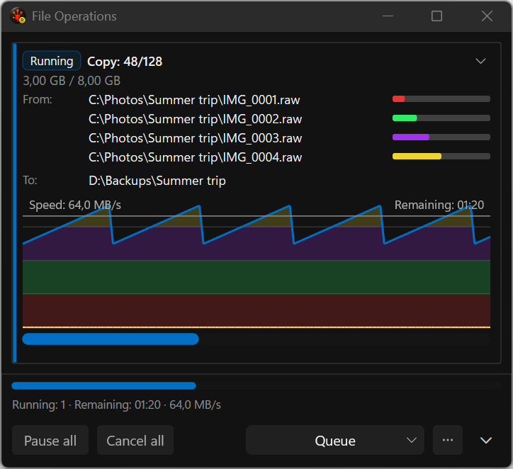
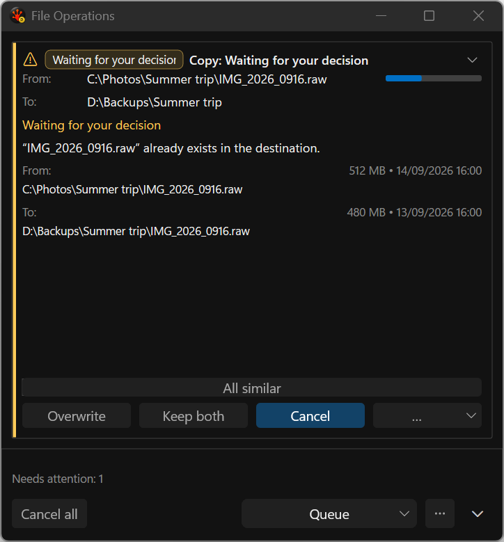
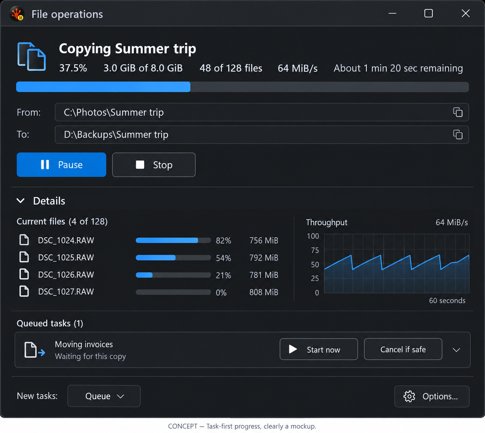
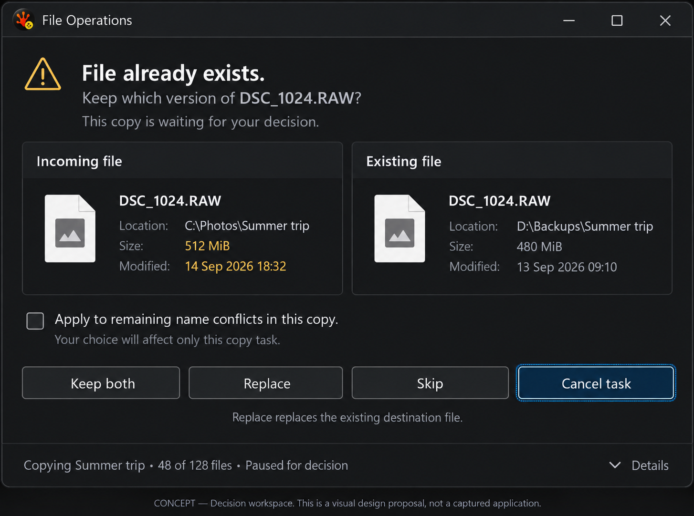
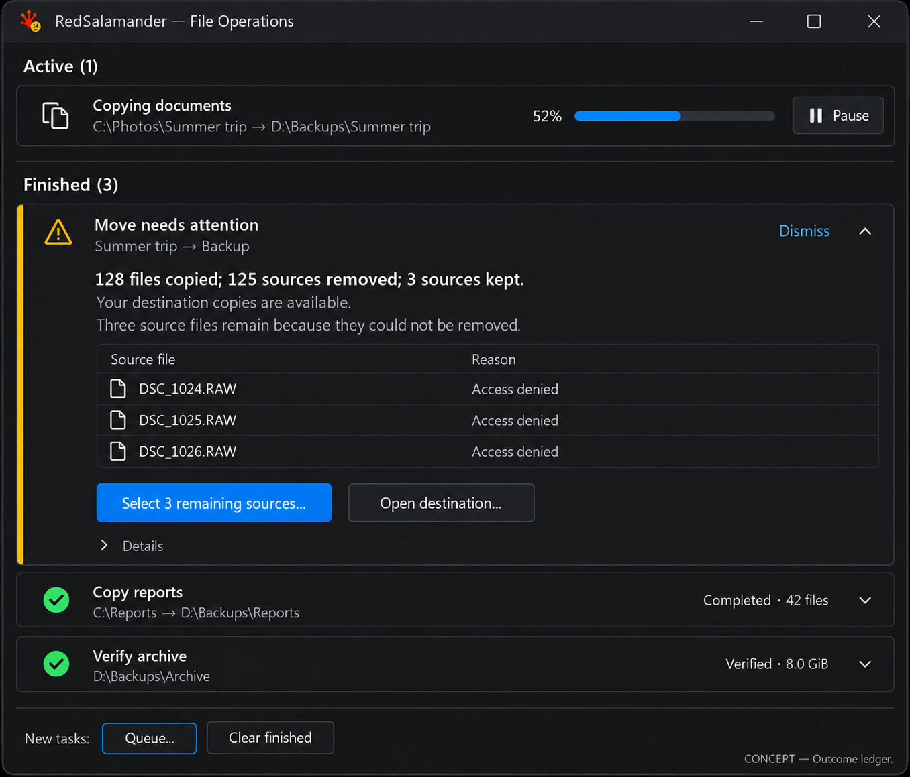

> Superseded proposal. The side-by-side comparison is rejected; see [the revised proposal](../proposal.md).

# File Operations: make progress, decisions, and outcomes clear

Review date: 2026-09-16. Design proposal; product changes are not implemented.

The window should answer four questions immediately: **What is happening? What needs my decision? What can I control? What actually happened to my files?** The current display contains much of the necessary information, but gives graphs, repeated labels, and global controls more space than task controls and recovery.

The recommended direction combines the three concepts below into one native desktop window. First restore visible task actions and an unmistakable “apply to similar conflicts” checkbox. Then simplify the progress hierarchy, give decisions a focused comparison layout, and replace ambiguous completion bars with useful outcome summaries. DxUi may be extended to support this properly.

## Evidence and limits

The [gallery](../gallery.html) contains **128 original PNG captures from 101 named scenarios**. Every application image came from the non-activating `FileOps_VisualGallery` test case, using the production popup, retained controls, conflict policy, menus, and custom speed dialog. No desktop control or manual screenshots were used. All saved images were inspected, including the four theme modes and the invalid-speed error state.

These are **real renderer captures with synthetic presentation data**. They demonstrate layout and visible policy choices, not successful file transfers, provider behavior, estimator accuracy, or accessibility compliance. Names, sizes, graph samples, elapsed times, and outcome summaries are fixtures. Some combinations deliberately exercise exceptional presentation branches. Do not file engine defects from those synthetic values.

The run used x64 Debug at 144 DPI (150%), English UI resources and the machine's French number/date formatting. All semantic scenarios have a dark capture. Light, Rainbow, and High Contrast cover representative progress, completion, conflict, and permanent-delete displays; they are not a full cross-product. The [inventory](../scenario-inventory.md) lists every image and explicit coverage gaps. [Capture provenance](capture-manifest-v1.json) records the dirty source identity, build receipt, executable, image dimensions and SHA-256 hashes.

Current intent is grounded in [the popup contract](../../../../UI/UI_FileOperationsPopup.md), [the File Operations contract](../../../../FileSystem/FileSystem_FileOperations.md), and [the production renderer](../../../../../RedSalamander/FolderWindow.FileOperations.Popup.cpp). Proposed outcome and consent work must coordinate with [I18](../../UI_ConfirmationPreferencesAndOperationOutcomes_2026-09-08.md). This review does not supersede its engine requirements.

The reviewed user journey is:

1. **Submit and wait:** [preparing](../screenshots/02-preparing__dark__480dip.png) and [queued](../screenshots/04-queued-start-now__dark__480dip.png).
2. **Monitor and control:** [running](../screenshots/10-copy-four-streams__dark__480dip.png), [paused](../screenshots/14-paused__dark__480dip.png), and [speed validation](../screenshots/100-speed-invalid__dark__dialog.png).
3. **Resolve a decision:** [file conflict](../screenshots/33-decision-file-exists__dark__480dip.png), [metadata loading](../screenshots/57-decision-metadata-loading__dark__480dip.png), and [permanent-delete consent](../screenshots/55-decision-permanent-delete__dark__480dip.png).
4. **Understand the result:** [verified](../screenshots/19-completed-verified__dark__480dip.png), [partial move](../screenshots/21-move-source-kept__dark__480dip.png), and [unknown outcome](../screenshots/23-move-source-unknown__dark__480dip.png).
5. **Review and recover:** [finished history](../screenshots/31-completed-group-expanded__dark__480dip.png) and [available result actions](../screenshots/95-menu-completed-more__dark__480dip__flyout.png). The separate Issues pane remains an explicit capture gap.

These two unmodified harness captures anchor the progress and decision recommendations below. The gallery contains the complete accepted evidence set.

## What the current design is trying to do

| Display | Existing intent | Keep | Improve |
|---|---|---|---|
| Preparing, discovering, queued | Explain why bytes are not moving; retain the task in one place | Distinct status and queue constraints | Explain the reason once; show an available action; avoid a largely empty full-height card |
| Copy / Move / Delete | Show overall progress, current items, speed, ETA and concurrency | Counts, useful paths, honest unknown totals, optional detailed throughput | Put progress and task controls first; make stream detail secondary |
| Pause / stopping / callback silence | Reassure the user that the operation still exists and remains controllable | Stable task identity and existing cancel semantics | Show requested versus acknowledged state explicitly; avoid presenting historical rate as current activity |
| Verification | Distinguish copying bytes from validating the result | Separate verification outcome and phase | Label both phases; do not require users to interpret a hatched segment |
| Conflict and consent | Pause safely, explain the affected item and publish only legal actions | Safe default, withheld destructive choices, operation-scoped consent | Compare values directly, show scope visibly and fit complete action labels |
| Finished tasks | Preserve success, partial result, errors, cancellation and unknown outcome | Typed outcomes, warnings, retained history | Give the useful next action priority over Dismiss; avoid presenting 100% as success |
| Compare / Change case / Change attributes / Make file list | Reuse the task window for related background work | Shared location and task lifecycle | Use the same status, disclosure, progress and outcome vocabulary |
| Footer and menus | Offer aggregate controls and queue preferences without permanent toolbar clutter | Global controls, compact mode, options | Label scope: “All active tasks” and “New tasks”; reveal the most useful task actions directly |

## Findings, in priority order

### 1. Expanded active tasks lose their action row — high severity

**Evidence:** [running copy](../screenshots/10-copy-four-streams__dark__480dip.png), [paused](../screenshots/14-paused__dark__480dip.png), [queued](../screenshots/04-queued-start-now__dark__480dip.png). Per-task Pause / Resume, Cancel, speed, and Start now are absent from these expanded cards, while aggregate footer controls remain visible. The speed flyout can still be invoked by the test hook ([capture](../screenshots/96-menu-speed__dark__480dip__flyout.png)); that does not establish that a user can reach it from the card.

**Source check:** in `FileOperationsPopupState::Render`, `buttonsHeight` is calculated from `conflictButtonsHeight + conflictApplyLineHeight`. Both are zero for an ordinary non-conflict task. The normal action branch subsequently uses this zero-height row. This is a concrete layout defect supported by both captures and source, not a preference about styling.

**Proposal:** reserve and measure the action row independently for every state that has actions. Keep Pause / Resume and Cancel visible on an active expanded card; show Start now only when policy allows it. Put Speed limit in the row or a named overflow. Keep aggregate actions secondary and explicitly scoped.

**Benefit:** users can control one task without pausing or canceling every task. Queue controls become discoverable. Fix this before decorative changes.

**Acceptance:** at 480 DIP and with long translated labels, every allowed action has nonzero visible bounds, is reachable by keyboard/UIA, and invokes the intended task. Forbidden Start now stays absent. A screenshot alone is not an interaction test.

### 2. “All similar” does not communicate its checked state — high severity

**Evidence:** compare [unchecked conflict](../screenshots/33-decision-file-exists__dark__480dip.png) with [checked fixture](../screenshots/60-decision-apply-to-all-checked__dark__480dip.png). Both show a full-width “All similar” strip with no visible checkmark. The High Contrast [variant](../screenshots/33-decision-file-exists__high-contrast__480dip.png) makes the button-like outline particularly apparent. The immediate-mode source contains checkbox drawing, but the final hosted-control presentation does not convey the fixture's checked state.

**Proposal:** a real checkbox, backed by toggle semantics and UIA Toggle state. Use scoped copy such as “Apply to remaining name conflicts in this copy.” For consent classes, derive the scope from the engine's actual policy; do not substitute “all files” or imply a global preference. Show it only when that class is eligible.

**Benefit:** users can see whether one decision will repeat and which later items it affects. This reduces accidental repeated replacements or loss consent.

**Acceptance:** unchecked, checked, focused, disabled and High Contrast states are visibly distinct; Space toggles; accessible state matches the engine; destructive choice is never inferred from the checkbox alone.

### 3. Decision cards repeat context and make comparison difficult — high severity

**Evidence:** [existing file](../screenshots/33-decision-file-exists__dark__480dip.png), [type mismatch](../screenshots/36-decision-type-mismatch__dark__480dip.png), [destination link](../screenshots/37-decision-destination-link__dark__480dip.png). “Waiting for your decision” appears in a badge, title and body. Source and destination context appears twice. Size and date are separated vertically; much of the card remains empty before the decisions at its bottom.

**Proposal:** one specific heading, one explanation and one context block. At wider sizes compare Incoming and Existing in aligned columns; at narrow sizes stack the same labelled fields in the same order. Emphasize the differences. Clearly name item type, link/reparse semantics and unknown metadata. Keep decisions close to the evidence rather than at a distant card edge.

**Benefit:** less scanning and fewer memory comparisons before a potentially irreversible choice.

**Acceptance:** unresolved metadata never looks like zero bytes or a normal file. The [loading](../screenshots/57-decision-metadata-loading__dark__480dip.png) and [replacement withheld](../screenshots/58-decision-replacement-withheld__dark__480dip.png) states retain their publication gates. No new default replacement or Enter-key behavior is introduced.

### 4. Action labels clip when the decision is most consequential — high severity

**Evidence:** [live-output conflict](../screenshots/54-decision-same-host-live-output__dark__480dip.png) truncates the queue choice. The [read-only replacement](../screenshots/34-decision-read-only-file__dark__480dip.png) action also has very little room. A fixed equal-width row does not accommodate policy-specific verbs.

**Proposal:** content-measured buttons with a minimum usable target; wrap the action group to another row when needed. Preserve the safe default and reading order. Overflow only secondary alternatives, with a meaningful “More choices” label where space allows. Destructive or safe-exit actions must not disappear merely because another label is long.

**Benefit:** the user reads the full consequence instead of guessing from a fragment. Localization no longer competes with safety.

### 5. Completion emphasizes dismissal and percent, not the file outcome — high severity

**Evidence:** [sources kept](../screenshots/21-move-source-kept__dark__480dip.png), [unknown source outcome](../screenshots/23-move-source-unknown__dark__480dip.png), [interrupted move](../screenshots/26-interrupted-move__dark__480dip.png), [verification failed](../screenshots/65-verification-failed__dark__480dip.png), and [completed history](../screenshots/31-completed-group-expanded__dark__480dip.png). The useful distinctions already exist, which is valuable. However, long outcome text clips in the title, a full progress bar can accompany a partial/unknown result, and Dismiss has much more visible space than recovery. The [completed menu](../screenshots/95-menu-completed-more__dark__480dip__flyout.png) hides Failed items, Reveal item, Open destination, Show log and Export issues.

**Proposal:** wrap a concise outcome sentence in the body. Separate destination publication, source removal, and verification. For example: “128 copied · 125 sources removed · 3 sources kept.” Offer the legal next action directly: “Select remaining sources,” “Review 3 issues,” or “Open destination.” Put diagnostics and export in Details. A percent may describe work performed while active; a terminal receipt should describe results.

**Benefit:** users know whether their destination copy exists and whether the original remains. They can recover without guessing or searching a menu.

**Safety:** do not automatically retry source deletion, restore a cut list, or offer a repair action without retained item identity and engine eligibility. Unknown source state must stay unknown. “Select remaining sources” is a proposed read-only navigation action and is only enabled for known, addressable retained sources.

### 6. Graphs and duplicated paths dominate ordinary progress — medium severity

**Evidence:** [four streams](../screenshots/10-copy-four-streams__dark__480dip.png), [sixteen streams](../screenshots/74-sixteen-streams__dark__480dip.png), [zero-byte items](../screenshots/68-zero-byte-items__dark__480dip.png), [Delete](../screenshots/13-delete__dark__480dip.png). Several progress layers compete: item bars, a large throughput graph, task bar and footer bar. Sixteen coloured streams repeat the same folder prefix. A graph scaffold remains even where byte throughput is not useful.

**Proposal:** a task heading, one primary phase/progress display, counts, speed/ETA when meaningful, then actions. Keep a small throughput graph and per-stream list under Details. Show a folder pair once and filenames beneath it; preserve complete paths in accessible text and copy affordances. Keep item-rate semantics for Delete and count-based progress for zero-byte work. Do not simply relabel bytes as files.

**Benefit:** quick status checks become quick. Detailed performance information remains available to users who need it, with much less visual competition.

### 7. Waiting and cancellation need more precise language — medium severity

**Evidence:** [preparing](../screenshots/02-preparing__dark__480dip.png), [awaiting acceptance](../screenshots/03-awaiting-acceptance__dark__480dip.png), [queue paused](../screenshots/70-queue-paused__dark__480dip.png), [waiting on another task](../screenshots/71-waiting-for-other-task__dark__480dip.png), and [stopping fixture](../screenshots/15-stopping__dark__480dip.png). Different reasons often collapse to the same generic title. The stopping fixture still renders Running; `ResolveTaskStatusKind` has no corresponding stop-requested branch. Confirm the live transition before classifying this as an engine defect.

**Proposal:** short, state-specific sentences: “Counting files…”, “Waiting for Copy Summer trip”, “Queue paused”, “Stopping after the current safe step…”. Keep the distinction between a requested pause/cancel and provider acknowledgement. During discovery, say “48 of at least 140 items” or equivalent only when the model supplies that lower bound; show “Calculating…” when a reliable denominator or ETA is unavailable.

**Benefit:** fewer repeated clicks and less uncertainty about whether the application has responded. Never promise immediate cancellation or a bounded remaining time the provider cannot guarantee.

### 8. Compact and global modes need a coherent hierarchy — medium severity

**Evidence:** [collapsed task](../screenshots/28-compact-progress__dark__480dip.png), [compact density](../screenshots/73-compact-density__dark__480dip.png), [footer-only](../screenshots/29-footer-only__dark__480dip.png), [mixed running/queued](../screenshots/30-running-and-queued__dark__480dip.png), and [empty](../screenshots/01-empty__dark__480dip.png). The footer-only mode is genuinely small and worth preserving. Compact cards reduce content but can leave a substantial empty body. The prominent Queue selector does not state whether it affects an existing task or future submissions.

**Proposal:** use content-driven preferred height with a bounded, user-resizable list. Queued and successful finished tasks default to compact rows. Keep expanded state and keyboard focus stable as tasks update. Label the footer selector “New tasks: Queue / Parallel.” Label aggregate actions “Pause all active” and “Cancel all…” only if a confirmation actually follows. Empty state: “No file operations” and a short explanation of where new tasks appear; no dummy progress scaffold.

**Benefit:** more useful information fits on screen, and changes in task count do not create a disorienting resizing experience. The footer's scope becomes explicit.

### 9. Themes and supporting dialogs need the same semantic quality — medium severity

**Evidence:** [light conflict](../screenshots/33-decision-file-exists__light__480dip.png), [high-contrast conflict](../screenshots/33-decision-file-exists__high-contrast__480dip.png), [speed validation](../screenshots/100-speed-invalid__dark__dialog.png), [graphics fallback](../screenshots/98-renderer-failure__dark__480dip.png), and [informational failure](../screenshots/82-compare-failed__dark__480dip.png).

**Proposal:** preserve the speed dialog's inline validation and retained input; add a visible rate unit and plain example without changing the accepted grammar silently. Give informational tasks the same status and result layout. Preserve the independent native graphics-failure fallback with Cancel all and Close. Keep status text and icons alongside colour in every theme; use system High Contrast semantics and a visible focus indicator.

**Benefit:** error handling and less common states feel like the same application. Colour is supplementary, and failure of the richer renderer does not remove control.

**Limit:** these images identify visual risks, not measured contrast ratios or a keyboard/screen-reader pass. Those need interaction and accessibility tests.

## Three concept mockups

These images are **AI-generated design illustrations**, using the actual captures as references. They are not application screenshots or pixel-accurate implementation specifications. The text and behavior requirements in this proposal govern implementation.

### A. Task-first progress

The main task is recognizable, its progress is understandable, and its controls are visible. Detailed streams and throughput form a secondary layer. The queued item is a compact row, and the footer labels the scope of the scheduling preference.

Apply this hierarchy at the existing narrow size, not only in a wide concept window. At 480 DIP the metrics and path rows wrap; the detail list and graph stack. Use the established **Cancel** terminology unless a separately reviewed copy change chooses Stop. The generated “Cancel if safe” caption is an illustration defect: the shipped label must be **Cancel**, with eligibility controlled by policy. Only Start now is shown when safe to start. The illustration's graph scale and file sizes are decorative; they are not data contracts.

### B. Decision workspace

The question comes first, the incoming and existing versions are directly comparable, and the scope checkbox is recognizable. The safe default remains explicit. This is the expanded decision state of the same task window, not a requirement to open a second modal window.

The illustration uses “Replace”; retain the existing “Overwrite” resource until terminology is deliberately reconciled. Do not display every pictured choice for every conflict. Obtain labels, allowed actions, default, escape and repeat-scope eligibility from the conflict policy. While metadata loads, replace unknown fields with “Checking…” and withhold actions exactly as today. At narrow widths stack Incoming above Existing while preserving aligned field labels. Treat consent warnings (plaintext, metadata loss, hydration, permanent delete) as consequence summaries, not artificial two-file comparisons.

### C. Outcome ledger

The window retains useful history, but successful tasks are compact. A partial move expands into a plain outcome and a useful next action. It distinguishes copied files from removed sources and retained sources, with technical details secondary.

The illustration's active “Copying documents” row reuses the photo path; correct those sample names in implementation. Recovery counts and names must come from retained typed issues, never from parsing a summary string. Clear finished should respect retention policy and keep unresolved attention items unless the user explicitly dismisses them. A completion receipt should remain available long enough to understand; preserve user-configured automatic dismissal for eligible success/cancellation states rather than unconditionally removing it.

## One window, adaptive states

| State | Primary content | Primary controls | Secondary detail |
|---|---|---|---|
| Empty | No file operations | New-task scheduling preference | Options |
| Preparing / discovering | Specific phase; known counts; indeterminate progress if needed | Cancel; Pause only when supported | Source/destination, elapsed time |
| Queued | Task name and exact wait reason | Start now when legal; Cancel | Order/dependency detail, change destination when legal |
| Running | Operation + item set, primary progress, counts, rate, qualified ETA | Pause; Cancel | Speed limit, active items, throughput |
| Pause requested / paused | Explicit requested/acknowledged state | Resume when valid; Cancel | Last activity, task context |
| Stopping | Stop requested; safe-step explanation | No duplicate cancel submissions | Existing progress and provider status |
| Decision required | Specific question, affected items and consequence | Policy-approved choices; safe exit | Details, scope checkbox only when eligible |
| Verifying | Copy phase complete; verification progress and counts | Existing legal pause/cancel behavior | Verification rate and errors |
| Completed | Result receipt and useful destination action | Open destination / Dismiss | Log, details |
| Partial / failed / canceled / unknown | Accurate outcome axes and issues | Review issues / Select known remaining sources | Diagnostics/export; gated recovery |
| Renderer unavailable | Plain native explanation; operation still running | Cancel all; Close | Minimal status |

Suggested layout starts with a 480 DIP minimum usable width and an expanded preference around 640–760 DIP. These are design targets to test, not changes to the current contract. Use 16 DIP outer padding, 8–12 DIP group spacing, approximately 32 DIP comfortable action targets, and a restrained type hierarchy. Respect existing user density preferences. Do not grow the window beyond the work area or resize it on every progress update.

## DxUi changes worth making

These are capability proposals, not assertions that the current library lacks every listed primitive. First inspect the existing control catalog and extend the canonical controls where possible. Shared implementation belongs in **DxUi**, with a later explicit consumer pin update. RedSalamander owns task state, policy, text, and actions.

| Shared capability to add or strengthen | Needed behavior | Product responsibility |
|---|---|---|
| Adaptive action group | Content measurement, nonzero minimum height, wrapping, stable order/focus, safe overflow | Supply allowed actions/default/escape and localized text |
| CheckBox / toggle presentation | Visible checked/unchecked/disabled/focused states; keyboard and UIA Toggle parity in every theme | Map the repeat decision to the engine's exact scope |
| Labelled value / path layout | Aligned pairs, wrapping and middle ellipsis that preserve root and filename; accessible full value; optional copy affordance | Supply paths and decide whether navigation/copy is permitted |
| Disclosure and task group layout | Bounded content-driven measurement; retained expanded state; stable scroll anchor; efficient visible-item updates | Choose initial expansion and attention ordering |
| Phase-aware progress presentation | Named phases, determinate/indeterminate states, separate result semantics and accessible values | Preserve current copy/verify accounting until its contract is explicitly changed |
| Inline status and message blocks | Icon + text, wrapping, optional detail and action; theme/focus correctness | Produce accurate status and recovery eligibility |
| Optional throughput view | Bounded history, reduced motion, useful labels, no idle periodic work or unnecessary surface allocation | Supply valid rates/history and unit semantics |

Do not introduce a second immediate-mode/retained implementation of the same interactive element. Measure once through the shared layout, then use the resulting rectangles consistently for rendering, pointer input, tooltip and UIA. Add catalog/gallery examples for new shared controls, including long translations, mixed DPI, High Contrast and disabled/focused states.

## Implementation order and acceptance

1. **Restore controls and trust.** Fix the ordinary action-row measurement, checked-state presentation and clipped decision labels. Add behavioral checks for one-task versus global actions and safe defaults. Capture before/after with the same fixtures.
2. **Restructure progress.** Introduce one shared task layout, readable metrics, compact queued rows, meaningful empty state and optional graph detail. Preserve current engine progress and ETA semantics.
3. **Restructure decisions.** Add responsive metadata comparison and consequence layouts. Coordinate consent and metadata publication with I18; do not broaden available actions as a side effect of the redesign.
4. **Restructure outcomes.** Use typed destination/source/verification results and retained issues. Expose read-only recovery navigation first. Gate mutation/retry work separately with the relevant engine contract.
5. **Qualify the shared library and consumer.** Measure paired retained baselines before implementation. Run the required control, host and consumer suites; compare CPU, memory, allocations, idle wakeups, visible/hidden rendering, and resize behavior on the same fixture. No performance improvement is established by this visual review.

Release acceptance should include:

- Every registered semantic fixture has an inspected screenshot; no clipped critical labels at the supported minimum width or under translated text expansion.
- Keyboard order remains stable when a task changes status; focus is not stolen by a newly arriving conflict. Focused/checked/disabled states are visible and match UIA.
- Pause, Cancel, Start now, repeated decisions, and source-recovery navigation act on the intended task and obey current policy.
- Progress has an honest denominator; discovery and unknown outcome are never rendered as successful completion. Copy, source removal and verification retain distinct semantics.
- 100%, 150% and 200% DPI, mixed-monitor transitions, Light/Dark/Rainbow/High Contrast, reduced motion and relevant translations are verified through the harness.
- A realistic multi-task fixture preserves scroll position and remains responsive; hidden/idle views respect current scheduling and resource contracts.
- The native renderer-failure fallback still offers valid control of live tasks.

## Review disposition

Recommend the combined A/B/C hierarchy, starting with the action-row and checkbox defects. The three concepts are complementary states of one design. Product redesign remains a proposal. The current evidence pack is usable now, while the [explicit capture gaps](../scenario-inventory.md#coverage-gaps) prevent an unsupported claim that every possible provider, locale, interaction and adjacent dialog has been photographed.

The permanent workflow is now recorded in both repositories' `AGENTS.md`, the [selftest contract](../../../../Testing/Testing_SelfTests.md), and [test documentation](../../../../../Tests/README.md): simulate a named scenario, capture the process-owned application window through the test harness, retain provenance, inspect the result, and store concepts separately.
