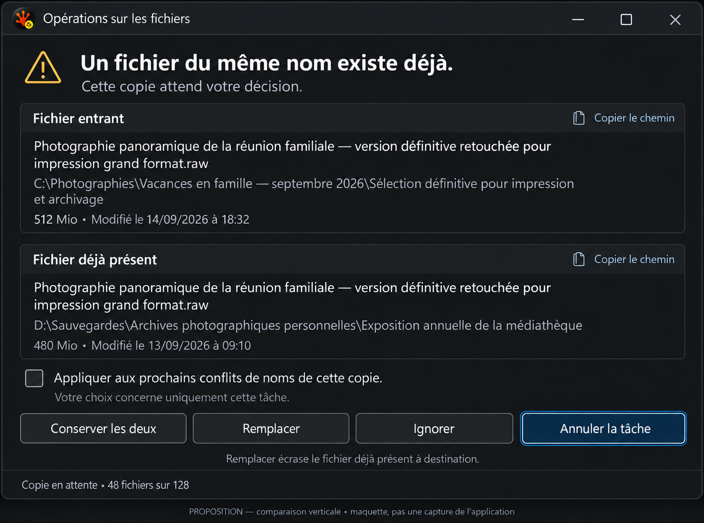
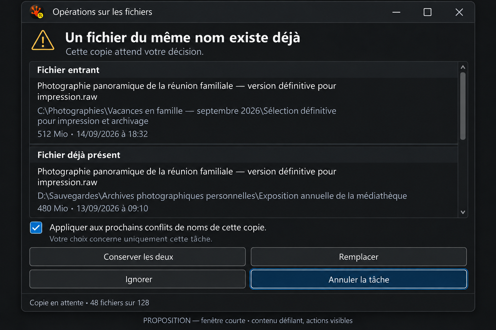
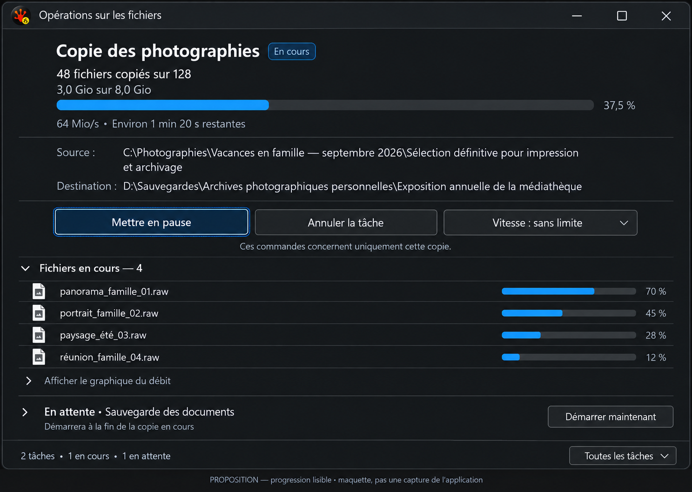

# File Operations: readable paths, decisions and results

Revised 2026-09-16 after the first proposal was rejected. **Design proposal, not an implemented redesign.**

**Incoming and Existing are always stacked, in that order, at every window width.** Long file names and locations get the full content width. French text, a short work area, keyboard focus and pointer states are acceptance inputs, rather than optional polish. The earlier side-by-side decision mockup is superseded.

Start with the [screenshot gallery](gallery.html), [scenario inventory](scenario-inventory.md) and [validation record](validation.md). Actual application images come exclusively from the test harness. Generated concepts below are labelled separately and cannot prove text fit, DPI behavior or accessibility.

## What the new evidence changes

The review now includes French resources and long French fixture sentences on both physical monitors: DISPLAY1 at **144 DPI / 150%** (3840 × 2160), and DISPLAY5 at **96 DPI / 100%** (2560 × 720). Native windows were placed on each monitor; PNGs were not resized to manufacture DPI coverage. `displays.tsv` records the actual work areas. A separate, explicitly selected interaction case uses the existing warning and runner desktop lease to take focus briefly.

The earlier missing drivers are now implemented: live Copy/Move/Delete confirmation overlays, verification-availability variants, destination history, a populated Issues pane, selection and scrolling, French resources, both monitor DPIs, and real keyboard/pointer interaction. The [inventory](scenario-inventory.md) maps the closed gaps to evidence. This finite catalog covers every current conflict class and representative display states; it does not claim every provider × locale × theme × DPI combination.

Fixtures simulate display state, not successful transfers. The real renderer, resource loader, controls, conflict policy and adjacent windows draw the screenshots. Synthetic facts and provider messages are identified in the manifest. An English system error description in a French Issues view is separately observable; it is not evidence that the French satellite failed to load.

## Existing intent and proposed improvement

| Surface | Intended job today | Proposed change | User benefit |
|---|---|---|---|
| Progress | Show work, rate, time and active files | One progress hierarchy, visible task controls, optional graph | The task and available actions can be understood at a glance |
| Queue / preparation | Explain work that has not started | Compact phase and exact wait reason; legal actions beside it | Waiting does not resemble a stalled large empty card |
| Conflict | Present evidence and obtain a safe decision | Incoming above Existing, full-width paths, measured action group | Long names remain comparable without horizontal scanning |
| Confirmation | Explain consequences and operation options | Separate readable consequence text from labelled option values | Users understand what will change before starting |
| Results | Retain success, partial results and problems | Outcome sentence plus counts and useful next action | A full progress bar cannot be mistaken for success |
| Issues | Expose diagnostic details for recovery | Message and affected file first; readable selected-item detail | Users can understand and resolve an issue without decoding HRESULTs |
| Footer | Control all tasks and scheduling preferences | Explicit scope: this task, all active tasks, or new tasks | Fewer accidental global actions |

## Evidence-based priorities

### P1 — Restore task controls and measure French action text

[French running task](screenshots/10-copy-four-streams__dark__480dip__fr-FR__display1__144dpi.png) still lacks the ordinary expanded task action row. Source inspection finds `buttonsHeight` derived from conflict-only heights; both are zero for a normal task. The global footer remains visible, which encourages acting on every task when only one task is intended.

[French conflict](screenshots/33-decision-file-exists__dark__480dip__fr-FR__display1__144dpi.png) clips the decision badge and `Conserver les deux`. [Live-output decision](screenshots/54-decision-same-host-live-output__dark__480dip__fr-FR__display2__96dpi.png) clips more consequential choices. A translated label must not be squeezed into equal fixed-width slots.

Reserve a real action area independent of task state. Measure localized labels with the active font and DPI. Wrap whole buttons into rows, keeping policy order stable; if a single label still cannot fit, allow its measured text to wrap and grow the button. Keep Cancel and the safe choice reachable. Never reduce the font or ellipsize a consequential action to make a screenshot look clean.

### P1 — Keep the two file descriptions vertical

[Long French conflict](screenshots/108-decision-long-french-paths__dark__480dip__fr-FR__display1__144dpi.png) already demonstrates why the original column proposal was wrong: paths and the file name need several lines. The current renderer correctly stacks paths; retain that direction and remove duplicated context.

Each section has its role heading, full file name, parent location, then size/date/type metadata in a consistent order. The incoming section is first and the existing destination section second. Both use the entire content width, including at 760 DIP or wider. A small copy-path action belongs in the section heading or its own line, not in the filename's width budget. Highlight factual differences without relying on color alone.

Wrap locations preferably at separators and long filename segments at Unicode-safe boundaries. Do not insert characters into the underlying value. Provide keyboard-accessible full text and copy. Unbounded paths may scroll in the content region; the decision area remains visible. For metadata still loading, say `Vérification des informations…`; unavailable is not zero bytes. Type mismatches, links and withheld replacement remain explicit.

### P1 — Make repeat scope visibly checked

[Checked fixture](screenshots/60-decision-apply-to-all-checked__dark__480dip__fr-FR__display1__144dpi.png) and the unchecked conflict show the same `Tous similaires` strip without an unmistakable checkmark. Use a real checkbox with checked, unchecked, disabled, hovered and focused visuals, Space-key behavior and matching UIA Toggle state.

The [real Tab-focus capture](screenshots/109-keyboard-tab-focus__dark__fr-FR__display1__144dpi.png) puts a clear focus border around the entire strip, while [pointer press at 100%](screenshots/112-pointer-pressed__dark__fr-FR__display2__96dpi.png) confirms the footer button receives input. These are useful baselines, but focus must remain visually distinct from the checkbox’s checked state.

Suggested copy: `Appliquer aux prochains conflits de noms de cette copie`. Wrap it fully and add `Votre choix concerne uniquement cette tâche.` Derive visibility and scope from the conflict policy. A checked box is never independent consent for an unavailable destructive action.

### P1 — Reflow dialogs when DPI changes

Compare the custom speed validation dialog on [DISPLAY1 / 150%](screenshots/100-speed-invalid__dark__fr-FR__display1__144dpi.png) and [DISPLAY5 / 100%](screenshots/100-speed-invalid__dark__fr-FR__display2__96dpi.png). On the second display, buttons overlap the French help/error region. The valid and initial states also show overlap. This is current product evidence, not a mockup defect.

Remeasure text, control rectangles and required client height after creation, localization, DPI changes and validation changes. Input, help/error and actions must occupy separate measured rows. Respect the current monitor work area. If content exceeds the available height, scroll the body and retain visible actions; do not crop the error or move actions over it. Require a same-window 150% → 100% → 150% regression test when implementing the fix.

### P1 — Make Issues useful for a person

The [populated French Issues pane](screenshots/104-issues-populated__dark__fr-FR__display1__144dpi.png) spends most of its initial width on time, numeric task ID, operation, severity and HRESULT. The explanatory message is pushed to the right and its multiline text is vertically clipped. [Selection](screenshots/105-issues-selected__dark__fr-FR__display2__96dpi.png) adds a visible blue row, but does not make that explanation readable.

Default columns should be **affected file, problem, operation, outcome**. Put timestamp, task ID, HRESULT, storage and concurrency in optional technical detail. Selecting an issue opens a wrapped detail region below the list, with Source above Destination and complete problem/recovery text. Keep bounded row heights in the large grid; do not render clipped multiline paragraphs inside them. Provide copy details and existing export/navigation actions. Preserve source identity and recovery eligibility from typed records; do not infer these from text.

### P2 — Simplify progress, confirmation and outcome language

[Running progress](screenshots/10-copy-four-streams__dark__480dip__fr-FR__display2__96dpi.png) repeats paths and gives the graph more area than controls. Show task title, progress/counts, qualified time estimate, Source and Destination, then task actions. Disclose active files and graph. Discovery, transfer and verification remain distinct phases with honest unknown totals.

The [discovery-and-transfer capture](screenshots/07-discovery-and-transfer__dark__480dip__fr-FR__display2__96dpi.png) still contains English progress wording (`so far`, `items`) despite the French UI selection. Include these sentences in the localization review and rerun their measured French version; surrounding translated controls alone do not establish complete localization.

The [Copy confirmation](screenshots/102-confirmation-0__dark__fr-FR__display1__144dpi.png) also shows low visual separation between its blue paragraph text and blue background. Use the normal readable body foreground for instructions and consequences; reserve semantic color for the icon, a border or a restrained tint. Verify foreground/background contrast in the native implementation, including disabled explanation text.

The [Move confirmation](screenshots/102-confirmation-4__dark__fr-FR__display2__96dpi.png) now gives reviewable evidence of the cut-list consequence and option controls. Preserve its safety content, but use a compact consequence block and ordinary labelled values rather than button-like full-width sentences. Disabled verification must include the reason without truncation. Source and Destination still stack. Keep safe default and Escape semantics unchanged.

[Partial move](screenshots/21-move-source-kept__dark__480dip__fr-FR__display1__144dpi.png) and [unknown source state](screenshots/23-move-source-unknown__dark__480dip__fr-FR__display1__144dpi.png) cannot be explained by a 100% bar. Use `Copie effectuée ; 3 fichiers source conservés` or an explicit unknown result, with separate destination publication, source removal and verification facts. Offer `Examiner les problèmes` before Dismiss. Preserve configured auto-dismiss only for eligible outcomes.

[Destination history](screenshots/107-destination-history__dark__480dip__fr-FR__display2__96dpi__flyout.png) clips long folder labels. Prefer a two-line item (folder name, distinguishable parent path) plus accessible full path. Identical prefixes must not make choices indistinguishable. Merely showing a menu through the harness does not prove its currently missing task button is user-reachable.

## Revised mockups

These are complementary views of one proposal, not alternative product policies. They illustrate hierarchy; the native harness remains the authority for pixel fit.

### A. Full-width comparison

This replaces the rejected horizontal comparison. Full-width names and locations wrap, the two roles stay in a stable order, the scope checkbox is identifiable, and Cancel retains visible focus. The `Remplacer` wording in the illustration is proposed copy; reconcile it with the existing French `Écraser` resource before implementation. Publish only actions actually allowed by the engine. In this current conflict policy, Ignorer belongs in More; its direct placement in the illustration requires a separately reviewed placement change, otherwise retain More.

### B. Short-window comparison

The same vertical structure fits a shorter workspace by scrolling the comparison body and wrapping the action group into two rows. This model matters on the 720-pixel secondary display. The checked scope and focused safe action are visually distinct. The generated bitmap is an illustration, not proof that these exact metrics fit at 100% or 150%; native layout tests must establish that.

### C. Progress with visible controls

Task controls sit near progress, both paths use their own full-width row, and the throughput graph is optional. Focus and hover should remain distinct from primary/default styling. The queued action appears only when the engine permits Start now. The numerical values are illustrative fixtures. Preserve the existing unit conversion semantics; changing an MB label to Mio also requires that its numeric conversion uses binary units.

## Proposed layout and interaction contract

| Requirement | Acceptance evidence required for implementation |
|---|---|
| Always-vertical comparison | Incoming above Existing at 480, 640, 760 DIP and wider; long French filename and parent paths remain separately readable |
| Work-area fit | At native 96 and 144 DPI, the window and decision actions remain inside each monitor work area, including the short secondary display |
| Text measurement | No clipped critical labels, warning paragraphs, validation text or checkbox scope; no buttons over help text |
| Adaptive actions | Whole-button wrapping preserves policy order, keyboard order and readable labels; content scroll does not hide the safe exit |
| Stable keyboard focus | Tab/Shift+Tab reach visible actions; state changes do not jump focus to a destructive choice; focus survives reflow and monitor changes |
| Pointer states | Hover, pressed, disabled and checked are distinct; hit rectangles match paint rectangles after a DPI move |
| Paths and disclosure | Complete values available without hover; copy preserves the exact value; tooltips supplement rather than replace readable content |
| Safety semantics | Allowed/default/Escape actions, repeat scope, metadata gates and source recovery come from existing typed policy |
| Accessible meaning | Names, values, selection and toggle state exposed consistently; actual UIA and assistive-technology checks supplement screenshots |
| Window lifecycle | No new focus theft on progress/conflict arrival; renderer fallback still exposes valid Cancel all and Close |

200% DPI and other locales remain later implementation qualification; the current machine supplied genuine 100% and 150% evidence. Do not label image rescaling as native DPI testing.

## DxUi work is allowed and expected

Use the canonical library, extending existing controls where needed. RedSalamander supplies operation state, wording and action policy. A library change requires an explicit later consumer pin update.

| Shared capability | Required improvement |
|---|---|
| Measured action group | Wrap buttons, support long labels, preserve focus/order and guarantee a nonzero action area |
| Labelled path/value block | Full-width Unicode wrapping, accessible full value, copy affordance and measured metadata rows |
| Checkbox | Visible toggle state, keyboard/pointer parity and UIA Toggle semantics in every theme |
| Dialog layout | Reflow after DPI/locale/validation changes, measured help/error region and work-area-aware body scrolling |
| Grid and detail view | Bounded readable rows, selected-item details, stable selection/scroll position and DPI-correct input bounds |
| Scroll/disclosure container | Stable anchors, visible actions, no forced window growth beyond the work area |
| Progress/status primitives | Named phases and outcomes; bounded graph history and reduced-motion/idle behavior |

Use one measured layout for drawing, input, tooltip and UIA bounds. Shared improvements need catalog/gallery entries and meaningful interaction tests, including French sentences and mixed DPI. Existing DxUi limitations do not constrain the intended UX.

## Implementation sequence

1. Correct missing action rows, checked-state visibility and translated text sizing, using retained before/after fixtures.
2. Correct dialog DPI reflow and work-area handling before adding more content.
3. Implement the vertical comparison, stable actions and complete path access.
4. Restructure progress, confirmation and results; coordinate policy/outcomes with I18.
5. Reorder Issues information and add readable selected-item detail.
6. Qualify keyboard, pointer, UIA, themes, monitor transitions and paired performance/resource behavior in the library and consumer.

The capture infrastructure permits this work to continue. The proposed product changes and their no-clipping acceptance criteria remain open implementation work; capture success does not mean the current UI passed those criteria.
