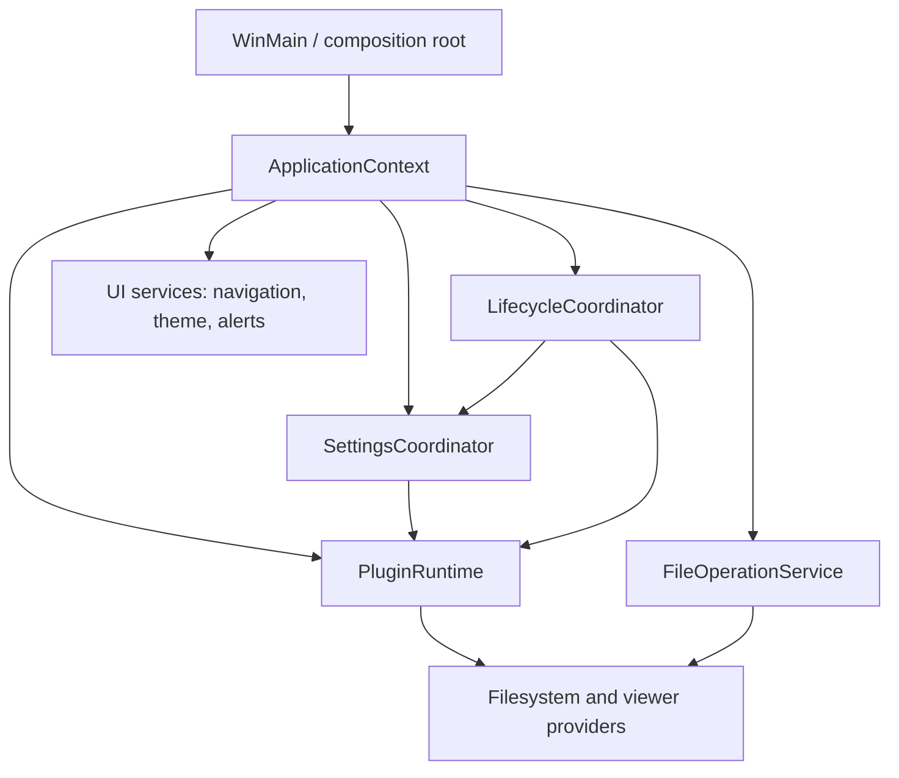

# Operation Observatory — Whole-Repository Code Audit and Remediation Plan

| Field | Value |
|---|---|
| Status | WIP audit report and remediation routing authority |
| Reviewed | 2026-07-15 |
| Whole-repository audit baseline | `4ffcf59e7` |
| Seven-day supplement verification | Reconciled on 2026-07-15 at `6f61c38b3` for changes dated 2026-07-07 through 2026-07-14 |
| Branch/worktree | `codex/lighthouse-session-end`; active Lighthouse lifecycle work preserved |
| Scope | Production C++/headers, plugins, tests, build/release, packaging, scripts, dependencies, specifications, and active/historical audit ledgers |
| Source changes made by this audit | None |
| Primary rule | Fix correctness and data safety before structural refactoring; use existing owners where one already exists |

## Executive verdict

RedSalamander is **not release-ready and cannot honestly be described as bug-free** at this revision.
The codebase has unusually strong RAII, self-test, performance-instrumentation, and specification habits, but
those strengths coexist with several stop-the-line defects:

1. The latest Full run is red, and test inventory metadata remains duplicated across hand-maintained surfaces.
2. The release workflow can publish a partial platform set after one requested build/package leg fails.
3. IMAP delete can fall back to mailbox-wide `EXPUNGE` and permanently delete unrelated messages.
4. Microsoft Drive can put bearer tokens and preauthenticated upload URLs into diagnostics, and it will
   attach a bearer token to an unvalidated `@odata.nextLink`, including a foreign or plaintext origin.
5. Ordinary user flows can destroy data without a safe conflict/commit protocol: archive unpack silently
   overwrites, Pack-and-delete can delete the newly created archive, Make File List truncates directly,
   Monitor export contains immediate undefined behavior, and drag/drop can report an asynchronous MOVE as
   already completed.

The architecture is also too coupled in its most dangerous areas. Process globals are imported across
windows and host services; production and self-test mega-units include `.cpp` files; provider-specific HTTP,
pagination, configuration, and commit semantics are reimplemented repeatedly. This makes lifetime,
reentrancy, data-integrity, and shutdown bugs harder to see and more expensive to fix.

The right response is **not a rewrite**. Close the stop-the-line defects, install behavioral guards, then
extract narrow services along the seams those fixes establish.

## Priority and evidence conventions

- **P0** — stop release; reachable security exposure or destructive data-loss behavior.
- **P1** — high-impact correctness, crash, hang, durability, or architectural risk.
- **P2** — important robustness, accessibility, responsiveness, maintainability, or test-system weakness.
- **P3** — confirmed lower-frequency edge case or cleanup debt.
- **Effort** — `S`, `M`, or `L` implementation size.
- **Fix risk** — regression risk of the proposed change, not severity of the existing defect.
- **Confidence** — confidence that the current source contains the described behavior.

Line numbers are evidence anchors for the `4ffcf59e7` whole-repository baseline plus the seven-day supplement
verified at `6f61c38b3`. Re-resolve them after intervening edits; current Lighthouse Track C changes were not
folded into unrelated findings.

## Audit scope and method

This was a risk-first repository audit, not a claim that static review can mathematically prove the absence
of defects.

- Inventoried **967 scoped source/build/test/tooling files**, approximately **742,710 logical lines**.
- Recorded **82 actionable findings: 12 stop-line/P0, 48 P1, 17 P2, and 5 P3**.
- Checked **113 `.vcxproj` files**; 112 are in the solution. `PoC/Win32HelloCred` is intentionally outside it.
- Core application/Common/DxUi deep pass: **237 production `.cpp/.h` files, 249,528 lines**.
- Plugin deep pass: all **15 production plugin directories**, **78 `.cpp` + 46 `.h`** files, plus factories,
  DLL lifecycle, resources, projects, and shared props.
- Reviewed the canonical CI/Full plans, release/build workflows, vcpkg bootstrap, runtime dependency staging,
  ZIP packaging, test inventory, active WIP queues, authoritative specs, and the June review campaign.
- Used risk-first line review for destructive operations, credentials, network transports, pagination,
  callbacks/lifetimes, configuration, parsers, UI-thread I/O, and process shutdown; used pattern and contract
  review for the remaining surfaces.
- Excluded generated `.build` output, binaries/dumps, vendored/minified assets, and historical TestRuns source
  snapshots from source-quality findings. Localization was checked structurally, not for linguistic quality.
- PoCs were inventoried but kept below production priority unless they affect the build/release graph.

Targeted evidence available during the audit:

- `Tools/Tests/TestInventory.Tests.ps1`: **2 passed / 3 failed**.
- Resource localization contract Pester: **5 passed / 0 failed**.
- Latest archived Full run, `2026-07-15_lighthouse_track_a_full`: **1,138 passed, 10 failed,
  53 skipped**, exit 1. Failures were eight Commands cases, Monitor ETW latency, and Tools Pester; the sandbox
  audit also reported 179 leftovers.
- The preceding archived Full green on 2026-07-12 had **1,132 passed, 0 failed, 53 skipped**. Therefore the
  current failures require reconciliation; they must not all be casually labeled product regressions.

Subsequent Lighthouse Track B work superseded the inventory-count portion of that baseline: its closeout
snapshot was reconciled at **704 static / 805 runner-listed Commands cases**, and its inventory Pester contract
passed 5/5. Active Track C coverage has already advanced those ephemeral counts, which is exactly why Track 0 must
remove literal duplication. Track B's first Full run completed with **1,146 passed, 6 failed, and 53 skipped**; no
SettingsStore/HotReload case failed, but the six unrelated failures keep the canonical Full gate red. Track 0
therefore owns failure classification and eliminating duplicated inventory truth, not another literal-only count
refresh.

Operation Observatory itself started no build or Full run because this audit is source-read-only. The later
Track B evidence above was imported from its owner; current Lighthouse session-end source work remains untouched.

## Stop-the-line findings

| ID | Finding | Current evidence | Effort / fix risk / confidence | Primary implementation owner |
|---|---|---|---|---|
| OBS-GATE-01 | Canonical Full gate is red and inventory truth is duplicated | Lighthouse Track B records 1,146 passed / 6 failed / 53 skipped and its 704/805 closeout snapshot at `Operation_Lighthouse_WholeRepositoryAuditFindingsAndRemediationRouting_2026-07-10.md:341-350`. Active Track C already advances the counts, while literals remain repeated in `Tools/Tests/TestInventory.Tests.ps1`, `Tests/README.md`, and `Specs/Testing/Testing_TestCoverage.md`. Both CI and Full run Pester. | M / low / high | Track 0 |
| OBS-REL-01 | Release can publish an incomplete requested platform set | `.github/workflows/release.yml:83-90` packages after failed needs under `!cancelled()`; release uses `always()` at `:316-321`, ignores artifact-download errors at `:323-338`, and accepts any one ZIP/MSIX at `:340-350`. | S / low / high | Track 1 |
| OBS-MAIL-01 | IMAP fallback can delete unrelated mail | `Plugins/FileSystemCurl/FileSystemCurl.Imap.cpp:3021-3033` marks one UID `\\Deleted`, tries `UID EXPUNGE`, then falls back to mailbox-wide `EXPUNGE`. | M / medium / high | Track 2 |
| OBS-MAIL-02 | Stale IMAP UID can target a different message after UIDVALIDITY changes | The STATUS request is made at `Plugins/FileSystemCurl/FileSystemCurl.Imap.cpp:2926`; UIDVALIDITY is parsed at `Plugins/FileSystemCurl/FileSystemCurl.ImapHelpers.cpp:876-879`, but download/delete identities at `Plugins/FileSystemCurl/FileSystemCurl.Imap.cpp:2945-3033` carry only UID. | L / high / high | Track 2 |
| OBS-MSD-SEC-01 | Microsoft Drive logs bearer tokens and sensitive upload-session URLs | `Plugins/FileSystemMicrosoftDrive/FileSystemMicrosoftDrive.cpp:1975-1991` adds `Authorization: Bearer`; `:2012-2017` logs the full header block. Full URLs are logged on many failures, including preauthenticated upload PUTs issued at `:6349-6357`. | S–M / low / high | Track 3 |
| OBS-MSD-SEC-02 | Unvalidated Graph continuation can receive the bearer token | `@odata.nextLink` is accepted at `Plugins/FileSystemMicrosoftDrive/FileSystemMicrosoftDrive.cpp:2953`, followed at `:3606-3642`, authorized at `:3521-3551`; `CrackUrl`/request construction at `:1864-1895,1956` accepts a foreign host and even HTTP. | S–M / low / high | Track 3 |
| OBS-DND-01 | Drag/drop payload parsing can terminate or read beyond HGLOBAL | `RedSalamander/FolderView.DragDrop.cpp:377-460` reserves attacker-controlled `pathCount` inside `noexcept`; `:499-537` trusts `DROPFILES::pFiles` and unbounded `wcslen`. Clipboard parsing at `RedSalamander/FolderView.FileOps.cpp:206-235` also reserves/allocates from reported counts. | M / medium / high | IronLedger |
| OBS-DND-02 | Drag/drop loses provider/target identity and reports queued MOVE as performed | Drop point is discarded at `RedSalamander/FolderView.DragDrop.cpp:126-149`; destination is always `_currentFolder` at `:552-575`; external drops default source FS to destination at `RedSalamander/FolderWindow.FileOperations.cpp:364-384`; operation is only queued at `:485-498`, yet performed MOVE is returned at `RedSalamander/FolderView.DragDrop.cpp:682-694`. | L / high / high | IronLedger |
| OBS-OUT-01 | Archive unpack silently overwrites existing files | `RedSalamander/FolderWindow.FileSystem.Commands.Part.cpp:11779-11807` defaults `overwrite=true`; interactive UI never changes it; extraction replaces at `:7599-7607,7666-7669`. | M–L / medium / high | Track 5 |
| OBS-OUT-02 | Pack-and-delete can delete the archive it just created | Output is not checked against selected roots at `RedSalamander/FolderWindow.FileSystem.Commands.Part.cpp:11585-11624`; archive is created at `:11682-11683`, then selected roots are deleted at `:11701-11703` through recursive removal at `:8838-8865`. | M / medium / high | Track 5 |
| OBS-OUT-03 | Make File List silently truncates the target and blocks the UI | The dialog accepts a raw path at `RedSalamander/FolderWindow.FileSystem.Commands.Part.cpp:3393-3405`; writer uses `CREATE_ALWAYS` at `:2873-2898`; recursive collect/render/write is synchronous at `:11463-11500`. | M / medium / high | Track 5 |
| OBS-MON-01 | Monitor export has immediate undefined behavior and destroys the old target first | `RedSalamanderMonitor/Document.cpp:901-931` reserves 200 bytes but does not resize for ordinary short lines before writing through `data()`; it truncates first and skips conversion failures. | S–M / low–medium / high | Track 5 |

Release must remain blocked until every stop-line finding above is closed with focused regression coverage,
including OBS-GATE-01 and OBS-REL-01.

## P1 findings — correctness, lifetime, durability, and architecture

### Monitor

| ID | Finding | Current evidence | Effort / fix risk / confidence | Primary implementation owner |
|---|---|---|---|---|
| OBS-MON-02 | ETW queue, document, and search index are unbounded | `RedSalamanderMonitor/ColorTextView.cpp:539-550` always pushes; `:5328-5359` caps only each drain, not queue depth. `RedSalamanderMonitor/Document.cpp:338-369` never evicts. `RedSalamanderMonitor/ColorTextView.cpp:4676-4715,5290-5294` rebuilds every match across the document after layout. | L / medium / high | Track 6 |
| OBS-MON-03 | ETW shutdown has a handle data race and a fake timeout | `RedSalamanderMonitor/EtwListener.cpp:145-177` closes/rewrites `_traceHandle` while worker passes its address to `ProcessTrace` at `:192-205`; after a five-second warning, assigning a new `jthread` still joins indefinitely. | M / medium / high | Track 6 |
| OBS-MON-04 | DWrite workers use live `self`/COM state without a lifetime snapshot | Threadpool callbacks at `RedSalamanderMonitor/ColorTextView.cpp:3517-3603,4402-4466` retain raw `self` and read `_dwriteFactory`, `_textFormat`, and `_hWnd`; `SetFont` mutates the COM members at `:414-432`. | M / medium / high | Track 6 |
| OBS-MON-05 | Copy can empty the clipboard, register unusable delayed rendering, or leak memory | `RedSalamanderMonitor/ColorTextView.cpp:4658-4673` empties first, releases HGLOBAL before checking `SetClipboardData`, and passes null after allocation failure. | S / low / high | Track 6 |
| OBS-MON-06 | Open reads an arbitrary file fully on the UI thread and narrows size to `int` | `RedSalamanderMonitor/RedSalamanderMonitor.cpp:2548-2585` constructs a byte vector from the entire stream, then casts byte counts to `int` for conversion. | M / low–medium / high | Track 6 |
| OBS-MON-07 | Document accessors return references after releasing their locks | `RedSalamanderMonitor/Document.cpp:568-601` returns `Line`/vector references after the local shared lock is gone; this defeats the advertised concurrency boundary. | M / medium / high | Track 6 |

### Settings, preferences, and credentials

| ID | Finding | Current evidence | Effort / fix risk / confidence | Primary implementation owner |
|---|---|---|---|---|
| OBS-SET-01 | Settings saves are stale-snapshot, last-writer-wins across processes | `RedSalamander/SettingsHotReload.cpp:318-353,441-480` queues whole snapshots without source-stamp CAS; `Common/Common/SettingsStore.cpp:522-599` uses one fixed `.tmp` and unconditional replacement. | L / high / high | Lighthouse LH-S2 |
| OBS-SET-02 | Preferences commits two settings files non-transactionally | Main settings commit at `RedSalamander/Preferences.Dialog.cpp:2462-2476` precedes Monitor save; failure at `:2294-2316` returns before live/baseline update at `:2700-2727`. | M–L / high / high | Track 7 |
| OBS-SET-03 | Failed bad-file backup can later destroy the only recovery artifact | `Common/Common/SettingsStore.cpp:5297-5335` recovers defaults after backup failure; normal shutdown later persists defaults via `RedSalamander/RedSalamander.cpp:2924-2946`. | S–M / medium / high | Lighthouse LH-6 |
| OBS-SET-04 | Zero-progress `WriteFile` can spin forever | `Common/Common/SettingsStore.cpp:531-544` advances solely by `chunkWritten` and never rejects zero. | S / low / high | Track 7 |
| OBS-SET-05 | Internal uint32 JSON parsing truncates values above `UINT32_MAX` | `Common/Common/SettingsStore.cpp:614-623` accepts any yyjson unsigned integer and casts; it feeds DPI, history, masks, worker counts, buffer sizes, intervals, modifiers, and watcher counts. | S / low / high | Track 7 |
| OBS-SET-06 | Invalid UTF-16 is serialized as an empty string | Conversion returns empty at `Common/Common/SettingsStore.cpp:201-222`; `NewString` emits `""` for failed non-empty input at `:4390-4397`. | S–M / low / high | Track 7 |
| OBS-SET-07 | A throwing filesystem query sits inside `noexcept` recovery | `Common/Common/SettingsStore.cpp:380-392` calls throwing `std::filesystem::exists` in `MakeBackupPath(...) noexcept`. | S / low / high | Track 7 |
| OBS-LIFE-02 | Shutdown fencing and the final save are conflicting state transitions | `SaveSynchronously` rejects whenever `_processShutdownStarted` is already set at `RedSalamander/SettingsHotReload.cpp:502-506`, even for the public final-save wrapper at `:1245-1259`. The separate `BeginProcessShutdown` transition at `:551-555` does not take `_submissionMutex`, so it can both reject the intended final save and allow a submitter that already passed its check to enqueue after the fence. | S–M / medium / high | Track 14 |
| OBS-CONN-01 | Duplicate connection IDs alias WinCred secrets and authorization state | `Common/Common/SettingsStore.cpp:3241-3319` accepts duplicate IDs and `:3323-3361` only uniquifies names; credential targets use only ID/kind at `RedSalamander/ConnectionSecrets.cpp:47-55`. | S–M / medium / high | Track 8 |
| OBS-CONN-02 | Interactive Windows Hello timeout is effectively process-long | `RedSalamander/ConnectionManagerWindow.cpp:2762-2802` accepts timed authorization OR never-expiring `HasSecretAccessAuthorization`; implementations are at `RedSalamander/ConnectionSecrets.cpp:420-458`. | S / low / high | Track 8 |

### DxUi, navigation, text input, and accessibility

| ID | Finding | Current evidence | Effort / fix risk / confidence | Primary implementation owner |
|---|---|---|---|---|
| OBS-DX-01 | Menu callback can destroy its control and execution resumes through `this` | `Common/DxUi/DxUi.Controls.cpp:4250-4284` calls `_onOpenItem` then `RequestInvalidate`. | S–M / medium / high | Track 9 |
| OBS-DX-02 | Native menu host dereferences `_menuBar` after a nested loop that can destroy it | `Common/DxUi/DxUiNativeMenuInterop.h:674-762`; `WM_NCDESTROY` nulls members at `:788-817`. | S–M / medium / high | Track 9 |
| OBS-DX-03 | Tree pointer paths reuse positional indices after a reentrant delegate | `Common/DxUi/DxUi.Tree.cpp:1414-1429` invokes the delegate; mouse/double-click/context paths reuse the index at `:762-805,1017-1034`. | M / medium / high | Track 9 |
| OBS-DX-04 | Tree UIA provider identity is visible-index based | Snapshot has stable `itemId` at `Common/DxUi/DxUi.Accessibility.cpp:278-286`, but providers/runtime IDs/actions use visible index at `:3102-3122,3444-3450,6498-6513,6847-6857,6946-6964`. | M / medium / high | Track 9 |
| OBS-DX-05 | Full-path popup can destroy its owned menu during normal activation | `RedSalamander/NavigationView.FullPathPopup.cpp:290-303,475-510`; owned top-level menu behavior is at `Common/DxUi/DxUi.Menu.cpp:3341-3345,3793-3802`. | S–M / medium / high | Track 9 |

### Cloud/provider transfer correctness

| ID | Finding | Current evidence | Effort / fix risk / confidence | Primary implementation owner |
|---|---|---|---|---|
| OBS-MSD-IO-01 | Merge-move can recursively delete a concurrently added child | The accepted residual window is documented directly at `Plugins/FileSystemMicrosoftDrive/FileSystemMicrosoftDrive.cpp:4067-4098`. | M / medium–high / high | Track 10 |
| OBS-MSD-IO-02 | Upload chunks ignore Graph `nextExpectedRanges` | Streaming advances blindly at `Plugins/FileSystemMicrosoftDrive/FileSystemMicrosoftDrive.cpp:6364-6373`; staged upload does the same at `:6524-6531`. | M / medium / high | Track 10 |
| OBS-MSD-IO-03 | Successful move can be reported failed because only backup cleanup failed | `Plugins/FileSystemMicrosoftDrive/FileSystemMicrosoftDrive.cpp:4238-4255` returns cleanup failure after the source move committed. | M / medium / high | Track 10 |
| OBS-S3-01 | AWS init exception leaves refcount initialized and SDK state invalid | `Plugins/FileSystemS3/FileSystemS3.Shared.cpp:7-29` increments before `Aws::InitAPI` and only logs exceptions; `Release` later calls shutdown at `:32-57`. | M / medium / high | `Fix-to AWS-S3-crash.md` |
| OBS-S3-02 | Declared S3 upload length is not proven against bytes actually read | `Plugins/FileSystemS3/FileSystemS3.S3.cpp:520-578,1034-1062` records read errors but treats early EOF as clean and returns SDK success without a byte-count check. | S / low / high | Track 11 |
| OBS-S3-03 | Final directory-size callback failure is overwritten with success | `Plugins/FileSystemS3/FileSystemS3.DirectoryOps.cpp:346-357` stores callback failure then unconditionally sets `S_OK`. | S / low / high | Track 11 |
| OBS-S3-04 | Runtime-refresh unload safety remains unproven | `Plugins/FileSystemS3/Factory.cpp:137-145` makes shutdown a no-op and retains the module until process exit; that protects process shutdown but does not prove runtime plugin refresh can unload safely. Existing `Fix-to AWS-S3-crash.md` CL-1..3 owns proof. | M–L / high / medium | `Fix-to AWS-S3-crash.md` |
| OBS-CLOUD-01 | Cloud pagination has no non-progress/page/item guard | Repeated/empty tokens can loop in S3 (`Plugins/FileSystemS3/FileSystemS3.DirectoryOps.cpp:337-343`, `Plugins/FileSystemS3/FileSystemS3.Directory.cpp:727-754`, `Plugins/FileSystemS3/FileSystemS3.S3.cpp:414-420`), Google (`Plugins/FileSystemGoogleDrive/FileSystemGoogleDrive.cpp:1780-1887`), and Microsoft (`Plugins/FileSystemMicrosoftDrive/FileSystemMicrosoftDrive.cpp:3606-3642`). | M / low / high | Lighthouse LH-D11 |
| OBS-GDRIVE-01 | Google transport has no hard deadline or response cap and refresh can stampede | `Plugins/FileSystemGoogleDrive/FileSystemGoogleDrive.cpp:474-496,541-629,1638-1763` uses low-speed timeout, unbounded append, unlock-before-refresh, and limited retry policy. | M–L / medium / high | `FileSystem_GoogleDrivePluginPlan.md` |

### Plugin lifecycle, configuration, and local provider semantics

| ID | Finding | Current evidence | Effort / fix risk / confidence | Primary implementation owner |
|---|---|---|---|---|
| OBS-PLUG-01 | Curl runtime lifetime is process-global but split across DLLs | Curl initializes at `Plugins/FileSystemCurl/FileSystemCurl.Shared.cpp:2026-2039` and owns a static pool; Google separately initializes at `Plugins/FileSystemGoogleDrive/FileSystemGoogleDrive.cpp:459-471`; neither has coordinated cleanup. | L / high / high | `Code_PluginImprovementPlan.md` 4.1 |
| OBS-PLUG-02 | Invalid plugin JSON can destructively reset live state while returning success | Current setters in S3, Curl, 7z, Microsoft, Google, and local FileSystem differ from transactional MTP behavior; representative anchors: `Plugins/FileSystemS3/FileSystemS3.Configuration.cpp:5-35`, `Plugins/FileSystemCurl/FileSystemCurl.Shared.cpp:4034-4060`, `Plugins/FileSystemMicrosoftDrive/FileSystemMicrosoftDrive.cpp:4934-4971`. | M / medium / high | Lighthouse LH-D6/LH-D7 |
| OBS-PLUG-03 | Plugin secrets remain in plaintext configuration or ordinary strings | Curl/7z persist default passwords; Google copies refresh/access tokens into normal strings and caches. Representative anchors: `Plugins/FileSystem7z/FileSystem7z.h:231-235`, `Plugins/FileSystemCurl/FileSystemCurl.h:393-397`, `Plugins/FileSystemGoogleDrive/FileSystemGoogleDrive.cpp:1612-1737`. | L / high / high | Track 12 |
| OBS-PLUG-04 | 7z builds archive indexes synchronously without cancellation | `Plugins/FileSystem7z/FileSystem7z.cpp:854-948,966` waits/builds during directory access. | L / high / high | `Code_PluginImprovementPlan.md` 4.3 |
| OBS-LOCAL-01 | Contradictory writer flags mutate READONLY on a failed create | `Plugins/FileSystem/FileSystem.cpp:1974-1989,2075-2087` clears READONLY after `CREATE_NEW` failure, retries a create that must still fail, and never restores attributes. | S / low / high | Track 13 |
| OBS-DUMMY-01 | Dummy directory merge leaves partial copy/move state on late collision | `Plugins/FileSystemDummy/FileSystemDummy.cpp:4239-4303`, reached from `:4351-4357,4438-4451`. | M / medium / high | Track 13 |
| OBS-GDRIVE-02 | Google synthetic display identity is not reversible | `Plugins/FileSystemGoogleDrive/FileSystemGoogleDrive.cpp:780-811,1935-1947,2115-2133` conflates literal ` [id:…]` names and compares opaque IDs case-insensitively. | M / medium / high | `FileSystem_GoogleDrivePluginPlan.md` |

### RedConfigure and theme authoring

| ID | Finding | Current evidence | Effort / fix risk / confidence | Primary implementation owner |
|---|---|---|---|---|
| OBS-REDCONF-01 | Theme mass recipes can preview stale/unintended edits and fail only after approval | `ReplaceReference` performs unrestricted substring replacement and `ConvertSolidsToReferences` ignores source kind at `RedConfigure/RedConfigureWorkflow.cpp:117-130,154-157`. Approval compares only recipe and keys at `RedConfigure/RedConfigureRoot.cpp:2083-2085`, ignoring changed argument/alpha and model revision; apply parses late and does not verify `before` at `RedConfigure/RedConfigureWorkflow.cpp:537-553`. The root mutates `ThemePreviewModel` directly, bypassing the session Undo path at `RedConfigure/RedConfigureSession.cpp:1152-1169`, and does not surface failure. Only one of ten recipes has focused coverage at `Tests/RedConfigureTests/RedConfigureTests.cpp:2285-2291`. | M / medium / high | Track 19 |
| OBS-REDCONF-05 | Localization batch approval can overwrite a newer or different row | `LocalizationBatchRequest` contains source/target cultures, find/replace arguments, and row selection at `RedConfigure/RedConfigureWorkflow.h:75-83`, but approval compares only kind and target culture at `RedConfigure/RedConfigureRoot.cpp:2016-2028`. Apply trusts mutable `rowIndex`, ignores the recorded owner/resource identity and `before`, skips missing rows, and still returns success at `RedConfigure/RedConfigureSession.cpp:1233-1257`. A reload/reorder or intervening edit can therefore receive stale text at the wrong identity. | M / medium / high | Track 19 |

### Build, CI, and top-level architecture

| ID | Finding | Current evidence | Effort / fix risk / confidence | Primary implementation owner |
|---|---|---|---|---|
| OBS-BUILD-01 | Runtime dependency copy failures can be masked | `Plugins/FileSystemS3/FileSystemS3.vcxproj:93-112` repeats a 16-command `xcopy` batch across six configurations; similar duplication exists in Curl, GoogleDrive, ImgRaw, 7z, and Web. Packaging copies whatever is present at `Installer/zip/build-zip.ps1:77-107`. | M / medium / high | Track 15 |
| OBS-CI-01 | vcpkg tool behavior is unpinned | `.github/workflows/build-reusable.yml:194-246` clones current default branch and only verifies the ports baseline exists; cache key at `:150-156` omits tool revision. Local discovery accepts arbitrary installs in `vcpkg-install.ps1:133-229`. | S–M / low–medium / high | Track 15 |
| OBS-CI-02 | External GitHub Actions are mutable major tags | 42 external `uses:` occurrences across six distinct action/version references were found; none is full-SHA pinned. Examples: `actions/cache@v5` and write-capable `softprops/action-gh-release@v3`. Dependabot has no `github-actions` entry. | S–M / low / high | Track 1 |
| OBS-CI-03 | Critical suites and ARM64 are not PR gates | Lighthouse LH-9 already records PluginContract, SettingsSchema, CrashHandling, Monitor latency, and ARM64 gaps. | M / medium / high | Lighthouse LH-9 |
| OBS-CI-04 | No automated ASan lane exists and STL annotations are disabled | CI/nightly use Debug x64; `Directory.Build.props:133-143` defines `_DISABLE_STL_ANNOTATION`; manual ASan is only documented in `README.md:111-134`. | M / low–medium / high | Track 15 |
| OBS-ARCH-01 | Process-global application state creates hidden lifetime/thread dependencies | Globals at `RedSalamander/RedSalamander.cpp:103-108` are imported by `RedSalamander/HostServices.cpp:38-41`, `RedSalamander/FindFilesWindow.cpp:60`, `RedSalamander/CompareDirectoriesWindow.cpp:9`, and `RedSalamander/ConnectionManagerWindow.cpp:47`. | L / high / high | Track 16 |
| OBS-ARCH-02 | Production and self-test mega-units include implementation `.cpp` files | Production anchors: `RedSalamander/FolderWindow.FileSystem.cpp:5591-5592`, `RedSalamander/FolderWindow.FileOperations.State.cpp:12009-12011`; Commands includes 13 test families, Preferences seven, Compare five, FileOps six. | L / high / high | Lighthouse LH-S3 |
| OBS-TEST-01 | Source-contract Pester is a high-churn shadow compiler | `Tools/Tests/TestHarnessSourceContracts.Tests.ps1` is 2,755 lines/194,947 bytes/118 cases and changed in 51 of the latest 100 commits; many checks enforce exact implementation regexes. | L / medium / high | Track 17 |
| OBS-TEST-02 | “Source-derived” inventory omits critical suites | `Tools/TestInventory.ps1:277-285` hard-codes seven standalone names; Full registers ten executables plus PerformanceTests2 at `Tools/TestRunPlan.ps1:1871-1901`. | S–M / low / high | Track 0 |

## P2 findings — robustness, accessibility, responsiveness, and maintainability

| ID | Finding | Current evidence | Effort / fix risk / confidence | Primary implementation owner |
|---|---|---|---|---|
| OBS-DX-06 | IME preview text survives deactivation without commit | `Common/DxUi/DxUi.NativeTextInput.cpp:1324-1356` imports preview state; only `WM_IME_ENDCOMPOSITION` restores it at `:1449-1455`; deactivation at `:614-630` just clears state. | S–M / medium / high | Track 9 |
| OBS-DX-07 | `ReplaceSelectionAndNotify` leaves focused TSF/UIA state stale | `Common/DxUi/DxUi.TextInput.cpp:1020-1041` omits `SyncTextInput` and accessibility refresh; Batch Rename calls it at `RedSalamander/BatchRenameWindow.cpp:4265-4274`. | S / low / high | Track 9 |
| OBS-DX-08 | UIA `ExpandToEnclosingUnit` is a no-op except for Document | `Common/DxUi/DxUi.Accessibility.cpp:3714-3730` does not implement Character, Word, or Line expansion. | M / medium / high | Track 9 |
| OBS-DX-09 | Masked field geometry mixes source UTF-16 indices with a shorter display mask | Mask creation is at `Common/DxUi/DxUi.TextInput.cpp:3106-3115`; painting/geometry use source positions at `:1503-1569,2576-2581,2615-2627`. | M–L / medium / high | Track 9 |
| OBS-PERF-01 | Dynamic menu painting is O(n²) and sibling lists are unbounded | `Common/DxUi/DxUi.Menu.cpp:2454-2519,2696-2842` rescans from row zero per row; navigation materializes every sibling at `RedSalamander/NavigationView.Menus.cpp:2481-2531` and `RedSalamander/NavigationView.FullPathPopup.cpp:439-464`. | M / low–medium / high | Track 14 |
| OBS-LIFE-01 | Windows session-end persistence is absent | Main WndProc `RedSalamander/RedSalamander.cpp:11645-11734` has no `WM_QUERYENDSESSION`/`WM_ENDSESSION`; normal save is only at `:11521-11566` and performs heavy teardown. | M / medium / high | Lighthouse LH-7 |
| OBS-NAV-01 | Dismissed suggestions can reappear from an in-flight request | Acceptance checks only request ID at `RedSalamander/NavigationView.Edit.cpp:364-425`; Escape/apply close at `:772-780,1932-1963` without invalidating it. | S–M / low / high | Track 14 |
| OBS-MON-08 | Clear does not reset caret/selection state | `RedSalamanderMonitor/ColorTextView.cpp:645-674` clears document/layout/matches but not `_caretPos`, `_selStart`, or `_selEnd`. | S / low / high | Track 6 |
| OBS-GDRIVE-03 | Google authorized-request policy lacks bounded 429/5xx retry and single-flight refresh | Same transport/auth anchors as OBS-GDRIVE-01; the current retry covers 401 but not a coherent bounded throttle/server-error policy. | M / medium / high | `FileSystem_GoogleDrivePluginPlan.md` |
| OBS-S3-05 | S3 cleanup failure is reported as ordinary operation failure after commit | `Plugins/FileSystemS3/FileSystemS3.Directory.cpp:1653-1659` reports failure after final state already committed. | M / medium / high | Track 11 |
| OBS-CI-05 | Six active Squad workflows do not match this repository | Five workflows only echo TODO/no-build messages; `.github/workflows/squad-promote.yml` grants write and assumes dev→preview→main plus nonexistent `package.json`, while the canonical branch is `master`. | S / low / high | Track 1 |
| OBS-GOV-01 | Historical audit corpus still looks like a live defect queue | `Specs/Reviews/_AuditProgress.md` and `Specs/Reviews/_CampaignSummary.md` advertise 306 confirmed + 133 plausible findings without audited commit/status/routing; they still claim SearchService lacks impersonation, contradicted by `Common/SearchServiceBroker.cpp:2443-2448,2649-2671`. Root `plans/README.md:3-5,34-36` separately instructs execution from an old commit even though its three TODOs now route through Lighthouse, Observatory, and WhimFiles. | S–M / low / high | Track 18 |
| OBS-GOV-02 | Dependency documentation is stale | `AGENTS.md`/`CLAUDE.md` claim `fmt`; current manifest/code do not use it, while Dependabot still groups `fmt`/`spdlog`. | S / low / high | Track 18 |
| OBS-REDCONF-02 | RedConfigure leaks English presentation text and classifies errors by English wording | `ValidationIssue` stores presentation strings at `RedConfigure/RedConfigureWorkflow.h:20-28`; validation searches English diagnostics to decide severity and embeds categories/messages at `RedConfigure/RedConfigureWorkflow.cpp:302-383`, while token descriptions/source kinds are built at `:558-568`. `RedConfigureRoot.cpp:1180-1197,1836-1845,2140-2151` hardcodes origin tags, dirty text, and persisted “Copy” names despite `Specs/UI/UI_RedConfigure.md:132`. | M / low–medium / high | Track 19 |
| OBS-REDCONF-03 | `RedConfigureRoot` is a 2,976-line page, policy, workflow, and layout god-object | The class spans `RedConfigure/RedConfigureRoot.cpp:271-2963`; recent commit `0bee16269` grew the file from 2,308 to 2,976 lines. It owns whole-shell construction, selection synchronization, catalog presentation/path classification, validation rendering, recipe dispatch, duplicate naming, and every page layout. Its smoke test at `Tests/RedConfigureTests/RedConfigureTests.cpp:2295-2311` only creates the root and switches pages. | L / medium / high | Track 16 |
| OBS-REDCONF-04 | Duplicate Theme silently retries validation failures as ID collisions | `RedConfigureRoot.cpp:2140-2151` retries every `DuplicateActiveTheme` failure up to 100 suffixes and then returns without feedback. The callee at `RedConfigure/RedConfigureSession.cpp:1192-1201` returns the same `false` for invalid/over-64-character IDs, empty/over-64-character names, and actual ID collisions. Adding `-copy` / localized “Copy” makes a valid maximum-length source permanently non-duplicable. | S–M / low–medium / high | Track 19 |
| OBS-THEME-01 | Theme numeric grammar depends on mutable process locale | `ParseDouble` uses global-locale-sensitive `std::wcstod` at `Common/Common/ThemeExpression.cpp:72-87`; percentages and perceptual tone, contrast, and seeded-rainbow parameters flow through it at `:90-107,704-727`. No current production locale mutation was found, so a non-English Windows installation alone is not the trigger; the defect is coupling durable grammar to mutable `LC_NUMERIC`. | S–M / low–medium / high | Track 19 |

## P3 confirmed backlog

| ID | Finding | Evidence | Effort / fix risk / confidence | Primary implementation owner |
|---|---|---|---|---|
| OBS-S3-P3-01 | Recursive delete reports success after deleting only one listing snapshot | `Plugins/FileSystemS3/FileSystemS3.Directory.cpp:1210-1229`; concurrent additions can survive invisibly. | S–M / low–medium / high | Track 11 |
| OBS-S3-P3-02 | Multipart destructor makes one abort attempt and can leave an orphan | `Plugins/FileSystemS3/FileSystemS3.IO.cpp:1205-1215`. | M / medium / high | Track 11 |
| OBS-LOCAL-P3-01 | `GetFullPathNameW` retry does not handle a second larger required size | `Plugins/FileSystem/FileSystem.Path.cpp:285-299`; current-directory races can invalidate the first allocation. | S / low / medium | Track 13 |
| OBS-DUMMY-P3-01 | Recursive delete checks READONLY only on the root | `Plugins/FileSystemDummy/FileSystemDummy.cpp:4489-4517`; descendant policy can be bypassed. | S–M / low–medium / high | Track 13 |
| OBS-REPO-P3-01 | A Vite mockup commits generated `dist/` without an artifact contract | `Specs/Mockups/ThemeGalleryWorkbench/.gitignore` ignores only `.vite/`; its ordinary `vite build` has six tracked `dist/` files totaling 665,922 bytes, and `dist/index.html:7-8` references hashed root-relative assets. No README, deployment consumer, regeneration, or reproducibility rule explains why generated output is source. | S / low / high | Track 18 |

## Prioritized execution tracks

The tracks below are ordered execution and routing units. A track directly owns only rows whose primary owner
is that track. When a row names Lighthouse, IronLedger, or another existing plan, the matching Observatory
section is a coordination summary and the named plan remains the sole implementation owner. A root-cause fix
may close several findings, but each finding must retain its own regression assertion. Do not run two owners
against the same source area.

### Track 0 — Restore a trustworthy gate

**Findings:** OBS-GATE-01, OBS-TEST-02, plus the current Full failures.

**Why first after the active Lighthouse lifecycle branch:** every later Observatory closeout depends on knowing whether a
failure is a product regression, a test regression, or stale inventory. The current gate cannot make that
distinction cleanly.

**Implementation plan:**

1. Make the canonical run plan/solution metadata the source of truth for test surfaces and kinds. Eliminate
   repeated standalone-suite lists and repeated registration-count literals where generation is practical.
2. After Track C lands, derive the then-current Commands registration/listed sets from source and the run plan;
   do not freeze Track B's 704/805 closeout snapshot. Remove duplicated count ownership across inventory
   generation, Pester, `Tests/README.md`, and `Specs/Testing/Testing_TestCoverage.md`. A future registration change
   should update one source of truth.
3. Add set-equality tests between `Tests/*.vcxproj`, the run plan, and inventory JSON. Inventory must include
   PluginContract, SettingsSchema, CrashHandling, Monitor latency, and PerformanceTests2 with the correct kind.
4. Run the targeted inventory Pester suite. Then run CI and Full and classify all remaining failures. Fix or
   explicitly quarantine only with reproducible evidence; do not update counts merely to make the gate green.
5. Route the 179 sandbox leftovers through Lighthouse LH-D18/test-sandbox ownership instead of deleting the
   audit signal.

**Required proof:** targeted inventory Pester remains 5/5; `-Suite CI` green; `-Suite Full` green; inventory/docs/runtime
sets agree; no unclassified sandbox ownership leaks.

### Track 1 — Make releases fail closed

**Findings:** OBS-REL-01, OBS-CI-02, OBS-CI-05. Coordinate the separate formatter race owner in
`plans/012-format-autocommit-race.md`.

**Implementation plan:**

1. Calculate the exact expected artifact matrix from workflow inputs. A requested x64 or ARM64 portable leg
   is mandatory; MSIX is optional only when an explicit policy input says so.
2. Remove `always()`/`continue-on-error` behavior that converts a required upstream failure into a publishable
   partial release. Validate exact filenames, architectures, nonzero size, hashes, and package metadata before
   release creation.
3. Add a workflow test/dry-run matrix proving that any failed requested build/package leg prevents tag/release
   publication and that intentionally disabled optional artifacts do not.
4. Pin every third-party action to a reviewed full commit SHA with a human-readable version comment. Add a
   `github-actions` Dependabot entry and CODEOWNERS protection for release workflows.
5. Remove the five no-op Squad workflows and the broken write-capable promotion workflow from the active
   workflow directory, or replace them with repository-specific wrappers around canonical Windows workflows.

**Required proof:** simulated failed x64 and ARM64 legs each block publication; a complete matrix publishes all
expected files; no active no-op/write-mismatched workflow remains; every external action is immutable.

### Track 2 — Make IMAP message identity and deletion safe

**Findings:** OBS-MAIL-01 and OBS-MAIL-02.

**Implementation plan:**

1. Carry mailbox identity plus UIDVALIDITY and UID in the enumerated item identity. Re-check UIDVALIDITY before
   fetch, move, rename, or delete; return a stale-object error when it changes.
2. Discover server capabilities. Use UID EXPUNGE only when UIDPLUS is available and the server accepts it.
   Never issue mailbox-wide `EXPUNGE` as a fallback for deleting one item.
3. If the target was marked `\\Deleted` but safe expunge fails, remove that flag best-effort and return the
   original failure plus cleanup status. Never leave a surprise pending deletion silently.
4. Keep delete semantics explicit for servers without safe single-message expunge: refuse, move to Trash via a
   proven safe flow, or require a separately documented mailbox-wide action.

**Required proof:** fake mailbox with an unrelated deleted message; injected UID EXPUNGE rejection; target flag
rollback; UIDVALIDITY change between enumeration and fetch/delete; no unrelated message disappears.

### Track 3 — Establish a Microsoft Drive credential boundary

**Findings:** OBS-MSD-SEC-01 and OBS-MSD-SEC-02.

**Implementation plan:**

1. Stop logging serialized headers and raw sensitive URLs. Emit method, redacted origin/path class, status,
   request ID, byte counts, and HRESULT only. Query values from upload-session URLs must never enter diagnostics.
2. Introduce distinct validated types for Graph API URLs and preauthenticated upload-session URLs. A Graph
   continuation must be HTTPS and match the configured initial Graph origin/approved sovereign-cloud policy.
   Upload URLs may use their approved preauthenticated origin but must never receive the Graph bearer token.
3. Validate every redirect/continuation at the trust boundary before opening a connection. Reject userinfo,
   fragments, plaintext schemes, foreign origins, malformed ports, and repeated continuations.
4. Secure-clear transient bearer/refresh token buffers where the current representation permits; do not build a
   second full header string containing the token merely for request dispatch.

**Required proof:** injected send failure with sentinel bearer and upload URL leaves no sentinel in captured
diagnostics; HTTP/foreign-host `nextLink` causes no second request; approved same-origin pagination still works.

### Track 4 — Repair drag/drop as an asynchronous data-movement protocol

**Findings:** OBS-DND-01 and OBS-DND-02. **Owner:** extend
`Operation_IronLedger_FolderViewDataIntegrityDropClipboard_2026-06-28.md`; do not create a competing code owner.

**Implementation plan:**

1. Add one bounded parser for private drop format and CF_HDROP. Validate HGLOBAL size, structure offset,
   encoding, terminators, count-derived minimum bytes, per-path length, total path bytes, and allocation caps
   before any `reserve` or string construction.
2. Capture an immutable gesture snapshot: source plugin/instance/folder, stable source items, screen/client drop
   point, stable hovered target, destination plugin/instance/folder, requested effect, and generation.
3. Resolve the actual subfolder target and run same-folder, self, descendant, provider-compatibility, and stale
   generation checks in the central operation service—not only in menu enablement or the view.
4. Do not tell OLE that MOVE completed merely because a task was queued. Use a protocol that reports COPY until
   move commit, or delay source-deletion authorization until the asynchronous operation reports verified commit.

**Required proof:** malformed HGLOBAL corpus; hovered-subfolder targeting; external local drop into local/cloud/
archive panes; same-folder/self/descendant rejection; queued cancellation/failure never authorizes source deletion.

### Track 5 — Introduce explicit output transactions

**Findings:** OBS-OUT-01, OBS-OUT-02, OBS-OUT-03, OBS-MON-01.

**Implementation plan:**

1. Add a small Common local-file transaction primitive: unique sibling temp, complete conversion/write, zero-
   progress detection, flush, optional content verification, atomic promote, and previous-target preservation on
   every failure. Do not turn it into a generic filesystem-provider abstraction.
2. Archive unpack defaults to no replacement. Preflight conflicts and expose Replace/Skip/Cancel plus apply-to-
   all policy. Every entry commits independently through verified temp promotion.
3. Before Pack-and-delete, canonicalize selected roots and output without following unintended reparse targets.
   Reject output equal to or below any source root. Route source deletion through the cancellable file-operation
   engine only after archive verification.
4. Make File List use a save picker, explicit overwrite policy, background enumeration/rendering, cancellation,
   progress, and the transaction primitive.
5. Fix Monitor conversion by sizing the buffer before writing, use strict invalid-input detection, fail the
   whole export on conversion/write/flush failure, and atomically preserve an existing target.

**Required proof:** conflict-policy matrix; disk-full/write/flush/conversion faults; kill-before-promote; output-
inside-source rejection; large/remote Make File List remains responsive with archived perf evidence.

### Track 6 — Bound and own the Monitor pipeline

**Findings:** OBS-MON-02 through OBS-MON-08. OBS-MON-01 is closed in Track 5.

**Implementation plan:**

1. Define a product contract for maximum queued events and retained scrollback by both line count and bytes.
   Prefer dropping the oldest retained events so live diagnostics continue, expose a visible dropped-event count,
   and emit queue-depth/drop/retained-byte metrics. Make the limits settings-backed and validated.
2. Change `Document` offsets/aggregate lengths to 64-bit or explicitly enforce a smaller document ceiling before
   overflow. Eviction must update selection, filters, offsets, layout generations, and search state coherently.
3. Make search incremental: index only appended/evicted lines when the query is stable; rebuild only on query,
   case, or filter change. Cap stored matches or page them for pathological one-character searches.
4. Give ETW trace-handle ownership one synchronization model. The worker should process a stable local handle;
   Stop should signal/close through a documented safe path and have a genuinely bounded fallback that does not
   immediately perform an unbounded `jthread` join.
5. Track layout/width callbacks with a cleanup group or equivalent lifetime owner. Capture `IDWriteFactory` and
   `IDWriteTextFormat` COM references by value in each work item; never read a UI-mutated `com_ptr` from a worker.
   On teardown: stop submission, invalidate generations, wait/drain callbacks, then release graphics state.
6. Replace reference-returning `Document` APIs with locked snapshots/batches or a caller-held read view. Make it
   impossible to retain a vector/line reference past the lock by API construction.
7. Fix clipboard ownership: allocate/copy successfully before `EmptyClipboard`; release HGLOBAL only after
   successful `SetClipboardData`; do not register delayed rendering without an implementation.
8. Stream file open on a worker with strict encoding validation, a size/line budget, cancellation, and progress.
   Reset caret, selection, pending generations, and accessibility state on Clear.

**Performance contract:** add deterministic burst/steady-state/scrollback/search scenarios from the start. Record
queue high-water mark, dropped count, append latency, layout latency, match-update cost, retained bytes, and UI
frame latency; archive before/after runs under `Specs/TestRuns/`.

**Required proof:** producer outruns consumer without unbounded memory; cap/eviction invariants; teardown while
callbacks and ProcessTrace are active; theme/font churn during layout; clipboard allocation/SetClipboardData
faults; >2 GiB/open-budget rejection; latest Monitor ETW latency scenario green.

### Track 7 — Make settings commits conflict-aware and recoverable

**Findings:** OBS-SET-01 through OBS-SET-07 and OBS-LIFE-01's bounded save dependency.

**Sequencing rule:** Lighthouse Track B is complete. Build on its verified unknown-member/future-schema behavior;
do not reopen or weaken that recovery contract while implementing commit coordination.

**Implementation plan:**

1. Add an immutable source stamp/revision to loaded settings and every queued snapshot. At commit, take a per-app
   cross-process lock, re-read the destination identity, and compare-and-swap. A mismatch must trigger a defined
   section merge or an explicit conflict—not overwrite a newer file.
2. Use unique per-process/per-attempt temp names. The lock coordinates publication; the source-stamp CAS prevents
   a stale writer from winning after waiting. Retain the previous-good file until the replacement is proven.
3. Introduce a settings commit coordinator for Preferences. Stage and validate main and Monitor documents before
   either is visible, then publish with a recovery journal/rollback; if true two-file atomicity is intentionally
   rejected, update live state and each baseline to reflect partial success and tell the user exactly what saved.
4. Carry “recovery backup failed” as a save-blocking persistence state. Automatic shutdown/hot-reload saves must
   not replace the source until a recovery artifact exists or the user explicitly authorizes replacement.
5. Harden primitives: reject zero-byte write progress; use `std::filesystem` `error_code` overloads in `noexcept`;
   reject raw yyjson unsigned values above `UINT32_MAX`; make UTF conversion error-bearing and abort the commit.
6. Keep section validators shared between load, UI edit, merge, and save. No writer may persist a value the loader
   will reject or truncate.

**Required proof:** two real processes race on one app ID; queued stale save versus external replacement; shutdown
versus editor; failure at each stage/replace/rollback; backup failure preserves original; future-schema and opaque
members survive; uint overflow/invalid UTF/zero-progress cases do not publish.

### Track 8 — Separate interactive and background credential authorization

**Findings:** OBS-CONN-01 and OBS-CONN-02.

**Implementation plan:**

1. Validate profile IDs as stable case-consistent GUIDs and reject duplicates on load, UI commit, and save. Define
   an explicit migration for existing collisions; never silently point two profiles at one WinCred target.
2. Split authorization APIs by purpose. Interactive reveal/edit uses only the configured timed grant. Long-running
   background operations may use an explicit app-run grant established by a recent interactive action.
3. Bind authorization-cache keys to canonical profile ID plus secret kind and operation class. Clear them on
   profile deletion, ID migration, secret replacement, lock/session change, and process shutdown.

**Required proof:** duplicate/case-colliding IDs, migration with two different secrets, timeout 0 and nonzero,
expiry across tick wrap semantics, background continuation after interactive approval, and interactive re-prompt
after expiry.

### Track 9 — Standardize stable identity and reentrancy in DxUi

**Findings:** OBS-DX-01 through OBS-DX-09 and OBS-NAV-01's shared generation discipline.

**Implementation plan:**

1. Document one callback rule: any delegate, nested menu loop, accessibility action, or host dispatch may destroy
   the control, host, model, or HWND. Capture a lifetime token and stable identity before the call; revalidate all
   participants afterward; return immediately when invalid.
2. Make Tree APIs stable-ID based across pointer handling and UIA. Providers store/encode `itemId`, re-resolve the
   current visible index, and return element-not-available when the item vanished. Do not expose a row's current
   index as its identity.
3. Harden native/full-path popup sessions: recognize owned menu activation or anchor to a stable root; after
   `ContextMenu::Show`, revalidate owner, menu bar, HWND, and command target before use.
4. Make text mutation helpers self-contained: every mutation synchronizes TSF when focused, refreshes the UIA
   snapshot, updates selection/caret caches, and invalidates exactly once.
5. Restore IME base state when an active composition is cancelled by deactivation. Add Character/Word/Line
   `ExpandToEnclosingUnit` using existing boundary helpers.
6. Build a source-index ↔ concealed-display-index map for masked fields and use it consistently for drawing,
   hit testing, TSF, and UIA geometry.

**Required proof:** callbacks that destroy/rebuild the tree/menu host; retained UIA provider across insert/remove/
expand; full-path sibling menu activation and owner close; IME preview + Alt-Tab; helper insertion while TSF is
active; surrogate-pair/ZWJ secrets; TextPattern boundary conformance.

### Track 10 — Make cloud transfers bounded and commit-aware

**Findings:** OBS-MSD-IO-01 through OBS-MSD-IO-03, OBS-CLOUD-01, OBS-GDRIVE-01, and
OBS-GDRIVE-03.

**Implementation plan:**

1. Introduce a small provider-neutral pager guard: cancellation/deadline, maximum pages/items/bytes, and a seen-
   token set. Empty or repeated continuation while the server says more data is protocol failure. Keep provider
   parsing and item semantics provider-specific.
2. Parse Graph `nextExpectedRanges` for every 202 upload response. Advance/resume from the server-acknowledged
   offset; reject contradictory/out-of-range ranges and never Commit when server and local offsets disagree.
3. Stop recursively deleting a merged Microsoft source folder without an atomic if-empty primitive. Prefer
   leaving an empty folder and reporting partial cleanup over risking a concurrently added child's only copy.
4. Return a structured commit result: primary mutation committed, cleanup warning/debt, rollback status. A failed
   backup cleanup after successful move is not an ordinary operation failure and must not invite destructive retry.
5. For Google, set a real total request deadline, response-body cap, bounded Retry-After/5xx policy, cancellation,
   and single-flight access-token refresh. Preserve the last good token on failed refresh where policy allows.
6. Make Google item identity reversible: opaque IDs are case-sensitive; literal names that resemble display
   decorations must round-trip enumerate→resolve without ambiguity.

**Required proof:** repeated/empty tokens for Microsoft/Google/S3; oversized/trickle response; cancel/deadline;
concurrent token refresh; mismatched `nextExpectedRanges`; child injected between re-list and delete; backup cleanup
failure produces success-with-warning; literal suffix-like Google names and case-distinct IDs round-trip.

### Track 11 — Make S3 initialization, transfer proof, and unload explicit

**Findings:** OBS-S3-01 through OBS-S3-05, OBS-S3-P3-01, and OBS-S3-P3-02. Coordinate
`Fix-to AWS-S3-crash.md`.

**Implementation plan:**

1. Make AWS initialization return a status. Increment/publish the runtime reference only after successful
   `InitAPI`; roll back completely on named exceptions; factory creation must fail instead of exposing an
   uninitialized SDK.
2. Count bytes read by the upload stream and require exact equality with declared ContentLength before accepting
   SDK success. Treat early EOF as `ERROR_PARTIAL_COPY`.
3. Preserve cancellation/failure from the final directory-size callback; add the same callback-result contract to
   every S3 multi/single-item operation.
4. Define the plugin quiet point: stop producers, cancel/wait requests, drain callbacks, release clients, then
   shutdown AWS. `Shutdown`/`CanUnloadNow` must report whether unload is safe; a no-op is not evidence.
5. Separate committed primary result from backup cleanup debt. Retry orphan cleanup through a bounded durable or
   startup reconciliation path, not by returning a misleading primary failure.
6. For recursive delete, re-list until stable/empty under bounded cancellation or report incomplete; make multipart
   abort cleanup retryable and observable.

**Required proof:** injected `InitAPI` exception; truncated handle with fake SDK success; final callback `E_ABORT`;
heavy request + runtime refresh under ASan; cleanup failure after committed move; concurrent object addition during
delete; abort network fault followed by reconciliation.

### Track 12 — Normalize plugin configuration, secrets, and shared runtimes

**Findings:** OBS-PLUG-01 through OBS-PLUG-04.

**Implementation plan:**

1. Define one transactional configuration contract: parse/validate into a candidate, preserve unknown members,
   apply only on success, return `ERROR_INVALID_DATA` for malformed/wrong-root JSON, and leave live state/caches
   unchanged on failure. MTP is the local behavioral reference.
2. Move default passwords, passphrases, refresh tokens, and access-token persistence behind host secret services.
   JSON stores only stable secret references/intent. Provide migration, secure clearing, and explicit cache expiry.
3. Give libcurl a process-level ownership policy. Because Curl and Google are separate DLLs, neither may run
   `curl_global_cleanup` while the other can issue work. Prefer a host-owned runtime service or a proven shared
   module plus plugin quiet-point protocol; do not add isolated cleanup calls.
4. Move 7z index construction to cancellable background work with generation checks, progress, cache budget, and
   bounded close/unload. Keep password lifetime tied to the index/session owner and securely clear it.

**Required proof:** invalid config preserves prior state for every plugin; unknown fields round-trip; sentinel
secret absent from JSON and cleared on eviction; load Curl+Google concurrently, unload/refresh each repeatedly,
then request from survivor; large/blocked archive navigation remains cancellable and UI-responsive.

### Track 13 — Make provider mutation semantics transactional or explicitly partial

**Findings:** OBS-LOCAL-01, OBS-DUMMY-01, OBS-GDRIVE-02, OBS-LOCAL-P3-01, and
OBS-DUMMY-P3-01.

**Implementation plan:**

1. Reject incoherent local writer flags up front. `ALLOW_REPLACE_READONLY` has no meaning without overwrite;
   a failed `CREATE_NEW` must not alter an existing path's attributes. Any temporary attribute change gets an
   unconditional RAII restoration guard until commit.
2. Define Dummy's purpose: if it is a behavioral conformance provider, directory copy/move must use a preflight
   and rollback journal; if partial completion is intentional, return per-item partial state and never present the
   operation as atomic. Match the host-visible contract used by real providers.
3. For recursive Dummy delete, apply READONLY policy to every descendant or fail before mutation.
4. Make local absolute-path resolution retry until the returned size fits a bounded buffer, using a stable captured
   base directory when relative-path resolution must be deterministic.
5. Close Google identity ambiguity under Track 10, but retain provider-level enumerate→resolve contract tests here.

**Required proof:** contradictory flags preserve attributes; late child collision has deterministic rollback or
documented per-item results; READONLY descendant policy; CWD/size-race path resolution; Google literal/display-ID
round-trip.

### Track 14 — Separate bounded lifecycle work from UI work

**Findings:** OBS-LIFE-01, OBS-LIFE-02, OBS-PERF-01, and OBS-NAV-01. Lighthouse LH-7 remains the sole
owner of the active OBS-LIFE-01 session-end branch; execute OBS-LIFE-02 here afterward rather than expanding that
branch. Existing Lighthouse LH-8 owns the post-MOVE full-reread redesign;
`Operation_PerfMeasurementContract_2026-07-06.md` owns measurement quality.

**Implementation plan:**

1. Make shutdown fencing and final persistence one coordinator transition serialized by `_submissionMutex`.
   Replace the Boolean protocol with explicit states such as `Running`, `FinalSaveQueued`, and `ShuttingDown`;
   admit exactly one final snapshot, reject every later normal submission, and make duplicate finalization
   idempotent. Keep any no-save abandon operation private and name it explicitly.
2. Consume the validated Lighthouse Track C session-end implementation as a prerequisite; do not reimplement its
   `WM_QUERYENDSESSION`/`WM_ENDSESSION` path here. Preserve its bounded values-only save, no-modal/no-teardown
   behavior, and duplicate-normal-save suppression while changing coordinator finalization. If Track C is not
   closed, stop this slice rather than editing the active branch.
3. Make navigation suggestion results carry request generation, edit-session generation, and query text. Every
   dismissal, programmatic text change, suggestion application, and exit invalidates the old generation.
4. Cache menu row prefix offsets/layout per immutable menu model/theme/DPI instead of scanning from row zero for
   each painted row. For huge sibling sets, cap and add search/virtualization rather than materializing all items.
5. Any responsiveness-affecting change must define the scenario, metrics, deterministic selftest, and archived
   before/after evidence at implementation start.

**Required proof:** `BeginProcessShutdown` followed by final save succeeds exactly once; final save followed by
duplicate finalization is idempotent; a concurrent normal submitter cannot cross the fence; logoff/restart
message-order tests cover timeout/fault with no modal teardown; stale suggestion after Escape/apply/exit cannot
reopen; menu open-to-first-paint and frame latency remain bounded at large item counts with archived perf records.

### Track 15 — Make the build and package graph declarative and reproducible

**Findings:** OBS-BUILD-01, OBS-CI-01, OBS-CI-03, and OBS-CI-04. OBS-CI-02 is also closed by
Track 1.

**Implementation plan:**

1. Replace shell `xcopy` batches with centralized MSBuild item lists and `<Copy>` tasks that fail per missing file.
   Express conditions once by platform/configuration and consume the same runtime-dependency manifest in build,
   ZIP, MSIX, and deployment tests.
2. Extract the portable package into a clean directory and smoke-launch the app plus load/enumerate every built-in
   plugin. Validate dependency closure, not only top-level DLL names.
3. Pin a vcpkg tool commit separately from the ports baseline; check it out in CI, include it in cache keys, and
   validate local tool identity. Avoid global `integrate install` if manifest/toolchain integration already suffices.
4. Execute Lighthouse LH-9: add the critical Full-only contract/crash/settings suites to the appropriate PR gate
   and add ARM64 compilation. Keep very expensive runtime lanes scheduled if their cost is measured and documented.
5. Add scheduled and high-risk-change x64 ASan lanes. Document current `_DISABLE_STL_ANNOTATION` loss and test an
   ASan-compatible dependency setup before enabling annotations.

**Required proof:** delete one staged dependency and observe build/package failure; clean-package plugin smoke;
identical vcpkg tool identity locally/CI; ARM64 compile gate; targeted ASan catches a seeded heap issue; CI and Full
remain green.

### Track 16 — Establish a composition root and real compilation boundaries

**Findings:** OBS-ARCH-01, OBS-ARCH-02, OBS-MON-07, OBS-REDCONF-03, plus Lighthouse LH-S1 through LH-S4 and
duplication tracks LH-D1 through LH-D22.

The intended direction is narrow ownership, not a service locator:



**Implementation plan:**

1. Add characterization tests around the current globals and mega-units before extraction. Use the correctness
   fixes above to define narrow interfaces; do not invent an all-purpose `IServiceProvider`.
2. Create a composition-root-owned `ApplicationContext` with explicit UI-thread/lifetime ownership. Inject narrow
   navigation, operation, settings, theme, alert, and plugin-runtime interfaces into one consumer group at a time.
3. Extract command/output transactions and archive operations from `FolderWindow.FileSystem`; extract scheduler,
   queue, diagnostics, and runtime state from FileOperations State; extract app startup/shutdown from
   `RedSalamander.cpp`. Compile each as normal `.cpp` files with private headers.
4. Split test coordinators into compiled test libraries/translation units with explicit registration. Stop using
   `.cpp` inclusion as a namespace-sharing mechanism.
5. Replace Monitor's reference-returning concurrent model with snapshot/read-view ownership as part of its domain
   boundary.
6. After Track 19 characterizes RedConfigure workflow behavior, split `RedConfigureRoot` into page-scoped
   presenters/controllers for Start, Localization, Themes, and Review/Export. Extract origin/naming policy and
   validation presentation as pure models; carry a typed catalog origin instead of inferring “user” from a
   `RedConfigureOutput` path substring in the root. Keep the root responsible for composition, shared command
   routing, top-level layout, and control lifetime; reuse Session, Workflow, and ThemePreviewModel instead of
   adding a service locator.
7. Execute Lighthouse duplication tracks by shared behavior contract, not mass helper creation. Consolidate only
   after call sites agree on error, cancellation, lifetime, and telemetry semantics.

**Required proof:** no production `.cpp` includes another production `.cpp`; compile-time dependency graph has
acyclic domain ownership; consumers under migration no longer import process globals; characterization/runtime
tests remain green; RedConfigure page selection, validation, recipe dispatch, duplicate naming, and control
lifetime are covered without constructing the entire root where a pure presenter suffices; compile-time and
binary-size changes are measured rather than assumed.

### Track 17 — Replace brittle source-shape tests with behavioral contracts

**Findings:** OBS-TEST-01, OBS-TEST-02, and the self-test half of OBS-ARCH-02. Coordinate
Lighthouse LH-D18 and `Operation_CommandsSelfTestInputIsolation_2026-06-24.md`.

**Implementation plan:**

1. Inventory all 118 source-contract cases and classify each as: true static safety ban, build-graph invariant,
   behavioral contract, or obsolete duplication.
2. Keep a small static policy suite for genuinely lexical bans such as forbidden APIs. Parse XML/MSBuild/JSON
   structurally for graph rules. Move behavior and teardown guarantees into compiled/runtime tests with injected
   fault seams.
3. Split the 2,755-line Pester file by stable subsystem only after shared parsers/helpers exist. Track churn and
   false-positive failures as a quality metric.
4. Make test registration metadata declarative so inventory, docs, filters, and run plans consume one source.
5. Build an out-of-process hostile-plugin conformance laboratory on PluginContractTests: pathological counts,
   malformed payloads, short/zero-progress reads, cancellation, callback-after-unload, stale identity, and invalid
   metadata. Use ASan and deterministic fault injection; never load an intentionally hostile third-party binary
   into the production process during the test.

**Required proof:** representative valid refactors no longer fail regex tests; every removed source-shape check has
equivalent behavioral/structural coverage or a documented rejection; inventory is generated consistently; hostile
provider corpus reproduces and guards the boundary classes found in this audit.

### Track 18 — Make one status-aware audit ledger

**Findings:** OBS-GOV-01, OBS-GOV-02, and OBS-REPO-P3-01.

**Implementation plan:**

1. Add archival banners with audited commit/date and non-live status to every `Specs/Reviews` campaign document
   and the legacy root `plans/README.md`. Do not rewrite historical evidence as if it had been gathered today.
2. Maintain one current status/routing map from historical finding IDs to Lighthouse, Parallax, Done, a new
   Observatory track, or rejected-with-reason. This report is the 2026-07-15 refresh; Lighthouse remains the
   implementation owner for its existing rows.
3. Reconcile the remaining root `plans/` TODOs to their authoritative Specs owners: plan 011 is superseded by
   Lighthouse Track D, plan 012 remains coordinated by Observatory Track 1 until moved, and plan 013 is product
   design input to WhimFiles G2 rather than an independently ranked remediation branch.
4. Unless a real deployment consumer is identified, untrack `Specs/Mockups/ThemeGalleryWorkbench/dist/` and
   ignore generated output. If it is intentionally reviewed source, document the consumer, Vite base/hosting
   contract, deterministic regeneration command, and a reproducibility check instead of silently committing it.
5. Remove stale dependency claims and obsolete Dependabot groups after verifying the manifest and build graph.
6. When a plan closes, move it to `Specs/Plans/Done/` and merge durable behavior into the authoritative domain spec.
   Do not leave a normative rule only in this audit report.

**Required proof:** historical campaign pages cannot be mistaken for a current queue; every open high-priority row
has exactly one owner; no completed/routed row can be independently selected from two WIP documents; generated
mockup output is either untracked or has a tested, documented artifact contract.

### Track 19 — Make RedConfigure authoring typed, localizable, and truthful

**Findings:** OBS-REDCONF-01, OBS-REDCONF-02, OBS-REDCONF-04, OBS-REDCONF-05, and OBS-THEME-01.
Coordinate OBS-REDCONF-03 with Track 16 only after the workflow behavior below is characterized.

**Implementation plan:**

1. Add table-driven characterization for all ten `ThemeRecipe` values before changing representation. Cover exact
   reference replacement, partial-name non-matches, conversion of direct sources only, missing palette targets,
   malformed arguments, changed argument/alpha after preview, intervening source edits, atomic rollback, and an
   apply failure visible to the user.
2. Give theme and localization previews one small approval protocol with typed `NoChanges`, `Ready`, `Stale`,
   `Invalid`, and `Applied` results. Bind a preview to the complete request, domain revision, stable identity, and
   recorded `before` values. Preflight every change before the first mutation; clear pending approval on any
   mutation/failure; commit a successful batch through `RedConfigureSession` as exactly one Undo snapshot.
3. Reuse Common's existing `ThemeColorSource`; do not invent a second expression AST. Carry typed before/after
   sources in mass previews, rewrite only exact reference nodes, require `Direct` for solid conversion, validate
   the complete candidate theme before presenting a preview, and return a typed failure diagnostic.
4. Characterize all seven `LocalizationBatchKind` values, then apply changes by stable
   `(ownerName, resourceId, cultureName)`, never by retained row index. Verify every target still exists and equals
   `before`; a single mismatch rejects the whole batch without recording Undo or changing any row. Reload, filter,
   sort, row rebuild, and intervening edits invalidate pending approval.
5. Replace `ValidationIssue` category/message strings with typed category/code plus structured arguments. Decide
   severity from structured parse results, never by searching English text. Format only at the RedConfigure
   presentation boundary through `RedConfigure.rc`.
6. Move theme-origin labels, dirty-scope text, duplicate-theme naming, validation categories/messages, token source
   descriptions, and every other user-visible RedConfigure literal into resources. Resource formats use positional
   placeholders and all satellites preserve placeholder parity.
7. Give duplicate-theme creation a typed result that distinguishes collision from invalid ID/name and other
   failure. Generate a bounded candidate that reserves space for the suffix, retry only collisions, and surface
   every non-collision failure. Test 64-character IDs/names and collision exhaustion.
8. Replace `std::wcstod` with locale-invariant, full-consumption finite parsing of the bounded ASCII numeric grammar.
   Preserve `.` as the only decimal separator and reject `,` regardless of process `LC_NUMERIC`. Exercise a
   comma-decimal locale in an isolated process or otherwise guarantee the test cannot race the suite's global locale.
9. Preserve the existing RedConfigure repo-sized performance contract. Any change to the shared parser/resolver or
   preview hot path starts with instrumentation and deterministic coverage and archives same-machine before/after
   evidence under `Specs/TestRuns/`.

**Required proof:** all ten recipes and invalid boundaries pass; a preview cannot advertise an uncommittable
candidate or apply after its arguments/source revision changed; reference replacement cannot alter a partial name;
non-direct sources survive solid conversion; each successful theme/localization batch is one Undo step; localization
reload/reorder/edit between preview and apply returns `Stale` with zero mutation; duplicate creation succeeds at
boundary lengths and reports typed failure instead of silently retrying validation errors; resource-localization
contracts and RedConfigure UI smoke pass in every shipped culture; theme numeric parsing is identical under C and
comma-decimal locales; the 128-palette/512-semantic and repo-sized RedConfigure scenarios stay within their
authoritative limits; CI and Full are green.

## Seven-day review reconciliation — 2026-07-07 through 2026-07-14

The supplied recent-change review was useful, but its findings were re-opened against current code, project rules,
tests, and existing owners before inclusion. The disposition below is authoritative for this supplement.

| Proposed item | Disposition | Blunt reconciliation |
|---|---|---|
| Detached settings-save coordinator | **Rejected as a defect** | This is an explicit executable-only process-lifetime abandon contract, not an accidental plugin detach. `RedSalamander/SettingsHotReload.cpp:424-433,616-733`, `Specs/Core/Core_SettingsStore.md:79-86`, and the five-minute stalled-storage child-process test at `RedSalamander/SelfTest/Commands/Commands.SelfTest.Settings.cpp:3455-3482,3614-3628,3742-3743` require bounded exit without joining an uncooperative write. Replacing it with an ordinary owned `jthread` would reintroduce the shutdown hang. |
| Shutdown-save ordering trap | **Added as OBS-LIFE-02** | The API does reject `BeginProcessShutdown()` followed by the named final-save call, and the standalone atomic fence is not serialized with submission. Current normal shutdown and the in-progress Track C path avoid the bad ordering, so “silently skips today” was overstated; the public contract remains unsafe for future callers and belongs in later Track 14 work. |
| `DestroyWindow(_hWnd.get())` | **Merged into `Win32_Inventory.md` CHK-1** | The two current About/Fatal dialog sites violate the ownership rule. Synchronous `WM_NCDESTROY` currently resets the wrapper, so a present double-destroy was not proven. Keep the cleanup and focused reentrancy test under its existing owner. |
| Hardcoded RedConfigure strings | **Added as OBS-REDCONF-02; exposed OBS-REDCONF-04** | This is broader than untranslated labels: validation correctness searches English diagnostics, and duplicate theme names persist English “Copy” text. The same duplicate path also conflates validation failure with collision and can silently fail at length limits. Use typed issues/results and resource formatting. |
| `RedConfigureRoot` god-object | **Added as OBS-REDCONF-03** | The 2,976-line root owns page construction, product policy, workflow dispatch, presentation, and layout. Characterize first, then split through Track 16; do not create another generic service layer. |
| String-generated theme recipes | **Original wording rejected; concrete defect added as OBS-REDCONF-01** | Common already has typed `ThemeColorSource`. The real bugs are unrestricted substring reference replacement, conversion that ignores source kind, stale preview approval, late/invisible failure, direct mutation that bypasses session Undo, and coverage of only one of ten recipes. |
| Localization batch sibling | **Added during verification as OBS-REDCONF-05** | The same approval pattern is worse here: it ignores source/find/replace/row request fields, then applies by mutable row index without identity or `before` validation and reports success after skips. Reload/reorder/intervening-edit cases need atomic stale rejection. |
| Locale-sensitive theme numbers | **Added as OBS-THEME-01** | `wcstod` is globally locale-sensitive. A non-English Windows installation alone is not enough because the process currently retains the C locale; mutable `LC_NUMERIC` coupling is still an invalid durable-file grammar dependency. |
| Tracked Vite `dist/` | **Added as OBS-REPO-P3-01** | Six generated files (665,922 bytes) are committed without a deploy consumer or regeneration contract. Default decision: untrack and ignore them. |
| “Backlog before features” | **Merged into OBS-GOV-01 / Track 18 after rewrite** | The real defect is a stale parallel routing ledger. Plans 021–030 are already closed, and plan age is not a sound priority rule. Route by data loss, security, release risk, and dependency leverage—not an arbitrary quota of three to five old plans. |

The recent review's two unranked detach notes also remain closed: ViewerSpace deliberately retains its instance/module
when a provider will not stop, and the UIA self-test timeout detach has no demonstrated product impact. Reopen either
only with new teardown, unload, or flakiness evidence; never “fix” either by adding an unbounded join.

## Historical-review reconciliation

The June campaign's headline “306 confirmed + 133 plausible defects” is **historical evidence, not a current bug
count**. It lacks an audited commit and per-item live status. Reopening all rows would duplicate substantial work.

| Area | Current disposition |
|---|---|
| File-system bridge | Causeway records 38/38 confirmed bridge findings resolved; two historical refutations remain valid. Fresh spot checks found the size/EOF, revision pin, and range guards present. Do not reopen. |
| Plugin-scoped FS findings | Of 55 historical plugin line-items, 36 are closed/superseded/refuted and 19 remain live. The live roots are represented in Tracks 2, 10–13 and the P3 table. |
| Viewer findings | All 37 compact viewer findings are dispositioned by Farsight/current code; no historical viewer defect reopened. |
| Launcher/file-action search security | Current launcher/main use hardened DLL search, and current HEAD validates external action resolution. Lighthouse Track A is complete. |
| Search service impersonation | Present at `SearchServiceBroker.cpp:2443-2448,2649-2671`; the old “missing impersonation” claim is stale. |
| Settings whole-store/future-schema recovery | Lighthouse Track B is complete with focused proof and no owned failure in its first Full run. Preserve its section-scoped/opaque-member/future-schema contract; do not duplicate it as a fresh Observatory finding. |
| MTP/plugin unload and bridge scheduler issues | Firebreak/Causeway completed owners remain authoritative. Do not reopen without new runtime evidence. |
| ViewerSpace detached worker | Current code retains a ViewerSpace reference and unload gate for the quarantined uncooperative provider. It is not a naked unsafe detach. |
| ViewerWeb sandbox/navigation | Current private-origin raw-HTML path, script disablement, frame/new-window mediation, and deny-by-default external navigation close the historical claims. |
| DxUi callback/device/text claims | Several historical UAF/device-loss/O(n²) claims are fixed; only the exact current rows in OBS-DX/PERF remain live. |

Other explicitly rejected or superseded claims:

- Preferred-drop-effect HGLOBAL size validation is present at `FolderView.FileOps.cpp:262-274`.
- ScrollPanel and RadioButton callback destruction now use lifetime guards/revalidation.
- WindowHost pointer dispatch revalidates targets; device-loss paths discard and invalidate resources.
- Mask grapheme counting is linear; TextStoreACP uses range rectangles on its common path.
- Connection Manager rename/empty-selection state is fixed; only the interactive Hello timeout remains defective.
- 7z rejects `..` archive components; S3 ranged reads and Graph reader ETag pinning are present.
- Curl sizeless-LIST/EOF-tail bridge findings are fixed; MTP `clientInfo.detach()` is a correct COM transfer.
- Plugin yyjson non-copy calls inspected in this pass use literals or lifetime-valid storage.
- PluginContract's debug export policy, manual-only vcpkg lock validation, and the nightly shuffle lane are
  intentional and were not converted into findings.

## Existing WIP ownership — do not duplicate

| Existing owner | Observatory routing |
|---|---|
| `Operation_Lighthouse_WholeRepositoryAuditFindingsAndRemediationRouting_2026-07-10.md` | Track B is complete. Finish current Track C/session-end validation first; execute OBS-LIFE-02 later in Observatory Track 14 rather than expanding the active branch. LH-8 owns post-MOVE reread/perf redesign; LH-9 owns critical CI suites/ARM64; LH-S1..S4 and LH-D1..D22 own their named simplification/duplication work. Extend those rows with Observatory evidence rather than opening parallel code branches. |
| `Operation_IronLedger_FolderViewDataIntegrityDropClipboard_2026-06-28.md` | Owns OBS-DND-01/02 and the remaining drop/clipboard integrity tasks. |
| `Fix-to AWS-S3-crash.md` | Owns S3 heavy-runtime-refresh/ASan unload proof and any required quiet-point code. |
| `Code_PluginImprovementPlan.md` | Owns coordinated Curl pool/global cleanup (4.1) and cancellable 7z indexing (4.3). |
| `FileSystem_GoogleDrivePluginPlan.md` | Owns Google provider product work; add identity/transport safety as prerequisites to further read/write expansion. |
| `FileSystem_CrossFsBridgeImplementationAndPerformanceRedesign_2026-07-07.md` | Owns depth-N pump/design work after immediate correctness gates; do not reopen resolved Causeway bridge defects. |
| `Operation_FileOperations_FaultInjectionRatchet_2026-07-05.md` and `Operation_Floodgate_CloudParityPerfProofFollowups_2026-06-18.md` | Own shared provider fault seams. Build one seam, not two. Use it for Observatory transfer/cleanup tests. |
| `Operation_PerfMeasurementContract_2026-07-06.md` | Owns perf-record quality; all Observatory responsiveness tracks consume it. |
| `Win32_Inventory.md` | Owns `wil::unique_hwnd` close/reset cleanup and narrow Win32 RAII inventory. Current production matches are the About and Fatal Error dialogs at `RedSalamander/RedSalamander.cpp:811-823,1203-1215`; refresh stale ViewerText anchors when CHK-1 executes. |
| `Operation_CommandsSelfTestInputIsolation_2026-06-24.md` | Owns remaining cursor/input isolation before closeout. |
| `plans/012-format-autocommit-race.md` | Owns the CI format auto-push/fork/race problem. Move it into the authoritative Specs routing system when executed. |

## Recommended execution order

### Wave 0 — Re-establish evidence

1. Finish the active Lighthouse Track C/session-end validation branch without mixing unrelated fixes.
2. OBS-GATE-01 / Track 0 on the next branch.
3. Rerun CI and Full; classify remaining failures and sandbox leaks.

### Wave 1 — Stop release, credential exposure, and ordinary data loss

1. Track 1 release fail-closed behavior.
2. Track 2 IMAP safe identity/delete.
3. Track 3 Microsoft credential boundary.
4. Track 4 drag/drop safety through IronLedger.
5. Track 5 output transactions.

These items are independent enough for separate branches/owners after Track 0, except Track 4 must remain under
IronLedger and Track 5 must coordinate the hot Commands files.

### Wave 2 — Durability and lifetime

1. Track 6 Monitor bounds/lifecycle.
2. Track 7 settings CAS/transaction after Lighthouse Track B.
3. Track 8 credential identity/authorization.
4. Track 9 stable-ID/reentrancy architecture.
5. Track 14 session-end and bounded UI work.
6. Track 19 RedConfigure recipe correctness, localization, and invariant theme parsing.

### Wave 3 — Provider and supply-chain correctness

1. Tracks 10 and 11 cloud/S3 transfer semantics using shared fault seams.
2. Tracks 12 and 13 plugin configuration, secret, runtime, and mutation contracts.
3. Track 15 dependency staging, vcpkg, ARM64, and ASan.

### Wave 4 — Structural simplification

1. Track 17 behavioral test architecture.
2. Track 16 composition root and compiled domain boundaries, including the characterized RedConfigure root split.
3. Execute Lighthouse duplication tracks only after the affected behavior is characterized and green.
4. Track 18 governance, archive, and generated-artifact reconciliation.

### Wave 5 — Confirmed P3 backlog

Close the P3 rows opportunistically in their owning tracks after P0/P1 evidence is green. Do not let
them displace destructive-operation, credential, or release integrity work.

## Small high-confidence fixes suitable for early isolated branches

These do not replace the ordered tracks; they are low-coupling slices that can close quickly once the gate is
trustworthy.

| Slice | Change | Focused guard |
|---|---|---|
| Settings write progress | Reject `chunkWritten == 0` with `ERROR_WRITE_FAULT` | Inject zero-progress successful WriteFile seam; save returns and old file survives |
| Settings uint32 | Reject raw yyjson values above `UINT32_MAX` before cast | Boundary values `UINT32_MAX`, `+1`, `UINT64_MAX` for every affected section family |
| Settings backup path | Use `exists(candidate, ec)` and propagate/log error without throwing through `noexcept` | Inject filesystem query error; recovery does not terminate |
| Windows Hello | Remove never-expiring predicate from interactive reveal path | Timed grant expires; background grant remains explicit |
| S3 final callback | Do not overwrite callback failure with `S_OK` | Final callback returns `E_ABORT`; result propagates it |
| Local writer flags | Reject replace-readonly without overwrite and restore any changed attributes | Existing READONLY file remains unchanged on failed create |
| TextField mutation | Sync focused TSF and refresh UIA inside `ReplaceSelectionAndNotify` | Batch Rename helper insertion immediately reports new text/caret |
| Navigation generation | Invalidate on Escape/apply/programmatic edit | Late result cannot reopen dismissed popup |
| Theme numeric parsing | Replace global-locale `wcstod` with bounded invariant parsing | Dot decimal passes and comma decimal fails under both C and comma-decimal `LC_NUMERIC` |
| Squad workflows | Remove six mismatched active templates | Workflow inventory contains only repository-valid jobs |

## Architecture quality bar

The following rules should become enforced design constraints, not advice:

1. **Irreversible actions have an explicit commit point.** Preflight and staging happen before it; cleanup after
   it cannot change a committed success into a retryable ordinary failure.
2. **Remote and plugin data is bounded before allocation or traversal.** Counts, offsets, pages, bytes, strings,
   and callback cadence all have caps and cancellation.
3. **Stable identity crosses callbacks.** Positional indices and raw pointers do not survive delegate calls,
   nested message loops, async work, or UIA provider retention.
4. **Workers own snapshots, not live UI members.** COM/interface references and payload data are captured by
   value; producers stop and callbacks drain before teardown.
5. **Configuration apply is transactional.** Parse and validate a candidate; publish only on success; preserve
   unknown data and the last good state.
6. **Secrets have typed storage and redaction boundaries.** They do not live in ordinary JSON, diagnostic header
   strings, or raw URLs.
7. **One source of truth feeds build/test metadata.** Run plans, inventory, docs, package manifests, and runtime
   dependency closure are generated or structurally reconciled.
8. **Performance work carries evidence.** Scenario, instrumentation, deterministic selftest, and archived run are
   part of the feature/fix from the start.
9. **No new `.cpp` inclusion.** Existing mega-units shrink behind characterized interfaces.
10. **No new process-global service access.** New consumers receive narrow owned dependencies from the composition
    root.
11. **Authored domain state is typed internally.** Parse and serialize strings at file/UI boundaries; previews and
    transformations operate on validated structured values and can never advertise an uncommittable candidate.
12. **UI roots compose; they do not own product policy.** Page presentation, naming, validation formatting, and
    workflow transforms remain independently testable behind narrow existing domain boundaries.

## Verification matrix

Every implementation branch must run the smallest focused proof first, then the repository gates appropriate to
its risk.

| Track | Minimum focused proof before CI/Full |
|---|---|
| 0 | `Invoke-Pester` on `Tools/Tests/TestInventory.Tests.ps1`; inventory/run-plan set equality |
| 1 | Workflow matrix/dry-run with one failed requested leg; exact artifact validation; workflow permission/action-pin audit |
| 2 | Fake IMAP server: UIDPLUS absent/rejected, unrelated deleted message, UIDVALIDITY rollover |
| 3 | Debug HTTP seam: sentinel token/URL redaction and foreign/plaintext continuation rejection |
| 4 | Hostile HGLOBAL corpus plus local/virtual/subfolder/queued-MOVE scenarios |
| 5 | Conflict/fault/kill matrix for each output producer; large Make File List perf run |
| 6 | ETW overload/eviction, search growth, callback teardown, clipboard/open fault tests, archived perf run |
| 7 | Two-process settings race and every stage/publish/rollback/recovery fault |
| 8 | Duplicate-ID migration and timed/background authorization matrix |
| 9 | Destroy/rebuild-in-callback, retained UIA provider, IME/TSF/masked Unicode tests |
| 10 | Repeated pager, range-resume, concurrent child, cleanup debt, deadline/response-cap tests |
| 11 | AWS init exception, short body, callback cancel, refresh/unload ASan, cleanup/orphan tests |
| 12 | Cross-plugin invalid-config/unknown-field/secret migration; Curl+Google survivor unload stress; 7z cancellation |
| 13 | Attribute preservation, partial-merge rollback/result, recursive READONLY, identity round-trip |
| 14 | Shutdown-fence/final-save ordering and race matrix; session message order/save faults; stale suggestion; large-menu archived perf run |
| 15 | Missing dependency must fail; clean package smoke; pinned vcpkg; ARM64 compile; ASan lane |
| 16 | Characterization tests, no new global imports/`.cpp` includes, RedConfigure page-presenter tests, compile/dependency metrics |
| 17 | Source-check migration parity and hostile-plugin conformance corpus |
| 18 | One-owner routing/status audit, archival banner checks, and generated-artifact policy proof |
| 19 | Ten-recipe and seven-localization-kind valid/invalid/stale matrices; identity/reload/Undo proof; duplicate-theme boundary/result tests; resource contracts/UI smoke; invariant-locale parser tests; existing perf scenarios |

Repository-level gates after focused proof:

```powershell
.\Tools\Run-AllTests.ps1 -Suite CI
.\Tools\Run-AllTests.ps1 -Suite Full
```

Use `-SkipBuild` only when the existing binaries demonstrably contain the changes under test. Perf-sensitive work
must archive the scenario's before/after evidence under `Specs/TestRuns/`. Memory/lifetime tracks also require the
appropriate ASan configuration once the automated lane exists.

## Definition of done

Operation Observatory is not complete when this report exists. It is complete only when:

- every P0 and P1 row is closed, routed to exactly one still-active owner with current evidence, or explicitly
  rejected in an authoritative decision record;
- the canonical CI and Full suites are green, with no unclassified failure and clean test-sandbox ownership;
- release validates the exact requested artifact set and clean-package plugin load;
- destructive operations preserve previous data on every pre-commit failure and report post-commit cleanup debt
  without inviting unsafe retry;
- credential/token sentinels are absent from JSON and diagnostics, and continuation origins are validated;
- Monitor and cloud/plugin loops have explicit memory/page/time/cancellation bounds with archived perf evidence;
- stable IDs/lifetime tokens guard every retained UI/provider object across callbacks and nested loops touched by
  these tracks;
- RedConfigure theme and localization previews reject stale identity/value revisions atomically and commit as one
  Undo step; recipe values are typed and guaranteed committable; validation never depends on English wording; all
  user-visible RedConfigure text is resource-backed;
- no production implementation `.cpp` includes another, and migrated consumers no longer import process-global
  application services;
- durable behavior is merged into the authoritative `Specs/<Domain>/` documents;
- completed plans move to `Specs/Plans/Done/`, and historical review documents are visibly archival.

## Residual audit limitations

- Static review cannot prove absence of defects, race conditions, or cloud/backend-specific behavior.
- No live IMAP, Graph, Google, S3-compatible, WPD/MTP, or hostile third-party plugin service was exercised in this
  pass; the report requires deterministic fakes/fault seams and later integration proof.
- No new crafted-file fuzz campaign or ASan run was executed. Parser memory-safety confidence remains bounded by
  existing tests until Track 17/15 adds those lanes.
- Dependency CVE/advisory status was not fetched from the internet; this report assesses pinning, reproducibility,
  and deployment closure, not a current vulnerability feed.
- Translation correctness was not linguistically audited.

Those limits are reasons to install better gates, not reasons to downgrade the verified source defects above.

## Strengths to preserve

- WIL RAII and owning `wil::com_ptr` usage are widespread; production scans found no live `catch (...)` cluster
  and no non-PoC `sprintf_s`/`swprintf_s` regression.
- Posted payload ownership helpers and teardown drains are established in many UI hosts.
- Common already owns a typed `ThemeColorSource` plus the shared parser/resolver; RedConfigure remediation should
  reuse that boundary instead of creating another expression model.
- The cross-filesystem bridge, viewer remediation, launcher hardening, and several DxUi lifetime/device-loss fixes
  show that the repository can close difficult cross-cutting defects with specs, fault seams, and archived proof.
- The self-test surface is unusually broad. The problem is trustworthiness and maintainability of the gate, not a
  lack of testing ambition.

Preserve those strengths while removing the remaining unsafe exceptions and duplicated architectures.
