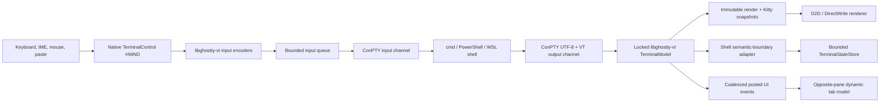

# Embedded Terminal, ConPTY, libghostty-vt, And Pane Tabs Implementation Plan

> **Executor instructions:** This is an implementation plan, not permission to skip verification. Follow the phases in order, keep this file in `Specs/Plans/WIP/`, and update its checkboxes and evidence links as work lands. Run every verification gate before continuing. If a STOP condition occurs, stop and report it instead of substituting another terminal engine, silently dropping a required feature, or expanding scope.
>
> **Drift check (run first):**
>
> ```powershell
> git diff --stat ff3f62572adceeb1253c9e9eb5fadbdad49cd88f..HEAD -- `
>   RedSalamander.sln Directory.Build.props Directory.Build.targets LICENSE.txt `
>   Common/Terminal Common/DxUi/DxUi.h Common/DxUi/DxUi.Controls.cpp Common/WindowMessages.h `
>   Common/SettingsStore.h Common/Common/SettingsStore.cpp `
>   RedSalamander/RedSalamander.vcxproj RedSalamander/RedSalamander.vcxproj.filters `
>   RedSalamander/FolderWindow.h RedSalamander/FolderWindow.cpp RedSalamander/FolderWindow.Layout.cpp `
>   RedSalamander/FolderWindow.FileSystem.Navigation.Part.cpp RedSalamander/CommandRegistry.cpp `
>   RedSalamander/ShortcutDefaults.cpp RedSalamander/WSLDistro.h RedSalamander/WSLDistro.cpp `
>   RedSalamander/AppTheme.h RedSalamander/AppTheme.cpp RedSalamander/RedSalamander.rc `
>   RedSalamander/resource.h RedSalamander/Preferences.Dialog.cpp RedSalamander/Terminal `
>   RedSalamander/SelfTest/Commands Tests/TerminalTests Tools/Run-AllTests.ps1 `
>   Tools/Build-LibGhosttyVt.ps1 Tools/Verify-LibGhosttyVt.ps1 External/ghostty-vt.lock.json `
>   Installer Specs/SettingsStore.schema.json Specs/Core/Core_SettingsStore.md `
>   Specs/UI/UI_CommandMenuKeyboard.md Specs/UI/UI_DxUiWinUIDesign.md Specs/Themes `
>   Specs/Terminal Specs/Testing Specs/TestRuns
> ```
>
> If live code no longer matches the “Current repository state” section, reconcile the difference before editing. A material mismatch in pane-tab ownership, Settings Store versioning, ConPTY minimum-OS behavior, or `libghostty-vt` ABI is a STOP condition.

## Status

- **State:** WIP — planning complete; no implementation is claimed by this document.
- **Priority:** P1
- **Effort:** XL, expected as reviewable vertical slices
- **Risk:** HIGH — process hosting, untrusted VT data, rendering, persistence, threading, and pane-layout changes
- **Depends on:** none
- **Category:** feature / architecture / rendering / performance / security / tests / docs
- **Planned at:** RedSalamander commit `ff3f62572adceeb1253c9e9eb5fadbdad49cd88f`, 2026-07-13
- **Upstream research point:** Ghostty commit `55a3e33ab26a23d75b274b23c7f76d837db00578`, 2026-07-13. This is the candidate pin for Phase 0, not permission to follow Ghostty `main` implicitly.

## Goal

Add a first-party, native embedded terminal to RedSalamander. `Alt+7` snapshots the focused pane's current launchable folder and opens a new terminal tab in the opposite pane's content area, using the same placement concept as Preview. Repeating `Alt+7` creates additional independent terminal tabs. By default, each terminal follows later navigation in its original source pane at shell-safe prompt boundaries. The selected shell profile is remembered by folder, and accepted commands are kept in a bounded, age-limited, privacy-aware per-folder history.

The terminal stack is:

1. Windows ConPTY for native child-process transport.
2. A pinned `libghostty-vt` C API for VT parsing, terminal state, input encoders, selection, scrollback, and exposed Kitty graphics state.
3. A new RedSalamander Direct2D/DirectWrite renderer and native HWND control.
4. A RedSalamander pane-tab, shell-profile, history, settings, accessibility, security, and lifecycle layer.

This plan intentionally does **not** embed a web terminal, reparent a console window, use an external Windows Terminal window as the pane, or treat Windows Terminal's internal `HwndTerminal` code as a supported SDK.

## User-facing contract

### `Alt+7` and pane behavior

- Register a new command ID, `cmd/pane/openEmbeddedTerminal`, with default shortcut `Alt+7`.
- Keep the existing `cmd/pane/openCommandShell` and its `Ctrl+Alt+T` external Windows Terminal behavior unchanged.
- The focused pane is the **source pane**. Its current folder is resolved and snapshotted when the command is invoked.
- The opposite pane is the **host pane**. A new closable Terminal tab is added there and selected.
- Repeating `Alt+7` creates a new independent terminal session. It never reuses a running session merely because path/profile match.
- Each terminal retains its original source-pane association. The global `followOriginalPane` terminal setting defaults to `true`, and each tab exposes a session override. When enabled, later successful navigation in that original pane is coalesced and applied to the terminal at the next shell-safe prompt; when disabled, the terminal keeps its current shell directory.
- Pane following is one-way: source-pane navigation may change the shell directory, but a shell `cd` never navigates the file-manager pane.
- Following never injects a directory change while a command is running, user input is pending, password input is active, or an alternate-screen/TUI application owns the terminal. The newest source location remains pending and is applied only after a validated prompt boundary.
- Folder, Preview, and multiple Terminal tabs can coexist. `Alt+6` remains a Preview toggle and must not close or overwrite terminal tabs.
- Tab headers identify auxiliary content visually as well as by text: Preview shows a Preview icon before its label, and every Terminal tab shows a console/command-prompt icon before its current title. The Folder tab remains text-only in the first release.
- Tab icons are decorative companions, never replacements for localized titles. They scale with DPI, follow LTR/RTL leading-edge layout, use the active theme/high-contrast foreground, and remain stable when a terminal title changes.
- The Folder tab is permanent and non-closable. Preview remains a singleton closable tab. Terminal tabs are independently closable.
- When the selected auxiliary tab closes, select the most recently used remaining tab; if none remains, select Folder and restore normal pane chrome.
- A terminal that exits remains visible with a localized exit-status strip and `Restart`/`Close` actions. Restart uses the same profile and, when pane following is enabled, the original pane's latest validated location; otherwise it uses the terminal's last validated shell-reported directory. Restart does not create another history record.
- If the current pane location has no safe local/WSL launch mapping, do not silently fall back to a filesystem root. Open a localized diagnostic tab or nonblocking notice explaining that the provider has no terminal location.

### Shell choice

- Supported profile families:
  - Command Prompt (`cmd.exe`).
  - Windows PowerShell 5.1 (`powershell.exe`).
  - Every safely discovered PowerShell 7+ installation (`pwsh.exe`), shown with its file/product version and canonical path.
  - Every installed WSL distribution returned by the existing `WSLDistro::EnumerateDistributions()` path.
- Profile IDs are stable and case-insensitive where Windows identity is case-insensitive:
  - `cmd`
  - `windows-powershell`
  - `pwsh:<canonical-executable-identity>`
  - `wsl:<normalized-distribution-name>`
- On first use for a folder, `defaultProfileId="auto"` opens a shell chooser in the destination pane. A configured explicit default can launch immediately.
- An explicit selection is remembered for that folder. Later `Alt+7` uses it without prompting while the profile remains available.
- If a remembered profile disappears, show the chooser with the missing profile noted; never execute an unrelated fallback silently.
- Provide `Open terminal with...` in the command menu and terminal context menu. Selecting it always shows the chooser and updates the folder preference only after a session starts successfully.
- Folder preference is folder-scoped, not left/right-pane-scoped: the same canonical folder selects the same shell regardless of which pane currently shows it.

### Command history

- Store accepted commands by canonical working folder and shell profile, not just by terminal tab.
- Track the shell-reported working directory at command acceptance. If it cannot be validated, use the validated launch folder; if neither is available, do not persist the command.
- Default bounds:
  - `100` commands per canonical folder across its profile histories.
  - `10,000` commands across the complete state file.
  - `256` folder identities total, evicted least-recently-used.
  - `90` days command retention; a configured `0` means no age expiry.
  - `64 KiB` maximum UTF-8 bytes per command; larger entries are not persisted.
  - `16 MiB` maximum serialized terminal-state file.
- Consecutive exact duplicates are collapsed. Distinct repeated commands remain distinct.
- Ignore blank commands, integration bootstrap commands, control-only input, commands beginning with a space when `historyIgnoreLeadingSpace=true`, and input while alternate-screen/full-screen applications own the terminal.
- Never infer command text from raw keypresses. Use validated semantic prompt/input boundaries; unsupported or ambiguous shells display `App history unavailable` and rely on their native history.
- The app does not import `.bash_history`, PSReadLine history, or DOSKEY history.
- History UI filters the current folder/profile and inserts the chosen command into the prompt without sending Enter. Do not hijack shell-native `Up`, `Down`, or `Ctrl+R`.
- Provide `Clear history for this folder` and `Clear all terminal history` with localized confirmation.
- Never write command text to debug logs, performance JSONL, selftest traces, crash annotations, tab titles, or analytics.

## Architecture decision



### Why this architecture

- ConPTY is the supported Windows mechanism for hosting console applications and already produces UTF-8/VT streams suitable for a terminal emulator.
- `libghostty-vt` is native C-compatible code, supports Windows/x64/ARM64, and owns the difficult parser/state machine. Its renderer and GUI are deliberately consumer-owned.
- Direct2D/DirectWrite matches the existing RedSalamander rendering stack and supports native DPI, device-loss handling, font fallback, color glyphs, and accessibility integration.
- A narrow dynamically loaded C wrapper isolates the currently unstable `libghostty-vt` signatures from the rest of the application and lets RedSalamander start with a localized terminal-unavailable state if the DLL is absent or incompatible.

### Explicitly rejected alternatives

| Alternative | Decision | Reason |
|---|---|---|
| Windows Terminal `HwndTerminal` | Out of scope | It is source-internal, not a stable packaged Windows SDK/control contract. Consuming it would couple RedSalamander to a large moving source tree and WinUI/Terminal internals. |
| Recompile/embed the full Windows Terminal app | Out of scope | Much larger dependency and UI stack than required; does not solve RedSalamander pane/tab/history integration cleanly. |
| WebView2 + xterm.js | Rejected | Not a native C++ renderer and adds a browser process/runtime to a core pane. |
| Reparent `conhost.exe`/Windows Terminal HWND | Rejected | Unsupported ownership, input, DPI, focus, teardown, and accessibility behavior. |
| Write a new VT parser | Rejected | Duplicates a large, security-sensitive, conformance-heavy subsystem. |
| Reuse `RedSalamanderMonitor/ColorTextView` as the terminal | Rejected | It is a line-document monitor/editor surface, not a mutable fixed-cell terminal grid. Its D2D/DWrite/device-loss patterns are exemplars only. |

## Upstream facts and pinned-source rules

Primary references to preserve in the eventual authoritative terminal spec:

- [Ghostty repository and libghostty status](https://github.com/ghostty-org/ghostty): `libghostty-vt` is usable from C/Zig on Windows, but the API has not been version-tagged and signatures remain in flux.
- [Ghostling example](https://github.com/ghostty-org/ghostling): demonstrates consumer-owned rendering and documents resize/reflow, colors, Unicode graphemes, Kitty keyboard/graphics, mouse modes, scrollback, and focus reporting.
- [Ghostty C API documentation](https://libghostty.tip.ghostty.org/): source of the exact pinned header contract.
- [Microsoft ConPTY session guidance](https://learn.microsoft.com/en-us/windows/console/creating-a-pseudoconsole-session): input and output channels need independent service threads to avoid deadlocks.
- [Microsoft `ClosePseudoConsole`](https://learn.microsoft.com/en-us/windows/console/closepseudoconsole): before Windows 11 build 26100, close can wait indefinitely unless output is closed or continuously drained. RedSalamander supports Windows 11 build 22000, so older behavior is part of the required design.
- [Kitty graphics protocol](https://sw.kovidgoyal.net/kitty/graphics-protocol/): source for image formats, placement, layering, transmission media, animations, and quota/security requirements.
- [PowerShell side-by-side behavior](https://learn.microsoft.com/en-us/powershell/scripting/whats-new/differences-from-windows-powershell): `powershell.exe` and `pwsh.exe` are distinct profiles/installations.
- [WSL basic commands](https://learn.microsoft.com/en-us/windows/wsl/basic-commands): distribution selection and WSL launch behavior.

Dependency rules:

- Pin Ghostty by full commit SHA and source-archive SHA-256 in `External/ghostty-vt.lock.json`.
- Candidate Ghostty SHA for Phase 0: `55a3e33ab26a23d75b274b23c7f76d837db00578`.
- That candidate reports Ghostty `1.3.2-dev` and requires Zig `0.15.2`; verify both from the pinned source during bootstrap.
- Do not build against floating `main`, a Git submodule branch, an unverified release download, or a developer-global Zig installation.
- Normal incremental MSBuild must not access the network. A separate bootstrap prepares verified source/tool artifacts under `.build`; the project build consumes those artifacts or reports an actionable missing-prerequisite error.
- Prefer the Ghostty shared DLL on Windows. Do not link Ghostty's static archive into the app until its Windows SIMD/system-library closure is independently proven for x64 and ARM64.
- Load `ghostty-vt.dll` through an owned runtime object using `wil::unique_hmodule`; resolve only wrapper-required exports, validate build information/capabilities, and retain the module until all terminal handles and callbacks are destroyed.
- Copy the matching Ghostty license text into `LICENSE.txt` third-party notices and package it with every distribution format.

## libghostty-vt capability ledger: colors through Kitty

“All Ghostty options” in this plan means every capability exposed by the **pinned `libghostty-vt` C API** is audited and has one of four dispositions: implemented, intentionally policy-gated, blocked by an upstream C-API gap, or not applicable because it is full-app GUI behavior. It does not mean copying macOS/GTK window options into RedSalamander.

| Capability at the research SHA | RedSalamander disposition | Required verification |
|---|---|---|
| VT parsing and terminal state | Implement in the core vertical slice | Recorded VT fixtures and upstream example parity |
| Resize, primary/alternate screens, reflow, viewport, scrollbar | Implement | Reflow/alternate-screen/scrollbar model tests |
| Bounded scrollback and caller-driven incremental compression | Implement; schedule compression only while idle | Long-scrollback memory/perf test |
| Default foreground/background/cursor and 256-color palette | Implement | Theme/default/OSC override tests |
| ANSI 16, 256-color, and 24-bit truecolor cells | Implement | Cell-model golden cases and visual smoke |
| OSC 4/10/11/12 runtime color overrides and reset | Implement; runtime overrides win without mutating AppTheme | Palette/reset tests |
| Bold, italic, faint, blink, inverse, invisible, strikethrough, overline | Implement | Style matrix fixture |
| Single/double/curly/dotted/dashed underline plus underline color | Implement in D2D, including DPI scaling | Decoration fixture and WARP render test |
| Unicode grapheme clusters, combining marks, wide cells | Implement | Emoji, CJK, combining, RTL/complex-script cases |
| Shaping, font fallback, color emoji, terminal ligatures | RedSalamander responsibility using DirectWrite; not supplied by libghostty-vt | Glyph-run/cell-clipping tests |
| Cursor bar/block/underline/hollow and blink/visibility/password state | Implement | Cursor mode/timer tests |
| Dirty/full/partial render state and row iterators | Implement and use to avoid full repaint work | Dirty-row metrics and tests |
| Keyboard encoding, legacy modes, modifyOtherKeys, Kitty keyboard | Implement from native key events | Key matrix fixture |
| IME/text composition | RedSalamander responsibility; write committed UTF-8 text only | TSF/IME manual and automated seam tests |
| Mouse X10/normal/button/any-event and X10/UTF-8/SGR/URxvt/SGR-pixel formats | Implement | Encoder mode matrix |
| Focus reporting | Implement | Focus transition fixture |
| Bracketed/safe paste | Implement with unsafe multiline confirmation | Paste safety tests |
| Selection gesture APIs and selection formatting | Implement | Cell/word/line/output/rectangle/autoscroll tests |
| Semantic prompt/input/output cell state and reported `pwd` | Implement; foundation for reliable command history | Shell-adapter tests |
| Title and `pwd` effects, bell, device attributes, size, color-scheme queries | Implement with nonblocking callbacks | Effect/response fixtures |
| OSC 8 hyperlinks | Implement hover detection and Ctrl+click allowlisted launch | URI and security tests |
| Synchronized output | Honor terminal state and coalesce presentation | No-intermediate-frame fixture |
| OSC 52 / iTerm2 clipboard writes | Policy-gated; default deny, optional async ask/allow. Clipboard reads are ignored by the pinned API. | Oversize/MIME/policy tests |
| Kitty direct/chunked RGB/RGBA/gray/gray-alpha/PNG and zlib | Implement through exposed decoded image storage | Image format/chunk/compression fixtures |
| Kitty placements, cropping, scaling, offsets, virtual placeholders, deletion, image generations | Implement | Placement/generation/cache invalidation fixtures |
| Kitty z layers below background, below text, above text | Implement exact draw ordering | Layer compositor WARP test |
| Kitty file/temp-file/shared-memory transmission | Keep disabled by default. Do not enable until canonicalization, same-user, file-type, deletion, TOCTOU, and quota tests pass. | Security review and explicit opt-in gate |
| Kitty animations/frame composition | **Upstream C-API gap at research SHA:** parser may understand protocol, but frame enumeration/timing is not exposed in `kitty_graphics.h`. Do not write a second APC parser. Track as blocked and add only when the pinned C API exposes immutable frame data. | Capability test must report gated, never fake support |
| Glyph protocol / Kitty text sizing | The terminal exposes an enable switch, but the C renderer API does not expose enough glossary/glyph data at the research SHA. Keep disabled and track upstream. | Capability test reports gated |
| Desktop notification OSC | Standalone OSC parsing exists, but no matching terminal effect callback is exposed at the research SHA. Ignore safely and track upstream. | No side effect fixture |
| Sixel and iTerm inline-image rendering | Not exposed as renderable image state by the pinned C API; out of initial scope | Documented unsupported capability |
| Tabs, panes, session profiles, settings, command history | Implemented by RedSalamander; explicitly not supplied by libghostty-vt | App-level selftests |
| Scrollback search internals/UI | Deferred; no search UX was requested and it is independent of the renderer/session contract | Documented future follow-up |

The authoritative terminal spec must keep this ledger and record the exact pin. On every Ghostty upgrade, diff all public headers under `include/ghostty/vt/`, update the wrapper/capability tests, rerun the complete fixture/perf matrix, and update the ledger before changing the lock file.

## Current repository state

- `RedSalamander/CommandRegistry.cpp:124` registers `cmd/pane/openCommandShell`.
- `RedSalamander/ShortcutDefaults.cpp:233-258` assigns `Alt+2` through `Alt+6`; `Alt+7` is currently free. `Ctrl+Alt+T` opens the external shell.
- `RedSalamander/FolderWindow.FileSystem.Navigation.Part.cpp:1414` implements `CommandOpenCommandShell`. It resolves local folder/plugin instance context, launches Windows Terminal if found, and falls back to `cmd`. This remains the external-shell command.
- `Specs/UI/UI_CommandMenuKeyboard.md:109` and `:558` document the existing external command and shortcut.
- `RedSalamander/FolderWindow.Layout.cpp:975` implements `TogglePreviewPane` and deliberately hosts Preview in the opposite pane.
- `RedSalamander/FolderWindow.Layout.cpp:361-419` hides normal pane chrome when Preview is selected.
- `RedSalamander/FolderWindow.cpp:1791-1845` creates a fixed Folder/Preview `DxUi::TabControl` and one Preview content host.
- `RedSalamander/FolderWindow.h:1512-1551` stores Preview HWNDs and booleans in `PaneState`; this fixed model cannot represent multiple terminal tabs safely.
- `Common/DxUi/DxUi.h:1928-1970` already provides dynamic `TabControl::AddTab`, `RemoveTab`, `SetTabTitle`, selection, tooltip, and close callbacks. Do not replace it.
- `Common/DxUi/DxUi.h:1931-1939` currently stores only title, tooltip, title-measurement cache, and closability in `TabItem`; there is no optional tab icon contract.
- `Common/DxUi/DxUi.Controls.cpp:5148-5158` measures text plus close-button width, while `:5575-5627` paints only title and close glyph. Icon support must extend this cached layout instead of bypassing it.
- `Common/DxUi/DxUi.WindowHost.cpp:2066-2076` exposes Fluent icon-font availability and `Common/DxUi/DxUi.h` already uses `FontRole::Icon`; use that shared font/fallback path rather than adding HICON, shell-icon, or bitmap ownership to tabs.
- `RedSalamander/WSLDistro.cpp:17` enumerates WSL distributions, and `BuildNetworkPath` produces `\\wsl.localhost\\<distro>` paths. Reuse this discovery logic.
- `Common/SettingsStore.h:767-791`, `Common/Common/SettingsStore.cpp:5258-5328`, and `:5491` define Settings Store schema v16. The loader rejects other versions and the writer hardcodes 16.
- `Common/Common/SettingsStore.cpp:4952-5015` and `Specs/Core/Core_SettingsStore.md:38-55` establish `%LocalAppData%\RedSalamander\Settings`, `<AppId>-debug.settings.json`, and versioned Release `<AppId>-<Major>.<Minor>.settings.json` naming. Terminal state mirrors that Debug/Release identity instead of inventing a root-level file.
- The existing Debug Settings Store may fall back to Release settings when its Debug file is absent. Terminal history is sensitive high-churn state, so this plan deliberately forbids that cross-flavor fallback while retaining same-flavor Release-to-newer-Release migration.
- `Specs/SettingsStore.schema.json` and `Specs/Core/Core_SettingsStore.md` are authoritative for Settings Store shape.
- `RedSalamanderMonitor/ColorTextView.cpp:1269`, `:1479`, `:2249`, `:2543`, and `:2813` show RedSalamander's D2D/DWrite resource, paint, and `Present1` patterns. They are references, not reusable terminal data structures.
- `Common/WindowMessages.h` plus `PostMessagePayload(...)`, `TakeMessagePayload<T>(...)`, `InitPostedPayloadWindow(...)`, and `DrainPostedPayloadsForWindow(...)` define the required cross-thread payload pattern.
- Command selftests live under `RedSalamander/SelfTest/Commands/`; `Tests/DxUiTests` covers native control/UIA patterns.
- Canonical validation commands are `build.ps1` and `Tools/Run-AllTests.ps1`.

## Core invariants

- No terminal output parsing, ConPTY pipe read/write, shell discovery, state-file write, image conversion, or ConPTY close may block the UI thread.
- Exactly one mutation lock protects each `GhosttyTerminal`. Every API use that returns borrowed data stays inside that lock or copies to immutable owned memory before unlocking.
- Ghostty callbacks run synchronously inside `ghostty_terminal_vt_write`; callbacks only copy bounded data/enqueue lightweight effects. They never display UI, touch the clipboard, create D2D resources, save files, or re-enter Ghostty.
- One dedicated reader and one dedicated writer service the ConPTY output/input channels. They are owned `std::jthread`s, never detached threads.
- `ClosePseudoConsole` runs off the UI and off the output-reader thread. On pre-26100 Windows, output remains drained or is explicitly closed before close, as Microsoft requires.
- Every terminal HWND calls `InitPostedPayloadWindow` during creation and `DrainPostedPayloadsForWindow` during `WM_NCDESTROY`.
- Workers stop producing events, detach callbacks, close/cancel channels, and reach a quiet point before the Ghostty DLL/runtime is unloaded.
- All Win32/COM/D2D/DWrite/process/pipe resources use WIL RAII, including custom RAII for `HPCON` and `PROC_THREAD_ATTRIBUTE_LIST`.
- No owning raw COM pointers, raw owning HWNDs, raw owning HANDLEs, `catch (...)`, or detached threads.
- All user-facing text is in `.rc` resources with positional placeholders.
- Performance metrics aggregate per read batch/frame/session; do not emit per cell, key, byte, or image pixel.

## Planned component and file map

### Third-party bootstrap and build

- `External/ghostty-vt.lock.json` (new) — source SHA, archive URL/SHA-256, Zig version/download SHA-256 per host architecture, expected DLL exports, license source.
- `Tools/Build-LibGhosttyVt.ps1` (new) — verified, explicit bootstrap/build for x64 and ARM64; no global-tool fallback.
- `Tools/Verify-LibGhosttyVt.ps1` (new) — architecture, export, header, build-info, license, and reproducibility checks.
- `Common/Terminal/Terminal.vcxproj` and `.filters` (new) — static C++ wrapper/control project; consumes staged headers and dynamically loads the staged DLL.
- `RedSalamander.sln` and `RedSalamander/RedSalamander.vcxproj` — add the project reference and copy the architecture/configuration-matched Ghostty DLL plus `TerminalState.schema.json` beside the executable.
- `LICENSE.txt` — add Ghostty MIT notice.

### Native terminal core (`Common/Terminal`, new)

- `GhosttyVtApi.h/.cpp` — narrow function table, dynamic load, capability/build validation, sized-struct helpers, error conversion, owned runtime lifetime.
- `ConPtySession.h/.cpp` — pipe/process/attribute/HPCON RAII, reader/writer workers, resize, exit tracking, and teardown state machine.
- `TerminalModel.h/.cpp` — locked terminal/render state, effects, scrollback compression scheduling, render generation, selection, hyperlinks, title, `pwd`, and input encoders.
- `TerminalRenderSnapshot.h/.cpp` — immutable rows/cells/styles/cursor/colors/selection plus bounded Kitty image/placement snapshots.
- `TerminalRenderer.h/.cpp` — D2D/DWrite resources, glyph shaping/fallback, decorations, cursor, selection, Kitty layer compositor, dirty painting, DPI, and device loss.
- `TerminalControl.h/.cpp` — child HWND, focus, keyboard, IME, mouse, scrolling, copy/paste, timers, context commands, accessibility hookup, and coalesced UI messages.
- `TerminalAccessibility.h/.cpp` — UI Automation provider for document text, selection, scroll, focus, and terminal status.
- `TerminalPerf.h/.cpp` — aggregated metric records and deterministic scenario hooks.

### RedSalamander integration (`RedSalamander/Terminal`, new)

- `TerminalPaneController.h/.cpp` — dynamic Folder/Preview/Terminal tab model, opposite-pane command, selection/close/restart/title behavior.
- `TerminalProfileCatalog.h/.cpp` — cmd, Windows PowerShell, side-by-side pwsh, and WSL discovery with stable IDs.
- `TerminalWorkingDirectory.h/.cpp` — provider-to-launch-path resolution, Windows/UNC/WSL translation, and canonical folder identity.
- `TerminalPaneFollow.h/.cpp` — source-pane association, navigation generations, safe-prompt application, pending/failure state, and per-session override.
- `TerminalShellIntegration.h/.cpp` — semantic prompt integration, upstream Ghostty shell scripts, PowerShell/cmd adapters, command-boundary capture.
- `TerminalStateStore.h/.cpp` — build-flavor/version-aware paths, independently versioned and schema-validated shell preference/history model, deterministic pruning, atomic persistence, merge/locking, corruption recovery, and privacy rules.
- `TerminalHistoryUi.h/.cpp` — searchable insert-only history popup and clear actions.
- `TerminalSettingsUi.h/.cpp` — Preferences page model/validation for terminal settings.

### Existing integration points

- `Common/DxUi/DxUi.h` and `Common/DxUi/DxUi.Controls.cpp` — add an optional glyph/fallback icon to `TabControl::TabItem`, cached width/layout, painting, and debug geometry without changing existing title-only callers.
- `RedSalamander/FolderWindow.h`, `FolderWindow.cpp`, and `FolderWindow.Layout.cpp` — replace fixed Preview booleans/index assumptions with stable dynamic content tabs and assign Preview/Terminal icons from `PaneContentKind`.
- `RedSalamander/FolderWindow.FileSystem.Navigation.Part.cpp` — add `CommandOpenEmbeddedTerminal`; leave `CommandOpenCommandShell` intact.
- `RedSalamander/CommandRegistry.cpp` and `ShortcutDefaults.cpp` — command registration and `Alt+7`.
- `RedSalamander/RedSalamander.rc` and `resource.h` — localized labels, statuses, context menu, picker, history, warnings, and Preferences strings.
- `Common/WindowMessages.h` — one coalesced terminal UI event message and owned payload type routing.
- `Common/SettingsStore.h`, `Common/Common/SettingsStore.cpp`, `Specs/SettingsStore.schema.json`, and `Specs/Core/Core_SettingsStore.md` — optional terminal configuration while retaining schema v16.
- `RedSalamander/AppTheme.h`, `AppTheme.cpp`, theme override loader, and every shipped `Specs/Themes/*.theme.json5` — terminal semantic colors and ANSI palette.
- `RedSalamander/Preferences.Dialog.cpp` — host the new terminal settings page using existing Preferences patterns.
- `Tools/Run-AllTests.ps1` — include new native `TerminalTests` in `Suite Full` and CI.
- Installer projects/scripts — verify the app-local DLL and license are present in ZIP/MSI/MSIX outputs; existing wildcard staging may be reused only after tests prove coverage.

### Tests and durable documentation

- `Tests/TerminalTests/` (new) — native core/renderer/ConPTY seam tests with fake transports and WARP where graphics are required.
- `Tests/DxUiTests/DxUiTests.Controls.cpp` — generic optional-tab-icon API, layout-cache, RTL, overflow, fallback, high-contrast, DPI, and hit-target regression tests.
- `RedSalamander/SelfTest/Commands/Commands.SelfTest.Terminal.cpp` (new) — pane/tab/settings/profile/history/lifetime selftests.
- `Tests/TerminalTests/Fixtures/` (new) — small checked-in VT, key/mouse, Unicode, synchronized-output, and Kitty fixtures; large/generated payloads remain generated.
- `Specs/Terminal/Terminal_EmbeddedPane.md` (new) — authoritative behavior, architecture, security, capability ledger, and maintenance contract.
- `Specs/Terminal/TerminalState.schema.json` (new) — canonical JSON Schema Draft 2020-12 contract for the separately versioned terminal state file.
- `Specs/UI/UI_CommandMenuKeyboard.md`, `Specs/UI/UI_DxUiWinUIDesign.md`, `Specs/UI/UI_FolderWindow.md`, `Specs/Core/Core_SettingsStore.md`, `Specs/Testing/Testing_PerformanceValidation.md`, and `Specs/Testing/Testing_TestCoverage.md` — authoritative cross-domain updates.
- `Specs/Testing/TerminalPerfBudgets.json5` (new) — machine/build-aware budgets after baseline measurement.
- `Specs/TestRuns/<MachineHash>/Terminal/<RunId>/` — archived baseline/candidate evidence.

## Data and behavior contracts

### Dynamic pane content model

Replace Preview's fixed two-index/boolean assumptions with a stable-ID model. The intended shape is:

```cpp
enum class PaneContentKind : uint8_t
{
    Folder,
    Preview,
    Terminal,
};

using PaneContentTabId = uint64_t;

struct PaneContentTab
{
    PaneContentTabId id{};
    PaneContentKind kind{PaneContentKind::Folder};
    std::wstring title;
    bool closable{false};
    std::unique_ptr<TerminalPaneController> terminal; // set only for Terminal
};
```

Implementation rules:

- Use stable IDs for callbacks and async events. Never use a `std::vector` index as a session identity.
- Each pane starts with one Folder model entry. Folder is always first in the visual tab strip.
- Store Preview's existing viewer state separately and bind it to a singleton Preview model entry when visible.
- A terminal entry owns its `TerminalPaneController`; that controller owns its native child HWND via `wil::unique_hwnd` and its session via `std::unique_ptr`/`std::shared_ptr` with an explicit quiet-point contract.
- Rename/generalize the existing Preview content host to an auxiliary content host. It hosts one visible Preview child or one visible terminal child at a time; inactive terminal HWNDs remain hidden but their ConPTY sessions continue running.
- Background tabs continue draining/parsing output, but presentation is coalesced and capped. Only the selected terminal creates frame-rate paint work and cursor/blink timers.
- The tab strip is visible whenever any auxiliary tab exists. Selecting Folder restores navigation/filter/folder/status controls exactly as before.
- Close callbacks look up the stable ID, mark the session closing, remove/hide the tab promptly, and complete teardown asynchronously. Late events for a retired ID are discarded.
- `TogglePreviewPane`, `SetPreviewPaneTab`, and `ClosePreviewPane` remain public behavior-compatible, but internally use the dynamic model.

### Pane tab icon contract

Extend `DxUi::TabControl` generically so any caller may opt into a decorative leading icon while every existing title-only call remains source- and behavior-compatible. The intended public shape is equivalent to:

```cpp
struct TabIconSpec final
{
    std::wstring glyph;        // Segoe Fluent Icons private-use glyph
    std::wstring fallbackText; // drawn with a normal UI font when Fluent Icons is unavailable
};

void SetTabIcon(size_t index, std::optional<TabIconSpec> icon);
[[nodiscard]] bool HasTabIcon(size_t index) const noexcept;
```

Behavior and layout rules:

- `TabItem` owns the optional `TabIconSpec`; tab removal/reordering moves it with the tab, and `SetTabTitle` changes only the title. `SetTabIcon` or clearing the icon invalidates header width/rect caches, resynchronizes layout, and repaints.
- Use a `16 DIP` square icon slot and `6 DIP` icon-to-title gap. Add that width only for tabs with an icon. Place the icon on the logical leading edge, the close button on the logical trailing edge, and the title between them without overlap in LTR and RTL.
- The icon is part of the tab's existing hit target, not a separate button. Clicking/dragging over it selects/reorders the tab exactly like clicking/dragging over the title. It must not interfere with the selected/hover-only close button or overflow navigation.
- Paint the icon with the resolved tab foreground and `FontRole::Icon` using left-to-right glyph flow regardless of UI direction. When `WindowHost::HasFluentIconFont()` is false, draw `fallbackText` centered in the same slot with a normal small/body font; do not display a private-use tofu box.
- Use named application constants, not glyph literals at call sites: Preview uses the product-selected Segoe Fluent Icons glyph `U+E8A5` with a neutral preview fallback, and Terminal uses `U+E756` (`CommandPrompt`) with `>_` fallback. The [Segoe Fluent Icons font reference](https://learn.microsoft.com/en-us/windows/apps/design/iconography/segoe-fluent-icons-font) documents the system font and Terminal mapping; the Preview choice is RedSalamander's explicit UI contract. Validate both glyphs on the minimum supported Windows 11 build during the manual matrix.
- Folder stays text-only for this feature. Preview always has the Preview icon. All Terminal tabs have the console icon, including starting, running, exited, failed, and detached sessions; status/title changes never replace it.
- Icons use existing theme foregrounds and high-contrast resolution. Do not add icon-specific theme keys, bitmap assets, `HICON` ownership, shell-icon extraction, IconCache traffic, or per-tab device-dependent resources.
- Icons are decorative for accessibility. UI Automation name/help text remains the localized title/tooltip only, preventing announcements such as `Terminal, Terminal`; selection, position-in-set, close action, and keyboard behavior are unchanged.
- Add test-only `DebugGetTabIconRect(size_t)` and `DebugHasTabIcon(size_t)` accessors. Geometry must be empty/false for title-only tabs and nonempty/true for icon tabs.

### Terminal settings in Settings Store v16

Add an optional top-level `terminal` object. **Do not bump `schemaVersion`** for this optional backward-compatible domain: the current strict equality gate would otherwise back up valid v16 user settings and restore defaults. The writer omits values equal to defaults, and v16 files without `terminal` receive defaults.

Target logical model and validation. Fields marked “advanced” remain JSON-editable and schema-documented even if the first Preferences page does not expose them:

```cpp
struct TerminalSettings
{
    bool enabled = true;
    std::wstring defaultProfileId = L"auto";
    bool shellIntegrationEnabled = true;
    bool followOriginalPane = true;
    uint32_t followPaneDebounceMs = 150;          // advanced, clamp 0..2000
    uint32_t maxTabsPerPane = 8;                  // clamp 1..32
    bool confirmCloseRunningProcess = true;
    std::wstring closeOnExit = L"never";          // never | clean | always
    uint32_t scrollbackMaxLines = 10000;          // clamp 0..1'000'000

    bool rememberShellByFolder = true;
    bool rememberCommandHistory = true;
    bool historyIgnoreLeadingSpace = true;
    bool historyDeduplicateConsecutive = true;
    uint32_t historyMaxCommandsPerFolder = 100;   // clamp 0..5000
    uint32_t historyMaxTotalCommands = 10000;     // clamp 0..100'000
    uint32_t historyMaxFolders = 256;              // clamp 1..2048
    uint32_t historyMaxAgeDays = 90;               // clamp 0..3650; 0 = no age expiry
    uint32_t historyMaxCommandBytes = 64 * 1024;   // advanced, clamp 256..1 MiB
    uint32_t historyMaxStateFileMiB = 16;          // advanced, clamp 1..64

    std::wstring fontFamily = L"Cascadia Mono";
    double fontSizePoints = 11.0;                  // clamp 6.0..72.0
    uint32_t fontWeight = 400;                     // clamp 100..900
    bool ligatures = true;
    double cellWidthScale = 1.0;                   // clamp 0.5..2.0
    double lineHeightScale = 1.0;                  // clamp 0.5..2.0
    std::wstring cursorStyle = L"block";           // block | bar | underline
    bool cursorBlink = true;
    uint32_t cursorBlinkIntervalMs = 500;          // clamp 100..2000
    double backgroundOpacity = 1.0;                // clamp 0.25..1.0
    bool boldIsBright = false;

    bool copyOnSelect = false;
    bool trimTrailingWhitespaceOnCopy = true;
    bool scrollToBottomOnInput = true;
    bool showScrollbar = true;
    bool warnOnUnsafePaste = true;
    uint32_t pasteWarningLineThreshold = 2;       // clamp 1..1000
    uint32_t pasteMaxBytes = 4 * 1024 * 1024;     // advanced, clamp 4 KiB..16 MiB
    std::wstring bellStyle = L"visual";            // none | visual | system

    bool kittyGraphicsEnabled = true;
    uint32_t kittyImageStorageMiB = 128;            // clamp 0..512
    uint32_t kittyApcMaxMiB = 32;                  // clamp 1..64
    uint64_t kittyMaxSingleImagePixels = 64'000'000; // advanced, clamp 1M..64M
    std::wstring osc52Policy = L"deny";            // deny | ask | allow
    std::wstring hyperlinkPolicy = L"ctrl-click";  // disabled | ctrl-click
    bool allowApplicationTitle = true;
    std::wstring notificationPolicy = L"deny";     // deny | ask | allow
};
```

Setting semantics:

| Group | Settings | Contract |
|---|---|---|
| Session | `enabled`, `defaultProfileId`, `maxTabsPerPane`, `confirmCloseRunningProcess`, `closeOnExit` | Controls terminal availability, first-use shell, resource count, close confirmation, and whether exited tabs remain visible. `never` preserves the restartable exit strip. |
| Pane synchronization | `shellIntegrationEnabled`, `followOriginalPane`, `followPaneDebounceMs` | Following defaults on, coalesces rapid navigation, and requires a validated integration prompt. Disabling shell integration also disables safe following/history capture for that session. |
| Scrollback | `scrollbackMaxLines` | Hard terminal-state bound; `0` disables retained scrollback but not the visible screen. |
| History | `rememberShellByFolder`, `rememberCommandHistory`, `historyIgnoreLeadingSpace`, `historyDeduplicateConsecutive`, `historyMaxCommandsPerFolder`, `historyMaxTotalCommands`, `historyMaxFolders`, `historyMaxAgeDays`, `historyMaxCommandBytes`, `historyMaxStateFileMiB` | Applies count, age, command-size, folder, and final serialized-file bounds. Age/count pruning runs at load, command acceptance, settings change, and before every save. |
| Appearance | font, weight, size, ligatures, cell/line scales, cursor, opacity, `boldIsBright` | DirectWrite/cell geometry and theme-default behavior. Runtime VT overrides still win where applicable. |
| Interaction | copy/select/trim/scrollbar/scroll-on-input/paste/bell settings | Native terminal interaction policy; paste warnings are separate from the non-bypassable byte cap, and shell protocol keys remain unmodified. |
| Security/images | Kitty enable/quota/APC/single-image limit, OSC 52, hyperlink, application-title, and notification policies | Hard caps and scheme allowlists are applied before side effects; unsupported Kitty media remain disabled regardless of JSON edits. |

JSON example; defaults may be omitted by the writer:

```json
{
  "schemaVersion": 16,
  "terminal": {
    "enabled": true,
    "defaultProfileId": "auto",
    "shellIntegrationEnabled": true,
    "followOriginalPane": true,
    "followPaneDebounceMs": 150,
    "maxTabsPerPane": 8,
    "confirmCloseRunningProcess": true,
    "closeOnExit": "never",
    "scrollbackMaxLines": 10000,
    "rememberShellByFolder": true,
    "rememberCommandHistory": true,
    "historyIgnoreLeadingSpace": true,
    "historyDeduplicateConsecutive": true,
    "historyMaxCommandsPerFolder": 100,
    "historyMaxTotalCommands": 10000,
    "historyMaxFolders": 256,
    "historyMaxAgeDays": 90,
    "historyMaxCommandBytes": 65536,
    "historyMaxStateFileMiB": 16,
    "fontFamily": "Cascadia Mono",
    "fontSizePoints": 11.0,
    "fontWeight": 400,
    "ligatures": true,
    "cellWidthScale": 1.0,
    "lineHeightScale": 1.0,
    "cursorStyle": "block",
    "cursorBlink": true,
    "cursorBlinkIntervalMs": 500,
    "backgroundOpacity": 1.0,
    "boldIsBright": false,
    "copyOnSelect": false,
    "trimTrailingWhitespaceOnCopy": true,
    "scrollToBottomOnInput": true,
    "showScrollbar": true,
    "warnOnUnsafePaste": true,
    "pasteWarningLineThreshold": 2,
    "pasteMaxBytes": 4194304,
    "bellStyle": "visual",
    "kittyGraphicsEnabled": true,
    "kittyImageStorageMiB": 128,
    "kittyApcMaxMiB": 32,
    "kittyMaxSingleImagePixels": 64000000,
    "osc52Policy": "deny",
    "hyperlinkPolicy": "ctrl-click",
    "allowApplicationTitle": true,
    "notificationPolicy": "deny"
  }
}
```

Settings parser/writer rules:

- Invalid scalar values use documented clamped defaults and emit one recoverable warning without command/path/history contents.
- Unknown enum values use their safest default: `osc52Policy=deny`, `notificationPolicy=deny`, `hyperlinkPolicy=disabled`, `closeOnExit=never`, `bellStyle=visual`, and `cursorStyle=block`.
- A missing configured font falls back through DirectWrite to `Cascadia Mono`, `Consolas`, then a system monospaced face; the stored choice is retained so it can recover if the font returns.
- `kittyGraphicsEnabled=false` or `kittyImageStorageMiB=0` disables Kitty graphics advertisements/rendering.
- `historyMaxAgeDays=0` means no age-based expiration; count/file-size limits still apply. `rememberCommandHistory=false` is the only setting that disables command persistence.
- Lowering any history bound prunes immediately in memory and schedules an atomic save. Increasing a bound never resurrects pruned entries.
- `followOriginalPane` is the default for newly created terminal tabs. A tab-level context-menu override lasts only for that session and is not written back to global settings.
- `pasteMaxBytes` is a hard input bound: oversized clipboard data is rejected, never truncated and sent. `pasteWarningLineThreshold` controls confirmation only when `warnOnUnsafePaste=true`.
- Terminal rows/columns are always derived from the pane's live client size; UTF-8/VT transport, theme palette ownership, hyperlink scheme allowlists, application-resize rejection, and session-content logging are fixed safety/architecture contracts rather than hidden settings.
- File, temporary-file, and shared-memory Kitty media remain hard-disabled in the first release and are not hidden settings.
- Use yyjson copy APIs for dynamic strings. Do not pass temporary strings to non-copy builders.
- Add Settings Store round-trip, default-elision, malformed-value, schema-validation, and hot-reload/merge tests.

### Per-folder state file

Create a separate high-churn state file; do not rewrite the main Settings Store for every accepted command. Derive the directory, `<AppId>`, version components, and Debug/Release selection through the same helpers used by `SettingsStore`. Use these paths:

| Build | Terminal state path |
|---|---|
| Debug, including the existing Debug-like sanitizer configuration | `%LOCALAPPDATA%\RedSalamander\Settings\<AppId>-debug.terminal-state.json` |
| Release | `%LOCALAPPDATA%\RedSalamander\Settings\<AppId>-<Major>.<Minor>.terminal-state.json` |

Path/version rules:

- Debug and Release state are deliberately isolated. Unlike the current Debug Settings Store convenience fallback, Debug terminal history must never import/read Release history, and Release must never read Debug history.
- On first use of a new Release `<Major>.<Minor>` file, an explicit migration may import the newest compatible older **Release** terminal-state file when the target is absent. This is a one-time read/migrate/write operation and never crosses into Debug.
- `schemaVersion` versions the state data model independently of both the main Settings Store's v16 and the Release filename's `<Major>.<Minor>`. `writerAppVersion` and `buildFlavor` are provenance/validation fields, not substitutes for `schemaVersion`.
- Give each physical state file its own per-user mutex identity derived from the canonical absolute file path, so Debug and each Release line cannot block or merge into one another.
- Keep a root `folders` array rather than dynamic JSON object keys. This makes paths data, prevents key-escaping mistakes, and permits strict schema validation.

```json
{
  "$schema": "./RedSalamander.terminal-state.v1.schema.json",
  "formatId": "red-salamander-terminal-state",
  "schemaVersion": 1,
  "writerAppVersion": "1.0.0.0",
  "buildFlavor": "debug",
  "folders": [
    {
      "locationKey": "file:win:c:\\src\\project",
      "displayPath": "C:\\src\\project",
      "preferredProfileId": "pwsh:c:\\program files\\powershell\\7\\pwsh.exe",
      "lastUsedUtc": "2026-07-13T12:34:56.1234567Z",
      "histories": [
        {
          "profileId": "pwsh:c:\\program files\\powershell\\7\\pwsh.exe",
          "commands": [
            {
              "entryId": "7ba73b4f-5060-4a2c-a360-692fdfce16d1",
              "text": "git status",
              "acceptedUtc": "2026-07-13T12:34:56.1234567Z"
            }
          ]
        }
      ]
    }
  ]
}
```

Use RFC 3339 UTC strings rather than JSON numbers for timestamps; Windows `FILETIME` values exceed JavaScript's exact integer range and would make external schema/tooling round trips unsafe.

#### `TerminalState.schema.json` contract

Add `Specs/Terminal/TerminalState.schema.json` as the canonical JSON Schema Draft 2020-12 document with `$id="urn:redsalamander:terminal-state:1"`. Build/package rules copy it beside the executable and first-run/update logic copies the exact bytes beside state files as `RedSalamander.terminal-state.v1.schema.json`, which makes the instance `$schema` reference usable offline. Retain prior versioned sidecars when a future state schema is introduced.

The schema must:

- require `$schema`, `formatId`, `schemaVersion`, `writerAppVersion`, `buildFlavor`, and `folders` at the root; set `formatId` and v1 `schemaVersion` with `const`;
- allow only `debug` or `release` for `buildFlavor`; the existing Debug-like sanitizer configuration uses the isolated Debug path/flavor, and the runtime verifies that the value matches the active state path/configuration;
- use `additionalProperties: false` at the root and every nested object;
- define reusable `$defs` for RFC 3339 UTC timestamps, UUID entry IDs, commands, profile histories, and folder records;
- require `locationKey`, `displayPath`, `lastUsedUtc`, and `histories` for each folder; keep `preferredProfileId` optional;
- require `profileId` and `commands` for each profile history, and `entryId`, nonblank `text`, and `acceptedUtc` for each command;
- enforce hard defensive ceilings independent of user settings: 2,048 folders, 128 profile histories per folder, 5,000 commands per history, 32,768 UTF-16 code units for display paths, 8,192 for canonical keys, 4,096 for profile IDs, and 1 MiB UTF-8-equivalent command payload at runtime (with a schema `maxLength` backstop);
- deliberately allow identical non-consecutive command texts; `uniqueItems` must not be used for command arrays;
- annotate every property with descriptions and examples, including that configured limits may be lower than schema hard ceilings.

`SettingsSchemaTests` must load the checked-in schema, validate a golden minimal and full state document, and reject missing required fields, extra properties, wrong flavor/version/format ID, malformed timestamps/UUIDs, and every hard-limit overflow. `TerminalTests` must prove the runtime validator and serializer accept/reject the same corpus; the application does not need to execute a general JSON Schema engine in production.

#### State migration and recovery

- Implement ordered, explicit `N -> N+1` migration functions. Parse and validate an older supported version, migrate in memory, validate the current shape, and only then replace the target atomically.
- A file with a newer unknown `schemaVersion`, unknown `formatId`, or mismatched `buildFlavor` is left byte-for-byte untouched. Start with empty in-memory state and show one nonblocking warning; never rename or overwrite a potentially valid future/other-build file.
- A malformed or schema-invalid document claiming the current version is renamed to `.bad.<UTC timestamp>`, then the app starts empty. Never include command text, paths, or the malformed JSON in warnings/logs.
- A one-time older-Release import writes only the current Release target. It does not modify the source, and a failed import leaves both files untouched.

#### State retention and persistence rules

- `locationKey` includes provider family and normalized location. Windows drive/UNC paths compare ordinal-ignore-case; WSL Linux paths preserve case and include normalized distro identity.
- Normalize `\\wsl.localhost\Distro\path` and `wsl:Distro:/path` to the same WSL location identity when the distro matches.
- For plugin-backed locations, include `pluginShortId` and only a validated launchable backing path. Never use a display-only remote path as a process current directory.
- Persist only after successful profile launch or validated command acceptance.
- Load lazily once per process; keep one app-owned store shared by all windows. Do not introduce a global singleton.
- Apply `historyMaxAgeDays` only to command entries, not to the preferred-shell mapping. `0` disables age expiry. Parse times strictly as UTC; clamp implausibly future timestamps to the current trusted time in memory so clock changes cannot make entries immortal.
- Prune deterministically at load, command acceptance, relevant settings apply/hot reload, cross-process merge, and pre-save: invalid/expired entries first; then per-folder commands; total commands; least-recently-used folder records; finally oldest commands/folders until the serialized file fits `historyMaxStateFileMiB`.
- When `historyMaxCommandsPerFolder=0`, retain no app command history for that folder but keep a permitted preferred profile. A command over `historyMaxCommandBytes` is rejected from app history rather than truncated.
- Use `entryId` for cross-process union. Resolve duplicate IDs deterministically by the newest valid timestamp, collapse only consecutive exact command duplicates after merge, and use timestamp plus stable key/ID tie-breakers for pruning so two processes serialize the same order.
- Coalesce saves with a two-second debounce, but flush an already-dirty snapshot during orderly application shutdown with a bounded wait outside the UI thread.
- Write UTF-8 to a same-directory temporary file, flush, and replace atomically using the established Settings Store `MoveFileExW` pattern.
- Use a per-user named mutex or equivalent lock for cross-process writes. Reload and merge under the lock before replacement so two app processes do not erase each other's entries.
- Reject files larger than the absolute 64 MiB parser ceiling before allocation. Apply the lower configured file limit by pruning valid state; never parse an arbitrarily large file merely because it was copied into the settings directory.
- Commands are sensitive local data. Do not copy this file into selftest archives, crash bundles, or diagnostics.

### Working-directory resolution matrix

| Source pane location | cmd | Windows PowerShell / pwsh | WSL profile |
|---|---|---|---|
| Local drive path | `CreateProcessW` current directory | `CreateProcessW` current directory | `wsl.exe --distribution <distro> --cd <WindowsPath>` after capability probe |
| Normal UNC path | Launch from safe local directory, then integration bootstrap uses `pushd` and verifies result | Use a literal-path bootstrap and verify location | Unsupported unless WSL itself validates a mapping; never guess |
| `\\wsl.localhost\Distro\path` | Allow only if Windows shell can validate the UNC; cmd uses `pushd` | Literal UNC path if validated | Translate to `/path`; require selected distro to match or show chooser |
| File plugin with local mounted backing path | Use validated backing directory | Use validated backing directory | Use only if WSL accepts that Windows path |
| Archive, cloud, MTP, or remote provider without local backing directory | Unsupported diagnostic | Unsupported diagnostic | Unsupported diagnostic |

Resolution rules:

- Extract the reusable path-resolution portion of the current external command into a side-effect-free helper; do not duplicate divergent provider logic.
- Resolve attributes and canonical identity on a worker if the provider/path can block.
- Snapshot the path before opening the opposite-pane tab.
- Validate existence/type immediately before process creation. If the directory disappeared, keep the tab and show a localized retry/choose-folder state.
- Use `CreateProcessW` with an explicit mutable command line and explicit environment block. Never concatenate an unquoted folder/profile string into a shell command.
- For cmd UNC `pushd`, use a bootstrap that cannot interpret path metacharacters and verify the reported resulting directory before enabling history.

### Follow-original-pane synchronization contract

- Give each logical folder pane a stable `PaneSourceId` that survives left/right layout moves and pane swaps. A terminal binds to that source ID when `Alt+7` is invoked; it must not bind merely to the current screen rectangle or a transient vector index.
- Every successful source-pane navigation publishes `{PaneSourceId, navigationGeneration, resolvedLocation}` after the pane commits the new location. Failed/canceled navigations publish nothing.
- `TerminalPaneFollow` keeps only the latest generation per terminal and applies `followPaneDebounceMs` before provider/path resolution. Rapid navigation therefore produces one eventual directory change, not a command queue.
- `followOriginalPane=true` is the global default copied into each new session. The terminal context menu exposes `Follow original pane` as a checked session-only toggle. Turning it off cancels any pending generation; turning it on queues the source pane's current committed location.
- Apply a pending location only when shell integration proves all of these: a supported shell adapter is active, a complete primary-screen prompt boundary is present, no command is running, the editable input region is empty, password/sensitive input is not active, and no alternate-screen/TUI owns the terminal. Otherwise retain the latest location as pending without stealing or modifying user input.
- Each adapter owns a separately tested directory-change transport and quoting implementation: cmd local-drive/validated UNC semantics, PowerShell `Set-Location -LiteralPath` semantics, and WSL `cd --` semantics after verified Windows-to-Linux translation. Never reuse generic command concatenation across shells. Paths containing spaces, Unicode, `%`, `!`, `&`, quotes/apostrophes, and shell metacharacters require fixture coverage.
- Mark the generated directory-change operation as integration-owned. It is never added to RedSalamander history or metrics/logs, and the adapter suppresses it from native shell history when that can be done without replacing user policy.
- Do not consider the follow applied until the next semantic prompt reports the expected canonical working directory. Until confirmation, show a localized pending status; on mismatch/failure, retain the shell's reported directory, show a localized paused/failure status, and wait for the next navigation or explicit retry.
- When the source location is not safely launchable for the active profile, keep the terminal at its current directory and show `Following paused: location unsupported`; never substitute a root/home/temp directory. A later supported navigation resumes normal following.
- Pane synchronization is strictly one-way. Manual shell `cd`/`Set-Location` updates only that terminal's title, working-directory state, preferred-profile/history context, and restart fallback. It never navigates the file-manager pane.
- Multiple terminals may follow the same source pane independently. Closing/replacing a source pane or its owning `FolderWindow` detaches followers, cancels pending work, and shows a nonblocking detached status; it does not redirect them to another pane.
- Provider resolution, translation, and any shell-discovery work remain off the UI thread. UI notifications are generation-checked and coalesced through the repository's owned posted-payload pattern.

### Shell discovery and launch

- `cmd`: use `%COMSPEC%` only when it resolves to a trusted `cmd.exe`; otherwise use `%SystemRoot%\System32\cmd.exe`. Preserve normal AutoRun/profile behavior unless a security requirement is documented.
- Windows PowerShell: `%SystemRoot%\System32\WindowsPowerShell\v1.0\powershell.exe`; display the actual file version.
- PowerShell 7+: inspect App Paths in HKCU/HKLM, `SearchPathW`, and `%ProgramFiles%\PowerShell\<version>\pwsh.exe`. Canonicalize/deduplicate by file identity/path and read version resources without launching the executable.
- WSL: reuse `WSLDistro::EnumerateDistributions()`. Discovery runs off the UI and has timeout/cancellation. A removed distro invalidates only that profile.
- Do not search arbitrary recursive filesystem roots for shells.
- Build one explicit environment block per launch. Add only documented integration variables; preserve the parent environment and shell profiles.
- PowerShell and WSL bootstrap scripts are staged from verified application resources into a per-user app-data integration directory with version/hash checks. Never execute scripts from the current pane folder.
- Upstream Ghostty bash/zsh/fish/elvish/nushell integration scripts may be reused only from the same pinned Ghostty source and license. RedSalamander-specific deltas must be minimal and documented.

### Reliable command-boundary capture

The history feature records terminal-model semantics, not guesses from keys:

1. Shell integration emits standard semantic prompt/input/output boundaries and current-directory reports.
2. `libghostty-vt` classifies cells as prompt/input/output and stores `pwd`.
3. At a validated transition from input to output/next prompt, `TerminalShellIntegration` scans the bounded semantic input range through locked grid references and formats it using the library's selection/formatter APIs.
4. The adapter removes only integration-owned wrappers/line-wrap artifacts, validates UTF-8/length/control characters, associates the command with the boundary's canonical `pwd`, and submits it to `TerminalStateStore`.

Adapter requirements:

- cmd: inject prompt boundary and current-directory markers after AutoRun using a safely quoted `/K` bootstrap while preserving the visible user prompt. Validate that the marker is active. The next prompt completes the preceding command boundary.
- Windows PowerShell/pwsh: after the user's profile loads, chain existing `prompt` and `PSConsoleHostReadLine`/PSReadLine behavior rather than replacing it. Emit semantic boundaries and current directory without changing the command returned to the host.
- WSL: stage/source the pinned Ghostty integration for supported default shells; add no command transport when semantic cells already provide the accepted text. Detect bash, zsh, fish, elvish, and nushell explicitly.
- If the user profile has replaced required hooks and safe chaining cannot be proven, disable only app history for that session and display why. The terminal itself remains usable.
- Never persist a command while alternate screen is active, while the cursor is in password-input state, or when prompt boundaries are missing/overlapping.
- Commands that terminate the shell before a completion boundary are not guessed or persisted.

### Render snapshot and drawing contract

- `TerminalModel` owns `GhosttyTerminal` and `GhosttyRenderState` under one mutex.
- The output reader calls `ghostty_terminal_vt_write` under the lock and collects only bounded effect flags/data.
- For a frame, call `ghostty_render_state_begin_update` while holding the model lock, then release the lock and call `ghostty_render_state_end_update` as allowed by the pinned API.
- Kitty pixel pointers are borrowed until the next terminal mutation. When an image generation changes, copy/convert only the changed bounded image into an immutable upload snapshot before releasing the model lock. Do not retain borrowed pointers.
- Convert decoded RGB/RGBA/gray/gray-alpha pixels to premultiplied BGRA off the UI. The UI only creates/reuses D2D bitmaps and draws.
- Cache Kitty GPU bitmaps by terminal session + image ID/number + upstream generation + device generation. Evict by per-session/global LRU quotas and clear device-dependent entries on device loss.
- Shape grapheme runs through DirectWrite with font fallback. Clip every run to its allocated one- or two-cell rectangle; never let a fallback/emoji/ligature overwrite unrelated cells.
- Support color glyph translation for emoji. Preserve combining clusters and surrogate pairs.
- Group adjacent compatible cells into runs, but break runs at wide-cell boundaries, selection changes, hyperlinks when under hover, image overlap, cursor, or style changes.
- Draw in this order:
  1. terminal default background/opacity;
  2. Kitty placements below cell background;
  3. per-cell backgrounds and selection background policy;
  4. Kitty placements below text;
  5. glyphs and text decorations;
  6. cursor and hyperlink hover decoration according to cursor/text rules;
  7. Kitty placements above text;
  8. transient unsafe-paste/status overlays.
- Runtime OSC palette changes affect only the session's effective colors. Theme changes replace defaults without discarding active OSC overrides, matching the pinned terminal API.
- Full repaint is allowed on device recreation, DPI/font/cell-metric change, or full-dirty state. Normal output uses dirty rows/rectangles.

### Theme contract

Add semantic AppTheme keys for:

- `terminal.background`, `terminal.foreground`, `terminal.cursor`
- `terminal.selectionBackground`, `terminal.selectionForeground`
- `terminal.hyperlink`, `terminal.inactiveStatus`
- `terminal.ansi.black`, `red`, `green`, `yellow`, `blue`, `magenta`, `cyan`, `white`
- `terminal.ansi.brightBlack`, `brightRed`, `brightGreen`, `brightYellow`, `brightBlue`, `brightMagenta`, `brightCyan`, `brightWhite`

Requirements:

- Extend `AppTheme`, defaults, override parsing, all shipped themes, the theme schema/spec, and theme selftests in the same slice.
- ANSI indices 0–15 come from AppTheme. Indices 16–255 use the pinned library/xterm defaults unless a later authoritative schema explicitly adds overrides.
- Truecolor is rendered directly from cell RGB values.
- High-contrast mode must preserve readable foreground/cursor/selection and may disable background opacity.
- `backgroundOpacity` blends only within the pane surface; it is not OS window transparency.

### Input and interaction contract

- Map native virtual key, scan code, repeat, modifier, and text events to `GhosttyKeyEvent`; let `ghostty_key_encoder` honor terminal modes, including Kitty keyboard.
- Send committed IME text as UTF-8. Do not send intermediate composition text to the PTY.
- `Ctrl+C`: copy when the terminal owns a nonempty selection; otherwise pass the key to the shell. `Ctrl+Shift+C/V` always perform terminal copy/paste.
- Use `ghostty_paste_is_safe` and `ghostty_paste_encode`. Unsafe multiline/control paste shows a localized confirmation without blocking the parser thread.
- Mouse reporting wins when the application requests it; hold Shift to force local selection. Document the override in the status/context menu.
- Wheel scrolls terminal viewport unless the terminal mode requires forwarding to the application.
- Forward focus changes through the focus-report API.
- Hyperlinks activate only on Ctrl+click and only after scheme validation. Permit `http`, `https`, and `mailto` by default; all other schemes require explicit existing app policy.
- Right-click opens a localized terminal context menu: Copy, Paste, Select All, History, New Terminal With..., Restart, Clear Screen (send protocol action, not mutate model), and Close Tab.

### Security and resource limits

- Treat all PTY output as untrusted input even though the child runs as the user.
- Set library APC and Kitty APC limits from clamped settings before accepting output.
- Keep Kitty file/temp/shared-memory transmission disabled initially. Direct payloads still obey decoded-byte, dimension, pixel-count, total-storage, and upload-rate limits.
- Reject a single image over 64 million pixels, integer-overflow dimensions, invalid decoded lengths, and any upload that cannot fit after LRU eviction.
- Default OSC 52 policy is `deny`. `ask` copies only a bounded request to the UI and returns promptly from the Ghostty callback; `allow` accepts only supported MIME/text sizes. Clipboard reads remain ignored.
- Sanitize title and status strings: valid UTF-8, no control characters, bounded to 256 code points internally and 80 displayed graphemes.
- Do not auto-open URLs, files, notifications, message boxes, ConEmu macro/run-process commands, or other OSC side effects.
- Do not advertise unsupported Kitty animation, glyph/text-sizing, notification, file-medium, or clipboard-read capabilities.
- Fuzz/negative fixtures must include oversized OSC/APC, malformed UTF-8, split escape sequences, decompression bombs, invalid PNG, extreme placement rectangles, repeated generation replacement, and teardown during partial upload.

## Threading and lifecycle state machine

`ConPtySession` states: `Created -> Starting -> Running -> Closing -> Closed` plus terminal `Failed`. All transitions are synchronized and idempotent.

Startup:

1. Create synchronous ConPTY input/output channels with WIL-owned handles.
2. Create the pseudoconsole and owned process-attribute list.
3. Start output reader before or as part of child creation so early output cannot fill the pipe.
4. Create the child with `EXTENDED_STARTUPINFO_PRESENT`, explicit profile command/environment/current directory, and no inheritable host-only handles.
5. Close the host's duplicate ends after successful process creation so broken-pipe detection works.
6. Start/enable the writer queue, publish Running, and post one owned UI state payload.

Normal I/O:

- Reader owns blocking output reads and terminal mutation. It posts one coalesced “model generation available” event, not one event per read.
- Writer drains a bounded byte queue. Keystroke events may coalesce only when byte order/meaning is unchanged; paste has its own bounded request.
- Backpressure caps queued input/output snapshots. Never drop PTY output before parsing; throttle presentation snapshots instead.
- Resize is debounced to the latest nonzero cell size and executes off UI through `ResizePseudoConsole` plus terminal resize under the model lock.

Shutdown:

1. UI marks session Closing, disables new input, hides/removes its tab, and stops presentation posts.
2. Cancel pending startup if needed, but do not close the pseudoconsole while child connection is still unresolved.
3. Close the ConPTY input writer and stop the input thread.
4. Keep the output reader draining while a teardown worker calls `ClosePseudoConsole`.
5. On pre-26100 systems, if close cannot complete, close/cancel the output channel from the coordinator as Microsoft's documented escape hatch; never wait on UI or the reader thread.
6. Join reader/writer/teardown workers, drain terminal HWND payloads, detach Ghostty callbacks, destroy terminal/render handles, then release the DLL runtime reference.
7. Report final state once; do not log command/screen contents.

Required teardown tests cover startup cancellation, child already exited, child writing final output, blocked input, blocked output, rapid open/close, app shutdown with many tabs, HWND destruction with queued payloads, and Windows build behavior below/above 26100 via an injectable policy seam.

## Scope boundaries

### In scope

- Native ConPTY local-process hosting.
- cmd, Windows PowerShell, side-by-side PowerShell 7+, and WSL distribution profiles.
- Opposite-pane dynamic Terminal tabs with `Alt+7`.
- Folder-scoped shell preference and bounded command history.
- All pinned `libghostty-vt` C capabilities marked Implement in the ledger.
- Direct2D/DirectWrite terminal renderer, input, selection, clipboard policy, accessibility, theming, tests, performance evidence, packaging, and authoritative documentation.

### Out of scope

- Replacing or removing the existing external Windows Terminal command.
- Persisting live processes or resurrecting terminal tabs after app restart.
- SSH sessions for cloud/SFTP plugins without a separate approved remote-terminal design.
- A general split-pane terminal multiplexer inside a single terminal tab.
- Windows Terminal source/API consumption.
- Parsing VT/Kitty sequences outside `libghostty-vt` to fill upstream gaps.
- Kitty file transfer protocol, drag-and-drop protocol, remote control, Sixel, or iTerm inline images unless a later plan adds explicit engine/security support.
- Enabling upstream features whose render/effect data is not exposed by the pinned C API.
- Importing or synchronizing native shell history files.
- Scrollback search UI; it requires a separate interaction/performance plan and is not needed for the requested pane, shell-memory, history, or renderer work.

## Git workflow

- Suggested branch: `codex/embedded-terminal`
- Land phases as independently reviewed commits; do not combine the dependency bootstrap, pane refactor, renderer, history persistence, and final perf/spec closeout into one unreviewable commit.
- Do not push, open a PR, or change unrelated dirty worktree files unless the operator explicitly requests it.
- Before every phase, run `git status --short` and preserve unrelated user changes.

## Implementation phases

### Phase 0 — Prove and lock the dependency contract

- [ ] Add `External/ghostty-vt.lock.json` with the candidate full SHA, verified source archive digest, Zig 0.15.2 host package digests, source/version metadata, and MIT license URL/digest.
- [ ] Add `Tools/Build-LibGhosttyVt.ps1` with explicit `-Platform x64|ARM64`, `-Configuration Debug|Release`, `-Clean`, and `-Offline` parameters. It may download only during explicit bootstrap, validates every artifact before extraction, and uses `.build\tools`/`.build\thirdparty` only.
- [ ] Build Ghostty shared DLL/import library/headers/PDB for x64 and ARM64. Map MSBuild Debug to a safe Ghostty optimization mode suitable for diagnostics and Release to `ReleaseFast`; document the choice.
- [ ] Add `Tools/Verify-LibGhosttyVt.ps1` to check PE architecture, required exports, header SHA set, version/build info, Kitty build capability, DLL load, and license staging.
- [ ] Compile and run a disposable C smoke under `.build\terminal-spike` that creates a terminal, writes split VT, updates render state, encodes a key and mouse event, reads a hyperlink, and enumerates one Kitty placement.
- [ ] Prove the exact `render_state_begin_update`/`end_update` lock boundary and Kitty borrowed-data lifetime against the pinned headers/examples.
- [ ] Prove which advertised features are actually exposed: clipboard write, semantic cells, title/pwd, synchronized output, Kitty static images/placements, animations, glyph protocol, notifications, Sixel/iTerm images. Update the capability ledger with evidence; do not infer from the full Ghostty app.
- [ ] Create a minimal `Specs/Terminal/Terminal_EmbeddedPane.md` containing the architecture decision, current pin, capability ledger, and unsupported/gated list. It becomes authoritative and is expanded in later phases.

**Verification:**

```powershell
.\Tools\Build-LibGhosttyVt.ps1 -Platform x64 -Configuration Debug -Clean
.\Tools\Verify-LibGhosttyVt.ps1 -Platform x64 -Configuration Debug
.\Tools\Build-LibGhosttyVt.ps1 -Platform ARM64 -Configuration Release -Clean
.\Tools\Verify-LibGhosttyVt.ps1 -Platform ARM64 -Configuration Release
```

Expected: all commands exit 0; verification names the exact Ghostty SHA/version/Zig version, reports the correct PE architecture, required C exports, Kitty static-image capability, and the intentionally gated upstream gaps. Re-run both build commands with `-Offline`; expected: exit 0 with no network access.

**Phase gate:** Do not start product code until x64 and ARM64 both build from the lock and the C smoke proves the required render/Kitty APIs.

### Phase 1 — Add the isolated runtime wrapper and native test project

- [ ] Create `Common/Terminal/Terminal.vcxproj` as a static C++ project following Common/DxUi project settings, C++ latest, Unicode, `/Wall` policy, WIL, D2D/DWrite/D3D11/DXGI dependencies, and no implicit import-library dependency on Ghostty.
- [ ] Add the project to `RedSalamander.sln` for Debug, Release, and ASan Debug on x64/ARM64; add a reference from RedSalamander.
- [ ] Implement `GhosttyVtApi` as an app-owned runtime, not a singleton. Load only the app-local verified DLL with safe search flags; resolve a declared function table and reject missing/incompatible exports.
- [ ] Wrap Ghostty handles in move-only C++ RAII types whose destructors call the matching pinned function while the runtime module is still owned.
- [ ] Map `GhosttyResult` to `HRESULT`/typed status at the wrapper boundary; log unexpected failures once without terminal contents.
- [ ] Make `RedSalamander.exe` start normally if the DLL is absent, wrong architecture, or incompatible. Only embedded-terminal creation fails with a localized actionable status.
- [ ] Create `Tests/TerminalTests/TerminalTests.vcxproj`, add it to the solution and `Tools/Run-AllTests.ps1` Full/CI native-test lists.
- [ ] Add wrapper tests for success, missing DLL, wrong/missing export via a fake module seam, sized structs, capability flags, move/destruction order, and double-shutdown idempotence.
- [ ] Update build output copying, `LICENSE.txt`, and a package-visible third-party notice. Ensure Debug copies matching PDB for developer builds but release packages exclude PDB unless their existing symbol workflow includes it.

**Verification:**

```powershell
.\build.ps1 -ProjectName TerminalTests -Platform x64 -Configuration Debug
.\.build\x64\Debug\TerminalTests.exe
.\build.ps1 -ProjectName RedSalamander -Platform ARM64 -Configuration Release
```

Expected: builds exit 0, all TerminalTests pass, ARM64 links without importing the wrong-architecture DLL, and RedSalamander's executable import table does not contain direct `ghostty_*` imports.

### Phase 2 — Implement the terminal model, render snapshots, and deterministic VT fixtures

- [ ] Implement `TerminalModel` ownership, mutation lock, callbacks/effects, terminal/render state, key/mouse/focus/paste encoders, resize, scroll, selection, hyperlink lookup, title, `pwd`, colors, cursor, and incremental scrollback compression token.
- [ ] Configure every relevant terminal option before output: userdata, write-PTY response, bell, title/pwd, size/device/color-scheme queries, palette/default colors, cursor defaults, selection, APC limits, Kitty quota/media policy, clipboard callback, and glyph-protocol disabled state.
- [ ] Keep effect callbacks bounded/nonblocking. Copy title/pwd/clipboard data only to capped owned structures; enqueue PTY responses to the writer seam.
- [ ] Implement immutable `TerminalRenderSnapshot` using partial dirty rows and a full generation. Preserve styles, grapheme UTF-8/UTF-32, wide-cell flags, colors, selection, cursor, and screen mode.
- [ ] Implement changed-generation Kitty image copies and placement snapshots for below-background/below-text/above-text layers. Assert no borrowed pointer leaves the lock.
- [ ] Add a fake byte transport and deterministic clock so core tests do not require a real shell.
- [ ] Add fixtures for split UTF-8/escape sequences, resize/reflow, scrollback/alternate screen, 16/256/truecolor, OSC palette changes, every exposed style/underline, cursor modes, Unicode graphemes/wide cells, semantic prompt/input/output, synchronized output, title/pwd/bell, selection, hyperlinks, key/mouse/focus/paste, and Kitty static images/placements/deletion/generation.
- [ ] Add negative fixtures for size limits, malformed sequences, invalid image data, and feature gates.
- [ ] Add an idle compression scheduler seam. It may run only after activity quiets and must stop on new output/teardown.

**Verification:**

```powershell
.\build.ps1 -ProjectName TerminalTests -Platform x64 -Configuration Debug
.\.build\x64\Debug\TerminalTests.exe --filter terminal_model
.\.build\x64\Debug\TerminalTests.exe --filter ghostty_capabilities
```

Expected: all cases pass; capability output has an explicit disposition for every row in the ledger; sanitizer/debug assertions report no borrowed-data or lock-order violation.

### Phase 3 — Implement ConPTY hosting, shell profiles, and working-directory resolution

- [ ] Implement WIL RAII wrappers for input/output pipe ends, process/thread handles, attribute list memory, environment block, and `HPCON`.
- [ ] Implement the startup/running/closing state machine with separate output-reader and input-writer `std::jthread`s and a non-UI teardown path.
- [ ] Add bounded writer queue, reader batching, process exit tracking, terminal-response writes, resize coalescing, cancellation, and final-state notification.
- [ ] Implement the pre-26100 `ClosePseudoConsole` drain/close policy through an injectable OS-policy seam. Never invoke close on UI or output-reader thread.
- [ ] Implement `TerminalProfileCatalog` discovery and stable IDs. Cache only validated immutable profile records; refresh off UI when the chooser opens.
- [ ] Extract/refactor current command-shell directory resolution into `TerminalWorkingDirectory` without changing the existing external command's behavior.
- [ ] Implement local, UNC, WSL UNC, plugin backing-path, and unsupported-provider results from the matrix. Quote using Windows argument rules, not shell concatenation.
- [ ] Build launch plans for cmd, Windows PowerShell, pwsh, and WSL. A plan includes executable, argument vector/encoded command, current directory, environment delta, integration kind, display name, and canonical location identity.
- [ ] Add live integration tests for cmd and installed PowerShell profiles. WSL tests are conditional and must report a truthful skip if no distro is installed; unit tests use a fake catalog and do not skip.
- [ ] Add 100-cycle start/write/resize/exit and start/cancel/close stress tests with fake and real cmd sessions. Assert bounded shutdown and no orphan RedSalamander-created shell process.

**Verification:**

```powershell
.\build.ps1 -ProjectName TerminalTests -Platform x64 -Configuration Debug
.\.build\x64\Debug\TerminalTests.exe --filter conpty
.\.build\x64\Debug\TerminalTests.exe --filter terminal_profiles
.\.build\x64\Debug\TerminalTests.exe --filter terminal_working_directory
```

Expected: all deterministic tests pass; live local-shell tests pass; WSL is pass or explicit environment skip; no test exceeds its teardown timeout; UI-thread seam records zero ConPTY blocking calls.

### Phase 4 — Build the Direct2D/DirectWrite terminal control

- [ ] Implement `TerminalRenderer` device-independent resources, swapchain/device-dependent resources, DPI/cell metrics, device-loss cleanup/recreation, dirty rectangles, and `Present1` behavior using existing RedSalamander patterns.
- [ ] Implement DirectWrite shaping, monospaced cell measurement, font fallback, color emoji, combining/wide graphemes, optional terminal ligatures, style runs, and strict cell clipping.
- [ ] Implement full color/style/decorations/cursor/selection matrix from the capability ledger.
- [ ] Implement Kitty bitmap upload/cache and three-layer compositor. Direct/chunked PNG/RGB/RGBA/gray payloads are already decoded by the pinned API; do not decode PNG a second time.
- [ ] Implement `TerminalControl` HWND with creation/teardown payload registration, paint, focus, keyboard, IME, mouse, wheel, selection, copy/paste, cursor/text blink, history/status overlay seams, context commands, and DPI/theme changes.
- [ ] Coalesce render notifications by session generation. Hidden tabs update model state but do not continuously paint.
- [ ] Implement input mapping tests for modifier/repeat/release, application cursor/keypad, modifyOtherKeys, Kitty keyboard, mouse formats/modes, focus, and bracketed paste.
- [ ] Implement WARP renderer tests that validate logical draw layers/rectangles/colors rather than fragile full-screen pixel screenshots. Add a small manual visual smoke matrix for ClearType/grayscale, color emoji, high DPI, and high contrast.
- [ ] Keep animation, glyph/text-sizing, notification, file-medium, and unsupported image protocols visibly gated in the runtime capability object.

**Verification:**

```powershell
.\build.ps1 -ProjectName TerminalTests -Platform x64 -Configuration Debug
.\.build\x64\Debug\TerminalTests.exe --filter terminal_renderer
.\.build\x64\Debug\TerminalTests.exe --filter terminal_input
.\build.ps1 -ProjectName RedSalamander -Platform x64 -Configuration Debug
```

Expected: all tests/builds pass; WARP cases prove the three Kitty layers, style matrix, Unicode cell clipping, device-loss recreation, and dirty-row behavior; unsupported capability tests remain explicitly gated.

### Phase 5 — Refactor pane tabs and wire `Alt+7`

- [ ] Extend `DxUi::TabControl::TabItem` with optional `TabIconSpec`, `SetTabIcon`, `HasTabIcon`, icon geometry/debug accessors, cached width invalidation, themed painting, Fluent-font fallback, and LTR/RTL placement. Keep the existing `AddTab(title, ...)` API and all title-only callers unchanged.
- [ ] Add focused `DxUiTests` for icon set/change/clear, title rename retaining the icon, width-cache invalidation, LTR/RTL icon-title-close geometry, overflow/scroll/reorder, icon hit behavior, Fluent-font-unavailable fallback, DPI/theme/high contrast, and decorative accessibility naming.
- [ ] Add pane-content stable IDs/model plus a stable logical `PaneSourceId` to `PaneState`; preserve all existing Folder and Preview state and carry source identity correctly through pane moves/swaps.
- [ ] Refactor tab creation, selection, layout, Preview toggle, Preview close, pane moves/swaps, focus restore, DPI, and teardown to use the dynamic model.
- [ ] Prove Preview-only behavior before adding Terminal tabs. Existing `Alt+6` and Preview close/selftests must remain green.
- [ ] Add the auxiliary content host behavior for multiple hidden terminal controls and one selected child.
- [ ] Register `cmd/pane/openEmbeddedTerminal` and assign `Alt+7`. Add localized command menu/function surfaces without changing `cmd/pane/openCommandShell`.
- [ ] Implement `CommandOpenEmbeddedTerminal(Pane source)` to snapshot a validated location, choose the opposite host, select/remember a profile, create a stable tab/controller, and start asynchronously.
- [ ] Map `PaneContentKind::Preview` to the named Preview glyph/fallback and `PaneContentKind::Terminal` to the named CommandPrompt glyph/fallback; leave Folder text-only. Apply the icon immediately when the tab is created and preserve it across asynchronous terminal title/status changes.
- [ ] Bind every terminal controller to its original `PaneSourceId`, subscribe to committed navigation generations, and expose the checked session-only `Follow original pane` context action with default `true`. At this phase the follow endpoint may be fake, but generation/coalescing/detach behavior must be real and tested.
- [ ] Repeated commands create independent tabs; enforce `maxTabsPerPane` with a localized message and no process start beyond the limit.
- [ ] Implement title sanitization, exit/restart UI, close ordering, most-recently-used fallback, source-pane detach status, and late/stale-generation rejection.
- [ ] Add a shell chooser and `Open terminal with...` entry. Discovery/loading state is nonblocking and cancelable.
- [ ] Add commands selftests for left-to-right and right-to-left hosting, folder snapshot, repeated tabs, Preview/Terminal icon assignment and persistence, Preview coexistence/order, tab close/selection, stable source identity across pane swap, follow default/session toggle, newest-generation coalescing, source detach, missing profile, unsupported provider, max tabs, exited/restarted session, and app/pane teardown.

**Verification:**

```powershell
.\build.ps1 -ProjectName DxUiTests -Platform x64 -Configuration Debug
.\.build\x64\Debug\DxUiTests.exe
.\build.ps1 -ProjectName RedSalamander -Platform x64 -Configuration Debug
.\Tools\Run-AllTests.ps1 -Suite Commands -SkipBuild -CaseFilter terminal_ -TimeoutMultiplier 2
.\Tools\Run-AllTests.ps1 -Suite Commands -SkipBuild -CaseFilter preview_ -TimeoutMultiplier 2
```

Expected: DxUi and filtered command cases all pass. Preview shows its Preview icon, each terminal shows the CommandPrompt icon before its title in LTR/RTL and high contrast, Folder remains text-only, and title-only TabControl callers retain their previous geometry. `Alt+7` opens in the opposite pane at the source path and retains the logical source-pane association; `Alt+6` and the existing external shell command retain prior behavior.

### Phase 6 — Add pane following, semantic shell integration, versioned folder preference, and bounded history

- [ ] Stage the pinned upstream Ghostty shell integrations and RedSalamander adapters in a versioned app-data resource directory with hash validation.
- [ ] Implement cmd prompt/current-directory semantic markers without changing visible prompt content or recording bootstrap text.
- [ ] Implement PowerShell prompt/readline chaining after the user profile. Preserve existing hooks and exact returned command text; fall back to history-unavailable on an unchainable profile.
- [ ] Implement WSL default-shell discovery and pinned integration for bash, zsh, fish, elvish, and nushell. Unknown shells remain usable with app history disabled.
- [ ] Implement semantic input boundary extraction under the terminal model lock, including wrapped/multiline input, current `pwd`, alternate-screen/password rejection, and length/control validation.
- [ ] Implement each adapter's safe, integration-owned directory-change transport and confirmation marker. Apply only at an empty validated primary-screen prompt; never overwrite input or inject while a command/password/TUI is active.
- [ ] Implement `TerminalPaneFollow` end to end: default-on pending state, debounce/latest-generation-wins, worker path resolution, shell-safe apply, reported-`pwd` confirmation, unsupported/failure pause, toggle cancellation/resume, and one-way shell-`cd` behavior.
- [ ] Add `Specs/Terminal/TerminalState.schema.json`, its golden/negative corpus, schema-validation tests, executable/package copy rule, and versioned offline sidecar copy beside the state file.
- [ ] Implement `TerminalStateStore` with SettingsStore-derived Debug/Release paths, no cross-flavor fallback, v1 runtime shape validation, explicit migrations/older-Release import, hard pre-parse size cap, deterministic age/count/folder/file-size pruning, UUID merge, debounced atomic save, corruption/future-version recovery, and no-content logging rules.
- [ ] Remember profile per canonical folder after a successful launch and update the mapping for validated shell-reported folders.
- [ ] Implement `TerminalHistoryUi` as insert-only, current-folder/profile-filtered history with clear-folder/clear-all actions and localized privacy description.
- [ ] Add deterministic adapter fixtures that simulate custom prompts, multiline commands, DOSKEY/PSReadLine recalled edits, WSL case-sensitive paths, manual shell `cd`, pane-follow local/UNC/WSL changes, metacharacter paths, missing/mismatched confirmation, rapid navigation, missing markers, overlapping markers, alternate screen, password state, process exit before prompt, and unsupported shells.
- [ ] Add persistence tests for Debug/Release isolation, Release filename/version selection, one-time compatible Release import, state-schema migration/future-version preservation, schema corpus parity, count/age/file-size bounds, clock rollback/future time, LRU, duplicates/UUID merge, leading space, UTF-8 length, malformed JSON, pre-parse oversize rejection, atomic replacement failure, cross-process merge, shutdown flush, and redaction from diagnostics.

**Verification:**

```powershell
.\build.ps1 -ProjectName TerminalTests -Platform x64 -Configuration Debug
.\build.ps1 -ProjectName SettingsSchemaTests -Platform x64 -Configuration Debug
.\.build\x64\Debug\TerminalTests.exe --filter terminal_shell_integration
.\.build\x64\Debug\TerminalTests.exe --filter terminal_pane_follow
.\.build\x64\Debug\TerminalTests.exe --filter terminal_state_store
.\.build\x64\Debug\SettingsSchemaTests.exe --filter terminal_state
.\Tools\Run-AllTests.ps1 -Suite Commands -SkipBuild -CaseFilter terminal_history_ -TimeoutMultiplier 2
```

Expected: all tests pass; default-on following changes directory only at a safe prompt and confirms the reported folder; each supported profile records exact accepted commands against the validated working folder; ambiguous/unsupported cases record nothing and expose a truthful status; Debug/Release files remain isolated; persisted JSON validates against v1, is bounded, and contains no dynamic object keys derived from paths.

### Phase 7 — Complete settings, themes, accessibility, localization, and security policy

- [ ] Add `TerminalSettings` parsing/writing/default elision/merge and update Settings Store schema/spec while retaining v16.
- [ ] Add a Preferences Terminal page for enable/default profile, shell integration, default-on pane following/debounce, tab/exit/scrollback behavior, command-history enable/count/age/folder/file bounds, font/cell/cursor/opacity/scrollbar/selection/paste/bell behavior, Kitty quotas, OSC 52/hyperlink/title/notification policy, and history clear actions. Use existing validation/apply/cancel/hot-reload patterns; clearly label advanced JSON-only settings.
- [ ] Add all terminal AppTheme keys, parser/defaults, shipped themes, schema/spec, live theme propagation, high-contrast behavior, and tests.
- [ ] Add all English resource strings and satellite translations per repository localization workflow. Placeholder tokens must be positional and preserved exactly.
- [ ] Implement UI Automation document/selection/scroll/focus/status provider and keyboard-only access to tab, chooser, history, unsafe-paste, and exit/restart UI.
- [ ] Implement OSC 52 deny/ask/allow asynchronously, hyperlink allowlist, title sanitization, image/APC limits, unsupported OSC suppression, and clear security status.
- [ ] Add accessibility tests and security negative tests, including queued prompt teardown and clipboard/image data removal before payload destruction.
- [ ] Add an in-app About/diagnostic capability view that reports Ghostty pin/version and Implemented/Gated capabilities without exposing terminal contents or history.

**Verification:**

```powershell
.\build.ps1 -ProjectName RedSalamander -Platform x64 -Configuration Debug
.\build.ps1 -ProjectName SettingsSchemaTests -Platform x64 -Configuration Debug
.\.build\x64\Debug\SettingsSchemaTests.exe
.\.build\x64\Debug\TerminalTests.exe --filter terminal_security
.\.build\x64\Debug\TerminalTests.exe --filter terminal_accessibility
.\Tools\Run-AllTests.ps1 -Suite Commands -SkipBuild -CaseFilter terminal_preferences_ -TimeoutMultiplier 2
```

Expected: all pass; settings remain schema v16 and round-trip; all shipped themes resolve every terminal key; UIA cases expose text/selection/status without command-history leakage; unsafe protocols are denied/gated by default.

### Phase 8 — Performance validation, stress, packaging, and platform matrix

- [ ] Add aggregated metrics and deterministic scenarios from the Performance section below before optimizing.
- [ ] Run Debug diagnostics, then test-enabled Release baselines for x64. Archive every final run under `Specs/TestRuns/<MachineHash>/Terminal/<RunId>/` with `results.json`, trace, runner aggregate, and `perf/perf_metrics.jsonl`.
- [ ] Set `Specs/Testing/TerminalPerfBudgets.json5` from same-machine Release evidence. Do not invent budgets from Debug or one sample.
- [ ] Stress output storm, rapid resize/reflow, 100k-line scrollback/compression, icon-bearing Preview plus eight Terminal tab headers under overflow/DPI/theme changes, multi-tab active/background behavior, Kitty image replacement/quota, repeated device loss, shell startup/exit, and rapid close/app shutdown.
- [ ] Confirm presentation coalescing does not lose final state and hidden tabs do not create continuous paints.
- [ ] Build x64 and ARM64 Debug/Release plus ASan Debug where supported. Run executable tests on available architecture; ARM64 build is mandatory even if no ARM64 runner is available.
- [ ] Build ZIP, MSI, and MSIX Release packages. Inspect contents for correct-architecture `ghostty-vt.dll`, license, and `TerminalState.schema.json`, and confirm no Zig/source/cache/debug PDB artifacts leak into normal packages.
- [ ] Run installer/portable launch smoke with DLL present, DLL absent, and wrong-architecture DLL; the last two keep the file manager usable and show only terminal-unavailable behavior.
- [ ] Run full suite and failure classification. Repair all regressions or document a genuine environmental skip.

**Verification:**

```powershell
.\build.ps1 -Configuration Release -Platform x64
.\Tools\Run-AllTests.ps1 -Suite Full -SkipBuild -Configuration Release -Platform x64 -TimeoutMultiplier 3
.\build.ps1 -Configuration Debug -Platform ARM64
.\build.ps1 -Configuration Release -Platform ARM64
.\build.ps1 -Configuration Release -Platform x64 -Zip
.\build.ps1 -Configuration Release -Platform x64 -Msi
.\build.ps1 -Configuration Release -Platform x64 -Msix
pwsh .\Tools\Show-PerfRuns.ps1 -Area Terminal -ShowBuildFlavor
```

Expected: all runnable tests/builds/packages pass; archives contain Release-labeled metrics and sufficient samples for gated percentile claims; package inspection finds the verified DLL/license exactly once and no unapproved artifacts.

### Phase 9 — Authoritative spec closeout and move to Done

- [ ] Finish `Specs/Terminal/Terminal_EmbeddedPane.md` with user behavior, default-on pane-follow/one-way synchronization contract, architecture, thread/lifetime rules, shell/profile/path matrix, Debug/Release state paths, history/privacy/migration/schema contract, input, renderer, complete capability ledger, security limits, settings/theme keys, accessibility, performance metrics/budgets, tests, packaging, and upgrade procedure.
- [ ] Update `Specs/UI/UI_CommandMenuKeyboard.md` with `cmd/pane/openEmbeddedTerminal`, `Alt+7`, opposite-pane semantics, Preview/Terminal tab icons, shell chooser, context commands, and preservation of `Ctrl+Alt+T` external behavior.
- [ ] Update `Specs/UI/UI_DxUiWinUIDesign.md` with the generic optional `TabIconSpec` contract, glyph/fallback rendering, cached icon/title/close layout, RTL/DPI/theme/high-contrast behavior, decorative accessibility, the dynamic pane content tab model, and terminal HWND/UIA requirements.
- [ ] Update `Specs/UI/UI_FolderWindow.md` so the authoritative pane-tab behavior assigns Preview `U+E8A5`, Terminal `U+E756`, keeps Folder text-only, and requires icon persistence across terminal title/status changes.
- [ ] Update `Specs/Core/Core_SettingsStore.md` and `Specs/SettingsStore.schema.json` with the optional v16 terminal domain and document how terminal-state path selection mirrors Settings Store while intentionally forbidding Debug-to-Release history fallback.
- [ ] Finalize `Specs/Terminal/TerminalState.schema.json`; prove its installed/versioned sidecar copy, instance `$schema` link, golden/negative corpus, and runtime/schema validation parity.
- [ ] Update theme specs and every shipped theme's documented terminal keys.
- [ ] Update `Specs/Testing/Testing_PerformanceValidation.md` and `Testing_TestCoverage.md` with terminal scenarios, metrics, budgets, and exact test commands.
- [ ] Link final archived baseline/candidate run paths and record platform/package evidence in this plan.
- [ ] Confirm no normative behavior remains only in this WIP plan.
- [ ] Move this file to `Specs/Plans/Done/Terminal_EmbeddedConPtyLibGhosttyVt_IntegrationPlan_2026-07-13.md` only after every Done criterion is satisfied.

**Verification:**

```powershell
rg -n "WIP|\[ \]" Specs/Plans/Done/Terminal_EmbeddedConPtyLibGhosttyVt_IntegrationPlan_2026-07-13.md
git status --short
```

Expected: `rg` returns no unfinished checklist/status markers except historical quoted text explicitly labeled as such; `git status` shows only intended implementation/spec/evidence files and preserves unrelated user work.

## Performance validation contract

### User-visible scenarios

| Scenario | Risk protected | Expected direction / invariant |
|---|---|---|
| `Alt+7` to destination tab placeholder | UI responsiveness | No blocking shell discovery/process work on UI; tab becomes visible promptly |
| Preview plus eight icon-bearing Terminal tabs | Tab layout/paint responsiveness | Icon width participates in one cached layout rebuild; overflow/scroll remains correct; no per-tab bitmap/device resource or idle repaint loop |
| Local shell open to first prompt | Startup latency | Stable per-profile p50/p95; regression budget set from Release baseline |
| Rapid source-pane navigation while terminal follows | Follow responsiveness/queueing | Latest location wins; no UI/provider stall, command backlog, or injection before a safe prompt; confirmed cwd latency is measured |
| Keystroke/echo to visible frame | Interactive latency | p95 within a frame-oriented budget on the baseline machine |
| Sustained output storm | Parse/presentation throughput | Output fully parsed, UI remains responsive, presentation posts coalesce |
| Rapid pane resize | Reflow/resize responsiveness | Latest size wins; no queue growth or stale ConPTY size |
| 100k-line scrollback and idle compression | Memory/scroll latency | Bounded by configured lines; compression occurs only idle; scrolling remains within measured budget |
| Active plus seven background tabs | Background work | Hidden tabs drain/parse but do not continuously paint or run blink timers |
| Kitty direct image burst/replacement | Decode/copy/upload/cache | Quotas enforced, generations invalidate correctly, no UI decode/copy stall |
| Rapid tab close/app shutdown | Teardown latency/deadlock | UI returns immediately; all workers/processes reach quiet point within timeout |
| History accept/prune/save/merge/migrate | Persistence latency/privacy | No UI write; bounded file/entries and age pruning; command contents absent from metrics/logs; Debug/Release state remains isolated |

### Required metric families

Emit aggregate rows through existing `Debug::Perf`/PerfJsonl conventions:

- `terminal.session.command_to_tab_visible_us`
- `terminal.session.open_to_first_prompt_us` with non-sensitive `profile_family` only (`cmd`, `windows-powershell`, `pwsh`, `wsl`)
- `terminal.session.close_ui_return_us`
- `terminal.session.close_to_quiet_us`
- existing `dxui.tabcontrol.paint`, `dxui.tabcontrol.title_measure_count`, and `dxui.tabcontrol.header_layout_rebuild_count`, with icon-bearing and title-only scenario labels that contain no tab text
- `terminal.follow.navigation_to_confirmed_cwd_us`, `terminal.follow.pending_count`, `terminal.follow.applied_count`, `terminal.follow.coalesced_count`, `terminal.follow.paused_count`
- `terminal.io.read_batch_bytes`, `terminal.io.read_batch_us`, `terminal.io.parse_us`
- `terminal.io.input_queue_depth`, `terminal.io.presentation_post_count`, `terminal.io.presentation_coalesced_count`
- `terminal.render.snapshot_lock_us`, `terminal.render.snapshot_build_us`
- `terminal.render.paint_us`, `terminal.render.present_us`, `terminal.render.input_to_visible_us`
- `terminal.render.dirty_rows`, `terminal.render.full_frame_count`, `terminal.render.hidden_tab_paint_count`
- `terminal.render.glyph_runs`, `terminal.render.fallback_runs`, `terminal.render.color_glyph_runs`
- `terminal.kitty.snapshot_copy_us`, `terminal.kitty.upload_us`, `terminal.kitty.cache_bytes`, `terminal.kitty.evictions`, `terminal.kitty.rejected_count`
- `terminal.scrollback.lines`, `terminal.scrollback.bytes`, `terminal.scrollback.compress_us`
- `terminal.history.load_us`, `terminal.history.prune_us`, `terminal.history.flush_us`, `terminal.history.file_bytes`, `terminal.history.folder_count`, `terminal.history.command_count`, `terminal.history.expired_count`, `terminal.history.evicted_count`
- `terminal.memory.private_bytes_delta` for deterministic multi-tab/scrollback scenarios

Metric constraints:

- No metric tag or field may contain executable paths, working directories, distro names, tab titles, commands, clipboard contents, screen text, URLs, image payloads, or user names.
- Aggregate once per read batch/frame/scenario. Do not emit per key/cell/row/image chunk.
- Build flavor and scenario are mandatory in archived evidence.
- Release p95 claims require at least 200 samples; p99 claims require 1000, consistent with `Testing_PerformanceValidation.md`.
- Establish baselines before hard numeric budgets. Hard invariants can gate immediately: zero hidden-tab product paints while unchanged, bounded queue limits, zero UI-thread ConPTY calls, configured memory/entry quotas, no teardown timeout.
- After baseline, add per-machine/per-build hard budgets in `Specs/Testing/TerminalPerfBudgets.json5` for tab-visible, first-prompt by profile family, pane-navigation-to-confirmed-cwd, input-to-visible, paint, resize/reflow, scroll, history load/prune/flush, and close-to-quiet.

### Deterministic perf cases

Add command/native cases with these stable names:

- `terminal_perf_alt7_tab_visible`
- `terminal_perf_tab_icons_overflow`
- `terminal_perf_local_shell_first_prompt`
- `terminal_perf_pane_follow_latest_wins`
- `terminal_perf_output_storm`
- `terminal_perf_resize_reflow_stress`
- `terminal_perf_scrollback_100k_compression`
- `terminal_perf_multitab_background_idle`
- `terminal_perf_kitty_image_burst`
- `terminal_perf_rapid_close_quiet_point`
- `terminal_perf_history_bounded_flush`

Use generated payloads of fixed seed/size. Do not depend on internet, user profile contents, or an installed WSL distro for hard budgets. The WSL live case is an additional diagnostic lane.

Archive and analyze:

```powershell
.\Tools\Run-AllTests.ps1 -Suite Commands -SkipBuild -Configuration Release -CaseFilter terminal_perf_ -TimeoutMultiplier 4
pwsh .\Tools\Show-PerfRuns.ps1 -Area Terminal -Metric terminal.render.input_to_visible_us -FailOnQuality -ShowBuildFlavor
pwsh .\Tools\Show-PerfRuns.ps1 -Area Terminal -Metric terminal.render.paint_us -FailOnQuality -ShowBuildFlavor
```

Expected: runner exits 0; archives appear under the machine hash's `Terminal` area; both analyzers exit 0 with Release flavor and adequate candidate samples.

## Test plan

### Native core tests (`Tests/TerminalTests`)

- Dependency/runtime:
  - exact pin/build info/capabilities;
  - missing/wrong DLL/export;
  - handle/module destruction order;
  - x64/ARM64 artifact verification.
- Terminal model:
  - split reads and split UTF-8;
  - screen/scrollback/reflow/alternate screen;
  - 16/256/truecolor and OSC overrides;
  - complete style/underline/cursor matrix;
  - grapheme/wide/combining/emoji/complex-script input;
  - semantic cells/title/pwd/bell/device/size/color responses;
  - selection/hyperlink/formatter;
  - synchronized output;
  - key/mouse/focus/paste encoders.
- Kitty:
  - direct/chunked RGB/RGBA/gray/gray-alpha/PNG/zlib;
  - placement crop/scale/offset/virtual placeholder/deletion;
  - three z layers;
  - generation replacement/cache invalidation;
  - quota/oversize/malformed cases;
  - capability gates for animation/glyph/file media/unsupported images.
- ConPTY/session:
  - startup failure/cancel/race;
  - separate channel service;
  - ordered writes/responses;
  - resize latest-wins;
  - child exit/final output;
  - pre/post-26100 close policy seam;
  - 100-cycle stress and quiet point.
- Profiles/paths:
  - cmd/Windows PowerShell/pwsh/WSL discovery and dedupe;
  - stable IDs/version display/missing profile;
  - drive/UNC/WSL UNC/plugin backing/unsupported locations;
  - quoting/metacharacter/path disappearance.
- History/state:
  - shell boundary adapters and exact multiline/wrapped input;
  - cwd changes/WSL case sensitivity and one-way history/title context;
  - ambiguous/alternate/password/exit rejection;
  - Debug/Release filenames and isolation, Release-only migration, build-flavor mismatch;
  - v1 JSON Schema golden/negative corpus and runtime-validator parity;
  - schema-version migration, future-version preservation, unknown/extra fields;
  - per-folder/profile count/age/file-size bounds, clock change, LRU, duplicate/UUID merge, leading-space, length;
  - corrupt/oversized file, atomic failure, cross-process merge, shutdown flush;
  - diagnostic/metric redaction.
- Pane following:
  - stable source identity across pane swaps and multiple followers;
  - default true plus per-session disable/re-enable;
  - debounce/latest-generation-wins and stale-result rejection;
  - safe empty prompt versus typed input/running command/password/alternate screen;
  - cmd, PowerShell, and WSL path quoting/translation including metacharacters;
  - reported-cwd success/mismatch, unsupported provider pause/recovery, source detach;
  - manual shell `cd` never navigates the file-manager pane.
- Renderer/control:
  - dirty/full snapshot behavior;
  - DirectWrite fallback/color glyph/cell clipping;
  - WARP draw ordering/colors/decorations/cursor/selection/images;
  - DPI/theme/high contrast/device loss;
  - keyboard/IME/mouse/copy/paste/focus;
  - queued-payload HWND teardown and late generation.
- Security/accessibility:
  - OSC 52 policies and bounded async payload;
  - hyperlink scheme allowlist;
  - sanitization and unsupported side effects;
  - UIA document/selection/scroll/focus/status without history leak.

### DxUi pane-tab icon tests (`Tests/DxUiTests`)

- Existing `AddTab(title, ...)` callers remain title-only and keep their prior measured widths/rects.
- `SetTabIcon` set/change/clear and tab-title changes invalidate the header cache exactly when geometry changes; renaming never clears the icon.
- Icon, title, and visible close rects have area, remain disjoint, and appear in logical leading/content/trailing order for LTR and RTL.
- Icon tabs remain selectable/draggable across the icon rect; the icon does not become a separate hit target or consume close/overflow actions.
- Reorder/remove carries the icon with its `TabItem`; overflow scrolling and selected-tab visibility include icon width.
- Fluent icon font available/unavailable seams select `glyph`/`fallbackText` without tofu; no bitmap, HICON, WIC, or device-resource allocation occurs.
- DPI, theme, high contrast, hover, selection, keyboard focus, tooltip, and title-only accessibility names remain correct.

### Commands selftests

- `terminal_alt7_opposite_pane_current_folder`
- `terminal_alt7_repeated_creates_tabs`
- `terminal_preview_terminal_tab_icons`
- `terminal_follow_original_pane_default_on`
- `terminal_follow_original_pane_session_toggle`
- `terminal_follow_latest_navigation_safe_prompt`
- `terminal_follow_busy_tui_pending_then_apply`
- `terminal_follow_unsupported_pause_and_recover`
- `terminal_follow_pane_swap_identity_and_detach`
- `terminal_shell_cd_does_not_navigate_pane`
- `terminal_preview_coexists_and_alt6_unchanged`
- `terminal_tab_close_selection_and_folder_restore`
- `terminal_max_tabs_no_extra_process`
- `terminal_profile_picker_remembered_per_folder`
- `terminal_profile_missing_reprompts`
- `terminal_working_directory_provider_matrix`
- `terminal_exit_restart_and_title_sanitization`
- `terminal_history_insert_only_and_clear`
- `terminal_hidden_tabs_no_product_paint`
- `terminal_queued_payload_teardown_stress`
- `terminal_app_shutdown_quiet_point`
- `terminal_preferences_roundtrip_apply_cancel`
- `terminal_external_shell_command_unchanged`

### Existing regression suites that must remain green

- All Preview pane cases.
- Existing command shell launch case around `Commands.SelfTest.Navigation.cpp:9438`.
- Shortcut uniqueness/defaults and command registry coverage.
- Settings Store schema/round-trip/hot-reload tests.
- Theme/default/override tests.
- DxUi tab control, native input, and UIA tests.
- Full `Tools/Run-AllTests.ps1 -Suite Full`.

### Manual matrix before closeout

| Dimension | Required coverage |
|---|---|
| Platform | Windows 11 pre-26100 behavior seam plus a current 26100+ machine; x64 runtime; ARM64 build and runtime when hardware is available |
| Shell | cmd, Windows PowerShell 5.1, at least one pwsh 7+, WSL bash; zsh/fish if installed |
| Paths | local drive, spaces/Unicode, normal UNC, matching WSL UNC, unsupported cloud/archive/MTP location |
| Pane following | default on/off override; rapid navigation; typed partial command; running command; password prompt; alternate-screen TUI; pane swap; source close; unsupported then supported location |
| Display | Preview and multiple Terminal tab icons; title updates; LTR/RTL; overflow; Fluent-icon fallback; 100%, 150%, 200% DPI; resize; high contrast; light/dark themes; device-loss injection |
| Text | ASCII, CJK, Arabic/RTL sample, combining marks, emoji/color emoji, box drawing, Nerd Font fallback |
| Apps | shell prompt, `git`, editor/TUI using alternate screen, mouse-reporting TUI, Kitty keyboard probe, Kitty image probe |
| Lifecycle | repeated open/close, process exit, restart, app shutdown with output flood, missing DLL |
| Accessibility | keyboard-only chooser/history/context actions and Narrator/UIA inspection |

## Commands required for final verification

| Purpose | Command | Expected result |
|---|---|---|
| x64 Debug product | `.\build.ps1 -ProjectName RedSalamander -Platform x64 -Configuration Debug` | exit 0 |
| x64 Debug native terminal tests | `.\build.ps1 -ProjectName TerminalTests -Platform x64 -Configuration Debug; .\.build\x64\Debug\TerminalTests.exe` | exit 0; all pass |
| DxUi tab-icon regressions | `.\build.ps1 -ProjectName DxUiTests -Platform x64 -Configuration Debug; .\.build\x64\Debug\DxUiTests.exe` | exit 0; optional-icon/layout/accessibility cases pass |
| State/settings schemas | `.\build.ps1 -ProjectName SettingsSchemaTests -Platform x64 -Configuration Debug; .\.build\x64\Debug\SettingsSchemaTests.exe` | exit 0; v16 settings and terminal-state v1 corpus pass |
| Focused commands | `.\Tools\Run-AllTests.ps1 -Suite Commands -SkipBuild -CaseFilter terminal_ -TimeoutMultiplier 2` | nonzero discovered case count; all pass |
| Preview regression | `.\Tools\Run-AllTests.ps1 -Suite Commands -SkipBuild -CaseFilter preview_ -TimeoutMultiplier 2` | all pass |
| x64 Release | `.\build.ps1 -Platform x64 -Configuration Release` | exit 0 |
| ARM64 Debug | `.\build.ps1 -Platform ARM64 -Configuration Debug` | exit 0 |
| ARM64 Release | `.\build.ps1 -Platform ARM64 -Configuration Release` | exit 0 |
| Full suite | `.\Tools\Run-AllTests.ps1 -Suite Full -SkipBuild -TimeoutMultiplier 3` | exit 0, no blocking skip/regression |
| Dependency offline proof | `.\Tools\Build-LibGhosttyVt.ps1 -Platform x64 -Configuration Release -Offline` | exit 0, no network |
| Perf quality | `pwsh .\Tools\Show-PerfRuns.ps1 -Area Terminal -Metric terminal.render.paint_us -FailOnQuality -ShowBuildFlavor` | exit 0, Release, adequate samples |
| Packages | `.\build.ps1 -Platform x64 -Configuration Release -Zip -Msi -Msix` or separate invocations if the build script requires | exit 0; verified DLL/license/schema included |

## Done criteria

All conditions must hold before the plan moves to `Specs/Plans/Done/`:

- [ ] `Alt+7` opens a new terminal tab in the opposite pane using a snapshot of the focused pane's validated current folder.
- [ ] Every new terminal follows its stable original source pane by default; rapid navigation coalesces to the newest location and applies only at a validated empty safe prompt. The session toggle, pause/retry/detach states, and one-way shell-`cd` rule are proven.
- [ ] Repeated `Alt+7` creates independent sessions; Folder/Preview/multiple Terminal tabs coexist and close correctly.
- [ ] Preview displays `U+E8A5` plus its localized label, every Terminal displays `U+E756` plus its current title, Folder remains text-only, and fallback text is used when Fluent Icons is unavailable.
- [ ] Optional tab icons are DPI/theme/high-contrast/RTL correct, persist across title/reorder/status changes, do not overlap close/overflow controls, remain decorative to UI Automation, and leave all existing title-only tab geometry/behavior unchanged.
- [ ] `Alt+6` Preview and `Ctrl+Alt+T` external terminal behavior remain unchanged.
- [ ] cmd, Windows PowerShell 5.1, discovered pwsh versions, and installed WSL distributions appear as truthful selectable profiles.
- [ ] Successful shell choice is remembered by canonical folder; missing profiles never silently fall back.
- [ ] Supported shell adapters capture exact accepted commands by semantic boundaries; unsupported/ambiguous cases persist nothing and state why.
- [ ] Per-folder/profile history respects configured count, folder, age, command-size, total-command, and serialized-file bounds; inserts without executing; and clears atomically.
- [ ] Main Settings Store remains schema v16 with an optional validated/default-elided terminal domain.
- [ ] Debug uses `<AppId>-debug.terminal-state.json`; Release uses `<AppId>-<Major>.<Minor>.terminal-state.json`; no Debug/Release history fallback or merge is possible, and compatible older Release import is explicit and tested.
- [ ] Terminal state v1 validates against `Specs/Terminal/TerminalState.schema.json`; schema/migration/future-version behavior is tested and the offline versioned schema sidecar is shipped/copyable.
- [ ] Terminal state is bounded before parsing and before writing, atomic, deterministic, cross-process merge-safe, corruption recoverable, and excluded from diagnostic archives.
- [ ] No UI-thread ConPTY I/O, shell discovery, Ghostty parsing, image conversion, history write, or `ClosePseudoConsole` call exists.
- [ ] Separate owned reader/writer workers and pre-26100 drain/close teardown pass stress tests without deadlock/orphan processes.
- [ ] Every Ghostty capability ledger row has a tested Implemented/Gated/Blocked/Not-applicable disposition.
- [ ] Renderer covers colors through exposed Kitty static images/placements, full style/underline matrix, Unicode shaping/fallback, cursor, selection, hyperlinks, synchronized output, and device loss.
- [ ] Kitty animation/glyph/file-medium/unsupported image capabilities are not falsely advertised or re-parsed outside Ghostty.
- [ ] OSC 52, hyperlinks, titles, images, APC, and unsupported side effects obey the documented security policy and limits.
- [ ] Terminal UI/settings/status/context/history strings are localized and accessible.
- [ ] x64 Debug/Release and ARM64 Debug/Release build; all runnable terminal and full regression suites pass.
- [ ] Release perf baselines/budgets and same-machine archive paths are recorded with adequate sample quality.
- [ ] ZIP/MSI/MSIX contain the verified correct-architecture Ghostty DLL, license, and terminal-state schema and launch successfully.
- [ ] `Specs/Terminal/Terminal_EmbeddedPane.md` and every affected authoritative domain spec contain the durable contract.
- [ ] No normative requirement is stranded only in this plan.
- [ ] This plan is moved from WIP to Done only after all previous boxes are checked.

## STOP conditions

Stop and report; do not improvise if any condition occurs:

- The pinned Ghostty commit cannot produce both x64 and ARM64 Windows shared libraries with verified artifacts.
- The pinned C API cannot provide safe render-state snapshots or exposed static Kitty image/placement data required by the Implemented ledger rows.
- Implementing a requested capability would require including Ghostty private Zig headers/types, following `main`, or writing a second VT/Kitty parser.
- A normal incremental build would require network access or an unverified/global Zig tool.
- The DLL must be unloaded while callbacks/terminal handles/workers can still execute, and a provable quiet point cannot be established.
- `ClosePseudoConsole` can still block the UI or reader thread on the minimum supported Windows 11 build after the documented close/drain design.
- Output cannot be fully drained/parsed without an unbounded queue or deliberate data loss.
- The pane-tab refactor cannot preserve existing Folder/Preview behavior and tests.
- Generic optional-icon support changes title-only tab geometry, focus/accessibility names, hit testing, or close/overflow behavior. Repair the generic `TabControl` contract before wiring product icons; do not special-case drawing in `FolderWindow`.
- The source pane's current provider location cannot be mapped safely; show unsupported behavior rather than changing to a fallback root.
- A pane-follow adapter cannot prove an empty safe prompt, quote/transport the target without interpretation, or confirm the reported directory. Keep that session's following paused with a truthful status; never inject optimistically or overwrite user input.
- Shell integration for a profile cannot preserve the user's startup/profile/readline semantics. Disable app history for that profile/session and report the gap; do not replace user hooks or record keypress guesses.
- A terminal-state migration cannot preserve all recognized profile/history records or distinguish Debug from Release. Leave the source untouched, start empty for that target, and report the migration blocker; never perform a lossy or cross-flavor conversion.
- Kitty file/temp/shared-memory media cannot enforce same-user path/type/TOCTOU/deletion/quota policy. Leave it disabled.
- A Ghostty upgrade changes public headers/ABI/capabilities without a reviewed lock/header diff and full matrix rerun.
- Settings work appears to require bumping v16 under the current destructive mismatch behavior. Split out an approved Settings Store migration plan first.
- A verification command fails twice after a focused reasonable repair, or final evidence would require labeling Debug/ad hoc output as Release/performance proof.
- In-scope files have materially drifted from commit `ff3f62572` and the current-state assumptions no longer hold.

## Maintenance and review notes

- Reviewers should scrutinize thread ownership/teardown, borrowed Ghostty data, cross-thread payload drains, shell quoting/profile preservation, history privacy, image quotas, and hidden-tab paint suppression before visual polish.
- Treat `External/ghostty-vt.lock.json` updates like a dependency migration: review upstream commits/license/build prerequisites/public headers, regenerate verified artifacts, rerun capability/security/conformance/perf tests, and update the authoritative ledger.
- Do not convert gated upstream features to Implemented based only on a Ghostty app changelog. The pinned C API must expose the required consumer data and tests must prove it.
- The renderer may borrow architectural patterns from ColorTextView but must keep terminal cell/grid state independent of the Monitor document model.
- Future remote-terminal or live-session-restoration work requires separate plans; neither is implied by folder shell preferences/history.
