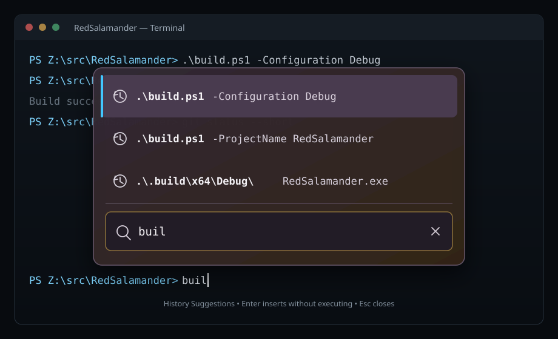

# Embedded terminal plugin

## Status and scope

This is the authoritative contract for the first working embedded-terminal
implementation. The built-in plugin id is `builtin/terminal`. The v1 x64
implementation is complete from command dispatch through clean teardown. The
separate ARM64 product-build qualification described below remains a release
environment gate, not unfinished Terminal architecture or behavior.

Implementation completeness is separate from verification closeout. The
Ghostty lib-vt upgrade was admitted on 2026-08-27. The 2026-08-28 lifecycle,
posted-wake, clipboard, snapshot, evidence-validator, and workflow hardening is
tracked by
`Specs/Plans/WIP/Terminal_GhosttyUpgradeReviewRemediation_2026-08-28.md` until
its current-tree Fresh Full and corrected comparison evidence are recorded.

## Boundary and package topology

```text
RedSalamander.exe
  -> Common/PlugInterfaces/Terminal.h (`ITerminal`)
  -> Plugins/Terminal.dll
       -> exact sibling path
          Plugins/TerminalRuntime/ghostty-vt.dll
```

- `ITerminal` is the only runtime terminal boundary. `IViewer` is unchanged and
  is not implemented by Terminal.
- The existing viewer plugin manager is reused as generic module discovery,
  configuration, and module-lifecycle plumbing. Each entry is explicitly typed
  `Viewer` or `Terminal`; viewer association lists exclude Terminal entries.
- Only `Terminal.dll` includes Ghostty headers or resolves Ghostty exports.
- `ghostty-vt.dll` is a private runtime leaf, not a public RedSalamander plugin.
  It exports no RedSalamander factory and is never searched through `PATH`.
- Central `RuntimeDependencies.props` stages the runtime, identity JSON, and
  the complete Ghostty/uucode/Bjoern Hoehrmann/Unicode/Wuffs/Zig notice set. Plugin
  projects must not add copy events.
- Missing or invalid runtime produces a diagnostic terminal child and must not
  prevent RedSalamander or non-terminal plugins from starting.

### Plugin translation units

`ITerminal` remains one COM object (`class Terminal`). Implementation is split
so session lifetime, Ghostty/VT, and security gates are not one 9k-line file:

| Unit | Files | Owns |
|---|---|---|
| Facade | `Terminal.cpp` / `Terminal.h` | COM vtable, Open/Close orchestration, child HWND, WindowProc routing, actions, command-surface UI |
| Session | `TerminalSession.cpp` / `TerminalSession.h` | ConPTY, process job, integration named pipe, input queue, Close worker joins |
| VT | `TerminalVt.cpp` / `TerminalVt.h` | Ghostty encode/decode, selection, viewport/scroll, render snapshot |
| Security | `TerminalSecurity.cpp` / `TerminalSecurity.h` | unsafe paste overlay, OSC 52, hyperlink confirmation, InsertPath sanitization |
| Shared helpers | `TerminalInternal.h` / `TerminalInternal.cpp` | plugin-local helpers and process-wide instance/window counts |
| Existing | Kitty pipeline, command-surface model, accessibility, runtime loader | unchanged |

The public ABI, unload quiet point, module pins, WIL RAII, and non-blocking UI
`Close` contracts are unchanged. Source-contract scans concatenate these
implementation files.

## Public ABI

Public terminal names are unsuffixed: `TerminalOpenContext`, `TerminalTheme`,
`TerminalViewState`, `ITerminal`, and their related enums. Layout
evolution is size-only: every extensible record begins with `uint32_t
sizeBytes`, and no parallel record-version field or constant exists. Callers set
`sizeBytes` to the bytes they actually provide. Consumers reject records shorter
than the prefix they require, accept larger records, and ignore unknown tail
bytes. Compatible additions are optional tail fields whose presence is tested
through `sizeBytes`; an incompatible ownership, semantic, or vtable change uses
a new COM IID and repository-style interface name such as `ITerminal2`. It
never reinterprets an existing record. Headerless closed leaf values such as
spans and IDs are not independently extensible.

The current Terminal ABI is source-tree/release lockstep with the host. Every
current `ITerminal` method requires the full current `sizeof` of each extensible
record it consumes or produces; there is no reviewed shorter prefix and no
support promise for a pre-August-2026 or otherwise mixed-release Terminal
binary. Acceptance of an oversized record only preserves unknown caller tail
bytes within the current contract; it does not identify or adapt an older
layout. A future backward-compatible plugin boundary must introduce explicit
generation negotiation/rejection before `ITerminal` invocation and add frozen
old/new x64 and ARM64 fixtures plus new IIDs/adapters for changed layouts.
Reserved fields remain zero and lifecycle/capability enum values that the
current implementation does not publish remain reserved; neither is an
optional shorter prefix or a latent current behavior promise.

ABI verification is behavioral rather than a collection of frozen
`sizeof`/offset assertions: plugin contract tests exercise null, undersized,
current, and oversized records and verify that unknown caller tails survive
output calls unchanged. Output methods, including `GetViewState` and
`ITerminalActions::GetActionState`, capture and validate the caller's leading
`sizeBytes` before any write. An undersized output returns `E_INVALIDARG`
without touching caller storage; a current or oversized output writes only the
reviewed current record and preserves every unknown caller-tail byte.

All pointer inputs are borrowed for the duration of the call. The plugin copies
state that outlives the call. `TerminalOwnedUtf16` outputs use `CoTaskMemAlloc`;
the caller releases them with `CoTaskMemFree`.

The current `ITerminal` vtable is `Open`, `GetChildWindow`, `SetTheme`,
`UpdateSourceLocation`, `InsertPath`, `GetViewState`, `SetCallback`, and
`Close`. The release-lockstep interface keeps IID
`47E1AC4C-022E-42C4-8E2C-0C2BBC687D31`; every Terminal plugin and consumer is
built in this repository. `ITerminalActions` is obtained by `QueryInterface`
when the host needs shortcut routing, action-state queries, or action
execution; those semantics do not inflate the primary lifecycle interface.

The retained-IID insertion of `SetCallback` is one explicit, closed
release-lockstep exception to the repository's normal fixed-vtable rule. It is
safe only inside the current product boundary: `RedSalamander.exe`,
`Terminal.dll`, its private runtime, and satellites are compiled from the same
source revision, staged through `RuntimeDependencies.props`, and required in
the same complete build-receipt/runtime closure. The loader makes no
mixed-generation promise and must not describe this exception as compatibility
with an older Terminal binary. This exception is not a precedent for another
same-IID edit. Before Terminal becomes independently deployable, or before any
further incompatible vtable change, introduce a queried new IID and the
generation fixtures required by `Specs/Plugins/Plugins_PluginAPI.md`.

`SetCallback(ITerminalEventCallback* callback, void* cookie)` registers a weak,
non-COM host callback. The pair is either both non-null or both null.
`SetCallback(nullptr, nullptr)` is a hard drain barrier: once it returns, no
callback is active or may begin. The host clears the callback before releasing
the Terminal instance or unloading the plugin. Repository callback convention
places context last, so the only callback signature is
`OnTerminalEvent(const TerminalEvent* event, void* cookie) noexcept`; a
cookie-first overload is not ABI-compatible and MUST NOT be introduced.
`TerminalEvent` carries the terminal instance ID, session/state generations,
the root-exit observation timestamp from the process watcher,
optional exit code, and final-snapshot completeness. The host
validates all identity and generation fields before acting on an event.
Contract coverage exercises all four callback/cookie nullness combinations,
real embedded and floating root-process exit delivery, synchronous clear, and
the final unload quiet point.

Every private host-side Floating Terminal `WM_APP` identifier is declared in
`Common/WindowMessages.h`; the host implementation must not declare local
`WM_APP + ...` values. Source-contract coverage rejects duplicate literal
`WM_APP`/`WM_USER` values in that central registry.

## First-gate runtime lifecycle

1. The host creates `ITerminal`, applies persisted configuration and theme,
   creates a unique instance id, and calls `Open` with the opposite pane's
   content HWND and typed source/launch locations.
2. The plugin creates its child HWND, privately loads and validates Ghostty,
   creates the Ghostty terminal plus reusable render/key objects and diagnostic
   formatter, creates ConPTY, and starts the chosen shell. Engine construction
   is transactional after runtime load: any failed create, option set, or Kitty
   worker start stops the worker, frees every created Ghostty object in reverse
   order, releases the PNG callback lease, and unloads the runtime before Open
   exposes a localized diagnostic child. Initialization refuses a preexisting
   engine rather than replacing or leaking it. The ConPTY process
   attribute receives the `HPCON` value itself; passing `&HPCON` is invalid and
   makes the child loader fail with `0xc0000142`. The shell starts suspended,
   enters the plugin-owned job, and resumes only after the integration listener
   is ready.
3. A tracked `std::jthread` exclusively owns and reads the ConPTY output handle,
   serializes Ghostty mutation, and coalesces output into at most one pending
   typed posted-payload redraw token carrying the session generation. The
   consumer rejects stale, drained, type-mismatched, or generation-mismatched
   tokens and clears pending state only
   after observing the newest output generation and reposts if a producer wins
   the handoff, so a post failure or concurrent final read cannot strand the
   last update. Kitty conversion readiness uses the same registry-owned wake
   contract and never calls GDI from the worker. `WM_NCDESTROY` drains all
   tokens and closes posting before HWND reuse can admit a stale wake. The UI
   thread takes a two-phase reusable Ghostty render snapshot. The UI thread
   draws resolved per-cell foreground/background color, bold/italic/faint/
   inverse/decorations, grapheme clusters, selection, hyperlinks, and the
   current cursor through DirectWrite/Direct2D. For direct Kitty RGB, RGBA,
   grayscale, gray-alpha, and WIC-decoded PNG placements, the UI recomputes
   geometry and counts every retained placement before virtual/off-screen
   filtering on every capture. The private runtime admits no more than 4,096
   placements or 1 MiB of exact placement-map allocation across either screen;
   a sized `GhosttyKittyPlacementLimits` option may lower but never raise those
   product ceilings. Admission predicts the pinned Zig hash-map allocation
   before insertion. Replacing an explicit placement ID releases the prior pin
   without increasing count; a rejected insertion leaves count and bytes
   unchanged. The host queries the actual count, allocated bytes, and limits on
   every capture.

   The host owns one bounded cache indexed by
   `{imageId,imageGeneration}`. Aggregate storage generation is the stale-work
   fence, while per-image generation is the pixel identity. An image metadata
   query returning `GHOSTTY_NO_VALUE` is engine-pending, not rejected and
   not adapter-queued: the host retains no upstream data pointer and re-queries
   every visible engine-pending key on each capture until data or a terminal
   error is returned. Adapter conversion work has a separate pending state and
   request ID. A storage-generation change invalidates queued conversion work
   and returns engine-pending, adapter-pending, and rejected entries to missing
   so retransmitted data can be queried again. A capture failure also returns
   either pending state to missing rather than stranding it. A new generation
   for an existing image ID supersedes and removes every older cached generation
   before new work is admitted, covering retransmission and animated-frame
   changes without drawing stale pixels. Deletion/storage reset removes entries
   no longer reported by visible placements. Worker results must match the
   current request, storage generation, exact image generation, and
   adapter-pending state; a removed or superseded key can never be resurrected.
   Product configuration disables Kitty file, temporary-file, and shared-memory
   media, but the adapter still honors the candidate ABI's pending-data contract
   for any future admitted medium. The UI first
   collects visible placements and unique exact keys, then copies only missing
   visible raw bytes while Ghostty ownership and `_terminalMutex` are held. A
   geometry-only scroll or resize may submit that bounded delta without an
   aggregate storage mutation. One plugin-owned `std::jthread` converts the
   immutable latest request to premultiplied BGRA after the lock is released;
   a replacement request includes every still-visible pending key so latest-only
   admission cannot strand one. Accepted results merge per exact key instead of
   replacing unrelated ready images. Current-visible CPU entries are pinned;
   nonvisible entries leave by visible-epoch LRU when the 64 MiB BGRA cache
   needs room. Invalid or oversized image data is rejected per key and
   simultaneous-visible budget overflow is deferred per key; neither clears an
   otherwise ready image. Storage mutation removes obsolete nonvisible keys.

   Each placement draws only when its exact cache key is ready, using one hash
   lookup in the placement's Ghostty z layer. Paint creates at most one Direct2D
   bitmap (and at most 64 MiB of upload) per frame. Device loss drops only D2D
   bitmaps, preserving owned CPU bytes for bounded reupload. Superseded
   pending/active requests are dropped or rejected and never drawn. The
   plugin-owned ConPTY
   reader initializes COM and its WIC factory once at thread entry; synchronous
   Ghostty PNG callbacks reuse that thread context and never initialize COM or
   activate a WIC factory per image. Setup failure emits one warning and leaves
   text rendering available while PNG decode fails closed. The formatted text API
   remains a bounded diagnostic fallback only. Render-state dirty flags are
   cleared only after `EndDraw` succeeds. The terminal measures the configured
   monospace font through DirectWrite, quantizes cell width and height to whole
   physical pixels at the current DPI, and fills cell backgrounds with aliased
   Direct2D geometry so adjacent colored cells have no grid seams or artificial
   gaps. Each paint emits `terminal.render.frame_us` with the current column and
   row counts.
4. Resize updates both ConPTY and the Ghostty grid for every nonzero client
   size that changes the quantized column or row count.
   Open creates the child HWND at 0×0 and retains the initial 80×24 grid until
   the host supplies a usable layout. Empty client `WM_SIZE`, including Open
   and SwapPanes hides, MUST NOT clamp to 1×1 or call
   `ResizePseudoConsole`. After the first nonzero client sync, unchanged
   column/row counts MUST NOT call `ResizePseudoConsole` again.
   Keyboard text writes only
   to a bounded plugin queue; a pinned threadpool drain is the only writer to
   the ConPTY input pipe. Navigation and F1-F24 key press/repeat/release bytes
   come from Ghostty's key encoder after it reads the current terminal modes.
   The host never synthesizes VT input. The queue admits complete requests only,
   caps aggregate queued/active input at 8 MiB and user requests at 3,840, and
   scrubs completed, rejected, and close-drained byte buffers.
5. PowerShell-family roots receive one encoded plugin-owned bootstrap script.
   `pwsh` (not Windows PowerShell 5.1) MUST also be launched with `-Interactive`.
   Together with `-NoExit`, this explicitly retains an interactive session
   after the bootstrap. Console attachment requires no resize workaround.
   The zero-initialized `STARTUPINFOEX`
   MUST set `STARTF_USESTDHANDLES` with all three standard handles null, so
   ConPTY supplies the shell streams instead of Windows duplicating redirected
   host handles even when `bInheritHandles` is false. `CreateProcess` MUST NOT
   use `CREATE_NO_WINDOW`: that flag can leave a live interactive root with no
   output delivered to ConPTY. ConPTY owns the hidden console; the shell remains
   suspended until admitted to its plugin-owned job. Running/trusted-idle state
   alone is insufficient launch evidence: the embedded lifecycle regression
   must observe a nonblank initial prompt, without prescribing the user's
   customized prompt format, from a host with redirected standard handles.
   At a 500 ms `PowerShell.OnIdle` throttle, the script writes one versioned
   `RS2` record through a random local duplex named pipe. The plugin creates that
   pipe with `FILE_FLAG_FIRST_PIPE_INSTANCE` on each listener iteration. A
   `CreateNamedPipe` failure ends the listener; do not keep a disconnected
   instance and reconnect on the same handle.
   The record contains
   strict-base64 UTF-8 fields for the live cwd, the PSReadLine
   `HistorySavePath`, the exact PSReadLine prompt buffer, and up to 256 explicit
   `Microsoft.PowerShell.Core\Get-History` entries for the current session.
   `Terminal.dll` accepts the connection only when
   `GetNamedPipeClientProcessId` equals the exact root PowerShell PID and rejects
   malformed, over-limit, control-bearing, or non-absolute provider paths. The
   response contains either an authenticated follow target or an exact prompt
   replacement. Follow replies use module-qualified
   `Set-Location -LiteralPath`; prompt replacements use
   `PSConsoleReadLine::RevertLine()` followed by `Insert(...)`. Neither response
   sends Enter or command bytes through ConPTY, and neither mutates native
   history by itself. Cmd and WSL expose no trusted prompt/cwd/history/follow
   capability in the first implementation. A legacy raw-path record remains a
   compatibility/debug-fixture input only and does not authorize Suggestions.
6. Close is idempotent and nonblocking on the UI-facing call. The plugin creates
   the pinned close threadpool work in the constructor so `Close` stays
   nonblocking even when `Open` never ran (ABI contract tests and last-Release
   retirement). The UI-facing call marks closing, requests stop and retires
   Find/Suggestions work, cancels pending Kitty work, retires accessibility
   state, scrubs queued input, synchronously removes the child HWND and UI
   resources, then submits pinned threadpool cleanup. It does not close ConPTY
   or join session workers. The cleanup callback transfers its module pin to
   the callback return, drains command-surface joins, stops Kitty work, and
   requests integration cancellation. Under the session teardown mutex it
   closes the plugin-owned kill-on-close job, terminates a still-running root
   only as a partial-start fallback, closes the input pipe, and closes ConPTY
   while the output reader is still draining. Only after ConPTY has closed may
   it cancel synchronous reader I/O and join the reader, integration listener,
   and root-process watcher. It then frees Ghostty state, unloads the private
   runtime, and publishes Exited.
   Opening or closing Find/Suggestions on the UI thread requests stop and
   submits a pinned asynchronous join for the retired worker. Failed admission
   retains that worker for `finishClose`; ordinary typing must not accumulate
   one joinable worker per keystroke until Close. Retired joins use one
   mutex-protected predicate and notify a condition variable; `finishClose`
   waits on that predicate after admission is stopped. Manual-reset event
   Set/Reset transitions are forbidden because a completing callback can race a
   new retirement and falsely publish an idle quiet point. The host calls
   `Close`, releases the object, and never waits for
   plugin cleanup. `RedSalamanderPluginCanUnloadNow` is the module-level quiet
   point; `ITerminal` has no registration callback to drain.
7. The child exposes a plugin-owned UI Automation Document/Text provider from
   immutable bounded screen publications. Character, word, line, paragraph,
   page, and document movement/expansion use the shared DxUi text-unit boundary
   implementation and never split UTF-16 surrogate pairs or combining-mark
   sequences. A visible security confirmation is appended as localized action
   text to the passive document snapshot without exposing pending OSC 52
   content. Retired providers and ranges retain passive snapshot state only,
   return `UIA_E_ELEMENTNOTAVAILABLE` after retirement, and disconnect before
   the child is destroyed.
8. The plugin manager may unload `Terminal.dll` only after its terminal and
   passive accessibility object counts are zero and
   `RedSalamanderPluginCanUnloadNow` returns true.

No detached plugin thread and no callback/post is permitted after the quiet
point.

## Shell and path mapping

- Windows local and UNC folders select PowerShell 7 from its registered install
  root, then Windows PowerShell and Command Prompt from the Windows system
  directory when `defaultShell=auto`. Explicit `powershell` and `cmd` settings
  constrain that choice. Terminal never resolves a shell through the current
  directory or ambient `PATH`.
- Windows path typing uses the canonical `Common::Paths::ClassifyWindowsPath`
  result: drive and extended-drive absolute paths are `WindowsLocal`; UNC and
  extended-UNC paths are `WindowsUnc`; rooted, drive-relative, extended-other,
  and device paths are unsupported. No consumer-local prefix heuristic may
  broaden those classes.
- `\\wsl.localhost\Distro\path` and `\\wsl$\Distro\path` map to typed WSL
  locations and launch `wsl.exe --distribution Distro --cd /path` through
  ConPTY. Windows command-line arguments are escaped as arguments, not composed
  as shell text. Empty/option-like/slash-bearing distro ids, non-absolute WSL
  paths, embedded NUL/CR/LF, and a command line at or above the Windows
  32,767-code-unit limit are rejected before process creation.
- Plugin-backed locations without a validated Windows backing path or WSL
  identity are rejected as unsupported; no display string is guessed into a
  launch path. The host derives Terminal identity from the provider short ID,
  instance context, and provider path retained by `PaneState`; it never parses
  the formatted address/history string back into an ABI location. A provider
  transition always advances the source generation. Unsupported namespaces
  publish a detached/unsupported generation, clear the prior source/follow
  identity, show localized rejection for Open Command Shell, and never
  substitute the default Windows root. A plugin-backed namespace is active only
  when its instance context resolves to an absolute Windows file or directory;
  file contexts use their parent directory as the shell backing while retaining
  the provider short ID as the namespace identity.
- PowerShell, cmd, and POSIX insertion quoting is owned by `Terminal.dll`.
  WSL insertion is full native Linux path only and must remain in the exact
  launch distribution; WSL never receives the trusted contextual-leaf route.
  Insertions never append Enter. NUL, CR, and LF are rejected before any write;
  cmd launches with AutoRun and delayed expansion disabled, and literal percent
  signs are caret-escaped outside adjacent quoted segments so `%NAME%` path
  components cannot expand as environment variables.
- Windows process argv construction reuses the policy-neutral
  `Common::Process::QuoteWindowsCommandLineArgument` primitive; profile/token
  validation and shell/process policy remain inside `Terminal.dll`.

## Pane and command interaction

- `cmd/pane/openCommandShell` (`Alt+7`) is exposed as **Terminal Pane** in both
  pane menus. It selects and reuses a Starting or Running terminal in the
  physical pane opposite the named source pane, publishes that source folder,
  and retains the same child/process tree. It creates a terminal only when no
  reusable session exists.
- `cmd/terminal/openFloatingWindow` (`Ctrl+Alt+T`) is exposed as Commands >
  Terminal > **Command Shell Window**. It opens or reuses the singleton floating
  Terminal window at the focused pane folder and never toggles the embedded
  Terminal Pane. Its application-level enabled state depends on a supported
  source folder, not on an existing terminal or terminal-child focus. Both the
  shortcut and menu must open the first floating terminal from a file pane.
  Existing user overrides retain their saved stable command IDs;
  only the legacy default `Ctrl+Alt+T` mapping migrates to the floating command,
  and `shortcuts.migrationVersion` makes that rewrite one-shot so a later user
  rebind survives initialization.
- The embedded Terminal session menu routes **Command Shell Window** back
  through the canonical host `cmd/terminal/openFloatingWindow` dispatcher used
  by Commands and `Ctrl+Alt+T`; the row is never a dead plugin-local command.
  The floating tab inherits the embedded Terminal's recorded source location,
  not the folder hidden underneath its host pane.
- The older external Windows Terminal launch path remains only behind selftest
  overrides.
- Primary Edit/F4 on a focused directory opens the same opposite-pane terminal
  tab. Files continue through configured editor actions.
- `Ctrl+Enter` retains the stable id
  `cmd/pane/bringFilenameToCommandLine`, whose user-facing meaning is now
  “Insert Focused Item in Terminal.” It opens or reuses the opposite terminal,
  inserts only the focused item, and uses the leaf only when `Terminal.dll` has
  authenticated an idle PowerShell prompt whose live cwd equals the item's
  parent; otherwise it inserts the full native path.
- `Ctrl+Shift+Enter` uses `cmd/pane/bringFullPathToTerminal` and always inserts
  the focused item's full native path.
- `Ctrl+Space` and its existing `Ctrl+Shift+Space` alias retain
  `cmd/pane/bringCurrentDirToCommandLine`, now insert the source pane's full
  current directory through the same opposite terminal, and never send Enter.
  The obsolete FolderWindow bottom pseudo prompt and `cmd.exe /C` execution
  route are removed.
- Folder, Preview, and Terminal use stable distinct tab identities, but only
  available content appears in the header. Folder is always present, Preview
  appears only while a preview pane exists for that host, and Terminal appears
  only while its session exists. When both alternate contents exist both tabs
  remain available. Closing Preview leaves Terminal intact; closing Terminal
  synchronously removes its tab/child but completes process/runtime teardown
  asynchronously, and leaves Preview intact when present.

While the terminal child owns keyboard focus, its key messages bypass the host
menu mnemonic, FolderWindow shortcut, Escape focus-reclaim/full-screen, and
static accelerator paths. The plugin therefore receives Escape, Ctrl+C when no
selection is present, navigation keys, and F1-F24 for mode-aware Ghostty
encoding. A visible closable host alert remains the one higher-priority Escape
target.

The host theme supplies the terminal's default background, foreground, cursor,
selection, hyperlink, and inactive-status colors from the active RedSalamander
semantic folder palette. Explicit per-cell colors from the terminal application
still win. The embedded terminal does not import a Windows Terminal profile or
color scheme, so a side-by-side Windows Terminal window can intentionally use
different default foreground/background colors.

When the terminal child does not own keyboard focus, its complete rendered
scene is composited toward the terminal background with the shared inactive-pane
text opacity used by FolderView. This includes explicit ANSI colors, cell
backgrounds, selection, cursor, Kitty graphics, and confirmation content; the
native themed scrollbar is not covered by the content overlay. Focus transitions
invalidate the child immediately. High Contrast suppresses this dimming overlay.

Within the terminal child, text, AltGr/dead-key/surrogate input, and committed
IME text enter the same bounded asynchronous input path. IME composition is
shown at the cursor with candidate/composition windows positioned at the
terminal caret. `Ctrl+Shift+V`, Shift+Insert, and `WM_PASTE` perform one bounded
Unicode clipboard read, normalize line endings, convert strictly to UTF-8, ask
Ghostty whether the payload is safe, and encode the complete request for the
live bracketed-paste mode before admission. With `warnOnUnsafePaste` enabled,
the plugin retains one bounded pending request and shows a localized
nonblocking confirmation overlay. Enter accepts, Escape or Cancel rejects,
input and pointer reporting are suppressed behind the overlay, and pending
bytes are scrubbed on every resolution and close path.

Terminal-application clipboard writes use Ghostty's normalized clipboard
callback; the plugin never parses OSC 52 or base64 itself. The synchronous
engine callback validates the sized request before each accessed field, accepts
only the standard clipboard and a `text/plain` UTF-8 representation, rejects
embedded NUL, invalid UTF-8, and decoded data above `osc52MaxBytes` before
posting UI work. UTF-8 is validated in place without allocating UTF-16 while
the terminal mutex is held; the bounded UTF-8 bytes are copied into the opaque
payload and converted on the UI thread. It admits at most one outstanding
request. Candidate callbacks require the sized `reply` field, answer it exactly
once before returning with `remember=false`, and return without retaining or
processing the request when that field or function is absent. A denied request
replies `DENIED`; invalid text replies `INVALID_DATA`; overlapping work replies
`BUSY`. A successfully queued UI request also replies `BUSY`, because the ABI
defines `SUCCESS` as a completed write and the synchronous callback cannot
truthfully report consent or clipboard I/O that has not happened. OSC 52 and
OSC 1337 discard that reply, while Kitty OSC 5522 is disabled before callback.
It never calls a clipboard API while the Ghostty/session lock is held. An opaque
owned payload crosses to the terminal UI thread. `osc52Policy=deny` rejects the callback, `ask`
uses the same localized nonblocking confirmation surface without publishing
the content, and `allow` writes immediately on the UI thread. Pending
UTF-8/UTF-16 content is scrubbed after commit, rejection, stale-message drain,
or close. The clipboard-read callback remains explicitly null: OSC 52 reads are
ignored and Kitty reads fail closed with `EPERM`.

Ghostty owns local selection semantics. Pointer drag selects characters from a
tracked Ghostty grid reference that survives output, reflow, and scrollback;
dragging beyond the viewport autoscrolls. Alt drag is rectangular, double-click
selects a word, and `Ctrl+Shift+A` selects all.
`Ctrl+Shift+C`/`WM_COPY` copy a bounded Ghostty-formatted selection;
`Ctrl+C` copies when a selection exists and otherwise remains shell interrupt.
The keydown decision also arms one explicit, one-shot translated-character
suppression consumed by the next `WM_CHAR`/`WM_SYSCHAR`; modifier state sampled
after keydown cannot leak a queued character. Unselected `Ctrl+C` never arms
that suppression and emits exactly one ETX byte.
Application mouse modes are encoded by Ghostty. Shift bypasses application
reporting for local selection/scroll, and the wheel otherwise scrolls the
Ghostty viewport. Local wheel scrolling preserves sub-detent remainder, honors
the Windows line/page wheel setting, and applies the full delivered wheel-delta
magnitude in one Ghostty viewport mutation so accelerated wheels do not degrade
to one fixed three-row step per message. Pressing Enter after browsing scrollback
returns the viewport to the live bottom before the submitted command or empty
prompt line produces output. Reported left, middle, and right application buttons are
tracked independently. Button-up releases exactly the matching button and
cannot clear a different held button; capture loss and close emit a release for
every still-reported button before clearing capture or engine state. The
terminal child owns one visible native vertical
scrollbar. Once per paint or output batch it synchronizes the range, page,
and position from `GHOSTTY_TERMINAL_DATA_SCROLLBAR`; line/page/track/thumb
commands round-trip through Ghostty's absolute row viewport rather than a
separate host-side scroll model. The scrollbar follows `TerminalTheme`: the
child uses the native dark or light Explorer visual style, reapplies it on a
runtime theme change, and clears that visual style when High Contrast is
active so system accessibility colors win.

`Ctrl+click` asks Ghostty for the OSC 8 URI attached to the selected cell
before application-mouse reporting or local selection begins. URI retrieval is
bounded to 8 KiB and converted from UTF-8 strictly. Only `http`, `https`, and
`mailto` schemes without control characters are eligible. `hyperlinkPolicy`
controls whether activation is disabled, requires the localized nonblocking
confirmation overlay, or opens immediately through the default Windows
application. The default is `ask`; ordinary clicks never activate a link.

The contextual same-folder decision consumes only the authenticated root
PowerShell report. A user-issued `cd` is observed at the next idle event. Until
that confirmation exists, while user input is pending, or for cmd/WSL,
the plugin falls back to the full path. It never infers cwd from rendered prompt
text or from the host's tracked source folder.

Every insertion is also bound to the terminal's original source key, latest
accepted source generation, exact namespace, and exact current source path.
A stale or cross-pane request is rejected before queue admission. The host
commits its local source generation only when `UpdateSourceLocation` accepts
the update (`S_OK` or `S_FALSE`), so a hard ABI failure cannot desynchronize
the next insertion. `SwapPanes` may change the physical side that currently
contains the source FolderView and Terminal host, but it MUST NOT rewrite the
Open-time source key. Current-directory and focused-path insertion therefore
send the host's stored `terminalOriginalSourcePaneInstanceId`, not an ID derived
from the source's current left/right side.

Every public Terminal record is validated by kind before any nested span or
location field is read. Local and UNC locations require only their matching
absolute Windows path, WSL requires a bounded distribution plus absolute Linux
path, plugin-backed locations require the declared backing identity, and
unsupported locations carry no active launch fields. Mixed-kind, contradictory,
oversized, embedded-control, and undersized records fail before state mutation.

## Terminal command experience

While an embedded or floating Terminal child owns input, routing order is:

1. plugin-owned confirmations, Find, Suggestions, selection, and composition;
2. an exact Terminal-scope binding, including explicit pass-through;
3. the small allowlisted host/Application command set;
4. the original key message to Ghostty and ConPTY.

AltGr and active IME composition are never interpreted as Ctrl+Alt command
chords. A consumed key-down owns its repeat and key-up; a passed-through key is
forwarded with its original scan code and extended-key identity. Unsupported or
inapplicable Windows Terminal conventions pass through instead of being
silently reserved. `Ctrl++` and `Ctrl+-` use physical scan positions `0x0D` and
`0x0C` respectively, independent of the character produced by the active
keyboard layout; numpad zoom remains a separate virtual-key binding.

`ITerminalActions` owns these plugin-local commands: copy, copy-selection-or-
pass-through, paste, select all, context menu, line/page/top/bottom scroll,
font increase/decrease/reset, Find, and Suggestions. `IsTerminalPluginActionId`
in `Common/PlugInterfaces/Terminal.h` is the single ID list used by plugin
`RouteShortcut` / `GetActionState` / `ExecuteAction` and by both hosts. Copy
succeeds only when a selection exists and clears that selection after
publishing the clipboard. `GetActionState` enables copy and
`cmd/terminal/copySelectionOrPassthrough` iff a selection exists.
`RouteShortcut` for copy-or-passthrough copies and consumes when a selection
exists (even if clipboard publish later fails, so Enter/ETX is not sent into a
still-selected prompt) and otherwise returns pass-through so `Enter` or
`Ctrl+C` reaches Ghostty/ConPTY. Palette/`ExecuteAction` for the same ID never
passes keys through: it copies when enabled and otherwise returns `S_FALSE`
without writing input. Default copy/paste/select chords live only in
`RouteShortcut` / `ExecuteAction`; the child WindowProc encodes remaining keys
and does not reimplement Ctrl+C / Ctrl+Shift+C / Ctrl+Shift+A / Ctrl+Shift+V /
Shift+Insert. An explicit pass-through binding therefore delivers ETX even
while a selection exists. After a successful Ghostty encode on keydown for a
virtual key that `TranslateMessage` turns into `WM_CHAR`/`WM_SYSCHAR` (Return,
Escape, letters, digits, numpad/operator keys, OEM punctuation, and
Tab/Backspace/Space when those keys are Ghostty-encoded), the plugin arms
one-shot translated-character suppression so the host
does not write the character twice. Arrow, Home/End, and function-key encodes
MUST NOT arm suppression, or the next typed character is swallowed. Enter
remains a single CR. Escape consumed to cancel a visible confirmation or close
Find/Suggestions MUST also arm the one-shot before clearing that UI state;
otherwise the subsequent translated `WM_CHAR 0x1B` would escape into ConPTY.
The host owns global Preferences,
settings-file launch, Command Palette, pane focus/splitter, embedded content
navigation, floating-window tabs, and close policy.

### Find

`cmd/terminal/find` (`Ctrl+Shift+F`) opens a plugin-owned terminal-text surface
and never writes input to ConPTY. A terminal worker formats one generation-
tagged screen/scrollback snapshot and performs bounded, cancellable,
case-insensitive filtering. The UI thread schedules work and paints results; it
does not format or copy the full buffer. Superseded generations publish no
rows. Closing the surface stops and joins its worker, securely clears the query,
snapshot, and displayed row text, and restores terminal focus. Metrics may
contain latency, byte, scanned-line, result, and cancellation counts, never
terminal text or query text.

### Command History Suggestions

`cmd/terminal/suggestions` (`Ctrl+Shift+.`) searches only trusted bounded
sources: up to 1,000 current-session commands and up to 10,000 entries / 4 MiB
from the exact PSReadLine history file reported by the authenticated root
PowerShell process. Current-session history comes only from its explicit
`Get-History` snapshot; terminal `WM_CHAR`, IME, paste, and key-routing traffic
MUST NOT be inferred to be commands because the foreground program may be a
TUI, password prompt, or nested shell. Loading and filtering run on the terminal
worker. The UI retains immutable shared history snapshots so each incremental
query does not copy the history on the UI thread. Unsafe/control-character
entries are rejected and case-insensitive duplicates are folded. Ranking is
deterministic: exact/empty, prefix, token-prefix, substring, then bounded fuzzy
subsequence; within a rank, current-session and recency precede frequency and a
normalized text tie-break. Fuzzy matching is disabled for whitespace-bearing
or over-128-character queries so filtering remains bounded.

Opening the surface seeds its query from the authenticated PSReadLine prompt
buffer. Before accepting a row, the plugin revalidates the exact terminal
instance, session generation, state generation, integration availability, idle
prompt state, and unchanged prompt buffer. The selected text is queued for the
next authenticated `RS2` exchange and PowerShell replaces the live buffer with
`RevertLine()` plus `Insert(...)`, without Enter; the user remains responsible
for execution. If the prompt changed, the surface stays open with a localized
explanation and nothing is inserted. Closing, replacement, shell exit, or
teardown cancels stale work and securely clears duplicated history, query,
prompt, and pending-replacement strings. No command or query text enters
telemetry.



### Shell exit

A dedicated watcher waits for the root shell independently of the ConPTY output
reader. On root exit it records the exit code, enters drain-after-root-exit,
retires the job/input/pseudoconsole resources under the session teardown lock,
and lets the reader consume final ConPTY output. Only after final EOF does the
plugin publish one generation-tagged `Exited` event with a complete final
snapshot. The UI callback posts host work and returns; it never destroys the
terminal inline. The host removes exactly the matching embedded session or
floating tab, ignores stale/duplicate events, and closes the singleton floating
root only when its last tab exits.

### Performance qualification

Release qualification covers 50,000 routed/pass-through messages, 1,000 held
scroll repeats, 100 zoom cycles against a real 900x620 hosted floating Terminal,
500 baseline and 500 post-cycle synchronous render samples after 50 warmup
frames per phase, a
100,000-line/1,000-query Find workload, and a 10,000-entry/4 MiB/1,000-filter
Suggestions workload. The hosted zoom loop must retain the same root, child,
tab, and settled geometry, and the candidate render p95 must remain within 10%
of baseline. The required metrics are `terminal.shortcut.route_batch_us`,
`terminal.shortcut.zoom_hosted_cycle_batch_us`, `terminal.render.frame_us`
with `zoom_baseline` and `zoom_candidate` details,
`terminal.find.snapshot_batch_us`,
`terminal.find.query_to_visible_us`, `terminal.suggestions.load_batch_us`,
`terminal.suggestions.open_to_visible_us`,
`terminal.suggestions.filter_to_visible_us`, and
`terminal.session.root_exit_to_host_close_us`; the narrower
`terminal.session.exit_to_host_close_us` separately measures callback
publication through host removal. The acceptance budgets and archived
Release evidence are recorded in the completed Operation Chordforge plan and
its cited `Specs/TestRuns/` archive.

## Preferences

Terminal appears as type “Terminal” on the Plugins Preferences page and uses
the normal schema/configuration persistence pipeline. Supported fields are:

| Key | Default | Validation | Effect |
|---|---|---|---|
| `defaultShell` | `auto` | `auto`, `powershell`, `cmd` | Windows shell selection |
| `fontFamily` | `Cascadia Mono` | nonempty, at most 128 UTF-16 code units | DirectWrite family |
| `fontSizeDip` | `14` | 8 through 32 | text metrics and grid size |
| `maxFormattedMiB` | `8` | 1 through 32 | temporary formatted-screen bound |
| `pasteMaxBytes` | `4194304` | 4,096 through 8,388,608 | hard UTF-8 bound for one atomic paste |
| `warnOnUnsafePaste` | on | boolean option | require the plugin-owned nonblocking confirmation overlay for unsafe paste |
| `followPathWhenIdle` | off | boolean option | requests follow; does not authorize it without trusted idle/cwd proof |
| `hyperlinkPolicy` | `ask` | `disabled`, `ask`, `open` | policy for Ctrl+click activation of bounded OSC 8 HTTP/HTTPS/mail links |
| `osc52Policy` | `ask` | `deny`, `ask`, `allow` | policy for decoded terminal-application writes to the standard Windows clipboard |
| `osc52MaxBytes` | `262144` | 4,096 through 262,144 | hard decoded UTF-8 bound for one application clipboard write; never exceeds the engine option |

Invalid configuration returns `E_INVALIDARG` and is not partially applied.
Runtime location, DLL filename, source pin, hashes, or loader flags are never
user-configurable.

## Dependency identity and upgrade procedure

The canonical product lock is
`External/TerminalEngine/GhosttyRuntimeLock.v1.json`, validated against
`Specs/Terminal/GhosttyRuntimeLock.schema.json`. It is the only source of the
active upstream commit/tree/archive, Ghostty version, Zig archive and executable
identity, dependency archives, normalized overlay identity and concern set,
build tuple, platform/machine/size envelopes, import/export ABI, six notices,
and runtime pairing contract. Builder-local copies of those values are
prohibited. The current lock selects Ghostty commit
`9c3ec931d64561a8407dde7ac984ce156ae91539`, tree
`359872ab74fe1ecc96428133c0546be3cb969fdd`, Zig 0.16.0 archive SHA-256
`68659eb5f1e4eb1437a722f1dd889c5a322c9954607f5edcf337bc3684a75a7e`,
`ReleaseFast`, SIMD disabled, and stripped output. A tracked build-only Windows
overlay selects LLVM/LLD, propagates stripping to `libghostty-vt`, and omits the
unused static companion. Zig/LLD does not promise byte-identical output for
this source graph: clean builds may have different timestamps, CodeView IDs,
or code layout. Therefore a source-level hard-coded DLL hash is not a valid
product lock.

`Tools/Build-GhosttyTerminalRuntime.ps1` is a stable thin entrypoint over
`Tools/TerminalEngine/GhosttyRuntimeLifecycle.psm1`. With no candidate
arguments it selects the canonical lock, may update only
`.build/TerminalEngine`, and alone may publish the generated product pairing
header. Candidate mode requires both an explicit lock file and explicit output
child below `.build/TerminalEngineUpgrade`; it never falls back to the
canonical lock, never targets `.build/TerminalEngine/Product`, and never writes
a pairing header. Lock parsing, path containment, restore, overlay validation,
contained process launch, build, PE/import/export/size inspection, notice
staging, identity creation, and atomic output replacement live in the lifecycle
module and reuse the repository's existing Terminal/build helpers.

The lifecycle treats `dependencies` and `notices` as complete ordered lock
closures rather than a uucode-only fixed list. For every dependency it verifies
the transport archive, asks the pinned Zig tool to materialize the canonical
content archive, verifies that archive and its normalized license text, and
caches both representations for fail-closed `-Offline` use. Every dependency
identity is included in cache reuse and the runtime identity. Notice staging
resolves repository, upstream, toolchain, and dependency sources generically;
every locked notice must be hash-verified and staged at its locked output path.
This permits an isolated candidate to declare new build inputs such as
`translate-c` and Wuffs without weakening or silently extending the current
Product closure.

`Tools/Get-GhosttyTerminalRuntimeStatus.ps1` is the active, read-only update
observation entrypoint. Its schema is
`Specs/Terminal/GhosttyRuntimeStatus.schema.json`; every report is canonical,
schema-validated, and confined below `.build/TerminalEngineStatus`. `Locked`
mode performs no network access and validates the canonical lock only. `Online`
mode observes the official Ghostty default branch and OSV commit advisories.
`Candidate` mode requires one lowercase full commit, resolves exactly that
commit, records the requested identity, and rejects branch-head substitution.
No mode edits the lock or another tracked file. The documented `Locked`
invocation must also succeed in a fresh PowerShell process: repository-commit
binding must capture Git's exit status directly and must not depend on automatic
process state initialized by an earlier native command in the caller.

Status results are factual: `current`, `update-observed`, `security-review`,
`required-manual`, or `unreachable`. An observed descendant produces a warning
and never recommends or applies a repin. Unrelated history, malformed identity,
or candidate substitution requires manual admission. An applicable or
unresolved advisory requires security review. Authentication, rate-limit, and
timeout failures are unreachable, not evidence that the lock is current.

`.github/workflows/ghostty-runtime-status.yml` runs daily advisory-only and
monthly full Online observations and permits manual Locked, Online, or explicit
Candidate dispatch. Its repository permissions remain `contents: read` and
`actions: read`; actions are pinned by full SHA; it may publish only an artifact
and step summary, and it must not write a lock, branch, issue, or pull request.
Candidate dispatch requires one lowercase full commit and rejects candidate
input in every other mode. Scheduled `security-review`, `required-manual`, and
`unreachable` results fail closed; only `current` and the explicit warning-only
`update-observed` path may remain green. The canonical status report is uploaded
with `if: always()` before a final policy step enforces any scheduled failure,
so a red observation cannot suppress the evidence needed to diagnose it.
The release workflow runs a fresh Online preflight before product artifact
builds. That report must match both the checked-out source commit and a freshly
computed SHA-256 of the canonical lock. `update-observed` warns while retaining
the reviewed pin; `security-review`, `required-manual`, and `unreachable` fail
closed. Source/lock/result policy is recorded first, the canonical release
status report is uploaded with `if: always()`, and only then does a separate
enforcement step fail the gate.

Native candidate execution uses the separate read-only
`.github/workflows/ghostty-runtime-native-qualification.yml` workflow on the
`windows-11-vs2026-arm` runner. Manual dispatch requires the exact candidate
commit plus the reviewed candidate-lock and normalized-overlay SHA-256 values.
The corresponding lock and patch bytes are supplied through short-lived
repository secrets, materialized only below the exact ignored candidate root,
and rejected before use if their hashes or internal bindings differ. The
workflow requires native ARM64 PowerShell and Python, performs an isolated
ARM64 Force build, then runs `test-lib-vt`, `test-lib-vt-build`, and
`test-lib-vt-schema` for `aarch64-windows-msvc` with the evidence-bound fixed
Zig seed `0x97d35bc7` and `-j1`. The qualification copies the default test-runner
source from the hash-locked Zig toolchain byte-for-byte and declares it in
simple mode. This transport-only override changes neither test bodies nor
candidate code, records the runner-source SHA-256 in canonical evidence, and
must be removed before evidence publication.

Native Windows ARM64 has reproducibly returned process code 5 on the first
launch of the newly linked, larger Debug C-ABI test executable while the
sibling suite and ABI schema target pass. No test failure or matching Windows
Application Error was reported; the underlying platform cause remains
unconfirmed. Qualification may retry once only
when the unchanged upstream graph exits 1 with exactly one code-5 `test.exe`
command, exactly one zero-failure companion summary, exactly one successful
153-type ARM64 schema summary, exactly one single-failure build summary, and no
reported `FAIL` test. The reported executable must resolve beneath the exact
candidate `.zig-cache`; the workflow waits two seconds, hashes that settled
file, runs that exact file once with the same fixed seed, and requires exit 0
plus exactly one zero-failure summary. The canonical report records whether the
retry was used, the executable SHA-256 when used, and `not-needed` or `passed`.
Any different output shape, path, second failure, or reported test failure
fails closed.

Before testing and after cleanup,
the candidate-source status must equal the builder's exact two-path allowlist
for Ghostty fuzz-corpus filenames that Windows cannot materialize; any added,
modified, untracked, or other deleted path fails qualification. Successful
execution publishes
only the runtime identity and a canonical report validated against
`Specs/Terminal/GhosttyRuntimeNativeQualification.schema.json`; it has no
repository-write permission and does not publish the candidate inputs. If an
upstream test process fails, the job reports only matching Windows Application
Error event 1000 records for `test.exe` before failing; it does not upload crash
dumps or unrelated event-log content.

After candidate admission, the separate read-only
`.github/workflows/ghostty-runtime-product-qualification.yml` workflow is the
repeatable native ARM64 shipping-boundary gate. It can be dispatched directly
or selected as the admitted-product continuation of the native candidate
workflow, so an upgrade branch can run the complete candidate-to-product chain
before merge. One positive build number binds test-enabled Debug and production Release receipts. On
the native `windows-11-vs2026-arm` runner it offline-validates the canonical
runtime, runs all Terminal plugin contracts, runs the representative
`terminal_`, `cmd_pane_embedded_terminal_`, and command-shell Commands filters,
then creates the ARM64 portable ZIP and executes its clean-extraction package
smoke natively. Every Commands filter uses a distinct runner-owned TestSandbox
root so a completed earlier filter cannot appear as residue in a later filter's
disk audit. The embedded lifecycle proof treats app-root foreground ownership as
an explicit capability: it requires pointer-follow success when foreground is
owned and requires the production fail-closed, source-focus-preserving result
when a hosted desktop grants child focus without foreground ownership. The
workflow has only `contents: read`, persists no checkout
credentials, and uploads bounded logs, receipts, runner evidence, runtime
identities, and the ARM64 portable artifact. Candidate qualification before
admission and admitted-product qualification after admission are distinct
required gates; cross-compilation cannot substitute for either native run.
The release workflow invokes this reusable admitted-product gate after its
source/lock-bound Online preflight and before any release artifact build.
Before either product build, the native lane checks out and verifies the exact
vcpkg executable-tool commit from `vcpkg-tool.json`, materializes the independent
`vcpkg.json` `builtin-baseline` as the ports/version registry root, then invokes
the governed repository `vcpkg-install.ps1 -Platform ARM64` entrypoint. The tool
checkout remains on its own pin while `-VcpkgRoot` passes the baseline worktree
through vcpkg's explicit `--vcpkg-root` option; `VCPKG_ROOT` alone is not accepted.
Before bootstrap, the workflow compares both commits' positive
`scripts/vcpkg-tools.json` schema versions and requires the executable schema to
be at least the baseline schema. This makes an incompatible tool/baseline pair a
clear pin error before dependency mutation. Collapsing or silently substituting
these identities can make current manifest versions unavailable. Native qualification therefore
does not depend on runner-ambient WIL headers, libraries, or user-wide vcpkg
integration. After installation, the native product lane imports the exact tool
checkout's `vcpkg.props` and `vcpkg.targets` for the build process only, disables
manifest installation during MSBuild, and binds the compiler plus
`VcpkgInstalledDir` to the repository-owned ARM64 install root. This explicit
setup is required even when the hosted Visual Studio image omits its optional
vcpkg integration component. The lane also pins
`VcpkgXUseBuiltInApplocalDeps=false` before MSBuild so the pinned PowerShell
copier declares copied destination paths in the tlog consumed by build receipts;
the built-in copier's package-source paths are never accepted as product output
evidence.

Candidate admission begins with
`Tools/New-GhosttyTerminalRuntimeCandidateReview.ps1`, not with an overlay or
lock edit. The command accepts only one explicit lowercase full commit and the
matching canonical Candidate observation. It requires a pristine checkout whose
origin is the official Ghostty repository, authenticates the exact commit and
tree through Git and the official GitHub commit API, requires successful GitHub
verification, compares two independently downloaded official source archives,
and proves the commit descends from the current product pin. Failure in any
identity, provenance, ancestry, archive, observation, or verification check
stops the review.

The complete review scope is `build.zig`, `build.zig.zon`,
`include/ghostty/vt/**`, `src/build/GhosttyLibVt.zig`, `src/lib_vt.zig`, and
`src/terminal/**`. Every changed path and line count is classified into exactly
one of build/toolchain, public ABI, parser/state, allocation/memory,
clipboard/security, Kitty graphics, or snapshot/serialization. The review also
diffs every public VT header, exported C declaration, explicit enum value, and
loader-required export. Its security section is a bounded primary-source review
of allocation and pointer bounds, OSC/DCS/APC parsing, clipboard/paste, snapshot
serialization, and Kitty image/resource handling. Findings state observed code
and host impact; they do not claim an upstream vulnerability without supporting
advisory evidence.

`candidate-review.json` and `candidate-descriptor.json` are canonical,
schema-validated files below the exact untracked
`.build/TerminalEngineUpgrade/<commit>` root. Their schemas are
`Specs/Terminal/GhosttyRuntimeCandidateReview.schema.json` and
`Specs/Terminal/GhosttyRuntimeCandidateDescriptor.schema.json`. The descriptor
binds the current product lock digest, exact Candidate observation digest,
candidate-review digest, source commit/tree/archive/version, Zig toolchain,
dependency archives, current overlay, and a derived input digest. Later build,
qualification, and admission steps must consume this exact descriptor and fail
closed if any bound input changes; the review command never writes Product, the
canonical lock, or another tracked file.

Overlay rederivation remains isolated until manual Product admission.
`Tools/New-GhosttyTerminalRuntimeCandidateOverlayReview.ps1` accepts the single
normalized patch plus clean and independently applied exact-candidate
worktrees. It requires a reviewer-authored disposition for every concern in the
current lock, limits the candidate to five ordinal-sorted unique concerns, and
fails if the overlay exceeds 16 upstream files or 2,500 total changed lines.
The patch must apply cleanly to the pristine candidate, the applied tree must
pass `git diff --check`, and regenerating its full-index diff must reproduce the
same normalized SHA-256.

Every terminal option added by a candidate private overlay is allocated
strictly after the complete upstream `GhosttyTerminalOption` range and recorded
in the overlay review. Private Kitty data values are likewise allocated after
the upstream `GhosttyKittyGraphicsData` range. C and Zig names/values must be
unique and exactly equal, with compile-time Zig guards and focused Pester
comparison. For candidate `9c3ec931d64561a8407dde7ac984ce156ae91539`,
placement limits use private option 40 and the fail-closed Kitty clipboard-write
gate uses private option 41. The reviewed candidate patch contains seven files,
387 insertions, 27 deletions, and five concerns; the obsolete candidate-only
optimization that skipped the Windows static companion was removed to retain
the frozen five-concern ceiling. The static companion may be built during
candidate qualification but is never staged or shipped.

Candidate option 41 defaults enabled so the private ABI does not silently alter
other hosts. RedSalamander admission must set it false, before any terminal
input, and must fail terminal initialization if that set fails. When false, the
engine rejects Kitty OSC 5522 writes with `ENOSYS` before buffering or invoking
the clipboard callback; OSC 52 and OSC 1337 remain unchanged. This engine-level
gate is mandatory because an unnamed/no-password Kitty write has the same
callback metadata as OSC 52 and cannot be distinguished truthfully by the host.
The public `GHOSTTY_TERMINAL_OPT_CLIPBOARD_WRITE_MAX_BYTES` option must still be
set to 256 KiB as a separate decoded-data bound. RedSalamander sets the public
clipboard-read callback to null, the 256 KiB limit, and private option 41 to
false during candidate terminal initialization; failure of any set fails the
initialization before terminal input is admitted.

The retained placement contract remains 4,096 map
entries and 1 MiB of exact placement-map allocation. A failed admission does
not advance internal IDs or generation, change the map/count/bytes, or consume
the caller-owned pin; explicit-ID replacement remains admissible and releases
the old pin. Limit changes validate every initialized screen before mutating
any screen, and image-data disable/reset preserves the configured placement
limits.

The command validates
`Specs/Terminal/GhosttyRuntimeCandidateOverlayReview.schema.json`, preserves
the Phase-4 descriptor, publishes `candidate-overlay-review.json`, and updates
only the untracked candidate descriptor with the candidate patch path, digest,
ordered concerns, and derived input digest. The tracked Product overlay and
canonical lock remain unchanged until the reviewed admission phase.

The production boundary is `generated-raw-sha256-v1`. Before C++ compilation,
the builder writes
`include/red_salamander/terminal_runtime_identity.generated.h` beside the
platform product. That header contains the exact built DLL size and raw
SHA-256, and `TerminalRuntimeLoader.cpp` compiles those values into
`Terminal.dll`. `TerminalRuntimeLoader.h` includes `windows.h` (`WIN32_LEAN_AND_MEAN` /
`NOMINMAX`) in its own include block before `bcrypt.h` and `wincodec.h`. clang-format
`SortIncludes` is alphabetical inside a block, so those SDK headers must not share a
block with `windows.h` or a TU that includes the loader header first fails to compile.
`Terminal.h` and `TerminalAccessibility.h` include `objbase.h` in their own block after
`windows.h` so `WIN32_LEAN_AND_MEAN` cannot starve `UIAutomation.h` of COM `interface`
types after clang-format sorts `UIAutomation.h` before `objbase.h`.
The shipped `Terminal.dll` and `ghostty-vt.dll` are consequently
an atomic byte-exact pair even when a later clean build produces another valid
hash. `terminal-runtime-identity.json` schema 5 records the pair's raw hash,
size, PE identity, input locks, build arguments, overlay hash, and a diagnostic
normalized SHA-256. The diagnostic normalization zeros only the structurally
located COFF/debug timestamps and RSDS PDB GUID; it is never the runtime trust
decision and never hides code-layout changes.

The reviewed runtime ABI is exactly 191 exports. The lock stores the full sorted
set, the full sorted loader-required subset, the derived count, and the
sorted-name SHA-256
`85d134a5fa8c29d83f9c22559632600d474eb433c12a8bd3d55da9863ddeef15`;
missing, duplicate, additional, unsorted, or loader-unknown exports fail lock
validation or the build.
For the routine network-independent check, run:

```powershell
pwsh -File Tools/Build-GhosttyTerminalRuntime.ps1 -Platform x64 -Offline -PassThru
pwsh -File Tools/Build-GhosttyTerminalRuntime.ps1 -Platform ARM64 -Offline -PassThru
```

The command verifies the source commit/tree/version and exact allowed Windows
checkout shape, Zig archive/executable hash/version, overlay hash, machine type, production size
envelope, exact export-set identity, the six locked import modules, exact
DLL/header/JSON pairing, build features, and all six canonical UTF-8/LF notice
hashes.
Each dependency source tarball and Zig's canonical, path-filtered package cache
archive are distinct byte representations. Bootstrap asks the pinned Zig tool
to canonicalize each source tarball in a disposable global cache, requires its
exact locked Zig package content hash, and then requires the byte-exact
canonical archive SHA-256 before that archive can enter a build cache. This
keeps transport recompression separate from dependency-content identity and
from the reproducible package-cache identity consumed by the build. The current
Product closure has three dependencies: `translate-c`, `uucode`, and `wuffs`.
Their exact source/cache archive, internal-root, and license identities live in
the canonical lock and schema-5 runtime identity; no builder-local list may
override them. Both representations of every dependency are bounded-preflighted:
all members must remain below the pinned internal root, exactly one regular license
member must exist, and traversal, duplicate/case-fold collision, link, special-file,
entry-count, path-depth, and expanded-size violations fail before extraction. Tar
metadata parsing requests numeric owners and consumes only the invariant leading
mode/link/uid/gid/size fields; localized date text is ignored.
The checked-in overlay is likewise normalized to UTF-8/LF under `.build`
before hashing and applying it, so a user's Git checkout line-ending policy
cannot alter the overlay identity or make exact context checks fail.
`-Offline` refuses to fetch a missing Zig archive, Ghostty checkout, or either
archive representation of any locked dependency; an existing source tarball
may be canonicalized locally without network access. Without `-Offline`, missing inputs are
materialized only under `.build`; existing exact inputs are reused. Add
`-Force` to rebuild from clean local/global caches at the canonical `R:` build
path. A normalized-repository-root mutex covers the shared source, download,
toolchain, cache, product, and verification state, so x64 and ARM64 invocations in
one repository serialize while different worktrees remain independent. Cache-hit
validation never takes the session-wide canonical-drive lease. An actual rebuild
takes that second lease only around mapping `R:`, applying the temporary overlay,
running the contained Zig child, reversing the overlay, and unmapping `R:`. The
builder never removes a pre-existing mapping automatically and always reverses its
own overlay in cleanup.

Cached reuse, newly built acceptance, and final product acceptance each derive
the actual import modules from the PE image and require exactly
`api-ms-win-crt-heap-l1-1-0.dll`, `api-ms-win-crt-math-l1-1-0.dll`,
`api-ms-win-crt-string-l1-1-0.dll`, `kernel32.dll`, `ntdll.dll`, and
`vcruntime140.dll`; persisted JSON is compared independently and is never
trusted as the actual DLL import set.

At load, `Terminal.dll` opens only its exact sibling runtime as a regular,
non-reparse, read-only file without write/delete sharing, verifies the locked
generated size, PE machine, and raw SHA-256 using BCrypt, resolves the canonical
path from the still-open file handle, and loads only that locked path with
system/sibling DLL search flags. The verified handle remains open until after
module unload. A missing, altered, wrong-machine, stale-pair, or incomplete
runtime therefore produces only the diagnostic terminal child.

An upgrade PR changes the reviewed values in
`External/TerminalEngine/GhosttyRuntimeLock.v1.json`; the builder continues to
consume that lock without acquiring a second set of constants. Lock validation
must pass its positive case and every field-specific negative fixture before a
candidate build begins. Build evidence and the reusable-build cache both bind
the lock, schema, builder, complete helper closure, overlay, notices, and runtime
staging manifest, so changing any direct behavioral input invalidates reuse.
The former `Ghostty-WindowsARM64-SharedOnly.patch` is not a second upgrade
input. Its ARM64 static-companion omission was removed from the reviewed current
overlay; the unused static companion may be built but is never staged or
shipped. Upgrade work rebases or rederives the single current
`Ghostty-WindowsPrivateRuntime.patch` against the proposed source/tool tuple and
must not chain the superseded patch behind it.
If a newer Ghostty/Zig tuple makes any overlay hunk unnecessary, remove that
hunk only after the required clean x64 and ARM64 builds and identity/ABI checks
prove the reduced overlay.
It first freezes an explicit candidate commit/tree and input archive identities,
then builds both architectures with `-Force`, reviews the observed size,
raw and normalized hashes, machine, imports, exports, build info, and notice
changes, updates the exact export count/set lock when the reviewed ABI changes,
then reviews the generated identity header instead of hand-editing a DLL hash
in C++. It records the input and pairing contract here and in
`TerminalEngineDecision.md`, reruns non-force reuse plus the two
`-Offline -Force` builds, Ghostty C examples, focused Terminal contracts, the
full RedSalamander suite, clean portable extraction, and before/after
performance scenarios. Do not combine an engine upgrade with unrelated product
behavior. Rollback restores the prior source/tool/overlay tuple and ships the
previous `Terminal.dll`, private DLL, identity JSON, and all six notices as one
atomic manifest unit.

## Verification and release qualification

The deterministic selftest
`cmd_pane_embedded_terminal_plugin_lifecycle` proves opposite-pane creation,
Running lifecycle, exact-root-PID authenticated PowerShell prompt/cwd, child
ownership, plugin-owned UI Automation exposure, live child/process reuse,
out-of-band follow with exact cwd confirmation, contextual/full/current-folder
insertion routes, local-to-unsupported generation advance, localized fail-closed
open behavior, typed archive-plugin backing identity, and immediate child
removal on nonblocking close.
The narrower
`cmd_pane_embedded_terminal_tab_visibility_and_keyboard_target` case proves a
terminal-only pane exposes exactly Folder and Terminal headers, keeps Preview
out of the header, and classifies only the live terminal child as a
terminal-priority input target without depending on PowerShell follow/cwd
integration.
`PluginContractTests` also
runs `RedSalamanderTerminalDebugSelfTests` against the staged private runtime;
it proves transactional rollback at every post-load engine initialization
stage, initialization reentry refusal, typed output/Kitty wake teardown, the
production OSC 52 callback's one-reply/no-inner-retry/coalescing contract,
observable reader PNG-context setup, styled structured-cell access, DEC application-cursor key changes,
unsafe-paste classification plus bracketed encoding, tracked-grid selection,
application mouse encoding, direct Kitty graphics/PNG decoding, maximum-size
worker conversion, latest-only queue replacement, stale-result rejection,
bounded cancellation, and unload quiet-point behavior against the staged
runtime. `--terminal-selftests` runs this focused contract without requiring
unrelated Release plugins to be staged. It also writes an OSC 8
fixture, obtains the attached URI through the required private runtime export,
and verifies its exact bytes. A normalized OSC 52 fixture also proves the
callback destination and decoded bytes through the exact production callback.
Source contracts reject a flattened
production renderer, fixed arrow literals, UI-facing close waits, synchronous
ConPTY input writes, host-owned paste/selection/mouse/IME behavior, or an
incomplete required export set. Runtime selftests also prove a populated
scrollback range, top/bottom absolute-row round-tripping, and its native
`SCROLLINFO` mapping, plus high-resolution/multi-detent/page wheel-to-row
conversion. The command-experience performance selftest proves Enter follows a
scrolled-back viewport to the live bottom and emits
`terminal.wheel.resolve_batch_us` for 1,000 accelerated-wheel conversions. The measured performance scenarios are
`terminal.open_to_visible_us` and `terminal.render.frame_us`; path insertion
has separate contextual/full metrics. The first focused green evidence, including the emitted samples and
their non-release caveat, is archived at
`Specs/TestRuns/7d3a1247382a/Commands/2026-08-02_005913/`.

### VT runtime upgrade comparison corpus

`Specs/Terminal/TerminalVtUpgradeCorpus.v1.json` is the authoritative,
measurement-only corpus for comparing the product Ghostty pin with an isolated
upgrade candidate. It is frozen before the product lock changes. A
test-enabled Release x64 `PluginContractTests.exe` runs it with
`--terminal-vt-upgrade-corpus <archive-directory>`; normal Release product
binaries do not contain the export.

The corpus covers printable UTF-8 and wide cells, SGR and OSC 8, cursor/erase/
scroll/alternate-screen state, deterministic resize actions, decoded OSC 52
sizes immediately below/at/above 256 KiB under the deny policy, a split Kitty
RGBA transfer with an explicit pending snapshot, high-bit DCS bytes, PTY query
responses, repeated semantic snapshots, and hosted Direct2D renders. The
semantic snapshot canonicalization includes dimensions, cursor state,
graphemes, width, hyperlink/selection/style/color state, and Kitty placement
and decoded pixels. It excludes addresses, monotonic generation IDs,
allocation sizes, capacity, and other engine storage details. Every new
snapshot generation completes `renderStateEndUpdate` before any state, row, or
cell traversal; styled successor fixtures must produce distinct canonical
snapshots and expose the newest grapheme/style generation. Every new
claim-bearing archive also records untimed PTY-output and semantic-snapshot
control digests from the same corpus with all declared expected-delta steps
omitted. Those control digests must match the current-pin control byte for
byte; this prevents a named parser correction from masking unrelated drift.
The original current-pin archive predates these additive control fields and
remains schema-valid; admission requires a same-commit Product control archive
and candidate archive that both contain them.

Every claim-bearing run retains exactly 200 raw Release samples for VT writes,
snapshot copies, and steady-state hosted renders, plus p50/p95 and a frozen
candidate ceiling of 1.10 times the current-pin p95. It also retains exact
corpus, PTY-output, and semantic-snapshot SHA-256 values; Kitty queue,
conversion, upload, cache, pinning, placement and high-water accounting; and
process private/working-set peaks. `dcs-high-byte-preservation` is the only
predeclared behavior delta. Every other PTY and snapshot digest must remain
exact. Evidence must validate against
`Specs/Terminal/TerminalVtUpgradeEvidence.schema.json`, contain no terminal,
clipboard, or user payload, and pass `Tools/Test-TestRunArchive.ps1 -RunPath`
before it can support admission. The archive validator parses every nonblank
JSONL row and binds `results.json`, `trace.txt`, all 600 ordered samples, the
archive run id, machine profile, repository/configuration, corpus, and runtime.
Admission additionally requires
`Tools/Test-TestRunArchive.ps1 -BaselineRunPath <product-run>
-CandidateRunPath <candidate-run>`. The paired command recomputes nearest-rank
p50/p95 from raw samples, requires same environment with distinct
runtime/build identities, verifies controls and declared deltas, and applies
`ceil(Product p95 * 1.10)`; the candidate's own ceiling field cannot authorize
the pair.

## Cell geometry and scrollbar correction (2026-08-09)

- The focused Debug x64 Commands run archived at
  `Specs/TestRuns/4cb089111a23/Commands/2026-08-09_105758/` passed the retained
  Preferences page-scroll and embedded-terminal lifecycle cases three times
  each (6 passed, 0 failed, 0 skipped).
- The same archive contains 14 diagnostic `terminal.render.frame_us` samples
  at 116 columns by 56 rows. The median was 4,025 us; the sample count is below
  percentile-quality thresholds, so this establishes instrumentation coverage
  rather than a Release performance claim. No same-machine pre-change baseline
  exists for this newly introduced metric.

## Host launch regression coverage

The real embedded lifecycle case must require non-whitespace formatted VT
screen text after Running and authenticated idle, before inserting any fixture
input. Running/idle alone does not prove that ConPTY output reached the engine.
The `ENABLE_TESTS` screen-text hook reuses the production bounded formatter;
it does not extend the public Terminal ABI or use UIA broker discovery. Actual
keyboard/menu opening and visible output are separately checked in the app.
Profiles may customize the prompt, so the fixture must not require a literal
current-directory string. Insertion tests must cancel their unsubmitted line
and await authenticated idle before testing follow-when-idle.

## Inactive-pane dimming (2026-08-09)

- The focused Debug x64 lifecycle case now forces both focused and unfocused
  terminal repaints before continuing its existing integration and teardown
  checks. Three consecutive repeats passed with no failure or skip.
- The same-machine candidate archive at
  `Specs/TestRuns/4cb089111a23/Commands/2026-08-09_122831/` retains 31
  focus-tagged `terminal.render.frame_us` samples at 116 columns by 56 rows:
  21 focused samples with a 3,166 us median and 10 unfocused samples with a
  3,975 us median. The small Debug set is diagnostic only; it shows no obvious
  order-of-magnitude regression from the one-draw overlay and is not a Release
  percentile or improvement claim.

## First-implementation verification (2026-08-02)

- Debug x64 product build
  `.build/logs/msbuild-20260802_205528_655.log` completed with 0 warnings and
  0 errors.
- The authoritative full Debug x64 gate, run
  `20260802T190401Z-4616-084da5bd053c43418460a8bf7a4ee84a`, completed in
  58m14s with 1,180 passed, 0 failed, and 53 justified environment/opt-in
  skips. All 17 suites passed; flaky, regression, isolation-suspect,
  unclassified-failure, quarantine, and TestSandbox disk-audit counts were 0.
- `cmd_pane_embedded_terminal_plugin_lifecycle` then passed 10 consecutive
  focused iterations in run
  `20260802T204347Z-2000-ced799a18ae64b8ea52d28e82e290865`, with no skip or
  sandbox finding.
- `Tools/Tests/BuildReproducibility.Tests.ps1` passed 10/10, including literal
  nested Terminal runtime staging and clean portable-extraction contracts.
- The full x64 Release solution build
  `.build/logs/msbuild-20260802_220332_128.log` completed with 0 errors and
  produced the host, `Plugins/Terminal.dll`, and the exact private runtime. Its
  13 warnings are existing Release-disabled selftest helpers in
  `ViewerPETests`, `BatchRenameWindow`, and `FindFilesWindow`; no Terminal
  source emitted a warning.
- The ARM64 Ghostty runtime is qualified at the hash above. A native ARM64
  RedSalamander product build remains an explicit release gate: build
  `msbuild-20260802_222051_655.log` stopped in vcpkg before product compilation
  because its `arm64-windows` CMake probe selected the x64 compiler/link target
  and could not resolve `MSVCRTD.lib`/`LIBCMT.lib`. This is an installed
  v145/vcpkg cross-toolchain configuration failure, not a Terminal source or
  Ghostty-runtime failure.
- After that failed cross-platform preflight, the pinned x64 manifest closure
  was restored in full and Terminal rebuilt in
  `.build/logs/msbuild-20260802_224323_251.log` with 0 warnings and 0 errors
  before the final 10-repeat lifecycle run above.

## Advanced core checkpoint (2026-08-03)

- `Terminal.dll` now presents bounded direct Kitty graphics in every Ghostty
  raw format plus PNG, with external file/temp/shared-memory media disabled and
  decoded images capped at 16 million pixels and 64 MiB per session.
- PNG decoding initializes COM and creates its WIC factory once per plugin-owned
  reader thread rather than once per image. Debug x64 build
  `msbuild-20260803_151703_525.log` completed with zero warnings/errors; all 16
  Terminal source contracts, all 23 runtime selftests, the unload quiet point,
  and 10/10 real lifecycle repetitions
  (`20260803T131901Z-45244-854c746430c546198b06817fc908e41c`) passed.
- Unsafe paste uses a localized nonblocking plugin overlay; tracked selection
  survives scroll/reflow and autoscrolls outside the viewport; capture loss
  emits the actual application-mouse release so applications cannot retain a
  stuck button.
- The terminal child exposes a passive plugin-owned UIA Document/Text provider
  backed by immutable publications. Providers disconnect on retirement and
  keep `Terminal.dll` loaded while an external provider or range is retained.
  Selection/caret mutation and range geometry are explicitly outside the
  passive v1 accessibility contract; later support requires a separate plan.
- Debug x64 Terminal build
  `.build/logs/msbuild-20260803_103837_505.log` and product build
  `.build/logs/msbuild-20260803_104037_931.log` completed with zero warnings and
  zero errors. All 11 focused source contracts, `PluginContractTests.exe`
  (including 16 Terminal runtime selftests), and the real pane lifecycle/UIA
  case passed.
- Shell startup now creates the root suspended, assigns it to a plugin-owned
  kill-on-close job, and only then resumes it. Debug x64 Terminal build
  `.build/logs/msbuild-20260803_105621_008.log`, all 12 source contracts, and
  the real lifecycle case passed after this containment hardening.
- OSC 8 hyperlinks are now queried directly from Ghostty on Ctrl+click and are
  gated by a bounded `disabled`/`ask`/`open` plugin setting. Only HTTP, HTTPS,
  and mail links without control characters can reach `ShellExecuteW`; the
  default localized path asks without blocking the UI. Debug x64 Terminal
  build `.build/logs/msbuild-20260803_110802_127.log`, all 13 source contracts,
  `PluginContractTests.exe` (including 17 Terminal runtime selftests), and the
  real pane lifecycle/UIA case passed.
- OSC 52 and compatible normalized text writes now cross from Ghostty's
  synchronous effect callback to the UI thread through one bounded opaque
  payload. Only the standard text clipboard is supported; embedded NUL,
  unsupported MIME/location, over-limit data, duplicate pending requests, and
  teardown races fail closed. The Preferences policy is deny/ask/allow with an
  independent 256 KiB default cap. Debug x64 Terminal build
  `.build/logs/msbuild-20260803_112028_638.log`, all 14 source contracts,
  `PluginContractTests.exe` (including 18 Terminal runtime selftests), and the
  real pane lifecycle/UIA case passed.
- Root PowerShell/pwsh now authenticates current cwd and conservative idle
  prompt state through a random duplex pipe bound to the exact root PID.
  Contextual insertion consumes that live proof; navigation follow returns an
  out-of-band `Set-Location -LiteralPath` target from `PowerShell.OnIdle`, then
  waits for exact cwd confirmation. Cmd/WSL remain untrusted and fall back
  safely. All live terminal commands reuse the same Starting/Running child, and
  the migrated current-directory command removes the last FolderWindow pseudo
  prompt/`cmd.exe /C` path.
- The ConPTY process attribute passes the `HPCON` value directly rather than
  its address, fixing the observed child loader `0xc0000142` failure. Debug x64
  Terminal build `.build/logs/msbuild-20260803_132018_753.log`, host build
  `.build/logs/msbuild-20260803_132057_106.log`, and PluginContractTests build
  `.build/logs/msbuild-20260803_132451_393.log` completed with zero warnings and
  zero errors. All 16 source contracts and `PluginContractTests.exe`, including
  23 Terminal runtime selftests, passed. Lifecycle run
  `20260803T112544Z-25140-2aea4b0d55f04337a513ce6cb00c265c` passed 10/10. The
  live run produced zero Application Popup events, zero PSReadLine history
  additions, and zero sandbox findings. Focused Commands runs
  `20260803T124415Z-6636-58afd6f794e644668f4b2f6fa3e619e9` and
  `20260803T124425Z-48120-80e7d3e3e60d4bdababfc135e53bb59e` passed the trusted
  prompt/reuse/follow/path-insertion and embedded-plugin lifecycle cases.

## 2026-08-03 v1 closeout evidence (current verification reopened)

- The final test-enabled x64 Debug product build
  `.build/logs/msbuild-20260803_232432_780.log` completed with zero warnings
  and zero errors. Final component builds for the host, PluginContractTests,
  and Terminal also completed cleanly in
  `msbuild-20260803_213605_681.log`,
  `msbuild-20260803_214013_768.log`, and
  `msbuild-20260803_214335_202.log`. The final post-review Terminal rebuild
  `msbuild-20260804_004328_865.log` also completed with zero warnings/errors;
  19/19 source contracts and `PluginContractTests.exe`, including all 23
  Terminal runtime selftests, then passed against that output.
- Terminal-focused verification passed 19/19 source contracts, 12/12
  dependency-lifecycle contracts, 10/10 build/package contracts, all 23 native
  Terminal runtime selftests, and the offline `-Force` x64 and ARM64 private
  runtime builds. The real embedded lifecycle passed 10/10 in aggregate run
  `20260803T194652Z-13020-5c5629549d154e6d812e53bdb96c073b`. After the final
  review cleanup, the rebuilt output passed another 10/10 in run
  `20260803T224536Z-36028-b3640555c1574025bac72307b8be74e6`.
- The final full test-enabled run
  `20260803T212428Z-28840-031e71b6e6224914a4f2700fa6d3e705`
  completed all 17 suites in 59m24s: 1,174 passed, 5 failed, and 53 justified
  environment/opt-in skips. Every Terminal case and all non-interactive
  Terminal dependency/package gates passed. Four failures were pre-existing
  Commands synthetic-input/focus cases, and one was a ViewerSpace
  hostile-provider aggregate assertion; none touched Terminal source or
  behavior.
- The unchanged final binary then passed the complete `ViewerPETests.exe`
  process and each Commands residual for three consecutive iterations:
  `cmd_pane_quickSearch_integrated_navigation`
  (`20260803T223140Z-42444-7d5725b8d9264dbd83baa40bd5f26164`),
  `cmd_pane_find_dialog_editable_combo_keyboard_editing_keys`
  (`20260803T223311Z-39880-869f43e6aad848cc847815ce3d643eba`),
  `cmd_pane_navigationView_unfocused_pane_click_focuses_target_pane`
  (`20260803T223350Z-37508-3372f996f97d45bd9176231f84c9740f`), and
  `cmd_pane_navigationView_history_dropdown_keyboard_navigation`
  (`20260803T223403Z-48256-3a6b2d6aa9f34ccd9ccbdfa05216e562`).
  The full-run failures are therefore recorded as shared interactive
  desktop/test-order sensitivity, not hidden or reclassified as a zero-failure
  aggregate.

## Release builder follow-up verification (2026-08-04)

- The Release-only failure in `Build-GhosttyTerminalRuntime.ps1` was reproduced:
  strict-mode property access on a zero- or one-element `git status` pipeline
  made `.Count` invalid. The status result is now always an array, and its count
  must exactly equal the two explicitly allowed Windows long-path corpus
  deletions. Source drift remains fail-closed.
- Raw SHA-256 is intentionally not a cross-build constant. Clean Zig/LLD builds
  can differ in timestamp, CodeView identity, and code layout. Schema 5 and the
  generated `terminal_runtime_identity.generated.h` instead bind each
  `Terminal.dll` to the exact size and raw SHA-256 of the private runtime built
  with it. The normalized PE SHA-256 remains diagnostic only.
- Offline clean builds passed for x64 and ARM64 with the tracked Windows
  private-runtime overlay. The current x64 product is 1,560,064 bytes with raw
  SHA-256
  `26724f540bb74bd3b70657c6ab42962172c505033ca7d42f6987ce83b27eefcb`;
  the current ARM64 product is 1,336,320 bytes with raw SHA-256
  `a16d970de7dceae3a0ddc0c334fe8c7e6ebd906f8dde33d4669fb795b123baf3`.
  These values identify this generated pair only and are not future build
  requirements.
- The direct Release Terminal build
  `.build/logs/msbuild-20260804_114449_586.log`, complete Release solution build
  `.build/logs/msbuild-20260804_114742_378.log`, and complete Debug solution
  build `.build/logs/msbuild-20260804_115203_417.log` all completed with zero
  errors. Terminal emitted no warnings; the complete Release solution retained
  only unrelated existing warnings.
- The four focused PowerShell contract files passed 48/48 assertions across
  their final invocations. `PluginContractTests.exe` passed, including all 23
  Terminal runtime selftests and the Terminal unload quiet point.
- The broad existing-artifact selftest run
  `20260804T095735Z-4744-bf19a3ebe5c6490f86c1050ec8c23a2f` passed Compare
  Directories 227/0 and File Operations 112/0. Commands passed 679 cases but
  failed 12 clipboard cases because the interactive desktop denied
  `OpenClipboard`, then reported one incomplete-coverage failure after an
  unrelated Item Properties UI case. No failure referenced Terminal, Ghostty,
  runtime pairing, dependency staging, or plugin unload.

The historical focused passes in this section do not override the repository
test policy: a later change to frozen inputs requires the affected closure and
the authoritative aggregate to pass again. Until J21-TERM-07 is closed, the
Terminal implementation remains available but its current release-verification
gate is not green.

## Operation Cinderstar input/location verification (2026-08-09)

- Selected and unselected `Ctrl+C`, modifier-release suppression, independent
  application-mouse single/chord/mismatched-up/capture-loss sequences, and
  extended-drive/extended-UNC/device classification execute against the staged
  Ghostty runtime through `RedSalamanderTerminalDebugSelfTests`.
## Operation Cinderstar asynchronous Kitty verification (2026-08-09)

- Kitty preparation owns immutable exact-image-generation source bytes before
  releasing Ghostty ownership. Exactly one worker converts outside paint and
  `_terminalMutex`; its queue retains only the newest pending request and
  rejects a converted result when a newer request or storage-generation fence
  wins.
- Source, converted, and Ghostty storage limits remain 64 MiB with a 16-million
  pixel ceiling. Pipeline residency is bounded to one queued source, one active
  source/result pair, and one ready result; paint uploads at most one bitmap and
  64 MiB per frame. Device loss drops only D2D bitmaps, so the current owned CPU
  generation is available for a bounded UI-thread reupload.
- `prepareClose` stops admission before destroying the window; the close worker
  joins the Kitty worker before Ghostty runtime unload. Deterministic tests cover
  raw/PNG input, a 4096x4096 RGBA generation, pending replacement, active-result
  supersession, oversize rejection, queued cancellation, and unload quiet point.
### Bounded visible-delta and placement-accounting correction (2026-08-17)

- The private product overlay now exposes a sized placement-limits option plus
  actual placement count, exact map-allocation bytes, count limit, and byte
  limit. The host configures 4,096 placements and 1 MiB. Boundary success,
  explicit-ID replacement, unchanged retained state after the rejected 4,097th
  insertion, and clean unload execute against the staged private runtime.
- The host cache is one exact-key hash index used for missing discovery, work
  deduplication, result merge, drawing, and eviction. A real two-image fixture
  proves image B becomes ready after a geometry-only scroll with unchanged
  aggregate storage generation while image A remains cached; resize/reflow and
  delete-all mutation prove geometry refresh and stale-key retirement.
- The mixed high-cardinality fixture retains exactly 4,096 placements:
  1,024 off-screen references to one repeated one-pixel image, 1,024 virtual
  references to that image, 1,024 visible distinct one-pixel images, and 1,024
  visible references to the repeated image. Capture iterates all 4,096 before
  filtering, creates 1,025 exact-key work items from 2,048 visible placements,
  and performs exactly 2,048 keyed draw lookups across the three layers. The
  rejected 4,097th placement does not change retained count or bytes.
- After conversion/merge, a second real-runtime capture of the unchanged
  geometry must submit no work, retain the same 2,048 drawable placements and
  1,025 exact keys, and report 4,100 cached/pinned BGRA bytes with zero missing,
  deferred, or rejected keys. Its lock duration is emitted separately as
  `terminal.kitty.cache_reuse_capture_lock_us`.
- The same executable fixture models the removed vector-search algorithm over
  the runtime's actual iterator order and records its capture/draw comparison
  counts and draw lookup time beside the production keyed lookup count/time.
  Because the runtime iterator is a bounded hash map, tests assert the exact
  order-independent comparison bounds and capture/draw relationship rather than
  an insertion-order total. This comparison code is test-only; production owns
  only the exact-key hash index.
- The bounded metric contract includes `terminal.kitty.capture_lock_us`,
  `terminal.kitty.cache_reuse_capture_lock_us`, `terminal.kitty.submit_us`,
  `terminal.kitty.convert_us`, total/visible/
  off-screen/virtual placement counts, unique visible keys, engine count/bytes,
  queued/active/ready/converted/cache/pinned/evicted bytes, missing/deferred/
  rejected keys, legacy linear capture/draw comparison counts and lookup time,
  keyed draw lookup count/time, frame upload count/bytes, stale-result count,
  and pipeline high-water. Emit aggregate capture/request/frame rows; never add
  per-placement telemetry.
- Final Debug x64 Terminal build
  `.build/logs/msbuild-20260817_101910_425-pid69920-db1b32e5.log` completed with
  zero warnings/errors (receipt
  `4bb3ae276c273677621e578e5cdb088c7c7f7e0f0a1a1606c77a9cc2ecccddeea`),
  and the focused staged-runtime suite passed 69/69.
- Test-enabled Release x64 Terminal build
  `.build/logs/msbuild-20260817_102054_210-pid77792-364b88e7.log` completed with
  zero warnings/errors (receipt
  `4d6f3e62c66f9d64981f3a9f71a9aaad439f6095fd0c716a4a448bb9f1e244d18`).
  Five independent focused processes passed 69/69 and their content-free archive
  is `Specs/TestRuns/4cb089111a23/Terminal/20260817_102300_kitty_visible_delta_release/`;
  explicit pre-stage archive validation and the five-sample
  `Show-PerfRuns -FailOnQuality` gate pass.
- Each Release process retained 4,096 placements in 598,040 bytes, resolved
  1,025 visible exact keys, submitted no work on the ready-cache recapture, and
  retained 4,100 cached/pinned bytes. Missing-key capture was 414-594 us and
  ready-cache recapture was 205-230 us. The removed linear model performed
  530,940 draw comparisons versus exactly 2,048 production lookups; median
  paired lookup time was 117 us versus 24 us. The existing maximum-size
  conversion median was 29,098 us and resident high-water remained 128 MiB.
  The focused fixture has no D2D render target, so its zero-upload rows are not
  product upload-latency evidence; L4-TERM-04 owns that later proof.

### Bitmap recovery, active-close, and resize-resource contract (2026-08-17)

- Bitmap publication returns a disposition together with its `HRESULT`.
  Per-frame count/byte exhaustion is an immediate next-frame deferral. Only
  `HRESULT_FROM_WIN32(ERROR_RETRY)` and `D2DERR_DISPLAY_STATE_INVALID` enter the
  transient path: the current device generation permits at most three upload
  attempts with 16 ms then 64 ms timer-backed retry delays. A retry deadline is
  re-armed when another image owns the earlier shared timer, so a later image
  cannot be stranded. No backoff wait drives an immediate paint loop.
- `E_OUTOFMEMORY` and every non-approved non-device-loss failure latch one stable
  failure for that exact image and device generation. Later paints do not call
  `CreateBitmap` again. A new render-target generation makes the CPU image
  eligible once more; new Kitty content already has a distinct image-generation
  key and starts eligible.
- `D2DERR_RECREATE_TARGET` latches a per-image recreate disposition and one
  frame-level recovery request. Device-dependent resources are discarded only
  after the current frame, one repaint is requested, and the retained CPU BGRA
  generation is reuploaded against the next target. Repeated placements cannot
  multiply upload attempts inside that frame.
- Ordinary `WM_SIZE` calls `ID2D1HwndRenderTarget::Resize`, recomputes Terminal
  geometry/scrollbar state, and repaints without discarding brushes, text
  formats, or Kitty bitmaps. Full discard remains reserved for DPI/theme policy
  changes and an actual recreate-target result. The deterministic resize storm
  uses a real HWND render target and a real Ghostty-produced cached image; 32
  distinct resizes must preserve the same bitmap identity with no reupload.
- Active-close coverage pauses a real 4096x4096 RGBA conversion only after the
  worker has entered `Convert`, then calls `Stop`. The current conversion loop is
  intentionally non-cooperative: shutdown requests stop, completes that one
  bounded active conversion, suppresses publication/notification, joins the sole
  worker, and proves zero queued/active/ready bytes afterward. The executable
  safety timeout is 5 seconds. The accepted five-process Release result below
  measured a 51,873-us maximum joined close, so row/chunk stop polling is not
  required; the implementation does not claim cooperative cancellation.
- Aggregate evidence uses `terminal.kitty.active_close_us`,
  `terminal.kitty.upload_retry_scheduled_count`,
  `terminal.kitty.upload_stable_failure_count`,
  `terminal.kitty.device_recovery_count`,
  `terminal.kitty.repaint_request_count`, `terminal.kitty.resize_us`,
  `terminal.kitty.resize_count`, `terminal.kitty.resize_recreate_count`,
  `terminal.kitty.resize_retained_bitmap_count`, and
  `terminal.kitty.resize_retained_bitmap_bytes`. The focused source contract
  also enumerates every `Specs/TestRuns/...` directory referenced by this
  normative specification and fails when one is absent.
- Package F is accepted by the content-free same-machine archive
  `Specs/TestRuns/4cb089111a23/Terminal/20260817_111500_kitty_recovery_resize_release/`.
  Five independent test-enabled Release x64 processes each passed `77/0`, exited
  0, wrote no stderr, and reached the module-unload quiet point. Active maximum-
  size close was 39,514-51,873 us (44,172-us median), ended with zero queued,
  active-source, active-converted, and ready bytes, and published no
  notification. This measured supported-machine bound is acceptable without
  adding stop polling to the bounded single active conversion.
- Every accepted process produced the same structured recovery totals: one
  retry schedule, one stable OOM failure, one post-frame device recovery, and
  two repaint requests. Its eight real-render upload rows covered three
  `ERROR_RETRY` results (including two different shared-timer deadlines), three
  successful uploads, `E_OUTOFMEMORY`, and `D2DERR_RECREATE_TARGET`; successful
  uploads were 12-378 us. The 32-resize storm retained the same one-pixel bitmap,
  recorded zero resize-triggered recreation/reupload, and retained one bitmap/
  four bytes. Across 160 resizes, duration was 264-1,081 us (344.5-us median).
- The final Package F code-bearing Debug Terminal build had zero warnings/errors
  in `.build/logs/msbuild-20260817_110914_708-pid1252-33199b69.log`, receipt
  `567daeb203f8c3d0ef9dc46c0307a5da49232fc6c8f3a7e827c6814e3a6619fa`;
  the focused executable passed `77/0`. The corresponding test-enabled Release
  Terminal and PluginContractTests builds had zero warnings/errors, receipts
  `b42be952023a1337233005cb8b08d2fcc4aaabc2817e5e8fe2f1392cf56197d0`
  and `2c5109d7e2bacdf4c662f999503bf32ab7476e21e4c6679ac69ec3747ab8c35f`.
  Terminal source contracts pass `30/0`; explicit pre-stage archive validation,
  whole-inventory validation over 541 files, and `Show-PerfRuns` with a five-
  sample p95 quality floor all pass.

## Operation Cinderstar localization and routed-window verification (2026-08-09)

- Terminal schema keys, value tokens, types, defaults, bounds, and option values
  are invariant. Only display titles, descriptions, field labels, loader
  diagnostics, and the UI Automation Name are localized through the Terminal
  resource owner. English plus `fr-FR`, `ja-JP`, `cs-CZ`, and `sk-SK`
  satellites carry the complete resource-ID set.
- Executable characterization loads the real plugin and its satellites, parses
  English/French/Japanese schemas, compares their invariant JSON fields, reads
  the Name property from the live UI Automation provider, and exercises a
  missing-private-runtime failure through a real `ITerminal`. The diagnostic
  must come entirely from the active Japanese satellite, and both fixtures must
  reach their unload quiet points.
- The child WindowProc is an ordered dispatcher over explicit input, mouse,
  IME, accessibility, session/output, clipboard/payload, render, and teardown
  handlers. Every handler returns a handled/result contract. Unhandled messages
  retain `DefWindowProcW`; `WM_NCDESTROY` drains posted-payload tokens first,
  clears pending payload state, retires/disconnects accessibility, clears the
  published window handle and user data, decrements the live-window count, and
  only then invokes default processing.
- Test-enabled Release x64 Terminal and PluginContractTests builds
  `.build/logs/msbuild-20260809_165504_419.log` and
  `.build/logs/msbuild-20260809_165612_035.log` passed with zero warnings and
  errors. The post-refactor ARM64 Terminal build
  `.build/logs/msbuild-20260809_165745_844.log` also passed with all four
  satellites and the pinned ARM64 runtime identity.
- The post-refactor Release x64 run passed 21/21 live localization/real-object
  assertions and 45/45 deterministic engine assertions, including output/input
  scheduling, latest-only replacement, stale-generation rejection,
  cancellation, payload teardown, and unload. Its bounded archive is
  `Specs/TestRuns/4cb089111a23/Terminal/2026-08-09_165700/`; 22/22 focused source
  contracts also passed. The same-machine 64 MiB fixture measured 28,834 us
  maximum conversion, retained the 128 MiB residency cap, and showed no
  regression against the Package 10 baseline.
- Package 8's same-day cold online and immediate warm offline runs remain the
  authoritative cache/toolchain identity proof. The final x64 private runtime
  paired raw SHA-256 is
  `7b5cdb2efc69ffaa4317f914bc7409d54bdfd569dfe68eb92bba87bf94464592`;
  ARM64 is
  `ef671a5a164ae1fe4e25ec2d5fa2dfc493519817cd88983caf0b3807fa1c9643`.
  These identify generated pairs, not cross-build constants.

This current evidence supersedes the historical J21-TERM-07 release-verification
qualification note above for the localized/routed Terminal closure.

## Ghostty lib-vt upgrade and rollback rehearsal (2026-08-27)

- The admitted upgrade is qualified on source commit
  `05cc5ee506cee2c17bfca4e432a8dba3d44adff2`. Fresh Full run
  `20260827T083522Z-29788-a876a1efe2d54da993787f9f5ab524a4` passed
  all 18 entries with 1,930 passed, zero failed, 52 intentional skips, and
  build receipt
  `f073ed777cf84e60ff2175489861419ab1d0f8009612bf29370d3e05ceb810d2`.
  Native ARM64 workflow run `33054673670` passed exact candidate provenance,
  all three upstream lib-vt targets, admitted Debug and production Release
  builds, runtime/Terminal contracts, 15/15 isolated representative Commands
  cases, native portable load/free smoke, and required evidence upload.
- The final product artifact is
  `ghostty-product-native-arm64-33054673670` (artifact ID `9645240373`,
  SHA-256
  `bbf4c7e8f64f398b4cc36363fe0f292a09fff2d5acc339dfc9c360ebabfae061`).
  Its canonical ARM64 identity binds the admitted 191-export/six-import/six-
  notice contract, and its natively smoked portable ZIP has SHA-256
  `72e26be127f0e64d6e3552fbe1d351ba05bc80384267a875267fcaf115a4467b`.
- Rollback was rehearsed from an isolated detached checkout of pre-admission
  parent `d6a30f0ae3aea62d39c19401dbaa11334d558b2f`, without copying any
  admitted Product cache. From that checkout, the exact runtime commands were:

  ~~~powershell
  pwsh -File Tools/Build-GhosttyTerminalRuntime.ps1 -Platform x64 -Force -PassThru
  pwsh -File Tools/Build-GhosttyTerminalRuntime.ps1 -Platform ARM64 -Force -PassThru
  pwsh -File Tools/Build-GhosttyTerminalRuntime.ps1 -Platform x64 -Offline -Force -PassThru
  pwsh -File Tools/Build-GhosttyTerminalRuntime.ps1 -Platform ARM64 -Offline -Force -PassThru
  pwsh -File Tools/Build-GhosttyTerminalRuntime.ps1 -Platform x64 -Offline -PassThru
  ~~~

  All five invocations passed. Both final identities bind previous commit
  `b2d44625908eb56aee299d8511d803bc11ab79fc`, 180 exports, export-set
  SHA-256
  `596894726504f7d398ee2a87b8a53116c8d727e5390b1e066293e1770e40fced`,
  exact imports `kernel32.dll` and `ntdll.dll`, the previous overlay, the
  complete five-notice set, actual DLL size/hash, and a matching generated
  pairing header. Offline x64 non-force reuse preserved its identity bytes.
- The rollback checkout's nine-file focused policy suite passed 143/143.
  Full Debug x64 built with zero diagnostics and receipt
  `04d80cb3820e4e2a49443a38cf7ce2a70211bf4e31d345864e3cc33691a78b0b`;
  `PluginContractTests.exe --terminal-selftests` passed all 114 deterministic
  Terminal runtime cases plus loader/localization/ABI contracts. Release x64
  plus portable packaging built with zero diagnostics and receipt
  `d10cfbd7ea47ae91c40b474d3d6f69454fbe8c185fde38a3b0588f1dfedef66d`;
  fresh-extraction app/plugin package smoke passed. The resulting rollback ZIP
  has SHA-256
  `9cb68260e6dfa715f4a669bc3111e74ce64f969c51fe7db08638a66f0ee82876`
  and embeds the exact previous x64 runtime identity and DLL.

## V1 closeout and explicit non-goals

The first implementation includes the user-visible workflows, bounded renderer
and input path, passive UIA Text exposure, exact PowerShell prompt/cwd proof,
safe reuse/follow/insertion, settings, dependency lifecycle, packaging, and
teardown described above. Advanced UIA mutation/range geometry, a private
command-history database, hidden pending-open sessions, restart RPC, semantic
close arbitration, and multiple independent terminals per physical pane are
not v1 requirements and are not latent ABI promises. They require separate
product decisions and plans if requested.

Native ARM64 whole-product compilation and high-risk ASan runs remain general
release qualification lanes governed by the testing specifications. The
architecture-specific Ghostty runtime itself is locked and offline-verifiable
for both x64 and ARM64; an unavailable local ARM64 MSVC/vcpkg environment does
not keep this completed implementation plan in WIP.
