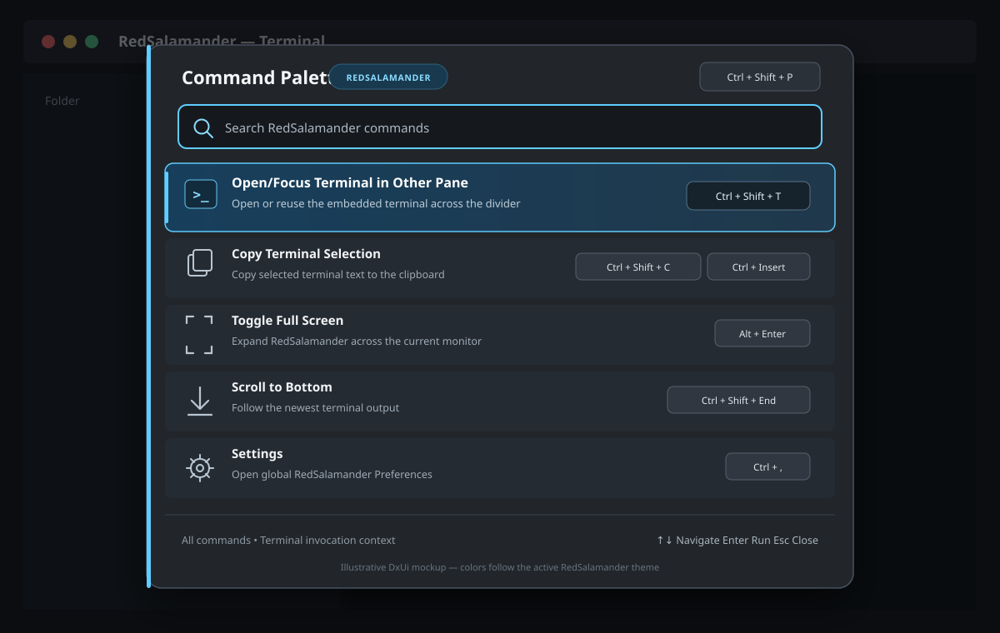

# Command, Menu, and Keyboard Specification

This document defines the canonical **command catalog** (`cmd/*`), the RedSalamander **main menu bar** structure, and **keyboard routing + shortcut defaults** for RedSalamander (main app) and RedSalamanderMonitor.

## Goals

- Provide a single source of truth for **commands**, **menus**, and **shortcuts** so `Specs/*` and implementation stay aligned.
- Make pane navigation and file operations fully usable from the keyboard.
- Preserve existing selection/navigation semantics (Arrow keys, Shift/Ctrl modifiers, Page Up/Down behavior).
- Provide a keyboard-driven **Function Bar** that reflects current shortcut configuration.
- Ensure all main-menu entries map to a stable command ID and a localized display name.

## Terminology

- **Focused pane**: the pane that contains the current keyboard focus (either its `NavigationView` or `FolderView`).
- **Active pane**: the pane targeted by “apply to active pane” commands when focus is not inside either pane (implementation uses `FolderWindow::_activePane` as fallback).
- **Target pane**: the pane a `cmd/pane/*` command is applied to for this invocation (resolved from focused/active pane rules or from an explicit Left/Right menu origin).
- **Current item**: the item with the caret in a `FolderView` (the one that moves with Arrow keys).
- **Selected items**: the multi-selection set.
- **Incremental search mode**: a transient mode within `FolderView` entered by the Quick Search command or by typing printable characters.
- **Shortcut chord**: a key + modifier set (Ctrl/Alt/Shift) bound to a command ID (e.g. `cmd/...`).

## Key Routing Model (Normative)

### Priority order

1. **Menu loop**: when the Win32 menu loop is active, it owns the keyboard until it exits.
2. **Configurable shortcuts**: `settings.shortcuts` bindings are evaluated (Function Bar + FolderView).
3. **Accelerators**: application accelerators (TranslateAccelerator) run next and send `WM_COMMAND`.
4. **Focused control handlers**: `FolderView`, `NavigationView` and any edit controls handle remaining messages.

When the **menu loop** is active, pressing `Tab` (or `Shift+Tab`) MUST exit menu mode and return focus to the active pane (or the previously focused pane control).
When the **menu loop** is active, pressing `Alt` or `F10` MUST exit menu mode and return focus to the active pane (or the previously focused pane control).

When an **edit control** is focused, the host MUST bypass (2) and (3) and MUST NOT execute application-level accelerators or configurable shortcut bindings (text-edit safety).

Within the DxUi menu loop, keyboard-owned top-level and cascading popups MUST follow standard Windows directional behavior:
- Opening a root popup or submenu from the keyboard MUST move the keyboard highlight to the first navigable item in that newly opened popup.
- `ContextMenu::Show(...)` is the single owner for active DxUi menu hover, keyboard highlight, invocation, dismissal, submenu, and root-switch state. Popup window procedures translate popup input into that router; the modal-loop pump dispatches popup traffic and may handle only non-popup/global coordination such as activation loss, menu-bar root switching, and submenu timers.
- Active DxUi menus must invalidate and repaint popup hover/keyboard changes through the normal popup `WM_PAINT` path while the menu loop is running. Popup invocation and dismissal must end the active menu loop from the popup message route itself, so selected commands return without an extra title-bar click or activation change.
- Delivered popup and owner mouse messages MUST use the message coordinate as the authoritative pointer location. Production input routing MUST NOT call `GetCursorPos()` or replace a delivered `WM_MOUSEMOVE`, button, or wheel point with the live cursor. `GetCursorPos()` is permitted only in diagnostic logging and selftest/repro harness code that records evidence; it must not affect hover, invocation, dismissal, root switching, stale classification, or repaint state. This preserves normal Win32 queue semantics when a captured popup receives a delayed message whose `lParam` no longer matches the current cursor position.
- The active menu loop MUST route non-popup owner/child `WM_MOUSEMOVE`, button, and wheel messages through the same menu input router instead of discarding them until another popup or title-bar message arrives. This is required for split-button menus, top menu-bar root switching, and embedded NavigationView dropdowns hosted in modeless windows such as Find.
- Root-switch duplicate suppression is part of the menu-loop contract: rejected owner mouse moves may record the delivered root-hover point, but rejected popup-captured moves outside the popup MUST NOT overwrite that point. A queued owner move that predates a keyboard root switch is consumed and recorded without switching back. After a pointer-driven root switch, later owner moves are accepted or rejected from delivered-message metadata such as message time/order, source hwnd, capture/menu ownership, root-switch generation, and delivered coordinates; they must not be compared with `GetCursorPos()`. These stale-message guards must not block a fresh owner move when no pointer-driven root switch has occurred.
- `Right` on a highlighted item with a submenu MUST open that submenu and move the keyboard highlight to its first navigable item.
- `Right` on a highlighted leaf item inside a top-level menu session MUST switch to the next enabled top-level menu and move the keyboard highlight to that popup's first navigable item.
- `Left` inside a submenu MUST close only the current submenu and restore the highlight to the parent item that opened it.
- `Left` in the root popup of a top-level menu session MUST switch to the previous enabled top-level menu and move the keyboard highlight to that popup's first navigable item.
- A stationary mouse pointer MUST NOT steal root switching or highlighted-item ownership from keyboard navigation; pointer-driven root switching and hover takeover require actual mouse movement.
- Opening a root popup by mouse MUST NOT synthesize a keyboard or hover selection from the checked item; checked, radio, and toggle state MUST be shown only by the item glyph until actual pointer movement or keyboard navigation selects an item.
- After a root popup is opened by mouse, keyboard navigation MUST be live immediately: arrow keys, mnemonics, `Enter`, and `Escape` MUST be processed and repainted without requiring any later mouse movement.
- When a submenu is already open and the pointer moves back onto the parent item that opened that submenu, the submenu MUST remain open and any pending child-close timer MUST be canceled.
- When a submenu is already open and the pointer settles on a different sibling item that does not keep that submenu active, the existing child submenu chain MUST close after the standard cascade hover delay unless a replacement submenu opens instead.
- During an active top-level menu session, moving the pointer directly from one enabled root menu item to another MUST immediately move the menu bar highlight to the hovered root, close the previous root popup, and open the target root popup without requiring the pointer to first enter an item inside the original popup. This applies in both directions and across non-adjacent roots, including `View` to `Files`.
- During an active top-level menu session, the menu bar's hover-changed signal MUST also be able to request that same root switch when the popup owns focus, so top-level hover movement is not lost just because mouse capture currently belongs to the popup window.
- Main menu root-switch code MUST treat any `MenuBar::GetItems()` span as invalid after rebuilding or resynchronizing the menu model. Diagnostics emitted after a root-switch rebuild must use a fresh menu-bar item span, not a label/view captured before `SyncMenuModel()`.
- During an active top-level menu session, the menu bar highlight MUST stay on the root menu whose popup is currently open, including while focus is held by the popup window. A stale hover from the cursor's pre-existing position MUST NOT leave a previous top-level item highlighted after another root popup opens.
- Exiting a DxUi top-level menu session without transferring focus to another control MUST restore keyboard focus to the pane/control that owned focus before menu mode started.
- Pressing `Escape` while a top-level menu bar, menu popup, or pane-owned context menu has keyboard ownership MUST dismiss that transient UI first, then restore keyboard focus to the active pane's `FolderView` unless the chosen command intentionally opens another focus-owning surface.

### Transient Overlay Routing

App-owned DxUi transient overlays such as alert/help messages MUST be real input-routing windows while visible. They MUST NOT rely on `WM_PAINT`, `UpdateWindow`, pointer movement, title-bar activation, or owner-window messages to make hover, close, button, or keyboard dismissal become active.

- Overlay hit geometry for close glyphs and buttons MUST be prepared synchronously before the first visible frame and before the first possible pointer hit test.
- Pointer actions MUST use normal press/release semantics with capture for clickable overlay parts, and the action MUST run from the overlay's own delivered mouse messages.
- The first click after an overlay gains activation MUST still be actionable. If activation or OS routing causes a clickable release to arrive without a matching local press, releasing over the close glyph MUST close the overlay instead of waiting for later mouse movement, title-bar focus changes, or owner-window traffic.
- `Escape` MUST close a keyboard-owned modal overlay immediately and restore the intended previous focus target.
- Keyboard dismissal and focus reclaim MUST include owned top-level overlay popups as well as child windows of the owner root.
- If a custom overlay surface needs shaped or translucent visuals, the implementation must still preserve reliable Win32 pointer delivery; child layered windows are not acceptable when they drop real `SendInput`/mouse traffic or delay delivery until unrelated owner messages arrive.
- Owned top-level modal overlays that draw a translucent scrim MUST compose that scrim over a captured owner/screen backdrop, or an equivalent live composition surface, before the first visible paint. Anchored window overlays should prefer an owner/anchor render capture before falling back to screen capture so another desktop surface cannot turn the modal backdrop black or leave it missing. They MUST NOT draw a semi-transparent scrim over an uninitialized or black top-level HWND surface.
- Regression coverage for overlay input MUST deliver the close path's normal mouse messages and MUST prove no title-bar movement or extra activation message is needed.
- Every popup/overlay destroy path MUST cancel pending timers, detach its `WindowHost`, clear `GWLP_USERDATA` on `WM_NCDESTROY`, and forget stale `HWND` values so no dead window can keep receiving routed menu or graphics messages.
- Passive no-activate status overlays may consume a primary press/release only when the press begins on their visible surface. They MUST preserve focus and activation, route transparent gutters/corners through, cancel capture on outside release or `WM_CANCELMODE`, and clear every retained control/HWND view during owner-driven `WM_NCDESTROY`.

### Scope and focus

- Outside explicit child-window focus (edit controls, open dropdowns, or the Win32 menu loop), the active pane’s `FolderView` is the default keyboard owner.
- When the application or `FolderWindow` regains focus and no child window already has an intentional keyboard claim, the host MUST restore keyboard focus to the active pane’s most recent pane child; if none, restore the active pane’s `FolderView`.
- Shortcuts that target “the active pane” MUST resolve to the **focused pane** when focus is inside a pane; otherwise use the **active pane**.
- Shortcuts that act on file selection MUST prefer `Selected items`; if none are selected, they act on the `Current item` (and MAY implicitly select it for the operation).
- While an **edit control** is active (NavigationView address edit, rename edit, dialogs), the edit control owns the keyboard: application-level accelerators and configurable shortcut bindings MUST NOT execute (text-edit safety).
- Standard text-edit commands remain local to the control, including `Ctrl+Backspace` deleting the previous word/segment instead of invoking any pane/app shortcut.
- Mouse interaction with passive pane chrome MUST NOT permanently move keyboard focus away from the pane’s `FolderView`; only explicit keyboard entry into `NavigationView`, entering an edit control, or opening a keyboard-owned popup may take focus.
- `Escape` is the focus-reclaim key for the main file-manager window. If keyboard focus is in main-window chrome or transient menu UI instead of a `FolderView`, the first `Escape` MUST move focus to the active pane's `FolderView` and MUST NOT clear the pane selection. If focus is already inside the `FolderView`, the existing `FolderView` `Escape` behavior applies (for example, cancel incremental search or clear selection).
- `NavigationView` edit, suggestion, history, drive/menu, and full-path popup states MAY handle `Escape` locally, but their completed cancel/dismiss path MUST end with focus returned to the owning pane's `FolderView`.

### Command resolution (normative)

- **Shortcuts** and **menu items** map to commands identified by stable IDs (example shape: `cmd/...`).
- Command IDs MUST be in one of these namespaces:
  - `cmd/app/*`: application-global commands.
  - `cmd/pane/*`: pane-targeted commands; these MUST resolve to the **focused pane** when focus is inside a pane, otherwise the **active pane** (see rules above).
  - `cmd/shortcut/unassigned`: internal shortcut binding sentinel used only to persist an intentionally unassigned chord.
- Command display names MUST be localized resource strings (`.rc` STRINGTABLE). UI (Function Bar, settings dialog, tooltips) MUST NOT hardcode user-facing command names.
- A shortcut bound to `cmd/shortcut/unassigned` MUST consume the matching key and perform no action. It MUST NOT be registered or displayed as an assignable command, MUST NOT appear in command reverse-lookup results, and MUST NOT show a not-implemented alert.
- If a shortcut is bound to a command that is not implemented at runtime, invoking it MUST show a localized message box stating it is not yet implemented and MUST do nothing else.
- Some commands/menu entries are **parameterized** (drive roots, hot paths, history paths, plugin/theme entries). For shortcuts the parameter is encoded in the command ID (e.g. `cmd/pane/goDriveRoot/C`, `cmd/pane/hotPath/1`) and is canonicalized for display/lookup; for menus the parameter is carried by dynamic menu-item ranges/payloads (or encoded in a command ID suffix for shortcut-like commands).

### Shortcut And Link Target Navigation

`cmd/pane/goToShortcutOrLinkTarget` operates on the target pane's current item. It is implemented for the built-in local file system when the current item is a `.lnk`, a `.url` whose URL resolves to a local path, a junction, a mount point, or a directory symbolic link.

- A target directory opens directly in the same pane.
- A target file opens its parent folder and restores focus to the target file when it is visible.
- Broken links, missing targets, non-local `.url` targets, unsupported reparse tags, and unsupported file-system plugins keep the pane in place and show localized pane feedback.
- The command records `shell.go_to_shortcut_target_us` in command selftests so shortcut resolution and navigation cost stay visible.

### Terminal surfaces

`cmd/pane/openCommandShell` (`Alt+7`) is the Left/Right **Terminal Pane**
command. It opens or reuses the built-in `builtin/terminal` plugin in the
physical pane opposite the focused source pane.

The generic shortcut resolves its source from focused/active-pane rules. The
named Left and Right menu entries are different dispatch sites: each passes its
menu owner pane explicitly, so opening **Left > Terminal Pane** still uses Left
as the source even when keyboard focus is in Right (and vice versa).

`cmd/terminal/openFloatingWindow` (`Ctrl+Alt+T`) is the Commands > Terminal >
**Command Shell Window** command. It opens or reuses the singleton floating
Terminal window at the focused pane folder. The two commands retain distinct
stable IDs and never redirect one surface through the other.
The floating opener must be enabled from a supported file pane before any
terminal exists; terminal-child focus is not an enablement prerequisite.

The Terminal session menu may offer **Command Shell Window** and re-enters this
same canonical host command dispatcher. Selecting it MUST create or reuse the
floating Terminal at the embedded Terminal's recorded source location; it must
not fall through as an unhandled terminal-plugin action or use the folder hidden
underneath the Terminal's host pane.

Shortcut migration is versioned in `shortcuts.migrationVersion`. Version 1
rewrites only a legacy default `Ctrl+Alt+T` + `cmd/pane/openCommandShell`
binding to `cmd/terminal/openFloatingWindow`, then records the version. A user
who later rebinds `Ctrl+Alt+T` to the embedded Terminal Pane keeps that choice
on subsequent initialization.

Windows local/UNC paths open the configured PowerShell/cmd profile;
`\\wsl.localhost\Distro\...` and `\\wsl$\Distro\...` open that distribution
through `wsl.exe --cd`. The legacy external Windows Terminal/cmd launch path is
retained only as a selftest-injected compatibility seam and is not normal
embedded-pane dispatch.

### Shell New Templates

`cmd/pane/newFromShellTemplate` is the stable command family for entries under **Files -> New** after **Folder**. The menu is populated at popup time from the Windows ShellNew registry view for local built-in file-system folders. The dynamic menu item carries the same template id that can be used by shortcuts as `cmd/pane/newFromShellTemplate/<templateId>`.

- Template ids are stable, sanitized ids derived from the extension and ShellNew template kind.
- The implementation supports ShellNew `NullFile`, `Data`, and `FileName` templates. ShellNew `Command` entries are intentionally not invoked by this safe implementation.
- Choosing a template prompts for the new file name in the current folder, prefilled with the template default name. The same filename validation rules used by Edit New apply.
- On success, the command creates the file, refreshes the pane, and focuses the created item when it is visible.
- If no local folder is active, no templates are available, a direct template id is stale, or creation fails, the pane remains in place and shows localized feedback.
- The command records `shellnew.enumerate_us`, `shellnew.menu_populate_us`, `shellnew.create_us`, and `shellnew.feedback_us` in command selftests.

### Clipboard File Commands

Routine accepted-default Copy/Move commands start the common File Operations Preparing lifecycle
without a generic OK/Cancel prompt. This applies to F5/F6 other-pane transfer, destination-picker
transfer, clipboard paste, and internal drag/drop. An ingress that explicitly requests confirmation, a known Copy-only Move,
permanent Delete, or an existing exact artifact/risk gate retains its owning decision surface. This
contract does not add a separate **with options** command; that remains future work.

`cmd/pane/clipboardCopy`, `cmd/pane/clipboardCut`, `cmd/pane/clipboardPaste`, and `cmd/pane/clipboardPasteShortcut` share the standard Windows file-drop clipboard contract for local built-in file-system paths.

- Text edit controls keep ownership of ordinary text clipboard commands. When a navigation edit owns focus, `Ctrl+C`, `Ctrl+X`, and `Ctrl+V` MUST copy, cut, and paste text in that edit control before pane file commands are considered.
- `cmd/pane/clipboardCopy` writes selected or focused local file-system items as `CF_HDROP` with Preferred DropEffect `DROPEFFECT_COPY`.
- `cmd/pane/clipboardCut` writes selected or focused local file-system items as `CF_HDROP` with Preferred DropEffect `DROPEFFECT_MOVE`. It does not delete or move files immediately.
- `cmd/pane/clipboardPaste` reads clipboard file-drop paths and the shell `Preferred DropEffect`. A `DROPEFFECT_MOVE` preference MUST move the source paths into the current local folder through the file-operation move path; `DROPEFFECT_COPY`, missing metadata, or unsupported metadata MUST copy through the file-operation copy path. Routine Ctrl+X then Ctrl+V publishes one Move task without a generic confirmation. The worker must complete common preparation and its pre-consumption decision before the UI-owned exact-sequence consumer clears the cut list; mutation cannot begin until that one-shot consumption succeeds. The source and destination panes must refresh through the normal file-operation/cache notification path after an accepted move.
- `cmd/pane/clipboardPasteShortcut` reads clipboard file-drop paths and creates `.lnk` shortcuts in the current local folder. Shortcut names MUST be unique in the destination folder, the pane MUST refresh after creation, and the last created shortcut SHOULD become the focused item when visible.
- Copy-as-text commands (`cmd/pane/copyPathAndNameAsText`, `cmd/pane/copyNameAsText`, `cmd/pane/copyPathAsText`, and `cmd/pane/copyUncPathAndNameAsText`) write `CF_UNICODETEXT` for the selected items, or the focused item when nothing is selected. Clipboard writes MUST tolerate short-lived clipboard contention by retrying `OpenClipboard(...)` for a bounded period before showing localized pane feedback. The retry loop MUST NOT translate, dispatch, or remove arbitrary UI messages while waiting, because that can reenter command handlers while clipboard ownership state is incomplete.
- Unsupported providers, empty selections, clipboard contents without file paths, and shortcut creation failures keep the pane in place and show localized pane feedback instead of falling through to a generic not-implemented command.
- Command selftests MUST keep correctness and responsiveness visible with `clipboard.cut_us`, `clipboard.paste_shortcut_us`, and `clipboard.feedback_us` metrics. `cmd_pane_clipboardPaste_uses_preferred_move_effect` covers the real `cmd/pane/clipboardPaste` dispatch using `CF_HDROP` plus `Preferred DropEffect = DROPEFFECT_MOVE` so Ctrl+X then Ctrl+V moves instead of copying, invokes no generic confirmation, consumes the cut sequence after preparation, and does not admit a duplicate Move.

### Quick Search

`cmd/pane/quickSearch` activates the target pane's integrated incremental search mode. It is not the persistent filter bar and is unrelated to Terminal insertion commands.

- Invoking the command focuses the target pane's `FolderView`, enters search mode, clears any previous quick-search query, and shows the transient search indicator.
- Printable typing appends to the query, including Space for filenames that contain spaces. Space remains text while Quick Search is active even though the same key is normally the FolderView selection/size shortcut. Matching is case-insensitive.
- The initial focused item prefers the first item whose name starts with the query. If no prefix match exists, the first item containing the query is focused.
- Rendering highlights the matching range for every visible item whose name contains the query.
- `Up`/`Left` and `Down`/`Right` navigate through all matching items in folder order while search mode is active.
- `Escape` exits search mode and clears the query. `Enter` exits search mode and activates the current focused item.
- No-match state remains non-modal: the query stays visible in the transient indicator and focus remains in the folder view.
- Command selftests MUST keep responsiveness visible with `quicksearch.activate_us`, `quicksearch.update_us`, `quicksearch.navigate_us`, and `render.incremental_search_effect_updates` metrics.

### Pane View Options

Pane view option commands target the focused pane, or the active pane when focus is outside both panes, unless a left/right menu item names a pane explicitly.

- `cmd/pane/viewOptions/toggleFileExtensions` toggles extension display in the target pane only. This is display-only: file operations, command-line insertion, clipboard actions, and plugin calls continue to use real item names and full paths.
- `cmd/pane/viewOptions/toggleThumbnails` is a legacy command id that selects the exclusive Thumbnails display mode in the target pane. The pane switches away from Brief/Detailed/Extra Detailed, uses larger DPI-aware item visuals, schedules bounded asynchronous thumbnail work for visible items, uses shell thumbnails when available, and renders the normal file/folder icon as fallback without blocking navigation. Repeating the command leaves the pane in Thumbnails; selecting another display mode leaves thumbnail mode and cancels stale work.
- `cmd/pane/viewOptions/togglePreviewPane` toggles preview mode for the active source pane and hosts the preview in the opposite pane. Opening preview shows compact themed DxUi Folder/Preview tabs at the top of the host pane, selects Preview, hides that pane's folder view while Preview is selected, and updates the embedded viewer preview when the source pane current item or path changes. Selection-only changes update selection/status/command state but MUST NOT reload an unchanged current-item preview. The tabs must behave as real pointer targets without stealing keyboard focus from the source pane. Preview tabs use attached, Visual Studio-like chrome: inactive tabs have no border, selected tabs blend into the pane below with square lower corners, the Folder tab tooltip displays the host pane path after the standard hover delay, and the Preview tab close glyph is visible when Preview is selected or hovered and closes preview mode. Preview resolves the configured viewer plugin for the current item and uses it when the plugin supports embedded hosting; when saved viewer associations are missing or only resolve the default text viewer, preview uses the built-in embedded viewer defaults only when they produce a specific embedded-capable match. If no specific embedded preview is available, or if opening the selected embedded viewer fails, Preview falls back to a compact, scrollable current file/folder Properties card view from the active file system before showing any localized unsupported fallback. The Properties card view uses DxUi cards, wraps long values, shows a vertical scrollbar only when needed, preserves the normalized Properties text for debug/copy parity, and adds restrained rainbow section-header accents in Rainbow theme while respecting high-contrast colors. If a current-item change resolves to the same embedded viewer plugin already hosted by Preview, the host reuses that viewer instance and refreshes it with the new open context; a successful refresh MUST retain the already ownership-marked root and create zero new direct children. An added or replacement root rejects same-instance reuse, is hidden before `Close()`, and forces a fresh instance open. The host otherwise replaces the preview window only when resolution chooses a different plugin or refresh fails. During replacement, a hidden asynchronously retiring viewer child may coexist temporarily with the new child. The host MUST mark pre-open direct children with a per-attempt window property so destruction and numeric HWND reuse cannot alias old identity, require exactly one unmarked direct child after a replacement `Open()`, hide every new child before `Close()` when cardinality is zero or multiple, and bind the accepted root to its `ViewerInstance` with a separate ownership property. Layout, hide, and marker removal MUST validate both the expected preview parent and that instance property. Only the validated active child may be sized or shown, sibling z-order MUST remain unchanged, and every retiring child must remain own-style-hidden until its plug-in cleanup destroys it. Embedded preview viewers and default Properties preview scrolling MUST NOT take keyboard focus from the source pane. Embedded media preview, including audio-only ViewerVLC files and visualizer-capable player paths, MUST keep playback and media output inside the preview host and MUST NOT create unowned/top-level player or visualization windows; standalone viewer windows may keep normal visualizer behavior. Menu-bearing embedded viewers expose only Preview-appropriate actions from their right-click context menus; standalone-only commands such as Exit, Open, and internal other-file navigation are omitted, empty groups are trimmed, and viewer shortcut labels are not shown because shortcuts still belong to the source pane. Closing or replacing an embedded viewer persists changed plugin configuration, including ViewerVLC volume/mute state, and preview resolution/fallback choices are logged for monitor diagnostics. Switching back to Folder keeps preview mode open with the host folder view visible. Closing preview removes the tabs and restores the host pane. The preview area extends to the function bar, or to the bottom of the window when the function bar is hidden.
- `cmd/pane/viewOptions/toggleFilterBar` toggles a persistent themed DxUi filter bar for the target pane. The bar is a compact inline version of the `cmd/pane/filter` workflow with an editable filter-history combo and a right-side Use Filter toggle; the combo placeholder/accessibility name supplies the Filter label, so no separate static Filter label is shown. Typing applies the filter live without automatically opening the history dropdown, Enter/history selection saves to `selectionMasks.filterHistory`, and turning the toggle off keeps the text while disabling filtering. It follows restored per-history filters and never replaces Quick Search.
- `cmd/pane/viewOptions/toggleNavigationBar` toggles the target pane navigation/address bar. Left/right menu entries target their named pane; shortcut routing targets the active pane. Commands that focus the address bar MUST show the bar first, then focus the address edit.
- `cmd/pane/viewOptions/toggleStatusBar` routes shortcut invocation to the active pane and shares the existing left/right `Show` menu status-bar implementation.
- These visibility states are persisted per pane through `folders.items[].view.*` settings and MUST keep menu check marks synchronized with the current pane state.
- Command selftests MUST keep correctness and responsiveness visible for setting round-trip, menu labels, active/explicit pane routing, focus fallback, restored filters, and pane-view-option toggle latency.

### Embedded Terminal Insertion

- `Ctrl+Enter` retains stable id `cmd/pane/bringFilenameToCommandLine`, now
  labelled **Insert Focused Item in Terminal**. It acts on the focused item
  only, opens or reuses the selected opposite-pane Terminal, inserts the
  shell-quoted leaf only when the plugin has authenticated an idle PowerShell
  prompt whose live cwd equals the item parent. Unknown, stale, cmd, WSL, busy,
  or different-cwd state falls back to the full native path. It never sends
  Enter and never infers cwd from terminal text.
- `Ctrl+Shift+Enter` dispatches `cmd/pane/bringFullPathToTerminal`, acts on the
  focused item only, always inserts the shell-quoted full native path, and never
  sends Enter.
- `Ctrl+Space` and its existing `Ctrl+Shift+Space` alias retain stable id
  `cmd/pane/bringCurrentDirToCommandLine`, now labelled **Insert Current
  Directory in Terminal**. They open or reuse the opposite-pane terminal and
  insert the source pane's full current directory without sending Enter.
- The former bottom pseudo command-line control and its `cmd.exe /C` execution
  path have been removed; these stable command IDs have no fallback outside
  `Terminal.dll`.
- Folder Edit/F4 opens the focused directory in a Terminal tab in the opposite
  pane. File Edit retains normal editor resolution.
- Terminal insertion metrics are `terminal.insert_context_path_us`,
  `terminal.insert_full_path_us`, and `terminal.insert_current_dir_us`;
  lifecycle coverage must also prove reuse, authenticated follow, and a
  synchronous quiet close.

### Reread Associations

`cmd/app/rereadAssociations` reloads settings-backed associations and action menus on demand without restarting the application.

- The command is application-scoped and is available from **Commands -> Reread Associations**.
- It reads the current settings file through the non-destructive hot-reload path. Invalid JSON, unsupported schema, or unreadable settings keep the current runtime settings in place and show the localized invalid-reload alert.
- Disk settings are authoritative for `fileActions` viewer/editor actions and associations, User Menu actions, file-system extension mappings, plugin settings, shortcuts, and other persisted preference sections, but current pane folders and already-open window placement are preserved.
- After a successful reload, the app rebuilds dynamic View With, Edit With, User Menu, ShellNew, and file-system-plugin menus, clears normal and association icon caches before pane refresh can repopulate them, refreshes both panes, preserves the active pane, and notifies settings-reload participants.
- Stale dynamic menu ids from before the reload MUST NOT launch old actions after the menus are rebuilt.
- Command selftests MUST keep correctness and responsiveness visible with `rereadAssociations.total_us`, menu-rebuild assertions, pane-refresh assertions, icon-association cache clearing sampled immediately after the clear, and preserved live pane paths.

### Make File List

`cmd/pane/makeFileList` opens a pane-scoped options dialog that generates a list from the focused pane.

- The command is available for local file-system folders. Unsupported providers keep the pane in place and show localized pane feedback.
- Source options are selected/focused items or the current folder. When no item is selected, the focused item is used. Current-folder mode enumerates the active folder contents.
- The recursive option descends into folders. `includeDirectories` controls whether directory rows appear in the generated list.
- Output formats are JSON, CSV, and text. JSON and CSV use the selected field flags (`includeName`, `includeFullPath`, `includeSize`, `includeModified`, and `includeAttributes`). Text uses `textMacro`.
- Text macros are case-insensitive and include `{filename}`, `{name}`, `{fullPath}`, `{path}`, `{size}`, `{modified}`, `{attributes}`, and `{isDirectory}`. `{{` and `}}` emit literal braces.
- Output targets are the clipboard or a UTF-8 file. File output requires a non-empty output path.
- Generated entries are deterministic and sorted by full path. CSV quotes commas, quotes, and newlines. JSON includes `format`, `count`, and `entries`.
- The last selected options are persisted in `settings.makeFileList`.
- Command selftests MUST keep correctness and responsiveness visible with `makeFileList.collect_us`, `makeFileList.generate_us`, `makeFileList.output_us`, `makeFileList.total_us`, and an archived JSON/CSV/text output artifact set.

### List Opened Files

`cmd/pane/listOpenedFiles` opens a modeless application dialog listing files RedSalamander currently has open.

- The command is available from **Commands -> List of Opened Files** and defaults to `Alt+F11`.
- Rows include internal viewer windows, external viewer/editor launches started by View/Edit/User Menu action plumbing, and the active Preview pane item.
- Each row shows the display file name, source (`Viewer`, `Editor`, or `Preview Pane`), opener/action name when known, and the full path.
- External process rows with captured handles are pruned once the process exits. Viewer rows are removed when their viewer window closes. Preview rows follow the current preview item and disappear when Preview is closed.
- When no rows exist, the dialog remains visible and shows a localized empty state.
- Double-click and **Focus** navigate the owning pane to the row path when the item is still reachable, then focus/select it in the folder view.
- The dialog MUST be a modeless DxUi-hosted app window, inherit the active app theme and themed window chrome, and avoid visible native dialog-template controls in DxUi mode.
- Command selftests MUST keep correctness and responsiveness visible with themed DxUi-host coverage, viewer/editor/preview source coverage, closed-process pruning, focus navigation, `listOpenedFiles.open_us`, and an archived `list_opened_files_metrics.json` artifact.

### Shared Directories

`cmd/pane/shares` opens a modeless application dialog listing local Windows disk shares from the focused pane context.

- The command is available from **Commands -> Shared Directories** and defaults to `Ctrl+Shift+F9`.
- Rows are sorted by share name and show share name, local path, share type, and remark.
- Only disk-tree shares are listed. Reachable local paths enable **Open Path**; unreachable paths stay visible but cannot be opened.
- **Open Path** switches the target pane to the built-in local file-system provider if needed, then navigates to the selected share's local path.
- **Manage** launches the Windows Shared Folders management console. Launch failure shows localized nonfatal pane feedback.
- Access denied while enumerating shares keeps the dialog open, clears stale rows, and shows a localized access-denied empty/error state.
- The dialog MUST be a modeless DxUi-hosted app window, inherit the active app theme and themed window chrome, and avoid visible native dialog-template controls in DxUi mode.
- Command selftests MUST keep correctness and responsiveness visible with synthetic provider rows, sorted display, open-path navigation, access-denied state coverage, `sharedDirectories.open_us`, and an archived `shared_directories_metrics.json` artifact.

### Archive Pack And Unpack

`cmd/pane/pack` creates an archive from the active pane selection. `cmd/pane/unpack` extracts selected or focused ZIP archives to a destination selected in the app-owned Unpack prompt.

- Both commands are available only from local file-system folders. Unsupported providers keep the pane in place and show localized pane feedback.
- Pack uses selected items, or the focused item when nothing is selected. The built-in `ZIP (Plugin)` packer writes a deterministic stored ZIP archive. Directory entries use `/` separators, selected empty directories are preserved, and entries are sorted by archive path.
- In interactive use, Pack MUST use the app-owned DxUi Pack prompt rather than the stock save-file dialog. The prompt MUST suggest a non-conflicting archive path in the current folder, MUST list ZIP plus update-capable formats discovered from the bundled `7zip.dll`, and MUST update the suggested archive extension when the selected packer changes.
- When a 7-Zip packer is selected, Pack creates the archive through `IOutArchive::UpdateItems`. The delete-after-packing option MUST be off by default and MUST remove selected local sources only after archive creation succeeds and after the user accepts the permanent-delete confirmation prompt.
- Test/debug automation may supply a ZIP path and overwrite policy directly.
- Unpack supports stored ZIP entries through the built-in reader and delegates compressed ZIP entries, 7-Zip archives, and other formats supported by the bundled `7zip.dll` to the 7-Zip extraction path while preserving the same destination, overwrite, mask, and safe-entry-path contract. Unsupported/encrypted methods fail with localized pane feedback.
- Unpack MUST reject archives whose declared or observed decompressed payload exceeds 4 GiB for a single entry or 8 GiB total for the selected extraction set. Built-in ZIP central-directory validation and the 7-Zip extraction path both fail this case with `ERROR_FILE_TOO_LARGE`, before committing any oversized output file.
- Stored ZIP filename decoding MUST honor the UTF-8 general-purpose bit and otherwise use CP437 for legacy ZIP names. Compressed ZIP filename decoding is delegated to the bundled 7-Zip path.
- In interactive use, Unpack MUST use the app-owned DxUi Unpack prompt rather than the stock pick-folder dialog. The prompt MUST suggest a non-conflicting destination folder derived from the focused archive name, MUST expose the currently supported `ZIP (Plugin)` unpacker, MUST default the file mask to `*.*`, MUST show mask syntax help from the shared wildcard-mask contract, and MUST leave delete-after-unpacking off by default.
- The Unpack file mask uses the same wildcard syntax as Select/Unselect and pane Filter. `*.*`, `*`, or an empty mask extracts all safe entries. Other masks match either the archive entry path or the entry filename; unmatched files and empty directory entries are skipped.
- When enabled, delete-after-unpacking MUST remove the selected archive files only after extraction succeeds and after the user accepts the permanent-delete confirmation prompt.
- Test/debug automation may supply the destination and overwrite policy directly.
- Existing archive outputs or extracted files are preserved when overwrite is disabled. Failures report the relevant HRESULT and do not fall through to the generic "not implemented" message.
- Command selftests MUST keep correctness and responsiveness visible with Pack prompt coverage, Unpack prompt/mask/delete-after coverage, 7z creation coverage, stored-ZIP round-trip coverage, compressed-ZIP extraction coverage, CP437 non-ASCII filename coverage, decompressed-size rejection coverage, overwrite validation, invalid destination/path validation, unsupported-provider feedback, `archive.pack_us`, `archive.unpack_us`, `archive.feedback_us`, and an archived `archive_commands_metrics.json` artifact.

### Canonical Command IDs

This section is the single source of truth for the command ID catalog.

**Application commands (`cmd/app/*`)**
- `cmd/app/about`
- `cmd/app/exit`
- `cmd/app/externalHelp`
- `cmd/app/openLeftDriveMenu`
- `cmd/app/openRightDriveMenu`
- `cmd/app/compare`
- `cmd/app/fullScreen`
- `cmd/app/openFileExplorerKnownFolder` *(registered parameterized family; current resource menus still dispatch pane-specific `WM_COMMAND` IDs)*
- `cmd/app/preferences`
- `cmd/app/showShortcuts`
- `cmd/app/swapPanes`
- `cmd/app/toggleFunctionBar`
- `cmd/app/toggleMenuBar`
- `cmd/app/viewWidth`
- `cmd/app/rereadAssociations`
- `cmd/app/theme/select` *(parameterized: themeId)*
- `cmd/app/theme/selectNext`
- `cmd/app/theme/selectPrev`
- `cmd/app/theme/systemHighContrastIndicator`
- `cmd/app/plugins/manage`
- `cmd/app/plugins/toggleEnabled` *(registered parameterized family; no generic menu dispatch is currently exposed)*
- `cmd/app/plugins/configure` *(registered parameterized family; no generic menu dispatch is currently exposed)*

**Pane commands (`cmd/pane/*`)**
- `cmd/pane/historyBack`
- `cmd/pane/historyForward`
- `cmd/pane/goDriveRoot` *(parameterized: driveLetter)*
- `cmd/pane/hotPath` *(parameterized: digit `1..9` and `0` for slot 10)*
- `cmd/pane/setHotPath` *(parameterized: digit `1..9` and `0` for slot 10)*
- `cmd/pane/goRootDirectory`
- `cmd/pane/setPathFromOtherPane`
- `cmd/pane/navigatePath` *(registered parameterized family; current navigation routes remain owned by NavigationView and pane-specific commands)*
- `cmd/pane/selectFileSystemPlugin` *(parameterized: pluginId)*
- `cmd/pane/bringCurrentDirToCommandLine`
- `cmd/pane/bringFilenameToCommandLine`
- `cmd/pane/bringFullPathToTerminal`
- `cmd/pane/clipboardCut`
- `cmd/pane/clipboardCopy`
- `cmd/pane/clipboardPaste`
- `cmd/pane/clipboardPasteShortcut`
- `cmd/pane/copyNameAsText`
- `cmd/pane/copyUncPathAndNameAsText`
- `cmd/pane/copyPathAndNameAsText`
- `cmd/pane/copyPathAsText`
- `cmd/pane/executeOpen`
- `cmd/pane/moveToRecycleBin`
- `cmd/pane/openCurrentFolder`
- `cmd/pane/openProperties`
- `cmd/pane/openSecurity`
- `cmd/pane/quickSearch`
- `cmd/pane/selectCalculateDirectorySizeNext`
- `cmd/pane/selectNext`
- `cmd/pane/switchPaneFocus`
- `cmd/pane/upOneDirectory`
- `cmd/pane/windowMenu`
- `cmd/pane/alternateView`
- `cmd/pane/changeAttributes`
- `cmd/pane/changeCase`
- `cmd/pane/changeDirectory`
- `cmd/pane/connect`
- `cmd/pane/contextMenu`
- `cmd/pane/contextMenuCurrentDirectory`
- `cmd/pane/disconnect`
- `cmd/pane/edit`
- `cmd/pane/editWith` *(parameterized: editorId)*
- `cmd/pane/editNew`
- `cmd/pane/alternateEdit`
- `cmd/pane/filter`
- `cmd/pane/find`
- `cmd/pane/hotPaths`
- `cmd/pane/hotPath` *(parameterized: digit `1..9` and `0`)*
- `cmd/pane/setHotPath` *(parameterized: digit `1..9` and `0`)*
- `cmd/pane/listOpenedFiles`
- `cmd/pane/showFoldersHistory`
- `cmd/pane/makeFileList`
- `cmd/pane/menu`
- `cmd/pane/pack`
- `cmd/pane/permanentDelete`
- `cmd/pane/refresh`
- `cmd/pane/shares`
- `cmd/pane/unpack`
- `cmd/pane/userMenu`
- `cmd/pane/zoomPanel`
- `cmd/pane/copyToOtherPane`
- `cmd/pane/copyToOtherPaneWithOptions`
- `cmd/pane/createDirectory`
- `cmd/pane/delete`
- `cmd/pane/display/brief`
- `cmd/pane/display/detailed`
- `cmd/pane/display/extraDetailed`
- `cmd/pane/moveToOtherPane`
- `cmd/pane/moveToOtherPaneWithOptions`
- `cmd/pane/rename`
- `cmd/pane/sort/none`
- `cmd/pane/sort/attributes`
- `cmd/pane/sort/extension`
- `cmd/pane/sort/name`
- `cmd/pane/sort/size`
- `cmd/pane/sort/time`
- `cmd/pane/view`
- `cmd/pane/viewWith` *(parameterized: viewerId)*
- `cmd/pane/viewSpace`
- `cmd/pane/newFromShellTemplate` *(parameterized: templateId)*
- `cmd/pane/selection/selectDialog`
- `cmd/pane/selection/unselectDialog`
- `cmd/pane/selection/invert`
- `cmd/pane/selection/selectAll`
- `cmd/pane/selection/unselectAll`
- `cmd/pane/selection/restore`
- `cmd/pane/selection/save`
- `cmd/pane/selection/selectSameExtension`
- `cmd/pane/selection/unselectSameExtension`
- `cmd/pane/selection/selectSameName`
- `cmd/pane/selection/unselectSameName`
- `cmd/pane/selection/hideSelectedNames`
- `cmd/pane/selection/hideUnselectedNames`
- `cmd/pane/selection/showHiddenNames`
- `cmd/pane/selection/goToPreviousSelectedName`
- `cmd/pane/selection/goToNextSelectedName`
- `cmd/pane/goToShortcutOrLinkTarget`
- `cmd/pane/openCommandShell`
- `cmd/pane/viewOptions/toggleHiddenFiles`
- `cmd/pane/viewOptions/toggleSystemFiles`
- `cmd/pane/viewOptions/toggleFileExtensions`
- `cmd/pane/viewOptions/toggleThumbnails`
- `cmd/pane/viewOptions/togglePreviewPane`
- `cmd/pane/viewOptions/toggleFilterBar`
- `cmd/pane/viewOptions/toggleNavigationBar`
- `cmd/pane/viewOptions/toggleStatusBar`

## Main Menu Bar Contract

### Requirements (Normative)

- The menu bar structure and static labels MUST be defined in `.rc` resources (`RedSalamander/RedSalamander.rc`) to support localization (see `Specs/Core/Core_Localization.md`).
- Each menu item that triggers application behavior MUST map to a `cmd/*` command ID (shown in brackets below).
  - If the menu item is dynamic and requires a parameter (history path, hot path, plugin ID, theme ID), the menu item MUST still map to a stable `cmd/*` command ID; the parameter is carried in the menu item payload.
- Dynamic popup roots MUST be discovered through a command marker owned by that popup, never by the position of an adjacent static command. In particular, **Files -> New** uses `IDM_PANE_NEW_TEMPLATE_BASE` and **Commands -> User Menu** uses `IDM_PANE_USER_MENU_BASE` as their resource-time empty markers before runtime population.
- The displayed shortcut text (when present) MUST reflect the effective current bindings (default or user-customized).
- Top-level menu order MUST be:
  - `Left`, `Files`, `Edit`, `Commands`, `Plugins`, `View`, `Right`, `Help`
- `Help` MUST be right-justified (appear at the right edge of the menu bar).

### Debug Self-Test Contract

- The default Commands self-test suite MUST prefer deterministic, local-only scenarios over environment-dependent integration.
- Command registry coverage MUST validate canonical command IDs only; removed command IDs are not preserved as aliases.
- Shortcut-default coverage MUST assert fixed high-value bindings directly, including the full `Insert` row for copy/paste/copy-as-text commands, the `Ctrl+F2..F6` sort bindings, `Ctrl+F` for Find Files and Directories, `Ctrl+Shift+J` for Show File Operations, `Alt+7` for Terminal Pane, and `Ctrl+Alt+T` for Command Shell Window.
- Menu-contract coverage MUST assert the `Edit` menu copy-text group order, labels, separator boundaries, and text-only icon policy.
- Command behavior coverage for copy-text commands MUST run in a temp local folder with clipboard assertions and MUST stay separate from selection save/restore scenarios.
- The global dispatch smoke test remains a smoke test: it verifies that commands do not wedge the UI or leak transient windows, but it is not a substitute for behavior assertions.

### Placement rationale (Non-normative)

- **Left/Right**: pane-scoped navigation/view commands for the corresponding pane.
- **Files**: operations on the selection/current item (view/edit/copy/move/delete/properties).
- **Edit**: clipboard + selection set manipulation + “copy as text” utilities.
- **Commands**: directory utilities, lists, network/connect, shell, association refresh, user menu, Explorer jump list.
- **Plugins**: plugin management and plugin selection/configuration.
- **View**: UI/layout/theme preferences and view toggles.
- **Help**: help menu (documentation, about, etc ...)

### Current menu structure

Notation:
- `[cmd/...]` suffix links the menu entry to the command system.
- `(shortcut)` shows the current default shortcut when one exists; `⊘` means none by default.
- `[td]` suffix in the label means the command/menu entry is currently unavailable and dispatches only the localized not-implemented feedback contract.
- `[dbg]` suffix in the label means the menu entry is debug-only.
- `…` indicates a modal dialog or picker is expected.

#### Left (pane menu: targets Left pane)

- Change Drive (`Alt+F1`) *(opens file-system drive menu; when pane is in a non-`file` plugin, the NavigationView menu also exposes a bottom “Change Drive” submenu)* `[cmd/app/openLeftDriveMenu]`
- Go to >
  - Back (`Alt+Left`) *(History Back)* `[cmd/pane/historyBack]`
  - Forward (`Alt+Right`) *(History Forward)* `[cmd/pane/historyForward]`
  - Parent Directory (`Backspace`) `[cmd/pane/upOneDirectory]`
  - Root Directory (`Shift+Backspace`) `[cmd/pane/goRootDirectory]`
  - Path from Other Pane (`Ctrl+.`) `[cmd/pane/setPathFromOtherPane]`
  - ---
  - Hot Paths… (`Shift+F9`) `[cmd/pane/hotPaths]`
  - *(Hot Paths section, dynamic — from settings; navigates to the stored slot path)*
    - `<Hot Path>` (`⊘`)
  - ---
  - *(History section, dynamic)*
    - `<History Path>` (`⊘`)
- ---
- Brief (`Alt+2`) `[cmd/pane/display/brief]`
- Detailed (`Alt+3`) `[cmd/pane/display/detailed]`
- Extra Detailed (`Alt+4`) `[cmd/pane/display/extraDetailed]`
- Thumbnails (`Alt+5`; radio display mode, targets Left pane) `[cmd/pane/viewOptions/toggleThumbnails]`
- Preview Pane (`Alt+6`; checkable, source is Left pane, preview host is Right pane) `[cmd/pane/viewOptions/togglePreviewPane]`
- Terminal Pane (`Alt+7`; checkable, source is Left pane, terminal host is the physical Right pane) `[cmd/pane/openCommandShell]`
- ---
- Sort By >
  - None (`Ctrl+F2`) `[cmd/pane/sort/none]`
  - Name (`Ctrl+F3`) `[cmd/pane/sort/name]`
  - Extension (`Ctrl+F4`) `[cmd/pane/sort/extension]`
  - Time (`Ctrl+F5`) `[cmd/pane/sort/time]`
  - Size (`Ctrl+F6`) `[cmd/pane/sort/size]`
  - Attributes (`⊘`) `[cmd/pane/sort/attributes]`
- Show >
  - Hidden Files (`⊘`; checkable, global visibility setting) `[cmd/pane/viewOptions/toggleHiddenFiles]`
  - System Files (`⊘`; checkable, global visibility setting) `[cmd/pane/viewOptions/toggleSystemFiles]`
  - File Extensions (`⊘`; checkable, targets Left pane) `[cmd/pane/viewOptions/toggleFileExtensions]`
  - ---
  - Filter Bar (`⊘`; checkable, targets Left pane) `[cmd/pane/viewOptions/toggleFilterBar]`
  - Navigation Bar (`⊘`; checkable, targets Left pane) `[cmd/pane/viewOptions/toggleNavigationBar]`
  - Status Bar (`⊘`; checkable, targets Left pane) `[cmd/pane/viewOptions/toggleStatusBar]`
- Refresh (`Ctrl+F9`) *(invalidate directory cache + re-enumerate current folder)* `[cmd/pane/refresh]`
- Filter… (`Ctrl+F12`) *(open pane filter dialog with the same editable history combo as the inline filter bar, no separate History button, and no automatic dropdown opening while typing; wildcard mask syntax shared with Select/Unselect; history shared with the inline filter bar; active filter shows a subtle background watermark; filter state restored when navigating to a path from history)* `[cmd/pane/filter]`
- ---
- Maximize/Restore Pane (`Ctrl+F11`) *(toggle: move splitter to edge; restore only if splitter wasn't dragged while maximized; state persisted in settings)* `[cmd/pane/zoomPanel]`
- Swap Panes (`Ctrl+U`) *(swap Left/Right pane file system + current folder; view options stay with the pane; global history unaffected)* `[cmd/app/swapPanes]`
- Path from Other Pane (`Ctrl+.`) `[cmd/pane/setPathFromOtherPane]`

#### Files (targets Focused pane unless explicitly stated)

- Open / Execute (`Enter`) `[cmd/pane/executeOpen]`
- View (`F3`) `[cmd/pane/view]`
- Alternate View (`Alt+F3`) `[cmd/pane/alternateView]`
- View With >
  - *(Viewer list, dynamic)*
    - `<Viewer Name>` (`⊘`; parameterized: viewerId) `[cmd/pane/viewWith]`
- Edit (`F4`) `[cmd/pane/edit]`
- Alternate Edit (`Ctrl+Shift+F4`) `[cmd/pane/alternateEdit]`
- Edit With >
  - *(Editor list, dynamic)*
    - `<Editor Name>` (`⊘`; parameterized: editorId) `[cmd/pane/editWith]`
- ---
- New >
  - Folder… (`F7`) `[cmd/pane/createDirectory]`
  - Edit New File… (`Shift+F4`) `[cmd/pane/editNew]`
  - ---
  - *(Shell “New” templates, dynamic)*
    - `<Template Name>` (`⊘`; parameterized: templateId) `[cmd/pane/newFromShellTemplate]`
- ---
- Rename… (`F2`) `[cmd/pane/rename]`
- Batch Rename… (`⊘`) `[cmd/pane/batchRename]`
- Change Case… (`Ctrl+F7`) `[cmd/pane/changeCase]`
- Change Attributes… (`Ctrl+F8`) `[cmd/pane/changeAttributes]`
- ---
- Copy (`F5`) `[cmd/pane/copyToOtherPane]`
- Copy with Options… (`Shift+F5`) `[cmd/pane/copyToOtherPaneWithOptions]`
- Move/Rename (`F6`) `[cmd/pane/moveToOtherPane]`
- Move/Rename with Options… (`Shift+F6`) `[cmd/pane/moveToOtherPaneWithOptions]`
- ---
- Pack… (`Alt+F5`) `[cmd/pane/pack]`
- Unpack… (`Alt+F6`) `[cmd/pane/unpack]`
- ---
- Delete… (`F8`) `[cmd/pane/delete]`
- Move to Recycle Bin (`Del`) `[cmd/pane/moveToRecycleBin]`
- Delete Permanently… (`Shift+F8` / `Shift+Del`) `[cmd/pane/permanentDelete]`
- ---
- Properties (`Alt+Enter`) `[cmd/pane/openProperties]`
- Security… (`⊘`) `[cmd/pane/openSecurity]`
- Shell Context Menu >
  - Selected Item… (`Shift+F10`) `[cmd/pane/contextMenu]`
  - Current Folder… (`Alt+Shift+F10`) `[cmd/pane/contextMenuCurrentDirectory]`
- ---
- Exit (`Alt+F4`) `[cmd/app/exit]`

#### Edit (targets Focused pane unless explicitly stated)

- Cut (`Ctrl+X`) `[cmd/pane/clipboardCut]`
- Copy (`Ctrl+C` target; also `Ctrl+Insert` default binding) `[cmd/pane/clipboardCopy]`
- Paste (`Ctrl+V` target; also `Shift+Insert` default binding) `[cmd/pane/clipboardPaste]`
- Paste Shortcut (`⊘`) `[cmd/pane/clipboardPasteShortcut]`
- ---
- Copy as Text >
  - Path + Name (`Alt+Insert`) `[cmd/pane/copyPathAndNameAsText]`
  - Name (`Alt+Shift+Insert`) `[cmd/pane/copyNameAsText]`
  - Path (`Ctrl+Alt+Insert`) `[cmd/pane/copyPathAsText]`
  - UNC Path + Name (`Ctrl+Shift+Insert`) `[cmd/pane/copyUncPathAndNameAsText]`
- Note: this resolves mapped drives to their provider UNC path and local file-system paths to `\\<machine>\<drive>$\...` when available.
- Note: `Name` means filename plus extension.
- ---
- Select… (`Ctrl+<key left of Backspace>`) `[cmd/pane/selection/selectDialog]`
- Unselect… (`Ctrl+<key right of 0>`) `[cmd/pane/selection/unselectDialog]`
- Invert Selection (`⊘`) `[cmd/pane/selection/invert]`
- Select All (`Ctrl+A` target) `[cmd/pane/selection/selectAll]`
- Unselect All (`Esc`) `[cmd/pane/selection/unselectAll]`
- Select Next (`Insert`) `[cmd/pane/selectNext]`
- Select + Calculate Directory Size + Next (`Space`) `[cmd/pane/selectCalculateDirectorySizeNext]`
- Advanced Selection >
  - Save Selection (`Ctrl+Shift+F5`) `[cmd/pane/selection/save]`
  - Restore Selection… (`Ctrl+Shift+F6`) `[cmd/pane/selection/restore]`
  - ---
  - Select Same Extensions (`Ctrl+Shift+<key left of Backspace>`) `[cmd/pane/selection/selectSameExtension]`
  - Unselect Same Extensions (`Ctrl+Shift+<key right of 0>`) `[cmd/pane/selection/unselectSameExtension]`
  - ---
  - Select Same Names (`⊘`) `[cmd/pane/selection/selectSameName]`
  - Unselect Same Names (`⊘`) `[cmd/pane/selection/unselectSameName]`
  - ---
  - Hide Selected Names (`⊘`) `[cmd/pane/selection/hideSelectedNames]`
  - Hide Unselected Names (`⊘`) `[cmd/pane/selection/hideUnselectedNames]`
  - Show Hidden Names (`⊘`) `[cmd/pane/selection/showHiddenNames]`
  - ---
  - Go to Previous Selected Name (`Alt+Up`) `[cmd/pane/selection/goToPreviousSelectedName]`
  - Go to Next Selected Name (`Alt+Down`) `[cmd/pane/selection/goToNextSelectedName]`

Selection commands operate on the concrete displayed set, not on a latent mask or sticky Select All mode. Filtering/hiding a selected identity removes it from selection, and later revealing it does not restore selection. Therefore Select All followed by filter and unfilter is no longer Select All. Save/Restore Selection is the explicit exception: Restore selects only saved identities displayed at the instant Restore runs; identities still excluded remain unselected until Restore is invoked again after they become visible.

#### Commands (targets Focused pane unless explicitly stated)

- Change Directory… (`Shift+F7`) `[cmd/pane/changeDirectory]` *(opens NavigationView address edit; mounted: `<instanceContext>|/path`)*
- Find Files and Directories… (`Alt+F7` / `Ctrl+F`) `[cmd/pane/find]`
- Quick Search (`Shift+Space`) `[cmd/pane/quickSearch]`
- ---
- Compare Directories… (`Ctrl+F10`) `[cmd/app/compare]`
- Calculate Occupied Space (`Alt+F10`) `[cmd/pane/viewSpace]`
- Make File List… (`⊘`) `[cmd/pane/makeFileList]`
- Go to Shortcut or Link Target (`⊘`) `[cmd/pane/goToShortcutOrLinkTarget]`
- ---
- List Opened Files (`Alt+F11`) `[cmd/pane/listOpenedFiles]`
- Show Folder History (`Alt+F12`) `[cmd/pane/showFoldersHistory]` *(opens NavigationView history dropdown)*
- Open Active Pane Menu (`F10`) `[cmd/pane/menu]`
- Command Palette… (`Ctrl+Shift+P`) `[cmd/app/commandPalette]`
- ---
- Connections >
  - Connections Manager… (`⊘`) `[cmd/pane/connections]`
  - Connect Network Drive… (`F11`) `[cmd/pane/connect]`
  - Disconnect… (`F12`) `[cmd/pane/disconnect]`
  - Shared Directories… (`Ctrl+Shift+F9`) `[cmd/pane/shares]`
- ---
- Terminal >
  - Command Shell Window (`Ctrl+Alt+T`) `[cmd/terminal/openFloatingWindow]` *(opens the singleton floating Terminal window at the focused pane folder)*
  - ---
  - Insert Current Directory (`Ctrl+Space`, `Ctrl+Shift+Space`) `[cmd/pane/bringCurrentDirToCommandLine]`
  - Insert Focused Item (`Ctrl+Enter`) `[cmd/pane/bringFilenameToCommandLine]`
  - Insert Full Path (`Ctrl+Shift+Enter`) `[cmd/pane/bringFullPathToTerminal]`
- ---
- User Menu >
  - *(User menu items, dynamic)*
    - `<User Menu Item>` (`F9` opens the user menu root) `[cmd/pane/userMenu]`
- Open File Explorer >
  - Current Folder (`Shift+F3`) `[cmd/pane/openCurrentFolder]`
  - *(Known folders, fixed list; menu labels + icons come from Shell (localized display names + system icons))*
    - Desktop (`⊘`) `[cmd/app/openFileExplorerKnownFolder]`
    - Documents (`⊘`) `[cmd/app/openFileExplorerKnownFolder]`
    - Downloads (`⊘`) `[cmd/app/openFileExplorerKnownFolder]`
    - Pictures (`⊘`) `[cmd/app/openFileExplorerKnownFolder]`
    - Music (`⊘`) `[cmd/app/openFileExplorerKnownFolder]`
    - Videos (`⊘`) `[cmd/app/openFileExplorerKnownFolder]`
    - OneDrive (`⊘`) `[cmd/app/openFileExplorerKnownFolder]` *(disabled when not present)*
- ---
- Reread Associations (`⊘`) `[cmd/app/rereadAssociations]`
- Preferences… (`⊘`) `[cmd/app/preferences]`

#### Plugins

- Plugin Manager… (`⊘`) `[cmd/app/plugins/manage]`
- ---
- *(Installed plugins, dynamic)*
  - `<File System Plugin Name>` (`⊘`; parameterized: pluginId) `[cmd/pane/selectFileSystemPlugin]`
  - Enable/Disable `<Plugin>` [td] (`⊘`; parameterized: pluginId) `[cmd/app/plugins/toggleEnabled]`
  - Configure `<Plugin>`… [td] (`⊘`; parameterized: pluginId) `[cmd/app/plugins/configure]`

#### View

- Theme >
  - *(System high contrast indicator, dynamic system state)*
    - High Contrast (System) (`⊘`; read-only indicator) `[cmd/app/theme/systemHighContrastIndicator]`
  - ---
  - System (`⊘`; parameterized: `builtin/system`) `[cmd/app/theme/select]`
  - Light (`⊘`; parameterized: `builtin/light`) `[cmd/app/theme/select]`
  - Dark (`⊘`; parameterized: `builtin/dark`) `[cmd/app/theme/select]`
  - Rainbow (`⊘`; parameterized: `builtin/rainbow`) `[cmd/app/theme/select]`
  - High Contrast (App) (`⊘`; parameterized: `builtin/highContrast`) `[cmd/app/theme/select]`
  - ---
  - *(Theme files and user themes, dynamic)*
    - `<Theme Name>` (`⊘`; parameterized: themeId) `[cmd/app/theme/select]`
  - ---
  - Previous Theme (`Shift+F11`) `[cmd/app/theme/selectPrev]`
  - Next Theme (`Shift+F12`) `[cmd/app/theme/selectNext]`
- ---
- Toggle Fullscreen (`Ctrl+Shift+F11`) `[cmd/app/fullScreen]`
- View Width… (`Ctrl+Shift+F3`) `[cmd/app/viewWidth]`
- ---
- Window Menu (`Alt+Space`) `[cmd/pane/windowMenu]`
- Switch Pane Focus (`Tab`) `[cmd/pane/switchPaneFocus]`
- ---
- File Operations (`Ctrl+Shift+J`) `[cmd/app/showFileOperations]`
- Failed Operations Pane (`⊘`; checkable) `[cmd/app/toggleFileOperationsFailedItems]`
- Function Bar (`⊘`; checkable) `[cmd/app/toggleFunctionBar]`
- Menu Bar (`⊘`; checkable) `[cmd/app/toggleMenuBar]`

#### Right (pane menu: targets Right pane)

Right menu is identical to Left menu, except:
- Change Drive (`Alt+F2`) *(opens file-system drive menu; when pane is in a non-`file` plugin, the NavigationView menu also exposes a bottom “Change Drive” submenu)* `[cmd/app/openRightDriveMenu]`
- Terminal Pane uses the Right pane as source and the physical Left pane as terminal host.
- All `cmd/pane/*` entries target the Right pane.

#### Help (right-justified)

- Display Shortcuts… (`F1`) `[cmd/app/showShortcuts]`
- External Help (`⊘`) `[cmd/app/externalHelp]`
- ---
- About… (`Alt+?`) `[cmd/app/about]`

##### Shortcuts window (`cmd/app/showShortcuts`)

- The window includes a **Search** edit at the top.
- Search is **case-insensitive** and filters rows by **command name**, **description**, or **shortcut text**.
- Matching substrings are highlighted in the list.

##### External Help (`cmd/app/externalHelp`)

- Invoking the command MUST open the external RedSalamander documentation URL in the default browser:
  `https://github.com/RedSalamanders/RedSalamander/tree/main/docs#readme`
- The command has no default keyboard shortcut.

### Command details (Implemented)

#### Go Root Directory (`cmd/pane/goRootDirectory`)

- Invoking the command MUST navigate the target pane to the “effective root” for the current file system:
  - **Win32 file system (`file`)**: the drive root (e.g. `C:\`) or UNC share root (e.g. `\\server\share\`).
  - **Plugins**: the plugin root (`/`), except when the current plugin path is under a Connection Manager root (`/@conn:<name>/...`), in which case the effective root is `/@conn:<name>/`.
  - **Mounted plugins** (`<shortId>:<instanceContext>|<pluginPath>`): the effective root MUST preserve the mount context and set the plugin path to `/` (or the Connection Manager root when applicable).

#### Toggle Hidden Files (`cmd/pane/viewOptions/toggleHiddenFiles`)

- Invoking the command MUST toggle `folders.showHiddenFiles` (see `Specs/Core/Core_SettingsStore.md`).
- Default is `true` (shown).
- When `true`, hidden items (Windows `FILE_ATTRIBUTE_HIDDEN`) MUST be visible and MUST display a dimmed icon.

#### Toggle System Files (`cmd/pane/viewOptions/toggleSystemFiles`)

- Invoking the command MUST toggle `folders.showSystemFiles` (see `Specs/Core/Core_SettingsStore.md`).
- Default is `true` (shown).

#### Toggle Status Bar (`cmd/pane/viewOptions/toggleStatusBar`)

- Invoking the generic command MUST toggle the active pane's status bar.
- Explicit `Left` and `Right` menu entries MUST target their named pane.
- Menu checks MUST refresh after the command changes visibility.

#### Toggle Fullscreen (`cmd/app/fullScreen`)

- Invoking the command MUST toggle borderless fullscreen for the main window (hide title bar, cover the current monitor including taskbar).
- While fullscreen is active, pressing `Esc` MUST exit fullscreen.
- Invoking the command again MUST exit fullscreen.

#### Theme Selection (`cmd/app/theme/select`, `cmd/app/theme/selectNext`, `cmd/app/theme/selectPrev`)

- `cmd/app/theme/select` MUST apply the requested built-in, file, or user theme and update the checked item in the Theme menu.
- `cmd/app/theme/selectNext` and `cmd/app/theme/selectPrev` MUST cycle through selectable themes in the same order shown by the Theme menu.
- The cycle order MUST be: System, Light, Dark, Rainbow, High Contrast (App), theme files sorted by name/id, then user settings themes sorted by name/id.
- Cycling MUST wrap at either end and MUST skip the High Contrast (System) read-only indicator.
- Keyboard and Function Bar Previous/Next, View -> Theme Previous/Next, and a different direct View -> Theme or Function Bar choice MUST show the passive centered theme-cycle status overlay defined by `UI_ThemeCycleOverlay.md`.
- The overlay MUST show the newly active theme in the center with exact previous/next ring neighbors at logical top-leading/bottom-trailing. Direct choices use neutral motion; Previous/Next use directional motion.
- Selecting the active direct theme is a no-op and MUST NOT show or restart the overlay. Startup, Preferences, hot reload, programmatic/other-`WM_COMMAND` changes, and ordinary parameterized direct-theme shortcuts MUST NOT show it.

#### External Action Macros

Settings-driven external viewer/editor/user-menu launch strings MUST support these macro tokens:

| Macro | Expands to |
| --- | --- |
| `{Path}` | Current item parent path, or the explicitly supplied current directory. |
| `{FullPath}` | Current item full path, including filename. |
| `{PathAndFilename}` | Alias for `{FullPath}`. |
| `{Filename}` | Current item filename only. |
| `{SelectedPathsFile}` | Private launch-readable UTF-16LE manifest containing selected item paths, created only when requested by the action. |
| `{OppositePanePath}` | Opposite pane current path. |
| `{ComputerName}` | Current computer name used for settings filters. |

- Literal braces MUST be escaped as `{{` and `}}`.
- Unknown macros, unclosed macros, and required macros with missing context MUST fail validation before any process is launched.
- The launch-plan builder MUST be deterministic and testable without starting a process.
- A selected-path manifest MUST contain the UTF-16LE BOM followed by one nonempty path and one exact CRLF terminator per record, in original selection order. It MUST NOT normalize or deduplicate records. Every record MUST be validated before directory/file creation; embedded NUL, CR, or LF returns `HRESULT_FROM_WIN32(ERROR_INVALID_DATA)`, produces localized launch-failure feedback with that precise HRESULT, and creates neither a manifest nor a process. An all-empty input is missing macro context rather than an empty manifest.
- Selected paths MUST cross the launch-plan boundary as a non-owning span over the command's existing selection. The focused-item fallback owns at most one local path for the synchronous build. Serialization MUST use checked byte accounting and a bounded 64 KiB buffer to stream the BOM, each path, and each CRLF through `Common::HandleIo::WriteAll`; it MUST NOT copy the complete selection or construct a second aggregate payload.
- Production manifests MUST be created beneath the validated, non-reparse `%LOCALAPPDATA%\RedSalamander\SelectedPaths` root. Names use the `selected-paths-<GUID>.txt` namespace and bounded exclusive `CREATE_NEW` retries, including long-path-safe I/O. A collision MUST preserve the existing object; exhausting the retry bound MUST fail without selecting or truncating a colliding path.
- The move-only launch lease MUST retain both the created manifest's `FILE_ID_INFO` and the validated root's `FILE_ID_INFO`. The creation and root handles MUST be closed after the complete write/flush and before child launch; the application MUST NOT impose a persistent no-delete guard or undocumented child share mode.
- Live cleanup MUST first reopen the recorded root no-follow, require the same root identity, then open the recorded candidate exactly once with `DELETE | FILE_READ_ATTRIBUTES`, `OPEN_EXISTING`, `FILE_FLAG_OPEN_REPARSE_POINT`, and `FILE_SHARE_READ | FILE_SHARE_WRITE`. It MUST reject directories, reparse points, and a different file identity, and may mark deletion only through that same verified handle. A missing, busy, inaccessible, replaced, moved-root, or otherwise uncertain object MUST survive; cleanup MUST NOT perform a pathname delete after an identity check.
- Crash recovery MUST enumerate only the validated private manifest root. Production schedules at most one process-wide threadpool recovery callback after the first successful production-root resolution, outside the synchronous launch-plan work. A file becomes disposable only after 24 hours; each pass is bounded to 128 inspected entries, 16 deletions, and 20 ms, carries a case-insensitive continuation cursor, and the callback stops after at most 32 passes. Directories, reparse points, fresh entries, incompatible-share/live entries, out-of-root objects, and uncertain candidates MUST survive. Recovery MUST report content-free inspected/deleted/skipped/error/bound/pass metrics.
- Ordinary argument macros MUST use `Common::Process::QuoteWindowsCommandLineArgument`. A macro whose surrounding quotes are already owned by the template uses the separately named FileActionLauncher content-only escape operation; that operation is not a complete-argument quoting contract.

#### Viewer and Editor Commands

- `cmd/pane/view` and `cmd/pane/edit` MUST target the focused item in the active pane and resolve the primary action from `fileActions.viewers.associations` or `fileActions.editors.associations`.
- `cmd/pane/alternateView` and `cmd/pane/alternateEdit` MUST resolve the alternate action from `fileActions`. If no applicable alternate action exists, the command MUST show a localized pane alert instead of opening the primary action or doing nothing.
- `cmd/pane/viewWith` and `cmd/pane/editWith` MUST populate their dynamic menus from applicable configured actions for the focused item. Parameterized forms (`cmd/pane/viewWith/<viewerId>` and `cmd/pane/editWith/<editorId>`) MUST launch the configured action whose ID matches case-insensitively.
- External viewer/editor/user-menu actions MUST use the macro contract above, including creating `{SelectedPathsFile}` only when the launch string requests it. The launch plan owns exactly one move-only identity-bearing lease. Ownership transfers through launch and any deferred wait; pre-launch allocation/wait-registration/launch failures attempt exact-object cleanup immediately, waited completion and exit-query paths attempt it on return, and asynchronous, timeout, wait-failure, or successful-null-handle paths retain the lease until process completion or a hard ten-minute fallback. Shared `%TEMP%` filename patterns are not selected-path ownership and MUST NOT be scanned.
- Deterministic Commands coverage is split across `file_action_selected_paths_creation_contract`, `file_action_selected_paths_record_contract`, `file_action_selected_paths_streaming_perf`, `file_action_selected_paths_child_parse`, `file_action_selected_paths_identity_cleanup`, `file_action_selected_paths_recovery_bounds`, `file_action_provider_record_rejected_in_command_route`, `user_menu_populates_and_dispatches_configured_actions`, `file_action_external_launch_plan_macros`, and `file_action_selected_paths_file_lifecycle`. The SearchService representative child MUST open and parse the complete manifest grammar, report `parsed:<count>`, and prove that a deliberate same-path replacement remains after lease cleanup; existence-only evidence is insufficient.
- Disabled, filtered, missing, invalid-id, macro-validation, and process-launch failures MUST report precise localized feedback with enough context for the user to fix the action.
- `cmd/pane/editNew` MUST create a new file in the active pane's current directory after validating the requested filename. Its Editor combo MUST be filtered from `editNewActionId` associations by extension/pattern/default row, current computer, action applicability, and executable availability; creating the file is allowed even when no applicable editor is available.

#### Show File Operations (`cmd/app/showFileOperations`)

- Invoking the command MUST show the existing File Operations popup without changing task,
  conflict, consent, selection, focus-within-task, pause, or cancellation state.
- Caption Close remains hide-only. The command is the explicit reachability path for a hidden popup,
  including a task parked on an actionable decision.
- Publishing a newly actionable conflict or consent decision MUST automatically show the popup
  without submitting, focusing, or otherwise changing that decision. A user Close after publication
  wins until another actionable decision is published or this command is invoked.
- The command is in the View menu and command palette and has the application-scope default
  shortcut `Ctrl+Shift+J`, so it remains available from Folder, Navigation, Preview, and Terminal
  contexts subject to the edit-control safety rule.

#### View Width (`cmd/app/viewWidth`)

- Invoking the command MUST enter “view width adjust” mode for the main pane splitter.
- While active:
  - `Left` / `Right` arrows MUST nudge the splitter.
  - `Enter` MUST commit the new width.
  - `Esc` MUST cancel and restore the splitter ratio captured when the mode started.
- Invoking the command again while active MUST commit (same as `Enter`).

#### Windows Shell Actions

- `cmd/pane/contextMenuCurrentDirectory` MUST open the Windows shell context menu for the active pane's current local folder.
- `cmd/pane/openSecurity` MUST open the Windows Security property page for the active pane's focused local item.
- These commands MUST only run against the built-in Windows file-system provider. If the active pane is a remote/plugin provider, or if the required local folder/item cannot be resolved, the command MUST show localized pane feedback and MUST NOT fall through to the generic "not implemented" message.
- Shell COM and menu resources MUST be owned by RAII wrappers. The context-menu command MUST treat a canceled popup as normal control flow.
- Deterministic command selftests MUST cover command routing with a shell-action probe and archive `shell.context_menu_current_directory_us` / `shell.open_security_us` timing metrics.

#### Change Attributes (`cmd/pane/changeAttributes`)

- The command MUST target the selected items in the active pane, or the focused item when no selection is present.
- It MUST show a tri-state dialog for read-only, hidden, system, and archive attributes. Checked sets an attribute, clear removes it, and mixed leaves it unchanged. Repeated keyboard or pointer activation MUST cycle each editable attribute through set, clear, and leave-unchanged so the user can return to "no changes" without closing the dialog.
- It MUST include a Change Date and Time section with opt-in rows for Modified, Created, and Accessed timestamps. Editing a row's date or time MUST automatically enable that row; unchecked rows MUST leave the corresponding timestamp unchanged. Invalid enabled date/time input MUST keep the dialog open.
- It MUST include an Include subdirectories option. The option MUST be visible but disabled when the selection contains no folders, and enabled when at least one selected/focused target is a folder.
- It MUST include an option to remove alternate data streams from the targeted selection when the active file-system provider exposes removable named streams.
- It MUST apply attribute changes, timestamp changes, and stream removal per item, refresh the pane when anything changed, and show a localized operation report with processed items, changed attribute count, changed date/time count, removed stream count, failure count, and first failure HRESULT when failures occur.
- When Include subdirectories is enabled, the command MUST run as a File Operations informational task. The task MUST show enumeration/apply status, including the current path and item counts, and MUST finish with the same localized summary shown by the pane feedback overlay.
- Recursive Change Attributes MUST include each selected folder itself and its descendants. It MUST enumerate descendants through the active provider's directory API and MUST NOT follow child directories marked as reparse points, so mount points and other link-like folders are changed only as selected items and are not traversed.
- Change Attributes MUST apply the shared File Operations artifact-touch authority. Non-recursive work obtains one exact-set receipt after option acceptance and revalidates each guarded selected object immediately before mutation. Recursive work completes its one-pass discovery, pauses before the first mutation for the UI-thread warning, retains the accepted receipt on the worker, and reopens/rebinds each guarded descendant no-follow immediately before changing it. Cancel or any replacement/identity mismatch stops the remaining work before another mutation.
- Unsupported providers, empty selections, canceled dialogs, and no-op dialogs MUST report or return without falling through to the generic "not implemented" message.
- Deterministic command selftests MUST cover selected-item scope, attribute set/clear/leave-unchanged cycling, date/time rows, Include subdirectories enablement, recursive date/time application with File Operations progress, alternate data stream removal, report contents, and archived `fileattrs.*` timing metrics.

#### Calculate Occupied Space (`cmd/pane/viewSpace`)

- Invoking the command MUST open Space Viewer for the target pane.
- If exactly one selected item is a directory, that directory is the Space Viewer target.
- Otherwise, the target pane’s current folder is the Space Viewer target.

#### Find Files and Directories (`cmd/pane/find`)

- Invoking the command MUST open a new independent modeless host-owned `Find Files and Directories` window.
- The command MUST target the focused pane when focus is inside a pane; otherwise it MUST target the active pane.
- The initial search scope MUST come from the target pane's current plugin, instance context, and current path.
- Multiple Find windows MAY be open simultaneously. The newest instance is the debug/test target for Find-window debug helpers, but each live window remains independently usable until closed.
- Search execution MUST remain off the UI thread, and the dialog MUST support `Find`, `Append`, `Intersect`, `Subtract`, and `Cancel`.
- The `Look in:` field MUST be presented as the shared `NavigationView` address bar, using the target pane's path/history contract for breadcrumbs, full-path editing, autosuggest, validation, and history menus.
- While the results grid has focus, key presses MUST be resolved through the configured shortcut tables to stable command IDs before Find performs any result action. Find MUST NOT keep private hard-coded shortcut behavior for these commands.
- The result-grid context menu MUST expose the same action set as the keyboard/command path and dispatch by stable command IDs into the existing Find result handlers. Its visible shortcut text MUST be resolved from the effective shortcut settings; it MUST NOT use private hard-coded shortcut labels.
- When multiple results are selected and the context-clicked row is selected, the result-grid context menu MUST split actions into a clicked-item section and a whole-selection section. Clicked-item actions operate only on the hit row; selection actions operate on the current selected result set.
- `cmd/pane/clipboardCopy` MUST publish selected local results as `CF_HDROP` with Preferred DropEffect `DROPEFFECT_COPY`; `cmd/pane/clipboardCut` MUST publish `CF_HDROP` with Preferred DropEffect `DROPEFFECT_MOVE` and a full-path Unicode text fallback that supports selections from multiple subfolders.
- `cmd/pane/copyToOtherPane` and `cmd/pane/moveToOtherPane` MUST start the shared File Operations copy/move path for selected Find results, using the opposite pane as the destination. Accepted operations MUST show the resolved destination folder in the Find status line, and accepted move operations MUST remove the moved rows from the current Find result set.
- `cmd/pane/view`, `cmd/pane/alternateView`, `cmd/pane/edit`, and `cmd/pane/alternateEdit` MUST dispatch the selected file through the same configured viewer/editor resolution paths used by pane commands. Directory results retain navigation behavior. File dispatch from the Find result grid MUST keep the Find window as the action owner instead of first focusing the main pane; closing the launched viewer/editor should return focus to Find.
- `cmd/pane/delete` / `cmd/pane/moveToRecycleBin` and `cmd/pane/permanentDelete` MUST start the shared File Operations delete path for selected Find results. Permanent delete MUST show the same warning confirmation used by pane permanent delete.
- The Find result action row MUST expose a compact help button whose text summarizes the result-list keyboard and button actions. Its modal help overlay MUST be visibly painted on the first show path without requiring pointer movement, and its dimmed scrim MUST preserve a visible backdrop instead of turning the owner area black.
- See `Specs/Core/Core_Search.md` for backend selection, result-set behavior, and persistence rules.

#### Rename (`cmd/pane/rename`)

- Invoking the command with exactly one focused file MUST show a modal dialog:
  ```text
  Title: Rename Item

  New name:
  [ <name> ]   (editable input)

                       [ OK ] [ Cancel ]
  ```
- The dialog MUST be theme-aware (title bar + background + input + buttons) and follow `Specs/UI/UI_VisualStyle.md` for framed inputs and owner-draw buttons (skip custom drawing in high contrast).
- Layout:
  - The dialog SHOULD default to a wide size (same width as the Select/Unselect mask dialog) to accommodate long names.
  - The dialog MUST be centered on the main window.
- Default value MUST be the focused item’s current display name.
- Initial text selection:
  - For files, the dialog SHOULD select the name without its extension (up to the last `.`).
  - For folders, the dialog SHOULD select the full name.
- `Enter` commits; `Escape` cancels.
- If more than one item is selected, `cmd/pane/rename` MUST route directly to `cmd/pane/batchRename` with the selected paths as the target set.
- If the focused item is a folder, the standard rename prompt MUST expose a `Batch...` action that opens Batch Rename rooted at that folder without performing a single rename.
- While the name field is focused, standard edit navigation and clipboard keys MUST stay local to the field: arrows, Home/End, Backspace/Delete,
  `Ctrl+Left/Right`, `Ctrl+Backspace/Delete`, `Ctrl+A/C/X/V/Z/Y`, `Ctrl+Insert`, `Shift+Insert`, and `Shift+Delete` MUST edit, select,
  copy, cut, paste, undo, or redo the proposed name instead of dispatching pane shortcuts.
- The new name MUST be trimmed; empty input MUST be rejected (warning beep) and the dialog MUST remain open.
- After the dialog returns, the central Inline F2 admission uses the active provider's typed child-name validation, joined path, and collision key. Provider-invalid or unsupported names fail before task publication; the command does not apply Windows filename rules to virtual providers.

#### Create Directory (`cmd/pane/createDirectory`)

- The initial suggestion enumerates the parent exactly once through `IFileSystem::ReadDirectoryInfo`, converts every existing child name through the active provider collision-key method (an existing child the provider cannot key is skipped, never a reason to refuse the command), validates and keys each default/suffixed candidate through the composite child-name contract, and selects the first provider-valid untaken key.
- Final qualification uses the composite typed child-name result. Provider Invalid preserves its exact HRESULT; missing, unsupported, malformed, or changed facts fail before mutation. The command uses the provider-owned joined path and never guesses a separator or reapplies Win32 child-name validation after provider acceptance.
- An automatic suffix Retry repeats provider validation/join/key qualification for the candidate. It never uses plugin short IDs or host case folding to decide whether a sibling name is taken.

#### Batch Rename (`cmd/pane/batchRename`)

- Invoking the command MUST open the Batch Rename window described by `Specs/UI/UI_BatchRenameWindow.md`.
- The command target is the focused pane when focus is inside a pane; otherwise it is the active pane.
- The initial target set is selected items when there is a selection. If no item is selected, the focused item or current folder scope is used according to the Batch Rename window spec.
- The command MUST remain preview-first: no rename may run until the Batch Rename preview has produced a valid plan and the user invokes `Rename`.
- A cyclic mapping is not a valid plan: every cycle member shows `name_dependency_cycle`, `Rename`
  stays disabled, and guidance requires an explicit temporary intermediate name followed by a second
  acyclic pass. Batch Rename creates no recovery journal and exposes no Resume or Roll back command.
- The command has no default keyboard shortcut in v1; users may assign one through the shortcut settings once the command is registered.

#### Change Case (`cmd/pane/changeCase`)

- Invoking the command MUST show a modal dialog:
  ```text
  Title: Change Case

  [ ] Include subdirectories (apply to selected folders recursively)

  Change Case to                    Change
    o Lower case                      o Whole filename
    o Upper case                      o Only name
    o Partially mixed case (...)      o Only extension
    o Mixed case (...)

    [ OK ] [ Cancel ]
  ```
- Layout:
  - When there is enough horizontal space, the dialog SHOULD use a two-column layout with **balanced** column widths (avoid an oversized left column).
  - When space is constrained, the dialog MUST fall back to a single-column stacked layout.
  - When DPI changes while the dialog is open, it MUST recompute layout and typography so the two-column split remains balanced and controls do not overlap.
  - The dialog SHOULD size its height to content so the button row does not sit far below the last option card.
- Scope: apply to `Selected items`; if no items are selected, apply to the `Current item`.
- “Include subdirectories”:
  - MUST be available for any filesystem plugin.
  - When enabled, traversal MUST be **non-recursive** (iterative) to avoid stack overflow on deep directory hierarchies.
  - Traversal MUST use the active plugin’s directory enumeration semantics (it MUST work with non-Windows / plugin-specific paths).
  - Discovery MUST finish before the first rename. Each selected root is bound no-follow to obtain its typed file/directory kind. A failed read of a selected or discovered directory MUST return the exact provider failure and MUST NOT omit the subtree or begin mutation. A successful read with no information object is `E_UNEXPECTED`.
 - Discovery MUST be asynchronous and MUST NOT stall the UI thread. A run that reaches the 700 ms reveal threshold uses registered asynchronous message payloads and one shared task-creation receipt. Reveal, progress, and discovery completion resolve to one informational task ID; posting failure, a stale token, or window teardown releases payload state without blocking the worker.
 - Successful discovery emits immutable provider-qualified mappings into `RenamePlan(ChangeCase)`. The central File Operations task then owns Queue/Parallel admission, identity and namespace revalidation, artifact warning, conflicts, acyclic scheduling, conditional rename mutation, cancellation, typed terminal results, popup presentation, and completion refresh. Production Change Case MUST NOT call `FileSystemRenameBatch` or another command-private mutation executor.
 - Cancellation MUST remain `ERROR_CANCELLED`. If a later rename batch fails, Change Case MUST return that exact first failure while preserving the observable effects of batches that already completed; it MUST NOT convert either outcome to success.
 - Case-only renames on case-insensitive file systems SHOULD be supported (use a temp rename where required).
 - Planning validates every changed leaf through the active provider's typed child-name contract before the artifact guard or first rename. Duplicate targets combine the typed parent key with provider collision keys. Provider Invalid/Unsupported/malformed output returns exact failure with zero rename calls; no Windows name or separator rule is a fallback.
 - Each scheduled step revalidates the provider joined path and collision key immediately before its central conditional-rename boundary. The full provider ID, not a short display ID, identifies the contract generation.
 - Change Case MUST apply the shared File Operations artifact-touch authority after complete discovery and central worker qualification. The central task pauses once before the first rename for the UI-thread warning, retains the accepted receipt, revalidates it before execution, and reopens/rebinds each source no-follow at its mutation boundary. Cancel or any replacement/identity mismatch prevents that step and all dependent steps from mutating.

#### Select / Unselect (Mask Dialog) (`cmd/pane/selection/selectDialog`, `cmd/pane/selection/unselectDialog`)

- Invoking `selectDialog` MUST show a modal dialog:
  ```text
  Title: Select

  Select
  [ <mask> ]   (editable combo box)

  Mask syntax ▸ (toggle)
  (help text)

                               [ OK ] [ Cancel ]
  ```
- Invoking `unselectDialog` MUST show a modal dialog with the same layout, but title/label “Unselect”.
- History:
  - The mask combo MUST persist history entries (most-recent-first, max 10).
  - `selectDialog` history key: `settings.selectionMasks.selectHistory`
  - `unselectDialog` history key: `settings.selectionMasks.unselectHistory`
- Mask matching:
  - `*` matches any number of characters; `?` matches any single character.
  - Masks are separated by `;` (use `;;` for a literal `;`).
  - Excluded masks come after `|` (examples: `|*.tmp`, `*.txt;*.doc|~*`).
  - Matching is case-insensitive.
- Behavior:
  - `selectDialog` MUST add matching items to the current selection (it MUST NOT unselect non-matching items).
  - `unselectDialog` MUST remove matching items from the current selection (it MUST NOT select anything).

### Command/menu mapping status (Current implementation)

- Main menu structure is implemented in `RedSalamander/RedSalamander.rc` and follows the current top-level contract above.
- Shortcut text in menus is dynamic (reflects the effective current bindings).

**Menu items still using pane-specific `WM_COMMAND` IDs (not `CommandRegistry`-mapped yet):**
- `Left/Right → Go to → *` (`IDM_LEFT_GO_TO_*` / `IDM_RIGHT_GO_TO_*`) including dynamic Hot Paths/History ranges.
- `Left/Right → Display → *` (`IDM_LEFT_DISPLAY_*` / `IDM_RIGHT_DISPLAY_*`)
- `Left/Right → Sort by → *` (`IDM_LEFT_SORT_*` / `IDM_RIGHT_SORT_*`)
- `Left/Right → Maximize/Restore Pane` (`IDM_LEFT_ZOOM_PANEL` / `IDM_RIGHT_ZOOM_PANEL`)
- `Left/Right → Filter…` (`IDM_LEFT_FILTER` / `IDM_RIGHT_FILTER`)
- `Left/Right → Refresh` (`IDM_LEFT_REFRESH` / `IDM_RIGHT_REFRESH`)
- `Commands → Open File Explorer → Known folders` (`IDM_APP_OPEN_FILE_EXPLORER_*`) — labels are Shell-localized and the resource-command route is the current implementation. Consolidation with the registered parameterized command family is an optional architecture decision, not an implied migration.
- Debug-only overlay sample entries: `Left/Right → Overlay Sample [dbg] → *` and `FolderView context → Overlay Sample [dbg] → *`.

**`cmd/*` commands whose non-zero `wmCommandId` does not appear in `RedSalamander/RedSalamander.rc` today (equivalent UI exists via pane-specific IDs or popups):**
- `cmd/pane/sort/none` (`IDM_PANE_SORT_NONE`) — main menu uses `IDM_LEFT_SORT_NONE` / `IDM_RIGHT_SORT_NONE`.
- `cmd/pane/sort/attributes` (`IDM_PANE_SORT_ATTRIBUTES`) — main menu uses `IDM_LEFT_SORT_ATTRIBUTES` / `IDM_RIGHT_SORT_ATTRIBUTES`.
- `cmd/pane/userMenu` (`IDM_PANE_USER_MENU`) — the Commands menu exposes a `User Menu` popup root; items are dynamic.

## Shortcut And Function Bar Contract

`ShortcutDefaults.cpp` owns the mechanical current default-binding inventory. The rules below own stable user semantics, scope, and Function Bar presentation; documentation and implementation must be changed together when a default changes.

### Function Bar (Command Bar UI)

The application window includes a bottom **Function Bar** to make the current shortcut configuration discoverable:

- Height: `24 DIP`, full window width.
- Layout: `12` equal-width zones (F1..F12).
- Each zone displays:
  - A small key glyph (rounded rectangle) containing the function key (e.g. `F1`).
  - The localized command display name bound to that key for the **currently active modifier set**.
- Typography (default):
  - Function key glyph text: `7 DIP`
  - Command label text: `11 DIP`
- The visible Function Bar text surface (key glyphs, command labels, and the optional modifier indicator) MUST render and measure through the shared `DxUi.Typography` / DirectWrite path; do not reintroduce plain GDI `DrawTextW` text paint or `HFONT` text measurement on this surface.
- Function Bar Direct2D drawing is DPI-aware. The control receives Win32 pixel rectangles, but drawing coordinates, text layout rectangles, rounded glyph radii, and separator stroke widths MUST be converted to DIPs before rendering so enabled chrome is painted correctly at every DPI scale.
- Modifier behavior:
  - While the user holds `Ctrl`, `Alt`, `Shift`, or their supported combinations, the Function Bar updates to show the bindings for that modifier set.
  - When a function key is pressed, its zone is highlighted.
- Optional modifier indicator:
  - A right-aligned indicator shows the currently held modifiers (e.g. `Ctrl`, `Shift`, `Ctrl+Shift`).
  - If there is not enough horizontal space, the modifier indicator is hidden.
- If the window is too small to display all content, text is truncated (no wrap).
- Mouse:
  - Hover highlights the zone.
  - Clicking a zone invokes the binding for the current modifier set.

All Function Bar bindings MUST be configurable in settings.
Function Bar bindings use virtual-key identity only because keyboard and pointer
dispatch do not carry one common scan-code identity. Preferences capture
normalizes a Function Bar chord to `vk`; schema, settings loading, and import
reject a persisted Function Bar `keyPosition`. Application, Folder View, and
Terminal keyboard dispatch preserve the original scan code and extended bit and
therefore support the documented physical number-row positions.

### Default Function Bar Bindings

`⊘` means “no shortcut assigned”.

| Key  | None            | Ctrl                     | Alt                         | Shift                | Ctrl+Shift                      | Alt+Shift                                 |
|------|-----------------|--------------------------|-----------------------------|----------------------|----------------------------------|-------------------------------------------|
| F1   | Shortcuts       | ⊘                        | Open Left Drive Menu        | ⊘                    | ⊘                                | ⊘                                         |
| F2   | Rename          | Sort None                | Open Right Drive Menu       | ⊘                    | ⊘                                | ⊘                                         |
| F3   | View            | Sort by Name             | Alternate View              | Open Current Folder  | View Width                       | ⊘                                         |
| F4   | Edit            | Sort by Extension        | Exit                        | Edit New             | Alternate Edit                   | ⊘                                         |
| F5   | Copy            | Sort by Time             | Pack                        | ⊘                    | Save Selection                   | ⊘                                         |
| F6   | Move            | Sort by Size             | Unpack                      | ⊘                    | Restore Selection                | ⊘                                         |
| F7   | Make Directory  | Change Case              | Find                        | Change Directory     | ⊘                                | ⊘                                         |
| F8   | Delete          | Change Attributes        | ⊘                           | Permanent Delete     | ⊘                                | ⊘                                         |
| F9   | User Menu       | Refresh                  | Unpack                      | Hot Paths            | Shares                           | ⊘                                         |
| F10  | Menu            | Compare                  | Space View                  | Context Menu         | ⊘                                | Context Menu (Current Directory)          |
| F11  | Connect         | Zoom Panel               | List of Opened Files        | Previous Theme       | Full Screen                      | ⊘                                         |
| F12  | Disconnect      | Filter                   | Show Folders History        | Next Theme           | ⊘                                | ⊘                                         |

### FolderView Configurable Shortcuts (Non-Function Bar)

These chords apply while focus is inside the `FolderWindow` (either `FolderView` or `NavigationView`).

Resolution order (normative):
- When a `FolderView` has focus: if the chord is bound in `settings.shortcuts.folderView`, the host MUST execute the bound command and MUST consume the key message.
- When focus is inside the `FolderWindow` but not in a `FolderView`: chords in `settings.shortcuts.folderView` are evaluated only when at least one modifier (Ctrl/Alt/Shift) is down and the key is not `Tab`; if bound, the host MUST execute the bound command and MUST consume the key message.
- Otherwise, the message continues through the normal routing pipeline (accelerators, then `FolderView`’s built-in key handling).

This means any key listed as a valid `vk` in `Specs/Core/Core_SettingsStore.md` (including Arrow keys / PageUp / PageDown / Home / End / `0`-`9`) can be made configurable by adding a binding entry; unbound chords keep their built-in behavior.

`⊘` means “no shortcut assigned”.

#### Default `shortcuts.folderView` bindings (implemented)

| Key       | None                               | Ctrl                             | Alt                      | Shift                              | Ctrl+Shift                        | Ctrl+Alt          | Alt+Shift             |
|-----------|------------------------------------|----------------------------------|--------------------------|------------------------------------|-----------------------------------|-------------------|-----------------------|
| Backspace | Up One Directory                   | ⊘                                | ⊘                        | ⊘                                  | ⊘                                 | ⊘                 | ⊘                     |
| Tab       | Switch Pane Focus                  | ⊘                                | ⊘                        | Switch Pane Focus                  | ⊘                                 | ⊘                 | ⊘                     |
| U         | ⊘                                  | Swap Panes                        | ⊘                        | ⊘                                  | ⊘                                 | ⊘                 | ⊘                     |
| A         | ⊘                                  | Select All                       | ⊘                        | ⊘                                  | ⊘                                 | ⊘                 | ⊘                     |
| =         | ⊘                                  | Select...                        | ⊘                        | ⊘                                  | ⊘                                 | ⊘                 | ⊘                     |
| -         | ⊘                                  | Unselect...                      | ⊘                        | ⊘                                  | ⊘                                 | ⊘                 | ⊘                     |
| C         | ⊘                                  | Clipboard Copy                   | ⊘                        | ⊘                                  | ⊘                                 | ⊘                 | ⊘                     |
| X         | ⊘                                  | Clipboard Cut                    | ⊘                        | ⊘                                  | ⊘                                 | ⊘                 | ⊘                     |
| V         | ⊘                                  | Clipboard Paste                  | ⊘                        | ⊘                                  | ⊘                                 | ⊘                 | ⊘                     |
| L         | ⊘                                  | Focus Address Bar                | ⊘                        | ⊘                                  | ⊘                                 | ⊘                 | ⊘                     |
| T         | ⊘                                  | ⊘                                | ⊘                        | ⊘                                  | ⊘                                 | Command Shell Window | ⊘                  |
| D         | ⊘                                  | ⊘                                | Focus Address Bar        | ⊘                                  | ⊘                                 | ⊘                 | ⊘                     |
| Up        | ⊘                                  | ⊘                                | Go to Previous Selected Name | ⊘                              | ⊘                                 | ⊘                 | ⊘                     |
| Down      | ⊘                                  | ⊘                                | Go to Next Selected Name | ⊘                                  | ⊘                                 | ⊘                 | ⊘                     |
| Left      | ⊘                                  | ⊘                                | History Back             | ⊘                                  | ⊘                                 | ⊘                 | ⊘                     |
| Right     | ⊘                                  | ⊘                                | History Forward          | ⊘                                  | ⊘                                 | ⊘                 | ⊘                     |
| /         | ⊘                                  | ⊘                                | About                    | ⊘                                  | ⊘                                 | ⊘                 | About                 |
| 2         | ⊘                                  | ⊘                                | Display as Brief         | ⊘                                  | ⊘                                 | ⊘                 | ⊘                     |
| 3         | ⊘                                  | ⊘                                | Display as Detailed      | ⊘                                  | ⊘                                 | ⊘                 | ⊘                     |
| 4         | ⊘                                  | ⊘                                | Display as Extra Detailed | ⊘                                 | ⊘                                 | ⊘                 | ⊘                     |
| 5         | ⊘                                  | ⊘                                | Display as Thumbnails    | ⊘                                  | ⊘                                 | ⊘                 | ⊘                     |
| 0..9      | ⊘                                  | Go to Hot Path (`Ctrl+<digit>`)  | ⊘                        | ⊘                                  | Set Hot Path (`Ctrl+Shift+<digit>`) | ⊘               | ⊘                     |
| A..Z      | ⊘                                  | ⊘                                | ⊘                        | Go to Drive Root (`<drive>:\\`)    | ⊘                                 | ⊘                 | ⊘                     |
| Enter     | Execute / Open                     | Insert Focused Item in Terminal  | Open Properties          | ⊘                                  | Insert Full Path in Terminal      | ⊘                 | ⊘                     |
| Space     | Select + Calc Dir Size + Next      | Insert Current Dir in Terminal   | Window Menu              | Quick Search                       | Insert Current Dir in Terminal    | ⊘                 | ⊘                     |
| Insert    | Select + Next                      | Clipboard Copy                   | Copy Path + Name as Text | Clipboard Paste                    | Copy UNC Path + Name as Text      | Copy Path as Text | Copy Name as Text     |
| Delete    | Move to Recycle Bin                | ⊘                                | ⊘                        | Permanent Delete                    | Permanent Delete                    | ⊘                 | ⊘                     |

Notes:
- Unmodified digit keys (`0`-`9`) and unmodified letter keys are unbound by default so they can be used for incremental search typing; Hot Paths use `Ctrl+<digit>` / `Ctrl+Shift+<digit>` and do not interfere with typing.
- Binding migrations: the permanent-delete chords (`Shift+F8`, `Shift+Del`, `Ctrl+Shift+Del`) bind `cmd/pane/permanentDelete` (the former `cmd/pane/permanentDeleteWithValidation` command id was renamed to `cmd/pane/permanentDelete`); `Ctrl+F2` now binds `cmd/pane/sort/none` (it previously bound `cmd/pane/changeAttributes`, which is reached via `Ctrl+F8`). Startup default-restoration treats these as the canonical defaults documented above.

### Shortcut Customization UI (Preferences)

- The main menu includes `View → Preferences...` (near the bottom, separated).
- The settings dialog includes a `Keyboard` page with Application, Function
  Bar, Folder View, and Terminal scopes. Its rows come from `CommandRegistry`
  metadata rather than a Preferences-local command list.
- Settings are loaded at application startup; shortcut bindings are restored and applied before the first main window interaction.
- If `settings.shortcuts` is absent, startup MUST initialize every canonical
  default binding for all four scopes.
- If `settings.shortcuts` exists, startup MUST restore every missing canonical default chord unless that chord already has a non-empty binding. Existing custom bindings and `cmd/shortcut/unassigned` sentinels are user customizations and MUST NOT be overwritten.
- Preferences → Keyboard `Remove` MUST erase custom bindings, but removing a canonical default binding MUST persist that chord as `cmd/shortcut/unassigned` so startup does not recreate it. Moving a canonical default command away from its default chord MUST likewise leave `cmd/shortcut/unassigned` on the vacated default chord when no other binding occupies it. Terminal scope additionally exposes `cmd/shortcut/passthrough`, which yields the exact original key message to the Terminal child. `cmd/shortcut/unassigned` consumes the chord as a no-op in every scope.
- Preferences and startup settings validation are scope-aware: `cmd/shortcut/passthrough` is rejected outside Terminal, and physical `keyPosition` is rejected in Function Bar. Startup recovers only an invalid `shortcuts` section; import rejects the invalid document with localized feedback.
- In the Shortcuts window, clicking the `Key` column MUST sort by semantic key identity rather than the rendered chord text. Ascending order is: function keys (`F1`..`F24`, numeric order), digit keys (`0`..`9`), letter keys (`A`..`Z`), then other keys by localized key display text. Rows with the same base key MUST stay together and compare by displayed modifier phrase alphabetically (unmodified first), then by command text as a stable tie-breaker. Persisted `Key` sort state MUST use the same semantic order when the window is reopened.
- Editing model (example):

| Command Name              | Key | CTRL | ALT | SHIFT |
|---------------------------|-----|------|-----|-------|
| Rename                    | F2  |  X   |     |       |
| Alternate View            | F3  |      |  X  |       |
| Edit New                  | F4  |      |     |   X   |

- Conflicts MUST be detected and shown with a warning icon + tooltip (example: `Conflict with command 'Rename' (Ctrl + F2)`).
- A `Restore defaults` button resets shortcut configuration to the canonical defaults documented above.

### RedSalamander (main app)

**Menu bar**
- `Alt` (alone) temporarily shows the menu bar when hidden and starts menu interaction (see `Specs/Core/Core_SettingsStore.md`).

**Accelerators** (see `RedSalamander/RedSalamander.rc`)
- None. (Reserved for legacy / future use.)

**FolderView** (see `RedSalamander/FolderView.Interaction.cpp`)
- Arrow keys / Home / End: move `Current item` without changing selection state (focused item may be selected or not).
- `Page Up` / `Page Down`: horizontal paging by **visible columns** (layout is column-based)
- `Shift+Arrow/Home/End/Page`: replace selection with the inclusive anchor-to-endpoint range and make the endpoint current. Preserve a valid anchor; otherwise capture and include the pre-move current item.
- `Ctrl+Shift+Arrow/Home/End/Page`: add the inclusive anchor-to-endpoint range and make the endpoint current under the same anchor rule.
- `Space`: toggle the captured `Current item`, recompute selected size from the post-toggle selected set, and advance to the next item without wrapping. Thus an unselected current item is selected, measured, and then left behind as current advances; an already-selected current item is deselected and removed from size work before the same advance.
- `Insert`: toggle the captured `Current item` and advance to the next item without wrapping or requesting explicit folder-subtree size computation.
- `Ctrl+A`: select all
- `Ctrl+F`: open Find Files and Directories for the focused pane
- `Ctrl+C`: copy `Selected items` to clipboard (or `Current item` when selection is empty)
- `Ctrl+X`: cut `Selected items` to the shell clipboard (or `Current item` when selection is empty)
- `Ctrl+V`: paste from clipboard
- `Enter`: open `Current item`
- `Backspace`: go to parent folder. When you are on a mount file system root, go to the parent folder of the mount point.
- `Delete`: delete `Selected items` (or `Current item` when selection is empty)
- `Shift + Delete`: ask for confirmation, then permanently delete `Selected items` (or `Current item` when selection is empty) without using the Recycle Bin.
- `F2`: rename `Current item`
- `Tab` / `Shift+Tab`: move focus   between Pane `FolderView`s (no longer enters NavigationView)
- `Alt+D` / `Ctrl+L`: focus NavigationView address edit
- `Alt+Down`: move current to the next selected displayed identity, wrapping within selection; preserve selection and set anchor to the destination
- `Alt+Up`: move current to the previous selected displayed identity, wrapping within selection; preserve selection and set anchor to the destination
- `Tab`: switch focus to the other pane’s `FolderView`.
  - `Shift+Tab`: same as `Tab` (two-pane toggle) unless later extended.

**NavigationView** (see `RedSalamander/NavigationView.Interaction.cpp`)
- `Tab` / `Shift+Tab`: cycle focus between visible regions (Menu → Path → History → Disk Info), then hand off to FolderView
- `Alt+D` / `Ctrl+L`: enter edit mode / focus address edit
- `Enter` / `Space`: activate focused region
- Mouse or menu activation in an unfocused pane's `NavigationView` MUST first make that pane active and return keyboard focus to its `FolderView` before or as part of the navigation action. This covers the drive/menu button, history and disk-info dropdowns, breadcrumb segment clicks, sibling menus, and menu-selected path changes.

### RedSalamanderMonitor

**ColorTextView** (see `Specs/Core/Core_RedSalamanderMonitor.md`)
- `Ctrl+F`: open find UI
- `F3`: find next
- `Ctrl+C`, `Ctrl+A`: selection/copy
- `Page Up` / `Page Down`: scroll


### Pane switching and top UI access


- `NavigationView` keeps **Tab** traversal inside its regions (existing), but `FolderView` no longer uses Tab to enter `NavigationView` (replaced by Alt+D/Ctrl+L for keyboard access to the address bar).

### Focused vs unfocused pane selection visuals

- In the **focused pane**:
  - `Current item` draws **border + background**.
  - `Selected items` use the active selection palette (`FolderViewTheme.itemBackgroundSelected` + `FolderViewTheme.textSelected`), plus the `Current item` border.
- In the **unfocused pane**:
  - `Current item` draws **border only** (no background fill).
  - `Selected items` remain visibly selected using a subtle inactive selection palette (`FolderViewTheme.itemBackgroundSelectedInactive` + `FolderViewTheme.textSelectedInactive`).
- If the `Current item` is also selected, the focus border must remain visible on top of the selection background (use a contrasting stroke).

### Function key operations (global to FolderWindow)

These keys target the **focused pane** as the source (unless stated otherwise):

- `F2`: Rename
- `F3`: View (open focused file in viewer; for folders behave like Enter)
- `F5`: Copy from focused pane → other pane
- `F6`: Move from focused pane → other pane
- `F7`: Create directory in focused pane
  - MUST show a modal dialog centered on the main window that prompts for the new folder name.
  - MUST display the destination path where the new folder will be created.
  - MUST validate the typed folder name and show a localized warning if it contains invalid characters (`\\ / : * ? " < > |`).
  - After a successful create, the newly created directory MUST become the `Current item` (focused/active) in the focused pane’s `FolderView` and be scrolled into view (so `Enter` opens it).
  - If directory creation is not supported for the current file system/plugin, the host MUST show a localized error message.
  - If the plugin `CreateDirectory` method returns `E_NOTIMPL`, the host MUST show a localized error message that includes the plugin display name.
- `F8`: Delete (equivalent to Delete key)

### Sorting shortcuts (existing)

- `Ctrl+F2`: Sort None (restore initial order)
- `Ctrl+F3`: Sort by Name
- `Ctrl+F4`: Sort by Extension
- `Ctrl+F5`: Sort by Time
- `Ctrl+F6`: Sort by Size

**Sort None semantics (normative)**
- Selecting **None** MUST set `view.sortBy` to `"none"` and restore the list to the initial order as it was presented for the current directory snapshot.
- In `"none"` mode, the host MUST apply no sort key; it MAY still keep stable grouping rules (e.g., directories-first) as long as switching back to None deterministically restores the initial order for that snapshot.

### Space selection + folder size accumulation

- **Space** (in `FolderView`):
  - Capture the operated `Current item` before changing current-item position.
  - Toggle selection state of that operated item. If it was unselected, select it; if it was selected, deselect it.
  - Request selection-size recomputation from an immutable snapshot of the complete post-toggle selected set. A newly selected file contributes its known size directly. A newly selected folder starts or reuses asynchronous subtree-size computation. A deselected folder has pending work canceled and any later stale result discarded.
  - Move `Current item` to the next displayed item when one exists. At the last item, keep it current; do not wrap. Advancing current MUST NOT implicitly select the destination item or otherwise change the remaining selection.
  - Update the pane status bar “selected bytes” to include:
    - File sizes directly.
    - Folder sizes computed by traversing all descendant folders (see below).
- Moving `Current item` with Arrow/Home/End/Page keys MUST NOT clear existing selections.
 
- **Insert** (in `FolderView`):
  - Capture and toggle the operated `Current item` using the same selected/unselected transition as Space.
  - Move `Current item` to the next displayed item when one exists; at the last item, keep it current and do not wrap.
  - Do not request explicit folder-subtree size computation, and do not implicitly select the destination item.
- Moving `Current item` with Arrow/Home/End/Page keys MUST NOT clear existing selections.
- For responsiveness, **folder subtree size computation is triggered only by the Space workflow**. Other selection changes (mouse selection, Insert, `Ctrl`/`Shift` range selection) MUST update selection counts immediately but MUST NOT start folder subtree size computation.

**Folder subtree traversal**
- Folder sizes MUST be computed asynchronously (background thread) and be cancelable when selection changes.
- While computing, the status bar MUST show a “calculating” state (exact text must be in `.rc` resources).
- While computing, the status bar MUST also display the **current bytes computed so far** and update periodically as the total increases.
- If folder sizes are not currently computed (because the user did not trigger Space, or because a computation was canceled), the status bar MUST show a localized **unknown size** placeholder for folder bytes (exact text must be in `.rc` resources).
- the size computation MUST:
  - Traverse all subfolders of the selected folder(s) using an **iterative** algorithm (explicit stack/queue; no call-stack recursion).
  - Sum file sizes only (ignore folder metadata size).
  - Handle access errors gracefully (skip inaccessible files/folders, log if needed).
- the size display is in italic when computation pending with an animated icon to be clear to computation is in progress. After computation completes, the size display returns to normal font.
- the size display MUST update incrementally as each folder’s size becomes available.
- the size computation MUST NOT block UI interaction.
- the size computation MUST re use cache where possible to avoid redundant work.
- Cancellation behavior:
  - If the selection changes (items added/removed), any ongoing computations for deselected items MUST be aborted.
  - New computations for newly selected folders MUST start promptly.
- the size display MUST remain accurate if the selection changes during computation:
  - If an item is deselected before its size is computed, its result MUST be discarded.
  - If an item is newly selected, its size MUST be computed and added to the total.
- The result MUST contribute to the selection’s total byte count once available.

### Incremental search (FolderView)

**Enter mode**
- When `FolderView` has focus and the user types a printable character, enter incremental search mode and append the character to the query.
- Incremental search mode exits when `FolderView` loses focus or its folder contents are refreshed.

**Search semantics**
- Match against the item display name (case-insensitive by default).
- Match is “contains” (substring), not prefix-only.
- If the `Current item` still matches the query, it stays.
- Otherwise, selecting a match moves the `Current item` to the first matching item after the current position (wrap allowed).

**Highlight**
- All **visible** items whose display name matches the query highlight the matched substring with a **selection-style background** (and selection text color) while in this mode (no font-weight change).
- Arrow keys navigate between matches without clearing the query (exact cycling rules are below).

**Keys while in mode**
- Printable character: extend query; if the `Current item` no longer matches, jump to the next match
- `Space`: treated as a printable character while incremental search is active, including when it arrives through the shortcut-dispatch path, and MUST NOT toggle pane selection or request occupied-size calculation
- `Backspace`: remove last character; if query becomes empty, exit mode
- `Esc`: exit mode and clear highlight
- `Up` / `Left`: move to previous match (wrap allowed)
- `Down` / `Right`: move to next match (wrap allowed)
- Any “command/navigation” key (e.g., `Tab`, `Enter`, `Delete`, `F2`, `Home/End`, `Page Up/Down`) exits incremental search first, then performs the command

## Terminal shortcut catalogue and command surfaces

The Terminal scope has 46 factory binding rows backed by exactly 39
Terminal-eligible command definitions. Three related definitions remain global
Application commands and `F11` remains the existing Function Bar Connect
command. Every definition provides a stable ID, localized title and
description, executor, enabled-state query, scope eligibility, search keywords,
and a Fluent Segoe UI Symbol visual ID. Missing glyphs use a text fallback only
when the shared visual lookup has no supported symbol; consumers MUST NOT derive
production icons from command-ID text.

| Command | Stable command ID | Factory shortcut(s) |
|---|---|---|
| Exit RedSalamander | `cmd/app/exit` | `Alt+F4` |
| Toggle Full Screen | `cmd/app/fullScreen` | `Alt+Enter` |
| Connect | `cmd/pane/connect` | `F11` (Function Bar) |
| Terminal Session Menu | `cmd/terminal/sessionMenu` | `Ctrl+Shift+Space` |
| Settings | `cmd/app/preferences` | `Ctrl+,` (Application) |
| Open Settings File | `cmd/app/openSettingsFile` | `Ctrl+Shift+,` (Application) |
| Find Terminal Text | `cmd/terminal/find` | `Ctrl+Shift+F` |
| RedSalamander Command Palette | `cmd/app/commandPalette` | `Ctrl+Shift+P` (Application) |
| Show File Operations | `cmd/app/showFileOperations` | `Ctrl+Shift+J` (Application) |
| Window System Menu | `cmd/app/systemMenu` | `Alt+Space` |
| Command History Suggestions | `cmd/terminal/suggestions` | `Ctrl+Shift+.` |
| New Terminal Tab / Other Pane | `cmd/terminal/tab/new` | `Ctrl+Shift+T` |
| Open Floating Terminal / New Tab | `cmd/terminal/openFloatingWindow` | `Ctrl+Shift+N` |
| Next Terminal Tab/Content | `cmd/terminal/tab/next` | `Ctrl+Tab` |
| Previous Terminal Tab/Content | `cmd/terminal/tab/previous` | `Ctrl+Shift+Tab` |
| Select Terminal Tab/Content 1 | `cmd/terminal/tab/select/1` | `Ctrl+Alt+1` |
| Select Terminal Tab/Content 2 | `cmd/terminal/tab/select/2` | `Ctrl+Alt+2` |
| Select Terminal Tab/Content 3 | `cmd/terminal/tab/select/3` | `Ctrl+Alt+3` |
| Select Floating Terminal Tab 4 | `cmd/terminal/tab/select/4` | `Ctrl+Alt+4` |
| Select Floating Terminal Tab 5 | `cmd/terminal/tab/select/5` | `Ctrl+Alt+5` |
| Select Floating Terminal Tab 6 | `cmd/terminal/tab/select/6` | `Ctrl+Alt+6` |
| Select Floating Terminal Tab 7 | `cmd/terminal/tab/select/7` | `Ctrl+Alt+7` |
| Select Floating Terminal Tab 8 | `cmd/terminal/tab/select/8` | `Ctrl+Alt+8` |
| Select Last Terminal Tab/Content | `cmd/terminal/tab/last` | `Ctrl+Alt+9` |
| Close Terminal Tab | `cmd/terminal/close` | `Ctrl+Shift+W` |
| Move Divider Left | `cmd/pane/resizeSplitter/left` | `Alt+Shift+Left` |
| Move Divider Right | `cmd/pane/resizeSplitter/right` | `Alt+Shift+Right` |
| Focus Left Pane | `cmd/pane/focus/left` | `Alt+Left` |
| Focus Right Pane | `cmd/pane/focus/right` | `Alt+Right` |
| Switch Pane Focus | `cmd/pane/switchPaneFocus` | `Ctrl+Alt+Left` |
| Copy Terminal Selection | `cmd/terminal/copy` | `Ctrl+Shift+C`, `Ctrl+Insert` |
| Copy Selection or Pass Through | `cmd/terminal/copySelectionOrPassthrough` | `Enter`, `Ctrl+C` |

`cmd/terminal/copySelectionOrPassthrough` is an `ITerminalActions` plugin action
(`IsTerminalPluginActionId`). Palette and host execute query `GetActionState`
(enabled iff a selection exists). Keyboard `RouteShortcut` copies when a
selection exists (Handled even if clipboard publish fails, and the selection is
kept) and otherwise passes the original key through; palette
activation never writes Enter/ETX. An explicit pass-through binding is honored
even while a selection exists because default copy/paste/select chords are not
reimplemented in the Terminal WindowProc.
| Paste in Terminal | `cmd/terminal/paste` | `Ctrl+Shift+V`, `Shift+Insert` |
| Select All Terminal Text | `cmd/terminal/selectAll` | `Ctrl+Shift+A` |
| Terminal Context Menu | `cmd/terminal/contextMenu` | `Menu`, `Shift+F10` |
| Scroll One Line Down | `cmd/terminal/scroll/lineDown` | `Ctrl+Shift+Down` |
| Scroll One Page Down | `cmd/terminal/scroll/pageDown` | `Ctrl+Shift+PageDown` |
| Scroll One Line Up | `cmd/terminal/scroll/lineUp` | `Ctrl+Shift+Up` |
| Scroll One Page Up | `cmd/terminal/scroll/pageUp` | `Ctrl+Shift+PageUp` |
| Scroll to Top | `cmd/terminal/scroll/top` | `Ctrl+Shift+Home` |
| Scroll to Bottom | `cmd/terminal/scroll/bottom` | `Ctrl+Shift+End` |
| Increase Terminal Font | `cmd/terminal/font/increase` | `Ctrl+<number-row plus position>`, `Ctrl+Numpad+` |
| Decrease Terminal Font | `cmd/terminal/font/decrease` | `Ctrl+<number-row minus position>`, `Ctrl+Numpad-` |
| Reset Terminal Font | `cmd/terminal/font/reset` | `Ctrl+0`, `Ctrl+Numpad0` |

`Ctrl++` and `Ctrl+-` are display names. Their main-keyboard identities are the
physical number-row scan positions `0x0D` and `0x0C`, not the character or
layout-dependent virtual key produced there. Import, export, conflict detection,
Preferences, Helper, and runtime routing preserve this identity.

### Binding-centric Helper

`F1` / Help -> Display Shortcuts opens the binding-centric Helper. It renders
one accessible row per active binding, so aliases are separate rows with one
keycap and conflict state each. The Terminal group therefore shows all 46
Terminal factory rows; Application owns `Ctrl+,`, `Ctrl+Shift+,`, `Ctrl+Shift+J`,
and `Ctrl+Shift+P`; Function Bar owns `F11`. Explicit Terminal pass-through rows
remain visible as “Pass through to terminal”; the internal unassigned sentinel
is not shown. Search matches localized command, chord, scope, description, and
keywords. Activating a row invokes its command only when the row is actionable.

### Command-centric global palette

`Ctrl+Shift+P` opens the global RedSalamander Command Palette from Folder,
Navigation, Preview, embedded Terminal, or floating Terminal context. It is not
a Terminal-only palette. It shows one row per palette-visible canonical command
eligible in the invocation context: Application/Function Bar/Folder View scopes
outside Terminal and Application/Function Bar/Terminal scopes inside Terminal.
Across those two projections every palette-visible canonical command must be
reachable. The palette aggregates all effective aliases as shortcut chips and
presents the Fluent icon, localized title, description, and enabled state.
Search uses shared command-catalog metadata and contextual ranking; paint never
rebuilds the catalogue. Enter/click invokes the selected enabled command,
Escape/deactivation closes the palette, and focus returns to the exact prior
HWND when still valid. Only one palette exists per application UI thread.

Palette, Terminal context/session menus, keyboard dispatch, and numbered-tab
selection share the typed command-state source declared by `CommandRegistry`.
The resolver evaluates the exact invocation-origin HWND. For Terminal-backed
state it captures the Terminal instance ID and session generation and
revalidates both immediately before activation, so a replaced or exited
Terminal cannot inherit an older row's authority. On identity or enabled
mismatch the palette rebuilds rows (disabled rows show localized disabled
text), stays open, and does not dispatch. Cover the sequence palette-open →
new Terminal session (`sessionGeneration` bump) → Enter. Host-owned close, context,
session, and tab commands remain host-state queries; plugin actions use
`ITerminalActions`. Missing Preview/Terminal tabs and unavailable numbered tabs
are disabled and direct dispatch returns not handled. A disabled palette row
uses localized disabled text; Enter/click is inert, keeps the palette open, and
does not disturb prior focus.

Shortcut chips are derived from the effective chord map for the invocation
context, not by concatenating configured scopes. Terminal context precedence is
Terminal, Application, then Function Bar; folder context precedence is
Application, Function Bar, then Folder View. Pass-through, unassigned, and
different-command overrides suppress the shadowed chip; a same-command override
emits one chip only. Suggestion-history identity uses one ordinal-ignore-case
ordering relation for deduplication and ranking, independent of the active C
locale, including accented Latin, Greek, and Cyrillic variants.

The Helper and palette share `ShortcutCommandCatalog`, but their projections
must remain distinct: Helper is key-binding centric; palette is command centric.
The visual reference is:



## Resolved behavior

1. **Tab inside NavigationView**
   - `FolderView`: `Tab` / `Shift+Tab` switches focus between Left/Right panes.
   - `NavigationView`: `Tab` / `Shift+Tab` cycles within NavigationView regions; when reaching the end, focus returns to the pane.
   - `Menu bar` (menu loop): `Tab` / `Shift+Tab` exits menu mode and returns focus to the active pane.

2. **Inactive selection visuals**
   - Keep the current behavior: `Selected items` in the unfocused pane retain a dim background fill using the inactive selection theme tokens.

3. **Copy/Move across plugins**
   - Default rule remains “same effective `IFileSystem` context” for cross-pane Copy/Move.
