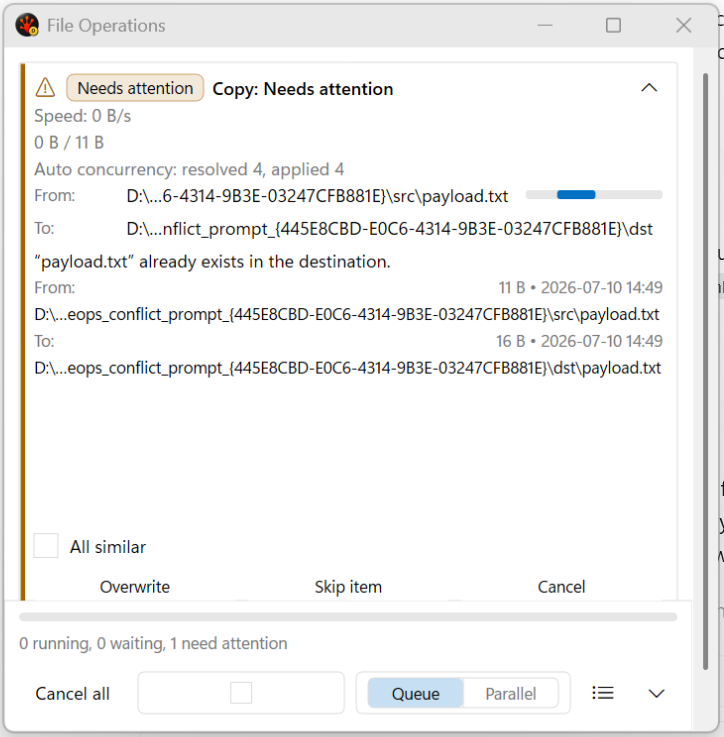
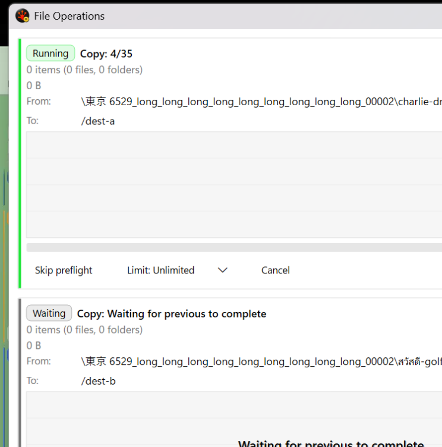
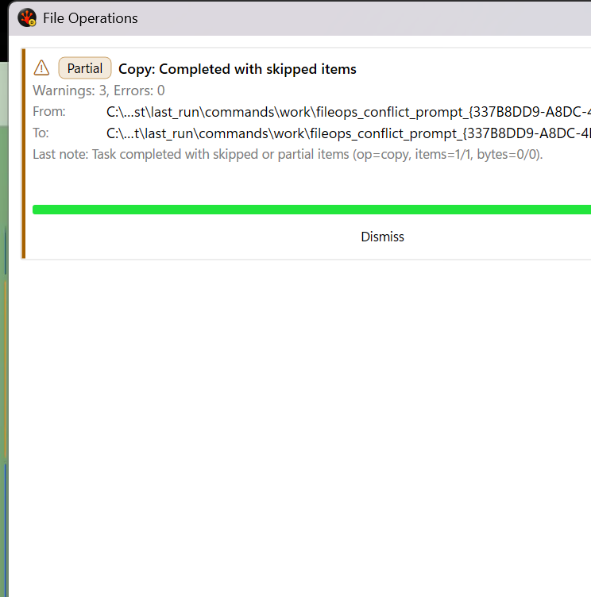

# File Operations Popup UI Contract

Last updated: 2026-07-10

This spec covers the Direct2D/DirectWrite File Operations progress popup surface in:

- `RedSalamander/FolderWindow.FileOperations.Popup.h`
- `RedSalamander/FolderWindow.FileOperations.Popup.cpp`

Engine execution, conflict semantics, pre-calculation, plugin contracts, and performance-validation
rules remain owned by `Specs/FileSystem/FileSystem_FileOperations.md`.

## Purpose

The popup is an operational surface for long-running copy, move, delete, and informational tasks. It
MUST make the current state legible at a glance, keep active controls stable while the task list
changes, and expose enough debug state for deterministic selftests without pixel inspection.

## Reference Captures

Documentation screenshots MUST be captured from the real product popup, not from the HTML mockup.
Current Debug x64 product captures:

- Current conflict and minimum-width footer: `Specs/UI/Images/FileOperationsPopup_Product_Conflict_2026-07-10.png`.
- Active running/waiting popup: `Specs/UI/Images/FileOperationsPopup_Product_Active_2026-07-09.png`.
- Completed partial-result popup: `Specs/UI/Images/FileOperationsPopup_Product_Partial_2026-07-09.png`.

## Regions

The popup has three visible regions:

- Title bar: standard captioned tool window, independently minimizable/restorable.
- Operations list: scrollable stack of task cards.
- Global footer: always visible, including footer-only mode.

Footer-only mode hides the operations list, persists through `SettingsStore`, resizes the window to
the footer-only minimum height, and restores the previous captured rectangle when details are shown
again. The compact rectangle uses the normal `FileOperationsPopup` placement key; the last expanded
rectangle uses `FileOperationsPopupExpanded` and MUST NOT be overwritten while footer-only mode is
active.

When no valid persisted placement is restored, the popup is centered over its valid owner and clamped to the
owner monitor work area. Placement changes size neither the popup nor its z-order/activation state. This uses the
shared owner-centering geometry contract; monitor-work-area lookup failure leaves the existing position intact.

## Footer

The global footer MUST include:

- Aggregate progress bar across active file-operation work.
- `Cancel all` or `Clear completed`, depending on active work.
- Auto-dismiss success/canceled toggle bound to `fileOperations.autoDismissSuccess`.
- `New tasks:` segmented control with `Queue` and `Parallel` segments.
- Status summary: `N running, M waiting, K need attention`, optionally with aggregate ETA and
  aggregate throughput.
- Compact/Expanded density toggle bound to `fileOperations.popupCompactDensity`.
- Right-aligned details chevron for footer-only collapse/expand.

Footer controls live outside the scrolled task-list viewport and MUST remain hit-testable there. The
Compact/Expanded density toggle MUST round-trip through canonical settings save even when it is the
only non-default file-operation setting.

The footer is an 88-DIP band with separate aggregate-progress, status-summary, and command rows.
The supported minimum client width is 480 DIP. At that width, every required control MUST retain a
positive, non-overlapping hit target. A localized label that does not fit, such as Auto-dismiss,
MUST fall back to its centered checkbox/icon presentation instead of clipping into another control.

The Queue/Parallel control MUST show both possible states and visually fill only the selected
segment. Queue and Parallel have separate `FooterQueueMode` hit targets carrying the desired state;
clicking the already-selected segment is a no-op rather than an inversion.

## Task Cards

Every file-operation card MUST resolve exactly one `TaskSnapshot::StatusKind` before drawing. The
same resolved status drives:

- header text,
- status glyph,
- status stripe,
- status chip,
- graph overlay,
- caption severity,
- footer counters,
- Windows taskbar state.

The left stripe and header chip are required for every non-`None` file-operation status. Tone mapping:

| Status | Tone |
|--------|------|
| Running, Calculating, Preparing | Accent |
| Waiting, Canceled | Neutral |
| Paused | Muted |
| Conflict, Partial | Warning |
| Failed | Error |
| Done | Ok |

The chip uses localized short labels and MUST NOT be the only status signal. Status must remain
readable without color through glyph and/or text.

In normal themes, `Ok` status MUST resolve through the scoped `fileOperations.successText` theme
color and MUST be visually distinct from the active `Accent` tone. High-contrast themes may map
`Ok` to the system/menu text color when that is required for contrast.

In high-contrast themes, the card-level stripe/chip/tone semantics remain present, and warning/error/
ok statuses retain a glyph plus text signal. The non-client caption status glyph is suppressed in
high contrast so system caption contrast is not compromised.

Queued file-operation cards MUST expose `Start now` before the task begins. The action releases only
that task's wait gate and MUST NOT flip the global footer Queue/Parallel setting. The footer MUST
expose a bulk `Pause all` command while any active started task is running and a bulk `Resume all`
command when started tasks are paused with no unpaused running tasks. Bulk pause/resume toggles only
the per-task manual pause state for started live tasks and MUST NOT clear queue gating or change the
global Queue/Parallel mode. Calculating/preparing tasks that have not started are not bulk-command
eligible and MUST NOT change a `Resume all` decision back to `Pause all`. Reorder controls remain backlog until the engine exposes an explicit
queue-order key.

Completed cards auto-collapse once when they first resolve to a finished state, unless auto-dismiss
removes them or the user already has a manual expanded/collapsed override for that task. The footer
Compact/Expanded density setting applies to every visible task card as a default display state, not
as a forced stored collapse; the per-card chevron can expand a compact-density row and restore the
card's normal actions without disabling later completed-card auto-collapse. Compact rows keep the
status signal and task name on one line, and show a mini progress meter plus localized percent text
only when a published byte/item denominator makes progress determinate. A row
with completed work but no denominator MUST NOT render a misleading `0%` meter. When at least two completed file-operation cards remain visible, the
popup groups them under `Completed (N)`, expanded by default. The group chevron hides/shows the
completed rows without dismissing them, and the group-level `Clear` command dismisses those completed
summaries. Animated group/card expand-collapse remains backlog.

## Progress Rules

Per-file progress has one home: the current file line. Copy/Move cards MUST NOT render a second
under-graph current-item bar. The under-graph progress region is reserved for exactly one whole-task
bar, or an indeterminate marquee during pre-calc/unknown-total work.

The footer aggregate bar uses live byte totals first and live item totals second. Finished cards may
remain visible when auto-dismiss is off, but all finished cards are excluded from live footer
counters, aggregate totals, need-attention totals, and Windows taskbar progress. Their completed
status remains on the individual card. Unknown active totals force the aggregate footer and Windows
taskbar model to indeterminate even when other active tasks have known totals.

Aggregate throughput includes only live Copy/Move rates. Aggregate ETA uses the matching determinate
task/rate set and MUST be hidden when any live Copy/Move task has unknown byte totals or lacks a
usable matching rate; throughput remains visible. Taskbar progress MUST continue to update from the
popup timer while the popup is hidden or minimized, without requiring a paint.

Displayed speed and ETA values are display estimates and MUST be safe for extreme callback-silence
decay. Before converting floating-point rates or ETA seconds to integer display values, the popup
MUST clamp non-finite/negative values to zero and saturate values above `uint64_t::max`. ETA MUST
not be computed from decayed byte rates below 1 B/s; those rates are treated as zero so the UI
returns to estimating instead of showing a phantom multi-century ETA.

## Completed Card Actions

Completed cards keep `Dismiss` as the primary flat action and expose recovery/navigation commands
from the `More...` menu. The current completed-card action set includes
`Open destination`, `Reveal item`, `Failed items`, `Show log`, and `Export issues`.
`Open destination` and `Reveal item` are available for completed copy/move tasks with resolved
destination data; `Open destination` navigates the destination pane to the completed destination
folder, while `Reveal item` navigates to the parent folder and selects the completed item when a
single revealable destination item is known. `Failed items` is available only when the completed
task has warnings or errors, and MUST open the real File Operations Failed Items pane so the user
can inspect skipped or failed entries without dismissing the card.

The task captures destination plugin ID, plugin short ID, and instance context when the operation is
accepted and the supplied destination filesystem matches that pane. Explicit provider filesystem
objects that do not belong to the pane MUST NOT inherit its identity. Completed navigation resolves
the qualified identity even if the pane later changes provider. Missing, stale, or mismatched
identity MUST fail recoverably and restore the pane's prior provider/context/path instead of
executing against the current provider. Provider changes navigate directly to the qualified target;
the UI MUST NOT visit or enumerate an intermediate provider root.

For built-in local-to-local **Exists** conflicts, the prompt withholds **Overwrite** while metadata
is pending and keeps it absent for a file-on-directory collision. A replaceable file collision adds
**Overwrite** only after metadata resolves. Cross-provider prompts retain their provider-defined
action set without depending on local Win32 metadata.

## Custom Speed-Limit Grammar

The custom speed-limit prompt uses the shared binary-throughput edit grammar. Empty input means
unlimited (`0`). A bare number means KiB/s. `B`, `K`/`KB`/`KiB`, `M`/`MB`/`MiB`,
`G`/`GB`/`GiB`, `T`/`TB`/`TiB`, and `P`/`PB`/`PiB` are accepted case-insensitively, with an
optional case-insensitive `/s` suffix. Both `.` and `,` are accepted as locale-independent decimal
separators; results round to the nearest byte and saturate at `uint64_t` maximum. Signed values,
multiple decimal separators, and unknown units are invalid.

The popup preserves its existing boundary policy and trims only the six ASCII whitespace characters
space, tab, carriage return, line feed, form feed, and vertical tab. Text emitted by the paired
throughput formatter (`GiB/s`, `MiB/s`, `KiB/s`, or `B/s`) MUST round-trip through the parser.

## Graph

The bandwidth graph samples smoothed display throughput at popup timer cadence. It MUST not visualize
callback silence as a trough when bytes later arrive in a burst.

The graph shows:

- recent throughput history,
- per-stream colored bands when concurrent transfer streams are present,
- the current effective smoothed bandwidth as a labeled marker.

The configured speed limit belongs in the speed-limit menu button/flyout, not as the graph marker.

In Rainbow theme, graph history keeps per-sample colors stable as samples scroll. It MUST NOT blink or
cycle historic samples by time.

## Motion

The popup resolves reduced-motion through the app theme's DxUi palette. When reduced motion is
enabled:

- Queue/Parallel selected-thumb movement snaps to the target segment instead of easing.
- Automatic popup resize snaps to the target rectangle instead of debouncing/easing. Footer-only
  collapse still snaps to the footer minimum, and expand still restores the captured rectangle.
- Graph status animation for calculating/preparing work is disabled.
- The graph latest-point easing is disabled; throughput history, rainbow/per-stream bands, and the
  current effective-bandwidth marker remain visible as static state.
- Every indeterminate global/task/file/conflict bar renders a stable centered segment instead of a
  moving marquee.

## Conflict Layout

Conflict prompts are inline on the affected card. Source and destination paths MUST be stacked in
full-width rows rather than side-by-side columns so long names keep useful width. The primary action
row exposes at most three buttons plus a `More...` menu for overflow actions.

When metadata is available from the source/destination `IFileSystemIO`, each stacked conflict row
shows compact size and modified-time metadata on the right side of the label row while keeping the
full-width ellipsized path on its own row. Modified times MUST convert the provider's UTC FILETIME to
local time and use the user's short-date/time formats. Provider metadata reads call
`GetFileBasicInformation` first and call `GetAttributes` only as a fallback when basic information
fails. Missing metadata is omitted rather than guessed. `Keep
Both` is not a current action; it requires engine support for choosing and retrying a unique
destination name before the popup may expose it.

Prompt identity and actions are published under the conflict-arbiter lock before decoration.
Metadata calls and diagnostic logging run outside that lock, and late results merge only when the
same owner/bucket/status/paths are still active. Decoration MUST NOT create an `IFileReader` or read
content. The built-in local provider may use `GetFileAttributesExW`; provider paths use metadata-only
`IFileSystemIO` calls and may leave size unknown.

The Failed Items/Issues pane has one close contract regardless of whether close originates from its
window chrome or the popup toggle: save view state and placement, hide (do not destroy) the pane, then
restore active-pane FolderView focus when focus belonged to the hidden pane.

## Debug Snapshot Contract

`PopupLayoutDebugSnapshot` is the non-pixel acceptance surface. New UI controls or durable visual
contracts MUST extend it when feasible. Current closeout fields cover:

- footer control count and overlap detection,
- selected-task button overlap detection,
- segmented Queue/Parallel visibility and current mode,
- separate Queue/Parallel rectangles and live hit targets,
- auto-dismiss visibility/state,
- minimum-width Auto-dismiss label fallback state,
- footer bulk Pause all / Resume all visibility and target action,
- compact-density toggle visibility/state plus normal hit-test reachability,
- footer-only details toggle placement,
- high-contrast state and color-blind-safe status signal coverage,
- reduced-motion state plus animation enablement for auto-resize, Queue/Parallel thumb, and graph
  status overlays,
- aggregate footer progress totals,
- aggregate ETA/throughput,
- taskbar progress state/value and timer-update count,
- status stripe/chip visibility, tone, and resolved theme color,
- queued Start now visibility,
- completed Open destination / Reveal item / Failed Items menu-action visibility,
- task collapsed/compact-row state, completed auto-collapse state, and compact progress visibility,
- completed-group visibility, expanded state, counts, group toggle/clear visibility, and per-task
  hidden-by-completed-group state,
- duplicate progress-bar absence,
- conflict stacked-path layout,
- conflict source/destination metadata visibility and size/date compare coverage,
- asynchronous popup-setting save generation/thread ownership and bounded flush coverage,
- graph current-bandwidth marker.

## Accessibility Backlog

The current popup remains a hand-rendered D2D surface with mouse hit testing. Keyboard navigation and
UI Automation/LiveRegion support are not complete. The preferred future path is to migrate
interactive controls into hosted `DxUi::WindowHost` controls once the visual/control set is stable,
then add focus-order and UIA pattern tests.
