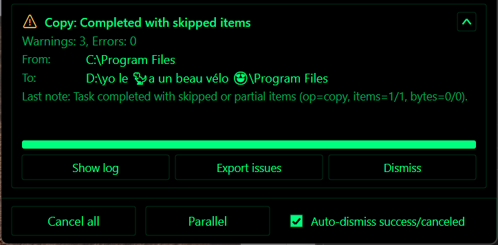

# File Operations (Copy/Move/Delete)

RedSalamander runs long operations in the background and shows progress in a dedicated UI.

## File Operations popup (UI tour)

The **File Operations** popup opens automatically when an operation starts. It is safe to keep using the main window while it runs. Closing the popup does **not** stop the operation.

### Footer controls (global)

- **Cancel all**: cancels every active/queued task (with confirmation).
- **Wait / Parallel**:
  - **Wait** runs tasks sequentially (a queue).
  - **Parallel** allows multiple tasks to run at the same time.
  - Parallel mode uses shared, bounded worker pools so thread count stays under control even with multiple in-flight operations.
  - Switching to **Wait** while several tasks are active pauses all but one at the next safe checkpoint.
- **Clear completed**: removes completed task summaries from the popup.
- The footer also shows a quick summary of how many tasks are running, waiting, or need attention.

### Each task card

Each task shows:

- Operation type (**Copy**, **Move**, **Delete**) and one clear status such as calculating, running, paused, waiting, needs attention, completed, partial, failed, or canceled
- **From** / **To** (or **Deleting**) paths
- Item/byte progress and “Remaining” time (when totals are known)
- Current file activity (including multiple in-flight files when copying/moving)
- Throughput graph colors in rainbow mode, weighted by each active stream's byte share so parallel copies show balanced color bands when streams progress evenly

Task controls (what you can click):

- **Collapse/expand**: hide/show details for that task.
- **Pause / Resume**: pauses the task at the next safe checkpoint.
- **Cancel**: cancels only that task.
- **Skip preflight**: skips the pre-calculation phase (see below).
- **Destination** *(Copy/Move, before the task starts)*: choose a different destination folder:
  - **Other panel** (the other pane’s current folder), or
  - a compatible folder from the destination pane’s **history**.
- **Speed Limit** *(Copy/Move)*: sets a per-task bandwidth cap:
  - **Unlimited**
  - presets: `1 MiB/s`, `5 MiB/s`, `10 MiB/s`, `50 MiB/s`, `100 MiB/s`, `1 GiB/s`
  - **Custom…** accepts inputs like `3KB`, `4MB`, `1GB` (optional `/s`).
- **More...** *(completed tasks with diagnostics)*: opens **Show log** and **Export issues** actions.
- **Dismiss**: removes a completed task summary from the popup.

### Informational task cards

Some background work is displayed as read-only **informational** cards in the same popup (for example **Compare Directories** and **Change Case**).
To avoid clutter, informational cards are created only if the operation takes longer than ~`700ms`.
They show the current path and basic progress counters, and can be dismissed when complete.

### Preflight / “Calculating…”

Some tasks start with a pre-calculation (“preflight”) scan that computes totals (bytes/items). This improves:

- total progress accuracy
- ETA / remaining time accuracy

For very large trees, preflight can take time; **Skip preflight** starts the operation without those totals.
When preflight is skipped, the popup still shows best-effort **completed files/folders** counts for the top-level selection, but totals and ETA/remaining time may be unavailable until the operation finishes.

### Conflicts (overwrite, retry, skip…)

If a task hits a conflict (destination exists, read-only, access denied, sharing violation, disk full, path too long, etc.), the task shows an inline prompt with action buttons such as:

- **Overwrite**
- **Retry**
- **Skip item**
- **Cancel**
- **More...** for rarer actions such as **Replace read-only** and **Skip all similar conflicts**

Use **All similar** to apply the selected non-retry decision to future conflicts of the same kind in that task.

## Copy and move between panes

These commands use the **focused pane** as the source and the **other pane’s current folder** as the destination:

- **Copy to other pane**: `F5`
- **Move to other pane**: `F6`

Notes:

- If both panes point to the same effective destination folder, RedSalamander blocks the operation to prevent accidental self-copy/self-move.
- If source/destination are different file-system contexts, RedSalamander uses a cross-filesystem bridge (read → write). Files can start copying as soon as their parent destination directory exists, while read-only destinations still reject writes.
- Clipboard paste and folder-picker move use the same File Operations task workflow as `F5`/`F6`, including the popup, conflict prompts, pause/cancel, and safe default overwrite policy.
- Providers that advertise an operation as unsupported block that command before a task starts.

## Delete vs permanent delete

- **Delete** (`Del` / `F8`): deletes to the Recycle Bin when supported by the active file system.
- **Permanent Delete** (`Shift+F8` / `Shift+Del`): asks for confirmation, then bypasses the Recycle Bin.

## Progress UI: tasks, pause, cancel, mode, speed limit

When an operation starts, RedSalamander creates a **task** and shows it in the File Operations popup:

- Pre-calculation (“pre-calc”) may run first to compute totals (bytes/items). You can **Skip** pre-calc.
- Tasks can be **Paused** and **Canceled**.
- Execution mode can be **Wait** (sequential queue) or **Parallel** (multiple tasks run concurrently).
- Copy/Move tasks support a per-task **Speed Limit**.

## Defaults and settings

### Preferences -> File Operations

This page owns host-wide defaults that apply to newly created tasks:

- **Enable pre-calculation scan**: turns the preflight tree walk on or off for new copy/move tasks.
- **Pre-calculation workers**: chooses the host worker budget (`1` to `8`) used by that preflight scan.
- **Default speed limit**: seeds new copy/move tasks with **Unlimited**, a preset (`1 MiB/s` through `1 GiB/s`), or a **Custom** throughput value such as `128KB`, `5MB`, or `1GB`.
- **Auto-dismiss successful tasks**: automatically clears completed tasks that succeeded or were canceled, and closes the popup when nothing remains.
- **Cross-FS bridge buffer (KB)**: sets the per-buffer size (`512` to `16384`) used by the host bridge when copying between different file systems. Two buffers are allocated per active bridged transfer.

The page also includes a reminder that plugin-owned settings stay under **Preferences -> Plugins -> File System**.

### Preferences -> Plugins -> File System

These plugin-owned settings control how the FileSystem plugin executes work:

- **Concurrency mode**: `Manual` uses the configured copy/move and delete budgets, while `Auto` resolves a budget from the source/destination storage characteristics at task start.
- **Copy/move max concurrency**: plugin default worker budget for copy/move tasks.
- **Delete max concurrency** and **Recycle Bin delete concurrency**: plugin default worker budgets for delete paths.
- **Recycle Bin batch size**: cap used when batching recycle-bin deletes through `IFileOperation::DeleteItems()`.
- **Search max directory walkers**: worker budget used by recursive name-only search directory walking.

### Per-connection and per-task overrides

- A non-zero **per-connection** copy/move override takes precedence over the FileSystem plugin default for tasks created through that connection.
- A **per-task** speed limit chosen in the File Operations popup overrides the global default for that task only.
- Global File Operations preferences affect newly created tasks; they do not retune already-running operations.

## Diagnostics (logs and issue reports)

The popup can open/create files under your user profile:

- File-operations daily logs: `%LocalAppData%\\RedSalamander\\Logs\\FileOperations-YYYYMMDD.log`
- Per-task exported issue reports: `%LocalAppData%\\RedSalamander\\Logs\\FileOperations-Issues-Task...txt`

Advanced logging options (retention and verbosity) are in Preferences → **Advanced** → **File Operations**.

## Failed items / issues pane

When operations encounter errors, they can be reviewed in the issues UI:

- Toggle: **View → File Operations Failed Items** (default `Ctrl+J`)
- Partial move failures explicitly note when the source was preserved and a partial copy was left at the destination, so both locations can be reviewed before retrying or cleaning up.

## Properties

Open item properties with **Files -> Properties** or `Alt+Enter`.

Properties work through the active file-system plugin. Local files show general identity, path, type, size, timestamps, attributes, shortcut/link/reparse targets when present, and named streams when present. Remote/cloud plugins can expose their own metadata through the same dialog. `Ctrl+C` copies the full property text; `Esc` closes the dialog.

## Clipboard copy/paste (Windows Explorer format)

Folder view supports a basic Explorer-style clipboard for **Windows paths**:

- `Ctrl+C`: copy selection to the clipboard as `CF_HDROP`
- `Ctrl+X`: cut selection to the clipboard as `CF_HDROP` with the Explorer move drop effect
- `Ctrl+V`: paste into the current folder (copy)
- **Paste Shortcut**: create `.lnk` shortcuts in the current local folder for file paths on the clipboard, using unique shortcut names

Limitations:

- The clipboard format is Windows-path based, so file cut and Paste Shortcut are available for local `file` file-system paths.
- Clipboard paste queues a File Operations copy task; destination conflicts are handled by the same inline conflict prompt as pane copy.

## Creating files from ShellNew templates

Files -> New lists Windows ShellNew templates for local folders. Template entries prompt for a new file name, create the file from the selected `NullFile`, `Data`, or `FileName` template, refresh the pane, and focus the created item when it is visible. ShellNew command templates are not invoked by this safe path.

## ZIP Pack / Unpack

Use **Files -> Pack** (`Alt+F5`) to create a ZIP archive from the selected local files and folders, or the focused item when nothing is selected. Use **Files -> Unpack** (`Alt+F6`) on a focused or selected ZIP archive to extract it to a destination folder.

Pack writes deterministic stored ZIP entries, preserves selected empty directories, and reports the created archive. Unpack validates archive entry paths before writing so unsafe absolute, parent-relative, drive-qualified, or alternate-stream paths are rejected.

## Drag & drop

- Dragging items **between panes** queues a task and uses the same progress UI as `F5`/`F6`.
- Dragging to external apps (Explorer, editors, …) uses standard Windows drop formats when possible.
