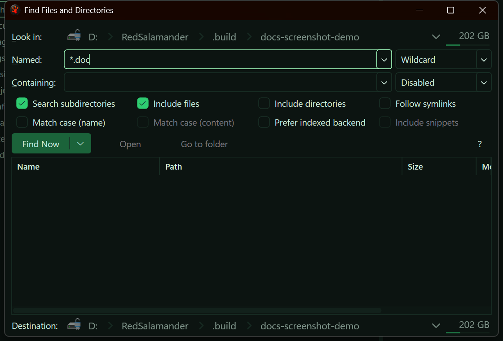

# Find Files and Directories

Use **Find Files and Directories** to search from the current pane without leaving your current location.

Open it with:
- **Commands → Find Files and Directories…**
- `Alt+F7`

## Scope

The dialog starts from the focused pane:
- the current filesystem plugin,
- the current mounted context, if any,
- the current path as the search root.

Each command invocation opens an independent modeless Find window, so you can keep multiple searches open for different panes or roots.

## Search options

You can search by:
- **Name** using wildcard, literal, or regex matching
- **Content** using text literal or text regex matching

Common options:
- recursive search,
- include files,
- include directories,
- follow symlinks,
- case-sensitive name matching,
- case-sensitive content matching,
- prefer indexed search,
- request text snippets.

If both name and content are enabled, a result must match both.

## Result actions

The result list updates while the search is running.

Actions:
- **Find Now** replaces the current result set
- The **Find Now** split-button menu offers **Append**, **Intersect**, and **Subtract** once the result list contains items
- **Append** adds new matches
- **Intersect** keeps only matches that are already in the result set
- **Subtract** removes newly found matches from the current result set
- **Cancel** stops the current search

When recursive search finds matches below the root, the Path column shows the containing subfolder relative to the search root. Result rows use the shared grid density, so compact mode reduces the row spacing for one-line results.

Double-click behavior:
- file: open it with the normal host flow
- directory: navigate to that directory
- **Focus Item**: navigate to the matched item parent and focus the matched item when possible

Keyboard shortcuts in the result list:
- `Enter`: open the selected result
- `Space`: focus the selected result in its parent folder

Result-list shortcuts use the configured command bindings. The defaults include `Ctrl+C` for shell copy, `Ctrl+X` for shell cut, `F3`/`F4` for the configured viewer/editor, `F5`/`F6` for copy/move to the other pane, `Del` for Recycle Bin delete, and `Shift+Del` for permanent delete after confirmation.

The `?` button summarizes these actions and shows the current destination folder used by copy/move-to-other-pane. The help message dims the Find window while keeping the content behind it visible, and closes immediately with `Esc` or its close button; it does not require moving the mouse to the title bar or another part of the window.

## Backends

RedSalamander chooses the backend for the current pane:
- when **Prefer indexed backend** is enabled for local `file:` locations, RedSalamander may use the Windows search service or local index, then fall back to a direct scan
- when **Prefer indexed backend** is disabled for local `file:` locations, RedSalamander uses a direct live scan, including recursive subdirectories
- other plugins may provide their own native search
- when native search is unavailable, the host falls back to a direct scan when possible

The status line shows the active backend and any degradation warning, such as content search not being available for the current plugin.

While an indexed or service-backed search is active, RedSalamander adds a second backend-status line that reports the search database and synchronization state. It shows the store readiness and sync phase (for example `db Ready / Watching`), the number of roots that have finished synchronizing, the active root being indexed, and the query execution mode (such as direct database or live-scan fallback) with a reason when it has fallen back. Until that information arrives, the line reads `db status pending`, or `db status unavailable` if the service could not be reached. This line lets you see whether a result set came from the up-to-date index or from a slower live scan because the database was not yet ready or current.

### Debug and Release run separate search services

The search service has independent identities per build, so a Debug build of RedSalamander and a Release build use different services that do not share index state:

- the Debug service registers as `RedSalamanderSearchService.Debug` and stores its index under `%ProgramData%\RedSalamander\SearchIndex.Debug`,
- the Release service registers as `RedSalamanderSearchService` and stores its index under `%ProgramData%\RedSalamander\SearchIndex`.

These roots are kept isolated on disk, so starting one build never touches the other build's database. If you run both builds, expect each to warm up and maintain its own index independently — a root that is already indexed in one build will still appear unsynchronized the first time you search it in the other.

## Saved state

The dialog remembers:
- recent roots,
- recent name and content patterns,
- the last-used options,
- window placement.

To reset this history manually, remove the `search` section from the settings file and optionally remove `windows.FindFilesWindow`. See [Settings File & Advanced Configuration](SettingsFile.md).
