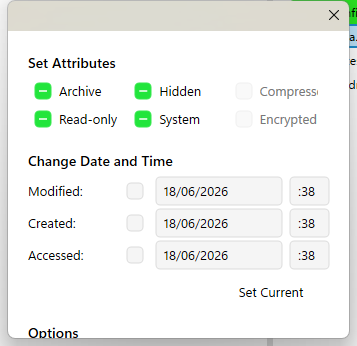
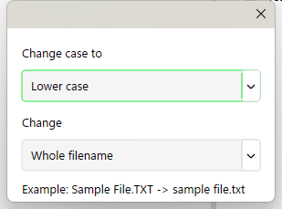
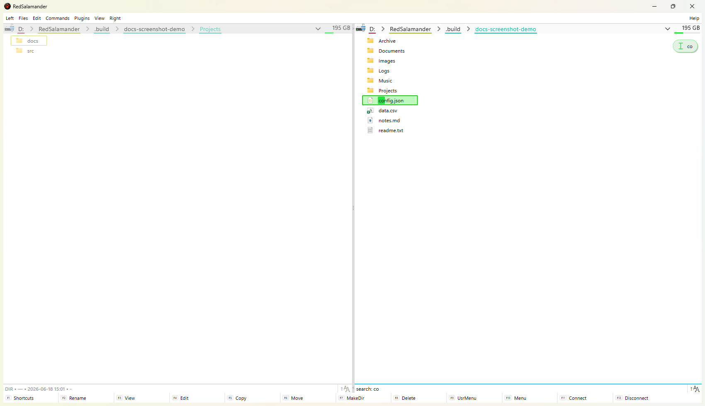
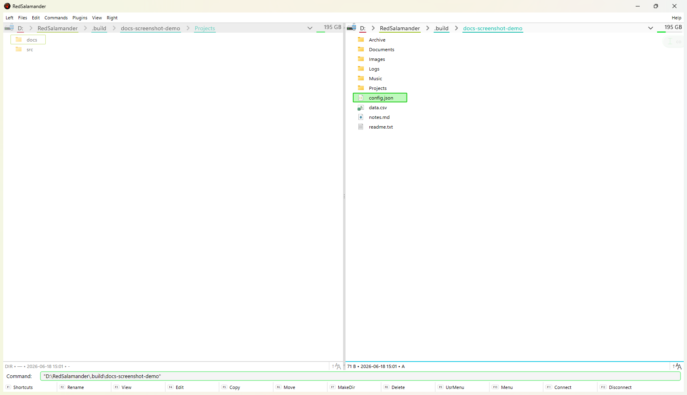

# Main Window & Panes

RedSalamander is a **dual-pane** file manager:

- **Left pane** and **Right pane** each have an optional Navigation bar, Folder view, optional Filter bar, and optional Status bar.
- A splitter between panes controls the width ratio.
- Most commands apply to the **focused pane** (the one that currently has keyboard focus).

## Panes, focus, and “other pane”

Some actions explicitly use both panes:

- **Copy to other pane** (`F5`): copies the focused pane selection into the other pane’s current folder.
- **Move to other pane** (`F6`): moves the focused pane selection into the other pane’s current folder.

Pane management:

- **Swap panes** (`Ctrl+U`): swaps the left/right locations.
- **Maximize/Restore pane** (`Ctrl+F11`): temporarily zooms the focused pane.

## Navigation bar (per pane)

The Navigation bar is the strip above the Folder view:

- **Drive/Menu**: click to open the plugin-provided menu (drives, known folders, WSL, …).
- **Path/Breadcrumb**: shows the current location.
- **History**: opens the folder history dropdown.
- **Disk info** (when available): shows total/used/free and a usage bar; may provide disk actions.

Disk actions are exposed by the active file-system plugin. For local `file:` drives, the disk area can provide Windows drive actions such as **Disk Properties** and **Disk Cleanup**.

## Folder view (per pane)

Folder view shows items in a grid with icons.

Common interactions:

- `Enter`: open a folder / execute a file (see [Navigation & Path Syntax](NavigationAndPaths.md))
- `F3`: open the focused file in a viewer (see [Viewers](Viewers.md))
- `F2`: rename
- `Alt+Enter`: properties
- `Shift+F10` or the **Apps/Menu** key: open the item context menu
- `Ctrl+F12`: filter the current folder (pane filter dialog)
- Type-to-search: pressing printable keys jumps focus to the first item whose name starts with what you have typed and highlights the matching prefix. `Backspace` edits the typed text (and clearing it exits the search), `Up`/`Down` step between matches, and `Esc` exits the search.
- Mouse: multi-select, drag & drop

Display and sort (defaults):

- `Alt+2`: Brief mode
- `Alt+3`: Detailed mode
- `Alt+4`: Extra Detailed mode
- `Alt+5`: Thumbnails mode
- `Alt+6`: Preview Pane mode
- `Ctrl+F2`: Sort = None
- `Ctrl+F3..F6`: Sort by Name/Ext/Time/Size

Brief keeps the pane dense for keyboard work, Detailed adds common metadata,
Extra Detailed gives each item a second metadata line, and Thumbnails uses
larger visuals for image-heavy folders.

### File properties

Open item properties with `Alt+Enter` or **Files -> Properties**.

The properties dialog can show local or plugin-provided fields: general identity, path, type, size, timestamps, attributes, and named streams when exposed by the active file system. `Ctrl+C` copies all visible property text; `Esc` closes the dialog.

### Selection helpers

- `Ctrl+A`: select all items in the focused pane.
- `Esc`: clear the current selection.
- `Ctrl` + the key left of `Backspace`: open the select-by-mask dialog.
- `Ctrl` + the key right of `0`: open the unselect-by-mask dialog.
- `Ctrl+Shift` + those same keys: select/unselect same extension.
- `Ctrl+Shift+F5`: save the current selection.
- `Ctrl+Shift+F6`: restore the saved selection.
- `Alt+Up` / `Alt+Down`: jump to the previous/next selected item.
- The **Edit** menu also exposes **Invert Selection**, **Hide Selected Names**, **Hide Unselected Names**, and **Show Hidden Names**.

### View options

- **Left/Right → Show → Hidden Files**: toggle display of hidden items (hidden items use a dim icon when shown).
- **Left/Right → Show → System Files**: toggle display of system items.
- **Left/Right → Show → File Extensions**: toggle displayed file extensions in the named pane without changing real file names or paths.
- **Left/Right → Thumbnails**: toggle thumbnail-sized visuals in the named pane. Thumbnails load in the background and fall back to normal file/folder icons when unavailable.
- **Left/Right → Preview Pane**: preview the named pane's focused item in the opposite pane. The opposite pane shows Folder and Preview tabs; selecting Folder keeps that pane browsable, while selecting Preview shows the current preview. Closing preview removes the tabs and restores the normal pane.
- **Left/Right → Filter Bar**: show or hide the named pane's persistent filter summary.
- **Left/Right → Navigation Bar**: show or hide the named pane's navigation bar. Address-bar commands show it automatically before focusing the address edit.

## Status bar (per pane)

The optional status bar shows:

- Selection summary (files/folders/bytes)
- A sort indicator you can click to open the Sort menu

Toggle:

- **Left/Right → Status Bar**

## Function bar

The Function bar shows the current `F1..F12` bindings (including modifiers).

Toggle:

- **View → Function Bar**

Default unmodified function keys:

| Key | Command | Behavior |
| --- | --- | --- |
| `F1` | Display Shortcuts | Opens the shortcut/help window for the current command set. |
| `F2` | Rename | Renames the focused item, or opens Batch Rename when multiple items are selected. |
| `F3` | View | Opens the primary viewer association for the focused file. |
| `F4` | Edit | Opens the editor association for the focused file. |
| `F5` | Copy | Copies the selection to the other pane. |
| `F6` | Move/Rename | Moves the selection to the other pane, or renames when the command context requires it. |
| `F7` | Make Directory | Creates a folder in the focused pane. |
| `F8` | Delete | Deletes the selection using the Recycle Bin when supported. |
| `F9` | User Menu | Opens configured external commands. |
| `F10` | Pane Menu | Opens the pane/main menu from the keyboard. |
| `F11` | Connect | Connects a network drive from local `file:` panes. |
| `F12` | Disconnect | Disconnects a network drive from local `file:` panes. |

## Menu bar

Toggle:

- **View → Menu Bar**

## Command surface map

RedSalamander exposes most behavior in more than one place: menu bar, context menu, function bar, and configurable keyboard shortcuts. The command names below are the user-facing menu surfaces to check when a feature appears to be missing.

### Left and Right menus

The **Left** and **Right** menus target a named pane, even when the other pane has focus.

- **Change Drive** opens the named pane's drive/plugin/known-folder menu.
- **Go to** includes Back, Forward, Parent Directory, Root Directory, Path from Other Panel, and Hot Paths.
- **Display modes** switch between Brief, Detailed, Extra Detailed, Thumbnails, and Preview Pane.
- **Sort by** supports None, Name, Extension, Time, Size, and Attributes.
- **Show** toggles Hidden Files, System Files, File Extensions, Filter Bar, Navigation Bar, and Status Bar.
- **Maximize/Restore Pane**, **Swap Panes**, **Refresh**, and **Filter** control the pane layout and current folder view.

### Files menu

The **Files** menu operates on the focused pane selection or focused item.

- Opening: Open/Execute, View, View Width, Alternate View, View With, Edit, Alternate Edit, Edit With, and Edit New File.
- File operations: Copy, Move/Rename, Rename, Batch Rename, Delete, Move to Recycle Bin, Permanent Delete, Pack, Unpack, and New Folder.
- Inspection: Properties, Context Menu, Context Menu for the current directory, Security, Change Attributes, and Change Case.
- Creation: **New** lists Windows ShellNew templates for local folders when templates are available.

Notes on the less obvious opening entries:

- **View Width** adjusts the width of the view rather than opening a file.
- **Alternate View** and **Alternate Edit** open the focused file with the configured *alternate* viewer/editor instead of the primary one.
- **View With** and **Edit With** let you pick a viewer or editor for the focused file at the moment of opening, rather than using the default association.
- **Edit New File** creates a new empty file and opens it in the editor.

Batch Rename is covered in detail in [Batch Rename](BatchRename.md).

### Edit menu

The **Edit** menu covers clipboard and selection workflows.

- Clipboard: Cut, Copy, Paste, Paste Shortcut.
- Text path helpers: Copy Path and Name, Copy Name, Copy Path, and Copy UNC Path and Name.
- Selection: Select, Unselect, Invert Selection, Select All, Unselect All, Restore Selection, Select Next, and Select + Calculate Directory Size + Next.
- Advanced selection: Save Selection, Load Selection, Select/Unselect Same Extensions, Select/Unselect Same Names, Hide Selected Names, Hide Unselected Names, Show Hidden Names, and jump to previous/next selected name.

Notes on the selection entries:

- **Select + Calculate Directory Size + Next** selects the focused item, calculates the occupied size of selected directories, and advances to the next item, so you can sweep down a list while accumulating folder sizes.
- **Save Selection** records the current selection so you can return to it later, while **Restore Selection** and **Load Selection** are the same command and reapply that saved selection (the same pair reached by `Ctrl+Shift+F5` / `Ctrl+Shift+F6`).

### Commands menu

The **Commands** menu contains multi-step tools and integration commands.

- Navigation and search: Change Directory, Find Files and Directories, Show Folders History, Quick Search, and Hot Paths through the Change Drive menu.
- Comparison and reporting: Compare Directories, Calculate Occupied Space, Make File List, List of Opened Files, and Shared Directories.
- Shell and external integration: Connect/Disconnect Network Drive, Connections Manager, Command Shell, Bring Current Directory/Filename to Command Line, Pane Menu, Reread Associations, User Menu, and Open File Explorer for the current folder or known folders.
- Link handling: Go to Shortcut or Link Target follows local `.lnk`, local `file:` `.url`, junction, mount point, and directory symlink targets where pane navigation can represent the target.

**Pane Menu** here opens the application's pane/main menu from the keyboard, the same action bound to `F10` in the function bar.

### Plugins, View, and Help menus

- **Plugins** opens Plugin Manager and lists plugin-provided dynamic commands.
- **View** switches theme, fullscreen, menu/function bars, File Operations Failed Items, pane focus, and Preferences.
- **Help** opens the shortcut display, external documentation, and About dialog.

A few **View** and **Help** entries are easy to overlook:

- **View → Toggle Fullscreen** hides the title bar and frame so the panes fill the whole monitor; run it again, or press `Esc` while fullscreen is active, to restore the normal window. It has no default keyboard shortcut, but you can assign one (see [Keyboard Shortcuts](KeyboardShortcuts.md)).
- **View → Window Menu** opens the standard Windows system menu for the application window (Restore, Move, Size, Minimize, Maximize, Close). It targets the window itself, unlike **Pane Menu** (`F10`), which opens the application's pane/main menu.
- **Help → External Help** opens the online RedSalamander documentation in your default browser.

### Context menus

The folder-view context menu mirrors the most common item commands: Open, Open With/View With, View Space for folders, Delete, Move, Rename, Copy, Paste, and Properties. Additional entries can come from the active file-system plugin or Windows shell integration.

## Useful commands

- **Commands → Connect Network Drive…** (`F11`) / **Disconnect…** (`F12`) *(Win32 `file:` pane only)*
- **Commands → Find Files and Directories…** (`Alt+F7`) opens the modeless search window for the focused pane. See: [Find Files and Directories](FindFiles.md)
- **Commands → List of Opened Files** (`Alt+F11`) shows viewer, editor, and Preview pane entries and can focus the source item from the list.
- **Commands → Shared Directories…** (`Ctrl+Shift+F9`) lists local Windows disk shares, opens reachable share paths in the focused pane, and links to Windows Shared Folders management.
- **Commands → Command Shell**: opens a shell in the current location when possible
- **Commands → Bring Current Directory/Filename to Command Line**: opens the pane command-line input and inserts quoted local paths for execution
- **Commands → Open File Explorer → Current Folder** (`Shift+F3`)

## Dialog and command screenshots

Captured from the running Release build against generated, non-sensitive demo content.

### Change Attributes (`Ctrl+F8`)

### Change Case (`Ctrl+F7`)

### Quick Search (`Shift+Space`)

Type a prefix to highlight and jump to matching names; the match query and `search:` status appear at the lower right.

### Command line (`Ctrl+Space` / `Ctrl+Enter`)

