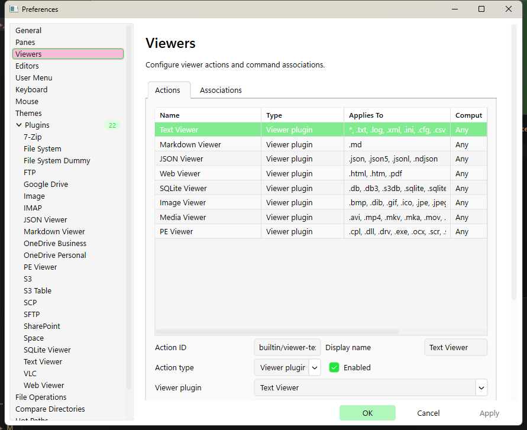

# Preferences

Open Preferences from:

- **View → Preferences…**
- Tip: **Hot Paths** can also be opened directly with `Shift+F9`.

## How Preferences works

- The dialog is modeless (you can keep using the main window behind it).
- **OK**: apply changes and close.
- **Apply**: apply changes without closing.
- **Cancel**: discard pending changes and close.

## External settings changes

- If the main settings file changes on disk and Preferences has no unsaved edits, the dialog reloads from the live app settings automatically.
- If Preferences has unsaved edits, it warns you and lets you choose **Reload from disk** or **Keep editing**.
- If you keep editing, the dialog becomes stale; the next **OK** or **Apply** asks whether to **Overwrite disk**, **Reload from disk**, or **Cancel**.
- If RedSalamander finds an unsupported settings schema version, such as v15 when v16 is required, it backs up that settings file, restores defaults, and shows a warning that the old file was not migrated automatically.
- Theme previews are cancelled when an external reload is applied, and the dialog itself switches to the newly applied theme.
- The modal plugin configuration editor follows the same reload/conflict rules.

## Pages

The left tree contains:

- **General**: common app behavior.
- **Panes**: default pane display/sort behavior, visibility options, and history size.
- **Viewers**: viewer Actions and Associations for `F3`, `Alt+F3`, and View With.
- **Editors**: editor Actions and Associations for `F4`, `Ctrl+Shift+F4`, `Shift+F4`, and Edit With.
- **User Menu**: external command entries shown by `F9` and the Commands -> User Menu popup.
- **Keyboard**: shortcut bindings for Function Bar and FolderView commands.
- **Mouse**: placeholder (not implemented yet).
- **Themes**: theme selection, user-theme editing, and theme file management.
- **Plugins**: enable/disable plugins, configure plugins, and run plugin tests.
- **File Operations**: host-wide defaults for pre-calculation, default copy/move speed limit, and cross-filesystem bridge buffering.
- **Compare Directories**: default options used by the Compare Directories window.
- **Hot Paths**: bookmark folder paths for quick access (`Ctrl+1`..`Ctrl+0`).
- **Monitor**: RedSalamanderMonitor display and event-filter defaults.
- **Advanced**: expert settings such as diagnostics and cache limits.

Tip: Plugins also appear as child nodes under **Plugins** when a plugin exposes configurable fields.

## Page option reference

Use this section as the quick map for options that are easy to miss when scanning the dialog.

### General

- **Show menu bar** and **Show function bar** control the two main chrome strips. The same toggles are available from the **View** menu.
- **Show splash screen** displays a startup splash only when launch takes longer than roughly `300ms`.
- **Language** can follow the Windows display language (**System Language**) or force **English**.
- **Compact mode** uses denser DxUi spacing for menus, popup lists, and Preferences cards.
- **Animations** can follow the system reduced-motion setting or be forced **On** / **Off**.
- **Window backdrop** chooses the DWM backdrop policy for supported windows: Default, None, Mica, Mica Alt, or Acrylic.

### Panes

Settings are split into **Left pane** and **Right pane** columns so each side can have different defaults.

- **Display**: Brief, Detailed, Extra Detailed, or Thumbnails.
- **Sort by** and **Direction**: None, Name, Extension, Time, Size, Attributes; Ascending or Descending.
- **Status bar**: show or hide the pane status strip.
- **History size**: maximum remembered folders for that pane's history dropdown.
- **Thumbnail size**: Small, Medium, Large, or Extra Large when the pane is in thumbnail mode.
- **Display hidden files and folders** and **Display system files and folders** set the default visibility policy.

### Viewers and Editors

Viewers and Editors have the same mental model:

- **Associations** decide which action applies to `F3`, `Alt+F3`, `F4`, `Ctrl+Shift+F4`, `Shift+F4`, **View With**, and **Edit With**.
- Rules can match extension, wildcard/pattern rows, the default `*` row, and optional computer-name filters.
- **Actions** define an internal plugin action or an external executable with arguments, working directory, enabled state, extension filter, and computer filter.
- **Add / Update**, **Remove**, and **Reset to Defaults** manage the selected mapping.
- The test field resolves a sample path and reports which rule was selected.

### User Menu

- Entries appear in **Commands -> User Menu** and on `F9`.
- Each entry can define executable, arguments, working directory, enabled state, extension filters, and computer-name filters.
- Multi-selection entries can use the selected-paths file macro so long command lines do not overflow Windows command-line limits.

### Keyboard

- **Scope** filters the command list by command family; **All** shows every known command.
- Columns show command name, shortcut, and scope.
- **Assign...** records the next pressed shortcut. `Esc` cancels capture.
- Conflicts are handled in-place with **Replace** or **Swap** when both commands can exchange shortcuts.
- **Remove**, **Reset to Defaults**, **Import...**, and **Export...** manage bindings as JSON.

### Mouse

The page is present as a placeholder. Mouse behavior is currently the built-in folder-view and viewer behavior; there are no user-editable mouse bindings yet.

### Themes

- Choose a built-in, file-based, or user theme from **Theme**.
- User themes have **Name**, **Base**, and a key/value color override table.
- **Pick...**, **Set**, and **Clear** edit the selected color key.
- **Apply Temporarily** previews without committing; **Cancel** restores the previous theme.
- **Duplicate**, **Load From File...**, and **Save Theme...** manage `*.theme.json5` files.
- Built-in and disk-loaded themes are read-only until duplicated/imported as user themes.

### Plugins

- The root page lists plugin name, type, origin, and id.
- Embedded, optional, and custom plugins can be enabled/disabled unless the active file-system plugin is currently in use.
- **Custom plugin paths** load additional DLLs when **Apply** is clicked.
- **Configure...** opens the selected plugin's schema-backed configuration editor when the plugin exposes one.
- Child pages under **Plugins** expose plugin-specific settings such as File System concurrency, cloud profile defaults, or viewer settings.

### File Operations

- **Enable pre-calculation scan** controls whether new copy/move tasks scan the tree first for totals and ETA.
- **Pre-calculation workers** chooses `1` to `8` background workers for that scan.
- **Default speed limit** seeds new copy/move tasks with Unlimited or a preset from `1 MiB/s` through `1 GiB/s`.
- **Custom limit** accepts values like `128KB`, `5MB`, or `1GB`.
- **Cross-FS bridge buffer (KB)** controls the per-buffer size used when copying between different file-system plugins. Two buffers are allocated per active transfer.

### Compare Directories

- **Keep identical items** retains identical rows in memory so the compare window can later toggle **Show Identical Items**.
- **Show Identical Items** makes identical rows visible by default and requires **Keep identical items**.
- **File patterns** and **Directory patterns** define default ignore patterns for compare scans.

### Hot Paths

- Ten slots map to `Ctrl+1` through `Ctrl+0`.
- Each slot has **Path**, **Label**, and **Show in Change Drive menu**.
- **Open preferences page when assigning** controls whether assigning a hot path from the pane immediately opens Preferences for editing the label/menu flag.

### Advanced

- **Windows Hello for Connections** controls automation bypass, insecure TLS automation allowance, and the Hello reuse timeout.
- **File Operations** controls diagnostics retention and Info/Debug verbosity.
- **Cache** controls directory-info cache size, watcher count, and recently watched folder retention.
- **Open settings file** opens the current user's main JSON settings file with the default JSON editor.

### Monitor

- **Display** controls RedSalamanderMonitor toolbar, line numbers, always-on-top, ids, and auto-scroll defaults.
- **Filter** appears as one card before the settings-file link and controls the RedSalamanderMonitor filter preset plus the Text, Error, Warning, Info, Perf, and Debug message-type toggles. There is no numeric mask field in Preferences; choose **Custom** and use the toggles for custom combinations.
- **Open monitor settings file** is the final card and opens the current user's RedSalamanderMonitor JSON settings file with the default JSON editor.
- Apply or OK saves Monitor page changes to the `RedSalamanderMonitor` settings file, not the main RedSalamander settings file.

## Common workflows

### Viewers

- Use **Associations** to choose which viewer action `F3` and `Alt+F3` use for an extension, pattern, default `*` row, or computer-specific override.
- Use **Actions** to configure internal viewer-plugin actions or external viewer programs.
- Test a file path on the page to see the resolved action and why it was chosen.
- View With lists the configured viewer actions that apply to the focused file and current computer.

### Editors

- Use **Associations** to choose which editor action `F4`, `Ctrl+Shift+F4`, and `Shift+F4` use for an extension, pattern, default `*` row, or computer-specific override.
- Use **Actions** to configure external editor programs.
- Edit New shows an Editor combo filtered by file extension, computer name, configured action availability, and executable availability.
- Apply or OK saves viewer/editor Actions and Associations to the main settings file.

### User Menu

- Configure the ordered external command entries shown by `F9` and **Commands -> User Menu**.
- Each entry can define an executable, arguments, working directory, enabled state, extension filter, and computer-name filter.
- Commands use the same macros and applicability rules as viewer and editor actions, including selected-paths file support for multi-selection workflows.

### Keyboard

- Search bindings by command name or shortcut text.
- Assign or remove shortcuts.
- Import/export shortcut bindings as JSON.
- Reset shortcuts to defaults.
- Resolve conflicts directly in the page by replacing or swapping bindings when prompted.

### Themes

- Switch between built-in, file-based, and user themes.
- Create or duplicate a user theme from an existing theme.
- Edit color overrides while still seeing inherited values.
- Preview a theme immediately with **Apply Temporarily**.
- Load/save `*.theme.json5` theme files.

### Plugins

- Search installed plugins by name, id, or type.
- Enable/disable plugins.
- Add/remove custom plugin DLL paths.
- Run **Test** for the selected plugin or **Test All** for the whole set.
- Use the **Plugins** root page for the plugin list, then open child nodes for per-plugin settings.

### File Operations

- Turn the copy/move pre-calculation scan on or off.
- Choose the pre-calculation worker budget (`1` to `8`) used before copy/move starts.
- Set the default per-task speed limit for new copy/move operations using presets or a custom value.
- Tune the cross-filesystem bridge buffer size used when the host copies between different file-system implementations.
- Use **Plugins → File System** for plugin-owned concurrency, recycle-bin batching, and search-walker settings; those are not duplicated on the File Operations page.

### Hot Paths, Monitor, and Advanced

- **Hot Paths** lets you edit the label, target path, and **Show in Change Drive menu** flag for each of the 10 slots.
- **Monitor** exposes RedSalamanderMonitor display/filter defaults and a link to the monitor JSON settings file.
- **Advanced** exposes file-operations diagnostics, cache-related settings, and a link to the current main JSON settings file.
- Some rarely used settings still remain JSON-only; see [Settings File & Advanced Configuration](SettingsFile.md).

## Screenshots (key pages)

### Viewers

### Keyboard

### Themes

### Plugins

## Screenshot backlog

The main overview, Viewers, Keyboard, Themes, and Plugins pages already have screenshots. The remaining Preferences pages that should be captured next are tracked in [docs/res/README.md](res/README.md): General, Panes, Editors, User Menu, Mouse placeholder, File Operations, Compare Directories, Hot Paths, Advanced, and at least one plugin-specific child page.
