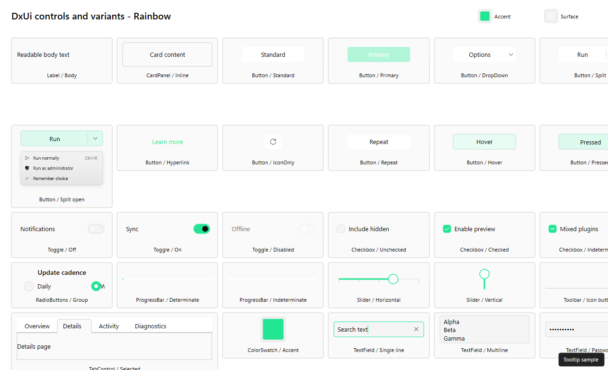
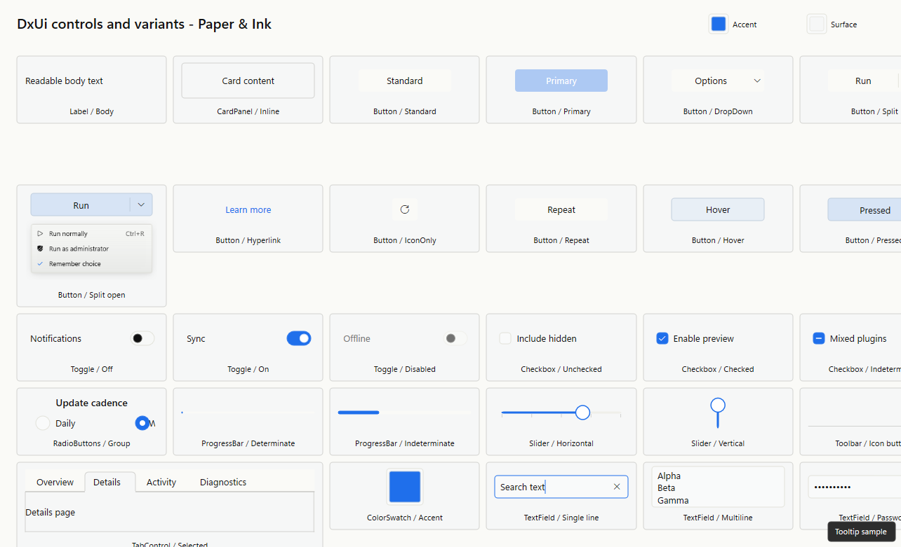

# Themes

RedSalamander is theme-aware across the main chrome, panes, navigation bars, file operations UI, dialogs, and viewers.

## Control galleries

The generated control galleries show the shared DxUi controls rendered under each built-in theme and each shipped `Specs/Themes/*.theme.json5` theme.

### Button State Contrast

The button contrast audit shows standard and primary buttons across idle, hover, pressed, keyboard-focus, and disabled states. Enabled text is marked against WCAG normal-text thresholds; disabled controls are shown but marked exempt.

### Light

### Dark

### Rainbow

### High Contrast

### Forest Mist

### Neon Tokyo

### Paper & Ink

### Retro Terminal

### Solar Flare

### Ugly

## Quick theme switching

Use **View → Theme**:

- **System**
- **Light**
- **Dark**
- **Rainbow**
- **High Contrast (App)**

Note:

- **High Contrast (System)** is shown as an indicator when Windows high-contrast is enabled.

## Theme examples

The following screenshots were captured from the running application using different built-in themes.

## Theme sources

RedSalamander supports theme files:

- `Themes\*.theme.json5` next to `RedSalamander.exe`

It also supports user themes stored in your settings file as `user/*` themes.

## Preferences → Themes

- Select a built-in, file-based, or user theme.
- Create a new user theme or duplicate an existing theme into a user theme.
- Edit explicit color overrides while inherited values remain visible.
- Preview a theme immediately with **Apply Temporarily**.
- Load/save `*.theme.json5` theme files.

## Notes

- Cancelling Preferences after a temporary preview restores the previously applied theme.
- The main **View → Theme** menu is the fastest way to switch between the standard built-in themes.
